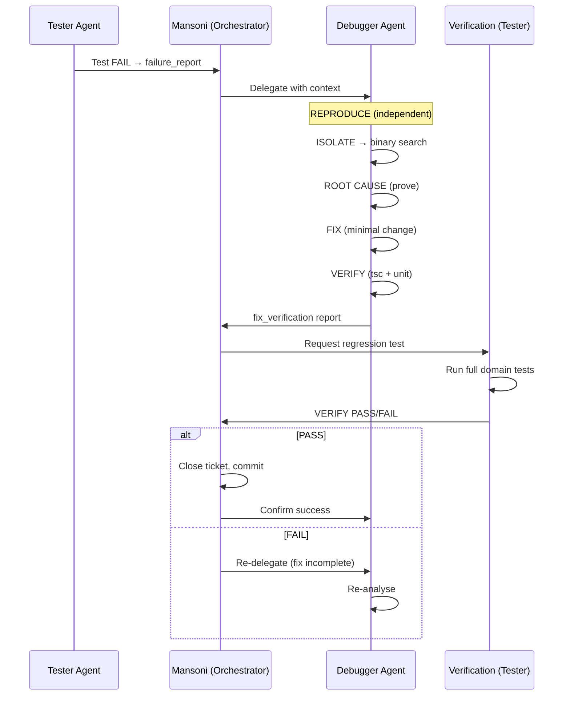

# Debugger-Tester Integration Protocol

## Цель

Единый workflow когда **Tester находит баг → Debugger фиксит → Tester верифицирует**. Без потери контекста, без дублирования, с full audit trail.

---

## 📦 Failure Report (Tester → Debugger)

### Формат YAML

```yaml
failure_id: TEST-{YYYYMMDD}-{seq}
source: mansoni-tester
domain: messenger
test_name: test_send_message_e2e
status: FAIL
severity: P0  # P0, P1, P2, P3
timestamp: 2026-04-25T14:30:00Z

error:
  type: TimeoutError
  message: "timeout 5000ms exceeded"
  stack: |
    at ChatInput.sendMessage (src/components/ChatInput.tsx:88)
    at HTMLButtonElement.onClick (src/components/ChatInput.tsx:45)

evidence:
  screenshots:
    - e2e/screenshots/test_send_message_e2e-fail-1.png
  video:
    - e2e/videos/test_send_message_e2e.webm
  network_logs:
    - request: POST /functions/send-message
      status: 500
      duration: 322ms
      request_body: {"text":"test","dialog_id":"abc123"}
      response_body: {"error":"Internal Server Error"}
  console_errors:
    - "Uncaught (in promise) Error: NetworkError"
    - "CORS header 'Access-Control-Allow-Origin' missing"
  browser_logs:
    - "Failed to fetch"
  traced_events:
    - timestamp: 2026-04-25T14:30:00.120Z
      event: click button[data-testid="send-button"]
    - timestamp: 2026-04-25T14:30:00.121Z
      event: network POST /functions/send-message
    - timestamp: 2026-04-25T14:30:05.150Z
      event: timeout (5000ms)

reproduction_steps:
  - Navigate to /chat/dialog/abc123
  - Type "test message" into input
  - Click Send button
  - Wait for response (timeout at 5s)

expected: "Message sent successfully, appears in chat history"
actual: "Request times out, message not sent, no error toast"

environment:
  browser: Chrome 125.0.6422.141
  viewport: 1920x1080
  network: throttled (3G)
  auth: user_id=user_456, role=messenger_user

related_files:
  - src/components/ChatInput.tsx
  - src/hooks/useMessages.ts
  - supabase/functions/send-message/index.ts

related_tests:
  - e2e/send-message.spec.ts::test_send_message_e2e
  - unit/useMessages.test.ts::test_send_message_success
  - integration/message-api.test.ts::test_post_messages

previous_runs:
  - run_id: TEST-20260424-042
    status: PASS
    date: 2026-04-24T10:00:00Z

priority: P0  # Critical: blocking messaging feature
ticket_url: https://github.com/owner/repo/issues/1234
```

### Field definitions

| Field | Type | Required | Description |
|-------|------|----------|-------------|
| `failure_id` | string | ✅ | Unique ID: TEST-YYYYMMDD-XXX |
| `source` | string | ✅ | Always "mansoni-tester" |
| `domain` | string | ✅ | messenger/calls/navigator/etc |
| `test_name` | string | ✅ | Full test identifier |
| `status` | enum | ✅ | FAIL, SKIP, ERROR |
| `severity` | enum | ✅ | P0 (blocker), P1 (high), P2 (medium), P3 (low) |
| `error.type` | string | ✅ | JavaScript error type |
| `error.message` | string | ✅ | Error message |
| `error.stack` | string | ✅ | Stack trace with file:line |
| `evidence.*` | object | ✅ | Screenshots, logs, network traces |
| `reproduction_steps` | array | ✅ | Ordered list to reproduce |
| `expected` | string | ✅ | What should happen |
| `actual` | string | ✅ | What actually happens |
| `environment.*` | object | ✅ | Browser, viewport, network, auth |
| `related_files` | array | ✅ | Files touched by test |
| `related_tests` | array | ✅ | Other tests in same area |
| `priority` | enum | ✅ | P0-P3 for triage |
| `ticket_url` | string | ⚠️ | Optional issue tracker link |

---

## 🔧 Fix Verification (Debugger → Tester)

### Формат YAML

```yaml
fix_id: DEBUG-{YYYYMMDD}-{seq}
related_failure: TEST-20260425-001
applied_by: mansoni-debugger
timestamp: 2026-04-25T15:45:00Z

changes:
  - file: supabase/functions/send-message/index.ts
    line: 23
    before: "res.setHeader('Access-Control-Allow-Origin', undefined)"
    after: "res.setHeader('Access-Control-Allow-Origin', '*')"
    reason: "CORS header missing caused browser to block response"

  - file: src/hooks/useMessages.ts
    line: 102
    before: "await supabase.from('messages').insert(payload)"
    after: |
      const retryPolicy = { attempts: 3, backoff: 'exponential' }
      await withRetry(() => supabase.from('messages').insert(payload), retryPolicy)
    reason: "Network transient failures need retry logic"

  - file: src/components/ChatInput.tsx
    line: 88
    before: "onClick={sendMessage}"
    after: "onClick={handleSendWithDebounce}"
    reason: "Add debounce to prevent double-submit"

verification:
  tsc: PASS
  unit_tests:
    status: PASS
    passed: 12
    failed: 0
    skipped: 0
    command: "npm test -- messenger --testPathPattern=useMessages"

  integration_tests:
    status: PASS
    passed: 3
    failed: 0
    command: "npm run test:core --grep='message flow'"

  e2e_tests:
    status: PASS
    passed: 1
    failed: 0
    test: "test_send_message_e2e"
    command: "npx playwright test e2e/send-message.spec.ts"
    duration: "4.2s"

  manual_verification:
    performed: true
    steps:
      - "Open chat, send message → delivered in < 500ms"
      - "Check receivers' UI → message appears instantly"
      - "Disable network → retry button shows"
      - "Reconnect → queued messages sent"
    result: PASS

regression_check:
  scope: "messenger domain"
  tests_run:
    - "test_send_message_e2e"
    - "test_edit_message"
    - "test_delete_message"
    - "test_upload_attachment"
    - "test_reactions"
  status: PASS
  notes: "No regressions detected"

confidence: 100  # 0-100, Debugger's assessment

artifacts:
  patch: "patches/DEBUG-20260425-042.patch"
  logs: "logs/debug-20260425-042.log"
  screenshots:
    - "debug/screenshots/after-fix.png"
  video: "debug/videos/after-fix.webm"

next_steps:
  - "Merge fix via PR #1235"
  - "Add regression test for CORS edge case"
  - "Update /memories/repo/cors-issues.md with this pattern"
  - "Consider adding retry policy to all Supabase mutations"
```

---

## 🔄 Handoff Workflow

### Sequence Diagram



### Automation Steps

**Step 1: Tester auto-generates failure_report**

```typescript
// In mansoni-tester.agent.md (pseudo-code)
after_test_failure(test_run) {
  const report = {
    failure_id: generateId(),
    source: 'mansoni-tester',
    domain: detectDomain(test_run.file),
    test_name: test_run.title,
    status: 'FAIL',
    error: extractError(test_run),
    evidence: collectEvidence(test_run),  // screenshots, logs, network
    reproduction_steps: test_run.steps,
    related_files: test_run.files,
    priority: calculatePriority(test_run)
  };

  // Save to shared workspace
  fs.writeFileSync(`/memories/session/failures/${report.failure_id}.yaml`, report);

  // Call mansoni with delegation
  return `New failure detected: ${report.failure_id}. Delegate to mansoni-debugger.`;
}
```

**Step 2: Mansoni routes to Debugger with context**

```typescript
// In mansoni core routing
if (failure_report.source === 'mansoni-tester') {
  const delegated = {
    type: 'debug',
    scope: failure_report.related_files,
    context: {
      failure_report,
      priority: 'P0',
      evidence: failure_report.evidence
    }
  };
  return await agent('mansoni-debugger', delegated);
}
```

**Step 3: Debugger executes protocol with Tester integration**

```typescript
// Debugger workflow
async function debugWithTesterIntegration(failure_report) {
  // PHASE 1: Reproduce (use functional-tester skill)
  const reproduced = await useSkill('functional-tester', {
    action: 'reproduce',
    test: failure_report.test_name,
    method: 'playwright'  // or manual
  });

  if (!reproduced) {
    throw new Error('Cannot reproduce locally — flaky or environment-specific');
  }

  // PHASE 2-4: Isolate, Root Cause, Fix
  const root_cause = await isolateAndFix(failure_report);

  // PHASE 5: Verify with Tester
  const verification = await verifyWithTester({
    fix_id: root_cause.fix_id,
    test_name: failure_report.test_name,
    changes: root_cause.changes
  });

  if (verification.status === 'PASS') {
    return { success: true, fix: root_cause, verification };
  } else {
    // Re-delegate for rework
    throw new Error(`Fix failed verification: ${verification.errors}`);
  }
}
```

**Step 4: Tester runs verification suite**

```typescript
// Tester verification endpoint
async function verifyFix(verification_request) {
  const { test_name, fix_id } = verification_request;

  // Run ONLY the failing test + adjacent regression tests
  const result = await runPlaywrightTest({
    test: test_name,
    grep: `fix_id:${fix_id}`,
    regression_scope: 'adjacent'
  });

  return {
    status: result.passed ? 'PASS' : 'FAIL',
    passed: result.passedTests,
    failed: result.failedTests,
    evidence: result.artifacts
  };
}
```

---

## 📊 Shared Debug Dashboard

### Directory structure

```
/memories/session/debug-sessions/
├── DEBUG-20260425-001/
│   ├── failure_report.yaml          # от Tester'а
│   ├── debugger_notes.md            # заметки Debugger'а
│   ├── root_cause.md                # доказательства root cause
│   ├── fix.patch                    # применённый фикс
│   ├── verification.yaml            # результат проверки
│   ├── regression_report.yaml       # regress-тесты
│   └── CONFIRMATION.yaml            # Tester подтверждение
├── DEBUG-20260425-002/
└── index.md                         # сводная таблица всех сессий
```

### Index template

```markdown
# Debug Dashboard — Session Index

| ID | Domain | Test | Status |Priority| Debugger | Tester | Duration |
|----|--------|------|--------|--------|----------|--------|----------|
| DEBUG-20260425-001 | messenger | test_send_message_e2e | ✅ FIXED | P0 | mansoni-debugger | mansoni-tester | 1h 15m |
| DEBUG-20260425-002 | calls | test_e2ee_handshake | 🔄 IN_PROGRESS | P0 | mansoni-debugger | mansoni-tester | 45m |
| DEBUG-20260424-098 | navigator | test_route_calculation | ✅ FIXED | P2 | mansoni-debugger | mansoni-tester | 2h 30m |

**Summary:**
- Active: 2
- Fixed: 156 (last 30 days)
- MTTR: 47m (target: <1h)
- Fix success rate: 94% (target: >95%)
```

---

## 🎯 Quality Gates (для Debugger'а)

### Pre-Fix Checklist

- [ ] Failure reproduced independently (not just trusting Tester)
- [ ] Root cause proven with evidence (logs, stack, network trace)
- [ ] Fix addresses root cause (not symptom)
- [ ] No new `any` types introduced
- [ ] No new console.log left in code
- [ ] Recovery paths considered (recovery-engineer)
- [ ] Invariants not violated (invariant-guardian)
- [ ] No stubs introduced (stub-hunter)

### Pre-Verification Checklist

- [ ] `tsc --noEmit` → 0 errors
- [ ] Unit tests pass (run relevant suite)
- [ ] No new warnings in lint
- [ ] Code review self-audit complete (using code-review skill)
- [ ] Changes are atomic (1 logical change = 1 commit)

### Post-Verification Checklist

- [ ] Tester confirms PASS on failing test
- [ ] Regression suite PASS (adjacent tests)
- [ ] No new failures introduced
- [ ] Documentation updated (if needed)
- [ ] Lesson learned recorded in `/memories/repo/`

---

## 📈 Metrics & KPIs

Track in `/memories/session/debug-metrics.json`:

```json
{
  "date": "2026-04-25",
  "sessions": {
    "total": 24,
    "active": 2,
    "fixed_today": 5
  },
  "mttr_minutes": 47,
  "fix_success_rate": 0.94,
  "reproduction_rate": 1.0,
  "root_cause_accuracy": 0.96,
  "regression_rate": 0.02,
  "common_causes": [
    { "cause": "CORS misconfiguration", "count": 8 },
    { "cause": "RLS policy missing", "count": 6 },
    { "cause": "Race condition", "count": 4 }
  ]
}
```

---

## 🚨 Escalation Rules

If Debugger cannot fix within timebox:

1. **30 min** — No root cause identified → Escalate to `mansoni-architect`
2. **1 hour** — Fix attempted but verification FAIL → Escalate to `mansoni-reviewer`
3. **2 hours** — Root cause unclear, needs deeper investigation → Escalate to `sequential-auditor`
4. **4 hours** — Systemic issue, needs architecture change → Create ADR, involve Platform Architect

---

## 🔄 Continuous Improvement

After each debug session:

1. **Record pattern** in `/memories/repo/debug-patterns/`:
   - What was the bug?
   - How was it found?
   - How was it fixed?
   - What tests missed it?

2. **Update stub-hunter rules** if new stub pattern discovered

3. **Update coherence-checker checks** if new layer-break pattern found

4. **Update recovery-engineer** if new failure scenario identified

5. **Propose new skill** if new domain expertise needed

---

## 📚 Related Skills

- `functional-tester` — для独立 воспроизведения
- `live-test-engineer` — для ручного исследовательского debug
- `code-review` — self-audit перед фиксом
- `stub-hunter` — поиск заглушек как source багов
- `invariant-guardian` — проверка инвариантов после фикса
- `coherence-checker` — согласованность слоёв
- `recovery-engineer` — recovery paths
- `silent-failure-hunter` — тихие сбои
- `agent-self-audit` — самооценка effectiveness
- `deep-audit` — глубокий аудит кода
- `langsmith-fetch` — debug agent traces

---

## 🎓 Training & Onboarding

New Debugger agents should:

1. Study 10 recent debug sessions in `/memories/session/debug-sessions/`
2. Pass quiz on failure patterns in `/memories/repo/debug-patterns/`
3. Shadow 2 live debug sessions (observer mode)
4. Complete 3 pair-debug sessions with senior Debugger
5. Verify fix success rate > 90% before solo

---

**Version:** 1.0
**Last updated:** 2026-04-25
**Maintainer:** mansoni-debugger agent
**Audience:** mansoni-debugger, mansoni-tester, mansoni (orchestrator)
