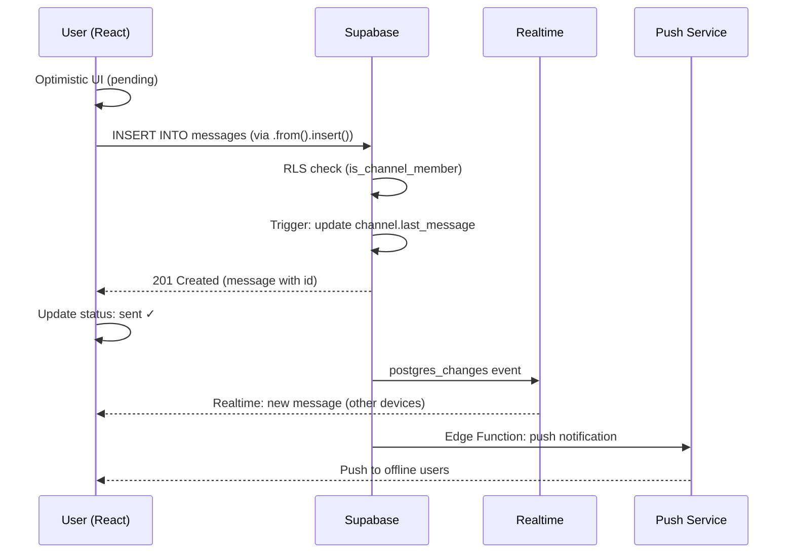
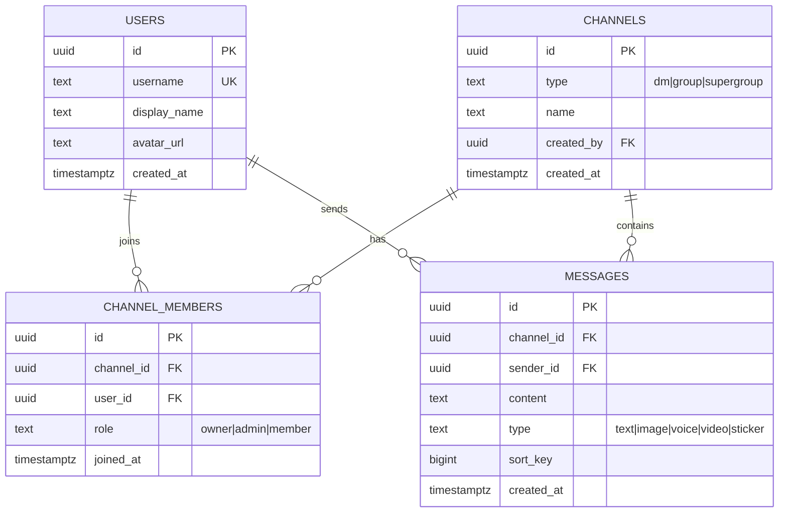
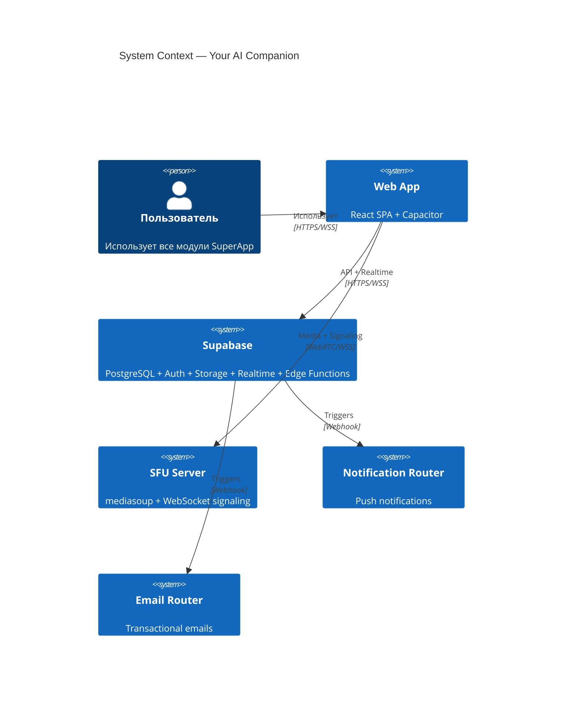
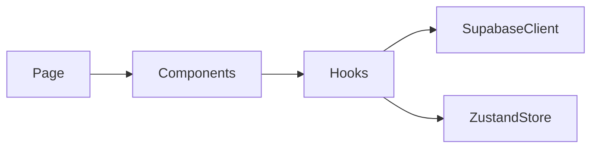

# Enhanced Doc Writer — Расширенная документация

Поверх базового doc-writer: генерация структурированных документов по жёстким шаблонам — OpenAPI спеки, ADR, Mermaid-диаграммы, ERD, changelog, onboarding guide, runbook. Каждый документ — из РЕАЛЬНОГО кода, не выдуманный.

## Принцип

> Документация = исходный код проекта, описанный формально. Каждая диаграмма генерируется из реальных файлов. Каждый API-контракт извлекается из Edge Function. Никаких выдуманных endpoint-ов.

---

## 1. OpenAPI Spec из Edge Functions

### 1.1. Протокол генерации

```
Для каждой Edge Function:
1. Прочитать supabase/functions/{name}/index.ts
2. Извлечь: HTTP method, URL pattern, request body type, response type, status codes
3. Извлечь: auth requirements (Bearer token)
4. Извлечь: rate limits (если есть)
5. Сгенерировать OpenAPI 3.1 YAML фрагмент
```

### 1.2. Шаблон OpenAPI

```yaml
# docs/api/openapi.yaml
openapi: "3.1.0"
info:
  title: "Your AI Companion API"
  version: "1.0.0"
  description: "SuperApp API: мессенджер + соцсеть + такси + маркетплейс + ..."

servers:
  - url: https://lfkbgnbjxskspsownvjm.supabase.co/functions/v1
    description: Production

security:
  - bearerAuth: []

components:
  securitySchemes:
    bearerAuth:
      type: http
      scheme: bearer
      bearerFormat: JWT

paths:
  /{function-name}:
    post:
      summary: "{Описание из комментария в коде}"
      tags:
        - "{Модуль}"
      security:
        - bearerAuth: []
      requestBody:
        required: true
        content:
          application/json:
            schema:
              type: object
              required: [field1]
              properties:
                field1:
                  type: string
                  maxLength: 1000
                field2:
                  type: number
                  minimum: 0
      responses:
        "200":
          description: Success
          content:
            application/json:
              schema:
                type: object
                properties:
                  success:
                    type: boolean
                  data:
                    type: object
        "400":
          description: Validation error
        "401":
          description: Unauthorized
        "500":
          description: Internal error
```

### 1.3. Чеклист OpenAPI

```
☐ Каждая Edge Function имеет entry в paths
☐ Каждый RPC вызов документирован
☐ Все request/response типы соответствуют коду
☐ Все status codes перечислены
☐ Security requirements указаны
☐ Limits и constraints описаны (maxLength, minimum, maximum)
☐ Примеры (examples) для каждого endpoint
```

---

## 2. Architecture Decision Records (ADR)

### 2.1. Шаблон ADR

```markdown
# ADR-{NNN}: {Заголовок решения}

## Статус
{Proposed | Accepted | Deprecated | Superseded by ADR-XXX}

## Дата
{YYYY-MM-DD}

## Контекст
{Какая проблема стоит? Какие ограничения? Какие требования?
Ссылки на конкретные файлы/модули проекта.}

## Рассмотренные варианты

### Вариант A: {Название}
- **Плюсы**: {перечислить}
- **Минусы**: {перечислить}
- **Оценка сложности**: {low/medium/high}

### Вариант B: {Название}
- **Плюсы**: {перечислить}
- **Минусы**: {перечислить}
- **Оценка сложности**: {low/medium/high}

### Вариант C: {Название}
...

## Решение
{Выбранный вариант и ПОЧЕМУ. Конкретные аргументы, не "было решено".}

## Последствия

### Позитивные
- {что улучшится}

### Негативные
- {что усложнится, trade-offs}

### Миграция
- {шаги для перехода, если применимо}

## Связанные документы
- {ссылки на другие ADR, спецификации, issues}
```

### 2.2. Когда создавать ADR

```
✅ Выбор между библиотеками (zustand vs redux vs jotai)
✅ Архитектурный паттерн (monorepo vs polyrepo)
✅ Протокол (REST vs GraphQL, WebSocket vs SSE)
✅ Стратегия данных (SQL schema design, E2EE approach)
✅ Инфраструктура (Supabase vs Firebase vs custom backend)
✅ Безопасность (auth flow, key management)

❌ Выбор CSS класса, название переменной, мелкий рефакторинг
```

### 2.3. Расположение

```
docs/adr/
  ADR-001-supabase-as-backend.md
  ADR-002-e2ee-message-key-bundle.md
  ADR-003-mediasoup-sfu-for-calls.md
  ADR-004-zustand-over-redux.md
  ADR-005-capacitor-for-mobile.md
  INDEX.md  ← сводная таблица всех ADR
```

---

## 3. Mermaid Diagrams

### 3.1. Sequence Diagram — для API flows

```markdown
## Отправка сообщения


```

### 3.2. Flowchart — для бизнес-логики

```markdown
## Маршрутизация звонка

```mermaid
flowchart TD
    A[Пользователь нажимает "Позвонить"] --> B{Есть интернет?}
    B -->|Нет| C[Toast: Нет соединения]
    B -->|Да| D{Тип звонка?}
    D -->|1-to-1| E[Создать offer]
    D -->|Group| F[Подключиться к SFU]
    E --> G{ICE gathering}
    G -->|Timeout 10s| H[Fallback: TURN relay]
    G -->|Success| I[Direct P2P]
    F --> J[mediasoup transport]
    J --> K{Produce media}
    K -->|Camera denied| L[Только аудио]
    K -->|Success| M[Видеозвонок активен]
```
```

### 3.3. ER Diagram — для модели данных

```markdown
## Модель данных чата


```

### 3.4. C4 Model — для высокоуровневой архитектуры

```markdown
## C4 Level 1: System Context


```

### 3.5. Чеклист диаграмм

```
☐ Sequence diagram для каждого ключевого user flow
☐ ER diagram для каждого модуля (chat, taxi, marketplace, etc.)
☐ Flowchart для каждого decision flow (auth, payment, moderation)
☐ C4 Context для общей архитектуры
☐ C4 Container для каждого деплоя
☐ State diagram для state machines (call states, order states)
```

---

## 4. Module README Template

```markdown
# {Название модуля}

> {Одно предложение — назначение модуля}

## Аналоги
{Какие приложения делают то же: Telegram, Instagram, Uber...}

## Архитектура



## Файловая структура

| Файл | Назначение | LOC |
|------|-----------|-----|
| `{Module}Page.tsx` | Корневая страница | ~120 |
| `{Module}List.tsx` | Список сущностей | ~200 |
| ... | ... | ... |

## Data Model

```mermaid
erDiagram
    ... (ER diagram из раздела 3.3)
```

## API Endpoints

| Endpoint | Method | Описание | Auth |
|----------|--------|----------|------|
| `/api/{module}` | GET | Список | Bearer |
| ... | ... | ... | ... |

## State Management

- **Server state**: TanStack Query (`use{Module}List`, `use{Module}Detail`)
- **UI state**: Zustand (`use{Module}Store`)
- **Realtime**: Supabase channel `{module}:{id}`

## Key Flows

### Создание {сущности}
1. Пользователь нажимает FAB
2. Открывается форма (Bottom Sheet на mobile)
3. Validation (zod schema)
4. useMutation → INSERT → toast success
5. Optimistic update в списке

## Edge Cases

1. {Case 1}
2. {Case 2}
...

## Dependencies

- `@/components/ui/*` — shadcn компоненты
- `@tanstack/react-query` — data fetching
- `zustand` — UI state
- `{domain-specific}` — ...
```

---

## 5. Database Schema Documentation (ERD Generator)

### 5.1. Протокол генерации ERD

```
Для каждой группы связанных таблиц:
1. Прочитать ВСЕ миграции (supabase/migrations/*.sql)
2. Извлечь: таблицы, колонки, типы, FK, constraints
3. Группировать по доменам (chat, taxi, etc.)
4. Сгенерировать Mermaid ER diagram
5. Добавить RLS policy summary в таблицу
```

### 5.2. Формат документа

```markdown
# Database Schema: {Домен}

## ER Diagram
```mermaid
erDiagram
    ...
```

## Tables

### {table_name}

| Column | Type | Nullable | Default | Description |
|--------|------|----------|---------|-------------|
| id | uuid | NO | gen_random_uuid() | Primary key |
| ... | ... | ... | ... | ... |

**Indexes:**
- `idx_name` — `(col1, col2)` — Для {назначение}

**RLS Policies:**
- SELECT: `user_id = auth.uid()` — Владелец видит свои
- INSERT: `user_id = auth.uid()` — Создаёт только свои
- UPDATE: `user_id = auth.uid()` — Редактирует только свои
- DELETE: `user_id = auth.uid()` — Удаляет только свои

**Triggers:**
- `trg_updated_at` — auto-update `updated_at`
```

---

## 6. Changelog Automation

### 6.1. Conventional Commits → CHANGELOG

```markdown
# Changelog

## [Unreleased]

### 🚀 Features
- **chat**: добавлена поддержка голосовых сообщений (#123)
- **taxi**: карта с отслеживанием водителя в реальном времени (#145)

### 🐛 Bug Fixes
- **auth**: исправлен бесконечный цикл refresh token (#134)
- **calls**: ICE restart при потере соединения (#156)

### 🔒 Security
- **rls**: добавлены политики на таблицу ride_requests (#167)

### ⚡ Performance
- **feed**: виртуализация списка постов (−40% memory) (#178)

### 📝 Documentation
- **api**: OpenAPI spec для Edge Functions (#189)
```

### 6.2. Протокол генерации

```
1. git log --oneline --since="2026-03-01" → список коммитов
2. Парсить: feat|fix|security|perf|docs + (scope): description
3. Группировать по типам
4. Добавить ссылки на PR/issues
5. Записать в CHANGELOG.md
```

---

## 7. Onboarding Guide

### 7.1. Шаблон

```markdown
# Onboarding: Как развернуть проект

## Требования
- Node.js 18+
- npm 9+ 
- Supabase CLI (`npm i -g supabase`)
- Android Studio (для Capacitor)

## Быстрый старт

### 1. Клонирование
```bash
git clone ...
cd your-ai-companion
npm install
```

### 2. Переменные окружения
```bash
cp .env.example .env
# Заполнить VITE_SUPABASE_URL и VITE_SUPABASE_ANON_KEY
```

### 3. Запуск
```bash
npm run dev       # Frontend: http://localhost:8080
```

### 4. Supabase (опционально для локальной разработки)
```bash
supabase start    # PostgreSQL + Auth + Storage + Realtime
supabase db push  # Применить миграции
```

## Структура проекта
{Ссылка на ARCHITECTURE.md}

## Первые задачи для нового разработчика
1. {Простая задача — изменить текст / добавить CSS}
2. {Средняя — добавить компонент по шаблону}
3. {Сложная — добавить фичу с миграцией}

## Полезные команды
| Команда | Описание |
|---------|----------|
| `npm run dev` | Dev server |
| `npm run lint` | ESLint check |
| `npx tsc --noEmit` | TypeScript check |
| `npm run build` | Production build |
```

---

## 8. Runbook Template (Incident Response)

### 8.1. Шаблон Runbook

```markdown
# Runbook: {Название инцидента}

## Severity
{P1: полный outage | P2: degraded | P3: minor impact | P4: cosmetic}

## Симптомы
- {Что видит пользователь}
- {Что показывают метрики}
- {Что в логах}

## Диагностика

### Шаг 1: Проверить здоровье сервисов
```bash
# Supabase
curl https://{project}.supabase.co/rest/v1/ -H "apikey: {anon_key}"

# SFU Server
curl https://{sfu-host}/health

# Edge Function
curl https://{project}.supabase.co/functions/v1/{function} -X OPTIONS
```

### Шаг 2: Проверить логи
```bash
# Supabase Dashboard → Logs → Edge Functions
# Supabase Dashboard → Logs → PostgreSQL
# SFU server logs (Railway/Render dashboard)
```

### Шаг 3: Определить root cause
{Decision tree с конкретными проверками}

## Миттигация
{Пошаговые инструкции для каждого root cause}

## Эскалация
| Уровень | Кто | Контакт |
|---------|-----|---------|
| L1 | Дежурный разработчик | ... |
| L2 | Tech Lead | ... |
| L3 | Supabase support / хостинг | ... |

## Post-mortem шаблон
1. Timeline (когда началось → когда обнаружили → когда починили)
2. Root cause
3. Impact (кол-во пользователей, длительность)
4. Action items (предотвращение повторения)
```

---

## 9. Workflow

### Фаза 1: Определить тип документа
1. Что нужно: API docs / ADR / diagram / ERD / changelog / onboarding / runbook?
2. Определить scope (модуль / всё приложение)

### Фаза 2: Сбор данных из кода
1. Прочитать ВСЕ связанные файлы (не выдумывать!)
2. Извлечь типы, endpoints, таблицы, flows
3. Проверить актуальность (миграции ↔ код)

### Фаза 3: Генерация по шаблону
1. Использовать соответствующий шаблон из секций выше
2. Заполнить РЕАЛЬНЫМИ данными
3. Добавить Mermaid-диаграммы

### Фаза 4: Сохранение
1. Правильное расположение в docs/
2. Обновить INDEX.md (если есть)
3. Cross-references на связанные документы

---

## Маршрутизация в оркестраторе

**Триггеры**: OpenAPI, swagger, API spec, ADR, архитектурное решение, диаграмма, Mermaid, sequence diagram, flowchart, ER diagram, ERD, C4 model, changelog, onboarding, runbook, incident response, module README, документация API, схема базы

**Агенты**:
- `architect` — при проектировании (ADR, C4)
- `codesmith` — при автогенерации из кода (OpenAPI, ERD, changelog)
- `ask` — при написании onboarding и runbook
