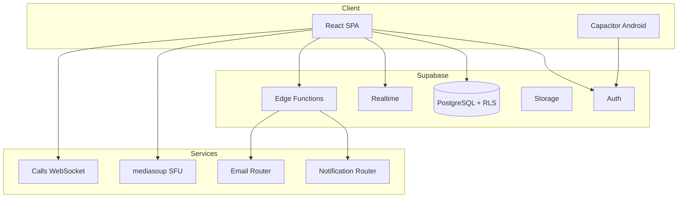
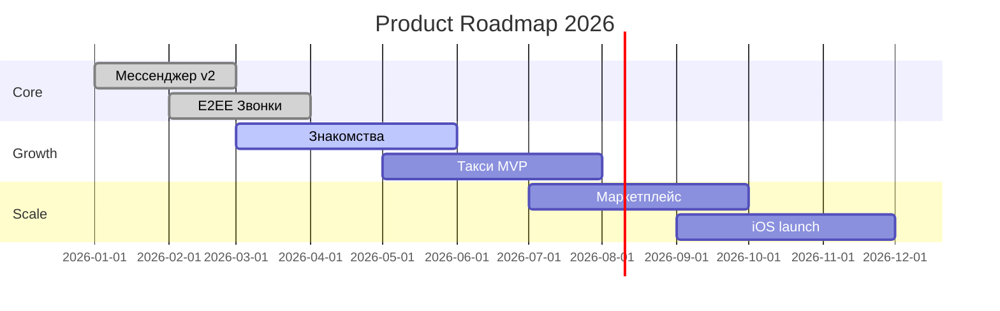
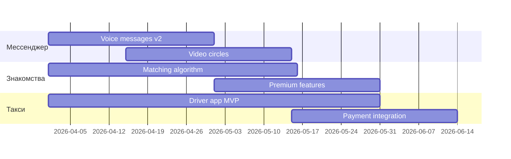
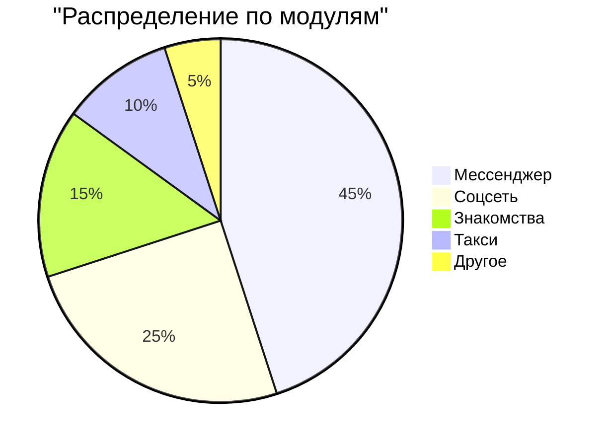

# Presentation Generator — Генератор презентаций

Создаёт Markdown-презентации по шаблонам для разных аудиторий: команда (sprint demo), инвестор (pitch deck), техническая (architecture overview). Формат: Marp-compatible Markdown → PDF/PPTX/HTML.

## Принцип

> Презентация = данные из проекта + визуальная структура + нарратив. Каждый слайд содержит ОДНУ идею. Диаграммы генерируются из РЕАЛЬНОГО кода и данных.

---

## 1. Формат и инструменты

### 1.1. Marp Markdown

```markdown
---
marp: true
theme: default
paginate: true
backgroundColor: #1a1a2e
color: #eaeaea
style: |
  section {
    font-family: 'Inter', sans-serif;
  }
  h1 { color: #e94560; }
  h2 { color: #0f3460; }
  code { background: #16213e; }
  table { font-size: 0.8em; }
  .columns { display: flex; gap: 2rem; }
  .col { flex: 1; }
  img { border-radius: 8px; }
---

# Заголовок презентации
## Подзаголовок
**Дата:** {YYYY-MM-DD}

---

# Слайд 2

- Буллет 1
- Буллет 2
- Буллет 3

---
```

### 1.2. Конвертация

```bash
# Marp CLI — генерация PDF/PPTX/HTML
npx @marp-team/marp-cli presentation.md --pdf
npx @marp-team/marp-cli presentation.md --pptx
npx @marp-team/marp-cli presentation.md --html

# Mermaid → SVG (для встраивания):
npx @mermaid-js/mermaid-cli -i diagram.mmd -o diagram.svg
```

---

## 2. Шаблон: Architecture Overview

```markdown
---
marp: true
theme: default
paginate: true
---

# 🏗️ Your AI Companion
## Архитектура SuperApp
{Дата}

---

# Что мы строим

**SuperApp** — единая платформа, объединяющая:

<div class="columns">
<div class="col">

- 💬 Мессенджер (Telegram-level)
- 📱 Соцсеть + Reels
- ❤️ Знакомства
- 🚕 Такси-сервис
- 🛍️ Маркетплейс

</div>
<div class="col">

- 📊 CRM
- 🎥 Стриминг
- 🏥 Страхование
- 🏠 Недвижимость

</div>
</div>

---

# Технологический стек

| Слой | Технологии |
|------|-----------|
| **Frontend** | React 18 + TypeScript strict + Vite |
| **UI** | TailwindCSS + shadcn/ui |
| **State** | Zustand + TanStack Query |
| **Backend** | Supabase (PostgreSQL + RLS + Edge Functions + Realtime) |
| **Mobile** | Capacitor 7 (Android) |
| **Calls** | mediasoup SFU + WebRTC + E2EE |
| **Services** | Node.js (notification-router, email-router) |

---

# Архитектура системы



---

# Модульная структура

```
src/components/
  ├── chat/         💬 Мессенджер
  ├── feed/         📱 Лента
  ├── reels/        🎬 Reels
  ├── dating/       ❤️ Знакомства
  ├── taxi/         🚕 Такси
  ├── shop/         🛍️ Маркетплейс
  ├── crm/          📊 CRM
  ├── live/         🎥 Стриминг
  ├── insurance/    🏥 Страхование
  ├── realestate/   🏠 Недвижимость
  └── ui/           🎨 Дизайн-система
```

---

# Безопасность

- 🔐 **RLS** на КАЖДОЙ таблице (Row Level Security)
- 🔑 **E2EE** для приватных чатов (Signal Protocol)
- 🛡️ **Auth** через Supabase Auth (JWT)
- 🔒 **CORS** + Bearer token на ВСЕХ Edge Functions
- 🧹 **Input validation** на клиенте И сервере

---

# Масштабирование

| Метрика | Текущее | Target |
|---------|---------|--------|
| Таблицы БД | {N} | — |
| Edge Functions | {N} | — |
| React компонентов | {N} | — |
| Строк кода | {N}K | — |
| Миграций | {N} | — |

---

# Вопросы?
```

---

## 3. Шаблон: Sprint Report

```markdown
---
marp: true
theme: default
paginate: true
---

# Sprint {N} Report
## {Start date} — {End date}
**Команда:** {имена}

---

# Итоги спринта

| Метрика | Значение |
|---------|----------|
| Задач запланировано | {N} |
| Задач завершено | {N} |
| Story Points | {done}/{total} |
| Velocity | {N} SP |
| Bugs fixed | {N} |
| Commits | {N} |

---

# Что сделано

### 💬 Мессенджер
- {Feature 1} — {ссылка на PR}
- {Feature 2}

### 🚕 Такси
- {Feature 3}

### 🐛 Баги
- {Bug 1} — {root cause}
- {Bug 2}

---

# Демо

{Screenshots или ссылки на видео}


---

# Метрики качества

| Метрика | Было | Стало | Δ |
|---------|------|-------|---|
| tsc errors | {N} | {N} | {-N} |
| ESLint warnings | {N} | {N} | {-N} |
| Bundle size (gzip) | {N}KB | {N}KB | {-N}KB |
| Покрытие тестами | {N}% | {N}% | {+N}% |

---

# Блокеры и риски

| Риск | Влияние | Статус |
|------|---------|--------|
| {Описание} | {high/medium/low} | {resolved/in progress/blocked} |

---

# План на следующий спринт

1. {Задача 1}
2. {Задача 2}
3. {Задача 3}

**Фокус:** {основная тема спринта}

---

# Вопросы?
```

---

## 4. Шаблон: Investor Pitch

```markdown
---
marp: true
theme: uncover
paginate: true
---

# Your AI Companion
## SuperApp для всего

---

# Проблема

- 📱 У пользователя 15+ приложений на телефоне
- 💸 Каждое приложение — отдельная подписка
- 🔄 Данные разрозненны: контакты в одном, заказы в другом
- 🔐 Доверие: каждому отдаётся доступ к данным отдельно

---

# Решение

**Одно приложение → все сервисы:**

| Модуль | Аналог | Статус |
|--------|--------|--------|
| Мессенджер | Telegram | ✅ Production |
| Соцсеть | Instagram | ✅ Production |
| Знакомства | Tinder | 🔨 Beta |
| Такси | Uber | 🔨 Development |
| Маркетплейс | Ozon | 🔨 Development |
| CRM | AmoCRM | ✅ Production |
| Стриминг | Twitch | 🔨 Beta |

---

# Рынок

- TAM: $XXB (global super-apps market)
- SAM: $XXB (CIS region)
- SOM: $XXM (year 1 target)

---

# Технология

- **E2EE** — шифрование уровня Signal
- **WebRTC** — видеозвонки P2P + SFU
- **AI** — рекомендации, модерация, ассистент
- **Cross-platform** — Web + Android (iOS planned)

---

# Бизнес-модель

| Источник | Описание |
|----------|----------|
| Premium подписка | Расширенные функции, больше лимитов |
| Такси комиссия | % от каждой поездки |
| Маркетплейс комиссия | % от продаж |
| Реклама | Таргетированная в ленте |
| Стриминг донаты | Комиссия с транзакций |

---

# Roadmap



---

# Команда

| Роль | Опыт |
|------|------|
| CEO/CTO | {описание} |
| Lead Dev | {описание} |
| ... | ... |

---

# Ask

**Инвестиция:** ${X}M
**На что:** {engineering, marketing, operations}
**Цель:** {метрика через 12 месяцев}

---

# Спасибо!

{контакты}
```

---

## 5. Шаблон: Roadmap

```markdown
---
marp: true
theme: default
paginate: true
---

# Product Roadmap
## {Квартал/Год}

---

# Текущий статус модулей

| Модуль | Статус | Полнота |
|--------|--------|---------|
| 💬 Мессенджер | Production | ████████░░ 80% |
| 📱 Соцсеть | Production | ███████░░░ 70% |
| ❤️ Знакомства | Beta | █████░░░░░ 50% |
| 🚕 Такси | Development | ███░░░░░░░ 30% |
| 🛍️ Маркетплейс | Planned | █░░░░░░░░░ 10% |
| 📊 CRM | Production | ██████░░░░ 60% |
| 🎥 Стриминг | Beta | ████░░░░░░ 40% |
| 🏥 Страхование | Development | ██░░░░░░░░ 20% |
| 🏠 Недвижимость | Planned | █░░░░░░░░░ 10% |

---

# Q2 2026: Фокус



---

# Приоритеты

1. **Must have** — то без чего нельзя запуститься
2. **Should have** — улучшает конкурентоспособность
3. **Nice to have** — может подождать

---
```

---

## 6. Data Visualization из Supabase

### 6.1. Извлечение метрик

```sql
-- Количество пользователей по дням:
SELECT date_trunc('day', created_at) as day, count(*) 
FROM auth.users GROUP BY 1 ORDER BY 1;

-- Активность по модулям:
SELECT 
  CASE 
    WHEN path LIKE '/chat%' THEN 'Мессенджер'
    WHEN path LIKE '/feed%' THEN 'Соцсеть'
    WHEN path LIKE '/dating%' THEN 'Знакомства'
    ELSE 'Другое'
  END as module,
  count(*) as visits
FROM page_views
GROUP BY 1 ORDER BY 2 DESC;

-- Популярные features:
SELECT feature, count(*) as usage FROM analytics_events
WHERE created_at > now() - interval '7 days'
GROUP BY 1 ORDER BY 2 DESC LIMIT 10;
```

### 6.2. Визуализация в Mermaid

```markdown
## Активность за неделю



```mermaid
xychart-beta
    title "Новые пользователи"
    x-axis [Пн, Вт, Ср, Чт, Пт, Сб, Вс]
    y-axis "Регистрации" 0 --> 100
    bar [23, 45, 56, 32, 67, 89, 72]
```
```

---

## 7. Workflow генерации

### Фаза 1: Определить аудиторию и тип
1. Кто будет смотреть? (команда / инвестор / технический lead)
2. Какой тип? (architecture / sprint / pitch / roadmap / demo)
3. Сколько слайдов? (5-min: 8-10, 15-min: 15-20, 30-min: 25-35)

### Фаза 2: Сбор данных
1. Для architecture → прочитать структуру проекта, конфиги
2. Для sprint → git log, issues resolved, metrics
3. Для pitch → бизнес-модель, рынок, roadmap
4. Для metrics → SQL запросы из Supabase

### Фаза 3: Генерация слайдов
1. Титульный + agenda
2. Контентные слайды по шаблону
3. Mermaid-диаграммы (из реального кода!)
4. Summary + Q&A

### Фаза 4: Сохранение
1. `docs/presentations/{type}-{date}.md`
2. Mermaid-файлы рядом: `*.mmd`
3. Screenshots: `docs/presentations/assets/`

---

## Маршрутизация в оркестраторе

**Триггеры**: презентация, слайды, демо, demo, pitch, sprint report, sprint demo, roadmap, metrics, архитектура обзор, инвестор, Marp, Slidev, слайд

**Агенты**:
- `architect` — для архитектурных презентаций
- `ask` — для sprint reports и metrics
- `codesmith` — для автогенерации Mermaid из кода
