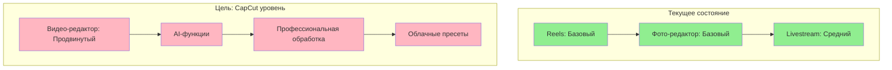
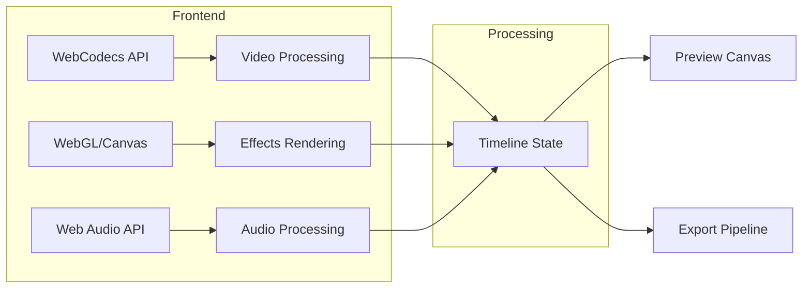

# MEDIA_PROCESSING_PLATFORM_ANALYSIS.md

## Комплексный анализ платформы обработки медиа

**Версия:** 1.0  
**Дата:** 2026-03-09  
**Статус:** Архитектурный анализ  
**Цель:** Создание профессионального обработчика медиа уровня CapCut с возможностями Instagram

---

## Содержание

1. [Анализ Instagram](#1-анализ-instagram)
2. [Анализ TikTok](#2-анализ-tiktok)
3. [Анализ профессиональных платформ](#3-анализ-профессиональных-платформ)
4. [Gap-анализ текущего состояния](#4-gap-анализ-текущего-состояния)
5. [Дорожная карта реализации](#5-дорожная-карта-реализации)
6. [Технические рекомендации](#6-технические-рекомендации)

---

## 1. Анализ Instagram

### 1.1 Reels

| Функция | Описание | Статус в проекте |
|---------|----------|------------------|
| Создание | Запись до 90 секунд, мультикамера | ✅ Готово |
| Редактирование | Обрезка, разделение клипов | ⚠️ Частично |
| Эффекты | AR-фильтры, Face Effects | ❌ Нет |
| Музыка | Интеграция с Facebook Sound Library | ❌ Нет |
| Шаблоны | Templates для быстрого создания | ❌ Нет |
| Субтитры | Автоматические_caption | ❌ Нет |
| Стикеры | Интерактивные элементы | ❌ Нет |
| Текст | Наложение текста с стилями | ⚠️ Базово |
| Скорость | Ускорение/замедление 0.3x-4x | ❌ Нет |

### 1.2 Stories

| Функция | Описание | Статус в проекте |
|---------|----------|------------------|
| Создание | Фото/видео до 15 секунд | ✅ Готово |
| Реакции | Double-tap, ответы | ✅ Готово |
| Опросы | Poll sticker | ❌ Нет |
| Вопросы | Q&A sticker | ❌ Нет |
| Музыка | Music sticker | ❌ Нет |
| Эффекты | AR-фильтры | ❌ Нет |
| Обратный отсчет | Countdown sticker | ❌ Нет |
| Таймер | Boomerang, Hands-free | ❌ Нет |

### 1.3 Публикации

| Функция | Описание | Статус в проекте |
|---------|----------|------------------|
| Фото | Одиночные публикации | ✅ Готово |
| Карусели | До 10 изображений | ⚠️ Частично |
| Альбомы | Галереи с общими описаниями | ❌ Нет |
| Редактирование | Изменение после публикации | ❌ Нет |
| Тегирование | Отметка пользователей | ❌ Нет |
| Локации | Геотегирование | ⚠️ Базово |

### 1.4 Live

| Функция | Описание | Статус в проекте |
|---------|----------|------------------|
| Прямой эфир | Трансляция в реальном времени | ✅ Готово |
| Совместные эфиры | Guest stars (до 3 гостей) | ⚠️ Частично |
| Реакции | Floating reactions | ✅ Готово |
| Чат | Реальновременной чат | ✅ Готово |
| Запись | Автосохранение | ❌ Нет |
| Донаты | Stars, Support | ✅ Готово |
| Q&A | Вопросы от зрителей | ⚠️ Частично |
| Режимы | Live Rooms | ❌ Нет |

### 1.5 Creator Studio

| Функция | Описание | Статус в проекте |
|---------|----------|------------------|
| Аналитика | Просмотры, охват, взаимодействия | ⚠️ Частично |
| Монетизация | Реклама, IG Shopping | ❌ Нет |
| Контент | Управление публикациями | ⚠️ Базово |
| Комментарии | Модерация | ⚠️ Базово |

---

## 2. Анализ TikTok

### 2.1 Создание видео

| Функция | Описание | Статус в проекте |
|---------|----------|------------------|
| Длительность | 15с, 60с, 3мин, 10мин | ⚠️ До 90с |
| Скорость | 0.3x - 3x | ❌ Нет |
| Таймлапс | Ускоренная съемка | ❌ Нет |
| Замедление | Slow-mo эффекты | ❌ Нет |
| Flip | Отражение камеры | ❌ Нет |

### 2.2 Редактор

| Функция | Описание | Статус в проекте |
|---------|----------|------------------|
| Обрезка | Trim клипов | ⚠️ Базово |
| Переходы | Cut, Merge эффекты | ❌ Нет |
| Текст | Overlay с таймингом | ⚠️ Базово |
| Стикеры | Интерактивные элементы | ❌ Нет |
| Фильтры | Цветовые фильтры | ⚠️ Базово |
| LUTs | Профессиональные пресеты | ❌ Нет |

### 2.3 Музыка и звуки

| Функция | Описание | Статус в проекте |
|---------|----------|------------------|
| Библиотека | Sound Library | ❌ Нет |
| Sounds | Популярные треки | ❌ Нет |
| Voice Effects | Робот,_chipmunk, etc | ❌ Нет |
| Voiceover | Запись голоса поверх | ❌ Нет |
| Mix | Комбинирование звуков | ❌ Нет |

### 2.4 Creative Tools

| Функция | Описание | Статус в проекте |
|---------|----------|------------------|
| Green Screen | Хромакей | ❌ Нет |
| Duet | Ответное видео | ❌ Нет |
| Stitch | Нарезка чужих видео | ❌ Нет |
| React | Реакция на видео | ❌ Нет |
| Split Screen | Несколько экранов | ❌ Нет |

### 2.5 Live Streaming

| Функция | Описание | Статус в проекте |
|---------|----------|------------------|
| Эфир | Трансляция | ✅ Готово |
| Гости | До 3 участников | ⚠️ Частично |
| Реакции | Эмодзи | ✅ Готово |
| Q&A | Вопросы | ⚠️ Частично |
| Gifts | Виртуальные подарки | ✅ Готово |

---

## 3. Анализ профессиональных платформ

### 3.1 CapCut

| Категория | Функции | Приоритет |
|-----------|---------|-----------|
| **Основное** | Обрезка, разделение, удаление | 🔴 Высокий |
| **Текст** | Авто-subtitles, стилей, анимация | 🔴 Высокий |
| **Переходы** | 100+ эффектов, curve, mask | 🔴 Высокий |
| **Эффекты** | PIP, Chroma Key, Blend | 🔴 Высокий |
| **Аудио** | Sound effects, Voice changer | 🟡 Средний |
| **AI** | Smart cut, BG removal, GenScript | 🟢 Низкий |
| **Экспорт** | 4K 60fps, Formats: MP4/MOV | 🔴 Высокий |

### 3.2 InShot

| Категория | Функции | Приоритет |
|-----------|---------|-----------|
| **Основное** | Обрезка, merge, split | 🔴 Высокий |
| **Текст** | 40+ шрифтов, стилей | 🟡 Средний |
| **Переходы** | 50+ эффектов | 🔴 Высокий |
| **Фильтры** | LUTs, Color adjustment | 🟡 Средний |
| **Музыка** | Встроенная библиотека | 🟡 Средний |
| **Экспорт** | 4K, HD, custom quality | 🔴 Высокий |

### 3.3 VLLO

| Категория | Функции | Сравнение с InShot |
|-----------|---------|-------------------|
| **Основное** | Аналогично InShot | = |
| **Интерфейс** | Более простой | Лучше для новичков |
| **Переходы** | Меньше эффектов | - |
| **Цена** | Freemium | Дороже InShot |

### 3.4 KineMaster

| Категория | Функции | Приоритет |
|-----------|---------|-----------|
| **Профессиональное** | Multi-track timeline | 🔴 Высокий |
| **Слои** | Video, image, text, sticker слои | 🔴 Высокий |
| **Кейфреймы** | Анимация по ключевым кадрам | 🔴 Высокий |
| **Цветокоррекция** | Color wheels, LUTs | 🔴 Высокий |
| **Экспорт** | 4K 30fps, 1080p 60fps | 🔴 Высокий |

### 3.5 Adobe Premiere Rush

| Категория | Функции | Приоритет |
|-----------|---------|-----------|
| **Кроссплатформа** | Desktop + Mobile sync | 🟢 Низкий |
| **Timeline** | Multi-track | 🔴 Высокий |
| **Экспорт** | Social presets (9:16, etc) | 🔴 Высокий |
| **Аудио** | Auto-ducking, effects | 🟡 Средний |
| **Интеграция** | Adobe CC ecosystem | 🟢 Низкий |

### 3.6 DaVinci Resolve (Mobile)

| Категория | Функции | Приоритет |
|-----------|---------|-----------|
| **Цветокоррекция** | Industry standard | 🔴 Высокий |
| **Fairlight** | Профессиональный аудио | 🟡 Средний |
| **Fusion** | VFX и compositing | 🟢 Низкий |
| **Экспорт** | Professional codecs | 🔴 Высокий |

### 3.7 Movavi Clips

| Категория | Функции | Приоритет |
|-----------|---------|-----------|
| **Простота** | Интуитивный интерфейс | 🟡 Средний |
| **Темплейты** | Готовые проекты | 🟡 Средний |
| **Переходы** | Basic набор | 🟡 Средний |
| **Экспорт** | Quick share to social | 🟡 Средний |

---

## 4. Gap-анализ текущего состояния

### 4.1 Что уже реализовано

```
✅ Reels модуль
   ├── Feed (лента рилс)
   ├── Player (видеоплеер)
   ├── Comments (комментарии)
   ├── Likes (лайки)
   ├── Share (шеринг)
   └── CreateReelSheet (создание)

✅ Livestream модуль
   ├── Трансляция (mediasoup)
   ├── UI стрима
   ├── Чат
   ├── Донаты и подарки
   ├── Реакции (floating)
   ├── Гости (invite guests)
   ├── Q&A queue
   ├── Планирование эфира
   ├── Настройки стрима
   └── Повтор (replay)

✅ Базовая медиа-инфраструктура
   ├── MinIO (хранение)
   ├── coturn (TURN/STUN)
   └── Redis (pub/sub)

✅ Базовый фото-редактор
   ├── Обрезка (crop)
   ├── Поворот (rotate)
   ├── Фильтры (filters)
   └── Настройки (adjustments)
```

### 4.2 Чего НЕ хватает

```
❌ Видео-редактор
   ├── Многодорожечный timeline
   ├── Переходы между клипами
   ├── Разделение/объединение клипов
   ├── Drag-and-drop клипов

❌ Текст и стикеры
   ├── Текст с таймингом
   ├── Анимация текста
   ├── Стикеры (stickers)
   ├── Наклейки (stickers)

❌ Музыкальная библиотека
   ├── Интеграция со звуковыми библиотеками
   ├── Sound effects
   ├── Voiceover запись
   └── Аудио микширование

❌ Фильтры и эффекты
   ├── AR-эффекты (маски)
   ├── Face filters
   ├── Цветовые LUTs
   └── Реальновременные эффекты

❌ Продвинутые функции
   ├── Voice Effects (робот,_chipmunk)
   ├── Green Screen (хромакей)
   ├── Скорость (speed ramp)
   ├── Замедление (slow-mo)
   └── Цветокоррекция

❌ Шаблоны
   ├── Templates
   ├── Предустановленные проекты
   └── Трендовые форматы

❌ AI-функции
   ├── Авто-subtitles
   ├── Smart cut
   ├── Background removal
   └── Auto-editing
```

### 4.3 Визуальный Gap-анализ



---

## 5. Дорожная карта реализации

### Фаза 1: Базовый видео-редактор

**Приоритет:** 🔴 Высокий  
**Срок:** 2-3 месяца

| Задача | Описание | Зависимости |
|--------|----------|-------------|
| [ ] Timeline компонент | Визуальная шкала времени с дорожками | - |
| [ ] Обрезка клипов | Trim, split видео-фрагментов | Timeline |
| [ ] Переходы | Cut, fade, dissolve эффекты | Timeline |
| [ ] Текст на видео | Наложение текста с позиционированием | - |
| [ ] Базовые фильтры | Color filters, brightness, contrast | Фото-редактор |
| [ ] Экспорт | MP4 output с качеством 1080p | FFmpeg |

### Фаза 2: Продвинутый редактор

**Приоритет:** 🔴 Высокий  
**Срок:** 2-3 месяца

| Задача | Описание | Зависимости |
|--------|----------|-------------|
| [ ] Voice Effects | Робот,_chipmunk, reverb, echo | Фаза 1 |
| [ ] Speed Control | Ускорение 0.5x-4x, speed ramp | Фаза 1 |
| [ ] Слои | Multiple overlay layers | Timeline |
| [ ] Стикеры | Интерактивные наклейки | Текст |
| [ ] Анимация текста | Появление, движение, исчезновение | Текст |
| [ ] PIP | Picture-in-picture режим | Слои |

### Фаза 3: Профессиональный уровень

**Приоритет:** 🟡 Средний  
**Срок:** 3-4 месяца

| Задача | Описание | Зависимости |
|--------|----------|-------------|
| [ ] Музыкальная библиотека | Sound library integration | Фаза 1 |
| [ ] Green Screen | Chroma key / хромакей | Фаза 2 |
| [ ] Цветокоррекция | Color wheels, curves, LUTs | Фаза 2 |
| [ ] Шаблоны | Templates system | Timeline |
| [ ] Аудио микширование | Multiple audio tracks | Фаза 2 |
| [ ] Voiceover | Запись голоса поверх | Аудио микширование |

### Фаза 4: Уровень CapCut

**Приоритет:** 🟢 Низкий  
**Срок:** 4-6 месяцев

| Задача | Описание | Зависимости |
|--------|----------|-------------|
| [ ] AI Smart Cut | Автоматическое разрезание | AI Engine |
| [ ] Auto-subtitles | Распознавание речи | AI Engine |
| [ ] Background Removal | Удаление фона | AI Engine |
| [ ] GenScript | Генерация скриптов | AI Engine |
| [ ] Облачные пресеты | Cloud-based presets | Backend |
| [ ] Collaborative editing | Совместное редактирование | Backend |

---

## 6. Технические рекомендации

### 6.1 Frontend архитектура



### 6.2 Технологический стек

| Компонент | Технология | Назначение |
|-----------|------------|------------|
| **Видео декодирование** | WebCodecs API | Аппаратное ускорение |
| **Визуализация** | Canvas 2D / WebGL | Рендеринг эффектов |
| **Тimeline** | Custom React components | Drag-and-drop интерфейс |
| **Экспорт** | FFmpeg.wasm | Клиентское кодирование |
| **Аудио** | Web Audio API | Обработка звука |

### 6.3 Backend сервисы

| Сервис | Технология | Назначение |
|--------|------------|------------|
| **Транскодинг** | FFmpeg | Серверная обработка |
| **CDN** | CloudFront / Cloudflare | Доставка контента |
| **Хранение** | MinIO / S3 | Бинарные файлы |
| **Очереди** | Redis / RabbitMQ | Асинхронные задачи |

### 6.4 API архитектура

```
┌─────────────────────────────────────────────────────────────┐
│                     Frontend (React)                         │
│  ┌─────────┐  ┌─────────┐  ┌─────────┐  ┌─────────────────┐ │
│  │Timeline │  │Preview  │  │Export   │  │Media Library    │ │
│  └────┬────┘  └────┬────┘  └────┬────┘  └────────┬────────┘ │
└───────┼───────────┼─────────────┼────────────────┼──────────┘
        │           │             │                │
        ▼           ▼             ▼                ▼
┌───────────────────────────────────────────────────────────────┐
│                     Media Processing API                      │
│  ┌─────────────┐  ┌──────────────┐  ┌───────────────────────┐ │
│  │/timeline    │  │/render       │  │/media                 │ │
│  │  - save     │  │  - preview   │  │  - upload             │ │
│  │  - load     │  │  - export    │  │  - transform          │ │
│  └─────────────┘  └──────────────┘  └───────────────────────┘ │
└───────────────────────────────────────────────────────────────┘
        │                    │
        ▼                    ▼
┌─────────────────┐   ┌──────────────────────────────────────────┐
│   Redis         │   │   FFmpeg Workers (Cloud Run / K8s)      │
│   - кэш         │   │   - транскодинг                          │
│   - сессии      │   │   - экспорт                              │
└─────────────────┘   └──────────────────────────────────────────┘
```

### 6.5 Рекомендации по реализации

1. **Начинать с клиентской части**
   - Использовать WebCodecs API для декодирования
   - Canvas для предпросмотра эффектов
   - FFmpeg.wasm для локального экспорта

2. **Постепенное наращивание**
   - Фаза 1: MVP с клиентской обработкой
   - Фаза 2-3: Добавить серверный рендеринг для сложных эффектов
   - Фаза 4: AI-функции через интеграцию с AI Engine

3. **Оптимизация производительности**
   - Использовать аппаратное ускорение (GPU)
   - Lazy loading медиа-библиотеки
   - Progressive rendering для preview

4. **Интеграция с существующей инфраструктурой**
   - Использовать MinIO для медиа-файлов
   - Интегрировать с reels-arbiter сервисом
   - Расширить realtime возможности для коллаборации

---

## Заключение

Текущий проект имеет прочную базу для создания медиа-платформы:
- ✅ Работающий Reels модуль
- ✅ Развитый Livestream функционал
- ✅ Базовая медиа-инфраструктура

Для достижения уровня CapCut необходимо реализовать:
- 🔴 Полноценный видео-редактор с timeline
- 🔴 Переходы и эффекты
- 🟡 Музыкальную библиотеку
- 🟡 Voice effects и speed control
- 🟢 AI-функции

Дорожная карта разбита на 4 фазы общей продолжительностью 11-16 месяцев с приоритетом на базовый редактор в первой фазе.
