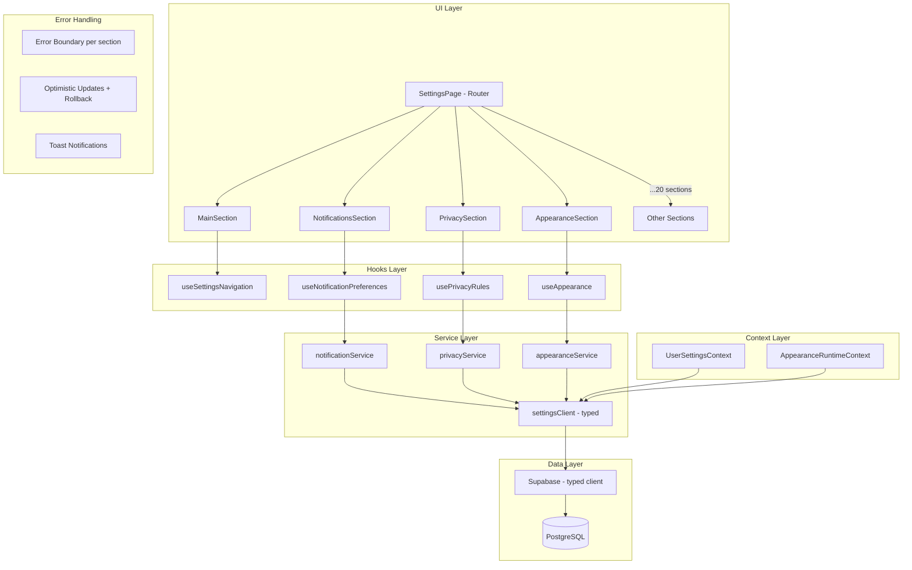
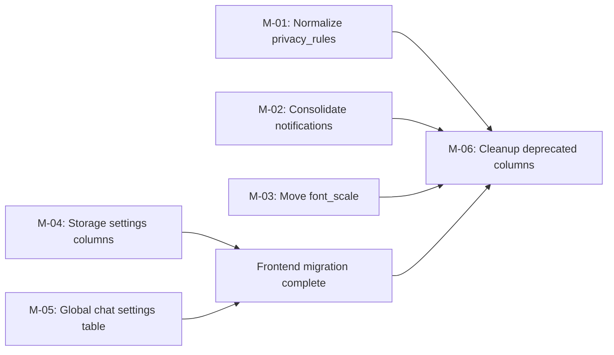

# Settings Module — Full Audit Report & Architecture Plan

> **Date:** 2026-03-26 | **Scope:** ~64 files, ~393K chars | **Tables:** 19 | **Hooks:** 14
> **Stack:** React 18 + TypeScript + Supabase (PostgreSQL + RLS + Realtime) + Tailwind CSS

---

## Table of Contents

1. [Executive Summary](#1-executive-summary)
2. [Full Issue Report — all 32 problems](#2-full-issue-report)
3. [Target Architecture](#3-target-architecture)
4. [Normalized DB Schema](#4-normalized-db-schema)
5. [Migration Plan](#5-migration-plan)
6. [Prioritized Task Plan](#6-prioritized-task-plan)
7. [Testing Recommendations](#7-testing-recommendations)

---

## 1. Executive Summary

The Settings module is the configuration backbone of the application. It currently suffers from **organic growth** without a coherent architecture, resulting in:

- **God Component** — `SettingsPage.tsx` at 4 500 lines with 10+ inline sections still unextracted
- **Type & utility duplication** — `Screen`, `formatCompact`, `BlockedUsersPanel` defined in multiple files
- **Data-access chaos** — 6 different patterns for reading/writing settings (direct Supabase, `supabase as any`, localStorage fallback, RPC, Realtime, hybrid)
- **Schema sprawl** — 19 tables with overlapping columns (e.g. `font_scale` in both `user_settings` and `user_appearance_settings`)
- **Silent data loss** — upsert calls without error handling in 3+ locations
- **Broken API usage** — `.upsert().eq()` chain that silently ignores the filter
- **Zero meaningful test coverage** — only 2 tests exist across the entire module

### Risk Assessment

| Category | Count | Immediate Impact |
|----------|-------|-----------------|
| 🔴 Critical | 11 | Data corruption, silent failures, stale UI |
| 🟠 High | 12 | Race conditions, inconsistent state, poor DX |
| 🟡 Medium | 9 | Dead code, broken a11y, cosmetic bugs |

### Recommended Strategy

**Phase 1 — Stabilize**: Fix critical bugs (broken upsert, error handling, dedup types)
**Phase 2 — Extract**: Complete section extraction from God Component
**Phase 3 — Unify**: Introduce service layer, consolidate DB tables, typed Supabase client
**Phase 4 — Harden**: Error boundaries, optimistic updates, comprehensive tests

---

## 2. Full Issue Report

### 🔴 CRITICAL (11 issues)

#### C-01: Duplicate `Screen` type

- **Files:** [`SettingsPage.tsx`](src/pages/SettingsPage.tsx:91), [`types.ts`](src/pages/settings/types.ts:7)
- **Impact:** Changing one copy does not update the other. TypeScript cannot catch mismatches because they are structurally identical but maintained separately.
- **Fix:** Delete the `Screen` definition in `SettingsPage.tsx` and import from `types.ts`.

#### C-02: Duplicate data types

- **Files:** [`SettingsPage.tsx`](src/pages/SettingsPage.tsx), [`types.ts`](src/pages/settings/types.ts:52)
- **Types:** `SettingsPostItem`, `SettingsStoryItem`, `SettingsLiveArchiveItem`, `ActivityCommentItem`, `ActivityRepostItem`
- **Impact:** Divergence risk; maintenance overhead.
- **Fix:** Single source in `types.ts`; remove inline copies.

#### C-03: Duplicate `formatCompact` with different locales

- **Files:** [`SettingsPage.tsx`](src/pages/SettingsPage.tsx) uses `"млн"/"тыс."` (Russian), [`formatters.ts`](src/pages/settings/formatters.ts:6) uses `"M"/"K"` (English)
- **Impact:** Inconsistent number formatting depending on which code path renders.
- **Fix:** Single `formatCompact` in `formatters.ts` with i18n support (accept locale parameter or use app-wide locale).

#### C-04: Duplicate `BlockedUsersPanel`

- **Files:** [`SettingsPage.tsx`](src/pages/SettingsPage.tsx), [`SettingsPrivacySection.tsx`](src/pages/settings/SettingsPrivacySection.tsx)
- **Impact:** Two panel implementations with different behavior — user sees different UI depending on navigation path.
- **Fix:** Extract single `BlockedUsersPanel` component into `src/components/settings/BlockedUsersPanel.tsx`.

#### C-05: Broken Supabase API — `.upsert().eq()`

- **File:** [`useAccessibility.ts`](src/hooks/useAccessibility.ts:91)
- **Code:** `supabase.from('user_settings').upsert({...}).eq('user_id', user.id)`
- **Impact:** `.eq()` on upsert is a PostgREST filter for returned rows, NOT a WHERE condition. The upsert still works via PK conflict, but the returned data is silently filtered to empty, making any subsequent logic based on the response fail.
- **Fix:** Remove `.eq()` call. Rely on `onConflict: 'user_id'` in the upsert options.

#### C-06: Upsert without error check — privacy rules

- **File:** [`privacy-security.ts`](src/lib/privacy-security.ts:126)
- **Code:** `await supabaseAny.from('privacy_rules').upsert(makeDefaultRows(userId), {...});` — result is discarded
- **Impact:** If the upsert fails (RLS, network, schema mismatch), the subsequent SELECT returns stale or empty data. No user feedback.
- **Fix:** Capture and handle error; fallback to cached data or show error toast.

#### C-07: Upsert without error check — notification categories

- **File:** [`useNotificationPreferences.tsx`](src/hooks/useNotificationPreferences.tsx:66)
- **Code:** Missing category upsert discards error
- **Impact:** Silent data loss; user sees UI that doesn't save.
- **Fix:** Capture error; retry or notify.

#### C-08: localStorage fallback — community controls

- **File:** [`community-controls.ts`](src/lib/community-controls.ts:34)
- **Impact:** If Supabase table is missing, settings are stored only in localStorage. They do NOT sync across devices or survive cache clears.
- **Fix:** Ensure the `user_channel_group_settings` table exists in all environments. Remove localStorage fallback for data that must sync.

#### C-09: `useStorageSettings` — localStorage only

- **File:** [`useStorageSettings.ts`](src/hooks/useStorageSettings.ts)
- **Impact:** Auto-download preferences are device-local. User changes on phone are invisible on desktop.
- **Fix:** Add Supabase persistence layer (similar to `user_settings` table columns `media_auto_download_*` which already exist but are unused by this hook).

#### C-10: Denormalized `PrivacyRule` — wide table

- **File:** [`privacy-security.ts`](src/lib/privacy-security.ts:26), migration [`20260220110000`](supabase/migrations/20260220110000_privacy_security_center.sql:16)
- **Impact:** Every row contains fields like `gift_badge_enabled`, `ios_call_integration`, `p2p_mode` — most are meaningless for a given `rule_key`. E.g. a `phone_number` rule has `gift_allow_premium` column with no semantic meaning.
- **Fix:** Split into `privacy_rules` (core: user_id, rule_key, audience) + `privacy_rule_options` (user_id, option_key, option_value) or use a JSONB `options` column with per-rule-key validation.

#### C-11: God Component — 4500-line `SettingsPage.tsx`

- **File:** [`SettingsPage.tsx`](src/pages/SettingsPage.tsx)
- **Impact:** Impossible to review, test, or parallelize development. Contains 10 unextracted inline sections, 30+ local state variables, ~90 imports.
- **Fix:** Complete Phase 2 extraction — pull every section into its own file.

---

### 🟠 HIGH (12 issues)

#### H-01: `font_scale` in two tables

- **Tables:** `user_settings.font_scale`, `user_appearance_settings.font_scale`
- **Impact:** Two sources of truth — `UserSettingsContext` reads from `user_settings`, `AppearanceRuntimeContext` reads from `user_appearance_settings`. Value can diverge.
- **Fix:** Deprecate `user_settings.font_scale`; canonical source = `user_appearance_settings`. Add migration to copy legacy values.

#### H-02: `reduce_motion` / `high_contrast` managed by two systems

- **Files:** [`UserSettingsContext.tsx`](src/contexts/UserSettingsContext.tsx:23) applies to `documentElement`, [`useAccessibility.ts`](src/hooks/useAccessibility.ts:37) applies to `document.body`
- **Impact:** Toggling via one path doesn't update the class on the other element. CSS selectors targeting `html.reduce-motion` vs `body.reduce-motion` behave differently.
- **Fix:** Single authority — `UserSettingsContext` owns these flags. `useAccessibility` reads from context, not localStorage.

#### H-03: Race condition in `UserSettingsContext` channels

- **File:** [`UserSettingsContext.tsx`](src/contexts/UserSettingsContext.tsx:70)
- **Impact:** If user ID changes rapidly (e.g. multi-account switch), old Realtime channel can fire after new one connects, overwriting new user's settings with old data.
- **Fix:** Use `cancelled` flag + unsubscribe in cleanup. Already partially present but not fully guarded.

#### H-04: Stale closure in upsertSettings

- **Files:** [`useQuietHours.ts`](src/hooks/useQuietHours.ts), [`useDndStatus.ts`](src/hooks/useDndStatus.ts)
- **Impact:** `useCallback` captures initial state; rapid toggles can send stale payload to server.
- **Fix:** Use `useRef` for latest settings or functional state update pattern.

#### H-05: Two sequential upserts in `muteChat`

- **File:** [`useChatSettings.ts`](src/hooks/useChatSettings.ts)
- **Impact:** First upsert sets mute, second updates related fields. If second fails, state is partially applied. Not transactional.
- **Fix:** Combine into a single upsert or use an RPC that wraps both in a transaction.

#### H-06: Missing error handling in upsertCategory / upsertException

- **File:** [`useNotificationPreferences.tsx`](src/hooks/useNotificationPreferences.tsx)
- **Impact:** No error toast, no optimistic rollback, no retry.
- **Fix:** Add try/catch with toast notification + optimistic update with rollback.

#### H-07: "MIGRATION IN PROGRESS" comment in production

- **File:** [`SettingsPage.tsx`](src/pages/SettingsPage.tsx:4)
- **Impact:** Signals unfinished work shipping to production. Confusing for contributors.
- **Fix:** Complete the migration or remove the WIP header and document remaining work in a tracking issue.

#### H-08: Two competing notification type systems

- **Files:** [`useNotifications.ts`](src/hooks/useNotifications.ts:25) defines `NotificationSettings`, [`useNotificationPreferences.tsx`](src/hooks/useNotificationPreferences.tsx:8) defines `NotificationCategorySetting`
- **Impact:** `useNotifications` reads from `notification_settings` table (flat booleans), `useNotificationPreferences` reads from `notification_category_settings` (per-category rows). Different consumers use different hooks.
- **Fix:** Consolidate into `useNotificationPreferences` as the canonical source. Deprecate flat `notification_settings` table.

#### H-09: `GlobalChatSettings` without DB sync

- **File:** [`useChatSettings.ts`](src/hooks/useChatSettings.ts:75)
- **Impact:** When `globalTableAvailable` is false, settings silently revert to defaults. No persistence.
- **Fix:** Ensure `user_global_chat_settings` table exists. Add proper migration.

#### H-10: No Error Boundary for Settings sections

- **Impact:** A runtime error in any settings section crashes the entire settings page.
- **Fix:** Wrap each section in a `<SettingsSectionErrorBoundary>` with "Something went wrong" fallback UI.

#### H-11: `updateSettings` in `UserSettingsContext` doesn't surface errors

- **File:** [`UserSettingsContext.tsx`](src/contexts/UserSettingsContext.tsx)
- **Impact:** Update failures are logged but user sees no feedback.
- **Fix:** Return errors from `update()` and show toast.

#### H-12: `supabase as any` mass type bypass

- **Files:** [`appearance-energy.ts`](src/lib/appearance-energy.ts:47), [`privacy-security.ts`](src/lib/privacy-security.ts), [`useNotificationPreferences.tsx`](src/hooks/useNotificationPreferences.tsx:36), [`stickers-reactions.ts`](src/lib/stickers-reactions.ts), [`community-controls.ts`](src/lib/community-controls.ts)
- **Impact:** No compile-time safety for table names, column names, or return types.
- **Fix:** Generate Supabase types with `supabase gen types`. Extend the generated types for custom tables if needed.

---

### 🟡 MEDIUM (9 issues)

#### M-01: Silent incorrect behavior with invalid `dnd_until`

- **File:** [`useDndStatus.ts`](src/hooks/useDndStatus.ts)
- **Impact:** If `dnd_until` is a non-parseable string, `new Date(dnd_until)` returns `Invalid Date`. Timer logic silently fails.
- **Fix:** Validate `dnd_until` on read; auto-disable DND if invalid.

#### M-02: `filePath` computed but unused in `uploadCustomWallpaper`

- **File:** [`AppearanceAndEnergyCenter.tsx`](src/components/settings/AppearanceAndEnergyCenter.tsx)
- **Impact:** Dead code; confusing during review.
- **Fix:** Remove unused variable.

#### M-03: `console.error` in production

- **Files:** Multiple hooks and lib files
- **Impact:** Leaks internal details to browser console; not caught by error monitoring.
- **Fix:** Replace with `logger.error()` (already exists) which can be piped to Sentry.

#### M-04: Dead code in `helpers.tsx`

- **File:** [`helpers.tsx`](src/pages/settings/helpers.tsx)
- **Impact:** Unreachable functions increase bundle size.
- **Fix:** Audit and remove unused exports.

#### M-05: `mapThemePreference` — identity function

- **File:** [`UserSettingsContext.tsx`](src/contexts/UserSettingsContext.tsx:35)
- **Code:** `function mapThemePreference(pref: ThemePreference): "light" | "dark" | "system" { return pref; }`
- **Impact:** Adds cognitive overhead for zero functionality.
- **Fix:** Inline or remove.

#### M-06: `isSchemaMissingError` — divergent implementations

- **Files:** [`community-controls.ts`](src/lib/community-controls.ts:22), [`supabaseProbe.ts`](src/lib/supabaseProbe.ts:14), [`useChatSettings.ts`](src/hooks/useChatSettings.ts:78)
- **Impact:** Each checks different error codes/messages. Some miss cases the others catch.
- **Fix:** Extract a single `isTableMissingError()` utility into `src/lib/errors.ts`.

#### M-07: `SettingsActivitySection` lazy-loads data only on click

- **File:** [`SettingsActivitySection.tsx`](src/pages/settings/SettingsActivitySection.tsx)
- **Impact:** User sees a spinner every time they tap into activity. No prefetching.
- **Fix:** Prefetch when settings page mounts or use React Query with stale-while-revalidate.

#### M-08: Realtime stale closure in `useNotificationPreferences`

- **File:** [`useNotificationPreferences.tsx`](src/hooks/useNotificationPreferences.tsx)
- **Impact:** Realtime callback captures stale `categories` / `exceptions` state.
- **Fix:** Use `useRef` to hold latest state for Realtime callback.

#### M-09: Comments in Russian violate "All comments MUST be in English" rule

- **Files:** [`useAccessibility.ts`](src/hooks/useAccessibility.ts:40), [`useDndStatus.ts`](src/hooks/useDndStatus.ts:1), [`useQuietHours.ts`](src/hooks/useQuietHours.ts:1), and others
- **Impact:** Style guide violation.
- **Fix:** Translate all Russian comments to English.

---

## 3. Target Architecture

### 3.1 File Structure

```
src/
├── features/
│   └── settings/
│       ├── index.ts                          # barrel exports
│       ├── SettingsPage.tsx                   # thin router/orchestrator (~100 lines)
│       │
│       ├── components/                        # UI components
│       │   ├── SettingsLayout.tsx             # shared header, back-nav, scroll container
│       │   ├── SettingsMenuItem.tsx           # reusable menu row
│       │   ├── SettingsToggle.tsx             # label + switch
│       │   ├── SettingsSlider.tsx             # label + slider
│       │   ├── SettingsSelect.tsx             # label + dropdown
│       │   ├── SettingsSectionError.tsx       # Error Boundary fallback
│       │   ├── BlockedUsersPanel.tsx          # single source
│       │   └── QuietHoursConfigurator.tsx     # quiet hours UI
│       │
│       ├── sections/                          # page sections (1 file = 1 screen)
│       │   ├── MainSection.tsx
│       │   ├── ProfileStatusSection.tsx
│       │   ├── SavedSection.tsx
│       │   ├── ArchiveSection.tsx
│       │   ├── ActivitySection.tsx
│       │   ├── NotificationsSection.tsx
│       │   ├── CallsSection.tsx
│       │   ├── DataStorageSection.tsx
│       │   ├── PrivacySection.tsx
│       │   ├── SecuritySection.tsx
│       │   ├── AppearanceSection.tsx
│       │   ├── EnergySaverSection.tsx
│       │   ├── LanguageSection.tsx
│       │   ├── AccessibilitySection.tsx
│       │   ├── ChatFoldersSection.tsx
│       │   ├── StatisticsSection.tsx
│       │   ├── BrandedContentSection.tsx
│       │   ├── CloseFriendsSection.tsx
│       │   ├── StickersReactionsSection.tsx
│       │   ├── HelpSection.tsx
│       │   └── AboutSection.tsx
│       │
│       ├── hooks/                             # settings-specific hooks
│       │   ├── useSettingsNavigation.ts       # screen state machine
│       │   ├── useNotificationPreferences.ts  # single notification system
│       │   ├── usePrivacyRules.ts
│       │   ├── useAppearance.ts
│       │   ├── useEnergySaver.ts
│       │   ├── useDndStatus.ts
│       │   ├── useQuietHours.ts
│       │   ├── useChatFolders.ts              # if settings-specific
│       │   └── useAccessibility.ts
│       │
│       ├── services/                          # data access layer
│       │   ├── settingsClient.ts              # typed Supabase wrapper
│       │   ├── userSettingsService.ts         # CRUD for user_settings
│       │   ├── appearanceService.ts           # CRUD for appearance + energy
│       │   ├── privacyService.ts              # CRUD for privacy_rules
│       │   ├── notificationService.ts         # CRUD for notification_category_settings
│       │   ├── communityService.ts            # CRUD for channel_group_settings
│       │   ├── stickersService.ts             # CRUD for stickers/emoji
│       │   └── dndService.ts                  # CRUD for DND + quiet hours
│       │
│       ├── types/                             # single source of truth for types
│       │   ├── index.ts                       # barrel
│       │   ├── screens.ts                     # Screen type
│       │   ├── settings.ts                    # UserSettings, AppearanceSettings, etc.
│       │   ├── privacy.ts                     # PrivacyRule, PrivacyAudience, etc.
│       │   ├── notifications.ts               # NotificationCategory, etc.
│       │   └── data-models.ts                 # SettingsPostItem, etc.
│       │
│       ├── utils/                             # pure functions
│       │   ├── formatters.ts                  # formatCompact, formatBytes, etc.
│       │   ├── validators.ts                  # validateDndUntil, etc.
│       │   └── errorHelpers.ts                # isTableMissingError
│       │
│       └── contexts/
│           ├── UserSettingsContext.tsx         # global settings provider
│           └── AppearanceRuntimeContext.tsx    # CSS variable application
```

### 3.2 Architecture Diagram



### 3.3 Service Layer Design

**Problem:** Currently, each lib file (`user-settings.ts`, `privacy-security.ts`, `appearance-energy.ts`, etc.) directly calls `supabase as any` with no shared error handling.

**Solution:** A typed `settingsClient` wrapper:

```typescript
// src/features/settings/services/settingsClient.ts

import { supabase } from '@/integrations/supabase/client';
import { Database } from '@/integrations/supabase/types'; // generated

type TypedClient = ReturnType<typeof supabase>;

class SettingsClient {
  private client: TypedClient;

  constructor(client: TypedClient) {
    this.client = client;
  }

  async upsert<T extends keyof Database['public']['Tables']>(
    table: T,
    data: Database['public']['Tables'][T]['Insert'],
    options?: { onConflict: string }
  ) {
    const { data: result, error } = await this.client
      .from(table)
      .upsert(data, options);

    if (error) {
      if (this.isTableMissing(error)) {
        throw new TableMissingError(table, error);
      }
      throw new SettingsWriteError(table, error);
    }
    return result;
  }

  // ... select, update, delete methods

  private isTableMissing(error: unknown): boolean {
    const code = String((error as any)?.code ?? '');
    return code === '42P01' || code === 'PGRST205';
  }
}
```

**Optimistic Updates Pattern:**

```typescript
// In each hook
async function updateSetting(key: string, value: unknown) {
  const prevState = stateRef.current;

  // 1. Optimistic update
  setState(prev => ({ ...prev, [key]: value }));

  try {
    // 2. Server persist
    await settingsService.update(userId, { [key]: value });
  } catch (error) {
    // 3. Rollback
    setState(prevState);
    toast.error('Failed to save setting');
    logger.error('Settings update failed', { key, error });
  }
}
```

### 3.4 State Management Strategy

| Concern | Solution |
|---------|----------|
| Global user settings | `UserSettingsContext` — single provider at app root |
| Appearance CSS vars | `AppearanceRuntimeContext` — applies CSS vars, reads from service |
| Section-local state | Local `useState` within each section component |
| Server cache | React Query with `staleTime: 30s` for infrequently changed data |
| Optimistic updates | Hook-level with rollback (see pattern above) |
| Cross-device sync | Supabase Realtime subscription in context providers |

### 3.5 Resolving Key Conflicts

**`font_scale` conflict:**
- Canonical table: `user_appearance_settings`
- Migration: Copy `user_settings.font_scale` → `user_appearance_settings.font_scale` where they differ
- Deprecate `user_settings.font_scale` (keep column but stop reading it)
- Frontend reads exclusively from `AppearanceRuntimeContext`

**Two notification systems:**
- Canonical: `notification_category_settings` (per-category, granular)
- Deprecate: `notification_settings` table + `useNotifications.NotificationSettings` type
- Migration: Map `likes: true` → category `reactions.is_enabled = true`, etc.
- Single hook: `useNotificationPreferences`

**`reduce_motion` / `high_contrast` dual DOM targets:**
- Single authority: `UserSettingsContext`
- Both classes applied to `document.documentElement` only
- `useAccessibility` becomes a consumer, not a provider

---

## 4. Normalized DB Schema

### 4.1 Current State: 19 Tables

```
user_settings                    # Main settings - wide table
user_appearance_settings         # Appearance
user_energy_saver_settings       # Energy saver
user_security_settings           # Security
user_channel_group_settings      # Community controls
user_emoji_preferences           # Emoji prefs
user_dnd_settings                # Do Not Disturb
notification_category_settings   # Per-category notifications
notification_settings            # Flat notification toggles (DUPLICATE)
user_chat_settings               # Per-chat settings
user_global_chat_settings        # Global chat defaults
channel_user_settings            # Per-channel prefs
supergroup_settings              # Supergroup settings
settings_change_audit            # Audit log
email_smtp_settings              # Email SMTP
email_imap_settings              # Email IMAP
user_story_settings              # Story privacy
content_preferences              # Content prefs
close_friends                    # Close friends list
```

### 4.2 Proposed Consolidated Schema

#### Strategy: Keep domain separation, eliminate redundancy

We do NOT consolidate into a single table — that would create an even wider god-table. Instead we:

1. **Merge overlapping tables** (e.g. `notification_settings` into `notification_category_settings`)
2. **Remove duplicate columns** (e.g. `font_scale` from `user_settings`)
3. **Normalize wide tables** (e.g. `privacy_rules`)
4. **Ensure every table has proper RLS + constraints**

#### 4.2.1 Core Settings — `user_settings` (simplified)

```sql
-- Remove: font_scale (moved to user_appearance_settings)
-- Remove: likes/comments/followers_notifications (moved to notification_category_settings)
-- Keep: other core settings

CREATE TABLE public.user_settings (
  user_id             UUID PRIMARY KEY REFERENCES auth.users(id) ON DELETE CASCADE,

  -- Theme & Language
  theme               TEXT NOT NULL DEFAULT 'system' CHECK (theme IN ('light','dark','system')),
  language_code       TEXT NOT NULL DEFAULT 'ru',

  -- Accessibility (single source)
  reduce_motion       BOOLEAN NOT NULL DEFAULT false,
  high_contrast       BOOLEAN NOT NULL DEFAULT false,

  -- Privacy basics
  private_account     BOOLEAN NOT NULL DEFAULT false,
  show_activity_status BOOLEAN NOT NULL DEFAULT true,

  -- Branded content
  branded_content_manual_approval BOOLEAN NOT NULL DEFAULT false,

  -- Calls
  show_calls_tab               BOOLEAN NOT NULL DEFAULT true,
  calls_noise_suppression      BOOLEAN NOT NULL DEFAULT true,
  calls_p2p_mode               TEXT NOT NULL DEFAULT 'everyone'
                               CHECK (calls_p2p_mode IN ('everyone','contacts','nobody')),

  -- Session policy
  sessions_auto_terminate_days INTEGER NOT NULL DEFAULT 180,
  messages_auto_delete_seconds INTEGER NOT NULL DEFAULT 0,
  account_self_destruct_days   INTEGER NOT NULL DEFAULT 180,

  -- Data & Storage
  media_auto_download_enabled  BOOLEAN NOT NULL DEFAULT true,
  media_auto_download_photos   BOOLEAN NOT NULL DEFAULT true,
  media_auto_download_videos   BOOLEAN NOT NULL DEFAULT true,
  media_auto_download_files    BOOLEAN NOT NULL DEFAULT true,
  media_auto_download_files_max_mb INTEGER NOT NULL DEFAULT 3,
  cache_auto_delete_days       INTEGER NOT NULL DEFAULT 7,
  cache_max_size_mb            INTEGER,

  -- Storage (migrated from localStorage)
  auto_download_photos_wifi    BOOLEAN NOT NULL DEFAULT true,
  auto_download_photos_mobile  BOOLEAN NOT NULL DEFAULT true,
  auto_download_video_wifi     BOOLEAN NOT NULL DEFAULT true,
  auto_download_video_mobile   BOOLEAN NOT NULL DEFAULT false,

  created_at TIMESTAMPTZ NOT NULL DEFAULT now(),
  updated_at TIMESTAMPTZ NOT NULL DEFAULT now()
);
```

**Removed columns:**
- `font_scale` → canonical in `user_appearance_settings`
- `push_notifications`, `likes_notifications`, `comments_notifications`, `followers_notifications` → `notification_category_settings`
- `notif_sound_id`, `notif_vibrate`, `notif_show_text`, `notif_show_sender`, `mention_notifications` → `notification_category_settings`

#### 4.2.2 Privacy Rules — Normalized

```sql
-- Core rules table: thin, one row per rule_key per user
CREATE TABLE public.privacy_rules (
  user_id    UUID NOT NULL REFERENCES auth.users(id) ON DELETE CASCADE,
  rule_key   TEXT NOT NULL CHECK (rule_key IN (
    'phone_number','last_seen','profile_photos','bio','gifts',
    'birthday','saved_music','forwarded_messages','calls',
    'voice_messages','messages','invites'
  )),
  audience   TEXT NOT NULL DEFAULT 'everyone'
             CHECK (audience IN ('everyone','contacts','nobody','contacts_and_premium','paid_messages')),
  PRIMARY KEY (user_id, rule_key),
  updated_at TIMESTAMPTZ NOT NULL DEFAULT now(),
  created_at TIMESTAMPTZ NOT NULL DEFAULT now()
);

-- Rule-specific options: flexible key-value per rule
CREATE TABLE public.privacy_rule_options (
  user_id    UUID NOT NULL,
  rule_key   TEXT NOT NULL,
  option_key TEXT NOT NULL,  -- e.g. 'p2p_mode', 'gift_badge_enabled', 'hide_read_time'
  option_value TEXT NOT NULL, -- stored as text, parsed by app
  PRIMARY KEY (user_id, rule_key, option_key),
  FOREIGN KEY (user_id, rule_key) REFERENCES public.privacy_rules(user_id, rule_key) ON DELETE CASCADE,
  updated_at TIMESTAMPTZ NOT NULL DEFAULT now()
);

-- Phone-specific global settings (not per-rule)
CREATE TABLE public.privacy_global_options (
  user_id                UUID PRIMARY KEY REFERENCES auth.users(id) ON DELETE CASCADE,
  phone_discovery_audience TEXT NOT NULL DEFAULT 'contacts'
                         CHECK (phone_discovery_audience IN ('everyone','contacts')),
  ios_call_integration   BOOLEAN NOT NULL DEFAULT true,
  updated_at             TIMESTAMPTZ NOT NULL DEFAULT now()
);
```

#### 4.2.3 Notifications — Consolidated

```sql
-- Single table for per-category notification settings
-- Replaces: notification_settings + notification_category_settings
CREATE TABLE public.notification_category_settings (
  id          UUID PRIMARY KEY DEFAULT gen_random_uuid(),
  user_id     UUID NOT NULL REFERENCES auth.users(id) ON DELETE CASCADE,
  category    TEXT NOT NULL CHECK (category IN (
    'dm','group','channel','stories','reactions',
    'likes','comments','follows','mentions','live','system'
  )),
  is_enabled  BOOLEAN NOT NULL DEFAULT true,
  sound_id    TEXT DEFAULT 'rebound',
  vibrate     BOOLEAN DEFAULT true,
  show_text   BOOLEAN DEFAULT true,
  show_sender BOOLEAN DEFAULT true,
  UNIQUE (user_id, category),
  created_at  TIMESTAMPTZ NOT NULL DEFAULT now(),
  updated_at  TIMESTAMPTZ NOT NULL DEFAULT now()
);

-- Global notification flags (push master switch, DND pointer)
-- Lives in user_settings or a small dedicated table:
-- push_notifications moved here as a master toggle
ALTER TABLE public.user_settings
  ADD COLUMN IF NOT EXISTS push_notifications_master BOOLEAN NOT NULL DEFAULT true;
```

#### 4.2.4 Tables to DEPRECATE (not drop immediately)

| Table | Reason | Migration Target |
|-------|--------|-----------------|
| `notification_settings` | Replaced by `notification_category_settings` | See migration M-04 |
| (redundant columns in `user_settings`) | `font_scale`, notification flags | Respective tables |

#### 4.2.5 Entity Relationship Diagram

```mermaid
erDiagram
    AUTH_USERS ||--o| USER_SETTINGS : "1:1"
    AUTH_USERS ||--o| USER_APPEARANCE_SETTINGS : "1:1"
    AUTH_USERS ||--o| USER_ENERGY_SAVER_SETTINGS : "1:1"
    AUTH_USERS ||--o| USER_DND_SETTINGS : "1:1"
    AUTH_USERS ||--o| PRIVACY_GLOBAL_OPTIONS : "1:1"
    AUTH_USERS ||--o{ PRIVACY_RULES : "1:N by rule_key"
    PRIVACY_RULES ||--o{ PRIVACY_RULE_OPTIONS : "1:N options"
    AUTH_USERS ||--o{ PRIVACY_RULE_EXCEPTIONS : "1:N"
    AUTH_USERS ||--o{ NOTIFICATION_CATEGORY_SETTINGS : "1:N by category"
    AUTH_USERS ||--o{ NOTIFICATION_EXCEPTIONS : "1:N per item"
    AUTH_USERS ||--o{ USER_CHAT_SETTINGS : "1:N per conversation"
    AUTH_USERS ||--o| USER_GLOBAL_CHAT_SETTINGS : "1:1"
    AUTH_USERS ||--o{ CHANNEL_USER_SETTINGS : "1:N per channel"
    AUTH_USERS ||--o| USER_EMOJI_PREFERENCES : "1:1"
    AUTH_USERS ||--o{ CLOSE_FRIENDS : "1:N"
    AUTH_USERS ||--o| USER_STORY_SETTINGS : "1:1"
    AUTH_USERS ||--o{ SETTINGS_CHANGE_AUDIT : "1:N log entries"
```



---

## 5. Migration Plan

### Overall Strategy

- Each migration is **additive first** (add new columns/tables) then **deprecation** (mark old columns)
- Final **cleanup** migrations drop deprecated columns after frontend is fully migrated
- Every migration has a **rollback script** embedded as a comment

### Migration Sequence

#### M-01: Normalize privacy_rules

**Risk:** 🟠 HIGH — changes core privacy data structure

```sql
-- UP
-- 1. Create privacy_rule_options table
-- 2. Create privacy_global_options table  
-- 3. Migrate data from wide columns to new tables
-- 4. Keep old columns (backward compat)
-- 5. Add RLS to new tables

-- ROLLBACK
-- 1. Drop privacy_global_options
-- 2. Drop privacy_rule_options
```

**Dependencies:** None
**Rollback:** Safe — old columns remain readable

#### M-02: Consolidate notification tables

**Risk:** 🟠 HIGH — touches notification delivery path

```sql
-- UP
-- 1. Expand notification_category_settings categories
-- 2. Migrate notification_settings rows to category_settings
-- 3. Mark notification_settings as deprecated (add comment)
-- 4. Add push_notifications_master to user_settings

-- ROLLBACK
-- 1. Remove new categories from notification_category_settings
-- 2. Drop push_notifications_master column
```

**Dependencies:** None
**Rollback:** Safe — old table still works

#### M-03: Move font_scale canonical source

**Risk:** 🟡 MEDIUM — display setting, non-destructive

```sql
-- UP
-- 1. Copy user_settings.font_scale to user_appearance_settings.font_scale
--    WHERE they differ (prefer user_appearance_settings value)
-- 2. Add comment marking user_settings.font_scale as deprecated

-- ROLLBACK
-- 1. No schema changes needed (just data copy was additive)
```

**Dependencies:** None
**Rollback:** Automatic — both columns still exist

#### M-04: Add storage settings columns to user_settings

**Risk:** 🟢 LOW — additive columns only

```sql
-- UP
ALTER TABLE public.user_settings
  ADD COLUMN IF NOT EXISTS auto_download_photos_wifi BOOLEAN NOT NULL DEFAULT true,
  ADD COLUMN IF NOT EXISTS auto_download_photos_mobile BOOLEAN NOT NULL DEFAULT true,
  ADD COLUMN IF NOT EXISTS auto_download_video_wifi BOOLEAN NOT NULL DEFAULT true,
  ADD COLUMN IF NOT EXISTS auto_download_video_mobile BOOLEAN NOT NULL DEFAULT false;

-- ROLLBACK
ALTER TABLE public.user_settings
  DROP COLUMN IF EXISTS auto_download_photos_wifi,
  DROP COLUMN IF EXISTS auto_download_photos_mobile,
  DROP COLUMN IF EXISTS auto_download_video_wifi,
  DROP COLUMN IF EXISTS auto_download_video_mobile;
```

**Dependencies:** None
**Rollback:** Safe drop

#### M-05: Create user_global_chat_settings if not exists

**Risk:** 🟢 LOW — additive

```sql
-- UP
CREATE TABLE IF NOT EXISTS public.user_global_chat_settings (
  user_id UUID PRIMARY KEY REFERENCES auth.users(id) ON DELETE CASCADE,
  -- all columns from GlobalChatSettings type
  message_sound TEXT NOT NULL DEFAULT 'default',
  group_sound TEXT NOT NULL DEFAULT 'default',
  show_preview BOOLEAN NOT NULL DEFAULT true,
  -- ... etc
  created_at TIMESTAMPTZ NOT NULL DEFAULT now(),
  updated_at TIMESTAMPTZ NOT NULL DEFAULT now()
);
-- + RLS policies

-- ROLLBACK
-- DROP TABLE IF EXISTS public.user_global_chat_settings;
```

**Dependencies:** None

#### M-06: Cleanup deprecated columns (Phase 4)

**Risk:** 🔴 HIGH — destructive, must verify all frontend code migrated

```sql
-- UP (execute ONLY after frontend fully migrated)
ALTER TABLE public.user_settings
  DROP COLUMN IF EXISTS font_scale,
  DROP COLUMN IF EXISTS likes_notifications,
  DROP COLUMN IF EXISTS comments_notifications,
  DROP COLUMN IF EXISTS followers_notifications,
  DROP COLUMN IF EXISTS notif_sound_id,
  DROP COLUMN IF EXISTS notif_vibrate,
  DROP COLUMN IF EXISTS notif_show_text,
  DROP COLUMN IF EXISTS notif_show_sender,
  DROP COLUMN IF EXISTS mention_notifications;

-- Mark notification_settings as deprecated view or drop
-- DROP TABLE IF EXISTS public.notification_settings;

-- Drop wide columns from privacy_rules
ALTER TABLE public.privacy_rules
  DROP COLUMN IF EXISTS phone_discovery_audience,
  DROP COLUMN IF EXISTS p2p_mode,
  DROP COLUMN IF EXISTS hide_read_time,
  DROP COLUMN IF EXISTS gift_badge_enabled,
  -- ... etc

-- ROLLBACK: Restore columns (requires data backup!)
```

**Dependencies:** M-01, M-02, M-03 + full frontend migration
**Rollback:** Requires data restore from backup — MUST take backup before running

### Migration Dependency Graph



---

## 6. Prioritized Task Plan

### 🔴 CRITICAL — Fix Immediately

| ID | Task | Files | Dependencies | Testing |
|----|------|-------|-------------|---------|
| T-01 | Fix `.upsert().eq()` bug | [`useAccessibility.ts`](src/hooks/useAccessibility.ts:91) | None | Unit test: verify upsert saves correctly |
| T-02 | Add error handling to privacy rules upsert | [`privacy-security.ts`](src/lib/privacy-security.ts:126) | None | Unit test: verify error toast on failure |
| T-03 | Add error handling to notification category upsert | [`useNotificationPreferences.tsx`](src/hooks/useNotificationPreferences.tsx:66) | None | Unit test: verify error handling |
| T-04 | Delete duplicate `Screen` type from SettingsPage | [`SettingsPage.tsx`](src/pages/SettingsPage.tsx:91), [`types.ts`](src/pages/settings/types.ts:7) | None | TypeScript compilation check |
| T-05 | Delete duplicate data types from SettingsPage | [`SettingsPage.tsx`](src/pages/SettingsPage.tsx), [`types.ts`](src/pages/settings/types.ts) | T-04 | TypeScript compilation check |
| T-06 | Unify `formatCompact` to single locale-aware version | [`SettingsPage.tsx`](src/pages/SettingsPage.tsx), [`formatters.ts`](src/pages/settings/formatters.ts) | None | Unit test with ru/en locales |
| T-07 | Deduplicate `BlockedUsersPanel` | [`SettingsPage.tsx`](src/pages/SettingsPage.tsx), [`SettingsPrivacySection.tsx`](src/pages/settings/SettingsPrivacySection.tsx) | None | Visual regression test |
| T-08 | Remove localStorage fallback for community-controls when table exists | [`community-controls.ts`](src/lib/community-controls.ts) | M-05 migration applied | Integration test: settings persist cross-device |

### 🟠 HIGH — Current Sprint

| ID | Task | Files | Dependencies | Testing |
|----|------|-------|-------------|---------|
| T-09 | Extract unified `isTableMissingError` utility | [`community-controls.ts`](src/lib/community-controls.ts), [`supabaseProbe.ts`](src/lib/supabaseProbe.ts), [`useChatSettings.ts`](src/hooks/useChatSettings.ts) → new `src/lib/errors.ts` | None | Unit test with various error shapes |
| T-10 | Fix `font_scale` dual source — read only from appearance | [`UserSettingsContext.tsx`](src/contexts/UserSettingsContext.tsx), [`AppearanceRuntimeContext.tsx`](src/contexts/AppearanceRuntimeContext.tsx) | DB: M-03 | Integration test |
| T-11 | Fix `reduce_motion`/`high_contrast` dual DOM targets | [`UserSettingsContext.tsx`](src/contexts/UserSettingsContext.tsx), [`useAccessibility.ts`](src/hooks/useAccessibility.ts) | None | a11y test |
| T-12 | Fix race condition in `UserSettingsContext` Realtime channel | [`UserSettingsContext.tsx`](src/contexts/UserSettingsContext.tsx:70) | None | Manual test: rapid account switch |
| T-13 | Fix stale closure in `useQuietHours` and `useDndStatus` | [`useQuietHours.ts`](src/hooks/useQuietHours.ts), [`useDndStatus.ts`](src/hooks/useDndStatus.ts) | None | Unit test: rapid toggle |
| T-14 | Combine two sequential upserts in `muteChat` | [`useChatSettings.ts`](src/hooks/useChatSettings.ts) | None | Integration test |
| T-15 | Add error handling + optimistic updates to `upsertCategory`/`upsertException` | [`useNotificationPreferences.tsx`](src/hooks/useNotificationPreferences.tsx) | T-03 | Unit test |
| T-16 | Consolidate notification type systems — deprecate `useNotifications.NotificationSettings` | [`useNotifications.ts`](src/hooks/useNotifications.ts), [`useNotificationPreferences.tsx`](src/hooks/useNotificationPreferences.tsx) | DB: M-02 | Integration test |
| T-17 | Add DB sync to `useStorageSettings` | [`useStorageSettings.ts`](src/hooks/useStorageSettings.ts) | DB: M-04 | Cross-device sync test |
| T-18 | Add Error Boundary wrapper for each settings section | New file: `src/features/settings/components/SettingsSectionError.tsx` | None | Unit test: error rendering |
| T-19 | Surface errors in `UserSettingsContext.update()` | [`UserSettingsContext.tsx`](src/contexts/UserSettingsContext.tsx) | None | Unit test |
| T-20 | Generate Supabase types; remove all `supabase as any` | [`appearance-energy.ts`](src/lib/appearance-energy.ts), [`privacy-security.ts`](src/lib/privacy-security.ts), [`useNotificationPreferences.tsx`](src/hooks/useNotificationPreferences.tsx), [`stickers-reactions.ts`](src/lib/stickers-reactions.ts), [`community-controls.ts`](src/lib/community-controls.ts) | DB schema stable | TypeScript strict mode compilation |
| T-21 | Extract remaining 10 inline sections from `SettingsPage.tsx` | [`SettingsPage.tsx`](src/pages/SettingsPage.tsx) | T-04, T-05 | Section renders correctly |

### 🟡 MEDIUM — Next Sprint

| ID | Task | Files | Dependencies | Testing |
|----|------|-------|-------------|---------|
| T-22 | Validate `dnd_until` on read + auto-disable stale DND | [`useDndStatus.ts`](src/hooks/useDndStatus.ts) | None | Unit test with invalid dates |
| T-23 | Remove unused `filePath` variable | [`AppearanceAndEnergyCenter.tsx`](src/components/settings/AppearanceAndEnergyCenter.tsx) | None | Lint check |
| T-24 | Replace `console.error` with `logger.error` | Multiple hooks and libs | None | Grep verification |
| T-25 | Remove dead code from `helpers.tsx` | [`helpers.tsx`](src/pages/settings/helpers.tsx) | T-21 (confirm unused) | Bundle size check |
| T-26 | Remove `mapThemePreference` identity function | [`UserSettingsContext.tsx`](src/contexts/UserSettingsContext.tsx:35) | None | TypeScript compilation |
| T-27 | Add prefetching for `SettingsActivitySection` | [`SettingsActivitySection.tsx`](src/pages/settings/SettingsActivitySection.tsx) | None | Load time measurement |
| T-28 | Fix Realtime stale closure in `useNotificationPreferences` | [`useNotificationPreferences.tsx`](src/hooks/useNotificationPreferences.tsx) | None | Unit test with Realtime mock |
| T-29 | Translate all Russian comments to English | Multiple files | None | Lint rule or grep check |
| T-30 | Normalize `privacy_rules` table (backend) | DB migration M-01 | None | Migration test |
| T-31 | Create `settingsClient` typed wrapper | New service layer | T-20 | Unit test |

### 🟢 LOW — Backlog

| ID | Task | Files | Dependencies | Testing |
|----|------|-------|-------------|---------|
| T-32 | Implement service layer (full) | New `src/features/settings/services/` | T-31, T-20 | Integration tests |
| T-33 | Move file structure to `src/features/settings/` | All settings files | T-21, T-32 | All tests pass after move |
| T-34 | Add React Query caching for settings hooks | All hooks | T-32 | Performance benchmarks |
| T-35 | Implement comprehensive audit logging | [`settings_change_audit`](supabase/migrations) | T-32 | e2e test: change → audit log entry |
| T-36 | Drop deprecated notification_settings table | DB migration M-06 | T-16, T-21 | Integration test |
| T-37 | Drop deprecated columns from user_settings | DB migration M-06 | All frontend tasks complete | Full regression |

---

## 7. Testing Recommendations

### 7.1 Current Coverage

| Metric | Value |
|--------|-------|
| Existing tests | 2 |
| Total files to test | ~64 |
| Estimated test coverage | < 1% |
| Target coverage | > 80% |

### 7.2 Unit Tests (per module)

#### Service Layer / Lib files

| Module | Tests Needed | Priority |
|--------|-------------|----------|
| [`user-settings.ts`](src/lib/user-settings.ts) | `getOrCreateUserSettings` (happy + error), `updateUserSettings` (happy + error + network failure), defaults merging | 🔴 |
| [`privacy-security.ts`](src/lib/privacy-security.ts) | `getOrCreatePrivacyRules` (happy + upsert error + select error), `updatePrivacyRule` validation, exception CRUD | 🔴 |
| [`appearance-energy.ts`](src/lib/appearance-energy.ts) | `getOrCreateAppearanceSettings` (happy + table missing), `updateAppearance` merge logic | 🟠 |
| [`community-controls.ts`](src/lib/community-controls.ts) | Supabase call + fallback behavior + `isSchemaMissingError` | 🟠 |
| [`stickers-reactions.ts`](src/lib/stickers-reactions.ts) | Pack CRUD, emoji preferences upsert | 🟡 |
| [`formatters.ts`](src/pages/settings/formatters.ts) | `formatCompact` (0, 999, 1000, 999999, 1000000, Infinity, NaN), `formatBytes`, `dayLabel`, `estimateLocalStorageBytes` | 🟢 |
| New `errorHelpers.ts` | `isTableMissingError` with 10+ error shape variations | 🟠 |

#### Hooks

| Hook | Tests Needed | Priority |
|------|-------------|----------|
| [`useAccessibility.ts`](src/hooks/useAccessibility.ts) | Settings load from localStorage, update syncs to Supabase (mock), DOM class application | 🔴 |
| [`useDndStatus.ts`](src/hooks/useDndStatus.ts) | Enable/disable DND, timer expiry, invalid `dnd_until`, stale closure prevention | 🔴 |
| [`useQuietHours.ts`](src/hooks/useQuietHours.ts) | Midnight wrap-around logic, day filtering, timezone handling | 🟠 |
| [`useNotificationPreferences.tsx`](src/hooks/useNotificationPreferences.tsx) | Category CRUD, exception handling, Realtime update processing | 🔴 |
| [`useChatSettings.ts`](src/hooks/useChatSettings.ts) | Per-chat settings, global defaults, mute logic, table-missing fallback | 🟠 |
| [`useStorageSettings.ts`](src/hooks/useStorageSettings.ts) | Load/save localStorage, cache stats, clear cache | 🟡 |

#### Contexts

| Context | Tests Needed | Priority |
|---------|-------------|----------|
| [`UserSettingsContext.tsx`](src/contexts/UserSettingsContext.tsx) | Provider mounting, settings fetch on user change, Realtime subscription, error surfacing, multi-account race condition | 🔴 |
| [`AppearanceRuntimeContext.tsx`](src/contexts/AppearanceRuntimeContext.tsx) | CSS variable application, font_scale clamping, defaults | 🟠 |

### 7.3 Integration Tests

| Scenario | Modules | Priority |
|----------|---------|----------|
| Settings page renders all sections without crash | `SettingsPage` + all sections | 🔴 |
| Privacy rule change persists and Realtime updates UI | `PrivacySection` → `privacyService` → Supabase | 🔴 |
| Notification category toggle persists across reload | `NotificationsSection` → `useNotificationPreferences` | 🔴 |
| DND enable → timer displays → auto-disable on expiry | `useDndStatus` + `QuietHoursSettings` | 🟠 |
| Appearance change applies CSS variables immediately | `AppearanceSection` → `AppearanceRuntimeContext` | 🟠 |
| Storage settings sync cross-device | `useStorageSettings` → Supabase + localStorage | 🟠 |
| Error boundary catches section crash | Force error in section → verify fallback UI | 🟠 |
| Multi-account switch doesn't leak settings | Switch user → verify settings refresh | 🟠 |

### 7.4 E2E Tests (Playwright)

| Test | Steps | Priority |
|------|-------|----------|
| Full settings navigation | Open settings → navigate all 20+ screens → verify no blank screens | 🔴 |
| Privacy: block user | Settings → Privacy → Blocked → Add user → Verify blocked | 🟠 |
| Appearance: change theme | Settings → Appearance → Dark mode → Verify CSS | 🟠 |
| Notifications: toggle category | Settings → Notifications → Disable DMs → Verify persisted on reload | 🟠 |
| DND: enable with timer | Settings → DND → Enable 1h → Verify countdown display | 🟡 |
| Accessibility: font scale | Settings → Accessibility → Increase font → Verify `--app-font-scale` | 🟡 |
| Data & Storage: clear cache | Settings → Data → Clear Cache → Verify stats update | 🟡 |

### 7.5 Test Infrastructure Setup

```
src/features/settings/
├── __tests__/
│   ├── unit/
│   │   ├── formatters.test.ts
│   │   ├── errorHelpers.test.ts
│   │   ├── validators.test.ts
│   │   ├── userSettingsService.test.ts
│   │   ├── privacyService.test.ts
│   │   ├── notificationService.test.ts
│   │   └── settingsClient.test.ts
│   ├── hooks/
│   │   ├── useAccessibility.test.tsx
│   │   ├── useDndStatus.test.tsx
│   │   ├── useQuietHours.test.tsx
│   │   ├── useNotificationPreferences.test.tsx
│   │   ├── useChatSettings.test.tsx
│   │   └── useStorageSettings.test.tsx
│   ├── integration/
│   │   ├── SettingsPage.integration.test.tsx
│   │   ├── PrivacySection.integration.test.tsx
│   │   └── NotificationsSection.integration.test.tsx
│   └── e2e/
│       ├── settings-navigation.spec.ts
│       ├── settings-privacy.spec.ts
│       └── settings-appearance.spec.ts
├── __mocks__/
│   ├── supabase.ts                  # Supabase client mock
│   └── settingsFixtures.ts         # Default settings data
```

**Test count target:** ~120 tests total

| Category | Target Count |
|----------|-------------|
| Unit tests (services + utils) | ~45 |
| Hook tests | ~35 |
| Integration tests | ~25 |
| E2E tests | ~15 |

---

## Appendix A: Task Execution Order (Dependency Chain)

```mermaid
graph TD
    subgraph Phase 1 - Stabilize
        T01[T-01: Fix upsert.eq bug]
        T02[T-02: Error handling privacy]
        T03[T-03: Error handling notifications]
        T04[T-04: Dedup Screen type]
        T05[T-05: Dedup data types]
        T06[T-06: Unify formatCompact]
        T07[T-07: Dedup BlockedUsersPanel]
        T09[T-09: Unified isTableMissingError]
    end

    subgraph Phase 2 - Extract
        T04 --> T21[T-21: Extract 10 inline sections]
        T05 --> T21
        T18[T-18: Error Boundaries]
        T19[T-19: Surface context errors]
    end

    subgraph Phase 2.5 - DB Migrations
        M01[M-01: Normalize privacy_rules]
        M02[M-02: Consolidate notifications]
        M03[M-03: Move font_scale]
        M04[M-04: Storage settings columns]
        M05[M-05: Global chat settings table]
    end

    subgraph Phase 3 - Unify
        T20[T-20: Generate Supabase types]
        T20 --> T31[T-31: settingsClient wrapper]
        T31 --> T32[T-32: Full service layer]

        M03 --> T10[T-10: Fix font_scale source]
        T11[T-11: Fix reduce_motion dual DOM]
        T12[T-12: Fix Realtime race condition]
        T13[T-13: Fix stale closures]
        T14[T-14: Combine muteChat upserts]
        T15[T-15: Optimistic updates notifications]
        M02 --> T16[T-16: Consolidate notification types]
        M04 --> T17[T-17: DB sync storage settings]
        M05 --> T08[T-08: Remove localStorage fallback]
    end

    subgraph Phase 4 - Harden
        T32 --> T33[T-33: Move to features/settings]
        T33 --> T34[T-34: React Query caching]
        T16 --> T36[T-36: Drop notification_settings]
        T10 --> T37[T-37: Drop deprecated columns]
        T36 --> T37
    end
```



## Appendix B: Risk Matrix

| Migration | Risk | Data Loss Possible | Rollback Complexity | Requires Downtime |
|-----------|------|-------------------|--------------------|--------------------|
| M-01 | 🟠 HIGH | No (additive) | Low (drop new tables) | No |
| M-02 | 🟠 HIGH | No (additive) | Low (drop new rows) | No |
| M-03 | 🟡 MEDIUM | No (copy only) | None needed | No |
| M-04 | 🟢 LOW | No (new columns) | Low (drop columns) | No |
| M-05 | 🟢 LOW | No (new table) | Low (drop table) | No |
| M-06 | 🔴 CRITICAL | YES (drops columns) | HIGH (needs backup) | Recommended |
