# Settings Module — Detailed Refactoring Plan

> **Создан:** 2026-03-26 | **Источник:** [`SETTINGS_AUDIT_REPORT.md`](SETTINGS_AUDIT_REPORT.md) | **Проблем:** 32 (11C / 12H / 9M)
> **Принцип:** Хирургические точечные изменения. Каждый шаг оставляет код рабочим. Никаких переписываний с нуля.

---

## Содержание

1. [Обзор фаз](#обзор-фаз)
2. [Фаза 0 — Стабилизация критических багов](#фаза-0--стабилизация-критических-багов)
3. [Фаза 1 — Дедупликация и контракты данных](#фаза-1--дедупликация-и-контракты-данных)
4. [Фаза 2 — Error handling и data integrity](#фаза-2--error-handling-и-data-integrity)
5. [Фаза 3 — Архитектурная стабилизация](#фаза-3--архитектурная-стабилизация)
6. [Фаза 4 — Нормализация БД](#фаза-4--нормализация-бд)
7. [Фаза 5 — Extraction и декомпозиция](#фаза-5--extraction-и-декомпозиция)
8. [Фаза 6 — Тестовое покрытие](#фаза-6--тестовое-покрытие)
9. [Граф зависимостей](#граф-зависимостей)
10. [Матрица рисков](#матрица-рисков)

---

## Обзор фаз

```mermaid
gantt
    title Фазы рефакторинга Settings
    dateFormat X
    axisFormat %s
    section Фаза 0 - Critical
    STEP-01 Fix upsert.eq       :done, s01, 0, 1
    STEP-02 Error handling privacy :done, s02, 0, 1
    STEP-03 Error handling notif   :done, s03, 0, 1
    section Фаза 1 - Dedup
    STEP-04 to STEP-10             :active, s04, 1, 3
    section Фаза 2 - Errors
    STEP-11 to STEP-16             :s11, 3, 5
    section Фаза 3 - Architecture
    STEP-17 to STEP-22             :s17, 5, 7
    section Фаза 4 - DB
    STEP-23 to STEP-27             :s23, 7, 9
    section Фаза 5 - Extraction
    STEP-28 to STEP-30             :s28, 9, 11
    section Фаза 6 - Tests
    STEP-31 to STEP-33             :s31, 11, 13
```



---

## Фаза 0 — Стабилизация критических багов

> Цель: устранить баги, которые прямо сейчас ломают запись данных или вызывают silent data loss.

---

### STEP-01: Исправить `.upsert().eq()` в useAccessibility

| Поле | Значение |
|------|----------|
| **ID** | STEP-01 |
| **Название** | Fix broken `.upsert().eq()` chain |
| **Приоритет** | 🔴 Critical — `.eq()` после `.upsert()` фильтрует ОТВЕТ, а не записываемые данные. Upsert работает, но response всегда пуст — любая логика на основе ответа ломается |
| **Слой** | Frontend |
| **Audit ID** | C-05 |

#### Файлы и изменения

**Файл:** [`src/hooks/useAccessibility.ts`](src/hooks/useAccessibility.ts:91)

**Было (строка 91-94):**
```typescript
await (supabase as any)
  .from('user_settings')
  .upsert({ user_id: user.id, accessibility: { ...loadFromStorage(), ...partial } })
  .eq('user_id', user.id);
```

**Стало:**
```typescript
const { error: upsertError } = await (supabase as any)
  .from('user_settings')
  .upsert(
    { user_id: user.id, accessibility: { ...loadFromStorage(), ...partial } },
    { onConflict: 'user_id' }
  );
if (upsertError) {
  logger.error('[useAccessibility] Failed to sync to Supabase', { error: upsertError });
}
```

**Что изменилось:**
1. Убран `.eq('user_id', user.id)` — бессмысленный на upsert
2. Добавлен `{ onConflict: 'user_id' }` — явный конфликтный ключ
3. Захвачен и залогирован `error`

#### Зависимости

- **До:** нет
- **Параллельно:** STEP-02, STEP-03
- **Блокирует:** нет

#### Риски

- Минимальный. Upsert уже работал по PK conflict, просто возвращал пустой response.
- Убедиться, что нигде в вызывающем коде не проверяется `.data` от этого upsert.

#### Критерий готовности

- [ ] TypeScript компилируется без ошибок
- [ ] Ручная проверка: изменить размер шрифта в Accessibility → перезагрузить → значение сохранено
- [ ] В консоли нет ошибок Supabase

---

### STEP-02: Добавить error handling при upsert privacy rules

| Поле | Значение |
|------|----------|
| **ID** | STEP-02 |
| **Название** | Error handling: privacy rules upsert |
| **Приоритет** | 🔴 Critical — результат upsert отбрасывается; если он падает, SELECT читает stale data |
| **Слой** | Frontend |
| **Audit ID** | C-06 |

#### Файлы и изменения

**Файл:** [`src/lib/privacy-security.ts`](src/lib/privacy-security.ts:125)

**Было (строки 126-128):**
```typescript
await supabaseAny
  .from("privacy_rules")
  .upsert(makeDefaultRows(userId), { onConflict: "user_id,rule_key", ignoreDuplicates: true });
```

**Стало:**
```typescript
const { error: upsertError } = await supabaseAny
  .from("privacy_rules")
  .upsert(makeDefaultRows(userId), { onConflict: "user_id,rule_key", ignoreDuplicates: true });

if (upsertError) {
  logger.error('[privacy-security] Failed to upsert default privacy rules', { userId, error: upsertError });
  // Продолжаем — SELECT вернёт то, что есть в БД (возможно пустой массив)
}
```

**Дополнительно:** добавить `import { logger } from '@/lib/logger';` в начало файла если отсутствует.

#### Зависимости

- **До:** нет
- **Параллельно:** STEP-01, STEP-03
- **Блокирует:** нет

#### Риски

- Нулевой — добавляем только логирование, не меняем flow.

#### Критерий готовности

- [ ] При отключённом интернете ошибка логируется, а не теряется
- [ ] При нормальной работе — поведение идентично текущему

---

### STEP-03: Добавить error handling при upsert notification categories

| Поле | Значение |
|------|----------|
| **ID** | STEP-03 |
| **Название** | Error handling: notification categories upsert |
| **Приоритет** | 🔴 Critical — silent data loss при создании отсутствующих категорий |
| **Слой** | Frontend |
| **Audit ID** | C-07 |

#### Файлы и изменения

**Файл:** [`src/hooks/useNotificationPreferences.tsx`](src/hooks/useNotificationPreferences.tsx:66)

**Было (строки 67-76):**
```typescript
await supabaseAny
  .from("notification_category_settings")
  .upsert(
    missing.map((category) => ({
      user_id: user.id,
      category,
      is_enabled: true,
    })),
    { onConflict: "user_id,category" },
  );
```

**Стало:**
```typescript
const { error: upsertErr } = await supabaseAny
  .from("notification_category_settings")
  .upsert(
    missing.map((category) => ({
      user_id: user.id,
      category,
      is_enabled: true,
    })),
    { onConflict: "user_id,category" },
  );

if (upsertErr) {
  console.error('[useNotificationPreferences] Failed to create missing categories', upsertErr);
  // Не прерываем — покажем то, что есть
}
```

**Компоненты, которые перерендерятся:** Нет — это происходит при `fetchAll()`, стейт обновляется уже при следующем SELECT.

#### Зависимости

- **До:** нет
- **Параллельно:** STEP-01, STEP-02
- **Блокирует:** STEP-15 (optimistic updates для уведомлений)

#### Риски

- Нулевой — добавление логирования ошибок.

#### Критерий готовности

- [ ] При сетевой ошибке — ошибка выводится, UI не крашится
- [ ] При нормальной работе — поведение идентично

---

## Фаза 1 — Дедупликация и контракты данных

> Цель: единый источник правды для типов, утилит и компонентов. Фундамент для всех последующих фаз.

---

### STEP-04: Удалить дубликат типа `Screen` из SettingsPage.tsx

| Поле | Значение |
|------|----------|
| **ID** | STEP-04 |
| **Название** | Dedup: `Screen` type → single source in `types.ts` |
| **Приоритет** | 🔴 Critical — два идентичных определения расходятся при правках |
| **Слой** | Frontend |
| **Audit ID** | C-01 |

#### Файлы и изменения

**Файл 1:** [`src/pages/SettingsPage.tsx`](src/pages/SettingsPage.tsx:91)

- **Удалить:** строки 91-134 — полное определение `type Screen = ...`
- **Добавить импорт** в секцию импортов (строка ~30): `import type { Screen } from "@/pages/settings/types";`

**Файл 2:** [`src/pages/settings/types.ts`](src/pages/settings/types.ts:7) — НЕ МЕНЯТЬ, это каноничный источник.

**Компоненты, которые перерендерятся:** Нет — изменение только типов, runtime не затрагивается.

#### Зависимости

- **До:** нет
- **Параллельно:** STEP-01, STEP-02, STEP-03
- **Блокирует:** STEP-05, STEP-28

#### Риски

- TypeScript ошибки при компиляции если `Screen` из `types.ts` не содержит все значения из `SettingsPage.tsx`. **Проверка:** оба определения идентичны по содержимому (подтверждено аудитом).

#### Критерий готовности

- [ ] `npx tsc --noEmit` проходит без ошибок
- [ ] `grep -rn "type Screen" src/pages/SettingsPage.tsx` — 0 результатов
- [ ] Приложение компилируется и Settings page открывается

---

### STEP-05: Удалить дубликаты data types из SettingsPage.tsx

| Поле | Значение |
|------|----------|
| **ID** | STEP-05 |
| **Название** | Dedup: `SettingsPostItem`, `SettingsStoryItem`, `SettingsLiveArchiveItem`, `ActivityCommentItem`, `ActivityRepostItem` |
| **Приоритет** | 🔴 Critical — 5 дублированных типов |
| **Слой** | Frontend |
| **Audit ID** | C-02 |

#### Файлы и изменения

**Файл:** [`src/pages/SettingsPage.tsx`](src/pages/SettingsPage.tsx:178)

- **Удалить:** строки 178-215 — определения `SettingsPostItem`, `SettingsStoryItem`, `SettingsLiveArchiveItem`, `ActivityCommentItem`, `ActivityRepostItem`
- **Добавить импорт:** `import type { SettingsPostItem, SettingsStoryItem, SettingsLiveArchiveItem, ActivityCommentItem, ActivityRepostItem } from "@/pages/settings/types";`

**Канон:** [`src/pages/settings/types.ts`](src/pages/settings/types.ts:52) — уже содержит все 5 типов.

#### Зависимости

- **До:** STEP-04 (чтобы import-строки были ряд)
- **Параллельно:** STEP-06, STEP-07
- **Блокирует:** STEP-28

#### Риски

- Тот же риск что STEP-04. Оба определения структурно идентичны.

#### Критерий готовности

- [ ] `npx tsc --noEmit` проходит
- [ ] В `SettingsPage.tsx` нет локальных определений `SettingsPostItem` и др.

---

### STEP-06: Унифицировать `formatCompact` — поддержка i18n

| Поле | Значение |
|------|----------|
| **ID** | STEP-06 |
| **Название** | Dedup: `formatCompact()` с поддержкой локализации |
| **Приоритет** | 🔴 Critical — два разных формата: `"1.2 млн"` vs `"1.2M"` в зависимости от code path |
| **Слой** | Frontend |
| **Audit ID** | C-03 |

#### Файлы и изменения

**Файл 1:** [`src/pages/settings/formatters.ts`](src/pages/settings/formatters.ts:6)

**Было:**
```typescript
export function formatCompact(num: number): string {
  if (!Number.isFinite(num)) return "0";
  if (num >= 1_000_000) return `${(num / 1_000_000).toFixed(1)}M`;
  if (num >= 1_000) return `${(num / 1_000).toFixed(1)}K`;
  return `${Math.round(num)}`;
}
```

**Стало:**
```typescript
const SUFFIXES = {
  ru: { M: ' млн', K: ' тыс.' },
  en: { M: 'M', K: 'K' },
} as const;

type SupportedLocale = keyof typeof SUFFIXES;

export function formatCompact(num: number, locale: SupportedLocale = 'ru'): string {
  if (!Number.isFinite(num)) return "0";
  const s = SUFFIXES[locale] ?? SUFFIXES.en;
  if (num >= 1_000_000) return `${(num / 1_000_000).toFixed(1)}${s.M}`;
  if (num >= 1_000) return `${(num / 1_000).toFixed(1)}${s.K}`;
  return `${Math.round(num)}`;
}
```

**Файл 2:** [`src/pages/SettingsPage.tsx`](src/pages/SettingsPage.tsx:136)

- **Удалить:** строки 136-141 — локальную `function formatCompact`
- **Удалить:** строки 143-148 — локальную `function dayLabel`
- **Удалить:** строки 150-164 — локальную `function estimateLocalStorageBytes`
- **Удалить:** строки 166-176 — локальную `function formatBytes`
- **Добавить импорт:** `import { formatCompact, dayLabel, estimateLocalStorageBytes, formatBytes } from "@/pages/settings/formatters";`

**Компоненты, которые перерендерятся:** Все компоненты, которые вызывают `formatCompact` — но вывод станет тем же (для `ru` — `млн`/`тыс.`).

#### Зависимости

- **До:** нет
- **Параллельно:** STEP-04, STEP-05
- **Блокирует:** нет

#### Риски

- Все места в `SettingsPage.tsx` используют Russian locale → после рефакторинга по умолчанию `'ru'`, поведение идентично.
- Проверить, что `formatCompact` нигде не используется в тестах с ожиданием 'M'/'K'.

#### Критерий готовности

- [ ] `formatCompact(1500)` → `"1.5 тыс."` (default ru)
- [ ] `formatCompact(1500, 'en')` → `"1.5K"`
- [ ] Все вызовы в `SettingsPage.tsx` заменены на import
- [ ] TypeScript компилируется

---

### STEP-07: Дедуплицировать `BlockedUsersPanel`

| Поле | Значение |
|------|----------|
| **ID** | STEP-07 |
| **Название** | Dedup: `BlockedUsersPanel` → единый компонент |
| **Приоритет** | 🔴 Critical — две реализации с разным поведением. Пользователь видит разный UI |
| **Слой** | Frontend |
| **Audit ID** | C-04 |

#### Файлы и изменения

**Шаг 1:** Создать [`src/components/settings/BlockedUsersPanel.tsx`](src/components/settings/BlockedUsersPanel.tsx) — выделить из [`SettingsPrivacySection.tsx`](src/pages/settings/SettingsPrivacySection.tsx:34) (там более свежая версия).

**Шаг 2:** В [`src/pages/settings/SettingsPrivacySection.tsx`](src/pages/settings/SettingsPrivacySection.tsx:34):
- **Удалить** inline `function BlockedUsersPanel` (строки 34-~100)
- **Добавить import:** `import { BlockedUsersPanel } from "@/components/settings/BlockedUsersPanel";`

**Шаг 3:** В [`src/pages/SettingsPage.tsx`](src/pages/SettingsPage.tsx):
- Найти inline `BlockedUsersPanel` (если существует)
- **Удалить** и заменить на тот же import

**Компоненты, которые перерендерятся:** Только `BlockedUsersPanel` при отображении экрана `privacy_blocked`.

#### Зависимости

- **До:** нет
- **Параллельно:** STEP-04, STEP-05, STEP-06
- **Блокирует:** нет

#### Риски

- Проверить, что обе версии обращаются к одной таблице `blocked_users` — подтверждено.
- Стили могут незначительно отличаться — нужна визуальная проверка.

#### Критерий готовности

- [ ] Единственный `BlockedUsersPanel` в проекте — в `src/components/settings/`
- [ ] Privacy → Blocked Users показывает список и позволяет разблокировать
- [ ] `grep -rn "function BlockedUsersPanel" src/` → 1 результат

---

### STEP-08: Извлечь единый `isTableMissingError` утилит

| Поле | Значение |
|------|----------|
| **ID** | STEP-08 |
| **Название** | Dedup: `isTableMissingError()` / `isSchemaMissingError()` → `src/lib/errors.ts` |
| **Приоритет** | 🟡 Medium — три расходящиеся реализации проверяют разные error codes |
| **Слой** | Frontend |
| **Audit ID** | M-06 |

#### Файлы и изменения

**Создать файл:** `src/lib/errors.ts`

```typescript
/**
 * Unified check for "table/column not found" Supabase/PostgREST errors.
 * Covers: PostgreSQL 42P01, PostgREST PGRST204/PGRST205,
 * and message-based fallbacks.
 */
export function isTableMissingError(error: unknown): boolean {
  if (!error || typeof error !== 'object') return false;
  const e = error as Record<string, unknown>;
  const code = String(e.code ?? '');
  const status = Number(e.status ?? 0);
  const msg = String(e.message ?? '').toLowerCase();
  const details = String(e.details ?? '').toLowerCase();

  return (
    code === '42P01' ||
    code === '42703' ||
    code === 'PGRST204' ||
    code === 'PGRST205' ||
    status === 404 ||
    msg.includes('does not exist') ||
    msg.includes('could not find the table') ||
    msg.includes('relation') ||
    details.includes('does not exist')
  );
}
```

**Обновить файлы:**

1. [`src/lib/community-controls.ts`](src/lib/community-controls.ts:22) — удалить `function isSchemaMissingError`, импортировать из `@/lib/errors`
2. [`src/hooks/useChatSettings.ts`](src/hooks/useChatSettings.ts:78) — удалить `const isMissingTableError`, импортировать `isTableMissingError` из `@/lib/errors`
3. [`src/lib/supabaseProbe.ts`](src/lib/supabaseProbe.ts:14) — `isExpectedOptionalSettingsError` может вызывать `isTableMissingError` внутри, но сохраняет свою расширенную логику (статус 403 и пр.)

#### Зависимости

- **До:** нет
- **Параллельно:** любой STEP из фазы 0
- **Блокирует:** нет

#### Риски

- Новая объединённая функция может false-positive ловить ошибки, которые раньше не ловились. Override: включены только известные коды.

#### Критерий готовности

- [ ] `grep -rn "isSchemaMissingError\|isMissingTableError" src/` → 0 результатов (кроме re-export)
- [ ] TypeScript компилируется
- [ ] При отсутствии таблицы — fallback работает как раньше

---

### STEP-09: Удалить `mapThemePreference` identity function

| Поле | Значение |
|------|----------|
| **ID** | STEP-09 |
| **Название** | Удалить identity function `mapThemePreference` |
| **Приоритет** | 🟡 Medium — zero functionality, cognitive overhead |
| **Слой** | Frontend |
| **Audit ID** | M-05 |

#### Файлы и изменения

**Файл:** [`src/contexts/UserSettingsContext.tsx`](src/contexts/UserSettingsContext.tsx:35)

**Удалить строки 35-37:**
```typescript
function mapThemePreference(pref: ThemePreference): "light" | "dark" | "system" {
  return pref;
}
```

**Заменить вызовы:**
- Строка 125: `setTheme(mapThemePreference(next.theme))` → `setTheme(next.theme)`
- Строка 138: `setTheme(mapThemePreference(next.theme))` → `setTheme(next.theme)`
- Строка 154: `setTheme(mapThemePreference(next.theme))` → `setTheme(next.theme)`

#### Зависимости

- **До:** нет
- **Параллельно:** любой
- **Блокирует:** нет

#### Риски

- Нулевой — функция возвращает аргумент as-is. `ThemePreference` уже является `"light" | "dark" | "system"`.

#### Критерий готовности

- [ ] `grep -rn "mapThemePreference" src/` → 0 результатов
- [ ] Тема переключается корректно

---

### STEP-10: Удалить мёртвый код `filePath` в `uploadCustomWallpaper`

| Поле | Значение |
|------|----------|
| **ID** | STEP-10 |
| **Название** | Удалить unused variable `filePath` |
| **Приоритет** | 🟡 Medium — dead code |
| **Слой** | Frontend |
| **Audit ID** | M-02 |

#### Файлы и изменения

**Файл:** [`src/components/settings/AppearanceAndEnergyCenter.tsx`](src/components/settings/AppearanceAndEnergyCenter.tsx) — найти `filePath` variable, удалить если не используется далее.

Также проверить [`src/hooks/useChatSettings.ts`](src/hooks/useChatSettings.ts:170) — `const filePath` на строке 170 используется в `uploadMedia()` или нет.

#### Зависимости

- **До:** нет
- **Параллельно:** любой
- **Блокирует:** нет

#### Риски

- Нулевой — удаление не используемой переменной.

#### Критерий готовности

- [ ] ESLint `no-unused-vars` не жалуется на эти файлы
- [ ] TypeScript компилируется

---

## Фаза 2 — Error handling и data integrity

> Цель: добавить error handling, user feedback (toast), валидацию входных данных. Каждый upsert/select должен обрабатывать ошибки.

---

### STEP-11: Surface errors в `UserSettingsContext.update()`

| Поле | Значение |
|------|----------|
| **ID** | STEP-11 |
| **Название** | `UserSettingsContext.update()` — возвращать ошибки и показывать toast |
| **Приоритет** | 🟠 High — обновления молча проваливаются, пользователь не знает |
| **Слой** | Frontend |
| **Audit ID** | H-11 |

#### Файлы и изменения

**Файл:** [`src/contexts/UserSettingsContext.tsx`](src/contexts/UserSettingsContext.tsx:131)

**Было (строки 131-142):**
```typescript
const update = React.useCallback(
  async (patch: Partial<Omit<UserSettings, "user_id" | "created_at" | "updated_at">>) => {
    if (!userId) return;
    const next = await updateUserSettings(userId, patch);
    setSettings(next);
    applyRootFlags(next);
    if (patch.theme) {
      setTheme(mapThemePreference(next.theme));
    }
  },
  [setTheme, userId],
);
```

**Стало:**
```typescript
const update = React.useCallback(
  async (patch: Partial<Omit<UserSettings, "user_id" | "created_at" | "updated_at">>) => {
    if (!userId) return;
    try {
      const next = await updateUserSettings(userId, patch);
      setSettings(next);
      applyRootFlags(next);
      if (patch.theme) {
        setTheme(next.theme);
      }
    } catch (err) {
      logger.error('[UserSettingsContext] Failed to update settings', { patch, error: err });
      toast({ title: 'Settings update failed', description: getErrorMessage(err), variant: 'destructive' });
    }
  },
  [setTheme, userId],
);
```

**Дополнительно:** добавить импорты `logger`, `toast`, `getErrorMessage` если отсутствуют.

**Компоненты, которые перерендерятся:** Все потомки `UserSettingsProvider` — но только при ошибке (toast показывается, стейт не меняется).

**Влияние на RLS:** Нет — чтение/запись идёт через `user_id = auth.uid()` RLS policy, которая уже настроена.

#### Зависимости

- **До:** нет (STEP-09 желателен, чтобы убрать `mapThemePreference`)
- **Параллельно:** STEP-12, STEP-13
- **Блокирует:** нет

#### Риски

- Toast import может конфликтовать если hook не доступен внутри context. Альтернатива: вместо toast использовать callback `onError` в типе контекста.

#### Критерий готовности

- [ ] При сетевой ошибке — toast "Settings update failed" виден
- [ ] При нормальной работе — поведение не изменилось

---

### STEP-12: Добавить Error Boundary для секций настроек

| Поле | Значение |
|------|----------|
| **ID** | STEP-12 |
| **Название** | Error Boundary wrapper для секций Settings |
| **Приоритет** | 🟠 High — runtime error в любой секции валит всю страницу |
| **Слой** | Frontend |
| **Audit ID** | H-10 |

#### Файлы и изменения

**Создать:** `src/components/settings/SettingsSectionErrorBoundary.tsx`

```tsx
import React from 'react';

interface Props {
  children: React.ReactNode;
  sectionName?: string;
}

interface State {
  hasError: boolean;
  error?: Error;
}

export class SettingsSectionErrorBoundary extends React.Component<Props, State> {
  state: State = { hasError: false };

  static getDerivedStateFromError(error: Error): State {
    return { hasError: true, error };
  }

  componentDidCatch(error: Error, info: React.ErrorInfo) {
    console.error(`[SettingsSection:${this.props.sectionName}] Render error`, error, info);
  }

  render() {
    if (this.state.hasError) {
      return (
        <div className="flex flex-col items-center justify-center p-8 text-center gap-2">
          <p className="text-sm text-muted-foreground">Something went wrong in this section</p>
          <button
            className="text-xs text-primary underline"
            onClick={() => this.setState({ hasError: false })}
          >
            Try again
          </button>
        </div>
      );
    }
    return this.props.children;
  }
}
```

**Обновить:** [`src/pages/SettingsPage.tsx`](src/pages/SettingsPage.tsx) — обернуть каждый рендер секции в `<SettingsSectionErrorBoundary>`.

#### Зависимости

- **До:** нет
- **Параллельно:** любой
- **Блокирует:** нет

#### Риски

- Minimal — Error Boundary ловит только render-time ошибки, не помешает async логике.

#### Критерий готовности

- [ ] При throw в render секции — показывается fallback "Something went wrong"
- [ ] Остальные секции работают нормально

---

### STEP-13: Добавить error handling + optimistic rollback в `upsertCategory` / `upsertException`

| Поле | Значение |
|------|----------|
| **ID** | STEP-13 |
| **Название** | Optimistic updates + error rollback для notification preferences |
| **Приоритет** | 🟠 High — нет feedback при ошибках сохранения |
| **Слой** | Frontend |
| **Audit ID** | H-06 |

#### Файлы и изменения

**Файл:** [`src/hooks/useNotificationPreferences.tsx`](src/hooks/useNotificationPreferences.tsx)

Для каждого `upsertCategory` / `upsertException`:

1. Сохранить предыдущий state в `prevRef`
2. Оптимистично обновить state
3. Выполнить upsert
4. При ошибке — rollback state + toast

**Паттерн:**
```typescript
const upsertCategory = useCallback(async (category: NotificationCategory, patch: Partial<NotificationCategorySetting>) => {
  const prevCategories = categories; // snapshot
  // Optimistic update
  setCategories(prev => prev.map(c => c.category === category ? { ...c, ...patch } : c));
  
  const { error } = await supabaseAny
    .from("notification_category_settings")
    .upsert({ user_id: user!.id, category, ...patch }, { onConflict: "user_id,category" });
  
  if (error) {
    setCategories(prevCategories); // rollback
    toast({ title: "Failed to save notification settings", variant: "destructive" });
  }
}, [categories, user]);
```

**Компоненты, которые перерендерятся:** `NotificationsSection` / любой consumer `useNotificationPreferences`.

#### Зависимости

- **До:** STEP-03
- **Параллельно:** STEP-11, STEP-12
- **Блокирует:** нет

#### Риски

- Stale closure на `categories` — STEP-21 (useRef) адресует это. На данном шаге используем `categories` из useState, что приемлемо для не-rapid toggles.

#### Критерий готовности

- [ ] Toggle notification → offline → toast "Failed" → toggle reverts
- [ ] Toggle notification → online → saves correctly

---

### STEP-14: Валидация `dnd_until` — защита от Invalid Date

| Поле | Значение |
|------|----------|
| **ID** | STEP-14 |
| **Название** | Validate `dnd_until` timestamp, auto-disable stale DND |
| **Приоритет** | 🟡 Medium — `new Date(dnd_until)` может вернуть Invalid Date |
| **Слой** | Frontend |
| **Audit ID** | M-01 |

#### Файлы и изменения

**Файл:** [`src/hooks/useDndStatus.ts`](src/hooks/useDndStatus.ts:70)

**Было (строка 70):**
```typescript
const dndUntil: Date | null = settings.dnd_until ? new Date(settings.dnd_until) : null;
```

**Стало:**
```typescript
const dndUntil: Date | null = (() => {
  if (!settings.dnd_until) return null;
  const d = new Date(settings.dnd_until);
  if (Number.isNaN(d.getTime())) {
    // Invalid Date → treat as stale DND, disable
    logger.warn('[useDndStatus] Invalid dnd_until value, treating as expired', { value: settings.dnd_until });
    return null;
  }
  return d;
})();
```

#### Зависимости

- **До:** нет
- **Параллельно:** любой
- **Блокирует:** нет

#### Риски

- Минимальный. Если `dnd_until` невалидный — DND будет считаться indefinite (null), что лучше чем crash.

#### Критерий готовности

- [ ] `dnd_until = "not-a-date"` → DND ведёт себя как indefinite, нет crash

---

### STEP-15: Заменить `console.error` на `logger.error` в settings-related файлах

| Поле | Значение |
|------|----------|
| **ID** | STEP-15 |
| **Название** | `console.error` → `logger.error` в settings модуле |
| **Приоритет** | 🟡 Medium — утечка internal details в browser console |
| **Слой** | Frontend |
| **Audit ID** | M-03 |

#### Файлы и изменения

Поиск: `grep -rn "console\.error\|console\.warn" src/hooks/use{Accessibility,DndStatus,QuietHours,ChatSettings,StorageSettings,NotificationPreferences}* src/lib/{privacy-security,appearance-energy,community-controls,stickers-reactions}.ts`

Каждый `console.error(...)` → `logger.error(...)`, `console.warn(...)` → `logger.warn(...)`.

Добавить `import { logger } from '@/lib/logger';` где отсутствует.

#### Зависимости

- **До:** нет
- **Параллельно:** любой
- **Блокирует:** нет

#### Риски

- Нулевой — logger уже существует в проекте.

#### Критерий готовности

- [ ] `grep -rn "console\.error\|console\.warn" src/hooks/use{Accessibility,DndStatus,...}` → 0 результатов
- [ ] Ошибки логируются через `logger`

---

### STEP-16: Убрать localStorage fallback для community-controls

| Поле | Значение |
|------|----------|
| **ID** | STEP-16 |
| **Название** | Удалить localStorage fallback из `community-controls.ts` |
| **Приоритет** | 🔴 Critical — настройки не синхронизируются между устройствами |
| **Слой** | Frontend + DB |
| **Audit ID** | C-08 |

#### Файлы и изменения

**Файл:** [`src/lib/community-controls.ts`](src/lib/community-controls.ts:34)

**Удалить:** `localKey()`, `readLocalSettings()`, `writeLocalSettings()` функции и все ветки с `localStorage`.

**Заменить fallback:** При ошибке `isTableMissingError` — должен бросать ошибку или показывать toast, а не молча переключаться на localStorage.

**Предусловие:** Таблица `user_channel_group_settings` должна существовать. Проверить миграции — если нет, создать в STEP-24.

**Влияние на Realtime:** Нет — community-controls не используют Supabase Realtime подписки.

#### Зависимости

- **До:** STEP-08 (единый `isTableMissingError`), проверить/создать таблицу в STEP-24
- **Параллельно:** STEP-11, STEP-12
- **Блокирует:** нет

#### Риски

- Если таблица не существует в production — пользователи потеряют настройки. **Митигация:** сначала применить миграцию (STEP-24), потом убирать fallback.

#### Критерий готовности

- [ ] `grep -rn "localStorage" src/lib/community-controls.ts` → 0 результатов
- [ ] Настройки community сохраняются в Supabase
- [ ] При ошибке — toast с уведомлением

---

## Фаза 3 — Архитектурная стабилизация

> Цель: устранить race conditions, stale closures, дуальные источники правды, добавить optimistic updates.

---

### STEP-17: Fix race condition в `UserSettingsContext` Realtime channel

| Поле | Значение |
|------|----------|
| **ID** | STEP-17 |
| **Название** | Race condition при быстрой смене user_id (multi-account) |
| **Приоритет** | 🟠 High — старый Realtime channel может перезаписать настройки нового пользователя |
| **Слой** | Frontend |
| **Audit ID** | H-03 |

#### Файлы и изменения

**Файл:** [`src/contexts/UserSettingsContext.tsx`](src/contexts/UserSettingsContext.tsx:148)

**Было (строки 148-158):**
```typescript
React.useEffect(() => {
  if (!userId) return;
  const unsubscribe = subscribeToUserSettings(userId, (next) => {
    setSettings(next);
    applyRootFlags(next);
    setTheme(next.theme);
  });
  return unsubscribe;
}, [setTheme, userId]);
```

**Стало:**
```typescript
React.useEffect(() => {
  if (!userId) return;
  let cancelled = false;

  const unsubscribe = subscribeToUserSettings(userId, (next) => {
    if (cancelled) return; // Guard against stale channel updates
    setSettings(next);
    applyRootFlags(next);
    setTheme(next.theme);
  });

  return () => {
    cancelled = true;
    unsubscribe();
  };
}, [setTheme, userId]);
```

**Влияние на Realtime:** Суть fix-а — при переключении userId, callback старого канала игнорируется через `cancelled` flag до момента отписки.

#### Зависимости

- **До:** нет
- **Параллельно:** STEP-18, STEP-19
- **Блокирует:** нет

#### Риски

- Минимальный — добавляем guard, не меняем подписку.

#### Критерий готовности

- [ ] Fast switch между аккаунтами → settings отображаются корректно для нового пользователя
- [ ] Нет console warnings о stale data

---

### STEP-18: Fix stale closure в `useQuietHours` и `useDndStatus`

| Поле | Значение |
|------|----------|
| **ID** | STEP-18 |
| **Название** | useRef для latest settings в upsert callbacks |
| **Приоритет** | 🟠 High — rapid toggles отправляют stale payload |
| **Слой** | Frontend |
| **Audit ID** | H-04 |

#### Файлы и изменения

**Файл 1:** [`src/hooks/useDndStatus.ts`](src/hooks/useDndStatus.ts:60)

Добавить:
```typescript
const settingsRef = useRef(settings);
settingsRef.current = settings;
```

В `enableDnd` / `disableDnd` callbacks использовать `settingsRef.current` вместо `settings` из closure.

**Файл 2:** [`src/hooks/useQuietHours.ts`](src/hooks/useQuietHours.ts) — аналогично.

#### Зависимости

- **До:** нет
- **Параллельно:** STEP-17, STEP-19
- **Блокирует:** нет

#### Риски

- Минимальный. `useRef` не вызывает re-render.

#### Критерий готовности

- [ ] Быстрый toggle DND on/off/on → финальный state корректный
- [ ] Быстрое изменение quiet hours → сервер получает актуальные данные

---

### STEP-19: Объединить два sequential upserts в `muteChat`

| Поле | Значение |
|------|----------|
| **ID** | STEP-19 |
| **Название** | Atomize `muteChat` — один upsert вместо двух |
| **Приоритет** | 🟠 High — partial state при ошибке второго upsert |
| **Слой** | Frontend |
| **Audit ID** | H-05 |

#### Файлы и изменения

**Файл:** [`src/hooks/useChatSettings.ts`](src/hooks/useChatSettings.ts)

Найти `muteChat` function. Объединить два sequential upsert в один с объединённым payload:

```typescript
const muteChat = useCallback(async (mutedUntil: string | null) => {
  if (!user || !conversationId || !chatTableAvailable) return;
  const { error } = await supabase
    .from('user_chat_settings' as never)
    .upsert({
      user_id: user.id,
      conversation_id: conversationId,
      muted: true,
      muted_until: mutedUntil,
      updated_at: new Date().toISOString(),
    } as never, { onConflict: 'user_id,conversation_id' });

  if (error) {
    if (isTableMissingError(error)) setChatTableAvailable(false);
    else toast({ title: 'Failed to mute chat', variant: 'destructive' });
    return;
  }
  setSettings(prev => ({ ...prev, muted: true, muted_until: mutedUntil }));
}, [user, conversationId, chatTableAvailable]);
```

#### Зависимости

- **До:** STEP-08 (`isTableMissingError`)
- **Параллельно:** STEP-17, STEP-18
- **Блокирует:** нет

#### Риски

- Необходимо проверить, что объединённый upsert содержит все необходимые поля. Если второй upsert обновлял другие колонки — включить их.

#### Критерий готовности

- [ ] Mute chat → один network request вместо двух (DevTools Network tab)
- [ ] Mute + unmute работает корректно

---

### STEP-20: Fix `reduce_motion` / `high_contrast` dual DOM targets

| Поле | Значение |
|------|----------|
| **ID** | STEP-20 |
| **Название** | Single authority для a11y CSS classes — только `documentElement` |
| **Приоритет** | 🟠 High — `html.reduce-motion` vs `body.reduce-motion` — CSS selectors ломаются |
| **Слой** | Frontend |
| **Audit ID** | H-02 |

#### Файлы и изменения

**Файл:** [`src/hooks/useAccessibility.ts`](src/hooks/useAccessibility.ts:37)

**Было (строки 37-48):**
```typescript
function applyToDOM(settings: AccessibilitySettings) {
  const body = document.body;
  // ...
  body.classList.toggle('high-contrast', settings.highContrast);
  body.classList.toggle('reduce-motion', settings.reducedMotion);
```

**Стало:**
```typescript
function applyToDOM(settings: AccessibilitySettings) {
  const root = document.documentElement; // Consistent with UserSettingsContext
  // Font size — body only (backward compat)
  document.body.classList.remove('font-sm', 'font-md', 'font-lg', 'font-xl');
  if (settings.fontSize !== 'md') document.body.classList.add(`font-${settings.fontSize}`);
  // a11y flags — documentElement ONLY (single source)
  root.classList.toggle('high-contrast', settings.highContrast);
  root.classList.toggle('reduce-motion', settings.reducedMotion);
```

**Файл 2:** Проверить что [`UserSettingsContext.tsx`](src/contexts/UserSettingsContext.tsx:23) `applyRootFlags()` также применяет к `documentElement` — подтверждено (уже `document.documentElement`).

**Конфликт:** Оба `applyRootFlags` (context) и `applyToDOM` (hook) могут перезаписывать друг друга. Долгосрочно `useAccessibility` должен стать consumer контекста. На данном шаге — хотя бы оба пишут в одно место.

#### Зависимости

- **До:** нет
- **Параллельно:** любой
- **Блокирует:** нет

#### Риски

- CSS selectors, которые целят `body.reduce-motion` перестанут работать → нужен grep: `grep -rn "body\.reduce-motion\|body\.high-contrast" src/`

#### Критерий готовности

- [ ] `html.reduce-motion` работает корректно
- [ ] Нет `body.reduce-motion` class при toggle
- [ ] Все CSS selectors обновлены

---

### STEP-21: Fix `font_scale` dual source — read from `user_appearance_settings` only

| Поле | Значение |
|------|----------|
| **ID** | STEP-21 |
| **Название** | Canonical `font_scale` source = `user_appearance_settings` |
| **Приоритет** | 🟠 High — два источника правды, значения расходятся |
| **Слой** | Frontend + DB |
| **Audit ID** | H-01 |

#### Файлы и изменения

**Предусловие:** STEP-25 (миграция M-03 — копирование `font_scale` из `user_settings` в `user_appearance_settings`).

**Файл 1:** [`src/contexts/UserSettingsContext.tsx`](src/contexts/UserSettingsContext.tsx) — если контекст читает `settings.font_scale` из `user_settings`, перенаправить на `appearance_settings.font_scale`.

**Файл 2:** Соответствующий `AppearanceRuntimeContext` — убедиться что читает `font_scale` из `user_appearance_settings`.

**Файл 3:** [`src/lib/user-settings.ts`](src/lib/user-settings.ts) — если `getOrCreateUserSettings` возвращает `font_scale`, пометить как deprecated в типе.

#### Зависимости

- **До:** STEP-25 (миграция M-03)
- **Параллельно:** нет
- **Блокирует:** STEP-27 (drop deprecated columns)

#### Риски

- Если миграция M-03 не применена, а фронтенд перестал читать `user_settings.font_scale` — пользователи увидят дефолтный размер.

#### Критерий готовности

- [ ] Изменение `font_scale` в Appearance → сохраняется только в `user_appearance_settings`
- [ ] `user_settings.font_scale` больше НЕ читается фронтендом

---

### STEP-22: Consolidate notification type systems

| Поле | Значение |
|------|----------|
| **ID** | STEP-22 |
| **Название** | Единая система уведомлений — deprecate `NotificationSettings` + `useNotifications` settings part |
| **Приоритет** | 🟠 High — два конкурирующих hooks читают из разных таблиц |
| **Слой** | Frontend + DB |
| **Audit ID** | H-08 |

#### Файлы и изменения

**Файл 1:** [`src/hooks/useNotifications.ts`](src/hooks/useNotifications.ts:25) — `NotificationSettings` type (flat booleans: `likes`, `comments`, etc.)

**Действие:** Deprecate этот тип. Все потребители, которые читают настройки уведомлений, должны использовать [`useNotificationPreferences`](src/hooks/useNotificationPreferences.tsx).

**Файл 2:** Найти все `import { NotificationSettings }` и заменить на `useNotificationPreferences`.

**Предусловие:** STEP-25 (миграция M-02 — перенос данных из `notification_settings` в `notification_category_settings`).

**Влияние на RLS:** Обе таблицы уже имеют RLS `auth.uid() = user_id`. Перенос на единую таблицу не меняет RLS.

#### Зависимости

- **До:** STEP-25 (миграция M-02), STEP-13 (error handling в `useNotificationPreferences`)
- **Параллельно:** нет
- **Блокирует:** STEP-27 (drop `notification_settings` table)

#### Риски

- Если `useNotifications.ts` используется не только для settings но и для чтения списка уведомлений — нужно аккуратно отделить settings часть от notifications list.

#### Критерий готовности

- [ ] `grep -rn "NotificationSettings" src/` → только deprecated comment / re-export
- [ ] Все toggle UI используют `useNotificationPreferences`

---

## Фаза 4 — Нормализация БД

> Цель: миграции для нормализации схемы. Каждая миграция additive — новые таблицы/колонки. Cleanup ДО полного перехода фронтенда.

---

### STEP-23: Миграция M-04 — Добавить storage settings колонки

| Поле | Значение |
|------|----------|
| **ID** | STEP-23 |
| **Название** | Migration: add storage settings columns to `user_settings` |
| **Приоритет** | 🔴 Critical — без этого `useStorageSettings` не может синхронизироваться |
| **Слой** | DB |
| **Audit ID** | C-09 |

#### SQL

**UP:**
```sql
-- Migration: M-04 — Storage settings in user_settings
-- Purpose: Migrate auto-download preferences from localStorage to Supabase

ALTER TABLE public.user_settings
  ADD COLUMN IF NOT EXISTS auto_download_photos_wifi    BOOLEAN NOT NULL DEFAULT true,
  ADD COLUMN IF NOT EXISTS auto_download_photos_mobile  BOOLEAN NOT NULL DEFAULT true,
  ADD COLUMN IF NOT EXISTS auto_download_video_wifi     BOOLEAN NOT NULL DEFAULT true,
  ADD COLUMN IF NOT EXISTS auto_download_video_mobile   BOOLEAN NOT NULL DEFAULT false;

COMMENT ON COLUMN public.user_settings.auto_download_photos_wifi   IS 'Auto-download photos on WiFi';
COMMENT ON COLUMN public.user_settings.auto_download_photos_mobile IS 'Auto-download photos on mobile data';
COMMENT ON COLUMN public.user_settings.auto_download_video_wifi    IS 'Auto-download video on WiFi';
COMMENT ON COLUMN public.user_settings.auto_download_video_mobile  IS 'Auto-download video on mobile data';
```

**ROLLBACK:**
```sql
ALTER TABLE public.user_settings
  DROP COLUMN IF EXISTS auto_download_photos_wifi,
  DROP COLUMN IF EXISTS auto_download_photos_mobile,
  DROP COLUMN IF EXISTS auto_download_video_wifi,
  DROP COLUMN IF EXISTS auto_download_video_mobile;
```

**Влияние на RLS:** Нет — существующие RLS policies на `user_settings` покрывают все колонки.

**Влияние на Realtime:** `user_settings` уже в `supabase_realtime` publication → новые колонки автоматически попадают в Realtime updates.

#### Зависимости

- **До:** нет
- **Параллельно:** STEP-24, STEP-25
- **Блокирует:** STEP-16 (убрать localStorage fallback)

#### Риски

- Additive migration → LOW risk. DROP column в rollback безопасен если данные не критичны.

#### Критерий готовности

- [ ] Миграция применена без ошибок
- [ ] `SELECT auto_download_photos_wifi FROM public.user_settings LIMIT 1;` — работает

---

### STEP-24: Миграция M-05 — Создать `user_global_chat_settings` таблицу

| Поле | Значение |
|------|----------|
| **ID** | STEP-24 |
| **Название** | Migration: create `user_global_chat_settings` if not exists |
| **Приоритет** | 🟠 High — без неё `useChatSettings` fallback-ит к defaults |
| **Слой** | DB |
| **Audit ID** | H-09 |

#### SQL

**UP:**
```sql
-- Migration: M-05 — Global chat settings table
CREATE TABLE IF NOT EXISTS public.user_global_chat_settings (
  user_id         UUID PRIMARY KEY REFERENCES auth.users(id) ON DELETE CASCADE,
  message_sound   TEXT NOT NULL DEFAULT 'default',
  group_sound     TEXT NOT NULL DEFAULT 'default',
  channel_sound   TEXT NOT NULL DEFAULT 'default',
  show_preview    BOOLEAN NOT NULL DEFAULT true,
  count_unread    BOOLEAN NOT NULL DEFAULT true,
  created_at      TIMESTAMPTZ NOT NULL DEFAULT now(),
  updated_at      TIMESTAMPTZ NOT NULL DEFAULT now()
);

ALTER TABLE public.user_global_chat_settings ENABLE ROW LEVEL SECURITY;

CREATE POLICY "Users can view own global chat settings"
  ON public.user_global_chat_settings FOR SELECT
  USING (auth.uid() = user_id);

CREATE POLICY "Users can upsert own global chat settings"
  ON public.user_global_chat_settings FOR INSERT
  WITH CHECK (auth.uid() = user_id);

CREATE POLICY "Users can update own global chat settings"
  ON public.user_global_chat_settings FOR UPDATE
  USING (auth.uid() = user_id)
  WITH CHECK (auth.uid() = user_id);

DROP TRIGGER IF EXISTS update_user_global_chat_settings_updated_at
  ON public.user_global_chat_settings;

CREATE TRIGGER update_user_global_chat_settings_updated_at
  BEFORE UPDATE ON public.user_global_chat_settings
  FOR EACH ROW EXECUTE FUNCTION public.update_updated_at_column();

-- Optionally add to Realtime
BEGIN;
  ALTER PUBLICATION supabase_realtime ADD TABLE public.user_global_chat_settings;
EXCEPTION WHEN duplicate_object THEN NULL;
END;
```

**ROLLBACK:**
```sql
DROP TABLE IF EXISTS public.user_global_chat_settings;
```

#### Зависимости

- **До:** нет
- **Параллельно:** STEP-23, STEP-25
- **Блокирует:** STEP-16 (для community controls), косвенно все chat settings hooks

#### Риски

- LOW — additive, таблица создаётся с IF NOT EXISTS.

#### Критерий готовности

- [ ] `\d public.user_global_chat_settings` — таблица существует
- [ ] RLS policies работают — authenticated user может CRUD свои настройки

---

### STEP-25: Миграции M-02 + M-03 — Consolidate notifications + font_scale

| Поле | Значение |
|------|----------|
| **ID** | STEP-25 |
| **Название** | Migration: consolidate notification settings + move font_scale canonical source |
| **Приоритет** | 🟠 High — фундамент для STEP-21 и STEP-22 |
| **Слой** | DB |
| **Audit ID** | H-01, H-08 |

#### SQL — M-02: Consolidate notifications

**UP:**
```sql
-- Migration: M-02 — Consolidate notification tables
-- Expand category CHECK constraint to include new categories from notification_settings
ALTER TABLE public.notification_category_settings
  DROP CONSTRAINT IF EXISTS notification_category_kind_check;

ALTER TABLE public.notification_category_settings
  ADD CONSTRAINT notification_category_kind_check
  CHECK (category IN ('dm', 'group', 'channel', 'stories', 'reactions',
                       'likes', 'comments', 'follows', 'mentions', 'live', 'system'));

-- Migrate data from notification_settings → notification_category_settings
-- Only if notification_settings table exists
DO $$
DECLARE
  v_row RECORD;
BEGIN
  IF EXISTS (SELECT 1 FROM information_schema.tables WHERE table_schema='public' AND table_name='notification_settings') THEN
    FOR v_row IN SELECT * FROM public.notification_settings LOOP
      -- Map flat booleans to per-category rows
      INSERT INTO public.notification_category_settings (user_id, category, is_enabled)
      VALUES
        (v_row.user_id, 'likes', v_row.likes),
        (v_row.user_id, 'comments', v_row.comments),
        (v_row.user_id, 'follows', v_row.follows),
        (v_row.user_id, 'mentions', v_row.mentions),
        (v_row.user_id, 'live', v_row.live_notifications)
      ON CONFLICT (user_id, category) DO NOTHING;
    END LOOP;
  END IF;
END $$;

-- Add push master toggle to user_settings
ALTER TABLE public.user_settings
  ADD COLUMN IF NOT EXISTS push_notifications_master BOOLEAN NOT NULL DEFAULT true;

-- Mark notification_settings as deprecated
COMMENT ON TABLE public.notification_settings IS 'DEPRECATED — use notification_category_settings instead. Will be dropped after frontend migration.';
```

**ROLLBACK M-02:**
```sql
ALTER TABLE public.user_settings
  DROP COLUMN IF EXISTS push_notifications_master;

-- Restore original constraint
ALTER TABLE public.notification_category_settings
  DROP CONSTRAINT IF EXISTS notification_category_kind_check;

ALTER TABLE public.notification_category_settings
  ADD CONSTRAINT notification_category_kind_check
  CHECK (category IN ('dm', 'group', 'channel', 'stories', 'reactions'));

-- Data already migrated stays — no data loss on rollback
```

#### SQL — M-03: Move font_scale

**UP:**
```sql
-- Migration: M-03 — font_scale canonical source = user_appearance_settings
-- Copy font_scale from user_settings → user_appearance_settings where they differ

UPDATE public.user_appearance_settings uas
SET font_scale = us.font_scale
FROM public.user_settings us
WHERE uas.user_id = us.user_id
  AND us.font_scale != uas.font_scale
  AND uas.font_scale = 100; -- Only update if appearance still has default

-- Mark user_settings.font_scale as deprecated
COMMENT ON COLUMN public.user_settings.font_scale IS 'DEPRECATED — canonical source is user_appearance_settings.font_scale';
```

**ROLLBACK M-03:**
```sql
-- No schema changes to revert — only data copy was performed
COMMENT ON COLUMN public.user_settings.font_scale IS NULL;
```

#### Зависимости

- **До:** нет
- **Параллельно:** STEP-23, STEP-24
- **Блокирует:** STEP-21 (font_scale frontend), STEP-22 (notification consolidation)

#### Риски

- M-02: если `notification_settings` table не существует — `DO $$ ... IF EXISTS` блок handle-ит.
- M-03: Data copy — non-destructive, only updates where appearance has default (100).

#### Критерий готовности

- [ ] `notification_category_settings` содержит rows для 'likes', 'comments', 'follows', 'mentions', 'live'
- [ ] `user_appearance_settings.font_scale` содержит кастомные значения из `user_settings`

---

### STEP-26: Миграция M-01 — Нормализация `privacy_rules`

| Поле | Значение |
|------|----------|
| **ID** | STEP-26 |
| **Название** | Migration: normalize privacy_rules — create `privacy_rule_options` + `privacy_global_options` |
| **Приоритет** | 🟡 Medium — архитектурное улучшение, не блокирует текущую функциональность |
| **Слой** | DB |
| **Audit ID** | C-10 |

#### SQL

**UP:**
```sql
-- Migration: M-01 — Normalize privacy_rules
-- Create options tables for per-rule and global privacy settings

CREATE TABLE IF NOT EXISTS public.privacy_rule_options (
  user_id    UUID NOT NULL,
  rule_key   TEXT NOT NULL,
  option_key TEXT NOT NULL,
  option_value TEXT NOT NULL,
  PRIMARY KEY (user_id, rule_key, option_key),
  FOREIGN KEY (user_id, rule_key) REFERENCES public.privacy_rules(user_id, rule_key) ON DELETE CASCADE,
  updated_at TIMESTAMPTZ NOT NULL DEFAULT now()
);

ALTER TABLE public.privacy_rule_options ENABLE ROW LEVEL SECURITY;

CREATE POLICY "Users can view own privacy rule options"
  ON public.privacy_rule_options FOR SELECT
  USING (auth.uid() = user_id);

CREATE POLICY "Users can upsert own privacy rule options"
  ON public.privacy_rule_options FOR INSERT
  WITH CHECK (auth.uid() = user_id);

CREATE POLICY "Users can update own privacy rule options"
  ON public.privacy_rule_options FOR UPDATE
  USING (auth.uid() = user_id);

CREATE POLICY "Users can delete own privacy rule options"
  ON public.privacy_rule_options FOR DELETE
  USING (auth.uid() = user_id);

-- Global privacy options (not per-rule)
CREATE TABLE IF NOT EXISTS public.privacy_global_options (
  user_id                  UUID PRIMARY KEY REFERENCES auth.users(id) ON DELETE CASCADE,
  phone_discovery_audience TEXT NOT NULL DEFAULT 'contacts'
                           CHECK (phone_discovery_audience IN ('everyone', 'contacts')),
  ios_call_integration     BOOLEAN NOT NULL DEFAULT true,
  updated_at               TIMESTAMPTZ NOT NULL DEFAULT now()
);

ALTER TABLE public.privacy_global_options ENABLE ROW LEVEL SECURITY;

CREATE POLICY "Users can view own privacy global options"
  ON public.privacy_global_options FOR SELECT
  USING (auth.uid() = user_id);

CREATE POLICY "Users can upsert own privacy global options"
  ON public.privacy_global_options FOR INSERT
  WITH CHECK (auth.uid() = user_id);

CREATE POLICY "Users can update own privacy global options"
  ON public.privacy_global_options FOR UPDATE
  USING (auth.uid() = user_id);

-- Migrate data from wide columns
INSERT INTO public.privacy_rule_options (user_id, rule_key, option_key, option_value)
SELECT pr.user_id, pr.rule_key, 'p2p_mode', pr.p2p_mode::TEXT
FROM public.privacy_rules pr
WHERE pr.p2p_mode IS NOT NULL AND pr.rule_key = 'calls'
ON CONFLICT DO NOTHING;

INSERT INTO public.privacy_rule_options (user_id, rule_key, option_key, option_value)
SELECT pr.user_id, pr.rule_key, 'hide_read_time', pr.hide_read_time::TEXT
FROM public.privacy_rules pr
WHERE pr.hide_read_time = true
ON CONFLICT DO NOTHING;

INSERT INTO public.privacy_global_options (user_id, phone_discovery_audience, ios_call_integration)
SELECT DISTINCT ON (pr.user_id)
  pr.user_id,
  pr.phone_discovery_audience,
  pr.ios_call_integration
FROM public.privacy_rules pr
ON CONFLICT (user_id) DO NOTHING;

-- Add to Realtime
DO $$
BEGIN
  ALTER PUBLICATION supabase_realtime ADD TABLE public.privacy_rule_options;
EXCEPTION WHEN duplicate_object THEN NULL;
END $$;

DO $$
BEGIN
  ALTER PUBLICATION supabase_realtime ADD TABLE public.privacy_global_options;
EXCEPTION WHEN duplicate_object THEN NULL;
END $$;
```

**ROLLBACK:**
```sql
DROP TABLE IF EXISTS public.privacy_global_options;
DROP TABLE IF EXISTS public.privacy_rule_options;
```

#### Зависимости

- **До:** нет
- **Параллельно:** STEP-23, STEP-24, STEP-25
- **Блокирует:** Frontend migration для privacy (будущий шаг, за скоупом этого плана)

#### Риски

- 🟠 HIGH — изменяет core privacy structure. Однако additive — старые wide columns остаются.
- Foreign key на `privacy_rules(user_id, rule_key)` требует, чтобы parent row существовал.

#### Критерий готовности

- [ ] `\d public.privacy_rule_options` — таблица существует
- [ ] `\d public.privacy_global_options` — таблица существует
- [ ] Данные из wide columns перенесены
- [ ] RLS работает

---

### STEP-27: Cleanup deprecated columns (Execute LAST)

| Поле | Значение |
|------|----------|
| **ID** | STEP-27 |
| **Название** | Migration: M-06 — Drop deprecated columns and tables |
| **Приоритет** | 🟢 Low — выполнять ТОЛЬКО после полной миграции фронтенда |
| **Слой** | DB |
| **Audit ID** | — |

#### SQL

**UP:**
```sql
-- ⚠️ EXECUTE ONLY AFTER ALL FRONTEND CODE MIGRATED
-- ⚠️ TAKE FULL DATABASE BACKUP BEFORE RUNNING

-- 1. Drop deprecated notification columns from user_settings
ALTER TABLE public.user_settings
  DROP COLUMN IF EXISTS font_scale,
  DROP COLUMN IF EXISTS likes_notifications,
  DROP COLUMN IF EXISTS comments_notifications,
  DROP COLUMN IF EXISTS followers_notifications,
  DROP COLUMN IF EXISTS notif_sound_id,
  DROP COLUMN IF EXISTS notif_vibrate,
  DROP COLUMN IF EXISTS notif_show_text,
  DROP COLUMN IF EXISTS notif_show_sender,
  DROP COLUMN IF EXISTS mention_notifications;

-- 2. Drop deprecated notification_settings table
-- DROP TABLE IF EXISTS public.notification_settings;

-- 3. Drop wide columns from privacy_rules (only after frontend uses options tables)
-- ALTER TABLE public.privacy_rules
--   DROP COLUMN IF EXISTS phone_discovery_audience,
--   DROP COLUMN IF EXISTS p2p_mode,
--   DROP COLUMN IF EXISTS hide_read_time,
--   DROP COLUMN IF EXISTS gift_badge_enabled,
--   DROP COLUMN IF EXISTS gift_allow_common,
--   DROP COLUMN IF EXISTS gift_allow_rare,
--   DROP COLUMN IF EXISTS gift_allow_unique,
--   DROP COLUMN IF EXISTS gift_allow_channels,
--   DROP COLUMN IF EXISTS gift_allow_premium,
--   DROP COLUMN IF EXISTS ios_call_integration;
```

**ROLLBACK:**
```sql
-- ⚠️ Requires data restore from backup — columns and data CANNOT be recovered from SQL alone
-- See backup procedure in deployment runbook
```

#### Зависимости

- **До:** ВСЕ предыдущие STEP-ы + подтверждение что фронтенд полностью мигрирован
- **Параллельно:** НИЧЕГО
- **Блокирует:** ничего

#### Риски

- 🔴 CRITICAL — destructive migration. Data loss if not backed up.
- **Митигация:** обязательный backup, staged rollout, monitoring.

#### Критерий готовности

- [ ] Full backup взят ДО миграции
- [ ] Frontend не читает ни одну из dropped columns
- [ ] Application работает 24+ часов после миграции без ошибок

---

## Фаза 5 — Extraction и декомпозиция

> Цель: извлечь оставшиеся inline секции из God Component `SettingsPage.tsx`.

---

### STEP-28: Извлечь оставшиеся ~10 inline секций из SettingsPage.tsx

| Поле | Значение |
|------|----------|
| **ID** | STEP-28 |
| **Название** | Extract remaining inline sections → individual files |
| **Приоритет** | 🟠 High — 4500 строк невозможно review/test/maintain |
| **Слой** | Frontend |
| **Audit ID** | C-11 |

#### Файлы и изменения

Уже извлечены (Phase 1 complete):
- ✅ `SettingsHelpSection`
- ✅ `SettingsAboutSection`
- ✅ `SettingsSavedSection`
- ✅ `SettingsArchiveSection`
- ✅ `SettingsActivitySection`
- ✅ `SettingsPrivacySection`
- ✅ `SettingsAppearanceSection`
- ✅ `SettingsCallsSection`
- ✅ `SettingsDataStorageSection`

**Нужно извлечь (Phase 2):**
1. `NotificationsSection` → `src/pages/settings/SettingsNotificationsSection.tsx`
2. `SecuritySection` → `src/pages/settings/SettingsSecuritySection.tsx`
3. `LanguageSection` → `src/pages/settings/SettingsLanguageSection.tsx`
4. `AccessibilitySection` → `src/pages/settings/SettingsAccessibilitySection.tsx`
5. `ChatFoldersSection` → `src/pages/settings/SettingsChatFoldersSection.tsx`
6. `StatisticsSection` → `src/pages/settings/SettingsStatisticsSection.tsx`
7. `BrandedContentSection` → `src/pages/settings/SettingsBrandedContentSection.tsx`
8. `CloseFriendsSection` → `src/pages/settings/SettingsCloseFriendsSection.tsx`
9. `ProfileStatusSection` → `src/pages/settings/SettingsProfileStatusSection.tsx`
10. `EnergySaverSection` → `src/pages/settings/SettingsEnergySaverSection.tsx`

**Паттерн:** Каждая секция получает `SectionProps` из [`types.ts`](src/pages/settings/types.ts:92).

**Целевой размер `SettingsPage.tsx`:** ~100-200 строк — thin orchestrator с `switch(screen)` и lazy imports.

#### Зависимости

- **До:** STEP-04, STEP-05, STEP-06, STEP-07 (дедупликация)
- **Параллельно:** секции можно извлекать параллельно друг с другом
- **Блокирует:** STEP-30 (generate Supabase types — нужна стабильная codebase)

#### Риски

- При извлечении — state, который используется в нескольких секциях, нужно поднять в `SettingsPage` или в context.
- Каждое извлечение — отдельный PR, проверяемый визуально.

#### Критерий готовности

- [ ] `SettingsPage.tsx` < 300 строк
- [ ] Каждая секция — отдельный файл в `src/pages/settings/`
- [ ] Все секции рендерятся корректно
- [ ] `wc -l src/pages/SettingsPage.tsx` → < 300

---

### STEP-29: Удалить WIP header и dead code

| Поле | Значение |
|------|----------|
| **ID** | STEP-29 |
| **Название** | Remove "MIGRATION IN PROGRESS" comment + dead code in `helpers.tsx` |
| **Приоритет** | 🟡 Medium — signals unfinished work |
| **Слой** | Frontend |
| **Audit ID** | H-07, M-04 |

#### Файлы и изменения

**Файл 1:** [`src/pages/SettingsPage.tsx`](src/pages/SettingsPage.tsx:4) — обновить header comment, удалить "MIGRATION IN PROGRESS".

**Файл 2:** [`src/pages/settings/helpers.tsx`](src/pages/settings/helpers.tsx) — audit exports, удалить неиспользуемые.

#### Зависимости

- **До:** STEP-28 (после extraction можно определить что реально dead)
- **Параллельно:** STEP-30
- **Блокирует:** нет

#### Критерий готовности

- [ ] `grep -rn "MIGRATION IN PROGRESS" src/` → 0 результатов
- [ ] Все exports в `helpers.tsx` имеют consumers

---

### STEP-30: Generate Supabase types + remove `supabase as any`

| Поле | Значение |
|------|----------|
| **ID** | STEP-30 |
| **Название** | Type-safe Supabase client — `supabase gen types` + remove `as any` |
| **Приоритет** | 🟠 High — 5+ файлов с `supabase as any` = zero compile-time safety |
| **Слой** | Cross-layer |
| **Audit ID** | H-12 |

#### Файлы и изменения

**Шаг 1:** Запустить `npx supabase gen types typescript --local > src/integrations/supabase/database.types.ts`

**Шаг 2:** Обновить `src/integrations/supabase/client.ts` — типизировать client:
```typescript
import { createClient } from '@supabase/supabase-js';
import type { Database } from './database.types';

export const supabase = createClient<Database>(SUPABASE_URL, SUPABASE_ANON_KEY);
```

**Шаг 3:** В каждом файле заменить `supabase as any` → `supabase`:
- [`src/lib/appearance-energy.ts`](src/lib/appearance-energy.ts:47)
- [`src/lib/privacy-security.ts`](src/lib/privacy-security.ts:1)
- [`src/hooks/useNotificationPreferences.tsx`](src/hooks/useNotificationPreferences.tsx:36)
- [`src/lib/stickers-reactions.ts`](src/lib/stickers-reactions.ts)
- [`src/lib/community-controls.ts`](src/lib/community-controls.ts)

Если типы ещё не покрывают кастомные таблицы — использовать `Database & CustomTables` extend pattern.

#### Зависимости

- **До:** STEP-23, STEP-24, STEP-25, STEP-26 (все миграции — чтобы сгенерированные типы включали новые таблицы)
- **Параллельно:** нет
- **Блокирует:** нет

#### Риски

- Типы могут расходиться с production если локальная БД не синхронизирована. Использовать `--linked` для remote gen.

#### Критерий готовности

- [ ] `grep -rn "as any" src/lib/{appearance,privacy,community,stickers}*.ts src/hooks/useNotification*` → 0 результатов
- [ ] `npx tsc --noEmit` проходит без ошибок

---

## Фаза 6 — Тестовое покрытие

> Цель: написать тесты для стабилизированного кода. Target: >80% coverage на settings module.

---

### STEP-31: Unit tests для utilities и services

| Поле | Значение |
|------|----------|
| **ID** | STEP-31 |
| **Название** | Unit tests: `formatters.ts`, `errors.ts`, validators |
| **Приоритет** | 🟠 High — pure functions, легко тестировать |
| **Слой** | Frontend |

#### Тесты

**Файл:** `src/pages/settings/__tests__/formatters.test.ts`

```typescript
describe('formatCompact', () => {
  it('returns "0" for NaN', () => expect(formatCompact(NaN)).toBe("0"));
  it('returns "0" for Infinity', () => expect(formatCompact(Infinity)).toBe("0"));
  it('formats thousands (ru)', () => expect(formatCompact(1500)).toBe("1.5 тыс."));
  it('formats millions (ru)', () => expect(formatCompact(2_500_000)).toBe("2.5 млн"));
  it('formats thousands (en)', () => expect(formatCompact(1500, 'en')).toBe("1.5K"));
  it('returns integer for small', () => expect(formatCompact(42)).toBe("42"));
});
```

**Файл:** `src/lib/__tests__/errors.test.ts`

```typescript
describe('isTableMissingError', () => {
  it('catches 42P01', () => expect(isTableMissingError({ code: '42P01' })).toBe(true));
  it('catches PGRST205', () => expect(isTableMissingError({ code: 'PGRST205' })).toBe(true));
  it('catches message pattern', () => expect(isTableMissingError({ message: 'relation "foo" does not exist' })).toBe(true));
  it('returns false for auth error', () => expect(isTableMissingError({ code: '42501' })).toBe(false));
  it('returns false for null', () => expect(isTableMissingError(null)).toBe(false));
});
```

#### Зависимости

- **До:** STEP-06 (formatCompact finalized), STEP-08 (isTableMissingError finalized)
- **Параллельно:** STEP-32, STEP-33
- **Блокирует:** нет

#### Критерий готовности

- [ ] Все unit tests проходят
- [ ] Coverage >90% для `formatters.ts` и `errors.ts`

---

### STEP-32: Hook tests для settings hooks

| Поле | Значение |
|------|----------|
| **ID** | STEP-32 |
| **Название** | Hook tests: `useAccessibility`, `useDndStatus`, `useNotificationPreferences` |
| **Приоритет** | 🟠 High |
| **Слой** | Frontend |

#### Тесты

**Target hooks:**
1. `useAccessibility` — settings load, DOM class application, Supabase sync mock
2. `useDndStatus` — enable/disable, timer expiry, invalid `dnd_until`
3. `useNotificationPreferences` — category CRUD, error handling, optimistic rollback
4. `useQuietHours` — midnight wrap-around, day filtering
5. `useChatSettings` — per-chat + global, table-missing fallback

**Инфраструктура:**
- Mock Supabase client
- `@testing-library/react-hooks` / `renderHook`
- Timer mocks for `useDndStatus`

#### Зависимости

- **До:** STEP-01, STEP-03, STEP-13, STEP-14, STEP-18 (bugs fixed before testing)
- **Параллельно:** STEP-31, STEP-33
- **Блокирует:** нет

#### Критерий готовности

- [ ] ~35 hook tests проходят
- [ ] Каждый hook имеет минимум 3 test cases

---

### STEP-33: Integration + E2E tests

| Поле | Значение |
|------|----------|
| **ID** | STEP-33 |
| **Название** | Integration tests для Settings page + E2E smoke |
| **Приоритет** | 🟡 Medium |
| **Слой** | Frontend + E2E |

#### Тесты

**Integration:**
- Settings page renders all sections without crash
- Privacy rule change persists
- Notification toggle persists across reload
- Error boundary catches section crash

**E2E (Playwright):**
- Navigate all 20+ settings screens
- Toggle dark mode → verify CSS change
- Block user → verify in blocked list

#### Зависимости

- **До:** STEP-28 (extraction complete), STEP-12 (error boundaries)
- **Параллельно:** нет
- **Блокирует:** нет

#### Критерий готовности

- [ ] Integration tests pass
- [ ] E2E settings navigation — 0 blank screens

---

## Граф зависимостей

```mermaid
graph TD
    subgraph "Фаза 0: Critical Bugs"
        S01[STEP-01: Fix upsert.eq]
        S02[STEP-02: Error privacy upsert]
        S03[STEP-03: Error notif upsert]
    end

    subgraph "Фаза 1: Dedup"
        S04[STEP-04: Dedup Screen type]
        S05[STEP-05: Dedup data types]
        S06[STEP-06: Unify formatCompact]
        S07[STEP-07: Dedup BlockedUsersPanel]
        S08[STEP-08: Unified isTableMissingError]
        S09[STEP-09: Remove mapThemePreference]
        S10[STEP-10: Remove dead filePath]
    end

    subgraph "Фаза 2: Error Handling"
        S11[STEP-11: Context error surface]
        S12[STEP-12: Error Boundaries]
        S13[STEP-13: Optimistic notif updates]
        S14[STEP-14: Validate dnd_until]
        S15[STEP-15: console.error → logger]
        S16[STEP-16: Remove localStorage fallback]
    end

    subgraph "Фаза 3: Architecture"
        S17[STEP-17: Realtime race condition]
        S18[STEP-18: Stale closures useRef]
        S19[STEP-19: Atomize muteChat]
        S20[STEP-20: Dual DOM targets]
        S21[STEP-21: font_scale single source]
        S22[STEP-22: Consolidate notifications]
    end

    subgraph "Фаза 4: DB Migrations"
        S23[STEP-23: M-04 storage columns]
        S24[STEP-24: M-05 global chat table]
        S25[STEP-25: M-02+M-03 notif+font]
        S26[STEP-26: M-01 privacy normalize]
        S27[STEP-27: M-06 cleanup LAST]
    end

    subgraph "Фаза 5: Extraction"
        S28[STEP-28: Extract 10 sections]
        S29[STEP-29: Remove WIP + dead code]
        S30[STEP-30: Gen types remove as any]
    end

    subgraph "Фаза 6: Tests"
        S31[STEP-31: Unit tests]
        S32[STEP-32: Hook tests]
        S33[STEP-33: Integration + E2E]
    end

    %% Dependencies
    S04 --> S05
    S04 --> S28
    S05 --> S28
    S03 --> S13

    S08 --> S16
    S08 --> S19

    S09 --> S11

    S23 --> S16
    S24 --> S16
    S25 --> S21
    S25 --> S22
    S13 --> S22

    S23 --> S30
    S24 --> S30
    S25 --> S30
    S26 --> S30

    S28 --> S29
    S28 --> S33

    S21 --> S27
    S22 --> S27

    S06 --> S31
    S08 --> S31
    S01 --> S32
    S03 --> S32
    S13 --> S32
    S14 --> S32
    S18 --> S32

    S12 --> S33
    S28 --> S33
```



---

## Матрица рисков

| STEP | Risk Level | Data Loss Possible | Rollback Complexity | Requires Downtime |
|------|-----------|-------------------|--------------------|--------------------|
| STEP-01 | 🟢 LOW | No | None | No |
| STEP-02 | 🟢 LOW | No | None | No |
| STEP-03 | 🟢 LOW | No | None | No |
| STEP-04 | 🟢 LOW | No | Git revert | No |
| STEP-05 | 🟢 LOW | No | Git revert | No |
| STEP-06 | 🟡 MED | No | Git revert | No |
| STEP-07 | 🟡 MED | No | Git revert | No |
| STEP-08 | 🟢 LOW | No | Git revert | No |
| STEP-09 | 🟢 LOW | No | Git revert | No |
| STEP-10 | 🟢 LOW | No | Git revert | No |
| STEP-11 | 🟢 LOW | No | Git revert | No |
| STEP-12 | 🟢 LOW | No | Git revert | No |
| STEP-13 | 🟡 MED | No | Git revert | No |
| STEP-14 | 🟢 LOW | No | Git revert | No |
| STEP-15 | 🟢 LOW | No | Git revert | No |
| STEP-16 | 🟡 MED | If table missing | Git revert + data restore | No |
| STEP-17 | 🟢 LOW | No | Git revert | No |
| STEP-18 | 🟢 LOW | No | Git revert | No |
| STEP-19 | 🟡 MED | Partial state on error | Git revert | No |
| STEP-20 | 🟡 MED | No | Git revert + CSS fix | No |
| STEP-21 | 🟡 MED | No | Git revert | No |
| STEP-22 | 🟠 HIGH | Data mismatch | Git revert + migration rollback | No |
| STEP-23 | 🟢 LOW | No | DROP columns | No |
| STEP-24 | 🟢 LOW | No | DROP table | No |
| STEP-25 | 🟠 HIGH | No (additive) | Revert constraints | No |
| STEP-26 | 🟠 HIGH | No (additive) | DROP new tables | No |
| STEP-27 | 🔴 CRITICAL | YES | Backup restore req. | Recommended |
| STEP-28 | 🟡 MED | No | Git revert | No |
| STEP-29 | 🟢 LOW | No | Git revert | No |
| STEP-30 | 🟡 MED | No | Git revert | No |
| STEP-31 | 🟢 LOW | No | Git revert | No |
| STEP-32 | 🟢 LOW | No | Git revert | No |
| STEP-33 | 🟢 LOW | No | Git revert | No |

---

## Sequential Constraints — что НЕЛЬЗЯ делать параллельно

| Constraint | Reason |
|-----------|--------|
| STEP-04 → STEP-05 | STEP-05 imports зависят от чистого import path из STEP-04 |
| STEP-25 → STEP-21 | Frontend не может читать из `user_appearance_settings.font_scale` пока данные не перенесены |
| STEP-25 → STEP-22 | Frontend не может использовать расширенные categories пока CHECK constraint не обновлён |
| STEP-22 → STEP-27 | Нельзя DROP `notification_settings` пока фронтенд не мигрирован |
| STEP-21 → STEP-27 | Нельзя DROP `user_settings.font_scale` пока фронтенд не мигрирован |
| ВСЕ → STEP-27 | M-06 cleanup выполняется СТРОГО последним |

## Что МОЖНО делать параллельно

| Group A | Group B | Reason |
|---------|---------|--------|
| STEP-01, STEP-02, STEP-03 | STEP-04, STEP-05, STEP-06 | Разные файлы, нет пересечений |
| STEP-23, STEP-24, STEP-25, STEP-26 | STEP-17, STEP-18, STEP-19, STEP-20 | DB миграции и frontend architecture fixes — разные слои |
| STEP-31 | STEP-32 | Разные test targets |

---

## Appendix: Перевод русских комментариев

> STEP не выделен отдельно — это часть каждого PR: при касании файла комментарии переводятся на English.

**Audit ID:** M-09

**Файлы:**
- [`src/hooks/useAccessibility.ts`](src/hooks/useAccessibility.ts:40) — `// Размер шрифта`, `// Высокий контраст`, `// Уменьшение анимаций`
- [`src/hooks/useDndStatus.ts`](src/hooks/useDndStatus.ts:1) — весь header docstring на русском
- [`src/hooks/useQuietHours.ts`](src/hooks/useQuietHours.ts:1) — header docstring на русском
- [`src/hooks/useChatSettings.ts`](src/hooks/useChatSettings.ts:161) — `'Нужен авторизованный пользователь'`

**Правило:** при каждом PR, если файл затронут, переводить русские комментарии в рамках того же PR.
