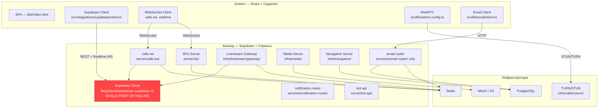
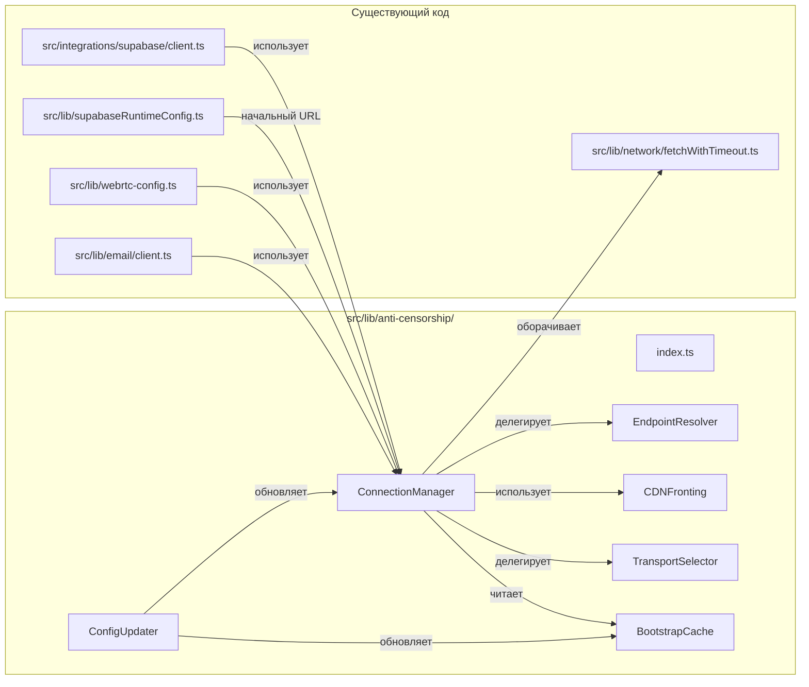
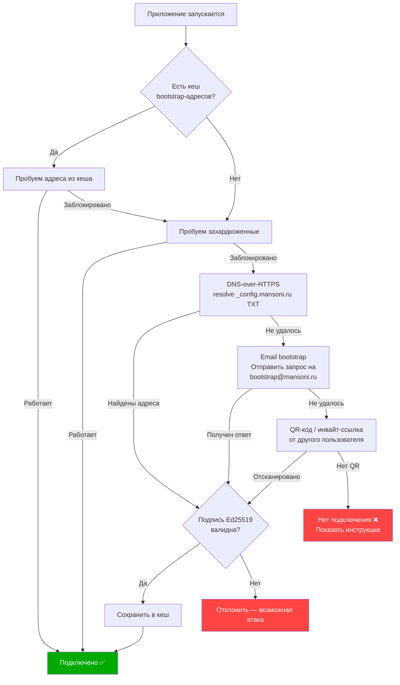
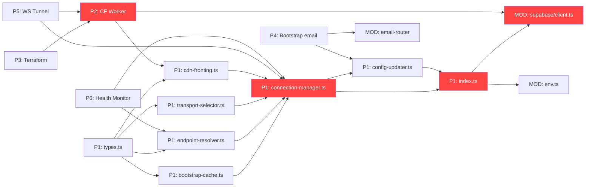

# План внедрения антицензурной системы в проект your-ai-companion

> Версия: 1.0 | Дата: 2026-03-26 | Статус: Draft  
> Основан на: [CENSORSHIP_CIRCUMVENTION_ARCHITECTURE.md](./CENSORSHIP_CIRCUMVENTION_ARCHITECTURE.md)

## Содержание

1. [Анализ текущих точек уязвимости](#1-анализ-текущих-точек-уязвимости)
2. [Phase 1: Клиентский модуль resilience](#2-phase-1-клиентский-модуль-resilience)
3. [Phase 2: Cloudflare Worker прокси](#3-phase-2-cloudflare-worker-прокси)
4. [Phase 3: Инфраструктура ротации](#4-phase-3-инфраструктура-ротации)
5. [Phase 4: Bootstrap-система](#5-phase-4-bootstrap-система)
6. [Phase 5: Маскировка трафика](#6-phase-5-маскировка-трафика)
7. [Phase 6: Мониторинг](#7-phase-6-мониторинг)
8. [Порядок реализации](#8-порядок-реализации)

---

## 1. Анализ текущих точек уязвимости

### 1.1 Карта зависимостей проекта



### 1.2 Центральная точка отказа — Supabase

**Проблема:** Весь проект завязан на один Supabase endpoint `lfkbgnbjxskspsownvjm.supabase.co` (захардкожен в `src/lib/supabaseRuntimeConfig.ts:10` как `EMERGENCY_SUPABASE_URL`).

| Компонент | Файл | Зависимость от Supabase | Критичность |
|-----------|------|------------------------|-------------|
| Auth | `src/integrations/supabase/client.ts` | Auth API, JWT, сессии | **CRITICAL** |
| REST API | `src/integrations/supabase/client.ts` | PostgREST через `.from()` | **CRITICAL** |
| Realtime | `src/integrations/supabase/client.ts` | WebSocket подписки | **HIGH** |
| Edge Functions | `src/integrations/supabase/client.ts:114` | `functions.invoke()` | **HIGH** |
| Storage | через `supabase.storage` | Файлы, аватары | **MEDIUM** |
| TURN credentials | `src/lib/webrtc-config.ts:14` | Edge Function `turn-credentials` | **HIGH** |
| Email client | `src/lib/email/client.ts` | Supabase Edge через fetch | **MEDIUM** |
| Calls WS | `server/calls-ws/` | Supabase Auth для JWT | **HIGH** |
| Livestream | `infra/livestream/gateway/src/plugins/supabase.ts` | Supabase Auth | **HIGH** |

**Что произойдёт при блокировке `*.supabase.co`:**
- ❌ Полная потеря аутентификации
- ❌ Невозможность отправки/получения сообщений
- ❌ Падение звонков (нет TURN credentials)
- ❌ Потеря Realtime-подписок
- ❌ Потеря доступа к файлам

### 1.3 Другие API-эндпоинты и их уязвимости

| Эндпоинт | Конфигурация | Тип трафика | Риск блокировки |
|----------|--------------|-------------|-----------------|
| Supabase API | `VITE_SUPABASE_URL` | HTTPS REST + WebSocket | **Критический** — единая точка |
| Calls WS | `VITE_CALLS_V2_WS_URL(S)` | WebSocket | **Высокий** — один IP/домен |
| TURN/STUN | `TURN_URLS` env | UDP/TCP | **Средний** — Google STUN как fallback |
| Email Router | `services/email-router/` | HTTPS | **Высокий** — один endpoint |
| Media Server | `infra/media/` | HTTPS | **Высокий** — один MinIO/S3 |
| Livestream | `infra/livestream/` | HTTPS + RTMP/WHIP | **Высокий** — LiveKit single region |
| Navigation | `infra/navigation/` | HTTPS | **Средний** — не критичен для core |
| Google STUN | захардкожен в `webrtc-config.ts:35-39` | STUN | **Низкий** — Google инфра |

### 1.4 Текущие механизмы устойчивости (уже есть в проекте)

| Механизм | Файл | Описание | Достаточность |
|----------|------|----------|---------------|
| Supabase Probe | `src/lib/supabaseProbe.ts` | TTL-проба доступности | ⚠️ Только детекция, без failover |
| Fetch Timeout | `src/lib/network/fetchWithTimeout.ts` | Timeout 45s | ⚠️ Нет retry на другой endpoint |
| Functions Retry | `src/integrations/supabase/client.ts:114-129` | 1 retry при network error | ⚠️ Retry к тому же endpoint |
| Emergency Config | `src/lib/supabaseRuntimeConfig.ts:10-11` | Захардкоженный fallback URL | ❌ Тот же домен `*.supabase.co` |
| Multi-region SFU | `VITE_CALLS_V2_WS_URLS` | Список WS эндпоинтов через запятую | ✅ Частичная устойчивость |

---

## 2. Phase 1: Клиентский модуль resilience

> **Приоритет: CRITICAL** — первое, что нужно внедрить

### 2.1 Структура модуля `src/lib/anti-censorship/`

```
src/lib/anti-censorship/
├── index.ts                  # Экспорт модуля
├── types.ts                  # Общие типы и интерфейсы
├── connection-manager.ts     # Менеджер подключений с failover
├── endpoint-resolver.ts      # Резолвер доступных эндпоинтов
├── cdn-fronting.ts           # CDN fronting через Cloudflare Workers
├── transport-selector.ts     # Выбор оптимального транспорта
├── bootstrap-cache.ts        # Локальный кеш bootstrap-адресов
├── config-updater.ts         # Авто-обновление конфигурации
└── __tests__/                # Тесты
    ├── connection-manager.test.ts
    ├── endpoint-resolver.test.ts
    ├── transport-selector.test.ts
    └── bootstrap-cache.test.ts
```

### 2.2 `src/lib/anti-censorship/types.ts`

```typescript
// Базовые типы для антицензурной системы

/** Метод транспорта для подключения */
export type TransportType = 
  | 'direct'           // Прямое подключение к Supabase
  | 'cf_worker'        // Через Cloudflare Worker прокси
  | 'cdn_fronting'     // CDN fronting
  | 'websocket_tunnel' // WebSocket туннель
  | 'doh_bootstrap';   // DNS-over-HTTPS bootstrap

/** Статус эндпоинта */
export type EndpointStatus = 'healthy' | 'degraded' | 'blocked' | 'unknown';

/** Конфигурация эндпоинта */
export interface EndpointConfig {
  id: string;
  url: string;
  transport: TransportType;
  priority: number;          // Чем ниже, тем выше приоритет
  status: EndpointStatus;
  lastChecked: number;       // timestamp
  latencyMs: number | null;
  failCount: number;
  /** Ключ шифрования для CDN Worker (hex) */
  workerKey?: string;
  /** Заголовки для проксирования */
  proxyHeaders?: Record<string, string>;
}

/** Результат проверки доступности */
export interface ProbeResult {
  endpointId: string;
  reachable: boolean;
  latencyMs: number;
  httpStatus?: number;
  error?: string;
  timestamp: number;
}

/** Bootstrap-конфигурация с подписью */
export interface BootstrapConfig {
  version: number;
  endpoints: EndpointConfig[];
  issuedAt: number;
  expiresAt: number;
  /** Ed25519 подпись (hex) */
  signature: string;
}

/** Состояние менеджера подключений */
export interface ConnectionState {
  currentEndpoint: EndpointConfig | null;
  fallbackEndpoints: EndpointConfig[];
  lastRotation: number;
  isBlocked: boolean;
  transportType: TransportType;
}
```

**Зависимости:** Нет внешних зависимостей — чистые TypeScript-типы.

### 2.3 `src/lib/anti-censorship/connection-manager.ts`

**Назначение:** Главный менеджер подключений, который оборачивает Supabase client и реализует multi-endpoint failover.

```typescript
// Интерфейс ConnectionManager

export interface ConnectionManagerConfig {
  /** Список начальных эндпоинтов (из .env или bootstrap-кеша) */
  initialEndpoints: EndpointConfig[];
  /** Интервал проверки доступности (мс) — default: 30000 */
  probeIntervalMs?: number;
  /** Таймаут на одну пробу (мс) — default: 5000 */
  probeTimeoutMs?: number;
  /** Максимум последовательных ошибок до переключения — default: 3 */
  maxFailsBeforeSwitch?: number;
  /** Callback при переключении эндпоинта */
  onEndpointSwitch?: (from: EndpointConfig, to: EndpointConfig) => void;
  /** Callback при полной блокировке всех эндпоинтов */
  onAllBlocked?: () => void;
}

export class ConnectionManager {
  /** Создать инстанс и начать мониторинг */
  constructor(config: ConnectionManagerConfig);
  
  /** Получить текущий рабочий URL для Supabase */
  getCurrentSupabaseUrl(): string;
  
  /** Получить custom fetch, который проксирует через текущий endpoint */
  createProxiedFetch(): typeof fetch;
  
  /** Принудительно переключиться на следующий endpoint */
  forceSwitch(): Promise<EndpointConfig | null>;
  
  /** Зарегистрировать ошибку текущего эндпоинта */
  reportError(error: Error): void;
  
  /** Получить текущее состояние */
  getState(): ConnectionState;
  
  /** Обновить список эндпоинтов (из config-updater) */
  updateEndpoints(endpoints: EndpointConfig[]): void;
  
  /** Остановить мониторинг */
  destroy(): void;
}
```

**Зависимости от существующего кода:**
- Читает `src/lib/supabaseRuntimeConfig.ts` → `getSupabaseRuntimeConfig()` для начального URL
- Оборачивает `src/lib/network/fetchWithTimeout.ts` → `createFetchWithTimeout()` для пробирования
- Используется в `src/integrations/supabase/client.ts` — заменяет `SUPABASE_URL` на динамический

**Интеграция с Supabase клиентом:**

```pseudocode
// В src/integrations/supabase/client.ts — МОДИФИКАЦИЯ
// Вместо: const baseSupabase = createClient(SUPABASE_URL, ...)
// Будет: 

import { connectionManager } from '@/lib/anti-censorship';

// Создаём Supabase клиент с проксированным fetch
const baseSupabase = createClient(
  connectionManager.getCurrentSupabaseUrl(),
  SUPABASE_PUBLISHABLE_KEY,
  {
    global: {
      fetch: connectionManager.createProxiedFetch(),
    },
    // ... остальная конфигурация
  }
);

// При переключении эндпоинта — пересоздаём клиент
connectionManager.onEndpointSwitch(() => {
  // Обновляем URL через Proxy или пересоздаём клиент
});
```

**Алгоритм failover:**

```pseudocode
function handleRequest(request):
    endpoint = getCurrentEndpoint()
    
    try:
        response = await fetch(rewriteUrl(request, endpoint))
        if response.ok:
            endpoint.failCount = 0
            return response
        
        if response.status >= 500 OR isBlockResponse(response):
            endpoint.failCount++
    catch error:
        if isNetworkError(error) OR isTimeoutError(error):
            endpoint.failCount++
    
    if endpoint.failCount >= maxFailsBeforeSwitch:
        markAsBlocked(endpoint)
        nextEndpoint = selectNextEndpoint()
        
        if nextEndpoint is null:
            onAllBlocked()
            // Запускаем bootstrap для поиска новых эндпоинтов
            triggerBootstrapResolution()
            return
        
        switchTo(nextEndpoint)
        return handleRequest(request)  // Retry на новом эндпоинте
```

### 2.4 `src/lib/anti-censorship/endpoint-resolver.ts`

**Назначение:** Параллельное пробирование эндпоинтов, определение доступных, сортировка по latency.

```typescript
export interface EndpointResolverConfig {
  /** Таймаут пробы одного эндпоинта (мс) */
  probeTimeoutMs: number;
  /** Максимальное время ожидания всех проб (мс) */
  maxWaitMs: number;
  /** Минимальный интервал между пробами одного эндпоинта (мс) */
  minProbeIntervalMs: number;
}

export class EndpointResolver {
  constructor(config: EndpointResolverConfig);
  
  /** 
   * Параллельно проверить все эндпоинты.
   * Возвращает отсортированный список доступных — быстрейшие первыми.
   */
  probeAll(endpoints: EndpointConfig[]): Promise<ProbeResult[]>;
  
  /** Проверить один конкретный эндпоинт */
  probeOne(endpoint: EndpointConfig): Promise<ProbeResult>;
  
  /** Проверить доступность через DNS-over-HTTPS */
  resolveDNS(domain: string): Promise<string | null>;
  
  /** 
   * «Быстрая» проверка — отправить запрос к /health или / 
   * и остановиться на первом ответе 
   */
  raceProbe(endpoints: EndpointConfig[]): Promise<ProbeResult | null>;
}
```

**Зависимости:**
- `src/lib/network/fetchWithTimeout.ts` — для timeout-контроля
- Нет зависимости от Supabase — работает на чистом `fetch`

**Псевдокод проверки:**

```pseudocode
function probeEndpoint(endpoint):
    startTime = performance.now()
    
    switch endpoint.transport:
        case 'direct':
            // Прямой запрос к Supabase REST
            response = await fetchWithTimeout(endpoint.url + '/rest/v1/', {
                method: 'HEAD',
                headers: { 'apikey': SUPABASE_ANON_KEY },
                timeout: probeTimeoutMs
            })
            
        case 'cf_worker':
            // Запрос к Cloudflare Worker с зашифрованным target
            encTarget = encryptTarget(REAL_SUPABASE_URL, endpoint.workerKey)
            response = await fetchWithTimeout(endpoint.url, {
                method: 'HEAD',
                headers: { 'X-Target-Enc': encTarget },
                timeout: probeTimeoutMs
            })
            
        case 'cdn_fronting':
            // SNI = CDN домен, Host = наш worker
            response = await fetchWithTimeout(endpoint.url, {
                method: 'HEAD',
                timeout: probeTimeoutMs
            })
    
    latency = performance.now() - startTime
    return { endpointId: endpoint.id, reachable: true, latencyMs: latency }
```

### 2.5 `src/lib/anti-censorship/cdn-fronting.ts`

**Назначение:** Реализация Domain Fronting через Cloudflare Workers. Все запросы к Supabase маскируются как запросы к легитимному домену на Cloudflare CDN.

```typescript
export interface CDNFrontingConfig {
  /** URL Cloudflare Worker (основной) */
  workerUrl: string;
  /** Запасные Workers (на разных аккаунтах) */
  fallbackWorkerUrls: string[];
  /** AES-256-GCM ключ для шифрования target URL (hex) */
  encryptionKey: string;
  /** Реальный URL Supabase для проксирования */
  targetSupabaseUrl: string;
}

export class CDNFronting {
  constructor(config: CDNFrontingConfig);
  
  /** 
   * Создать fetch-функцию, которая проксирует все запросы через Worker.
   * Совместима с Supabase client global.fetch.
   */
  createFrontedFetch(): typeof fetch;
  
  /** 
   * Проксировать один запрос через Worker.
   * Шифрует target URL в заголовке X-Target-Enc.
   */
  proxyRequest(input: RequestInfo | URL, init?: RequestInit): Promise<Response>;
  
  /** 
   * Проксировать WebSocket через Worker (для Realtime).
   * Использует Worker как WebSocket relay.
   */
  createFrontedWebSocket(url: string, protocols?: string[]): WebSocket;
  
  /** Переключиться на следующий Worker URL */
  rotateWorker(): void;
}
```

**Зависимости:**
- Web Crypto API (встроен в браузер) — для AES-256-GCM шифрования
- `src/lib/network/fetchWithTimeout.ts` — таймауты
- Нет зависимости от Supabase

**Алгоритм проксирования:**

```pseudocode
function proxyThroughWorker(originalRequest):
    // 1. Шифруем реальный target URL
    targetUrl = targetSupabaseUrl + extractPath(originalRequest.url)
    encryptedTarget = AES_256_GCM.encrypt(encryptionKey, targetUrl)
    
    // 2. Формируем запрос к Worker
    workerRequest = new Request(currentWorkerUrl + extractPath(originalRequest.url), {
        method: originalRequest.method,
        headers: {
            ...originalRequest.headers,
            'X-Target-Enc': base64url(encryptedTarget),
            // Убираем Host — Worker сам определяет target
        },
        body: originalRequest.body
    })
    
    // 3. Отправляем через Worker
    try:
        response = await fetch(workerRequest)
        if response.status == 403 OR response.status == 0:
            // Worker заблокирован — ротируем
            rotateWorker()
            return proxyThroughWorker(originalRequest)
        return response
    catch:
        rotateWorker()
        throw
```

### 2.6 `src/lib/anti-censorship/transport-selector.ts`

**Назначение:** Выбор оптимального транспорта по алгоритму UCB1 (Multi-Armed Bandit), как описано в архитектуре (секция 9.4).

```typescript
export interface TransportStats {
  transport: TransportType;
  attempts: number;
  totalReward: number;
  consecutiveFailures: number;
  lastSuccess: number | null;
  lastFailure: number | null;
  avgLatencyMs: number;
  disabledUntil: number | null;
}

export class TransportSelector {
  constructor();
  
  /** 
   * Выбрать оптимальный транспорт на основе UCB1.
   * Исключает временно отключённые транспорты.
   */
  selectOptimal(): TransportType;
  
  /** Записать результат попытки подключения */
  recordOutcome(
    transport: TransportType, 
    success: boolean, 
    latencyMs: number
  ): void;
  
  /** Получить статистику всех транспортов */
  getStats(): Map<TransportType, TransportStats>;
  
  /** Сбросить статистику (после обновления конфигурации) */
  reset(): void;
  
  /** Сохранить/загрузить статистику из localStorage */
  persist(): void;
  restore(): void;
}
```

**Зависимости:**
- `localStorage` — для персистенции статистики между сессиями
- Нет внешних зависимостей

**Алгоритм UCB1:**

```pseudocode
function selectOptimal():
    candidates = getEnabledTransports()
    totalAttempts = sum(c.attempts for c in candidates)
    
    if totalAttempts == 0:
        // Холодный старт — возвращаем direct
        return 'direct'
    
    scores = {}
    for t in candidates:
        if t.disabledUntil AND now() < t.disabledUntil:
            continue  // Пропускаем отключённые
        
        if t.attempts == 0:
            scores[t] = Infinity  // Не пробовали — высший приоритет
            continue
        
        avgReward = t.totalReward / t.attempts
        exploration = sqrt(2 * ln(totalAttempts) / t.attempts)
        scores[t] = avgReward + EXPLORATION_FACTOR * exploration
    
    return argmax(scores)
```

### 2.7 `src/lib/anti-censorship/bootstrap-cache.ts`

**Назначение:** Локальный зашифрованный кеш bootstrap-адресов в `localStorage` / `IndexedDB`. Обеспечивает работу приложения при полной блокировке — клиент использует кешированные адреса.

```typescript
export interface BootstrapCacheConfig {
  /** Ключ шифрования кеша (производный от device ID) */
  encryptionKey?: CryptoKey;
  /** Максимальный возраст записи (мс) — default: 7 дней */
  maxAgeMs?: number;
  /** Использовать IndexedDB вместо localStorage */
  useIndexedDB?: boolean;
}

export class BootstrapCache {
  constructor(config?: BootstrapCacheConfig);
  
  /** Сохранить bootstrap-конфигурацию */
  save(config: BootstrapConfig): Promise<void>;
  
  /** Загрузить последнюю валидную конфигурацию */
  load(): Promise<BootstrapConfig | null>;
  
  /** Получить hardcoded fallback-эндпоинты (встроены в бинарник) */
  getHardcodedFallback(): EndpointConfig[];
  
  /** Проверить Ed25519-подпись конфигурации */
  verifySignature(config: BootstrapConfig): Promise<boolean>;
  
  /** Очистить кеш */
  clear(): Promise<void>;
  
  /** Получить возраст кеша (мс) */
  getAge(): number | null;
}
```

**Зависимости:**
- Web Crypto API — для AES-256-GCM шифрования кеша
- `ed25519` (через `@noble/ed25519`) — для верификации подписей
- `localStorage` / `IndexedDB` — хранилище
- `src/lib/e2ee/crypto.ts` — возможное переиспользование крипто-утилит

**Hardcoded fallback:**

```pseudocode
// Встроены в код приложения — меняются при каждом релизе
const HARDCODED_ENDPOINTS: EndpointConfig[] = [
    {
        id: 'cf-worker-primary',
        url: 'https://api-proxy-a1b2c3.workers.dev',
        transport: 'cf_worker',
        priority: 1,
        status: 'unknown',
        // ...
    },
    {
        id: 'cf-worker-backup',
        url: 'https://api-proxy-d4e5f6.workers.dev',
        transport: 'cf_worker',
        priority: 2,
        status: 'unknown',
        // ...
    },
    {
        id: 'direct-supabase',
        url: 'https://lfkbgnbjxskspsownvjm.supabase.co',
        transport: 'direct',
        priority: 0,  // Прямое подключение — наивысший приоритет
        status: 'unknown',
        // ...
    }
]
```

### 2.8 `src/lib/anti-censorship/config-updater.ts`

**Назначение:** Периодическое обновление конфигурации из нескольких источников. Реализует waterfall fallback из архитектуры (секция 9.2).

```typescript
export interface ConfigUpdaterConfig {
  /** Интервал проверки обновлений (мс) — default: 900000 (15 мин) */
  checkIntervalMs?: number;
  /** Домен для DNS TXT-записей — например _config.mansoni.ru */
  configDNSDomain?: string;
  /** URL основного конфигурационного API */
  primaryConfigUrl?: string;
  /** URL CDN-зеркала конфигурации */
  cdnConfigUrl?: string;
  /** Публичный ключ Ed25519 для верификации (hex) */
  signingPublicKey: string;
}

export class ConfigUpdater {
  constructor(config: ConfigUpdaterConfig);
  
  /** Запустить периодическую проверку */
  start(): void;
  
  /** Остановить */
  stop(): void;
  
  /** Принудительно проверить обновления */
  checkNow(): Promise<BootstrapConfig | null>;
  
  /** Callback при обновлении конфигурации */
  onUpdate(callback: (config: BootstrapConfig) => void): void;
}
```

**Зависимости:**
- `src/lib/anti-censorship/bootstrap-cache.ts` — сохранение обновлений
- `src/lib/anti-censorship/endpoint-resolver.ts` — DNS-резолвинг через DoH
- `src/lib/network/fetchWithTimeout.ts` — HTTP-запросы

**Источники конфигурации (waterfall):**

```pseudocode
function checkForUpdates():
    sources = [
        fetchFromPrimaryAPI,
        fetchFromCDNMirror,
        fetchFromDNSTXT,
        fetchFromHardcodedFallback
    ]
    
    for source in sources:
        try:
            config = await source()
            if config AND await verifySignature(config):
                if config.version > currentVersion:
                    applyConfig(config)
                    cache.save(config)
                    notifyListeners(config)
                    return config
        catch:
            continue
    
    return null

function fetchFromDNSTXT():
    // DNS TXT запись через DoH, обходя DNS-перехват
    dohResolvers = [
        'https://cloudflare-dns.com/dns-query',
        'https://dns.google/dns-query',
        'https://dns.quad9.net/dns-query'
    ]
    
    for resolver in shuffle(dohResolvers):
        response = await fetch(
            resolver + '?name=_config.mansoni.ru&type=TXT',
            { headers: { 'Accept': 'application/dns-json' } }
        )
        txt = parseDNSResponse(response)
        return decodeBootstrapFromTXT(txt)
```

### 2.9 `src/lib/anti-censorship/index.ts`

**Назначение:** Единая точка входа модуля. Создаёт и конфигурирует все компоненты.

```typescript
export { ConnectionManager } from './connection-manager';
export { EndpointResolver } from './endpoint-resolver';
export { CDNFronting } from './cdn-fronting';
export { TransportSelector } from './transport-selector';
export { BootstrapCache } from './bootstrap-cache';
export { ConfigUpdater } from './config-updater';
export * from './types';

/** 
 * Singleton-инстанс ConnectionManager для всего приложения.
 * Инициализируется при первом импорте.
 */
export const connectionManager: ConnectionManager;

/** Инициализировать антицензурную систему */
export function initAntiCensorship(config?: Partial<ConnectionManagerConfig>): void;

/** Получить текущий статус подключения */
export function getConnectionStatus(): ConnectionState;
```

**Интеграция:**



---

## 3. Phase 2: Cloudflare Worker прокси

### 3.1 Структура `infra/anti-censorship/cloudflare-worker/`

```
infra/anti-censorship/cloudflare-worker/
├── wrangler.toml             # Конфигурация Cloudflare Worker
├── src/
│   ├── index.ts              # Entry point Worker'а
│   ├── proxy.ts              # Логика проксирования
│   ├── websocket-relay.ts    # WebSocket relay для Realtime/Calls
│   ├── crypto.ts             # AES-256-GCM расшифровка target
│   ├── rate-limit.ts         # Rate limiting
│   └── health.ts             # Health check endpoint
├── package.json
└── tsconfig.json
```

### 3.2 Worker — проксирование Supabase API

```pseudocode
// infra/anti-censorship/cloudflare-worker/src/index.ts

addEventListener('fetch', event => {
    event.respondWith(handleRequest(event.request))
})

async function handleRequest(request):
    // Health check — для monitoring
    if request.url.endsWith('/health'):
        return new Response('OK', { status: 200 })
    
    // Получаем зашифрованный target из заголовка
    encryptedTarget = request.headers.get('X-Target-Enc')
    
    if not encryptedTarget:
        // Нет заголовка — возвращаем cover page (маскировка под обычный сайт)
        return serveCoverPage()
    
    // Расшифровываем target URL
    try:
        targetUrl = await decryptTarget(encryptedTarget, SHARED_KEY)
    catch:
        return new Response('Bad Request', { status: 400 })
    
    // Rate limiting по IP
    if await isRateLimited(request.headers.get('CF-Connecting-IP')):
        return new Response('Too Many Requests', { status: 429 })
    
    // Проксируем запрос
    proxyHeaders = filterHeaders(request.headers)
    proxyHeaders.set('Host', new URL(targetUrl).host)
    
    response = await fetch(targetUrl, {
        method: request.method,
        headers: proxyHeaders,
        body: request.body
    })
    
    // Убираем заголовки, выдающие origin
    cleanResponse = cleanResponseHeaders(response)
    return cleanResponse
```

### 3.3 WebSocket/Realtime проксирование

```pseudocode
// infra/anti-censorship/cloudflare-worker/src/websocket-relay.ts
// Cloudflare Workers Durable Objects для WebSocket relay

export class WebSocketRelay implements DurableObject {
    constructor(state, env):
        this.state = state
        this.env = env
    
    async fetch(request):
        if request.headers.get('Upgrade') != 'websocket':
            return new Response('Expected WebSocket', { status: 426 })
        
        // Определяем target WebSocket URL
        targetWsUrl = decryptTarget(
            request.headers.get('X-WS-Target-Enc'),
            this.env.SHARED_KEY
        )
        
        // Создаём WebSocket пару
        [clientWs, serverWs] = Object.values(new WebSocketPair())
        
        // Подключаемся к target
        targetConn = new WebSocket(targetWsUrl)
        
        // Двунаправленный relay
        serverWs.accept()
        
        serverWs.addEventListener('message', event => {
            targetConn.send(event.data)
        })
        
        targetConn.addEventListener('message', event => {
            serverWs.send(event.data)
        })
        
        return new Response(null, {
            status: 101,
            webSocket: clientWs
        })
}
```

### 3.4 Проксирование сервисов

| Сервис | Текущий эндпоинт | Через Worker |
|--------|------------------|--------------|
| **Supabase REST** | `*.supabase.co/rest/v1/` | Worker перенаправляет по `X-Target-Enc` |
| **Supabase Auth** | `*.supabase.co/auth/v1/` | Тот же Worker, другой path |
| **Supabase Realtime** | `*.supabase.co/realtime/v1/` | WebSocket relay через Durable Objects |
| **Supabase Storage** | `*.supabase.co/storage/v1/` | Worker проксирует multipart/binary |
| **Supabase Functions** | `*.supabase.co/functions/v1/` | Worker проксирует POST |
| **Calls-WS** | `wss://sfu-ru.mansoni.ru/ws` | Отдельный Worker для WS relay |
| **Email Router** | `email-router:3000` | Worker проксирует HTTP |
| **Media Server** | `media.mansoni.ru` | Worker проксирует, но для больших файлов — прямое R2 |

### 3.5 Множественные Workers на разных аккаунтах

```pseudocode
// Стратегия: 3+ Worker'а на РАЗНЫХ Cloudflare аккаунтах
// Если один аккаунт заблокирован — остальные работают

workers = [
    { url: 'https://proxy-a.example-a.workers.dev', account: 'account-1' },
    { url: 'https://proxy-b.example-b.workers.dev', account: 'account-2' },
    { url: 'https://data-api.example-c.workers.dev', account: 'account-3' },
]

// Клиент пробует по порядку, ротирует при блокировке
// Новые Workers деплоятся автоматически через CI/CD
```

---

## 4. Phase 3: Инфраструктура ротации

### 4.1 Структура `infra/anti-censorship/terraform/`

```
infra/anti-censorship/terraform/
├── main.tf                    # Основной конфиг
├── variables.tf               # Переменные
├── outputs.tf                 # Выходные значения
├── providers.tf               # Провайдеры (AWS, GCP, Hetzner, DO)
├── modules/
│   ├── proxy-node/            # Модуль создания прокси-ноды
│   │   ├── main.tf
│   │   ├── variables.tf
│   │   ├── outputs.tf
│   │   └── userdata.sh        # Cloud-init скрипт
│   ├── dns-rotation/          # Модуль ротации DNS
│   │   ├── main.tf
│   │   ├── variables.tf
│   │   └── outputs.tf
│   ├── cloudflare-worker/     # Деплой Worker через Terraform
│   │   ├── main.tf
│   │   └── variables.tf
│   └── monitoring/            # Мониторинг прокси-нод
│       ├── main.tf
│       └── variables.tf
├── environments/
│   ├── prod.tfvars
│   └── staging.tfvars
└── scripts/
    ├── rotate-ip.sh           # Ротация IP вручную
    ├── rotate-domain.sh       # Ротация домена
    ├── deploy-node.sh         # Быстрый деплой ноды
    └── emergency-rotate.sh    # Экстренная ротация всего
```

### 4.2 Модуль `proxy-node` — создание прокси на VPS

```pseudocode
// infra/anti-censorship/terraform/modules/proxy-node/main.tf (псевдокод)

resource "cloud_instance" "proxy" {
    // Провайдер определяется переменной — AWS, Hetzner, DO, Vultr
    provider = var.cloud_provider
    
    // Минимальный instance — 1 vCPU, 1GB RAM достаточно для прокси
    instance_type = var.instance_type  // "cx11" для Hetzner
    image = "ubuntu-24.04"
    region = var.region
    
    // Cloud-init: автоматический конфиг при создании
    user_data = templatefile("userdata.sh", {
        supabase_url = var.target_supabase_url
        proxy_port = 443
        tls_domain = var.proxy_domain
        acme_email = var.acme_email
    })
    
    // Firewall: только 443/tcp + SSH
    firewall_rules = [
        { port: 443, protocol: "tcp", source: "0.0.0.0/0" },
        { port: 22, protocol: "tcp", source: var.admin_ip }
    ]
}

// DNS запись
resource "cloudflare_record" "proxy" {
    zone_id = var.cf_zone_id
    name = var.proxy_subdomain
    value = cloud_instance.proxy.ipv4_address
    type = "A"
    ttl = 60       // Минимальный TTL
    proxied = true // Через Cloudflare — скрывает origin IP
}
```

### 4.3 Скрипт экстренной ротации

```pseudocode
// infra/anti-censorship/terraform/scripts/emergency-rotate.sh

function emergencyRotate():
    echo "🚨 Экстренная ротация инфраструктуры"
    
    // 1. Создаём новую прокси-ноду на другом провайдере
    newNode = terraform apply -target=module.proxy-node \
        -var="cloud_provider=hetzner" \
        -var="region=nbg1" \
        -auto-approve
    
    // 2. Генерируем новый домен (DGA)
    newDomain = generateDomain(seed, today, nextIndex)
    
    // 3. Регистрируем домен через API
    registerDomain(newDomain, nameservers=["cloudflare"])
    
    // 4. Обновляем DNS → новый IP
    cloudflare-api update-record $newDomain A $newNode.ip TTL=60
    
    // 5. Получаем TLS сертификат
    certbot certonly --dns-cloudflare -d $newDomain
    
    // 6. Обновляем Cloudflare Worker с новым target
    wrangler secret put TARGET_URL --value "https://$newNode.ip:443"
    
    // 7. Публикуем новый эндпоинт через DNS TXT
    cloudflare-api update-record "_config.mansoni.ru" TXT $encodedConfig TTL=60
    
    echo "✅ Ротация завершена: $newDomain → $newNode.ip"
```

### 4.4 Docker-конфиг для быстрого развёртывания

```
infra/anti-censorship/docker/
├── docker-compose.proxy.yml  # Reverse proxy (Caddy/Nginx)
├── Dockerfile.proxy          # Прокси-сервер
├── caddy/
│   └── Caddyfile             # Автоматический TLS + reverse proxy
└── scripts/
    └── entrypoint.sh         # Startup скрипт
```

```pseudocode
// Caddyfile — автоматический TLS через ACME + reverse proxy к Supabase

{PROXY_DOMAIN} {
    reverse_proxy {TARGET_SUPABASE_URL} {
        header_up Host {upstream_hostport}
        header_up X-Forwarded-Proto {scheme}
    }
    
    // WebSocket проксирование для Realtime
    handle /realtime/* {
        reverse_proxy {TARGET_SUPABASE_URL} {
            transport http {
                versions h2c 2
            }
        }
    }
    
    tls {ACME_EMAIL}
}
```

---

## 5. Phase 4: Bootstrap-система

### 5.1 Как клиент находит рабочие эндпоинты при полной блокировке



### 5.2 Email-bootstrap через существующий email-router

**Интеграция с `services/email-router/`:**

Существующий email-router (`services/email-router/src/index.ts`) уже имеет:
- Express-сервер с маршрутами
- BullMQ для очередей
- Rate limiting
- Шаблоны писем

**Добавляется новый маршрут:**

```pseudocode
// services/email-router/src/routes/bootstrap.ts (НОВЫЙ ФАЙЛ)

// POST /bootstrap/request
// Принимает email пользователя, отправляет bootstrap-адреса

function handleBootstrapRequest(req, res):
    email = req.body.email
    
    // Rate limit: 1 запрос в 3 часа с одного email
    if rateLimiter.isExceeded(email, window='3h'):
        return res.status(429).json({ error: 'Too many requests' })
    
    // Проверяем email-провайдер
    allowedProviders = ['gmail.com', 'yahoo.com', 'outlook.com', 'proton.me', 'mail.ru', 'yandex.ru']
    domain = extractDomain(email)
    if domain not in allowedProviders:
        return res.status(400).json({ error: 'Unsupported email provider' })
    
    // Формируем bootstrap-ответ
    endpoints = getActiveEndpoints()
    bootstrapConfig = signBootstrapConfig(endpoints)
    
    // Шифруем payload для email
    emailBody = formatBootstrapEmail(bootstrapConfig)
    
    // Ставим в очередь отправки
    await queueService.addSendJob({
        to: email,
        subject: 'Your connection configuration',
        body: emailBody
    })
    
    return res.json({ success: true, message: 'Check your email' })
```

**Интеграция с маршрутами:**
- Добавить `createBootstrapRouter()` в `services/email-router/src/routes/`
- Подключить в `services/email-router/src/index.ts:169` рядом с `emailRouter`

### 5.3 DNS TXT записи как канал дистрибуции

```pseudocode
// Конфигурация DNS TXT записи

// Запись: _config.mansoni.ru TXT "v=ac1;e=<base64url_encoded_config>;s=<ed25519_signature>"
// 
// Формат конфигурации (после декодирования):
// {
//   "v": 1,
//   "ep": [
//     {"u": "https://proxy-a1b2.workers.dev", "t": "cf_worker", "p": 1},
//     {"u": "https://proxy-c3d4.workers.dev", "t": "cf_worker", "p": 2}
//   ],
//   "exp": 1711500000
// }
//
// Клиент резолвит через DoH, обходя DNS-перехват

// Обновление через Cloudflare API:
function updateConfigTXT(endpoints):
    config = { v: 1, ep: endpoints, exp: now() + 24h }
    encoded = base64url(JSON.stringify(config))
    signature = ed25519Sign(CONFIG_SIGNING_KEY, encoded)
    
    txtValue = 'v=ac1;e=' + encoded + ';s=' + signature
    
    cloudflareAPI.updateRecord({
        zone: 'mansoni.ru',
        type: 'TXT',
        name: '_config',
        content: txtValue,
        ttl: 60
    })
```

### 5.4 Fallback-список, встроенный в приложение

В `src/lib/anti-censorship/bootstrap-cache.ts` хардкодится список эндпоинтов, который обновляется при каждом релизе:

```pseudocode
// Обновляется при CI/CD build перед деплоем
const EMBEDDED_BOOTSTRAP: BootstrapConfig = {
    version: BUILD_TIMESTAMP,
    endpoints: [
        // Cloudflare Worker прокси — основные
        { id: 'cf-1', url: 'https://api-relay-RANDOM1.workers.dev', transport: 'cf_worker', priority: 1 },
        { id: 'cf-2', url: 'https://data-svc-RANDOM2.workers.dev', transport: 'cf_worker', priority: 2 },
        { id: 'cf-3', url: 'https://web-api-RANDOM3.workers.dev', transport: 'cf_worker', priority: 3 },
        
        // Прямое подключение — если не заблокировано
        { id: 'direct', url: 'https://lfkbgnbjxskspsownvjm.supabase.co', transport: 'direct', priority: 0 },
        
        // Резервные прокси на VPS
        { id: 'vps-1', url: 'https://proxy1.anti-block.example.xyz', transport: 'direct', priority: 4 },
    ],
    issuedAt: BUILD_TIMESTAMP,
    expiresAt: BUILD_TIMESTAMP + 30 * 24 * 60 * 60 * 1000, // 30 дней
    signature: 'SIGNED_AT_BUILD_TIME'
}
```

---

## 6. Phase 5: Маскировка трафика

### 6.1 WebSocket tunnel wrapper

**Назначение:** Оборачивает все WebSocket-соединения (calls-ws, Supabase Realtime) в обычный HTTPS-подобный трафик.

```
src/lib/anti-censorship/
└── ws-tunnel.ts              # WebSocket tunnel wrapper
```

```typescript
export interface WSTunnelConfig {
  /** URL прокси для WebSocket tunnel */
  tunnelUrl: string;
  /** Шифрование payload */
  encryptionKey?: string;
  /** Добавить HTTP/2 padding */
  enablePadding?: boolean;
  /** Имитировать стандартный HTTPS-трафик */
  enableTrafficShaping?: boolean;
}

export class WSTunnel {
  constructor(config: WSTunnelConfig);
  
  /** 
   * Создать туннелированный WebSocket.
   * Выглядит как обычный HTTPS-запрос для DPI.
   */
  connect(targetWsUrl: string): WebSocket;
  
  /** Обернуть существующий WebSocket в туннель */
  wrap(ws: WebSocket): WebSocket;
}
```

**Интеграция с calls-ws:**

Текущий код подключения к calls-ws использует `VITE_CALLS_V2_WS_URL(S)` env переменные.

```pseudocode
// Модификация подключения к WS:
// Вместо: new WebSocket(wsUrl)
// Будет:

import { wsTunnel } from '@/lib/anti-censorship';

if (connectionManager.isBlocked()):
    ws = wsTunnel.connect(wsUrl)  // Через туннель
else:
    ws = new WebSocket(wsUrl)     // Прямое подключение
```

**Интеграция с Supabase Realtime:**

Supabase JS client использует WebSocket для Realtime-подписок. Модификация:

```pseudocode
// В src/integrations/supabase/client.ts:

const baseSupabase = createClient(SUPABASE_URL, KEY, {
    realtime: {
        // Кастомный WebSocket transport через tunnel
        transport: connectionManager.isBlocked() 
            ? WSTunnel.createTransport(tunnelConfig)
            : WebSocket
    }
})
```

### 6.2 Имитация стандартного HTTPS-трафика

```pseudocode
// Traffic shaping — делает WebSocket трафик похожим на обычный browsing

class TrafficShaper:
    function shapeOutgoing(data):
        // 1. Padding до типичных HTTP-ответов (1KB, 4KB, 16KB)
        paddedData = padToTypicalSize(data)
        
        // 2. Добавляем случайную задержку (имитация browsing)
        await randomDelay(10, 200)  // 10-200ms
        
        // 3. Разбиваем на chunks типичного размера
        chunks = splitIntoHTTPLikeChunks(paddedData)
        
        for chunk in chunks:
            send(chunk)
            await randomDelay(1, 50)
    
    function padToTypicalSize(data):
        typicalSizes = [1024, 2048, 4096, 8192, 16384]
        targetSize = selectClosest(typicalSizes, data.length)
        padding = randomBytes(targetSize - data.length)
        return data + padding + lengthHeader(data.length)
```

### 6.3 HTTP/2 padding

```pseudocode
// HTTP/2 DATA frames поддерживают padding (RFC 7540 §6.1)
// Cloudflare Worker автоматически использует HTTP/2

class HTTP2Padder:
    function addPadding(frame):
        // Случайный padding 0-256 байт
        paddingLength = randomInt(0, 256)
        frame.flags |= PADDED_FLAG
        frame.padding = randomBytes(paddingLength)
        return frame
```

---

## 7. Phase 6: Мониторинг

### 7.1 Endpoint health checking

```
src/lib/anti-censorship/
└── health-monitor.ts         # Мониторинг здоровья эндпоинтов
```

```typescript
export interface HealthMonitorConfig {
  /** Интервал проверки (мс) — default: 30000 */
  intervalMs?: number;
  /** Threshold для unhealthy (последовательных ошибок) */
  unhealthyThreshold?: number;
  /** Callback при обнаружении блокировки */
  onBlockDetected?: (endpoint: EndpointConfig) => void;
  /** Callback при восстановлении доступа */
  onEndpointRecovered?: (endpoint: EndpointConfig) => void;
}

export class HealthMonitor {
  constructor(config: HealthMonitorConfig);
  
  /** Запустить мониторинг */
  start(): void;
  
  /** Остановить */
  stop(): void;
  
  /** Получить текущие метрики */
  getMetrics(): HealthMetrics;
  
  /** Принудительная проверка */
  checkNow(): Promise<HealthMetrics>;
}

export interface HealthMetrics {
  endpoints: Array<{
    id: string;
    url: string;
    status: EndpointStatus;
    latencyMs: number;
    uptime: number;        // Процент доступности за 24ч
    lastCheck: number;
  }>;
  overallAvailability: number;
  activeTransport: TransportType;
  blockedEndpoints: string[];
}
```

### 7.2 Автоматическое переключение при блокировке

```pseudocode
class HealthMonitor:
    function monitorLoop():
        while active:
            for endpoint in allEndpoints:
                result = await probeEndpoint(endpoint)
                
                if not result.reachable:
                    endpoint.failCount++
                    
                    if endpoint.failCount >= unhealthyThreshold:
                        endpoint.status = 'blocked'
                        onBlockDetected(endpoint)
                        
                        // Автоматическое переключение
                        if endpoint == connectionManager.getCurrentEndpoint():
                            connectionManager.forceSwitch()
                else:
                    if endpoint.status == 'blocked':
                        endpoint.status = 'healthy'
                        onEndpointRecovered(endpoint)
                    endpoint.failCount = 0
                
                updateMetrics(endpoint, result)
            
            await sleep(intervalMs)
    
    function detectBlockType(endpoint, probeResult):
        if probeResult.error == 'DNS_RESOLUTION_FAILED':
            return 'DNS_BLOCK'
        if probeResult.error == 'CONNECTION_RESET':
            return 'IP_BLOCK'
        if probeResult.error == 'TLS_HANDSHAKE_FAILED':
            return 'DPI_BLOCK'
        if probeResult.httpStatus == 403:
            return 'HTTP_BLOCK'
        return 'UNKNOWN'
```

### 7.3 Метрики доступности

```pseudocode
// Метрики собираются локально на клиенте и отправляются на сервер
// (когда подключение восстановлено)

interface AvailabilityReport {
    deviceId: string;           // Анонимный ID
    region: string;             // GeoIP (определяется на сервере)
    period: { from: number, to: number };
    
    // Метрики по эндпоинтам
    endpoints: Array<{
        id: string;
        probeCount: number;
        successCount: number;
        avgLatencyMs: number;
        blockEvents: Array<{
            detectedAt: number;
            blockType: string;
            recoveredAt: number | null;
        }>;
    }>;
    
    // Метрики по транспортам
    transports: Array<{
        type: TransportType;
        attempts: number;
        successes: number;
        avgLatencyMs: number;
    }>;
    
    // Переключения
    switchEvents: Array<{
        from: string;
        to: string;
        reason: string;
        timestamp: number;
    }>;
}
```

---

## 8. Порядок реализации

### 8.1 Файлы для создания

| # | Фаза | Файл | Приоритет |
|---|------|------|-----------|
| 1 | P1 | `src/lib/anti-censorship/types.ts` | 🔴 CRITICAL |
| 2 | P1 | `src/lib/anti-censorship/bootstrap-cache.ts` | 🔴 CRITICAL |
| 3 | P1 | `src/lib/anti-censorship/endpoint-resolver.ts` | 🔴 CRITICAL |
| 4 | P1 | `src/lib/anti-censorship/transport-selector.ts` | 🔴 CRITICAL |
| 5 | P1 | `src/lib/anti-censorship/cdn-fronting.ts` | 🔴 CRITICAL |
| 6 | P1 | `src/lib/anti-censorship/connection-manager.ts` | 🔴 CRITICAL |
| 7 | P1 | `src/lib/anti-censorship/config-updater.ts` | 🟡 HIGH |
| 8 | P1 | `src/lib/anti-censorship/index.ts` | 🔴 CRITICAL |
| 9 | P1 | `src/lib/anti-censorship/__tests__/*.test.ts` | 🟡 HIGH |
| 10 | P2 | `infra/anti-censorship/cloudflare-worker/src/index.ts` | 🔴 CRITICAL |
| 11 | P2 | `infra/anti-censorship/cloudflare-worker/src/proxy.ts` | 🔴 CRITICAL |
| 12 | P2 | `infra/anti-censorship/cloudflare-worker/src/websocket-relay.ts` | 🟡 HIGH |
| 13 | P2 | `infra/anti-censorship/cloudflare-worker/src/crypto.ts` | 🔴 CRITICAL |
| 14 | P2 | `infra/anti-censorship/cloudflare-worker/wrangler.toml` | 🔴 CRITICAL |
| 15 | P3 | `infra/anti-censorship/terraform/main.tf` | 🟡 HIGH |
| 16 | P3 | `infra/anti-censorship/terraform/modules/proxy-node/` | 🟡 HIGH |
| 17 | P3 | `infra/anti-censorship/terraform/modules/dns-rotation/` | 🟡 HIGH |
| 18 | P3 | `infra/anti-censorship/terraform/scripts/*.sh` | 🟡 HIGH |
| 19 | P3 | `infra/anti-censorship/docker/docker-compose.proxy.yml` | 🟢 MEDIUM |
| 20 | P3 | `infra/anti-censorship/docker/caddy/Caddyfile` | 🟢 MEDIUM |
| 21 | P4 | `services/email-router/src/routes/bootstrap.ts` | 🟡 HIGH |
| 22 | P5 | `src/lib/anti-censorship/ws-tunnel.ts` | 🟢 MEDIUM |
| 23 | P5 | `src/lib/anti-censorship/traffic-shaper.ts` | 🔵 LOW |
| 24 | P6 | `src/lib/anti-censorship/health-monitor.ts` | 🟡 HIGH |

### 8.2 Файлы для модификации

| # | Файл | Изменение | Приоритет |
|---|------|-----------|-----------|
| 1 | `src/integrations/supabase/client.ts` | Интеграция `ConnectionManager` в Supabase клиент | 🔴 CRITICAL |
| 2 | `src/lib/supabaseRuntimeConfig.ts` | Добавить fallback через anti-censorship module | 🔴 CRITICAL |
| 3 | `src/lib/supabaseProbe.ts` | Использовать `EndpointResolver` вместо прямого probe | 🟡 HIGH |
| 4 | `src/lib/network/fetchWithTimeout.ts` | Добавить поддержку proxyHeaders | 🟡 HIGH |
| 5 | `src/lib/webrtc-config.ts` | TURN credentials через прокси при блокировке | 🟡 HIGH |
| 6 | `src/lib/email/client.ts` | Email через прокси при блокировке | 🟢 MEDIUM |
| 7 | `src/lib/env.ts` | Добавить `VITE_AC_*` переменные | 🟡 HIGH |
| 8 | `.env.example` | Добавить примеры anti-censorship переменных | 🟢 MEDIUM |
| 9 | `services/email-router/src/index.ts` | Подключить bootstrap маршрут | 🟡 HIGH |
| 10 | `capacitor.config.ts` | Добавить разрешения для фонового мониторинга | 🟢 MEDIUM |
| 11 | `package.json` | Добавить зависимости (`@noble/ed25519`) | 🟡 HIGH |

### 8.3 Зависимости между фазами



### 8.4 Приоритеты внедрения

**Batch 1 — CRITICAL (внедрять первым):**
1. Phase 1: Клиентский модуль `src/lib/anti-censorship/` (типы, bootstrap-cache, endpoint-resolver, transport-selector, connection-manager, index)
2. Phase 2: Базовый Cloudflare Worker прокси (HTTP only, без WebSocket)
3. Модификация `src/integrations/supabase/client.ts` для интеграции ConnectionManager

**Batch 2 — HIGH (после Batch 1):**
1. Phase 2: WebSocket relay в Worker (для Realtime и Calls)
2. Phase 1: config-updater + DoH-резолвинг
3. Phase 6: Health Monitor
4. Phase 4: Email bootstrap (маршрут в email-router)

**Batch 3 — MEDIUM:**
1. Phase 3: Terraform инфраструктура ротации
2. Phase 3: Docker-конфигурации прокси
3. Phase 5: WebSocket tunnel wrapper
4. DNS TXT bootstrap канал
5. Модификация мобильного приложения (Capacitor)

**Batch 4 — LOW:**
1. Phase 5: Traffic shaping / HTTP/2 padding
2. Phase 3: DGA — генерация доменов
3. Phase 4: QR-bootstrap
4. Продвинутые метрики доступности

### 8.5 Новые зависимости (npm)

| Пакет | Назначение | Размер |
|-------|-----------|--------|
| `@noble/ed25519` | Верификация подписей bootstrap-конфигурации | ~4KB |
| `@noble/ciphers` | AES-256-GCM для CDN fronting шифрования (или Web Crypto API) | ~6KB |

> **Примечание:** Максимально использовать Web Crypto API, который уже есть в браузере и не требует зависимостей. `@noble/ed25519` нужен потому что Web Crypto API не поддерживает Ed25519 во всех целевых браузерах.

### 8.6 Переменные окружения (новые)

```bash
# === Anti-Censorship ===
# Список URL Cloudflare Workers для проксирования (через запятую)
VITE_AC_WORKER_URLS="https://proxy-a.workers.dev,https://proxy-b.workers.dev"
# AES-256-GCM ключ для шифрования target URL (hex, 64 символа)
VITE_AC_ENCRYPTION_KEY=""
# Ed25519 публичный ключ для верификации bootstrap-конфигурации (hex)
VITE_AC_SIGNING_PUBLIC_KEY=""
# Домен для DNS TXT bootstrap
VITE_AC_CONFIG_DOMAIN="mansoni.ru"
# URL основного конфигурационного API
VITE_AC_CONFIG_API_URL=""
# Включить anti-censorship систему (true/false)
VITE_AC_ENABLED="false"
```

---

## Приложение A: Ключевые риски и митигация

| Риск | Вероятность | Влияние | Митигация |
|------|------------|---------|-----------|
| Блокировка `*.supabase.co` | Средняя | Критическое | CF Worker прокси (Phase 2) |
| Блокировка Cloudflare Workers | Низкая | Высокое | Множественные аккаунты + VPS прокси (Phase 3) |
| Блокировка конкретных Worker URL | Средняя | Среднее | Автоматическая ротация Workers (config-updater) |
| DPI-фильтрация WebSocket | Низкая | Высокое | WS tunnel + traffic shaping (Phase 5) |
| Компрометация signing key | Низкая | Критическое | Offline root key + epoch rotation |
| DNS-перехват `mansoni.ru` | Средняя | Среднее | DoH bootstrap (Phase 4) |
| Блокировка всех DoH-провайдеров | Очень низкая | Высокое | Email bootstrap + QR-инвайты (Phase 4) |

## Приложение B: Совместимость

| Платформа | Поддержка | Ограничения |
|-----------|-----------|-------------|
| Chrome/Edge Desktop | ✅ Полная | — |
| Firefox Desktop | ✅ Полная | — |
| Safari Desktop | ✅ Полная | — |
| Android (Capacitor) | ✅ Полная | Нужна проверка на WebView ограничения |
| iOS (Capacitor) | ⚠️ Частичная | WKWebView ограничивает fetch interception |
| Telegram Mini App | ⚠️ Частичная | Ограниченный доступ к WebSocket custom transport |

---

*Документ подготовлен на основе архитектуры из [CENSORSHIP_CIRCUMVENTION_ARCHITECTURE.md](./CENSORSHIP_CIRCUMVENTION_ARCHITECTURE.md) и анализа текущей кодовой базы проекта.*
