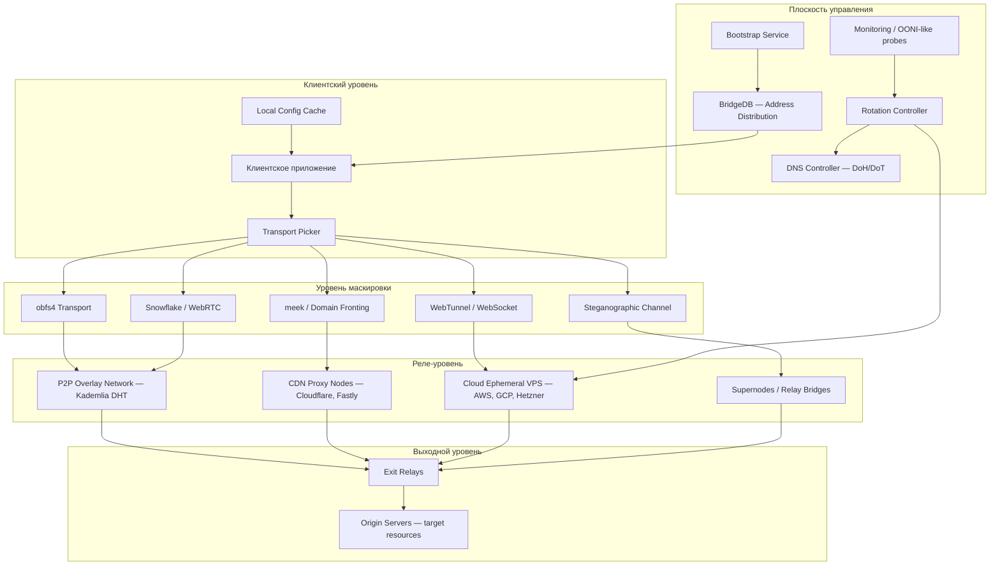
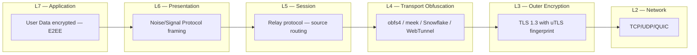
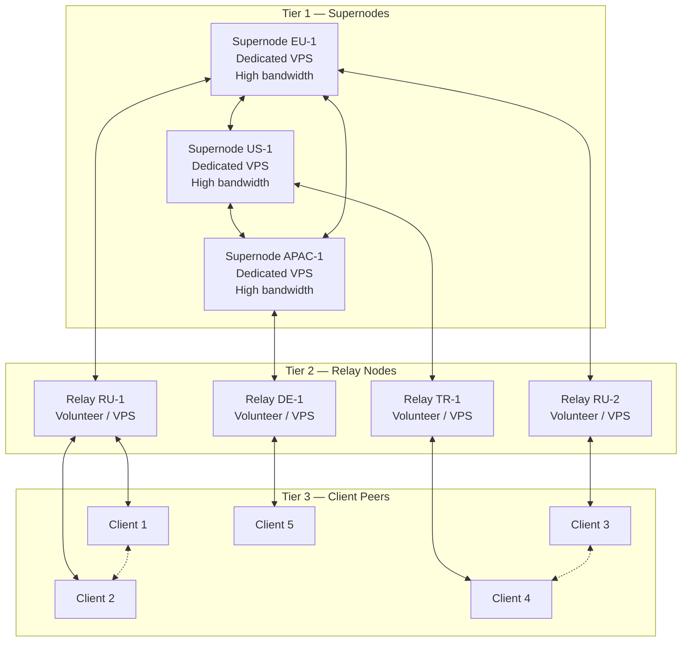
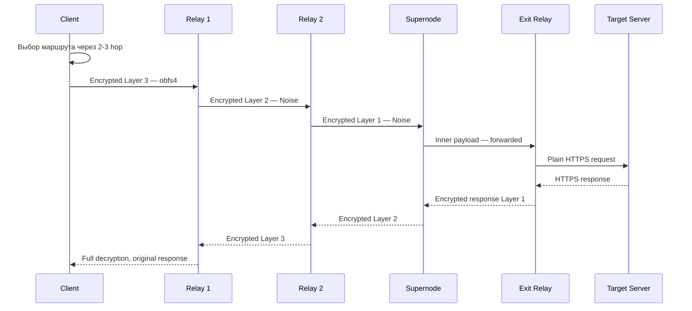
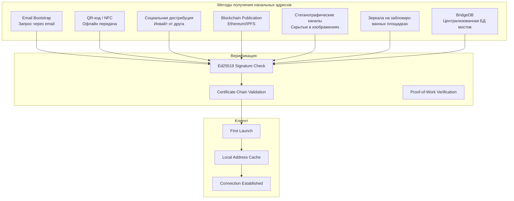
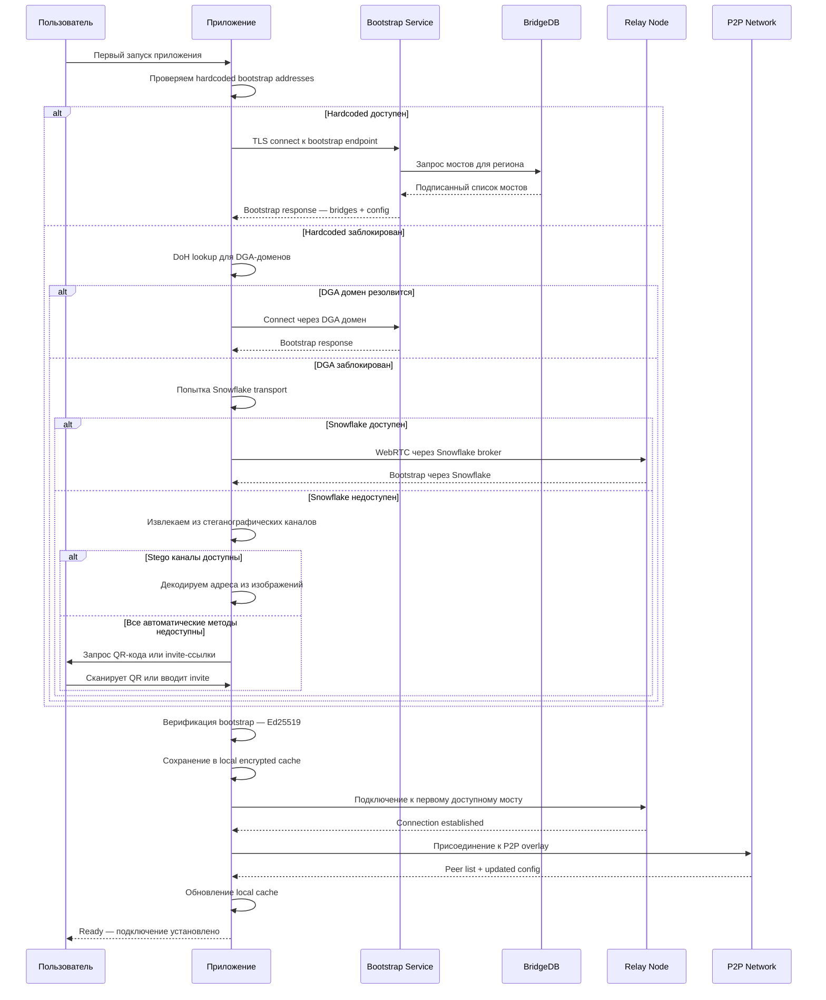
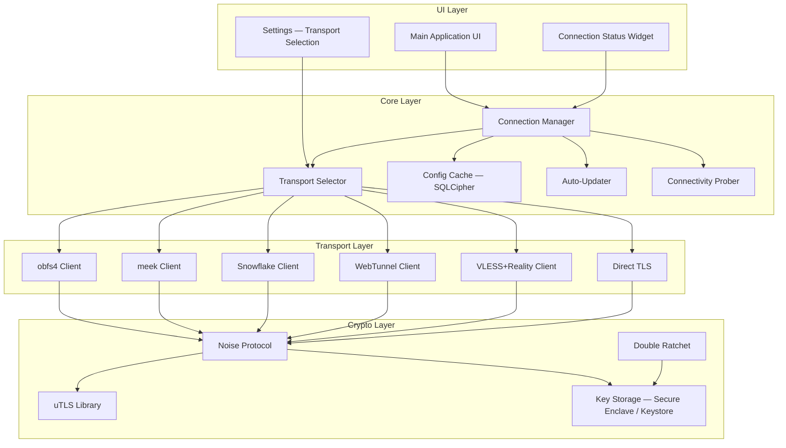
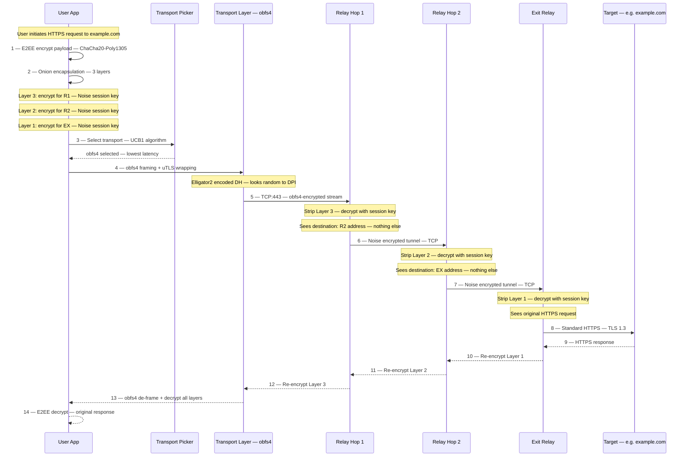

# Децентрализованная архитектура обхода цензуры

> Версия: 1.0 | Дата: 2026-03-26 | Статус: Draft

## Содержание

1. [Обзор системы](#1-обзор-системы)
2. [Алгоритм автоматической ротации инфраструктуры](#2-алгоритм-автоматической-ротации-инфраструктуры)
3. [Распределённая P2P-архитектура](#3-распределённая-p2p-архитектура)
4. [Техники маскировки трафика](#4-техники-маскировки-трафика)
5. [Автоматизация через DNS и BGP](#5-автоматизация-через-dns-и-bgp)
6. [Криптографически защищённая система дистрибуции bootstrap-адресов](#6-криптографически-защищённая-система-дистрибуции-bootstrap-адресов)
7. [Криптографический стек](#7-криптографический-стек)
8. [Правовые и организационные меры](#8-правовые-и-организационные-меры)
9. [Архитектура клиентского приложения](#9-архитектура-клиентского-приложения)
10. [Мониторинг и реагирование](#10-мониторинг-и-реагирование)
11. [Полная схема обработки пользовательского трафика](#11-полная-схема-обработки-пользовательского-трафика)
12. [Примеры из существующих систем](#12-примеры-из-существующих-систем)

---

## 1. Обзор системы

### 1.1 Общая архитектурная схема



### 1.2 Перечень компонентов

| Компонент | Роль | Технологии |
|-----------|------|------------|
| **Client App** | Конечное приложение пользователя | React Native / Capacitor, libp2p, uTLS |
| **Transport Picker** | Выбор оптимального транспорта | Автоматический probe + fallback chain |
| **Pluggable Transports** | Маскировка трафика под легитимный | obfs4, meek, Snowflake, WebTunnel |
| **P2P Overlay** | Децентрализованная сеть ретрансляции | Kademlia DHT, libp2p, Noise Protocol |
| **Supernodes** | Стабильные узлы с высокой пропускной способностью | Dedicated VPS, WireGuard tunnels |
| **CDN Proxy** | Domain fronting и CDN-проксирование | Cloudflare Workers, AWS CloudFront, Fastly |
| **Cloud Ephemeral** | Одноразовые VPS для ротации IP | AWS EC2 Spot, GCP Preemptible, Hetzner Cloud API |
| **Bootstrap Service** | Первичное подключение клиентов | BridgeDB, email-bootstrap, QR, blockchain |
| **Rotation Controller** | Автоматическая ротация инфраструктуры | Terraform, Pulumi, cloud APIs |
| **DNS Controller** | Управление DNS-записями | Cloudflare API, Route53 API, DoH/DoT |
| **Monitoring** | Детектирование блокировок | OONI probes, active probing, passive analysis |
| **Exit Relays** | Выход в открытый интернет | SOCKS5/HTTP proxy, transparent proxy |

### 1.3 Модель угроз (Threat Model)

#### Adversary capabilities — возможности противника

| Возможность | Уровень | Описание |
|-------------|---------|----------|
| IP-блокировка | Базовый | Блокировка конкретных IP-адресов по реестру |
| DNS-перехват / poisoning | Базовый | Подмена DNS-ответов, блокировка доменов |
| DPI — Deep Packet Inspection | Средний | Анализ паттернов трафика, определение протоколов |
| TLS fingerprinting | Средний | Идентификация клиента по TLS ClientHello |
| Active probing | Средний | Отправка probe-запросов к подозрительным серверам |
| Traffic correlation | Продвинутый | Корреляция входящего/исходящего трафика по timing |
| Sybil-атаки на P2P | Продвинутый | Внедрение вредоносных узлов в overlay network |
| Compromise облачных провайдеров | Продвинутый | Принуждение провайдера к раскрытию данных |
| BGP hijacking | Продвинутый | Перехват маршрутов на уровне BGP |

#### Принципы проектирования

1. **Defense in Depth** — многослойная защита: каждый уровень независимо противостоит атакам
2. **No Single Point of Failure** — нет ни одного компонента, выход которого из строя обрушит систему
3. **Assume Compromise** — проектирование исходя из того, что любой отдельный узел может быть скомпрометирован
4. **Minimal Knowledge** — каждый узел знает минимум необходимой информации
5. **Automated Recovery** — автоматическое восстановление при детектировании блокировки
6. **Collateral Damage Resistance** — использование инфраструктуры, блокировка которой нанесёт ущерб легитимным сервисам

### 1.4 Уровни сетевого стека



---

## 2. Алгоритм автоматической ротации инфраструктуры

### 2.1 Стратегия ротации

Система использует **пул облачных провайдеров** для автоматической ротации IP-адресов, доменов и конфигураций. Цель — обеспечить, чтобы заблокированные адреса заменялись быстрее, чем регулятор успевает их блокировать.

#### Пул провайдеров

| Провайдер | Тип | API | Скорость выдачи IP | Лимит IP |
|-----------|-----|-----|---------------------|----------|
| AWS EC2 | Spot/On-demand | `ec2:RunInstances` | ~30 сек | ~5 Elastic IP / регион |
| GCP Compute | Preemptible | `compute.instances.insert` | ~20 сек | Configurable quota |
| Azure VM | Spot | `Microsoft.Compute/virtualMachines` | ~45 сек | Per-subscription |
| DigitalOcean | Droplet | `POST /v2/droplets` | ~55 сек | 25 droplets default |
| Hetzner Cloud | Standard | `POST /v1/servers` | ~10 сек | Configurable |
| Vultr | Standard | `POST /v2/instances` | ~15 сек | 25 instances default |
| Linode | Standard | `POST /v4/linode/instances` | ~20 сек | Configurable |
| Oracle Cloud | Always Free + Paid | OCI SDK | ~60 сек | 2 free + paid |

#### Стратегия распределения

```
Provider Weight Formula:
  weight(p) = availability(p) × cost_efficiency(p) × geo_diversity(p) × (1 - block_rate(p))

Где:
  availability(p)    — uptime SLA провайдера [0..1]
  cost_efficiency(p) — нормализованная стоимость за час [0..1]
  geo_diversity(p)   — количество регионов, не пересекающихся с другими провайдерами
  block_rate(p)      — доля заблокированных IP за последние 24 часа [0..1]
```

### 2.2 Интервалы ротации

| Параметр | Значение | Обоснование |
|----------|----------|-------------|
| Baseline rotation interval | 4 часа | Быстрее типичного цикла обновления реестра РКН |
| Emergency rotation trigger | < 1 мин | По сигналу от мониторинга блокировки |
| DNS TTL для прокси-записей | 60 сек | Минимальный кеш, быстрая миграция |
| Domain rotation interval | 24 часа | Баланс между скрытностью и стоимостью регистрации |
| TLS certificate rotation | При каждой ротации IP | Новый Let's Encrypt cert через ACME |
| Pre-provisioning buffer | 20% от активного пула | Узлы готовы к мгновенной активации |

### 2.3 Domain Generation Algorithm (DGA)

```pseudocode
function generateDomain(seed, dayIndex, domainIndex):
    // Детерминистическая генерация домена на основе shared secret
    material = HMAC-SHA256(seed, encode(dayIndex) || encode(domainIndex))
    
    // Первые 10 байт → base32 → имя домена
    label = base32Encode(material[0:10]).toLowerCase()
    
    // Выбор TLD из пула дешёвых/доступных через API
    tldPool = [".xyz", ".top", ".icu", ".click", ".link", ".site", ".online"]
    tldIndex = bytesToInt(material[10:12]) mod len(tldPool)
    
    domain = label + tldPool[tldIndex]
    return domain

function getDomainSet(seed, date):
    dayIndex = daysSinceEpoch(date)
    domains = []
    for i in range(0, DOMAINS_PER_DAY):  // DOMAINS_PER_DAY = 16
        domains.append(generateDomain(seed, dayIndex, i))
    return domains

// Клиент и сервер разделяют seed через bootstrap
// Каждый день генерируется 16 доменов
// Клиент перебирает домены по порядку до первого рабочего
```

**Регистрация доменов** выполняется автоматически через API регистраторов:
- Namecheap API (`POST /domains/create`)
- Cloudflare Registrar API
- Gandi API
- Porkbun API

### 2.4 Domain Fronting через CDN

Domain fronting позволяет маскировать запросы к заблокированному ресурсу под запросы к легитимному домену на том же CDN.

```
Принцип:
  TLS SNI: allowed-domain.com     ← видно DPI
  HTTP Host: blocked-service.com  ← внутри TLS, невидимо DPI
  CDN роутит по Host header → наш backend
```

| CDN | Поддержка fronting | Статус | Замечания |
|-----|--------------------|--------|-----------|
| Cloudflare | Частично — через Workers | Активно | Cloudflare Workers роутят по логике, не по Host |
| AWS CloudFront | Отключено с 2018 | Недоступно | После запрета по запросу Signal |
| Fastly | Возможно через Compute@Edge | Ограничено | Зависит от конфигурации |
| Azure CDN | Частично | Ограничено | Microsoft может блокировать |
| Google Cloud CDN | Отключено в 2018 | Недоступно | — |
| Akamai | Нет | Недоступно | Enterprise CDN, строгий контроль |

#### Cloudflare Workers как альтернатива классическому domain fronting

```pseudocode
// Cloudflare Worker — прокси-роутер
addEventListener("fetch", event => {
    event.respondWith(handleRequest(event.request))
})

async function handleRequest(request):
    // Получаем зашифрованный целевой URL из заголовка
    encryptedTarget = request.headers.get("X-Target-Enc")
    if not encryptedTarget:
        return new Response("OK", {status: 200})  // Маскировка под обычный сайт
    
    // Расшифровываем AES-256-GCM ключом, распространённым через bootstrap
    targetURL = decrypt(encryptedTarget, SHARED_KEY)
    
    // Проксируем запрос к реальному backend
    response = await fetch(targetURL, {
        method: request.method,
        headers: filterHeaders(request.headers),
        body: request.body
    })
    
    return response
```

### 2.5 CDN-проксирование (по модели Telegram)

Telegram в 2018 использовал CDN-подсети для проксирования трафика. Подход:

1. Размещение контента на CDN (Cloudflare, AWS CloudFront)
2. Клиент обращается к CDN IP-адресу с SNI легитимного домена
3. CDN перенаправляет на backend-сервер Telegram
4. Блокировка CDN IP = блокировка миллионов легитимных сайтов (collateral damage)

#### Реализация CDN-проксирования

```pseudocode
function setupCDNProxy(targetBackend, cdnProvider):
    // 1. Регистрируем домен-прикрытие
    coverDomain = registerDomain(generateDomain(seed, today, 0))
    
    // 2. Настраиваем DNS через CDN
    cdnProvider.addDNSRecord(coverDomain, "CNAME", cdnProvider.endpoint)
    
    // 3. Настраиваем origin на CDN
    cdnProvider.setOrigin(coverDomain, targetBackend.ip, targetBackend.port)
    
    // 4. Получаем TLS-сертификат через CDN
    cdnProvider.enableSSL(coverDomain, "full_strict")
    
    // 5. Публикуем coverDomain клиентам через bootstrap-механизм
    bootstrap.publish({
        type: "cdn_proxy",
        domain: coverDomain,
        cdnProvider: cdnProvider.name,
        validUntil: now() + 24h,
        signature: sign(Ed25519_privkey, coverDomain || validUntil)
    })
    
    return coverDomain

function rotateCDNProxy():
    while true:
        sleep(ROTATION_INTERVAL)  // 4 часа
        
        newProxy = setupCDNProxy(targetBackend, selectCDNProvider())
        
        // Плавная миграция: старый прокси ещё работает 1 час
        activateProxy(newProxy)
        sleep(1h)
        deactivateProxy(oldProxy)
```

### 2.6 Полный алгоритм ротации

```pseudocode
class RotationController:
    providers = [AWS, GCP, Hetzner, Vultr, DigitalOcean, Linode]
    activeNodes = []      // Текущие активные узлы
    standbyNodes = []     // Предварительно развёрнутые узлы
    blockedIPs = Set()    // Известные заблокированные IP
    
    function mainLoop():
        // Параллельно запускаем:
        parallel:
            scheduledRotation()
            emergencyRotation()
            preProvision()
    
    function scheduledRotation():
        while true:
            sleep(BASELINE_ROTATION_INTERVAL)  // 4 часа
            
            for node in activeNodes:
                if node.age > BASELINE_ROTATION_INTERVAL:
                    replacement = standbyNodes.pop()
                    if replacement is null:
                        replacement = provisionNewNode(selectProvider())
                    
                    // Атомарная замена
                    dnsController.updateRecord(node.domain, replacement.ip, TTL=60)
                    migrateConnections(node, replacement)
                    activeNodes.replace(node, replacement)
                    
                    // Уничтожаем старый узел через grace period
                    schedule(destroyNode, node, delay=GRACE_PERIOD)  // 10 мин
    
    function emergencyRotation():
        while true:
            event = monitoringQueue.waitForEvent()
            
            if event.type == "IP_BLOCKED":
                blockedNode = findNodeByIP(event.ip)
                blockedIPs.add(event.ip)
                
                replacement = standbyNodes.pop()
                if replacement is null:
                    replacement = provisionNewNode(selectProvider())
                
                dnsController.updateRecord(blockedNode.domain, replacement.ip, TTL=60)
                migrateConnections(blockedNode, replacement)
                activeNodes.replace(blockedNode, replacement)
                destroyNode(blockedNode)
                
                // Метрика: записываем время реакции
                metrics.record("emergency_rotation_time", now() - event.timestamp)
    
    function preProvision():
        while true:
            targetStandby = ceil(len(activeNodes) * PRE_PROVISION_RATIO)  // 20%
            
            while len(standbyNodes) < targetStandby:
                provider = selectProvider()
                node = provisionNewNode(provider)
                standbyNodes.push(node)
            
            sleep(60)  // Проверяем каждую минуту
    
    function selectProvider():
        weights = {}
        for p in providers:
            w = p.availability * p.costEfficiency * p.geoDiversity
            w *= (1 - getBlockRate(p, last24h))
            weights[p] = w
        
        return weightedRandomChoice(providers, weights)
    
    function provisionNewNode(provider):
        // 1. Создаём VPS
        region = selectUnblockedRegion(provider)
        vps = provider.createInstance(
            region: region,
            image: "ubuntu-24.04",
            size: "1vcpu-1gb",
            userData: CLOUD_INIT_SCRIPT
        )
        
        // 2. Ждём готовности
        waitUntilReady(vps, timeout=120s)
        
        // 3. Настраиваем транспорты
        setupTransports(vps)  // obfs4, WebTunnel etc
        
        // 4. Получаем TLS-сертификат
        obtainCertificate(vps)  // ACME / Let's Encrypt
        
        // 5. Проверяем доступность
        if not healthCheck(vps):
            destroyNode(vps)
            return provisionNewNode(provider)  // Retry с другим провайдером
        
        return vps
```

---

## 3. Распределённая P2P-архитектура

### 3.1 Overlay Network Design

Система использует модифицированный **Kademlia DHT** для построения overlay network. Выбор обоснован:
- Логарифмическая сложность поиска `O(log n)`
- Устойчивость к churn (постоянному подключению/отключению узлов)
- Доказанная работоспособность в масштабе (BitTorrent, Ethereum, IPFS)

#### Kademlia Node ID

```pseudocode
function generateNodeID(publicKey):
    // Node ID = SHA-256 от Ed25519 публичного ключа
    // 256-битный идентификатор в пространстве Kademlia
    return SHA256(publicKey)

function xorDistance(nodeA, nodeB):
    return nodeA.id XOR nodeB.id

// Каждый узел поддерживает k-buckets (k=20)
// Bucket i содержит узлы с расстоянием 2^i <= d < 2^(i+1)
```

### 3.2 Топология P2P-сети



### 3.3 Механизм обнаружения пиров (Peer Discovery)

```pseudocode
class PeerDiscovery:
    knownPeers = []         // Известные пиры
    bootstrapPeers = []     // Начальные пиры из bootstrap
    dht = KademliaDHT()
    
    function initialize():
        // Этап 1: Bootstrap — получаем начальный набор пиров
        bootstrapPeers = bootstrapService.getInitialPeers()
        
        for peer in bootstrapPeers:
            if verifyPeer(peer):  // Проверка Ed25519 подписи
                dht.addPeer(peer)
        
        // Этап 2: DHT lookup — находим ближайших пиров
        nearbyPeers = dht.findNode(selfNodeID)
        for peer in nearbyPeers:
            knownPeers.add(peer)
        
        // Этап 3: Периодическое обновление
        startPeriodicRefresh()
    
    function startPeriodicRefresh():
        while true:
            sleep(REFRESH_INTERVAL)  // 15 минут
            
            // Рандомный lookup для поддержания k-buckets
            randomID = randomBytes(32)
            dht.findNode(randomID)
            
            // Пинг известных пиров
            for peer in knownPeers:
                if not ping(peer, timeout=5s):
                    knownPeers.remove(peer)
    
    function verifyPeer(peer):
        // Верификация: пир должен предъявить доказательство
        // принадлежности сети (подпись от доверенного authority)
        cert = peer.certificate
        return Ed25519.verify(
            NETWORK_PUBLIC_KEY,
            cert.signedData,
            cert.signature
        ) AND cert.expiry > now()
```

### 3.4 NAT Traversal

```
Стек NAT traversal:

1. Direct connection     — если оба пира имеют публичный IP
2. STUN (RFC 8489)       — определение типа NAT и публичного адреса
3. ICE (RFC 8445)        — выбор оптимального пути подключения
4. TURN (RFC 8656)       — relay через промежуточный сервер при symmetric NAT

STUN/TURN серверы:
  - Собственные (coturn на VPS)
  - Google STUN: stun.l.google.com:19302
  - Cloudflare TURN: turn.cloudflare.com (Cloudflare Calls)
```

```pseudocode
function establishConnection(localPeer, remotePeer):
    // ICE gathering
    candidates = []
    
    // 1. Host candidates
    for iface in getNetworkInterfaces():
        candidates.add(HostCandidate(iface.ip, iface.port))
    
    // 2. Server-reflexive candidates (STUN)
    for stunServer in STUN_SERVERS:
        mappedAddr = stunBinding(stunServer)
        if mappedAddr:
            candidates.add(SrflxCandidate(mappedAddr.ip, mappedAddr.port))
    
    // 3. Relay candidates (TURN)
    for turnServer in TURN_SERVERS:
        relayAddr = turnAllocate(turnServer, credentials)
        if relayAddr:
            candidates.add(RelayCandidate(relayAddr.ip, relayAddr.port))
    
    // 4. Обмен кандидатами через signaling channel
    sendCandidates(remotePeer, candidates)
    remoteCandidates = receiveCandidates(remotePeer)
    
    // 5. ICE connectivity checks
    pairs = createCandidatePairs(candidates, remoteCandidates)
    sortByPriority(pairs)
    
    for pair in pairs:
        if connectivityCheck(pair):
            return pair  // Используем первую успешную пару
    
    return null  // Невозможно установить соединение
```

### 3.5 Relay-узлы и суперноды

**Суперноды** (Tier 1) — стабильные выделенные серверы с высокой пропускной способностью:

| Свойство | Значение |
|----------|----------|
| Минимальный uptime | 99.5% |
| Минимальная полоса | 1 Gbps |
| Количество в сети | 10-30 |
| Географическое размещение | EU, US, APAC, ME — не менее 3 регионов |
| Оператор | Управляются core-командой проекта |

**Relay Nodes** (Tier 2) — волонтёрские или арендованные узлы:

| Свойство | Значение |
|----------|----------|
| Минимальная полоса | 100 Mbps |
| Количество в сети | 50-500+ |
| Вознаграждение | Опционально, токен-система или reputation |
| Requirements | Прохождение proof-of-work при регистрации |

### 3.6 Протокол репликации состояния

```pseudocode
// Каждый узел хранит:
// 1. Routing table (k-buckets) — локальная
// 2. Peer registry — реплицируемая через DHT
// 3. Active transports list — реплицируемая

class StateReplication:
    // Gossip protocol для распространения состояния
    function gossipRound():
        peers = selectRandomPeers(FANOUT)  // FANOUT = 3
        stateDigest = computeDigest(localState)
        
        for peer in peers:
            remoteDigest = peer.getDigest()
            
            if stateDigest != remoteDigest:
                diff = computeDiff(localState, remoteDigest)
                peer.pushUpdate(diff)
                remoteDiff = peer.pullUpdate(stateDigest)
                mergeState(remoteDiff)
    
    function computeDigest(state):
        // Merkle tree digest для эффективного diff
        return merkleRoot(state.entries)
```

### 3.7 Устойчивость к Sybil-атакам

```pseudocode
// Многоуровневая защита от Sybil-атак:

// 1. Proof-of-Work при первом подключении
function joinNetwork(nodePublicKey):
    challenge = generateChallenge()
    
    // Узел должен найти nonce такой, что:
    // SHA256(challenge || nonce || nodePublicKey) имеет N ведущих нулей
    // N = 20 (около 1 секунды на современном CPU)
    proof = receiveProof(node)
    
    hash = SHA256(challenge || proof.nonce || nodePublicKey)
    if leadingZeros(hash) < DIFFICULTY:
        reject("Insufficient proof of work")
    
    // 2. Reputation scoring
    node.reputation = INITIAL_REPUTATION  // 0.5
    
    return acceptNode(node)

// 3. Ограничение influence по reputation
function selectRelayPath(source, destination):
    candidates = dht.findRoute(source, destination)
    
    // Фильтруем узлы с низкой репутацией
    filtered = candidates.filter(n => n.reputation > MIN_REPUTATION)
    
    // Предпочитаем разнообразие: не более 1 узла из одной /24 подсети
    diversified = ensureSubnetDiversity(filtered)
    
    return diversified

// 4. Обновление репутации
function updateReputation(node, event):
    if event == "successful_relay":
        node.reputation = min(1.0, node.reputation + 0.01)
    elif event == "failed_relay":
        node.reputation = max(0.0, node.reputation - 0.1)
    elif event == "detected_malicious":
        node.reputation = 0.0
        banNode(node, duration=7d)
```

### 3.8 Маршрутизация трафика через P2P



---

## 4. Техники маскировки трафика

### 4.1 Pluggable Transports

#### obfs4

Протокол из проекта Tor. Обеспечивает обфускацию, устойчивую к DPI.

```
Протокол работы:
1. Handshake: Elligator2-кодированный Curve25519 DH
   - Неотличим от random bytes для DPI
   - Включает server public key fingerprint для защиты от active probing
2. Padding: пакеты дополняются до случайной длины (IAT mode)
3. Framing: длина фрейма шифруется отдельно (NaCl secretbox)
4. Timing: случайные задержки между пакетами

Порты: любой (рекомендуется 443 или 80)
Зависимости: Go library obfs4proxy
```

#### meek

Domain fronting transport. Весь трафик выглядит как HTTPS к разрешённому домену.

```
Протокол работы:
1. Клиент устанавливает TLS-соединение с CDN (SNI: allowed-domain.com)
2. Внутри TLS отправляет HTTP POST с Host: meek-reflect.appspot.com
3. CDN роутит запрос на meek reflector
4. Reflector проксирует к Tor bridge
5. Ответ возвращается тем же путём

Ограничения:
- Высокая latency (каждый запрос — HTTP round-trip)
- Google и Amazon отключили domain fronting в 2018
- Cloudflare Workers — альтернативная реализация
```

#### Snowflake

WebRTC-based transport. Использует волонтёрские браузеры как прокси.

```
Протокол работы:
1. Клиент обращается к broker (через domain fronting или напрямую)
2. Broker назначает волонтёра (Snowflake proxy в браузере)
3. Устанавливается WebRTC DataChannel между клиентом и волонтёром
4. Трафик выглядит как обычный WebRTC (видеозвонок)
5. Волонтёр пересылает трафик к Tor bridge

Преимущества:
- Огромный пул волонтёрских прокси (расширение для браузера)
- WebRTC трафик — widespread и трудно отличим
- NAT traversal встроен в WebRTC

Порты: UDP ephemeral (WebRTC)
```

#### WebTunnel

Трафик выглядит как обычный HTTPS/WebSocket.

```
Протокол работы:
1. Клиент подключается к WebTunnel server по HTTPS
2. Выполняет WebSocket upgrade
3. Внутри WebSocket фреймов передаётся obfuscated payload
4. Для DPI соединение выглядит как обычный WebSocket
5. Server-side: Nginx reverse proxy + WebTunnel daemon

Порт: 443
Server setup: Nginx + WebTunnel binary
```

### 4.2 TLS Fingerprint Randomization (uTLS)

```
Проблема: DPI может идентифицировать клиента по TLS ClientHello fingerprint
(JA3/JA4 hash). Go/Python клиенты имеют уникальный fingerprint, отличный
от браузеров.

Решение: библиотека uTLS (utls) — Go library для имитации TLS fingerprint
популярных браузеров.

Поддерживаемые имитации:
- Chrome 120+
- Firefox 121+
- Safari 17+
- Edge 120+
- Android Chrome
- iOS Safari

Имплементация:
```

```pseudocode
function createTLSConnection(serverAddr, sni):
    // Выбираем случайный fingerprint
    fingerprints = [
        uTLS.HelloChrome_120,
        uTLS.HelloFirefox_121,
        uTLS.HelloSafari_17,
        uTLS.HelloEdge_120,
        uTLS.HelloRandomized  // Полностью случайный, но валидный
    ]
    
    selectedFP = weightedRandom(fingerprints, browserMarketShare)
    
    conn = uTLS.Dial(serverAddr, &uTLS.Config{
        ServerName: sni,
        ClientHelloID: selectedFP,
        // Рандомизация расширений
        Extensions: randomizeExtensionOrder(selectedFP.Extensions)
    })
    
    return conn
```

### 4.3 Имитация легитимного HTTPS-трафика

```
Техники:

1. HTTP/2 Multiplexing
   - Множественные потоки в одном TLS-соединении
   - Имитация загрузки веб-страницы (HTML + CSS + JS + images)
   - Padding до типичных размеров веб-ресурсов

2. Traffic Shaping
   - Имитация паттернов browsing (click → page load → idle → click)
   - Burst traffic с паузами (не постоянный поток)
   - Размеры пакетов соответствуют типичным HTTP-ответам

3. Decoy Traffic
   - Параллельные легитимные запросы к популярным сайтам
   - Cover traffic при отсутствии реального трафика
```

### 4.4 Steganographic Tunneling

```pseudocode
// Встраивание данных в изображения (F5 stego algorithm)
function embedInImage(coverImage, payload, key):
    // 1. Шифруем payload
    encrypted = AES_256_GCM.encrypt(key, payload)
    
    // 2. Преобразуем изображение в DCT-коэффициенты (JPEG)
    dctCoeffs = JPEG_DCT(coverImage)
    
    // 3. Встраиваем биты в LSB DCT-коэффициентов
    // F5 algorithm: matrix embedding для минимального искажения
    modifiedCoeffs = F5_embed(dctCoeffs, encrypted, key)
    
    // 4. Обратное преобразование
    stegoImage = JPEG_IDCT(modifiedCoeffs)
    
    return stegoImage
    // Capacity: ~0.1 бит/пиксель для JPEG
    // 1920x1080 изображение ≈ 25 КБ полезных данных

// Встраивание в видео через модификацию I-frames
function embedInVideo(coverVideo, payload, key):
    encrypted = AES_256_GCM.encrypt(key, payload)
    frames = extractIFrames(coverVideo)
    
    chunkSize = len(encrypted) / len(frames)
    for i, frame in enumerate(frames):
        chunk = encrypted[i*chunkSize : (i+1)*chunkSize]
        frames[i] = embedInFrame(frame, chunk, key)
    
    return reconstructVideo(coverVideo, frames)
```

### 4.5 Маскировка под WebSocket и gRPC

```
WebSocket tunneling:
  - Подключение выглядит как обычный WebSocket upgrade
  - Framing: binary WebSocket frames с зашифрованным payload
  - Heartbeat: периодический ping/pong для поддержания соединения
  - Server: стандартный Nginx с WebSocket pass-through

gRPC tunneling:
  - HTTP/2 + protobuf framing (стандартный gRPC)
  - Имитация API-вызовов (методы: GetStatus, StreamData, etc.)
  - Server: стандартный gRPC server с кастомными service definitions
  - Преимущество: gRPC трафик — обычное явление в cloud-native среде

Порт: 443 (стандартный HTTPS)
```

### 4.6 Сравнение транспортов по устойчивости к DPI

| Транспорт | DPI resistance | Active probing resistance | Latency overhead | Bandwidth overhead | Collateral damage | Deployment complexity |
|-----------|---------------|--------------------------|------------------|--------------------|-------------------|-----------------------|
| **obfs4** | Высокая — random bytes | Высокая — server auth | Низкий ~5ms | Средний ~15% | Нулевой | Средняя |
| **meek** | Очень высокая — HTTPS к CDN | Очень высокая | Высокий ~200ms | Высокий ~50% | Очень высокий — CDN | Высокая |
| **Snowflake** | Высокая — WebRTC | Средняя | Средний ~50ms | Средний ~20% | Высокий — WebRTC | Низкая |
| **WebTunnel** | Высокая — стандартный WebSocket | Средняя | Низкий ~10ms | Низкий ~5% | Средний | Средняя |
| **Stego** | Очень высокая | Очень высокая | Очень высокий | Очень высокий ~1000% | Нулевой | Очень высокая |
| **VLESS+Reality** | Очень высокая — имитация чужого TLS | Очень высокая | Низкий ~5ms | Низкий ~3% | Средний | Средняя |
| **gRPC tunnel** | Высокая — стандартный gRPC | Средняя | Низкий ~10ms | Низкий ~10% | Средний | Средняя |
| **Shadowsocks AEAD** | Средняя — zero-pattern | Средняя | Низкий ~3ms | Низкий ~5% | Нулевой | Низкая |

---

## 5. Автоматизация через DNS и BGP

### 5.1 Динамическая смена DNS-записей

```pseudocode
class DNSController:
    providers = [
        CloudflareAPI(token=CF_TOKEN),
        Route53API(accessKey=AWS_KEY),
        GoogleCloudDNS(credentials=GCP_CREDS)
    ]
    
    function updateRecord(domain, newIP, ttl=60):
        provider = getProviderForDomain(domain)
        
        // API call для обновления A-записи
        provider.updateDNSRecord({
            zone: domain,
            type: "A",
            name: "@",
            content: newIP,
            ttl: ttl,          // Минимальный TTL
            proxied: true      // Cloudflare proxy для скрытия origin IP
        })
        
        // Верификация обновления
        for attempt in range(0, 10):
            resolved = dohResolve(domain, "A")
            if resolved == newIP:
                return true
            sleep(5s)
        
        return false  // DNS update не прошёл
    
    function dohResolve(domain, recordType):
        // DNS-over-HTTPS запрос к Cloudflare
        response = httpsGet(
            "https://cloudflare-dns.com/dns-query",
            headers: {"Accept": "application/dns-json"},
            params: {"name": domain, "type": recordType}
        )
        return response.Answer[0].data
```

### 5.2 Fast-Flux DNS

```
Fast-flux: техника быстрой ротации DNS-записей для одного домена.

Конфигурация:
  TTL:          30-60 секунд
  Round-robin:  5-10 IP-адресов одновременно
  Ротация:      Каждые 5 минут меняется пул IP
  
Пример:
  t=0min:   example.xyz → [1.2.3.4, 5.6.7.8, 9.10.11.12]
  t=5min:   example.xyz → [13.14.15.16, 17.18.19.20, 1.2.3.4]
  t=10min:  example.xyz → [21.22.23.24, 13.14.15.16, 25.26.27.28]

Double-flux: ротация и NS-записей (nameservers)
  - NS-серверы тоже находятся на быстро ротируемых IP
  - Усложняет блокировку на уровне DNS
```

```pseudocode
class FastFluxDNS:
    ipPool = []           // Все доступные IP из ротации
    activeSet = []        // Текущий набор IP в DNS
    ACTIVE_SIZE = 5       // Количество IP в одном наборе
    ROTATION_SEC = 300    // 5 минут
    
    function rotateFluxSet():
        while true:
            // Выбираем ACTIVE_SIZE IP из пула
            // Предпочтение: незаблокированные + географически распределённые
            newSet = selectDiverseSubset(ipPool, ACTIVE_SIZE)
            
            for domain in managedDomains:
                // Удаляем старые A-записи
                dnsController.removeAllRecords(domain, "A")
                
                // Добавляем новые
                for ip in newSet:
                    dnsController.addRecord(domain, "A", ip, TTL=30)
            
            activeSet = newSet
            sleep(ROTATION_SEC)
```

### 5.3 DNS-over-HTTPS Bootstrap

```pseudocode
// Клиент использует DoH для начального резолвинга,
// обходя DNS-перехват и poisoning

function bootstrapDNSResolve(domain):
    // Список DoH resolvers (труднее заблокировать, чем plain DNS)
    dohResolvers = [
        "https://cloudflare-dns.com/dns-query",         // 1.1.1.1
        "https://dns.google/dns-query",                  // 8.8.8.8
        "https://dns.quad9.net/dns-query",               // 9.9.9.9
        "https://doh.opendns.com/dns-query",             // Cisco
        "https://dns.nextdns.io/dns-query",              // NextDNS
        "https://doh.mullvad.net/dns-query"              // Mullvad
    ]
    
    for resolver in shuffle(dohResolvers):
        try:
            response = httpsGet(
                resolver,
                headers: {
                    "Accept": "application/dns-json",
                    "User-Agent": randomBrowserUA()  // Имитация браузера
                },
                params: {"name": domain, "type": "A"}
            )
            
            if response.status == 200 AND response.Answer:
                return response.Answer[0].data
        catch:
            continue  // Следующий resolver
    
    // Fallback: использовать embedded bootstrap IPs
    return getEmbeddedBootstrapIP()
```

### 5.4 Anycast-сети

```
BGP Anycast: один IP-адрес анонсируется из нескольких точек присутствия.
Пользователь автоматически направляется к ближайшей по BGP.

Преимущества для обхода цензуры:
1. Блокировка anycast IP = блокировка всех PoP, включая легитимные
2. Добавление новых PoP не требует изменения клиента
3. Балансировка нагрузки на уровне BGP

Реализация:
- Получить собственный ASN и /24 блок IP (RIPE, ARIN)
- Анонсировать префикс с нескольких PoP через BGP sessions
- Использовать BIRD или FRRouting для BGP daemon

Альтернатива: использовать Anycast-сервисы CDN
- Cloudflare (бесплатный план включает anycast)
- BunnyCDN
- KeyCDN
```

### 5.5 Алгоритм автоматической ротации DNS с API-интеграцией

```pseudocode
class DNSRotationOrchestrator:
    // Интеграция с множественными DNS-провайдерами
    dnsProviders = {
        "cloudflare": CloudflareAPI,
        "route53": Route53API,
        "googleDNS": GoogleCloudDNSAPI,
        "hetznerDNS": HetznerDNSAPI
    }
    
    function orchestrateRotation():
        while true:
            blockedDomains = monitoringService.getBlockedDomains()
            
            for domain in blockedDomains:
                // Шаг 1: Генерируем замену
                newDomain = DGA.generateDomain(seed, today, nextIndex())
                
                // Шаг 2: Регистрируем новый домен
                registrar = selectRegistrar()
                registrar.register(newDomain, privacyProtection=true)
                
                // Шаг 3: Настраиваем DNS через один из провайдеров
                provider = selectDNSProvider(newDomain)
                provider.createZone(newDomain)
                
                activeIPs = rotationController.getActiveNodeIPs()
                for ip in activeIPs:
                    provider.addRecord(newDomain, "A", ip, TTL=60)
                
                // Шаг 4: Настраиваем TLS
                obtainLetsEncryptCert(newDomain)
                
                // Шаг 5: Публикуем через bootstrap
                bootstrapService.publishNewEndpoint({
                    domain: newDomain,
                    validFrom: now(),
                    validUntil: now() + 48h,
                    signature: sign(masterKey, newDomain)
                })
                
                // Шаг 6: Грациозная миграция
                migrateClients(domain, newDomain, gracePeriod=1h)
            
            sleep(CHECK_INTERVAL)  // 1 минута
```

---

## 6. Криптографически защищённая система дистрибуции bootstrap-адресов

### 6.1 Обзор механизмов bootstrap



### 6.2 BridgeDB-подобная система распределения мостов

```pseudocode
class BridgeDB:
    bridges = []              // Все известные мосты
    distributors = {
        "https": HTTPSDistributor(),
        "email": EmailDistributor(),
        "social": SocialDistributor(),
        "moat": MoatDistributor()      // CAPTCHA-protected web
    }
    
    // Мосты разбиваются на кольца (rings)
    // Каждый distributor имеет свой набор мостов
    // Это защищает от компрометации одного канала
    rings = {
        "https": HashRing(bridges, fraction=0.3),
        "email": HashRing(bridges, fraction=0.3),
        "social": HashRing(bridges, fraction=0.2),
        "reserved": HashRing(bridges, fraction=0.2)  // Резерв на экстренный случай
    }
    
    function getBridges(distributor, clientID, count=3):
        ring = rings[distributor]
        
        // Детерминистический выбор мостов на основе clientID
        // Один клиент всегда получает одни и те же мосты
        // Это затрудняет enumeration всех мостов
        selectedBridges = ring.getConsistent(clientID, count)
        
        // Подписываем ответ
        response = {
            bridges: selectedBridges.map(b => b.connectionString()),
            issuedAt: now(),
            validUntil: now() + 24h
        }
        response.signature = Ed25519.sign(BRIDGE_DB_KEY, serialize(response))
        
        return response

class HTTPSDistributor:
    function distribute(request):
        // 1. Проверяем IP — ограничение по региональному распределению
        clientRegion = geoIP(request.ip)
        
        // 2. Rate limiting по IP
        if rateLimiter.isExceeded(request.ip):
            return error("Too many requests")
        
        // 3. CAPTCHA challenge
        if not verifyCaptcha(request.captchaToken):
            return error("Invalid captcha")
        
        // 4. Выдаём мосты
        clientID = HMAC_SHA256(DISTRIBUTION_SECRET, request.ip || clientRegion)
        return bridgeDB.getBridges("https", clientID)

class EmailDistributor:
    function distribute(emailRequest):
        // Поддерживаемые провайдеры (бесплатные, затрудняющие массовую регистрацию)
        allowedProviders = ["gmail.com", "yahoo.com", "outlook.com", "proton.me"]
        
        senderDomain = extractDomain(emailRequest.from)
        if senderDomain not in allowedProviders:
            return ignore()
        
        // Rate limit: 1 запрос в 3 часа с одного адреса
        if rateLimiter.isExceeded(emailRequest.from, window=3h):
            return ignore()
        
        clientID = HMAC_SHA256(DISTRIBUTION_SECRET, emailRequest.from)
        bridges = bridgeDB.getBridges("email", clientID)
        
        // Формируем ответ
        replyBody = formatBridgeResponse(bridges)
        sendEmail(emailRequest.from, replyBody)
```

### 6.3 Стеганография в изображениях для передачи адресов

```pseudocode
function publishBootstrapViaStego():
    // 1. Формируем payload с адресами
    bootstrapData = {
        version: 3,
        bridges: activeAddresses.map(a => a.serialize()),
        timestamp: now(),
        expiry: now() + 24h
    }
    
    // 2. Сериализуем и шифруем
    serialized = CBOR.encode(bootstrapData)
    compressed = zstd.compress(serialized)
    encrypted = AES_256_GCM.encrypt(STEGO_KEY, compressed)
    
    // Размер encrypted ≈ 200-500 байт (5-15 мостов)
    
    // 3. Подготавливаем cover images
    coverImages = downloadPopularImages("unsplash", count=10)
    
    // 4. Встраиваем в каждое изображение
    for img in coverImages:
        stegoImage = F5_embed(img, encrypted, STEGO_KEY)
        
        // 5. Публикуем на популярных платформах
        uploadToImgur(stegoImage)
        uploadToFlickr(stegoImage)
        postToTelegram(stegoImage, channelID=PUBLIC_CHANNEL)
    
    // 6. Клиент знает URL шаблоны и STEGO_KEY
    // Скачивает изображения и извлекает адреса

function clientExtractBootstrap():
    // Клиент знает: список URL и ключ из предыдущего bootstrap или hardcoded
    imageURLs = computeImageURLs(seed, today)
    
    for url in imageURLs:
        try:
            image = download(url)
            encrypted = F5_extract(image, STEGO_KEY)
            compressed = AES_256_GCM.decrypt(STEGO_KEY, encrypted)
            serialized = zstd.decompress(compressed)
            bootstrapData = CBOR.decode(serialized)
            
            if verifySignature(bootstrapData):
                return bootstrapData.bridges
        catch:
            continue
    
    return null
```

### 6.4 QR-коды и NFC для офлайн-передачи

```pseudocode
function generateBootstrapQR(bridges):
    payload = {
        v: 3,                    // Версия формата
        b: bridges.map(b => ({
            t: b.transport,      // "obfs4", "wt", "snow"
            a: b.address,        // IP:port
            f: b.fingerprint,    // Hex-encoded node fingerprint
            p: b.params          // Transport-specific params
        })),
        s: Ed25519.sign(BOOTSTRAP_KEY, bridges),
        e: now() + 72h          // Expiry
    }
    
    // Compact encoding: CBOR + zstd → ~150-300 bytes для 3 мостов
    encoded = base45Encode(zstd.compress(CBOR.encode(payload)))
    
    // QR Code version 10-15 (medium density, scannable on phone)
    qrCode = QRCode.generate(encoded, errorCorrection="M")
    
    return qrCode

function generateNFCPayload(bridges):
    // NDEF record с custom MIME type
    payload = serializeBridges(bridges)
    
    ndefRecord = {
        type: "application/x-bridge-config",
        payload: payload,
        signature: Ed25519.sign(BOOTSTRAP_KEY, payload)
    }
    
    return ndefRecord
```

### 6.5 Социальная дистрибуция

```pseudocode
function generateInvite(senderUser, recipientContact):
    // Генерируем персональное приглашение
    inviteToken = randomBytes(16)
    
    // Привязываем к конкретному мосту (или набору мостов)
    assignedBridges = bridgeDB.getBridges("social", inviteToken, count=3)
    
    invite = {
        token: base58Encode(inviteToken),
        bridges: assignedBridges,
        sender: senderUser.publicKey,
        createdAt: now(),
        maxUses: 1,                    // Одноразовое приглашение
        expiry: now() + 7d
    }
    
    invite.signature = Ed25519.sign(senderUser.privateKey, serialize(invite))
    
    // Формируем deeplink или short URL
    deeplink = "app://invite/" + base58Encode(CBOR.encode(invite))
    
    return deeplink

// Дерево доверия: пользователь может создать до 5 приглашений
// Если приглашённый оказывается злоумышленником (Sybil),
// репутация всей ветки снижается
```

### 6.6 Blockchain-based Address Publication

```pseudocode
function publishToBlockchain(bootstrapAddresses):
    // Используем Ethereum (или L2: Arbitrum, Optimism) для публикации
    
    // 1. Шифруем данные (только клиенты с ключом могут прочитать)
    encrypted = AES_256_GCM.encrypt(BLOCKCHAIN_EPOCH_KEY, 
        CBOR.encode(bootstrapAddresses))
    
    // 2. Публикуем в smart contract или calldata
    tx = {
        to: REGISTRY_CONTRACT_ADDRESS,
        data: encodeABI("publish", [encrypted, currentEpoch]),
        // Газ оплачивается из rotating wallet
    }
    
    signedTx = signTransaction(tx, PUBLISHER_PRIVATE_KEY)
    txHash = ethereum.sendTransaction(signedTx)
    
    return txHash

// Альтернативы:
// - IPFS: публикуем IPNS-запись → DHT → клиент резолвит по known IPNS key
// - Bitcoin: OP_RETURN с 80 байтами данных
// - Nostr: события в децентрализованных relay

function clientReadFromBlockchain():
    // Клиент знает: CONTRACT_ADDRESS и BLOCKCHAIN_EPOCH_KEY
    events = contract.getEvents("Published", fromBlock=latestBlock - 1000)
    
    for event in events.reverse():  // Начинаем с последнего
        try:
            decrypted = AES_256_GCM.decrypt(
                BLOCKCHAIN_EPOCH_KEY, 
                event.data
            )
            addresses = CBOR.decode(decrypted)
            
            if verifyAddresses(addresses):
                return addresses
        catch:
            continue
    
    return null
```

### 6.7 Криптографическая верификация bootstrap-адресов

```pseudocode
// Иерархия ключей:
//
// Root Key (Ed25519) — offline, air-gapped
//   └── Epoch Key (Ed25519) — ротация каждые 30 дней
//       └── Bridge Certificate — подпись для каждого моста
//           └── Transport Keys — ключи для конкретного транспорта

class BootstrapVerifier:
    ROOT_PUBLIC_KEY = "ed25519:..." // Hardcoded в приложении
    
    function verifyBridgeCertificate(cert):
        // 1. Проверяем подпись Epoch Key от Root Key
        epochKeyValid = Ed25519.verify(
            ROOT_PUBLIC_KEY,
            cert.epochKey || cert.epochKeyExpiry,
            cert.epochKeySignature
        )
        
        if not epochKeyValid:
            return false
        
        if cert.epochKeyExpiry < now():
            return false
        
        // 2. Проверяем подпись моста от Epoch Key
        bridgeValid = Ed25519.verify(
            cert.epochKey,
            cert.bridgeAddress || cert.transport || cert.validUntil,
            cert.bridgeSignature
        )
        
        if not bridgeValid:
            return false
        
        if cert.validUntil < now():
            return false
        
        return true
```

### 6.8 Протокол первого подключения клиента



---

## 7. Криптографический стек

### 7.1 End-to-End шифрование

Используем **Noise Protocol Framework** (noise_XX pattern) для установления сессий между узлами и **Signal Protocol** (Double Ratchet) для E2EE сообщений.

#### Noise XX Handshake (для relay connections)

```
Noise_XX_25519_ChaChaPoly_SHA256

Initiator (I) → Responder (R):

  → e                        // Ephemeral key I
  ← e, ee, s, es            // Ephemeral key R + encrypted static R
  → s, se                   // Encrypted static I

После handshake: два symmetric ключа (encrypt/decrypt)
  - CipherState для I→R
  - CipherState для R→I
```

#### Double Ratchet (для user messages)

```pseudocode
class DoubleRatchet:
    // X3DH Key Agreement для инициализации
    function initializeSession(ourIdentityKey, theirPreKeyBundle):
        // X3DH: Extended Triple Diffie-Hellman
        // Используем Curve25519 для DH
        
        ephemeralKey = X25519.generateKeyPair()
        
        DH1 = X25519(ourIdentityKey.private, theirPreKeyBundle.signedPreKey)
        DH2 = X25519(ephemeralKey.private, theirPreKeyBundle.identityKey)
        DH3 = X25519(ephemeralKey.private, theirPreKeyBundle.signedPreKey)
        DH4 = X25519(ephemeralKey.private, theirPreKeyBundle.oneTimePreKey)
        
        SK = KDF(DH1 || DH2 || DH3 || DH4)
        
        // Инициализируем ratchet
        self.rootKey = SK
        self.sendChainKey = null
        self.recvChainKey = null
        self.sendRatchetKey = ephemeralKey
    
    function ratchetEncrypt(plaintext):
        // Symmetric ratchet step
        self.sendChainKey, messageKey = KDF_Chain(self.sendChainKey)
        
        // Encrypt with AEAD
        nonce = incrementCounter()
        ciphertext = ChaCha20Poly1305.encrypt(
            messageKey, 
            nonce, 
            plaintext,
            associatedData = header
        )
        
        header = {
            dhPublic: self.sendRatchetKey.public,
            prevChainLength: self.prevChainLength,
            messageNumber: self.sendMessageNumber++
        }
        
        return (header, ciphertext)
```

### 7.2 Протокол аутентификации узлов

```pseudocode
// Каждый узел имеет:
// - Ed25519 identity key (долгосрочный)
// - Certificate chain: Root → Epoch → Node
// - X25519 ephemeral keys для DH

function authenticateNode(remoteNode):
    // 1. Noise XX handshake → получаем static key remote
    noiseSession = Noise_XX.handshake(remoteNode)
    remoteStaticKey = noiseSession.remoteStaticKey
    
    // 2. Запрашиваем сертификат
    cert = noiseSession.receiveMessage()  // Certificate chain
    
    // 3. Верифицируем цепочку
    valid = verifyCertChain(cert, ROOT_PUBLIC_KEY)
    
    // 4. Проверяем, что static key соответствует сертификату
    if cert.nodePublicKey != remoteStaticKey:
        abort("Key mismatch")
    
    // 5. Проверяем, что узел не в ban-листе
    if isRevoked(cert.nodePublicKey):
        abort("Node revoked")
    
    return noiseSession
```

### 7.3 Forward Secrecy и Post-Compromise Security

```
Forward Secrecy:
  - Каждая сессия использует ephemeral X25519 ключи
  - После завершения сессии ephemeral keys удаляются
  - Компрометация долгосрочного ключа не раскрывает прошлые сессии

Post-Compromise Security:
  - Double Ratchet: DH ratchet при каждом обмене сообщениями
  - Если ключ скомпрометирован, безопасность восстанавливается
    после следующего DH ratchet step
  - Максимальное окно уязвимости: 1 round-trip

Rekeying schedule для relay sessions:
  - DH rekey: каждые 100 сообщений или 1 час
  - Symmetric rekey: каждое сообщение (chain ratchet)
```

### 7.4 Схема ротации ключей

| Тип ключа | Время жизни | Механизм ротации |
|-----------|-------------|-------------------|
| Root Ed25519 | Бессрочный (offline) | Ручная ротация при компрометации |
| Epoch Ed25519 | 30 дней | Автоматическая, подписывается Root |
| Node Identity Ed25519 | 1 год | Переиздание сертификата |
| Node X25519 Signed PreKey | 7 дней | Автогенерация + публикация |
| One-Time PreKeys | Одноразовые | Пополнение пула при < 50 |
| Session Ephemeral X25519 | 1 сессия | Новый при каждом подключении |
| Symmetric Chain Key | 1 сообщение | KDF chain ratchet |
| Symmetric Message Key | 1 сообщение | Derivation от chain key |

### 7.5 Криптографические примитивы

| Категория | Алгоритм | Параметры | Стандарт |
|-----------|----------|-----------|----------|
| Asymmetric key exchange | X25519 | Curve25519, 256 bit | RFC 7748 |
| Digital signature | Ed25519 | EdDSA, 256 bit | RFC 8032 |
| Symmetric encryption | ChaCha20-Poly1305 | 256 bit key, 96 bit nonce | RFC 8439 |
| Symmetric encryption (alt) | AES-256-GCM | 256 bit key, 96 bit nonce | NIST SP 800-38D |
| Hash | SHA-256 / SHA-512 | — | FIPS 180-4 |
| Hash (password) | Argon2id | m=64MB, t=3, p=4 | RFC 9106 |
| KDF | HKDF-SHA-256 | — | RFC 5869 |
| MAC | HMAC-SHA-256 | — | RFC 2104 |
| Random | OS CSPRNG | /dev/urandom / CryptGenRandom | — |
| Post-quantum (planned) | ML-KEM-768 / ML-DSA-65 | NIST PQC | FIPS 203/204 |

---

## 8. Правовые и организационные меры

### 8.1 Юрисдикционное распределение серверов

| Юрисдикция | Тип использования | Оценка риска | Примечания |
|------------|-------------------|--------------|------------|
| **Исландия** | Core infrastructure, Exit relays | Низкий | Сильная свобода слова, IMMI Act |
| **Швейцария** | Bootstrap, BridgeDB | Низкий | Нейтралитет, ProtonMail юрисдикция |
| **Нидерланды** | Relay nodes, CDN origin | Низкий | Лояльное законодательство к хостингу |
| **Румыния** | Exit relays | Низкий | Не исполняет DMCA, лояльные суды |
| **Панама** | Корпоративная структура | Очень низкий | NordVPN юрисдикция, нет data retention |
| **BVI** | Holding company | Очень низкий | Минимальное раскрытие, expressVPN модель |
| **Швеция** | Relay nodes | Средний | Пират-партия наследие, но EU |
| **Германия** | CDN nodes, cloud VPS | Средний | Hetzner — дешёвые VPS, но EU GDPR |
| **США** | Cloud resources (AWS, GCP) | Средний-Высокий | Огромная инфра, но CLOUD Act |
| **Сингапур** | APAC relay | Средний | DigitalOcean APAC presence |
| **Россия** | — | Критический | Запрет VPN (ФЗ-276), Роскомнадзор |
| **Китай** | — | Критический | GFW, полный контроль |
| **Иран** | — | Критический | Полная фильтрация |

### 8.2 Корпоративная структура

```
Рекомендуемая структура (по аналогии с NordVPN/ProtonMail):

1. Holding Company — BVI или Панама
   - Владелец всей IP (intellectual property)
   - Нет операционной деятельности
   - Нет серверов, нет данных пользователей

2. Operating Company — Швейцария или Исландия  
   - Разработка и поддержка ПО
   - Управление инфраструктурой
   - Трудовые договора

3. Infrastructure LLCs — по 1 на юрисдикцию
   - Нидерланды LLC: relay infrastructure
   - Румыния LLC: exit relays
   - Panama LLC: DNS и domain management
   - Каждая LLC изолирована юридически

4. Foundation / NGO — Швейцария или Исландия
   - Публичное лицо проекта
   - Приём пожертвований
   - Прозрачная отчётность
   - Независимость от коммерческих интересов
```

### 8.3 Стратегия реагирования на блокировки

```pseudocode
// Runbook реагирования на блокировку

function respondToBlock(blockEvent):
    level = assessBlockLevel(blockEvent)
    
    switch level:
        case "IP_BLOCK":
            // Уровень 1: блокировка конкретных IP
            // Время реакции: < 5 минут
            emergencyRotation(blockEvent.blockedIPs)
            notifyClients("ip_rotation", newIPs)
        
        case "DOMAIN_BLOCK":
            // Уровень 2: блокировка домена
            // Время реакции: < 30 минут
            activateDGADomains()
            switchToCDNFronting()
            notifyClients("domain_switch", newDomains)
        
        case "DPI_BLOCK":
            // Уровень 3: блокировка протокола через DPI
            // Время реакции: < 1 час
            switchTransport(detectBlockedTransport(), nextTransport())
            pushClientUpdate("transport_switch", newTransportConfig)
        
        case "CDN_BLOCK":
            // Уровень 4: блокировка CDN-подсетей
            // Время реакции: зависит от collateral damage
            // Часто блокировка CDN снимается быстро из-за ущерба бизнесу
            activateP2POnly()
            activateSnowflake()
            waitForCDNUnblock()
        
        case "TOTAL_SHUTDOWN":
            // Уровень 5: тотальная блокировка, как в Иране 2019
            // Используем все резервные каналы
            activateSteganographicChannels()
            activateSatelliteLink()  // При наличии
            activateMeshNetworking()  // Bluetooth/WiFi Direct P2P
            broadcastViaShortwave()   // Экстремальный fallback
```

---

## 9. Архитектура клиентского приложения

### 9.1 Компонентная схема клиента



### 9.2 Автообновление конфигурации при блокировке

```pseudocode
class ConfigAutoUpdater:
    updateSources = [
        "primary_api",        // Прямой API
        "cdn_mirror",         // CDN-зеркало
        "doh_txt_record",     // TXT-запись через DoH
        "dht_lookup",         // DHT в P2P overlay
        "blockchain_contract", // Smart contract
        "stego_channel"       // Стеганографический канал
    ]
    
    function checkForUpdates():
        while true:
            for source in updateSources:
                try:
                    config = fetchConfig(source)
                    
                    if config is null:
                        continue
                    
                    if not verifyConfigSignature(config):
                        log.warn("Invalid signature from " + source)
                        continue
                    
                    if config.version > currentConfig.version:
                        applyConfig(config)
                        saveToCache(config)
                        log.info("Config updated from " + source)
                        break
                catch Exception as e:
                    log.debug("Source " + source + " unavailable: " + e)
                    continue
            
            sleep(CONFIG_CHECK_INTERVAL)  // 15 минут

    function fetchConfig(source):
        switch source:
            case "primary_api":
                return httpsGet(PRIMARY_API_URL + "/config/v3")
            
            case "cdn_mirror":
                return httpsGet(CDN_CONFIG_URL + "/config/v3")
            
            case "doh_txt_record":
                // Конфигурация закодирована в DNS TXT записи
                txt = dohResolve("_config." + CONFIG_DOMAIN, "TXT")
                return decodeConfigFromTXT(txt)
            
            case "dht_lookup":
                // Поиск в DHT по known key
                value = dht.get(CONFIG_DHT_KEY)
                return decodeConfig(value)
            
            case "blockchain_contract":
                events = readContractEvents(CONFIG_CONTRACT)
                return decodeLatestConfig(events)
            
            case "stego_channel":
                return extractConfigFromStego()
```

### 9.3 Fallback-механизмы подключения

```pseudocode
class FallbackConnectionManager:
    // Ordered fallback chain: от быстрого к надёжному
    fallbackChain = [
        {transport: "direct_tls",  timeout: 5s,   priority: 1},
        {transport: "obfs4",       timeout: 10s,  priority: 2},
        {transport: "webtunnel",   timeout: 10s,  priority: 3},
        {transport: "vless_reality", timeout: 10s, priority: 4},
        {transport: "meek_cdn",    timeout: 15s,  priority: 5},
        {transport: "snowflake",   timeout: 20s,  priority: 6},
        {transport: "p2p_relay",   timeout: 30s,  priority: 7},
        {transport: "stego",       timeout: 60s,  priority: 8}
    ]
    
    function connect():
        // Этап 1: Параллельный probe всех транспортов
        probeResults = parallelProbe(fallbackChain, maxWait=10s)
        
        // Этап 2: Сортируем по скорости ответа
        available = probeResults.filter(r => r.success)
            .sortBy(r => r.latency)
        
        if available.isEmpty():
            // Этап 3: Последовательный fallback с увеличенными таймаутами
            for entry in fallbackChain:
                try:
                    conn = tryConnect(entry.transport, timeout=entry.timeout * 3)
                    if conn:
                        return conn
                catch:
                    continue
            
            return null  // Все способы исчерпаны
        
        // Используем самый быстрый доступный транспорт
        bestTransport = available[0]
        return establishConnection(bestTransport)
    
    function parallelProbe(chain, maxWait):
        results = []
        
        parallel for entry in chain:
            start = now()
            success = probe(entry.transport, timeout=maxWait)
            latency = now() - start
            results.add({
                transport: entry.transport,
                success: success,
                latency: latency
            })
        
        return results
```

### 9.4 Алгоритм выбора оптимального транспорта

```pseudocode
class TransportSelector:
    // Исторические данные о работе транспортов
    transportHistory = PersistentStore()
    
    function selectOptimalTransport():
        candidates = getAvailableTransports()
        
        scores = {}
        for t in candidates:
            history = transportHistory.get(t)
            
            // Multi-Armed Bandit: UCB1 алгоритм
            avgReward = history.totalReward / max(history.attempts, 1)
            exploration = sqrt(2 * ln(totalAttempts) / max(history.attempts, 1))
            
            scores[t] = avgReward + EXPLORATION_FACTOR * exploration
        
        // Выбираем транспорт с максимальным UCB1 score
        selected = argmax(scores)
        
        return selected
    
    function recordOutcome(transport, success, latency, bandwidth):
        // Обновляем историю
        history = transportHistory.get(transport)
        history.attempts += 1
        
        if success:
            // Reward = нормализованная метрика качества
            reward = (1.0 / latency) * bandwidth * QUALITY_WEIGHT
                   + 1.0 * SUCCESS_WEIGHT
            history.totalReward += reward
            history.lastSuccess = now()
        else:
            history.totalReward += 0
            history.lastFailure = now()
            history.consecutiveFailures += 1
        
        transportHistory.save(transport, history)
        
        // Если 3+ последовательных неудач — временно исключаем
        if history.consecutiveFailures >= 3:
            temporarilyDisable(transport, duration=30min)
```

---

## 10. Мониторинг и реагирование

### 10.1 Система детектирования блокировок (OONI-подобная)

```pseudocode
class BlockDetector:
    // Активное зондирование
    function activeProbe():
        results = []
        
        for endpoint in monitoredEndpoints:
            // Тест 1: TCP connect
            tcpResult = testTCPConnect(endpoint.ip, endpoint.port, timeout=10s)
            
            // Тест 2: TLS handshake
            tlsResult = testTLSHandshake(endpoint.ip, endpoint.port, endpoint.sni)
            
            // Тест 3: HTTP(S) request
            httpResult = testHTTPRequest(endpoint.url)
            
            // Тест 4: DNS resolve из разных точек
            dnsResults = []
            for resolver in DNS_RESOLVERS:
                dnsResults.add(testDNSResolve(endpoint.domain, resolver))
            
            // Анализ результатов
            result = analyzeProbeResults(tcpResult, tlsResult, httpResult, dnsResults)
            results.add(result)
        
        return results
    
    function analyzeProbeResults(tcp, tls, http, dns):
        if not tcp.success:
            return BlockDetection(type="TCP_RESET", confidence=0.9)
        
        if tcp.success AND not tls.success:
            return BlockDetection(type="TLS_INTERFERENCE", confidence=0.85)
        
        if tls.success AND http.statusCode in [403, 451]:
            return BlockDetection(type="HTTP_BLOCK", confidence=0.9)
        
        if http.bodyContains("blocked") OR http.bodyContains("запрещён"):
            return BlockDetection(type="BLOCK_PAGE_INJECTED", confidence=0.95)
        
        dnsConsistent = allSame(dns.map(d => d.resolvedIP))
        if not dnsConsistent:
            return BlockDetection(type="DNS_POISONING", confidence=0.8)
        
        return BlockDetection(type="NONE", confidence=0.95)

    // Пассивный мониторинг на основе клиентских отчётов
    function processClientReport(report):
        // Клиенты анонимно сообщают о сбоях
        // Агрегируем данные по регионам
        region = geoIP(report.clientRegion)
        
        failureRate = aggregator.getFailureRate(
            region, 
            report.transport, 
            window=15min
        )
        
        if failureRate > BLOCK_THRESHOLD:  // 50%
            triggerEmergencyRotation(region, report.transport)
```

### 10.2 Автоматическое переключение на резервные каналы

```pseudocode
class AutoFailover:
    function monitor():
        while true:
            healthStatus = healthChecker.checkAll()
            
            for endpoint in healthStatus:
                if endpoint.status == "BLOCKED":
                    // Автоматический failover
                    log.alert("Endpoint blocked: " + endpoint.id)
                    
                    // 1. Исключаем из active pool
                    activePool.remove(endpoint)
                    
                    // 2. Активируем standby
                    standby = standbyPool.pop()
                    if standby:
                        activePool.add(standby)
                        dnsController.replaceRecord(endpoint.domain, standby.ip)
                    
                    // 3. Уведомляем rotation controller
                    rotationController.reportBlocked(endpoint)
                    
                    // 4. Уведомляем подключённых клиентов
                    pushNotification.send(
                        connectedClients(endpoint),
                        "RECONNECT",
                        {newEndpoint: standby.connectionString()}
                    )
                    
                elif endpoint.status == "DEGRADED":
                    // Мониторим, но не переключаем
                    metrics.record("degraded_endpoint", endpoint.id)
            
            sleep(HEALTH_CHECK_INTERVAL)  // 30 секунд
```

### 10.3 Dashboard и алертинг

```
Ключевые метрики Dashboard:

1. Global Availability Map (по регионам)
   - Зелёный: >95% endpoint доступность
   - Жёлтый: 80-95%
   - Красный: <80%

2. Метрики по транспортам:
   - Success rate per transport
   - P50/P95/P99 latency per transport
   - Bandwidth utilization

3. Метрики ротации:
   - Среднее время ротации
   - Количество экстренных ротаций за 24h
   - Размер standby pool
   - Стоимость инфраструктуры per hour

4. Метрики блокировок:
   - Заблокированные IP за 24h
   - Заблокированные домены за 24h
   - Время обнаружения блокировки (detection lag)
   - Время восстановления (MTTR)

5. P2P Health:
   - Количество активных узлов
   - Churn rate
   - Среднее количество peers per node
   - DHT health score

Алерты:
  - P1 (Critical): Availability <80% в любом регионе → PagerDuty + Telegram
  - P2 (High): Standby pool <5 → Auto-provision + Slack
  - P3 (Medium): Transport failure rate >20% → Slack
  - P4 (Low): Scheduled rotation failed → Email
```

### 10.4 Метрики доступности

```
                                   ┌──────────────────────────────────────┐
                                   │     Availability SLA Targets          │
                                   ├──────────────────────────────────────┤
                                   │  Global:        99.5% (monthly)      │
                                   │  Per-region:    99.0% (monthly)      │
                                   │  MTTR:          < 5 min (IP block)   │
                                   │  MTTR:          < 30 min (DPI block) │
                                   │  Connection:    < 10s (95th %ile)    │
                                   │  Throughput:    > 1 Mbps per client  │
                                   └──────────────────────────────────────┘
```

---

## 11. Полная схема обработки пользовательского трафика

### 11.1 End-to-End Flow



### 11.2 Детали каждого этапа

| Этап | Операция | Протокол | Шифрование | Что видит наблюдатель |
|------|----------|----------|------------|----------------------|
| 1 | E2EE шифрование payload | ChaCha20-Poly1305 | 256-bit key | — |
| 2 | Onion encapsulation (3 слоя) | Custom, по модели Tor | 3× Noise session keys | — |
| 3 | Выбор транспорта | UCB1 internal | — | — |
| 4 | obfs4 framing + uTLS | obfs4, TLS 1.3 | NaCl secretbox + TLS | Случайные байты, TLS к IP:443 |
| 5 | Client → Relay 1 | TCP:443 + obfs4 | obfs4 stream cipher | Зашифрованный TCP поток к IP |
| 6 | Relay 1 → Relay 2 | Noise_IK over TCP | ChaChaPoly Noise | Зашифрованный TCP между relay |
| 7 | Relay 2 → Exit | Noise_IK over TCP | ChaChaPoly Noise | Зашифрованный TCP между relay |
| 8 | Exit → Target | HTTPS / TLS 1.3 | Standard TLS | Обычный HTTPS от Exit IP |
| 9 | Target → Exit | HTTPS response | Standard TLS | Обычный HTTPS ответ |
| 10-13 | Обратный путь | Зеркально | Те же ключи | Зашифрованные потоки |
| 14 | E2EE расшифровка | ChaCha20-Poly1305 | 256-bit key | — |

### 11.3 Latency Budget

```
                    Optimistic path (obfs4, 2 hops):
                    ┌────────────────────────────────────────────┐
                    │ Client→R1:  30ms (obfs4 handshake: 1 RTT)  │
                    │ R1→Exit:    20ms (Noise session cached)     │
                    │ Exit→Target: 50ms (TLS to origin)           │
                    │ Total:      ~100ms one-way, ~200ms RTT      │
                    └────────────────────────────────────────────┘

                    Pessimistic path (meek CDN, 3 hops):
                    ┌────────────────────────────────────────────┐
                    │ Client→CDN:  50ms (TLS to CDN edge)         │
                    │ CDN→R1:     100ms (meek reflector hop)      │
                    │ R1→R2:      30ms                            │
                    │ R2→Exit:    30ms                            │
                    │ Exit→Target: 50ms                           │
                    │ Total:      ~260ms one-way, ~520ms RTT      │
                    └────────────────────────────────────────────┘
```

---

## 12. Примеры из существующих систем

### 12.1 Tor

**Bridge Distribution (BridgeDB)**
- Мосты распространяются через HTTPS (с CAPTCHA), email, и MOAT (встроенный в Tor Browser)
- Каждый канал дистрибуции имеет свой пул мостов (ring system) — компрометация одного канала не раскрывает все мосты
- Используется consistent hashing для привязки клиента к конкретным мостам

**Pluggable Transports**
- obfs4 — основной transport, Elligator2 + NaCl
- meek — domain fronting через Azure CDN (meek-azure.appspot.com)
- Snowflake — WebRTC через volunteer proxies
- WebTunnel — маскировка под HTTPS/WebSocket

**Onion Routing**
- 3-hop circuit: Guard → Middle → Exit
- Каждый узел знает только предыдущий и следующий hop
- Directory authorities (9 штук) — консенсус о состоянии сети
- Ежечасное обновление консенсуса

### 12.2 Psiphon

**CDN Fronting**
- Использовал domain fronting через CDN провайдеров (до запрета)
- Альтернатива: server rotation с огромным пулом IP

**Server Rotation**
- Поддерживает пул из тысяч серверов
- Использует облачные API для мгновенной ротации
- Клиент получает новые серверы через embedded discovery mechanism
- OSL (Obfuscated Server Lists) — зашифрованные списки серверов, распаковка зависит от SLOKs (Speed-Limited One-way Keys), которые накапливаются при использовании

### 12.3 Lantern

**P2P Relay Network**
- Trust-based peer network: пользователи в свободных странах выступают прокси для пользователей за цензурой
- Enproxy protocol для шифрования между клиентом и прокси
- Использует Google App Engine как fallback CDN
- Chained proxying через несколько hop

### 12.4 Signal

**Domain Fronting (до запрета)**
- Использовал Google App Engine domain fronting для обхода блокировок в Египте, ОАЭ, Оман
- SNI: www.google.com → Host: signal.org
- Google отключил в 2018, Signal перешёл на другие методы

**Censorship Circumvention**
- Sealed Sender: скрытие метаданных отправителя
- Registration через SMS/Voice с fallback каналами
- Использование CDN для доставки (Cloudflare, AWS)

### 12.5 Telegram

**MTProxy**
- Протокол: MTProto + TLS wrapping (fake-TLS mode)
- Сервер притворяется обычным TLS-сервером (имитирует TLS handshake)
- Shared secret распространяется как URL: `tg://proxy?server=...&port=...&secret=...`
- Поддержка promoted channels (монетизация для операторов прокси)

**IP Rotation (кризис 2018, Россия)**
- Telegram переместил трафик на CDN-подсети AWS и Google
- РКН заблокировал миллионы IP Amazon и Google — collateral damage
- Стратегия: ротация IP внутри /16 и /8 подсетей крупных провайдеров
- Использование push notifications для уведомления клиентов о новых серверах

**CDN Proxying**
- Размещение на подсетях Cloudflare: блокировка = потеря миллионов сайтов
- Резервные точки через Akamai, AWS CloudFront
- Встроенный в клиент механизм автопереключения

### 12.6 V2Ray / Xray

**VLESS Protocol**
- Упрощённый протокол (по сравнению с VMess) — меньше overhead
- UUID-based аутентификация
- Поддержка fallback: если подключение не валидное → перенаправление на легитимный веб-сервер (маскировка)

**Reality Protocol**
- Имитация реального TLS-сервера (стороннего): клиент устанавливает TLS к, например, microsoft.com, но фактически общается с прокси
- Не требует собственного домена или сертификата
- Использует Server Name и публичный ключ реального сайта для маскировки
- Устойчив к active probing: при проверке отвечает как настоящий сервер

**VMess Protocol**
- AEAD encryption (AES-128-GCM / ChaCha20-Poly1305)
- Alter ID для обфускации
- Timestamp-based auth (защита от replay)
- Поддержка WebSocket, HTTP/2, gRPC, QUIC транспортов

### 12.7 Shadowsocks

**AEAD Ciphers**
- AES-256-GCM, ChaCha20-Poly1305 — стандартные AEAD ciphers
- Каждое соединение: новый salt → HKDF → session keys
- Нет фиксированных паттернов в трафике

**Traffic Obfuscation**
- Отсутствие фиксированного handshake — сразу зашифрованные данные
- simple-obfs plugin: маскировка под HTTP или TLS
- v2ray-plugin: WebSocket + TLS обёртка (выглядит как обычный HTTPS)
- Kcptun: UDP-based transport с FEC (Forward Error Correction)

**SIP003 Plugin System**
- Стандартизированный интерфейс для pluggable transports
- Позволяет подключать любые obfuscation plugins
- Совместим с obfs4, v2ray-plugin, cloak и другими

---

## Приложение A: Glossary

| Термин | Определение |
|--------|------------|
| **DPI** | Deep Packet Inspection — анализ содержимого пакетов на уровне приложений |
| **DGA** | Domain Generation Algorithm — алгоритм генерации доменов |
| **DHT** | Distributed Hash Table — распределённая хеш-таблица |
| **STUN** | Session Traversal Utilities for NAT — протокол определения NAT-типа |
| **TURN** | Traversal Using Relays around NAT — relay-протокол для NAT traversal |
| **ICE** | Interactive Connectivity Establishment — фреймворк NAT traversal |
| **DoH** | DNS over HTTPS — DNS-запросы через защищённый HTTPS |
| **DoT** | DNS over TLS — DNS-запросы через TLS |
| **SNI** | Server Name Indication — расширение TLS, указывающее имя хоста |
| **AEAD** | Authenticated Encryption with Associated Data — аутентифицированное шифрование |
| **OONI** | Open Observatory of Network Interference — проект мониторинга интернет-цензуры |
| **uTLS** | Библиотека для имитации TLS fingerprint браузеров в Go |
| **BGP** | Border Gateway Protocol — протокол маршрутизации на уровне AS |
| **ASN** | Autonomous System Number — идентификатор автономной системы |
| **KDF** | Key Derivation Function — функция выведения ключа |
| **PFS** | Perfect Forward Secrecy — прямая секретность |
| **MTTR** | Mean Time To Recovery — среднее время восстановления |
| **Collateral Damage** | Побочный ущерб легитимным сервисам при блокировке |

## Приложение B: Рекомендуемый технологический стек для реализации

| Компонент | Язык/Фреймворк | Обоснование |
|-----------|----------------|-------------|
| Client core | Go / Rust | Высокая производительность, кроссплатформенность, uTLS (Go) |
| Client mobile | React Native + Go/Rust FFI | Кодовая база с основным проектом |
| Relay nodes | Go | libp2p, obfs4proxy — нативная Go экосистема |
| Infrastructure controller | Python + Terraform | Быстрая разработка, Terraform для IaC |
| BridgeDB | Python / Go | По аналогии с Tor BridgeDB |
| Monitoring | Prometheus + Grafana | Стандарт индустрии, alerting |
| DNS management | Go + cloud SDK | API-интеграция с Cloudflare, Route53 |
| Blockchain publisher | Solidity + ethers.js | Ethereum L2 для дешёвых транзакций |

---

*Документ подготовлен для внутреннего использования. Все описанные техники предназначены исключительно для обеспечения свободы информации и защиты приватности пользователей в соответствии с международным правом.*
