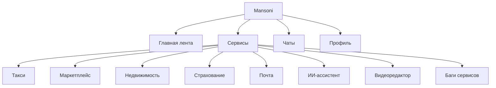

# Mansoni: супер-платформа

## 1. Идея продукта

Mansoni — это единая супер-платформа, где в одном интерфейсе собраны общение, сервисы, коммерция, контент и утилиты. Пользователь не прыгает между отдельными приложениями: он заходит в одну систему и получает доступ к поездкам, покупкам, страхованию, недвижимости, почте, ИИ-помощнику, видеоредактору и сервисной диагностике.

### Ключевая ценность

- Один аккаунт на все сервисы.
- Единая навигация для сайта и мобильной версии.
- Быстрый доступ к сервисам через меню и нижнюю панель.
- Общая логика уведомлений, профиля, чатов и настроек.
- Платформа выглядит как «операционная система сервисов», а не набор отдельных страниц.

## 2. Полная версия сайта

### Desktop-вид

- Верхняя зона: бренд, поиск, уведомления, профиль, сервисное меню.
- Центральная зона: главная лента, витрины сервисов, карточки, рекомендации.
- Боковые или вложенные экраны: такси, магазин, недвижимость, страхование, почта, ИИ, видеоредактор.
- Админ-зоны и сервисные панели открываются как специализированные рабочие пространства.

### Что показывает сайт

- Главную витрину супер-платформы.
- Полный каталог сервисов.
- Отдельные продуктовые экраны для каждого домена.
- Контентные и операционные сценарии: покупка, оформление, бронирование, переписка, создание контента.

## 3. Мобильная версия

### Mobile-вид

- Нижняя навигация для частых сценариев.
- Боковое меню сервисов для расширенного доступа.
- Карточные экраны, адаптированные под палец и короткие действия.
- Полноэкранные сценарии для такси, видеоредактора и отдельных калькуляторов.

### Мобильный опыт

- Запуск сервиса в один тап.
- Быстрое переключение между сервисами.
- Нижние шиты, дроуеры и полноэкранные модули вместо перегруженных десктоп-окон.
- Фокус на скорости: выбрать, подтвердить, оплатить, отправить, создать.

## 4. Сервисы и возможности

### 4.1 Такси

Такси — это сервис заказа поездок с картой, маршрутами, поиском водителя, историей, безопасностью и режимом водителя.

Возможности:

- выбор точки подачи и пункта назначения;
- расчет маршрута и стоимости;
- выбор тарифа;
- поиск и прибытие водителя;
- сопровождение поездки и трекинг;
- история поездок;
- режим водителя;
- безопасность и поддержка.

#### Дизайн заказа такси

Экран заказа должен быть построен как пошаговый сценарий:

1. Карта на фоне.
2. Нижний sheet для адреса подачи и назначения.
3. Экран выбора тарифа с крупными карточками.
4. Экран поиска водителя со статусом и анимацией ожидания.
5. Экран поездки с ETA, маршрутом и кнопкой безопасности.

Рекомендуемая структура экрана:

- верх: назад, история, настройки;
- центр: карта;
- низ: bottom sheet со статусом заказа;
- акцент: время подачи, тариф, цена, кнопка подтверждения.

### 4.2 Маркетплейс

Маркетплейс — это витрина товаров и магазинов внутри платформы.

Возможности:

- каталог магазинов;
- карточки товаров;
- категории и фильтры;
- избранное;
- корзина и оформление;
- витрина продавца.

#### Что добавить в витрину товаров

- электроника: смартфоны, наушники, часы, зарядки, аксессуары;
- дом: лампы, техника, хранение, уборка, декор;
- красота: уход, парфюмерия, наборы, инструменты;
- спорт: коврики, бутылки, экипировка, трекеры;
- еда: наборы, напитки, полезные снеки, кофе;
- мода: базовая одежда, обувь, сумки, аксессуары;
- авто: держатели, зарядки, коврики, расходники.

### 4.3 ИИ-ассистент

ИИ-ассистент — это универсальный помощник внутри платформы.

Возможности:

- ответы на вопросы по продукту и сервисам;
- помощь с текстами и кодом;
- генерация объяснений и инструкций;
- поддержка сценариев пользователя в сервисах;
- быстрые подсказки по следующему действию.

### 4.4 Недвижимость

Недвижимость — это сервис поиска, сравнения и оформления объектов.

Возможности:

- список объектов;
- фильтры по типу, цене, комнатам и городу;
- карточки объектов с фото;
- избранное;
- ипотечный калькулятор;
- проверка жилья и аналитика;
- интеграция с страхованием.

### 4.5 Страхование

Страхование — это единый хаб для полисов, калькуляторов и подачи заявок.

Возможности:

- ОСАГО, КАСКО, ДМС, путешествия, жизнь, имущество, ипотека;
- сравнение предложений;
- оформление полиса;
- список полисов;
- подача и трекинг страховых случаев;
- страховой помощник.

### 4.6 Баги сервисов

Баги сервисов — это диагностическая и операционная панель.

Возможности:

- список известных проблем;
- статусы open / in progress / fixed;
- заметки по корневой причине;
- чек-листы проверки;
- быстрые рабочие обходы;
- приоритизация деградаций.

### 4.7 Видеоредактор

Видеоредактор — это отдельная творческая среда.

Возможности:

- список проектов;
- создание нового проекта;
- таймлайн и рендер;
- автосохранение;
- работа с медиа и статусами;
- полноэкранный рабочий режим.

### 4.8 Почта

Почта — это полноформатный mail-client внутри платформы.

Возможности:

- inbox, sent, drafts, spam, trash;
- цепочки писем по темам;
- поиск и фильтры;
- вложения;
- черновики;
- массовые действия;
- star/flag и статусы обработки.

## 5. Продуктовая презентация по сервисам

### Сценарий 1: Заказать такси

Пользователь открывает карту, выбирает адрес, видит цену, выбирает тариф, подтверждает заказ и наблюдает за подачей машины до завершения поездки.

### Сценарий 2: Купить товар

Пользователь заходит в маркетплейс, выбирает категорию, смотрит карточки, добавляет товар в корзину, оформляет покупку и отслеживает заказ.

### Сценарий 3: Оформить страховку

Пользователь выбирает продукт, сравнивает цены, заполняет данные, получает полис и сохраняет его в личном кабинете.

### Сценарий 4: Найти объект недвижимости

Пользователь фильтрует объекты, сравнивает варианты, сохраняет избранное и рассчитывает ипотеку.

### Сценарий 5: Создать контент

Пользователь открывает видеоредактор, создает проект, собирает ролик и экспортирует результат.

## 6. Итоговое позиционирование

Mansoni можно презентовать как супер-платформу нового поколения: единое пространство, где коммерция, сервисы, контент и помощник живут в одном интерфейсе. На сайте это выглядит как мощная десктоп-панель, а на мобильном — как быстрый сервисный суперапп с нижней навигацией и fullscreen-модулями.
