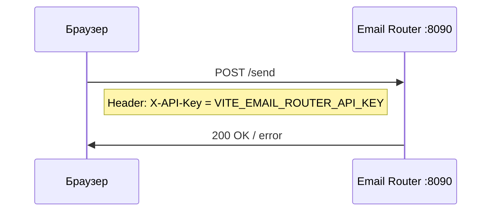
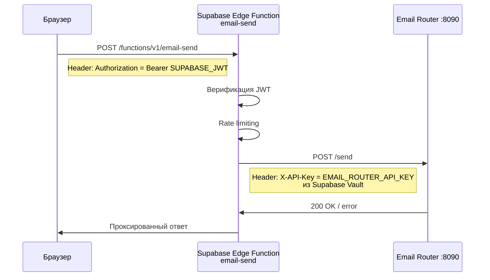
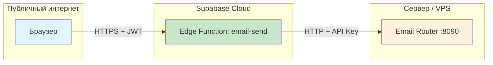
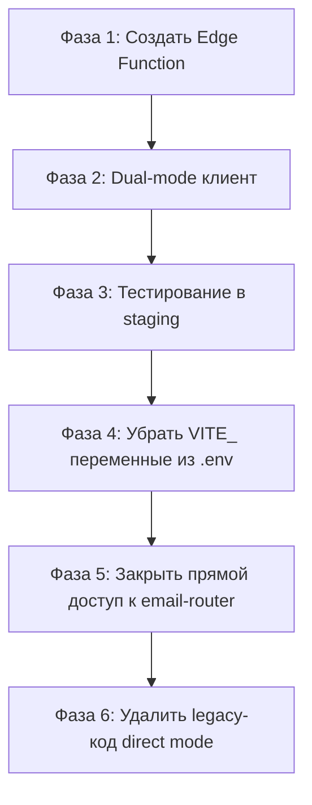

# ADR: Серверный прокси для email-router

- **ID:** ADR-EMAIL-PROXY-001
- **Date (UTC):** 2026-03-06
- **Status:** Proposed
- **Context:** VITE_EMAIL_ROUTER_API_KEY встраивается в JS-бандл и доступна любому пользователю через DevTools
- **Decision:** Supabase Edge Function как серверный прокси
- **Alternatives considered:** Netlify Function, прямой прокси в email-router
- **Risks:** Дополнительный hop увеличивает латентность на ~50-100ms
- **Rollback plan:** Вернуть прямые вызовы email-router из клиента, восстановить VITE_EMAIL_ROUTER_API_KEY
- **Expiry / TTL:** Бессрочно (security fix)
- **Related FP-code:** `src/lib/email/client.ts`, `supabase/functions/email-send/index.ts`

---

## 1. Проблема

Текущий поток данных:



Переменная `VITE_EMAIL_ROUTER_API_KEY` имеет префикс `VITE_`, что означает:
- Vite встраивает её значение **литерально** в JS-бандл при сборке
- Любой пользователь видит ключ через DevTools → Network → Headers
- Любой пользователь видит ключ через DevTools → Sources → поиск по бандлу
- Ключ даёт **полный доступ** к отправке email через email-router

**Вектор атаки:** злоумышленник копирует API-ключ из бандла и рассылает спам через ваш SMTP-сервер.

---

## 2. Рассмотренные варианты

### Вариант A: Supabase Edge Function ✅ РЕКОМЕНДУЕТСЯ

Создать Edge Function `email-send`, которая:
1. Принимает запрос от фронтенда (с Supabase auth token)
2. Верифицирует пользователя через Supabase JWT
3. Пересылает запрос в email-router с серверным API-ключом

**За:**
- 25+ Edge Functions уже существуют в проекте — паттерн отработан
- Общие утилиты `_shared/utils.ts` (CORS, rate limiting) готовы к использованию
- Секреты хранятся в Supabase Vault — уже используется для `ARIA_BACKEND_KEY`, `TURN_CREDENTIALS_API_KEY`
- Встроенная авторизация через Supabase JWT — только аутентифицированные пользователи могут слать email
- Zero infrastructure: не нужно поднимать/настраивать ничего нового
- Deno runtime — единообразие со всеми остальными функциями

**Против:**
- Дополнительный network hop: Browser → Supabase Edge → Email Router
- Зависимость от Supabase Edge Functions runtime

### Вариант B: Netlify Function

Создать serverless function в `netlify/functions/email-send.ts`.

**За:**
- Деплоится вместе с фронтендом — один CI/CD pipeline
- Netlify уже используется для хостинга

**Против:**
- В проекте **нет ни одной** Netlify Function — нужно настраивать с нуля
- `netlify.toml` содержит только SPA redirect — нет functions config
- Нет готовых утилит для CORS/auth — всё писать заново
- Нет встроенной JWT-верификации Supabase — нужен отдельный код
- Вводит второй serverless runtime помимо Supabase Edge Functions

### Вариант C: Прокси-эндпоинт в самом email-router

Добавить в email-router эндпоинт, который принимает Supabase JWT вместо API-ключа.

**За:**
- Без промежуточных слоёв
- Минимальная латентность

**Против:**
- Email-router должен знать о Supabase JWT — нарушение SRP
- Email-router сейчас stateless standalone микросервис — добавление Supabase SDK усложняет его
- Не решает проблему: если email-router доступен из браузера напрямую, нужно его прятать за firewall/VPN, что сложнее чем прокси

---

## 3. Решение: Supabase Edge Function

### 3.1 Новый поток данных



### 3.2 Сетевая изоляция



Email Router закрыт от прямого доступа из браузера. API-ключ никогда не покидает серверную среду.

---

## 4. Детальный план изменений

### 4.1 Новый файл: `supabase/functions/email-send/index.ts`

```typescript
// supabase/functions/email-send/index.ts
import { serve } from "https://deno.land/std@0.168.0/http/server.ts";
import { createClient } from "https://esm.sh/@supabase/supabase-js@2";
import { corsResponse, handleCors } from "../_shared/utils.ts";

serve(async (req: Request) => {
  // CORS preflight
  if (req.method === "OPTIONS") {
    return handleCors(req);
  }

  if (req.method !== "POST") {
    return corsResponse(req, { error: "METHOD_NOT_ALLOWED" }, 405);
  }

  // 1. Авторизация — извлечь и проверить Supabase JWT
  const authHeader = req.headers.get("Authorization");
  if (!authHeader?.startsWith("Bearer ")) {
    return corsResponse(req, { success: false, error: "UNAUTHORIZED" }, 401);
  }

  const supabaseUrl = Deno.env.get("SUPABASE_URL")!;
  const supabaseAnonKey = Deno.env.get("SUPABASE_ANON_KEY")!;
  const supabase = createClient(supabaseUrl, supabaseAnonKey, {
    global: { headers: { Authorization: authHeader } },
  });

  const { data: { user }, error: authError } = await supabase.auth.getUser();
  if (authError || !user) {
    return corsResponse(req, { success: false, error: "UNAUTHORIZED" }, 401);
  }

  // 2. Парсинг тела запроса
  let body: Record<string, unknown>;
  try {
    body = await req.json();
  } catch {
    return corsResponse(req, { success: false, error: "INVALID_JSON" }, 400);
  }

  // 3. Проксирование в email-router
  const emailRouterUrl = Deno.env.get("EMAIL_ROUTER_INTERNAL_URL")!; // e.g. http://email-router:8090
  const emailRouterApiKey = Deno.env.get("EMAIL_ROUTER_API_KEY")!;

  const upstream = await fetch(`${emailRouterUrl}/send`, {
    method: "POST",
    headers: {
      "Content-Type": "application/json",
      "X-API-Key": emailRouterApiKey,
    },
    body: JSON.stringify(body),
  });

  const result = await upstream.json();
  return corsResponse(req, result, upstream.status);
});
```

### 4.2 Изменение: `src/lib/email/client.ts`

Заменить прямой вызов email-router на вызов Supabase Edge Function.

**Было** (строки ~81-98):
```typescript
async function attemptSend(base, payload, apiKey) {
  const response = await fetch(`${base}/send`, {
    method: 'POST',
    headers: {
      'Content-Type': 'application/json',
      'X-API-Key': apiKey,
    },
    body: JSON.stringify(payload),
  });
}
```

**Стало:**
```typescript
import { supabase } from '@/integrations/supabase/client';

async function attemptSend(payload: EmailPayload): Promise<EmailSendResult | null> {
  const controller = new AbortController();
  const timer = setTimeout(() => controller.abort(), REQUEST_TIMEOUT_MS);

  try {
    const { data: { session } } = await supabase.auth.getSession();
    if (!session?.access_token) {
      return { success: false, error: 'NOT_AUTHENTICATED' };
    }

    const supabaseUrl = import.meta.env.VITE_SUPABASE_URL;
    const response = await fetch(
      `${supabaseUrl}/functions/v1/email-send`,
      {
        method: 'POST',
        headers: {
          'Content-Type': 'application/json',
          'Authorization': `Bearer ${session.access_token}`,
        },
        body: JSON.stringify(payload),
        signal: controller.signal,
      }
    );

    clearTimeout(timer);
    const data = await response.json();
    return data as EmailSendResult;
  } catch {
    clearTimeout(timer);
    return null;
  }
}
```

### 4.3 Изменение: `src/lib/email/backendEndpoints.ts`

**Удалить полностью** — больше не нужен. Фронтенд вызывает Edge Function, а не email-router напрямую.

Альтернатива: оставить для dev-режима с прямым вызовом (см. раздел 6).

### 4.4 Изменение: `src/lib/email/client.ts` — функция `sendEmail`

**Было:**
```typescript
export async function sendEmail(payload) {
  const bases = getEmailRouterApiBases();
  const apiKey = getApiKey();
  for (const base of bases) {
    const result = await attemptSend(base, payload, apiKey);
    ...
  }
}
```

**Стало:**
```typescript
export async function sendEmail(payload: EmailPayload): Promise<EmailSendResult> {
  const result = await attemptSend(payload);
  if (result !== null) return result;

  return {
    success: false,
    error: 'EMAIL_PROXY_FAILED',
    details: 'Email send proxy did not respond.',
    retryable: true,
  };
}
```

Failover по нескольким base URL больше не нужен — Supabase Edge Functions имеют встроенную отказоустойчивость.

### 4.5 Изменение: `src/lib/email/client.ts` — функция `checkEmailHealth`

**Было:** `GET {base}/health` с `X-API-Key`
**Стало:** `GET {supabaseUrl}/functions/v1/email-send?action=health` с `Authorization: Bearer JWT`

Или отдельный health endpoint как часть Edge Function, или удалить, если не критичен для UI.

---

## 5. Переменные окружения

### 5.1 Удалить (frontend)

| Переменная | Где | Причина |
|---|---|---|
| `VITE_EMAIL_ROUTER_API_KEY` | `.env`, `.env.local` | Ключ больше не нужен фронтенду |
| `VITE_EMAIL_ROUTER_API_URL` | `.env`, `.env.local` | Фронтенд больше не вызывает email-router напрямую |

### 5.2 Добавить (Supabase Vault / Edge Function secrets)

| Переменная | Где | Значение |
|---|---|---|
| `EMAIL_ROUTER_API_KEY` | Supabase Vault | Текущий ключ email-router |
| `EMAIL_ROUTER_INTERNAL_URL` | Supabase Vault | URL email-router, доступный из Edge Function, например `https://email.mansoni.ru` или `http://<internal-ip>:8090` |

### 5.3 Обновить `.env.example`

```env
# ═══════════════════════════════════════════
# Email Router
# ═══════════════════════════════════════════
# Email sends are proxied through Supabase Edge Function (email-send).
# No VITE_ email variables needed — the API key lives in Supabase Vault.
#
# Supabase Vault secrets (set in Supabase Dashboard → Settings → Vault):
#   EMAIL_ROUTER_API_KEY = your-email-router-api-key
#   EMAIL_ROUTER_INTERNAL_URL = http://your-email-router-host:8090
```

---

## 6. Обратная совместимость и dev-режим

### 6.1 Стратегия: dual-mode клиент

Для плавного перехода и удобства локальной разработки, `sendEmail` может работать в двух режимах:

```typescript
function useDirectMode(): boolean {
  // В dev-режиме можно вызывать email-router напрямую
  // (VITE_EMAIL_ROUTER_DIRECT=true в .env.local)
  return import.meta.env.DEV && import.meta.env.VITE_EMAIL_ROUTER_DIRECT === 'true';
}

export async function sendEmail(payload: EmailPayload): Promise<EmailSendResult> {
  if (useDirectMode()) {
    // Legacy: прямой вызов email-router (только для dev)
    return sendEmailDirect(payload);
  }
  // Production: через Supabase Edge Function
  return sendEmailViaProxy(payload);
}
```

Это позволяет:
- **Production:** всегда идёт через Edge Function, API-ключ на сервере
- **Dev:** разработчик может включить прямой режим для быстрого тестирования без Edge Functions
- **Постепенный переход:** сначала деплоим Edge Function, потом переключаем клиент

### 6.2 Миграция: поэтапный план



| Фаза | Что делать |
|---|---|
| **1** | Создать `supabase/functions/email-send/index.ts` с JWT-авторизацией и проксированием |
| **2** | Обновить `src/lib/email/client.ts` — dual-mode с feature flag `VITE_EMAIL_ROUTER_DIRECT` |
| **3** | Задеплоить Edge Function, протестировать в staging |
| **4** | Удалить `VITE_EMAIL_ROUTER_API_KEY` из `.env` / `.env.local` / CI secrets |
| **5** | Настроить firewall: email-router принимает запросы только от Supabase Edge Functions IP ranges |
| **6** | Удалить `backendEndpoints.ts`, `getApiKey()`, `sendEmailDirect()` и флаг `VITE_EMAIL_ROUTER_DIRECT` |

---

## 7. Полный список файлов для изменения

| Файл | Действие | Описание |
|---|---|---|
| `supabase/functions/email-send/index.ts` | **Создать** | Новая Edge Function — серверный прокси |
| `src/lib/email/client.ts` | **Изменить** | Убрать `getApiKey()`, заменить `attemptSend` на вызов Edge Function |
| `src/lib/email/backendEndpoints.ts` | **Удалить** (фаза 6) | Больше не нужен в production |
| `.env.example` | **Изменить** | Убрать `VITE_EMAIL_ROUTER_API_KEY`, обновить комментарии |
| `.env` / `.env.local` | **Изменить** | Убрать `VITE_EMAIL_ROUTER_API_KEY`, добавить `VITE_EMAIL_ROUTER_DIRECT=true` для dev |
| `netlify.toml` | **Без изменений** | Netlify не участвует в проксировании |
| `services/email-router/*` | **Без изменений** | Канонический email-router остаётся as-is |

---

## 8. Безопасность после миграции

| Аспект | До | После |
|---|---|---|
| API-ключ в браузере | ❌ Виден в бандле | ✅ Только в Supabase Vault |
| Авторизация пользователя | ❌ Нет — любой с ключом может слать | ✅ Supabase JWT — только залогиненные |
| Rate limiting | ❌ Нет | ✅ Через `_shared/utils.ts` + per-user throttle |
| Audit trail | ❌ Нет | ✅ Edge Function логирует user_id |
| Email-router доступность | ❌ Публичный | ✅ Доступен только Edge Functions |
