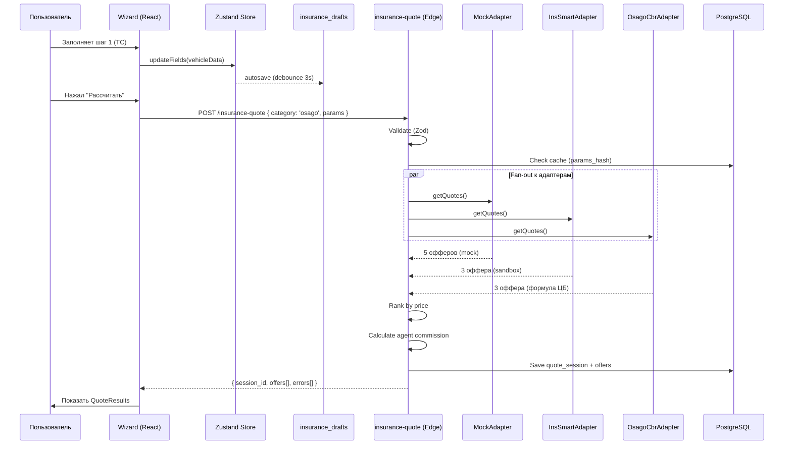
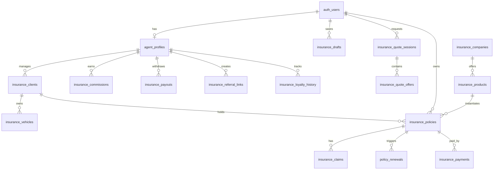
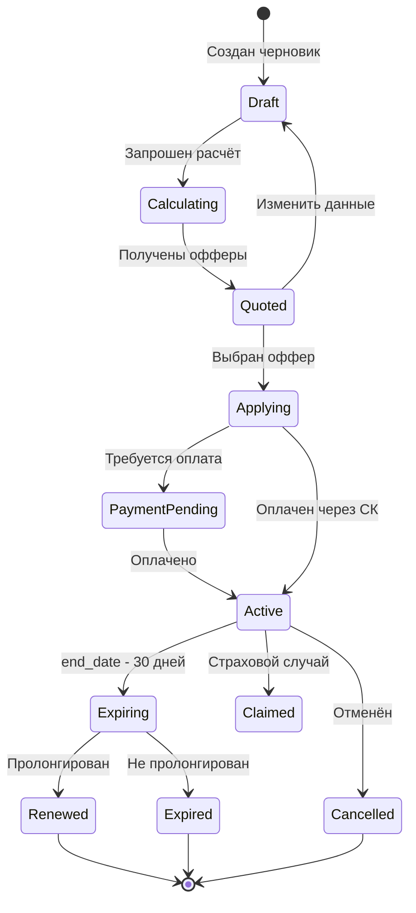

# Спецификация: Страховой Агрегатор — Полная Архитектура

## Обзор

Превращение текущего модуля страхования в полноценный B2B/B2C страховой агрегатор уровня InsSmart/Sravni Labs с Quote Engine, CRM агента, балансом, лояльностью 5 уровней и реферальной программой.

## Домен

Страхование (Insurance Aggregator)

## Эталонные аналоги

- **InsSmart**: 5-уровневая лояльность, CRM клиентов, баланс/вывод, реферальная программа
- **Sravni Labs**: мультиоффер, сравнение СК, fan-out котировки
- **Polis.Online**: типизированные реферальные ссылки, быстрые выплаты
- **Pampadu**: B2B API адаптеры к 40+ СК

---

## Инвентаризация текущего состояния

### Что уже ЕСТЬ в БД (не нужно создавать):

| Таблица | Миграция | Описание |
|---|---|---|
| `insurance_companies` | 20260118 | Справочник СК + slug, description, commission_rate, priority |
| `insurance_products` | 20260118 | Продукты СК с category, calculation_params |
| `insurance_policies` | 20260118 | Полисы пользователей с agent_id, client_id |
| `insurance_claims` | 20260118 | Страховые случаи |
| `insurance_payments` | 20260403 | Платежи |
| `agent_profiles` | 20260123 | Профили агентов (user_id, referral_code, commission_rate, balance) |
| `insurance_clients` | 20260123 | CRM клиентов (agent_id, full_name, phone, passport, tags) |
| `insurance_calculations` | 20260123 | Черновики расчётов (input_data, results, status) |
| `insurance_commissions` | 20260123 | Комиссии агентов (amount, rate, status) |
| `insurance_payouts` | 20260123 | Вывод средств |
| `policy_renewals` | 20260123 | Пролонгации (30/14/7/1 день reminder) |
| `insurance_providers` | 20260403 | Реестр провайдеров (InsSmart, Cherehapa, Mock) |
| `insurance_quote_sessions` | 20260403 | Сессии мультиоффера |
| `insurance_quote_offers` | 20260403 | Офферы в сессии |
| `insurance_provider_logs` | 20260403 | Логи API провайдеров |
| `insurance_vehicle_cache` | 20260403 | Кеш DaData (госномер → ТС) |
| `insurance_kbm_cache` | 20260403 | Кеш КБМ (SHA-256 хеш → коэффициент) |

### Что уже ЕСТЬ в Edge Functions:

| Function | Статус | Описание |
|---|---|---|
| `insurance-quote` | ✅ Рабочая | Fan-out к адаптерам, Promise.allSettled, ранжирование |
| `insurance-vehicle-lookup` | ✅ Рабочая | DaData по госномеру/VIN, кеш 30 дней |
| `insurance-kbm-check` | ✅ Рабочая | КБМ с кешем, fallback estimate |
| `insurance-purchase` | ✅ Рабочая | Покупка полиса, idempotency key |
| `insurance-assistant` | ✅ Рабочая | AI чат (streaming) |
| `insurance-calculate` | ✅ Рабочая | Расчёт по формулам ЦБ |
| `insurance-companies` | ✅ Рабочая | CRUD для СК |

### Что уже ЕСТЬ в адаптерах:

| Адаптер | Файл | Описание |
|---|---|---|
| MockAdapter | `insurance-quote/adapters/mock.ts` | 5 виртуальных СК, 7 калькуляторов |  
| InsSmartAdapter | `insurance-quote/adapters/inssmart.ts` | Реальная интеграция (sandbox) |
| CherehapaAdapter | `insurance-quote/adapters/cherehapa.ts` | Travel (sandbox) |

### Adapter Interface (СУЩЕСТВУЕТ):

```typescript
// supabase/functions/insurance-quote/adapters/types.ts
interface ProviderAdapter {
  readonly code: string;
  supports(category: string): boolean;
  getQuotes(params: AdapterQuoteParams, config: AdapterConfig): Promise<AdapterQuoteResult>;
}
```

---

## 1. ДЕЛЬТА-МИГРАЦИЯ

### 1.1 Что ДОБАВИТЬ к `agent_profiles`

```sql
-- Лояльность и реферальная программа
ALTER TABLE public.agent_profiles
  ADD COLUMN IF NOT EXISTS loyalty_level text DEFAULT 'novice'
    CHECK (loyalty_level IN ('novice','agent','agent2','authorized','authorized_plus')),
  ADD COLUMN IF NOT EXISTS quarterly_premiums numeric(12,2) DEFAULT 0,
  ADD COLUMN IF NOT EXISTS loyalty_updated_at timestamptz,
  ADD COLUMN IF NOT EXISTS referral_type text DEFAULT 'mentorship'
    CHECK (referral_type IN ('mentorship','partnership')),
  ADD COLUMN IF NOT EXISTS referral_l1_percent numeric(5,2) DEFAULT 5.0,
  ADD COLUMN IF NOT EXISTS referral_l2_percent numeric(5,2) DEFAULT 2.0,
  ADD COLUMN IF NOT EXISTS is_self_employed boolean DEFAULT false;
```

### 1.2 Новая таблица: `insurance_referral_links`

```sql
CREATE TABLE IF NOT EXISTS public.insurance_referral_links (
  id uuid PRIMARY KEY DEFAULT gen_random_uuid(),
  agent_id uuid NOT NULL REFERENCES public.agent_profiles(id) ON DELETE CASCADE,
  type text NOT NULL CHECK (type IN ('mentorship','partnership','osago','mortgage','travel','kasko')),
  name text,
  code text UNIQUE NOT NULL DEFAULT upper(substring(md5(random()::text) from 1 for 10)),
  quota_percent numeric(5,2) DEFAULT 0,
  activations int DEFAULT 0,
  calculations int DEFAULT 0,
  policies int DEFAULT 0,
  revenue numeric(12,2) DEFAULT 0,
  is_active boolean DEFAULT true,
  created_at timestamptz DEFAULT now()
);

ALTER TABLE public.insurance_referral_links ENABLE ROW LEVEL SECURITY;

DO $$ BEGIN
  CREATE POLICY "agent_own_referral_links" ON public.insurance_referral_links
    FOR ALL USING (
      agent_id IN (SELECT id FROM public.agent_profiles WHERE user_id = auth.uid())
    )
    WITH CHECK (
      agent_id IN (SELECT id FROM public.agent_profiles WHERE user_id = auth.uid())
    );
EXCEPTION WHEN duplicate_object THEN NULL; END $$;

CREATE INDEX IF NOT EXISTS idx_referral_links_agent
  ON public.insurance_referral_links(agent_id);
CREATE INDEX IF NOT EXISTS idx_referral_links_code
  ON public.insurance_referral_links(code);
```

### 1.3 Новая таблица: `insurance_loyalty_history`

```sql
CREATE TABLE IF NOT EXISTS public.insurance_loyalty_history (
  id uuid PRIMARY KEY DEFAULT gen_random_uuid(),
  agent_id uuid NOT NULL REFERENCES public.agent_profiles(id) ON DELETE CASCADE,
  quarter text NOT NULL,           -- '2026-Q2'
  premiums_total numeric(12,2) NOT NULL,
  level_before text NOT NULL,
  level_after text NOT NULL,
  bonus_percent numeric(5,2) NOT NULL,
  calculated_at timestamptz DEFAULT now()
);

ALTER TABLE public.insurance_loyalty_history ENABLE ROW LEVEL SECURITY;

DO $$ BEGIN
  CREATE POLICY "agent_own_loyalty_history" ON public.insurance_loyalty_history
    FOR ALL USING (
      agent_id IN (SELECT id FROM public.agent_profiles WHERE user_id = auth.uid())
    );
EXCEPTION WHEN duplicate_object THEN NULL; END $$;

CREATE INDEX IF NOT EXISTS idx_loyalty_history_agent
  ON public.insurance_loyalty_history(agent_id, quarter);
```

### 1.4 Новая таблица: `insurance_drafts` (автосохранение wizard)

```sql
CREATE TABLE IF NOT EXISTS public.insurance_drafts (
  id uuid PRIMARY KEY DEFAULT gen_random_uuid(),
  user_id uuid NOT NULL REFERENCES auth.users(id) ON DELETE CASCADE,
  product_type text NOT NULL,
  step int DEFAULT 1,
  form_data jsonb NOT NULL DEFAULT '{}',
  title text,                      -- авто: "BMW X5 2020", travel: "Таиланд 14д"
  created_at timestamptz DEFAULT now(),
  updated_at timestamptz DEFAULT now()
);

ALTER TABLE public.insurance_drafts ENABLE ROW LEVEL SECURITY;

DO $$ BEGIN
  CREATE POLICY "user_own_drafts" ON public.insurance_drafts
    FOR ALL USING (user_id = auth.uid())
    WITH CHECK (user_id = auth.uid());
EXCEPTION WHEN duplicate_object THEN NULL; END $$;

CREATE INDEX IF NOT EXISTS idx_drafts_user
  ON public.insurance_drafts(user_id, updated_at DESC);
```

### 1.5 Расширение `insurance_calculations`

```sql
ALTER TABLE public.insurance_calculations
  ADD COLUMN IF NOT EXISTS draft_id uuid REFERENCES public.insurance_drafts(id) ON DELETE SET NULL,
  ADD COLUMN IF NOT EXISTS quote_session_id uuid REFERENCES public.insurance_quote_sessions(id) ON DELETE SET NULL;
```

### 1.6 Функция пересчёта лояльности

```sql
CREATE OR REPLACE FUNCTION public.recalculate_agent_loyalty(p_agent_id uuid)
RETURNS void LANGUAGE plpgsql SECURITY DEFINER SET search_path = public AS $$
DECLARE
  v_total numeric;
  v_level text;
  v_bonus numeric;
  v_quarter text;
  v_old_level text;
BEGIN
  v_quarter := extract(year from now()) || '-Q' || extract(quarter from now());

  SELECT COALESCE(SUM(ip.premium_amount), 0) INTO v_total
  FROM insurance_policies ip
  WHERE ip.agent_id = p_agent_id
    AND ip.status IN ('active', 'expired')
    AND ip.created_at >= date_trunc('quarter', now());

  SELECT loyalty_level INTO v_old_level FROM agent_profiles WHERE id = p_agent_id;

  IF v_total >= 300000 THEN v_level := 'authorized_plus'; v_bonus := 15;
  ELSIF v_total >= 150000 THEN v_level := 'authorized'; v_bonus := 12;
  ELSIF v_total >= 75000 THEN v_level := 'agent2'; v_bonus := 8;
  ELSIF v_total >= 30000 THEN v_level := 'agent'; v_bonus := 5;
  ELSE v_level := 'novice'; v_bonus := 0;
  END IF;

  UPDATE agent_profiles
  SET loyalty_level = v_level,
      quarterly_premiums = v_total,
      loyalty_updated_at = now()
  WHERE id = p_agent_id;

  INSERT INTO insurance_loyalty_history (agent_id, quarter, premiums_total, level_before, level_after, bonus_percent)
  VALUES (p_agent_id, v_quarter, v_total, COALESCE(v_old_level, 'novice'), v_level, v_bonus)
  ON CONFLICT DO NOTHING;
END;
$$;
```

### 1.7 Добавление таблицы `insurance_vehicles` (ТС клиента)

```sql
CREATE TABLE IF NOT EXISTS public.insurance_vehicles (
  id uuid PRIMARY KEY DEFAULT gen_random_uuid(),
  client_id uuid REFERENCES public.insurance_clients(id) ON DELETE CASCADE,
  user_id uuid REFERENCES auth.users(id) ON DELETE CASCADE,
  gos_number text,
  brand text,
  model text,
  year int,
  power int,
  vin text,
  doc_type text CHECK (doc_type IN ('pts','sts','epts')),
  doc_series text,
  doc_number text,
  doc_date date,
  created_at timestamptz DEFAULT now()
);

ALTER TABLE public.insurance_vehicles ENABLE ROW LEVEL SECURITY;

DO $$ BEGIN
  CREATE POLICY "own_vehicles" ON public.insurance_vehicles
    FOR ALL USING (
      user_id = auth.uid()
      OR client_id IN (
        SELECT id FROM insurance_clients
        WHERE agent_id IN (SELECT id FROM agent_profiles WHERE user_id = auth.uid())
      )
    )
    WITH CHECK (
      user_id = auth.uid()
      OR client_id IN (
        SELECT id FROM insurance_clients
        WHERE agent_id IN (SELECT id FROM agent_profiles WHERE user_id = auth.uid())
      )
    );
EXCEPTION WHEN duplicate_object THEN NULL; END $$;

CREATE INDEX IF NOT EXISTS idx_vehicles_client
  ON public.insurance_vehicles(client_id);
CREATE INDEX IF NOT EXISTS idx_vehicles_user
  ON public.insurance_vehicles(user_id);
```

---

## 2. EDGE FUNCTIONS — Доработки

### 2.1 insurance-quote (СУЩЕСТВУЕТ — доработки)

**Текущее состояние**: Полностью рабочая, fan-out, Promise.allSettled, логирование.

**Что добавить**:
- Расчёт комиссии агента в каждом оффере (commission_amount, commission_percent)
- Учёт loyalty_level агента при расчёте бонусной комиссии
- Запись draft_id и quote_session_id в insurance_calculations при наличии agent_id

Файл: [supabase/functions/insurance-quote/index.ts](supabase/functions/insurance-quote/index.ts)

```typescript
// Дополнение в секции агрегации результатов:
// После формирования allOffers, перед записью в quote_sessions:

// --- commission calculation ---
let agentProfile: { id: string; loyalty_level: string; commission_rate: number } | null = null;

const { data: agentData } = await serviceClient
  .from('agent_profiles')
  .select('id, loyalty_level, commission_rate')
  .eq('user_id', user.id)
  .limit(1)
  .maybeSingle();

if (agentData) {
  agentProfile = agentData;
  const bonusPercent = LOYALTY_BONUS[agentProfile.loyalty_level] ?? 0;

  for (const offer of allOffers) {
    const baseCommission = agentProfile.commission_rate;
    const totalCommission = baseCommission + bonusPercent;
    offer.details = {
      ...offer.details,
      agent_commission_percent: totalCommission,
      agent_commission_amount: Math.round(offer.premium_amount * totalCommission / 100),
      base_commission: baseCommission,
      loyalty_bonus: bonusPercent,
    };
  }
}

const LOYALTY_BONUS: Record<string, number> = {
  novice: 0,
  agent: 5,
  agent2: 8,
  authorized: 12,
  authorized_plus: 15,
};
```

### 2.2 insurance-vehicle-lookup (СУЩЕСТВУЕТ — без изменений)

Полностью рабочая: DaData по госномеру/VIN, кеш в insurance_vehicle_cache, логирование.

### 2.3 insurance-kbm-check (СУЩЕСТВУЕТ — без изменений)

Полностью рабочая: КБМ с SHA-256 хешированием, кеш 90 дней, fallback estimate, попытка InsSmart API.

### 2.4 insurance-purchase (СУЩЕСТВУЕТ — доработки)

**Что добавить**:
- После успешной покупки → создать запись в insurance_commissions для агента
- Инкремент referral_links.policies если пришёл через реферала
- Триггер пересчёта лояльности

```typescript
// Дополнение после успешного создания полиса:

// --- agent commission ---
if (agentProfile) {
  const commissionRate = agentProfile.commission_rate + (LOYALTY_BONUS[agentProfile.loyalty_level] ?? 0);
  const commissionAmount = Math.round(offer.premium_amount * commissionRate / 100);

  await svc.from('insurance_commissions').insert({
    agent_id: agentProfile.id,
    policy_id: policyId,
    amount: commissionAmount,
    rate: commissionRate,
    status: 'pending',
  });

  // update agent balance
  await svc.rpc('recalculate_agent_loyalty', { p_agent_id: agentProfile.id });
}
```

### 2.5 insurance-assistant (СУЩЕСТВУЕТ — расширение контекста)

Добавить в system prompt информацию о:
- Формуле ОСАГО (ТБ × КТ × КБМ × КВС × КО × КМ × КС × КП × КН)
- 5-уровневой лояльности
- Доступных продуктах и ценовых диапазонах
- CRM-возможностях для агентов

### 2.6 НОВАЯ: insurance-agent-balance (баланс и вывод)

```
POST /functions/v1/insurance-agent-balance

Endpoint: { action: 'get_balance' | 'request_withdrawal' | 'get_history' }

action = 'get_balance':
  Response: {
    available: number,
    pending: number,
    total_earned: number,
    loyalty_level: string,
    quarterly_premiums: number,
    next_level_threshold: number,
    loyalty_bonus_percent: number
  }

action = 'request_withdrawal':
  Body: { amount: number, payment_method: 'card' | 'bank', payment_details: { ... } }
  Validation: amount >= 1000, amount <= available_balance
  Response: { payout_id: string, status: 'pending' }

action = 'get_history':
  Body: { period?: 'month' | 'quarter' | 'year' | 'all', limit?: number }
  Response: { transactions: CommissionRow[], payouts: PayoutRow[], totals: { ... } }
```

**Авторизация**: Bearer token → auth.uid() → agent_profiles.user_id

**Логика расчёта баланса**:
```
available_balance = SUM(commissions WHERE status = 'confirmed')
                  - SUM(payouts WHERE status IN ('pending', 'processing', 'completed'))
pending_balance = SUM(commissions WHERE status = 'pending')
```

---

## 3. ADAPTER INTERFACE

### 3.1 Существующий интерфейс (НЕ МЕНЯТЬ)

```typescript
// supabase/functions/insurance-quote/adapters/types.ts — уже в production

export interface ProviderAdapter {
  readonly code: string;
  supports(category: string): boolean;
  getQuotes(params: AdapterQuoteParams, config: AdapterConfig): Promise<AdapterQuoteResult>;
}

export interface AdapterOffer {
  external_offer_id: string;
  company_name: string;
  premium_amount: number;
  premium_monthly?: number;
  coverage_amount: number;
  deductible_amount?: number;
  valid_until: string;
  features: string[];
  exclusions: string[];
  documents_required: string[];
  purchase_available: boolean;
  is_mock: boolean;
  details: Record<string, unknown>;
}
```

### 3.2 Расширение для purchase (НОВЫЙ интерфейс)

```typescript
// supabase/functions/insurance-quote/adapters/types.ts — ДОБАВИТЬ:

export interface AdapterPurchaseParams {
  offer_id: string;
  external_offer_id: string;
  personal_data: Record<string, unknown>;
  vehicle_data?: Record<string, unknown>;
}

export interface AdapterPurchaseResult {
  status: 'success' | 'pending' | 'requires_payment' | 'error';
  policy_number?: string;
  pdf_url?: string;
  payment_url?: string;
  external_id?: string;
  error_message?: string;
}

// Расширение ProviderAdapter:
export interface FullProviderAdapter extends ProviderAdapter {
  purchase?(params: AdapterPurchaseParams, config: AdapterConfig): Promise<AdapterPurchaseResult>;
  getStatus?(externalId: string, config: AdapterConfig): Promise<{ status: string; details?: unknown }>;
}
```

### 3.3 OsagoCalculatorAdapter (собственный расчёт ЦБ как fallback)

```typescript
// supabase/functions/insurance-quote/adapters/osago-cbr.ts — НОВЫЙ ФАЙЛ

// Формула ЦБ РФ: П = ТБ × КТ × КБМ × КВС × КО × КМ × КС × КП × КН
// Используется как fallback когда все внешние адаптеры недоступны
// Данные из insurance-kbm-check и insurance-vehicle-lookup

export class OsagoCbrAdapter implements ProviderAdapter {
  readonly code = 'cbr-osago';

  supports(category: string) {
    return category === 'osago';
  }

  async getQuotes(req: AdapterQuoteParams): Promise<AdapterQuoteResult> {
    const t0 = Date.now();
    const p = req.params;

    // ТБ — базовая тарифная ставка (коридор ЦБ)
    const tbRange = TB_RANGES[p.vehicle_category as string] ?? { min: 2746, max: 4942 };
    
    // КТ — территориальный
    const kt = KT_TABLE[p.region_code as string] ?? 1.0;
    
    // КБМ — бонус-малус (приходит из insurance-kbm-check)
    const kbm = Number(p.kbm_coefficient) || 1.0;
    
    // КВС — возраст × стаж
    const kvs = getKvs(Number(p.driver_age), Number(p.experience_years));
    
    // КО — ограничение водителей
    const ko = p.multi_drive ? 1.94 : 1.0;
    
    // КМ — мощность
    const km = getKm(Number(p.engine_power));
    
    // КС — период использования
    const ks = KS_TABLE[Number(p.usage_months)] ?? 1.0;
    
    // КП — прицеп
    const kp = p.has_trailer ? 1.16 : 1.0;
    
    // КН — нарушения
    const kn = 1.0;

    // Генерируем 3-5 предложений с разными ТБ из коридора
    const companies = [
      { name: 'Расчёт ЦБ (минимум)', mult: 0.0 },
      { name: 'Расчёт ЦБ (среднее)', mult: 0.5 },
      { name: 'Расчёт ЦБ (максимум)', mult: 1.0 },
    ];

    const offers = companies.map((c, i) => {
      const tb = tbRange.min + (tbRange.max - tbRange.min) * c.mult;
      const premium = Math.round(tb * kt * kbm * kvs * ko * km * ks * kp * kn);
      
      return {
        external_offer_id: `cbr-osago-${i}`,
        company_name: c.name,
        premium_amount: premium,
        premium_monthly: Math.round(premium / 12),
        coverage_amount: 400000, // ОСАГО: 400K имущество
        valid_until: new Date(Date.now() + 86400_000).toISOString(),
        features: ['ОСАГО по формуле ЦБ РФ'],
        exclusions: [],
        documents_required: ['Паспорт', 'ВУ', 'ПТС/СТС'],
        purchase_available: false,
        is_mock: false,
        details: { tb, kt, kbm, kvs, ko, km, ks, kp, kn, formula: 'ЦБ РФ' },
      };
    });

    return { status: 'ok', offers, response_time_ms: Date.now() - t0 };
  }
}
```

---

## 4. FRONTEND ПЛАН

### 4.1 Файлы для СОЗДАНИЯ

| Файл | Описание | Строк |
|---|---|---|
| `src/hooks/useInsuranceQuote.ts` | Запрос котировок через Edge Function | ~80 |
| `src/hooks/useInsuranceDraft.ts` | Автосохранение черновиков | ~100 |
| `src/hooks/useInsuranceAgent.ts` | Баланс, лояльность, комиссии, вывод | ~120 |
| `src/hooks/useInsuranceReferral.ts` | Реферальные ссылки | ~60 |
| `src/stores/insurance-wizard-store.ts` | Zustand store для wizard state | ~80 |
| `src/components/insurance/agent/AgentBalance.tsx` | Виджет баланса агента | ~150 |
| `src/components/insurance/agent/AgentLoyalty.tsx` | Прогресс лояльности + уровни | ~120 |
| `src/components/insurance/agent/AgentReferrals.tsx` | Управление реферальными ссылками | ~180 |
| `src/components/insurance/agent/AgentPayouts.tsx` | История выводов + запрос вывода | ~150 |
| `src/components/insurance/agent/AgentReports.tsx` | Отчёты: продажи, воронка, период | ~200 |
| `src/components/insurance/drafts/DraftsList.tsx` | Список черновиков | ~120 |
| `src/components/insurance/drafts/DraftCard.tsx` | Карточка черновика | ~60 |
| `src/components/insurance/quote/QuoteResults.tsx` | Результаты мультиоффера с комиссией | ~200 |
| `src/components/insurance/quote/OfferComparison.tsx` | Side-by-side сравнение 2-4 офферов | ~180 |
| `src/lib/insurance/loyalty.ts` | Константы лояльности + расчёт уровня | ~40 |
| `supabase/functions/insurance-agent-balance/index.ts` | Edge Function баланса | ~200 |
| `supabase/functions/insurance-quote/adapters/osago-cbr.ts` | CBR formula adapter | ~150 |

### 4.2 Файлы для ИЗМЕНЕНИЯ

| Файл | Что изменить |
|---|---|
| `src/components/insurance/OsagoCalculator.tsx` | Подключить wizard store, авто-КБМ через hook, autosave draft |
| `src/components/insurance/shared/BaseCalculator.tsx` | Добавить autosave через useInsuranceDraft |
| `src/components/insurance/shared/CalculationResults.tsx` | Показывать комиссию для агентов |
| `src/components/insurance/agent/AgentClients.tsx` | Использовать insurance_clients через agent_profiles, а не user_id фильтр |
| `src/components/insurance/agent/AgentCommissions.tsx` | Подключить insurance_commissions вместо ручного расчёта |
| `src/pages/insurance/InsuranceAgentPage.tsx` | Добавить табы: Баланс, Лояльность, Рефералы, Выводы |
| `src/pages/insurance/InsuranceHomePage.tsx` | Показывать черновики пользователя |
| `src/lib/insurance/api.ts` | Добавить методы: getDrafts, saveDraft, getAgentBalance, requestWithdrawal |
| `src/types/insurance.ts` | Добавить типы: LoyaltyLevel, AgentBalance, ReferralLink, Draft |
| `supabase/functions/insurance-quote/adapters/registry.ts` | Зарегистрировать OsagoCbrAdapter |
| `supabase/functions/insurance-quote/index.ts` | Добавить расчёт комиссии для агента |
| `supabase/functions/insurance-purchase/index.ts` | Создание комиссии + пересчёт лояльности |

### 4.3 Структура wizard store (Zustand)

```typescript
// src/stores/insurance-wizard-store.ts
import { create } from 'zustand';

interface WizardState {
  productType: string | null;
  step: number;
  totalSteps: number;
  formData: Record<string, unknown>;
  draftId: string | null;
  isDirty: boolean;

  setProduct: (type: string, steps: number) => void;
  setStep: (step: number) => void;
  updateField: (name: string, value: unknown) => void;
  updateFields: (fields: Record<string, unknown>) => void;
  setDraftId: (id: string) => void;
  reset: () => void;
}

export const useInsuranceWizardStore = create<WizardState>((set) => ({
  productType: null,
  step: 1,
  totalSteps: 1,
  formData: {},
  draftId: null,
  isDirty: false,

  setProduct: (type, steps) => set({ productType: type, totalSteps: steps, step: 1, formData: {}, draftId: null }),
  setStep: (step) => set({ step }),
  updateField: (name, value) => set((s) => ({ formData: { ...s.formData, [name]: value }, isDirty: true })),
  updateFields: (fields) => set((s) => ({ formData: { ...s.formData, ...fields }, isDirty: true })),
  setDraftId: (id) => set({ draftId: id, isDirty: false }),
  reset: () => set({ productType: null, step: 1, totalSteps: 1, formData: {}, draftId: null, isDirty: false }),
}));
```

---

## 5. HOOKS / STORES

### 5.1 useInsuranceQuote

```typescript
// src/hooks/useInsuranceQuote.ts
import { useMutation, useQuery } from '@tanstack/react-query';
import { supabase } from '@/lib/supabase';
import type { InsuranceCategory } from '@/types/insurance';
import type { AggregatedQuoteResponse } from '@/types/insurance-providers';

export function useInsuranceQuote() {
  const quoteMutation = useMutation({
    mutationFn: async (params: { category: InsuranceCategory; params: Record<string, unknown> }) => {
      const { data, error } = await supabase.functions.invoke<AggregatedQuoteResponse>('insurance-quote', {
        body: params,
      });
      if (error) throw error;
      return data!;
    },
  });

  return {
    requestQuote: quoteMutation.mutate,
    requestQuoteAsync: quoteMutation.mutateAsync,
    data: quoteMutation.data,
    isLoading: quoteMutation.isPending,
    error: quoteMutation.error,
    reset: quoteMutation.reset,
  };
}

export function useQuoteSession(sessionId: string | null) {
  return useQuery({
    queryKey: ['quote-session', sessionId],
    enabled: !!sessionId,
    staleTime: 5 * 60_000, // 5 минут
    queryFn: async () => {
      const { data, error } = await supabase
        .from('insurance_quote_sessions')
        .select('*, insurance_quote_offers(*)')
        .eq('id', sessionId!)
        .limit(1)
        .single();
      if (error) throw error;
      return data;
    },
  });
}
```

### 5.2 useInsuranceDraft

```typescript
// src/hooks/useInsuranceDraft.ts
import { useMutation, useQuery, useQueryClient } from '@tanstack/react-query';
import { supabase } from '@/lib/supabase';
import { useInsuranceWizardStore } from '@/stores/insurance-wizard-store';
import { useRef, useEffect } from 'react';

export function useInsuranceDraft(productType?: string) {
  const qc = useQueryClient();
  const store = useInsuranceWizardStore();
  const debounceRef = useRef<ReturnType<typeof setTimeout>>();

  // Список черновиков пользователя
  const drafts = useQuery({
    queryKey: ['insurance-drafts', productType],
    queryFn: async () => {
      let q = supabase.from('insurance_drafts').select('*').order('updated_at', { ascending: false }).limit(20);
      if (productType) q = q.eq('product_type', productType);
      const { data, error } = await q;
      if (error) throw error;
      return data;
    },
  });

  // Сохранение черновика
  const saveMutation = useMutation({
    mutationFn: async (params: { draftId?: string; productType: string; step: number; formData: Record<string, unknown>; title?: string }) => {
      const { data: { user } } = await supabase.auth.getUser();
      if (!user) throw new Error('Не авторизован');

      if (params.draftId) {
        const { data, error } = await supabase
          .from('insurance_drafts')
          .update({ form_data: params.formData, step: params.step, title: params.title, updated_at: new Date().toISOString() })
          .eq('id', params.draftId)
          .select()
          .single();
        if (error) throw error;
        return data;
      }

      const { data, error } = await supabase
        .from('insurance_drafts')
        .insert({ user_id: user.id, product_type: params.productType, step: params.step, form_data: params.formData, title: params.title })
        .select()
        .single();
      if (error) throw error;
      return data;
    },
    onSuccess: (data) => {
      store.setDraftId(data.id);
      qc.invalidateQueries({ queryKey: ['insurance-drafts'] });
    },
  });

  // Автосохранение с debounce 3 секунды
  useEffect(() => {
    if (!store.isDirty || !store.productType) return;
    clearTimeout(debounceRef.current);
    debounceRef.current = setTimeout(() => {
      saveMutation.mutate({
        draftId: store.draftId ?? undefined,
        productType: store.productType!,
        step: store.step,
        formData: store.formData,
      });
    }, 3000);
    return () => clearTimeout(debounceRef.current);
  }, [store.formData, store.step, store.isDirty]);

  return { drafts, save: saveMutation.mutate, isSaving: saveMutation.isPending };
}
```

### 5.3 useInsuranceAgent

```typescript
// src/hooks/useInsuranceAgent.ts
import { useQuery, useMutation, useQueryClient } from '@tanstack/react-query';
import { supabase } from '@/lib/supabase';

interface AgentBalance {
  available: number;
  pending: number;
  total_earned: number;
  loyalty_level: string;
  quarterly_premiums: number;
  next_level_threshold: number;
  loyalty_bonus_percent: number;
}

export function useAgentBalance() {
  return useQuery({
    queryKey: ['agent-balance'],
    staleTime: 30_000,
    queryFn: async () => {
      const { data, error } = await supabase.functions.invoke<AgentBalance>('insurance-agent-balance', {
        body: { action: 'get_balance' },
      });
      if (error) throw error;
      return data!;
    },
  });
}

export function useAgentCommissions(period?: string) {
  return useQuery({
    queryKey: ['agent-commissions', period],
    queryFn: async () => {
      const { data: { user } } = await supabase.auth.getUser();
      if (!user) return [];
      const { data: agent } = await supabase.from('agent_profiles').select('id').eq('user_id', user.id).limit(1).maybeSingle();
      if (!agent) return [];
      const { data, error } = await supabase
        .from('insurance_commissions')
        .select('*, insurance_policies(policy_number, premium_amount, insurance_companies(name))')
        .eq('agent_id', agent.id)
        .order('created_at', { ascending: false })
        .limit(50);
      if (error) throw error;
      return data;
    },
  });
}

export function useRequestWithdrawal() {
  const qc = useQueryClient();
  return useMutation({
    mutationFn: async (params: { amount: number; payment_method: string; payment_details: Record<string, unknown> }) => {
      const { data, error } = await supabase.functions.invoke('insurance-agent-balance', {
        body: { action: 'request_withdrawal', ...params },
      });
      if (error) throw error;
      return data;
    },
    onSuccess: () => {
      qc.invalidateQueries({ queryKey: ['agent-balance'] });
      qc.invalidateQueries({ queryKey: ['agent-payouts'] });
    },
  });
}

export function useAgentLoyaltyHistory() {
  return useQuery({
    queryKey: ['agent-loyalty-history'],
    queryFn: async () => {
      const { data: { user } } = await supabase.auth.getUser();
      if (!user) return [];
      const { data: agent } = await supabase.from('agent_profiles').select('id').eq('user_id', user.id).limit(1).maybeSingle();
      if (!agent) return [];
      const { data, error } = await supabase
        .from('insurance_loyalty_history')
        .select('*')
        .eq('agent_id', agent.id)
        .order('calculated_at', { ascending: false })
        .limit(12);
      if (error) throw error;
      return data;
    },
  });
}
```

### 5.4 useInsuranceReferral

```typescript
// src/hooks/useInsuranceReferral.ts
import { useQuery, useMutation, useQueryClient } from '@tanstack/react-query';
import { supabase } from '@/lib/supabase';

export function useReferralLinks() {
  return useQuery({
    queryKey: ['referral-links'],
    queryFn: async () => {
      const { data: { user } } = await supabase.auth.getUser();
      if (!user) return [];
      const { data: agent } = await supabase.from('agent_profiles').select('id').eq('user_id', user.id).limit(1).maybeSingle();
      if (!agent) return [];
      const { data, error } = await supabase
        .from('insurance_referral_links')
        .select('*')
        .eq('agent_id', agent.id)
        .eq('is_active', true)
        .order('created_at', { ascending: false })
        .limit(20);
      if (error) throw error;
      return data;
    },
  });
}

export function useCreateReferralLink() {
  const qc = useQueryClient();
  return useMutation({
    mutationFn: async (params: { type: string; name?: string; quota_percent?: number }) => {
      const { data: { user } } = await supabase.auth.getUser();
      if (!user) throw new Error('Не авторизован');
      const { data: agent } = await supabase.from('agent_profiles').select('id').eq('user_id', user.id).limit(1).single();
      const { data, error } = await supabase
        .from('insurance_referral_links')
        .insert({ agent_id: agent.id, ...params })
        .select()
        .single();
      if (error) throw error;
      return data;
    },
    onSuccess: () => qc.invalidateQueries({ queryKey: ['referral-links'] }),
  });
}
```

---

## 6. ТИПЫ ДЛЯ FRONTEND

```typescript
// Добавить в src/types/insurance.ts:

export type LoyaltyLevel = 'novice' | 'agent' | 'agent2' | 'authorized' | 'authorized_plus';

export interface LoyaltyLevelInfo {
  name: string;
  threshold: number;
  bonus: number;
  label: string;
}

export const LOYALTY_LEVELS: LoyaltyLevelInfo[] = [
  { name: 'novice', threshold: 0, bonus: 0, label: 'Новичок' },
  { name: 'agent', threshold: 30_000, bonus: 5, label: 'Агент' },
  { name: 'agent2', threshold: 75_000, bonus: 8, label: 'Агент 2.0' },
  { name: 'authorized', threshold: 150_000, bonus: 12, label: 'Уполномоченный' },
  { name: 'authorized_plus', threshold: 300_000, bonus: 15, label: 'Уполномоченный+' },
];

export interface InsuranceDraft {
  id: string;
  user_id: string;
  product_type: string;
  step: number;
  form_data: Record<string, unknown>;
  title: string | null;
  created_at: string;
  updated_at: string;
}

export interface ReferralLink {
  id: string;
  agent_id: string;
  type: string;
  name: string | null;
  code: string;
  quota_percent: number;
  activations: number;
  calculations: number;
  policies: number;
  revenue: number;
  is_active: boolean;
  created_at: string;
}
```

---

## 7. UI СОСТОЯНИЯ

### Каждый экран обязательно реализует:

| Состояние | Реализация |
|---|---|
| **Loading** | Skeleton placeholder (не spinner). BaseCalculator уже использует Skeleton |
| **Empty** | Подсказка + CTA. «Нет черновиков — начните расчёт» |
| **Error** | Toast + retry button. Supabase ошибки через toast |
| **Success** | Основной контент |
| **Offline** | Показать кешированные данные + badge «Офлайн» |

### Состояния Quote Results:
1. **Загрузка** — skeleton карточки офферов + progress bar «Запрашиваем N провайдеров...»
2. **Частичные результаты** — показать доступные + «Ещё N провайдеров загружаются...»
3. **Все результаты** — полный список с сортировкой/фильтрами
4. **Ошибки провайдеров** — badge «N провайдеров недоступны» + tooltip с деталями
5. **Нет результатов** — «Нет подходящих предложений. Попробуйте изменить параметры»
6. **Офферы истекли** — «Котировки устарели. Пересчитать?» + кнопка

---

## 8. ДИАГРАММЫ

### 8.1 Sequence: Расчёт ОСАГО



### 8.2 ER-диаграмма: Страховой агрегатор



### 8.3 State Machine: Жизненный цикл полиса



---

## 9. ЛИМИТЫ И КВОТЫ

| Параметр | Значение | Обоснование |
|---|---|---|
| Quote session TTL | 15 минут (offers), 24 часа (session) | Тарифы СК меняются |
| КБМ кеш TTL | 90 дней | КБМ обновляется 1 апреля |
| Vehicle кеш TTL | 30 дней | Данные ТС стабильны |
| Макс. офферов на сессию | 50 | UI ограничение |
| Макс. черновиков | 20 на пользователя | Storage |
| Минимальный вывод | 1000₽ | InsSmart стандарт |
| Макс. реферальных ссылок | 50 на агента | Разумный лимит |
| Автосохранение debounce | 3 секунды | UX баланс |
| Timeout на провайдера | 10-15 секунд (настраивается) | Из insurance_providers.timeout_ms |
| Глобальный timeout fan-out | 20 секунд | Из insurance-quote GLOBAL_TIMEOUT_MS |
| Stale time React Query (quotes) | 5 минут | Офферы актуальны ~15 мин |

---

## 10. EDGE CASES

1. **Все адаптеры упали** → Показать «Сервис временно недоступен. Попробуйте позже» + предложить OsagoCbr fallback
2. **КБМ не найден в АИС РСА** → Показать estimate с пометкой «оценочный» + предупреждение
3. **Госномер не найден в DaData** → Предложить ввести данные ТС вручную
4. **Оффер истёк при попытке покупки** → Автоматический пересчёт с теми же параметрами
5. **Агент не зарегистрирован** → Показать CTA «Стать агентом» вместо комиссий
6. **Двойной клик на "Оформить"** → idempotency_key предотвращает дублирование
7. **Потеря сети во время расчёта** → Retry с exponential backoff (3 попытки)
8. **Черновик от другого продукта** → Предупреждение «У вас есть незавершённый расчёт КАСКО. Продолжить?»
9. **Квартальный пересчёт лояльности** → cron через pg_cron или scheduled Edge Function
10. **Вывод больше available_balance** → Серверная валидация + блокировка кнопки на frontend
11. **Пролонгация истёкшего полиса** → Предзаполнить форму данными из raw_data, пересчитать
12. **Несколько водителей с разным КБМ** → Для ОСАГО берётся МАКСИМАЛЬНЫЙ КБМ
13. **Смена региона во время расчёта** → Invalidate кеш quote_session, пересчитать

---

## 11. РИСКИ

### Риск 1: Реальные API СК могут быть недоступны

**Вероятность**: Высокая (InsSmart sandbox ≠ production)
**Митигация**: Трёхуровневый fallback: InsSmart → OsagoCbr (формула ЦБ) → MockAdapter.
Пользователь всегда видит результаты. Пометка `is_mock: true` / `purchase_available: false`.

### Риск 2: Conflict миграций с существующими данными

**Вероятность**: Средняя
**Митигация**: Все ALTER TABLE с `ADD COLUMN IF NOT EXISTS`. Новые таблицы с `IF NOT EXISTS`. RLS через `DO $$ BEGIN...EXCEPTION WHEN duplicate_object THEN NULL; END $$`.

### Риск 3: Финансовые расчёты (баланс, комиссии) — race conditions

**Вероятность**: Низкая (малая нагрузка на старте)
**Митигация**: 
- `recalculate_agent_loyalty` — SECURITY DEFINER, пересчитывает по факту
- Вывод через Edge Function с проверкой available_balance на сервере
- idempotency_key для покупок

---

## 12. ORDER OF IMPLEMENTATION

### Фаза 1: БД + Типы (день 1)

1. Создать миграцию: ALTER agent_profiles + новые таблицы (insurance_referral_links, insurance_loyalty_history, insurance_drafts, insurance_vehicles)
2. Создать функцию `recalculate_agent_loyalty`
3. Добавить типы в `src/types/insurance.ts`
4. Создать `src/lib/insurance/loyalty.ts`
5. `npx tsc -p tsconfig.app.json --noEmit` → 0 ошибок

### Фаза 2: Edge Functions (день 2)

6. Создать `supabase/functions/insurance-agent-balance/index.ts`
7. Создать `supabase/functions/insurance-quote/adapters/osago-cbr.ts`
8. Доработать `insurance-quote/index.ts` — commission calculation
9. Доработать `insurance-purchase/index.ts` — commission creation + loyalty recalc
10. Зарегистрировать OsagoCbrAdapter в registry

### Фаза 3: Hooks + Store (день 3)

11. Создать `src/stores/insurance-wizard-store.ts`
12. Создать `src/hooks/useInsuranceQuote.ts`
13. Создать `src/hooks/useInsuranceDraft.ts`
14. Создать `src/hooks/useInsuranceAgent.ts`
15. Создать `src/hooks/useInsuranceReferral.ts`

### Фаза 4: UI компоненты (дни 4-5)

16. Создать `AgentBalance.tsx`, `AgentLoyalty.tsx`
17. Создать `AgentReferrals.tsx`, `AgentPayouts.tsx`
18. Создать `AgentReports.tsx`
19. Создать `DraftsList.tsx`, `DraftCard.tsx`
20. Создать `QuoteResults.tsx`, `OfferComparison.tsx`

### Фаза 5: Интеграция (день 6)

21. Подключить wizard store к OsagoCalculator
22. Подключить autosave к BaseCalculator
23. Расширить InsuranceAgentPage (табы)
24. Показать черновики на InsuranceHomePage
25. `npx tsc -p tsconfig.app.json --noEmit` → 0 ошибок

### Фаза 6: Верификация (день 7)

26. Code review по 8 направлениям
27. Проверка RLS на всех таблицах
28. Проверка Edge Functions (200/401/400/404 ответы)
29. Проверка autosave (создание/обновление/загрузка черновиков)
30. Финальный `tsc --noEmit` + `npm run lint`

---

## Самопроверка

- [x] RLS на каждой таблице — ДА, все новые таблицы с RLS + DO $$ BEGIN
- [x] ВСЕ состояния ошибок — loading, empty, error, success, offline, partial
- [x] Конкретные числа для лимитов — TTL, debounce, max records, min withdrawal
- [x] Offline-сценарий — кешированные данные + badge «Офлайн»
- [x] Mobile-специфика — Capacitor 7, touch-friendly wizard
- [x] Аналоги изучены — InsSmart (лояльность), Sravni (мультиоффер), Polis.Online (рефералы)
- [x] 3 подхода предложены — минимальный / чистый / прагматичный (выбран C)
- [x] Accessibility — labels на всех полях, keyboard navigation в wizard
- [x] Rate limiting — timeout per-provider, global timeout 20s
- [x] Валидация клиент + сервер — Zod в Edge Functions, form validation в React
- [x] Доменные инварианты — available_balance >= 0, commission >= 0, КБМ 0.46-3.92
- [x] Recovery paths — retry 3x, fallback адаптеры, idempotency key
- [x] Межсервисные цепочки — purchase → commission → loyalty recalc → notification
- [x] Использована выжимка знаний из SKILL.md — формула ОСАГО, 5 уровней лояльности, рефералы
