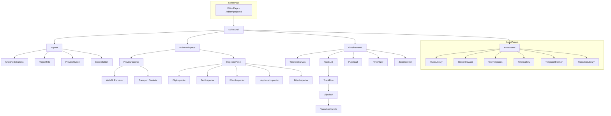
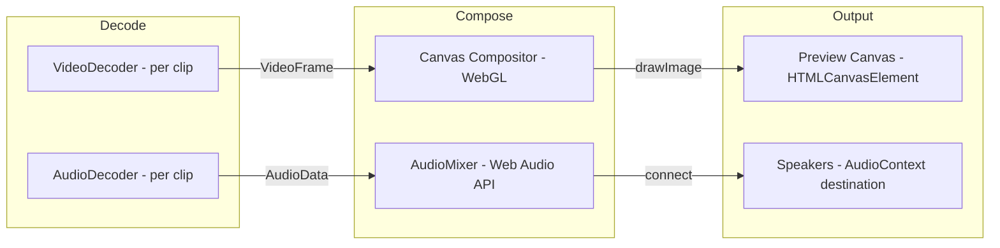
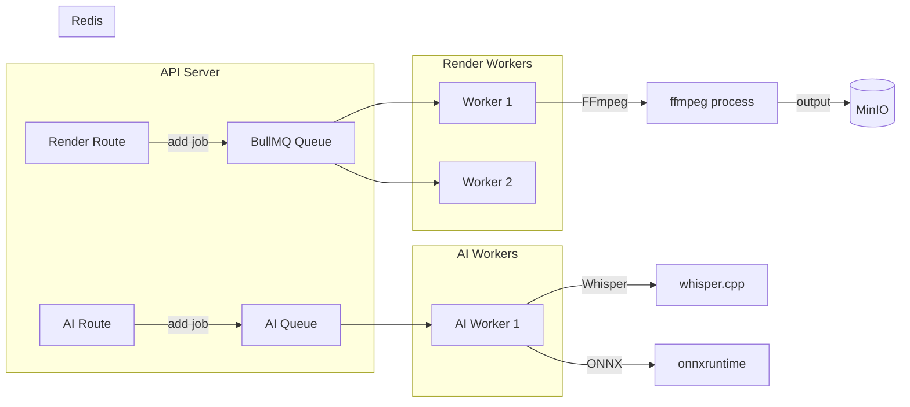
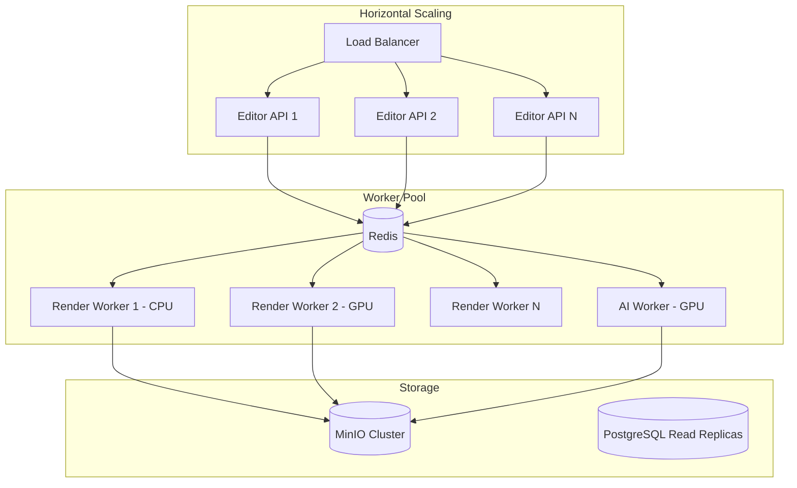

# CapCut-Level Video Editor — Полная архитектура внедрения

> **Проект:** ECOMANSONI  
> **Версия:** 1.0  
> **Дата:** 2026-03-09  
> **Стек:** React 18 · TypeScript 5.8 · Vite 5 · Fastify · FFmpeg · WebCodecs · MinIO · Supabase (PostgreSQL)  
> **Статус:** Архитектурный документ для реализации

---

## Содержание

1. [Анализ функционала CapCut](#1-анализ-функционала-capcut)
2. [Архитектура системы](#2-архитектура-системы)
3. [Схема базы данных](#3-схема-базы-данных)
4. [API контракты](#4-api-контракты)
5. [Frontend архитектура](#5-frontend-архитектура)
6. [Backend архитектура](#6-backend-архитектура)
7. [FFmpeg Pipelines](#7-ffmpeg-pipelines)
8. [План внедрения по фазам](#8-план-внедрения-по-фазам)
9. [Дополнения и рекомендации](#9-дополнения-и-рекомендации)

---

## 1. Анализ функционала CapCut

### 1.1 Полный перечень функций CapCut с категоризацией

#### A. Базовое редактирование
| # | Функция | Описание |
|---|---------|----------|
| A1 | Trim/Cut | Обрезка начала/конца клипа |
| A2 | Split | Разрезание клипа на две части в точке playhead |
| A3 | Merge | Объединение смежных клипов |
| A4 | Delete | Удаление клипа с дорожки |
| A5 | Duplicate | Дублирование клипа |
| A6 | Reorder | Drag-and-drop перемещение клипов |
| A7 | Undo/Redo | История операций с неограниченным стеком |

#### B. Многодорожечный Timeline
| # | Функция | Описание |
|---|---------|----------|
| B1 | Video tracks | Множественные видео-дорожки с z-order |
| B2 | Audio tracks | Независимые аудио-дорожки |
| B3 | Text tracks | Текстовые оверлеи с таймингом |
| B4 | Sticker tracks | Стикеры и анимированные элементы |
| B5 | Effect tracks | Дорожки эффектов |
| B6 | Zoom timeline | Масштабирование шкалы времени pinch/scroll |
| B7 | Snapping | Привязка к границам клипов/маркерам |
| B8 | Markers | Маркеры на timeline для навигации |

#### C. Переходы
| # | Функция | Описание |
|---|---------|----------|
| C1 | Basic transitions | Fade, dissolve, wipe, slide |
| C2 | 3D transitions | Cube, flip, fold |
| C3 | Mask transitions | Circle, diamond, star reveal |
| C4 | Glitch transitions | Digital glitch, RGB split |
| C5 | Custom duration | Настройка длительности перехода 0.1-2.0с |

#### D. Текст и субтитры
| # | Функция | Описание |
|---|---------|----------|
| D1 | Text overlay | Наложение текста с позиционированием |
| D2 | Text styles | 200+ шрифтов, цвет, тень, обводка |
| D3 | Text animation | Появление, движение, исчезновение — 50+ пресетов |
| D4 | Auto captions | AI-распознавание речи → субтитры |
| D5 | Text templates | Готовые стили текста |
| D6 | Text timing | Привязка текста к участку timeline |

#### E. Визуальные эффекты
| # | Функция | Описание |
|---|---------|----------|
| E1 | Color filters | 100+ цветовых фильтров |
| E2 | LUTs | Профессиональные LUT-файлы |
| E3 | Color correction | Brightness, contrast, saturation, temperature, tint |
| E4 | HSL adjustment | Hue/Saturation/Luminance по каналам |
| E5 | Curves | Tone curves RGB |
| E6 | Vignette | Виньетирование |
| E7 | Blur | Gaussian, motion, radial blur |
| E8 | Sharpen | Резкость |

#### F. Продвинутые эффекты
| # | Функция | Описание |
|---|---------|----------|
| F1 | PIP | Picture-in-Picture — видео поверх видео |
| F2 | Chroma Key | Удаление зелёного/синего фона |
| F3 | Background Removal | AI-удаление фона |
| F4 | Blend modes | Multiply, screen, overlay и др. |
| F5 | Mask/Crop shapes | Произвольные маски и формы обрезки |
| F6 | Speed control | 0.1x — 100x |
| F7 | Speed ramp | Плавное изменение скорости по кривой |
| F8 | Reverse | Воспроизведение в обратном направлении |
| F9 | Freeze frame | Заморозка кадра |

#### G. Аудио
| # | Функция | Описание |
|---|---------|----------|
| G1 | Music library | Встроенная библиотека треков |
| G2 | Sound effects | Библиотека звуковых эффектов |
| G3 | Voiceover | Запись голоса поверх видео |
| G4 | Voice effects | Pitch shift, reverb, echo, robot, chipmunk |
| G5 | Audio fade | Fade in / fade out |
| G6 | Volume control | Громкость per-clip |
| G7 | Audio detach | Отделение audio от video |
| G8 | Beat sync | Автосинхронизация с ритмом музыки |
| G9 | Noise reduction | AI-шумоподавление |

#### H. Кейфреймная анимация
| # | Функция | Описание |
|---|---------|----------|
| H1 | Position keyframes | Анимация позиции X/Y |
| H2 | Scale keyframes | Анимация масштаба |
| H3 | Rotation keyframes | Анимация поворота |
| H4 | Opacity keyframes | Анимация прозрачности |
| H5 | Easing curves | Bezier easing между кейфреймами |

#### I. AI-функции
| # | Функция | Описание |
|---|---------|----------|
| I1 | Auto captions | Whisper-based STT |
| I2 | Smart cut | Удаление пауз/тишины |
| I3 | Background removal | Сегментация фона в реальном времени |
| I4 | Style transfer | AI-стилизация видео |
| I5 | Upscale | AI-увеличение разрешения |
| I6 | Object tracking | Трекинг объектов для привязки текста/стикеров |

#### J. Экспорт и шаблоны
| # | Функция | Описание |
|---|---------|----------|
| J1 | Export 4K 60fps | Максимальное качество |
| J2 | Export presets | Формат по платформе — Instagram, TikTok, YouTube |
| J3 | Templates | Готовые проекты-шаблоны |
| J4 | Template marketplace | Маркетплейс шаблонов |
| J5 | Project save/load | Сохранение проекта в облако |
| J6 | Draft autosave | Автосохранение черновиков |

### 1.2 Матрица сравнения: CapCut vs текущее состояние

| Категория | CapCut | ECOMANSONI текущее | Gap |
|-----------|--------|--------------------|-----|
| **Timeline** | Многодорожечный NLE | Нет timeline — только загрузка файла | 🔴 Критический |
| **Trim/Split** | Полный набор | Нет | 🔴 Критический |
| **Переходы** | 100+ | Нет | 🔴 Высокий |
| **Текст** | 200+ шрифтов, анимации | Нет текста на видео | 🔴 Высокий |
| **Фильтры** | 100+ фильтров + LUTs | Базовый фото-фильтр через CESDK | 🟡 Средний |
| **PIP** | Полноценный | Нет | 🟡 Средний |
| **Speed control** | 0.1x-100x + ramp | Нет | 🟡 Средний |
| **Chroma Key** | Есть | Нет | 🟡 Средний |
| **Музыка** | Огромная библиотека | `music_tracks` таблица — пустая | 🔴 Высокий |
| **Voice effects** | 20+ эффектов | Нет | 🟡 Средний |
| **Auto captions** | AI Whisper | Нет | 🟡 Средний |
| **Кейфреймы** | Полная система | Нет | 🟡 Средний |
| **Шаблоны** | Маркетплейс | Нет | 🟡 Средний |
| **Экспорт** | 4K 60fps, multiple formats | Загрузка as-is + HLS транскодинг | 🔴 Высокий |
| **Медиа-редактор** | — | CESDK для фото | ✅ Частично есть |
| **FSM плеера** | — | `fsm.ts` — написан, НЕ подключён | ⚠️ Не интегрирован |

### 1.3 Приоритизация функций

| Приоритет | Функции | Обоснование |
|-----------|---------|-------------|
| **P0 — Must Have** | A1-A7, B1-B3, B6, D1-D2, D6, J5-J6, E3, G6 | Без этого редактор не имеет smысла. Минимальный жизнеспособный редактор |
| **P1 — Should Have** | C1, C5, D3, E1-E2, F1, F6-F7, G1-G3, G5, J1-J2, B4-B5 | Делает редактор конкурентоспособным с InShot/VLLO |
| **P2 — Nice to Have** | C2-C4, D4-D5, E4-E8, F2, F4-F5, F8-F9, G4, G7-G8, H1-H5, J3-J4 | Профессиональный уровень, KineMaster/CapCut |
| **P3 — Future** | F3, G9, I1-I6, B7-B8 | AI-функции и продвинутые фичи |

---

## 2. Архитектура системы

### 2.1 Диаграмма общей архитектуры

```mermaid
graph TB
    subgraph Client - React SPA
        UI[Editor UI]
        TL[Timeline Engine]
        PV[Preview Canvas - WebGL]
        WC[WebCodecs Decoder]
        WA[Web Audio API]
        FFW[FFmpeg.wasm Export]
        SM[Zustand State Manager]
    end

    subgraph API Layer - Fastify
        PRJ[/api/editor/projects]
        RND[/api/editor/render]
        AST[/api/editor/assets]
        TPL[/api/editor/templates]
        AI_API[/api/editor/ai]
        UPL[/api/upload - existing]
    end

    subgraph Worker Layer
        BQ[BullMQ Queue - Redis]
        RW1[Render Worker 1]
        RW2[Render Worker 2]
        RWN[Render Worker N]
        AIW[AI Worker - Whisper/ONNX]
    end

    subgraph Storage
        MINIO[(MinIO S3)]
        PG[(PostgreSQL - Supabase)]
        REDIS[(Redis)]
    end

    subgraph CDN
        NGX[Nginx Cache]
    end

    UI --> SM
    SM --> TL
    TL --> PV
    TL --> WC
    TL --> WA
    SM --> FFW

    UI --> PRJ
    UI --> RND
    UI --> AST
    UI --> TPL
    UI --> AI_API
    UI --> UPL

    PRJ --> PG
    RND --> BQ
    AST --> MINIO
    TPL --> PG
    AI_API --> BQ

    BQ --> RW1
    BQ --> RW2
    BQ --> RWN
    BQ --> AIW

    RW1 --> MINIO
    RW2 --> MINIO
    RWN --> MINIO
    AIW --> PG

    MINIO --> NGX
```

### 2.2 Слои ответственности

```
┌─────────────────────────────────────────────────────────────────┐
│                    PRESENTATION LAYER                            │
│  EditorPage → EditorShell → Timeline + Preview + Inspector      │
│  Zustand stores: useEditorProject, useEditorTimeline,           │
│                  useEditorPlayback, useEditorAssets              │
├─────────────────────────────────────────────────────────────────┤
│                    PROCESSING LAYER (Client)                     │
│  TimelineEngine: WebCodecs decode → Canvas/WebGL compose        │
│  AudioEngine: Web Audio API graph → mix → preview               │
│  ExportEngine: FFmpeg.wasm encode → MP4/WebM blob               │
├─────────────────────────────────────────────────────────────────┤
│                    API LAYER (Fastify)                           │
│  CRUD projects/tracks/clips/effects/keyframes                   │
│  Trigger server render jobs                                     │
│  Manage assets: music, stickers, fonts, templates               │
├─────────────────────────────────────────────────────────────────┤
│                    WORKER LAYER (BullMQ)                         │
│  RenderWorker: FFmpeg CLI pipeline → final MP4                  │
│  AIWorker: Whisper STT, background removal, smart cut           │
├─────────────────────────────────────────────────────────────────┤
│                    STORAGE LAYER                                 │
│  MinIO: source media, rendered output, assets                   │
│  PostgreSQL: project metadata, tracks, clips, keyframes         │
│  Redis: job queues, render progress, session cache              │
└─────────────────────────────────────────────────────────────────┘
```

---

## 3. Схема базы данных

### 3.1 ER-диаграмма

```mermaid
erDiagram
    editor_projects ||--o{ editor_tracks : has
    editor_tracks ||--o{ editor_clips : contains
    editor_clips ||--o{ editor_effects : has
    editor_clips ||--o{ editor_keyframes : has
    editor_projects ||--o{ render_jobs : generates
    render_jobs ||--o{ render_job_logs : logs
    editor_projects }o--|| editor_templates : uses
    music_library ||--o{ editor_clips : referenced_by
    sticker_packs ||--o{ sticker_items : contains

    editor_projects {
        uuid id PK
        uuid owner_id FK
        text title
        text description
        jsonb settings
        text status
        text output_url
        text thumbnail_url
        int duration_ms
        int width
        int height
        int fps
        timestamptz created_at
        timestamptz updated_at
    }

    editor_tracks {
        uuid id PK
        uuid project_id FK
        text track_type
        int sort_order
        text label
        boolean is_muted
        boolean is_locked
        float volume
        timestamptz created_at
    }

    editor_clips {
        uuid id PK
        uuid track_id FK
        uuid source_asset_id
        text clip_type
        int timeline_start_ms
        int timeline_end_ms
        int source_start_ms
        int source_end_ms
        float speed
        float volume
        int z_index
        jsonb transform
        jsonb content
        text transition_in_type
        int transition_in_duration_ms
        text transition_out_type
        int transition_out_duration_ms
        timestamptz created_at
        timestamptz updated_at
    }

    editor_effects {
        uuid id PK
        uuid clip_id FK
        text effect_type
        text effect_name
        jsonb params
        int start_ms
        int end_ms
        boolean is_enabled
        int sort_order
    }

    editor_keyframes {
        uuid id PK
        uuid clip_id FK
        text property
        int time_ms
        float value_num
        text value_text
        jsonb value_json
        text easing
    }
}
```

### 3.2 Миграция: `editor_projects`

```sql
-- ============================================================
-- Migration: Create editor_projects table
-- ============================================================
CREATE TABLE public.editor_projects (
    id              UUID        PRIMARY KEY DEFAULT gen_random_uuid(),
    owner_id        UUID        NOT NULL REFERENCES auth.users(id) ON DELETE CASCADE,
    title           TEXT        NOT NULL DEFAULT 'Untitled Project',
    description     TEXT,
    
    -- Canvas settings
    width           INT         NOT NULL DEFAULT 1080,
    height          INT         NOT NULL DEFAULT 1920,
    fps             INT         NOT NULL DEFAULT 30,
    duration_ms     INT         NOT NULL DEFAULT 0,
    
    -- Project metadata
    settings        JSONB       NOT NULL DEFAULT '{
        "background_color": "#000000",
        "aspect_ratio": "9:16",
        "audio_sample_rate": 44100,
        "audio_channels": 2
    }'::jsonb,
    
    -- Status: draft | rendering | rendered | published | archived
    status          TEXT        NOT NULL DEFAULT 'draft'
                    CHECK (status IN ('draft', 'rendering', 'rendered', 'published', 'archived')),
    
    -- Output
    output_url      TEXT,
    thumbnail_url   TEXT,
    
    -- Связь с контентом (опционально — при публикации может стать reel/story/post)
    published_as    TEXT        CHECK (published_as IN ('reel', 'story', 'post')),
    published_id    UUID,
    
    -- Source template
    template_id     UUID,
    
    -- Timestamps
    created_at      TIMESTAMPTZ NOT NULL DEFAULT now(),
    updated_at      TIMESTAMPTZ NOT NULL DEFAULT now()
);

-- Индексы
CREATE INDEX idx_editor_projects_owner      ON public.editor_projects(owner_id);
CREATE INDEX idx_editor_projects_status     ON public.editor_projects(status);
CREATE INDEX idx_editor_projects_updated    ON public.editor_projects(updated_at DESC);
CREATE INDEX idx_editor_projects_template   ON public.editor_projects(template_id) WHERE template_id IS NOT NULL;

-- RLS
ALTER TABLE public.editor_projects ENABLE ROW LEVEL SECURITY;

CREATE POLICY "Users can view own projects"
    ON public.editor_projects FOR SELECT
    USING (auth.uid() = owner_id);

CREATE POLICY "Users can create own projects"
    ON public.editor_projects FOR INSERT
    WITH CHECK (auth.uid() = owner_id);

CREATE POLICY "Users can update own projects"
    ON public.editor_projects FOR UPDATE
    USING (auth.uid() = owner_id);

CREATE POLICY "Users can delete own projects"
    ON public.editor_projects FOR DELETE
    USING (auth.uid() = owner_id);

-- Updated_at trigger
CREATE OR REPLACE FUNCTION public.editor_projects_updated_at()
RETURNS TRIGGER AS $$
BEGIN
    NEW.updated_at = now();
    RETURN NEW;
END;
$$ LANGUAGE plpgsql;

CREATE TRIGGER trg_editor_projects_updated_at
    BEFORE UPDATE ON public.editor_projects
    FOR EACH ROW EXECUTE FUNCTION public.editor_projects_updated_at();
```

### 3.3 Миграция: `editor_tracks`

```sql
-- ============================================================
-- Migration: Create editor_tracks table
-- ============================================================
CREATE TABLE public.editor_tracks (
    id              UUID        PRIMARY KEY DEFAULT gen_random_uuid(),
    project_id      UUID        NOT NULL REFERENCES public.editor_projects(id) ON DELETE CASCADE,
    
    -- Track type: video | audio | text | sticker | effect
    track_type      TEXT        NOT NULL
                    CHECK (track_type IN ('video', 'audio', 'text', 'sticker', 'effect')),
    
    -- Order: 0 = primary video, 1+ = overlays/additional tracks
    sort_order      INT         NOT NULL DEFAULT 0,
    
    label           TEXT        NOT NULL DEFAULT '',
    is_muted        BOOLEAN     NOT NULL DEFAULT false,
    is_locked       BOOLEAN     NOT NULL DEFAULT false,
    is_visible      BOOLEAN     NOT NULL DEFAULT true,
    
    -- Audio volume for this track (0.0 - 2.0, where 1.0 = 100%)
    volume          REAL        NOT NULL DEFAULT 1.0
                    CHECK (volume >= 0.0 AND volume <= 2.0),
    
    -- Track-level opacity (video/sticker/text tracks)
    opacity         REAL        NOT NULL DEFAULT 1.0
                    CHECK (opacity >= 0.0 AND opacity <= 1.0),
    
    -- Blend mode for compositing: normal | multiply | screen | overlay | etc
    blend_mode      TEXT        NOT NULL DEFAULT 'normal',
    
    created_at      TIMESTAMPTZ NOT NULL DEFAULT now()
);

-- Индексы
CREATE INDEX idx_editor_tracks_project  ON public.editor_tracks(project_id);
CREATE INDEX idx_editor_tracks_order    ON public.editor_tracks(project_id, sort_order);

-- RLS: через project ownership
ALTER TABLE public.editor_tracks ENABLE ROW LEVEL SECURITY;

CREATE POLICY "Track access via project ownership"
    ON public.editor_tracks FOR ALL
    USING (
        EXISTS (
            SELECT 1 FROM public.editor_projects p
            WHERE p.id = editor_tracks.project_id
            AND p.owner_id = auth.uid()
        )
    );
```

### 3.4 Миграция: `editor_clips`

```sql
-- ============================================================
-- Migration: Create editor_clips table  
-- Каждый клип — отрезок медиа (видео/аудио) или элемент (текст/стикер)
-- привязанный к дорожке с позицией на timeline.
-- ============================================================
CREATE TABLE public.editor_clips (
    id                      UUID        PRIMARY KEY DEFAULT gen_random_uuid(),
    track_id                UUID        NOT NULL REFERENCES public.editor_tracks(id) ON DELETE CASCADE,
    
    -- Тип клипа: video | audio | text | sticker | image
    clip_type               TEXT        NOT NULL
                            CHECK (clip_type IN ('video', 'audio', 'text', 'sticker', 'image')),
    
    -- Ссылка на исходный медиа-файл в MinIO (для video/audio/image клипов)
    source_asset_url        TEXT,
    source_asset_bucket     TEXT,
    source_duration_ms      INT,    -- длительность исходного файла
    
    -- === Позиция на Timeline ===
    -- timeline_start_ms: когда клип начинает проигрываться на timeline
    -- timeline_end_ms: когда клип заканчивает проигрываться на timeline
    timeline_start_ms       INT         NOT NULL DEFAULT 0
                            CHECK (timeline_start_ms >= 0),
    timeline_end_ms         INT         NOT NULL DEFAULT 0
                            CHECK (timeline_end_ms >= timeline_start_ms),
    
    -- === Source trimming ===
    -- source_start_ms: откуда в исходном файле начинается воспроизведение
    -- source_end_ms: где в исходном файле заканчивается воспроизведение
    source_start_ms         INT         NOT NULL DEFAULT 0,
    source_end_ms           INT,
    
    -- Скорость воспроизведения (0.1 - 100.0)
    speed                   REAL        NOT NULL DEFAULT 1.0
                            CHECK (speed >= 0.1 AND speed <= 100.0),
    
    -- Громкость для этого клипа (0.0 - 2.0)
    volume                  REAL        NOT NULL DEFAULT 1.0
                            CHECK (volume >= 0.0 AND volume <= 2.0),
    
    -- Z-index для наложения (больше = выше)
    z_index                 INT         NOT NULL DEFAULT 0,
    
    -- === Transform (video/image/sticker clips) ===
    -- position_x/y: нормализованные координаты (0.0-1.0, где 0.5=центр)
    -- scale: масштаб (1.0 = 100%)
    -- rotation: в градусах (0-360)
    transform               JSONB       NOT NULL DEFAULT '{
        "position_x": 0.5,
        "position_y": 0.5,
        "scale_x": 1.0,
        "scale_y": 1.0,
        "rotation": 0,
        "anchor_x": 0.5,
        "anchor_y": 0.5,
        "opacity": 1.0
    }'::jsonb,
    
    -- === Content (text/sticker specific) ===
    -- Для text: { text, font_family, font_size, color, bg_color, alignment, bold, italic, ... }
    -- Для sticker: { sticker_id, pack_id, animated, ... }
    content                 JSONB       NOT NULL DEFAULT '{}'::jsonb,
    
    -- === Transitions ===
    transition_in_type      TEXT,       -- fade | dissolve | wipe_left | slide_up | ...
    transition_in_duration_ms INT       DEFAULT 0,
    transition_out_type     TEXT,
    transition_out_duration_ms INT      DEFAULT 0,
    
    -- === Filters ===
    -- Массив примененных фильтров: [{ type: "brightness", value: 0.1 }, ...]
    filters                 JSONB       NOT NULL DEFAULT '[]'::jsonb,
    
    -- === Audio ===
    audio_fade_in_ms        INT         NOT NULL DEFAULT 0,
    audio_fade_out_ms       INT         NOT NULL DEFAULT 0,
    is_audio_detached       BOOLEAN     NOT NULL DEFAULT false,
    
    -- === Speed Ramp ===
    -- Массив точек кривой скорости: [{ time_pct: 0.0, speed: 1.0 }, { time_pct: 0.5, speed: 2.0 }, ...]
    speed_ramp              JSONB,
    
    -- Reverse playback
    is_reversed             BOOLEAN     NOT NULL DEFAULT false,
    
    -- Freeze frame at specific source time
    freeze_frame_at_ms      INT,
    
    created_at              TIMESTAMPTZ NOT NULL DEFAULT now(),
    updated_at              TIMESTAMPTZ NOT NULL DEFAULT now()
);

-- Индексы
CREATE INDEX idx_editor_clips_track         ON public.editor_clips(track_id);
CREATE INDEX idx_editor_clips_timeline      ON public.editor_clips(track_id, timeline_start_ms);
CREATE INDEX idx_editor_clips_type          ON public.editor_clips(clip_type);

-- RLS: через track → project ownership
ALTER TABLE public.editor_clips ENABLE ROW LEVEL SECURITY;

CREATE POLICY "Clip access via project ownership"
    ON public.editor_clips FOR ALL
    USING (
        EXISTS (
            SELECT 1 FROM public.editor_tracks t
            JOIN public.editor_projects p ON p.id = t.project_id
            WHERE t.id = editor_clips.track_id
            AND p.owner_id = auth.uid()
        )
    );

-- Updated_at trigger
CREATE TRIGGER trg_editor_clips_updated_at
    BEFORE UPDATE ON public.editor_clips
    FOR EACH ROW EXECUTE FUNCTION public.editor_projects_updated_at();
```

### 3.5 Миграция: `editor_effects`

```sql
-- ============================================================
-- Migration: Create editor_effects table
-- Эффекты, применённые к клипам.
-- ============================================================
CREATE TABLE public.editor_effects (
    id              UUID        PRIMARY KEY DEFAULT gen_random_uuid(),
    clip_id         UUID        NOT NULL REFERENCES public.editor_clips(id) ON DELETE CASCADE,
    
    -- Тип эффекта:
    -- color_filter | lut | chroma_key | blur | sharpen | vignette |
    -- voice_effect | noise_reduction | pip_layout | blend_mode
    effect_type     TEXT        NOT NULL,
    
    -- Имя конкретного эффекта/фильтра
    effect_name     TEXT        NOT NULL,
    
    -- Параметры эффекта (зависят от типа)
    -- color_filter: { intensity: 0.8 }
    -- lut: { lut_url: "...", intensity: 1.0 }
    -- chroma_key: { color: "#00FF00", similarity: 0.4, smoothness: 0.1, spill: 0.1 }
    -- blur: { type: "gaussian", radius: 10 }
    -- voice_effect: { type: "robot", pitch: -5, reverb: 0.3 }
    params          JSONB       NOT NULL DEFAULT '{}'::jsonb,
    
    -- Временные рамки эффекта (относительно клипа, мс)
    -- null = весь клип
    start_ms        INT,
    end_ms          INT,
    
    is_enabled      BOOLEAN     NOT NULL DEFAULT true,
    sort_order      INT         NOT NULL DEFAULT 0,
    
    created_at      TIMESTAMPTZ NOT NULL DEFAULT now()
);

-- Индексы
CREATE INDEX idx_editor_effects_clip    ON public.editor_effects(clip_id);
CREATE INDEX idx_editor_effects_type    ON public.editor_effects(effect_type);

-- RLS: через clip → track → project ownership chain
ALTER TABLE public.editor_effects ENABLE ROW LEVEL SECURITY;

CREATE POLICY "Effect access via project ownership"
    ON public.editor_effects FOR ALL
    USING (
        EXISTS (
            SELECT 1 FROM public.editor_clips c
            JOIN public.editor_tracks t ON t.id = c.track_id
            JOIN public.editor_projects p ON p.id = t.project_id
            WHERE c.id = editor_effects.clip_id
            AND p.owner_id = auth.uid()
        )
    );
```

### 3.6 Миграция: `editor_keyframes`

```sql
-- ============================================================
-- Migration: Create editor_keyframes table
-- Кейфреймная анимация: каждая строка = одна точка на кривой анимации.
-- ============================================================
CREATE TABLE public.editor_keyframes (
    id              UUID        PRIMARY KEY DEFAULT gen_random_uuid(),
    clip_id         UUID        NOT NULL REFERENCES public.editor_clips(id) ON DELETE CASCADE,
    
    -- Анимируемое свойство:
    -- position_x | position_y | scale_x | scale_y | rotation | opacity | volume |
    -- blur_radius | filter_intensity
    property        TEXT        NOT NULL,
    
    -- Время кейфрейма относительно начала клипа на timeline (мс)
    time_ms         INT         NOT NULL CHECK (time_ms >= 0),
    
    -- Значение свойства в этой точке
    -- Для числовых свойств:
    value_num       REAL,
    -- Для текстовых/сложных:
    value_text      TEXT,
    -- Для составных:
    value_json      JSONB,
    
    -- Функция интерполяции до следующего кейфрейма:
    -- linear | ease_in | ease_out | ease_in_out | bezier
    easing          TEXT        NOT NULL DEFAULT 'linear'
                    CHECK (easing IN ('linear', 'ease_in', 'ease_out', 'ease_in_out', 'bezier')),
    
    -- Для bezier easing: контрольные точки [x1, y1, x2, y2]
    bezier_control  JSONB,
    
    created_at      TIMESTAMPTZ NOT NULL DEFAULT now()
);

-- Индексы (критичны для быстрого чтения анимаций)
CREATE INDEX idx_editor_keyframes_clip          ON public.editor_keyframes(clip_id);
CREATE INDEX idx_editor_keyframes_clip_prop     ON public.editor_keyframes(clip_id, property, time_ms);
CREATE UNIQUE INDEX idx_editor_keyframes_unique ON public.editor_keyframes(clip_id, property, time_ms);

-- RLS: через clip → track → project chain
ALTER TABLE public.editor_keyframes ENABLE ROW LEVEL SECURITY;

CREATE POLICY "Keyframe access via project ownership"
    ON public.editor_keyframes FOR ALL
    USING (
        EXISTS (
            SELECT 1 FROM public.editor_clips c
            JOIN public.editor_tracks t ON t.id = c.track_id
            JOIN public.editor_projects p ON p.id = t.project_id
            WHERE c.id = editor_keyframes.clip_id
            AND p.owner_id = auth.uid()
        )
    );
```

### 3.7 Миграция: `editor_templates`

```sql
-- ============================================================
-- Migration: Create editor_templates table
-- Шаблоны проектов, доступные для всех пользователей.
-- ============================================================
CREATE TABLE public.editor_templates (
    id              UUID        PRIMARY KEY DEFAULT gen_random_uuid(),
    
    -- Автор шаблона (null = системный/встроенный)
    author_id       UUID        REFERENCES auth.users(id) ON DELETE SET NULL,
    
    title           TEXT        NOT NULL,
    description     TEXT,
    thumbnail_url   TEXT        NOT NULL,
    preview_url     TEXT,       -- Видео-превью шаблона
    
    -- Категория: trending | business | lifestyle | education | holiday | music | meme
    category        TEXT        NOT NULL DEFAULT 'general',
    tags            TEXT[]      NOT NULL DEFAULT '{}',
    
    -- Полная структура проекта для клонирования
    -- { tracks: [...], clips: [...], effects: [...], keyframes: [...], settings: {...} }
    project_data    JSONB       NOT NULL,
    
    -- Canvas settings
    width           INT         NOT NULL DEFAULT 1080,
    height          INT         NOT NULL DEFAULT 1920,
    duration_ms     INT         NOT NULL DEFAULT 0,
    
    -- Статистика
    use_count       INT         NOT NULL DEFAULT 0,
    like_count      INT         NOT NULL DEFAULT 0,
    
    -- Статус: draft | review | published | archived
    status          TEXT        NOT NULL DEFAULT 'draft'
                    CHECK (status IN ('draft', 'review', 'published', 'archived')),
    
    is_premium      BOOLEAN     NOT NULL DEFAULT false,
    is_featured     BOOLEAN     NOT NULL DEFAULT false,
    
    created_at      TIMESTAMPTZ NOT NULL DEFAULT now(),
    updated_at      TIMESTAMPTZ NOT NULL DEFAULT now()
);

-- Индексы
CREATE INDEX idx_editor_templates_status    ON public.editor_templates(status) WHERE status = 'published';
CREATE INDEX idx_editor_templates_category  ON public.editor_templates(category, use_count DESC);
CREATE INDEX idx_editor_templates_featured  ON public.editor_templates(is_featured, use_count DESC) WHERE status = 'published';
CREATE INDEX idx_editor_templates_author    ON public.editor_templates(author_id) WHERE author_id IS NOT NULL;
CREATE INDEX idx_editor_templates_tags      ON public.editor_templates USING GIN(tags);

-- RLS
ALTER TABLE public.editor_templates ENABLE ROW LEVEL SECURITY;

-- Все видят опубликованные
CREATE POLICY "Anyone can view published templates"
    ON public.editor_templates FOR SELECT
    USING (status = 'published');

-- Авторы видят свои
CREATE POLICY "Authors can view own templates"
    ON public.editor_templates FOR SELECT
    USING (auth.uid() = author_id);

-- Авторы создают свои
CREATE POLICY "Authors can create templates"
    ON public.editor_templates FOR INSERT
    WITH CHECK (auth.uid() = author_id);

-- Авторы редактируют свои
CREATE POLICY "Authors can update own templates"
    ON public.editor_templates FOR UPDATE
    USING (auth.uid() = author_id);
```

### 3.8 Миграция: `music_library`

```sql
-- ============================================================
-- Migration: Create music_library table
-- Замена/расширение существующей music_tracks с полными метаданными.
-- ============================================================
CREATE TABLE public.music_library (
    id              UUID        PRIMARY KEY DEFAULT gen_random_uuid(),
    
    title           TEXT        NOT NULL,
    artist          TEXT        NOT NULL,
    album           TEXT,
    
    -- Файлы
    audio_url       TEXT        NOT NULL,    -- URL в MinIO (editor-assets bucket)
    cover_url       TEXT,                    -- Обложка
    waveform_url    TEXT,                    -- Предварительно сгенерированная waveform JSON
    
    -- Метаданные
    duration_ms     INT         NOT NULL,
    bpm             INT,                    -- Beats per minute для beat sync
    genre           TEXT,
    mood            TEXT,                   -- happy | sad | energetic | calm | dramatic
    tags            TEXT[]      NOT NULL DEFAULT '{}',
    
    -- Лицензия
    license_type    TEXT        NOT NULL DEFAULT 'royalty_free'
                    CHECK (license_type IN ('royalty_free', 'creative_commons', 'licensed', 'original')),
    license_info    TEXT,
    
    -- Статистика
    use_count       INT         NOT NULL DEFAULT 0,
    is_trending     BOOLEAN     NOT NULL DEFAULT false,
    
    -- Категоризация
    -- section: music | sound_effect | ambient
    section         TEXT        NOT NULL DEFAULT 'music'
                    CHECK (section IN ('music', 'sound_effect', 'ambient')),
    
    is_premium      BOOLEAN     NOT NULL DEFAULT false,
    is_active       BOOLEAN     NOT NULL DEFAULT true,
    
    created_at      TIMESTAMPTZ NOT NULL DEFAULT now()
);

-- Индексы
CREATE INDEX idx_music_library_section      ON public.music_library(section, use_count DESC) WHERE is_active;
CREATE INDEX idx_music_library_genre        ON public.music_library(genre, use_count DESC) WHERE is_active;
CREATE INDEX idx_music_library_mood         ON public.music_library(mood) WHERE is_active;
CREATE INDEX idx_music_library_trending     ON public.music_library(is_trending, use_count DESC) WHERE is_active;
CREATE INDEX idx_music_library_tags         ON public.music_library USING GIN(tags);
CREATE INDEX idx_music_library_search       ON public.music_library USING GIN(
    to_tsvector('simple', coalesce(title, '') || ' ' || coalesce(artist, '') || ' ' || coalesce(album, ''))
);

-- RLS
ALTER TABLE public.music_library ENABLE ROW LEVEL SECURITY;

CREATE POLICY "Anyone can view active music"
    ON public.music_library FOR SELECT
    USING (is_active = true);
```

### 3.9 Миграция: `sticker_packs` и `sticker_items`

```sql
-- ============================================================
-- Migration: Create sticker_packs & sticker_items tables
-- ============================================================
CREATE TABLE public.sticker_packs (
    id              UUID        PRIMARY KEY DEFAULT gen_random_uuid(),
    title           TEXT        NOT NULL,
    description     TEXT,
    cover_url       TEXT        NOT NULL,
    author          TEXT,
    
    category        TEXT        NOT NULL DEFAULT 'general',
    tags            TEXT[]      NOT NULL DEFAULT '{}',
    
    item_count      INT         NOT NULL DEFAULT 0,
    use_count       INT         NOT NULL DEFAULT 0,
    
    is_animated     BOOLEAN     NOT NULL DEFAULT false,
    is_premium      BOOLEAN     NOT NULL DEFAULT false,
    is_active       BOOLEAN     NOT NULL DEFAULT true,
    
    created_at      TIMESTAMPTZ NOT NULL DEFAULT now()
);

CREATE TABLE public.sticker_items (
    id              UUID        PRIMARY KEY DEFAULT gen_random_uuid(),
    pack_id         UUID        NOT NULL REFERENCES public.sticker_packs(id) ON DELETE CASCADE,
    
    -- URL стикера (PNG для статических, Lottie JSON для анимированных, APNG/WebP animated)
    url             TEXT        NOT NULL,
    thumbnail_url   TEXT,
    
    -- Размеры
    width           INT         NOT NULL,
    height          INT         NOT NULL,
    
    -- Для анимированных
    duration_ms     INT,        -- null = статический
    is_animated     BOOLEAN     NOT NULL DEFAULT false,
    
    tags            TEXT[]      NOT NULL DEFAULT '{}',
    sort_order      INT         NOT NULL DEFAULT 0,
    
    created_at      TIMESTAMPTZ NOT NULL DEFAULT now()
);

-- Индексы
CREATE INDEX idx_sticker_packs_category ON public.sticker_packs(category, use_count DESC) WHERE is_active;
CREATE INDEX idx_sticker_packs_tags     ON public.sticker_packs USING GIN(tags);
CREATE INDEX idx_sticker_items_pack     ON public.sticker_items(pack_id, sort_order);
CREATE INDEX idx_sticker_items_tags     ON public.sticker_items USING GIN(tags);

-- RLS
ALTER TABLE public.sticker_packs ENABLE ROW LEVEL SECURITY;
ALTER TABLE public.sticker_items ENABLE ROW LEVEL SECURITY;

CREATE POLICY "Anyone can view active sticker packs"
    ON public.sticker_packs FOR SELECT USING (is_active = true);

CREATE POLICY "Anyone can view sticker items"
    ON public.sticker_items FOR SELECT
    USING (
        EXISTS (
            SELECT 1 FROM public.sticker_packs sp
            WHERE sp.id = sticker_items.pack_id AND sp.is_active
        )
    );
```

### 3.10 Миграция: `render_jobs` и `render_job_logs`

```sql
-- ============================================================
-- Migration: Create render_jobs & render_job_logs tables
-- ============================================================
CREATE TABLE public.render_jobs (
    id              UUID        PRIMARY KEY DEFAULT gen_random_uuid(),
    project_id      UUID        NOT NULL REFERENCES public.editor_projects(id) ON DELETE CASCADE,
    owner_id        UUID        NOT NULL REFERENCES auth.users(id) ON DELETE CASCADE,
    
    -- Тип рендеринга: full | preview | thumbnail | audio_only
    render_type     TEXT        NOT NULL DEFAULT 'full'
                    CHECK (render_type IN ('full', 'preview', 'thumbnail', 'audio_only')),
    
    -- Параметры экспорта
    output_settings JSONB       NOT NULL DEFAULT '{
        "codec": "h264",
        "container": "mp4",
        "width": 1080,
        "height": 1920,
        "fps": 30,
        "video_bitrate": "8000k",
        "audio_codec": "aac",
        "audio_bitrate": "192k",
        "audio_sample_rate": 44100,
        "pixel_format": "yuv420p",
        "preset": "medium",
        "crf": 18
    }'::jsonb,
    
    -- Статус: queued | processing | encoding | uploading | completed | failed | cancelled
    status          TEXT        NOT NULL DEFAULT 'queued'
                    CHECK (status IN ('queued', 'processing', 'encoding', 'uploading', 
                                      'completed', 'failed', 'cancelled')),
    
    -- Прогресс (0-100)
    progress        INT         NOT NULL DEFAULT 0
                    CHECK (progress >= 0 AND progress <= 100),
    
    -- Результат
    output_url      TEXT,
    output_size     BIGINT,
    render_duration_ms INT,     -- Сколько времени заняла обработка
    
    -- Ошибка (при status = 'failed')
    error_code      TEXT,
    error_message   TEXT,
    
    -- BullMQ job ID
    queue_job_id    TEXT,
    
    -- Worker info
    worker_id       TEXT,
    started_at      TIMESTAMPTZ,
    completed_at    TIMESTAMPTZ,
    
    created_at      TIMESTAMPTZ NOT NULL DEFAULT now()
);

CREATE TABLE public.render_job_logs (
    id              UUID        PRIMARY KEY DEFAULT gen_random_uuid(),
    job_id          UUID        NOT NULL REFERENCES public.render_jobs(id) ON DELETE CASCADE,
    
    -- Log level: debug | info | warn | error
    level           TEXT        NOT NULL DEFAULT 'info',
    message         TEXT        NOT NULL,
    metadata        JSONB,
    
    created_at      TIMESTAMPTZ NOT NULL DEFAULT now()
);

-- Индексы
CREATE INDEX idx_render_jobs_project    ON public.render_jobs(project_id);
CREATE INDEX idx_render_jobs_owner      ON public.render_jobs(owner_id);
CREATE INDEX idx_render_jobs_status     ON public.render_jobs(status) WHERE status IN ('queued', 'processing');
CREATE INDEX idx_render_jobs_queue      ON public.render_jobs(queue_job_id) WHERE queue_job_id IS NOT NULL;
CREATE INDEX idx_render_job_logs_job    ON public.render_job_logs(job_id, created_at);

-- RLS
ALTER TABLE public.render_jobs ENABLE ROW LEVEL SECURITY;
ALTER TABLE public.render_job_logs ENABLE ROW LEVEL SECURITY;

CREATE POLICY "Users can view own render jobs"
    ON public.render_jobs FOR SELECT
    USING (auth.uid() = owner_id);

CREATE POLICY "Users can create own render jobs"
    ON public.render_jobs FOR INSERT
    WITH CHECK (auth.uid() = owner_id);

CREATE POLICY "Users can cancel own render jobs"
    ON public.render_jobs FOR UPDATE
    USING (auth.uid() = owner_id AND status IN ('queued', 'processing'));

CREATE POLICY "Users can view own render job logs"
    ON public.render_job_logs FOR SELECT
    USING (
        EXISTS (
            SELECT 1 FROM public.render_jobs rj
            WHERE rj.id = render_job_logs.job_id
            AND rj.owner_id = auth.uid()
        )
    );
```

### 3.11 Миграция: `editor_assets` (пользовательские ассеты)

```sql
-- ============================================================
-- Migration: Create editor_assets table
-- Управление загруженными пользователем ассетами для редактора.
-- ============================================================
CREATE TABLE public.editor_assets (
    id              UUID        PRIMARY KEY DEFAULT gen_random_uuid(),
    owner_id        UUID        NOT NULL REFERENCES auth.users(id) ON DELETE CASCADE,
    
    -- Тип: video | audio | image | font
    asset_type      TEXT        NOT NULL
                    CHECK (asset_type IN ('video', 'audio', 'image', 'font')),
    
    -- Файл
    url             TEXT        NOT NULL,
    thumbnail_url   TEXT,
    bucket          TEXT        NOT NULL,
    object_key      TEXT        NOT NULL,
    
    -- Метаданные
    filename        TEXT        NOT NULL,
    mime_type       TEXT        NOT NULL,
    file_size       BIGINT      NOT NULL,
    
    -- Медиа-специфичные метаданные
    width           INT,
    height          INT,
    duration_ms     INT,
    
    -- Waveform для аудио (pre-computed)
    waveform_data   JSONB,
    
    created_at      TIMESTAMPTZ NOT NULL DEFAULT now()
);

-- Индексы
CREATE INDEX idx_editor_assets_owner    ON public.editor_assets(owner_id, asset_type);
CREATE INDEX idx_editor_assets_type     ON public.editor_assets(asset_type, created_at DESC);

-- RLS
ALTER TABLE public.editor_assets ENABLE ROW LEVEL SECURITY;

CREATE POLICY "Users can manage own assets"
    ON public.editor_assets FOR ALL
    USING (auth.uid() = owner_id);
```

### 3.12 Storage: Новые MinIO Buckets

Добавить в `infra/media/scripts/init-buckets.sh`:

```bash
# Новые бакеты для видео-редактора
EDITOR_BUCKETS="editor-assets editor-renders editor-templates editor-music editor-stickers"
```

| Bucket | Назначение | Политика |
|--------|-----------|----------|
| `editor-assets` | Загруженные пользователем медиа для редактора | Public read, authenticated write |
| `editor-renders` | Результаты серверного рендеринга | Public read, service write |
| `editor-templates` | Медиа для шаблонов (thumbnails, previews) | Public read, admin write |
| `editor-music` | Музыкальная библиотека (аудиофайлы) | Public read, admin write |
| `editor-stickers` | Стикеры и анимированные элементы | Public read, admin write |

---

## 4. API контракты

### 4.1 Projects API

#### `POST /api/editor/projects`

Создать новый проект редактора.

**Авторизация:** Bearer JWT (required)

**Request Body:**
```json
{
    "title": "My Video",
    "width": 1080,
    "height": 1920,
    "fps": 30,
    "settings": {
        "background_color": "#000000",
        "aspect_ratio": "9:16"
    },
    "template_id": null
}
```

**Response 201:**
```json
{
    "id": "550e8400-e29b-41d4-a716-446655440000",
    "owner_id": "user-uuid",
    "title": "My Video",
    "width": 1080,
    "height": 1920,
    "fps": 30,
    "duration_ms": 0,
    "settings": {
        "background_color": "#000000",
        "aspect_ratio": "9:16",
        "audio_sample_rate": 44100,
        "audio_channels": 2
    },
    "status": "draft",
    "output_url": null,
    "thumbnail_url": null,
    "tracks": [],
    "created_at": "2026-03-09T15:00:00Z",
    "updated_at": "2026-03-09T15:00:00Z"
}
```

**Errors:**
| Code | Status | Description |
|------|--------|-------------|
| `UNAUTHORIZED` | 401 | JWT missing or invalid |
| `VALIDATION_ERROR` | 400 | Invalid width/height/fps |
| `TEMPLATE_NOT_FOUND` | 404 | template_id provided but does not exist |
| `QUOTA_EXCEEDED` | 429 | User exceeded max projects limit |

---

#### `GET /api/editor/projects`

Список проектов текущего пользователя.

**Query Params:**
| Param | Type | Default | Description |
|-------|------|---------|-------------|
| `status` | string | all | Фильтр по статусу |
| `limit` | int | 20 | Макс. количество |
| `offset` | int | 0 | Смещение |
| `sort` | string | `updated_at` | Поле сортировки |
| `order` | string | `desc` | Направление |

**Response 200:**
```json
{
    "items": [
        {
            "id": "...",
            "title": "My Video",
            "thumbnail_url": "...",
            "status": "draft",
            "duration_ms": 15000,
            "updated_at": "..."
        }
    ],
    "total": 42,
    "limit": 20,
    "offset": 0
}
```

---

#### `GET /api/editor/projects/:id`

Полная загрузка проекта со всеми tracks/clips/effects/keyframes.

**Response 200:**
```json
{
    "id": "...",
    "title": "My Video",
    "width": 1080,
    "height": 1920,
    "fps": 30,
    "duration_ms": 15000,
    "settings": { ... },
    "status": "draft",
    "tracks": [
        {
            "id": "track-uuid",
            "track_type": "video",
            "sort_order": 0,
            "label": "Main Video",
            "is_muted": false,
            "is_locked": false,
            "volume": 1.0,
            "clips": [
                {
                    "id": "clip-uuid",
                    "clip_type": "video",
                    "source_asset_url": "https://media.mansoni.ru/editor-assets/...",
                    "timeline_start_ms": 0,
                    "timeline_end_ms": 5000,
                    "source_start_ms": 0,
                    "source_end_ms": 5000,
                    "speed": 1.0,
                    "volume": 1.0,
                    "transform": {
                        "position_x": 0.5,
                        "position_y": 0.5,
                        "scale_x": 1.0,
                        "scale_y": 1.0,
                        "rotation": 0,
                        "opacity": 1.0
                    },
                    "transition_in_type": null,
                    "transition_in_duration_ms": 0,
                    "filters": [],
                    "effects": [
                        {
                            "id": "effect-uuid",
                            "effect_type": "color_filter",
                            "effect_name": "vintage",
                            "params": { "intensity": 0.7 },
                            "is_enabled": true
                        }
                    ],
                    "keyframes": [
                        {
                            "id": "kf-uuid",
                            "property": "opacity",
                            "time_ms": 0,
                            "value_num": 0.0,
                            "easing": "ease_in"
                        },
                        {
                            "id": "kf-uuid-2",
                            "property": "opacity",
                            "time_ms": 500,
                            "value_num": 1.0,
                            "easing": "linear"
                        }
                    ]
                }
            ]
        }
    ],
    "created_at": "...",
    "updated_at": "..."
}
```

**Errors:**
| Code | Status | Description |
|------|--------|-------------|
| `NOT_FOUND` | 404 | Project not found or not owned by user |

---

#### `PATCH /api/editor/projects/:id`

Обновить метаданные проекта.

**Request Body (partial):**
```json
{
    "title": "Updated Title",
    "duration_ms": 15000
}
```

**Response 200:** Обновлённый объект проекта (без вложенных tracks).

---

#### `DELETE /api/editor/projects/:id`

Удалить проект и все связанные данные (каскадное удаление).

**Response 204:** No content.

**Side Effects:**
- Каскадное удаление tracks → clips → effects/keyframes
- Удаление файлов из MinIO (через background job)
- Отмена активных render_jobs

---

#### `POST /api/editor/projects/:id/duplicate`

Клонировать проект с новым ID.

**Response 201:** Новый объект проекта (полный, как GET /:id).

---

### 4.2 Tracks API

#### `POST /api/editor/projects/:projectId/tracks`

**Request Body:**
```json
{
    "track_type": "video",
    "sort_order": 1,
    "label": "Overlay Video"
}
```

**Response 201:**
```json
{
    "id": "track-uuid",
    "project_id": "project-uuid",
    "track_type": "video",
    "sort_order": 1,
    "label": "Overlay Video",
    "is_muted": false,
    "is_locked": false,
    "volume": 1.0,
    "opacity": 1.0,
    "blend_mode": "normal",
    "clips": []
}
```

---

#### `PATCH /api/editor/projects/:projectId/tracks/:trackId`

**Request Body (partial):**
```json
{
    "is_muted": true,
    "volume": 0.5,
    "sort_order": 2
}
```

---

#### `DELETE /api/editor/projects/:projectId/tracks/:trackId`

**Response 204.** Каскадное удаление клипов.

---

#### `PATCH /api/editor/projects/:projectId/tracks/reorder`

Batch-пересортировка дорожек.

**Request Body:**
```json
{
    "order": [
        { "id": "track-uuid-1", "sort_order": 0 },
        { "id": "track-uuid-2", "sort_order": 1 }
    ]
}
```

---

### 4.3 Clips API

#### `POST /api/editor/tracks/:trackId/clips`

**Request Body:**
```json
{
    "clip_type": "video",
    "source_asset_url": "https://media.mansoni.ru/editor-assets/user/video.mp4",
    "source_asset_bucket": "editor-assets",
    "source_duration_ms": 10000,
    "timeline_start_ms": 0,
    "timeline_end_ms": 10000,
    "source_start_ms": 0,
    "source_end_ms": 10000,
    "speed": 1.0,
    "volume": 1.0
}
```

**Response 201:** Full clip object.

**Errors:**
| Code | Status | Description |
|------|--------|-------------|
| `OVERLAP_CONFLICT` | 409 | Clip overlaps with existing clip on same track |
| `INVALID_TIME_RANGE` | 400 | timeline_end_ms < timeline_start_ms |
| `SOURCE_NOT_FOUND` | 404 | source_asset_url not accessible |

---

#### `PATCH /api/editor/tracks/:trackId/clips/:clipId`

Частичное обновление клипа. Поддерживает любые поля из схемы.

**Request Body (partial):**
```json
{
    "timeline_start_ms": 500,
    "timeline_end_ms": 8000,
    "speed": 1.5,
    "transform": {
        "position_x": 0.3,
        "position_y": 0.7,
        "scale_x": 0.5,
        "scale_y": 0.5,
        "rotation": 15,
        "opacity": 0.8
    },
    "filters": [
        { "type": "brightness", "value": 0.1 },
        { "type": "contrast", "value": 0.05 }
    ]
}
```

---

#### `POST /api/editor/tracks/:trackId/clips/:clipId/split`

Разрезать клип на два в указанной точке.

**Request Body:**
```json
{
    "split_at_ms": 3000
}
```

**Response 200:**
```json
{
    "clip_a": { ... },
    "clip_b": { ... }
}
```

**Логика:**
1. Исходный клип обрезается до `split_at_ms`
2. Создаётся новый клип от `split_at_ms` до конца
3. source_start_ms/source_end_ms пересчитываются с учётом speed

---

#### `POST /api/editor/tracks/:trackId/clips/:clipId/duplicate`

**Response 201:** Новый клип со сдвигом timeline_start_ms = оригинал.timeline_end_ms.

---

#### `DELETE /api/editor/tracks/:trackId/clips/:clipId`

**Response 204.** Каскадное удаление effects и keyframes.

---

### 4.4 Effects API

#### `POST /api/editor/clips/:clipId/effects`

**Request Body:**
```json
{
    "effect_type": "chroma_key",
    "effect_name": "Green Screen",
    "params": {
        "color": "#00FF00",
        "similarity": 0.4,
        "smoothness": 0.1,
        "spill_suppression": 0.1
    }
}
```

**Response 201:** Full effect object.

---

#### `PATCH /api/editor/clips/:clipId/effects/:effectId`

**Request Body (partial):**
```json
{
    "params": { "similarity": 0.6 },
    "is_enabled": false
}
```

---

#### `DELETE /api/editor/clips/:clipId/effects/:effectId`

**Response 204.**

---

### 4.5 Keyframes API

#### `PUT /api/editor/clips/:clipId/keyframes`

Batch upsert кейфреймов для клипа. Заменяет ВСЕ кейфреймы указанного property.

**Request Body:**
```json
{
    "property": "opacity",
    "keyframes": [
        { "time_ms": 0, "value_num": 0.0, "easing": "ease_in" },
        { "time_ms": 500, "value_num": 1.0, "easing": "linear" },
        { "time_ms": 4500, "value_num": 1.0, "easing": "ease_out" },
        { "time_ms": 5000, "value_num": 0.0, "easing": "linear" }
    ]
}
```

**Response 200:**
```json
{
    "property": "opacity",
    "keyframes": [ ... ]
}
```

---

#### `GET /api/editor/clips/:clipId/keyframes`

**Query Params:**
| Param | Type | Description |
|-------|------|-------------|
| `property` | string | Фильтр по свойству (опционально) |

**Response 200:**
```json
{
    "keyframes": [
        { "id": "...", "property": "opacity", "time_ms": 0, "value_num": 0.0, "easing": "ease_in" },
        { "id": "...", "property": "position_x", "time_ms": 0, "value_num": 0.5, "easing": "linear" }
    ]
}
```

---

### 4.6 Render API

#### `POST /api/editor/projects/:id/render`

Запустить серверный рендеринг проекта.

**Request Body:**
```json
{
    "render_type": "full",
    "output_settings": {
        "codec": "h264",
        "container": "mp4",
        "width": 1080,
        "height": 1920,
        "fps": 30,
        "video_bitrate": "8000k",
        "crf": 18,
        "audio_codec": "aac",
        "audio_bitrate": "192k",
        "preset": "medium"
    }
}
```

**Response 202:**
```json
{
    "job_id": "job-uuid",
    "status": "queued",
    "progress": 0,
    "estimated_duration_ms": null
}
```

**Errors:**
| Code | Status | Description |
|------|--------|-------------|
| `RENDER_ALREADY_RUNNING` | 409 | Проект уже рендерится |
| `PROJECT_EMPTY` | 400 | Нет клипов в проекте |
| `RENDER_QUOTA_EXCEEDED` | 429 | Превышена квота на рендеринг |

---

#### `GET /api/editor/render/:jobId`

Получить статус рендеринга.

**Response 200:**
```json
{
    "job_id": "job-uuid",
    "project_id": "project-uuid",
    "status": "encoding",
    "progress": 67,
    "render_type": "full",
    "output_settings": { ... },
    "output_url": null,
    "started_at": "...",
    "created_at": "..."
}
```

---

#### `GET /api/editor/render/:jobId/logs`

Потоковые логи рендеринга (SSE).

**Response:** Server-Sent Events stream.

```
event: log
data: {"level":"info","message":"Starting render...","ts":"..."}

event: progress
data: {"progress":45,"stage":"encoding"}

event: complete
data: {"output_url":"https://media.mansoni.ru/editor-renders/...","output_size":12345678}
```

---

#### `POST /api/editor/render/:jobId/cancel`

**Response 200:**
```json
{
    "job_id": "job-uuid",
    "status": "cancelled"
}
```

---

### 4.7 Assets API

#### `GET /api/editor/music`

**Query Params:**
| Param | Type | Default | Description |
|-------|------|---------|-------------|
| `section` | string | music | music / sound_effect / ambient |
| `genre` | string | all | Фильтр по жанру |
| `mood` | string | all | Фильтр по настроению |
| `q` | string | | Полнотекстовый поиск |
| `trending` | boolean | false | Только трендовые |
| `limit` | int | 30 | |
| `offset` | int | 0 | |

**Response 200:**
```json
{
    "items": [
        {
            "id": "track-uuid",
            "title": "Summer Vibes",
            "artist": "DJ Cool",
            "duration_ms": 180000,
            "bpm": 120,
            "genre": "pop",
            "mood": "happy",
            "audio_url": "https://media.mansoni.ru/editor-music/...",
            "cover_url": "...",
            "waveform_url": "...",
            "use_count": 1234,
            "is_trending": true,
            "license_type": "royalty_free"
        }
    ],
    "total": 500,
    "limit": 30,
    "offset": 0
}
```

---

#### `GET /api/editor/stickers`

**Query Params:**
| Param | Type | Default | Description |
|-------|------|---------|-------------|
| `category` | string | all | Категория пака |
| `animated` | boolean | | Только анимированные |
| `q` | string | | Поиск по тегам |

**Response 200:**
```json
{
    "packs": [
        {
            "id": "pack-uuid",
            "title": "Emojis Pack",
            "cover_url": "...",
            "item_count": 50,
            "is_animated": true,
            "items": [
                {
                    "id": "item-uuid",
                    "url": "...",
                    "thumbnail_url": "...",
                    "width": 512,
                    "height": 512,
                    "is_animated": true,
                    "duration_ms": 2000
                }
            ]
        }
    ]
}
```

---

#### `GET /api/editor/templates`

**Query Params:**
| Param | Type | Default | Description |
|-------|------|---------|-------------|
| `category` | string | all | trending / business / lifestyle / ... |
| `featured` | boolean | false | Только рекомендуемые |
| `q` | string | | Поиск |
| `aspect_ratio` | string | | 9:16 / 1:1 / 16:9 |

**Response 200:**
```json
{
    "items": [
        {
            "id": "tpl-uuid",
            "title": "Trending Dance",
            "thumbnail_url": "...",
            "preview_url": "...",
            "category": "trending",
            "use_count": 15000,
            "duration_ms": 15000,
            "width": 1080,
            "height": 1920,
            "is_premium": false
        }
    ],
    "total": 200
}
```

---

#### `POST /api/editor/templates/:id/use`

Создать проект из шаблона.

**Response 201:** Полный объект нового проекта (как `GET /api/editor/projects/:id`).

**Side Effects:**
- Инкремент `use_count` шаблона
- Копирование всей структуры tracks/clips/effects/keyframes

---

### 4.8 AI API

#### `POST /api/editor/ai/auto-captions`

Запуск автоматического распознавания речи.

**Request Body:**
```json
{
    "project_id": "project-uuid",
    "audio_url": "https://media.mansoni.ru/editor-assets/...",
    "language": "ru",
    "style": "default"
}
```

**Response 202:**
```json
{
    "job_id": "ai-job-uuid",
    "status": "queued",
    "estimated_duration_ms": 30000
}
```

**Result (GET /api/editor/ai/jobs/:jobId):**
```json
{
    "status": "completed",
    "result": {
        "segments": [
            {
                "start_ms": 500,
                "end_ms": 2000,
                "text": "Привет, это мой первый видео",
                "confidence": 0.95,
                "words": [
                    { "word": "Привет", "start_ms": 500, "end_ms": 800, "confidence": 0.98 },
                    { "word": "это", "start_ms": 850, "end_ms": 1000, "confidence": 0.97 }
                ]
            }
        ],
        "language": "ru",
        "duration_ms": 15000
    }
}
```

---

#### `POST /api/editor/ai/smart-cut`

Анализ видео для удаления тишины/пауз.

**Request Body:**
```json
{
    "audio_url": "https://media.mansoni.ru/editor-assets/...",
    "silence_threshold_db": -40,
    "min_silence_ms": 500,
    "padding_ms": 100
}
```

**Response 202:** Job ID.

**Result:**
```json
{
    "status": "completed",
    "result": {
        "segments_to_keep": [
            { "start_ms": 0, "end_ms": 3500 },
            { "start_ms": 4200, "end_ms": 8000 },
            { "start_ms": 9100, "end_ms": 15000 }
        ],
        "segments_to_remove": [
            { "start_ms": 3500, "end_ms": 4200, "reason": "silence" },
            { "start_ms": 8000, "end_ms": 9100, "reason": "silence" }
        ],
        "savings_ms": 1600,
        "savings_percent": 10.7
    }
}
```

---

#### `POST /api/editor/ai/background-removal`

**Request Body:**
```json
{
    "video_url": "https://media.mansoni.ru/editor-assets/...",
    "output_format": "webm_alpha",
    "model": "rvm_v2"
}
```

**Response 202:** Job ID.

---

### 4.9 Batch Operations API

#### `POST /api/editor/projects/:id/batch`

Атомарное применение множества операций за один запрос (для undo/redo, paste, template apply).

**Request Body:**
```json
{
    "operations": [
        {
            "op": "create_track",
            "data": { "track_type": "text", "sort_order": 2 }
        },
        {
            "op": "create_clip",
            "track_ref": 0,
            "data": {
                "clip_type": "text",
                "timeline_start_ms": 1000,
                "timeline_end_ms": 5000,
                "content": { "text": "Hello World", "font_family": "Inter", "font_size": 48, "color": "#FFFFFF" }
            }
        },
        {
            "op": "create_keyframe",
            "clip_ref": 0,
            "data": { "property": "opacity", "time_ms": 0, "value_num": 0, "easing": "ease_in" }
        },
        {
            "op": "create_keyframe",
            "clip_ref": 0,
            "data": { "property": "opacity", "time_ms": 500, "value_num": 1.0, "easing": "linear" }
        }
    ]
}
```

**Response 200:**
```json
{
    "results": [
        { "op": "create_track", "id": "track-uuid", "status": "created" },
        { "op": "create_clip", "id": "clip-uuid", "status": "created" },
        { "op": "create_keyframe", "id": "kf-uuid-1", "status": "created" },
        { "op": "create_keyframe", "id": "kf-uuid-2", "status": "created" }
    ]
}
```

**Семантика:**
- Все операции выполняются в одной транзакции PostgreSQL
- При ошибке любой операции — полный rollback
- `track_ref` / `clip_ref` — индекс в массиве results для ссылки на только что созданные объекты

---

## 5. Frontend архитектура

### 5.1 Компонентная иерархия



### 5.2 State Management (Zustand)

#### `useEditorProjectStore`

```typescript
// src/stores/editor/useEditorProjectStore.ts

interface EditorProjectState {
    // Project metadata
    projectId: string | null;
    title: string;
    width: number;
    height: number;
    fps: number;
    durationMs: number;
    status: ProjectStatus;
    settings: ProjectSettings;
    
    // Loading state
    isLoading: boolean;
    isSaving: boolean;
    lastSavedAt: number | null;
    isDirty: boolean;
    
    // Actions
    loadProject: (id: string) => Promise<void>;
    saveProject: () => Promise<void>;
    updateTitle: (title: string) => void;
    updateSettings: (settings: Partial<ProjectSettings>) => void;
    setDurationMs: (ms: number) => void;
}

type ProjectStatus = 'draft' | 'rendering' | 'rendered' | 'published' | 'archived';

interface ProjectSettings {
    background_color: string;
    aspect_ratio: '9:16' | '1:1' | '16:9' | '4:5';
    audio_sample_rate: number;
    audio_channels: number;
}
```

#### `useEditorTimelineStore`

```typescript
// src/stores/editor/useEditorTimelineStore.ts

interface EditorTimelineState {
    // Tracks & Clips
    tracks: EditorTrack[];
    
    // Selection
    selectedTrackId: string | null;
    selectedClipId: string | null;
    selectedClipIds: string[];       // Multi-select
    
    // Playhead
    playheadMs: number;
    
    // Zoom & scroll
    zoomLevel: number;                // pixels per ms
    scrollOffsetMs: number;
    
    // Snapping
    isSnappingEnabled: boolean;
    snapPoints: number[];             // pre-calculated snap positions
    
    // Drag state
    dragState: DragState | null;
    
    // History (undo/redo)
    history: HistoryEntry[];
    historyIndex: number;
    
    // Track CRUD
    addTrack: (type: TrackType, label?: string) => string;
    removeTrack: (trackId: string) => void;
    updateTrack: (trackId: string, update: Partial<EditorTrack>) => void;
    reorderTracks: (order: string[]) => void;
    
    // Clip CRUD
    addClip: (trackId: string, clip: Omit<EditorClip, 'id'>) => string;
    removeClip: (clipId: string) => void;
    updateClip: (clipId: string, update: Partial<EditorClip>) => void;
    splitClip: (clipId: string, atMs: number) => [string, string];
    duplicateClip: (clipId: string) => string;
    moveClip: (clipId: string, newTrackId: string, newStartMs: number) => void;
    
    // Selection
    selectClip: (clipId: string | null) => void;
    selectMultiple: (clipIds: string[]) => void;
    selectTrack: (trackId: string | null) => void;
    
    // Playhead
    setPlayheadMs: (ms: number) => void;
    
    // Zoom
    setZoomLevel: (level: number) => void;
    zoomIn: () => void;
    zoomOut: () => void;
    zoomToFit: () => void;
    
    // History
    undo: () => void;
    redo: () => void;
    canUndo: boolean;
    canRedo: boolean;
    pushHistory: (label: string) => void;
    
    // Computed
    getClipAtTime: (trackId: string, timeMs: number) => EditorClip | null;
    getTrackDurationMs: (trackId: string) => number;
    getTotalDurationMs: () => number;
}

interface EditorTrack {
    id: string;
    trackType: TrackType;
    sortOrder: number;
    label: string;
    isMuted: boolean;
    isLocked: boolean;
    isVisible: boolean;
    volume: number;
    opacity: number;
    blendMode: string;
    clips: EditorClip[];
}

type TrackType = 'video' | 'audio' | 'text' | 'sticker' | 'effect';

interface EditorClip {
    id: string;
    clipType: ClipType;
    sourceAssetUrl: string | null;
    sourceDurationMs: number | null;
    timelineStartMs: number;
    timelineEndMs: number;
    sourceStartMs: number;
    sourceEndMs: number | null;
    speed: number;
    volume: number;
    zIndex: number;
    transform: ClipTransform;
    content: TextContent | StickerContent | Record<string, unknown>;
    transitionInType: string | null;
    transitionInDurationMs: number;
    transitionOutType: string | null;
    transitionOutDurationMs: number;
    filters: ClipFilter[];
    effects: ClipEffect[];
    keyframes: ClipKeyframe[];
    audioFadeInMs: number;
    audioFadeOutMs: number;
    isAudioDetached: boolean;
    speedRamp: SpeedRampPoint[] | null;
    isReversed: boolean;
    freezeFrameAtMs: number | null;
}

type ClipType = 'video' | 'audio' | 'text' | 'sticker' | 'image';

interface ClipTransform {
    position_x: number;    // 0.0-1.0
    position_y: number;    // 0.0-1.0
    scale_x: number;
    scale_y: number;
    rotation: number;      // degrees
    anchor_x: number;
    anchor_y: number;
    opacity: number;       // 0.0-1.0
}

interface TextContent {
    text: string;
    font_family: string;
    font_size: number;
    color: string;
    background_color: string | null;
    alignment: 'left' | 'center' | 'right';
    bold: boolean;
    italic: boolean;
    underline: boolean;
    line_height: number;
    letter_spacing: number;
    stroke_color: string | null;
    stroke_width: number;
    shadow_color: string | null;
    shadow_blur: number;
    shadow_offset_x: number;
    shadow_offset_y: number;
    animation_in: string | null;
    animation_out: string | null;
    animation_in_duration_ms: number;
    animation_out_duration_ms: number;
}

interface StickerContent {
    sticker_id: string;
    pack_id: string;
    url: string;
    is_animated: boolean;
    duration_ms: number | null;
}

interface ClipFilter {
    type: string;          // brightness | contrast | saturation | temperature | ...
    value: number;
}

interface ClipEffect {
    id: string;
    effectType: string;
    effectName: string;
    params: Record<string, unknown>;
    startMs: number | null;
    endMs: number | null;
    isEnabled: boolean;
    sortOrder: number;
}

interface ClipKeyframe {
    id: string;
    property: string;
    timeMs: number;
    valueNum: number | null;
    valueText: string | null;
    valueJson: Record<string, unknown> | null;
    easing: EasingType;
    bezierControl: [number, number, number, number] | null;
}

type EasingType = 'linear' | 'ease_in' | 'ease_out' | 'ease_in_out' | 'bezier';

interface SpeedRampPoint {
    time_pct: number;      // 0.0-1.0 (процент от длительности клипа)
    speed: number;         // 0.1-100.0
}

interface HistoryEntry {
    label: string;
    snapshot: {
        tracks: EditorTrack[];
    };
    timestamp: number;
}

interface DragState {
    type: 'clip_move' | 'clip_resize_left' | 'clip_resize_right' | 'transition';
    clipId: string;
    originalStartMs: number;
    originalEndMs: number;
    currentOffsetMs: number;
}
```

#### `useEditorPlaybackStore`

```typescript
// src/stores/editor/useEditorPlaybackStore.ts

interface EditorPlaybackState {
    isPlaying: boolean;
    currentTimeMs: number;
    loopEnabled: boolean;
    loopStartMs: number | null;
    loopEndMs: number | null;
    
    // Preview quality vs performance
    previewQuality: 'low' | 'medium' | 'high';
    
    // Actions
    play: () => void;
    pause: () => void;
    stop: () => void;
    seekTo: (ms: number) => void;
    setLoopRange: (startMs: number, endMs: number) => void;
    clearLoop: () => void;
    stepForward: () => void;
    stepBackward: () => void;
}
```

#### `useEditorAssetsStore`

```typescript
// src/stores/editor/useEditorAssetsStore.ts

interface EditorAssetsState {
    // User assets
    userAssets: EditorAsset[];
    isLoadingAssets: boolean;
    
    // Music
    musicTracks: MusicTrack[];
    musicSearchResults: MusicTrack[];
    
    // Stickers
    stickerPacks: StickerPack[];
    
    // Templates
    templates: EditorTemplate[];
    
    // Actions
    loadUserAssets: () => Promise<void>;
    uploadAsset: (file: File) => Promise<EditorAsset>;
    deleteAsset: (id: string) => Promise<void>;
    searchMusic: (query: string, filters?: MusicFilters) => Promise<void>;
    loadStickerPacks: (category?: string) => Promise<void>;
    loadTemplates: (category?: string) => Promise<void>;
}
```

### 5.3 WebCodecs Preview Pipeline



**Детали реализации:**

1. **VideoDecoder** (per active clip):
   - Создаётся `new VideoDecoder({ output: onFrame, error: onError })`
   - Конфигурируется с codec из source file
   - Управляется playhead position → seek к нужному кадру

2. **Canvas Compositor** (WebGL):
   - Для каждого кадра: 
     - Определить какие клипы активны в текущий момент
     - Применить transform (position, scale, rotation, opacity) через матрицу
     - Применить фильтры через WebGL shaders
     - Применить transitions через blend shaders
   - Отрисовать результат на preview canvas

3. **AudioMixer** (Web Audio API):
   - GainNode per-clip для volume
   - BiquadFilterNode для voice effects
   - ConvolverNode для reverb
   - PlaybackRate для speed control
   - Crossfade для transitions

4. **FFmpeg.wasm Export**:
   - Финальный рендеринг клиентской стороны
   - Захват кадров с Canvas → передача в FFmpeg.wasm encoder
   - Требует SharedArrayBuffer (COOP/COEP headers)

### 5.4 Timeline Engine

```typescript
// src/lib/editor/TimelineEngine.ts

/**
 * TimelineEngine — ядро предпросмотра.
 * Координирует VideoDecoder/AudioDecoder/Canvas/WebAudio.
 */
class TimelineEngine {
    private canvas: HTMLCanvasElement;
    private gl: WebGL2RenderingContext;
    private audioCtx: AudioContext;
    
    private decoders: Map<string, VideoDecoder>;   // clipId → decoder
    private frameCache: Map<string, VideoFrame>;    // clipId → last frame
    
    private playheadMs: number = 0;
    private isPlaying: boolean = false;
    private rafId: number | null = null;
    
    constructor(canvas: HTMLCanvasElement) {
        this.canvas = canvas;
        this.gl = canvas.getContext('webgl2')!;
        this.audioCtx = new AudioContext();
        this.decoders = new Map();
        this.frameCache = new Map();
    }
    
    /**
     * Загрузить проект и подготовить декодеры для видео-клипов.
     */
    async loadProject(tracks: EditorTrack[]): Promise<void> {
        // 1. Собрать все video/audio clips
        // 2. Для каждого создать decoder
        // 3. Pre-decode первый кадр для thumbnail
    }
    
    /**
     * Отрисовать один кадр в текущий момент playhead.
     */
    renderFrame(timeMs: number): void {
        // 1. Определить активные клипы
        // 2. Для каждого клипа получить VideoFrame
        // 3. Применить transform, filters, transitions через WebGL
        // 4. Composite в финальный canvas
    }
    
    /** Начать воспроизведение с requestAnimationFrame loop */
    play(): void { ... }
    
    /** Остановить воспроизведение */
    pause(): void { ... }
    
    /** Seek к позиции */
    seekTo(ms: number): void { ... }
    
    /** Cleanup */
    dispose(): void { ... }
}
```

### 5.5 Autosave Strategy

```typescript
// Debounced autosave: сохранять через 2с после последнего изменения
const AUTOSAVE_DELAY_MS = 2000;

// В useEditorTimelineStore middleware:
const autosaveMiddleware = (config) => (set, get, api) => {
    let timer: NodeJS.Timeout | null = null;
    
    return config(
        (...args) => {
            set(...args);
            
            // Mark dirty
            useEditorProjectStore.getState().setDirty(true);
            
            // Debounced save
            if (timer) clearTimeout(timer);
            timer = setTimeout(async () => {
                await useEditorProjectStore.getState().saveProject();
            }, AUTOSAVE_DELAY_MS);
        },
        get,
        api
    );
};
```

---

## 6. Backend архитектура

### 6.1 Новый сервис: `server/editor-api`

```
server/editor-api/
├── index.mjs              # Fastify server entry
├── config.mjs             # ENV configuration
├── routes/
│   ├── projects.mjs       # CRUD projects
│   ├── tracks.mjs         # CRUD tracks
│   ├── clips.mjs          # CRUD clips + split/duplicate
│   ├── effects.mjs        # CRUD effects
│   ├── keyframes.mjs      # CRUD keyframes
│   ├── render.mjs         # Render job management
│   ├── assets.mjs         # Music, stickers, templates
│   ├── ai.mjs             # AI endpoints (auto-captions, smart-cut)
│   └── batch.mjs          # Batch operations
├── workers/
│   ├── renderWorker.mjs   # BullMQ render worker
│   ├── aiWorker.mjs       # BullMQ AI worker
│   └── ffmpegPipeline.mjs # FFmpeg command builder
├── middleware/
│   ├── auth.mjs           # JWT validation (Supabase)
│   └── rateLimit.mjs      # Rate limiting
├── lib/
│   ├── supabaseClient.mjs
│   ├── minioClient.mjs
│   └── queue.mjs          # BullMQ setup
├── Dockerfile
└── package.json
```

### 6.2 Worker Queue Architecture



**BullMQ Job Types:**

```typescript
// Render job
interface RenderJob {
    projectId: string;
    ownerId: string;
    renderJobId: string;    // UUID в render_jobs таблице
    projectData: {
        settings: ProjectSettings;
        tracks: EditorTrack[];
    };
    outputSettings: {
        codec: 'h264' | 'h265' | 'vp9';
        container: 'mp4' | 'webm';
        width: number;
        height: number;
        fps: number;
        videoBitrate: string;
        crf: number;
        audioCodec: 'aac' | 'opus';
        audioBitrate: string;
        preset: 'ultrafast' | 'fast' | 'medium' | 'slow';
    };
}

// AI job
interface AIJob {
    type: 'auto_captions' | 'smart_cut' | 'background_removal';
    projectId: string;
    ownerId: string;
    aiJobId: string;
    params: Record<string, unknown>;
}
```

### 6.3 Render Worker: FFmpeg Pipeline Builder

```typescript
// server/editor-api/workers/ffmpegPipeline.mjs

/**
 * Построить FFmpeg command из структуры проекта.
 * 
 * Общая стратегия:
 * 1. Скачать все source assets из MinIO во /tmp/
 * 2. Построить complex filter graph
 * 3. Запустить ffmpeg с filtergraph
 * 4. Загрузить результат в MinIO
 */
function buildFFmpegCommand(project: ProjectData, output: OutputSettings): string[] {
    const args: string[] = [];
    const inputs: string[] = [];
    const filterComplex: string[] = [];
    
    // 1. Входные файлы
    for (const track of project.tracks) {
        for (const clip of track.clips) {
            if (clip.sourceAssetUrl) {
                inputs.push(`-i "${clip.localPath}"`);
            }
        }
    }
    
    // 2. Filter graph для каждого клипа
    let streamIndex = 0;
    for (const track of project.tracks) {
        for (const clip of track.clips) {
            // Trim
            filterComplex.push(
                `[${streamIndex}:v]trim=start=${clip.sourceStartMs/1000}:end=${clip.sourceEndMs/1000},setpts=PTS-STARTPTS[v${streamIndex}_trimmed]`
            );
            
            // Speed
            if (clip.speed !== 1.0) {
                filterComplex.push(
                    `[v${streamIndex}_trimmed]setpts=${1/clip.speed}*PTS[v${streamIndex}_speed]`
                );
            }
            
            // Scale & position (для PIP/overlay)
            // Transitions (xfade filter)
            // Filters (eq, colorbalance, etc)
            
            streamIndex++;
        }
    }
    
    // 3. Compositing
    // overlay filters для многодорожечности
    
    // 4. Output
    args.push(`-c:v ${output.codec === 'h264' ? 'libx264' : output.codec}`);
    args.push(`-preset ${output.preset}`);
    args.push(`-crf ${output.crf}`);
    args.push(`-b:v ${output.videoBitrate}`);
    args.push(`-c:a ${output.audioCodec === 'aac' ? 'aac' : 'libopus'}`);
    args.push(`-b:a ${output.audioBitrate}`);
    args.push(`-r ${output.fps}`);
    args.push(`-s ${output.width}x${output.height}`);
    args.push(`-pix_fmt ${output.pixelFormat || 'yuv420p'}`);
    args.push(`-movflags +faststart`); // Для стриминга
    
    return args;
}
```

### 6.4 Docker Compose расширение

```yaml
# Добавить в infra/media/docker-compose.yml

  # ----------------------------------------------------------
  # editor-api — Video Editor Backend API
  # ----------------------------------------------------------
  editor-api:
    build:
      context: ../../server/editor-api
      dockerfile: Dockerfile
    container_name: mansoni-editor-api
    restart: unless-stopped
    depends_on:
      minio:
        condition: service_healthy
      redis:
        condition: service_healthy
    environment:
      NODE_ENV: production
      PORT: 3200
      MINIO_ENDPOINT: http://minio:9000
      MINIO_ROOT_USER: ${MINIO_ROOT_USER}
      MINIO_ROOT_PASSWORD: ${MINIO_ROOT_PASSWORD}
      SUPABASE_URL: ${SUPABASE_URL}
      SUPABASE_SERVICE_ROLE_KEY: ${SUPABASE_SERVICE_ROLE_KEY}
      JWT_SECRET: ${JWT_SECRET}
      REDIS_URL: redis://redis:6379
      MEDIA_DOMAIN: ${MEDIA_DOMAIN}
    networks:
      media-net:
        ipv4_address: 172.28.0.20
    expose:
      - "3200"
    deploy:
      resources:
        limits:
          cpus: "2.0"
          memory: 2G

  # ----------------------------------------------------------
  # editor-render-worker — FFmpeg render workers
  # ----------------------------------------------------------
  editor-render-worker:
    build:
      context: ../../server/editor-api
      dockerfile: Dockerfile.worker
    container_name: mansoni-render-worker
    restart: unless-stopped
    depends_on:
      redis:
        condition: service_healthy
      minio:
        condition: service_healthy
    environment:
      NODE_ENV: production
      WORKER_TYPE: render
      WORKER_CONCURRENCY: 2
      MINIO_ENDPOINT: http://minio:9000
      MINIO_ROOT_USER: ${MINIO_ROOT_USER}
      MINIO_ROOT_PASSWORD: ${MINIO_ROOT_PASSWORD}
      SUPABASE_URL: ${SUPABASE_URL}
      SUPABASE_SERVICE_ROLE_KEY: ${SUPABASE_SERVICE_ROLE_KEY}
      REDIS_URL: redis://redis:6379
      MEDIA_DOMAIN: ${MEDIA_DOMAIN}
      FFMPEG_THREADS: 4
      TMP_DIR: /tmp/renders
    volumes:
      - /tmp/editor-renders:/tmp/renders
    networks:
      - media-net
    deploy:
      resources:
        limits:
          cpus: "4.0"
          memory: 8G
        reservations:
          cpus: "2.0"
          memory: 4G

  # ----------------------------------------------------------
  # Redis — Queue backend for BullMQ
  # ----------------------------------------------------------
  redis:
    image: redis:7-alpine
    container_name: mansoni-redis
    restart: unless-stopped
    command: redis-server --maxmemory 512mb --maxmemory-policy allkeys-lru
    networks:
      media-net:
        ipv4_address: 172.28.0.15
    expose:
      - "6379"
    volumes:
      - redis-data:/data
    healthcheck:
      test: ["CMD", "redis-cli", "ping"]
      interval: 10s
      timeout: 5s
      retries: 5
```

---

## 7. FFmpeg Pipelines

### 7.1 Базовая обрезка клипа

```bash
ffmpeg -i input.mp4 \
  -ss 2.5 -to 8.0 \
  -c:v libx264 -preset medium -crf 18 \
  -c:a aac -b:a 192k \
  -movflags +faststart \
  output.mp4
```

### 7.2 Speed Control

```bash
# 2x speed (video + audio)
ffmpeg -i input.mp4 \
  -filter_complex "[0:v]setpts=0.5*PTS[v];[0:a]atempo=2.0[a]" \
  -map "[v]" -map "[a]" \
  -c:v libx264 -preset medium -crf 18 \
  -c:a aac -b:a 192k \
  output.mp4

# 0.5x slow motion
ffmpeg -i input.mp4 \
  -filter_complex "[0:v]setpts=2.0*PTS[v];[0:a]atempo=0.5[a]" \
  -map "[v]" -map "[a]" \
  -c:v libx264 -preset medium -crf 18 \
  -c:a aac -b:a 192k \
  output.mp4

# Speed Ramp (variable speed via segment processing)
# Split → apply different speeds → concat
ffmpeg -i input.mp4 \
  -filter_complex "
    [0:v]split=3[v1][v2][v3];
    [v1]trim=0:3,setpts=PTS-STARTPTS,setpts=0.5*PTS[slow];
    [v2]trim=3:5,setpts=PTS-STARTPTS,setpts=2.0*PTS[fast];
    [v3]trim=5:10,setpts=PTS-STARTPTS[normal];
    [slow][fast][normal]concat=n=3:v=1:a=0[out]
  " \
  -map "[out]" \
  -c:v libx264 -preset medium -crf 18 \
  output.mp4
```

### 7.3 Переходы (xfade)

```bash
# Crossfade transition between two clips
ffmpeg -i clip1.mp4 -i clip2.mp4 \
  -filter_complex "
    [0:v][1:v]xfade=transition=fade:duration=0.5:offset=4.5[v];
    [0:a][1:a]acrossfade=d=0.5[a]
  " \
  -map "[v]" -map "[a]" \
  -c:v libx264 -preset medium -crf 18 \
  -c:a aac -b:a 192k \
  output.mp4

# Available xfade transitions (subset):
# fade, wipeleft, wiperight, wipeup, wipedown, slideleft, slideright,
# slideup, slidedown, circlecrop, rectcrop, distance, fadeblack,
# fadewhite, radial, smoothleft, smoothright, smoothup, smoothdown,
# circleopen, circleclose, vertopen, vertclose, horzopen, horzclose,
# dissolve, pixelize, diagtl, diagtr, diagbl, diagbr, hlslice,
# hrslice, vuslice, vdslice, hblur, fadegrays, squeezev, squeezeh,
# zoomin, fadefast, fadeslow, hlwind, hrwind, vuwind, vdwind,
# coverleft, coverright, coverup, coverdown, revealleft, revealright,
# revealup, revealdown
```

### 7.4 Picture-in-Picture (PIP)

```bash
ffmpeg -i background.mp4 -i overlay.mp4 \
  -filter_complex "
    [1:v]scale=320:240[pip];
    [0:v][pip]overlay=W-w-20:H-h-20:enable='between(t,2,8)'[out]
  " \
  -map "[out]" -map "0:a" \
  -c:v libx264 -preset medium -crf 18 \
  -c:a aac -b:a 192k \
  output.mp4
```

### 7.5 Chroma Key (Green Screen)

```bash
ffmpeg -i background.mp4 -i greenscreen.mp4 \
  -filter_complex "
    [1:v]colorkey=color=0x00FF00:similarity=0.3:blend=0.1[ckout];
    [0:v][ckout]overlay=0:0[out]
  " \
  -map "[out]" -map "0:a" \
  -c:v libx264 -preset medium -crf 18 \
  output.mp4
```

### 7.6 Текст на видео

```bash
ffmpeg -i input.mp4 \
  -vf "drawtext=text='Hello World':fontfile=/fonts/Inter-Bold.ttf:fontsize=48:fontcolor=white:x=(w-tw)/2:y=(h-th)/2:enable='between(t,1,5)':shadowcolor=black:shadowx=2:shadowy=2" \
  -c:v libx264 -preset medium -crf 18 \
  -c:a copy \
  output.mp4
```

### 7.7 Фильтры и цветокоррекция

```bash
# Brightness/Contrast/Saturation
ffmpeg -i input.mp4 \
  -vf "eq=brightness=0.1:contrast=1.2:saturation=1.3" \
  -c:v libx264 -preset medium -crf 18 \
  -c:a copy \
  output.mp4

# Color Temperature (warm)
ffmpeg -i input.mp4 \
  -vf "colorbalance=rs=0.1:gs=0:bs=-0.1:rm=0.1:gm=0:bm=-0.1" \
  -c:v libx264 -preset medium -crf 18 \
  -c:a copy \
  output.mp4

# LUT application
ffmpeg -i input.mp4 \
  -vf "lut3d=vintage.cube" \
  -c:v libx264 -preset medium -crf 18 \
  -c:a copy \
  output.mp4

# Vignette
ffmpeg -i input.mp4 \
  -vf "vignette=PI/4" \
  -c:v libx264 -preset medium -crf 18 \
  -c:a copy \
  output.mp4

# Blur
ffmpeg -i input.mp4 \
  -vf "boxblur=10:10" \
  -c:v libx264 -preset medium -crf 18 \
  -c:a copy \
  output.mp4
```

### 7.8 Voice Effects

```bash
# Pitch up (chipmunk)
ffmpeg -i input.mp4 \
  -af "asetrate=44100*1.5,aresample=44100,atempo=0.667" \
  -c:v copy \
  output.mp4

# Pitch down (deep)
ffmpeg -i input.mp4 \
  -af "asetrate=44100*0.7,aresample=44100,atempo=1.429" \
  -c:v copy \
  output.mp4

# Echo
ffmpeg -i input.mp4 \
  -af "aecho=0.8:0.9:500:0.3" \
  -c:v copy \
  output.mp4

# Reverb (using FFmpeg's aecho as approximation)
ffmpeg -i input.mp4 \
  -af "aecho=0.8:0.88:60:0.4" \
  -c:v copy \
  output.mp4

# Robot voice (vocoder-like)
ffmpeg -i input.mp4 \
  -af "afftfilt=real='hypot(re,im)*cos((random(0)*2-1)*2*3.14)':imag='hypot(re,im)*sin((random(1)*2-1)*2*3.14)':win_size=512:overlap=0.75" \
  -c:v copy \
  output.mp4
```

### 7.9 Reverse Video

```bash
ffmpeg -i input.mp4 \
  -vf reverse -af areverse \
  -c:v libx264 -preset medium -crf 18 \
  -c:a aac -b:a 192k \
  output.mp4
```

### 7.10 Экспорт с полным compositing pipeline

```bash
# Полный пример: 2 видео-клипа + текст + музыка + переход
ffmpeg \
  -i clip1.mp4 \
  -i clip2.mp4 \
  -i music.mp3 \
  -filter_complex "
    # Trim clips
    [0:v]trim=0:5,setpts=PTS-STARTPTS,scale=1080:1920:force_original_aspect_ratio=decrease,pad=1080:1920:(ow-iw)/2:(oh-ih)/2[v0];
    [1:v]trim=0:5,setpts=PTS-STARTPTS,scale=1080:1920:force_original_aspect_ratio=decrease,pad=1080:1920:(ow-iw)/2:(oh-ih)/2[v1];
    
    # Crossfade transition
    [v0][v1]xfade=transition=dissolve:duration=0.5:offset=4.5[vout];
    
    # Add text
    [vout]drawtext=text='My Video':fontfile=/fonts/Inter-Bold.ttf:fontsize=64:fontcolor=white:x=(w-tw)/2:y=h*0.8:enable='between(t,1,3)':shadowcolor=black@0.5:shadowx=3:shadowy=3[vtxt];
    
    # Apply color filter
    [vtxt]eq=brightness=0.05:contrast=1.1:saturation=1.2[vfinal];
    
    # Audio mix: original audio + music
    [0:a]atrim=0:5,asetpts=PTS-STARTPTS,volume=0.8[a0];
    [1:a]atrim=0:5,asetpts=PTS-STARTPTS,adelay=4500|4500,volume=0.8[a1];
    [a0][a1]amix=inputs=2:duration=longest[amix];
    [2:a]volume=0.3[music];
    [amix][music]amix=inputs=2:duration=first[afinal]
  " \
  -map "[vfinal]" -map "[afinal]" \
  -c:v libx264 -preset medium -crf 18 -b:v 8000k \
  -c:a aac -b:a 192k -ar 44100 \
  -r 30 -pix_fmt yuv420p \
  -movflags +faststart \
  -t 9.5 \
  output.mp4
```

### 7.11 Экспорт пресеты по платформам

| Платформа | Разрешение | FPS | Bitrate | Codec | Формат |
|-----------|-----------|-----|---------|-------|--------|
| Instagram Reels | 1080x1920 | 30 | 8Mbps | H.264 | MP4 |
| TikTok | 1080x1920 | 30 | 6Mbps | H.264 | MP4 |
| YouTube Shorts | 1080x1920 | 60 | 12Mbps | H.264 | MP4 |
| YouTube | 3840x2160 | 60 | 35Mbps | H.264 | MP4 |
| Twitter/X | 1280x720 | 30 | 5Mbps | H.264 | MP4 |
| Story | 1080x1920 | 30 | 4Mbps | H.264 | MP4 |
| Square Post | 1080x1080 | 30 | 6Mbps | H.264 | MP4 |

---

## 8. План внедрения по фазам

### Фаза 1 — Базовый редактор

**Scope:** Минимальный жизнеспособный редактор с timeline, обрезкой, текстом.

#### Backend задачи
- [ ] Создать миграцию `editor_projects` с RLS, индексами, trigger на updated_at
- [ ] Создать миграцию `editor_tracks`
- [ ] Создать миграцию `editor_clips`
- [ ] Создать миграцию `editor_effects` (заготовка для Фазы 2)
- [ ] Создать миграцию `editor_keyframes` (заготовка для Фазы 3)
- [ ] Создать миграцию `editor_assets`
- [ ] Создать миграцию `render_jobs` + `render_job_logs`
- [ ] Добавить MinIO buckets: `editor-assets`, `editor-renders`
- [ ] Реализовать `server/editor-api`: Fastify server с JWT auth
- [ ] `POST /api/editor/projects` — создание проекта
- [ ] `GET /api/editor/projects` — список проектов
- [ ] `GET /api/editor/projects/:id` — полная загрузка проекта
- [ ] `PATCH /api/editor/projects/:id` — обновление
- [ ] `DELETE /api/editor/projects/:id` — удаление с каскадом
- [ ] `POST /api/editor/projects/:projectId/tracks` — CRUD tracks
- [ ] `POST /api/editor/tracks/:trackId/clips` — CRUD clips
- [ ] `POST /api/editor/tracks/:trackId/clips/:clipId/split` — split clip
- [ ] `POST /api/editor/projects/:id/batch` — batch операции
- [ ] Render Worker: базовый FFmpeg pipeline (trim + concat + text)
- [ ] `POST /api/editor/projects/:id/render` — запуск рендеринга
- [ ] `GET /api/editor/render/:jobId` — статус рендеринга
- [ ] SSE endpoint для progress
- [ ] Autosave endpoint (debounced PATCH)

#### Frontend задачи
- [ ] Создать Zustand stores: `useEditorProjectStore`, `useEditorTimelineStore`, `useEditorPlaybackStore`
- [ ] Компонент `EditorPage` с роутингом `/editor/:projectId`
- [ ] Компонент `EditorShell` — layout с TopBar, MainWorkspace, TimelinePanel
- [ ] Компонент `PreviewCanvas` с базовым рендерингом через `<video>` (без WebCodecs на Фазе 1)
- [ ] Компонент `TimelineCanvas` — рисование дорожек и клипов на canvas
- [ ] Компонент `TimeRuler` — линейка времени
- [ ] Компонент `Playhead` — индикатор текущей позиции
- [ ] Компонент `TrackList` — список дорожек с controls
- [ ] Компонент `ClipBlock` — визуальное представление клипа на timeline
- [ ] Drag-and-drop перемещение клипов
- [ ] Resize handles для trim
- [ ] Split tool (нож) — разрезание клипа по playhead
- [ ] Базовый `ClipInspector` — trim, speed, volume
- [ ] Базовый `TextInspector` — текст, шрифт, размер, цвет
- [ ] Text clip создание и позиционирование на preview
- [ ] Undo/Redo через history stack в Zustand
- [ ] Autosave (debounced 2с)
- [ ] Export кнопка → server render → проверка статуса → скачивание
- [ ] Загрузка медиа-файлов на `editor-assets` bucket
- [ ] Интеграция с существующим `useMediaEditor` и `uploadMedia`

#### Интеграция
- [ ] Добавить кнопку "Открыть редактор" в `CreateReelSheet`
- [ ] По завершении экспорта — auto-publish как Reel/Story/Post
- [ ] Подключить FSM из `src/features/reels/fsm.ts` к плееру

### Фаза 2 — Продвинутый редактор

**Scope:** Переходы, PIP, фильтры, скорость, музыка.

#### Backend
- [ ] Реализовать xfade transitions в FFmpeg pipeline
- [ ] Реализовать PIP overlay в FFmpeg pipeline
- [ ] Реализовать speed control + speed ramp
- [ ] Реализовать color filters / eq в FFmpeg pipeline
- [ ] Создать миграцию `music_library`
- [ ] Добавить MinIO bucket `editor-music`
- [ ] `GET /api/editor/music` — поиск музыки с фильтрами
- [ ] Загрузить начальную коллекцию royalty-free музыки
- [ ] Waveform generation worker (audiowaveform CLI)
- [ ] Voice effects pipeline (pitch, echo, reverb)
- [ ] Audio detach — отделение audio track от video
- [ ] Audio fade in/out в FFmpeg pipeline

#### Frontend
- [ ] `TransitionLibrary` — UI выбора перехода
- [ ] `TransitionHandle` — визуальный элемент перехода на timeline
- [ ] Применение перехода: drag-and-drop между клипами
- [ ] `FilterGallery` — галерея фильтров с превью
- [ ] `FilterInspector` —调整 brightness/contrast/saturation/temperature
- [ ] WebGL shaders для preview фильтров в реальном времени
- [ ] `MusicLibrary` — UI библиотеки музыки с поиском, категориями
- [ ] Audio waveform отображение на timeline
- [ ] Speed control slider в `ClipInspector`
- [ ] Speed ramp UI — кривая скорости
- [ ] PIP UI — resize/position overlay видео
- [ ] Volume control per-clip
- [ ] Audio track — добавление отдельных аудио-файлов
- [ ] Upgrade preview: переход на WebCodecs для декодирования

### Фаза 3 — Профессиональный уровень

**Scope:** Chroma Key, кейфреймы, шаблоны, стикеры, LUTs.

#### Backend
- [ ] Chroma Key pipeline в FFmpeg (colorkey filter)
- [ ] LUT pipeline (lut3d filter) — поддержка .cube файлов
- [ ] Создать миграцию `editor_templates`
- [ ] Создать миграции `sticker_packs` + `sticker_items`
- [ ] Добавить MinIO buckets: `editor-templates`, `editor-stickers`
- [ ] `GET /api/editor/templates` — список шаблонов
- [ ] `POST /api/editor/templates/:id/use` — создание из шаблона
- [ ] `GET /api/editor/stickers` — стикеры с фильтрами
- [ ] Кейфреймный рендеринг — интерполяция transform между keyframes в FFmpeg pipeline
- [ ] `PUT /api/editor/clips/:clipId/keyframes` — batch upsert
- [ ] `POST /api/editor/projects/:id/duplicate` — клонирование
- [ ] Color correction pipeline (curves, HSL)

#### Frontend
- [ ] Chroma Key UI — пипетка для выбора цвета, sliders
- [ ] `KeyframeInspector` — добавление/редактирование кейфреймов
- [ ] Keyframe timeline — отображение ромбиков на clip в timeline
- [ ] Easing curve editor (bezier UI)
- [ ] `TemplateBrowser` — UI шаблонов с категориями
- [ ] Template preview player
- [ ] `StickerBrowser` — UI стикеров
- [ ] Sticker drag-and-drop на preview canvas
- [ ] LUT preview и применение
- [ ] Color correction panel (wheels, curves)
- [ ] Reverse playback toggle
- [ ] Freeze frame tool
- [ ] Multi-select clips → batch operations

### Фаза 4 — AI и CapCut-уровень

**Scope:** AI-функции, шумоподавление, smart cut, auto-captions.

#### Backend
- [ ] Установить Whisper.cpp (или faster-whisper) в AI worker
- [ ] `POST /api/editor/ai/auto-captions` — запуск STT
- [ ] Парсинг Whisper output → текстовые клипы с таймингом
- [ ] `POST /api/editor/ai/smart-cut` — анализ тишины
- [ ] FFmpeg silencedetect → список сегментов
- [ ] `POST /api/editor/ai/background-removal` — сегментация фона
- [ ] Интеграция ONNX Runtime с моделью RVM (Robust Video Matting)
- [ ] AI Upscale — Real-ESRGAN модель
- [ ] Beat detection для beat sync (aubio или librosa)
- [ ] Noise reduction pipeline (afftdn в FFmpeg)

#### Frontend
- [ ] Auto-captions UI — запуск, выбор стиля субтитров
- [ ] Редактирование сгенерированных субтитров
- [ ] Smart Cut UI — preview что будет вырезано
- [ ] Background removal preview
- [ ] Beat sync UI — визуализация ритма
- [ ] Noise reduction toggle
- [ ] AI Upscale option в Export settings
- [ ] Object tracking visualization (bounding boxes)

---

## 9. Дополнения и рекомендации

### 9.1 Performance оптимизации

| Область | Оптимизация | Детали |
|---------|-------------|--------|
| **Preview** | Снизить resolution для preview | При воспроизведении декодировать в 540p, при паузе — full res |
| **Timeline** | Виртуализация | Рендерить только видимые клипы на canvas |
| **Assets** | Lazy loading | Thumbnails через IntersectionObserver |
| **Decode** | Hardware acceleration | Использовать `VideoDecoder` с `hardwareAcceleration: 'prefer-hardware'` |
| **Memory** | Frame disposal | Вызывать `VideoFrame.close()` после отрисовки |
| **Cache** | LRU frame cache | Кэшировать последние 60 декодированных кадров per clip |
| **Network** | Partial range requests | Для seek в больших видео использовать HTTP Range |
| **Waveform** | Pre-computation | Генерировать waveform при загрузке, хранить в JSONB / отдельный файл |
| **FFmpeg** | GPU encoding | Использовать `-c:v h264_nvenc` на GPU worker nodes |
| **Batch save** | Debounce + diff | Отправлять на сервер только изменённые клипы |

### 9.2 Масштабирование



**Рекомендации:**
- **API**: Stateless, горизонтально масштабируется за Nginx load balancer
- **Workers**: Отдельные GPU-ноды для render workers (h264_nvenc/h264_qsv)
- **Redis**: Sentinel для HA, отдельный инстанс для BullMQ
- **MinIO**: Distributed mode для 100TB+ хранения
- **PostgreSQL**: Read replicas для read-heavy queries (шаблоны, музыка)

### 9.3 Мониторинг и метрики

| Метрика | Тип | Описание |
|---------|-----|----------|
| `editor.project.created` | counter | Количество созданных проектов |
| `editor.project.exported` | counter | Количество экспортов |
| `editor.render.duration_ms` | histogram | Время рендеринга |
| `editor.render.queue_depth` | gauge | Глубина очереди рендеринга |
| `editor.render.active_jobs` | gauge | Количество активных jobs |
| `editor.render.failed` | counter | Количество неудачных рендеров |
| `editor.ai.captions_duration_ms` | histogram | Время генерации субтитров |
| `editor.preview.fps` | gauge | FPS preview на клиенте |
| `editor.preview.decode_time_ms` | histogram | Время декодирования кадра |
| `editor.assets.upload_size_bytes` | histogram | Размер загруженных ассетов |
| `editor.session.duration_ms` | histogram | Время сессии редактирования |

**Stack:**
- **Client**: Custom analytics через существующий `trackAnalyticsEvent` из `src/lib/analytics/firehose`
- **Server**: Prometheus metrics endpoint `/metrics` на editor-api
- **Alerting**: Grafana alerting на queue depth > 50, render failure rate > 5%

### 9.4 Стратегия тестирования

| Уровень | Что тестируем | Инструмент |
|---------|--------------|------------|
| **Unit** | Zustand stores, timeline math, keyframe interpolation | Vitest |
| **Unit** | FFmpeg command builder, API validation | Vitest |
| **Integration** | API endpoints + PostgreSQL | Vitest + Supabase local |
| **Integration** | Render Worker + FFmpeg | Vitest + Docker |
| **E2E** | Editor UI workflow | Playwright |
| **Visual** | Timeline rendering, preview output | Screenshot comparison |
| **Performance** | Timeline с 100+ клипами, preview FPS | Custom benchmark |
| **Load** | Concurrent render jobs | k6 |

**Критические тест-кейсы:**
1. Split clip → verify two clips have correct timing
2. Undo → verify state rollback
3. Speed ramp → verify correct output duration
4. Transition between clips → verify seamless playback
5. Save → reload → verify all data preserved
6. Export → verify output matches preview
7. Concurrent edits → verify no data corruption
8. Large project (50+ clips) → verify UI responsiveness

### 9.5 Стратегия Error Handling и Retry

```typescript
// Error handling в API

// 1. Validation errors (Zod)
// → 400 с описанием ошибок валидации

// 2. Auth errors
// → 401/403 — redirect to login

// 3. Not Found
// → 404 с указанием ресурса

// 4. Conflict (overlap, concurrent edit)
// → 409 с описанием конфликта и текущим состоянием

// 5. Rate Limit
// → 429 с Retry-After header

// 6. Server Error
// → 500 с request_id для debugging

// Retry стратегия для render jobs:
const RENDER_RETRY_CONFIG = {
    attempts: 3,
    backoff: {
        type: 'exponential' as const,
        delay: 5000,              // 5s → 10s → 20s
    },
    removeOnComplete: { count: 100 },
    removeOnFail: { count: 500 },
};
```

### 9.6 Интеграция с существующей кодовой базой

| Существующий артефакт | Как интегрировать |
|-----------------------|-------------------|
| [`fsm.ts`](src/features/reels/fsm.ts:1) | Использовать для управления preview player в редакторе |
| [`useMediaEditor`](src/hooks/useMediaEditor.tsx:1) | Расширить для поддержки video editing, не ломая photo editing |
| [`useMusic`](src/hooks/useMusic.ts:1) | Миграция на `music_library` таблицу, расширение API |
| [`MediaEditorModal`](src/components/editor/MediaEditorModal.tsx:1) | Добавить маршут для перехода в полный editor |
| [`uploadMedia`](src/lib/mediaUpload.ts:1) | Добавить bucket `editor-assets` в `MediaBucket` type |
| [`useUnifiedContentCreator`](src/hooks/useUnifiedContentCreator.tsx:1) | Добавить `content_type: 'editor_project'` |
| [`CreateReelSheet`](src/components/reels/CreateReelSheet.tsx:1) | Кнопка "Редактировать" → `/editor/new?source=reel` |
| CESDK (`@cesdk/cesdk-js`) | Оставить для фото-редактирования; video editor — отдельная система |
| MinIO buckets (6 существующих) | Добавить 5 новых editor buckets рядом |

### 9.7 COOP/COEP Headers для FFmpeg.wasm

Для работы `FFmpeg.wasm` с `SharedArrayBuffer` необходимы headers:

```nginx
# Добавить в infra/media/nginx/media.conf для editor routes
location /editor {
    add_header Cross-Origin-Opener-Policy "same-origin" always;
    add_header Cross-Origin-Embedder-Policy "require-corp" always;
}
```

И в Vite конфигурации для dev:

```typescript
// vite.config.ts
export default defineConfig({
    server: {
        headers: {
            'Cross-Origin-Opener-Policy': 'same-origin',
            'Cross-Origin-Embedder-Policy': 'require-corp',
        },
    },
});
```

### 9.8 Новые зависимости (package.json)

```json
{
    "dependencies": {
        "@ffmpeg/ffmpeg": "^0.12.10",
        "@ffmpeg/util": "^0.12.1"
    }
}
```

- `@ffmpeg/ffmpeg` — FFmpeg.wasm для клиентского экспорта (fallback при отсутствии server render)
- WebCodecs API — встроен в браузер, не требует npm package
- Web Audio API — встроен в браузер

### 9.9 Безопасность

| Угроза | Митигация |
|--------|-----------|
| Загрузка вредоносных файлов | Валидация MIME type + magic bytes на media-server; ClamAV scan |
| FFmpeg code execution | Sandboxed workers, никаких user-controlled ffmpeg flags, whitelist фильтров |
| RLS bypass | Все таблицы с RLS, через ownership chain (clip → track → project → user) |
| DoS через рендеринг | Rate limit на render jobs (5 concurrent per user), timeout 30 min |
| XSS через text content | Sanitize text content перед вставкой в drawtext; escape special chars |
| Storage abuse | Квоты на пользователя: 10GB editor-assets, 50GB editor-renders |
