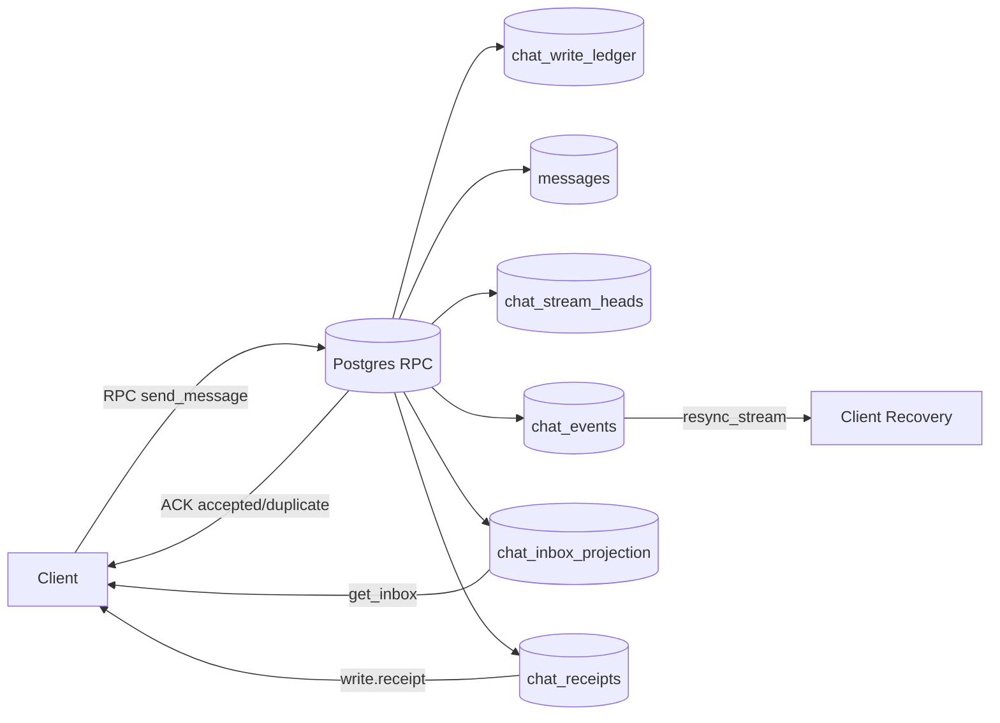

# Chat v1.1 Implementation Graph (Backend + DB)

## Жесткая критика текущего состояния
1. Основная проблема была в data-path: N+1 inbox, неканоничный unread, разрозненные write-path.
2. Отсутствовал durable write contract: ACK не был связан с устойчивой записью в ledger/log.
3. Realtime события не имели формального event-stream базиса (`stream_id/event_seq`), из-за чего невозможна надежная gap recovery.
4. Клиентская устойчивость строилась на polling/локальных костылях вместо server-authoritative receipt и resync.

## Что уже реализовано (старт)
1. DB foundation migration: `supabase/migrations/20260222214000_chat_protocol_v11_mvp_foundation.sql`.
2. Добавлены таблицы: `chat_write_ledger`, `chat_events`, `chat_inbox_projection`, `chat_receipts`, `chat_stream_heads`.
3. Добавлены RPC (security definer):
- `chat_send_message_v11`
- `chat_get_inbox_v11`
- `chat_mark_read_v11`
- `chat_status_write_v11`
- `chat_resync_stream_v11`
4. Добавлены индексы и realtime publication для `chat_events`/`chat_receipts`/`chat_inbox_projection`.

## Архитектурный граф (MVP v1.1)

## Поэтапный план (привязка к backend/DB)

### Phase 1 (уже начато)
- Цель: жесткий foundation в БД.
- Backend/DB:
  1. Ledger + event log + projection + receipts.
  2. RPC на send/inbox/read/status/resync.
- Выход: формальный durable contract для write-path.

### Phase 2
- Цель: включить read-path без N+1 в приложении.
- Backend/DB:
  1. Перевести фронт на `chat_get_inbox_v11`.
  2. Перевести send на `chat_send_message_v11`.
  3. Перевести mark-read на `chat_mark_read_v11`.
- Выход: один inbox-запрос, каноничный unread, receipt-driven completion.

### Phase 3
- Цель: delivery resilience и canary rollout.
- Backend/DB:
  1. Клиентский recovery: `status_write` -> `resync_stream`.
  2. Включить feature flag на протокол v1.1.
  3. Canary 1% -> 10% -> 50% -> 100%.
- Метрики блокировки rollout:
  - `ack_without_receipt_10s_rate`
  - `timeline_duplicate_detected_rate`
  - `read_rollback_detected_rate`

### Phase 4
- Цель: расширение протокола без регрессий.
- Backend/DB:
  1. `edit_message` и revision-conflict contract.
  2. `toggle_reaction` с idempotent op-key.
  3. Snapshot/full-state policy + retention gates.

## Непосредственные улучшения после foundation
1. Ввести два ACK schema на API-слое: message-write и cursor-write.
2. Формализовать policy `403 vs 404` для privacy mapping.
3. Добавить `event_type` в transport envelope на стороне ws-delivery сервиса.
4. Вынести `retry_after_ms` contract в единый middleware для ошибок 429.

## Контроль качества (минимум)
1. Golden trace: duplicate retry -> 1 canonical msg.
2. Golden trace: mark_read multi-device race -> no rollback.
3. Golden trace: ack without immediate event -> recovery via status/resync.
4. Load check: inbox open должен делать 1 RPC, без per-dialog count loops.
