# E2EE + SFU Architecture — Улучшение модуля сквозного шифрования

> **Статус:** Blueprint v1.0  
> **Дата:** 2026-03-03  
> **Scope:** Миграция E2EE chat + calls из текущего состояния в production-grade систему  

---

## Содержание

1. [Архитектура хранения ключей](#1-архитектура-хранения-ключей)
2. [Key Distribution Protocol](#2-key-distribution-protocol)
3. [E2EE для медиапотоков — SFrame](#3-e2ee-для-медиапотоков--sframe)
4. [Улучшенная криптографическая библиотека](#4-улучшенная-криптографическая-библиотека)
5. [Улучшения сигнального канала](#5-улучшения-сигнального-канала)
6. [SFU улучшения](#6-sfu-улучшения)
7. [TURN/ICE улучшения](#7-turnice-улучшения)
8. [Верификация участников](#8-верификация-участников)
9. [Защита метаданных](#9-защита-метаданных)
10. [План миграции](#10-план-миграции)

---

## Обзор критических проблем

| # | Severity | Проблема | Файл | Влияние |
|---|----------|----------|------|---------|
| 1 | 🔴 Critical | Мастер-ключ E2EE в localStorage | `src/hooks/useE2EEncryption.ts:54` | XSS → полный доступ к ключам |
| 2 | 🔴 Critical | Групповой ключ не распространяется | `src/hooks/useE2EEncryption.ts:163` | Одностороннее шифрование |
| 3 | 🔴 Critical | Hardcoded TURN credentials | `reserve/calls/baseline/src/lib/webrtc-config.ts:17` | MITM risk |
| 4 | 🔴 Critical | Нет E2EE для медиастримов | SFU видит audio/video | Перехват медиа |
| 5 | 🟡 Medium | AES-GCM без AAD | `src/lib/chat/e2ee.ts:66` | Ciphertext relocation |
| 6 | 🟡 Medium | In-memory rooms на сервере | `server/sfu/index.mjs:127` | Потеря при рестарте |
| 7 | 🟡 Medium | Join Token replay — process-local | `server/calls-ws/index.mjs:183` | Replay в multi-node |
| 8 | 🟡 Medium | SFrame не enforcement | `server/sfu/index.mjs:15` | env-only toggle |
| 9 | 🟡 Medium | Нет WSS enforcement | `server/calls-ws/index.mjs` | Plaintext signaling |
| 10 | 🟡 Medium | p2p_mode не используется | `src/lib/privacy-security.ts:94` | Не влияет на ICE |
| 11 | 🟡 Medium | Placeholder TURN secrets | `turnserver.prod.conf` | Fail-open TURN |
| 12 | 🟡 Medium | Один mediasoup worker | `server/sfu/mediaPlane.mjs:170` | Bottleneck |
| 13 | 🟡 Medium | Payload типизирован как any | `src/calls-v2/wsClient.ts:182-240` | Type safety gap |

---

## Архитектура верхнего уровня

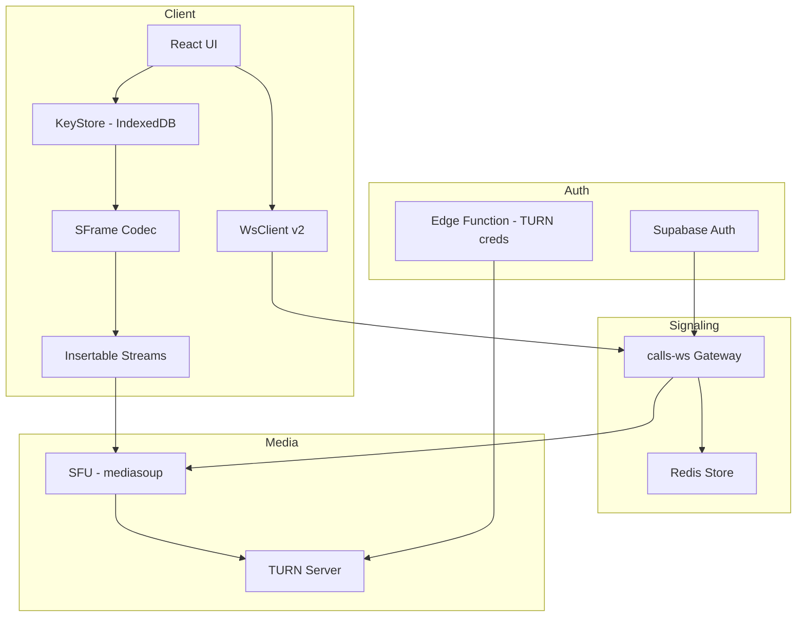

---

## 1. Архитектура хранения ключей

### 1.1. Текущее состояние — проблемы

Текущая реализация в [`useE2EEncryption.ts`](src/hooks/useE2EEncryption.ts:37) хранит:
- **Passphrase** в `localStorage` (`e2ee.passphrase.v1.<userId>`) → строка 54
- **Salt** в `localStorage` (`e2ee.masterSalt.v1.<userId>`) → строка 47
- **Master key** экспортируется в base64 и кладётся в `sessionStorage` → строка 63
- Ключ генерируется через [`generateEncryptionKey()`](src/lib/chat/e2ee.ts:22) с `extractable: true`

**Угроза:** Любой XSS-скрипт читает `localStorage.getItem("e2ee.passphrase.v1.xxx")` и получает полный доступ к расшифровке всех сообщений.

### 1.2. Целевая архитектура — IndexedDB + non-extractable CryptoKey

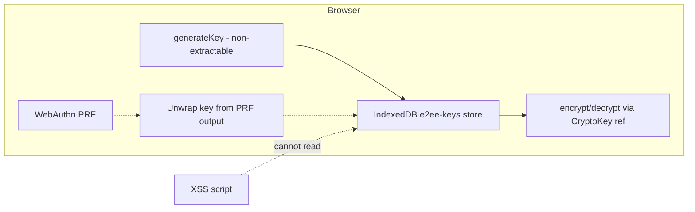

### 1.3. API контракт — KeyStore

**Новый файл:** `src/lib/crypto/keyStore.ts`

```typescript
/** Абстракция над хранилищем ключей */
export interface KeyStore {
  /** Инициализация хранилища */
  init(): Promise<void>;

  /** Генерация нового identity key pair - X25519 */
  generateIdentityKeyPair(): Promise<IdentityKeyPair>;

  /** Получить identity key pair текущего устройства */
  getIdentityKeyPair(): Promise<IdentityKeyPair | null>;

  /** Сохранить мастер-ключ AES-256-GCM - non-extractable */
  storeMasterKey(userId: string, key: CryptoKey): Promise<void>;

  /** Получить мастер-ключ */
  getMasterKey(userId: string): Promise<CryptoKey | null>;

  /** Сохранить групповой ключ для conversation */
  storeGroupKey(
    conversationId: string,
    keyVersion: number,
    key: CryptoKey
  ): Promise<void>;

  /** Получить групповой ключ */
  getGroupKey(
    conversationId: string,
    keyVersion: number
  ): Promise<CryptoKey | null>;

  /** Удалить все ключи для conversation */
  deleteConversationKeys(conversationId: string): Promise<void>;

  /** Полная очистка хранилища */
  wipe(): Promise<void>;
}

export interface IdentityKeyPair {
  publicKey: CryptoKey;   // X25519 public - extractable
  privateKey: CryptoKey;  // X25519 private - non-extractable
  fingerprint: string;    // SHA-256 hash of public key, hex
  createdAt: number;
}
```

**Новый файл:** `src/lib/crypto/indexedDbKeyStore.ts`

```typescript
export interface IndexedDbKeyStoreConfig {
  dbName?: string;       // default: 'e2ee-keys'
  storeName?: string;    // default: 'keys'
  version?: number;      // default: 1
}

/**
 * IndexedDB-based implementation.
 * CryptoKey objects stored directly - browser keeps them non-extractable.
 * No serialization to base64 ever happens.
 */
export class IndexedDbKeyStore implements KeyStore {
  // ...implementation
}
```

### 1.4. WebAuthn PRF — enterprise key unlock

**Новый файл:** `src/lib/crypto/webauthnPrf.ts`

```typescript
export interface WebAuthnPrfConfig {
  rpId: string;
  rpName: string;
}

/**
 * Использует WebAuthn PRF extension для деривации ключа
 * из FIDO2 ответа. Позволяет привязать разблокировку
 * мастер-ключа к физическому аутентификатору.
 */
export async function deriveKeyFromWebAuthnPrf(
  credentialId: BufferSource,
  prfSalt: Uint8Array
): Promise<CryptoKey>;

export async function isWebAuthnPrfSupported(): Promise<boolean>;
```

### 1.5. Key Lifecycle

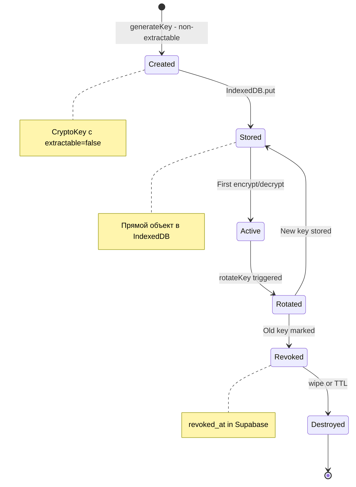

### 1.6. Файлы для создания/изменения

| Действие | Файл | Описание |
|----------|------|----------|
| CREATE | `src/lib/crypto/keyStore.ts` | Интерфейс KeyStore |
| CREATE | `src/lib/crypto/indexedDbKeyStore.ts` | IndexedDB реализация |
| CREATE | `src/lib/crypto/webauthnPrf.ts` | WebAuthn PRF helper |
| MODIFY | `src/hooks/useE2EEncryption.ts` | Заменить localStorage на KeyStore |
| MODIFY | `src/lib/chat/e2ee.ts` | extractable: false для generateKey |
| DELETE | — | Удалить все localStorage passphrase/salt обращения |

---

## 2. Key Distribution Protocol

### 2.1. Проблема

Текущий [`enableEncryption()`](src/hooks/useE2EEncryption.ts:163) создаёт групповой ключ и сохраняет его **только для текущего пользователя** (строки 174-187). Другие участники conversation не получают ключ — шифрование одностороннее.

### 2.2. Протокол X25519 Key Agreement

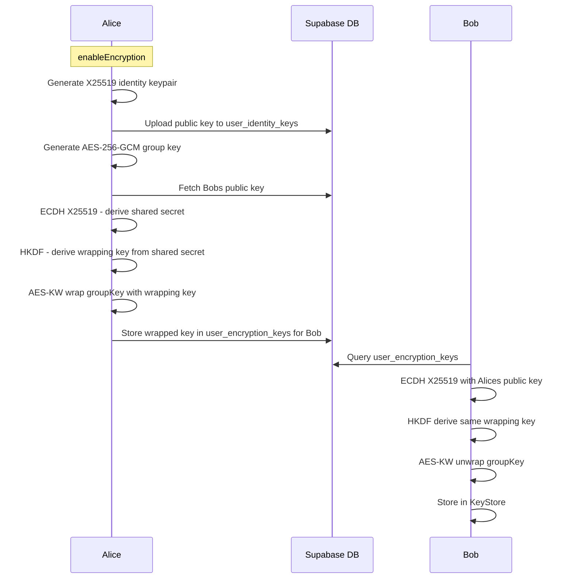

### 2.3. API контракт — Key Distribution

**Новый файл:** `src/lib/crypto/keyDistribution.ts`

```typescript
export interface KeyPackagePayload {
  /** Conversation ID */
  conversationId: string;
  /** Key version */
  keyVersion: number;
  /** Sender device ID */
  senderDeviceId: string;
  /** Sender X25519 ephemeral public key - base64 */
  ephemeralPublicKey: string;
  /** Wrapped group key per recipient: Map of userId to wrapped key base64 */
  wrappedKeys: Record<string, string>;
  /** HKDF info context */
  hkdfInfo: string;
  /** Timestamp */
  createdAt: number;
}

export interface KeyDistributionService {
  /**
   * Distribute group key to all conversation participants.
   * For each participant:
   * 1. Fetch their identity public key
   * 2. Perform X25519 ECDH
   * 3. HKDF derive wrapping key
   * 4. AES-KW wrap group key
   * 5. Store wrapped key in user_encryption_keys
   */
  distributeGroupKey(
    conversationId: string,
    groupKey: CryptoKey,
    keyVersion: number,
    participants: ParticipantPublicKey[]
  ): Promise<void>;

  /**
   * Receive and unwrap a group key distributed to us.
   */
  receiveGroupKey(
    keyPackage: KeyPackagePayload,
    myIdentityKeyPair: IdentityKeyPair
  ): Promise<CryptoKey>;

  /**
   * Handle participant join: re-wrap current group key for new member.
   */
  onParticipantJoined(
    conversationId: string,
    newParticipant: ParticipantPublicKey,
    currentGroupKey: CryptoKey,
    currentKeyVersion: number
  ): Promise<void>;

  /**
   * Handle participant leave: rotate group key, distribute to remaining.
   * This provides post-compromise security.
   */
  onParticipantLeft(
    conversationId: string,
    remainingParticipants: ParticipantPublicKey[]
  ): Promise<{ newGroupKey: CryptoKey; newKeyVersion: number }>;
}

export interface ParticipantPublicKey {
  userId: string;
  deviceId: string;
  identityPublicKey: string; // base64 X25519 public key
}
```

### 2.4. Post-compromise Security — Participant Leave

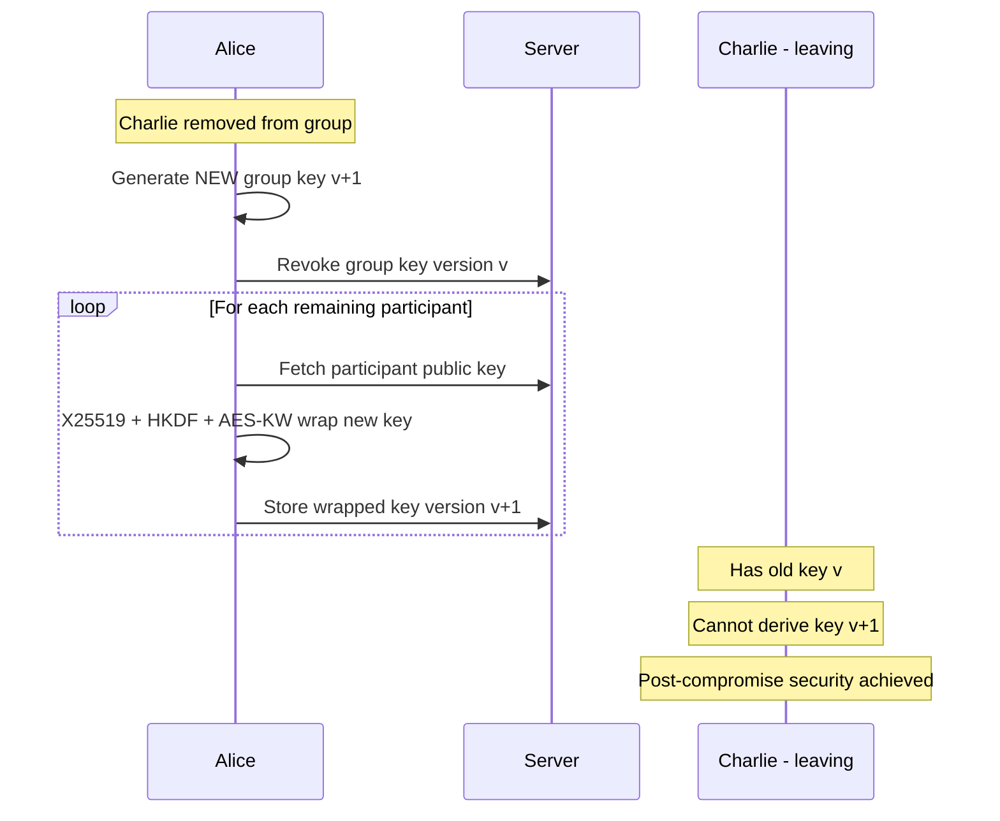

### 2.5. Key Transparency Log

**Новый файл:** `src/lib/crypto/keyTransparencyLog.ts`

```typescript
export interface KeyTransparencyEntry {
  conversationId: string;
  keyVersion: number;
  action: 'created' | 'distributed' | 'rotated' | 'revoked';
  initiatorUserId: string;
  participantCount: number;
  timestamp: number;
  /** SHA-256 hash of the group key commitment */
  keyCommitment: string;
}

export interface KeyTransparencyLog {
  /** Append an entry to the log */
  append(entry: KeyTransparencyEntry): Promise<void>;

  /** Query log for a conversation */
  query(conversationId: string, fromVersion?: number): Promise<KeyTransparencyEntry[]>;

  /** Verify log chain integrity */
  verify(conversationId: string): Promise<boolean>;
}
```

### 2.6. Файлы для создания/изменения

| Действие | Файл | Описание |
|----------|------|----------|
| CREATE | `src/lib/crypto/keyDistribution.ts` | Интерфейс + KD protocol |
| CREATE | `src/lib/crypto/x25519.ts` | X25519 ECDH + HKDF helpers |
| CREATE | `src/lib/crypto/keyTransparencyLog.ts` | Append-only audit log |
| MODIFY | `src/hooks/useE2EEncryption.ts` | Integrate KeyDistribution в enableEncryption/rotateKey |
| CREATE | `supabase/migrations/xxx_user_identity_keys.sql` | Таблица для публичных ключей |

---

## 3. E2EE для медиапотоков — SFrame

### 3.1. Проблема

Текущий SFU в [`server/sfu/index.mjs`](server/sfu/index.mjs:1) передаёт медиапотоки через mediasoup. SFU видит все аудио/видео фреймы в открытом виде. Переменная `requireSFrame` (строка 15) задаётся через env и не enforcement на уровне медиа — нет клиентского SFrame codec.

### 3.2. Insertable Streams + SFrame Pipeline

```mermaid
graph LR
    subgraph Sender
        MIC[Microphone/Camera] --> ENC[MediaStreamTrack]
        ENC --> IS_ENC[Insertable Streams - TransformStream]
        IS_ENC --> SFRAME_ENC[SFrame Encrypt]
        SFRAME_ENC --> RTP[RTP to mediasoup]
    end

    subgraph SFU
        RTP --> ROUTER[mediasoup Router]
        ROUTER --> FWD[Forward opaque payload]
    end

    subgraph Receiver
        FWD --> IS_DEC[Insertable Streams - TransformStream]
        IS_DEC --> SFRAME_DEC[SFrame Decrypt]
        SFRAME_DEC --> PLAY[Audio/Video Element]
    end

    style SFRAME_ENC fill:#2d5016,color:#fff
    style SFRAME_DEC fill:#2d5016,color:#fff
    style ROUTER fill:#666,color:#fff
```

### 3.3. SFrame Format

```
 0                   1                   2                   3
 0 1 2 3 4 5 6 7 8 9 0 1 2 3 4 5 6 7 8 9 0 1 2 3 4 5 6 7 8 9 0 1
+-+-+-+-+-+-+-+-+-+-+-+-+-+-+-+-+-+-+-+-+-+-+-+-+-+-+-+-+-+-+-+-+
|X|  KID_LEN  |  CTR_LEN  |   KID ...  (variable)             |
+-+-+-+-+-+-+-+-+-+-+-+-+-+-+-+-+-+-+-+-+-+-+-+-+-+-+-+-+-+-+-+-+
|   CTR ...  (variable)         |                               |
+-+-+-+-+-+-+-+-+-+-+-+-+-+-+-+-+                               |
|                     Encrypted Payload                         |
|                                                               |
+-+-+-+-+-+-+-+-+-+-+-+-+-+-+-+-+-+-+-+-+-+-+-+-+-+-+-+-+-+-+-+-+
|                     Authentication Tag (16 bytes)              |
+-+-+-+-+-+-+-+-+-+-+-+-+-+-+-+-+-+-+-+-+-+-+-+-+-+-+-+-+-+-+-+-+

X:        Extended flag
KID_LEN:  Key ID length
CTR_LEN:  Counter length  
KID:      Key ID - maps to epoch + participant
CTR:      Frame counter - monotonic per sender
```

### 3.4. API контракт — SFrame Codec

**Новый файл:** `src/lib/crypto/sframe.ts`

```typescript
export interface SFrameConfig {
  /** Current epoch */
  epoch: number;
  /** Sender key ID - derived from deviceId */
  senderKeyId: number;
  /** Cipher suite */
  cipherSuite: 'AES_128_GCM' | 'AES_256_GCM';
}

export interface SFrameCodec {
  /** Initialize codec with sender key */
  init(config: SFrameConfig, senderKey: CryptoKey): Promise<void>;

  /** Add a receiver key for a participant */
  addReceiverKey(keyId: number, key: CryptoKey): Promise<void>;

  /** Remove a receiver key */
  removeReceiverKey(keyId: number): Promise<void>;

  /** Encrypt a media frame */
  encrypt(frame: RTCEncodedVideoFrame | RTCEncodedAudioFrame): Promise<ArrayBuffer>;

  /** Decrypt a media frame */
  decrypt(frame: RTCEncodedVideoFrame | RTCEncodedAudioFrame): Promise<ArrayBuffer>;

  /** Update sender key for new epoch */
  ratchetSenderKey(newEpoch: number, newKey: CryptoKey): Promise<void>;

  /** Get current frame counter - for anti-replay */
  getFrameCounter(): bigint;
}

export interface SFrameHeader {
  keyId: number;
  counter: bigint;
  headerLength: number;
}

/** Parse SFrame header without decrypting payload */
export function parseSFrameHeader(data: ArrayBuffer): SFrameHeader;

/** Create SFrame TransformStream for Insertable Streams API */
export function createSFrameEncryptTransform(
  codec: SFrameCodec
): TransformStream;

export function createSFrameDecryptTransform(
  codec: SFrameCodec
): TransformStream;
```

### 3.5. Epoch-based Key Rotation + Ratchet

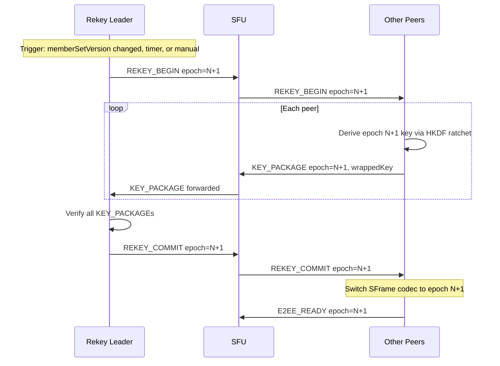

### 3.6. Key Ratchet Mechanism

**Новый файл:** `src/lib/crypto/keyRatchet.ts`

```typescript
export interface KeyRatchet {
  /**
   * Derive next epoch key from current key.
   * Uses HKDF with epoch number as info.
   * 
   * newKey = HKDF-SHA256(
   *   ikm: currentKey,
   *   salt: epochBytes,
   *   info: "sframe-epoch-ratchet" || conversationId
   * )
   */
  ratchet(
    currentKey: CryptoKey,
    epoch: number,
    conversationId: string
  ): Promise<CryptoKey>;

  /**
   * Derive sender-specific key from epoch key.
   * Each participant gets a unique sender key.
   */
  deriveSenderKey(
    epochKey: CryptoKey,
    senderKeyId: number
  ): Promise<CryptoKey>;
}
```

### 3.7. Интеграция с mediasoup

**Новый файл:** `src/calls-v2/sframeTransformManager.ts`

```typescript
export interface SFrameTransformManager {
  /**
   * Attach SFrame encryption to a sender RTCRtpSender.
   * Uses RTCRtpScriptTransform or createEncodedStreams fallback.
   */
  attachSenderTransform(
    sender: RTCRtpSender,
    codec: SFrameCodec
  ): Promise<void>;

  /**
   * Attach SFrame decryption to a receiver RTCRtpReceiver.
   */
  attachReceiverTransform(
    receiver: RTCRtpReceiver,
    codec: SFrameCodec
  ): Promise<void>;

  /**
   * Handle epoch transition: swap keys without glitch.
   */
  handleEpochTransition(newEpoch: number, newKey: CryptoKey): Promise<void>;

  /** Detach all transforms on cleanup */
  detachAll(): void;
}
```

### 3.8. Файлы для создания/изменения

| Действие | Файл | Описание |
|----------|------|----------|
| CREATE | `src/lib/crypto/sframe.ts` | SFrame codec core |
| CREATE | `src/lib/crypto/keyRatchet.ts` | HKDF epoch ratchet |
| CREATE | `src/calls-v2/sframeTransformManager.ts` | Insertable Streams integration |
| CREATE | `src/calls-v2/workers/sframeWorker.ts` | Web Worker для тяжёлых crypto ops |
| MODIFY | `server/sfu/index.mjs` | Enforce SFrame header validation |
| MODIFY | `src/calls-v2/wsClient.ts` | Integrate rekey flow |

---

## 4. Улучшенная криптографическая библиотека

### 4.1. AAD — Additional Authenticated Data

**Проблема:** Текущий [`encryptMessage()`](src/lib/chat/e2ee.ts:59) не использует AAD. Ciphertext можно перенести из одного контекста в другой без обнаружения.

**Решение:**

**Модификация файла:** `src/lib/chat/e2ee.ts`

```typescript
export interface EncryptOptions {
  /** Conversation ID - привязка к контексту */
  conversationId: string;
  /** Key version */
  keyVersion: number;
  /** Message ID - optional, для уникальности */
  messageId?: string;
}

/**
 * Builds AAD bytes from context parameters.
 * AAD = SHA-256( "e2ee-v1" || conversationId || keyVersion || messageId? )
 * 
 * Prevents ciphertext relocation between conversations.
 */
export function buildAAD(opts: EncryptOptions): Uint8Array;

/**
 * Encrypt with AAD context binding.
 */
export async function encryptMessageV2(
  plaintext: string,
  key: CryptoKey,
  aad: EncryptOptions
): Promise<EncryptedPayloadV2>;

export interface EncryptedPayloadV2 {
  version: 2;
  ciphertext: string;  // base64
  iv: string;          // base64, 12 bytes
  aad: string;         // base64, AAD bytes
  keyVersion: number;
  conversationId: string;
}
```

### 4.2. Anti-Replay Protection — Nonce Management

**Новый файл:** `src/lib/crypto/nonceManager.ts`

```typescript
export interface NonceManager {
  /**
   * Generate a unique 12-byte nonce.
   * Uses a combination of:
   * - 4 bytes: timestamp
   * - 4 bytes: counter (monotonic)
   * - 4 bytes: random
   * 
   * Ensures no nonce reuse even under race conditions.
   */
  generateNonce(): Uint8Array;

  /**
   * Validate received nonce has not been seen.
   * Uses a sliding window + bloom filter.
   */
  validateNonce(nonce: Uint8Array): boolean;

  /**
   * Get current counter value for persistence.
   */
  getCounter(): number;
}
```

### 4.3. Key Verification — Safety Numbers

**Новый файл:** `src/lib/crypto/safetyNumbers.ts`

```typescript
export interface SafetyNumberConfig {
  /** Our identity public key */
  localPublicKey: CryptoKey;
  /** Remote identity public key */
  remotePublicKey: CryptoKey;
  /** Our user ID */
  localUserId: string;
  /** Remote user ID */
  remoteUserId: string;
}

/**
 * Generate a safety number from two identity keys.
 * Algorithm:
 *   hash = SHA-512( sort(fingerprint_a, fingerprint_b) )
 *   safety_number = encode_as_numeric_groups(hash)
 * 
 * Returns 60-digit number in groups of 5.
 * E.g. "12345 67890 12345 67890 12345 67890 12345 67890 12345 67890 12345 67890"
 */
export async function generateSafetyNumber(
  config: SafetyNumberConfig
): Promise<string>;

/**
 * Generate emoji hash - 6 emojis derived from the safety number.
 * More human-friendly for quick visual comparison.
 */
export async function generateEmojiHash(
  config: SafetyNumberConfig
): Promise<string[]>;

/**
 * Generate QR code payload for out-of-band verification.
 * Contains both public key fingerprints.
 */
export function generateVerificationQrPayload(
  config: SafetyNumberConfig
): Uint8Array;

/**
 * Verify a scanned QR code payload.
 */
export function verifyQrPayload(
  payload: Uint8Array,
  config: SafetyNumberConfig
): boolean;
```

### 4.4. Post-Quantum Key Exchange — X-Wing / ML-KEM Hybrid

**Новый файл:** `src/lib/crypto/postQuantum.ts`

```typescript
/**
 * Hybrid key exchange combining:
 * - X25519 (classical ECDH)
 * - ML-KEM-768 (post-quantum KEM, NIST FIPS 203)
 * 
 * Combined shared secret = HKDF-SHA256(
 *   ikm: x25519_shared || mlkem_shared,
 *   info: "x-wing-v1"
 * )
 * 
 * Note: ML-KEM requires a WASM or JS polyfill until
 * WebCrypto natively supports it.
 */
export interface HybridKeyExchange {
  /** Generate hybrid keypair */
  generateKeyPair(): Promise<HybridKeyPair>;

  /** Encapsulate: create ciphertext + shared secret */
  encapsulate(
    remotePublicKey: HybridPublicKey
  ): Promise<{ ciphertext: Uint8Array; sharedSecret: CryptoKey }>;

  /** Decapsulate: recover shared secret from ciphertext */
  decapsulate(
    ciphertext: Uint8Array,
    myKeyPair: HybridKeyPair
  ): Promise<CryptoKey>;

  /** Check if ML-KEM is available */
  isPostQuantumAvailable(): boolean;
}

export interface HybridKeyPair {
  x25519: CryptoKeyPair;
  mlkem: { publicKey: Uint8Array; secretKey: Uint8Array } | null;
}

export interface HybridPublicKey {
  x25519: CryptoKey;
  mlkem: Uint8Array | null;
}
```

### 4.5. SFrame Codec для медиа

Описан в [разделе 3.4](#34-api-контракт--sframe-codec).

### 4.6. Файлы для создания/изменения

| Действие | Файл | Описание |
|----------|------|----------|
| MODIFY | `src/lib/chat/e2ee.ts` | Добавить AAD, encryptMessageV2, extractable: false |
| CREATE | `src/lib/crypto/nonceManager.ts` | Nonce generation + sliding window |
| CREATE | `src/lib/crypto/safetyNumbers.ts` | Safety numbers + emoji hash |
| CREATE | `src/lib/crypto/postQuantum.ts` | X-Wing hybrid KE |
| CREATE | `src/lib/crypto/index.ts` | Re-export barrel |

---

## 5. Улучшения сигнального канала

### 5.1. WSS Enforcement

**Проблема:** Текущий [`server/calls-ws/index.mjs`](server/calls-ws/index.mjs:275) создаёт HTTP-сервер без TLS. В production signaling идёт по ws:// вместо wss://.

**Решение:**

**Модификация файла:** `server/calls-ws/index.mjs`

```javascript
// Добавить upgrade check
wss.on("connection", (ws, req) => {
  // Enforce WSS in production
  if (IS_PROD_LIKE) {
    const proto = req.headers["x-forwarded-proto"];
    if (proto !== "https" && proto !== "wss") {
      ws.close(4403, "WSS_REQUIRED");
      return;
    }
  }
  // ... existing logic
});
```

### 5.2. Строгая типизация payload

**Проблема:** Все методы [`CallsWsClient`](src/calls-v2/wsClient.ts:182) принимают `payload: any`.

**Решение:**

**Модификация файла:** `src/calls-v2/types.ts`

```typescript
// ─── Строго типизированные payload ──────────────────────────

export interface HelloPayload {
  client: {
    deviceId: string;
    platform: 'web' | 'ios' | 'android';
    version: string;
    capabilities: string[];
  };
}

export interface AuthPayload {
  accessToken: string;
}

export interface E2EECapsPayload {
  insertableStreams: boolean;
  sframe: boolean;
  sframeCipherSuite?: 'AES_128_GCM' | 'AES_256_GCM';
}

export interface RoomCreatePayload {
  preferredRegion?: string;
  callId?: string;
  e2eeRequired?: boolean;
}

export interface RoomJoinPayload {
  roomId: string;
  callId?: string;
  deviceId?: string;
  joinToken?: string;
  preferredRegion?: string;
  rtpCapabilities?: RTCRtpCapabilities;
}

export interface TransportCreatePayload {
  roomId: string;
  direction: 'send' | 'recv';
}

export interface TransportConnectPayload {
  roomId: string;
  transportId: string;
  dtlsParameters: DtlsParameters;
}

export interface ProducePayload {
  roomId: string;
  transportId: string;
  kind: 'audio' | 'video';
  rtpParameters: RtpParameters;
}

export interface ConsumePayload {
  roomId: string;
  producerId: string;
  rtpCapabilities: RtpCapabilities;
}

export interface RekeyBeginPayload {
  roomId: string;
  epoch: number;
  reason: 'member_join' | 'member_leave' | 'scheduled' | 'manual';
}

export interface RekeyCommitPayload {
  roomId: string;
  epoch: number;
}

export interface KeyPackagePayload {
  roomId: string;
  epoch: number;
  senderDeviceId: string;
  wrappedKeyData: string; // base64
}

export interface KeyAckPayload {
  roomId: string;
  epoch: number;
  deviceId: string;
}

// ─── Типизированный envelope ────────────────────────────────

export type TypedWsEnvelope =
  | WsEnvelopeV1<HelloPayload> & { type: 'HELLO' }
  | WsEnvelopeV1<AuthPayload> & { type: 'AUTH' }
  | WsEnvelopeV1<E2EECapsPayload> & { type: 'E2EE_CAPS' }
  | WsEnvelopeV1<RoomCreatePayload> & { type: 'ROOM_CREATE' }
  | WsEnvelopeV1<RoomJoinPayload> & { type: 'ROOM_JOIN' }
  | WsEnvelopeV1<TransportCreatePayload> & { type: 'TRANSPORT_CREATE' }
  | WsEnvelopeV1<TransportConnectPayload> & { type: 'TRANSPORT_CONNECT' }
  | WsEnvelopeV1<ProducePayload> & { type: 'PRODUCE' }
  | WsEnvelopeV1<ConsumePayload> & { type: 'CONSUME' }
  | WsEnvelopeV1<RekeyBeginPayload> & { type: 'REKEY_BEGIN' }
  | WsEnvelopeV1<RekeyCommitPayload> & { type: 'REKEY_COMMIT' }
  | WsEnvelopeV1<KeyPackagePayload> & { type: 'KEY_PACKAGE' }
  | WsEnvelopeV1<KeyAckPayload> & { type: 'KEY_ACK' };
```

**Модификация файла:** `src/calls-v2/wsClient.ts`

```typescript
// Заменить все any на строгие типы
async hello(payload: HelloPayload) { ... }
async auth(auth: CallsWsAuth) { ... }
async e2eeCaps(payload: E2EECapsPayload) { ... }
async roomCreate(payload: RoomCreatePayload) { ... }
async roomJoin(payload: RoomJoinPayload) { ... }
async transportCreate(payload: TransportCreatePayload) { ... }
async transportConnect(payload: TransportConnectPayload) { ... }
async produce(payload: ProducePayload) { ... }
async consume(payload: ConsumePayload) { ... }
async rekeyBegin(payload: RekeyBeginPayload) { ... }
async rekeyCommit(payload: RekeyCommitPayload) { ... }
async keyPackage(payload: KeyPackagePayload) { ... }
async keyAck(payload: KeyAckPayload) { ... }
```

### 5.3. Distributed Join Token Replay Protection

**Проблема:** [`usedJoinTokenJtis`](server/calls-ws/index.mjs:88) — process-local `Map`. В multi-node deployment replay невозможно обнаружить.

**Решение:**

**Модификация файла:** `server/calls-ws/store/redisStore.mjs`

```javascript
// Добавить методы в Redis store
async function consumeJoinToken(jti, expSec) {
  // SET NX with TTL - atomic one-time token consumption
  const key = `jt:${jti}`;
  const result = await redis.set(key, "1", "EX", expSec, "NX");
  return result === "OK"; // true = first use, false = replay
}
```

**Модификация файла:** `server/calls-ws/index.mjs`

```javascript
// Заменить usedJoinTokenJtis.has() на store.consumeJoinToken()
if (store.features.joinTokenReplay) {
  const isFirstUse = await store.consumeJoinToken(payload.jti, CALLS_JOIN_TOKEN_TTL_SEC);
  if (!isFirstUse) return null; // replay detected
} else {
  // Fallback to process-local
  if (usedJoinTokenJtis.has(payload.jti)) return null;
  usedJoinTokenJtis.set(payload.jti, expMs);
}
```

### 5.4. Rate Limiting для KEY_PACKAGE

**Новый файл:** `server/calls-ws/rateLimit.mjs`

```javascript
/**
 * Sliding window rate limiter.
 * KEY_PACKAGE: max 10 per device per 60 sec
 * REKEY_BEGIN: max 3 per room per 60 sec
 * AUTH: max 5 per IP per 60 sec
 */
export function createRateLimiter(store) {
  return {
    async check(key, maxRequests, windowSec) {
      // Redis INCR + EXPIRE pattern
    }
  };
}
```

### 5.5. Файлы для создания/изменения

| Действие | Файл | Описание |
|----------|------|----------|
| MODIFY | `server/calls-ws/index.mjs` | WSS enforcement, distributed replay |
| MODIFY | `src/calls-v2/types.ts` | Строгие типы для всех payload |
| MODIFY | `src/calls-v2/wsClient.ts` | Типизация методов |
| MODIFY | `server/calls-ws/store/redisStore.mjs` | consumeJoinToken |
| CREATE | `server/calls-ws/rateLimit.mjs` | Rate limiter |
| MODIFY | `server/calls-ws/store/index.mjs` | Добавить joinTokenReplay feature flag |

---

## 6. SFU улучшения

### 6.1. SFrame Content Inspection — Header-only

**Проблема:** SFU должен уметь инспектировать SFrame header для маршрутизации, но никогда не должен видеть payload.

**Модификация файла:** `server/sfu/index.mjs`

```javascript
/**
 * Parse SFrame header for routing purposes only.
 * Never touches encrypted payload.
 */
function parseSFrameHeaderOnly(rtpPayload) {
  const view = new DataView(rtpPayload.buffer);
  const firstByte = view.getUint8(0);
  const extended = (firstByte & 0x80) !== 0;
  const kidLen = (firstByte >> 4) & 0x07;
  const ctrLen = firstByte & 0x0F;
  
  let offset = 1;
  let keyId = 0;
  for (let i = 0; i < kidLen; i++) {
    keyId = (keyId << 8) | view.getUint8(offset++);
  }
  
  let counter = 0n;
  for (let i = 0; i < ctrLen; i++) {
    counter = (counter << 8n) | BigInt(view.getUint8(offset++));
  }
  
  return { keyId, counter, headerLength: offset };
}
```

### 6.2. Multi-worker mediasoup

**Проблема:** Текущий [`createMediasoupController()`](server/sfu/mediaPlane.mjs:168) создаёт только один worker (строка 170).

**Решение:**

**Модификация файла:** `server/sfu/mediaPlane.mjs`

```javascript
async function createMediasoupController() {
  const numWorkers = Number(process.env.SFU_WORKERS ?? 0) || 
                     Math.max(1, require('os').cpus().length - 1);
  
  const workers = [];
  for (let i = 0; i < numWorkers; i++) {
    const worker = await mediasoup.createWorker({
      rtcMinPort: 40000 + (i * 2000),
      rtcMaxPort: 40000 + (i * 2000) + 1999,
      logLevel: process.env.SFU_MEDIASOUP_LOG_LEVEL ?? "warn",
    });
    workers.push(worker);
  }
  
  let nextWorkerIdx = 0;
  function getNextWorker() {
    const worker = workers[nextWorkerIdx % workers.length];
    nextWorkerIdx++;
    return worker;
  }
  
  // Use round-robin worker selection per room
  async function ensureRouter(roomId) {
    const room = ensureRoom(roomId);
    if (room.router) return room.router;
    const worker = getNextWorker();
    room.router = await worker.createRouter({ mediaCodecs: DEFAULT_MEDIA_CODECS });
    return room.router;
  }
  
  // ... rest stays the same
}
```

### 6.3. Persistent Rooms — Redis-backed

**Проблема:** [`rooms`](server/sfu/index.mjs:127) — in-memory Map. При рестарте SFU все rooms теряются.

**Решение:**

**Новый файл:** `server/sfu/roomStore.mjs`

```javascript
/**
 * Room state persistence.
 * 
 * Active media state (transports, producers, consumers) cannot be
 * persisted — mediasoup objects are in-process.
 * 
 * What CAN be persisted:
 * - Room metadata: roomId, callId, epoch, memberSetVersion
 * - Peer list: who was in the room
 * - E2EE state: current epoch, policy
 * 
 * On restart, peers receive ROOM_MIGRATE with new SFU node info
 * and must re-join + re-establish transports.
 */
export function createRoomStore(redisClient) {
  return {
    async saveRoom(roomId, metadata) { ... },
    async loadRoom(roomId) { ... },
    async deleteRoom(roomId) { ... },
    async listActiveRooms() { ... },
    async savePeerList(roomId, peers) { ... },
    async getPeerList(roomId) { ... },
  };
}
```

### 6.4. Graceful Degradation

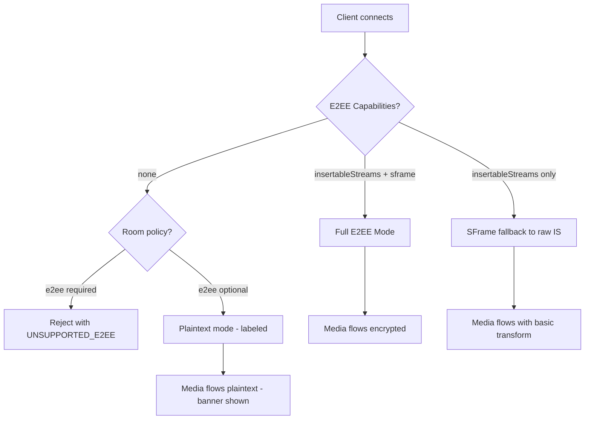

### 6.5. Файлы для создания/изменения

| Действие | Файл | Описание |
|----------|------|----------|
| MODIFY | `server/sfu/index.mjs` | SFrame header parsing, graceful degradation |
| MODIFY | `server/sfu/mediaPlane.mjs` | Multi-worker support |
| CREATE | `server/sfu/roomStore.mjs` | Redis-backed room persistence |
| CREATE | `server/sfu/sframeInspector.mjs` | SFrame header parser |
| MODIFY | `server/sfu/index.mjs` | Integrate roomStore |

---

## 7. TURN/ICE улучшения

### 7.1. Удаление hardcoded credentials

**Проблема:** [`webrtc-config.ts`](reserve/calls/baseline/src/lib/webrtc-config.ts:17) содержит `openrelayproject:openrelayproject` — публичные credentials.

**Решение:** Полностью убрать `FALLBACK_ICE_SERVERS` с TURN credentials. Оставить только STUN.

### 7.2. Динамические short-lived credentials

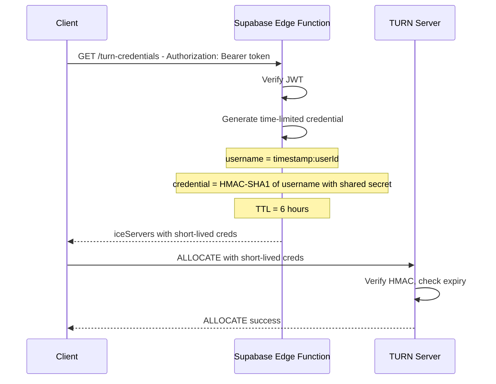

**Модификация файла:** `reserve/calls/baseline/src/lib/webrtc-config.ts`

```typescript
const FALLBACK_ICE_SERVERS: RTCIceServer[] = [
  // STUN only — no hardcoded TURN credentials
  { urls: "stun:stun.l.google.com:19302" },
  { urls: "stun:stun1.l.google.com:19302" },
];

// TURN credentials MUST come from edge function
// Never embed credentials in client code
```

### 7.3. Интеграция p2p_mode

**Проблема:** [`privacy-security.ts`](src/lib/privacy-security.ts:94) определяет `p2p_mode: "always" | "contacts" | "never"`, но [`webrtc-config.ts`](reserve/calls/baseline/src/lib/webrtc-config.ts:72) его не использует.

**Решение:**

**Новый файл:** `src/calls-v2/iceConfigResolver.ts`

```typescript
import type { PrivacyP2PMode } from "@/lib/privacy-security";

export interface IceConfigResolverOptions {
  /** Users p2p_mode setting */
  p2pMode: PrivacyP2PMode;
  /** Is current peer in contacts? */
  isPeerContact: boolean;
  /** Force relay for sensitive calls */
  forceRelay?: boolean;
}

export interface ResolvedIceConfig {
  iceServers: RTCIceServer[];
  iceTransportPolicy: RTCIceTransportPolicy;
  iceCandidatePoolSize: number;
}

/**
 * Resolve ICE configuration based on privacy settings.
 * 
 * p2p_mode mapping:
 * - "always"   → iceTransportPolicy: "all"
 * - "contacts" → isPeerContact ? "all" : "relay"
 * - "never"    → iceTransportPolicy: "relay"
 */
export async function resolveIceConfig(
  opts: IceConfigResolverOptions
): Promise<ResolvedIceConfig>;
```

### 7.4. ICE Candidate Filtering для Privacy

**Новый файл:** `src/calls-v2/iceCandidateFilter.ts`

```typescript
/**
 * Filter ICE candidates to prevent IP leakage.
 * 
 * When p2p_mode is "never" or forceRelay:
 * - Strip all host candidates
 * - Strip all srflx candidates  
 * - Allow only relay candidates
 * 
 * When p2p_mode is "contacts" and not contact:
 * - Same as "never"
 */
export function filterIceCandidate(
  candidate: RTCIceCandidate,
  policy: RTCIceTransportPolicy
): RTCIceCandidate | null;

/**
 * Monitor and filter ICE candidates on a peer connection.
 */
export function attachIceCandidateFilter(
  pc: RTCPeerConnection,
  policy: RTCIceTransportPolicy
): void;
```

### 7.5. Файлы для создания/изменения

| Действие | Файл | Описание |
|----------|------|----------|
| MODIFY | `reserve/calls/baseline/src/lib/webrtc-config.ts` | Remove hardcoded TURN |
| CREATE | `src/calls-v2/iceConfigResolver.ts` | p2p_mode integration |
| CREATE | `src/calls-v2/iceCandidateFilter.ts` | ICE candidate privacy filter |
| CREATE | `supabase/functions/turn-credentials/index.ts` | Edge function для TURN creds |
| MODIFY | `server/calls-ws/index.mjs` | Перестать выдавать TURN URLs без creds |

---

## 8. Верификация участников

### 8.1. Safety Numbers

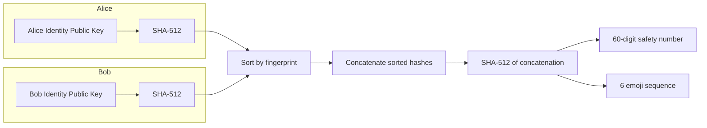

### 8.2. QR-code Verification Flow

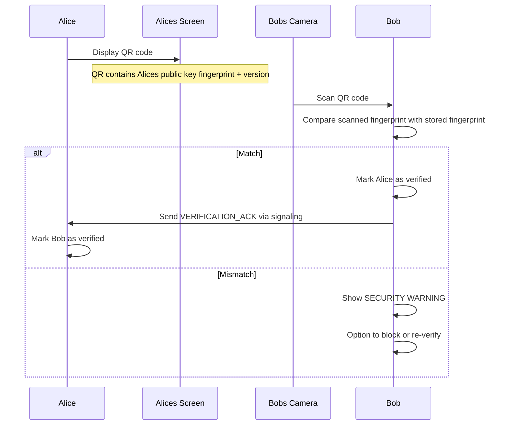

### 8.3. Key Change Notifications

**Новый файл:** `src/lib/crypto/trustManager.ts`

```typescript
export type TrustLevel = 
  | 'unknown'      // First contact, no verification
  | 'tofu'         // Trust-on-first-use, not manually verified 
  | 'verified'     // Manually verified via QR/safety number
  | 'compromised'; // Key changed after verification

export interface TrustManager {
  /** Get trust level for a remote user */
  getTrustLevel(userId: string): Promise<TrustLevel>;

  /** Store first-seen identity key - TOFU */
  trustOnFirstUse(
    userId: string, 
    identityPublicKey: CryptoKey
  ): Promise<void>;

  /** Mark user as manually verified */
  markVerified(userId: string): Promise<void>;

  /** Handle identity key change */
  onIdentityKeyChanged(
    userId: string, 
    newPublicKey: CryptoKey
  ): Promise<KeyChangeEvent>;

  /** List all trusted identities */
  listTrustedIdentities(): Promise<TrustedIdentity[]>;
}

export interface KeyChangeEvent {
  userId: string;
  previousTrustLevel: TrustLevel;
  newTrustLevel: TrustLevel;
  /** true if key changed after being verified — high severity */
  wasVerified: boolean;
  timestamp: number;
}

export interface TrustedIdentity {
  userId: string;
  publicKeyFingerprint: string;
  trustLevel: TrustLevel;
  firstSeenAt: number;
  verifiedAt: number | null;
  lastKeyChangeAt: number | null;
}
```

### 8.4. TOFU Model

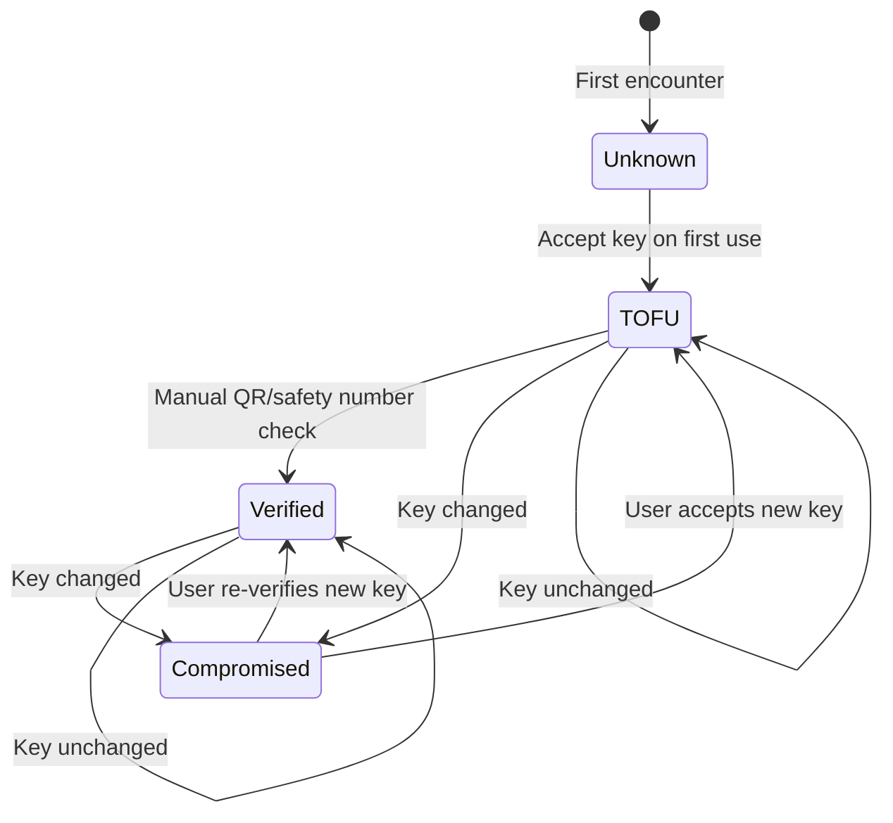

### 8.5. Файлы для создания/изменения

| Действие | Файл | Описание |
|----------|------|----------|
| CREATE | `src/lib/crypto/trustManager.ts` | Trust level management |
| CREATE | `src/lib/crypto/safetyNumbers.ts` | Safety number generation |
| CREATE | `src/components/e2ee/SafetyNumberDialog.tsx` | UI для safety numbers |
| CREATE | `src/components/e2ee/QrVerification.tsx` | QR verification UI |
| CREATE | `src/components/e2ee/KeyChangeAlert.tsx` | Key change warning |
| CREATE | `src/hooks/useTrustManager.ts` | React hook для trust |

---

## 9. Защита метаданных

### 9.1. Sealed Sender

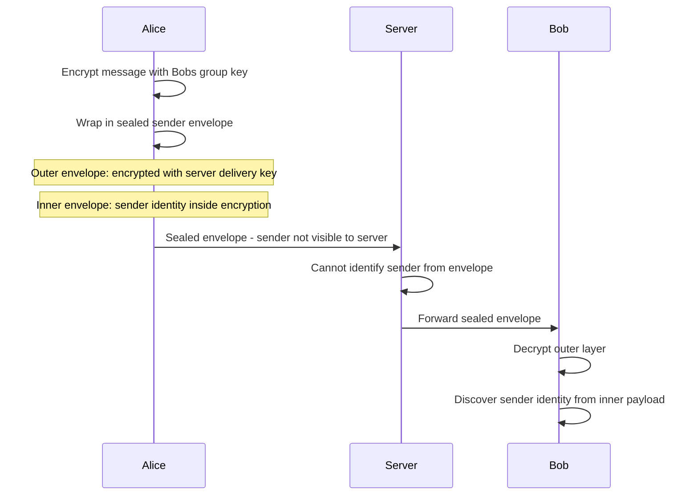

**Новый файл:** `src/lib/crypto/sealedSender.ts`

```typescript
export interface SealedSenderEnvelope {
  /** Encrypted using recipients identity key */
  sealedContent: Uint8Array;
  /** Ephemeral sender key for this message */
  ephemeralPublicKey: Uint8Array;
  /** Server delivery certificate - proves authorization without revealing sender */
  deliveryCertificate: Uint8Array;
}

export interface SealedSenderService {
  /**
   * Seal a message so the server cannot identify the sender.
   * The sender identity is included inside the encrypted content.
   */
  seal(
    senderIdentity: IdentityKeyPair,
    recipientPublicKey: CryptoKey,
    plaintext: Uint8Array,
    deliveryCert: DeliveryCertificate
  ): Promise<SealedSenderEnvelope>;

  /**
   * Unseal: decrypt and recover both message and sender identity.
   */
  unseal(
    recipientIdentity: IdentityKeyPair,
    envelope: SealedSenderEnvelope
  ): Promise<{ senderId: string; plaintext: Uint8Array }>;
}

export interface DeliveryCertificate {
  /** Issued by server after authentication */
  senderUserId: string;
  senderDeviceId: string;
  expiry: number;
  /** HMAC signature from server */
  signature: Uint8Array;
}
```

### 9.2. Message Padding

**Новый файл:** `src/lib/crypto/padding.ts`

```typescript
/**
 * Pad plaintext to a fixed bucket size to prevent
 * message length analysis.
 * 
 * Bucket sizes: 32, 64, 128, 256, 512, 1024, 2048, 4096, 8192
 * 
 * Short messages get padded to at least 32 bytes.
 * Padding uses random bytes with a length prefix.
 */
export function padMessage(plaintext: Uint8Array): Uint8Array;

/**
 * Remove padding from decrypted message.
 */
export function unpadMessage(padded: Uint8Array): Uint8Array;

/**
 * Pad SFrame media frames to prevent bitrate analysis.
 * Uses fixed-size buckets per media type:
 * - Audio: 160, 320, 480 bytes
 * - Video: 1KB, 4KB, 16KB, 64KB, 256KB
 */
export function padMediaFrame(
  frame: Uint8Array, 
  kind: 'audio' | 'video'
): Uint8Array;

export function unpadMediaFrame(padded: Uint8Array): Uint8Array;
```

### 9.3. Timing Obfuscation

**Новый файл:** `src/lib/crypto/timingObfuscation.ts`

```typescript
/**
 * Add random delay to operations to prevent timing analysis.
 * 
 * Uses constant-time patterns where possible.
 * For network operations: adds jitter within a window.
 */
export interface TimingObfuscator {
  /**
   * Delay operation by random amount within window.
   * @param minMs - minimum delay
   * @param maxMs - maximum delay
   */
  randomDelay(minMs: number, maxMs: number): Promise<void>;

  /**
   * Execute operation and ensure it takes at least minMs.
   * Prevents timing side channels on crypto operations.
   */
  constantTimeExec<T>(
    fn: () => Promise<T>, 
    minMs: number
  ): Promise<T>;
}
```

### 9.4. Файлы для создания/изменения

| Действие | Файл | Описание |
|----------|------|----------|
| CREATE | `src/lib/crypto/sealedSender.ts` | Sealed sender protocol |
| CREATE | `src/lib/crypto/padding.ts` | Message + media padding |
| CREATE | `src/lib/crypto/timingObfuscation.ts` | Timing attack mitigations |
| MODIFY | `src/lib/chat/e2ee.ts` | Integrate padding в encrypt |
| MODIFY | `src/lib/crypto/sframe.ts` | Integrate media padding |

---

## 10. План миграции

### 10.1. Фазовый план


### 10.2. Обратная совместимость

| Компонент | Стратегия |
|-----------|-----------|
| Chat E2EE v1 → v2 | Dual-read: decrypt v1 format, encrypt in v2 |
| localStorage → IndexedDB | Migration function reads old keys, imports to IndexedDB, deletes localStorage |
| `EncryptedPayload` → `EncryptedPayloadV2` | Version field detection: `payload.version === 2` → use AAD |
| SFrame off → on | Feature flag `e2ee.media.sframe.enabled`, SFU accepts both |
| Typed payloads | Server accepts old untyped, client sends typed — gradual |

### 10.3. Feature Flags

**Новый файл:** `src/lib/crypto/featureFlags.ts`

```typescript
export interface E2EEFeatureFlags {
  /** Use IndexedDB instead of localStorage for keys */
  'e2ee.keystore.indexeddb': boolean;

  /** Enable AAD in AES-GCM */
  'e2ee.aad.enabled': boolean;

  /** Enable X25519 key distribution */
  'e2ee.keydist.x25519': boolean;

  /** Enable SFrame for media streams */
  'e2ee.media.sframe.enabled': boolean;

  /** Enable post-quantum hybrid KE */
  'e2ee.pq.xwing.enabled': boolean;

  /** Enable sealed sender */
  'e2ee.sealed_sender.enabled': boolean;

  /** Enable message padding */
  'e2ee.padding.enabled': boolean;

  /** Enable safety number UI */
  'e2ee.verification.safety_numbers': boolean;

  /** Force WSS for signaling */
  'signaling.wss.required': boolean;

  /** Enable multi-worker mediasoup */
  'sfu.multiworker.enabled': boolean;

  /** Use Redis for join token replay */
  'signaling.redis_join_token': boolean;
}

export function getE2EEFeatureFlag(
  flag: keyof E2EEFeatureFlags
): boolean;
```

### 10.4. Тестирование

| Уровень | Что тестировать | Инструмент |
|---------|----------------|------------|
| Unit | Crypto primitives: encrypt/decrypt, ECDH, HKDF, SFrame | Vitest |
| Unit | KeyStore: IndexedDB operations | Vitest + fake-indexeddb |
| Unit | Nonce manager: uniqueness, sliding window | Vitest |
| Integration | Key distribution: multi-participant flow | Vitest + MSW |
| Integration | SFrame: encode → decode roundtrip | Vitest + Web Worker mock |
| Integration | WS typed payloads: serialize/deserialize | Vitest |
| E2E | Full call flow: join → media → rekey → leave | Playwright |
| E2E | Chat E2EE: enable → send → receive → decrypt | Playwright |
| Security | XSS cannot access IndexedDB CryptoKey | Manual + CSP audit |
| Security | Replay attack on join tokens | Integration test |
| Security | Ciphertext relocation with AAD | Unit test |
| Load | Multi-worker mediasoup under 50 peers | k6 + custom WS script |
| Compatibility | Insertable Streams support check | Browser matrix |

**Новые тестовые файлы:**

| Файл | Описание |
|------|----------|
| `src/lib/crypto/__tests__/keyStore.test.ts` | IndexedDB KeyStore tests |
| `src/lib/crypto/__tests__/sframe.test.ts` | SFrame codec tests |
| `src/lib/crypto/__tests__/keyDistribution.test.ts` | Key distribution protocol |
| `src/lib/crypto/__tests__/safetyNumbers.test.ts` | Safety number generation |
| `src/lib/crypto/__tests__/padding.test.ts` | Padding/unpadding roundtrip |
| `src/lib/crypto/__tests__/nonceManager.test.ts` | Nonce uniqueness |
| `server/sfu/__tests__/multiWorker.test.mjs` | Multi-worker mediasoup |
| `server/calls-ws/__tests__/rateLimit.test.mjs` | Rate limiter |
| `tests/e2e/e2ee-call-flow.spec.ts` | Full E2E call with encryption |

### 10.5. Зависимости между компонентами

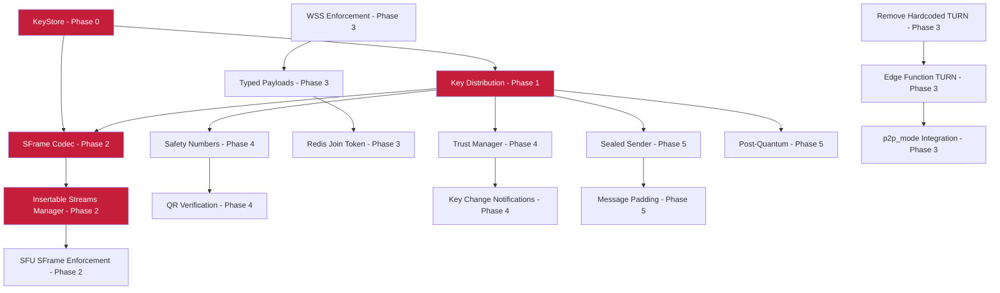

---

## Appendix A: Полная карта файлов

### Новые файлы

| Файл | Фаза | Описание |
|------|------|----------|
| `src/lib/crypto/keyStore.ts` | 0 | KeyStore interface |
| `src/lib/crypto/indexedDbKeyStore.ts` | 0 | IndexedDB implementation |
| `src/lib/crypto/webauthnPrf.ts` | 0 | WebAuthn PRF unlock |
| `src/lib/crypto/keyDistribution.ts` | 1 | Key distribution protocol |
| `src/lib/crypto/x25519.ts` | 1 | X25519 ECDH + HKDF |
| `src/lib/crypto/keyTransparencyLog.ts` | 1 | Audit log |
| `src/lib/crypto/sframe.ts` | 2 | SFrame codec |
| `src/lib/crypto/keyRatchet.ts` | 2 | Epoch key ratchet |
| `src/calls-v2/sframeTransformManager.ts` | 2 | Insertable Streams bridge |
| `src/calls-v2/workers/sframeWorker.ts` | 2 | Crypto Web Worker |
| `server/calls-ws/rateLimit.mjs` | 3 | Rate limiter |
| `server/sfu/roomStore.mjs` | 3 | Persistent room state |
| `server/sfu/sframeInspector.mjs` | 3 | SFrame header parser |
| `src/calls-v2/iceConfigResolver.ts` | 3 | p2p_mode → ICE config |
| `src/calls-v2/iceCandidateFilter.ts` | 3 | Candidate privacy filter |
| `src/lib/crypto/safetyNumbers.ts` | 4 | Safety numbers + emoji |
| `src/lib/crypto/trustManager.ts` | 4 | TOFU trust management |
| `src/hooks/useTrustManager.ts` | 4 | React hook для trust |
| `src/components/e2ee/SafetyNumberDialog.tsx` | 4 | Safety number UI |
| `src/components/e2ee/QrVerification.tsx` | 4 | QR verification |
| `src/components/e2ee/KeyChangeAlert.tsx` | 4 | Key change warnings |
| `src/lib/crypto/sealedSender.ts` | 5 | Sealed sender |
| `src/lib/crypto/padding.ts` | 5 | Message/media padding |
| `src/lib/crypto/timingObfuscation.ts` | 5 | Timing mitigations |
| `src/lib/crypto/postQuantum.ts` | 5 | X-Wing hybrid KE |
| `src/lib/crypto/nonceManager.ts` | 4 | Nonce management |
| `src/lib/crypto/featureFlags.ts` | 0 | E2EE feature flags |
| `src/lib/crypto/index.ts` | 0 | Barrel export |
| `supabase/functions/turn-credentials/index.ts` | 3 | Edge function |
| `supabase/migrations/xxx_user_identity_keys.sql` | 1 | Identity keys table |

### Файлы для модификации

| Файл | Фаза | Изменения |
|------|------|-----------|
| `src/lib/chat/e2ee.ts` | 0 | extractable: false, AAD, padding |
| `src/hooks/useE2EEncryption.ts` | 0-1 | KeyStore + KeyDistribution |
| `src/calls-v2/types.ts` | 3 | Строгие типы payload |
| `src/calls-v2/wsClient.ts` | 3 | Типизация методов |
| `server/calls-ws/index.mjs` | 3 | WSS, replay, rate limit |
| `server/calls-ws/store/redisStore.mjs` | 3 | consumeJoinToken |
| `server/calls-ws/store/index.mjs` | 3 | Feature flags |
| `server/sfu/index.mjs` | 2-3 | SFrame enforcement, roomStore |
| `server/sfu/mediaPlane.mjs` | 3 | Multi-worker |
| `reserve/calls/baseline/src/lib/webrtc-config.ts` | 3 | Remove TURN creds |

---

## Appendix B: Криптографический стек

| Уровень | Алгоритм | Назначение | Web Crypto API |
|---------|----------|------------|----------------|
| Symmetric | AES-256-GCM | Message/media encryption | ✅ Native |
| Key Wrap | AES-KW | Group key wrapping | ✅ Native |
| ECDH | X25519 | Key agreement | ✅ Native |
| KDF | HKDF-SHA256 | Key derivation | ✅ Native |
| KDF | PBKDF2-SHA256 | Password key derivation | ✅ Native |
| Hash | SHA-256/512 | Fingerprints, commitments | ✅ Native |
| HMAC | HMAC-SHA256 | Join tokens, signatures | ✅ Native |
| SFrame | AES-256-GCM + counter | Media frame encryption | ✅ via Insertable Streams |
| PQ-KEM | ML-KEM-768 | Post-quantum key exchange | ❌ WASM polyfill needed |
| Auth | WebAuthn PRF | Key unlock from authenticator | ⚠️ Extension, partial support |

---

## Appendix C: Threat Model

| Threat | Mitigation | Phase |
|--------|------------|-------|
| XSS reads crypto keys | Non-extractable CryptoKey in IndexedDB | 0 |
| Server reads messages | E2EE with group keys distributed via X25519 | 1 |
| Server reads media | SFrame encryption via Insertable Streams | 2 |
| MITM on signaling | WSS enforcement | 3 |
| Join token replay | Redis-backed distributed replay detection | 3 |
| IP leakage via ICE | p2p_mode + candidate filtering | 3 |
| Hardcoded TURN creds | Remove, use edge function short-lived creds | 3 |
| Identity impersonation | Safety numbers, QR verification, TOFU | 4 |
| Key change undetected | Trust manager + key change notifications | 4 |
| Sender identification by server | Sealed sender | 5 |
| Message length analysis | Fixed-bucket padding | 5 |
| Timing side channels | Constant-time ops + random delay | 5 |
| Quantum computing threat | X-Wing hybrid ML-KEM + X25519 | 5 |
| Ciphertext relocation | AAD binding to conversationId + keyVersion | 0 |
| Nonce reuse | Timestamp + counter + random nonce manager | 4 |
| Post-compromise key exposure | Key rotation on member leave | 1 |
| Forward secrecy breach | Epoch-based key ratcheting | 2 |
