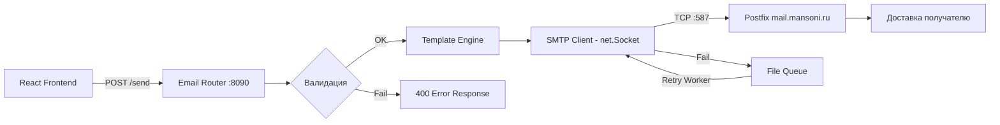
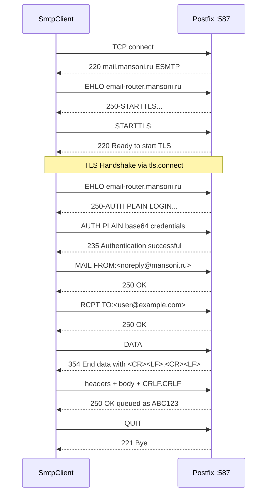
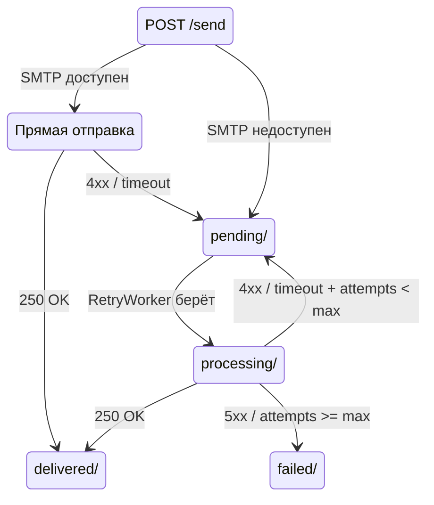
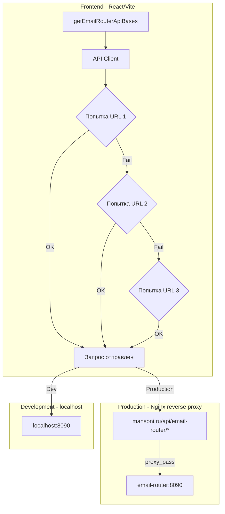

# Email Router Backend — Архитектура

> **Сервис**: Node.js HTTP API (порт 8090)  
> **Zero dependencies**: без nodemailer, без внешних SMTP-библиотек  
> **Транспорт**: прямое TCP-соединение через `net.Socket` → SMTP  
> **Дата**: 2026-03-05

---

## СОДЕРЖАНИЕ

1. [Обзор и место в системе](#1-обзор-и-место-в-системе)
2. [Структура файлов](#2-структура-файлов)
3. [API эндпоинты](#3-api-эндпоинты)
4. [SMTP-клиент](#4-smtp-клиент)
5. [Очередь отправки](#5-очередь-отправки)
6. [HTML-шаблоны](#6-html-шаблоны)
7. [Конфигурация](#7-конфигурация)
8. [Docker](#8-docker)
9. [Интеграция с фронтендом](#9-интеграция-с-фронтендом)
10. [Безопасность](#10-безопасность)
11. [Логирование](#11-логирование)

---

## 1. ОБЗОР И МЕСТО В СИСТЕМЕ

### 1.1 Роль сервиса

Email Router Backend — промежуточный HTTP-сервис между фронтендом и почтовой инфраструктурой. Фронтенд отправляет JSON-запросы на `:8090`, а сервис:

1. Валидирует входные данные
2. Рендерит HTML-шаблон письма
3. Устанавливает прямое TCP-соединение с целевым SMTP-сервером
4. Выполняет SMTP-диалог вручную через `net.Socket`
5. Ставит в очередь при ошибках и повторяет попытки

### 1.2 Диаграмма потоков



### 1.3 Связь с инфраструктурой

Сервис подключается к Postfix MTA (описан в `docs/email-infrastructure-mansoni-ru.md`) через порт `587` (submission) с STARTTLS и SASL-аутентификацией. Postfix далее обрабатывает DKIM-подписание, Rspamd-проверку и финальную доставку.

---

## 2. СТРУКТУРА ФАЙЛОВ

```
email-router/
├── src/
│   ├── index.ts                 # Точка входа, HTTP-сервер
│   ├── server.ts                # Создание HTTP-сервера, роутинг
│   ├── router.ts                # Маршрутизация запросов
│   ├── handlers/
│   │   ├── send.ts              # POST /send — обработчик отправки
│   │   ├── health.ts            # GET /health — health check
│   │   └── queueStatus.ts       # GET /queue/status — статус очереди
│   ├── smtp/
│   │   ├── SmtpClient.ts        # SMTP-клиент через net.Socket
│   │   ├── SmtpSession.ts       # Управление одной SMTP-сессией
│   │   ├── commands.ts          # EHLO, AUTH, MAIL FROM, RCPT TO, DATA
│   │   └── tls.ts               # STARTTLS upgrade через tls.connect
│   ├── queue/
│   │   ├── FileQueue.ts         # Файловая очередь на диске
│   │   ├── RetryWorker.ts       # Воркер повтора из очереди
│   │   └── types.ts             # Типы QueueItem, QueueStatus
│   ├── templates/
│   │   ├── TemplateEngine.ts    # Движок рендеринга HTML
│   │   ├── base.html            # Базовый layout
│   │   ├── welcome.html         # Шаблон приветствия
│   │   ├── verification.html    # Шаблон верификации email
│   │   ├── reset-password.html  # Шаблон сброса пароля
│   │   └── notification.html    # Шаблон уведомления
│   ├── validation/
│   │   ├── schemas.ts           # JSON-схемы валидации входных данных
│   │   └── sanitize.ts          # Санитизация HTML/XSS
│   ├── logger/
│   │   ├── Logger.ts            # Структурированное JSON-логирование
│   │   └── transports.ts        # stdout + файл
│   ├── config.ts                # Чтение .env, типизированная конфигурация
│   └── types.ts                 # Общие типы: SendRequest, SendResult
├── data/
│   └── queue/                   # Директория файловой очереди (runtime)
├── logs/                        # Директория логов (runtime)
├── Dockerfile
├── .dockerignore
├── .env.example
├── tsconfig.json
├── package.json
└── README.md
```

### 2.1 Принципы организации

| Принцип | Реализация |
|---|---|
| Zero external deps | HTTP через `node:http`, SMTP через `net.Socket` / `tls.TLSSocket`, шаблоны — ручная замена `{{var}}` |
| Единая ответственность | Каждый модуль — одна задача: SmtpClient не знает о шаблонах, FileQueue не знает об SMTP |
| Файловая очередь | Без Redis/DB — JSON-файлы на диске; atomic rename для crash-safety |
| TypeScript strict | `strict: true`, no `any`, полная типизация |

---

## 3. API ЭНДПОИНТЫ

### 3.1 POST /send

Отправка одного email.

**Request:**

```json
{
  "to": "user@example.com",
  "subject": "Подтверждение регистрации",
  "template": "verification",
  "variables": {
    "name": "Иван",
    "code": "123456",
    "expires_in": "15 минут"
  },
  "from": "noreply@mansoni.ru",
  "replyTo": "support@mansoni.ru"
}
```

**Поля:**

| Поле | Тип | Обязательное | Описание |
|---|---|---|---|
| `to` | `string` | ✅ | Email получателя (RFC 5322) |
| `subject` | `string` | ✅ | Тема письма, max 998 символов |
| `template` | `string` | ✅ | Имя шаблона из `templates/` |
| `variables` | `Record<string, string>` | ❌ | Переменные для подстановки в шаблон |
| `from` | `string` | ❌ | Отправитель (default: из .env `SMTP_FROM`) |
| `replyTo` | `string` | ❌ | Reply-To адрес |

**Response 200:**

```json
{
  "success": true,
  "messageId": "er-1709683490123-a7b3c",
  "queued": false
}
```

**Response 202 (поставлено в очередь):**

```json
{
  "success": true,
  "messageId": "er-1709683490123-a7b3c",
  "queued": true,
  "reason": "SMTP connection timeout, will retry"
}
```

**Response 400:**

```json
{
  "success": false,
  "error": "VALIDATION_ERROR",
  "details": [
    { "field": "to", "message": "Invalid email format" }
  ]
}
```

**Response 429 (rate limit):**

```json
{
  "success": false,
  "error": "RATE_LIMIT",
  "retryAfter": 60
}
```

### 3.2 GET /health

Проверка работоспособности сервиса.

**Response 200:**

```json
{
  "status": "ok",
  "uptime": 3600,
  "smtp": {
    "host": "mail.mansoni.ru",
    "port": 587,
    "connected": true,
    "lastCheck": "2026-03-05T23:00:00Z"
  },
  "queue": {
    "pending": 3,
    "failed": 0,
    "processing": 1
  },
  "version": "1.0.0"
}
```

**Response 503 (degraded):**

```json
{
  "status": "degraded",
  "uptime": 3600,
  "smtp": {
    "host": "mail.mansoni.ru",
    "port": 587,
    "connected": false,
    "lastCheck": "2026-03-05T22:55:00Z",
    "lastError": "Connection refused"
  },
  "queue": {
    "pending": 47,
    "failed": 2,
    "processing": 0
  },
  "version": "1.0.0"
}
```

### 3.3 GET /queue/status

Подробная информация об очереди отправки.

**Response 200:**

```json
{
  "total": 50,
  "pending": 3,
  "processing": 1,
  "delivered": 44,
  "failed": 2,
  "items": [
    {
      "id": "er-1709683490123-a7b3c",
      "to": "user@example.com",
      "subject": "Подтверждение",
      "status": "pending",
      "attempts": 2,
      "maxAttempts": 7,
      "nextRetry": "2026-03-05T23:35:00Z",
      "createdAt": "2026-03-05T23:00:00Z",
      "lastError": "Connection timeout"
    }
  ]
}
```

### 3.4 Сводная таблица эндпоинтов

| Метод | Путь | Описание | Auth |
|---|---|---|---|
| `POST` | `/send` | Отправка email | API Key |
| `GET` | `/health` | Health check | Нет |
| `GET` | `/queue/status` | Статус очереди | API Key |

---

## 4. SMTP-КЛИЕНТ

### 4.1 Архитектура SmtpClient

SMTP-клиент реализуется поверх `net.Socket` (Node.js built-in) без внешних зависимостей. Каждая отправка создаёт отдельную TCP-сессию.

### 4.2 Диаграмма SMTP-сессии



### 4.3 Структура SmtpClient

```
SmtpClient
├── connect               # TCP connect → net.Socket
├── upgradeToTls          # STARTTLS → tls.connect wrapping
├── sendCommand           # Отправка строки + ожидание ответа
├── parseResponse         # Парсинг multi-line SMTP-ответа
├── authenticate          # AUTH PLAIN base64
├── sendMail              # MAIL FROM → RCPT TO → DATA → body
├── buildMessage          # Сборка RFC 5322 сообщения с заголовками
└── quit                  # QUIT + close socket
```

### 4.4 Формат RFC 5322 сообщения

`buildMessage` собирает raw MIME-сообщение:

```
From: "Mansoni" <noreply@mansoni.ru>
To: user@example.com
Subject: =?UTF-8?B?<base64_subject>?=
Date: Thu, 05 Mar 2026 23:00:00 +0000
Message-ID: <er-1709683490123-a7b3c@mansoni.ru>
MIME-Version: 1.0
Content-Type: text/html; charset=UTF-8
Content-Transfer-Encoding: base64
Reply-To: support@mansoni.ru
X-Mailer: mansoni-email-router/1.0.0

<base64_encoded_html_body>
```

### 4.5 Таймауты SMTP-сессии

Согласно RFC 5321 Section 4.5.3.2:

| Этап | Таймаут | Описание |
|---|---|---|
| TCP Connect | 30 сек | Установка соединения |
| Ожидание 220 banner | 5 мин | Greeting от сервера |
| EHLO ответ | 5 мин | После отправки EHLO |
| STARTTLS | 30 сек | TLS handshake |
| AUTH ответ | 5 мин | Аутентификация |
| MAIL FROM ответ | 5 мин | Подтверждение отправителя |
| RCPT TO ответ | 5 мин | Подтверждение получателя |
| DATA начальный ответ | 2 мин | 354 ответ |
| DATA передача тела | 10 мин | Передача данных |
| DATA финальный ответ | 10 мин | 250 после точки |
| QUIT | 5 сек | Завершение |

### 4.6 Обработка ошибок SMTP

| Код | Категория | Действие |
|---|---|---|
| 2xx | Успех | Продолжить / завершить |
| 421 | Temp. service unavailable | Retry через очередь |
| 450 | Mailbox busy | Retry через очередь |
| 451 | Server error | Retry через очередь |
| 452 | Insufficient storage | Retry через очередь |
| 500-504 | Syntax / command error | Логировать, не retry |
| 550 | Mailbox not found | Permanent fail, bounce |
| 551 | User not local | Permanent fail |
| 552 | Storage exceeded | Permanent fail |
| 553 | Mailbox name invalid | Permanent fail |
| 554 | Transaction failed | Permanent fail |

---

## 5. ОЧЕРЕДЬ ОТПРАВКИ

### 5.1 Файловая очередь

Вместо Redis/PostgreSQL используется файловая очередь на диске. Преимущества:
- Zero dependencies
- Crash-safe через atomic rename
- Простая отладка — каждое сообщение это JSON-файл

### 5.2 Структура директории очереди

```
data/queue/
├── pending/              # Ожидают отправки
│   ├── 1709683490123-a7b3c.json
│   └── 1709683490456-d8e9f.json
├── processing/           # В процессе отправки
│   └── 1709683490789-g1h2i.json
├── failed/               # Постоянные ошибки
│   └── 1709683400000-j3k4l.json
└── delivered/            # Успешно доставлены (TTL 24h)
    └── 1709683300000-m5n6o.json
```

### 5.3 Формат элемента очереди

```json
{
  "id": "er-1709683490123-a7b3c",
  "to": "user@example.com",
  "from": "noreply@mansoni.ru",
  "subject": "Подтверждение",
  "html": "<html>...</html>",
  "replyTo": "support@mansoni.ru",
  "attempts": 0,
  "maxAttempts": 7,
  "nextRetry": "2026-03-05T23:00:00Z",
  "lastError": null,
  "createdAt": "2026-03-05T23:00:00Z"
}
```

### 5.4 Расписание retry

Экспоненциальный backoff, совместимый с RFC 5321:

| Попытка | Задержка | Время от создания |
|---|---|---|
| 1 | Сразу | 0 |
| 2 | +5 мин | 5 мин |
| 3 | +30 мин | 35 мин |
| 4 | +1 час | 1 ч 35 мин |
| 5 | +6 часов | 7 ч 35 мин |
| 6 | +24 часа | 31 ч 35 мин |
| 7 | +48 часов | 79 ч 35 мин |
| Bounce | — | После 7-й попытки |

### 5.5 Диаграмма жизненного цикла сообщения



### 5.6 Атомарность операций

Все файловые операции crash-safe:

1. **Запись**: `writeFile` → temp файл → `rename` в `pending/`
2. **Обработка**: `rename` из `pending/` → `processing/`
3. **Результат**: `rename` из `processing/` → `delivered/` или `failed/`
4. **Cleanup**: Cron удаляет из `delivered/` файлы старше 24h

---

## 6. HTML-ШАБЛОНЫ

### 6.1 Движок шаблонов

Простой движок замен без внешних зависимостей:

```
Input:  "Привет, {{name}}! Ваш код: {{code}}"
Vars:   { name: "Иван", code: "123456" }
Output: "Привет, Иван! Ваш код: 123456"
```

Правила:
- Подстановка `{{variable}}` — рекурсии нет
- Все переменные экранируются через HTML entity encoding
- Неизвестные `{{var}}` заменяются на пустую строку + warning в лог
- Базовый layout `base.html` оборачивает все шаблоны

### 6.2 Структура base.html

```
<!DOCTYPE html>
<html>
<head>
  <meta charset="UTF-8">
  <meta name="viewport" content="width=device-width">
  <style> /* inline CSS для email-клиентов */ </style>
</head>
<body>
  <table> <!-- email-safe layout -->
    <tr><td> {{__CONTENT__}} </td></tr>
    <tr><td> <!-- footer --> </td></tr>
  </table>
</body>
</html>
```

### 6.3 Доступные шаблоны

| Шаблон | Файл | Переменные |
|---|---|---|
| Верификация email | `verification.html` | `name`, `code`, `expires_in` |
| Сброс пароля | `reset-password.html` | `name`, `link`, `expires_in` |
| Приветствие | `welcome.html` | `name` |
| Уведомление | `notification.html` | `name`, `title`, `message`, `action_url`, `action_text` |

---

## 7. КОНФИГУРАЦИЯ

### 7.1 Переменные окружения

```env
# ── Сервер ────────────────────────────────────────────
PORT=8090                              # Порт HTTP-сервера
HOST=0.0.0.0                           # Bind address
NODE_ENV=production                    # production | development

# ── SMTP ─────────────────────────────────────────────
SMTP_HOST=mail.mansoni.ru              # SMTP-сервер
SMTP_PORT=587                          # Порт submission (STARTTLS)
SMTP_USER=noreply@mansoni.ru           # SASL логин
SMTP_PASS=STRONG_PASSWORD              # SASL пароль
SMTP_FROM=noreply@mansoni.ru           # Default From
SMTP_FROM_NAME=Mansoni                 # Display name отправителя
SMTP_EHLO_HOSTNAME=email-router.mansoni.ru  # EHLO hostname

# ── Безопасность ─────────────────────────────────────
API_KEY=your-secret-api-key-here       # Ключ для авторизации запросов
CORS_ORIGINS=https://mansoni.ru,https://www.mansoni.ru  # Allowed origins

# ── Очередь ──────────────────────────────────────────
QUEUE_DIR=./data/queue                 # Директория файловой очереди
QUEUE_MAX_ATTEMPTS=7                   # Макс. попыток retry
QUEUE_CLEANUP_TTL=86400                # TTL delivered файлов (сек)
QUEUE_POLL_INTERVAL=10000              # Интервал проверки очереди (мс)

# ── Rate Limiting ────────────────────────────────────
RATE_LIMIT_PER_MINUTE=30               # Макс. запросов /send в минуту
RATE_LIMIT_PER_HOUR=300                # Макс. запросов /send в час

# ── Логирование ──────────────────────────────────────
LOG_LEVEL=info                         # debug | info | warn | error
LOG_FILE=./logs/email-router.log       # Путь к файлу логов
LOG_MAX_SIZE=10485760                  # Ротация при 10MB
```

### 7.2 Конфигурация в коде

`config.ts` читает `.env` через `process.env` (без dotenv — переменные передаются через Docker или shell):

```
Config
├── server.port          # number
├── server.host          # string
├── smtp.host            # string
├── smtp.port            # number
├── smtp.user            # string
├── smtp.pass            # string (never logged)
├── smtp.from            # string
├── smtp.fromName        # string
├── smtp.ehloHostname    # string
├── security.apiKey      # string (never logged)
├── security.corsOrigins # string array
├── queue.dir            # string
├── queue.maxAttempts    # number
├── queue.cleanupTtl     # number
├── queue.pollInterval   # number
├── rateLimit.perMinute  # number
├── rateLimit.perHour    # number
├── log.level            # string
├── log.file             # string
└── log.maxSize          # number
```

---

## 8. DOCKER

### 8.1 Dockerfile

```dockerfile
FROM node:20-alpine AS builder
WORKDIR /app
COPY package.json tsconfig.json ./
COPY src/ ./src/
RUN npm install --production=false && npm run build

FROM node:20-alpine
WORKDIR /app
RUN addgroup -S emailrouter && adduser -S emailrouter -G emailrouter
COPY --from=builder /app/dist ./dist
COPY --from=builder /app/package.json ./
RUN npm install --production
RUN mkdir -p data/queue/pending data/queue/processing data/queue/failed data/queue/delivered logs \
    && chown -R emailrouter:emailrouter /app
USER emailrouter
EXPOSE 8090
HEALTHCHECK --interval=30s --timeout=5s --retries=3 \
  CMD wget -q --spider http://localhost:8090/health || exit 1
CMD ["node", "dist/index.js"]
```

### 8.2 Docker Compose (для dev/staging)

```yaml
version: "3.8"
services:
  email-router:
    build: ./email-router
    ports:
      - "8090:8090"
    env_file:
      - ./email-router/.env
    volumes:
      - email-queue:/app/data/queue
      - email-logs:/app/logs
    restart: unless-stopped
    healthcheck:
      test: ["CMD", "wget", "-q", "--spider", "http://localhost:8090/health"]
      interval: 30s
      timeout: 5s
      retries: 3

volumes:
  email-queue:
  email-logs:
```

### 8.3 Сборка и запуск

```bash
# Сборка
cd email-router
docker build -t mansoni/email-router:latest .

# Запуск
docker run -d \
  --name email-router \
  -p 8090:8090 \
  --env-file .env \
  -v email-queue:/app/data/queue \
  -v email-logs:/app/logs \
  --restart unless-stopped \
  mansoni/email-router:latest
```

---

## 9. ИНТЕГРАЦИЯ С ФРОНТЕНДОМ

### 9.1 Существующий код фронтенда

Файл [`getEmailRouterApiBases()`](src/lib/email/backendEndpoints.ts:25) уже определяет fallback-цепочку URL:

1. `VITE_EMAIL_ROUTER_API_URL` из `.env` (явный URL)
2. `${protocol}//${hostname}:8090` для localhost
3. `${origin}/api/email-router` через proxy
4. `http://127.0.0.1:8090` — fallback
5. `http://localhost:8090` — fallback

### 9.2 Диаграмма интеграции



### 9.3 Формат запроса с фронтенда

Фронтенд отправляет запрос с заголовком `X-API-Key`:

```
POST /send HTTP/1.1
Host: localhost:8090
Content-Type: application/json
X-API-Key: <api_key>

{
  "to": "user@example.com",
  "subject": "Код подтверждения",
  "template": "verification",
  "variables": { "name": "Иван", "code": "123456", "expires_in": "15 минут" }
}
```

### 9.4 Nginx proxy конфигурация (production)

```nginx
location /api/email-router/ {
    proxy_pass http://127.0.0.1:8090/;
    proxy_set_header Host $host;
    proxy_set_header X-Real-IP $remote_addr;
    proxy_set_header X-Forwarded-For $proxy_add_x_forwarded_for;
    proxy_set_header X-Forwarded-Proto $scheme;
    proxy_read_timeout 30s;
    proxy_connect_timeout 5s;
}
```

### 9.5 Переменная окружения для фронтенда

Добавить в `.env.example`:

```env
# Email Router API
VITE_EMAIL_ROUTER_API_URL="http://localhost:8090"
```

---

## 10. БЕЗОПАСНОСТЬ

### 10.1 Аутентификация API

| Механизм | Описание |
|---|---|
| API Key | Заголовок `X-API-Key` — проверяется на каждый запрос кроме `/health` |
| CORS | Только разрешённые origins из `CORS_ORIGINS` |
| Rate Limiting | In-memory счётчик по IP + глобальный |

### 10.2 Защита SMTP-credentials

- `SMTP_PASS` и `API_KEY` **никогда** не логируются
- В health check SMTP-пароль не возвращается
- Docker secrets предпочтительнее env vars в production

### 10.3 Валидация входных данных

| Поле | Правило |
|---|---|
| `to` | RFC 5322 email regex, max 254 символа |
| `subject` | Max 998 символов, trim, no CRLF injection |
| `template` | Whitelist: только имена из `templates/` директории |
| `variables` | Все значения — строки, HTML entity encoding |
| `from` | Только `@mansoni.ru` домен |

### 10.4 Защита от header injection

Все пользовательские данные в SMTP-заголовках проверяются на отсутствие `\r\n`. Значения `subject` кодируются через RFC 2047 (=?UTF-8?B?...?=).

---

## 11. ЛОГИРОВАНИЕ

### 11.1 Формат

Структурированный JSON (одна строка = одно событие):

```json
{
  "ts": "2026-03-05T23:00:00.123Z",
  "level": "info",
  "module": "smtp",
  "event": "send_success",
  "messageId": "er-1709683490123-a7b3c",
  "to": "user@example.com",
  "smtpCode": 250,
  "duration": 1250
}
```

### 11.2 События

| Event | Level | Module | Описание |
|---|---|---|---|
| `server_start` | info | server | Сервер запущен |
| `request_received` | info | handler | Входящий HTTP-запрос |
| `validation_error` | warn | validation | Ошибка валидации |
| `smtp_connect` | debug | smtp | TCP-соединение установлено |
| `smtp_tls_upgrade` | debug | smtp | STARTTLS успешен |
| `smtp_auth_success` | info | smtp | Аутентификация прошла |
| `smtp_auth_fail` | error | smtp | Ошибка аутентификации |
| `send_success` | info | smtp | Письмо принято сервером |
| `send_fail_temp` | warn | smtp | Временная ошибка, retry |
| `send_fail_perm` | error | smtp | Постоянная ошибка, bounce |
| `queue_add` | info | queue | Добавлено в очередь |
| `queue_retry` | info | queue | Повторная попытка |
| `queue_delivered` | info | queue | Доставлено из очереди |
| `queue_failed` | error | queue | Исчерпаны попытки |
| `rate_limit_hit` | warn | security | Превышен лимит запросов |

### 11.3 Ротация логов

- Максимальный размер файла: 10 MB (настраивается через `LOG_MAX_SIZE`)
- При достижении лимита: rename `email-router.log` → `email-router.log.1`
- Хранить максимум 5 ротированных файлов
- stdout всегда дублирует вывод (для Docker logs)
