# Livestream-подсистема — Полная архитектурная спецификация

> **Версия:** 1.0  
> **Дата:** 2026-03-08  
> **Статус:** Blueprint  
> **Проект:** ECOMANSONI (Mansoni)  
> **Стек:** React 18 · TypeScript 5.8 · Vite 5 · Supabase (Postgres + Edge Functions + Realtime + Storage) · Capacitor 8 · mediasoup · LiveKit · Redis · MinIO · Docker

---

## Оглавление

1. [Аудит текущего состояния](#1-аудит-текущего-состояния)
2. [Архитектура верхнего уровня](#2-архитектура-верхнего-уровня)
3. [Выбор медиасервера](#3-выбор-медиасервера)
4. [Протоколы и потоки данных](#4-протоколы-и-потоки-данных)
5. [Adaptive Bitrate — ABR](#5-adaptive-bitrate--abr)
6. [Чат прямого эфира](#6-чат-прямого-эфира)
7. [Реакции в реальном времени](#7-реакции-в-реальном-времени)
8. [Счётчик зрителей — Presence](#8-счётчик-зрителей--presence)
9. [Push-уведомления](#9-push-уведомления)
10. [Модерация](#10-модерация)
11. [Запись и VOD](#11-запись-и-vod)
12. [Совместные эфиры — Live Rooms](#12-совместные-эфиры--live-rooms)
13. [Подарки и донаты](#13-подарки-и-донаты)
14. [Магазин в эфире — Live Shopping](#14-магазин-в-эфире--live-shopping)
15. [Статистика стрима](#15-статистика-стрима)
16. [Геолокация и ограничения](#16-геолокация-и-ограничения)
17. [CDN-интеграция](#17-cdn-интеграция)
18. [Безопасность](#18-безопасность)
19. [Схема БД — полная](#19-схема-бд--полная)
20. [API-эндпоинты и Edge Functions](#20-api-эндпоинты-и-edge-functions)
21. [Фронтенд-архитектура](#21-фронтенд-архитектура)
22. [Инфраструктура — Docker / Kubernetes](#22-инфраструктура--docker--kubernetes)
23. [Зависимости](#23-зависимости)
24. [План миграций](#24-план-миграций)
25. [Оценка масштабируемости](#25-оценка-масштабируемости)

---

## 1. Аудит текущего состояния

### 1.1 Что уже реализовано

| Компонент | Путь | Статус |
|-----------|------|--------|
| БД: `live_sessions` | `supabase/migrations/20260224300000_phase1_epic_n_live_beta.sql` | ✅ Схема создана (BIGSERIAL, категории, модерация) |
| БД: `live_viewers` | там же | ✅ Ephemeral viewer tracking |
| БД: `live_chat_messages` | там же | ✅ Chat с модерацией |
| БД: `live_stream_reports` | там же | ✅ Trust-weighted reports |
| БД: `live_questions` | `20260303212000_create_live_notif_mod_complete.sql` | ✅ Q&A |
| БД: `live_donations` | там же | ✅ Донаты (currency: stars) |
| RPC: `is_eligible_for_live_v1` | миграция phase1 | ✅ 4 проверки: возраст аккаунта, фолловеры, модерация, лимит сессий |
| RPC: `broadcast_create_session_v1` | там же | ✅ Создание сессии |
| RPC: `broadcast_end_session_v1` | там же | ✅ Завершение сессии |
| RPC: `get_active_live_sessions_v1` | там же | ✅ Discovery feed |
| RPC: `report_live_stream_v1` | там же | ✅ Trust-weighted с burst-detection |
| UI: `LiveBroadcastRoom` | `src/pages/live/LiveBroadcastRoom.tsx` | ⚠️ getUserMedia + Supabase Realtime chat, но НЕТ отправки потока на медиасервер |
| UI: `LiveViewerRoom` | `src/pages/live/LiveViewerRoom.tsx` | ⚠️ Загружает сессию, chat, hearts — но НЕТ воспроизведения видеопотока |
| UI: `LiveBroadcastCheck` | `src/pages/creator/LiveBroadcastCheck.tsx` | ✅ Проверка eligibility |
| UI: `LiveSetupSheet` | `src/pages/creator/LiveSetupSheet.tsx` | ⚠️ Дублирующий import supabase |
| UI: `LiveDonation` | `src/components/live/LiveDonation.tsx` | ✅ Анимации, send, Realtime подписка |
| UI: `InviteGuestSheet` | `src/components/live/InviteGuestSheet.tsx` | ⚠️ Поиск пользователей, но нет реального WebRTC invite |
| UI: `LiveQAQueue` | `src/components/live/LiveQAQueue.tsx` | ✅ Q&A UI |
| UI: `LiveReplay` | `src/components/live/LiveReplay.tsx` | ⚠️ UI для реплея, но нет VOD-источника |
| UI: `ScheduleLiveSheet` | `src/components/live/ScheduleLiveSheet.tsx` | ✅ Планирование эфиров |
| SFU: mediasoup | `server/sfu/` | ✅ Работает для звонков (VP8 + Opus), E2EE SFrame |
| calls-ws | `server/calls-ws/` | ✅ WebSocket signalling + Redis |
| coturn | `infra/calls/` | ✅ TURN/STUN сервер |
| MinIO | `infra/media/` | ✅ S3-compatible object storage |
| notification-router | `services/notification-router/` | ✅ Push-уведомления |

### 1.2 Критические пробелы

| # | Пробел | Влияние |
|---|--------|---------|
| 1 | **Нет медиасервера для вещания** — getUserMedia есть, но поток никуда не отправляется | Стрим не работает |
| 2 | **Нет RTMP ingest** — нет приёма потока от OBS/Streamlabs | Профессиональные стримеры не могут вещать |
| 3 | **Нет транскодирования и ABR** — один bitrate | Зрители с плохим интернетом не смотрят |
| 4 | **Нет HLS/DASH fanout** — нельзя масштабировать на 10k+ зрителей | WebRTC не скейлится |
| 5 | **Нет записи/VOD** — replay_url колонка есть, но записи нет | Нельзя пересмотреть эфир |
| 6 | **Нет CDN** — HLS segments должны раздаваться через CDN | Высокая задержка и нагрузка |
| 7 | **Нет stream key** — авторизация стримера через JWT, но нет ключа для OBS | Нет RTMP auth |
| 8 | **InviteGuestSheet** не подключает WebRTC | Совместные эфиры не работают |
| 9 | **Нет push "user X went live"** | Зрители не узнают о начале эфира |
| 10 | **Нет geo-restriction** | Нельзя ограничить по регионам |

---

## 2. Архитектура верхнего уровня

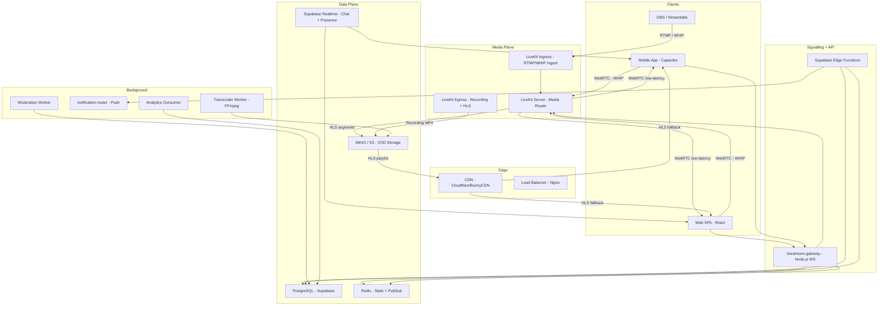

### 2.1 Ключевые решения

| Решение | Выбор | Обоснование |
|---------|-------|-------------|
| Медиасервер | **LiveKit** | Встроенный RTMP/WHIP ingress, WebRTC SFU, HLS egress, запись, simulcast — всё из коробки |
| Fallback protocol | HLS via CDN | Для зрителей с плохим NAT или >5000 viewers |
| Chat | Supabase Realtime | Уже используется в проекте, поддерживает Presence |
| Object Storage | MinIO (уже есть) | +новый bucket `live-recordings` |
| CDN | Cloudflare / BunnyCDN | HLS cache, geo-distribution |
| Push | notification-router (уже есть) | +новый event type `live_started` |

---

## 3. Выбор медиасервера

### 3.1 Сравнение кандидатов

| Критерий | LiveKit | mediasoup | SRS |
|----------|---------|-----------|-----|
| RTMP Ingest | ✅ Встроенный Ingress | ❌ Нужен отдельный сервис | ✅ Нативный |
| WHIP Ingest | ✅ | ❌ | ⚠️ Плагин |
| WebRTC SFU | ✅ | ✅ | ✅ |
| HLS Egress | ✅ Встроенный | ❌ Нужен FFmpeg wrapper | ✅ |
| Simulcast/ABR | ✅ Нативный | ✅ | ⚠️ Ограниченный |
| Recording | ✅ Egress service | ❌ Нужен custom | ⚠️ DVR |
| Уже в проекте | ❌ Новый | ✅ SFU для звонков | ❌ Новый |
| SDK качество | ✅ TypeScript SDK | ✅ mediasoup-client | ⚠️ Нет TS SDK |
| Масштабируемость | ✅ Горизонтальная с Redis | ⚠️ Требует custom routing | ✅ Кластер |
| E2EE | ✅ | ✅ SFrame | ❌ |
| Open Source | ✅ Apache 2.0 | ✅ ISC | ✅ MIT |
| Docker-ready | ✅ Official image | ⚠️ Custom build | ✅ |

### 3.2 Решение: LiveKit

**LiveKit** выбран как основной медиасервер для Livestream по причинам:

1. **Всё-в-одном**: RTMP Ingress + WebRTC SFU + HLS Egress + Recording — не нужно собирать пайплайн из 4 сервисов
2. **Simulcast из коробки**: ABR без FFmpeg-транскодирования для WebRTC viewers
3. **TypeScript SDK**: `livekit-client` + `livekit-server-sdk` — полная типизация
4. **Горизонтальное масштабирование**: Redis-backed multi-node с автоматическим routing
5. **WHIP support**: Браузерный publish без SDK — прямой WebRTC ingest
6. **Совместимость**: Существующий mediasoup SFU остаётся для звонков (1:1 и групповых)

> **ВАЖНО**: mediasoup (`server/sfu/`) продолжает обслуживать **звонки**. LiveKit используется **только для livestream**. Это разделение снижает риск и позволяет независимое масштабирование.

### 3.3 Компоненты LiveKit

```
LiveKit Server         — SFU + room management + WebRTC routing
LiveKit Ingress        — RTMP / WHIP → WebRTC конвертер
LiveKit Egress         — WebRTC → HLS segments / MP4 recording
```

---

## 4. Протоколы и потоки данных

### 4.1 Ingest — от стримера к серверу

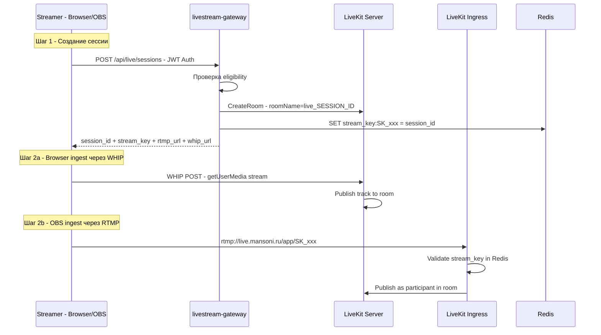

#### RTMP URL Format
```
rtmp://live.mansoni.ru/app/{stream_key}
```

#### WHIP URL Format
```
https://live.mansoni.ru/whip/{session_id}?token={participant_token}
```

### 4.2 Fanout — от сервера к зрителям

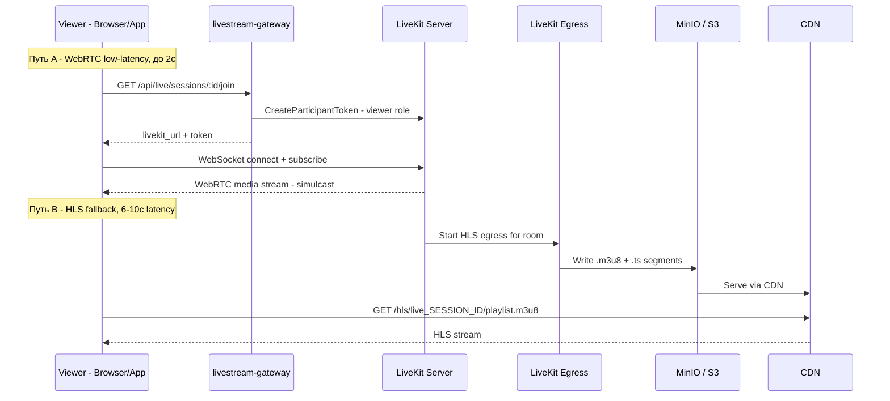

### 4.3 Выбор протокола зрителем

| Условие | Протокол | Задержка |
|---------|----------|----------|
| < 500 зрителей | WebRTC (LiveKit direct) | < 1с |
| 500–5000 зрителей | WebRTC через LiveKit cluster | 1–2с |
| > 5000 зрителей (overflow) | HLS через CDN | 6–10с |
| Плохой NAT / firewall | HLS через CDN | 6–10с |
| Audio-only mode | WebRTC (audio track only) | < 1с |

Логика переключения на клиенте:
```
1. Попытка WebRTC connect (timeout = 5c)
2. Если ICE failed / timeout → переключение на HLS
3. Если bandwidth < 300kbps → переключение на audio-only или HLS
```

---

## 5. Adaptive Bitrate — ABR

### 5.1 Simulcast Layers (WebRTC)

LiveKit поддерживает simulcast — стример публикует 3 варианта одновременно:

| Layer | Разрешение | Bitrate | FPS | Условие переключения |
|-------|-----------|---------|-----|----------------------|
| `HIGH` | 1080p (1920×1080) | 2500 kbps | 30 | bandwidth > 3000 kbps |
| `MEDIUM` | 720p (1280×720) | 1200 kbps | 30 | bandwidth 1000–3000 kbps |
| `LOW` | 360p (640×360) | 500 kbps | 15 | bandwidth 300–1000 kbps |

LiveKit автоматически переключает зрителя между слоями на основе estimated bandwidth.

### 5.2 HLS Variants (для CDN fanout)

LiveKit Egress генерирует HLS с ABR через FFmpeg:

| Variant | Разрешение | Bitrate | Codec |
|---------|-----------|---------|-------|
| 1080p | 1920×1080 | 4500 kbps | H.264 High |
| 720p | 1280×720 | 2500 kbps | H.264 Main |
| 480p | 854×480 | 1200 kbps | H.264 Main |
| 360p | 640×360 | 600 kbps | H.264 Baseline |
| audio-only | — | 128 kbps | AAC |

### 5.3 Конфигурация Egress

```yaml
# Egress HLS configuration
segment_duration: 2s          # Для low-latency HLS
playlist_window: 5             # 5 segments в playlist
storage:
  s3:
    bucket: live-recordings
    region: eu-central-1
    endpoint: https://minio.mansoni.ru
video_encoding:
  - width: 1920
    height: 1080
    bitrate: 4500000
    framerate: 30
    codec: H264_HIGH
  - width: 1280
    height: 720
    bitrate: 2500000
    framerate: 30
    codec: H264_MAIN
  - width: 854
    height: 480
    bitrate: 1200000
    framerate: 30
    codec: H264_MAIN
  - width: 640
    height: 360
    bitrate: 600000
    framerate: 15
    codec: H264_BASELINE
audio_encoding:
  bitrate: 128000
  codec: AAC
```

---

## 6. Чат прямого эфира

### 6.1 Архитектура

Используем **Supabase Realtime** (уже интегрирован в проект) для доставки сообщений чата. Это позволяет избежать дополнительного WebSocket-сервера.

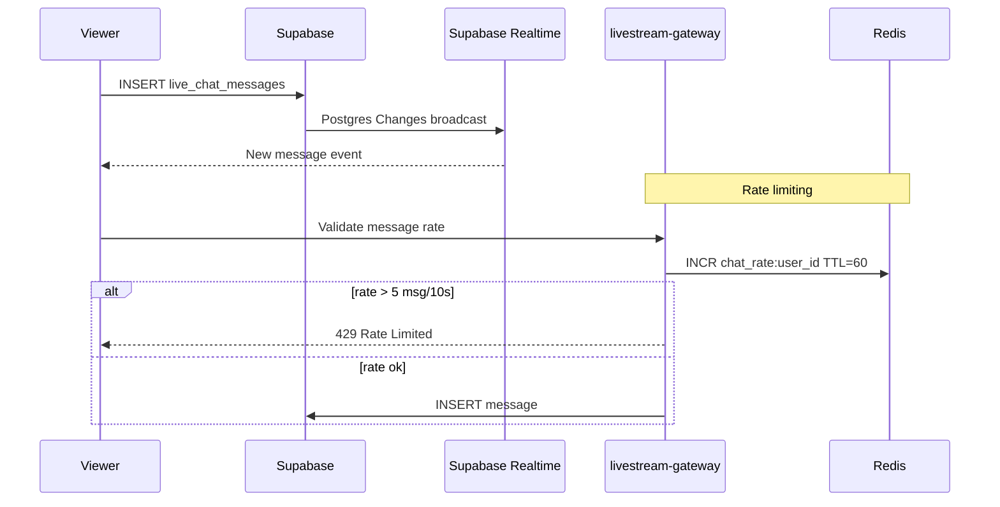

### 6.2 Rate Limiting чата

| Правило | Лимит | Window |
|---------|-------|--------|
| Обычный пользователь | 5 сообщений / 10 секунд | Sliding window |
| Стример | 20 сообщений / 10 секунд | Sliding window |
| Модератор | 20 сообщений / 10 секунд | Sliding window |
| Slow mode (устанавливает стример) | 1 сообщение / N секунд | Per-user cooldown |
| Followers-only mode | Только подписчики стримера | - |

### 6.3 Анти-спам

| Уровень | Механизм | Действие |
|---------|----------|---------|
| L1: Rate limit | Redis sliding window | 429 reject |
| L2: Duplicate detection | Hash последних 10 сообщений пользователя | Reject + warning |
| L3: Keyword filter | Blocklist (регулярные выражения) | Auto-hide + flag |
| L4: ML-based (v2) | Edge Function с классификатором | Auto-hide + review |
| L5: User-defined hidden words | `hidden_words` из профиля стримера | Client-side hide |

### 6.4 Pinned Messages

Стример может закрепить одно сообщение:
- Сохраняется в `live_sessions.pinned_comment` (уже есть)
- Broadcast через Supabase Realtime (Postgres Changes на live_sessions)

---

## 7. Реакции в реальном времени

### 7.1 Архитектура

Floating reactions (сердечки, огонь, хлопки) передаются через **Supabase Realtime Broadcast Channel** (не Postgres — для скорости):

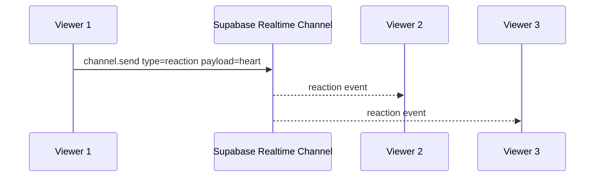

### 7.2 Типы реакций

| Реакция | Emoji | Код |
|---------|-------|-----|
| Сердце | ❤️ | `heart` |
| Огонь | 🔥 | `fire` |
| Хлопки | 👏 | `clap` |
| Смех | 😂 | `laugh` |
| Удивление | 😮 | `wow` |
| Грусть | 😢 | `sad` |

### 7.3 Rate Limiting реакций

- 3 реакции / секунду / пользователь
- Агрегация на клиенте: если 100 пользователей отправили heart за 1с → показываем "поток сердечек" (burst animation), не 100 отдельных

### 7.4 Frontend реализация

```
// Supabase Realtime Broadcast Channel
const reactionChannel = supabase.channel(`live:${sessionId}:reactions`)
reactionChannel.on('broadcast', { event: 'reaction' }, (payload) => {
  addFloatingReaction(payload.type)
})
reactionChannel.subscribe()

// Send
reactionChannel.send({
  type: 'broadcast',
  event: 'reaction',
  payload: { type: 'heart', userId: currentUser.id }
})
```

---

## 8. Счётчик зрителей — Presence

### 8.1 Архитектура

Используем **Supabase Realtime Presence** для точного realtime viewer count:

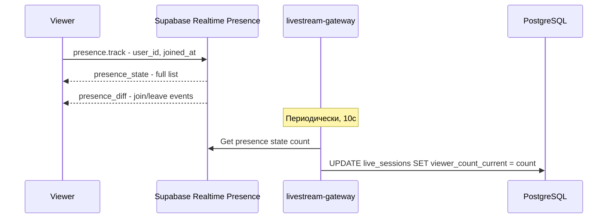

### 8.2 Типы счётчиков

| Счётчик | Источник | Обновление |
|---------|----------|-----------|
| `viewer_count_current` | Presence state size | Каждые 10 секунд |
| `viewer_count_peak` | MAX(viewer_count_current) | При каждом обновлении |
| Уникальные зрители | COUNT(DISTINCT viewer_id) в `live_viewers` | При JOIN |

### 8.3 Presence Channel

```
const presenceChannel = supabase.channel(`live:${sessionId}:presence`)
presenceChannel.on('presence', { event: 'sync' }, () => {
  const state = presenceChannel.presenceState()
  setViewerCount(Object.keys(state).length)
})
presenceChannel.subscribe(async (status) => {
  if (status === 'SUBSCRIBED') {
    await presenceChannel.track({ user_id: currentUser.id })
  }
})
```

---

## 9. Push-уведомления

### 9.1 Поток "User X начал прямой эфир"

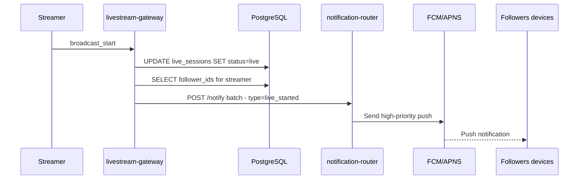

### 9.2 Типы уведомлений

| Event | Title | Body | Action |
|-------|-------|------|--------|
| `live_started` | `{username} в эфире!` | `{title}` | Открыть `/live/{sessionId}/watch` |
| `live_scheduled` | `{username} запланировал эфир` | `{title} — {scheduled_at}` | Открыть reminder |
| `live_invite_guest` | `Вас приглашают в эфир!` | `{username} приглашает вас` | Открыть accept/decline |
| `live_donation_received` | `Новый донат!` | `{donor}: {amount} ⭐` | Открыть стрим |

### 9.3 Оптимизация пушей

- **Batch sending**: Фолловеры разбиваются на пакеты по 1000 токенов
- **Follower filtering**: Только пользователи с включёнными уведомлениями `live_notifications = true`
- **Deduplication**: Один push на устройство, даже если пользователь подписан на нескольких устройствах
- **Priority**: `live_started` = high priority (wake device)

---

## 10. Модерация

### 10.1 Многоуровневая система

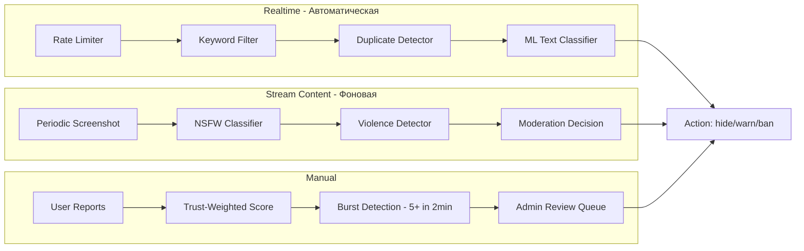

### 10.2 Модерация видеопотока

| Шаг | Механизм | Частота | Действие |
|-----|----------|---------|---------|
| 1 | Screenshot из HLS segment | Каждые 30 секунд | Отправка на классификатор |
| 2 | NSFW detection (OpenAI Vision / custom model) | Per screenshot | Score 0.0–1.0 |
| 3 | Score > 0.8 | Immediate | `moderation_status = red`, auto-restrict |
| 4 | Score 0.5–0.8 | Queue | `moderation_status = borderline`, notify admin |
| 5 | Score < 0.5 | Pass | `moderation_status = green` |

### 10.3 Действия модерации

| Действие | Описание | RLS |
|----------|----------|-----|
| `restrict_stream` | Остановить вещание, показать "stream restricted" | SECURITY DEFINER |
| `hide_message` | Скрыть сообщение чата | creator или admin |
| `ban_viewer` | Заблокировать зрителя в чате | creator или admin |
| `timeout_viewer` | Временный mute (5/15/30 мин) | creator или admin |
| `end_stream` | Принудительное завершение | admin only |

---

## 11. Запись и VOD

### 11.1 Архитектура записи

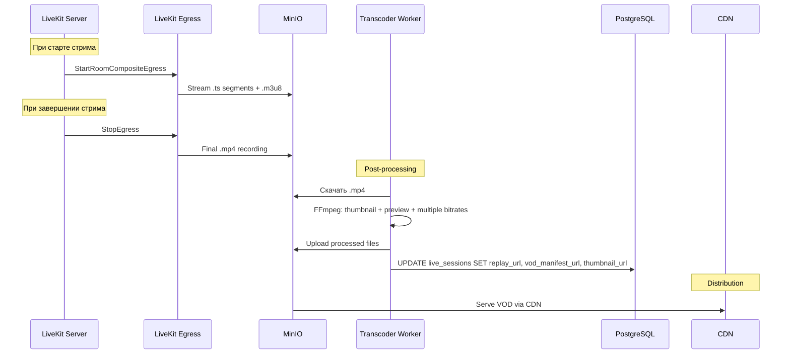

### 11.2 Форматы записи

| Тип | Формат | Хранение | TTL |
|-----|--------|----------|-----|
| Live HLS segments | `.ts` + `.m3u8` | MinIO → CDN | Удаляются через 24ч после окончания стрима |
| Full recording | `.mp4` (H.264 + AAC) | MinIO `live-recordings` bucket | 30 дней (настраиваемо) |
| VOD manifest | `.m3u8` (multi-bitrate) | MinIO → CDN | 30 дней |
| Thumbnail | `.jpg` (640×360) | MinIO `media` bucket | Бессрочно |
| Preview clip | `.mp4` (15s, 480p) | MinIO `media` bucket | 30 дней |

### 11.3 Конвертация в Reels

Стример может конвертировать фрагмент VOD в Reel:

```
1. Выбрать временной диапазон (start_ts, end_ts, max 90s)
2. Edge Function: clip_vod_to_reel_v1
3. FFmpeg: вырезать сегмент, конвертировать в вертикальный 9:16
4. Upload в reels-media bucket
5. Создать запись в posts таблице как type=reel
```

---

## 12. Совместные эфиры — Live Rooms

### 12.1 Архитектура

Instagram Live Rooms: до 4 участников одновременно в эфире.

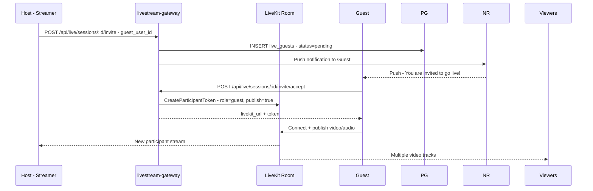

### 12.2 Таблица live_guests

```sql
CREATE TABLE public.live_guests (
  id BIGSERIAL PRIMARY KEY,
  session_id BIGINT NOT NULL REFERENCES live_sessions(id) ON DELETE CASCADE,
  guest_user_id UUID NOT NULL REFERENCES auth.users(id) ON DELETE CASCADE,
  invited_by UUID NOT NULL REFERENCES auth.users(id) ON DELETE CASCADE,
  status TEXT NOT NULL DEFAULT 'pending'
    CHECK (status IN ('pending', 'accepted', 'declined', 'joined', 'left', 'removed')),
  joined_at TIMESTAMPTZ,
  left_at TIMESTAMPTZ,
  created_at TIMESTAMPTZ NOT NULL DEFAULT now(),
  UNIQUE(session_id, guest_user_id)
);
```

### 12.3 Ограничения

| Параметр | Значение |
|----------|---------|
| Макс. гостей одновременно | 3 (+ хост = 4 участника) |
| Макс. приглашений за стрим | 10 |
| Время ожидания принятия | 60 секунд |
| Гость может отклонить | Да |
| Хост может удалить гостя | Да, в любой момент |

### 12.4 Layout на клиенте

| Участников | Layout |
|-----------|--------|
| 1 (только хост) | Full screen |
| 2 | 50/50 вертикальный split |
| 3 | Top 50% хост, Bottom 50% 2 гостя side-by-side |
| 4 | 2×2 grid |

---

## 13. Подарки и донаты

### 13.1 Текущая схема (расширение)

Таблица `live_donations` уже существует. Расширяем:

```sql
ALTER TABLE live_donations ADD COLUMN IF NOT EXISTS gift_type TEXT DEFAULT 'stars';
ALTER TABLE live_donations ADD COLUMN IF NOT EXISTS animation_id TEXT;
ALTER TABLE live_donations ADD COLUMN IF NOT EXISTS platform_fee FLOAT DEFAULT 0;
ALTER TABLE live_donations ADD COLUMN IF NOT EXISTS streamer_payout FLOAT DEFAULT 0;
```

### 13.2 Виртуальные подарки

| Подарок | Стоимость (Stars) | Анимация | Commission |
|---------|-------------------|----------|------------|
| ❤️ Heart | 1 | float-up | 0% |
| 🌹 Rose | 10 | spin-float | 10% |
| 🎉 Confetti | 50 | fullscreen confetti | 15% |
| 💎 Diamond | 100 | fullscreen diamond rain | 15% |
| 🚀 Rocket | 500 | fullscreen rocket launch | 20% |
| 👑 Crown | 1000 | fullscreen crown + fireworks | 20% |

### 13.3 Поток

```
1. Зритель выбирает подарок → POST /api/live/donate
2. Edge Function проверяет баланс Stars
3. Списание со счёта зрителя
4. Начисление на счёт стримера (минус комиссия)
5. INSERT в live_donations
6. Supabase Realtime broadcast → все зрители видят анимацию
7. Donation popup у стримера с звуком
```

---

## 14. Магазин в эфире — Live Shopping

### 14.1 Архитектура (Phase 2)

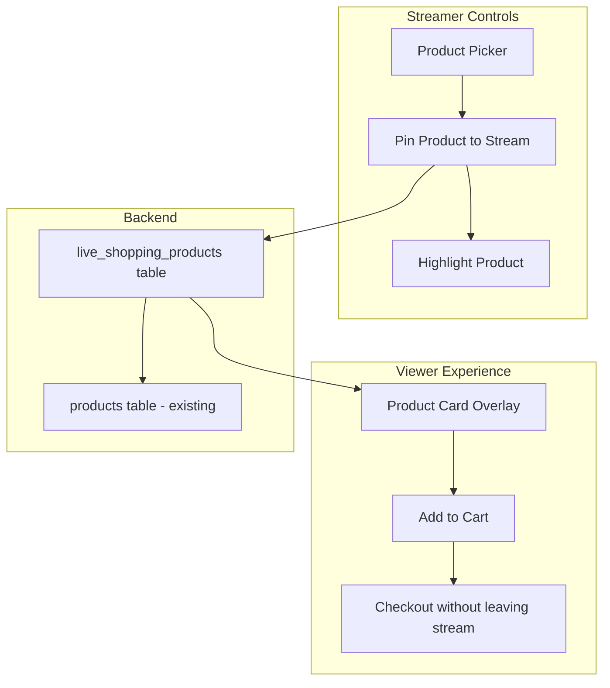

### 14.2 Таблица live_shopping_products

```sql
CREATE TABLE public.live_shopping_products (
  id BIGSERIAL PRIMARY KEY,
  session_id BIGINT NOT NULL REFERENCES live_sessions(id) ON DELETE CASCADE,
  product_id UUID NOT NULL,  -- FK to products table
  display_order INT NOT NULL DEFAULT 0,
  is_pinned BOOLEAN NOT NULL DEFAULT false,
  discount_percent INT DEFAULT 0 CHECK (discount_percent >= 0 AND discount_percent <= 100),
  pinned_at TIMESTAMPTZ,
  created_at TIMESTAMPTZ NOT NULL DEFAULT now()
);
```

### 14.3 Функциональность

- Стример может добавить до 20 товаров перед/во время стрима
- В любой момент "pin" товар → оверлей появляется у всех зрителей
- Зритель может добавить в корзину из оверлея
- Quick checkout без выхода из стрима (bottom sheet)
- Эксклюзивные скидки только во время стрима

> **Приоритет**: Phase 2. Зависит от готовности модуля Shop.

---

## 15. Статистика стрима

### 15.1 Real-time метрики (во время стрима)

| Метрика | Источник | Обновление |
|---------|----------|-----------|
| Текущие зрители | Presence | 10с |
| Пиковые зрители | MAX(current) | 10с |
| Длительность стрима | `started_at` → now() | 1с (клиент) |
| Сообщений в чат | COUNT(live_chat_messages) | Realtime |
| Реакций | Aggregated broadcast events | 5с |
| Донатов получено | SUM(live_donations.amount) | Realtime |

### 15.2 Post-stream analytics

| Метрика | SQL / Вычисление |
|---------|-----------------|
| Уникальные зрители | `COUNT(DISTINCT viewer_id) FROM live_viewers WHERE session_id = ?` |
| Среднее время просмотра | `AVG(watch_duration_seconds) FROM live_viewers WHERE session_id = ?` |
| Retention rate | `viewers_at_end / viewers_peak * 100` |
| Engagement rate | `(messages + reactions + donations) / unique_viewers * 100` |
| Revenue | `SUM(amount) FROM live_donations WHERE session_id = ?` |
| Top donors | `GROUP BY donor_id ORDER BY SUM(amount) DESC LIMIT 10` |

### 15.3 Таблица агрегированной статистики

```sql
CREATE TABLE public.live_session_analytics (
  session_id BIGINT PRIMARY KEY REFERENCES live_sessions(id) ON DELETE CASCADE,
  unique_viewers INT NOT NULL DEFAULT 0,
  peak_viewers INT NOT NULL DEFAULT 0,
  avg_watch_seconds FLOAT NOT NULL DEFAULT 0,
  total_messages INT NOT NULL DEFAULT 0,
  total_reactions INT NOT NULL DEFAULT 0,
  total_donations_amount FLOAT NOT NULL DEFAULT 0,
  total_donations_count INT NOT NULL DEFAULT 0,
  total_shares INT NOT NULL DEFAULT 0,
  total_new_followers INT NOT NULL DEFAULT 0,
  engagement_rate FLOAT NOT NULL DEFAULT 0,
  retention_rate FLOAT NOT NULL DEFAULT 0,
  computed_at TIMESTAMPTZ NOT NULL DEFAULT now()
);
```

---

## 16. Геолокация и ограничения

### 16.1 Geo-restriction

| Уровень | Механизм | Где |
|---------|----------|-----|
| Стример выбирает регионы | UI select при создании сессии | `live_sessions.allowed_regions` |
| Проверка зрителя | Cloudflare `CF-IPCountry` header | livestream-gateway |
| Блокировка | 403 Forbidden с объяснением | API response |

### 16.2 Расширение схемы

```sql
ALTER TABLE live_sessions ADD COLUMN IF NOT EXISTS allowed_regions TEXT[] DEFAULT '{}';
-- Пустой массив = доступно всем
-- ['RU', 'KZ', 'BY'] = только эти страны
```

### 16.3 Compliance

- **DMCA**: Автоматическое отключение по запросу правообладателя (admin API)
- **Age restriction**: Стример помечает стрим 18+ → зритель подтверждает возраст
- **Regional laws**: Модерация контента по требованиям региона

---

## 17. CDN-интеграция

### 17.1 Архитектура

```
LiveKit Egress → MinIO (S3) → CDN (Cloudflare / BunnyCDN) → Viewers
```

### 17.2 Cloudflare конфигурация

```
Origin: minio.mansoni.ru
Cache Rules:
  - /hls/*/playlist.m3u8  → Cache: 1s (master playlist, very short)
  - /hls/*/*.m3u8          → Cache: 1s (media playlists)
  - /hls/*/*.ts            → Cache: 1h (segments, immutable)
  - /vod/*                 → Cache: 24h
  - /thumbnails/*          → Cache: 1h

CORS:
  Access-Control-Allow-Origin: https://mansoni.ru, capacitor://localhost
  Access-Control-Allow-Methods: GET, OPTIONS
```

### 17.3 BunnyCDN (альтернатива)

```
Pull Zone: live.cdn.mansoni.ru
Origin: minio.mansoni.ru
Token Authentication: HMAC-SHA256 для VOD
Geo-replication: EU, US, Asia
```

### 17.4 DNS маршрутизация

```
live.mansoni.ru      → LiveKit Ingress (RTMP/WHIP)
live-api.mansoni.ru  → livestream-gateway
hls.mansoni.ru       → CDN (HLS segments)
```

---

## 18. Безопасность

### 18.1 Stream Key Management

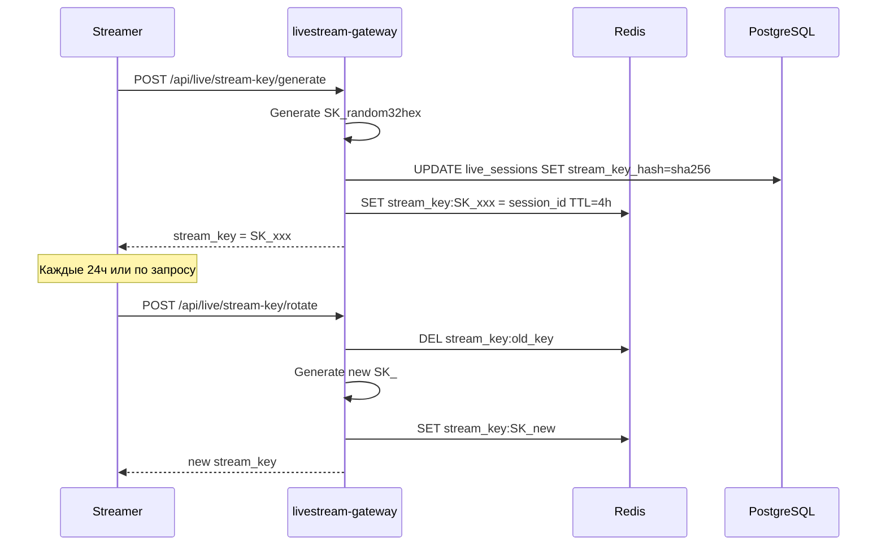

### 18.2 Матрица безопасности

| Вектор | Защита | Уровень |
|--------|--------|---------|
| Несанкционированный стрим | Stream key + JWT auth | Critical |
| Stream key leak | Rotation каждые 24ч + one-time use | High |
| Chat spam/flood | Redis rate-limiting + keyword filter | High |
| RTMP replay attack | Stream key привязан к session_id | High |
| WebRTC eavesdropping | DTLS-SRTP (LiveKit default) | Critical |
| HLS segment theft | Token-auth на CDN (signed URLs) | Medium |
| DDoS на RTMP | Rate-limit connections per IP (Nginx) | High |
| Malicious viewer | Presence + Ban + IP block | Medium |
| Content piracy | Watermark overlay (user_id + timestamp) | Low |
| DMCA | Admin API force-stop + content removal | High |

### 18.3 Rate Limiting

| Endpoint | Limit | Window |
|----------|-------|--------|
| POST /api/live/sessions | 3/день/user | 24h |
| POST /api/live/chat | 5/10s, 30/min | Sliding |
| POST /api/live/reactions | 3/s | Per-second |
| POST /api/live/donate | 10/min | Sliding |
| POST /api/live/report | 3/стрим/user | Per-session |
| GET /api/live/sessions/:id/join | 100/min/user | Sliding |
| RTMP connect | 2/min/IP | Sliding |

---

## 19. Схема БД — полная

### 19.1 Существующие таблицы (модифицируемые)

```sql
-- Расширение live_sessions
ALTER TABLE live_sessions ADD COLUMN IF NOT EXISTS stream_key_hash TEXT;
ALTER TABLE live_sessions ADD COLUMN IF NOT EXISTS livekit_room_name TEXT;
ALTER TABLE live_sessions ADD COLUMN IF NOT EXISTS livekit_room_id TEXT;
ALTER TABLE live_sessions ADD COLUMN IF NOT EXISTS hls_playlist_url TEXT;
ALTER TABLE live_sessions ADD COLUMN IF NOT EXISTS vod_manifest_url TEXT;
ALTER TABLE live_sessions ADD COLUMN IF NOT EXISTS recording_s3_key TEXT;
ALTER TABLE live_sessions ADD COLUMN IF NOT EXISTS allowed_regions TEXT[] DEFAULT '{}';
ALTER TABLE live_sessions ADD COLUMN IF NOT EXISTS is_age_restricted BOOLEAN DEFAULT false;
ALTER TABLE live_sessions ADD COLUMN IF NOT EXISTS slow_mode_seconds INT DEFAULT 0;
ALTER TABLE live_sessions ADD COLUMN IF NOT EXISTS chat_followers_only BOOLEAN DEFAULT false;
ALTER TABLE live_sessions ADD COLUMN IF NOT EXISTS total_reactions INT DEFAULT 0;
ALTER TABLE live_sessions ADD COLUMN IF NOT EXISTS total_donations_amount FLOAT DEFAULT 0;
ALTER TABLE live_sessions ADD COLUMN IF NOT EXISTS duration_seconds INT DEFAULT 0;

-- Расширение live_donations
ALTER TABLE live_donations ADD COLUMN IF NOT EXISTS gift_type TEXT DEFAULT 'stars';
ALTER TABLE live_donations ADD COLUMN IF NOT EXISTS animation_id TEXT;
ALTER TABLE live_donations ADD COLUMN IF NOT EXISTS platform_fee FLOAT DEFAULT 0;
ALTER TABLE live_donations ADD COLUMN IF NOT EXISTS streamer_payout FLOAT DEFAULT 0;
```

### 19.2 Новые таблицы

```sql
-- Гости совместных эфиров
CREATE TABLE public.live_guests (
  id BIGSERIAL PRIMARY KEY,
  session_id BIGINT NOT NULL REFERENCES live_sessions(id) ON DELETE CASCADE,
  guest_user_id UUID NOT NULL REFERENCES auth.users(id) ON DELETE CASCADE,
  invited_by UUID NOT NULL REFERENCES auth.users(id) ON DELETE CASCADE,
  status TEXT NOT NULL DEFAULT 'pending'
    CHECK (status IN ('pending', 'accepted', 'declined', 'joined', 'left', 'removed')),
  joined_at TIMESTAMPTZ,
  left_at TIMESTAMPTZ,
  created_at TIMESTAMPTZ NOT NULL DEFAULT now(),
  UNIQUE(session_id, guest_user_id)
);
CREATE INDEX idx_live_guests_session ON live_guests(session_id);
CREATE INDEX idx_live_guests_user ON live_guests(guest_user_id);

-- Баны в чате стрима
CREATE TABLE public.live_chat_bans (
  id BIGSERIAL PRIMARY KEY,
  session_id BIGINT NOT NULL REFERENCES live_sessions(id) ON DELETE CASCADE,
  banned_user_id UUID NOT NULL REFERENCES auth.users(id) ON DELETE CASCADE,
  banned_by UUID NOT NULL REFERENCES auth.users(id) ON DELETE CASCADE,
  reason TEXT,
  is_timeout BOOLEAN NOT NULL DEFAULT false,
  timeout_until TIMESTAMPTZ,
  created_at TIMESTAMPTZ NOT NULL DEFAULT now(),
  UNIQUE(session_id, banned_user_id)
);
CREATE INDEX idx_live_chat_bans_session ON live_chat_bans(session_id);

-- Агрегированная аналитика
CREATE TABLE public.live_session_analytics (
  session_id BIGINT PRIMARY KEY REFERENCES live_sessions(id) ON DELETE CASCADE,
  unique_viewers INT NOT NULL DEFAULT 0,
  peak_viewers INT NOT NULL DEFAULT 0,
  avg_watch_seconds FLOAT NOT NULL DEFAULT 0,
  total_messages INT NOT NULL DEFAULT 0,
  total_reactions INT NOT NULL DEFAULT 0,
  total_donations_amount FLOAT NOT NULL DEFAULT 0,
  total_donations_count INT NOT NULL DEFAULT 0,
  total_shares INT NOT NULL DEFAULT 0,
  total_new_followers INT NOT NULL DEFAULT 0,
  engagement_rate FLOAT NOT NULL DEFAULT 0,
  retention_rate FLOAT NOT NULL DEFAULT 0,
  top_donors JSONB DEFAULT '[]',
  viewer_timeline JSONB DEFAULT '[]',
  computed_at TIMESTAMPTZ NOT NULL DEFAULT now()
);

-- Товары в live shopping (Phase 2)
CREATE TABLE public.live_shopping_products (
  id BIGSERIAL PRIMARY KEY,
  session_id BIGINT NOT NULL REFERENCES live_sessions(id) ON DELETE CASCADE,
  product_id UUID NOT NULL,
  display_order INT NOT NULL DEFAULT 0,
  is_pinned BOOLEAN NOT NULL DEFAULT false,
  discount_percent INT DEFAULT 0
    CHECK (discount_percent >= 0 AND discount_percent <= 100),
  pinned_at TIMESTAMPTZ,
  created_at TIMESTAMPTZ NOT NULL DEFAULT now()
);
CREATE INDEX idx_live_shopping_session ON live_shopping_products(session_id);

-- Stream key log (для аудита)
CREATE TABLE public.live_stream_keys (
  id BIGSERIAL PRIMARY KEY,
  session_id BIGINT NOT NULL REFERENCES live_sessions(id) ON DELETE CASCADE,
  key_hash TEXT NOT NULL,
  created_at TIMESTAMPTZ NOT NULL DEFAULT now(),
  expires_at TIMESTAMPTZ NOT NULL,
  revoked_at TIMESTAMPTZ,
  is_active BOOLEAN NOT NULL DEFAULT true
);
CREATE INDEX idx_live_stream_keys_session ON live_stream_keys(session_id);
CREATE INDEX idx_live_stream_keys_active ON live_stream_keys(is_active) WHERE is_active = true;

-- Модераторы стрима (назначаемые стримером)
CREATE TABLE public.live_moderators (
  session_id BIGINT NOT NULL REFERENCES live_sessions(id) ON DELETE CASCADE,
  user_id UUID NOT NULL REFERENCES auth.users(id) ON DELETE CASCADE,
  granted_by UUID NOT NULL REFERENCES auth.users(id) ON DELETE CASCADE,
  created_at TIMESTAMPTZ NOT NULL DEFAULT now(),
  PRIMARY KEY (session_id, user_id)
);

-- Запланированные напоминания
CREATE TABLE public.live_schedule_reminders (
  id BIGSERIAL PRIMARY KEY,
  session_id BIGINT NOT NULL REFERENCES live_sessions(id) ON DELETE CASCADE,
  user_id UUID NOT NULL REFERENCES auth.users(id) ON DELETE CASCADE,
  remind_at TIMESTAMPTZ NOT NULL,
  notified BOOLEAN NOT NULL DEFAULT false,
  created_at TIMESTAMPTZ NOT NULL DEFAULT now(),
  UNIQUE(session_id, user_id)
);
CREATE INDEX idx_live_reminders_notify ON live_schedule_reminders(remind_at)
  WHERE notified = false;
```

### 19.3 ER-диаграмма

```mermaid
erDiagram
    live_sessions ||--o{ live_viewers : has
    live_sessions ||--o{ live_chat_messages : has
    live_sessions ||--o{ live_stream_reports : has
    live_sessions ||--o{ live_questions : has
    live_sessions ||--o{ live_donations : has
    live_sessions ||--o{ live_guests : has
    live_sessions ||--o{ live_chat_bans : has
    live_sessions ||--|| live_session_analytics : has
    live_sessions ||--o{ live_shopping_products : has
    live_sessions ||--o{ live_stream_keys : has
    live_sessions ||--o{ live_moderators : has
    live_sessions ||--o{ live_schedule_reminders : has

    live_sessions {
        bigint id PK
        uuid creator_id FK
        text title
        text description
        text category
        text thumbnail_url
        text status
        text stream_key_hash
        text livekit_room_name
        text livekit_room_id
        text hls_playlist_url
        text vod_manifest_url
        text recording_s3_key
        text[] allowed_regions
        bool is_age_restricted
        int slow_mode_seconds
        bool chat_followers_only
        text moderation_status
        int viewer_count_current
        int viewer_count_peak
        int total_reactions
        float total_donations_amount
        int duration_seconds
        timestamptz started_at
        timestamptz ended_at
        timestamptz scheduled_at
        int max_guests
        text pinned_comment
        text replay_url
    }

    live_viewers {
        bigint id PK
        bigint session_id FK
        uuid viewer_id FK
        timestamptz joined_at
        timestamptz left_at
        int watch_duration_seconds
    }

    live_guests {
        bigint id PK
        bigint session_id FK
        uuid guest_user_id FK
        uuid invited_by FK
        text status
        timestamptz joined_at
        timestamptz left_at
    }

    live_chat_messages {
        bigint id PK
        bigint session_id FK
        uuid sender_id FK
        text content
        bool is_creator_message
        bool is_hidden_by_creator
        bool is_auto_hidden
    }

    live_donations {
        uuid id PK
        uuid session_id FK
        uuid donor_id FK
        uuid streamer_id FK
        float amount
        text currency
        text gift_type
        text animation_id
        float platform_fee
        float streamer_payout
    }

    live_session_analytics {
        bigint session_id PK_FK
        int unique_viewers
        int peak_viewers
        float avg_watch_seconds
        float engagement_rate
        float retention_rate
        jsonb top_donors
    }
```

---

## 20. API-эндпоинты и Edge Functions

### 20.1 livestream-gateway (Node.js сервис)

REST API + WebSocket для управления стримами:

| Method | Endpoint | Описание | Auth |
|--------|----------|----------|------|
| POST | `/api/live/sessions` | Создать сессию (вызывает LiveKit CreateRoom) | JWT |
| GET | `/api/live/sessions/active` | Список активных стримов (discovery) | JWT |
| GET | `/api/live/sessions/:id` | Детали сессии | JWT |
| POST | `/api/live/sessions/:id/start` | Начать вещание (status → live, push followers) | JWT + creator |
| POST | `/api/live/sessions/:id/end` | Завершить стрим | JWT + creator |
| GET | `/api/live/sessions/:id/join` | Получить LiveKit token для зрителя | JWT |
| POST | `/api/live/sessions/:id/chat` | Отправить сообщение (rate-limited) | JWT |
| POST | `/api/live/sessions/:id/report` | Репорт стрима | JWT |
| POST | `/api/live/sessions/:id/invite` | Пригласить гостя | JWT + creator |
| POST | `/api/live/sessions/:id/invite/accept` | Принять приглашение | JWT + guest |
| POST | `/api/live/sessions/:id/invite/decline` | Отклонить приглашение | JWT + guest |
| POST | `/api/live/sessions/:id/kick-guest/:userId` | Удалить гостя | JWT + creator |
| POST | `/api/live/sessions/:id/donate` | Отправить донат/подарок | JWT |
| POST | `/api/live/sessions/:id/ban` | Забанить зрителя в чате | JWT + creator/mod |
| POST | `/api/live/sessions/:id/unban` | Разбанить | JWT + creator/mod |
| POST | `/api/live/sessions/:id/pin-product` | Закрепить товар (live shopping) | JWT + creator |
| POST | `/api/live/sessions/:id/mod/add` | Назначить модератора | JWT + creator |
| GET | `/api/live/sessions/:id/analytics` | Статистика стрима (post-stream) | JWT + creator |
| POST | `/api/live/stream-key/generate` | Генерация stream key для RTMP | JWT + creator |
| POST | `/api/live/stream-key/rotate` | Ротация stream key | JWT + creator |
| GET | `/api/live/schedule` | Запланированные эфиры | JWT |
| POST | `/api/live/schedule/:id/remind` | Подписаться на напоминание | JWT |

### 20.2 Новые Edge Functions

| Function | Описание |
|----------|----------|
| `live-session-create` | Создание сессии + валидация через `is_eligible_for_live_v1` |
| `live-webhook` | Приём webhooks от LiveKit (participant joined/left, egress finished) |
| `live-analytics-compute` | Вычисление post-stream аналитики (вызывается по cron или webhook) |
| `live-moderation-check` | Проверка скриншотов из HLS на NSFW |
| `live-vod-process` | Запуск пост-обработки VOD (после завершения egress) |
| `live-reminder-notify` | Cron: отправка напоминаний о запланированных эфирах |

### 20.3 Новые RPC Functions (PostgreSQL)

```sql
-- Получить статус бана зрителя в чате
CREATE FUNCTION is_chat_banned_v1(p_session_id BIGINT, p_user_id UUID)
  RETURNS BOOLEAN;

-- Назначить/снять модератора
CREATE FUNCTION live_moderator_toggle_v1(p_session_id BIGINT, p_user_id UUID, p_grant BOOLEAN)
  RETURNS BOOLEAN;

-- Получить аналитику стрима
CREATE FUNCTION get_live_analytics_v1(p_session_id BIGINT)
  RETURNS TABLE(...);

-- Вырезать клип из VOD
CREATE FUNCTION clip_vod_to_reel_v1(p_session_id BIGINT, p_start_ts FLOAT, p_end_ts FLOAT)
  RETURNS TABLE(reel_id UUID, status TEXT);
```

---

## 21. Фронтенд-архитектура

### 21.1 Новые и модифицируемые файлы

```
src/
├── hooks/
│   ├── useLiveSession.ts          — CRUD live session, join/leave
│   ├── useLiveChat.ts             — Chat messages + Realtime subscription
│   ├── useLiveReactions.ts        — Broadcast channel reactions
│   ├── useLivePresence.ts         — Viewer count via Presence
│   ├── useLiveDonation.ts         — Donations (refactor из компонента)
│   ├── useLiveGuests.ts           — Invite/accept/decline/kick guests
│   ├── useLivePlayer.ts           — LiveKit room connect + ABR control
│   └── useLiveAnalytics.ts        — Post-stream stats
├── pages/
│   ├── live/
│   │   ├── LiveBroadcastRoom.tsx  — РЕФАКТОРИНГ: подключить LiveKit publish
│   │   ├── LiveViewerRoom.tsx     — РЕФАКТОРИНГ: подключить LiveKit subscribe + HLS fallback
│   │   ├── LiveDiscoveryFeed.tsx  — НОВЫЙ: лента активных стримов
│   │   └── LiveAnalyticsPage.tsx  — НОВЫЙ: пост-стрим аналитика
│   └── creator/
│       ├── LiveBroadcastCheck.tsx — Без изменений
│       ├── LiveSetupSheet.tsx     — FIX: убрать дублирующий import
│       └── LiveStreamKeyPage.tsx  — НОВЫЙ: управление stream key
├── components/
│   └── live/
│       ├── LiveDonation.tsx       — Без изменений
│       ├── LiveQAQueue.tsx        — Без изменений
│       ├── LiveReplay.tsx         — РЕФАКТОРИНГ: подключить VOD player
│       ├── InviteGuestSheet.tsx   — РЕФАКТОРИНГ: подключить LiveKit guest
│       ├── ScheduleLiveSheet.tsx  — Без изменений
│       ├── LiveChatPanel.tsx      — НОВЫЙ: standalone chat panel
│       ├── LiveReactionOverlay.tsx — НОВЫЙ: floating reactions UI
│       ├── LiveViewerList.tsx     — НОВЫЙ: список зрителей + модерация
│       ├── LiveProductCard.tsx    — НОВЫЙ: product overlay (Phase 2)
│       ├── LiveABRSelector.tsx    — НОВЫЙ: ручной выбор качества
│       ├── LiveGuestLayout.tsx    — НОВЫЙ: split-screen grid layout
│       └── LiveHLSPlayer.tsx      — НОВЫЙ: HLS.js fallback player
├── contexts/
│   └── LiveStreamContext.tsx      — НОВЫЙ: shared state для live room
└── lib/
    └── live/
        ├── livekit-client.ts      — LiveKit connection manager
        ├── stream-key.ts          — Stream key generation utilities
        ├── hls-player.ts          — HLS.js wrapper
        └── live-analytics.ts      — Analytics computation helpers
```

### 21.2 Роутинг (дополнения к App.tsx)

```
/creator/live/check          → LiveBroadcastCheck      — Проверка eligibility
/creator/live/setup          → LiveSetupSheet           — Настройка стрима
/creator/live/stream-key     → LiveStreamKeyPage        — Управление stream key
/live/:sessionId             → LiveBroadcastRoom        — Экран стримера
/live/:sessionId/watch       → LiveViewerRoom           — Экран зрителя
/live/:sessionId/analytics   → LiveAnalyticsPage        — Аналитика (post-stream)
/live/discover               → LiveDiscoveryFeed        — Лента стримов
```

### 21.3 Протокол переключения WebRTC → HLS

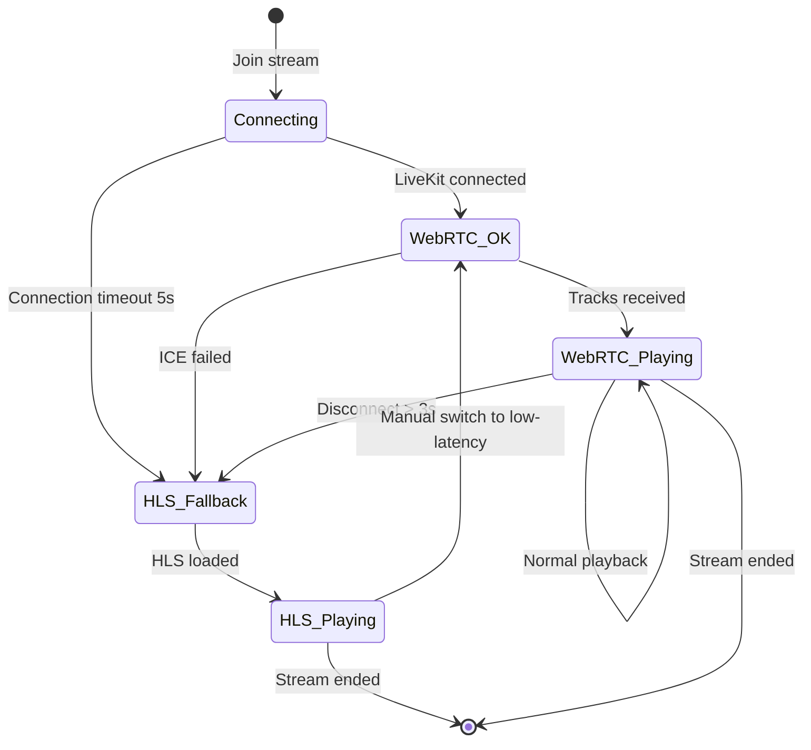

---

## 22. Инфраструктура — Docker / Kubernetes

### 22.1 Docker Compose (dev/staging)

```yaml
# infra/livestream/docker-compose.yml
services:
  livekit:
    image: livekit/livekit-server:v1.7
    restart: unless-stopped
    ports:
      - "7880:7880"      # HTTP API
      - "7881:7881"      # WebRTC TCP
      - "7882:7882/udp"  # WebRTC UDP
      - "50000-60000:50000-60000/udp"  # ICE UDP range
    environment:
      - LIVEKIT_KEYS=APIxxx: secret_xxx
    volumes:
      - ./livekit.yaml:/etc/livekit.yaml:ro
    command: ["--config", "/etc/livekit.yaml"]

  livekit-ingress:
    image: livekit/ingress:v1.4
    restart: unless-stopped
    ports:
      - "1935:1935"   # RTMP
      - "8088:8088"   # WHIP
    environment:
      - LIVEKIT_URL=ws://livekit:7880
      - LIVEKIT_API_KEY=APIxxx
      - LIVEKIT_API_SECRET=secret_xxx
    depends_on:
      - livekit

  livekit-egress:
    image: livekit/egress:v1.8
    restart: unless-stopped
    environment:
      - LIVEKIT_URL=ws://livekit:7880
      - LIVEKIT_API_KEY=APIxxx
      - LIVEKIT_API_SECRET=secret_xxx
      - S3_ENDPOINT=http://minio:9000
      - S3_BUCKET=live-recordings
      - S3_ACCESS_KEY=${MINIO_ROOT_USER}
      - S3_SECRET_KEY=${MINIO_ROOT_PASSWORD}
      - S3_REGION=us-east-1
    depends_on:
      - livekit

  livestream-gateway:
    build:
      context: ../../server/livestream-gateway
      dockerfile: Dockerfile
    restart: unless-stopped
    ports:
      - "9090:9090"
    environment:
      - PORT=9090
      - LIVEKIT_URL=ws://livekit:7880
      - LIVEKIT_API_KEY=APIxxx
      - LIVEKIT_API_SECRET=secret_xxx
      - REDIS_URL=redis://redis:6379
      - SUPABASE_URL=${SUPABASE_URL}
      - SUPABASE_SERVICE_KEY=${SUPABASE_SERVICE_KEY}
    depends_on:
      - livekit
      - redis

  redis:
    image: redis:7-alpine
    command: ["redis-server", "--appendonly", "no"]
    ports:
      - "6380:6379"
    healthcheck:
      test: ["CMD", "redis-cli", "ping"]
      interval: 5s
```

### 22.2 LiveKit Server Config

```yaml
# infra/livestream/livekit.yaml
port: 7880
rtc:
  tcp_port: 7881
  port_range_start: 50000
  port_range_end: 60000
  use_external_ip: true
redis:
  address: redis:6379
keys:
  APIxxx: secret_xxx
room:
  auto_create: false
  max_participants: 10000
  empty_timeout: 300
logging:
  level: info
webhook:
  urls:
    - https://live-api.mansoni.ru/api/live/webhook
  api_key: APIxxx
turn:
  enabled: true
  domain: turn.mansoni.ru
  tls_port: 5349
  udp_port: 3478
ingress:
  rtmp_port: 1935
  whip_port: 8088
```

### 22.3 Production Architecture

```
                    ┌─────────────────────┐
                    │   Load Balancer      │
                    │   (Nginx / HAProxy)  │
                    └──────────┬──────────┘
                               │
              ┌────────────────┼────────────────┐
              │                │                │
    ┌─────────┴──────┐  ┌─────┴──────┐  ┌─────┴──────┐
    │ LiveKit Node 1 │  │ LiveKit    │  │ LiveKit    │
    │ (Region: EU)   │  │ Node 2     │  │ Node 3     │
    │                │  │ (Region:RU)│  │ (Region:AS)│
    └─────────┬──────┘  └─────┬──────┘  └─────┴──────┘
              │                │                │
              └────────────────┼────────────────┘
                               │
                        ┌──────┴──────┐
                        │   Redis     │
                        │  (Cluster)  │
                        └─────────────┘
```

---

## 23. Зависимости

### 23.1 npm-пакеты (frontend)

| Пакет | Версия | Назначение |
|-------|--------|-----------|
| `livekit-client` | `^2.5` | LiveKit WebRTC SDK для браузера |
| `hls.js` | `^1.5` | HLS player для fallback |
| `@livekit/components-react` | `^2.6` | React-компоненты для LiveKit (опционально) |

### 23.2 npm-пакеты (livestream-gateway)

| Пакет | Версия | Назначение |
|-------|--------|-----------|
| `livekit-server-sdk` | `^2.6` | Server-side LiveKit API (token generation, room management) |
| `ioredis` | `^5.6` | Redis клиент (уже в проекте) |
| `@supabase/supabase-js` | `^2.90` | Supabase клиент (уже в проекте) |
| `ws` | `^8.18` | WebSocket server (уже в проекте) |
| `fastify` | `^5.1` | HTTP framework |
| `@fastify/rate-limit` | `^10.1` | Rate limiting |
| `@fastify/cors` | `^10.0` | CORS |

### 23.3 Docker-образы

| Образ | Tag | Назначение |
|-------|-----|-----------|
| `livekit/livekit-server` | `v1.7` | LiveKit SFU + room management |
| `livekit/ingress` | `v1.4` | RTMP/WHIP → WebRTC ingress |
| `livekit/egress` | `v1.8` | WebRTC → HLS/MP4 egress |
| `redis:7-alpine` | `7-alpine` | State + PubSub (уже есть) |

### 23.4 Внешние сервисы

| Сервис | Назначение | Обязательный |
|--------|-----------|-------------|
| Cloudflare / BunnyCDN | HLS CDN | Да (для > 100 зрителей) |
| OpenAI Vision API | NSFW moderation | Нет (Phase 2) |
| Cloudflare Workers | Edge auth for HLS | Нет (можно signed URLs) |

---

## 24. План миграций

### 24.1 Порядок SQL-миграций

| # | Файл | Содержание |
|---|------|-----------|
| 1 | `20260309000001_livestream_schema_extensions.sql` | ALTER TABLE live_sessions (новые колонки), ALTER TABLE live_donations |
| 2 | `20260309000002_livestream_guests_table.sql` | CREATE TABLE live_guests |
| 3 | `20260309000003_livestream_chat_bans.sql` | CREATE TABLE live_chat_bans |
| 4 | `20260309000004_livestream_analytics.sql` | CREATE TABLE live_session_analytics |
| 5 | `20260309000005_livestream_stream_keys.sql` | CREATE TABLE live_stream_keys |
| 6 | `20260309000006_livestream_moderators.sql` | CREATE TABLE live_moderators |
| 7 | `20260309000007_livestream_reminders.sql` | CREATE TABLE live_schedule_reminders |
| 8 | `20260309000008_livestream_shopping.sql` | CREATE TABLE live_shopping_products (Phase 2) |
| 9 | `20260309000009_livestream_rpc_functions.sql` | Новые RPC: is_chat_banned_v1, live_moderator_toggle_v1, get_live_analytics_v1 |
| 10 | `20260309000010_livestream_rls_policies.sql` | RLS policies для всех новых таблиц |
| 11 | `20260309000011_livestream_grants.sql` | GRANT SELECT/INSERT/UPDATE для authenticated |

### 24.2 Фазы реализации

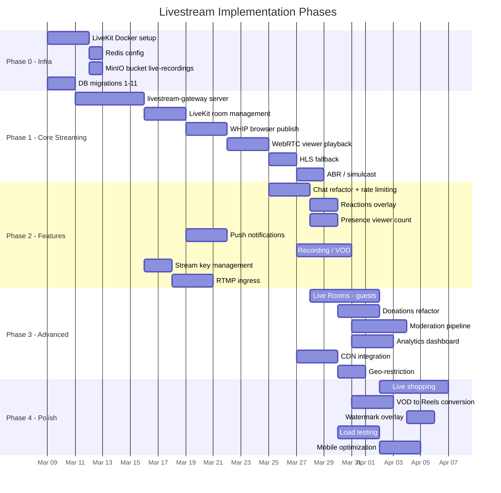

---

## 25. Оценка масштабируемости

### 25.1 Bottleneck analysis

| Компонент | Bottleneck | Решение |
|-----------|-----------|---------|
| LiveKit Server | CPU: 1 node ≈ 500 WebRTC viewers | Горизонтальное масштабирование через Redis |
| HLS Egress | 1 egress per stream | Несколько egress workers |
| CDN | Bandwidth | Cloudflare unlimited / BunnyCDN по трафику |
| PostgreSQL | Writes при высоком chat rate | Batch INSERT, pg_cron cleanup |
| Redis | Memory при 10k+ streams | Redis Cluster |
| Supabase Realtime | Connections per project | Channel-based multiplexing |
| MinIO | Disk I/O при записи | SSD + multi-node MinIO |

### 25.2 Capacity planning

| Метрика | 1k viewers | 10k viewers | 100k viewers |
|---------|-----------|-------------|-------------|
| LiveKit nodes | 1 | 3 | 20 |
| WebRTC viewers | 500 | 5,000 | 10,000 |
| HLS viewers | 500 | 5,000 | 90,000 |
| CDN bandwidth | 2 Gbps | 20 Gbps | 200 Gbps |
| Chat messages/sec | 50 | 500 | 2,000 |
| Redis memory | 100 MB | 500 MB | 2 GB |
| MinIO storage/hour | 2 GB | 2 GB | 2 GB (same stream) |

### 25.3 Стратегия масштабирования

```
1. < 100 стримов, < 500 viewers/stream:
   → Single LiveKit node + HLS CDN
   → Стоимость: ~$50/мес (VPS + CDN)

2. 100-1000 стримов, < 5000 viewers/stream:
   → 3 LiveKit nodes (multi-region: EU, RU, Asia)
   → Redis Cluster
   → CDN с geo-replication
   → Стоимость: ~$500/мес

3. > 1000 стримов, > 10k viewers:
   → Kubernetes + HPA autoscaling
   → LiveKit Cloud (managed)
   → Multi-region CDN
   → Dedicated PostgreSQL instance
   → Стоимость: ~$5000+/мес
```

---

## Приложение A: Конфигурация окружения

### .env.example (дополнения)

```env
# === LiveKit ===
LIVEKIT_URL=ws://localhost:7880
LIVEKIT_API_KEY=APIxxx
LIVEKIT_API_SECRET=secret_xxx
LIVEKIT_INGRESS_URL=rtmp://localhost:1935
LIVEKIT_WHIP_URL=http://localhost:8088

# === Livestream Gateway ===
LIVESTREAM_GATEWAY_PORT=9090
LIVESTREAM_GATEWAY_URL=http://localhost:9090

# === CDN ===
CDN_HLS_BASE_URL=https://hls.mansoni.ru
CDN_TYPE=cloudflare  # cloudflare | bunnycdn | none

# === Moderation ===
LIVE_NSFW_CHECK_ENABLED=false
LIVE_NSFW_CHECK_INTERVAL_SEC=30
OPENAI_API_KEY=sk-xxx  # для NSFW detection (опционально)

# === Frontend (VITE_*) ===
VITE_LIVEKIT_URL=wss://lk.mansoni.ru
VITE_LIVESTREAM_GATEWAY_URL=https://live-api.mansoni.ru
VITE_CDN_HLS_BASE_URL=https://hls.mansoni.ru
```

---

## Приложение B: Сводка изменений по файлам

### Серверная часть (новые файлы)

| Путь | Описание |
|------|----------|
| `server/livestream-gateway/index.mjs` | Основной HTTP + WS сервер |
| `server/livestream-gateway/livekit.mjs` | LiveKit SDK wrapper |
| `server/livestream-gateway/chat.mjs` | Chat rate-limiting + anti-spam |
| `server/livestream-gateway/donations.mjs` | Donation processing |
| `server/livestream-gateway/guests.mjs` | Guest invite/management |
| `server/livestream-gateway/moderation.mjs` | Stream moderation pipeline |
| `server/livestream-gateway/analytics.mjs` | Analytics computation |
| `server/livestream-gateway/webhook.mjs` | LiveKit webhook handler |
| `server/livestream-gateway/Dockerfile` | Docker image |
| `server/livestream-gateway/package.json` | Dependencies |

### Инфраструктура (новые файлы)

| Путь | Описание |
|------|----------|
| `infra/livestream/docker-compose.yml` | LiveKit + Ingress + Egress + Gateway |
| `infra/livestream/livekit.yaml` | LiveKit server config |
| `infra/livestream/.env.example` | Environment variables |
| `infra/livestream/README.md` | Docs |

### Supabase Edge Functions (новые)

| Путь | Описание |
|------|----------|
| `supabase/functions/live-webhook/index.ts` | LiveKit webhook receiver |
| `supabase/functions/live-analytics-compute/index.ts` | Post-stream analytics |
| `supabase/functions/live-moderation-check/index.ts` | NSFW screenshot check |
| `supabase/functions/live-vod-process/index.ts` | VOD post-processing |
| `supabase/functions/live-reminder-notify/index.ts` | Scheduled reminders |

---

*Документ подготовлен: 2026-03-08. Следующий шаг: утверждение архитектуры и переход к Phase 0 — Infrastructure Setup.*
