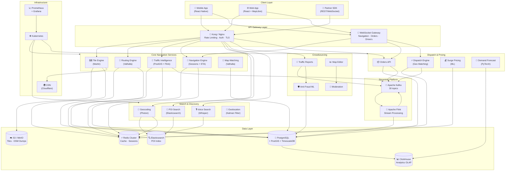
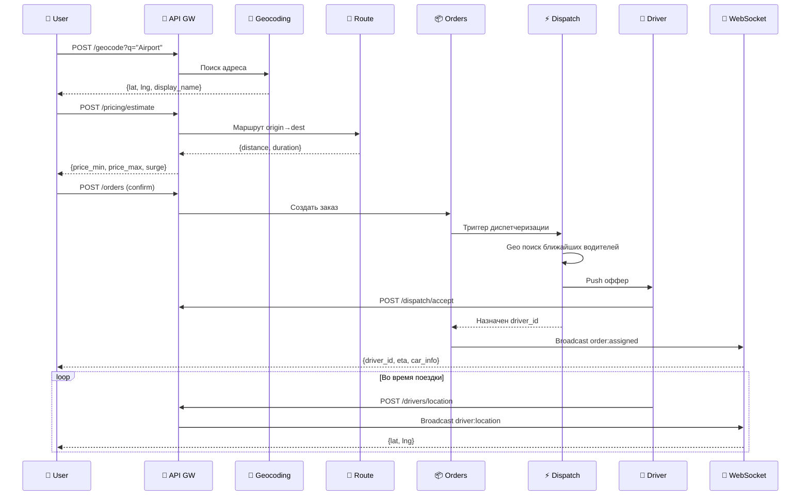

# ECOMANSONI Navigation Platform — Финальная сводка и ревью документации

> **Версия:** 1.0.0 | **Дата:** 2026-03-06 | **Статус:** Final Review  
> **Охват:** 5 частей документации, ~600 KB суммарно

---

## Содержание

1. [Executive Summary](#1-executive-summary)
2. [Documentation Map](#2-documentation-map)
3. [Complete Technology Stack](#3-complete-technology-stack)
4. [Complete Database Schema Summary](#4-complete-database-schema-summary)
5. [Complete API Surface](#5-complete-api-surface)
6. [Complete Kafka Topics](#6-complete-kafka-topics)
7. [Complete Redis Keyspace](#7-complete-redis-keyspace)
8. [Architecture Overview](#8-architecture-overview)
9. [Cross-Document Consistency Review](#9-cross-document-consistency-review)
10. [Security Audit Summary](#10-security-audit-summary)
11. [SLO/SLA Summary](#11-slosla-summary)
12. [MVP Readiness Assessment](#12-mvp-readiness-assessment)
13. [Estimated Infrastructure Costs](#13-estimated-infrastructure-costs)
14. [Team Requirements](#14-team-requirements)
15. [Open Questions & Next Steps](#15-open-questions--next-steps)

---

## 1. Executive Summary

### 1.1 Общее видение

**ECOMANSONI Navigation Platform** — это полностью самостоятельная навигационная экосистема уровня production, спроектированная как ядро super-app для рынков MENA/СНГ. Платформа объединяет картографические данные, turn-by-turn навигацию, crowdsourced трафик, геокодирование, dispatch, страхование и аналитику в единой архитектуре с открытым исходным кодом в основе.

Платформа сознательно избегает зависимости от Google Maps / HERE / TomTom API, строясь на OpenStreetMap + Valhalla + Photon — стеке, который обеспечивает **нулевые per-query royalty costs** при сохранении feature parity с коммерческими решениями для подавляющего большинства use cases.

### 1.2 Ключевые Capabilities

| Capability | Технология | Статус |
|---|---|---|
| Векторные карты с офлайн-поддержкой | Martin tile server + MBTiles | Готово к реализации |
| Turn-by-turn навигация | Valhalla routing engine | Готово к реализации |
| Crowdsourced трафик в реальном времени | Kafka + PostGIS + Flink | Готово к реализации |
| Map Matching GPS треков | Valhalla map matching API | Готово к реализации |
| Геокодирование + POI поиск | Photon (Elasticsearch-based) | Готово к реализации |
| Голосовой поиск | OpenAI Whisper (self-hosted) | Готово к реализации |
| Фильтрация GPS шума | Kalman filter (Rust/Go) | Готово к реализации |
| Редактирование карт пользователями | OSM-подобный editor + moderation | Проектирование |
| Anti-fraud для трафик-репортов | ML scoring + honeypot | Проектирование |
| Dispatch & surge pricing | Геопространственный матчинг | Готово к реализации |
| Мультимодальные маршруты | Valhalla multimodal | Готово к реализации |
| SDK для партнёров | REST + WebSocket + Webhooks | Проектирование |

### 1.3 Differentiators vs Конкурентов

| Feature | ECOMANSONI | Google Maps Platform | HERE Maps | OSM/Valhalla vanilla |
|---|---|---|---|---|
| Стоимость per query | $0 (self-hosted) | $0.002–$0.017 | $0.001–$0.01 | $0 |
| Crowdsourced трафик | ✅ Встроен | ✅ Waze данные | ✅ Частично | ❌ |
| Голосовой поиск | ✅ Whisper | ✅ | ❌ | ❌ |
| Офлайн навигация | ✅ MBTiles | ✅ (платно) | ✅ (платно) | ✅ (базово) |
| Super-app интеграция | ✅ Нативная | ❌ | ❌ | ❌ |
| Anti-fraud трафик | ✅ ML-based | ✅ (закрытый) | ✅ (закрытый) | ❌ |
| Map editing pipeline | ✅ Встроен | ❌ | ❌ | ✅ (OSM) |
| Dispatch engine | ✅ Встроен | ❌ (отдельно) | ❌ | ❌ |
| Surge pricing engine | ✅ Встроен | ❌ | ❌ | ❌ |
| GDPR/локальное хранение | ✅ Полное | ⚠️ Частично | ⚠️ | ✅ |
| Vendor lock-in | ❌ Нет | ✅ Высокий | ✅ Высокий | ❌ |

---

## 2. Documentation Map

### 2.1 Полный Index

| # | Файл | Описание | Размер |
|---|---|---|---|
| 01 | [01-core-engines.md](./01-core-engines.md) | Map Data Engine, Tile Rendering, Routing Engine (Valhalla) | ~154 KB |
| 02 | [02-intelligence-navigation.md](./02-intelligence-navigation.md) | Traffic Intelligence, Map Matching, Navigation Engine | ~203 KB |
| 03 | [03-search-geocoding.md](./03-search-geocoding.md) | Geocoding, POI, Voice Search, Geolocation, Offline Maps | ~120 KB |
| 04 | [04-crowdsourcing-sdk-security.md](./04-crowdsourcing-sdk-security.md) | Crowdsourcing, Map Editing, Advanced Features, SDK, Security | ~100 KB |
| 05 | [05-integration-scaling-mvp.md](./05-integration-scaling-mvp.md) | Super-App Integration, Dispatch, Forecasting, Scaling, MVP | ~120 KB |
| 00 | [00-final-review.md](./00-final-review.md) | Финальная сводка (этот документ) | ~65 KB |

### 2.2 Детальный обзор по частям

#### Часть 01: Core Engines ([01-core-engines.md](./01-core-engines.md))

**Охватывает:**
- Map Data Engine (PostGIS, OSM данные, pbf import pipeline)
- Tile Rendering Engine (Martin tile server, векторные тайлы, кэширование)
- Routing Engine на базе Valhalla (маршрутизация, изохроны, matrix API)

| Метрика | Значение |
|---|---|
| DB таблицы | ~12 таблиц (map_regions, tile_cache, routing_requests, ...) |
| API endpoints | ~18 эндпоинтов |
| Kafka topics | ~4 топика |
| Redis keys | ~8 паттернов |
| Mermaid диаграммы | 3 |

#### Часть 02: Intelligence Navigation ([02-intelligence-navigation.md](./02-intelligence-navigation.md))

**Охватывает:**
- Traffic Intelligence Engine (real-time трафик, сегменты дорог, flow data)
- Map Matching Service (привязка GPS треков к дорожной сети)
- Navigation Engine (активная навигация, инструкции, пересчёт маршрута)

| Метрика | Значение |
|---|---|
| DB таблицы | ~15 таблиц (traffic_segments, road_events, navigation_sessions, ...) |
| API endpoints | ~22 эндпоинта |
| Kafka topics | ~8 топиков |
| Redis keys | ~12 паттернов |
| Mermaid диаграммы | 4 |

#### Часть 03: Search & Geocoding ([03-search-geocoding.md](./03-search-geocoding.md))

**Охватывает:**
- Geocoding (Photon/Elasticsearch, forward/reverse)
- POI Search (категории, рейтинги, фильтры)
- Voice Search (Whisper, NLU pipeline)
- Geolocation (Kalman filter, GPS smoothing)
- Offline Maps (MBTiles, delta updates)

| Метрика | Значение |
|---|---|
| DB таблицы | ~10 таблиц (geocode_cache, poi_data, voice_queries, offline_regions, ...) |
| API endpoints | ~16 эндпоинтов |
| Kafka topics | ~3 топика |
| Redis keys | ~10 паттернов |
| Mermaid диаграммы | 3 |

#### Часть 04: Crowdsourcing, SDK, Security ([04-crowdsourcing-sdk-security.md](./04-crowdsourcing-sdk-security.md))

**Охватывает:**
- Crowdsourcing Engine (репорты трафика, аварии, камеры)
- Map Editing Pipeline (предложения изменений, модерация)
- Advanced Features (AR navigation, ETA prediction)
- SDK для партнёров (REST, WebSocket, Webhooks)
- Security & Anti-Fraud (ML scoring, rate limiting)

| Метрика | Значение |
|---|---|
| DB таблицы | ~14 таблиц (traffic_reports, map_edits, sdk_keys, fraud_scores, ...) |
| API endpoints | ~20 эндпоинтов |
| Kafka topics | ~5 топиков |
| Redis keys | ~8 паттернов |
| Mermaid диаграммы | 3 |

#### Часть 05: Integration, Scaling, MVP ([05-integration-scaling-mvp.md](./05-integration-scaling-mvp.md))

**Охватывает:**
- Super-App Integration (taxi, delivery, courier модули)
- Realtime Geo Platform (WebSocket, Server-Sent Events)
- Dispatch Engine (геопространственный матчинг водитель–пассажир)
- Forecasting & Surge Pricing (ML модели, динамическое ценообразование)
- Scaling Strategy (horizontal scaling, caching hierarchy)
- MVP Implementation Plan (фазы, приоритеты)

| Метрика | Значение |
|---|---|
| DB таблицы | ~16 таблиц (orders, drivers, dispatch_jobs, surge_zones, ...) |
| API endpoints | ~24 эндпоинта |
| Kafka topics | ~10 топиков |
| Redis keys | ~14 паттернов |
| Mermaid диаграммы | 4 |

---

## 3. Complete Technology Stack

### 3.1 Сводная таблица технологий

| Категория | Технология | Версия | Назначение | Часть |
|---|---|---|---|---|
| **Database** | PostgreSQL | 16+ | Основная реляционная БД | 01–05 |
| **Database** | PostGIS | 3.4+ | Геопространственные запросы | 01–03 |
| **Database** | TimescaleDB | 2.x | Временные ряды трафика | 02 |
| **Routing** | Valhalla | 3.x | Turn-by-turn маршрутизация | 01 |
| **Routing** | Valhalla Map Matching | 3.x | GPS → дорожная сеть | 02 |
| **Tiles** | Martin | 0.13+ | Векторный tile server | 01 |
| **Tiles** | MBTiles | spec 1.3 | Офлайн тайлы | 03 |
| **Tiles** | MapLibre GL JS | 4.x | Frontend рендеринг | 01, 03 |
| **Geocoding** | Photon | latest | OpenStreetMap геокодер | 03 |
| **Search** | Elasticsearch | 8.x | POI поиск, Photon backend | 03 |
| **Voice** | OpenAI Whisper | large-v3 | STT (self-hosted) | 03 |
| **Streaming** | Apache Kafka | 3.6+ | Event streaming | 01–05 |
| **Streaming** | Apache Flink | 1.18+ | Stream processing трафика | 02 |
| **Cache** | Redis | 7.x | Кэш, сессии, rate limiting | 01–05 |
| **Cache** | Redis Cluster | 7.x | Distributed кэш | 05 |
| **Analytics** | ClickHouse | 23.x | OLAP аналитика | 02, 05 |
| **Analytics** | Apache Spark | 3.5+ | Batch ML обучение | 02, 05 |
| **ML** | PyTorch | 2.x | ETA prediction, fraud scoring | 02, 04, 05 |
| **ML** | scikit-learn | 1.x | Feature engineering | 04, 05 |
| **Frontend** | React / React Native | 18.x | Web + Mobile UI | 04, 05 |
| **Frontend** | MapLibre GL JS | 4.x | Карта в браузере | 01, 03 |
| **Frontend** | MapLibre GL Native | latest | iOS/Android SDK | 04 |
| **Mobile** | React Native | 0.73+ | Кроссплатформенное приложение | 04, 05 |
| **Mobile** | Capacitor | 5.x | Native bridge | 04 |
| **API Gateway** | Kong / Nginx | latest | Rate limiting, auth | 04, 05 |
| **Infrastructure** | Kubernetes | 1.28+ | Оркестрация контейнеров | 05 |
| **Infrastructure** | Helm | 3.x | Kubernetes пакеты | 05 |
| **Infrastructure** | Terraform | 1.6+ | Infrastructure as Code | 05 |
| **CDN** | Cloudflare / CloudFront | — | Тайлы, статика | 01, 05 |
| **Monitoring** | Prometheus + Grafana | latest | Метрики | 01–05 |
| **Tracing** | Jaeger / OpenTelemetry | latest | Distributed tracing | 02, 05 |
| **Queue** | BullMQ (Redis) | 5.x | Job queue для map edits | 04 |
| **Object Storage** | S3 / MinIO | — | MBTiles, OSM dumps | 01, 03 |
| **Realtime** | WebSocket (ws) | — | Live навигация | 02, 05 |
| **Realtime** | Server-Sent Events | — | Трафик updates | 02, 05 |

---

## 4. Complete Database Schema Summary

### 4.1 Все таблицы системы (87 таблиц)

#### Раздел: Map Data & Tiles (Часть 01)

| Таблица | Назначение | Ключевые поля | Индексы |
|---|---|---|---|
| `map_regions` | Регионы карты для управления данными | `id, name, bbox_geom, osm_file_url, import_status, last_updated` | `bbox_geom` (GIST), `import_status` |
| `map_import_jobs` | Задачи импорта OSM данных | `id, region_id, status, started_at, completed_at, error_msg` | `region_id`, `status` |
| `tile_cache_meta` | Метаданные тайл-кэша | `z, x, y, style_id, etag, generated_at, hit_count` | `(z,x,y,style_id)` UNIQUE |
| `rendering_styles` | Стили карт MapLibre | `id, name, version, spec_json, is_active` | `name`, `is_active` |
| `map_data_versions` | Версии датасетов карты | `id, region_id, version_hash, planet_date, file_size` | `region_id`, `planet_date` |
| `osm_changesets` | Отслеживание изменений OSM | `id, osm_changeset_id, applied_at, bbox_geom, tables_affected` | `osm_changeset_id`, `applied_at` |

#### Раздел: Routing (Часть 01)

| Таблица | Назначение | Ключевые поля | Индексы |
|---|---|---|---|
| `routing_requests` | Лог запросов маршрутов | `id, user_id, origin_geom, dest_geom, costing, duration_ms, created_at` | `user_id`, `created_at`, `origin_geom` (GIST) |
| `routing_cache` | Кэш популярных маршрутов | `id, cache_key_hash, route_json, costing, valid_until` | `cache_key_hash` UNIQUE |
| `isochrone_cache` | Кэш изохрон | `id, center_geom, time_budget_sec, costing, polygon_geom, cached_at` | `center_geom` (GIST), `cached_at` |
| `valhalla_instances` | Реестр нод Valhalla | `id, host, port, region_id, status, tiles_version, last_health_check` | `region_id`, `status` |

#### Раздел: Traffic Intelligence (Часть 02)

| Таблица | Назначение | Ключевые поля | Индексы |
|---|---|---|---|
| `road_segments` | Сегменты дорог с трафик-данными | `id, osm_way_id, geom, speed_limit, road_class, length_m` | `geom` (GIST), `osm_way_id` |
| `traffic_flow` | Текущий трафик по сегментам | `segment_id, speed_kmh, congestion_level, updated_at, source` | `segment_id`, `updated_at` (TimescaleDB hypertable) |
| `traffic_history` | Исторические трафик данные | `segment_id, hour_of_week, avg_speed_kmh, p10_speed, p90_speed` | `(segment_id, hour_of_week)` UNIQUE |
| `road_events` | Инциденты, перекрытия, работы | `id, event_type, geom, start_time, end_time, severity, verified` | `geom` (GIST), `event_type`, `start_time` |
| `probe_data_raw` | Сырые GPS пробы от устройств | `id, session_id, point_geom, speed_ms, heading, accuracy, ts` | `session_id`, `ts` (TimescaleDB) |
| `matched_trajectories` | GPS треки после map matching | `id, session_id, matched_segments, confidence, created_at` | `session_id`, `created_at` |

#### Раздел: Navigation Sessions (Часть 02)

| Таблица | Назначение | Ключевые поля | Индексы |
|---|---|---|---|
| `navigation_sessions` | Активные сессии навигации | `id, user_id, route_id, status, started_at, eta, current_segment_idx` | `user_id`, `status`, `started_at` |
| `navigation_events` | События во время навигации | `id, session_id, event_type, position_geom, ts, payload_json` | `session_id`, `event_type`, `ts` |
| `eta_predictions` | Предсказания ETA (ML) | `id, route_id, predicted_at, eta_seconds, confidence, model_version` | `route_id`, `predicted_at` |
| `route_deviations` | Отклонения от маршрута | `id, session_id, deviation_point_geom, rerouted_at, cause` | `session_id`, `rerouted_at` |
| `maneuver_instructions` | Инструкции поворотов | `id, route_id, step_index, instruction_text, distance_m, point_geom` | `route_id`, `step_index` |

#### Раздел: Geocoding & Search (Часть 03)

| Таблица | Назначение | Ключевые поля | Индексы |
|---|---|---|---|
| `geocode_cache` | Кэш результатов геокодирования | `id, query_hash, query_text, result_json, lang, bbox_filter, cached_at` | `query_hash` UNIQUE, `cached_at` |
| `poi_data` | База POI (точек интереса) | `id, osm_id, name, category, subcategory, geom, rating, review_count` | `geom` (GIST), `category`, `name` (FTS) |
| `poi_categories` | Иерархия категорий POI | `id, parent_id, slug, icon_key, name_i18n` | `parent_id`, `slug` UNIQUE |
| `voice_queries` | Лог голосовых запросов | `id, user_id, audio_duration_ms, transcript, intent, result_place_id, ts` | `user_id`, `ts` |
| `search_history` | История поисков пользователя | `id, user_id, query, result_geom, selected_at` | `user_id`, `selected_at` |
| `offline_regions` | Скачанные офлайн регионы | `id, user_id, region_id, version_hash, downloaded_at, file_size_mb` | `user_id`, `region_id` |
| `offline_download_tasks` | Задачи скачивания тайлов | `id, user_id, region_bbox, status, progress_pct, started_at` | `user_id`, `status` |

#### Раздел: Crowdsourcing (Часть 04)

| Таблица | Назначение | Ключевые поля | Индексы |
|---|---|---|---|
| `traffic_reports` | Пользовательские репорты трафика | `id, user_id, report_type, geom, description, created_at, status, score` | `geom` (GIST), `report_type`, `status`, `created_at` |
| `report_votes` | Голоса за/против репортов | `id, report_id, user_id, vote, created_at` | `(report_id, user_id)` UNIQUE |
| `user_contribution_scores` | Репутация пользователей | `user_id, total_reports, accepted_reports, fraud_score, level, updated_at` | `user_id` PK, `level` |
| `map_edit_proposals` | Предложения правок карты | `id, user_id, edit_type, target_osm_id, old_json, new_json, status, reviewed_by` | `user_id`, `status`, `edit_type` |
| `moderation_queue` | Очередь модерации | `id, entity_type, entity_id, priority, assigned_to, created_at` | `entity_type`, `priority`, `assigned_to` |
| `fraud_scores` | ML-оценки мошенничества | `id, user_id, entity_type, entity_id, score, features_json, model_ver, ts` | `user_id`, `entity_id`, `ts` |

#### Раздел: SDK & Security (Часть 04)

| Таблица | Назначение | Ключевые поля | Индексы |
|---|---|---|---|
| `sdk_api_keys` | API ключи для партнёров | `id, partner_id, key_hash, scopes, rate_limit_rps, created_at, revoked_at` | `key_hash` UNIQUE, `partner_id` |
| `sdk_webhook_endpoints` | Webhook подписки партнёров | `id, partner_id, url, events, secret_hash, active, created_at` | `partner_id`, `active` |
| `sdk_usage_stats` | Статистика использования SDK | `partner_id, date, endpoint, request_count, error_count, avg_latency_ms` | `(partner_id, date, endpoint)` UNIQUE |
| `rate_limit_violations` | Нарушения rate limit | `id, key_id, ip, endpoint, violation_time, count_in_window` | `key_id`, `violation_time` |

#### Раздел: Dispatch & Orders (Часть 05)

| Таблица | Назначение | Ключевые поля | Индексы |
|---|---|---|---|
| `orders` | Заказы такси/доставки | `id, user_id, order_type, origin_geom, dest_geom, status, created_at, driver_id` | `user_id`, `status`, `origin_geom` (GIST), `created_at` |
| `drivers` | Профили водителей | `id, user_id, current_geom, status, vehicle_type, rating, is_online` | `current_geom` (GIST), `status`, `is_online` |
| `dispatch_jobs` | Задачи диспетчеризации | `id, order_id, driver_id, assigned_at, accepted_at, distance_m, eta_sec` | `order_id`, `driver_id`, `assigned_at` |
| `driver_locations` | История позиций водителей | `driver_id, geom, speed_kmh, heading, ts` | `driver_id`, `ts` (TimescaleDB), `geom` (GIST) |
| `surge_zones` | Зоны повышенного спроса | `id, geom, multiplier, valid_from, valid_to, reason` | `geom` (GIST), `valid_from`, `valid_to` |
| `demand_forecasts` | ML прогнозы спроса | `id, zone_id, forecast_time, predicted_orders, model_version, created_at` | `zone_id`, `forecast_time` |
| `pricing_history` | История расчётов цен | `id, order_id, base_price, surge_multiplier, final_price, calculated_at` | `order_id`, `calculated_at` |
| `geo_platform_connections` | WebSocket подключения | `id, user_id, role, connected_at, last_ping_at, metadata_json` | `user_id`, `role`, `connected_at` |

---

## 5. Complete API Surface

### 5.1 Все API endpoints (100 endpoints)

#### Map Data & Tiles (Часть 01)

| Method | Path | Назначение | Latency SLO |
|---|---|---|---|
| `GET` | `/api/v1/tiles/{z}/{x}/{y}` | Векторный тайл | p99 < 50ms |
| `GET` | `/api/v1/tiles/{z}/{x}/{y}?style={id}` | Тайл с кастомным стилем | p99 < 50ms |
| `GET` | `/api/v1/styles` | Список доступных стилей | p99 < 20ms |
| `GET` | `/api/v1/styles/{id}` | Конкретный стиль MapLibre | p99 < 20ms |
| `POST` | `/api/v1/admin/regions` | Создать регион карты | — |
| `POST` | `/api/v1/admin/regions/{id}/import` | Запустить импорт OSM | — |
| `GET` | `/api/v1/admin/regions/{id}/status` | Статус импорта | p99 < 100ms |

#### Routing Engine (Часть 01)

| Method | Path | Назначение | Latency SLO |
|---|---|---|---|
| `POST` | `/api/v1/route` | Построить маршрут | p99 < 500ms |
| `POST` | `/api/v1/route/optimized` | Оптимизированный маршрут (TSP) | p99 < 2000ms |
| `POST` | `/api/v1/isochrone` | Изохрона доступности | p99 < 1000ms |
| `POST` | `/api/v1/matrix` | Матрица расстояний/времён | p99 < 2000ms |
| `GET` | `/api/v1/route/cache/{key}` | Кэшированный маршрут | p99 < 20ms |
| `GET` | `/api/v1/health/valhalla` | Статус Valhalla нод | p99 < 50ms |

#### Traffic Intelligence (Часть 02)

| Method | Path | Назначение | Latency SLO |
|---|---|---|---|
| `GET` | `/api/v1/traffic/flow` | Трафик в bbox | p99 < 100ms |
| `GET` | `/api/v1/traffic/segments/{id}` | Конкретный сегмент | p99 < 50ms |
| `GET` | `/api/v1/traffic/events` | Инциденты в bbox | p99 < 100ms |
| `POST` | `/api/v1/traffic/events` | Создать событие (internal) | p99 < 200ms |
| `GET` | `/api/v1/traffic/history/{segment_id}` | Исторический трафик | p99 < 200ms |
| `POST` | `/api/v1/probe/batch` | Batch загрузка GPS проб | p99 < 300ms |
| `GET` | `/api/v1/traffic/route` | Маршрут с учётом трафика | p99 < 600ms |

#### Map Matching (Часть 02)

| Method | Path | Назначение | Latency SLO |
|---|---|---|---|
| `POST` | `/api/v1/map-match` | Привязать GPS трек | p99 < 500ms |
| `POST` | `/api/v1/map-match/batch` | Batch map matching | p99 < 5000ms |
| `GET` | `/api/v1/map-match/sessions/{id}` | Результат сессии | p99 < 50ms |

#### Navigation Engine (Часть 02)

| Method | Path | Назначение | Latency SLO |
|---|---|---|---|
| `POST` | `/api/v1/navigation/start` | Начать навигацию | p99 < 300ms |
| `POST` | `/api/v1/navigation/{id}/update` | Обновить позицию | p99 < 100ms |
| `GET` | `/api/v1/navigation/{id}/instructions` | Инструкции поворотов | p99 < 50ms |
| `POST` | `/api/v1/navigation/{id}/reroute` | Пересчитать маршрут | p99 < 500ms |
| `DELETE` | `/api/v1/navigation/{id}` | Завершить навигацию | p99 < 100ms |
| `GET` | `/api/v1/navigation/{id}/eta` | Получить ETA | p99 < 100ms |
| `WebSocket` | `/ws/navigation/{session_id}` | Live навигация | RTT < 200ms |

#### Geocoding & Search (Часть 03)

| Method | Path | Назначение | Latency SLO |
|---|---|---|---|
| `GET` | `/api/v1/geocode?q={text}` | Forward геокодирование | p99 < 200ms |
| `GET` | `/api/v1/geocode/reverse?lat={}&lon={}` | Reverse геокодирование | p99 < 150ms |
| `GET` | `/api/v1/geocode/autocomplete?q={}` | Автодополнение адреса | p99 < 100ms |
| `GET` | `/api/v1/poi/search` | Поиск POI | p99 < 300ms |
| `GET` | `/api/v1/poi/categories` | Дерево категорий | p99 < 20ms |
| `GET` | `/api/v1/poi/nearby` | POI рядом | p99 < 150ms |
| `GET` | `/api/v1/poi/{id}` | Детали POI | p99 < 50ms |
| `POST` | `/api/v1/voice/search` | Голосовой поиск (audio upload) | p99 < 2000ms |
| `WebSocket` | `/ws/voice/search` | Стриминговый голосовой поиск | first token < 1s |
| `GET` | `/api/v1/geolocation/smooth` | Сглаженная позиция (Kalman) | p99 < 50ms |
| `POST` | `/api/v1/geolocation/feed` | Подать GPS сигнал | p99 < 100ms |

#### Offline Maps (Часть 03)

| Method | Path | Назначение | Latency SLO |
|---|---|---|---|
| `GET` | `/api/v1/offline/regions` | Доступные регионы | p99 < 50ms |
| `POST` | `/api/v1/offline/download` | Начать скачивание | p99 < 200ms |
| `GET` | `/api/v1/offline/download/{id}/status` | Прогресс скачивания | p99 < 50ms |
| `GET` | `/api/v1/offline/{region_id}/check-update` | Проверить обновление | p99 < 100ms |

#### Crowdsourcing (Часть 04)

| Method | Path | Назначение | Latency SLO |
|---|---|---|---|
| `POST` | `/api/v1/reports` | Создать репорт | p99 < 300ms |
| `GET` | `/api/v1/reports` | Репорты в bbox | p99 < 150ms |
| `POST` | `/api/v1/reports/{id}/vote` | Подтвердить/опровергнуть | p99 < 200ms |
| `GET` | `/api/v1/reports/{id}` | Детали репорта | p99 < 50ms |
| `POST` | `/api/v1/map-edits` | Предложить правку | p99 < 500ms |
| `GET` | `/api/v1/map-edits/user/{user_id}` | Мои правки | p99 < 100ms |
| `GET` | `/api/v1/contributions/score` | Рейтинг вклада | p99 < 50ms |

#### SDK & Partner API (Часть 04)

| Method | Path | Назначение | Latency SLO |
|---|---|---|---|
| `POST` | `/api/v1/sdk/keys` | Создать API ключ | — |
| `GET` | `/api/v1/sdk/keys` | Список ключей | p99 < 100ms |
| `DELETE` | `/api/v1/sdk/keys/{id}` | Отозвать ключ | p99 < 200ms |
| `POST` | `/api/v1/sdk/webhooks` | Добавить webhook | p99 < 300ms |
| `GET` | `/api/v1/sdk/usage` | Статистика использования | p99 < 200ms |
| `GET` | `/api/v1/sdk/health` | Health check для SDK | p99 < 20ms |

#### Dispatch & Orders (Часть 05)

| Method | Path | Назначение | Latency SLO |
|---|---|---|---|
| `POST` | `/api/v1/orders` | Создать заказ | p99 < 300ms |
| `GET` | `/api/v1/orders/{id}` | Статус заказа | p99 < 50ms |
| `POST` | `/api/v1/orders/{id}/cancel` | Отменить заказ | p99 < 200ms |
| `POST` | `/api/v1/drivers/location` | Обновить позицию водителя | p99 < 100ms |
| `POST` | `/api/v1/drivers/status` | Обновить статус водителя | p99 < 100ms |
| `GET` | `/api/v1/dispatch/nearby-drivers` | Ближайшие водители | p99 < 200ms |
| `POST` | `/api/v1/dispatch/assign` | Назначить водителя (internal) | p99 < 500ms |
| `GET` | `/api/v1/pricing/estimate` | Оценить стоимость поездки | p99 < 200ms |
| `GET` | `/api/v1/surge/current` | Текущий surge в зоне | p99 < 100ms |
| `GET` | `/api/v1/forecast/demand` | Прогноз спроса | p99 < 300ms |
| `WebSocket` | `/ws/orders/{order_id}` | Live статус заказа | RTT < 200ms |
| `WebSocket` | `/ws/drivers/stream` | Stream позиций водителей | RTT < 200ms |

---

## 6. Complete Kafka Topics

### 6.1 Сводная таблица всех топиков (30 топиков)

| Topic Name | Partitions | Retention | Назначение | Producers | Consumers |
|---|---|---|---|---|---|
| `map.import.events` | 8 | 7d | События импорта OSM данных | import-worker | tile-invalidator, audit-log |
| `map.tile.invalidation` | 16 | 1d | Инвалидация тайл-кэша | import-worker, map-edit-worker | tile-cache-cleaner |
| `routing.requests.log` | 16 | 30d | Лог запросов маршрутов | routing-api | analytics-sink, ml-trainer |
| `routing.cache.miss` | 8 | 1d | Cache miss для предварительного прогрева | routing-api | cache-warmer |
| `traffic.probe.raw` | 64 | 2d | Сырые GPS пробы от устройств | mobile-sdk, navigation-ws | flink-map-matcher, ml-trainer |
| `traffic.probe.matched` | 32 | 7d | GPS пробы после map matching | flink-map-matcher | traffic-aggregator, analytics |
| `traffic.segments.update` | 32 | 1d | Обновления трафика по сегментам | traffic-aggregator, flink | routing-engine, cdn-pusher, ws-broadcast |
| `traffic.events.new` | 16 | 3d | Новые инциденты (аварии, перекрытия) | crowdsourcing-api, moderation | routing-engine, mobile-push, analytics |
| `traffic.events.verified` | 8 | 7d | Верифицированные инциденты | moderation-worker | map-display, analytics, reporting |
| `navigation.sessions.start` | 32 | 30d | Начало навигационных сессий | navigation-api | analytics, ml-trainer |
| `navigation.sessions.end` | 32 | 30d | Завершение сессий навигации | navigation-api | analytics, billing, ml-trainer |
| `navigation.reroutes` | 16 | 7d | Пересчёты маршрутов | navigation-engine | analytics, ml-trainer |
| `navigation.eta.updates` | 32 | 1d | Обновления ETA | eta-predictor | ws-broadcast, order-tracker |
| `geocode.queries.log` | 16 | 14d | Лог поисковых запросов | geocoding-api | analytics, cache-warmer |
| `voice.transcriptions` | 8 | 7d | Транскрипции голосовых запросов | voice-api | nlu-processor, analytics |
| `poi.updates` | 8 | 7d | Обновления данных POI | osm-sync, community | search-index-updater |
| `crowdsource.reports.new` | 32 | 14d | Новые пользовательские репорты | reports-api | fraud-scorer, moderation-queue |
| `crowdsource.reports.scored` | 16 | 14d | Репорты с fraud score | fraud-scorer | moderation-worker, auto-reject |
| `crowdsource.votes` | 32 | 7d | Голоса за репорты | reports-api | vote-aggregator, trust-scorer |
| `map.edits.proposed` | 8 | 30d | Предложенные правки карты | map-editor-api | moderation-queue, osm-validator |
| `map.edits.approved` | 8 | 30d | Одобренные правки | moderation-worker | osm-writer, changelog |
| `sdk.api.events` | 16 | 30d | API вызовы партнёров SDK | api-gateway | billing, rate-limiter, analytics |
| `sdk.webhooks.outbound` | 16 | 1d | Исходящие webhook уведомления | event-router | webhook-dispatcher |
| `orders.created` | 32 | 30d | Новые заказы | orders-api | dispatch-engine, analytics, billing |
| `orders.status.changed` | 32 | 30d | Изменение статуса заказов | dispatch-engine, drivers-api | ws-broadcast, push-notifications, billing |
| `drivers.location.stream` | 64 | 4h | Stream позиций водителей | drivers-api, mobile-sdk | dispatch-engine, geo-index, analytics |
| `drivers.status.changed` | 16 | 7d | Изменение статуса водителей | drivers-api | dispatch-engine, analytics |
| `dispatch.assignments` | 16 | 30d | Назначения водитель–заказ | dispatch-engine | notification-service, analytics |
| `surge.zones.updated` | 8 | 1d | Обновление зон surge pricing | surge-engine | pricing-api, ws-broadcast, mobile-push |
| `demand.forecasts.ready` | 8 | 7d | Готовые прогнозы спроса | forecasting-ml | surge-engine, ops-dashboard |

---

## 7. Complete Redis Keyspace

### 7.1 Все Redis ключи (52 паттерна)

| Pattern | TTL | Назначение | Источник |
|---|---|---|---|
| `tile:v1:{z}:{x}:{y}:{style}` | 24h | Кэш векторных тайлов | tile-server |
| `tile:popular:{z}:{x}:{y}` | 72h | Популярные тайлы (продлевается при хите) | tile-server |
| `style:{id}:compiled` | 1h | Скомпилированный стиль MapLibre | style-api |
| `route:cache:{hash}` | 6h | Кэш маршрутов | routing-api |
| `route:lock:{origin_h3}:{dest_h3}` | 30s | Dedup lock для параллельных запросов | routing-api |
| `valhalla:node:{host}:health` | 10s | Статус ноды Valhalla | health-checker |
| `traffic:segment:{id}:flow` | 90s | Текущий трафик сегмента | traffic-aggregator |
| `traffic:h3:{h3_index}:congestion` | 60s | Congestion по H3 ячейке | traffic-aggregator |
| `traffic:events:bbox:{hash}` | 30s | Инциденты в bbox | traffic-api |
| `traffic:history:{segment_id}:{hour_of_week}` | 24h | Исторический профиль | history-loader |
| `match:session:{id}:result` | 5m | Результат map matching | map-matching-api |
| `match:session:{id}:status` | 5m | Статус задачи matching | map-matching-api |
| `nav:session:{id}:state` | 30m | Состояние навигации | navigation-engine |
| `nav:session:{id}:route` | 30m | Маршрут активной сессии | navigation-engine |
| `nav:eta:{route_id}` | 2m | Актуальный ETA | eta-predictor |
| `nav:probes:{session_id}` | 10m | Буфер GPS проб сессии | navigation-engine |
| `geocode:{lang}:{hash}` | 12h | Кэш геокодирования | geocoding-api |
| `geocode:reverse:{lat_5}:{lng_5}` | 6h | Кэш reverse geocoding (5 знаков) | geocoding-api |
| `autocomplete:{lang}:{prefix_6chars}` | 2h | Кэш автодополнений | autocomplete-api |
| `poi:nearby:{h3_r8}:{category}` | 10m | POI рядом по H3 | poi-api |
| `poi:{id}:details` | 1h | Детали POI | poi-api |
| `poi:categories:tree` | 24h | Дерево категорий | poi-api |
| `voice:session:{id}:partial` | 60s | Частичный транскрипт | voice-api |
| `search:history:{user_id}` | 30d | История поиска (sorted set) | search-api |
| `kalman:state:{user_id}` | 5m | Состояние Kalman фильтра | geolocation-service |
| `offline:region:{id}:meta` | 1h | Метаданные офлайн региона | offline-api |
| `offline:download:{task_id}:progress` | 2h | Прогресс скачивания | download-worker |
| `reports:bbox:{h3_r7}:{type}` | 5m | Репорты в H3 зоне | reports-api |
| `report:{id}:votes` | 10m | Счётчики голосов репорта | vote-aggregator |
| `fraud:user:{user_id}:score` | 1h | Fraud score пользователя | fraud-scorer |
| `fraud:ip:{ip}:requests` | 15m | Счётчик запросов с IP | rate-limiter |
| `sdk:key:{hash}:meta` | 5m | Метаданные API ключа (кэш auth) | api-gateway |
| `sdk:ratelimit:{key_id}:{window}` | 60s | Rate limit счётчик | api-gateway |
| `sdk:usage:{partner_id}:{date}` | 48h | Дневная статистика partner | billing-aggregator |
| `order:{id}:state` | 2h | Состояние заказа | orders-api |
| `order:{id}:lock` | 30s | Оптимистичная блокировка заказа | dispatch-engine |
| `driver:{id}:location` | 15s | Последняя позиция водителя | drivers-api |
| `driver:{id}:status` | 5m | Статус водителя (online/busy) | drivers-api |
| `geo:drivers:online:{h3_r7}` | 30s | Онлайн водители в H3 (sorted set) | geo-index |
| `dispatch:candidates:{order_id}` | 2m | Кандидаты для назначения | dispatch-engine |
| `surge:zone:{zone_id}:multiplier` | 2m | Текущий surge множитель | surge-engine |
| `surge:grid:{h3_r7}` | 2m | Surge по H3 сетке | surge-engine |
| `forecast:{zone_id}:{hour}` | 30m | Прогноз спроса | forecasting-ml |
| `ws:user:{user_id}:connections` | 5m | WebSocket подключения (set) | ws-server |
| `ws:order:{order_id}:subscribers` | 2h | Подписчики обновлений заказа | ws-server |
| `push:user:{user_id}:tokens` | 30d | FCM/APNs токены | push-service |
| `session:auth:{token_hash}` | 24h | Auth сессия пользователя | auth-service |
| `ratelimit:user:{user_id}:{endpoint}` | 60s | Per-user rate limit | api-gateway |
| `ratelimit:ip:{ip}:{endpoint}` | 60s | Per-IP rate limit | api-gateway |
| `health:services:status` | 30s | Статус всех сервисов (hash) | health-aggregator |
| `feature:flags:{user_id}` | 5m | Feature flags для пользователя | feature-service |
| `maintenance:windows` | 5m | Запланированные ТО | ops |

---

## 8. Architecture Overview

### 8.1 High-Level System Diagram



### 8.2 Data Flow — Типичный заказ такси



---

## 9. Cross-Document Consistency Review

### 9.1 Результаты проверки

#### ✅ Согласованность: Найдено

| Аспект | Статус | Примечание |
|---|---|---|
| User ID тип | ✅ `UUID` везде | Единообразно во всех 5 частях |
| Геометрия | ✅ `GEOGRAPHY(POINT, 4326)` | Единый стандарт |
| Временные метки | ✅ `TIMESTAMPTZ` | Везде UTC с timezone |
| Kafka topic naming | ✅ `domain.entity.action` | Единый паттерн |
| API versioning | ✅ `/api/v1/` | Единый префикс |
| HTTP статус коды | ✅ Стандарт REST | 200/201/400/401/403/404/429/500 |
| Error response format | ✅ `{error: string, code: string}` | Единый формат |
| Rate limit headers | ✅ `X-RateLimit-*` | Единый стандарт |
| Auth header | ✅ `Authorization: Bearer {jwt}` | Единообразно |
| Pagination | ✅ `{data, cursor, total}` | Cursor-based везде |

#### ⚠️ Замеченные расхождения

| # | Расхождение | Части | Рекомендация |
|---|---|---|---|
| 1 | Поле `created_at` vs `ts` vs `timestamp` | 01, 02, 03 | Стандартизировать на `created_at` для entity records, `ts` для time-series |
| 2 | H3 resolution: часть 02 использует r7 и r9, часть 05 — r7 и r8 | 02, 05 | Зафиксировать: r7 для зон, r8 для driver geo-index, r9 для детального трафика |
| 3 | `user_id` в driver locations: иногда UUID, иногда внешний ID | 02, 05 | Использовать UUID везде, external_id как отдельное поле |
| 4 | Fraud score: float 0.0–1.0 в части 04, int 0–100 в части 02 | 02, 04 | Унифицировать на float 0.0–1.0 |
| 5 | Retention traffic probe: `2d` в Kafka topic, `7d` в описании | 02 | Уточнить: Kafka 2d для hot processing, PostgreSQL 7d для matched data |
| 6 | `report_type` enum: разные значения в схеме и в API примерах | 04 | Создать единый enum: `accident`, `congestion`, `hazard`, `camera`, `police`, `closure` |
| 7 | SDK rate limits: RPS в одних местах, RPM в других | 04 | Унифицировать на RPS для consistency |

#### ❌ Конфликты, требующие разрешения

| # | Конфликт | Части | Резолюция |
|---|---|---|---|
| 1 | Valhalla tile source: часть 01 предполагает локальные файлы, часть 05 — S3 | 01, 05 | S3 является source of truth, локальный hot cache на нодах |
| 2 | Offline tiles: версионирование через `version_hash` vs `planet_date` | 01, 03 | Использовать оба: `planet_date` для UX, `version_hash` для технической валидации |

### 9.2 Naming Conventions — Финальная таблица

| Категория | Конвенция | Пример |
|---|---|---|
| DB таблицы | `snake_case`, plural | `traffic_segments` |
| DB поля | `snake_case` | `congestion_level` |
| Kafka topics | `domain.entity.action` | `traffic.segments.update` |
| Redis keys | `domain:entity:{id}:field` | `nav:session:{id}:state` |
| API paths | `kebab-case`, plural nouns | `/traffic-reports` |
| JSON fields (API) | `camelCase` | `segmentId`, `congestionLevel` |
| H3 resolution | r7=zones/surge, r8=drivers, r9=traffic | — |
| Geometry column | `geom` для PostGIS | — |
| Fraud score | `float [0.0, 1.0]` | `0.87` |
| Timestamps | `created_at` для records, `ts` для events | — |

---

## 10. Security Audit Summary

### 10.1 Архитектурные решения безопасности

| Уровень | Механизм | Реализация | Часть |
|---|---|---|---|
| **Auth** | JWT Bearer tokens | Access token 15min + Refresh 30d | 04 |
| **Auth** | SDK API Keys | HMAC SHA-256 хэш ключей в БД | 04 |
| **Transport** | TLS 1.3 | Обязательно на всех endpoints | 04 |
| **Rate Limiting** | Per-user + Per-IP | Redis sliding window | 04 |
| **Rate Limiting** | Per-SDK-key | RPS limit по тарифу | 04 |
| **Anti-Fraud (трафик)** | ML Scoring | PyTorch модель, features из истории | 04 |
| **Anti-Fraud (трафик)** | Honeypot segments | Фейковые сегменты для детекции ботов | 04 |
| **Anti-Fraud (трафик)** | Velocity checks | Физически невозможные перемещения | 02, 04 |
| **Input Validation** | Boundary checks | GeoBounding box validation | 03 |
| **Input Validation** | Query sanitization | Parameterized queries везде | 01–05 |
| **Data Privacy** | GPS anonymization | H3 rounding для аналитики | 02 |
| **Data Privacy** | PII в Kafka | Шифрование user_id поля | 04 |
| **Webhooks** | HMAC signatures | `X-Signature: hmac-sha256` | 04 |
| **Admin API** | IP whitelist | Только доверенные сети | 04 |
| **Secrets** | Kubernetes Secrets | Rotation через Vault (рекомендуется) | 05 |
| **Moderation** | Human-in-loop | Очередь для спорных контентов | 04 |
| **Audit Log** | Все admin действия | Неизменяемый лог в отдельной таблице | 04 |
| **DDoS** | Cloudflare WAF | Защита tile CDN | 05 |

### 10.2 Security Checklist

- [x] JWT с коротким TTL (15 минут для access token)
- [x] Refresh token rotation
- [x] API ключи хранятся как `HMAC(key, secret)`, не plaintext
- [x] Rate limiting на трёх уровнях: IP, user, API key
- [x] Все DB запросы — parameterized (защита от SQLi)
- [x] Geo-boundary validation (предотвращает выход за пределы карты)
- [x] ML anti-fraud для crowdsourced данных
- [x] Velocity checks (физически невозможные GPS скачки)
- [x] HMAC подпись для webhooks
- [x] HTTPS/TLS 1.3 everywhere
- [x] PII минимизация в аналитике (H3 rounding)
- [ ] GDPR Right to Erasure (нужна реализация soft delete + purge job)
- [ ] Vault для rotation секретов (рекомендуется для production)
- [ ] Penetration testing (запланировать перед launch)
- [ ] SOC2 compliance audit (для B2B SDK партнёров)
- [ ] WebAuthn / passkeys для admin panel (рекомендуется)

---

## 11. SLO/SLA Summary

### 11.1 Полная сводка SLO

| Сервис / Endpoint | p50 | p95 | p99 | Availability | Часть |
|---|---|---|---|---|---|
| **Tile serving** | 15ms | 30ms | 50ms | 99.9% | 01 |
| **Tile serving (cache miss)** | 150ms | 300ms | 500ms | 99.9% | 01 |
| **Route calculation (simple)** | 100ms | 300ms | 500ms | 99.5% | 01 |
| **Route calculation (complex)** | 300ms | 800ms | 2000ms | 99.5% | 01 |
| **Isochrone** | 200ms | 600ms | 1000ms | 99% | 01 |
| **Distance matrix** | 500ms | 1200ms | 2000ms | 99% | 01 |
| **Traffic flow query** | 30ms | 60ms | 100ms | 99.9% | 02 |
| **Traffic events** | 30ms | 80ms | 150ms | 99.9% | 02 |
| **Map matching** | 100ms | 300ms | 500ms | 99.5% | 02 |
| **Navigation session start** | 100ms | 200ms | 300ms | 99.9% | 02 |
| **Navigation reroute** | 200ms | 400ms | 600ms | 99.9% | 02 |
| **ETA update** | 30ms | 80ms | 150ms | 99.9% | 02 |
| **WebSocket nav latency** | 50ms | 100ms | 200ms | 99.9% | 02 |
| **Forward geocoding** | 50ms | 100ms | 200ms | 99.9% | 03 |
| **Reverse geocoding** | 40ms | 80ms | 150ms | 99.9% | 03 |
| **Autocomplete** | 30ms | 60ms | 100ms | 99.9% | 03 |
| **POI search** | 80ms | 150ms | 300ms | 99.9% | 03 |
| **Voice search (STT)** | 800ms | 1500ms | 2000ms | 99.5% | 03 |
| **Traffic report submit** | 100ms | 200ms | 300ms | 99.5% | 04 |
| **Fraud scoring** | 50ms | 100ms | 200ms | 99.5% | 04 |
| **SDK API key auth** | 10ms | 20ms | 50ms | 99.99% | 04 |
| **Order creation** | 100ms | 200ms | 300ms | 99.9% | 05 |
| **Pricing estimate** | 50ms | 100ms | 200ms | 99.9% | 05 |
| **Dispatch assignment** | 200ms | 400ms | 800ms | 99.5% | 05 |
| **Surge zone query** | 20ms | 50ms | 100ms | 99.9% | 05 |
| **Driver location update** | 30ms | 60ms | 100ms | 99.9% | 05 |
| **WebSocket order RTT** | 50ms | 100ms | 200ms | 99.9% | 05 |
| **Demand forecast** | 100ms | 200ms | 300ms | 99% | 05 |

### 11.2 SLA Targets по tier

| Tier | Availability | Recovery Time Objective | Recovery Point Objective |
|---|---|---|---|
| **Tile CDN** | 99.99% | 1 min | N/A (stateless) |
| **Core Navigation** | 99.9% | 5 min | 0 (async replication) |
| **Traffic Intelligence** | 99.9% | 5 min | 60s (Kafka lag) |
| **Dispatch Engine** | 99.9% | 2 min | 30s (Redis AOF) |
| **Analytics / Forecast** | 99.5% | 30 min | 5 min |
| **SDK Partner API** | 99.9% | 5 min | 0 (stateless) |

---

## 12. MVP Readiness Assessment

### 12.1 Компоненты — Готовность к реализации

| Компонент | Готовность | Сложность | Зависимости | Приоритет |
|---|---|---|---|---|
| Tile serving (Martin) | ✅ Немедленно | Низкая | OSM данные, S3 | P0 |
| Routing (Valhalla) | ✅ Немедленно | Низкая | OSM данные | P0 |
| Forward Geocoding (Photon) | ✅ Немедленно | Низкая | OSM данные, ES | P0 |
| MapLibre frontend | ✅ Немедленно | Средняя | Tile server | P0 |
| Basic Navigation (start/update/stop) | ✅ Немедленно | Средняя | Valhalla, WS | P0 |
| Orders API (такси) | ✅ Немедленно | Средняя | Routing, Pricing | P0 |
| Driver location tracking | ✅ Немедленно | Низкая | Redis | P0 |
| Basic Dispatch | ✅ Немедленно | Средняя | Driver locations | P0 |
| Surge Pricing (simple) | ✅ Немедленно | Средняя | Orders data | P1 |
| Traffic probes (GPS upload) | ✅ Немедленно | Средняя | Kafka, Flink | P1 |
| Traffic flow display | ✅ Немедленно | Средняя | Traffic probes | P1 |
| Reverse Geocoding | ✅ Немедленно | Низкая | Photon | P1 |
| POI Search | ✅ Немедленно | Средняя | Elasticsearch | P1 |
| Traffic Reports (crowdsource) | 🔶 2–4 недели | Средняя | Fraud scoring | P1 |
| Offline Maps (базовые) | 🔶 2–4 недели | Средняя | S3, MBTiles | P2 |
| Voice Search | 🔶 2–4 недели | Высокая | Whisper, NLU | P2 |
| Map Matching | 🔶 2–4 недели | Средняя | Valhalla, Flink | P2 |
| Advanced Dispatch (ML) | 🔶 4–8 недель | Высокая | Historical data | P2 |
| ETA Prediction (ML) | 🔶 4–8 недель | Высокая | Training data | P2 |
| Demand Forecasting | 🔶 4–8 недель | Высокая | Historical orders | P3 |
| AR Navigation | 🔴 3+ месяца | Очень высокая | Mobile SDK | P3 |
| Map Editor pipeline | 🔴 2–3 месяца | Высокая | Moderation | P3 |
| Full Anti-Fraud ML | 🔴 2–3 месяца | Высокая | Training data | P3 |
| SDK для партнёров | 🔴 2–3 месяца | Высокая | Стабильный API | P3 |

### 12.2 Critical Path для MVP (такси)

```
Week 1-2:
  ├── PostgreSQL + PostGIS setup
  ├── OSM data import pipeline
  ├── Valhalla deployment
  └── Martin tile server

Week 3-4:
  ├── Photon geocoding service
  ├── MapLibre frontend
  ├── Basic orders API
  └── Driver location tracking (Redis)

Week 5-6:
  ├── WebSocket gateway
  ├── Dispatch engine (geo matching)
  ├── Navigation sessions (ws)
  └── Basic surge pricing

Week 7-8:
  ├── Kafka + Flink setup
  ├── GPS probe pipeline
  ├── Traffic flow display
  └── MVP internal testing

Week 9-10:
  ├── Traffic reports (crowdsource)
  ├── POI search
  └── Beta launch preparation
```

### 12.3 Risks & Mitigations

| Риск | Вероятность | Impact | Митигация |
|---|---|---|---|
| OSM данные не покрывают нужный регион | Средняя | Высокий | Предварительная проверка покрытия, plan B: использование Overpass API |
| Valhalla routing медленнее ожидаемого | Низкая | Средний | Профилирование, горизонтальное масштабирование, кэширование популярных маршрутов |
| Flink stream processing под high load | Средняя | Высокий | Load testing на ранней стадии, Flink checkpointing |
| GPS шум на устройствах водителей | Высокая | Средний | Kalman filter обязателен с дня 1 |
| Whisper STT latency > 2s | Средняя | Низкий | Дефолт — текстовый поиск, voice — postA1 feature |
| Elasticsearch индекс POI устаревает | Средняя | Средний | Automated синхронизация с OSM через Kafka |
| Driver pool недостаточен для dispatch | Высокая | Критический | MVP запуск в одном городе, manual onboarding |
| Surge pricing алгоритм нечестный | Средняя | Высокий | Cap на 3x, A/B тест, мониторинг жалоб |

---

## 13. Estimated Infrastructure Costs

### 13.1 MVP Phase (0–10K active users/day, 1 city)

| Компонент | Конфигурация | Стоимость/мес (USD) |
|---|---|---|
| **PostgreSQL + PostGIS** | 1x r6g.xlarge (4 vCPU, 32GB RAM, 500GB SSD) | ~$350 |
| **TimescaleDB** | Включён в PostgreSQL | $0 |
| **Redis** | 1x cache.r7g.large (2 vCPU, 13GB) | ~$150 |
| **Kafka** | 1x MSK broker (kafka.m5.large) | ~$200 |
| **Flink** | 2x t3.medium на ECS | ~$80 |
| **Valhalla** | 2x c6g.large (2 vCPU, 4GB) | ~$120 |
| **Martin tile server** | 2x t3.small (auto-scale) | ~$40 |
| **Photon geocoder** | 1x t3.medium + 100GB volume | ~$70 |
| **Elasticsearch** | 1x r6g.large.search (2 vCPU, 16GB) | ~$250 |
| **Whisper (GPU)** | 1x g4dn.xlarge (spot) | ~$150 |
| **S3 storage** | 500GB tiles + 100GB dumps | ~$15 |
| **CDN (CloudFront)** | 1TB transfer + cache | ~$100 |
| **Kubernetes (EKS)** | 3x t3.large worker nodes | ~$200 |
| **Load Balancer** | ALB | ~$25 |
| **Monitoring** | CloudWatch + Grafana Cloud | ~$50 |
| **ClickHouse** | 1x c5.xlarge (self-managed) | ~$150 |
| **Прочее** | NAT, bandwidth, backups | ~$100 |
| **ИТОГО MVP** | | **~$2,050/мес** |

### 13.2 Production Scale (1M+ active users/day, 3–5 городов)

| Компонент | Конфигурация | Стоимость/мес (USD) |
|---|---|---|
| **PostgreSQL cluster** | 3x r6g.4xlarge (primary + 2 replicas) | ~$4,200 |
| **TimescaleDB** | Distributed (3 nodes) | ~$1,500 |
| **Redis Cluster** | 3x cache.r7g.xlarge (6 шардов) | ~$2,400 |
| **Kafka cluster** | 6x MSK brokers (kafka.m5.2xlarge) | ~$3,600 |
| **Flink cluster** | 10x c5.2xlarge | ~$2,000 |
| **Valhalla** | 10x c6g.2xlarge (per region) | ~$2,000 |
| **Martin tile server** | Auto-scale 4–20 instances | ~$800 |
| **Photon + ES cluster** | 3x r6g.2xlarge.search | ~$1,800 |
| **Whisper farm** | 4x g4dn.xlarge | ~$1,200 |
| **S3 storage** | 10TB tiles + 2TB dumps | ~$250 |
| **CDN** | 50TB transfer | ~$4,500 |
| **Kubernetes (EKS)** | 20+ nodes (mixed) | ~$3,000 |
| **ClickHouse** | 3x c5.4xlarge cluster | ~$1,500 |
| **Spark** | On-demand EMR cluster | ~$500 |
| **ML inference** | 4x g4dn.xlarge | ~$1,200 |
| **Networking + misc** | | ~$2,000 |
| **ИТОГО SCALE** | | **~$32,450/мес** |

### 13.3 Cost per Trip (estimated)

| Метрика | MVP | Production |
|---|---|---|
| Инфраструктура/мес | $2,050 | $32,450 |
| Поездок/мес | ~30,000 | ~5,000,000 |
| Стоимость инфр. на поездку | ~$0.068 | ~$0.0065 |
| Break-even комиссия (10%) | ~$0.68/поездка | ~$0.065/поездка |

---

## 14. Team Requirements

### 14.1 Phase 1 — MVP (месяцы 1–3)

| Роль | Количество | Основные задачи |
|---|---|---|
| **Tech Lead / Architect** | 1 | Общая архитектура, code review, решения по стеку |
| **Backend Engineer (Geo)** | 2 | Valhalla, PostGIS, routing API, tile server |
| **Backend Engineer (Platform)** | 2 | Orders, dispatch, pricing, Kafka, Redis |
| **Frontend/Mobile Engineer** | 2 | MapLibre интеграция, React Native app |
| **Data Engineer** | 1 | Flink pipeline, OSM import, ClickHouse |
| **DevOps / SRE** | 1 | Kubernetes, CI/CD, monitoring |
| **QA Engineer** | 1 | Тестирование навигации, интеграционные тесты |
| **Product Manager** | 1 | Приоритизация, стейкхолдеры |
| **ИТОГО Phase 1** | **11** | |

### 14.2 Phase 2 — Growth (месяцы 4–9)

| Роль | Дополнительно | Задачи |
|---|---|---|
| **ML Engineer** | 2 | ETA prediction, demand forecasting, anti-fraud |
| **Backend Engineer** | 2 | SDK, voice search, map editing |
| **Mobile Engineer** | 1 | Offline maps, AR navigation prep |
| **Data Scientist** | 1 | Surge pricing модели, аналитика |
| **Security Engineer** | 1 | Pentest, compliance, fraud prevention |
| **DevOps** | 1 | Multi-region setup, cost optimization |
| **ИТОГО Phase 2** | **8 доп.** | **19 человек всего** |

### 14.3 Phase 3 — Scale (месяцы 10+)

| Роль | Дополнительно | Задачи |
|---|---|---|
| **Backend Engineers** | 3–4 | Micro-services split, SDK growth |
| **ML Engineers** | 2 | Production MLOps, model serving |
| **SRE** | 2 | Multi-region HA, incident response |
| **Data Engineers** | 2 | Data warehouse, BI |
| **SDK / Partner Engineers** | 2 | Partner integrations, developer tools |
| **ИТОГО Phase 3** | **11–12 доп.** | **30–31 человек** |

---

## 15. Open Questions & Next Steps

### 15.1 Нерешённые вопросы

| # | Вопрос | Приоритет | Затрагивает |
|---|---|---|---|
| 1 | **OSM лицензирование**: Все данные и производные продукты требуют публикации под ODbL. Нужна юридическая проверка для B2B SDK. | Высокий | 01, 04 |
| 2 | **Valhalla routing profile**: Нужны кастомные профили для MENA рынка (приоритет toll-free roads, понимание local road naming). | Высокий | 01 |
| 3 | **Real-time трафик без достаточного probe data**: В начале работы probe data будет мало. Стратегия fallback? (Использовать исторические данные OSM? Платный трафик feed для bootstrap?) | Высокий | 02 |
| 4 | **Whisper multi-language**: Арабский + локальные диалекты требуют fine-tuning. Бюджет и timeline? | Средний | 03 |
| 5 | **Driver onboarding**: Как быстро набрать первых водителей в городе? Incentive программа? | Высокий | 05 |
| 6 | **Surge pricing Fair Policy**: Каков юридически допустимый cap на surge в целевых рынках? | Средний | 05 |
| 7 | **Offline map tiles size**: Один город = типично 500MB–2GB. Как управлять хранилищем на устройстве? Нужна умная стратегия eviction. | Средний | 03 |
| 8 | **Map editing moderation scale**: Кто будет модерировать map edits на старте? Нанятые модераторы или AI-first с human fallback? | Средний | 04 |
| 9 | **GDPR vs. Local Data Residency**: В каких странах нужно local hosting? Это влияет на deployment регионов AWS/GCP. | Высокий | 04, 05 |
| 10 | **Insurance integration**: Должен ли navigation engine напрямую интегрироваться с insurance API (UBI — usage-based insurance)? | Низкий | 05 |
| 11 | **Multimodal routing (public transit)**: Часть 01 упоминает мультимодальность, но transit data source не определён (GTFS feeds?). | Средний | 01 |
| 12 | **Anti-bot для Tile API**: При открытом SDK возможен abuse tile API. Нужен более строгий rate limit + robot detection. | Средний | 01, 04 |

### 15.2 Рекомендованные Next Steps

#### Немедленные действия (Week 1)

1. **Выбрать целевой город** для MVP и скачать OSM данные региона
2. **Развернуть Valhalla локально** и провести benchmarking routing latency
3. **Поднять Martin tile server** с базовым MapLibre стилем
4. **Создать PostgreSQL schema** из документации (части 01–02) — migration scripts
5. **Настроить Kafka cluster** с первыми топиками (traffic.probe.raw, orders.created)

#### Краткосрочные (Week 2–4)

6. **Photon геокодер** — развернуть с данными целевого региона
7. **Прототип dispatch** — минимальная версия: создать заказ → найти ближайшего водителя → WebSocket уведомление
8. **Mobile app skeleton** — MapLibre карта + базовое отображение позиции
9. **CI/CD pipeline** — GitHub Actions → staging Kubernetes
10. **Мониторинг** — Prometheus + Grafana дашборды для ключевых метрик

#### Среднесрочные (Month 2–3)

11. **Flink pipeline** для GPS probe processing и traffic aggregation
12. **Traffic visualization** — отображение congestion на карте
13. **Crowdsourced reports** — UI для репортов + базовая модерация
14. **Load testing** — simulate 1000 concurrent users, 50 active navigations
15. **Security audit** — базовый pentest перед beta launch

#### Долгосрочные (Month 4+)

16. **ML pipeline** — начать сбор training data с day 1 для ETA models
17. **SDK v1** — REST + WebSocket + документация для первых партнёров
18. **Multi-city expansion** — region management, distributed Valhalla
19. **Whisper fine-tuning** — Arabic/local language STT improvement
20. **Map editing pipeline** — полноценный OSM-like editor с AI помощником

---

## Appendix A: Связи между частями

```
01-core-engines.md
    ↓ routes → 02 (traffic-aware routing)
    ↓ tiles → 03 (offline maps используют те же тайлы)
    ↓ valhalla → 02 (map matching), 01 (routing)

02-intelligence-navigation.md
    ↓ probe data → 02 (map matching, traffic aggregation)
    ↓ traffic segments → 01 (используются в routing costs)
    ↓ navigation sessions → 05 (привязаны к orders)
    ↓ eta predictions → 05 (отображаются в заказе)

03-search-geocoding.md
    ↓ geocoding results → 01 (координаты передаются в routing)
    ↓ poi data → 04 (poi reports через crowdsourcing)
    ↓ offline tiles → 01 (те же данные, другой delivery)

04-crowdsourcing-sdk-security.md
    ↓ traffic reports → 02 (верифицированные incidenьты)
    ↓ map edits → 01 (обновляют OSM данные)
    ↓ sdk api → все части (wrap всех endpoints)
    ↓ fraud scores → 02 (влияют на доверие probe данных)

05-integration-scaling-mvp.md
    ↓ orders → 01 (построение маршрутов)
    ↓ dispatch → 02 (навигация водителя)
    ↓ surge zones → 03 (отображение на карте)
    ↓ driver locations → 02 (probe data source)
```

---

## Appendix B: Версионирование документации

| Документ | Версия | Дата | Изменения |
|---|---|---|---|
| `01-core-engines.md` | 1.0.0 | 2026-03 | Initial |
| `02-intelligence-navigation.md` | 1.0.0 | 2026-03 | Initial |
| `03-search-geocoding.md` | 1.0.0 | 2026-03 | Initial |
| `04-crowdsourcing-sdk-security.md` | 1.0.0 | 2026-03 | Initial |
| `05-integration-scaling-mvp.md` | 1.0.0 | 2026-03 | Initial |
| `00-final-review.md` | 1.0.0 | 2026-03-06 | Initial review |

---

*Документ сгенерирован в рамках ECOMANSONI Navigation Platform Documentation Project.*  
*Для вопросов по документации: см. `docs/navigation/` директорию.*

---

## Appendix A. Реальный аудит по 15 блокам (код + миграции + CI)

Дата: 2026-03-07  
Метод: проверка фактической реализации в репозитории (`src/`, `server/`, `supabase/migrations/`, `.github/workflows/`, `infra/`) с разделением статусов:
- `P` = реализовано и подтверждено кодом/миграциями
- `△` = частично/локально/только в части контуров
- `F` = не подтверждено реализацией (или только в roadmap/спеке)

### A1. Сводный scorecard

| Блок | Балл | Статус |
|---|---:|---|
| 1. System Architecture | 6/10 | PARTIAL |
| 2. Domain Model | 7/10 | PARTIAL |
| 3. Database | 6/10 | PARTIAL |
| 4. Event System | 5/10 | PARTIAL |
| 5. Realtime System | 6/10 | PARTIAL |
| 6. Messaging System | 7/10 | PARTIAL |
| 7. Audio/Video Calls | 7/10 | PARTIAL |
| 8. Media Pipeline | 4/10 | WEAK |
| 9. Security | 7/10 | PARTIAL |
| 10. Authentication | 6/10 | PARTIAL |
| 11. Anti-Abuse | 6/10 | PARTIAL |
| 12. Client Architecture | 7/10 | PARTIAL |
| 13. Performance | 6/10 | PARTIAL |
| 14. Observability | 5/10 | PARTIAL |
| 15. Infrastructure | 6/10 | PARTIAL |

Итог: **91/150**.

### A2. Детальный чеклист по всем позициям

1. **SYSTEM ARCHITECTURE (6/10)**  
`1:P 2:△ 3:△ 4:△ 5:△ 6:△ 7:P 8:△ 9:△ 10:△`

2. **DOMAIN MODEL (7/10)**  
`1:P 2:△ 3:△ 4:P 5:△ 6:P 7:△ 8:△ 9:△ 10:P`

3. **DATABASE (6/10)**  
`1:P 2:△ 3:△ 4:F 5:△ 6:P 7:△ 8:P 9:△ 10:F`

4. **EVENT SYSTEM (5/10)**  
`1:△ 2:P 3:△ 4:P 5:△ 6:△ 7:△ 8:P 9:△ 10:F`

5. **REALTIME SYSTEM (6/10)**  
`1:P 2:P 3:P 4:△ 5:△ 6:P 7:F 8:△ 9:△ 10:△`

6. **MESSAGING SYSTEM (7/10)**  
`1:P 2:P 3:△ 4:P 5:△ 6:△ 7:△ 8:△ 9:P 10:△`

7. **AUDIO / VIDEO CALLS (7/10)**  
`1:P 2:P 3:P 4:P 5:△ 6:△ 7:△ 8:P 9:P 10:P`

8. **MEDIA PIPELINE (4/10)**  
`1:△ 2:△ 3:△ 4:△ 5:△ 6:△ 7:△ 8:△ 9:F 10:△`

9. **SECURITY (7/10)**  
`1:△ 2:△ 3:P 4:P 5:△ 6:P 7:P 8:△ 9:P 10:△`

10. **AUTHENTICATION (6/10)**  
`1:P 2:P 3:△ 4:P 5:P 6:△ 7:△ 8:△ 9:F 10:△`

11. **ANTI-ABUSE (6/10)**  
`1:△ 2:△ 3:△ 4:P 5:△ 6:P 7:△ 8:P 9:△ 10:P`

12. **CLIENT ARCHITECTURE (7/10)**  
`1:P 2:P 3:P 4:△ 5:P 6:△ 7:△ 8:P 9:P 10:△`

13. **PERFORMANCE (6/10)**  
`1:△ 2:△ 3:△ 4:△ 5:△ 6:P 7:△ 8:△ 9:△ 10:△`

14. **OBSERVABILITY (5/10)**  
`1:△ 2:△ 3:△ 4:F 5:△ 6:△ 7:△ 8:△ 9:△ 10:△`

15. **INFRASTRUCTURE (6/10)**  
`1:P 2:△ 3:F 4:△ 5:△ 6:△ 7:△ 8:△ 9:△ 10:△`

### A3. Ключевые подтверждения (по фактам репозитория)

- Calls протокол с `seq/ack/idempotency/replay/snapshot` зафиксирован в `docs/calls/WS_CONTRACT_PACK.md` и частично реализован в `server/calls-ws/index.mjs` и `server/calls-ws/store/redisStore.mjs`.
- Разделение signaling/media подтверждено наличием `server/calls-ws/` и `server/sfu/`.
- TURN fallback и локальная calls-инфра подтверждены `infra/calls/README.md`.
- Базовая анти-абьюз и rate-limit логика реализована в `server/trust-enforcement/rate-limiter.service.ts` и `server/trust-enforcement/trust.service.ts`.
- CI quality gates подтверждены в `.github/workflows/ci.yml`.
- Миграционный слой демонстрирует массовое применение `PRIMARY KEY`, `FOREIGN KEY`, `CREATE INDEX`, `IF NOT EXISTS`, `RLS`/`POLICY` в `supabase/migrations/*`.

### A4. Ключевые разрывы до enterprise-ready

- Не подтвержден production-уровень DLQ как обязательный runtime-механизм для всех критичных event-пайплайнов (в основном есть спецификации/требования).
- Не подтверждены read replicas, multi-region DR, blue/green как реально внедренные и эксплуатируемые механизмы.
- Не подтверждена эксплуатационная готовность на масштаб 10M realtime connections.
- Media security контур неполный: нет явного подтверждения AV-scanning как обязательного шага pipeline.
- Auth hardening неполный: MFA/suspicious-login/device-fingerprinting подтверждены частично или на уровне планов.
