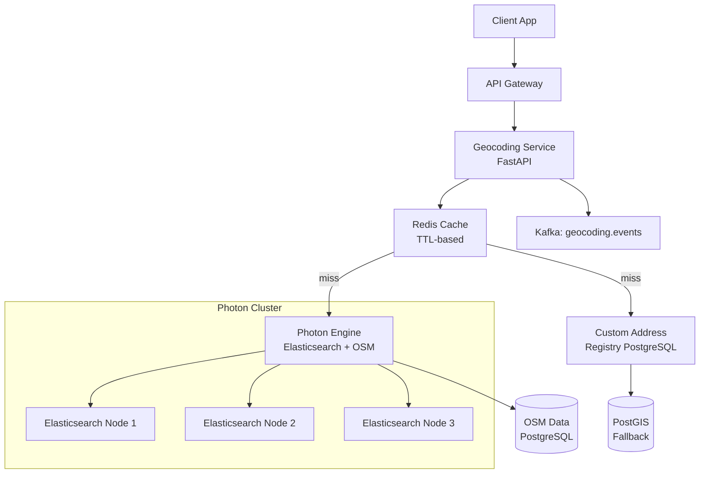
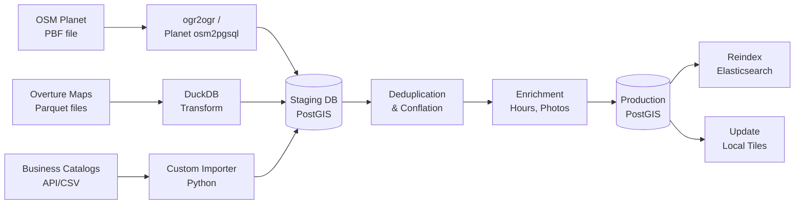
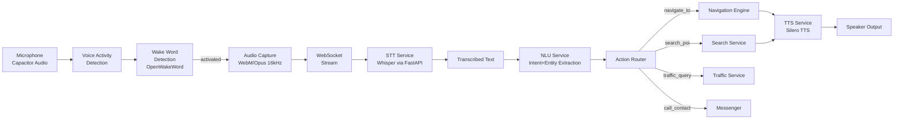
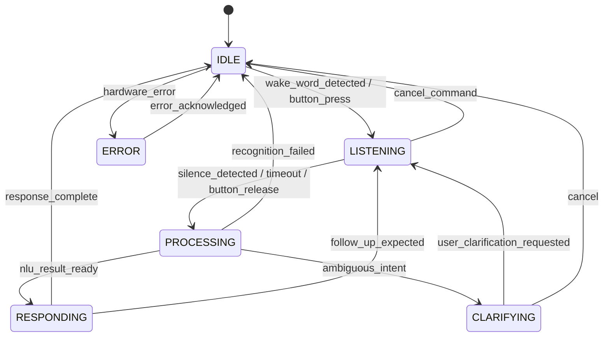
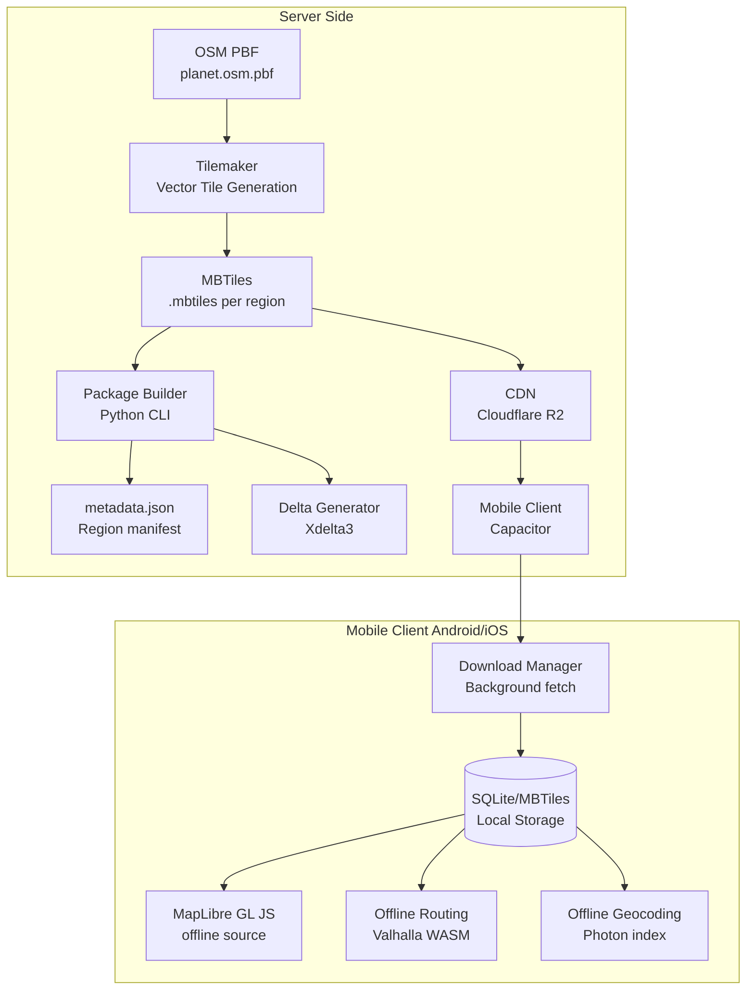
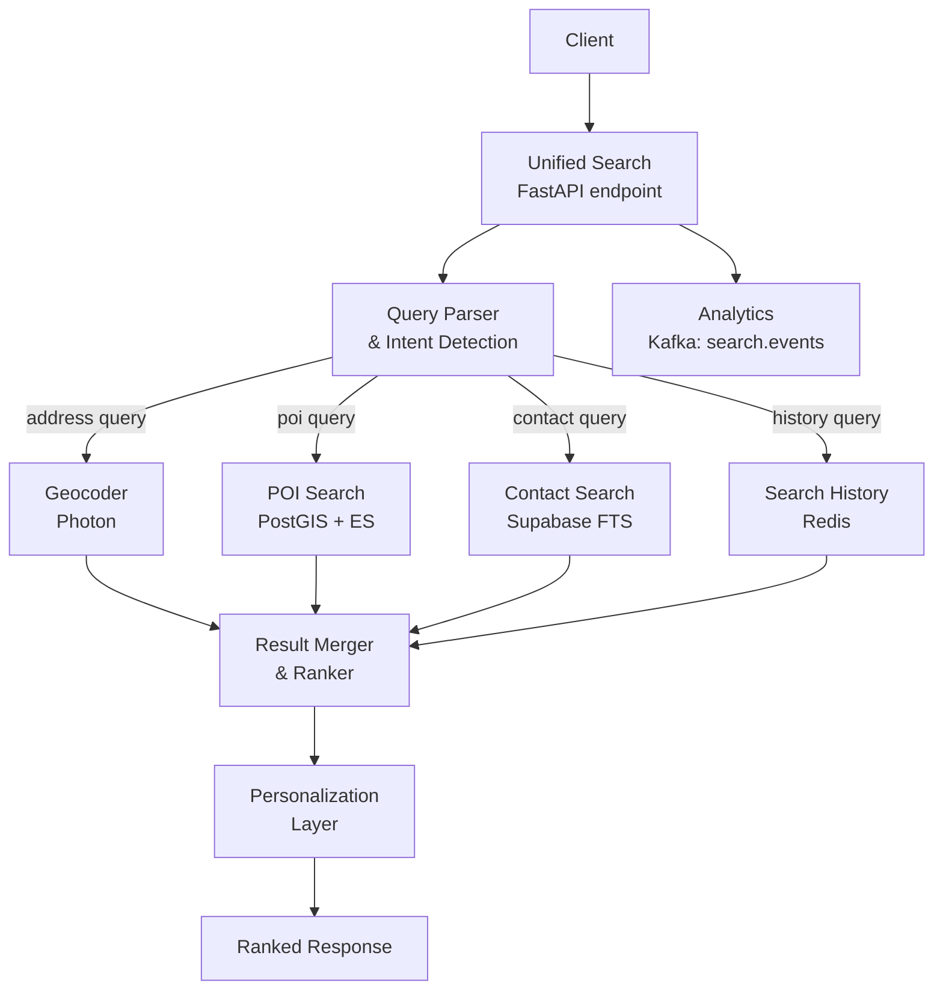

# ECOMANSONI Navigation — Part 3: Search, Geocoding & POI — Voice, Geolocation, Offline Maps

> **Navigation Documentation Series**
> - [Part 1: Core Engines — Map Data, Tile Rendering, Routing](./01-core-engines.md)
> - [Part 2: Intelligence Navigation — Traffic, Map Matching, Navigation Engine](./02-intelligence-navigation.md)
> - **Part 3: Search, Geocoding & POI — Voice, Geolocation, Offline Maps** ← you are here

---

## Table of Contents

- [3.1 Geocoding Engine](#31-geocoding-engine)
  - [3.1.1 Architecture Overview](#311-architecture-overview)
  - [3.1.2 Forward Geocoding](#312-forward-geocoding)
  - [3.1.3 Reverse Geocoding](#313-reverse-geocoding)
  - [3.1.4 Autocomplete / Typeahead](#314-autocomplete--typeahead)
  - [3.1.5 Fuzzy Search, Transliteration, Multilingual](#315-fuzzy-search-transliteration-multilingual)
  - [3.1.6 Custom Address Registries](#316-custom-address-registries)
  - [3.1.7 Caching Strategy (Redis)](#317-caching-strategy-redis)
  - [3.1.8 Batch Geocoding](#318-batch-geocoding)
  - [3.1.9 PostGIS Fallback](#319-postgis-fallback)
  - [3.1.10 API Contracts](#3110-api-contracts)
- [3.2 POI (Points of Interest) Engine](#32-poi-points-of-interest-engine)
  - [3.2.1 POI Data Model](#321-poi-data-model)
  - [3.2.2 Data Import Pipeline](#322-data-import-pipeline)
  - [3.2.3 Deduplication & Conflation](#323-deduplication--conflation)
  - [3.2.4 Spatial Search](#324-spatial-search)
  - [3.2.5 Relevance Ranking](#325-relevance-ranking)
  - [3.2.6 POI CRUD API](#326-poi-crud-api)
  - [3.2.7 User-Generated POI](#327-user-generated-poi)
  - [3.2.8 Verification & Moderation](#328-verification--moderation)
  - [3.2.9 Real-time Availability](#329-real-time-availability)
  - [3.2.10 Navigation Integration](#3210-navigation-integration)
  - [3.2.11 API Contracts](#3211-api-contracts)
- [3.3 Voice Search & Commands](#33-voice-search--commands)
  - [3.3.1 Voice Pipeline Architecture](#331-voice-pipeline-architecture)
  - [3.3.2 Speech-to-Text (Whisper)](#332-speech-to-text-whisper)
  - [3.3.3 Natural Language Understanding](#333-natural-language-understanding)
  - [3.3.4 Intent Classification](#334-intent-classification)
  - [3.3.5 Entity Extraction](#335-entity-extraction)
  - [3.3.6 Text-to-Speech](#336-text-to-speech)
  - [3.3.7 Voice Command State Machine](#337-voice-command-state-machine)
  - [3.3.8 Privacy Considerations](#338-privacy-considerations)
  - [3.3.9 API Contracts](#339-api-contracts)
- [3.4 Geolocation Service](#34-geolocation-service)
  - [3.4.1 Position Acquisition](#341-position-acquisition)
  - [3.4.2 Sensor Fusion](#342-sensor-fusion)
  - [3.4.3 Kalman Filter](#343-kalman-filter)
  - [3.4.4 Indoor Positioning](#344-indoor-positioning)
  - [3.4.5 Geofencing Engine](#345-geofencing-engine)
  - [3.4.6 Location Sharing](#346-location-sharing)
  - [3.4.7 Snap-to-Road](#347-snap-to-road)
  - [3.4.8 API Contracts](#348-api-contracts)
- [3.5 Offline Maps](#35-offline-maps)
  - [3.5.1 Tile Package Architecture](#351-tile-package-architecture)
  - [3.5.2 Packaging Pipeline](#352-packaging-pipeline)
  - [3.5.3 Offline Routing](#353-offline-routing)
  - [3.5.4 Offline Geocoding & POI](#354-offline-geocoding--poi)
  - [3.5.5 Storage Estimation](#355-storage-estimation)
  - [3.5.6 Background Download & Delta Updates](#356-background-download--delta-updates)
  - [3.5.7 Offline/Online Transition](#357-offlineonline-transition)
  - [3.5.8 Mobile Architecture (Capacitor)](#358-mobile-architecture-capacitor)
  - [3.5.9 API Contracts](#359-api-contracts)
- [3.6 Unified Search API](#36-unified-search-api)
  - [3.6.1 Architecture](#361-architecture)
  - [3.6.2 Ranking Algorithm](#362-ranking-algorithm)
  - [3.6.3 Search Analytics](#363-search-analytics)
  - [3.6.4 Personalized Search](#364-personalized-search)
  - [3.6.5 API Contract](#365-api-contract)
- [3.7 Database Schema](#37-database-schema)
- [3.8 Event Schemas (Kafka/Redpanda)](#38-event-schemas-kafkaredpanda)
- [3.9 Metrics & SLOs](#39-metrics--slos)

---

## 3.1 Geocoding Engine

### 3.1.1 Architecture Overview

Geocoding engine обеспечивает двунаправленное преобразование между текстовыми адресами и географическими координатами. ECOMANSONI использует **Photon** (построен на Elasticsearch поверх OSM данных) как основной движок, с PostGIS fallback для кастомных адресных реестров.



**Компоненты стека:**

| Компонент | Технология | Назначение |
|-----------|-----------|-----------|
| Geocoding Engine | Photon 0.5+ | Forward/Reverse geocoding |
| Search Index | Elasticsearch 8.x | Полнотекстовый поиск адресов |
| OSM Import | Nominatim-style via Photon | Данные OpenStreetMap |
| Cache Layer | Redis 7.x | Кэш ответов (TTL 24h) |
| Fallback | PostGIS + pg_trgm | Кастомные реестры |
| API Layer | FastAPI (Python 3.11+) | REST API |

### 3.1.2 Forward Geocoding

Forward geocoding преобразует текстовый адрес в координаты (lat/lon).

**Обработка запроса:**

```python
# geocoding/forward.py
from typing import Optional
import httpx
import hashlib
import json
from redis.asyncio import Redis

class ForwardGeocodingService:
    def __init__(self, photon_url: str, redis: Redis):
        self.photon_url = photon_url
        self.redis = redis
        self.http = httpx.AsyncClient(timeout=5.0)

    async def geocode(
        self,
        query: str,
        lang: str = "ru",
        limit: int = 5,
        bias_lat: Optional[float] = None,
        bias_lon: Optional[float] = None,
        country_code: Optional[str] = None,
    ) -> dict:
        # Normalize query
        query_normalized = self._normalize(query, lang)
        cache_key = self._cache_key("fwd", query_normalized, lang, bias_lat, bias_lon)

        # Check cache
        cached = await self.redis.get(cache_key)
        if cached:
            return json.loads(cached)

        # Build Photon request
        params = {
            "q": query_normalized,
            "lang": lang,
            "limit": limit,
        }
        if bias_lat and bias_lon:
            params["lat"] = bias_lat
            params["lon"] = bias_lon
        if country_code:
            params["osm_tag"] = f"!countrycode:{country_code.lower()}"

        resp = await self.http.get(f"{self.photon_url}/api", params=params)
        resp.raise_for_status()
        result = resp.json()

        # Enrich with custom registry
        result = await self._enrich_with_custom(result, query_normalized)

        # Format response
        formatted = self._format_response(result)

        # Cache result
        await self.redis.setex(cache_key, 86400, json.dumps(formatted))  # 24h TTL

        return formatted

    def _normalize(self, query: str, lang: str) -> str:
        """Normalize query: strip, lowercase, transliterate if needed."""
        query = query.strip()
        if lang == "ru":
            query = self._transliterate_mixed(query)
        return query

    def _cache_key(self, prefix: str, *args) -> str:
        key_data = "|".join(str(a) for a in args if a is not None)
        return f"geocode:{prefix}:{hashlib.sha256(key_data.encode()).hexdigest()[:16]}"

    def _format_response(self, photon_result: dict) -> dict:
        features = []
        for feat in photon_result.get("features", []):
            props = feat.get("properties", {})
            coords = feat.get("geometry", {}).get("coordinates", [None, None])
            features.append({
                "place_id": props.get("osm_id"),
                "display_name": self._build_display_name(props),
                "address": {
                    "country": props.get("country"),
                    "state": props.get("state"),
                    "city": props.get("city"),
                    "district": props.get("district"),
                    "street": props.get("street"),
                    "housenumber": props.get("housenumber"),
                    "postcode": props.get("postcode"),
                },
                "geometry": {
                    "type": "Point",
                    "coordinates": coords
                },
                "confidence": self._estimate_confidence(props),
                "type": props.get("type"),
                "osm_type": props.get("osm_type"),
                "source": "photon",
            })
        return {"features": features, "type": "FeatureCollection"}

    def _build_display_name(self, props: dict) -> str:
        parts = filter(None, [
            props.get("name"),
            props.get("housenumber"),
            props.get("street"),
            props.get("district"),
            props.get("city"),
            props.get("state"),
            props.get("country"),
        ])
        return ", ".join(parts)

    def _estimate_confidence(self, props: dict) -> float:
        """Score 0.0–1.0 based on address completeness."""
        score = 0.0
        if props.get("country"): score += 0.1
        if props.get("state"): score += 0.1
        if props.get("city"): score += 0.2
        if props.get("street"): score += 0.3
        if props.get("housenumber"): score += 0.3
        return round(score, 2)

    async def _enrich_with_custom(self, result: dict, query: str) -> dict:
        """Overlay custom address registry results."""
        # PostGIS fallback query handled separately
        return result
```

### 3.1.3 Reverse Geocoding

```python
# geocoding/reverse.py
class ReverseGeocodingService:
    def __init__(self, photon_url: str, redis: Redis, pg_pool):
        self.photon_url = photon_url
        self.redis = redis
        self.pg = pg_pool

    async def reverse(
        self,
        lat: float,
        lon: float,
        lang: str = "ru",
        radius_m: int = 100,
    ) -> dict:
        # Round to 5 decimal places (~1m precision) for cache key
        lat_r = round(lat, 5)
        lon_r = round(lon, 5)
        cache_key = f"geocode:rev:{lat_r}:{lon_r}:{lang}"

        cached = await self.redis.get(cache_key)
        if cached:
            return json.loads(cached)

        # Photon reverse
        resp = await self.http.get(
            f"{self.photon_url}/reverse",
            params={"lat": lat, "lon": lon, "lang": lang}
        )
        
        if resp.status_code == 200:
            result = self._format_response(resp.json())
        else:
            # Fallback to PostGIS
            result = await self._postgis_reverse(lat, lon, lang, radius_m)

        await self.redis.setex(cache_key, 3600, json.dumps(result))  # 1h TTL
        return result

    async def _postgis_reverse(self, lat: float, lon: float, lang: str, radius_m: int) -> dict:
        """PostGIS-based reverse geocoding using OSM data."""
        async with self.pg.acquire() as conn:
            row = await conn.fetchrow("""
                SELECT
                    id,
                    name,
                    address_components,
                    ST_Distance(
                        geometry::geography,
                        ST_SetSRID(ST_MakePoint($2, $1), 4326)::geography
                    ) AS distance_m
                FROM address_registry
                WHERE ST_DWithin(
                    geometry::geography,
                    ST_SetSRID(ST_MakePoint($2, $1), 4326)::geography,
                    $3
                )
                ORDER BY distance_m ASC
                LIMIT 1
            """, lat, lon, radius_m)

            if not row:
                return {"features": []}

            addr = row["address_components"]
            return {
                "features": [{
                    "place_id": str(row["id"]),
                    "display_name": row["name"],
                    "address": addr,
                    "geometry": {"type": "Point", "coordinates": [lon, lat]},
                    "confidence": 0.7,
                    "source": "postgis_fallback",
                }]
            }
```

### 3.1.4 Autocomplete / Typeahead

Автокомплит должен отвечать в **< 100ms** при запросе от 2+ символов.

```python
# geocoding/autocomplete.py
class AutocompleteService:
    def __init__(self, photon_url: str, redis: Redis):
        self.photon_url = photon_url
        self.redis = redis
        self.http = httpx.AsyncClient(timeout=2.0)  # Tight timeout for typeahead

    async def suggest(
        self,
        query: str,
        lang: str = "ru",
        limit: int = 7,
        lat: Optional[float] = None,
        lon: Optional[float] = None,
        layers: Optional[list] = None,  # ["address", "venue", "street", "locality"]
    ) -> list[dict]:
        if len(query.strip()) < 2:
            return []

        # Short TTL cache for typeahead (5 min)
        cache_key = f"ac:{hashlib.md5(f'{query}{lang}{lat}{lon}'.encode()).hexdigest()[:12]}"
        cached = await self.redis.get(cache_key)
        if cached:
            return json.loads(cached)

        params = {
            "q": query,
            "lang": lang,
            "limit": limit,
        }
        if lat and lon:
            params["lat"] = lat
            params["lon"] = lon

        # Filter by OSM layers for faster response
        if layers:
            layer_map = {
                "address": "place",
                "street": "highway",
                "venue": "amenity,shop,tourism",
                "locality": "place:city,place:town,place:village",
            }
            tags = ",".join(layer_map.get(l, l) for l in layers)
            params["osm_tag"] = tags

        try:
            resp = await self.http.get(f"{self.photon_url}/api", params=params)
            suggestions = self._format_suggestions(resp.json(), query)
        except (httpx.TimeoutException, httpx.HTTPError):
            suggestions = []

        await self.redis.setex(cache_key, 300, json.dumps(suggestions))
        return suggestions

    def _format_suggestions(self, photon_result: dict, query: str) -> list[dict]:
        suggestions = []
        for feat in photon_result.get("features", []):
            props = feat.get("properties", {})
            coords = feat.get("geometry", {}).get("coordinates", [None, None])
            label = self._build_label(props)
            suggestions.append({
                "id": f"photon:{props.get('osm_type', 'N')}{props.get('osm_id', '')}",
                "label": label,
                "secondary": self._build_secondary(props),
                "type": self._classify_type(props),
                "coordinates": {
                    "lat": coords[1],
                    "lon": coords[0],
                },
                "score": self._score_suggestion(props, query, label),
            })
        return sorted(suggestions, key=lambda x: x["score"], reverse=True)

    def _classify_type(self, props: dict) -> str:
        osm_type = props.get("type", "")
        osm_key = props.get("osm_key", "")
        if osm_key in ("amenity", "shop", "tourism", "leisure"):
            return "venue"
        if osm_key == "highway":
            return "street"
        if osm_type in ("city", "town", "village", "suburb"):
            return "locality"
        return "address"
```

### 3.1.5 Fuzzy Search, Transliteration, Multilingual

```python
# geocoding/normalizer.py
import re
import unicodedata

# Таблица транслитерации RU → EN (упрощённая Яндекс-схема)
TRANSLIT_RU_TO_EN = {
    'а': 'a', 'б': 'b', 'в': 'v', 'г': 'g', 'д': 'd', 'е': 'e',
    'ё': 'yo', 'ж': 'zh', 'з': 'z', 'и': 'i', 'й': 'y', 'к': 'k',
    'л': 'l', 'м': 'm', 'н': 'n', 'о': 'o', 'п': 'p', 'р': 'r',
    'с': 's', 'т': 't', 'у': 'u', 'ф': 'f', 'х': 'kh', 'ц': 'ts',
    'ч': 'ch', 'ш': 'sh', 'щ': 'sch', 'ъ': '', 'ы': 'y', 'ь': '',
    'э': 'e', 'ю': 'yu', 'я': 'ya',
}

TRANSLIT_EN_TO_RU = {v: k for k, v in TRANSLIT_RU_TO_EN.items() if v}

class AddressNormalizer:
    """Normalize and transliterate address strings for multi-language search."""

    # Common Russian address abbreviations
    RU_ABBREV = {
        r'\bул\.?\b': 'улица',
        r'\bпр\.?\b': 'проспект',
        r'\bпер\.?\b': 'переулок',
        r'\bпл\.?\b': 'площадь',
        r'\bнаб\.?\b': 'набережная',
        r'\bш\.?\b': 'шоссе',
        r'\bб-р\.?\b': 'бульвар',
        r'\bд\.?\b': 'дом',
        r'\bкв\.?\b': 'квартира',
        r'\bкорп\.?\b': 'корпус',
        r'\bстр\.?\b': 'строение',
    }

    def normalize(self, text: str) -> str:
        text = text.strip().lower()
        text = unicodedata.normalize('NFC', text)
        text = re.sub(r'\s+', ' ', text)
        for abbrev, full in self.RU_ABBREV.items():
            text = re.sub(abbrev, full, text, flags=re.IGNORECASE)
        return text

    def to_latin(self, text: str) -> str:
        result = []
        for char in text.lower():
            result.append(TRANSLIT_RU_TO_EN.get(char, char))
        return ''.join(result)

    def generate_variants(self, query: str) -> list[str]:
        """Generate search variants: original, normalized, transliterated."""
        normalized = self.normalize(query)
        variants = [normalized]
        # Add transliterated version if contains Cyrillic
        if re.search(r'[а-яёА-ЯЁ]', query):
            variants.append(self.to_latin(normalized))
        # Add without punctuation
        no_punct = re.sub(r'[^\w\s]', '', normalized)
        if no_punct != normalized:
            variants.append(no_punct)
        return list(dict.fromkeys(variants))  # deduplicate preserving order


# Photon supports multiple languages via Accept-Language header
# For multilingual support, we send parallel requests or use lang parameter:
class MultilingualGeocoder:
    SUPPORTED_LANGS = ["ru", "en", "de", "fr", "es", "zh", "ar", "tr", "uk"]

    async def geocode_multilang(self, query: str, preferred_lang: str = "ru") -> dict:
        """Try geocoding with language fallback chain."""
        langs = [preferred_lang]
        if preferred_lang != "en":
            langs.append("en")

        normalizer = AddressNormalizer()
        variants = normalizer.generate_variants(query)

        for variant in variants:
            for lang in langs:
                result = await self._geocode_single(variant, lang)
                if result.get("features"):
                    return result

        return {"features": [], "type": "FeatureCollection"}
```

### 3.1.6 Custom Address Registries

Кастомные адресные реестры (ФНС, Росреестр, корпоративные базы) накладываются поверх OSM данных.

```sql
-- Database: custom address registry overlay
CREATE TABLE address_registry (
    id              UUID DEFAULT gen_random_uuid() PRIMARY KEY,
    external_id     TEXT,                         -- ID в источнике (ФИАС, КЛАДР)
    source          TEXT NOT NULL,                -- 'fias', 'kladr', 'corporate', 'osm'
    display_name    TEXT NOT NULL,
    search_text     TEXT NOT NULL,                -- denormalized for FTS
    search_vector   TSVECTOR,                     -- generated FTS vector
    address_components JSONB NOT NULL DEFAULT '{}',
    -- {country, state, city, district, street, housenumber, postcode, flat}
    geometry        GEOMETRY(POINT, 4326) NOT NULL,
    h3_index_r8     TEXT,                         -- H3 resolution 8 cell
    h3_index_r12    TEXT,                         -- H3 resolution 12 cell
    confidence      FLOAT DEFAULT 1.0,
    priority        INT DEFAULT 0,                -- higher = shown first
    active          BOOLEAN DEFAULT true,
    created_at      TIMESTAMPTZ DEFAULT now(),
    updated_at      TIMESTAMPTZ DEFAULT now()
);

CREATE INDEX idx_addr_reg_geometry ON address_registry USING GIST(geometry);
CREATE INDEX idx_addr_reg_h3_r8 ON address_registry(h3_index_r8);
CREATE INDEX idx_addr_reg_search_vector ON address_registry USING GIN(search_vector);
CREATE INDEX idx_addr_reg_source ON address_registry(source);
CREATE INDEX idx_addr_reg_active ON address_registry(active) WHERE active = true;

-- Auto-update search_vector
CREATE OR REPLACE FUNCTION address_registry_search_vector_update()
RETURNS TRIGGER AS $$
BEGIN
    NEW.search_vector := to_tsvector('russian',
        coalesce(NEW.display_name, '') || ' ' ||
        coalesce(NEW.search_text, '') || ' ' ||
        coalesce((NEW.address_components->>'postcode')::text, '')
    );
    NEW.updated_at := now();
    RETURN NEW;
END;
$$ LANGUAGE plpgsql;

CREATE TRIGGER trg_address_registry_fts
    BEFORE INSERT OR UPDATE OF display_name, search_text, address_components
    ON address_registry
    FOR EACH ROW EXECUTE FUNCTION address_registry_search_vector_update();
```

**Поиск через PostGIS с FTS:**

```sql
-- Forward geocoding via custom registry
SELECT
    id,
    display_name,
    address_components,
    ST_AsGeoJSON(geometry)::jsonb AS geometry,
    confidence,
    ts_rank_cd(search_vector, query) AS rank
FROM address_registry,
     plainto_tsquery('russian', $1) AS query
WHERE active = true
  AND search_vector @@ query
ORDER BY
    priority DESC,
    rank DESC,
    confidence DESC
LIMIT $2;
```

### 3.1.7 Caching Strategy (Redis)

```python
# geocoding/cache.py
from enum import IntEnum

class GeocodeCacheTTL(IntEnum):
    FORWARD_EXACT = 86400       # 24h - точный адрес меняется редко
    FORWARD_PARTIAL = 3600      # 1h - частичный запрос
    REVERSE_HIGH_PRECISION = 3600   # 1h - точная координата
    REVERSE_LOW_PRECISION = 7200    # 2h - округлённая
    AUTOCOMPLETE = 300          # 5min - typeahead быстро меняется
    BATCH = 43200               # 12h - batch запросы

class GeocodingCache:
    def __init__(self, redis: Redis):
        self.redis = redis

    async def get_or_fetch(
        self,
        cache_key: str,
        fetch_fn,
        ttl: int,
        compress: bool = False,
    ):
        raw = await self.redis.get(cache_key)
        if raw:
            data = json.loads(raw)
            data["_cache_hit"] = True
            return data

        result = await fetch_fn()
        if result and result.get("features"):
            payload = json.dumps(result)
            await self.redis.setex(cache_key, ttl, payload)

        return result

    async def invalidate_area(self, lat: float, lon: float, radius_km: float = 1.0):
        """Invalidate cache for reverse geocoding in an area (after data update)."""
        # Pattern-based invalidation is expensive; use tags instead
        # Tag: geocode:area:{h3_cell_r6}
        import h3
        cells = h3.geo_to_cells(
            {"type": "Point", "coordinates": [lon, lat]},
            res=6
        )
        for cell in cells:
            await self.redis.delete(f"geocode:area_tag:{cell}")

    def make_forward_key(self, query: str, lang: str, bias: tuple = None) -> str:
        parts = [query.lower().strip(), lang]
        if bias:
            # Round to ~100m for cache grouping
            parts.extend([round(bias[0], 3), round(bias[1], 3)])
        raw = "|".join(str(p) for p in parts)
        return f"geocode:fwd:{hashlib.sha256(raw.encode()).hexdigest()[:20]}"

    def make_reverse_key(self, lat: float, lon: float, lang: str) -> str:
        # Round to 4 decimal places (~10m) for cache
        return f"geocode:rev:{round(lat,4)}:{round(lon,4)}:{lang}"
```

### 3.1.8 Batch Geocoding

```python
# geocoding/batch.py
import asyncio
from typing import AsyncIterator

class BatchGeocodingService:
    MAX_BATCH_SIZE = 1000
    CONCURRENCY = 20  # parallel requests to Photon

    async def geocode_batch(
        self,
        addresses: list[dict],  # [{"id": "...", "query": "...", "lang": "ru"}]
    ) -> AsyncIterator[dict]:
        """Stream batch geocoding results."""
        if len(addresses) > self.MAX_BATCH_SIZE:
            raise ValueError(f"Batch size exceeds {self.MAX_BATCH_SIZE}")

        semaphore = asyncio.Semaphore(self.CONCURRENCY)

        async def geocode_one(item: dict) -> dict:
            async with semaphore:
                try:
                    result = await self.geocoder.geocode(
                        query=item["query"],
                        lang=item.get("lang", "ru"),
                        limit=1,
                    )
                    return {
                        "id": item["id"],
                        "status": "ok",
                        "result": result["features"][0] if result["features"] else None,
                    }
                except Exception as e:
                    return {"id": item["id"], "status": "error", "error": str(e)}

        tasks = [geocode_one(addr) for addr in addresses]
        for coro in asyncio.as_completed(tasks):
            yield await coro
```

**Batch API endpoint:**

```python
# api/geocoding.py
@router.post("/geocoding/batch")
async def batch_geocode(
    request: BatchGeocodeRequest,
    background_tasks: BackgroundTasks,
    current_user = Depends(get_current_user),
):
    """
    Submit batch geocoding job. Returns job_id for polling.
    Small batches (<50) return synchronously.
    """
    if len(request.addresses) <= 50:
        results = []
        async for item in batch_service.geocode_batch(request.addresses):
            results.append(item)
        return {"results": results, "total": len(results)}
    else:
        job_id = await job_queue.submit_batch_job(
            job_type="geocode_batch",
            payload=request.dict(),
            user_id=current_user.id,
        )
        return {
            "job_id": job_id,
            "status": "queued",
            "poll_url": f"/api/v1/jobs/{job_id}",
        }
```

### 3.1.9 PostGIS Fallback

PostGIS fallback используется когда Photon недоступен или не находит результат для кастомных адресов.

```sql
-- PostGIS-based geocoding function
CREATE OR REPLACE FUNCTION geocode_postgis(
    p_query TEXT,
    p_lang TEXT DEFAULT 'ru',
    p_limit INT DEFAULT 5,
    p_bias_lat FLOAT DEFAULT NULL,
    p_bias_lon FLOAT DEFAULT NULL
)
RETURNS TABLE(
    place_id TEXT,
    display_name TEXT,
    lat FLOAT,
    lon FLOAT,
    confidence FLOAT,
    address_components JSONB,
    source TEXT
) AS $$
DECLARE
    tsq TSQUERY;
    bias_geom GEOMETRY;
BEGIN
    tsq := plainto_tsquery(
        CASE p_lang WHEN 'ru' THEN 'russian' ELSE 'english' END,
        p_query
    );

    IF p_bias_lat IS NOT NULL THEN
        bias_geom := ST_SetSRID(ST_MakePoint(p_bias_lon, p_bias_lat), 4326);
    END IF;

    RETURN QUERY
    SELECT
        a.id::TEXT,
        a.display_name,
        ST_Y(a.geometry::geometry) AS lat,
        ST_X(a.geometry::geometry) AS lon,
        CASE
            WHEN bias_geom IS NOT NULL THEN
                a.confidence * (1.0 / (1.0 + ST_Distance(a.geometry::geography, bias_geom::geography) / 10000.0))
            ELSE a.confidence
        END AS confidence,
        a.address_components,
        a.source
    FROM address_registry a
    WHERE
        a.active = true
        AND a.search_vector @@ tsq
    ORDER BY
        a.priority DESC,
        ts_rank_cd(a.search_vector, tsq) DESC,
        confidence DESC
    LIMIT p_limit;
END;
$$ LANGUAGE plpgsql STABLE;
```

### 3.1.10 API Contracts

#### Forward Geocoding

**Request:**
```http
GET /api/v1/geocoding/forward?q=Москва%2C+Тверская+1&lang=ru&limit=5&bias_lat=55.7558&bias_lon=37.6173
Authorization: Bearer {token}
```

**Response 200:**
```json
{
  "type": "FeatureCollection",
  "features": [
    {
      "type": "Feature",
      "geometry": {
        "type": "Point",
        "coordinates": [37.6042, 55.7576]
      },
      "properties": {
        "place_id": "osm:way:123456789",
        "display_name": "Тверская улица, 1, Москва, Россия",
        "address": {
          "country": "Россия",
          "state": "Москва",
          "city": "Москва",
          "district": "Тверской",
          "street": "Тверская улица",
          "housenumber": "1",
          "postcode": "125009"
        },
        "confidence": 0.97,
        "type": "house",
        "osm_type": "way",
        "source": "photon"
      }
    }
  ],
  "meta": {
    "query": "Москва, Тверская 1",
    "lang": "ru",
    "cache_hit": false,
    "latency_ms": 45
  }
}
```

**Response 400:**
```json
{
  "error": "INVALID_QUERY",
  "message": "Query must be at least 3 characters",
  "code": 400
}
```

#### Reverse Geocoding

**Request:**
```http
GET /api/v1/geocoding/reverse?lat=55.7576&lon=37.6042&lang=ru
Authorization: Bearer {token}
```

**Response 200:**
```json
{
  "type": "FeatureCollection",
  "features": [
    {
      "type": "Feature",
      "geometry": {
        "type": "Point",
        "coordinates": [37.6042, 55.7576]
      },
      "properties": {
        "place_id": "osm:way:123456789",
        "display_name": "Тверская улица, 1, Москва",
        "address": {
          "country": "Россия",
          "state": "Москва",
          "city": "Москва",
          "street": "Тверская улица",
          "housenumber": "1",
          "postcode": "125009"
        },
        "distance_m": 12.4,
        "confidence": 0.95,
        "source": "photon"
      }
    }
  ]
}
```

#### Autocomplete

**Request:**
```http
GET /api/v1/geocoding/autocomplete?q=Тверс&lang=ru&limit=7&lat=55.75&lon=37.61
Authorization: Bearer {token}
```

**Response 200:**
```json
{
  "suggestions": [
    {
      "id": "photon:W123456789",
      "label": "Тверская улица",
      "secondary": "Москва, Россия",
      "type": "street",
      "coordinates": {"lat": 55.7576, "lon": 37.6042},
      "score": 0.94
    },
    {
      "id": "photon:N987654321",
      "label": "Тверской переулок",
      "secondary": "Санкт-Петербург, Россия",
      "type": "street",
      "coordinates": {"lat": 59.9311, "lon": 30.3609},
      "score": 0.71
    }
  ],
  "meta": {
    "query": "Тверс",
    "cache_hit": true,
    "latency_ms": 18
  }
}
```

---

## 3.2 POI (Points of Interest) Engine

### 3.2.1 POI Data Model

```sql
-- Core POI table
CREATE TABLE pois (
    id              UUID DEFAULT gen_random_uuid() PRIMARY KEY,
    external_ids    JSONB DEFAULT '{}',
    -- {"osm": "N123456789", "overture": "...", "google": "ChIJ..."}

    -- Identity
    name            TEXT NOT NULL,
    name_translations JSONB DEFAULT '{}',  -- {"en": "...", "ru": "...", "de": "..."}
    slug            TEXT UNIQUE,           -- url-friendly identifier
    description     TEXT,
    description_translations JSONB DEFAULT '{}',

    -- Categorization
    category        TEXT NOT NULL,         -- primary category slug
    subcategory     TEXT,
    tags            TEXT[] DEFAULT '{}',   -- flexible OSM-style tags
    osm_tags        JSONB DEFAULT '{}',    -- raw OSM key-value tags

    -- Location
    geometry        GEOMETRY(POINT, 4326) NOT NULL,
    h3_index_r8     TEXT NOT NULL,
    h3_index_r12    TEXT NOT NULL,
    address         JSONB DEFAULT '{}',
    plus_code       TEXT,                  -- Google Plus Code / Open Location Code

    -- Contacts & Info
    phone           TEXT,
    website         TEXT,
    email           TEXT,
    social_links    JSONB DEFAULT '{}',    -- {"instagram": "...", "vk": "..."}

    -- Hours
    opening_hours   TEXT,                  -- OSM opening_hours format
    opening_hours_structured JSONB,        -- parsed structured hours
    timezone        TEXT DEFAULT 'Europe/Moscow',

    -- Media
    photos          JSONB DEFAULT '[]',    -- [{url, thumbnail, attribution, uploaded_by}]
    main_photo_url  TEXT,

    -- Ratings & Popularity
    rating          FLOAT,                 -- 0.0–5.0
    rating_count    INT DEFAULT 0,
    popularity_score FLOAT DEFAULT 0.0,   -- computed from check-ins, views, etc.
    price_level     INT,                   -- 1-4 ($, $$, $$$, $$$$)

    -- Data provenance
    source          TEXT NOT NULL,        -- 'osm', 'overture', 'user', 'business'
    source_updated_at TIMESTAMPTZ,
    verified        BOOLEAN DEFAULT false,
    verification_level TEXT DEFAULT 'none', -- 'none', 'auto', 'manual', 'official'

    -- Moderation
    status          TEXT DEFAULT 'active', -- 'active', 'pending', 'rejected', 'deleted'
    moderation_notes TEXT,

    -- Timestamps
    created_at      TIMESTAMPTZ DEFAULT now(),
    updated_at      TIMESTAMPTZ DEFAULT now(),
    deleted_at      TIMESTAMPTZ,

    -- Constraints
    CONSTRAINT poi_status_check CHECK (status IN ('active', 'pending', 'rejected', 'deleted')),
    CONSTRAINT poi_price_level_check CHECK (price_level BETWEEN 1 AND 4 OR price_level IS NULL)
);

-- Indexes
CREATE INDEX idx_pois_geometry ON pois USING GIST(geometry);
CREATE INDEX idx_pois_h3_r8 ON pois(h3_index_r8);
CREATE INDEX idx_pois_h3_r12 ON pois(h3_index_r12);
CREATE INDEX idx_pois_category ON pois(category, subcategory);
CREATE INDEX idx_pois_status ON pois(status) WHERE status = 'active';
CREATE INDEX idx_pois_tags ON pois USING GIN(tags);
CREATE INDEX idx_pois_osm_tags ON pois USING GIN(osm_tags);
CREATE INDEX idx_pois_external_ids ON pois USING GIN(external_ids);
CREATE INDEX idx_pois_search ON pois USING GIN(
    to_tsvector('russian', coalesce(name, '') || ' ' || coalesce(description, ''))
);
CREATE INDEX idx_pois_popularity ON pois(popularity_score DESC) WHERE status = 'active';

-- POI Categories hierarchy
CREATE TABLE poi_categories (
    slug        TEXT PRIMARY KEY,
    parent_slug TEXT REFERENCES poi_categories(slug),
    name        TEXT NOT NULL,
    name_ru     TEXT NOT NULL,
    icon        TEXT,
    color       TEXT,
    osm_mapping JSONB DEFAULT '{}',  -- {"amenity": ["restaurant", "cafe"]}
    sort_order  INT DEFAULT 0
);

-- POI Reviews
CREATE TABLE poi_reviews (
    id          UUID DEFAULT gen_random_uuid() PRIMARY KEY,
    poi_id      UUID NOT NULL REFERENCES pois(id) ON DELETE CASCADE,
    user_id     UUID NOT NULL REFERENCES profiles(id),
    rating      INT NOT NULL CHECK (rating BETWEEN 1 AND 5),
    text        TEXT,
    photos      JSONB DEFAULT '[]',
    helpful_count INT DEFAULT 0,
    status      TEXT DEFAULT 'active',
    created_at  TIMESTAMPTZ DEFAULT now(),
    UNIQUE(poi_id, user_id)
);

CREATE INDEX idx_poi_reviews_poi ON poi_reviews(poi_id, status);
CREATE INDEX idx_poi_reviews_user ON poi_reviews(user_id);

-- POI Check-ins (для popularity_score)
CREATE TABLE poi_checkins (
    id          UUID DEFAULT gen_random_uuid() PRIMARY KEY,
    poi_id      UUID NOT NULL REFERENCES pois(id) ON DELETE CASCADE,
    user_id     UUID NOT NULL REFERENCES profiles(id),
    checked_at  TIMESTAMPTZ DEFAULT now(),
    source      TEXT DEFAULT 'manual'  -- 'manual', 'auto_detect', 'taxi_dropoff'
) PARTITION BY RANGE (checked_at);

CREATE TABLE poi_checkins_2025 PARTITION OF poi_checkins
    FOR VALUES FROM ('2025-01-01') TO ('2026-01-01');
CREATE TABLE poi_checkins_2026 PARTITION OF poi_checkins
    FOR VALUES FROM ('2026-01-01') TO ('2027-01-01');

CREATE INDEX idx_poi_checkins_poi ON poi_checkins(poi_id, checked_at);
```

**POI Category taxonomy (excerpt):**

```sql
INSERT INTO poi_categories (slug, parent_slug, name, name_ru, icon, osm_mapping) VALUES
-- Transport
('transport', NULL, 'Transport', 'Транспорт', 'car', '{}'),
('fuel_station', 'transport', 'Fuel Station', 'АЗС', 'fuel', '{"amenity": ["fuel"]}'),
('parking', 'transport', 'Parking', 'Парковка', 'parking', '{"amenity": ["parking"]}'),
('ev_charging', 'transport', 'EV Charging', 'Зарядка EV', 'bolt', '{"amenity": ["charging_station"]}'),
-- Food & Drink
('food', NULL, 'Food & Drink', 'Еда и напитки', 'utensils', '{}'),
('restaurant', 'food', 'Restaurant', 'Ресторан', 'utensils', '{"amenity": ["restaurant"]}'),
('cafe', 'food', 'Cafe', 'Кафе', 'coffee', '{"amenity": ["cafe"]}'),
('fast_food', 'food', 'Fast Food', 'Фастфуд', 'burger', '{"amenity": ["fast_food"]}'),
('bar', 'food', 'Bar', 'Бар', 'beer', '{"amenity": ["bar", "pub"]}'),
-- Shopping
('shopping', NULL, 'Shopping', 'Торговля', 'shopping-bag', '{}'),
('supermarket', 'shopping', 'Supermarket', 'Супермаркет', 'shopping-cart', '{"shop": ["supermarket"]}'),
('mall', 'shopping', 'Shopping Mall', 'ТЦ', 'store', '{"shop": ["mall"]}'),
-- Services
('services', NULL, 'Services', 'Услуги', 'briefcase', '{}'),
('hospital', 'services', 'Hospital', 'Больница', 'hospital', '{"amenity": ["hospital"]}'),
('pharmacy', 'services', 'Pharmacy', 'Аптека', 'pill', '{"amenity": ["pharmacy"]}'),
('bank', 'services', 'Bank', 'Банк', 'bank', '{"amenity": ["bank"]}'),
('atm', 'services', 'ATM', 'Банкомат', 'credit-card', '{"amenity": ["atm"]}'),
-- Accommodation
('accommodation', NULL, 'Accommodation', 'Проживание', 'bed', '{}'),
('hotel', 'accommodation', 'Hotel', 'Отель', 'hotel', '{"tourism": ["hotel"]}'),
-- Leisure
('leisure', NULL, 'Leisure', 'Отдых', 'star', '{}'),
('museum', 'leisure', 'Museum', 'Музей', 'landmark', '{"tourism": ["museum"]}'),
('park', 'leisure', 'Park', 'Парк', 'tree', '{"leisure": ["park"]}');
```

### 3.2.2 Data Import Pipeline



```python
# ingestion/osm_importer.py
import subprocess
import asyncpg

class OSMPOIImporter:
    """Import POIs from OSM PBF file via osm2pgsql."""

    OSM2PGSQL_STYLE = """
    node s name text linear
    node s amenity text linear
    node s shop text linear
    node s tourism text linear
    node s leisure text linear
    node s office text linear
    node s healthcare text linear
    node s opening_hours text linear
    node s phone text linear
    node s website text linear
    node s email text linear
    node s cuisine text linear
    node s addr:street text linear
    node s addr:housenumber text linear
    node s addr:city text linear
    node s addr:postcode text linear
    node s brand text linear
    node s brand:wikidata text linear
    node s wheelchair text linear
    node s wifi text linear
    """

    async def import_pbf(self, pbf_path: str, db_dsn: str):
        """Run osm2pgsql import and then transform to pois table."""
        # Step 1: osm2pgsql into staging
        subprocess.run([
            "osm2pgsql",
            "--database", db_dsn,
            "--prefix", "osm_stage",
            "--slim",
            "--hstore",
            "--tag-transform-script", "osm_poi_transform.lua",
            pbf_path
        ], check=True)

        # Step 2: Transform staging → pois
        conn = await asyncpg.connect(db_dsn)
        try:
            await conn.execute("""
                INSERT INTO pois (
                    external_ids, name, category, subcategory, tags,
                    osm_tags, geometry, h3_index_r8, h3_index_r12,
                    address, phone, website, opening_hours, source,
                    source_updated_at, status
                )
                SELECT
                    jsonb_build_object('osm', 'N' || osm_id::text) AS external_ids,
                    tags->'name' AS name,
                    classify_osm_category(tags) AS category,
                    classify_osm_subcategory(tags) AS subcategory,
                    ARRAY(SELECT jsonb_object_keys(tags)) AS tags,
                    tags AS osm_tags,
                    ST_Transform(way, 4326) AS geometry,
                    h3_lat_lng_to_cell(ST_Y(ST_Transform(way,4326)), ST_X(ST_Transform(way,4326)), 8) AS h3_index_r8,
                    h3_lat_lng_to_cell(ST_Y(ST_Transform(way,4326)), ST_X(ST_Transform(way,4326)), 12) AS h3_index_r12,
                    build_address_from_osm(tags) AS address,
                    tags->'phone' AS phone,
                    tags->'website' AS website,
                    tags->'opening_hours' AS opening_hours,
                    'osm' AS source,
                    now() AS source_updated_at,
                    'active' AS status
                FROM osm_stage_point
                WHERE (
                    tags ? 'amenity' OR tags ? 'shop' OR
                    tags ? 'tourism' OR tags ? 'leisure'
                )
                AND tags ? 'name'
                ON CONFLICT ((external_ids->>'osm'))
                DO UPDATE SET
                    name = EXCLUDED.name,
                    osm_tags = EXCLUDED.osm_tags,
                    opening_hours = EXCLUDED.opening_hours,
                    source_updated_at = now();
            """)
        finally:
            await conn.close()
```

### 3.2.3 Deduplication & Conflation

```python
# ingestion/deduplication.py
import numpy as np
from rapidfuzz import fuzz

class POIDeduplicator:
    """
    Deduplicate POIs from multiple sources using spatial + textual similarity.
    """
    SPATIAL_THRESHOLD_M = 50       # Points within 50m are candidates
    NAME_SIMILARITY_THRESHOLD = 85  # Levenshtein similarity %
    MERGE_DISTANCE_M = 25          # Auto-merge if within 25m and names match >90%

    async def find_duplicates(self, pg_pool) -> list[tuple]:
        """Find duplicate candidate pairs."""
        async with pg_pool.acquire() as conn:
            candidates = await conn.fetch("""
                SELECT
                    a.id AS id_a,
                    b.id AS id_b,
                    a.name AS name_a,
                    b.name AS name_b,
                    a.source AS source_a,
                    b.source AS source_b,
                    ST_Distance(a.geometry::geography, b.geometry::geography) AS dist_m
                FROM pois a
                JOIN pois b ON (
                    a.id < b.id  -- avoid duplicates in pairs
                    AND a.status = 'active'
                    AND b.status = 'active'
                    AND ST_DWithin(
                        a.geometry::geography,
                        b.geometry::geography,
                        $1
                    )
                    AND a.category = b.category  -- same category only
                )
                WHERE a.source != b.source  -- only cross-source duplicates
            """, self.SPATIAL_THRESHOLD_M)

        pairs = []
        for row in candidates:
            name_sim = fuzz.token_sort_ratio(
                row["name_a"].lower(),
                row["name_b"].lower()
            )
            if name_sim >= self.NAME_SIMILARITY_THRESHOLD:
                pairs.append({
                    "id_a": row["id_a"],
                    "id_b": row["id_b"],
                    "dist_m": float(row["dist_m"]),
                    "name_sim": name_sim,
                    "auto_merge": (
                        float(row["dist_m"]) < self.MERGE_DISTANCE_M
                        and name_sim >= 90
                    )
                })
        return pairs

    async def merge_duplicate(self, id_keep: str, id_merge: str, pg_pool):
        """Merge id_merge into id_keep, preserving best data."""
        async with pg_pool.acquire() as conn:
            async with conn.transaction():
                keep = await conn.fetchrow("SELECT * FROM pois WHERE id=$1", id_keep)
                merge = await conn.fetchrow("SELECT * FROM pois WHERE id=$1", id_merge)

                # External IDs: merge both
                merged_external = {**keep["external_ids"], **merge["external_ids"]}

                # Photos: combine
                merged_photos = list({
                    p["url"]: p for p in
                    (keep["photos"] or []) + (merge["photos"] or [])
                }.values())

                # Rating: weighted average
                if keep["rating_count"] + merge["rating_count"] > 0:
                    merged_rating = (
                        (keep["rating"] or 0) * keep["rating_count"] +
                        (merge["rating"] or 0) * merge["rating_count"]
                    ) / (keep["rating_count"] + merge["rating_count"])
                else:
                    merged_rating = keep["rating"]

                await conn.execute("""
                    UPDATE pois SET
                        external_ids = $2,
                        photos = $3,
                        rating = $4,
                        rating_count = rating_count + $5,
                        phone = COALESCE(phone, $6),
                        website = COALESCE(website, $7),
                        opening_hours = COALESCE(opening_hours, $8),
                        updated_at = now()
                    WHERE id = $1
                """, id_keep, merged_external, merged_photos,
                    merged_rating, merge["rating_count"],
                    merge["phone"], merge["website"], merge["opening_hours"])

                # Soft-delete the merged POI
                await conn.execute("""
                    UPDATE pois SET status = 'deleted', deleted_at = now()
                    WHERE id = $1
                """, id_merge)

                # Redirect reviews
                await conn.execute("""
                    UPDATE poi_reviews SET poi_id = $1 WHERE poi_id = $2
                """, id_keep, id_merge)
```

### 3.2.4 Spatial Search

```python
# search/poi_spatial.py
from enum import Enum
import h3

class SpatialSearchType(str, Enum):
    RADIUS = "radius"
    BBOX = "bbox"
    H3_CELL = "h3_cell"

class POISpatialSearch:

    async def search_radius(
        self,
        lat: float,
        lon: float,
        radius_m: float,
        categories: list[str] = None,
        limit: int = 50,
        offset: int = 0,
        pg_pool = None,
    ) -> dict:
        where_clauses = [
            "p.status = 'active'",
            "ST_DWithin(p.geometry::geography, ST_SetSRID(ST_MakePoint($2,$1),4326)::geography, $3)",
        ]
        params = [lat, lon, radius_m]
        param_idx = 4

        if categories:
            where_clauses.append(f"p.category = ANY(${param_idx})")
            params.append(categories)
            param_idx += 1

        where_sql = " AND ".join(where_clauses)

        sql = f"""
            SELECT
                p.*,
                ST_Distance(p.geometry::geography, ST_SetSRID(ST_MakePoint($2,$1),4326)::geography) AS distance_m
            FROM pois p
            WHERE {where_sql}
            ORDER BY distance_m ASC, p.popularity_score DESC
            LIMIT ${param_idx} OFFSET ${param_idx + 1}
        """
        params.extend([limit, offset])

        async with pg_pool.acquire() as conn:
            rows = await conn.fetch(sql, *params)
            total = await conn.fetchval(
                f"SELECT COUNT(*) FROM pois p WHERE {where_sql}",
                *params[:-2]
            )

        return {
            "pois": [dict(r) for r in rows],
            "total": total,
            "limit": limit,
            "offset": offset,
        }

    async def search_h3_cell(
        self,
        h3_index: str,
        resolution: int = 8,
        categories: list[str] = None,
        pg_pool = None,
    ) -> dict:
        """Search POIs in H3 cell and its neighbors (ring-1)."""
        cells = [h3_index] + list(h3.grid_disk(h3_index, 1))

        where_clauses = []
        params = []

        if resolution == 8:
            where_clauses.append("p.h3_index_r8 = ANY($1)")
            params.append(cells)
        else:
            where_clauses.append("p.h3_index_r12 = ANY($1)")
            params.append(cells)

        where_clauses.append("p.status = 'active'")
        if categories:
            where_clauses.append(f"p.category = ANY(${len(params)+1})")
            params.append(categories)

        sql = f"""
            SELECT p.*, 0.0 AS distance_m
            FROM pois p
            WHERE {" AND ".join(where_clauses)}
            ORDER BY p.popularity_score DESC
            LIMIT 200
        """
        async with pg_pool.acquire() as conn:
            rows = await conn.fetch(sql, *params)

        return {"pois": [dict(r) for r in rows], "total": len(rows)}

    async def search_bbox(
        self,
        min_lat: float, min_lon: float,
        max_lat: float, max_lon: float,
        categories: list[str] = None,
        limit: int = 200,
        pg_pool = None,
    ) -> dict:
        """Search POIs within bounding box."""
        bbox = f"ST_MakeEnvelope({min_lon},{min_lat},{max_lon},{max_lat},4326)"
        params = []

        where = f"p.status = 'active' AND p.geometry && {bbox}"
        if categories:
            where += " AND p.category = ANY($1)"
            params.append(categories)

        sql = f"""
            SELECT p.*, 0.0 AS distance_m
            FROM pois p
            WHERE {where}
            ORDER BY p.popularity_score DESC
            LIMIT {limit}
        """
        async with pg_pool.acquire() as conn:
            rows = await conn.fetch(sql, *params)
        return {"pois": [dict(r) for r in rows], "total": len(rows)}
```

### 3.2.5 Relevance Ranking

```python
# search/poi_ranking.py
import math
from datetime import datetime, timezone

class POIRanker:
    """
    Multi-factor relevance ranking for POI search results.
    Score = w1*distance + w2*popularity + w3*freshness + w4*user_pref + w5*text_match
    """

    WEIGHTS = {
        "distance": 0.35,
        "popularity": 0.25,
        "text_match": 0.20,
        "freshness": 0.10,
        "user_preference": 0.10,
    }

    def rank(
        self,
        pois: list[dict],
        query: str = None,
        user_context: dict = None,
        max_radius_m: float = 5000,
    ) -> list[dict]:
        scored = []
        now = datetime.now(timezone.utc)

        for poi in pois:
            score = 0.0

            # Distance score (inverse logistic)
            dist = poi.get("distance_m", 0)
            dist_score = 1.0 / (1.0 + dist / max_radius_m * 3)
            score += self.WEIGHTS["distance"] * dist_score

            # Popularity score (log-normalized)
            pop = poi.get("popularity_score", 0)
            pop_score = math.log1p(pop) / math.log1p(10000)
            score += self.WEIGHTS["popularity"] * min(pop_score, 1.0)

            # Freshness score (based on source_updated_at)
            if poi.get("source_updated_at"):
                age_days = (now - poi["source_updated_at"]).days
                fresh_score = math.exp(-age_days / 365)
                score += self.WEIGHTS["freshness"] * fresh_score

            # Text match score
            if query and poi.get("name"):
                from rapidfuzz import fuzz
                text_score = fuzz.partial_ratio(
                    query.lower(), poi["name"].lower()
                ) / 100.0
                score += self.WEIGHTS["text_match"] * text_score

            # User preference score
            if user_context:
                pref_score = self._user_preference_score(poi, user_context)
                score += self.WEIGHTS["user_preference"] * pref_score

            poi["_relevance_score"] = round(score, 4)
            scored.append(poi)

        return sorted(scored, key=lambda x: x["_relevance_score"], reverse=True)

    def _user_preference_score(self, poi: dict, user_context: dict) -> float:
        score = 0.0
        # Boost frequently visited categories
        freq_cats = user_context.get("frequent_categories", {})
        if poi.get("category") in freq_cats:
            score += 0.5 * min(freq_cats[poi["category"]] / 10.0, 1.0)
        # Boost bookmarked/saved POIs
        if poi.get("id") in user_context.get("saved_pois", set()):
            score += 0.5
        return score
```

### 3.2.6 POI CRUD API

```python
# api/poi.py
from fastapi import APIRouter, Depends, HTTPException, UploadFile
from pydantic import BaseModel, HttpUrl, validator
from typing import Optional
import uuid

router = APIRouter(prefix="/api/v1/pois", tags=["POI"])

class POICreateRequest(BaseModel):
    name: str
    category: str
    subcategory: Optional[str]
    description: Optional[str]
    lat: float
    lon: float
    address: Optional[dict]
    phone: Optional[str]
    website: Optional[HttpUrl]
    opening_hours: Optional[str]
    tags: list[str] = []

    @validator("lat")
    def valid_lat(cls, v):
        if not -90 <= v <= 90:
            raise ValueError("Latitude must be between -90 and 90")
        return v

    @validator("lon")
    def valid_lon(cls, v):
        if not -180 <= v <= 180:
            raise ValueError("Longitude must be between -180 and 180")
        return v

@router.post("/", status_code=201)
async def create_poi(
    request: POICreateRequest,
    current_user = Depends(get_current_user),
    pg_pool = Depends(get_pg_pool),
):
    poi_id = str(uuid.uuid4())
    import h3
    h3_r8 = h3.latlng_to_cell(request.lat, request.lon, 8)
    h3_r12 = h3.latlng_to_cell(request.lat, request.lon, 12)

    async with pg_pool.acquire() as conn:
        row = await conn.fetchrow("""
            INSERT INTO pois (
                id, name, category, subcategory, description,
                geometry, h3_index_r8, h3_index_r12,
                address, phone, website, opening_hours, tags,
                source, status
            ) VALUES (
                $1, $2, $3, $4, $5,
                ST_SetSRID(ST_MakePoint($7,$6),4326), $8, $9,
                $10, $11, $12, $13, $14,
                'user', 'pending'
            )
            RETURNING id, name, status, created_at
        """,
            poi_id, request.name, request.category,
            request.subcategory, request.description,
            request.lat, request.lon, h3_r8, h3_r12,
            request.address, request.phone,
            str(request.website) if request.website else None,
            request.opening_hours, request.tags,
        )

    # Publish event
    await kafka_producer.send("poi.created", {
        "poi_id": poi_id,
        "user_id": str(current_user.id),
        "category": request.category,
        "lat": request.lat,
        "lon": request.lon,
    })

    return {
        "id": str(row["id"]),
        "name": row["name"],
        "status": row["status"],
        "created_at": row["created_at"].isoformat(),
        "message": "POI submitted for review"
    }

@router.get("/{poi_id}")
async def get_poi(
    poi_id: str,
    lang: str = "ru",
    pg_pool = Depends(get_pg_pool),
):
    async with pg_pool.acquire() as conn:
        row = await conn.fetchrow("""
            SELECT
                p.*,
                ST_X(p.geometry::geometry) AS lon,
                ST_Y(p.geometry::geometry) AS lat,
                pc.name_ru AS category_name,
                pc.icon AS category_icon
            FROM pois p
            LEFT JOIN poi_categories pc ON p.category = pc.slug
            WHERE p.id = $1 AND p.status = 'active'
        """, poi_id)

    if not row:
        raise HTTPException(404, detail="POI not found")

    data = dict(row)
    data["is_open_now"] = _check_open_now(data.get("opening_hours"), data.get("timezone"))
    return data
```

### 3.2.7 User-Generated POI

```sql
-- Track user contributions
CREATE TABLE poi_contributions (
    id          UUID DEFAULT gen_random_uuid() PRIMARY KEY,
    poi_id      UUID NOT NULL REFERENCES pois(id),
    user_id     UUID NOT NULL REFERENCES profiles(id),
    action      TEXT NOT NULL,  -- 'create', 'edit', 'photo', 'review', 'flag'
    changes     JSONB DEFAULT '{}',
    status      TEXT DEFAULT 'pending',  -- 'pending', 'approved', 'rejected'
    reviewed_by UUID REFERENCES profiles(id),
    reviewed_at TIMESTAMPTZ,
    created_at  TIMESTAMPTZ DEFAULT now()
);

CREATE INDEX idx_poi_contributions_poi ON poi_contributions(poi_id);
CREATE INDEX idx_poi_contributions_user ON poi_contributions(user_id);
CREATE INDEX idx_poi_contributions_status ON poi_contributions(status) WHERE status = 'pending';

-- User POI contribution stats (for gamification)
CREATE MATERIALIZED VIEW user_poi_stats AS
SELECT
    user_id,
    COUNT(*) FILTER (WHERE action = 'create' AND status = 'approved') AS pois_created,
    COUNT(*) FILTER (WHERE action = 'edit' AND status = 'approved') AS edits_approved,
    COUNT(*) FILTER (WHERE action = 'photo' AND status = 'approved') AS photos_approved,
    SUM(CASE
        WHEN action = 'create' AND status = 'approved' THEN 10
        WHEN action = 'edit' AND status = 'approved' THEN 3
        WHEN action = 'photo' AND status = 'approved' THEN 5
        ELSE 0
    END) AS contribution_points
FROM poi_contributions
GROUP BY user_id;

CREATE UNIQUE INDEX ON user_poi_stats(user_id);
```

### 3.2.8 Verification & Moderation

```python
# moderation/poi_moderator.py
class POIModerator:
    """Auto-moderation pipeline for user-submitted POIs."""

    AUTO_APPROVE_RULES = [
        "trusted_user",       # User with contribution_points > 500
        "business_verified",  # Business with verified email/phone
    ]

    SPAM_PATTERNS = [
        r'(?i)(casino|казино|кредит|займ|porn|секс)',
        r'(?i)(http[s]?://)',  # URLs in name
        r'\d{10,}',            # Long number strings
    ]

    async def moderate(self, poi_id: str, pg_pool) -> str:
        """Returns new status: 'active' | 'pending' | 'rejected'"""
        async with pg_pool.acquire() as conn:
            poi = await conn.fetchrow("""
                SELECT p.*, u.contribution_points
                FROM pois p
                JOIN poi_contributions pc ON pc.poi_id = p.id AND pc.action = 'create'
                JOIN user_poi_stats u ON u.user_id = pc.user_id
                WHERE p.id = $1
                LIMIT 1
            """, poi_id)

        if not poi:
            return "pending"

        # Spam check
        for pattern in self.SPAM_PATTERNS:
            if re.search(pattern, poi["name"] or ""):
                await self._reject(poi_id, "spam_detected", pg_pool)
                return "rejected"

        # Auto-approve for trusted users
        if poi.get("contribution_points", 0) >= 500:
            await self._approve(poi_id, pg_pool)
            return "active"

        # Category validation
        valid_categories = await self._get_valid_categories(pg_pool)
        if poi["category"] not in valid_categories:
            await self._reject(poi_id, "invalid_category", pg_pool)
            return "rejected"

        # Default: manual review
        return "pending"

    async def _approve(self, poi_id: str, pg_pool):
        async with pg_pool.acquire() as conn:
            await conn.execute("""
                UPDATE pois SET status = 'active', updated_at = now()
                WHERE id = $1
            """, poi_id)
        await kafka_producer.send("poi.approved", {"poi_id": poi_id})

    async def _reject(self, poi_id: str, reason: str, pg_pool):
        async with pg_pool.acquire() as conn:
            await conn.execute("""
                UPDATE pois SET
                    status = 'rejected',
                    moderation_notes = $2,
                    updated_at = now()
                WHERE id = $1
            """, poi_id, reason)
```

### 3.2.9 Real-time Availability

```python
# poi/availability.py
from datetime import datetime
import pytz
from opening_hours import OpeningHours  # pip install opening-hours-py

def check_poi_open_now(
    opening_hours_str: str,
    timezone_str: str = "Europe/Moscow"
) -> dict:
    """
    Parse OSM opening_hours format and return current status.
    
    Example: "Mo-Fr 09:00-18:00; Sa 10:00-15:00; Su off"
    """
    if not opening_hours_str:
        return {"is_open": None, "unknown": True}

    try:
        tz = pytz.timezone(timezone_str)
        now = datetime.now(tz)

        oh = OpeningHours(opening_hours_str)
        is_open = oh.is_open(now)
        next_change = oh.next_change(now)

        result = {
            "is_open": is_open,
            "checked_at": now.isoformat(),
            "timezone": timezone_str,
        }

        if next_change:
            minutes_until = int((next_change - now).total_seconds() / 60)
            result["next_change_at"] = next_change.isoformat()
            result["minutes_until_change"] = minutes_until

            if is_open and minutes_until <= 30:
                result["closing_soon"] = True
            if not is_open and minutes_until <= 60:
                result["opening_soon"] = True

        return result

    except Exception:
        return {"is_open": None, "parse_error": True}
```

### 3.2.10 Navigation Integration

```python
# navigation/poi_waypoint.py
class POIWaypointService:
    """Integrate POI as navigation waypoints."""

    async def get_waypoint(self, poi_id: str, pg_pool) -> dict:
        """Get POI data formatted as navigation waypoint."""
        async with pg_pool.acquire() as conn:
            row = await conn.fetchrow("""
                SELECT
                    id, name, category,
                    ST_X(geometry::geometry) AS lon,
                    ST_Y(geometry::geometry) AS lat,
                    address,
                    opening_hours,
                    phone
                FROM pois
                WHERE id = $1 AND status = 'active'
            """, poi_id)

        if not row:
            raise ValueError(f"POI {poi_id} not found")

        return {
            "waypoint_type": "poi",
            "poi_id": str(row["id"]),
            "name": row["name"],
            "category": row["category"],
            "coordinates": {"lat": row["lat"], "lon": row["lon"]},
            "address": row["address"],
            "availability": check_poi_open_now(row["opening_hours"]),
        }

    async def search_along_route(
        self,
        route_geometry: dict,  # GeoJSON LineString
        category: str,
        search_radius_m: float = 500,
        pg_pool = None,
    ) -> list[dict]:
        """Find POIs along a navigation route."""
        route_wkt = geojson_to_wkt(route_geometry)

        async with pg_pool.acquire() as conn:
            rows = await conn.fetch("""
                SELECT
                    p.id, p.name, p.category,
                    ST_X(p.geometry::geometry) AS lon,
                    ST_Y(p.geometry::geometry) AS lat,
                    ST_Distance(
                        p.geometry::geography,
                        ST_ClosestPoint(
                            ST_GeomFromText($1, 4326),
                            p.geometry
                        )::geography
                    ) AS dist_from_route_m,
                    ST_LineLocatePoint(
                        ST_GeomFromText($1, 4326),
                        p.geometry
                    ) AS route_fraction
                FROM pois p
                WHERE
                    p.status = 'active'
                    AND p.category = $2
                    AND ST_DWithin(
                        p.geometry::geography,
                        ST_GeomFromText($1, 4326)::geography,
                        $3
                    )
                ORDER BY route_fraction ASC
                LIMIT 20
            """, route_wkt, category, search_radius_m)

        return [dict(r) for r in rows]
```

### 3.2.11 API Contracts

**Search POIs by radius:**

```http
GET /api/v1/pois/search?lat=55.7558&lon=37.6173&radius=500&category=restaurant&limit=10
Authorization: Bearer {token}
```

**Response 200:**
```json
{
  "pois": [
    {
      "id": "3fa85f64-5717-4562-b3fc-2c963f66afa6",
      "name": "Кафе Пушкинъ",
      "category": "restaurant",
      "subcategory": "russian_cuisine",
      "coordinates": {"lat": 55.7649, "lon": 37.6006},
      "distance_m": 124.3,
      "address": {
        "street": "Тверской бульвар",
        "housenumber": "26А",
        "city": "Москва"
      },
      "phone": "+7 495 739-0033",
      "website": "https://cafe-pushkin.ru",
      "rating": 4.7,
      "rating_count": 8423,
      "price_level": 4,
      "availability": {
        "is_open": true,
        "closing_soon": false,
        "next_change_at": "2026-03-07T00:00:00+03:00",
        "minutes_until_change": 180
      },
      "main_photo_url": "https://cdn.ecomansoni.app/poi/cafe-pushkin/main.jpg",
      "_relevance_score": 0.8942
    }
  ],
  "total": 47,
  "limit": 10,
  "offset": 0,
  "meta": {"radius_m": 500, "latency_ms": 38}
}
```

---

## 3.3 Voice Search & Commands

### 3.3.1 Voice Pipeline Architecture



**Voice session lifecycle:**

```python
# voice/session.py
from enum import Enum
import asyncio

class VoiceSessionState(str, Enum):
    IDLE = "idle"
    LISTENING = "listening"
    PROCESSING = "processing"
    RESPONDING = "responding"
    ERROR = "error"

class VoiceSession:
    def __init__(self, session_id: str, user_id: str, lang: str = "ru"):
        self.session_id = session_id
        self.user_id = user_id
        self.lang = lang
        self.state = VoiceSessionState.IDLE
        self.context = {}       # conversation context
        self.audio_buffer = []  # buffered audio chunks
        self.timeout_task = None

    async def start_listening(self):
        self.state = VoiceSessionState.LISTENING
        self.audio_buffer = []
        # Set 10-second timeout for voice input
        self.timeout_task = asyncio.create_task(
            self._timeout_handler(10.0)
        )

    async def process_audio(self, chunk: bytes):
        if self.state != VoiceSessionState.LISTENING:
            return
        self.audio_buffer.append(chunk)

    async def finalize(self) -> bytes:
        if self.timeout_task:
            self.timeout_task.cancel()
        self.state = VoiceSessionState.PROCESSING
        return b"".join(self.audio_buffer)

    async def _timeout_handler(self, seconds: float):
        await asyncio.sleep(seconds)
        if self.state == VoiceSessionState.LISTENING:
            self.state = VoiceSessionState.ERROR
            await self.emit_event("timeout")
```

### 3.3.2 Speech-to-Text (Whisper)

```python
# voice/stt.py
import faster_whisper
import numpy as np
import io
import soundfile as sf

class WhisperSTTService:
    """
    Speech-to-Text using faster-whisper (CTranslate2 optimized).
    Model: whisper-large-v3 для production, whisper-small для edge.
    """

    MODEL_SIZES = {
        "production": "large-v3",
        "balanced": "medium",
        "fast": "small",
        "edge": "tiny",
    }

    def __init__(self, model_size: str = "medium", device: str = "cuda"):
        self.model = faster_whisper.WhisperModel(
            model_size,
            device=device,
            compute_type="float16" if device == "cuda" else "int8",
        )
        self.supported_langs = ["ru", "en", "uk", "be", "kk", "tr", "de", "fr"]

    async def transcribe(
        self,
        audio_bytes: bytes,
        language: str = None,
        task: str = "transcribe",
    ) -> dict:
        """
        Transcribe audio bytes (WebM/Opus or WAV, 16kHz recommended).
        Returns transcription with word-level timestamps.
        """
        # Convert to numpy float32 array
        audio_array = self._bytes_to_numpy(audio_bytes)

        segments, info = self.model.transcribe(
            audio_array,
            language=language,
            task=task,
            beam_size=5,
            word_timestamps=True,
            vad_filter=True,           # Silence removal
            vad_parameters=dict(
                min_silence_duration_ms=300,
                speech_pad_ms=100,
            ),
        )

        segments_list = list(segments)  # Materialize generator
        text = " ".join(s.text.strip() for s in segments_list)

        return {
            "text": text.strip(),
            "language": info.language,
            "language_probability": info.language_probability,
            "duration_s": info.duration,
            "segments": [
                {
                    "start": s.start,
                    "end": s.end,
                    "text": s.text.strip(),
                    "words": [
                        {"word": w.word, "start": w.start, "end": w.end, "prob": w.probability}
                        for w in (s.words or [])
                    ],
                }
                for s in segments_list
            ],
        }

    def _bytes_to_numpy(self, audio_bytes: bytes) -> np.ndarray:
        buf = io.BytesIO(audio_bytes)
        data, samplerate = sf.read(buf, dtype="float32")
        if len(data.shape) > 1:
            data = data.mean(axis=1)  # stereo → mono
        if samplerate != 16000:
            # Resample to 16kHz
            import resampy
            data = resampy.resample(data, samplerate, 16000)
        return data
```

### 3.3.3 Natural Language Understanding

```python
# voice/nlu.py
from transformers import pipeline, AutoTokenizer, AutoModelForSequenceClassification
import re

class NavigationNLU:
    """
    NLU for navigation commands.
    Uses fine-tuned multilingual model for intent + NER.
    """

    INTENTS = [
        "navigate_to",      # "поехали в Шереметьево"
        "search_poi",       # "найди кофейню рядом"
        "traffic_query",    # "как пробки на МКАД"
        "eta_query",        # "когда я приеду"
        "route_modify",     # "объехать пробку"
        "cancel_nav",       # "отмена маршрута"
        "call_contact",     # "позвони Ивану"
        "volume_control",   # "громче"
        "repeat_maneuver",  # "повтори"
        "general_query",    # всё остальное
    ]

    def __init__(self, model_name: str = "ecomansoni/nav-nlu-multilingual"):
        self.intent_classifier = pipeline(
            "text-classification",
            model=model_name,
            top_k=3,
        )
        self.ner_pipeline = pipeline(
            "token-classification",
            model=f"{model_name}-ner",
            aggregation_strategy="simple",
        )

    async def understand(self, text: str, lang: str = "ru") -> dict:
        text_clean = text.strip().lower()

        # Rule-based pre-processing for common patterns
        rule_result = self._apply_rules(text_clean, lang)
        if rule_result:
            return rule_result

        # Model-based intent classification
        intent_results = self.intent_classifier(text_clean)
        top_intent = intent_results[0][0]

        # NER for entity extraction
        entities = self.ner_pipeline(text_clean)

        return {
            "text": text,
            "intent": top_intent["label"],
            "intent_confidence": top_intent["score"],
            "alternative_intents": [
                {"intent": r["label"], "confidence": r["score"]}
                for r in intent_results[0][1:]
            ],
            "entities": self._format_entities(entities),
            "lang": lang,
        }

    def _apply_rules(self, text: str, lang: str) -> dict | None:
        """Fast rule-based extraction for common patterns."""
        patterns_ru = {
            "navigate_to": [
                r"^(поехали?|едем|навигация|маршрут|проложи маршрут)\s+(?:в|до|на)\s+(.+)",
                r"^(?:как проехать|как добраться)\s+(?:в|до|на)\s+(.+)",
            ],
            "search_poi": [
                r"^(найди|покажи|где|ищи)\s+(.+?)(?:\s+рядом|\s+поблизости|\s+недалеко)?$",
            ],
            "cancel_nav": [
                r"^(отмена|стоп|остановить|выключи навигацию)$",
            ],
        }

        patterns = patterns_ru if lang == "ru" else {}

        for intent, pattern_list in patterns.items():
            for pattern in pattern_list:
                m = re.match(pattern, text, re.IGNORECASE)
                if m:
                    destination = m.group(m.lastindex) if m.lastindex else None
                    return {
                        "text": text,
                        "intent": intent,
                        "intent_confidence": 0.98,
                        "entities": [
                            {"type": "destination", "value": destination, "start": m.start(m.lastindex), "end": m.end(m.lastindex)}
                        ] if destination else [],
                        "lang": lang,
                        "method": "rule",
                    }
        return None

    def _format_entities(self, ner_results: list) -> list[dict]:
        entities = []
        for ent in ner_results:
            entities.append({
                "type": ent["entity_group"],
                "value": ent["word"],
                "start": ent["start"],
                "end": ent["end"],
                "confidence": ent["score"],
            })
        return entities
```

### 3.3.4 Intent Classification

```python
# voice/intent_router.py

INTENT_HANDLERS = {}

def intent_handler(intent: str):
    def decorator(fn):
        INTENT_HANDLERS[intent] = fn
        return fn
    return decorator

@intent_handler("navigate_to")
async def handle_navigate_to(nlu_result: dict, context: dict, services: dict) -> dict:
    destination = next(
        (e["value"] for e in nlu_result["entities"] if e["type"] == "destination"),
        None
    )
    if not destination:
        return {
            "action": "ask",
            "tts": "Куда вы хотите поехать?",
            "follow_up_intent": "navigate_to",
        }

    # Geocode the destination
    geocode_result = await services["geocoder"].geocode(
        query=destination,
        lang=nlu_result["lang"],
        bias_lat=context.get("current_lat"),
        bias_lon=context.get("current_lon"),
    )

    if not geocode_result["features"]:
        return {
            "action": "error",
            "tts": f"Не могу найти место: {destination}. Уточните адрес.",
        }

    feature = geocode_result["features"][0]
    coords = feature["geometry"]["coordinates"]

    return {
        "action": "start_navigation",
        "destination": {
            "name": destination,
            "display_name": feature["properties"]["display_name"],
            "lat": coords[1],
            "lon": coords[0],
        },
        "tts": f"Прокладываю маршрут до {destination}",
    }

@intent_handler("search_poi")
async def handle_search_poi(nlu_result: dict, context: dict, services: dict) -> dict:
    category_ent = next(
        (e["value"] for e in nlu_result["entities"] if e["type"] == "poi_category"),
        None
    )
    name_ent = next(
        (e["value"] for e in nlu_result["entities"] if e["type"] == "poi_name"),
        None
    )

    query = category_ent or name_ent
    if not query:
        return {"action": "ask", "tts": "Что именно вы ищете?"}

    results = await services["poi_search"].search(
        query=query,
        lat=context.get("current_lat"),
        lon=context.get("current_lon"),
        radius_m=2000,
        limit=3,
    )

    if not results["pois"]:
        return {"action": "no_results", "tts": f"Рядом нет '{query}'"}

    top = results["pois"][0]
    distance_str = f"{int(top['distance_m'])} метрах" if top['distance_m'] < 1000 \
        else f"{top['distance_m']/1000:.1f} километрах"

    return {
        "action": "show_poi_results",
        "pois": results["pois"],
        "tts": f"Нашел {results['total']} мест. Ближайшее — {top['name']}, в {distance_str}.",
    }

@intent_handler("cancel_nav")
async def handle_cancel_nav(nlu_result: dict, context: dict, services: dict) -> dict:
    await services["navigation"].cancel_route(context.get("session_id"))
    return {
        "action": "cancel_navigation",
        "tts": "Навигация отключена",
    }
```

### 3.3.5 Entity Extraction

```python
# voice/entity_extractor.py

# Entity types for navigation NLU:
ENTITY_TYPES = {
    "destination": "Место назначения (адрес, название, POI)",
    "poi_category": "Категория POI (кафе, АЗС, парковка)",
    "poi_name": "Конкретное название (Ikea, McDonald's)",
    "street": "Улица",
    "city": "Город",
    "distance": "Расстояние ('2 км', 'рядом', 'ближайший')",
    "time": "Время ('через 30 минут', 'сейчас')",
    "contact_name": "Имя контакта для звонка",
    "route_option": "Опция маршрута ('без пробок', 'быстрый')",
}

# Russian POI category mappings for NLU
RU_POI_CATEGORY_MAP = {
    "кафе": "cafe",
    "ресторан": "restaurant",
    "заправка": "fuel_station",
    "азс": "fuel_station",
    "парковка": "parking",
    "больница": "hospital",
    "аптека": "pharmacy",
    "банк": "bank",
    "банкомат": "atm",
    "отель": "hotel",
    "гостиница": "hotel",
    "магазин": "shopping",
    "супермаркет": "supermarket",
    "кофейня": "cafe",
    "пиццерия": "restaurant",
    "фастфуд": "fast_food",
    "мак": "fast_food",
    "макдак": "fast_food",
    "кофе": "cafe",
    "зарядка": "ev_charging",
    "парк": "park",
    "музей": "museum",
}
```

### 3.3.6 Text-to-Speech

```python
# voice/tts.py
import torch
import soundfile as sf
import io
from silero_tts import SileroTTS  # Silero TTS models

class NavigationTTS:
    """
    Text-to-Speech for navigation guidance.
    Uses Silero TTS (Russian/English, fast inference).
    """

    VOICES = {
        "ru": {"model": "ru_v4", "speaker": "baya", "sample_rate": 24000},
        "en": {"model": "en_v4", "speaker": "en_0", "sample_rate": 24000},
    }

    SSML_TEMPLATES = {
        "turn_left": "<speak>Через <say-as interpret-as='distance'>{distance}</say-as> поверните <emphasis>налево</emphasis> на {street}</speak>",
        "turn_right": "<speak>Через <say-as interpret-as='distance'>{distance}</say-as> поверните <emphasis>направо</emphasis> на {street}</speak>",
        "arrive": "<speak>Вы прибыли в пункт назначения: {destination}</speak>",
        "recalculating": "<speak><prosody rate='fast'>Пересчёт маршрута</prosody></speak>",
        "traffic_warning": "<speak>Впереди пробка. <break time='200ms'/> Объезд займёт дополнительно {extra_minutes} минут.</speak>",
    }

    def __init__(self):
        self.models = {}
        for lang, config in self.VOICES.items():
            self.models[lang] = torch.hub.load(
                repo_or_dir="snakers4/silero-models",
                model="silero_tts",
                language=lang[:2],
                speaker=config["model"],
            )

    async def synthesize(
        self,
        text: str,
        lang: str = "ru",
        speed: float = 1.0,
        ssml: bool = False,
    ) -> bytes:
        model = self.models.get(lang, self.models["ru"])
        config = self.VOICES.get(lang, self.VOICES["ru"])

        with torch.no_grad():
            audio = model.apply_tts(
                text=text,
                speaker=config["speaker"],
                sample_rate=config["sample_rate"],
                put_accent=True,
                put_yo=True,
            )

        # Convert to bytes (MP3 for mobile)
        buf = io.BytesIO()
        sf.write(buf, audio.numpy(), config["sample_rate"], format="MP3")
        return buf.getvalue()

    def format_maneuver(self, maneuver: dict, lang: str = "ru") -> str:
        """Format navigation maneuver to speech-friendly text."""
        template_key = maneuver.get("type", "")
        template = self.SSML_TEMPLATES.get(template_key)

        if not template:
            return maneuver.get("instruction", "")

        distance = self._format_distance(maneuver.get("distance_m", 0), lang)
        return template.format(
            distance=distance,
            street=maneuver.get("street_name", ""),
            destination=maneuver.get("destination", ""),
            extra_minutes=maneuver.get("extra_minutes", 0),
        )

    def _format_distance(self, meters: float, lang: str) -> str:
        if meters < 100:
            return f"{int(meters)} м" if lang == "ru" else f"{int(meters)} m"
        if meters < 1000:
            rounded = round(meters / 100) * 100
            return f"{int(rounded)} м" if lang == "ru" else f"{int(rounded)} m"
        km = meters / 1000
        if km < 10:
            return f"{km:.1f} км" if lang == "ru" else f"{km:.1f} km"
        return f"{int(km)} км" if lang == "ru" else f"{int(km)} km"
```

### 3.3.7 Voice Command State Machine



### 3.3.8 Privacy Considerations

```python
# voice/privacy.py

class VoicePrivacyManager:
    """
    Privacy controls for voice processing.
    
    Data handling policy:
    - Audio is processed in-memory only
    - No audio files stored on servers (by default)
    - Transcriptions stored only with explicit user consent
    - Wake-word detection runs entirely on-device
    - STT can run on-device (Whisper tiny/small via ONNX)
    """

    async def process_with_privacy(
        self,
        audio_bytes: bytes,
        user_id: str,
        user_prefs: dict,
    ) -> dict:
        # Determine processing mode based on user preferences
        mode = user_prefs.get("voice_processing_mode", "server")

        if mode == "device_only":
            # On-device STT (limited accuracy)
            raise NotImplementedError("On-device mode handled by mobile client")
        elif mode == "server_no_store":
            # Process server-side, don't store anything
            result = await self.stt.transcribe(audio_bytes)
            await self._emit_processed_event(user_id, result, store_audio=False)
            return result
        elif mode == "server_store_consented":
            # Store for quality improvement (with user consent)
            result = await self.stt.transcribe(audio_bytes)
            await self._store_anonymized(audio_bytes, result, user_id)
            return result
        else:
            result = await self.stt.transcribe(audio_bytes)
            return result

    async def anonymize_transcript(self, text: str) -> str:
        """Remove PII from stored transcripts."""
        # Remove phone numbers
        text = re.sub(r'\b[\+7|8][\s\-\(]?\d{3}[\s\-\(]?\d{3}[\s\-]?\d{2}[\s\-]?\d{2}\b', '[PHONE]', text)
        # Remove email-like patterns
        text = re.sub(r'\b[\w\.]+@[\w\.]+\.\w{2,}\b', '[EMAIL]', text)
        return text
```

### 3.3.9 API Contracts

**WebSocket voice session:**

```
WS /api/v1/voice/session
Authorization: Bearer {token}
```

**Client → Server messages:**

```json
// Start listening
{"type": "start_listening", "lang": "ru", "context": {"lat": 55.7558, "lon": 37.6173}}

// Audio chunk (binary frame: raw PCM 16kHz float32 or WebM/Opus)
[BINARY FRAME: audio data]

// Stop listening
{"type": "stop_listening"}

// Cancel
{"type": "cancel"}
```

**Server → Client messages:**

```json
// State changes
{"type": "state", "state": "listening"}
{"type": "state", "state": "processing"}

// Partial transcription (streaming)
{"type": "transcript_partial", "text": "поехали в Шерем..."}

// Final transcription
{"type": "transcript_final", "text": "поехали в Шереметьево", "confidence": 0.94}

// NLU result
{
  "type": "nlu_result",
  "intent": "navigate_to",
  "confidence": 0.97,
  "entities": [{"type": "destination", "value": "Шереметьево"}]
}

// Action response
{
  "type": "action",
  "action": "start_navigation",
  "destination": {
    "name": "Шереметьево",
    "lat": 55.9726,
    "lon": 37.4149
  },
  "tts_url": "/api/v1/voice/tts/550e8400-e29b-41d4-a716-446655440000.mp3"
}

// Error
{"type": "error", "code": "STT_FAILED", "message": "Speech recognition failed"}
```

**REST TTS endpoint:**

```http
POST /api/v1/voice/tts
Content-Type: application/json
Authorization: Bearer {token}

{
  "text": "Через 200 метров поверните направо на Тверскую улицу",
  "lang": "ru",
  "speed": 1.0,
  "format": "mp3"
}
```

**Response:** Binary MP3 audio stream with headers:
```
Content-Type: audio/mpeg
X-Audio-Duration: 3.2
X-Cache: miss
```

---

## 3.4 Geolocation Service

### 3.4.1 Position Acquisition

```typescript
// mobile/geolocation/LocationManager.ts
import { Geolocation, Position, WatchPositionCallback } from '@capacitor/geolocation';
import type { Plugin } from '@capacitor/core';

export interface LocationConfig {
  enableHighAccuracy: boolean;
  timeout: number;
  maximumAge: number;
  distanceFilter: number;  // meters, minimum distance before update
}

export const HIGH_ACCURACY_CONFIG: LocationConfig = {
  enableHighAccuracy: true,
  timeout: 10000,
  maximumAge: 0,
  distanceFilter: 5,  // update every 5m
};

export const LOW_POWER_CONFIG: LocationConfig = {
  enableHighAccuracy: false,
  timeout: 30000,
  maximumAge: 60000,
  distanceFilter: 50,  // update every 50m
};

export class LocationManager {
  private watchId: string | null = null;
  private lastPosition: Position | null = null;
  private kalmanFilter: KalmanFilterGPS;
  private config: LocationConfig;

  constructor(config: LocationConfig = HIGH_ACCURACY_CONFIG) {
    this.config = config;
    this.kalmanFilter = new KalmanFilterGPS();
  }

  async getCurrentPosition(): Promise<Position> {
    const raw = await Geolocation.getCurrentPosition({
      enableHighAccuracy: this.config.enableHighAccuracy,
      timeout: this.config.timeout,
    });
    return this.kalmanFilter.filter(raw);
  }

  async startWatching(callback: WatchPositionCallback): Promise<void> {
    if (this.watchId) {
      await this.stopWatching();
    }

    this.watchId = await Geolocation.watchPosition(
      {
        enableHighAccuracy: this.config.enableHighAccuracy,
        timeout: this.config.timeout,
      },
      (position, error) => {
        if (error) {
          callback(null, error);
          return;
        }
        if (position) {
          const filtered = this.kalmanFilter.filter(position);
          this.lastPosition = filtered;
          callback(filtered, null);
        }
      }
    );
  }

  async stopWatching(): Promise<void> {
    if (this.watchId) {
      await Geolocation.clearWatch({ id: this.watchId });
      this.watchId = null;
    }
  }

  async checkPermissions(): Promise<'granted' | 'denied' | 'prompt'> {
    const perm = await Geolocation.checkPermissions();
    return perm.location;
  }

  async requestPermissions(precise: boolean = true): Promise<boolean> {
    const result = await Geolocation.requestPermissions({
      permissions: precise
        ? ['location', 'coarseLocation']
        : ['coarseLocation'],
    });
    return result.location === 'granted';
  }
}
```

### 3.4.2 Sensor Fusion

```typescript
// mobile/geolocation/SensorFusion.ts
import { Motion } from '@capacitor/motion';
import { Device } from '@capacitor/device';

interface FusedLocation {
  lat: number;
  lon: number;
  accuracy_m: number;
  heading: number | null;
  speed_ms: number | null;
  altitude: number | null;
  source: 'gps' | 'wifi' | 'cell' | 'fused';
  confidence: number;
  timestamp: number;
}

export class SensorFusionService {
  private accelBuffer: number[][] = [];   // [x, y, z] samples
  private lastGPS: FusedLocation | null = null;
  private lastWifi: { lat: number; lon: number; accuracy: number } | null = null;

  async fuse(gpsPosition: any): Promise<FusedLocation> {
    const gps: FusedLocation = {
      lat: gpsPosition.coords.latitude,
      lon: gpsPosition.coords.longitude,
      accuracy_m: gpsPosition.coords.accuracy,
      heading: gpsPosition.coords.heading,
      speed_ms: gpsPosition.coords.speed,
      altitude: gpsPosition.coords.altitude,
      source: 'gps',
      confidence: this._gpsConfidence(gpsPosition.coords.accuracy),
      timestamp: gpsPosition.timestamp,
    };

    // If GPS accuracy is poor (>50m), try WiFi positioning
    if (gps.accuracy_m > 50 && this.lastWifi) {
      if (this.lastWifi.accuracy < gps.accuracy_m) {
        return {
          ...gps,
          lat: this.lastWifi.lat,
          lon: this.lastWifi.lon,
          accuracy_m: this.lastWifi.accuracy,
          source: 'wifi',
          confidence: this._gpsConfidence(this.lastWifi.accuracy),
        };
      }
    }

    // Dead reckoning: use accelerometer when GPS is stale
    if (this.lastGPS && Date.now() - this.lastGPS.timestamp > 5000) {
      return this._deadReckoning(this.lastGPS, this.accelBuffer);
    }

    this.lastGPS = gps;
    return gps;
  }

  private _gpsConfidence(accuracy_m: number): number {
    // Sigmoid-based confidence score
    if (accuracy_m <= 5) return 1.0;
    if (accuracy_m <= 10) return 0.9;
    if (accuracy_m <= 20) return 0.8;
    if (accuracy_m <= 50) return 0.6;
    if (accuracy_m <= 100) return 0.4;
    return 0.2;
  }

  private _deadReckoning(
    last: FusedLocation,
    accelSamples: number[][]
  ): FusedLocation {
    // Simplified dead reckoning using last known heading + speed
    const dt = (Date.now() - last.timestamp) / 1000;
    const speed = last.speed_ms || 0;
    const heading_rad = ((last.heading || 0) * Math.PI) / 180;

    const delta_lat = (speed * dt * Math.cos(heading_rad)) / 111320;
    const delta_lon = (speed * dt * Math.sin(heading_rad)) / (111320 * Math.cos(last.lat * Math.PI / 180));

    return {
      ...last,
      lat: last.lat + delta_lat,
      lon: last.lon + delta_lon,
      accuracy_m: last.accuracy_m + speed * dt * 0.1,  // Accuracy degrades
      source: 'fused',
      confidence: last.confidence * 0.8,
      timestamp: Date.now(),
    };
  }
}
```

### 3.4.3 Kalman Filter

```typescript
// mobile/geolocation/KalmanFilter.ts

/**
 * Kalman Filter for GPS smoothing.
 * Reduces GPS noise while maintaining responsiveness.
 * State: [lat, lon, v_lat, v_lon]
 */
export class KalmanFilterGPS {
  private Q: number = 3.0;    // Process noise (higher = more responsive)
  private R: number = 10.0;   // Measurement noise (GPS accuracy)
  private variance: number = -1;
  private lat: number = 0;
  private lon: number = 0;
  private timestamp: number = 0;

  reset() {
    this.variance = -1;
  }

  filter(position: any): any {
    const { latitude, longitude, accuracy } = position.coords;
    const timestamp = position.timestamp;

    if (this.variance < 0) {
      // First measurement: initialize
      this.lat = latitude;
      this.lon = longitude;
      this.variance = accuracy * accuracy;
      this.timestamp = timestamp;
      return position;
    }

    // Time step
    const dt_ms = timestamp - this.timestamp;
    if (dt_ms > 0) {
      // Predict: increase uncertainty over time
      this.variance += (dt_ms / 1000) * this.Q * this.Q;
      this.timestamp = timestamp;
    }

    // Update: Kalman gain
    const K = this.variance / (this.variance + this.R * this.R);

    // Corrected state
    this.lat += K * (latitude - this.lat);
    this.lon += K * (longitude - this.lon);
    this.variance = (1 - K) * this.variance;

    return {
      ...position,
      coords: {
        ...position.coords,
        latitude: this.lat,
        longitude: this.lon,
        accuracy: Math.sqrt(this.variance),
      },
    };
  }
}
```

### 3.4.4 Indoor Positioning

```typescript
// mobile/geolocation/IndoorPositioning.ts

export class IndoorPositioningStrategy {
  /**
   * Indoor positioning uses:
   * 1. WiFi fingerprinting (RSSI scan → database match)
   * 2. BLE beacons (Capacitor BLE plugin)
   * 3. PDR — Pedestrian Dead Reckoning (step detection + compass)
   * 4. Floor detection via barometer if available
   */

  async detectIndoor(position: any): Promise<boolean> {
    // GPS accuracy > 50m AND vertical accuracy is undefined → likely indoor
    const accuracy = position.coords.accuracy;
    const hasAltAccuracy = position.coords.altitudeAccuracy !== null;
    return accuracy > 50 && !hasAltAccuracy;
  }

  async wifiFingerprint(): Promise<{ lat: number; lon: number; floor: number; accuracy: number } | null> {
    // Scan nearby WiFi networks
    // In production: send RSSI fingerprint to server for matching
    // Server returns location based on pre-surveyed fingerprint database
    const scanResult = await this._scanWifi();
    if (!scanResult.length) return null;

    const response = await fetch('/api/v1/indoor/fingerprint', {
      method: 'POST',
      body: JSON.stringify({ bssids: scanResult }),
    });

    if (!response.ok) return null;
    return response.json();
  }

  private async _scanWifi(): Promise<Array<{bssid: string; rssi: number}>> {
    // Platform-specific WiFi scan via Capacitor plugin
    // ios: CoreLocation WiFi scan (limited post-iOS 13)
    // android: WifiManager.getScanResults()
    return [];  // Implemented in native Capacitor plugin
  }
}
```

### 3.4.5 Geofencing Engine

```python
# geofencing/engine.py
import h3
from shapely.geometry import Point, Polygon, shape
import json

class GeofencingEngine:
    """
    Server-side geofencing using H3 spatial indexing.
    Supports circle, polygon, and H3-cell geofences.
    """

    async def check_entry_exit(
        self,
        user_id: str,
        lat: float,
        lon: float,
        pg_pool,
    ) -> list[dict]:
        """Check if user entered or exited any geofences."""
        # Get H3 cells at multiple resolutions
        h3_r8 = h3.latlng_to_cell(lat, lon, 8)
        h3_r9 = h3.latlng_to_cell(lat, lon, 9)
        h3_r10 = h3.latlng_to_cell(lat, lon, 10)

        events = []
        async with pg_pool.acquire() as conn:
            # Find relevant geofences using H3 index
            fences = await conn.fetch("""
                SELECT gf.*
                FROM geofences gf
                WHERE
                    gf.active = true
                    AND (
                        $1 = ANY(gf.h3_cells_r8) OR
                        $2 = ANY(gf.h3_cells_r9) OR
                        $3 = ANY(gf.h3_cells_r10) OR
                        gf.type = 'circle' AND ST_DWithin(
                            gf.center::geography,
                            ST_SetSRID(ST_MakePoint($5,$4),4326)::geography,
                            gf.radius_m
                        )
                    )
                    AND (
                        gf.user_id = $6 OR
                        gf.is_public = true OR
                        $6 = ANY(gf.subscribed_user_ids)
                    )
            """, h3_r8, h3_r9, h3_r10, lat, lon, user_id)

            point = Point(lon, lat)

            for fence in fences:
                is_inside = self._check_containment(fence, point, lat, lon)

                # Get last known state
                last_state = await conn.fetchval("""
                    SELECT is_inside
                    FROM geofence_states
                    WHERE geofence_id = $1 AND user_id = $2
                """, fence["id"], user_id)

                if last_state is None or is_inside != last_state:
                    event_type = "enter" if is_inside else "exit"
                    events.append({
                        "geofence_id": str(fence["id"]),
                        "geofence_name": fence["name"],
                        "event_type": event_type,
                        "lat": lat,
                        "lon": lon,
                    })

                    # Update state
                    await conn.execute("""
                        INSERT INTO geofence_states (geofence_id, user_id, is_inside, updated_at)
                        VALUES ($1, $2, $3, now())
                        ON CONFLICT (geofence_id, user_id) DO UPDATE
                        SET is_inside = $3, updated_at = now()
                    """, fence["id"], user_id, is_inside)

        return events

    def _check_containment(self, fence: dict, point: Point, lat: float, lon: float) -> bool:
        fence_type = fence["type"]
        if fence_type == "circle":
            from shapely.geometry import Point as ShapelyPoint
            center = ShapelyPoint(fence["center_lon"], fence["center_lat"])
            # Use geographic distance
            return point.distance(center) * 111320 <= fence["radius_m"]
        elif fence_type == "polygon":
            poly = shape(json.loads(fence["geometry"]))
            return poly.contains(point)
        elif fence_type == "h3":
            h3_cell = h3.latlng_to_cell(lat, lon, fence["h3_resolution"])
            return h3_cell in set(fence["h3_cells"])
        return False
```

```sql
-- Geofences table
CREATE TABLE geofences (
    id              UUID DEFAULT gen_random_uuid() PRIMARY KEY,
    name            TEXT NOT NULL,
    type            TEXT NOT NULL CHECK (type IN ('circle', 'polygon', 'h3')),
    -- Circle
    center          GEOMETRY(POINT, 4326),
    center_lat      FLOAT,
    center_lon      FLOAT,
    radius_m        FLOAT,
    -- Polygon
    geometry        GEOMETRY(POLYGON, 4326),
    -- H3
    h3_cells_r8     TEXT[] DEFAULT '{}',
    h3_cells_r9     TEXT[] DEFAULT '{}',
    h3_cells_r10    TEXT[] DEFAULT '{}',
    h3_resolution   INT,
    -- Ownership
    user_id         UUID REFERENCES profiles(id),
    is_public       BOOLEAN DEFAULT false,
    subscribed_user_ids UUID[] DEFAULT '{}',
    -- Metadata
    active          BOOLEAN DEFAULT true,
    trigger_on      TEXT[] DEFAULT '{"enter","exit"}',
    notification_template JSONB,
    created_at      TIMESTAMPTZ DEFAULT now()
);

CREATE INDEX idx_geofences_center ON geofences USING GIST(center) WHERE type = 'circle';
CREATE INDEX idx_geofences_geometry ON geofences USING GIST(geometry) WHERE type = 'polygon';
CREATE INDEX idx_geofences_h3_r8 ON geofences USING GIN(h3_cells_r8);
CREATE INDEX idx_geofences_user ON geofences(user_id);

-- Geofence states
CREATE TABLE geofence_states (
    geofence_id UUID NOT NULL REFERENCES geofences(id) ON DELETE CASCADE,
    user_id     UUID NOT NULL REFERENCES profiles(id),
    is_inside   BOOLEAN NOT NULL,
    updated_at  TIMESTAMPTZ DEFAULT now(),
    PRIMARY KEY (geofence_id, user_id)
);
```

### 3.4.6 Location Sharing

```python
# geolocation/sharing.py

class LiveLocationService:
    """Real-time location sharing between users."""

    async def start_sharing(
        self,
        from_user_id: str,
        to_user_ids: list[str],
        duration_minutes: int,
        pg_pool,
        redis: Redis,
    ) -> str:
        share_id = str(uuid.uuid4())
        expires_at = datetime.now(timezone.utc) + timedelta(minutes=duration_minutes)

        async with pg_pool.acquire() as conn:
            await conn.execute("""
                INSERT INTO location_shares (id, from_user_id, to_user_ids, expires_at, active)
                VALUES ($1, $2, $3, $4, true)
            """, share_id, from_user_id, to_user_ids, expires_at)

        # Store expiry in Redis for fast lookup
        await redis.setex(
            f"loc_share:{share_id}",
            duration_minutes * 60,
            json.dumps({"from": from_user_id, "to": to_user_ids})
        )

        return share_id

    async def update_location(
        self,
        share_id: str,
        lat: float,
        lon: float,
        heading: float | None,
        speed_ms: float | None,
        redis: Redis,
        ws_manager = None,
    ):
        """Push live location update to recipients via WebSocket."""
        share_data = await redis.get(f"loc_share:{share_id}")
        if not share_data:
            raise ValueError("Share session expired or not found")

        share = json.loads(share_data)
        payload = {
            "type": "location_update",
            "share_id": share_id,
            "from_user_id": share["from"],
            "lat": round(lat, 6),
            "lon": round(lon, 6),
            "heading": heading,
            "speed_ms": speed_ms,
            "timestamp": datetime.now(timezone.utc).isoformat(),
        }

        # Push via WebSocket to all recipients
        if ws_manager:
            for user_id in share["to"]:
                await ws_manager.send_to_user(user_id, payload)

        # Also store last position in Redis (for late-joiners)
        await redis.setex(
            f"loc_live:{share_id}",
            3600,
            json.dumps(payload)
        )

    async def stop_sharing(self, share_id: str, pg_pool, redis: Redis):
        await redis.delete(f"loc_share:{share_id}")
        await redis.delete(f"loc_live:{share_id}")
        async with pg_pool.acquire() as conn:
            await conn.execute("""
                UPDATE location_shares SET active = false WHERE id = $1
            """, share_id)
```

### 3.4.7 Snap-to-Road

```python
# geolocation/snap_to_road.py
import httpx

class SnapToRoadService:
    """
    Snap GPS coordinates to nearest road using Valhalla trace_attributes.
    See Part 2 for full Map Matching documentation.
    """

    def __init__(self, valhalla_url: str):
        self.valhalla_url = valhalla_url
        self.http = httpx.AsyncClient(timeout=5.0)

    async def snap_point(
        self,
        lat: float,
        lon: float,
        radius_m: float = 35,
        costing: str = "auto",
    ) -> dict:
        """Snap single point to nearest road."""
        resp = await self.http.post(
            f"{self.valhalla_url}/trace_attributes",
            json={
                "shape": [{"lat": lat, "lon": lon}],
                "costing": costing,
                "shape_match": "map_snap",
                "filters": {
                    "attributes": ["edge.way_id", "edge.names", "node.lat", "node.lon"],
                    "action": "include",
                },
                "trace_options": {
                    "search_radius": radius_m,
                }
            }
        )

        if resp.status_code != 200:
            return {"snapped": False, "original": {"lat": lat, "lon": lon}}

        data = resp.json()
        matched = data.get("matched_points", [])
        if not matched:
            return {"snapped": False, "original": {"lat": lat, "lon": lon}}

        mp = matched[0]
        return {
            "snapped": True,
            "original": {"lat": lat, "lon": lon},
            "snapped_point": {"lat": mp["lat"], "lon": mp["lon"]},
            "road_names": data.get("edges", [{}])[0].get("names", []),
            "way_id": data.get("edges", [{}])[0].get("way_id"),
            "distance_snapped_m": self._haversine(lat, lon, mp["lat"], mp["lon"]),
        }

    def _haversine(self, lat1, lon1, lat2, lon2) -> float:
        import math
        R = 6371000
        phi1, phi2 = math.radians(lat1), math.radians(lat2)
        dphi = math.radians(lat2 - lat1)
        dlambda = math.radians(lon2 - lon1)
        a = math.sin(dphi/2)**2 + math.cos(phi1)*math.cos(phi2)*math.sin(dlambda/2)**2
        return 2 * R * math.asin(math.sqrt(a))
```

### 3.4.8 API Contracts

**Location Update (POST):**
```http
POST /api/v1/location/update
Authorization: Bearer {token}
Content-Type: application/json

{
  "lat": 55.7558,
  "lon": 37.6173,
  "accuracy_m": 8.5,
  "heading": 247.3,
  "speed_ms": 12.4,
  "altitude_m": 156.0,
  "timestamp": "2026-03-07T10:30:00.000Z",
  "source": "gps"
}
```

**Response 200:**
```json
{
  "accepted": true,
  "snapped": {
    "lat": 55.7557,
    "lon": 37.6171,
    "road": "Тверская улица",
    "distance_m": 3.2
  },
  "geofence_events": [
    {
      "geofence_id": "uuid-...",
      "name": "Офис",
      "event_type": "enter"
    }
  ]
}
```

**Start Location Sharing:**
```http
POST /api/v1/location/share
Authorization: Bearer {token}
Content-Type: application/json

{
  "to_user_ids": ["uuid-1", "uuid-2"],
  "duration_minutes": 60
}
```

**Response 200:**
```json
{
  "share_id": "3fa85f64-5717-4562-b3fc-2c963f66afa6",
  "expires_at": "2026-03-07T11:30:00.000Z",
  "share_url": "https://ecomansoni.app/location/3fa85f64"
}
```

---

## 3.5 Offline Maps

### 3.5.1 Tile Package Architecture



**Region manifest format:**

```json
{
  "region_id": "ru-moscow",
  "name": "Москва и МО",
  "name_localized": {"ru": "Москва и МО", "en": "Moscow Region"},
  "version": "2026.02",
  "released_at": "2026-02-28T00:00:00Z",
  "bounds": {
    "min_lat": 54.25, "min_lon": 35.14,
    "max_lat": 56.95, "max_lon": 40.21
  },
  "center": {"lat": 55.7558, "lon": 37.6173},
  "zoom_range": {"min": 0, "max": 14},
  "packages": [
    {
      "type": "vector_tiles",
      "file": "moscow-tiles-2026.02.mbtiles",
      "url": "https://cdn.ecomansoni.app/offline/ru-moscow/tiles-2026.02.mbtiles",
      "size_bytes": 245000000,
      "size_human": "234 MB",
      "checksum_sha256": "a1b2c3...",
      "compressed": true,
      "format": "pbf+gzip"
    },
    {
      "type": "routing_graph",
      "file": "moscow-routing-2026.02.tar",
      "url": "https://cdn.ecomansoni.app/offline/ru-moscow/routing-2026.02.tar",
      "size_bytes": 98000000,
      "size_human": "93.5 MB",
      "checksum_sha256": "d4e5f6..."
    },
    {
      "type": "geocoding_index",
      "file": "moscow-geocoding-2026.02.db",
      "url": "https://cdn.ecomansoni.app/offline/ru-moscow/geocoding-2026.02.db",
      "size_bytes": 45000000,
      "size_human": "42.9 MB",
      "checksum_sha256": "g7h8i9..."
    },
    {
      "type": "poi_database",
      "file": "moscow-poi-2026.02.db",
      "url": "https://cdn.ecomansoni.app/offline/ru-moscow/poi-2026.02.db",
      "size_bytes": 32000000,
      "size_human": "30.5 MB",
      "checksum_sha256": "j0k1l2..."
    }
  ],
  "deltas_from": [
    {
      "from_version": "2026.01",
      "delta_file": "moscow-delta-2026.01-2026.02.bin",
      "url": "https://cdn.ecomansoni.app/offline/ru-moscow/delta-2026.01-2026.02.bin",
      "size_bytes": 12000000,
      "size_human": "11.4 MB"
    }
  ],
  "total_size_bytes": 420000000,
  "total_size_human": "400 MB"
}
```

### 3.5.2 Packaging Pipeline

```python
# offline/packaging/pipeline.py
import subprocess
import hashlib
import json
import os
from pathlib import Path

class OfflineMapPackager:
    """Build offline map packages from OSM PBF."""

    REGIONS = {
        "ru-moscow": {
            "poly": "regions/ru-moscow.poly",
            "bbox": [35.14, 54.25, 40.21, 56.95],
            "max_zoom": 14,
        },
        "ru-spb": {
            "poly": "regions/ru-spb.poly",
            "bbox": [29.4, 59.5, 31.0, 60.3],
            "max_zoom": 14,
        },
    }

    def __init__(self, work_dir: Path, cdn_bucket: str):
        self.work_dir = work_dir
        self.cdn_bucket = cdn_bucket

    def build_region(self, region_id: str, pbf_path: Path, version: str):
        region = self.REGIONS[region_id]
        out_dir = self.work_dir / region_id / version
        out_dir.mkdir(parents=True, exist_ok=True)

        # Step 1: Extract region from planet PBF
        region_pbf = out_dir / f"{region_id}.pbf"
        subprocess.run([
            "osmium", "extract",
            "--polygon", region["poly"],
            "--output", str(region_pbf),
            str(pbf_path),
        ], check=True)

        # Step 2: Generate vector tiles (MBTiles)
        tiles_output = out_dir / f"{region_id}-tiles-{version}.mbtiles"
        subprocess.run([
            "tilemaker",
            "--input", str(region_pbf),
            "--output", str(tiles_output),
            "--config", "tilemaker-config.json",
            "--process", "tilemaker-process.lua",
        ], check=True)

        # Step 3: Build Valhalla routing graph
        routing_output = out_dir / f"{region_id}-routing-{version}.tar"
        subprocess.run([
            "valhalla_build_tiles",
            "-c", "valhalla.json",
            str(region_pbf),
        ], check=True)
        subprocess.run([
            "tar", "-czf", str(routing_output),
            "-C", "valhalla_tiles", "."
        ], check=True)

        # Step 4: Build SQLite geocoding index
        geocoding_db = out_dir / f"{region_id}-geocoding-{version}.db"
        self._build_geocoding_index(region_pbf, geocoding_db)

        # Step 5: Build POI SQLite DB
        poi_db = out_dir / f"{region_id}-poi-{version}.db"
        self._build_poi_db(region_pbf, poi_db)

        # Step 6: Generate checksums
        manifest = self._build_manifest(
            region_id, version, region,
            [tiles_output, routing_output, geocoding_db, poi_db]
        )

        # Step 7: Upload to CDN
        for file_path in [tiles_output, routing_output, geocoding_db, poi_db]:
            self._upload_to_cdn(file_path, region_id)

        return manifest

    def _compute_sha256(self, path: Path) -> str:
        h = hashlib.sha256()
        with open(path, "rb") as f:
            for chunk in iter(lambda: f.read(8192), b""):
                h.update(chunk)
        return h.hexdigest()

    def _build_geocoding_index(self, pbf_path: Path, output_db: Path):
        """Build compact SQLite geocoding index from OSM PBF."""
        # Use photon-osmium or custom extractor to build FTS SQLite DB
        subprocess.run([
            "python", "-m", "offline.geocoding_indexer",
            "--input", str(pbf_path),
            "--output", str(output_db),
        ], check=True)

    def _build_poi_db(self, pbf_path: Path, output_db: Path):
        """Export POI data to compact SQLite database."""
        subprocess.run([
            "python", "-m", "offline.poi_exporter",
            "--input", str(pbf_path),
            "--output", str(output_db),
        ], check=True)
```

### 3.5.3 Offline Routing

```typescript
// mobile/offline/OfflineRouter.ts
import { Filesystem, Directory, Encoding } from '@capacitor/filesystem';

declare const Module: any;  // Valhalla WASM module

export class OfflineRouter {
  private valhallaReady = false;
  private configPath: string;

  async initialize(regionId: string): Promise<void> {
    // Load Valhalla tiles from local MBTiles/extracted directory
    const tilesDir = `offline/${regionId}/routing`;
    await this._ensureTilesExtracted(regionId);

    // Initialize Valhalla WASM
    await Module.ready;
    Module.ccall('valhalla_init', null, ['string'], [JSON.stringify({
      tile_dir: tilesDir,
      service_limits: {
        auto: { max_distance: 500000, max_locations: 20 },
        pedestrian: { max_distance: 50000, max_locations: 20 },
        bicycle: { max_distance: 100000, max_locations: 20 },
      }
    })]);

    this.valhallaReady = true;
  }

  async route(
    origin: { lat: number; lon: number },
    destination: { lat: number; lon: number },
    costing: 'auto' | 'pedestrian' | 'bicycle' = 'auto',
    waypoints: Array<{ lat: number; lon: number }> = [],
  ): Promise<any> {
    if (!this.valhallaReady) {
      throw new Error('Offline router not initialized');
    }

    const request = {
      locations: [
        { lat: origin.lat, lon: origin.lon, type: 'break' },
        ...waypoints.map(wp => ({ lat: wp.lat, lon: wp.lon, type: 'through' })),
        { lat: destination.lat, lon: destination.lon, type: 'break' },
      ],
      costing,
      directions_options: { language: 'ru-RU' },
      units: 'kilometers',
    };

    const resultJson = Module.ccall(
      'valhalla_route',
      'string',
      ['string'],
      [JSON.stringify(request)]
    );

    const result = JSON.parse(resultJson);
    if (result.error) {
      throw new Error(`Routing error: ${result.error.message}`);
    }

    return result;
  }

  private async _ensureTilesExtracted(regionId: string): Promise<void> {
    const extractedFlag = `offline/${regionId}/routing/.extracted`;
    try {
      await Filesystem.readFile({ path: extractedFlag, directory: Directory.Data });
      return;  // Already extracted
    } catch {
      // Extract tar file
      const tarPath = `offline/${regionId}/routing.tar`;
      // In production: use native Capacitor plugin to extract tar
      await this._extractTar(tarPath, `offline/${regionId}/routing`);
      await Filesystem.writeFile({
        path: extractedFlag,
        data: 'extracted',
        directory: Directory.Data,
        encoding: Encoding.UTF8,
      });
    }
  }
}
```

### 3.5.4 Offline Geocoding & POI

```typescript
// mobile/offline/OfflineGeocoder.ts
// Uses SQLite via @capacitor-community/sqlite

import { CapacitorSQLite, SQLiteConnection, SQLiteDBConnection } from '@capacitor-community/sqlite';

export class OfflineGeocoder {
  private db: SQLiteDBConnection | null = null;
  private sqlite: SQLiteConnection;

  constructor() {
    this.sqlite = new SQLiteConnection(CapacitorSQLite);
  }

  async open(regionId: string): Promise<void> {
    const dbName = `geocoding-${regionId}`;
    this.db = await this.sqlite.createConnection(
      dbName, false, 'no-encryption', 1, false
    );
    await this.db.open();
  }

  async forward(query: string, limit = 5): Promise<any[]> {
    if (!this.db) throw new Error('Geocoder not initialized');

    // FTS5 search in SQLite
    const result = await this.db.query(`
      SELECT
        id, display_name, lat, lon,
        address_json,
        bm25(addresses_fts) AS rank
      FROM addresses_fts
      WHERE addresses_fts MATCH ?
      ORDER BY rank
      LIMIT ?
    `, [this._escapeQuery(query), limit]);

    return (result.values || []).map(row => ({
      id: row.id,
      display_name: row.display_name,
      coordinates: { lat: row.lat, lon: row.lon },
      address: JSON.parse(row.address_json || '{}'),
      source: 'offline',
    }));
  }

  async reverse(lat: number, lon: number, radius_m = 200): Promise<any | null> {
    if (!this.db) throw new Error('Geocoder not initialized');

    // R*Tree spatial search
    const result = await this.db.query(`
      SELECT a.*,
        ((a.lat - ?) * (a.lat - ?) + (a.lon - ?) * (a.lon - ?)) AS dist_sq
      FROM addresses a
      JOIN addresses_spatial idx ON idx.id = a.id
      WHERE idx.min_lat >= ? AND idx.max_lat <= ?
        AND idx.min_lon >= ? AND idx.max_lon <= ?
      ORDER BY dist_sq ASC
      LIMIT 1
    `, [
      lat, lat, lon, lon,
      lat - radius_m/111320, lat + radius_m/111320,
      lon - radius_m/(111320 * Math.cos(lat * Math.PI/180)),
      lon + radius_m/(111320 * Math.cos(lat * Math.PI/180)),
    ]);

    if (!result.values?.length) return null;
    const row = result.values[0];
    return {
      display_name: row.display_name,
      coordinates: { lat: row.lat, lon: row.lon },
      address: JSON.parse(row.address_json || '{}'),
      source: 'offline',
    };
  }

  private _escapeQuery(q: string): string {
    return q.replace(/['"*]/g, ' ').trim();
  }
}
```

**SQLite schema for offline geocoding DB:**

```sql
-- Offline geocoding SQLite schema (embedded in .db file)

CREATE TABLE addresses (
    id          INTEGER PRIMARY KEY,
    display_name TEXT NOT NULL,
    lat         REAL NOT NULL,
    lon         REAL NOT NULL,
    address_json TEXT,           -- JSON string: {street, city, postcode, ...}
    type        TEXT             -- 'house', 'street', 'city', 'poi'
);

-- FTS5 virtual table for fast text search
CREATE VIRTUAL TABLE addresses_fts USING fts5(
    display_name,
    address_json UNINDEXED,
    lat UNINDEXED,
    lon UNINDEXED,
    content=addresses,
    content_rowid=id,
    tokenize='unicode61 remove_diacritics 2'
);

-- R*Tree spatial index
CREATE VIRTUAL TABLE addresses_spatial USING rtree(
    id,
    min_lat, max_lat,
    min_lon, max_lon
);

-- Populate triggers
CREATE TRIGGER addr_ai AFTER INSERT ON addresses BEGIN
    INSERT INTO addresses_fts(rowid, display_name)
    VALUES (new.id, new.display_name);
    INSERT INTO addresses_spatial VALUES(
        new.id,
        new.lat - 0.0001, new.lat + 0.0001,
        new.lon - 0.0001, new.lon + 0.0001
    );
END;
```

### 3.5.5 Storage Estimation

| Регион | Tiles (zoom 0-14) | Routing | Geocoding | POI | **Total** |
|--------|------------------|---------|-----------|-----|----------|
| Москва и МО | 234 MB | 93 MB | 43 MB | 30 MB | **400 MB** |
| Санкт-Петербург и ЛО | 156 MB | 67 MB | 31 MB | 22 MB | **276 MB** |
| Россия (только города) | 890 MB | 340 MB | 180 MB | 95 MB | **1.5 GB** |
| Россия полная | 4.2 GB | 1.8 GB | 620 MB | 280 MB | **6.9 GB** |
| Казахстан | 312 MB | 140 MB | 65 MB | 38 MB | **555 MB** |
| Беларусь | 89 MB | 42 MB | 19 MB | 14 MB | **164 MB** |

**Сжатие:**
- Vector tiles: gzip ~60% compression (PBF → gzip PBF)
- Routing graph: lz4 ~45% compression
- Geocoding SQLite: zstd ~55% compression
- Delta updates: typically 3-8% of full package size per month

### 3.5.6 Background Download & Delta Updates

```typescript
// mobile/offline/DownloadManager.ts
import { BackgroundFetch } from '@transistorsoft/capacitor-background-fetch';
import { Network } from '@capacitor/network';
import { Preferences } from '@capacitor/preferences';

export class OfflineMapDownloadManager {
  private downloads: Map<string, DownloadJob> = new Map();

  async startDownload(
    regionId: string,
    manifest: RegionManifest,
    options: {
      wifiOnly: boolean;
      priority: 'background' | 'foreground';
    } = { wifiOnly: true, priority: 'background' }
  ): Promise<string> {
    const jobId = `download-${regionId}-${Date.now()}`;

    const job: DownloadJob = {
      jobId,
      regionId,
      manifest,
      status: 'queued',
      progress: 0,
      bytesDownloaded: 0,
      totalBytes: manifest.total_size_bytes,
      packages: manifest.packages.map(p => ({ ...p, downloaded: false })),
      options,
      startedAt: Date.now(),
    };

    this.downloads.set(jobId, job);
    await this._persistJob(job);

    if (options.priority === 'foreground') {
      this._downloadForeground(job);
    } else {
      await this._scheduleBackground(job);
    }

    return jobId;
  }

  private async _downloadForeground(job: DownloadJob): Promise<void> {
    job.status = 'downloading';

    for (const pkg of job.packages) {
      if (pkg.downloaded) continue;

      // Check network conditions
      const netStatus = await Network.getStatus();
      if (job.options.wifiOnly && netStatus.connectionType !== 'wifi') {
        job.status = 'paused_no_wifi';
        await this._persistJob(job);
        return;
      }

      try {
        await this._downloadWithResume(pkg, job);
        pkg.downloaded = true;
        await this._persistJob(job);
      } catch (err) {
        job.status = 'error';
        job.error = String(err);
        await this._persistJob(job);
        throw err;
      }
    }

    job.status = 'completed';
    job.progress = 100;
    await this._persistJob(job);
    await this._notifyComplete(job);
  }

  private async _downloadWithResume(
    pkg: PackageInfo,
    job: DownloadJob,
  ): Promise<void> {
    const resumeKey = `resume:${job.jobId}:${pkg.file}`;
    const { value: resumeOffset } = await Preferences.get({ key: resumeKey });
    const offset = resumeOffset ? parseInt(resumeOffset) : 0;

    const headers: Record<string, string> = {};
    if (offset > 0) {
      headers['Range'] = `bytes=${offset}-`;
    }

    const response = await fetch(pkg.url, { headers });

    if (!response.ok && response.status !== 206) {
      throw new Error(`Download failed: ${response.status}`);
    }

    const reader = response.body!.getReader();
    let downloaded = offset;

    while (true) {
      const { done, value } = await reader.read();
      if (done) break;

      await this._appendChunk(pkg.file, value);
      downloaded += value.length;
      job.bytesDownloaded += value.length;
      job.progress = Math.floor(job.bytesDownloaded / job.totalBytes * 100);

      // Save resume position every 1MB
      if (downloaded % (1024 * 1024) < value.length) {
        await Preferences.set({ key: resumeKey, value: String(downloaded) });
      }
    }

    // Verify checksum
    const valid = await this._verifyChecksum(pkg.file, pkg.checksum_sha256);
    if (!valid) {
      throw new Error('Checksum verification failed');
    }

    await Preferences.remove({ key: resumeKey });
  }

  async checkForUpdates(regionId: string): Promise<{
    hasUpdate: boolean;
    currentVersion: string | null;
    latestVersion: string;
    deltaAvailable: boolean;
    deltaSize: number;
  }> {
    const { value: currentVersion } = await Preferences.get({
      key: `offline:${regionId}:version`
    });

    const manifest = await this._fetchManifest(regionId);

    if (!currentVersion) {
      return {
        hasUpdate: true,
        currentVersion: null,
        latestVersion: manifest.version,
        deltaAvailable: false,
        deltaSize: 0,
      };
    }

    const hasUpdate = manifest.version !== currentVersion;
    const delta = manifest.deltas_from?.find(d => d.from_version === currentVersion);

    return {
      hasUpdate,
      currentVersion,
      latestVersion: manifest.version,
      deltaAvailable: !!delta,
      deltaSize: delta?.size_bytes ?? 0,
    };
  }
}
```

### 3.5.7 Offline/Online Transition

```typescript
// mobile/offline/OfflineOnlineSwitch.ts
import { Network } from '@capacitor/network';

export enum ConnectivityMode {
  ONLINE = 'online',
  OFFLINE = 'offline',
  DEGRADED = 'degraded',  // Online but slow
}

export class OfflineOnlineManager {
  private mode: ConnectivityMode = ConnectivityMode.ONLINE;
  private listeners: Array<(mode: ConnectivityMode) => void> = [];

  async initialize(): Promise<void> {
    const status = await Network.getStatus();
    this.mode = status.connected ? ConnectivityMode.ONLINE : ConnectivityMode.OFFLINE;

    Network.addListener('networkStatusChange', (status) => {
      const newMode = status.connected ? ConnectivityMode.ONLINE : ConnectivityMode.OFFLINE;
      if (newMode !== this.mode) {
        this.mode = newMode;
        this._notifyListeners(newMode);
      }
    });
  }

  getDataSource(type: 'tiles' | 'routing' | 'geocoding' | 'poi'): 'online' | 'offline' {
    if (this.mode === ConnectivityMode.OFFLINE) return 'offline';

    // Prefer online for freshness, but fall back gracefully
    return 'online';
  }

  async getMapStyle(): Promise<string> {
    if (this.mode === ConnectivityMode.ONLINE) {
      return 'https://tiles.ecomansoni.app/styles/default.json';
    }
    return 'offline://default';  // Points to local style with offline sources
  }

  addModeChangeListener(fn: (mode: ConnectivityMode) => void): void {
    this.listeners.push(fn);
  }

  private _notifyListeners(mode: ConnectivityMode): void {
    this.listeners.forEach(fn => fn(mode));
  }
}
```

### 3.5.8 Mobile Architecture (Capacitor)

```typescript
// capacitor.config.ts additions for offline maps
import { CapacitorConfig } from '@capacitor/cli';

const config: CapacitorConfig = {
  appId: 'app.ecomansoni',
  appName: 'ECOMANSONI',
  plugins: {
    CapacitorSQLite: {
      iosDatabaseLocation: 'Library/CapacitorDatabase',
      iosIsEncryption: false,
      androidIsEncryption: false,
    },
    Geolocation: {
      // iOS plist entries
      // NSLocationWhenInUseUsageDescription: "...",
      // NSLocationAlwaysUsageDescription: "...",
    },
    BackgroundFetch: {
      stopOnTerminate: false,
      startOnBoot: true,
      requiresNetworkConnectivity: true,
      requiredNetworkType: 'ANY',
    },
  },
};
```

```swift
// ios/App/App/OfflineMapPlugin.swift
// Native iOS plugin for MBTiles serving
import Capacitor
import SQLite3

@objc(OfflineTilePlugin)
public class OfflineTilePlugin: CAPPlugin {
    private var db: OpaquePointer?

    @objc func openDatabase(_ call: CAPPluginCall) {
        let dbPath = call.getString("path") ?? ""
        if sqlite3_open(dbPath, &db) == SQLITE_OK {
            call.resolve(["success": true])
        } else {
            call.reject("Failed to open MBTiles database")
        }
    }

    @objc func getTile(_ call: CAPPluginCall) {
        guard let db = db else {
            call.reject("Database not open")
            return
        }
        let z = call.getInt("z") ?? 0
        let x = call.getInt("x") ?? 0
        let y = call.getInt("y") ?? 0

        // MBTiles uses TMS tile scheme (Y flipped)
        let tmsy = (1 << z) - 1 - y

        let query = "SELECT tile_data FROM tiles WHERE zoom_level=? AND tile_column=? AND tile_row=?"
        var stmt: OpaquePointer?
        if sqlite3_prepare_v2(db, query, -1, &stmt, nil) == SQLITE_OK {
            sqlite3_bind_int(stmt, 1, Int32(z))
            sqlite3_bind_int(stmt, 2, Int32(x))
            sqlite3_bind_int(stmt, 3, Int32(tmsy))
            if sqlite3_step(stmt) == SQLITE_ROW {
                let bytes = sqlite3_column_blob(stmt, 0)
                let size = sqlite3_column_bytes(stmt, 0)
                let data = Data(bytes: bytes!, count: Int(size))
                call.resolve(["tile": data.base64EncodedString()])
            } else {
                call.resolve(["tile": nil])
            }
        }
        sqlite3_finalize(stmt)
    }
}
```

### 3.5.9 API Contracts

**List available regions:**
```http
GET /api/v1/offline/regions
Authorization: Bearer {token}
```

**Response 200:**
```json
{
  "regions": [
    {
      "region_id": "ru-moscow",
      "name": "Москва и МО",
      "version": "2026.02",
      "total_size_bytes": 420000000,
      "total_size_human": "400 MB",
      "bounds": {"min_lat": 54.25, "min_lon": 35.14, "max_lat": 56.95, "max_lon": 40.21},
      "released_at": "2026-02-28T00:00:00Z",
      "thumbnail_url": "https://cdn.ecomansoni.app/offline/ru-moscow/thumb.png"
    }
  ]
}
```

**Get region manifest:**
```http
GET /api/v1/offline/regions/ru-moscow/manifest
Authorization: Bearer {token}
```

**Check for updates:**
```http
POST /api/v1/offline/regions/ru-moscow/check-update
Authorization: Bearer {token}
Content-Type: application/json

{"current_version": "2026.01"}
```

**Response 200:**
```json
{
  "has_update": true,
  "current_version": "2026.01",
  "latest_version": "2026.02",
  "delta_available": true,
  "delta_size_bytes": 12000000,
  "delta_size_human": "11.4 MB",
  "full_size_bytes": 420000000,
  "recommendation": "delta"
}
```

---

## 3.6 Unified Search API

### 3.6.1 Architecture



### 3.6.2 Ranking Algorithm

```python
# search/unified_ranker.py

class UnifiedSearchRanker:
    """
    Merge and rank results from multiple search sources.
    """

    SOURCE_BASE_SCORES = {
        "history":   1.2,   # 20% boost for items in history
        "favorites": 1.5,   # 50% boost for favorites
        "contact":   1.1,   # 10% boost for contacts
        "poi":       1.0,   # baseline
        "geocoding": 0.9,   # slightly lower than POI for proximity searches
    }

    def rank(
        self,
        results: list[dict],
        query: str,
        user_context: dict,
        ref_lat: float | None = None,
        ref_lon: float | None = None,
    ) -> list[dict]:
        scored = []
        from rapidfuzz import fuzz

        for item in results:
            base = self.SOURCE_BASE_SCORES.get(item.get("source_type", "poi"), 1.0)

            # Text relevance
            name = item.get("name") or item.get("display_name") or ""
            text_score = fuzz.partial_token_sort_ratio(query.lower(), name.lower()) / 100.0

            # Distance score
            dist_score = 0.0
            if ref_lat and ref_lon and item.get("coordinates"):
                c = item["coordinates"]
                dist_m = self._approx_distance_m(ref_lat, ref_lon, c["lat"], c["lon"])
                dist_score = 1.0 / (1.0 + dist_m / 2000.0)

            # Recency score (from history)
            recency_score = 0.0
            if item.get("last_accessed_at"):
                from datetime import datetime, timezone
                age_s = (datetime.now(timezone.utc) - item["last_accessed_at"]).total_seconds()
                recency_score = 1.0 / (1.0 + age_s / 86400.0)  # decay over 24h

            final_score = base * (
                0.40 * text_score +
                0.30 * dist_score +
                0.20 * recency_score +
                0.10 * item.get("_popularity_score", 0.5)
            )

            item["_score"] = round(final_score, 4)
            scored.append(item)

        return sorted(scored, key=lambda x: x["_score"], reverse=True)

    def _approx_distance_m(self, lat1, lon1, lat2, lon2) -> float:
        # Fast approximation for ranking (not accurate over long distances)
        dlat = (lat2 - lat1) * 111320
        dlon = (lon2 - lon1) * 111320 * 0.71  # cos(45°) approx
        return (dlat**2 + dlon**2) ** 0.5
```

### 3.6.3 Search Analytics

```python
# search/analytics.py
from kafka import KafkaProducer
import json, time, uuid

class SearchAnalytics:
    def __init__(self, producer: KafkaProducer):
        self.producer = producer

    async def track_search(
        self,
        user_id: str,
        session_id: str,
        query: str,
        results_count: int,
        latency_ms: float,
        result_types: list[str],
    ):
        event = {
            "event_id": str(uuid.uuid4()),
            "event_type": "search_performed",
            "user_id": user_id,
            "session_id": session_id,
            "timestamp": int(time.time() * 1000),
            "query": query,
            "query_length": len(query),
            "results_count": results_count,
            "result_types": result_types,
            "latency_ms": latency_ms,
        }
        self.producer.send("search.events", json.dumps(event).encode())

    async def track_click(
        self,
        user_id: str,
        session_id: str,
        query: str,
        clicked_id: str,
        clicked_type: str,
        rank_position: int,
    ):
        event = {
            "event_id": str(uuid.uuid4()),
            "event_type": "search_result_clicked",
            "user_id": user_id,
            "session_id": session_id,
            "timestamp": int(time.time() * 1000),
            "query": query,
            "clicked_id": clicked_id,
            "clicked_type": clicked_type,
            "rank_position": rank_position,
        }
        self.producer.send("search.events", json.dumps(event).encode())
```

### 3.6.4 Personalized Search

```python
# search/personalization.py

class SearchPersonalization:
    """Build user context for personalized search."""

    async def get_user_context(self, user_id: str, redis: Redis, pg_pool) -> dict:
        cache_key = f"search_ctx:{user_id}"
        cached = await redis.get(cache_key)
        if cached:
            return json.loads(cached)

        async with pg_pool.acquire() as conn:
            # Recent searches (last 50)
            history = await conn.fetch("""
                SELECT query, result_id, result_type, accessed_at
                FROM search_history
                WHERE user_id = $1
                ORDER BY accessed_at DESC
                LIMIT 50
            """, user_id)

            # Category frequencies (from checkins + searches)
            freq_cats = await conn.fetch("""
                SELECT category, COUNT(*) AS cnt
                FROM poi_checkins pc
                JOIN pois p ON p.id = pc.poi_id
                WHERE pc.user_id = $1
                  AND pc.checked_at > now() - interval '30 days'
                GROUP BY category
                ORDER BY cnt DESC
                LIMIT 10
            """, user_id)

            # Saved POIs
            saved = await conn.fetch("""
                SELECT poi_id FROM saved_pois WHERE user_id = $1
            """, user_id)

        context = {
            "recent_queries": [r["query"] for r in history[:10]],
            "frequent_categories": {r["category"]: r["cnt"] for r in freq_cats},
            "saved_pois": [str(r["poi_id"]) for r in saved],
        }

        await redis.setex(cache_key, 300, json.dumps(context))
        return context

    async def save_to_history(
        self,
        user_id: str,
        query: str,
        result_id: str | None,
        result_type: str | None,
        pg_pool,
    ):
        async with pg_pool.acquire() as conn:
            await conn.execute("""
                INSERT INTO search_history (user_id, query, result_id, result_type, accessed_at)
                VALUES ($1, $2, $3, $4, now())
                ON CONFLICT (user_id, query)
                DO UPDATE SET accessed_at = now(), result_id = $3, result_type = $4
            """, user_id, query, result_id, result_type)
```

### 3.6.5 API Contract

**Unified Search:**

```http
GET /api/v1/search?q=Кафе+Пушкин&lat=55.7558&lon=37.6173&limit=10&sources=poi,geocoding,history
Authorization: Bearer {token}
```

**Response 200:**
```json
{
  "results": [
    {
      "id": "poi:3fa85f64-5717-4562-b3fc-2c963f66afa6",
      "type": "poi",
      "source_type": "poi",
      "name": "Кафе Пушкинъ",
      "secondary": "Тверской бульвар, 26А · Ресторан",
      "coordinates": {"lat": 55.7649, "lon": 37.6006},
      "distance_m": 1024.5,
      "icon": "utensils",
      "is_open": true,
      "rating": 4.7,
      "_score": 0.923
    },
    {
      "id": "geocoding:photon:W456789",
      "type": "address",
      "source_type": "geocoding",
      "name": "Улица Пушкина",
      "secondary": "Москва, Россия",
      "coordinates": {"lat": 55.7611, "lon": 37.6210},
      "distance_m": 2100.1,
      "icon": "map-pin",
      "_score": 0.721
    },
    {
      "id": "history:q:Кафе+Пушкин",
      "type": "history",
      "source_type": "history",
      "name": "Кафе Пушкин",
      "secondary": "Последний поиск · 3 дня назад",
      "coordinates": null,
      "icon": "clock",
      "_score": 0.680
    }
  ],
  "total": 12,
  "query": "Кафе Пушкин",
  "suggestions": [
    "Кафе Пушкин рядом",
    "Кафе Пушкин Тверской"
  ],
  "meta": {
    "sources_queried": ["poi", "geocoding", "history"],
    "latency_ms": 62,
    "cache_hit": false
  }
}
```

---

## 3.7 Database Schema

### Complete SQL Schemas

```sql
-- ============================================================
-- SEARCH HISTORY
-- ============================================================
CREATE TABLE search_history (
    id          UUID DEFAULT gen_random_uuid() PRIMARY KEY,
    user_id     UUID NOT NULL REFERENCES profiles(id) ON DELETE CASCADE,
    query       TEXT NOT NULL,
    query_normalized TEXT,
    result_id   TEXT,
    result_type TEXT,  -- 'poi', 'address', 'contact'
    result_lat  FLOAT,
    result_lon  FLOAT,
    result_name TEXT,
    session_id  TEXT,
    accessed_at TIMESTAMPTZ DEFAULT now(),
    UNIQUE(user_id, query)
);

CREATE INDEX idx_search_history_user ON search_history(user_id, accessed_at DESC);

-- ============================================================
-- SAVED POIS
-- ============================================================
CREATE TABLE saved_pois (
    id          UUID DEFAULT gen_random_uuid() PRIMARY KEY,
    user_id     UUID NOT NULL REFERENCES profiles(id) ON DELETE CASCADE,
    poi_id      UUID NOT NULL REFERENCES pois(id) ON DELETE CASCADE,
    list_name   TEXT DEFAULT 'default',
    note        TEXT,
    saved_at    TIMESTAMPTZ DEFAULT now(),
    UNIQUE(user_id, poi_id)
);

CREATE INDEX idx_saved_pois_user ON saved_pois(user_id);

-- ============================================================
-- LOCATION SHARES
-- ============================================================
CREATE TABLE location_shares (
    id              UUID DEFAULT gen_random_uuid() PRIMARY KEY,
    from_user_id    UUID NOT NULL REFERENCES profiles(id),
    to_user_ids     UUID[] NOT NULL,
    active          BOOLEAN DEFAULT true,
    expires_at      TIMESTAMPTZ NOT NULL,
    last_lat        FLOAT,
    last_lon        FLOAT,
    last_updated    TIMESTAMPTZ,
    created_at      TIMESTAMPTZ DEFAULT now()
);

CREATE INDEX idx_loc_shares_from ON location_shares(from_user_id, active);
CREATE INDEX idx_loc_shares_expires ON location_shares(expires_at) WHERE active = true;

-- ============================================================
-- VOICE SESSIONS
-- ============================================================
CREATE TABLE voice_sessions (
    id          UUID DEFAULT gen_random_uuid() PRIMARY KEY,
    user_id     UUID NOT NULL REFERENCES profiles(id),
    session_id  TEXT NOT NULL UNIQUE,
    lang        TEXT DEFAULT 'ru',
    intents     JSONB DEFAULT '[]',  -- array of recognized intents
    transcript  TEXT,
    audio_stored BOOLEAN DEFAULT false,
    duration_ms INT,
    status      TEXT DEFAULT 'completed',
    created_at  TIMESTAMPTZ DEFAULT now()
);

CREATE INDEX idx_voice_sessions_user ON voice_sessions(user_id, created_at DESC);

-- ============================================================
-- OFFLINE MAP DOWNLOADS
-- ============================================================
CREATE TABLE offline_downloads (
    id          UUID DEFAULT gen_random_uuid() PRIMARY KEY,
    user_id     UUID NOT NULL REFERENCES profiles(id),
    region_id   TEXT NOT NULL,
    version     TEXT NOT NULL,
    status      TEXT DEFAULT 'queued',
    -- 'queued','downloading','paused','completed','error'
    progress    INT DEFAULT 0,  -- 0-100
    bytes_total BIGINT,
    bytes_done  BIGINT DEFAULT 0,
    error_msg   TEXT,
    started_at  TIMESTAMPTZ DEFAULT now(),
    completed_at TIMESTAMPTZ,
    UNIQUE(user_id, region_id)
);

CREATE INDEX idx_offline_dl_user ON offline_downloads(user_id);

-- ============================================================
-- GEOCODING CACHE (PostgreSQL-level, supplement Redis)
-- ============================================================
CREATE TABLE geocoding_cache (
    cache_key   TEXT PRIMARY KEY,
    query       TEXT NOT NULL,
    lang        TEXT NOT NULL,
    result      JSONB NOT NULL,
    hit_count   INT DEFAULT 1,
    created_at  TIMESTAMPTZ DEFAULT now(),
    expires_at  TIMESTAMPTZ NOT NULL
);

CREATE INDEX idx_geocoding_cache_expires ON geocoding_cache(expires_at);

-- Cleanup job (run daily)
CREATE OR REPLACE PROCEDURE cleanup_geocoding_cache() AS $$
BEGIN
    DELETE FROM geocoding_cache WHERE expires_at < now();
END;
$$ LANGUAGE plpgsql;

-- ============================================================
-- POI ANALYTICS (for popularity_score)
-- ============================================================
CREATE TABLE poi_views (
    poi_id      UUID NOT NULL REFERENCES pois(id) ON DELETE CASCADE,
    user_id     UUID REFERENCES profiles(id),
    viewed_at   TIMESTAMPTZ DEFAULT now(),
    source      TEXT  -- 'search', 'map_click', 'navigation', 'share'
) PARTITION BY RANGE (viewed_at);

CREATE TABLE poi_views_2026_q1 PARTITION OF poi_views
    FOR VALUES FROM ('2026-01-01') TO ('2026-04-01');
CREATE TABLE poi_views_2026_q2 PARTITION OF poi_views
    FOR VALUES FROM ('2026-04-01') TO ('2026-07-01');

CREATE INDEX idx_poi_views_poi ON poi_views(poi_id, viewed_at);

-- Refresh popularity_score
CREATE OR REPLACE PROCEDURE refresh_poi_popularity() AS $$
BEGIN
    UPDATE pois p SET popularity_score = computed.score
    FROM (
        SELECT
            poi_id,
            log(1 + COUNT(*) FILTER (WHERE viewed_at > now() - interval '7 days') * 10 +
                COUNT(*) FILTER (WHERE viewed_at > now() - interval '30 days') * 3 +
                COUNT(*) FILTER (WHERE viewed_at > now() - interval '90 days') * 1
            ) AS score
        FROM poi_views
        GROUP BY poi_id
    ) computed
    WHERE p.id = computed.poi_id;
END;
$$ LANGUAGE plpgsql;
```

---

## 3.8 Event Schemas (Kafka/Redpanda)

### Topics Overview

| Topic | Producer | Consumer | Retention | Partitions |
|-------|---------|---------|----------|-----------|
| `geocoding.requests` | Geocoding Service | Analytics, ML training | 7d | 8 |
| `geocoding.results` | Geocoding Service | Cache, Analytics | 3d | 8 |
| `search.events` | Search Service | Analytics, CTR tracking | 30d | 12 |
| `poi.created` | POI Service | Moderation, Indexer | 30d | 4 |
| `poi.updated` | POI Service | Tile invalidation, Cache | 30d | 4 |
| `voice.sessions` | Voice Service | Analytics, Training | 7d | 4 |
| `location.updates` | Geolocation Service | Geofencing, Sharing, Traffic | 1h | 32 |
| `geofence.events` | Geofencing Engine | Notifications, Analytics | 30d | 8 |
| `offline.downloads` | Download Manager | Analytics | 30d | 4 |

### Event Schemas

```json
// geocoding.requests
{
  "event_id": "uuid",
  "event_type": "geocoding_request",
  "timestamp_ms": 1741342800000,
  "user_id": "uuid | null",
  "session_id": "uuid",
  "direction": "forward | reverse",
  "query": "Москва, Тверская 1",
  "lang": "ru",
  "bias_lat": 55.7558,
  "bias_lon": 37.6173,
  "ip_country": "RU",
  "app_version": "4.2.1",
  "platform": "ios | android | web"
}

// geocoding.results
{
  "event_id": "uuid",
  "event_type": "geocoding_result",
  "timestamp_ms": 1741342800045,
  "request_event_id": "uuid",
  "user_id": "uuid | null",
  "results_count": 3,
  "top_result": {
    "display_name": "Тверская улица, 1, Москва",
    "lat": 55.7576,
    "lon": 37.6042,
    "confidence": 0.97,
    "source": "photon"
  },
  "latency_ms": 45,
  "cache_hit": false
}

// search.events
{
  "event_id": "uuid",
  "event_type": "search_performed | search_result_clicked | search_no_results",
  "timestamp_ms": 1741342800000,
  "user_id": "uuid",
  "session_id": "uuid",
  "query": "Кафе Пушкин",
  "query_tokens": ["кафе", "пушкин"],
  "results_count": 7,
  "result_types": ["poi", "geocoding"],
  "sources_queried": ["poi", "geocoding", "history"],
  "latency_ms": 62,
  "ref_lat": 55.7558,
  "ref_lon": 37.6173,
  // For click events:
  "clicked_id": "poi:uuid",
  "clicked_type": "poi",
  "rank_position": 0
}

// poi.created
{
  "event_id": "uuid",
  "event_type": "poi_created",
  "timestamp_ms": 1741342800000,
  "poi_id": "uuid",
  "user_id": "uuid",
  "name": "Кофейня Ромашка",
  "category": "cafe",
  "lat": 55.7558,
  "lon": 37.6173,
  "source": "user",
  "initial_status": "pending"
}

// poi.updated
{
  "event_id": "uuid",
  "event_type": "poi_updated | poi_approved | poi_rejected | poi_deleted",
  "timestamp_ms": 1741342800000,
  "poi_id": "uuid",
  "changed_fields": ["opening_hours", "phone"],
  "changed_by": "uuid | system",
  "new_status": "active",
  "h3_cells_affected": ["8a2a100d2dfffff", "8a2a100d26fffff"]
}

// voice.sessions
{
  "event_id": "uuid",
  "event_type": "voice_session_completed",
  "timestamp_ms": 1741342800000,
  "session_id": "uuid",
  "user_id": "uuid",
  "lang": "ru",
  "duration_ms": 2340,
  "audio_duration_ms": 1800,
  "stt_latency_ms": 420,
  "nlu_latency_ms": 55,
  "intent": "navigate_to",
  "intent_confidence": 0.97,
  "action_taken": "start_navigation",
  "success": true,
  "error_code": null,
  "platform": "ios",
  "transcript_hash": "sha256:..."
}

// location.updates
{
  "event_id": "uuid",
  "event_type": "location_update",
  "timestamp_ms": 1741342800000,
  "user_id": "uuid",
  "session_id": "uuid",
  "lat": 55.7558,
  "lon": 37.6173,
  "accuracy_m": 8.5,
  "heading": 247.3,
  "speed_ms": 12.4,
  "altitude_m": 156.0,
  "source": "gps | wifi | fused",
  "h3_r8": "8a2a100d2dfffff",
  "h3_r12": "8c2a100d2dfffff",
  "mode": "navigation | background | foreground"
}

// geofence.events
{
  "event_id": "uuid",
  "event_type": "geofence_enter | geofence_exit",
  "timestamp_ms": 1741342800000,
  "user_id": "uuid",
  "geofence_id": "uuid",
  "geofence_name": "Офис",
  "geofence_type": "circle | polygon | h3",
  "lat": 55.7558,
  "lon": 37.6173,
  "dwell_time_s": null
}

// offline.downloads
{
  "event_id": "uuid",
  "event_type": "offline_download_started | completed | failed | paused",
  "timestamp_ms": 1741342800000,
  "user_id": "uuid",
  "region_id": "ru-moscow",
  "version": "2026.02",
  "download_type": "full | delta",
  "total_size_bytes": 420000000,
  "duration_ms": 185000,
  "error_code": null,
  "platform": "ios",
  "network_type": "wifi | cellular"
}
```

---

## 3.9 Metrics & SLOs

### Latency Targets

| API Endpoint | p50 | p95 | p99 | Max |
|-------------|-----|-----|-----|-----|
| Forward geocoding | 40ms | 120ms | 250ms | 500ms |
| Reverse geocoding | 20ms | 80ms | 150ms | 300ms |
| Autocomplete | 15ms | 50ms | 100ms | 200ms |
| Batch geocoding (50 items) | 500ms | 2s | 4s | 10s |
| POI radius search | 30ms | 100ms | 200ms | 500ms |
| POI bbox search | 50ms | 150ms | 300ms | 1s |
| Unified search | 60ms | 150ms | 300ms | 600ms |
| Voice STT (1s audio) | 300ms | 600ms | 1s | 3s |
| Voice NLU | 20ms | 60ms | 120ms | 300ms |
| TTS synthesis (short phrase) | 100ms | 300ms | 500ms | 1s |
| Location snap-to-road | 50ms | 150ms | 300ms | 600ms |
| Geofence check | 10ms | 30ms | 60ms | 150ms |
| Offline tile serving (mobile) | 2ms | 10ms | 20ms | 50ms |

### Availability SLOs

| Service | SLO | Measurement |
|---------|-----|-------------|
| Geocoding API | 99.9% | Monthly uptime |
| POI Search API | 99.9% | Monthly uptime |
| Voice Processing | 99.5% | Monthly uptime |
| Geolocation API | 99.99% | Monthly uptime |
| Offline Maps CDN | 99.99% | Monthly availability |
| Unified Search | 99.9% | Monthly uptime |

### Quality Metrics

```python
# Geocoding quality metrics
class GeocodingQualityMetrics:
    """
    Track geocoding accuracy and quality KPIs.
    Measured against ground-truth dataset of 10,000 known addresses.
    """

    TARGETS = {
        "exact_match_rate": 0.85,        # 85% addresses match within 50m
        "city_match_rate": 0.98,         # 98% correctly identify city
        "confidence_calibration": 0.90,  # Reported confidence vs actual accuracy
        "transliteration_coverage": 0.95, # Russian addresses work in Latin
        "autocomplete_ctr": 0.70,        # 70% users select an autocomplete result
        "no_results_rate": 0.03,         # < 3% queries return no results
    }

# POI freshness metrics
class POIQualityMetrics:
    TARGETS = {
        "poi_data_age_days_p50": 30,     # Median POI data age: 30 days
        "poi_data_age_days_p95": 90,     # 95th percentile: 90 days
        "opening_hours_coverage": 0.75,  # 75% POIs have opening hours
        "phone_coverage": 0.60,          # 60% POIs have phone
        "photo_coverage": 0.50,          # 50% POIs have photo
        "moderation_queue_age_h": 24,    # User POIs reviewed within 24h
        "false_positive_rate": 0.02,     # < 2% active POIs are spam/incorrect
    }

# Voice quality metrics
class VoiceQualityMetrics:
    TARGETS = {
        "stt_word_error_rate_ru": 0.08,  # WER < 8% for Russian
        "stt_word_error_rate_en": 0.06,  # WER < 6% for English
        "intent_accuracy": 0.93,         # 93% correct intent classification
        "entity_f1_score": 0.88,         # F1 score for entity extraction
        "voice_to_navigation_success": 0.85,  # 85% voice nav commands succeed
        "fallback_rate": 0.10,          # < 10% commands fall back to text search
    }
```

### Monitoring Dashboards

```yaml
# Grafana dashboard panels (pseudo-config)

dashboard: "ECOMANSONI Search & Geo"

panels:
  - title: "Geocoding Latency"
    type: heatmap
    query: "histogram_quantile(0.95, geocoding_request_duration_seconds_bucket)"

  - title: "POI Search QPS"
    type: graph
    query: "rate(poi_search_requests_total[5m])"

  - title: "Voice Session Success Rate"
    type: gauge
    query: "sum(voice_session_status{status='success'}) / sum(voice_session_status)"
    threshold: 0.90

  - title: "Geocoding Cache Hit Rate"
    type: stat
    query: "sum(geocoding_cache_hits_total) / sum(geocoding_requests_total)"
    threshold: 0.75

  - title: "Offline Downloads Active"
    type: stat
    query: "sum(offline_download_active)"

  - title: "Geofence Events per Minute"
    type: graph
    query: "rate(geofence_events_total[1m])"

  - title: "Search No-Results Rate"
    type: gauge
    query: "sum(search_no_results_total) / sum(search_requests_total)"
    threshold_warning: 0.03
    threshold_critical: 0.05
```

---

## Cross-References

| Component | Dependency | Reference |
|-----------|-----------|---------|
| Geocoding Engine | OSM data pipeline | [Part 1 §1.1](./01-core-engines.md#11-map-data-engine) |
| Geocoding Engine | PostGIS PostGIS | [Part 1 §1.1.3](./01-core-engines.md) |
| POI spatial search | H3 indexing | [Part 1 §1.1](./01-core-engines.md) |
| Voice snap-to-road | Map Matching (Valhalla Meili) | [Part 2 §2.2](./02-intelligence-navigation.md#22-map-matching-engine) |
| Offline routing | Valhalla routing | [Part 1 §1.3](./01-core-engines.md#13-routing-engine) |
| Offline tiles | Vector tiles / Martin | [Part 1 §1.2](./01-core-engines.md#12-tile-rendering-engine) |
| Voice navigation TTS | Navigation maneuvers | [Part 2 §2.3](./02-intelligence-navigation.md#23-navigation-engine) |
| Location updates | Traffic telemetry | [Part 2 §2.1](./02-intelligence-navigation.md#21-traffic-intelligence) |

---

*Document version: 1.0 | Last updated: 2026-03-07 | Part of ECOMANSONI Navigation Documentation Series*
