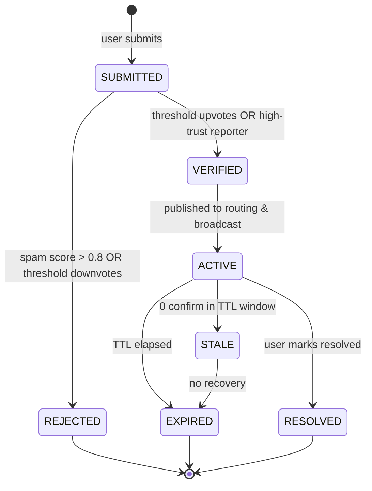
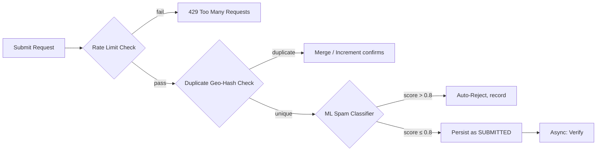
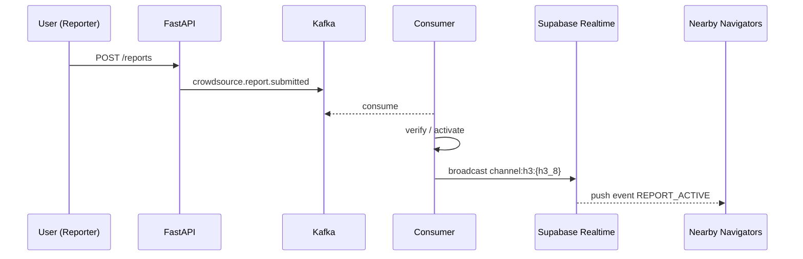
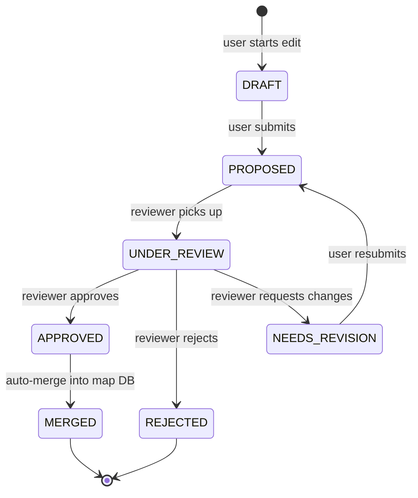
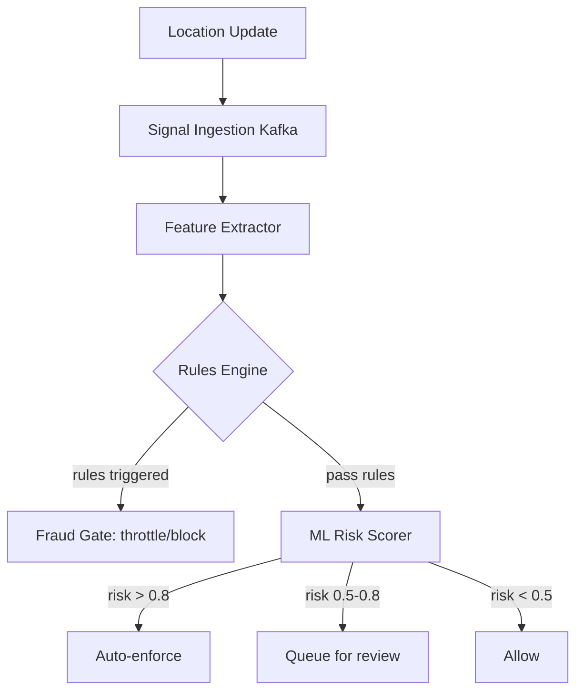

# ECOMANSONI Navigation — Part 4: Crowdsourcing, Advanced Features, SDK & Security

> **Navigation Series**
> - [Part 1: Core Engines](./01-core-engines.md) — Map Data Engine, Tile Rendering, Valhalla Routing
> - [Part 2: Intelligence & Navigation](./02-intelligence-navigation.md) — Traffic Intelligence, Map Matching, Turn-by-Turn
> - [Part 3: Search & Geocoding](./03-search-geocoding.md) — Geocoding, POI, Voice Search, Offline Maps
> - **Part 4 (this document)** — Crowdsourcing, Advanced Features, SDK & Security

---

## Table of Contents

- [4.1 Crowdsourcing Engine](#41-crowdsourcing-engine)
  - [4.1.1 Report Types & Lifecycle](#411-report-types--lifecycle)
  - [4.1.2 Data Model](#412-data-model)
  - [4.1.3 Geobinding to Road Segments](#413-geobinding-to-road-segments)
  - [4.1.4 Verification Engine](#414-verification-engine)
  - [4.1.5 Reporter Reputation & Trust](#415-reporter-reputation--trust)
  - [4.1.6 Spam & Abuse Protection](#416-spam--abuse-protection)
  - [4.1.7 Auto-Expiration Policy](#417-auto-expiration-policy)
  - [4.1.8 Routing Weight Integration](#418-routing-weight-integration)
  - [4.1.9 Real-time Broadcast via WebSocket](#419-real-time-broadcast-via-websocket)
  - [4.1.10 Heatmap Generation](#4110-heatmap-generation)
  - [4.1.11 API Contracts](#4111-api-contracts)
  - [4.1.12 Kafka Events](#4112-kafka-events)
  - [4.1.13 Gamification](#4113-gamification)
- [4.2 Map Editing & Community Contributions](#42-map-editing--community-contributions)
  - [4.2.1 Edit Workflow](#421-edit-workflow)
  - [4.2.2 Data Model](#422-data-model)
  - [4.2.3 Diff Visualization](#423-diff-visualization)
  - [4.2.4 Moderation Console](#424-moderation-console)
  - [4.2.5 Conflict Resolution](#425-conflict-resolution)
  - [4.2.6 OSM Contribution Pipeline](#426-osm-contribution-pipeline)
  - [4.2.7 Data Quality Scoring](#427-data-quality-scoring)
- [4.3 Advanced Navigation Features](#43-advanced-navigation-features)
  - [4.3.1 Multi-stop Routing](#431-multi-stop-routing)
  - [4.3.2 Route Alternatives & Scoring](#432-route-alternatives--scoring)
  - [4.3.3 Route Preferences](#433-route-preferences)
  - [4.3.4 Scheduled Departure](#434-scheduled-departure)
  - [4.3.5 Carpool / Rideshare Matching](#435-carpool--rideshare-matching)
  - [4.3.6 Electric Vehicle Routing](#436-electric-vehicle-routing)
  - [4.3.7 Truck Routing](#437-truck-routing)
  - [4.3.8 Parking Integration](#438-parking-integration)
  - [4.3.9 Safety Alerts (Speed Cameras, School Zones)](#439-safety-alerts)
  - [4.3.10 Weather Overlay & Elevation Profile](#4310-weather-overlay--elevation-profile)
  - [4.3.11 Cost & Emissions Estimation](#4311-cost--emissions-estimation)
- [4.4 Navigation SDK](#44-navigation-sdk)
  - [4.4.1 Architecture Overview](#441-architecture-overview)
  - [4.4.2 Public API Surface](#442-public-api-surface)
  - [4.4.3 Platform Support](#443-platform-support)
  - [4.4.4 Authentication & Rate Limits](#444-authentication--rate-limits)
  - [4.4.5 Versioning & Distribution](#445-versioning--distribution)
  - [4.4.6 SDK Analytics](#446-sdk-analytics)
  - [4.4.7 Code Examples](#447-code-examples)
- [4.5 Security Architecture](#45-security-architecture)
  - [4.5.1 AuthN / AuthZ](#451-authn--authz)
  - [4.5.2 API Key Management](#452-api-key-management)
  - [4.5.3 Rate Limiting Strategy](#453-rate-limiting-strategy)
  - [4.5.4 DDoS Protection](#454-ddos-protection)
  - [4.5.5 GPS Spoofing Detection](#455-gps-spoofing-detection)
  - [4.5.6 Privacy & GDPR](#456-privacy--gdpr)
  - [4.5.7 Data Encryption](#457-data-encryption)
  - [4.5.8 Audit Logging](#458-audit-logging)
  - [4.5.9 OWASP for Geo-APIs](#459-owasp-for-geo-apis)
  - [4.5.10 Incident Response](#4510-incident-response)
- [4.6 Anti-Fraud for Navigation](#46-anti-fraud-for-navigation)
  - [4.6.1 Fake GPS Detection](#461-fake-gps-detection)
  - [4.6.2 Trip Fraud Detection](#462-trip-fraud-detection)
  - [4.6.3 Coordinated Supply Manipulation](#463-coordinated-supply-manipulation)
  - [4.6.4 Rules Engine](#464-rules-engine)
  - [4.6.5 ML Risk Scoring](#465-ml-risk-scoring)
  - [4.6.6 Graph / Collusion Detection](#466-graph--collusion-detection)
  - [4.6.7 Enforcement Ladder](#467-enforcement-ladder)
  - [4.6.8 Signal Ingestion Pipeline](#468-signal-ingestion-pipeline)
  - [4.6.9 API Contracts](#469-api-contracts)
- [4.7 Full Database Schema](#47-full-database-schema)
- [4.8 Event Schemas (Kafka)](#48-event-schemas-kafka)
- [4.9 Metrics & SLOs](#49-metrics--slos)

---

## 4.1 Crowdsourcing Engine

The Crowdsourcing Engine ingests real-time field events from users — accidents, road works, speed cameras, hazards — validates them, merges them into the live traffic graph, and broadcasts updates to all active navigating clients.

### 4.1.1 Report Types & Lifecycle

**Supported report categories**

| Category | Code | Sub-types |
|---|---|---|
| Accident | `ACCIDENT` | minor, major, blocking |
| Police | `POLICE` | speed-trap, checkpoint |
| Speed Camera | `CAMERA` | fixed, mobile, red-light |
| Road Work | `ROADWORK` | lane-closure, full-closure |
| Hazard | `HAZARD` | debris, pothole, flood, ice, animal |
| Traffic Jam | `TRAFFIC` | slow, standstill |
| Closure | `CLOSURE` | road-closed, bridge-closed |

**Lifecycle state machine**



Transitions are driven by:
1. **Vote accumulator** (Kafka consumer)
2. **TTL scheduler** (PostgreSQL `pg_cron` job every 60 s)
3. **Reporter trust gate** (instant activation for trust ≥ 0.85)

---

### 4.1.2 Data Model

```sql
-- ============================================================
-- crowdsource_reports
-- ============================================================
CREATE TABLE crowdsource_reports (
    id              UUID        PRIMARY KEY DEFAULT gen_random_uuid(),
    user_id         UUID        NOT NULL REFERENCES auth.users(id),
    category        TEXT        NOT NULL CHECK (category IN (
                                    'ACCIDENT','POLICE','CAMERA',
                                    'ROADWORK','HAZARD','TRAFFIC','CLOSURE')),
    sub_type        TEXT,
    status          TEXT        NOT NULL DEFAULT 'SUBMITTED'
                                CHECK (status IN (
                                    'SUBMITTED','VERIFIED','ACTIVE',
                                    'STALE','EXPIRED','RESOLVED','REJECTED')),
    location        GEOMETRY(Point, 4326) NOT NULL,
    h3_index_8      TEXT        NOT NULL,   -- H3 resolution 8  (~460 m)
    h3_index_11     TEXT        NOT NULL,   -- H3 resolution 11 (~25 m)
    road_segment_id BIGINT      REFERENCES road_segments(osm_way_id),
    direction       SMALLINT    CHECK (direction IN (-1, 0, 1)), -- -1=reverse,0=both,1=forward
    description     TEXT,
    media_urls      TEXT[]      DEFAULT '{}',
    upvotes         INT         NOT NULL DEFAULT 0,
    downvotes       INT         NOT NULL DEFAULT 0,
    confirms        INT         NOT NULL DEFAULT 0,
    spam_score      FLOAT4      NOT NULL DEFAULT 0.0,
    trust_score     FLOAT4      NOT NULL DEFAULT 0.5,
    reporter_level  SMALLINT    NOT NULL DEFAULT 1,
    reporter_trust  FLOAT4      NOT NULL DEFAULT 0.5,
    speed_at_submit FLOAT4,     -- m/s
    heading         FLOAT4,     -- degrees 0-360
    accuracy        FLOAT4,     -- GPS accuracy metres
    altitude        FLOAT4,
    device_id       TEXT,
    client_version  TEXT,
    expires_at      TIMESTAMPTZ NOT NULL,
    activated_at    TIMESTAMPTZ,
    resolved_at     TIMESTAMPTZ,
    created_at      TIMESTAMPTZ NOT NULL DEFAULT now(),
    updated_at      TIMESTAMPTZ NOT NULL DEFAULT now()
) PARTITION BY RANGE (created_at);

CREATE TABLE crowdsource_reports_2026_q1
    PARTITION OF crowdsource_reports
    FOR VALUES FROM ('2026-01-01') TO ('2026-04-01');

CREATE TABLE crowdsource_reports_2026_q2
    PARTITION OF crowdsource_reports
    FOR VALUES FROM ('2026-04-01') TO ('2026-07-01');

CREATE INDEX idx_reports_h3_8_status
    ON crowdsource_reports (h3_index_8, status)
    WHERE status IN ('ACTIVE','VERIFIED');

CREATE INDEX idx_reports_location_gist
    ON crowdsource_reports USING GIST (location)
    WHERE status = 'ACTIVE';

CREATE INDEX idx_reports_user_created
    ON crowdsource_reports (user_id, created_at DESC);

-- ============================================================
-- crowdsource_votes
-- ============================================================
CREATE TABLE crowdsource_votes (
    id          UUID        PRIMARY KEY DEFAULT gen_random_uuid(),
    report_id   UUID        NOT NULL REFERENCES crowdsource_reports(id) ON DELETE CASCADE,
    user_id     UUID        NOT NULL REFERENCES auth.users(id),
    vote        SMALLINT    NOT NULL CHECK (vote IN (-1, 1)), -- -1=downvote, 1=upvote/confirm
    voted_at    TIMESTAMPTZ NOT NULL DEFAULT now(),
    distance_m  FLOAT4,    -- distance from user to report at vote time
    UNIQUE (report_id, user_id)
);

CREATE INDEX idx_votes_report ON crowdsource_votes (report_id);
```

**Row-level security**

```sql
ALTER TABLE crowdsource_reports ENABLE ROW LEVEL SECURITY;

-- Anyone can read ACTIVE reports
CREATE POLICY reports_read_active ON crowdsource_reports
    FOR SELECT USING (status = 'ACTIVE');

-- Authenticated users insert only their own
CREATE POLICY reports_insert_own ON crowdsource_reports
    FOR INSERT WITH CHECK (auth.uid() = user_id);

-- User can update own report (e.g., resolve)
CREATE POLICY reports_update_own ON crowdsource_reports
    FOR UPDATE USING (auth.uid() = user_id);
```

---

### 4.1.3 Geobinding to Road Segments

When a report is submitted, the backend snaps the raw GPS point to the nearest road segment within 50 m using PostGIS + the Valhalla road network table.

```python
# services/crowdsource/snap.py
from shapely.geometry import Point
from app.db import get_db

async def snap_to_segment(lon: float, lat: float) -> int | None:
    """
    Returns osm_way_id of the nearest road segment within 50 m.
    Uses ST_DWithin with geography for metre-accurate distance.
    """
    async with get_db() as conn:
        row = await conn.fetchrow(
            """
            SELECT osm_way_id,
                   ST_Distance(
                       geom::geography,
                       ST_SetSRID(ST_MakePoint($1,$2),4326)::geography
                   ) AS dist_m
            FROM road_segments
            WHERE ST_DWithin(
                geom::geography,
                ST_SetSRID(ST_MakePoint($1,$2),4326)::geography,
                50
            )
            ORDER BY dist_m
            LIMIT 1
            """,
            lon, lat
        )
        return row["osm_way_id"] if row else None
```

Direction inference: bearing of the report point relative to the road segment geometry determines `direction` field (`-1`, `0`, `1`).

---

### 4.1.4 Verification Engine

Verification thresholds vary by reporter trust tier:

| Reporter Trust | Instant Activation | Upvotes Needed |
|---|---|---|
| `< 0.4` | No | 5 upvotes from trust ≥ 0.5 |
| `0.4 – 0.7` | No | 3 upvotes |
| `0.7 – 0.85` | No | 1 upvote |
| `≥ 0.85` | **Yes** | — |

```python
# services/crowdsource/verifier.py
VOTE_THRESHOLDS = {
    "low": 5,
    "medium": 3,
    "high": 1,
}

def required_votes(reporter_trust: float) -> int:
    if reporter_trust < 0.4:
        return VOTE_THRESHOLDS["low"]
    if reporter_trust < 0.7:
        return VOTE_THRESHOLDS["medium"]
    return VOTE_THRESHOLDS["high"]

async def evaluate_report(report_id: str, db) -> str:
    """Recalculate status after each new vote."""
    report = await db.fetchrow(
        "SELECT reporter_trust, upvotes, downvotes, spam_score FROM crowdsource_reports WHERE id=$1",
        report_id
    )
    if report["spam_score"] > 0.8 or report["downvotes"] >= 5:
        return "REJECTED"
    if report["reporter_trust"] >= 0.85:
        return "ACTIVE"
    threshold = required_votes(report["reporter_trust"])
    net_votes = report["upvotes"] - report["downvotes"]
    if net_votes >= threshold:
        return "ACTIVE"
    return "SUBMITTED"
```

---

### 4.1.5 Reporter Reputation & Trust

Trust score is a Bayesian rolling average maintained per user.

```sql
CREATE TABLE reporter_reputation (
    user_id         UUID    PRIMARY KEY REFERENCES auth.users(id),
    trust_score     FLOAT4  NOT NULL DEFAULT 0.5,
    reports_total   INT     NOT NULL DEFAULT 0,
    reports_verified INT    NOT NULL DEFAULT 0,
    reports_rejected INT    NOT NULL DEFAULT 0,
    upvotes_given   INT     NOT NULL DEFAULT 0,
    upvotes_received INT    NOT NULL DEFAULT 0,
    level           SMALLINT NOT NULL DEFAULT 1,
    xp              INT     NOT NULL DEFAULT 0,
    streak_days     INT     NOT NULL DEFAULT 0,
    last_report_at  TIMESTAMPTZ,
    updated_at      TIMESTAMPTZ NOT NULL DEFAULT now()
);
```

**Trust update formula** (Kafka consumer fires after report status change):

```python
def update_trust(verified: int, rejected: int, total: int) -> float:
    """Wilson score lower bound (95% CI)."""
    if total == 0:
        return 0.5
    import math
    z = 1.96  # 95%
    p = verified / total
    n = total
    lb = (p + z*z/(2*n) - z*math.sqrt((p*(1-p)+z*z/(4*n))/n)) / (1+z*z/n)
    return round(lb, 4)
```

---

### 4.1.6 Spam & Abuse Protection

Multi-layer spam pipeline runs **before** the report is written to the database:



**Duplicate detection** — reports within same H3 cell (res 11 ≈ 25 m) and same category within last 10 minutes are merged:

```python
async def find_duplicate(category: str, h3_11: str, db) -> str | None:
    row = await db.fetchrow(
        """
        SELECT id FROM crowdsource_reports
        WHERE category = $1
          AND h3_index_11 = $2
          AND status IN ('SUBMITTED','VERIFIED','ACTIVE')
          AND created_at > now() - interval '10 minutes'
        LIMIT 1
        """,
        category, h3_11
    )
    return row["id"] if row else None
```

**Rate limits per user**: max 10 reports per hour, 30 per day. Enforced via Redis sliding window.

---

### 4.1.7 Auto-Expiration Policy

```python
EXPIRY_TTL = {
    "ACCIDENT":  timedelta(hours=2),
    "POLICE":    timedelta(minutes=45),
    "CAMERA":    timedelta(days=30),   # fixed cameras persist longer
    "ROADWORK":  timedelta(days=7),
    "HAZARD":    timedelta(hours=4),
    "TRAFFIC":   timedelta(minutes=30),
    "CLOSURE":   timedelta(days=3),
}
```

`pg_cron` job (runs every 60 s):

```sql
SELECT cron.schedule('expire-reports', '* * * * *', $$
    UPDATE crowdsource_reports
    SET status = 'EXPIRED', updated_at = now()
    WHERE status = 'ACTIVE'
      AND expires_at < now();
$$);
```

Stale detection: if an ACTIVE report receives 0 confirms in the last 20 min (for categories with TTL < 2 h), it transitions to STALE.

---

### 4.1.8 Routing Weight Integration

Active reports modify Valhalla's edge cost via the **custom cost extension API**. A Python worker exports live report weights to a Redis hash that the Valhalla service reads on each route request.

```python
# workers/routing_weights_exporter.py
import redis
import asyncpg

WEIGHT_MULTIPLIERS = {
    "ACCIDENT": {"ACTIVE": 3.5, "VERIFIED": 2.0},
    "ROADWORK": {"ACTIVE": 2.5, "VERIFIED": 1.8},
    "CLOSURE":  {"ACTIVE": 999.0},           # impassable
    "TRAFFIC":  {"ACTIVE": 2.0},
    "HAZARD":   {"ACTIVE": 1.5},
    "POLICE":   {"ACTIVE": 1.0},             # no cost change, just alert
    "CAMERA":   {"ACTIVE": 1.0},
}

async def export_weights(db: asyncpg.Connection, redis_client: redis.Redis):
    rows = await db.fetch(
        """
        SELECT road_segment_id, category, status, direction
        FROM crowdsource_reports
        WHERE status IN ('ACTIVE','VERIFIED')
          AND road_segment_id IS NOT NULL
          AND expires_at > now()
        """
    )
    pipe = redis_client.pipeline()
    for r in rows:
        key = f"route_weight:{r['road_segment_id']}:{r['direction']}"
        mult = WEIGHT_MULTIPLIERS.get(r["category"], {}).get(r["status"], 1.0)
        pipe.set(key, mult, ex=300)   # 5-min TTL, refreshed each cycle
    pipe.execute()
```

---

### 4.1.9 Real-time Broadcast via WebSocket

All active navigation clients subscribe to their H3 cells. When a report's status becomes `ACTIVE`, a Kafka consumer pushes it to Supabase Realtime channels.



**WebSocket subscription** (client-side TypeScript):

```typescript
import { supabase } from '@/lib/supabase'

function subscribeToReports(h3Cells: string[]) {
  return supabase
    .channel('crowdsource-reports')
    .on('broadcast', { event: 'REPORT_ACTIVE' }, (payload) => {
      const report = payload.payload as CrowdsourceReport
      mapStore.addReport(report)
    })
    .on('broadcast', { event: 'REPORT_EXPIRED' }, (payload) => {
      mapStore.removeReport(payload.payload.id)
    })
    .subscribe()
}
```

---

### 4.1.10 Heatmap Generation

Heatmap tiles aggregated into ClickHouse every 5 minutes from Kafka events.

```sql
-- ClickHouse table
CREATE TABLE crowdsource_heatmap (
    ts          DateTime,
    h3_8        String,
    category    LowCardinality(String),
    report_cnt  UInt32,
    avg_trust   Float32
) ENGINE = SummingMergeTree()
  PARTITION BY toYYYYMM(ts)
  ORDER BY (h3_8, category, ts);
```

HTTP endpoint returns GeoJSON `FeatureCollection` with H3 hexagons coloured by density. Query is cached in Redis for 60 s per bounding box.

---

### 4.1.11 API Contracts

#### Submit Report

```http
POST /api/v1/navigation/reports
Authorization: Bearer <jwt>
Content-Type: application/json

{
  "category": "ACCIDENT",
  "sub_type": "major",
  "location": { "longitude": 37.6173, "latitude": 55.7558 },
  "heading": 92.5,
  "speed_mps": 8.3,
  "accuracy_m": 5.0,
  "description": "Авария на 3 полосах, правый ряд закрыт"
}
```

**Response 201**

```json
{
  "id": "c7f3b2a1-...",
  "status": "SUBMITTED",
  "expires_at": "2026-03-06T14:00:00Z",
  "duplicate_of": null
}
```

**Error responses**

| Code | Condition |
|---|---|
| 400 | Invalid coordinates or missing required fields |
| 422 | Category not in allowed list |
| 429 | Rate limit exceeded |
| 503 | Spam score too high (silent fail: returns 201 but marks REJECTED) |

---

#### Vote on Report

```http
POST /api/v1/navigation/reports/{report_id}/vote
Authorization: Bearer <jwt>

{ "vote": 1 }   // 1 = confirm/upvote, -1 = downvote
```

**Response 200**

```json
{
  "report_id": "c7f3b2a1-...",
  "your_vote": 1,
  "upvotes": 7,
  "downvotes": 1,
  "status": "ACTIVE"
}
```

---

#### List Nearby Reports

```http
GET /api/v1/navigation/reports/nearby?lat=55.7558&lon=37.6173&radius_m=2000&categories=ACCIDENT,POLICE,CAMERA
Authorization: Bearer <jwt>
```

**Response 200**

```json
{
  "reports": [
    {
      "id": "c7f3b2a1-...",
      "category": "ACCIDENT",
      "sub_type": "major",
      "location": { "longitude": 37.6201, "latitude": 55.7571 },
      "distance_m": 312,
      "bearing": 47.2,
      "upvotes": 7,
      "status": "ACTIVE",
      "expires_at": "2026-03-06T14:00:00Z",
      "created_at": "2026-03-06T12:00:00Z"
    }
  ],
  "total": 1,
  "center": { "lon": 37.6173, "lat": 55.7558 },
  "radius_m": 2000
}
```

---

### 4.1.12 Kafka Events

```
Topic: crowdsource.report.submitted    partition-key: h3_index_8
Topic: crowdsource.report.status_changed
Topic: crowdsource.vote.cast
Topic: crowdsource.report.expired
```

Full schemas in [Section 4.8](#48-event-schemas-kafka).

---

### 4.1.13 Gamification

```sql
CREATE TABLE gamification_events (
    id          UUID        PRIMARY KEY DEFAULT gen_random_uuid(),
    user_id     UUID        NOT NULL REFERENCES auth.users(id),
    event_type  TEXT        NOT NULL,  -- 'report_verified','vote_cast','streak_day', etc.
    xp_delta    INT         NOT NULL DEFAULT 0,
    badge_id    TEXT,
    metadata    JSONB       DEFAULT '{}',
    created_at  TIMESTAMPTZ NOT NULL DEFAULT now()
);

CREATE TABLE badges (
    id          TEXT    PRIMARY KEY,   -- 'first_report','road_warrior','local_hero', etc.
    name        TEXT    NOT NULL,
    description TEXT,
    icon_url    TEXT,
    xp_required INT     NOT NULL DEFAULT 0,
    rarity      TEXT    CHECK (rarity IN ('common','rare','epic','legendary'))
);
```

**XP table**

| Action | XP |
|---|---|
| Report verified | +15 |
| Report confirmed by 5+ users | +25 |
| Vote that matches majority | +3 |
| 7-day streak | +50 |
| First report of the day in city | +10 |
| Report rejected (spam) | −20 |

Level thresholds: 1→100 XP, 2→300, 3→700, 4→1500, 5→3000, then +2500 per level.

---

## 4.2 Map Editing & Community Contributions

### 4.2.1 Edit Workflow



Auto-approve conditions (no human review needed):
- Editor trust ≥ 0.9 AND edit type is `POI_HOURS` or `POI_PHONE`
- Change is purely additive (new POI) AND editor level ≥ 4

---

### 4.2.2 Data Model

```sql
CREATE TABLE map_edits (
    id              UUID        PRIMARY KEY DEFAULT gen_random_uuid(),
    user_id         UUID        NOT NULL REFERENCES auth.users(id),
    edit_type       TEXT        NOT NULL CHECK (edit_type IN (
                                    'ROAD_GEOM','ROAD_ATTR','POI_NEW',
                                    'POI_UPDATE','POI_DELETE','ADDRESS',
                                    'SPEED_LIMIT','ACCESS_RESTRICTION')),
    status          TEXT        NOT NULL DEFAULT 'PROPOSED'
                                CHECK (status IN (
                                    'DRAFT','PROPOSED','UNDER_REVIEW',
                                    'APPROVED','REJECTED','NEEDS_REVISION','MERGED')),
    target_osm_type TEXT        CHECK (target_osm_type IN ('node','way','relation')),
    target_osm_id   BIGINT,
    before_geom     GEOMETRY(Geometry,4326),
    after_geom      GEOMETRY(Geometry,4326),
    before_tags     JSONB       DEFAULT '{}',
    after_tags      JSONB       DEFAULT '{}',
    change_summary  TEXT        NOT NULL,
    reviewer_id     UUID        REFERENCES auth.users(id),
    reviewer_note   TEXT,
    quality_score   FLOAT4,
    changeset_id    BIGINT,    -- OSM changeset if pushed back
    created_at      TIMESTAMPTZ NOT NULL DEFAULT now(),
    reviewed_at     TIMESTAMPTZ,
    merged_at       TIMESTAMPTZ
);

CREATE INDEX idx_edits_status ON map_edits (status) WHERE status IN ('PROPOSED','UNDER_REVIEW');
CREATE INDEX idx_edits_user ON map_edits (user_id, created_at DESC);
CREATE INDEX idx_edits_geom ON map_edits USING GIST (after_geom);

CREATE TABLE map_edit_comments (
    id          UUID        PRIMARY KEY DEFAULT gen_random_uuid(),
    edit_id     UUID        NOT NULL REFERENCES map_edits(id) ON DELETE CASCADE,
    user_id     UUID        NOT NULL REFERENCES auth.users(id),
    body        TEXT        NOT NULL,
    created_at  TIMESTAMPTZ NOT NULL DEFAULT now()
);
```

---

### 4.2.3 Diff Visualization

The diff API returns a GeoJSON `FeatureCollection` with two features per changed geometry: `before` and `after`, plus a tag-level diff.

```http
GET /api/v1/map-edits/{edit_id}/diff
```

```json
{
  "geometry_diff": {
    "before": { "type": "LineString", "coordinates": [[37.61, 55.75], [37.62, 55.76]] },
    "after":  { "type": "LineString", "coordinates": [[37.61, 55.75], [37.615, 55.757], [37.62, 55.76]] }
  },
  "tag_diff": [
    { "key": "maxspeed", "before": "60", "after": "50", "action": "modified" },
    { "key": "lanes",    "before": null,  "after": "3",  "action": "added" }
  ]
}
```

MapLibre GL JS renders the diff with a split-panel: left = before, right = after, animated transition on toggle.

---

### 4.2.4 Moderation Console

Reviewer console is a React admin dashboard at `/admin/map-edits`. Endpoints:

```http
GET  /api/v1/admin/map-edits?status=PROPOSED&page=1&per_page=20
POST /api/v1/admin/map-edits/{id}/approve   { "note": "Verified on-site" }
POST /api/v1/admin/map-edits/{id}/reject    { "reason": "Incorrect geometry" }
POST /api/v1/admin/map-edits/{id}/request-revision  { "note": "Please adjust speed limit" }
```

All admin actions are written to `audit_log` (see [Section 4.5.8](#458-audit-logging)).

---

### 4.2.5 Conflict Resolution

Conflicts occur when two proposed edits touch the same OSM object. Detection query:

```sql
SELECT a.id AS edit_a, b.id AS edit_b
FROM map_edits a
JOIN map_edits b
  ON a.target_osm_id = b.target_osm_id
 AND a.target_osm_type = b.target_osm_type
 AND a.id <> b.id
WHERE a.status IN ('PROPOSED','UNDER_REVIEW')
  AND b.status IN ('PROPOSED','UNDER_REVIEW');
```

Conflict resolution strategy:
1. **Auto-merge** if changes are in disjoint tag sets (e.g., one edits `maxspeed`, other edits `name`).
2. **Reviewer arbitration** if geometries or same tags conflict — both proposals shown side-by-side.
3. **First-merged wins** for simultaneous geometry edits — loser transitions to `NEEDS_REVISION`.

---

### 4.2.6 OSM Contribution Pipeline

Optional pipeline pushes approved edits back to OpenStreetMap via the OSM API v0.6.

```python
# workers/osm_push.py
import httpx
import xml.etree.ElementTree as ET

OSM_API = "https://api.openstreetmap.org/api/0.6"

async def push_edit_to_osm(edit: dict, oauth_token: str):
    # 1. Create changeset
    cs_xml = build_changeset_xml(edit["change_summary"])
    resp = await httpx.post(f"{OSM_API}/changeset/create",
                             content=cs_xml,
                             headers={"Authorization": f"Bearer {oauth_token}",
                                      "Content-Type": "text/xml"})
    changeset_id = int(resp.text)

    # 2. Upload diff
    diff_xml = build_osmchange_xml(edit, changeset_id)
    await httpx.post(f"{OSM_API}/changeset/{changeset_id}/upload",
                      content=diff_xml,
                      headers={"Authorization": f"Bearer {oauth_token}",
                               "Content-Type": "text/xml"})

    # 3. Close changeset
    await httpx.put(f"{OSM_API}/changeset/{changeset_id}/close",
                     headers={"Authorization": f"Bearer {oauth_token}"})
    return changeset_id
```

---

### 4.2.7 Data Quality Scoring

Quality score computed at review time (0.0–1.0):

```python
def compute_edit_quality(edit: dict) -> float:
    score = 0.5
    # Geometry precision
    if edit["after_geom"] and edit["before_geom"]:
        delta_m = geom_delta_metres(edit["before_geom"], edit["after_geom"])
        if delta_m < 2:
            score += 0.1   # micro-correction bonus
    # Tag completeness
    required_tags = {"name", "highway", "maxspeed"}
    after_tags = set(edit["after_tags"].keys())
    completeness = len(required_tags & after_tags) / len(required_tags)
    score += completeness * 0.2
    # Reporter history
    score += min(edit["reporter_trust"] * 0.2, 0.2)
    return round(min(score, 1.0), 3)
```

---

## 4.3 Advanced Navigation Features

### 4.3.1 Multi-stop Routing

```http
POST /api/v1/navigation/route/multistop
Authorization: Bearer <jwt>

{
  "waypoints": [
    { "lon": 37.6173, "lat": 55.7558, "label": "Home" },
    { "lon": 37.6250, "lat": 55.7600, "label": "Coffee" },
    { "lon": 37.6400, "lat": 55.7700, "label": "Office" }
  ],
  "optimize_order": true,
  "costing": "auto",
  "depart_at": "2026-03-07T08:30:00+03:00"
}
```

`optimize_order: true` runs a nearest-neighbour TSP heuristic for ≤10 stops or Valhalla's optimised route API for ≤8.

**Response**

```json
{
  "optimized_order": [0, 1, 2],
  "legs": [
    {
      "from": "Home", "to": "Coffee",
      "distance_m": 950, "duration_s": 210,
      "polyline": "encoded_polyline..."
    },
    {
      "from": "Coffee", "to": "Office",
      "distance_m": 1800, "duration_s": 420,
      "polyline": "..."
    }
  ],
  "total_distance_m": 2750,
  "total_duration_s": 630,
  "route_id": "rt_9f2a..."
}
```

---

### 4.3.2 Route Alternatives & Scoring

Valhalla returns up to 3 alternatives. Each is scored:

```python
def score_route(route: dict, user_prefs: dict) -> float:
    """Higher score = better for this user."""
    w_time   = user_prefs.get("weight_time", 0.6)
    w_dist   = user_prefs.get("weight_distance", 0.2)
    w_eco    = user_prefs.get("weight_eco", 0.2)

    # Normalised (0-1) relative to fastest/shortest/cleanest
    t_norm = 1 - (route["duration_s"] / max_duration)
    d_norm = 1 - (route["distance_m"] / max_distance)
    e_norm = 1 - (route["co2_g"] / max_co2)

    return w_time * t_norm + w_dist * d_norm + w_eco * e_norm
```

---

### 4.3.3 Route Preferences

Passed as Valhalla `costing_options`:

```json
{
  "costing": "auto",
  "costing_options": {
    "auto": {
      "use_tolls": 0.0,
      "use_highways": 0.5,
      "use_ferry": 0.0,
      "top_speed": 120
    }
  }
}
```

API parameter mapping:

| User Preference | Valhalla Param | Range |
|---|---|---|
| Avoid tolls | `use_tolls` | 0.0 = avoid, 1.0 = prefer |
| Avoid highways | `use_highways` | 0.0 = avoid |
| Avoid ferries | `use_ferry` | 0.0 = avoid |
| Prefer eco | `eco_short` | custom weight |

---

### 4.3.4 Scheduled Departure

Routes computed with predicted traffic at departure time using ClickHouse speed percentiles (see Part 2).

```http
POST /api/v1/navigation/route
{
  "origin": { "lon": 37.62, "lat": 55.76 },
  "destination": { "lon": 37.70, "lat": 55.80 },
  "depart_at": "2026-03-08T09:00:00+03:00"
}
```

Backend injects `speed_types=predicted` into Valhalla request and attaches predicted speed band from the ClickHouse `traffic_speed_profiles` table (keyed by `(h3_8, day_of_week, hour_of_day)`).

---

### 4.3.5 Carpool / Rideshare Matching

```http
POST /api/v1/navigation/carpool/match
{
  "role": "driver",
  "origin": { "lon": 37.62, "lat": 55.75 },
  "destination": { "lon": 37.80, "lat": 55.82 },
  "depart_at": "2026-03-08T08:00:00+03:00",
  "seats_available": 2,
  "detour_tolerance_pct": 20
}
```

Matching algorithm:
1. Find candidate riders with `depart_at ± 15 min` within bounding box.
2. Compute detour penalty: extra distance / original distance ≤ `detour_tolerance_pct`.
3. Return ranked matches sorted by combined score (detour + time overlap).

---

### 4.3.6 Electric Vehicle Routing

```http
POST /api/v1/navigation/route/ev
{
  "origin": { "lon": 37.62, "lat": 55.75 },
  "destination": { "lon": 40.00, "lat": 56.50 },
  "vehicle": {
    "range_km": 350,
    "current_battery_pct": 75,
    "model": "tesla_model_3",
    "charge_speed_kw": 150
  },
  "min_arrival_battery_pct": 15
}
```

**Response** includes charge stops:

```json
{
  "legs": [
    { "from": "Moscow", "to": "Charger A", "distance_km": 180, "battery_end_pct": 23 },
    { "charge_stop": { "station_id": "...", "charge_minutes": 22, "add_pct": 45 } },
    { "from": "Charger A", "to": "Destination", "distance_km": 140, "battery_end_pct": 35 }
  ],
  "total_charge_stops": 1,
  "total_charge_time_min": 22
}
```

Charge station database sourced from OpenChargeMap + operator feeds, stored in PostGIS `charge_stations` table.

---

### 4.3.7 Truck Routing

Additional costing attributes for truck mode:

```json
{
  "costing": "truck",
  "costing_options": {
    "truck": {
      "weight": 20.0,
      "axle_load": 10.0,
      "height": 4.2,
      "width": 2.55,
      "length": 18.0,
      "hazmat": false
    }
  }
}
```

Valhalla's truck costing respects OSM `maxweight`, `maxheight`, `maxwidth`, `hazmat` tags. The `road_segments` table is enriched with these attributes during the nightly OSM import.

---

### 4.3.8 Parking Integration

```http
GET /api/v1/navigation/parking/nearby?lat=55.75&lon=37.62&radius_m=500&arrives_at=2026-03-08T09:00:00Z
```

```json
{
  "lots": [
    {
      "id": "prk_001",
      "name": "Парковка Красная площадь",
      "location": { "lon": 37.618, "lat": 55.754 },
      "distance_m": 120,
      "availability": { "free_spaces": 34, "total": 150, "updated_at": "2026-03-08T08:55:00Z" },
      "price": { "per_hour_rub": 150, "currency": "RUB" },
      "features": ["covered", "ev_charging", "24h"]
    }
  ]
}
```

Availability data ingested via parking operator APIs (WebSocket or polling) into `parking_lots` + `parking_availability` tables.

---

### 4.3.9 Safety Alerts

Speed camera alerts are preloaded into the client cache on route start. School zone alerts are geo-fenced polygons.

```sql
CREATE TABLE safety_zones (
    id          UUID        PRIMARY KEY DEFAULT gen_random_uuid(),
    zone_type   TEXT        NOT NULL CHECK (zone_type IN ('SCHOOL','HOSPITAL','PEDESTRIAN','CAMERA_ZONE')),
    geom        GEOMETRY(Polygon, 4326) NOT NULL,
    speed_limit SMALLINT,
    active_from TIME,
    active_to   TIME,
    active_days INT[]       DEFAULT '{1,2,3,4,5,6,7}',
    source      TEXT
);

CREATE INDEX idx_safety_zones_gist ON safety_zones USING GIST (geom);
```

Client checks `ST_Within(current_pos, zone_geom)` every 2 s using a pre-fetched local spatial index.

---

### 4.3.10 Weather Overlay & Elevation Profile

**Weather overlay** — tiles served from `/api/v1/tiles/weather/{z}/{x}/{y}.png` backed by a 15-min cached request to OpenWeatherMap OWM Tiles API.

**Elevation profile** along a route:

```http
GET /api/v1/navigation/route/{route_id}/elevation
```

```json
{
  "points": [
    { "distance_m": 0,    "elevation_m": 156.4 },
    { "distance_m": 200,  "elevation_m": 161.2 },
    { "distance_m": 400,  "elevation_m": 158.7 }
  ],
  "ascent_m": 45,
  "descent_m": 38,
  "max_grade_pct": 8.2
}
```

Elevation sourced from Mapbox Terrain DEM (SRTM/NASADEM), served via Martin tile server.

---

### 4.3.11 Cost & Emissions Estimation

```python
# Fuel cost
def fuel_cost(distance_km: float, vehicle_class: str, fuel_price_per_litre: float) -> float:
    consumption = {  # litres/100 km
        "small_car": 6.5, "mid_car": 8.0, "suv": 10.5, "truck": 28.0
    }
    return distance_km / 100 * consumption.get(vehicle_class, 8.0) * fuel_price_per_litre

# CO₂ (g/km from WLTP data)
CO2_PER_KM = {
    "small_car": 115, "mid_car": 145, "suv": 185, "ev": 0,
    "truck": 680, "motorcycle": 80
}

def co2_grams(distance_km: float, vehicle_class: str) -> int:
    return int(distance_km * CO2_PER_KM.get(vehicle_class, 145))
```

Both values included in every route response under `cost_estimate` and `environmental`.

---

## 4.4 Navigation SDK

### 4.4.1 Architecture Overview

```
┌────────────────────────────────────────────────────────────┐
│                    SDK Consumer App                         │
├────────────────┬───────────────┬───────────────────────────┤
│  EcoMapsJS      │  EcoMaps iOS  │  EcoMaps Android          │
│  (TypeScript)   │  (Swift)      │  (Kotlin)                 │
├────────────────┴───────────────┴───────────────────────────┤
│              SDK Core Layer (shared logic)                  │
│  ┌──────────┐ ┌──────────┐ ┌──────────┐ ┌──────────────┐  │
│  │ Routing  │ │Geocoding │ │  POI     │ │  Navigation  │  │
│  │ Module   │ │ Module   │ │  Module  │ │  Engine      │  │
│  └──────────┘ └──────────┘ └──────────┘ └──────────────┘  │
│  ┌──────────────────────────────────────────────────────┐  │
│  │              Map Rendering (MapLibre GL)              │  │
│  └──────────────────────────────────────────────────────┘  │
├────────────────────────────────────────────────────────────┤
│                  Network Layer (REST + WS)                  │
│             API Key Auth │ Rate Limiting │ Retry            │
└────────────────────────────────────────────────────────────┘
                            │
                     ECOMANSONI APIs
```

---

### 4.4.2 Public API Surface

```typescript
// SDK public interface (TypeScript declaration)
export interface EcoMapsSDK {
  // Map
  createMap(container: HTMLElement, options: MapOptions): EcoMap
  // Routing
  calculateRoute(request: RouteRequest): Promise<RouteResult>
  startNavigation(route: RouteResult, options?: NavigationOptions): NavigationSession
  // Geocoding
  geocode(query: string, options?: GeocodeOptions): Promise<GeocodeResult[]>
  reverseGeocode(lon: number, lat: number): Promise<GeocodeResult>
  // POI
  searchPOI(query: string, around: LatLon, options?: POISearchOptions): Promise<POIResult[]>
  // Events hooks
  on(event: SDKEvent, handler: EventHandler): void
  off(event: SDKEvent, handler: EventHandler): void
}

export type SDKEvent =
  | 'route:start'
  | 'route:recalculate'
  | 'navigation:maneuver'
  | 'navigation:arrival'
  | 'navigation:off_route'
  | 'report:nearby'
  | 'map:style_loaded'
  | 'map:click'
  | 'error'
```

---

### 4.4.3 Platform Support

| Platform | Package | Min Version |
|---|---|---|
| Web (JS/TS) | `@ecomansoni/maps-js` | ES2020, modern browser |
| iOS | `EcoMapsSDK` (Swift Package) | iOS 15+ |
| Android | `com.ecomansoni:maps-sdk` | Android 7.0 (API 24) |
| React Native | `@ecomansoni/maps-rn` (via Capacitor bridge) | RN 0.71+ |
| Flutter | `ecomansoni_maps` | Flutter 3.0+ |

---

### 4.4.4 Authentication & Rate Limits

**API key creation**

```http
POST /api/v1/sdk/keys
Authorization: Bearer <admin_jwt>

{
  "name": "My App Production",
  "allowed_origins": ["https://myapp.com"],
  "allowed_bundle_ids": ["com.myapp.ios"],
  "plan": "starter"
}
```

**Response**

```json
{
  "key_id": "ek_live_...",
  "secret": "ek_live_abc123...",
  "plan": "starter",
  "quotas": {
    "routes_per_day": 10000,
    "geocodes_per_day": 50000,
    "map_loads_per_day": 100000
  }
}
```

**Rate limit headers** (returned on every SDK response):

```
X-RateLimit-Limit: 1000
X-RateLimit-Remaining: 876
X-RateLimit-Reset: 1741478400
X-Quota-Routes-Used: 234
X-Quota-Routes-Limit: 10000
```

Plans:

| Plan | Routes/day | Geocodes/day | Map loads/day | Price |
|---|---|---|---|---|
| Free | 500 | 5 000 | 10 000 | $0 |
| Starter | 10 000 | 50 000 | 100 000 | $49/mo |
| Pro | 100 000 | 500 000 | 1 000 000 | $249/mo |
| Enterprise | unlimited | unlimited | unlimited | custom |

---

### 4.4.5 Versioning & Distribution

SDK follows **semver** `MAJOR.MINOR.PATCH`.

- **Breaking changes** → major bump + 12-month deprecation window for previous major.
- **New features** → minor bump, backward compatible.
- **Bug fixes** → patch.

CDN distribution (Web SDK):

```html
<!-- Pinned version -->
<script src="https://cdn.ecomansoni.com/maps-js/2.4.1/ecomaps.min.js"></script>
<!-- Latest minor (auto-updates patches) -->
<script src="https://cdn.ecomansoni.com/maps-js/2.x/ecomaps.min.js"></script>
```

SRI hash published in release notes. Assets served via Cloudflare CDN with `Cache-Control: public, max-age=31536000, immutable` for pinned versions.

---

### 4.4.6 SDK Analytics

Usage events streamed to Kafka topic `sdk.usage`:

```json
{
  "event": "route_calculated",
  "key_id": "ek_live_...",
  "sdk_version": "2.4.1",
  "platform": "web",
  "origin_country": "RU",
  "duration_ms": 312,
  "costing": "auto",
  "waypoints_count": 2,
  "ts": "2026-03-06T12:00:00Z"
}
```

Aggregated in ClickHouse, exposed via dashboard at `/admin/sdk-analytics`.

---

### 4.4.7 Code Examples

#### Web (TypeScript)

```typescript
import EcoMaps from '@ecomansoni/maps-js'

const sdk = new EcoMaps({ apiKey: 'ek_live_...' })

const map = sdk.createMap(document.getElementById('map')!, {
  center: [37.6173, 55.7558],
  zoom: 14,
  style: 'eco://styles/streets-ru'
})

const route = await sdk.calculateRoute({
  origin: { lon: 37.6173, lat: 55.7558 },
  destination: { lon: 37.7000, lat: 55.8000 },
  costing: 'auto',
  alternatives: true
})

const nav = sdk.startNavigation(route)

nav.on('maneuver', (step) => {
  console.log(`In ${step.distance_m}m: ${step.instruction}`)
})

nav.on('arrival', () => {
  console.log('Вы прибыли к месту назначения!')
})
```

#### iOS (Swift)

```swift
import EcoMapsSDK

class MapViewController: UIViewController {
    let sdk = EcoMapsSDK(apiKey: "ek_live_...")

    override func viewDidLoad() {
        super.viewDidLoad()
        let mapView = sdk.createMapView(frame: view.bounds)
        view.addSubview(mapView)

        Task {
            let route = try await sdk.calculateRoute(
                origin: CLLocationCoordinate2D(latitude: 55.7558, longitude: 37.6173),
                destination: CLLocationCoordinate2D(latitude: 55.8000, longitude: 37.7000)
            )
            let session = sdk.startNavigation(route: route)
            session.onManeuver = { step in
                print("Через \(step.distanceM)м: \(step.instruction)")
            }
        }
    }
}
```

#### Android (Kotlin)

```kotlin
import com.ecomansoni.maps.EcoMapsSDK
import com.ecomansoni.maps.model.LatLon

class MapActivity : AppCompatActivity() {
    private val sdk = EcoMapsSDK(apiKey = "ek_live_...")

    override fun onCreate(savedInstanceState: Bundle?) {
        super.onCreate(savedInstanceState)
        val mapView = sdk.createMapView(this)
        setContentView(mapView)

        lifecycleScope.launch {
            val route = sdk.calculateRoute(
                origin = LatLon(55.7558, 37.6173),
                destination = LatLon(55.8000, 37.7000)
            )
            val session = sdk.startNavigation(route)
            session.onManeuver { step ->
                Log.d("NAV", "Через ${step.distanceM}м: ${step.instruction}")
            }
        }
    }
}
```

---

## 4.5 Security Architecture

### 4.5.1 AuthN / AuthZ

All navigation API endpoints require one of:

| Context | Credential | Validated by |
|---|---|---|
| User in app | Supabase JWT | PostgREST / FastAPI middleware |
| SDK / 3rd-party app | API Key (header `X-Api-Key`) | API Gateway (Kong) |
| Admin console | JWT + MFA (TOTP) | Supabase Auth + custom MFA check |
| Realtime subscriptions | JWT + channel signature | Supabase Realtime |

RBAC roles relevant to navigation:

```sql
-- Navigation-specific permissions
INSERT INTO role_permissions VALUES
  ('user',      'navigation:route:read',    true),
  ('user',      'navigation:report:write',  true),
  ('user',      'navigation:edit:propose',  true),
  ('moderator', 'navigation:edit:review',   true),
  ('moderator', 'navigation:report:manage', true),
  ('admin',     'navigation:*',             true),
  ('sdk_basic', 'navigation:route:read',    true),
  ('sdk_basic', 'navigation:geocode:read',  true),
  ('sdk_pro',   'navigation:*',             true);
```

---

### 4.5.2 API Key Management

```sql
CREATE TABLE api_keys (
    id              UUID        PRIMARY KEY DEFAULT gen_random_uuid(),
    key_id          TEXT        UNIQUE NOT NULL,           -- public: ek_live_xxx
    key_hash        TEXT        NOT NULL,                  -- bcrypt(secret)
    owner_user_id   UUID        NOT NULL REFERENCES auth.users(id),
    plan            TEXT        NOT NULL DEFAULT 'free',
    name            TEXT        NOT NULL,
    allowed_origins TEXT[]      DEFAULT '{}',
    allowed_ips     INET[]      DEFAULT '{}',
    scopes          TEXT[]      DEFAULT '{"route","geocode"}',
    is_active       BOOLEAN     NOT NULL DEFAULT true,
    last_used_at    TIMESTAMPTZ,
    expires_at      TIMESTAMPTZ,
    created_at      TIMESTAMPTZ NOT NULL DEFAULT now(),
    revoked_at      TIMESTAMPTZ
);

CREATE INDEX idx_api_keys_key_id ON api_keys (key_id) WHERE is_active = true;
```

Key rotation: zero-downtime rotation via `key_id` overlap period (both old and new keys accepted for 24 h).

---

### 4.5.3 Rate Limiting Strategy

Implemented in Kong API Gateway + Redis. Layers:

1. **Per API Key / per minute** — protects against burst abuse.
2. **Per User ID / per day** — enforces plan quotas.
3. **Per Endpoint / global** — protects backend capacity.
4. **Per IP / per minute** — DDoS first layer.

```nginx
# Kong rate-limit plugin config (declarative)
plugins:
  - name: rate-limiting-advanced
    config:
      limit: [100, 10000]
      window_size: [60, 86400]
      identifier: consumer
      strategy: redis
      redis:
        host: redis.internal
        port: 6379
      hide_client_headers: false
      error_code: 429
      error_message: "Rate limit exceeded. Retry-After header indicates reset time."
```

Sliding window algorithm (not fixed window) to prevent burst at window boundaries.

---

### 4.5.4 DDoS Protection

```
Internet → Cloudflare (L3/L4 DDoS, WAF) → Kong Gateway (L7 rate limit) → FastAPI
```

Cloudflare rules:
- Challenge (JS challenge) if RPS > 500 from single ASN in 1 min.
- Block Tor exit nodes for `/api/v1/navigation/reports` (abuse prevention).
- Cache tile endpoints at edge (`/api/v1/tiles/`) — CDN absorbs 95% of tile traffic.

Backend circuit breaker (FastAPI middleware):

```python
from circuitbreaker import circuit

@circuit(failure_threshold=10, recovery_timeout=30)
async def call_valhalla(payload: dict) -> dict:
    async with httpx.AsyncClient(timeout=5.0) as client:
        resp = await client.post(f"{VALHALLA_URL}/route", json=payload)
        resp.raise_for_status()
        return resp.json()
```

---

### 4.5.5 GPS Spoofing Detection

Multi-signal detection pipeline (see also [Section 4.6.1](#461-fake-gps-detection)):

```python
class GpsSpoofDetector:
    def check(self, location_seq: list[dict]) -> SpoofSignal:
        signals = []
        
        # 1. Impossible speed: >300 km/h without aviation mode
        for i in range(1, len(location_seq)):
            dist_m = haversine(location_seq[i-1], location_seq[i])
            dt_s = (location_seq[i]["ts"] - location_seq[i-1]["ts"]).total_seconds()
            speed_kmh = (dist_m / max(dt_s, 0.001)) * 3.6
            if speed_kmh > 300:
                signals.append(Signal("IMPOSSIBLE_SPEED", severity=0.9, value=speed_kmh))

        # 2. Accuracy too perfect: always < 2m on a moving device
        accuracies = [p["accuracy_m"] for p in location_seq]
        if max(accuracies) < 2.0 and len(accuracies) > 5:
            signals.append(Signal("SUSPICIOUSLY_ACCURATE", severity=0.6))

        # 3. Teleportation: >500m jump in <2s
        for i in range(1, len(location_seq)):
            dist_m = haversine(location_seq[i-1], location_seq[i])
            dt_s = (location_seq[i]["ts"] - location_seq[i-1]["ts"]).total_seconds()
            if dist_m > 500 and dt_s < 2:
                signals.append(Signal("TELEPORTATION", severity=0.95, value=dist_m))

        # 4. Network IP vs GPS location mismatch
        if location_seq[-1].get("ip_country") != location_seq[-1].get("gps_country"):
            signals.append(Signal("IP_GPS_MISMATCH", severity=0.7))

        return SpoofSignal(signals=signals, risk_score=max((s.severity for s in signals), default=0.0))
```

---

### 4.5.6 Privacy & GDPR

**Data minimisation**: precise location is never stored beyond the session; only H3 cell (resolution 8, ~460 m) is persisted in analytics.

**Consent management**:

```sql
CREATE TABLE location_consent (
    user_id         UUID        PRIMARY KEY REFERENCES auth.users(id),
    precision_level TEXT        NOT NULL DEFAULT 'approximate'
                                CHECK (precision_level IN ('none','approximate','precise')),
    share_with_ads  BOOLEAN     NOT NULL DEFAULT false,
    analytics_opt_in BOOLEAN    NOT NULL DEFAULT true,
    granted_at      TIMESTAMPTZ,
    revoked_at      TIMESTAMPTZ,
    updated_at      TIMESTAMPTZ NOT NULL DEFAULT now()
);
```

**Right to erasure** pipeline:

```python
async def erase_user_location_data(user_id: str, db):
    # 1. Anonymise crowdsource reports (keep event, remove user link)
    await db.execute(
        "UPDATE crowdsource_reports SET user_id = NULL, device_id = NULL WHERE user_id=$1",
        user_id
    )
    # 2. Delete trip history
    await db.execute("DELETE FROM navigation_sessions WHERE user_id=$1", user_id)
    # 3. Delete map edits attribution (keep edit, anonymise author)
    await db.execute("UPDATE map_edits SET user_id = NULL WHERE user_id=$1", user_id)
    # 4. Delete reputation record
    await db.execute("DELETE FROM reporter_reputation WHERE user_id=$1", user_id)
    # 5. Kafka tombstone for downstream consumers
    await kafka_producer.send("gdpr.erasure", key=user_id, value=None)
```

**Data retention** defaults:

| Data Type | Retention |
|---|---|
| Precise trip GPS trace | Session only (in-memory) |
| Navigation sessions (metadata) | 90 days |
| Crowdsource reports (de-identified) | 2 years |
| API key usage logs | 1 year |
| Fraud signals | 3 years |
| Audit logs | 5 years |

---

### 4.5.7 Data Encryption

**At rest**: Supabase PostgreSQL uses AES-256 disk encryption (provider-managed). Sensitive columns additionally encrypted at application layer:

```python
from cryptography.fernet import Fernet

KEY = Fernet(settings.FIELD_ENCRYPTION_KEY)

def encrypt_field(value: str) -> str:
    return KEY.encrypt(value.encode()).decode()

def decrypt_field(value: str) -> str:
    return KEY.decrypt(value.encode()).decode()
```

Applied to: `api_keys.key_hash`, `reporter_reputation.*` PII fields, fraud ML feature store.

**In transit**: TLS 1.3 enforced for all endpoints. HSTS header `max-age=63072000; includeSubDomains; preload`. Mobile SDK uses **certificate pinning**:

```swift
// iOS — pinned leaf certificate SHA-256
let pinnedHashes = [
    "sha256/AbCdEf1234567890..."
]
```

---

### 4.5.8 Audit Logging

```sql
CREATE TABLE audit_log (
    id          BIGSERIAL   PRIMARY KEY,
    ts          TIMESTAMPTZ NOT NULL DEFAULT now(),
    actor_id    UUID,
    actor_type  TEXT        CHECK (actor_type IN ('user','admin','service','api_key')),
    action      TEXT        NOT NULL,
    resource    TEXT        NOT NULL,
    resource_id TEXT,
    ip_address  INET,
    user_agent  TEXT,
    outcome     TEXT        CHECK (outcome IN ('success','failure','denied')),
    metadata    JSONB       DEFAULT '{}'
) PARTITION BY RANGE (ts);

CREATE INDEX idx_audit_actor ON audit_log (actor_id, ts DESC);
CREATE INDEX idx_audit_resource ON audit_log (resource, resource_id, ts DESC);
```

FastAPI middleware auto-logs all `POST/PUT/PATCH/DELETE` to navigation endpoints. Query:

```sql
SELECT * FROM audit_log
WHERE resource = 'map_edit'
  AND action IN ('approve','reject')
  AND ts > now() - interval '7 days'
ORDER BY ts DESC;
```

---

### 4.5.9 OWASP for Geo-APIs

| OWASP Risk | Mitigation |
|---|---|
| A01 Broken Access Control | RLS on all tables; scope-checked JWT claims |
| A02 Cryptographic Failures | TLS 1.3, AES-256 at rest, cert pinning |
| A03 Injection | Parameterised queries only; no string-interpolated SQL |
| A04 Insecure Design | Threat model per endpoint; data minimisation |
| A05 Security Misconfiguration | Supabase hardened config; no public service ports |
| A06 Vulnerable Components | Dependabot + Snyk on CI |
| A07 Auth Failures | Short JWT TTL (15 min access, 7-day refresh); TOTP for admin |
| A08 Software/Data Integrity | SRI hashes on CDN assets; signed SDK releases |
| A09 Logging/Monitoring | Centralised audit log; PagerDuty alerts on anomalies |
| A10 SSRF | Valhalla/external URLs not constructed from user input |

**Geo-specific risks**:

- **Coordinate injection**: all lon/lat validated to `[-180,180]` and `[-90,90]` before DB write.
- **Large bounding box DoS**: radius capped at 50 km for public endpoints; 500 km for SDK Pro.
- **Tile bomb**: max zoom 18 enforced; requests for z > 18 return 400.

---

### 4.5.10 Incident Response

**Severity levels**

| Sev | Description | Response SLA |
|---|---|---|
| P0 | Location data breach / full API outage | 15 min |
| P1 | Authentication bypass / partial outage | 1 hour |
| P2 | Elevated fraud activity / degraded perf | 4 hours |
| P3 | Non-critical bug, no data exposure | 48 hours |

**P0 runbook (location data breach)**:

1. Immediately revoke all active JWTs via `supabase auth admin sign-out --all`.
2. Rotate `SUPABASE_SERVICE_ROLE_KEY` and `JWT_SECRET`.
3. Enable maintenance mode (returns 503 JSON with `retry_after`).
4. Engage DPO — GDPR 72-hour notification timer starts.
5. Audit log forensics: `SELECT * FROM audit_log WHERE ts > breach_start ORDER BY ts`.
6. Notify affected users via push + email within 24 h.
7. Post-mortem within 5 business days.

---

## 4.6 Anti-Fraud for Navigation

### 4.6.1 Fake GPS Detection



**Detection signals**

| Signal | Description | Weight |
|---|---|---|
| `impossible_speed` | > 300 km/h ground level | 0.90 |
| `teleportation` | > 500 m in < 2 s | 0.95 |
| `perfect_accuracy` | GPS accuracy always < 2 m | 0.55 |
| `mock_provider` | Android `MockLocationProvider` flag | 0.85 |
| `sensor_mismatch` | GPS moving but accelerometer static | 0.70 |
| `ip_country_mismatch` | IP geolocation ≠ GPS country | 0.65 |
| `altitude_anomaly` | Altitude outside plausible terrain range | 0.60 |
| `timestamp_drift` | Device clock drift > 30 s | 0.40 |

---

### 4.6.2 Trip Fraud Detection

Taxi/delivery module fraud patterns:

| Pattern | Detection method |
|---|---|
| Short-trip padding | Polyline length vs reported distance >15% delta |
| GPS drift padding | High position variance while speed sensor shows stationary |
| Phantom pickup | No vehicle-to-passenger proximity at pickup (<100 m) |
| Route deviation billing | Route vs map distance ratio > 1.3 |
| Driver app kill (no updates) | Location gap > 5 min during active trip |

```sql
CREATE TABLE trip_fraud_signals (
    id          UUID        PRIMARY KEY DEFAULT gen_random_uuid(),
    trip_id     UUID        NOT NULL,
    driver_id   UUID        NOT NULL REFERENCES auth.users(id),
    signal_type TEXT        NOT NULL,
    severity    FLOAT4      NOT NULL,
    metadata    JSONB       DEFAULT '{}',
    detected_at TIMESTAMPTZ NOT NULL DEFAULT now()
);
```

---

### 4.6.3 Coordinated Supply Manipulation

Detects clusters of fake driver accounts creating artificial surge:

```python
# Graph-based detection using networkx
import networkx as nx

def detect_collusion_clusters(driver_locations: list[dict]) -> list[list[str]]:
    """
    Build a proximity graph: edge between drivers within 50m at same time.
    Clusters of 3+ drivers that repeatedly co-locate = suspicious.
    """
    G = nx.Graph()
    for a in driver_locations:
        for b in driver_locations:
            if a["driver_id"] != b["driver_id"]:
                dist = haversine(a, b)
                if dist < 50:
                    G.add_edge(a["driver_id"], b["driver_id"])
    
    # Find cliques of size >= 3
    return [list(c) for c in nx.find_cliques(G) if len(c) >= 3]
```

---

### 4.6.4 Rules Engine

Real-time rules evaluated via a Kafka Streams topology. Rules defined in YAML, hot-reloaded without deployment:

```yaml
# rules/gps_spoof.yaml
- id: GPS_TELEPORT_001
  description: "Teleportation > 500m in < 2s"
  trigger:
    event: location.update
    condition: "delta_distance_m > 500 AND delta_time_s < 2"
  action:
    type: fraud_gate
    severity: CRITICAL
    enforcement: suspend_location_updates
    notify: fraud_team

- id: GPS_SPEED_001
  description: "Impossible speed > 300km/h"
  trigger:
    event: location.update
    condition: "speed_kmh > 300 AND altitude_m < 500"
  action:
    type: fraud_gate
    severity: HIGH
    enforcement: flag_for_review
```

---

### 4.6.5 ML Risk Scoring

Feature vector per user per 5-min window:

```python
FEATURES = [
    "teleportation_count_1h",
    "impossible_speed_count_1h",
    "mock_provider_detected",
    "sensor_mismatch_score",
    "ip_gps_country_match",
    "accuracy_variance_1h",
    "report_rejection_rate_7d",
    "vote_downvote_rate_7d",
    "account_age_days",
    "device_id_change_count_30d",
]

# XGBoost model trained on labelled fraud cases
# Retrained weekly from enforcement outcomes
```

Served via FastAPI `/internal/fraud/score`:

```json
{
  "user_id": "...",
  "risk_score": 0.87,
  "top_features": ["teleportation_count_1h", "mock_provider_detected"],
  "recommendation": "suspend",
  "model_version": "v2026-03-01"
}
```

---

### 4.6.6 Graph / Collusion Detection

Runs nightly as a batch job. Output stored in:

```sql
CREATE TABLE fraud_collusion_clusters (
    id              UUID        PRIMARY KEY DEFAULT gen_random_uuid(),
    cluster_id      TEXT        NOT NULL,
    user_ids        UUID[]      NOT NULL,
    cluster_type    TEXT        NOT NULL CHECK (cluster_type IN ('SUPPLY_RING','REPORT_FARM','VOTE_RING')),
    confidence      FLOAT4      NOT NULL,
    detected_at     TIMESTAMPTZ NOT NULL DEFAULT now(),
    enforced_at     TIMESTAMPTZ,
    enforcement     TEXT
);
```

---

### 4.6.7 Enforcement Ladder

```
OBSERVE → THROTTLE → SOFT_SUSPEND → HARD_SUSPEND → BAN
```

```sql
CREATE TABLE enforcement_actions (
    id              UUID        PRIMARY KEY DEFAULT gen_random_uuid(),
    user_id         UUID        NOT NULL REFERENCES auth.users(id),
    action          TEXT        NOT NULL CHECK (action IN (
                                    'OBSERVE','THROTTLE','SOFT_SUSPEND',
                                    'HARD_SUSPEND','BAN','UNBAN')),
    reason          TEXT        NOT NULL,
    risk_score      FLOAT4,
    auto_or_manual  TEXT        NOT NULL CHECK (auto_or_manual IN ('auto','manual')),
    actor_id        UUID        REFERENCES auth.users(id),
    expires_at      TIMESTAMPTZ,
    created_at      TIMESTAMPTZ NOT NULL DEFAULT now(),
    lifted_at       TIMESTAMPTZ
);

CREATE INDEX idx_enforcement_user ON enforcement_actions (user_id, created_at DESC);
```

Escalation thresholds:

| Risk Score | Auto-Action |
|---|---|
| 0.3 – 0.5 | OBSERVE |
| 0.5 – 0.65 | THROTTLE (50% rate limit) |
| 0.65 – 0.8 | SOFT_SUSPEND (24 h) |
| 0.8 – 0.9 | HARD_SUSPEND (7 days) |
| > 0.9 | BAN (pending manual review) |

---

### 4.6.8 Signal Ingestion Pipeline

```
Mobile SDK → Kafka: location.raw_update (5s interval)
                  ↓
         Kafka Streams Feature Extractor
                  ↓
         Redis Feature Store (TTL: 1h windows)
                  ↓
         Rules Engine (real-time)  +  ML Scorer (async batch per 5 min)
                  ↓
         Enforcement Actions Table  +  Kafka: fraud.action_taken
```

**Redis feature store key pattern**: `fraud:feat:{user_id}:{window_1h|5m|1d}`

---

### 4.6.9 API Contracts

```http
GET /api/v1/internal/fraud/user/{user_id}/risk
X-Internal-Token: <service_token>
```

```json
{
  "user_id": "...",
  "current_enforcement": "THROTTLE",
  "risk_score": 0.63,
  "active_signals": ["sensor_mismatch", "accuracy_variance"],
  "last_evaluated_at": "2026-03-06T12:00:00Z"
}
```

```http
POST /api/v1/internal/fraud/enforce
{
  "user_id": "...",
  "action": "SOFT_SUSPEND",
  "reason": "GPS spoofing confirmed by field check",
  "expires_at": "2026-03-07T12:00:00Z",
  "actor_id": "admin_uuid"
}
```

---

## 4.7 Full Database Schema

Summary of all Part 4 tables. For complete definitions see inline SQL in sections above.

```sql
-- ============================================================
-- All tables introduced in Part 4
-- ============================================================

-- 4.1 Crowdsourcing
crowdsource_reports          -- partitioned by created_at (quarterly)
crowdsource_votes
reporter_reputation
gamification_events
badges

-- 4.2 Map Editing
map_edits
map_edit_comments

-- 4.3 Advanced Nav
charge_stations              -- EV routing
parking_lots
parking_availability
safety_zones                 -- school zones, speed cameras

-- 4.4 SDK
api_keys

-- 4.5 Security
audit_log                    -- partitioned by ts (monthly)
location_consent

-- 4.6 Anti-Fraud
trip_fraud_signals
fraud_collusion_clusters
enforcement_actions

-- 4.7 Shared lookup
road_segments                -- enriched OSM way table (Part 1)
```

**Partitioning summary**

| Table | Partition key | Partition size |
|---|---|---|
| `crowdsource_reports` | `created_at` | Quarterly |
| `audit_log` | `ts` | Monthly |
| `trip_fraud_signals` | `detected_at` | Monthly |

**Critical indexes not yet shown:**

```sql
-- Fast proximity lookup for nearby reports
CREATE INDEX idx_reports_geo_active
    ON crowdsource_reports USING GIST (location)
    WHERE status = 'ACTIVE';

-- Enforcement lookup at request time
CREATE INDEX idx_enforcement_active
    ON enforcement_actions (user_id)
    WHERE lifted_at IS NULL AND (expires_at IS NULL OR expires_at > now());

-- API key hot path
CREATE INDEX idx_apikeys_active
    ON api_keys (key_id)
    WHERE is_active = true AND (expires_at IS NULL OR expires_at > now());

-- Fraud signal recent
CREATE INDEX idx_fraud_signals_recent
    ON trip_fraud_signals (driver_id, detected_at DESC);
```

---

## 4.8 Event Schemas (Kafka)

### Topics Overview

| Topic | Partitioned by | Retention |
|---|---|---|
| `crowdsource.report.submitted` | `h3_index_8` | 7 days |
| `crowdsource.report.status_changed` | `report_id` | 30 days |
| `crowdsource.vote.cast` | `report_id` | 7 days |
| `crowdsource.report.expired` | `h3_index_8` | 7 days |
| `map_edit.proposed` | `osm_id` | 30 days |
| `map_edit.status_changed` | `edit_id` | 30 days |
| `fraud.location_signal` | `user_id` | 3 days |
| `fraud.action_taken` | `user_id` | 90 days |
| `sdk.usage` | `key_id` | 30 days |
| `gdpr.erasure` | `user_id` | 7 days |

---

### `crowdsource.report.submitted`

```json
{
  "schema_version": "1.0",
  "event_id": "evt_abc123",
  "event_type": "crowdsource.report.submitted",
  "ts": "2026-03-06T12:00:00.000Z",
  "payload": {
    "report_id": "c7f3b2a1-...",
    "user_id": "usr_...",
    "category": "ACCIDENT",
    "sub_type": "major",
    "location": { "longitude": 37.6173, "latitude": 55.7558 },
    "h3_index_8": "8812a123fffffff",
    "h3_index_11": "8b12a123ffffffff",
    "road_segment_id": 987654321,
    "direction": 1,
    "spam_score": 0.12,
    "reporter_trust": 0.72,
    "expires_at": "2026-03-06T14:00:00Z"
  }
}
```

---

### `crowdsource.report.status_changed`

```json
{
  "schema_version": "1.0",
  "event_type": "crowdsource.report.status_changed",
  "ts": "2026-03-06T12:01:30.000Z",
  "payload": {
    "report_id": "c7f3b2a1-...",
    "previous_status": "SUBMITTED",
    "new_status": "ACTIVE",
    "trigger": "vote_threshold_reached",
    "upvotes": 3,
    "downvotes": 0,
    "h3_index_8": "8812a123fffffff",
    "category": "ACCIDENT",
    "location": { "longitude": 37.6173, "latitude": 55.7558 }
  }
}
```

---

### `fraud.location_signal`

```json
{
  "schema_version": "1.0",
  "event_type": "fraud.location_signal",
  "ts": "2026-03-06T12:00:05.000Z",
  "payload": {
    "user_id": "usr_...",
    "device_id": "dev_...",
    "signal_type": "TELEPORTATION",
    "severity": 0.95,
    "location_before": { "lon": 37.617, "lat": 55.755, "ts": "2026-03-06T12:00:00Z" },
    "location_after":  { "lon": 37.700, "lat": 55.800, "ts": "2026-03-06T12:00:01Z" },
    "delta_distance_m": 9100,
    "delta_time_s": 1
  }
}
```

---

### `fraud.action_taken`

```json
{
  "schema_version": "1.0",
  "event_type": "fraud.action_taken",
  "ts": "2026-03-06T12:05:00.000Z",
  "payload": {
    "enforcement_id": "enf_...",
    "user_id": "usr_...",
    "action": "SOFT_SUSPEND",
    "reason": "GPS spoofing: teleportation detected",
    "risk_score": 0.87,
    "auto_or_manual": "auto",
    "expires_at": "2026-03-07T12:05:00Z"
  }
}
```

---

### `sdk.usage`

```json
{
  "schema_version": "1.0",
  "event_type": "sdk.usage",
  "ts": "2026-03-06T12:00:00.000Z",
  "payload": {
    "key_id": "ek_live_...",
    "sdk_version": "2.4.1",
    "platform": "web",
    "endpoint": "route",
    "duration_ms": 312,
    "http_status": 200,
    "costing": "auto",
    "waypoints_count": 2,
    "origin_country": "RU",
    "ip_hash": "sha256_of_ip"
  }
}
```

---

### `map_edit.proposed`

```json
{
  "schema_version": "1.0",
  "event_type": "map_edit.proposed",
  "ts": "2026-03-06T13:00:00.000Z",
  "payload": {
    "edit_id": "ed_...",
    "user_id": "usr_...",
    "edit_type": "ROAD_ATTR",
    "target_osm_type": "way",
    "target_osm_id": 123456789,
    "change_summary": "Исправление ограничения скорости: 60→50",
    "before_tags": { "maxspeed": "60" },
    "after_tags":  { "maxspeed": "50" },
    "reporter_trust": 0.81
  }
}
```

---

## 4.9 Metrics & SLOs

### Latency Targets

| Endpoint | P50 | P95 | P99 | Budget |
|---|---|---|---|---|
| `POST /reports` | 80 ms | 200 ms | 400 ms | 500 ms SLO |
| `GET /reports/nearby` | 40 ms | 120 ms | 250 ms | 300 ms SLO |
| `POST /route` | 150 ms | 400 ms | 800 ms | 1 000 ms SLO |
| `POST /route/multistop` | 300 ms | 800 ms | 1 500 ms | 2 000 ms SLO |
| `GET /geocode` | 50 ms | 150 ms | 300 ms | 500 ms SLO |
| Tile serve (cached) | 5 ms | 15 ms | 30 ms | 50 ms SLO |
| `POST /vote` | 30 ms | 80 ms | 150 ms | 200 ms SLO |
| SDK key auth check | 2 ms | 8 ms | 20 ms | 25 ms SLO |

---

### Fraud Detection Metrics

| Metric | Target |
|---|---|
| GPS spoof detection rate (precision) | ≥ 95% |
| GPS spoof false positive rate | ≤ 0.5% |
| Time from signal to enforcement action | ≤ 60 s (auto) |
| Collusion cluster detection recall | ≥ 80% |
| ML model AUC-ROC | ≥ 0.92 |
| False ban rate (manual review overturns) | ≤ 1% |

---

### Crowdsource Quality Metrics

| Metric | Target |
|---|---|
| Report verification rate (% becoming ACTIVE) | ≥ 60% |
| Report accuracy (confirmed by patrol/street view) | ≥ 85% |
| Median time from submit to ACTIVE | ≤ 3 min |
| Spam report rate | ≤ 5% |
| Heatmap cache hit rate | ≥ 90% |
| Reporter retention (reports again within 7 days) | ≥ 40% |

---

### SDK Performance Budgets

| Metric | Target |
|---|---|
| Web SDK initial load (gzip) | ≤ 150 KB |
| Map first render (LCP) | ≤ 1.5 s on 4G |
| Route calculation (client-perceived) | ≤ 1 s |
| SDK availability SLA | 99.9% monthly |
| CDN cache hit rate (tile assets) | ≥ 97% |
| API error rate (5xx) | ≤ 0.1% |

---

### Availability & Reliability

| Component | SLO |
|---|---|
| Navigation API (overall) | 99.9% uptime |
| Crowdsource broadcast (WebSocket) | 99.5% uptime |
| Tile server | 99.95% uptime |
| SDK CDN | 99.99% uptime |
| Fraud enforcement pipeline | ≤ 60 s end-to-end P95 |
| Map edit merge pipeline | ≤ 5 min P95 |

---

> **Series complete.**
> - [Part 1: Core Engines →](./01-core-engines.md)
> - [Part 2: Intelligence & Navigation →](./02-intelligence-navigation.md)
> - [Part 3: Search & Geocoding →](./03-search-geocoding.md)
> - **Part 4: Crowdsourcing, SDK & Security** ← you are here
