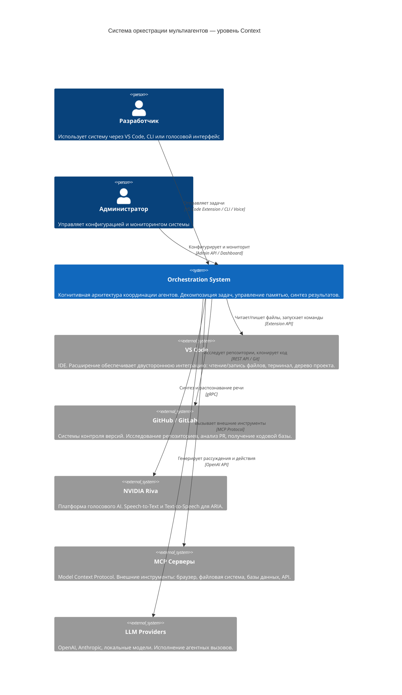

# Система оркестрации мультиагентов (Multi-Agent Orchestration System)

> **Production-grade** платформа координации роя интеллектуальных агентов для управления сложными рабочими процессами разработки программного обеспечения.

---

## Содержание

- [Обзор системы](#обзор-системы)
- [Ключевые принципы](#ключевые-принципы)
- [Высокоуровневая архитектура](#высокоуровневая-архитектура)
- [Быстрый старт](#быстрый-старт)
- [Оглавление документации](#оглавление-документации)
- [Статус документации](#статус-документации)

---

## Обзор системы

Система является единой **когнитивной архитектурой (Cognitive Architecture)**, функционирующей как мета-интеллект, координирующий рой равноценных по уровню интеллекта специализированных агентов. В отличие от иерархических систем с ведущим и ведомыми агентами, здесь оркестратор выступает **диспетчером знаний и контекста**, а не источником решений.

### Что делает система

| Функция | Описание |
|---|---|
| **Приём задач** | Анализ пользовательского запроса, извлечение намерений и ограничений |
| **Декомпозиция** | Разбивка сложных задач на атомарные подзадачи с зависимостями |
| **Маршрутизация** | Назначение подзадач профильным агентам по семантическому совпадению |
| **Координация** | Управление параллельным и последовательным выполнением с учётом зависимостей |
| **Синтез** | Сборка результатов агентов в единый связный ответ |
| **Обучение** | Запись паттернов выполнения в персистентную память для будущих итераций |

### Ключевые возможности

- **Нулевая импульсивность**: система никогда не действует без полного понимания контекста
- **Персистентная память (Persistent Memory)**: знания сохраняются между сессиями через векторное хранилище и реляционную БД
- **Исследовательская фаза**: перед выполнением система проводит разведку — анализирует репозитории, документацию, существующий код
- **Полная контекстная осведомлённость (Full Context Awareness)**: каждый агент получает весь релевантный контекст из Memory Manager
- **Интеграция с IDE**: нативная работа с VS Code через расширение
- **Голосовой интерфейс**: интеграция с ARIA (Autonomous Reasoning & Interaction Agent) на базе NVIDIA Riva

---

## Ключевые принципы

### 1. Персистентная память (Persistent Memory)

Вся система строится вокруг концепции неисчезающей памяти. События, решения, паттерны ошибок и успешные стратегии накапливаются в трёхуровневом хранилище: рабочая память → эпизодическая память → семантическая память. Агенты всегда имеют доступ к исторически релевантному контексту.

### 2. Непрерывное обучение (Continual Learning)

Система использует механизм обратной связи (Reward Model) для адаптации стратегий. Каждый завершённый рабочий процесс оценивается, а успешные паттерны укрепляются в семантической памяти.

### 3. Декомпозиция задач (Task Decomposition)

Любая пользовательская задача проходит через граф зависимостей (DAG — Directed Acyclic Graph). Независимые подзадачи выполняются параллельно; зависимые — последовательно с передачей результатов.

### 4. Нулевая импульсивность (Zero Impulsiveness)

Запрет на выполнение действий без предварительного:
- исследования контекста (Research Phase)
- планирования шагов (Planning Phase)
- проверки инвариантов (Invariant Check)
- подтверждения пользователя для деструктивных операций

### 5. Полная контекстная осведомлённость (Full Context Awareness)

Каждый агент при активации получает:
- сжатую историю сессии из Memory Manager
- релевантные фрагменты из Vector Store (семантический поиск)
- текущее состояние рабочего процесса
- профиль пользователя и его предпочтения

---

## Высокоуровневая архитектура

Диаграмма уровня **C4 Context** — система в окружении пользователей и внешних систем:



---

## Быстрый старт

### Полный цикл обработки задачи

```
Пользователь → "Разобраться в архитектуре auth модуля и написать тесты"
```

**Фаза 1 — Приём и анализ (Reception & Analysis)**
1. Оркестратор извлекает намерения: `[understand_architecture, write_tests]`
2. Запрос в Memory Manager: есть ли предыдущий контекст по `auth`?
3. Извлечение связанной информации из Vector Store

**Фаза 2 — Исследование (Research Phase)**
4. Research Agent сканирует файловую систему через VS Code Extension
5. Индексирует `auth/` директорию, строит граф зависимостей
6. Результаты записываются в рабочую память (Working Memory)

**Фаза 3 — Планирование (Planning)**
7. Оркестратор строит DAG задач:
   ```
   scan_files → analyze_patterns → [write_unit_tests ‖ write_integration_tests] → synthesize_report
   ```
8. Назначает агентов: Code Analyst → Test Writer → Synthesizer

**Фаза 4 — Параллельное выполнение (Parallel Execution)**
9. `write_unit_tests` и `write_integration_tests` выполняются параллельно
10. Каждый агент работает в изолированном контексте с полным доступом к памяти

**Фаза 5 — Синтез и запись (Synthesis & Write)**
11. Synthesizer Agent собирает результаты
12. VS Code Extension записывает тесты в файловую систему
13. Паттерн сессии сохраняется в эпизодическую память

---

## Оглавление документации

| Раздел | Путь | Описание |
|---|---|---|
| **Архитектура системы** | [`architecture/`](architecture/README.md) | C4 Model (Context, Container, Component), паттерны, деплоймент |
| **Ruflo Inside Mansoni** | [`architecture/RUFLO_INSIDE_MANSONI.md`](architecture/RUFLO_INSIDE_MANSONI.md) | Каноническая схема гибрида: Ruflo как runtime, Mansoni как policy/domain layer |
| **Ядро оркестратора** | [`orchestrator-core/`](orchestrator-core/README.md) | Алгоритм декомпозиции, планировщик, маршрутизатор |
| **Рой агентов** | [`agents/`](agents/README.md) | Роли агентов, протоколы взаимодействия, специализации |
| **Терминальные навыки** | [`terminal-skills/`](terminal-skills/README.md) | Выполнение команд, sandbox, управление процессами |
| **Протокол исследования** | [`research-protocol/`](research-protocol/README.md) | Алгоритм разведки, индексация кода, семантический поиск |
| **Интеграция с VS Code** | [`vscode-integration/`](vscode-integration/README.md) | Extension API, LSP, файловая система, терминал |
| **Интеграция с ARIA** | [`aria-integration/`](aria-integration/README.md) | Голосовой интерфейс, NVIDIA Riva, NLU pipeline |
| **Человекоподобное общение** | [`conversational-ai/`](conversational-ai/README.md) | Dialogue Manager, tone adaptation, clarification loops |
| **Контекстное окно** | [`context-window/`](context-window/README.md) | Управление токенами, компрессия, приоритизация контекста |
| **Рабочие процессы** | [`workflows/`](workflows/README.md) | Типовые сценарии, шаблоны задач, best practices |
| **Технические спецификации** | [`technical-specs/`](technical-specs/README.md) | API контракты, форматы сообщений, SLO |
| **Архитектурная память** | [`architectural-memory/`](architectural-memory/README.md) | Vector Store, Memory Manager, три уровня памяти |
| **Интеграция с MCP** | [`mcp-integration/`](mcp-integration/README.md) | Model Context Protocol, серверы инструментов |
| **Приложения** | [`appendices/`](appendices/README.md) | Глоссарий, матрицы рисков, журнал решений (ADR) |
| **Улучшения агента** | [`agent-improvements/`](agent-improvements/README.md) | Open-source фреймворки, CodeAct, ACI, Reflexion, LangGraph, Sandbox, SWE-bench |

---

## Статус документации

| Раздел | Готовность | Статус |
|---|---|---|
| [architecture/](architecture/README.md) | 100% | ✅ Готово |
| [architecture/RUFLO_INSIDE_MANSONI.md](architecture/RUFLO_INSIDE_MANSONI.md) | 100% | ✅ Готово |
| [context-window/](context-window/README.md) | 100% | ✅ Готово |
| [orchestrator-core/](orchestrator-core/README.md) | 100% | ✅ Готово |
| [agents/](agents/README.md) | 100% | ✅ Готово |
| [terminal-skills/](terminal-skills/README.md) | 100% | ✅ Готово |
| [research-protocol/](research-protocol/README.md) | 100% | ✅ Готово |
| [vscode-integration/](vscode-integration/README.md) | 100% | ✅ Готово |
| [aria-integration/](aria-integration/README.md) | 100% | ✅ Готово |
| [conversational-ai/](conversational-ai/README.md) | 100% | ✅ Готово |
| [workflows/](workflows/README.md) | 100% | ✅ Готово |
| [technical-specs/](technical-specs/README.md) | 100% | ✅ Готово |
| [architectural-memory/](architectural-memory/README.md) | 100% | ✅ Готово |
| [mcp-integration/](mcp-integration/README.md) | 100% | ✅ Готово |
| [appendices/](appendices/README.md) | 100% | ✅ Готово |
| [agent-improvements/](agent-improvements/README.md) | 100% | ✅ Готово |

---

*Последнее обновление: 2026-03-31 | Версия документации: 1.0.0*
