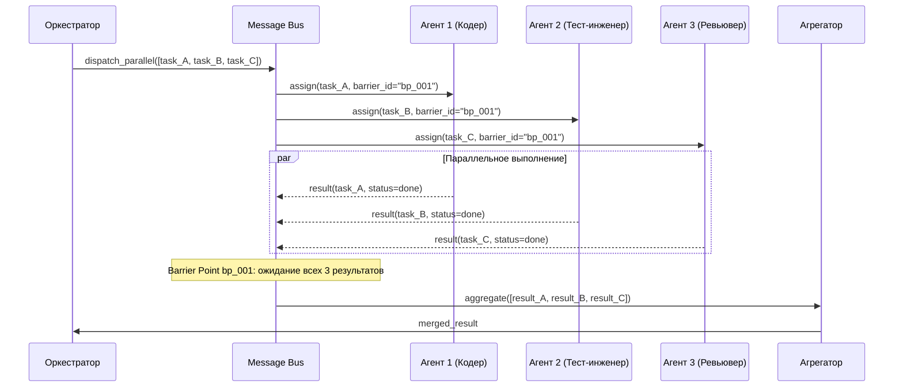
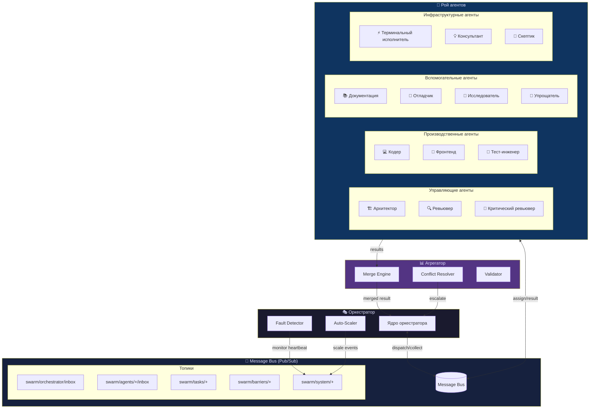
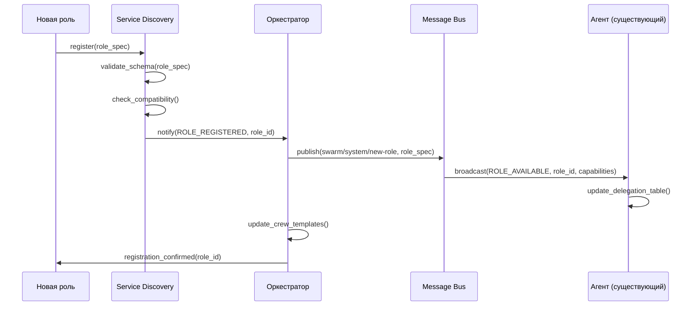

# Рой агентов (Agent Swarm): Архитектура, Роли и Навыки

> Часть документации системы-оркестратора мультиагентов.  
> Навигация: [Главный README](../README.md) · [Архитектура](../architecture/README.md) · [Ядро оркестратора](../orchestrator-core/README.md)

---

## Содержание

1. [Архитектура роя агентов](#1-архитектура-роя-агентов)
   - 1.1 [Принцип эквивалентного интеллекта](#11-принцип-эквивалентного-интеллекта)
   - 1.2 [Параллельное выполнение](#12-параллельное-выполнение)
   - 1.3 [Межагентская коммуникация](#13-межагентская-коммуникация)
   - 1.4 [Агрегация результатов](#14-агрегация-результатов)
   - 1.5 [Разрешение конфликтов](#15-разрешение-конфликтов)
   - 1.6 [Самовалидация агента](#16-самовалидация-агента)
   - 1.7 [Динамическое масштабирование](#17-динамическое-масштабирование)
   - 1.8 [Обработка сбоев агентов](#18-обработка-сбоев-агентов)
2. [Встроенные навыки из открытых репозиториев](#2-встроенные-навыки-из-открытых-репозиториев)
3. [Роли агентов](#3-роли-агентов)
4. [Расширяемое контекстное меню](#4-расширяемое-контекстное-меню)

---

## 1. Архитектура роя агентов

### 1.1 Принцип эквивалентного интеллекта

Каждый агент в рое обладает когнитивной архитектурой (cognitive architecture), сравнимой с оркестратором. Это не тонкие обёртки над LLM — это полноценные агенты с памятью, планировщиком и способностью к рефлексии.

#### Когнитивная архитектура агента

```
┌─────────────────────────────────────────────┐
│                   АГЕНТ                      │
│                                             │
│  ┌──────────┐   ┌──────────┐   ┌─────────┐ │
│  │ Рабочая  │   │Эпизодич. │   │Семантич.│ │
│  │ память   │   │  память  │   │ память  │ │
│  │(Working  │   │(Episodic)│   │(Semantic│ │
│  │ Memory)  │   │          │   │ Memory) │ │
│  └────┬─────┘   └────┬─────┘   └────┬────┘ │
│       └──────────────┴──────────────┘       │
│                      │                      │
│              ┌───────▼───────┐              │
│              │  Планировщик  │              │
│              │  (Planner)    │              │
│              └───────┬───────┘              │
│                      │                      │
│         ┌────────────┼────────────┐         │
│         ▼            ▼            ▼         │
│    ┌─────────┐ ┌──────────┐ ┌──────────┐   │
│    │  Tools  │ │ Reflector│ │Validator │   │
│    │(Инстру- │ │(Рефлексия│ │(Само-    │   │
│    │менты)   │ │)         │ │валидация)│   │
│    └─────────┘ └──────────┘ └──────────┘   │
│                      │                      │
│              ┌───────▼───────┐              │
│              │  Message Bus  │              │
│              │  Interface    │              │
│              └───────────────┘              │
└─────────────────────────────────────────────┘
```

**Ключевые компоненты когнитивной архитектуры:**

| Компонент | Описание | Аналог в open source |
|-----------|----------|---------------------|
| Рабочая память (Working Memory) | Текущий контекст задачи, активные переменные | AutoGPT working context |
| Эпизодическая память (Episodic Memory) | История действий и результатов текущей сессии | LangChain ConversationBuffer |
| Семантическая память (Semantic Memory) | База знаний, векторный индекс | LangChain VectorStore |
| Планировщик (Planner) | Декомпозиция задачи на шаги | BabyAGI task queue |
| Рефлектор (Reflector) | Критическая оценка собственных действий | AutoGPT self-criticism |
| Валидатор (Validator) | Проверка результата перед отправкой | MetaGPT QA role |
| Tools Interface | Доступ к инструментам через стандартный API | LangChain Tool |

---

### 1.2 Параллельное выполнение

Рой поддерживает одновременную работу нескольких агентов над разными подзадачами единой задачи.

#### Механизм параллельного выполнения



#### Протоколы синхронизации

**Barrier Points (точки барьера)** — механизм ожидания завершения группы агентов:

```json
{
  "barrier_id": "bp_001",
  "required_agents": ["agent_coder", "agent_tester", "agent_reviewer"],
  "timeout_ms": 300000,
  "strategy": "wait_all",
  "fallback": "proceed_with_available"
}
```

**Стратегии синхронизации:**

| Стратегия | Описание | Применение |
|-----------|----------|-----------|
| `wait_all` | Ждать все агенты | Критические задачи |
| `wait_majority` | Достаточно N/2+1 | Голосование |
| `wait_first` | Первый завершивший | Race condition pattern |
| `proceed_with_available` | Работать с тем, что есть | Graceful degradation |

---

### 1.3 Межагентская коммуникация

#### Формат сообщения (Message Envelope)

```json
{
  "envelope": {
    "message_id": "msg_a1b2c3d4",
    "sender": {
      "agent_id": "agent_coder_01",
      "role": "coder",
      "instance": 1
    },
    "receiver": {
      "agent_id": "agent_reviewer_01",
      "role": "reviewer",
      "instance": 1
    },
    "correlation_id": "task_7f8e9a10",
    "reply_to": "agent_coder_01/inbox",
    "timestamp": "2026-03-31T08:41:06.704Z",
    "priority": 8,
    "ttl_ms": 60000
  },
  "payload": {
    "type": "TASK_RESULT",
    "content": {
      "status": "completed",
      "artifacts": ["src/components/Button.tsx"],
      "summary": "Реализован компонент Button с поддержкой вариантов"
    }
  },
  "metadata": {
    "retry_count": 0,
    "trace_id": "trace_x9y8z7",
    "schema_version": "1.0"
  }
}
```

**Поля envelope:**

| Поле | Тип | Обязательное | Описание |
|------|-----|:---:|---------|
| `message_id` | UUID | ✅ | Уникальный ID сообщения |
| `sender.agent_id` | string | ✅ | ID отправителя |
| `sender.role` | enum | ✅ | Роль отправителя |
| `receiver.agent_id` | string | ✅ | ID получателя |
| `correlation_id` | string | ✅ | ID общей задачи |
| `reply_to` | string | ❌ | Куда отправить ответ |
| `timestamp` | ISO 8601 | ✅ | Время отправки |
| `priority` | 1–10 | ✅ | Приоритет (10 = наивысший) |
| `ttl_ms` | integer | ❌ | Время жизни сообщения |

#### Pub/Sub топики Message Bus

```
swarm/
├── orchestrator/
│   ├── inbox          # Входящие для оркестратора
│   └── broadcast      # Широковещательные от оркестратора
├── agents/
│   ├── {agent_id}/
│   │   ├── inbox      # Личный ящик агента
│   │   ├── status     # Статус агента (heartbeat)
│   │   └── results    # Результаты агента
├── tasks/
│   ├── {task_id}/
│   │   ├── assigned   # Задача назначена
│   │   ├── progress   # Прогресс выполнения
│   │   └── completed  # Задача завершена
├── barriers/
│   └── {barrier_id}/  # События барьеров синхронизации
└── system/
    ├── scale-up       # Запрос на расширение
    ├── scale-down     # Запрос на сжатие
    └── agent-failure  # Уведомление о сбое агента
```

---

### 1.4 Агрегация результатов

#### Алгоритм merge (псевдокод)

```pseudocode
FUNCTION aggregate_results(results: List[AgentResult]) -> MergedResult:

    // Шаг 1: Фильтрация валидных результатов
    valid_results = filter(results, r => r.validation_status == "PASSED")

    IF len(valid_results) == 0:
        RAISE AggregationError("Нет валидных результатов")

    // Шаг 2: Сортировка по приоритету и confidence score
    sorted_results = sort(valid_results,
        key = (r.priority DESC, r.confidence_score DESC))

    // Шаг 3: Определение типа агрегации
    SWITCH task.aggregation_strategy:

        CASE "MERGE_ARTIFACTS":
            // Объединение файловых артефактов
            artifacts = {}
            FOR result IN sorted_results:
                FOR path, content IN result.artifacts:
                    IF path NOT IN artifacts:
                        artifacts[path] = content
                    ELSE:
                        artifacts[path] = merge_conflict_resolution(
                            artifacts[path], content, result.confidence_score
                        )
            RETURN MergedResult(artifacts=artifacts)

        CASE "CONSENSUS":
            // Поиск консенсуса по оценкам
            scores = [r.evaluation_score FOR r IN sorted_results]
            RETURN MergedResult(
                score=weighted_average(scores, weights=[r.confidence FOR r IN sorted_results]),
                summary=synthesize_summaries([r.summary FOR r IN sorted_results])
            )

        CASE "FIRST_VALID":
            // Первый валидный результат (наивысший приоритет)
            RETURN sorted_results[0]

        CASE "UNION":
            // Объединение всех уникальных рекомендаций
            recommendations = deduplicate(
                flatten([r.recommendations FOR r IN sorted_results])
            )
            RETURN MergedResult(recommendations=recommendations)

    // Шаг 4: Применение post-processing
    merged = apply_post_processors(merged, task.post_processors)

    // Шаг 5: Финальная валидация merged результата
    validate_merged_result(merged)

    RETURN merged
```

---

### 1.5 Разрешение конфликтов

Когда два или более агентов возвращают противоречивые результаты, система применяет многоуровневый механизм разрешения.

#### Голосование (Voting Mechanism)

```pseudocode
FUNCTION resolve_conflict(conflicting_results: List[AgentResult]) -> AgentResult:

    // Шаг 1: Confidence scoring
    FOR result IN conflicting_results:
        result.confidence = calculate_confidence(
            self_reported = result.self_confidence,
            historical_accuracy = agent_history[result.agent_id].accuracy,
            role_weight = ROLE_WEIGHTS[result.agent_role],
            consistency = check_internal_consistency(result)
        )

    // Шаг 2: Weighted voting
    vote_buckets = group_by_similarity(conflicting_results, threshold=0.85)

    winning_bucket = max(vote_buckets,
        key = bucket => sum(r.confidence FOR r IN bucket)
    )

    IF winning_bucket.total_confidence > CONSENSUS_THRESHOLD (0.7):
        best_result = max(winning_bucket, key=r.confidence)
        RETURN best_result

    // Шаг 3: Эскалация к оркестратору
    ELSE:
        escalation = EscalationRequest(
            conflict_summary = summarize_conflict(conflicting_results),
            options = [bucket.representative FOR bucket IN vote_buckets],
            recommendation = winning_bucket.representative
        )
        orchestrator_decision = await orchestrator.resolve(escalation)
        RETURN orchestrator_decision
```

**Веса ролей (Role Weights) для confidence scoring:**

| Роль | Вес | Обоснование |
|------|-----|------------|
| Архитектор | 1.0 | Создаёт неизменяемый контракт |
| Критический ревьювер | 0.95 | Специализирован на обнаружении проблем |
| Отладчик | 0.9 | Root cause analysis |
| Тест-инженер | 0.9 | Верификация фактами |
| Ревьювер | 0.85 | Структурированная обратная связь |
| Кодер | 0.8 | Производство артефактов |
| Фронтенд-специалист | 0.8 | Специализированный домен |
| Скептик кода | 0.75 | Намеренно контрпримерный |

---

### 1.6 Самовалидация агента

Перед отправкой результата каждый агент **обязан** выполнить checklist самовалидации.

#### Checklist самовалидации

```
SELF-VALIDATION CHECKLIST
══════════════════════════════════════════════════════

□ 1. COMPLETENESS (Полнота)
   □ Все требования задачи выполнены
   □ Все артефакты сгенерированы
   □ Нет незаполненных placeholder'ов (TODO, FIXME, ...)

□ 2. CORRECTNESS (Корректность)
   □ Логика соответствует требованиям
   □ Нет синтаксических ошибок
   □ Типы данных соответствуют контракту

□ 3. CONSISTENCY (Согласованность)
   □ Не противоречит предыдущим решениям (проверить episodic memory)
   □ Не нарушает архитектурные контракты
   □ Именование следует принятым соглашениям

□ 4. SAFETY (Безопасность)
   □ Нет хардкоженных секретов или паролей
   □ Нет деструктивных операций без подтверждения
   □ Входные данные валидируются

□ 5. TESTABILITY (Тестируемость)
   □ Код покрывается тестами или тесты написаны
   □ Функции имеют чёткие контракты входа/выхода

□ 6. DOCUMENTATION (Документация)
   □ Публичные API задокументированы
   □ Сложная логика прокомментирована

□ 7. ROLE-SPECIFIC (Специфичные для роли)
   □ [Кодер] Линтер не выдаёт ошибок
   □ [Архитектор] ADR создан
   □ [Тест-инженер] Coverage ≥ целевого порога
   □ [Документация] Broken links проверены

PASSED: validation_status = "PASSED", confidence = calculated_score
FAILED: validation_status = "FAILED", error_details = [...issues]
```

---

### 1.7 Динамическое масштабирование

#### Auto-scaling Policies

```pseudocode
// Scale-Up Policy
TRIGGER scale_up WHEN:
    - queue_depth > QUEUE_THRESHOLD (50 tasks)
    - average_wait_time > WAIT_THRESHOLD (30s)
    - active_agents < MAX_AGENTS (20)
    - cpu_utilization > 80% FOR 2min

ACTION:
    required_role = analyze_queue_composition(queue)
    new_agent = spawn_agent(role=required_role)
    register_agent(new_agent, swarm)
    LOG ScaleEvent(type="UP", reason, new_count)

// Scale-Down Policy
TRIGGER scale_down WHEN:
    - queue_depth < LOW_QUEUE_THRESHOLD (5 tasks)
    - agent_idle_time > IDLE_THRESHOLD (5min)
    - active_agents > MIN_AGENTS (2)

ACTION:
    idle_agents = filter(agents, a => a.idle_time > IDLE_THRESHOLD)
    target = select_for_termination(idle_agents, strategy="LRU")
    graceful_shutdown(target, drain_timeout=60s)
    LOG ScaleEvent(type="DOWN", reason, new_count)
```

**Политики масштабирования:**

| Параметр | Scale-Up триггер | Scale-Down триггер | Значение по умолчанию |
|----------|-----------------|-------------------|----------------------|
| Queue depth | > 50 задач | < 5 задач | — |
| Wait time | > 30 сек | — | — |
| Idle time | — | > 5 мин | — |
| Min agents | — | — | 2 |
| Max agents | — | — | 20 |
| CPU utilization | > 80% / 2 мин | < 20% / 5 мин | — |
| Cooldown period | 60 сек | 120 сек | — |

---

### 1.8 Обработка сбоев агентов

#### Протокол обнаружения сбоя

```
HEARTBEAT PROTOCOL:
  Интервал: каждые 10 сек агент публикует в swarm/agents/{id}/status
  Timeout: если heartbeat не получен за 30 сек — агент считается недоступным
  Dead confirmation: 3 пропущенных heartbeat = подтверждённый сбой
```

```json
{
  "agent_id": "agent_coder_01",
  "status": "alive",
  "load": 0.65,
  "current_task": "task_7f8e9a10",
  "uptime_ms": 3600000,
  "timestamp": "2026-03-31T08:41:06.704Z"
}
```

#### Стратегия переназначения задач

```pseudocode
FUNCTION handle_agent_failure(failed_agent_id: string):

    // 1. Определить задачи пострадавшего агента
    affected_tasks = get_tasks_by_agent(failed_agent_id)

    // 2. Классифицировать задачи по приоритету и статусу
    FOR task IN affected_tasks:
        IF task.status == "IN_PROGRESS":
            IF task.has_checkpoint:
                task.resume_from = task.last_checkpoint
            ELSE:
                task.restart_from = task.start

        // 3. Переназначить с учётом exactly-once семантики
        task.idempotency_key = generate_idempotency_key(task)
        task.retry_count += 1

        IF task.retry_count > MAX_RETRIES (3):
            escalate_to_orchestrator(task, reason="max_retries_exceeded")
            CONTINUE

        // 4. Выбор замены с учётом зависимостей
        candidate_agents = find_compatible_agents(
            role = failed_agent.role,
            required_capabilities = task.required_capabilities,
            exclude = [failed_agent_id]
        )

        IF len(candidate_agents) == 0:
            spawn_replacement_agent(role=failed_agent.role)
            candidate_agents = wait_for_agent_ready(role=failed_agent.role)

        // 5. Назначить с гарантией exactly-once
        reassign_task(
            task = task,
            new_agent = select_least_loaded(candidate_agents),
            idempotency_key = task.idempotency_key
        )

    // 6. Логирование события
    LOG AgentFailureEvent(
        agent_id = failed_agent_id,
        tasks_affected = len(affected_tasks),
        tasks_reassigned = count_reassigned,
        recover_time_ms = elapsed
    )

    deregister_agent(failed_agent_id)
```

**Exactly-once семантика:** реализована через `idempotency_key` — UUID, сгенерированный из `(task_id + agent_id + retry_count)`. Принимающий агент отклоняет дублирующие задачи с тем же ключом.

---

### Диаграмма архитектуры роя с Message Bus



---

## 2. Встроенные навыки из открытых репозиториев

### 2.1 AutoGPT

**Источник:** [github.com/Significant-Gravitas/AutoGPT](https://github.com/Significant-Gravitas/AutoGPT)  
**Модули:** `autogpt/agents/`, `autogpt/memory/`, `autogpt/prompts/`

#### Интегрируемые навыки

| Навык | Источник | Модуль | Адаптация | Тест верификации | Метрика |
|-------|----------|--------|-----------|-----------------|---------|
| Автономное планирование | AutoGPT | `agent/planning.py` | Goal → sub-tasks с cyclical refinement | Задача разбивается на ≥3 шага без ручного вмешательства | Steps to completion ≤ целевого |
| Самокритика | AutoGPT | `prompts/self_feedback.py` | Агент оценивает собственный output до отправки | Output содержит поле `self_critique` | Rejection rate ≥ 15% некачественных output |
| Итеративное уточнение | AutoGPT | `agent/execute.py` | Max 3 итерации улучшения до accept/reject | Качество растёт с каждой итерацией | Quality score Δ > 0 per iteration |
| Управление памятью | AutoGPT | `memory/` | Трёхуровневая память: working/episodic/semantic | Контекст сохраняется между вызовами | Memory hit rate > 80% |

#### Адаптация goal-setting loop

```pseudocode
// AutoGPT Goal-Setting Loop, адаптированный для роя
FUNCTION autogpt_goal_loop(goal: string, agent: Agent) -> Result:

    // 1. Декомпозиция цели
    sub_goals = agent.planner.decompose(
        goal = goal,
        context = agent.memory.working.get_context(),
        constraints = agent.role.constraints
    )

    iteration = 0
    current_result = None

    WHILE iteration < MAX_ITERATIONS (3):

        // 2. Выполнение с инструментами
        execution_result = agent.execute(sub_goals, tools=agent.role.tools)

        // 3. Самокритика (AutoGPT pattern)
        critique = agent.reflector.criticize(
            goal = goal,
            result = execution_result,
            criteria = agent.role.quality_criteria
        )

        IF critique.score >= ACCEPT_THRESHOLD (0.8):
            BREAK

        // 4. Итеративное уточнение
        sub_goals = agent.planner.refine(sub_goals, critique.feedback)
        iteration += 1

    // 5. Самовалидация перед отправкой
    validation = agent.validator.validate(execution_result)
    RETURN Result(content=execution_result, validation=validation, iterations=iteration)
```

---

### 2.2 LangChain Agents

**Источник:** [github.com/langchain-ai/langchain](https://github.com/langchain-ai/langchain)  
**Модули:** `langchain/agents/react/`, `langchain/chains/`, `langchain/output_parsers/`

#### Интегрируемые навыки

| Навык | Источник | Модуль | Адаптация | Тест верификации | Метрика |
|-------|----------|--------|-----------|-----------------|---------|
| ReAct framework | LangChain | `agents/react/base.py` | Reasoning + Acting цикл для каждой роли | Агент объясняет reasoning перед каждым действием | Reasoning качество ≥ 7/10 |
| Tool chains | LangChain | `tools/` | Стандартизированный ToolSpec для всех ролей | Инструменты вызываются с корректными параметрами | Tool call success rate ≥ 95% |
| Structured output parsing | LangChain | `output_parsers/` | Pydantic схемы для каждой роли | Output соответствует JSON Schema | Parse success rate = 100% |
| Multi-step planning | LangChain | `chains/llm_chain.py` | Планировщик с зависимостями между шагами | DAG зависимостей корректен | Plan validity rate ≥ 90% |

#### Адаптация ReAct Loop для каждой роли

```pseudocode
// ReAct Loop (Reasoning + Acting)
FUNCTION react_loop(task: Task, agent: Agent) -> Result:

    thoughts = []
    actions = []
    observations = []

    WHILE NOT task.is_complete AND steps < MAX_STEPS:

        // REASONING: Что происходит и что делать
        thought = agent.llm.think(
            task = task,
            history = zip(actions, observations),
            role_context = agent.role.system_prompt,
            available_tools = agent.role.tools
        )
        thoughts.append(thought)

        IF thought.conclusion == "TASK_COMPLETE":
            BREAK

        // ACTING: Выбор и вызов инструмента
        action = agent.select_tool(thought.next_action)
        actions.append(action)

        // OBSERVING: Результат действия
        observation = agent.execute_tool(action)
        observations.append(observation)

        // Специфичный для роли пост-processing
        observation = agent.role.post_process_observation(observation)

    structured_result = agent.output_parser.parse(
        schema = agent.role.output_schema,
        content = synthesize(thoughts, actions, observations)
    )

    RETURN structured_result
```

**ReAct специализации по ролям:**

| Роль | Reasoning focus | Preferred tools | Output schema |
|------|----------------|----------------|---------------|
| Кодер | Выбор паттерна реализации | `file_write`, `terminal`, `search_code` | `CodeArtifact` |
| Отладчик | Причинно-следственные цепочки | `terminal`, `log_reader`, `breakpoint` | `DebugReport` |
| Тест-инженер | Граничные случаи и coverage | `terminal`, `test_runner`, `coverage_tool` | `TestReport` |
| Исследователь | Качество источников | `web_search`, `repo_clone`, `doc_reader` | `ResearchPackage` |

---

### 2.3 CrewAI

**Источник:** [github.com/joaomdmoura/crewAI](https://github.com/joaomdmoura/crewAI)  
**Модули:** `crewai/crew.py`, `crewai/agent.py`, `crewai/task.py`, `crewai/memory/`

#### Интегрируемые навыки

| Навык | Источник | Модуль | Адаптация | Тест верификации | Метрика |
|-------|----------|--------|-----------|-----------------|---------|
| Командная координация | CrewAI | `crew.py` | Crew formation по типу задачи | Crew формируется автоматически по task_type | Formation time < 5 сек |
| Role-based delegation | CrewAI | `agent.py` | Делегирование на основе role taxonomy | Задача всегда попадает к компетентному агенту | Routing accuracy ≥ 99% |
| Inter-agent communication | CrewAI | `task.py` | Структурированный handoff между агентами | Контекст передаётся полностью | Context loss rate = 0 |
| Crew memory sharing | CrewAI | `memory/contextual_memory.py` | Общий контекст внутри crew | Агенты ссылаются на результаты друг друга | Cross-reference rate > 50% |

#### Протокол формирования команды (Crew Formation Protocol)

```pseudocode
FUNCTION form_crew(task: Task) -> Crew:

    // 1. Анализ требований задачи
    requirements = analyze_task_requirements(task)
    // Пример: {type: "feature_development", complexity: "high",
    //          domains: ["frontend", "backend", "testing"]}

    // 2. Выбор состава crew
    crew_template = CREW_TEMPLATES[task.type]
    // CREW_TEMPLATES["feature_development"] = [
    //   {role: "architect", required: true},
    //   {role: "coder", required: true, instances: 2},
    //   {role: "tester", required: true},
    //   {role: "reviewer", required: complexity=="high"}
    // ]

    crew_members = []
    FOR member_spec IN crew_template:
        IF member_spec.required OR should_include(member_spec, requirements):
            agents = acquire_agents(
                role = member_spec.role,
                count = member_spec.instances ?? 1
            )
            crew_members.extend(agents)

    // 3. Инициализация общей памяти crew
    crew_memory = CrewMemory(
        shared_context = task.context,
        crew_id = generate_crew_id()
    )

    // 4. Установка иерархии и дерева делегирования
    crew = Crew(
        members = crew_members,
        memory = crew_memory,
        delegation_tree = build_delegation_tree(crew_members),
        coordination_protocol = "hierarchical"
    )

    RETURN crew
```

---

### 2.4 MetaGPT

**Источник:** [github.com/geekan/MetaGPT](https://github.com/geekan/MetaGPT)  
**Модули:** `metagpt/roles/`, `metagpt/actions/`, `metagpt/schema.py`

#### Интегрируемые навыки

| Навык | Источник | Модуль | Адаптация | Тест верификации | Метрика |
|-------|----------|--------|-----------|-----------------|---------|
| Стандартизированные роли | MetaGPT | `roles/` | Role taxonomy с SOP | Каждая роль имеет задокументированный SOP | SOP coverage = 100% |
| SOP для инженерных ролей | MetaGPT | `actions/write_code.py` | Адаптированные SOPs с роливыми чеклистами | Checklist выполняется в 100% случаев | Checklist compliance rate |
| Structured document generation | MetaGPT | `actions/write_prd.py` | Шаблоны документов для每 роли | Документы соответствуют шаблону | Template conformance rate |
| Code review workflows | MetaGPT | `roles/qa_engineer.py` | Многоуровневый review pipeline | Review содержит severity-классифицированные замечания | Defect detection rate |

#### Адаптация SOPs (Standard Operating Procedures)

**SOP для роли Архитектор:**
```
SOP: ARCHITECTURE_DECISION
════════════════════════════
1. Получить требования → проанализировать constraints
2. Исследовать существующие паттерны (Researcher agent или web_search)
3. Сформулировать 2-3 опции решения
4. Провести trade-off analysis (performance / maintainability / complexity)
5. Выбрать рекомендуемую опцию
6. Создать ADR (Architecture Decision Record)
7. Опубликовать в архитектурный контракт (неизменяемый)
8. Уведомить зависимых агентов через message bus
```

**SOP для роли Кодер:**
```
SOP: CODE_PRODUCTION
════════════════════
1. Прочитать архитектурный контракт
2. Поиск аналогов в open source (Исследователь или search_code)
3. Написать реализацию согласно принятым соглашениям
4. Запустить линтер → устранить все ошибки
5. Запустить тесты → убедиться в green state
6. Провести самовалидацию (полный checklist)
7. Написать/обновить документацию
8. Отправить результат Ревьюверу
```

---

### 2.5 OpenDevin / SWE-agent

**Источник:** [github.com/OpenDevin/OpenDevin](https://github.com/OpenDevin/OpenDevin), [github.com/princeton-nlp/SWE-agent](https://github.com/princeton-nlp/SWE-agent)  
**Модули:** `opendevin/runtime/`, `opendevin/controller/`, `sweagent/agent/`

#### Интегрируемые навыки

| Навык | Источник | Модуль | Адаптация | Тест верификации | Метрика |
|-------|----------|--------|-----------|-----------------|---------|
| Автономное редактирование кода | SWE-agent | `agent/agents.py` | Edit/view/search команды через TerminalAgent | Код редактируется без потери контекста | Edit accuracy ≥ 95% |
| Навигация по кодовой базе | OpenDevin | `runtime/browser.py` | Repo map + semantic search | Агент находит нужный файл по описанию | File retrieval precision |
| Выполнение тестов | OpenDevin | `runtime/runtime.py` | Изолированная sandbox среда | Тесты запускаются и результат интерпретируется | Test execution success |
| Интерпретация ошибок | SWE-agent | `agent/parsing.py` | Structured error parsing → action plan | Из traceback формируется план исправления | Error resolution rate |

#### SWE-bench паттерны

```pseudocode
// SWE-bench паттерн: Issue → Patch
FUNCTION swe_agent_solve(issue: GitHubIssue, repo: Repository) -> Patch:

    // 1. Понять issue
    issue_analysis = agent.analyze_issue(
        title = issue.title,
        body = issue.body,
        linked_code = issue.linked_files
    )

    // 2. Построить repo map (ключевой паттерн SWE-agent)
    repo_map = build_repo_map(
        repo = repo,
        focus_paths = issue_analysis.relevant_paths,
        depth = 3
    )

    // 3. Локализовать место проблемы
    fault_location = agent.localize_fault(
        issue = issue_analysis,
        repo_map = repo_map,
        strategy = "semantic_search + grep"
    )

    // 4. Разработать исправление
    patch = agent.develop_fix(
        fault_location = fault_location,
        issue = issue_analysis,
        test_coverage = get_existing_tests(fault_location)
    )

    // 5. Верификация
    test_result = run_tests(patch, scope="affected_modules")
    IF NOT test_result.all_pass:
        patch = agent.iterate_fix(patch, test_result.failures)

    RETURN patch
```

---

### 2.6 AgentGPT / BabyAGI

**Источник:** [github.com/reworkd/AgentGPT](https://github.com/reworkd/AgentGPT), [github.com/yoheinakajima/babyagi](https://github.com/yoheinakajima/babyagi)  
**Модули:** `platform/src/agent/`, `babyagi.py`

#### Интегрируемые навыки

| Навык | Источник | Модуль | Адаптация | Тест верификации | Метрика |
|-------|----------|--------|-----------|-----------------|---------|
| Task queue management | BabyAGI | `babyagi.py` | Priority queue с зависимостями | Задачи выполняются в правильном порядке | Queue ordering correctness |
| Priority-based execution | BabyAGI | `babyagi.py` | Приоритеты: critical/high/medium/low | Критические задачи выполняются первыми | Priority compliance rate |
| Goal decomposition | AgentGPT | `agent/execute.ts` | Рекурсивная декомпозиция до атомарных задач | Каждая задача выполнима за ≤ 1 итерацию | Decomposition quality |
| Self-spawning subtasks | BabyAGI | `babyagi.py` | Агент создаёт подзадачи через message bus | Подзадачи регистрируются и выполняются | Subtask success rate |

#### Адаптация для Production

```pseudocode
// BabyAGI Production-адаптация с приоритетами и зависимостями
CLASS ProductionTaskQueue:

    queue: PriorityQueue<Task>  // min-heap по (priority, created_at)
    completed: Set<task_id>
    failed: Set<task_id>

    FUNCTION add_task(task: Task):
        // Валидация
        validate_task_schema(task)
        // Проверка дублей (idempotency)
        IF task.idempotency_key IN seen_keys:
            LOG "Дубликат отклонён", task.idempotency_key
            RETURN
        queue.push(task, priority=task.priority)

    FUNCTION get_next_executable() -> Task | None:
        FOR task IN queue.sorted():
            // Проверить зависимости
            IF all(dep IN completed FOR dep IN task.dependencies):
                RETURN queue.pop(task)
        RETURN None  // Все готовые задачи заняты или нет задач

    FUNCTION spawn_subtask(parent: Task, subtask_spec: dict) -> Task:
        subtask = Task(
            parent_id = parent.task_id,
            priority = parent.priority,  // Наследует приоритет
            **subtask_spec
        )
        self.add_task(subtask)
        notify_orchestrator(subtask)
        RETURN subtask
```

---

### 2.7 Aider

**Источник:** [github.com/paul-gauthier/aider](https://github.com/paul-gauthier/aider)  
**Модули:** `aider/repomap.py`, `aider/coders/`, `aider/gitattributes.py`

#### Интегрируемые навыки

| Навык | Источник | Модуль | Адаптация | Тест верификации | Метрика |
|-------|----------|--------|-----------|-----------------|---------|
| Git-интеграция | Aider | `aider/git.py` | Автоматические семантические коммиты | Каждое изменение сопровождается осмысленным коммитом | Commit message quality |
| Контекстно-осведомлённое редактирование | Aider | `coders/base_coder.py` | Редактирование с пониманием связей в коде | Изменение не ломает зависимые модули | Regression rate = 0 |
| Whole-repo map | Aider | `repomap.py` | Построение графа зависимостей репозитория | Repo map покрывает все публичные символы | Symbol coverage rate |
| Семантические коммиты | Aider | `commitattributes.py` | Conventional Commits формат | Коммит содержит type, scope, description | Format compliance = 100% |

#### Repo-Map технология

```pseudocode
// Aider Repo-Map: построение контекстной карты репозитория
FUNCTION build_repo_map(repo_path: string, focus_files: List[string]) -> RepoMap:

    // 1. Сканирование всех исходных файлов
    all_files = scan_source_files(repo_path, extensions=[".ts", ".py", ".js"])

    // 2. Парсинг символов (классы, функции, экспорты)
    symbol_index = {}
    FOR file IN all_files:
        symbols = parse_symbols(file)  // AST-based parsing
        symbol_index[file] = symbols

    // 3. Построение графа зависимостей
    dependency_graph = {}
    FOR file IN all_files:
        imports = extract_imports(file)
        dependency_graph[file] = resolve_import_paths(imports, repo_path)

    // 4. Ранжирование файлов по релевантности к focus_files
    ranked_files = rank_by_relevance(
        focus = focus_files,
        graph = dependency_graph,
        algorithm = "PageRank"
    )

    // 5. Генерация компактной карты (умещается в контекстное окно)
    repo_map = generate_compact_map(
        files = ranked_files[:TOP_N (50)],
        symbol_index = symbol_index,
        include_signatures = True,
        include_docstrings = True,
        max_tokens = 4000
    )

    RETURN repo_map
```

---

### 2.8 Sweep AI

**Источник:** [github.com/sweepai/sweep](https://github.com/sweepai/sweep)  
**Модули:** `sweepai/handlers/`, `sweepai/core/`, `sweepai/agents/`

#### Интегрируемые навыки

| Навык | Источник | Модуль | Адаптация | Тест верификации | Метрика |
|-------|----------|--------|-----------|-----------------|---------|
| Понимание GitHub issues | Sweep | `handlers/on_comment.py` | Parsing issue → structured change plan | Issue полностью отражён в плане изменений | Requirement coverage |
| Планирование файловых изменений | Sweep | `core/planning.py` | File change plan с rationale | Все затронутые файлы идентифицированы | File coverage accuracy |
| Генерация PR с описаниями | Sweep | `agents/pr_drafter.py` | Structured PR description template | PR содержит: summary, changes, tests, screenshots | PR completeness score |
| Навигация по issues | Sweep | `core/context.py` | Linkage между issues и кодом | Агент находит релевантный код по issue | Context retrieval precision |

---

## 3. Роли агентов

### 3.1 Оркестратор (Orchestrator)

**Описание:** Центральный координатор роя. Принимает задачи, декомпозирует их, делегирует агентам, мониторит выполнение, агрегирует результаты.

**Ключевые компетенции:**
- Декомпозиция высокоуровневых задач на подзадачи
- Оптимальный выбор состава crew для задачи
- Мониторинг прогресса и обнаружение отклонений
- Разрешение конфликтов и эскалация решений
- Управление приоритетами и зависимостями задач
- Синтез финального результата из работы агентов

**Терминальные привилегии:** Полные (unrestricted) — все команды, включая системные операции, управление процессами, доступ к сети.

**Интегрированные навыки из open source:**
- [CrewAI: Crew Formation Protocol](#23-crewai) — формирование оптимальных команд
- [BabyAGI: Task Queue Management](#26-agentgpt--babyagi) — управление очередью задач
- [AutoGPT: Goal-Setting Loop](#21-autogpt) — декомпозиция целей

**Триггеры активации:** Любая пользовательская задача. Всегда активен как точка входа.

**Формат output:**
```json
{
  "task_id": "task_001",
  "status": "completed",
  "summary": "Краткое описание выполненной работы",
  "artifacts": ["path/to/output1", "path/to/output2"],
  "agents_involved": ["agent_architect", "agent_coder", "agent_tester"],
  "metrics": {
    "total_time_ms": 45000,
    "iterations": 2,
    "agents_count": 3
  },
  "next_steps": ["Опциональные рекомендации"]
}
```

**Метрики качества:**
| Метрика | Цель |
|---------|------|
| Task completion rate | ≥ 99% |
| Avg time to first result | < 30 сек |
| Agent utilization | > 70% |
| Escalation rate | < 5% |

---

### 3.2 Архитектор (Architect)

**Описание:** Проектирует системы, принимает архитектурные решения, создаёт неизменяемые контракты для команды.

**Ключевые компетенции:**
- Системное мышление и trade-off analysis
- Создание Architecture Decision Records (ADR)
- Проектирование API-контрактов (OpenAPI, GraphQL Schema)
- Построение диаграмм (Mermaid, PlantUML, C4 Model)
- Оценка технических рисков
- Обязательное исследование существующих решений перед проектированием

**Терминальные привилегии:**
```
РАЗРЕШЕНО: cat, ls, grep, find, git log, git diff, curl (для API исследования)
ЗАПРЕЩЕНО: rm, write-доступ в production, docker stop, kill
```

**Интегрированные навыки из open source:**
- [MetaGPT: SOPs для архитектурных решений](#24-metagpt) — стандартизированный процесс
- [AutoGPT: Итеративное уточнение](#21-autogpt) — refinement архитектурных опций
- [Aider: Repo-Map](#27-aider) — понимание существующей кодовой базы

**Триггеры активации:**
- Новая функциональность требует проектирования
- Изменение ≥ 3 компонентов системы
- Потенциальный breaking change в API
- Запрос явного архитектурного ревью

**Формат output:**
```json
{
  "adr": {
    "id": "ADR-042",
    "title": "Использование event sourcing для аудит-лога",
    "status": "accepted",
    "context": "...",
    "decision": "...",
    "consequences": "...",
    "alternatives_considered": [...]
  },
  "contracts": {
    "api_schema": "openapi.yaml (content)",
    "data_models": [...],
    "invariants": [...]
  },
  "diagrams": {
    "architecture": "mermaid: ...",
    "sequence": "mermaid: ..."
  },
  "immutable": true
}
```

**Метрики качества:**
| Метрика | Цель |
|---------|------|
| ADR coverage для major changes | 100% |
| Trade-off alternatives considered | ≥ 2 |
| Contract violation rate | 0% |
| Research performed before decision | 100% |

---

### 3.3 Кодер (Coder)

**Описание:** Пишет production-ready код согласно архитектурным контрактам. Ищет и использует open source аналоги.

**Ключевые компетенции:**
- Написание чистого, производительного кода
- Поиск готовых решений в open source
- Следование code style и принятым соглашениям
- Интеграция с существующей кодовой базой
- Написание базовых unit-тестов

**Терминальные привилегии:**
```
РАЗРЕШЕНО: npm/yarn/bun install, npm run build, npm run test, npm run lint,
           git add, git commit, git status, cat, mkdir, touch
ЗАПРЕЩЕНО: rm -rf, docker stop/rm, systemctl stop, kill -9
```

**Интегрированные навыки из open source:**
- [AutoGPT: Goal-Setting Loop](#21-autogpt) — итеративное написание кода
- [LangChain: ReAct Framework](#22-langchain-agents) — reasoning при выборе подхода
- [SWE-agent: Автономное редактирование](#25-opendevin--swe-agent) — контекстно-осведомлённое редактирование
- [Aider: Repo-Map + Git](#27-aider) — семантические коммиты, понимание кодовой базы

**Триггеры активации:**
- Новая фича назначена для реализации
- Исправление бага (совместно с Отладчиком)
- Рефакторинг по результатам ревью

**Формат output:**
```json
{
  "files_modified": [
    {"path": "src/components/Button.tsx", "action": "created"},
    {"path": "src/components/Button.test.tsx", "action": "created"}
  ],
  "summary": "Реализован компонент Button с вариантами primary/secondary/danger",
  "tests_passed": true,
  "lint_passed": true,
  "git_commits": ["feat(ui): add Button component with variant support"],
  "open_source_references": ["shadcn/ui Button", "radix-ui/react-button"]
}
```

**Метрики качества:**
| Метрика | Цель |
|---------|------|
| Lint errors on delivery | 0 |
| Test pass rate | 100% |
| Code review approval (1st pass) | > 80% |
| Open source research performed | 100% |

---

### 3.4 Консультант (Consultant)

**Описание:** Отвечает на технические вопросы, предоставляет ссылки на документацию, проводит live-поиск актуальной информации.

**Ключевые компетенции:**
- Глубокое знание технических документаций
- Live-поиск актуальной информации
- Синтез ответов из множества источников
- Сравнение технологий и подходов
- Обоснование рекомендаций со ссылками

**Терминальные привилегии:**
```
РАЗРЕШЕНО: curl (для API запросов), cat (для чтения файлов), grep, find
ЗАПРЕЩЕНО: любые write-операции, изменения в системе
```

**Интегрированные навыки из open source:**
- [LangChain: Tool Chains](#22-langchain-agents) — поисковые инструменты, web retrieval
- [AutoGPT: Управление памятью](#21-autogpt) — кеширование ответов в semantic memory

**Триггеры активации:**
- Вопрос о технологии, библиотеке, паттерне
- Запрос сравнения альтернатив
- Необходимость актуальной документации

**Формат output:**
```json
{
  "answer": "Подробный ответ на вопрос",
  "sources": [
    {"title": "React Hooks docs", "url": "https://react.dev/reference/react", "relevance": 0.95}
  ],
  "examples": ["код-примеры если применимо"],
  "related_topics": ["связанные темы"],
  "confidence": 0.92
}
```

**Метрики качества:**
| Метрика | Цель |
|---------|------|
| Answer accuracy (human eval) | ≥ 90% |
| Sources provided | ≥ 2 |
| Response with code examples | > 70% |

---

### 3.5 Отладчик (Debugger)

**Описание:** Проводит root cause analysis, воспроизводит баги, формирует и верифицирует гипотезы об ошибках.

**Ключевые компетенции:**
- Систематический root cause analysis (RCA)
- Написание минимальных воспроизводящих примеров
- Формирование иерархии гипотез
- Верификация через тестирование
- Чтение stack trace и core dump
- Профилирование производительности

**Терминальные привилегии:**
```
РАЗРЕШЕНО: все диагностические команды (strace, lsof, netstat, ps, top,
           node --inspect, python -m pdb, gdb, lldb, cat logs, grep в логах,
           curl для воспроизведения HTTP запросов, запуск тестов)
ЗАПРЕЩЕНО: изменение production данных, rm production файлов
```

**Интегрированные навыки из open source:**
- [SWE-agent: Интерпретация ошибок](#25-opendevin--swe-agent) — structured error parsing
- [LangChain: ReAct Framework](#22-langchain-agents) — hypothesis → test → observe цикл
- [AutoGPT: Самокритика](#21-autogpt) — валидация гипотез

**Триггеры активации:**
- Reported bug с неизвестной причиной
- Неожиданный crash или exception
- Performance degradation
- Flaky tests

**Формат output:**
```json
{
  "bug_id": "BUG-123",
  "root_cause": "Описание первопричины",
  "reproduction_steps": ["шаг 1", "шаг 2"],
  "reproduction_code": "минимальный воспроизводящий пример",
  "hypotheses_tested": [
    {"hypothesis": "...", "result": "rejected/confirmed", "evidence": "..."}
  ],
  "fix_recommendation": "Конкретное предложение по исправлению",
  "severity": "critical|high|medium|low",
  "affected_versions": ["v1.2.3"]
}
```

**Метрики качества:**
| Метрика | Цель |
|---------|------|
| Root cause identification rate | ≥ 90% |
| False positive rate | < 10% |
| Time to first hypothesis | < 5 мин |
| Fix recommendation accuracy | ≥ 85% |

---

### 3.6 Ревьювер (Reviewer)

**Описание:** Проводит код-ревью с структурированными отчётами, классифицирует замечания по severity.

**Ключевые компетенции:**
- Анализ кода на читаемость, поддерживаемость, производительность
- Классификация замечаний: blocker / major / minor / suggestion
- Проверка соответствия архитектурным контрактам
- Оценка тестового покрытия
- Обратная связь ориентированная на улучшение, не критику

**Терминальные привилегии:**
```
РАЗРЕШЕНО: git diff, git log, cat, grep, find, npm run test (только для проверки)
ЗАПРЕЩЕНО: изменение файлов, git push, деструктивные операции
```

**Интегрированные навыки из open source:**
- [MetaGPT: Code Review Workflows](#24-metagpt) — структурированный процесс ревью
- [AutoGPT: Самокритика](#21-autogpt) — рефлексивная оценка кода

**Триггеры активации:**
- Кодер завершил реализацию
- Pull Request создан
- Запрос явного ревью

**Формат output:**
```json
{
  "review_id": "review_001",
  "verdict": "approved|approved_with_suggestions|changes_required|blocked",
  "summary": "Общая оценка",
  "comments": [
    {
      "file": "src/Button.tsx",
      "line": 42,
      "severity": "major",
      "category": "performance|security|maintainability|style",
      "message": "Описание замечания",
      "suggestion": "Конкретное предложение по исправлению"
    }
  ],
  "metrics": {
    "blockers": 0,
    "majors": 2,
    "minors": 5,
    "suggestions": 3
  },
  "test_coverage_assessment": "adequate|insufficient"
}
```

**Метрики качества:**
| Метрика | Цель |
|---------|------|
| Blocker detection rate | ≥ 95% |
| False blocker rate | < 5% |
| Review actionability | ≥ 90% comments имеют конкретное предложение |
| Avg review time | < 10 мин для PR ≤ 500 строк |

---

### 3.7 Специалист по документации (Documentation Specialist)

**Описание:** Создаёт техническую документацию, API-референсы, inline-комментарии. Записывает документацию непосредственно в файлы.

**Ключевые компетенции:**
- Написание ясной технической документации
- Создание API-референсов из кода
- Inline-документация (JSDoc, Python docstrings)
- README, runbooks, architecture decision records
- Проверка broken links и актуальности

**Терминальные привилегии:**
```
РАЗРЕШЕНО: запись в .md, .rst, .txt, .json (schema docs), JSDoc/docstring в исходных файлах,
           cat, grep, find, curl (для верификации ссылок)
ЗАПРЕЩЕНО: изменение логики кода, production конфигураций
```

**Интегрированные навыки из open source:**
- [MetaGPT: Structured Document Generation](#24-metagpt) — шаблоны документации
- [Aider: Repo-Map](#27-aider) — понимание контекста для документирования

**Триггеры активации:**
- Новый модуль или функция без документации
- Изменение публичного API
- Запрос runbook или ADR
- Выявлены outdated docs

**Формат output:**
```json
{
  "files_written": [
    {"path": "docs/api/Button.md", "type": "api_reference"},
    {"path": "src/Button.tsx", "type": "inline_jsdoc"}
  ],
  "links_verified": true,
  "broken_links": [],
  "coverage": {
    "public_functions_documented": "100%",
    "components_documented": "100%"
  }
}
```

**Метрики качества:**
| Метрика | Цель |
|---------|------|
| Public API documentation coverage | 100% |
| Broken links | 0 |
| Docs freshness (не outdated) | 100% |
| Readability score (Flesch) | > 60 |

---

### 3.8 Фронтенд-специалист (Frontend Specialist)

**Описание:** Разрабатывает UI/UX, компонентную архитектуру, обеспечивает accessibility и responsive design.

**Ключевые компетенции:**
- Компонентная архитектура (Atomic Design, Feature-Sliced Design)
- Accessibility (WCAG 2.1 AA)
- Responsive и mobile-first дизайн
- Производительность (Core Web Vitals, bundle size)
- CSS-архитектура (CSS modules, Tailwind, CSS-in-JS)
- Кроссбраузерная совместимость

**Терминальные привилегии:**
```
РАЗРЕШЕНО: npm run dev, npm run build, npm run test, npm run storybook,
           npx playwright, запуск accessibility checkers (axe, pa11y)
ЗАПРЕЩЕНО: изменение backend кода, production deployments
```

**Интегрированные навыки из open source:**
- [LangChain: ReAct Framework](#22-langchain-agents) — исследование компонентных решений
- [MetaGPT: SOPs](#24-metagpt) — стандартизированный процесс разработки компонентов
- [Aider: Контекстно-осведомлённое редактирование](#27-aider) — понимание связей компонентов

**Триггеры активации:**
- Задача требует создания/изменения UI
- Accessibility issues
- Performance проблемы фронтенда
- Design system изменения

**Формат output:**
```json
{
  "components": [
    {
      "name": "Button",
      "path": "src/components/ui/Button.tsx",
      "variants": ["primary", "secondary", "danger"],
      "accessibility": "WCAG 2.1 AA passed",
      "has_storybook": true
    }
  ],
  "bundle_impact": "+2.3KB gzipped",
  "lighthouse_scores": {
    "performance": 95,
    "accessibility": 100
  }
}
```

**Метрики качества:**
| Метрика | Цель |
|---------|------|
| Lighthouse Performance | ≥ 90 |
| Lighthouse Accessibility | 100 |
| Mobile responsiveness | Протестирована на ≥ 3 breakpoints |
| Bundle size increase | < 5KB gzipped на компонент |

---

### 3.9 Тест-инженер (Test Engineer)

**Описание:** Пишет и запускает все типы тестов: unit, интеграционные, E2E, property-based, mutation testing.

**Ключевые компетенции:**
- Модульное (unit) тестирование
- Интеграционные тесты
- E2E тесты (Playwright, Cypress)
- Property-based тестирование (fast-check)
- Mutation testing (Stryker, mutmut)
- Анализ coverage и выявление непокрытых путей

**Терминальные привилегии:**
```
РАЗРЕШЕНО: npm run test, npm run test:coverage, npm run test:e2e,
           npx playwright test, npx stryker run, запуск любых test frameworks
ЗАПРЕЩЕНО: изменение production логики, удаление существующих тестов без замены
```

**Интегрированные навыки из open source:**
- [SWE-agent: Выполнение тестов](#25-opendevin--swe-agent) — автономный запуск тестов
- [AutoGPT: Итеративное уточнение](#21-autogpt) — итеративное улучшение coverage
- [MetaGPT: QA Role SOPs](#24-metagpt) — стандартизированный тестовый процесс

**Триггеры активации:**
- Новый код требует тестирования
- Coverage упала ниже порога
- Flaky tests обнаружены
- Regression найден

**Формат output:**
```json
{
  "test_report": {
    "total": 150,
    "passed": 148,
    "failed": 2,
    "skipped": 0
  },
  "coverage": {
    "lines": "94.2%",
    "branches": "88.5%",
    "functions": "97.1%"
  },
  "new_tests_written": ["src/__tests__/Button.test.tsx"],
  "mutation_score": 0.87,
  "flaky_tests": [],
  "recommendations": ["Добавить тест для граничного случая X"]
}
```

**Метрики качества:**
| Метрика | Цель |
|---------|------|
| Line coverage | ≥ 80% |
| Branch coverage | ≥ 75% |
| Mutation score | ≥ 80% |
| Test reliability (no flaky) | 100% |

---

### 3.10 Критический ревьювер (Critical Reviewer)

**Описание:** Специализируется на безопасности, производительности и поддерживаемости. Проводит SAST и dependency audit.

**Ключевые компетенции:**
- Security analysis (OWASP Top 10, injection attacks)
- Static Application Security Testing (SAST)
- Dependency vulnerability audit
- Performance bottleneck identification
- Maintainability и technical debt оценка
- Severity-based классификация (Critical / High / Medium / Low)

**Терминальные привилегии:**
```
РАЗРЕШЕНО: npm audit, npx snyk test, semgrep, bandit, eslint-security,
           cat, grep, git log, curl (для CVE проверок)
ЗАПРЕЩЕНО: запуск production деплоев, изменение данных
```

**Интегрированные навыки из open source:**
- [SWE-agent: Навигация по кодовой базе](#25-opendevin--swe-agent) — анализ всей кодовой базы
- [MetaGPT: Code Review Workflows](#24-metagpt) — структурированный security review
- [LangChain: Structured Output Parsing](#22-langchain-agents) — structured security reports

**Триггеры активации:**
- Pre-release security check
- Dependency update
- Новый внешний endpoint
- Обработка пользовательских данных
- Scheduled периодический аудит

**Формат output:**
```json
{
  "security_audit": {
    "critical": [],
    "high": [
      {
        "type": "SQL_INJECTION",
        "file": "src/db/queries.ts",
        "line": 42,
        "cve": "N/A",
        "mitigation": "Использовать параметризованные запросы"
      }
    ],
    "medium": [],
    "low": []
  },
  "dependency_audit": {
    "vulnerabilities": 0,
    "outdated_critical": []
  },
  "performance_issues": [],
  "overall_score": 8.5
}
```

**Метрики качества:**
| Метрика | Цель |
|---------|------|
| Critical vulnerability detection rate | 100% |
| False positive rate | < 10% |
| Zero critical issues on release | 100% |
| Audit coverage | 100% изменённых файлов |

---

### 3.11 Скептик кода (Code Skeptic)

**Описание:** Намеренно контрпримерный критик. Ищет сценарии отказов, граничные случаи, антипаттерны.

**Ключевые компетенции:**
- Формирование контрпримеров к предложенным решениям
- Моделирование сценариев отказа
- Стресс-тестирование логики (мысленное)
- Выявление скрытых допущений
- Задавание неудобных вопросов о масштабируемости

**Терминальные привилегии:**
```
РАЗРЕШЕНО: cat (чтение), grep, find, npm run test (запуск существующих тестов)
ЗАПРЕЩЕНО: изменение кода, write-операции
```

**Интегрированные навыки из open source:**
- [AutoGPT: Самокритика](#21-autогpt) — применена к чужому коду
- [BabyAGI: Goal Decomposition](#26-agentgpt--babyagi) — декомпозиция "что может пойти не так"

**Триггеры активации:**
- Новое архитектурное решение
- Критически важный алгоритм
- Запрос явного skeptic review

**Формат output:**
```json
{
  "skeptic_report": {
    "counterexamples": [
      "Если userId == null, на строке 42 произойдёт NPE"
    ],
    "failure_scenarios": [
      "При нагрузке 10k RPS очередь переполнится через ~30 сек"
    ],
    "hidden_assumptions": [
      "Допущение: сеть всегда доступна — не обработан случай offline"
    ],
    "stress_concerns": [
      "O(n²) сложность в функции findDuplicates"
    ]
  },
  "severity_distribution": {"critical": 1, "high": 2, "medium": 3}
}
```

**Метрики качества:**
| Метрика | Цель |
|---------|------|
| Issues found (not duplicates of Reviewer) | ≥ 3 уникальных |
| Issues confirmed valid (not False Positives) | ≥ 70% |
| Critical scenarios missed by other reviewers | tracked |

---

### 3.12 Упрощатель кода (Code Simplifier)

**Описание:** Рефакторит код в направлении простоты и поддерживаемости. Использует метрики сложности и open source паттерны.

**Ключевые компетенции:**
- Расчёт цикломатической сложности (cyclomatic complexity)
- Рефакторинг согласно SOLID, DRY, KISS, YAGNI
- Поиск применимых design patterns
- Уменьшение cognitive complexity
- Сохранение полной функциональности при упрощении

**Терминальные привилегии:**
```
РАЗРЕШЕНО: запись исходных файлов после рефакторинга, npm run test (верификация),
           npm run lint, cat, grep
ЗАПРЕЩЕНО: изменение архитектурных контрактов, удаление тестов
```

**Интегрированные навыки из open source:**
- [Aider: Контекстно-осведомлённое редактирование](#27-aider) — безопасный рефакторинг
- [MetaGPT: SOPs](#24-metagpt) — стандартизированный процесс рефакторинга
- [AutoGPT: Итеративное уточнение](#21-autogpt) — инкрементальные улучшения

**Триггеры активации:**
- Cyclomatic complexity > 10
- Функция > 50 строк
- Дублирование кода > 20 строк
- Явная техническая задолженность

**Формат output:**
```json
{
  "refactoring_report": {
    "before_metrics": {
      "cyclomatic_complexity": 15,
      "lines_of_code": 120,
      "cognitive_complexity": 22
    },
    "after_metrics": {
      "cyclomatic_complexity": 6,
      "lines_of_code": 75,
      "cognitive_complexity": 8
    },
    "patterns_applied": ["Extract Method", "Replace Conditional with Polymorphism"],
    "open_source_references": ["lodash.groupBy replaces custom implementation"]
  },
  "tests_verified": true
}
```

**Метрики качества:**
| Метрика | Цель |
|---------|------|
| Complexity reduction | ≥ 30% |
| All tests still pass | 100% |
| No new lint errors | 100% |
| Lines of code reduction | ≥ 20% |

---

### 3.13 Исследователь (Researcher)

**Описание:** Ищет и анализирует репозитории, библиотеки, паттерны. Формирует knowledge packages для команды.

**Ключевые компетенции:**
- Систематический поиск open source решений
- Сравнительный анализ альтернатив
- Оценка качества и актуальности репозиториев (stars, activity, license)
- Формирование knowledge packages с примерами
- Ведение библиотеки решений команды

**Терминальные привилегии:**
```
РАЗРЕШЕНО: curl, wget, git clone (в sandbox), npm info, pip show,
           cat, grep, find, web_search
ЗАПРЕЩЕНО: изменение production файлов, установка в production среду
```

**Интегрированные навыки из open source:**
- [AutoGPT: Управление памятью](#21-autogpt) — semantic memory для накопления знаний
- [Sweep AI: Понимание репозиториев](#28-sweep-ai) — анализ GitHub репозиториев
- [Aider: Repo-Map](#27-aider) — быстрое понимание новых репозиториев

**Триггеры активации:**
- Нужно решить нестандартную техническую задачу
- Архитектор запросил исследование перед проектированием
- Кодер запросил поиск открытых реализаций

**Формат output:**
```json
{
  "research_package": {
    "query": "state management for React without Redux",
    "findings": [
      {
        "name": "Zustand",
        "repo": "github.com/pmndrs/zustand",
        "stars": 45000,
        "last_commit": "2026-03-15",
        "license": "MIT",
        "pros": ["минималистичный API", "TypeScript-first"],
        "cons": ["нет devtools из коробки"],
        "code_example": "...",
        "relevance_score": 0.95
      }
    ],
    "recommendation": "Zustand",
    "rationale": "Наилучшее соотношение простоты и функциональности"
  }
}
```

**Метрики качества:**
| Метрика | Цель |
|---------|------|
| Alternatives analyzed | ≥ 3 |
| Recommendation accuracy (adopted by team) | ≥ 80% |
| Research freshness (sources < 1 year) | ≥ 80% |
| Time to knowledge package | < 15 мин |

---

### 3.14 Терминальный исполнитель (Terminal Executor)

**Описание:** DevOps и инфраструктурный агент. Управляет CI/CD, деплоями, инфраструктурой. Расширенные привилегии с полным аудит-логом.

**Ключевые компетенции:**
- CI/CD pipeline management
- Docker, Kubernetes, docker-compose операции
- Infrastructure as Code (Terraform, Ansible)
- Monitoring и alerting настройка
- Backup и disaster recovery процедуры
- **Каждое действие логируется в аудит-лог**

**Терминальные привилегии:**
```
РАЗРЕШЕНО: ВСЕ команды, включая:
  - docker build/push/pull/run/stop/rm
  - kubectl apply/delete/scale/rollout
  - terraform plan/apply/destroy (с подтверждением для destroy)
  - systemctl start/stop/restart
  - rm/mv/cp (с подтверждением для критических путей)
  - ssh, scp, rsync
  - git push, git tag, git release

ТРЕБУЕТ ПОДТВЕРЖДЕНИЯ ОРКЕСТРАТОРА:
  - terraform destroy
  - kubectl delete namespace
  - rm -rf на production путях
  - systemctl stop на критических сервисах

АУДИТ: каждая выполненная команда → audit_log с timestamp, user, result
```

**Интегрированные навыки из open source:**
- [OpenDevin: Runtime](#25-opendevin--swe-agent) — sandbox выполнение команд
- [AgentGPT: Task Queue](#26-agentgpt--babyagi) — очередь DevOps задач с приоритетами

**Триггеры активации:**
- Необходим деплой или обновление
- CI/CD pipeline упал
- Инфраструктурная задача
- Scheduled maintenance

**Формат output:**
```json
{
  "execution_log": [
    {
      "command": "docker build -t app:v1.2.3 .",
      "timestamp": "2026-03-31T08:41:06.704Z",
      "exit_code": 0,
      "duration_ms": 45000,
      "output_summary": "Successfully built abc123def"
    }
  ],
  "audit_log_path": "/var/log/agent-audit/exec_20260331_084106.log",
  "deployment_status": "success|failed|rolled_back",
  "rollback_available": true,
  "alerts_triggered": []
}
```

**Метрики качества:**
| Метрика | Цель |
|---------|------|
| Deployment success rate | ≥ 99% |
| Audit log completeness | 100% |
| MTTR (Mean Time to Recovery) | < 15 мин |
| Zero unconfirmed destructive operations | 100% |

---

## 4. Расширяемое контекстное меню

### 4.1 Протокол добавления новых ролей агентов

Система поддерживает динамическую регистрацию новых ролей без остановки роя.

```pseudocode
FUNCTION register_new_agent_role(spec: AgentRoleSpec) -> RegistrationResult:

    // 1. Валидация по JSON Schema
    validation = validate_schema(spec, AGENT_ROLE_SCHEMA)
    IF NOT validation.is_valid:
        RAISE ValidationError(validation.errors)

    // 2. Проверка уникальности role_id
    IF spec.role_id IN role_registry:
        RAISE ConflictError(f"Роль {spec.role_id} уже зарегистрирована")

    // 3. Проверка совместимости с существующими ролями
    compatibility = check_compatibility(spec, role_registry)
    IF compatibility.conflicts:
        RAISE IncompatibilityError(compatibility.conflicts)

    // 4. Регистрация в реестре
    role_registry.register(spec)

    // 5. Service Discovery уведомление
    notify_service_discovery(
        event = "ROLE_REGISTERED",
        role_id = spec.role_id,
        capabilities = spec.capabilities
    )

    // 6. Оркестратор обновляет routing rules
    orchestrator.update_routing(spec)

    // 7. Миграция контекста (если есть активные задачи этого типа)
    migrate_pending_tasks(spec)

    LOG RegistrationEvent(role_id=spec.role_id, timestamp=now())

    RETURN RegistrationResult(success=True, role_id=spec.role_id)
```

---

### 4.2 JSON Schema контракта для регистрации новой роли

```json
{
  "$schema": "https://json-schema.org/draft/2020-12/schema",
  "$id": "https://swarm.internal/schemas/agent-role-spec.json",
  "title": "AgentRoleSpec",
  "description": "Спецификация новой роли агента",
  "type": "object",
  "required": [
    "role_id", "display_name", "description",
    "capabilities", "terminal_permissions",
    "trigger_conditions", "output_schema",
    "quality_metrics", "schema_version"
  ],
  "properties": {
    "schema_version": {
      "type": "string",
      "const": "1.0",
      "description": "Версия схемы спецификации"
    },
    "role_id": {
      "type": "string",
      "pattern": "^[a-z][a-z0-9_-]{2,49}$",
      "description": "Уникальный идентификатор роли (snake_case)"
    },
    "display_name": {
      "type": "string",
      "minLength": 3,
      "maxLength": 100
    },
    "description": {
      "type": "string",
      "minLength": 20,
      "maxLength": 1000
    },
    "capabilities": {
      "type": "array",
      "items": {
        "type": "object",
        "required": ["name", "description"],
        "properties": {
          "name": {"type": "string"},
          "description": {"type": "string"},
          "proficiency": {
            "type": "string",
            "enum": ["basic", "intermediate", "expert"]
          }
        }
      },
      "minItems": 1
    },
    "terminal_permissions": {
      "type": "object",
      "required": ["allowed", "forbidden", "require_confirmation"],
      "properties": {
        "allowed": {
          "type": "array",
          "items": {"type": "string"}
        },
        "forbidden": {
          "type": "array",
          "items": {"type": "string"}
        },
        "require_confirmation": {
          "type": "array",
          "items": {"type": "string"},
          "description": "Команды, требующие подтверждения оркестратора"
        },
        "audit_log_required": {
          "type": "boolean",
          "default": false
        }
      }
    },
    "trigger_conditions": {
      "type": "array",
      "items": {"type": "string"},
      "minItems": 1,
      "description": "Условия активации роли"
    },
    "output_schema": {
      "type": "object",
      "description": "JSON Schema для output агента данной роли"
    },
    "quality_metrics": {
      "type": "array",
      "items": {
        "type": "object",
        "required": ["name", "target", "unit"],
        "properties": {
          "name": {"type": "string"},
          "target": {},
          "unit": {"type": "string"}
        }
      },
      "minItems": 1
    },
    "integrated_skills": {
      "type": "array",
      "items": {
        "type": "object",
        "properties": {
          "framework": {"type": "string"},
          "skill": {"type": "string"},
          "reference": {"type": "string", "format": "uri"}
        }
      }
    },
    "compatible_roles": {
      "type": "array",
      "items": {"type": "string"},
      "description": "Список role_id с которыми эта роль совместима в crew"
    },
    "incompatible_roles": {
      "type": "array",
      "items": {"type": "string"},
      "description": "Список role_id несовместимых ролей"
    },
    "max_instances": {
      "type": "integer",
      "minimum": 1,
      "maximum": 10,
      "default": 3
    },
    "sop_reference": {
      "type": "string",
      "description": "Путь к SOP документу для роли"
    }
  }
}
```

---

### 4.3 Механизм Service Discovery



**Service Registry структура:**

```json
{
  "service_registry": {
    "version": "1.0",
    "roles": {
      "coder": {
        "status": "active",
        "instances": 2,
        "capabilities": ["code_production", "open_source_research"],
        "registered_at": "2026-01-01T00:00:00Z",
        "last_heartbeat": "2026-03-31T08:41:00Z"
      }
    },
    "routing_table": {
      "task_type.feature_development": ["architect", "coder", "tester"],
      "task_type.bug_fix": ["debugger", "coder", "tester"],
      "task_type.security_audit": ["critical_reviewer", "skeptic"]
    }
  }
}
```

---

### 4.4 Процедура миграции контекста при добавлении роли

```pseudocode
FUNCTION migrate_context_for_new_role(new_role: AgentRoleSpec) -> MigrationResult:

    // 1. Идентификация задач, которые выиграют от новой роли
    candidate_tasks = find_tasks_matching_capabilities(
        active_tasks + pending_tasks,
        new_role.capabilities
    )

    migration_plan = []

    FOR task IN candidate_tasks:
        // 2. Проверить, не нарушит ли миграция выполнение
        IF task.status == "IN_PROGRESS":
            // Дождаться завершения текущего шага
            migration_plan.append(MigrationItem(
                task = task,
                timing = "after_step_completion",
                action = "add_to_crew"
            ))
        ELIF task.status == "PENDING":
            // Переназначить с включением новой роли
            migration_plan.append(MigrationItem(
                task = task,
                timing = "immediate",
                action = "reassign_with_new_role"
            ))

    // 3. Перенос релевантного контекста
    context_transfer = transfer_context(
        from_roles = find_similar_roles(new_role),
        to_role = new_role,
        context_types = ["domain_knowledge", "conventions", "constraints"]
    )

    // 4. Выполнение плана миграции
    FOR item IN migration_plan:
        execute_migration(item, context=context_transfer)

    RETURN MigrationResult(
        tasks_migrated = len(migration_plan),
        context_transferred = context_transfer.summary
    )
```

---

### 4.5 Валидация совместимости

```pseudocode
FUNCTION check_compatibility(new_role: AgentRoleSpec, registry: RoleRegistry) -> CompatibilityResult:

    conflicts = []
    warnings = []

    // 1. Проверка дублирования capabilities
    FOR existing_role IN registry.roles:
        capability_overlap = intersection(
            new_role.capabilities,
            existing_role.capabilities
        )
        IF len(capability_overlap) / len(new_role.capabilities) > 0.8:
            warnings.append(f"Высокое совпадение с {existing_role.role_id}: {capability_overlap}")

    // 2. Проверка явных несовместимостей
    FOR incompatible_id IN new_role.incompatible_roles:
        IF incompatible_id NOT IN registry.roles:
            conflicts.append(f"Несуществующая роль в incompatible_roles: {incompatible_id}")

    // 3. Проверка terminal permissions безопасности
    IF "rm -rf /" IN new_role.terminal_permissions.allowed:
        conflicts.append("Недопустимые terminal permissions: rm -rf /")

    // 4. Проверка output schema совместимости
    IF NOT validate_output_schema_compatibility(new_role.output_schema):
        conflicts.append("Output schema несовместима с агрегатором")

    RETURN CompatibilityResult(
        is_compatible = len(conflicts) == 0,
        conflicts = conflicts,
        warnings = warnings
    )
```

---

### 4.6 Пример регистрации нового агента «DevSecOps-специалист»

```json
{
  "schema_version": "1.0",
  "role_id": "devsecops_specialist",
  "display_name": "DevSecOps-специалист",
  "description": "Интегрирует практики безопасности в процессы разработки и операций. Автоматизирует security scanning в CI/CD, управляет секретами, проводит threat modeling.",
  "capabilities": [
    {
      "name": "ci_cd_security_integration",
      "description": "Встраивание security gates в CI/CD пайплайны",
      "proficiency": "expert"
    },
    {
      "name": "secrets_management",
      "description": "Управление секретами через Vault, AWS Secrets Manager",
      "proficiency": "expert"
    },
    {
      "name": "threat_modeling",
      "description": "STRIDE threat modeling, attack surface analysis",
      "proficiency": "expert"
    },
    {
      "name": "container_security",
      "description": "Docker image scanning, runtime security (Falco)",
      "proficiency": "intermediate"
    },
    {
      "name": "compliance_automation",
      "description": "SOC2, GDPR, PCI-DSS compliance checks",
      "proficiency": "intermediate"
    }
  ],
  "terminal_permissions": {
    "allowed": [
      "trivy image", "trivy fs", "snyk test", "snyk monitor",
      "docker scan", "semgrep", "bandit", "safety check",
      "vault kv get/list", "aws secretsmanager list-secrets",
      "kubectl get/describe (security resources)",
      "git log", "git diff", "cat", "grep", "find"
    ],
    "forbidden": [
      "vault kv delete", "aws secretsmanager delete-secret",
      "kubectl delete", "rm -rf", "production database access"
    ],
    "require_confirmation": [
      "vault kv put (production)",
      "aws secretsmanager put-secret-value",
      "kubectl apply (security policies)"
    ],
    "audit_log_required": true
  },
  "trigger_conditions": [
    "Pre-release security gate обязателен",
    "Изменения в аутентификации или авторизации",
    "Новая внешняя интеграция или API endpoint",
    "Обновление зависимостей (dependencies)",
    "Изменения в CI/CD конфигурации",
    "Scheduled security audit (еженедельно)"
  ],
  "output_schema": {
    "type": "object",
    "required": ["security_gate_status", "findings", "remediation_plan"],
    "properties": {
      "security_gate_status": {
        "type": "string",
        "enum": ["passed", "passed_with_warnings", "failed"]
      },
      "findings": {
        "type": "array",
        "items": {
          "type": "object",
          "properties": {
            "severity": {"enum": ["critical", "high", "medium", "low", "info"]},
            "category": {"type": "string"},
            "tool": {"type": "string"},
            "description": {"type": "string"},
            "remediation": {"type": "string"},
            "cve": {"type": "string"}
          }
        }
      },
      "remediation_plan": {
        "type": "array",
        "items": {"type": "string"}
      },
      "compliance_status": {
        "type": "object",
        "properties": {
          "SOC2": {"type": "string"},
          "GDPR": {"type": "string"}
        }
      },
      "audit_log_path": {"type": "string"}
    }
  },
  "quality_metrics": [
    {"name": "critical_vulnerabilities_on_release", "target": 0, "unit": "count"},
    {"name": "high_vulnerabilities_on_release", "target": 0, "unit": "count"},
    {"name": "security_gate_pass_rate", "target": 100, "unit": "percent"},
    {"name": "mean_time_to_remediate_critical", "target": 24, "unit": "hours"},
    {"name": "dependency_audit_coverage", "target": 100, "unit": "percent"}
  ],
  "integrated_skills": [
    {
      "framework": "OpenDevin",
      "skill": "Автономное выполнение команд сканирования",
      "reference": "https://github.com/OpenDevin/OpenDevin"
    },
    {
      "framework": "MetaGPT",
      "skill": "Structured security report generation",
      "reference": "https://github.com/geekan/MetaGPT"
    }
  ],
  "compatible_roles": [
    "terminal_executor", "critical_reviewer", "architect", "coder"
  ],
  "incompatible_roles": [],
  "max_instances": 2,
  "sop_reference": "docs/sops/devsecops-specialist-sop.md"
}
```

---

## Сводная таблица ролей

| # | Роль | Role ID | Терминал | Ключевой навык | Макс. экземпляров |
|---|------|---------|---------|---------------|:-:|
| 1 | 🎭 Оркестратор | `orchestrator` | Полный | Crew formation | 1 |
| 2 | 🏗️ Архитектор | `architect` | Read-only + curl | ADR + контракты | 2 |
| 3 | 💻 Кодер | `coder` | Build + test | Production code | 5 |
| 4 | 💡 Консультант | `consultant` | Read + curl | Live search | 3 |
| 5 | 🐛 Отладчик | `debugger` | Diagnostic | Root cause analysis | 3 |
| 6 | 🔍 Ревьювер | `reviewer` | Read + test | Structured review | 3 |
| 7 | 📚 Документация | `docs_specialist` | Write .md + read | API docs | 3 |
| 8 | 🎨 Фронтенд | `frontend_specialist` | Dev + build | Component arch | 3 |
| 9 | 🧪 Тест-инженер | `test_engineer` | Test runners | All test types | 3 |
| 10 | 🔎 Критический ревьювер | `critical_reviewer` | Audit tools | Security + perf | 2 |
| 11 | 🤔 Скептик | `code_skeptic` | Read + test | Counterexamples | 2 |
| 12 | 🔄 Упрощатель | `code_simplifier` | Write + test | Refactoring | 2 |
| 13 | 🔬 Исследователь | `researcher` | Search + clone | Knowledge packages | 3 |
| 14 | ⚡ Терминальный исполнитель | `terminal_executor` | Полный + аудит | DevOps/CI/CD | 2 |

---

*Документация системы-оркестратора · Версия 1.0 · Март 2026*
