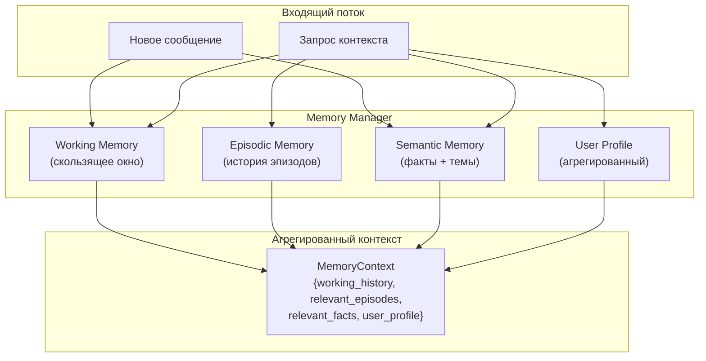

# Архитектурная память (Architectural Memory)

> Трёхуровневая когнитивная система памяти AI агента: от мгновенного рабочего контекста до долгосрочной базы знаний.

---

## Содержание

- [Обзор](#обзор)
- [Трёхуровневая архитектура](#трёхуровневая-архитектура)
- [Working Memory](#working-memory-рабочая-память)
- [Episodic Memory](#episodic-memory-эпизодическая-память)
- [Semantic Memory](#semantic-memory-семантическая-память)
- [Memory Manager](#memory-manager)
- [Жизненный цикл сессии](#жизненный-цикл-сессии)
- [Персистентность данных](#персистентность-данных)
- [API Reference](#api-reference)
- [Конфигурация](#конфигурация)

---

## Обзор

Система памяти AI агента построена по аналогии с когнитивной архитектурой человеческого мозга: три независимых уровня хранения информации с разными характеристиками скорости доступа, объёма и длительности хранения.

```
Пользователь ──► MemoryManager.process_message()
                        │
                        ▼
              ┌─────────────────────┐
              │    Working Memory   │  ← текущая сессия (RAM)
              │   (max 4096 токенов)│
              └─────────────────────┘
                        │
              ┌─────────────────────┐
              │   Episodic Memory   │  ← история сессий (JSON)
              │  TF-IDF + cosine    │
              └─────────────────────┘
                        │
              ┌─────────────────────┐
              │   Semantic Memory   │  ← база знаний (JSON)
              │  Факты по темам     │
              └─────────────────────┘
```

| Тип | Аналог | Скорость | Объём | Персистентность |
|-----|--------|----------|-------|-----------------|
| Working Memory | Рабочая память | Мгновенно | ~4096 токенов | RAM только |
| Episodic Memory | Эпизодическая | Быстро | Неограниченно | `episodic_memory.json` |
| Semantic Memory | Семантическая | Быстро | Неограниченно | `semantic_memory.json` |

---

## Трёхуровневая архитектура



---

## Working Memory (Рабочая память)

**Файл:** [`ai_engine/memory/working_memory.py`](../../../ai_engine/memory/working_memory.py)

Скользящее контекстное окно текущей сессии. При превышении лимита старые сообщения автоматически удаляются (кроме системного промпта).

### Структура сообщения

```python
@dataclass
class Message:
    role: str           # "user" | "assistant" | "system"
    content: str        # Текст сообщения
    timestamp: float    # Unix timestamp
    token_count: int    # Приблизительное число токенов
    metadata: dict      # Произвольные метаданные
```

### Ключевые методы

| Метод | Описание |
|-------|----------|
| `add_message(role, content)` | Добавить сообщение, обрезать окно при необходимости |
| `get_messages(max_tokens)` | Получить сообщения в пределах лимита токенов |
| `summarize()` | Краткое резюме сессии: число сообщений, топ-темы |
| `clear()` | Очистить рабочую память (сброс сессии) |
| `token_count` | Текущее использование токенов |

### Алгоритм обрезания

```
При добавлении нового сообщения:
  WHILE (total_tokens + new_message_tokens > max_tokens):
    messages.remove(oldest_non_system_message)
```

Токены считаются приблизительно: `len(content) // 4`.

---

## Episodic Memory (Эпизодическая память)

**Файл:** [`ai_engine/memory/episodic_memory.py`](../../../ai_engine/memory/episodic_memory.py)

Долгосрочное хранение завершённых сессий (эпизодов). Семантический поиск релевантных эпизодов через TF-IDF + косинусное сходство.

### Структура эпизода

```python
@dataclass
class Episode:
    session_id: str           # Уникальный ID сессии
    timestamp: float          # Время начала
    summary: str              # Краткое описание (что делали)
    key_topics: list[str]     # Ключевые темы сессии
    outcomes: list[str]       # Что было достигнуто
    user_preferences: dict    # Выявленные предпочтения
    importance_score: float   # 0.0–1.0 (важность эпизода)
```

### Поиск релевантных эпизодов

**Алгоритм `recall(query, top_k=5)`:**

1. Если доступен `sklearn`: TF-IDF векторизация всех эпизодов → косинусное сходство с запросом
2. Fallback: keyword overlap scoring
3. Финальный score = `similarity × importance_score`
4. Возвращает топ-K эпизодов, отсортированных по score

```python
context = memory_manager.get_relevant_context(
    query="как настроить авторизацию JWT",
    max_tokens=2000
)
# context.relevant_episodes — список Episode с высоким relevance score
```

### User Profile

Из всех эпизодов автоматически строится агрегированный профиль пользователя:

```python
@dataclass
class UserProfile:
    preferred_language: str          # "python" | "typescript" | ...
    expertise_level: str             # "beginner" | "intermediate" | "expert"
    common_topics: list[str]         # Топ-5 тем из всех сессий
    interaction_style: str           # "verbose" | "concise"
    total_sessions: int
    last_active: float
```

---

## Semantic Memory (Семантическая память)

**Файл:** [`ai_engine/memory/semantic_memory.py`](../../../ai_engine/memory/semantic_memory.py)

База структурированных фактов, организованная по темам. Поддерживает обновление достоверности убеждений (Belief Revision).

### Структура факта

```python
@dataclass
class Fact:
    fact_id: str              # UUID факта
    topic: str                # Тема: "python", "architecture", ...
    content: str              # Текстовое содержание факта
    confidence: float         # 0.0–1.0 достоверность
    source: str               # Источник ("user", "inference", "observation")
    timestamp: float          # Время добавления
    access_count: int         # Сколько раз обращались
```

### Ключевые методы

| Метод | Описание |
|-------|----------|
| `store_fact(topic, content, confidence, source)` | Добавить факт |
| `recall_facts(query, topic=None, top_k=10)` | Семантический поиск фактов |
| `update_belief(fact_id, new_confidence)` | Обновить достоверность |
| `get_topics()` | Список всех тем в базе знаний |
| `export_knowledge()` | Экспорт всей базы в dict |
| `import_knowledge(data)` | Импорт базы знаний |

### Поиск фактов

Приоритет поиска:
1. Точное совпадение с темой (если `topic` указан)
2. Ключевые слова из запроса в тексте факта
3. Сортировка по `confidence × access_count`

---

## Memory Manager

**Файл:** [`ai_engine/memory/memory_manager.py`](../../../ai_engine/memory/memory_manager.py)

Центральный фасад (Facade Pattern) для всех типов памяти. Единственная точка входа для агентов.

### Инициализация

```python
from ai_engine.memory import MemoryManager

manager = MemoryManager(
    storage_path="/var/ai_memory",   # Директория для JSON файлов
    max_working_tokens=4096          # Лимит рабочей памяти
)
```

### Основные операции

```python
# 1. Добавить сообщение в рабочую память
manager.process_message(
    role="user",
    content="Как реализовать кэш для API?",
    metadata={"user_id": "alice"}
)

# 2. Получить агрегированный контекст для LLM
context = manager.get_relevant_context(
    query="кэш API Redis",
    max_tokens=2000
)
# context: MemoryContext
#   .working_history  — list[Message]
#   .relevant_episodes — list[Episode]
#   .relevant_facts   — list[Fact]
#   .user_profile     — UserProfile

# 3. Завершить сессию (автосохранение)
manager.end_session(
    summary="Обсуждали кэширование API через Redis",
    outcomes=["Написан RedisCache класс", "Добавлены тесты"],
    key_topics=["redis", "caching", "api"]
)
```

### MemoryContext

```python
@dataclass
class MemoryContext:
    working_history: list[Message]    # История текущей сессии
    relevant_episodes: list[Episode]  # Релевантные прошлые сессии
    relevant_facts: list[Fact]        # Факты из базы знаний
    user_profile: UserProfile         # Профиль пользователя
```

---

## Жизненный цикл сессии

```
Старт приложения
      │
      ▼
MemoryManager.__init__()
  ├── Загрузить episodic_memory.json
  └── Загрузить semantic_memory.json
      │
      ▼
Цикл сообщений:
  ├── process_message(role, content)
  │     ├── working.add_message()     ← обновление контекстного окна
  │     └── semantic.auto_extract()   ← автоизвлечение фактов (опц.)
  │
  └── get_relevant_context(query)
        ├── working.get_messages()
        ├── episodic.recall(query)
        ├── semantic.recall_facts(query)
        └── episodic.get_user_profile()
      │
      ▼
end_session(summary, outcomes, topics)
  ├── episodic.store_episode()        ← сохранение в историю
  ├── episodic.save(JSON)             ← запись на диск
  └── semantic.save(JSON)             ← запись на диск
```

---

## Персистентность данных

Данные хранятся в JSON файлах. Директория по умолчанию: `/tmp/ai_memory`.

```
/var/ai_memory/
├── episodic_memory.json    ← история всех сессий
└── semantic_memory.json    ← база знаний (факты)
```

### Формат episodic_memory.json

```json
{
  "episodes": [
    {
      "session_id": "uuid-...",
      "timestamp": 1711875600.0,
      "summary": "Реализация кэша Redis для API",
      "key_topics": ["redis", "caching", "api"],
      "outcomes": ["Написан RedisCache", "100% покрытие тестами"],
      "user_preferences": {"style": "concise"},
      "importance_score": 0.85
    }
  ]
}
```

### Формат semantic_memory.json

```json
{
  "facts": {
    "python": [
      {
        "fact_id": "uuid-...",
        "topic": "python",
        "content": "Пользователь предпочитает type hints во всём коде",
        "confidence": 0.95,
        "source": "observation",
        "timestamp": 1711875600.0,
        "access_count": 12
      }
    ]
  }
}
```

---

## API Reference

### MemoryManager

```python
class MemoryManager:
    def __init__(storage_path: str, max_working_tokens: int) -> None
    def process_message(role: str, content: str, metadata: dict = None) -> None
    def get_relevant_context(query: str, max_tokens: int = 2000) -> MemoryContext
    def end_session(summary: str, outcomes: list[str], key_topics: list[str]) -> None
    def add_knowledge(topic: str, content: str, confidence: float = 0.8) -> None
    def get_stats() -> dict
```

### WorkingMemory

```python
class WorkingMemory:
    def add_message(role: str, content: str, metadata: dict = None) -> None
    def get_messages(max_tokens: int = None) -> list[Message]
    def summarize() -> str
    def clear() -> None
    @property token_count: int
```

### EpisodicMemory

```python
class EpisodicMemory:
    def store_episode(episode: Episode) -> None
    def recall(query: str, top_k: int = 5) -> list[Episode]
    def get_user_profile() -> UserProfile
    def save(filepath: str) -> None
    def load(filepath: str) -> None
```

### SemanticMemory

```python
class SemanticMemory:
    def store_fact(topic: str, content: str, confidence: float, source: str) -> Fact
    def recall_facts(query: str, topic: str = None, top_k: int = 10) -> list[Fact]
    def update_belief(fact_id: str, new_confidence: float) -> None
    def get_topics() -> list[str]
    def export_knowledge() -> dict
    def import_knowledge(data: dict) -> None
```

---

## Конфигурация

| Параметр | По умолчанию | Описание |
|----------|-------------|---------|
| `storage_path` | `/tmp/ai_memory` | Директория для JSON файлов |
| `max_working_tokens` | `4096` | Лимит токенов рабочей памяти |
| `top_k_episodes` | `5` | Максимум релевантных эпизодов |
| `top_k_facts` | `10` | Максимум релевантных фактов |
| `importance_score_default` | `0.5` | Важность нового эпизода |

### Production-конфигурация

```python
manager = MemoryManager(
    storage_path="/persistent/ai_memory",  # Persistent volume в Docker
    max_working_tokens=8192,               # Для GPT-4 (128k context)
)
```

---

## Связанные разделы

- [Контекстное окно](../context-window/README.md) — управление токенами и компрессия
- [Ядро оркестратора](../orchestrator-core/README.md) — как оркестратор использует память
- [Протокол исследования](../research-protocol/README.md) — сохранение результатов исследования в памяти

---

*Версия: 1.0.0 | Источник: [`ai_engine/memory/`](../../../ai_engine/memory/)*
