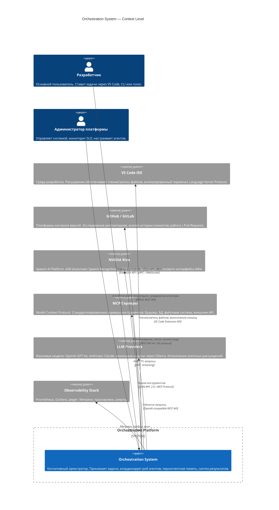
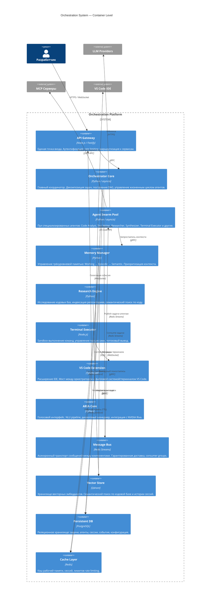
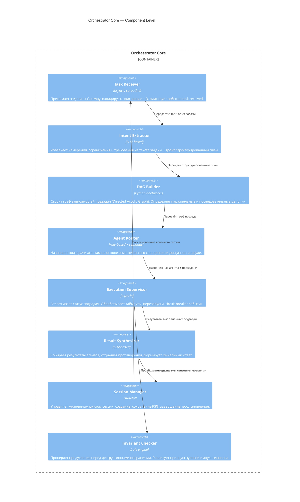
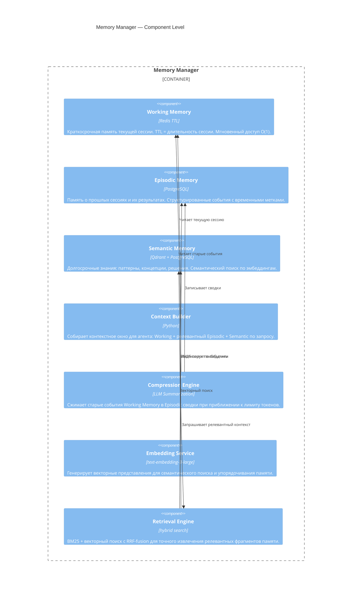
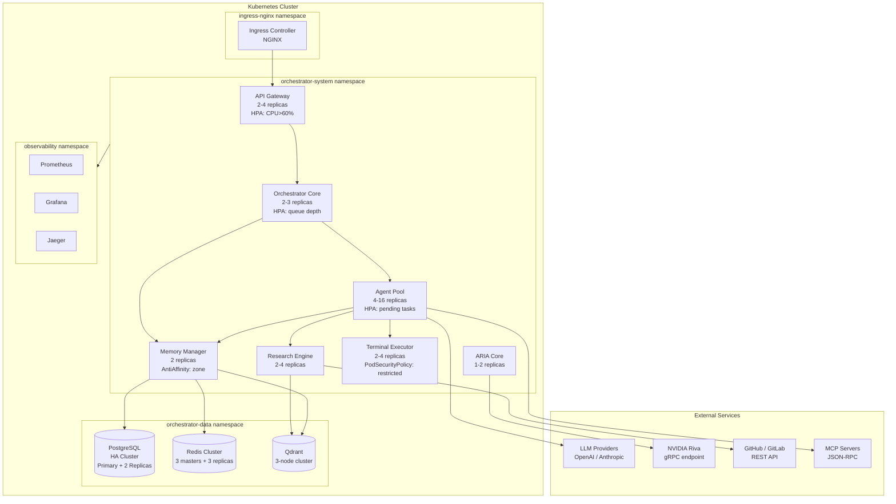
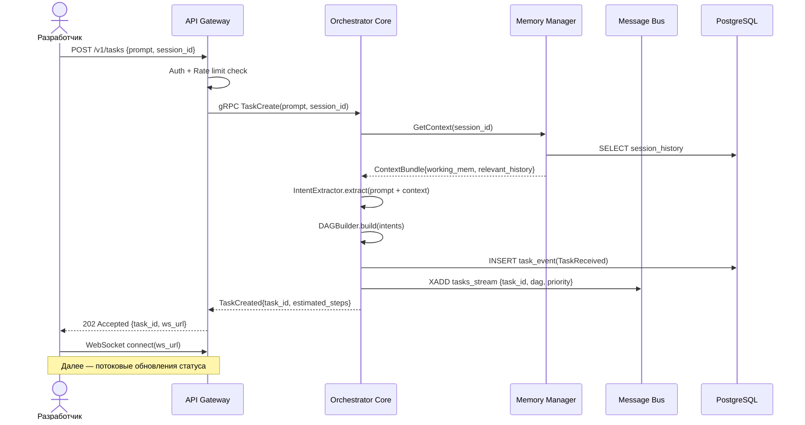
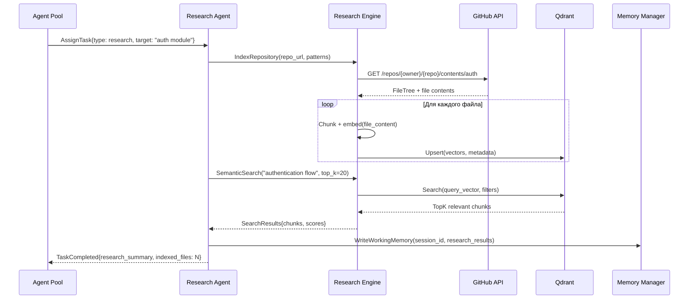
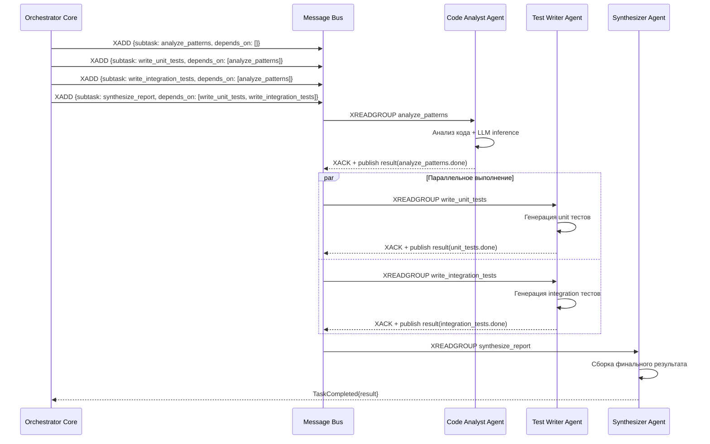
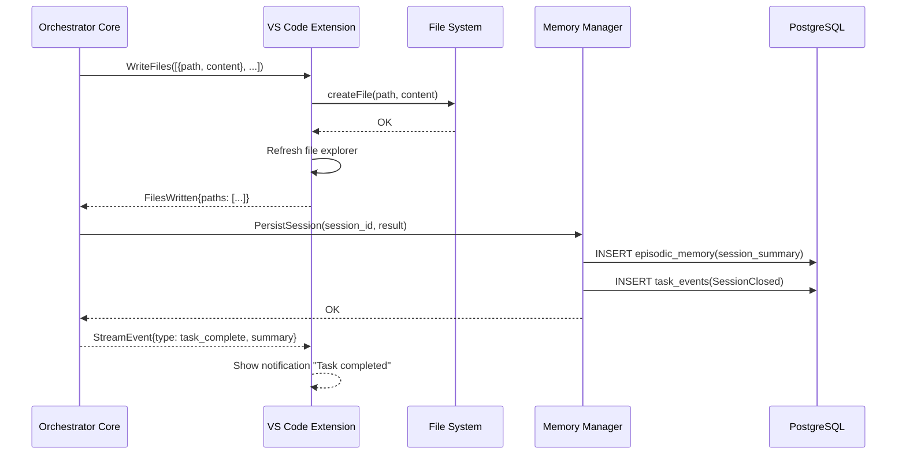

# Архитектура системы оркестрации (System Architecture)

> Детальное описание архитектуры по модели C4, архитектурных паттернов, модели развёртывания, потоков данных и механизмов отказоустойчивости.

---

## Содержание

- [C4 Model — уровень Context](#c4-model--уровень-context)
- [C4 Model — уровень Container](#c4-model--уровень-container)
- [C4 Model — уровень Component](#c4-model--уровень-component)
- [Архитектурные паттерны](#архитектурные-паттерны)
- [Модель развёртывания](#модель-развёртывания)
- [Потоки данных](#потоки-данных)
- [Модель конкурентности](#модель-конкурентности)
- [Масштабируемость](#масштабируемость)
- [Отказоустойчивость](#отказоустойчивость)

---

## C4 Model — уровень Context

Система в максимально широком окружении: пользователи и внешние системы.



---

## C4 Model — уровень Container

Внутренние контейнеры системы и их взаимодействие.



---

## C4 Model — уровень Component

### Orchestrator Core — компоненты



### Memory Manager — компоненты



---

## Архитектурные паттерны

### Event Sourcing

Все изменения состояния системы записываются как **неизменяемые события** в журнал. Текущее состояние — это проекция (projection) всех событий с начала времени.

```
TaskReceived → IntentExtracted → DAGBuilt → AgentAssigned → SubtaskCompleted → ResultSynthesized → SessionClosed
```

**Преимущества:** полный аудит, воспроизводимость, отладка, восстановление после сбоев.

### CQRS (Command Query Responsibility Segregation)

Команды (изменение состояния) и запросы (чтение) разделены на отдельные модели:

- **Command side**: `TaskCommandHandler`, `AgentCommandHandler` → записывает в Event Store
- **Query side**: `TaskQueryHandler`, `SessionQueryHandler` → читает из оптимизированных проекций (PostgreSQL read replicas, Redis)

### Actor Model

Каждый агент реализован как **актор (Actor)** с изолированным состоянием и собственным почтовым ящиком (mailbox). Акторы взаимодействуют исключительно через асинхронные сообщения. Supervision Tree управляет жизненным циклом акторов и обработкой сбоев.

```
OrchestratorSupervisor
├── TaskReceiverActor
├── AgentPoolSupervisor
│   ├── CodeAnalystActor[1..N]
│   ├── TestWriterActor[1..N]
│   ├── ResearcherActor[1..N]
│   └── SynthesizerActor[1..N]
└── MemoryManagerActor
```

### Circuit Breaker

Каждый внешний вызов (LLM, GitHub, MCP сервер) защищён автоматом с тремя состояниями:

| Состояние | Условие перехода | Поведение |
|---|---|---|
| **CLOSED** | Норма | Все запросы проходят |
| **OPEN** | ≥5 ошибок за 60 сек | Быстрый отказ (fast fail), fallback |
| **HALF-OPEN** | Через 30 сек после OPEN | Пробный запрос; успех → CLOSED, ошибка → OPEN |

### Saga Pattern

Для распределённых транзакций (например, создание задачи + резервация агента + выделение памяти) используется **Choreography-based Saga**: каждый сервис слушает события и эмитирует следующие. При сбое запускаются компенсирующие транзакции.

---

## Модель развёртывания



### Политики auto-scaling

| Компонент | Min | Max | Триггер |
|---|---|---|---|
| API Gateway | 2 | 4 | CPU > 60% |
| Orchestrator Core | 2 | 3 | Queue depth > 10 задач |
| Agent Pool | 4 | 16 | Pending tasks > 5 / агент |
| Research Engine | 2 | 4 | CPU > 70% |
| Terminal Executor | 2 | 4 | Active sessions > 8 / pod |

---

## Потоки данных

### 1. Приём и обработка задачи пользователя



### 2. Исследовательская фаза



### 3. Декомпозиция и параллельное выполнение



### 4. Запись результатов в VS Code



---

## Модель конкурентности

Система использует **гибрид Actor Model + CSP (Communicating Sequential Processes)**:

### Actor Model (для агентов)

- Каждый агент — изолированный актор с собственным **mailbox** (очередь входящих сообщений)
- Агенты не разделяют изменяемое состояние — только обмен сообщениями
- **Supervision Tree** управляет иерархией акторов и стратегиями перезапуска

```
Стратегии перезапуска:
  - ONE_FOR_ONE: перезапуск только упавшего актора
  - ONE_FOR_ALL: перезапуск всей группы при падении одного (для связанных агентов)
  - REST_FOR_ONE: перезапуск актора и всех зависимых от него
```

### CSP (для внутренних пайплайнов)

- Компоненты внутри одного контейнера взаимодействуют через **каналы (channels)** с буферизацией
- Backpressure реализован через блокирующие каналы фиксированного размера
- Timeout через `asyncio.wait_for` с настраиваемым дедлайном на каждый тип операции

### Mailbox архитектура

| Тип mailbox | Размер буфера | Политика при переполнении |
|---|---|---|
| High-priority tasks | 100 | Block producer |
| Normal tasks | 1000 | Block producer |
| Background indexing | 10000 | Drop oldest (FIFO eviction) |
| Dead letter queue | Unbounded | Alert + persist |

---

## Масштабируемость

### Горизонтальное масштабирование агентов

Agent Pool реализован как stateless воркеры, потребляющие из Redis Streams consumer group. Добавление новых реплик автоматически распределяет нагрузку без координации:

```
Новая реплика → XREADGROUP JOIN consumer_group → начинает получать задачи
```

### Auto-scaling политики (Kubernetes HPA)

```yaml
# Пример HPA для Agent Pool
metrics:
  - type: External
    external:
      metric:
        name: redis_stream_pending_messages
        selector:
          matchLabels:
            stream: tasks_stream
      target:
        type: AverageValue
        averageValue: "5"  # 5 pending задач на реплику
```

### Load Shedding

При превышении `max_queue_depth` (настраивается, default: 500) система:
1. Отклоняет новые задачи с `429 Too Many Requests`
2. Добавляет задачи в приоритетную очередь ожидания
3. Отправляет пользователю estimated wait time

---

## Отказоустойчивость

### Circuit Breakers

```python
# Конфигурация Circuit Breaker для LLM
CircuitBreakerConfig(
    failure_threshold=5,          # 5 ошибок открывают автомат
    success_threshold=2,          # 2 успеха закрывают из HALF-OPEN
    timeout=30.0,                 # секунд до попытки HALF-OPEN
    expected_exception=(TimeoutError, APIError),
    fallback=use_fallback_model   # fallback на резервную модель
)
```

### Retry Policies

| Операция | Max attempts | Backoff | Jitter |
|---|---|---|---|
| LLM inference | 3 | Exponential (1s, 2s, 4s) | ±20% |
| GitHub API | 5 | Linear (500ms step) | ±10% |
| MCP tool call | 2 | Fixed 1s | — |
| Redis operations | 10 | Exponential (50ms, 100ms...) | ±30% |
| PostgreSQL write | 5 | Exponential (100ms...) | ±20% |

### Graceful Degradation

При недоступности компонентов система продолжает работу в ограниченном режиме:

| Недоступный компонент | Деградация | Функциональность |
|---|---|---|
| Vector Store (Qdrant) | Без семантического поиска | Работает на рабочей памяти и BM25 |
| Research Engine | Без индексации новых репозиториев | Использует кэшированные данные |
| ARIA Core | Без голосового интерфейса | Только текстовый ввод |
| GitHub API | Без исследования внешних репозиториев | Работает с локальными файлами |

### Dead Letter Queue (DLQ)

Задачи, завершившиеся с ошибкой после всех попыток повтора, помещаются в DLQ:
- Сохранение полного контекста: задача, все попытки, трейс ошибки
- Алерт администратору через PagerDuty/Alertmanager
- Ручной повтор или анализ через Admin Dashboard
- Автоматическая очистка через 30 дней

---

*Последнее обновление: 2026-03-31 | Версия: 1.0.0 | Следующий раздел: [Ядро оркестратора](../orchestrator-core/README.md)*
