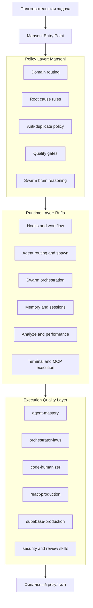
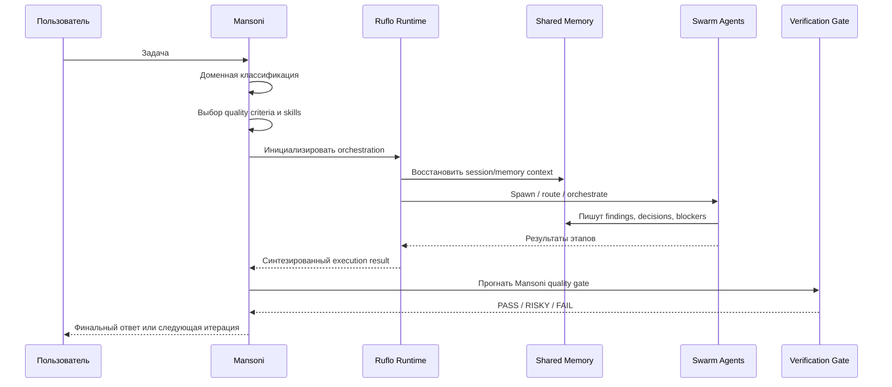

# Ruflo Inside Mansoni

> Каноническая архитектура гибрида: Ruflo как orchestration runtime, Mansoni как слой мышления, правил, доменной экспертизы и quality gates.

Дата: 2026-04-08
Статус: Draft for implementation
Область: orchestration, agent runtime, memory, MCP, workflows, quality gates

---

## 1. Зачем нужен этот документ

В проекте уже зафиксирована формула:

- Ruflo-first orchestration
- Mansoni as project brain
- skills Mansoni as quality and domain layer

Эта формула встречается в нескольких местах:

- [CLAUDE.md](../../CLAUDE.md)
- [.github/copilot-instructions.md](../../.github/copilot-instructions.md)
- [.github/agents/ruflo.agent.md](../../.github/agents/ruflo.agent.md)
- [.github/agents/mansoni.agent.md](../../.github/agents/mansoni.agent.md)

Но до этого момента она была размазана по инструкциям, skills и agent-файлам. Цель документа — собрать это в одну техническую спецификацию, которая отвечает на четыре вопроса:

1. Что такое Ruflo в контексте этого проекта.
2. Что такое Mansoni и где заканчивается его зона ответственности.
3. Как именно они связываются в единый рабочий режим.
4. Как внедрить Ruflo целиком в Mansoni, а не частично и не декоративно.

---

## 2. Короткий тезис

### Каноническая формула

Ruflo не заменяет Mansoni.

Mansoni не дублирует Ruflo.

Их правильная связка выглядит так:

- Ruflo = runtime исполнения, orchestration brain, memory/workflow/session/hooks/swarm слой
- Mansoni = policy layer, project brain, domain routing, anti-duplicate discipline, root-cause culture, review gates
- Skills Mansoni = набор профессиональных режимов мышления и проверок качества

Итог:

**Ruflo исполняет. Mansoni решает, как исполнять правильно для этого репозитория.**

---

## 3. Определения

### 3.1 Ruflo

Ruflo — это orchestration-first агент и execution/runtime слой, ориентированный на полный доступ к поверхности `claude-flow/*` и связанным механизмам координации.

Практически это означает, что Ruflo отвечает за:

- запуск и координацию агентов
- swarm-топологии и распределение работы
- workflow/task lifecycle
- memory/session/claims handoff
- hooks automation
- analyze/performance/embeddings/neural контуры
- terminal/system/config/mcp status контроль

Источники:

- [.github/agents/ruflo.agent.md](../../.github/agents/ruflo.agent.md)
- [.claude/skills/swarm-orchestration/SKILL.md](../../../.claude/skills/swarm-orchestration/SKILL.md)
- [.claude/skills/hooks-automation/SKILL.md](../../../.claude/skills/hooks-automation/SKILL.md)
- [.claude/skills/verification-quality/SKILL.md](../../../.claude/skills/verification-quality/SKILL.md)

### 3.2 Mansoni

Mansoni — это основной high-end агент проекта, каноническая точка входа в режим `mansoni-core`.

Он задаёт:

- доменную картину суперплатформы
- правила root cause analysis
- антидубль-политику
- требования к качеству и полноте
- проектные пайплайны для фич, багов, аудитов и security-задач
- обязательные quality gates перед финальным ответом

Источники:

- [CLAUDE.md](../../CLAUDE.md)
- [.github/copilot-instructions.md](../../.github/copilot-instructions.md)
- [.github/agents/mansoni.agent.md](../../.github/agents/mansoni.agent.md)
- [.github/skills/swarm-brain/SKILL.md](../../.github/skills/swarm-brain/SKILL.md)
- [.github/skills/swarm-protocol/SKILL.md](../../.github/skills/swarm-protocol/SKILL.md)

### 3.3 Skills Mansoni

Skills Mansoni — это слой профессиональных специализаций и quality discipline, которые подмешиваются к любому runtime.

К always-on ядру относятся:

- `agent-mastery`
- `orchestrator-laws`
- `code-humanizer`
- `swarm-brain`
- `swarm-protocol`

Контекстные skills загружаются по типу задачи: `react-production`, `supabase-production`, `messenger-platform`, `security-audit`, `feature-dev`, `review-toolkit` и другие.

---

## 4. Архитектурный принцип гибрида

Гибрид `Ruflo Inside Mansoni` означает, что Mansoni не строит собственный отдельный runtime с нуля, а использует Ruflo как операционное ядро.

### 4.1 Слои системы

### 4.2 Главное разделение ответственности

| Слой | Отвечает за | Не должен делать |
|---|---|---|
| Ruflo | orchestration, memory, hooks, workflows, swarm execution, task routing | определять проектные стандарты и доменные инварианты |
| Mansoni | доменные решения, критерии качества, anti-duplicate, root cause, review gates | вручную имитировать swarm/runtime там, где Ruflo уже умеет |
| Skills | применить релевантные техники и quality patterns | заменять собой orchestration слой |

---

## 5. Что именно входит в Ruflo

На уровне проекта Ruflo нужно понимать не как один “умный промпт”, а как совокупность операционных подсистем.

### 5.1 Orchestration primitives

Базовый приоритет, зафиксированный в агенте Ruflo:

1. `hooks_*`, `agent_*`, `swarm_*`, `workflow_*`, `task_*`
2. `memory_*`, `agentdb_*`, `session_*`, `claims_*`
3. `analyze_*`, `performance_*`, `embeddings_*`, `neural_*`, `aidefence_*`
4. `terminal_*`, `system_*`, `config_*`, `mcp_status`

Это и есть ядро Ruflo как runtime-платформы.

### 5.2 Swarm orchestration

Ruflo поддерживает несколько уровней координации:

- mesh topology
- hierarchical topology
- adaptive topology
- parallel task execution
- pipeline execution
- auto-orchestrate mode
- load balancing
- fault tolerance
- runtime metrics

Источник:

- [.claude/skills/swarm-orchestration/SKILL.md](../../../.claude/skills/swarm-orchestration/SKILL.md)

### 5.3 Hooks layer

Hooks-слой нужен для того, чтобы orchestration происходила не только “в момент решения”, но и вокруг операций:

- `pre-task`
- `pre-edit`
- `pre-bash`
- `post-task`
- `post-edit`
- `post-bash`
- `memory-sync`
- `session-restore`
- `notify`

Источник:

- [.claude/skills/hooks-automation/SKILL.md](../../../.claude/skills/hooks-automation/SKILL.md)

### 5.4 Verification layer

Ruflo также даёт verification-контур:

- truth score
- verify check
- batch verification
- rollback to last-good
- CI/CD export
- swarm verification integration

Источник:

- [.claude/skills/verification-quality/SKILL.md](../../../.claude/skills/verification-quality/SKILL.md)

---

## 6. Что именно входит в Mansoni

Mansoni — это не runtime, а управленческий и инженерный слой над runtime.

### 6.1 Project operating system

Mansoni знает:

- карту модулей платформы
- стек проекта
- архитектурные ограничения
- known pitfalls из `memories/repo`
- правила по RLS, migrations, TS strict, anti-stub, humanized code

### 6.2 Internal reasoning model

В Mansoni живут два уровня reasoning:

1. Внутренний роевой мозг из 7 персон:
   - Architect
   - Engineer
   - Security
   - Debugger
   - Reviewer
   - Researcher
   - Optimizer

2. Внешний операционный рой из 33 ролей:
   - ядро
   - специалисты
   - доменные координаторы
   - имплементаторы CodeSmith
   - узкие аудиторы

Источники:

- [.github/skills/swarm-brain/SKILL.md](../../.github/skills/swarm-brain/SKILL.md)
- [.github/skills/swarm-protocol/SKILL.md](../../.github/skills/swarm-protocol/SKILL.md)

### 6.3 Quality doctrine

Mansoni навязывает проекту следующие обязательные паттерны:

- root cause вместо symptom fixing
- anti-duplicate first
- tsc/lint discipline
- zero stubs
- humanized code
- evidence-based review
- additive migrations and RLS enforcement
- full delivery, not partial advice

---

## 7. Схема связки Ruflo и Mansoni

### 7.1 Целевой runtime flow

### 7.2 Правило порядка слоёв

При любой нетривиальной задаче правильный порядок такой:

1. Mansoni определяет тип задачи и критерии качества.
2. Mansoni активирует релевантные skills.
3. Ruflo поднимает orchestration/runtime-механику.
4. Агентный рой выполняет работу через memory/workflow/hooks/swarm.
5. Mansoni прогоняет результат через quality layer.
6. Только после PASS/RISKY-with-known-tradeoffs результат считается завершённым.

### 7.3 Жёсткое правило

Если в задаче нужен runtime orchestration, нельзя подменять Ruflo ручной координацией из промпта.

Если задача требует domain judgment, нельзя перекладывать решение только на Ruflo runtime.

---

## 8. Карта обязанностей по подсистемам

| Подсистема | Хозяин | Роль Mansoni | Роль Ruflo |
|---|---|---|---|
| Entry point | Mansoni | основная точка входа | не владеет entrypoint |
| Task classification | Mansoni | да | нет |
| Swarm init | Ruflo | задаёт стратегию | исполняет |
| Agent spawn | Ruflo | определяет кого звать | спавнит и маршрутизирует |
| Session restore | Ruflo | указывает контекст важности | восстанавливает |
| Repo memory discipline | Mansoni | определяет что важно помнить | предоставляет механизмы хранения |
| Hooks automation | Ruflo | определяет политику использования | исполняет хуки |
| Review gates | Mansoni | владеет вердиктом | может дать метрики и проверки |
| Truth score | Ruflo | интерпретирует как сигнал | считает и отслеживает |
| Humanized code | Mansoni skills | владеет правилом | не владеет |
| Anti-duplicate | Mansoni skills | владеет правилом | может помогать поиском и оркестрацией |
| Workflow DAG | Ruflo | задаёт требования к шагам | строит и ведёт workflow |
| MCP/system execution | Ruflo | определяет допустимый режим | исполняет |

---

## 9. Почему частичная интеграция плоха

Частичная интеграция выглядит так:

- Ruflo подключён только как “ещё один агент” без роли runtime
- hooks не используются
- память не синхронизирована с роем Mansoni
- workflow/task engine не участвует в длинных задачах
- quality gates Mansoni живут отдельно и не встроены в execution loop

Это создаёт пять дефектов:

1. Дублирование orchestration логики между промптами и runtime.
2. Потеря контекста между длинными задачами.
3. Формальный swarm без реальной shared memory.
4. Непредсказуемое качество при handoff между агентами.
5. Разрыв между execution metrics и project quality verdict.

Полное внедрение должно убрать именно эти дефекты.

---

## 10. Целевое состояние полного внедрения

Полностью внедрённый Ruflo в Mansoni означает, что:

### 10.1 На уровне входа

- `mansoni` остаётся каноническим entrypoint
- `mansoni-core` остаётся алиасом того же режима
- `ruflo` остаётся отдельным agent mode для прямой оркестрации, но внутри проекта основной продовый режим — это `mansoni`, а не прямой `ruflo`

### 10.2 На уровне runtime

- любая крупная задача идёт через Ruflo orchestration primitives
- session/memory/task/workflow используются системно, а не эпизодически
- hooks автоматизируют pre/post lifecycle операций
- swarm topology выбирается по типу задачи, а не по настроению агента

### 10.3 На уровне памяти

- shared session memory роя синхронизирована с execution lifecycle
- repo memory остаётся источником verified project knowledge
- важные решения и паттерны фиксируются в memory через единый протокол

### 10.4 На уровне качества

- verification quality от Ruflo встроена в execution loop
- финальный verdict всё равно остаётся за Mansoni quality gate
- FAIL запускает цикл исправления, а не ручное “сейчас поправлю потом”

---

## 11. План внедрения Ruflo целиком в Mansoni

Ниже план не “как переписать всё сразу”, а как довести связку до системного состояния без декоративных интеграций.

## Phase 0 — Canonicalization

Цель: зафиксировать один источник истины.

Нужно:

- считать каноническим гибридное определение из [.github/agents/mansoni.agent.md](../../.github/agents/mansoni.agent.md)
- этот документ использовать как архитектурную спецификацию
- все последующие README и prompt-слои ссылать на этот документ, а не дублировать формулировки вручную

Результат:

- нет конкурирующих определений “кто главный: Ruflo или Mansoni”

## Phase 1 — Entry Point Unification

Цель: `mansoni` всегда является внешним лицом режима, а Ruflo всегда является внутренним runtime.

Нужно:

- оставить `mansoni` как default high-end entrypoint
- сохранить `ruflo` как отдельный режим для прямых orchestration-задач
- закрепить правило: для задач проекта prefer `mansoni`, а не прямой `ruflo`

Результат:

- у пользователя один основной режим
- внутри него не спорят два orchestration-подхода

## Phase 2 — Runtime Binding

Цель: Mansoni реально использует Ruflo подсистемы, а не только декларирует это.

Нужно:

- для complex tasks использовать `hooks_*`, `agent_*`, `swarm_*`, `workflow_*`, `task_*` как основной execution path
- не подменять их ручным reasoning там, где нужна системная координация
- связать task decomposition Mansoni с Ruflo workflows

Результат:

- не “Mansoni с красивыми словами про Ruflo”, а Mansoni на реальном Ruflo runtime

## Phase 3 — Shared Memory Convergence

Цель: объединить project memory discipline Mansoni и runtime memory discipline Ruflo.

Нужно:

- оставить `memories/repo` как verified repo facts
- оставить `memories/session/swarm` как общую рабочую память роя
- добавить явное правило соответствия:
  - repo memory = долгосрочные проверенные знания проекта
  - session/swarm memory = жизненный цикл текущей многoагентной задачи
  - Ruflo session/task memory = операционное состояние runtime

Важно:

Ruflo memory не должна дублировать `memories/repo`; она должна дополнять execution-level контекст.

Результат:

- нет конфликтующих источников памяти
- handoff между агентами перестаёт быть слепым

## Phase 4 — Hook-Driven Lifecycle

Цель: сделать orchestration системной, а не ручной.

Нужно:

- внедрить `pre-task` для сложных задач
- внедрить `post-task` для фиксации решений, learnings и метрик
- внедрить `pre-edit`/`post-edit` вокруг серьёзных изменений
- внедрить `session-restore` для длинных сессий и восстановления swarm context

Результат:

- подготовка, выполнение и завершение задач идут по единому lifecycle

## Phase 5 — Workflow Templates for Mansoni Pipelines

Цель: маршруты Mansoni должны быть представлены в виде шаблонных Ruflo workflow.

Нужно:

- feature pipeline: researcher → architect → coder → reviewer → tester
- bug pipeline: debugger → coder → reviewer
- security pipeline: security-engineer → reviewer-security → coder
- audit pipeline: reviewer → narrow reviewers → synthesis

Каждый pipeline должен иметь:

- критерии старта
- topology suggestion
- required memory context
- verification checkpoints
- stop/retry/escalation rules

Результат:

- пайплайны становятся исполнимыми workflow, а не только текстовыми инструкциями

## Phase 6 — Verification Fusion

Цель: совместить mechanical verification Ruflo и semantic quality gates Mansoni.

Нужно:

- использовать truth score как индикатор надёжности, а не финальный суд
- использовать verification checks как обязательный вход в финальный gate
- оставить PASS/RISKY/FAIL verdict за Mansoni reviewer layer

Результат:

- механическая проверка и проектное инженерное суждение работают вместе

## Phase 7 — Observability and Governance

Цель: видеть, насколько гибрид реально работает.

Нужно измерять:

- сколько complex tasks реально идут через orchestration primitives
- сколько handoff происходит с сохранением memory context
- сколько FAIL → FIX → PASS циклов проходит до финала
- сколько duplicate work было предотвращено
- сколько задач завершилось без потери сессии

Результат:

- интеграция становится операционно наблюдаемой, а не только декларативной

---

## 12. Рекомендуемая топология по типам задач

| Тип задачи | Рекомендуемая topology | Почему |
|---|---|---|
| Быстрый вопрос по коду | без swarm или mesh 2-3 агента | низкая стоимость координации |
| Баг с root-cause поиском | hierarchical | debugger/architect/reviewer удобнее вести сверху |
| Новая фича | hierarchical или adaptive | есть явный pipeline и зависимости |
| Глубокий аудит | mesh или star | много параллельного чтения и агрегации |
| Security review | star или hierarchical | нужен сильный центральный контроль вердикта |
| Большой рефакторинг | adaptive | полезно балансировать parallel analysis и sequential fix stages |

---

## 13. Что нельзя делать при внедрении

### 13.1 Нельзя делать Ruflo новым “главным брендом” проекта

Проектовый entrypoint уже определён: это Mansoni.

Полное внедрение Ruflo не означает переименование режима `mansoni` в `ruflo`.

### 13.2 Нельзя дублировать policy logic в hooks/runtime

Правила root cause, anti-duplicate, humanized code и domain invariants должны оставаться в Mansoni skills/policies.

### 13.3 Нельзя хранить verified repo facts только в ephemeral runtime memory

Проверенные знания должны оставаться в `memories/repo`, а не растворяться в runtime session state.

### 13.4 Нельзя считать truth score заменой инженерного ревью

Truth score помогает, но не принимает финальное архитектурное решение за проект.

---

## 14. Target Operating Model

### 14.1 Для пользователя

Пользователь видит один основной high-end режим: `mansoni`.

Он не обязан выбирать между:

- умным доменным агентом
- orchestration runtime
- swarm brain
- memory manager

Потому что всё это уже собрано в одном режиме.

### 14.2 Для системы

Система видит три слоя:

1. Entry and policy: Mansoni
2. Execution runtime: Ruflo
3. Quality and specialization: skills

### 14.3 Для команды проекта

Команда получает:

- один канонический режим работы
- один канонический документ гибрида
- одно место для расширения policy
- одно место для расширения runtime integration

---

## 15. MVP внедрения и Full integration

### MVP

Чтобы считать интеграцию жизнеспособной, достаточно:

- канонизировать `mansoni` как entrypoint
- использовать Ruflo orchestration primitives для крупных задач
- связать session/swarm memory и repo memory дисциплиной
- прогонять сложные задачи через verification + Mansoni review gate

### Full integration

Полной интеграцией это станет, когда:

- все стандартные пайплайны Mansoni будут иметь Ruflo workflow templates
- hooks lifecycle будет системно включён
- observability по orchestration станет измеряемой
- memory handoff будет единым для swarm/task/session контуров
- FAIL/FIX/PASS loop будет автоматизирован до стабильного quality gate

---

## 16. Практический вердикт

Правильная формулировка внедрения звучит так:

**Не “подключить Ruflo к Mansoni”, а “сделать Mansoni проектным brain поверх полного Ruflo runtime”.**

Это даёт:

- один канонический agent mode для пользователя
- один orchestration runtime под капотом
- один слой проектного мышления и инженерной дисциплины
- одну связную архитектуру без конкурирующих центров управления

---

## 17. Definition of Done для интеграции

Интеграцию Ruflo в Mansoni можно считать завершённой, когда выполняются все пункты:

- `mansoni` остаётся основным entrypoint проекта
- Ruflo используется как основной runtime orchestration, а не как факультативный помощник
- workflows и hooks реально участвуют в complex-task lifecycle
- session/swarm/task memory не конфликтуют с `memories/repo`
- quality gates Mansoni встроены после execution и verification этапов
- есть наблюдаемость по orchestration, retries, FAIL/FIX/PASS loop
- документация по гибриду считается канонической и на неё ссылаются agent/config docs

---

## 18. Связанные документы

- [Главный README оркестратора](../README.md)
- [Интеграция с MCP](../mcp-integration/README.md)
- [Ядро оркестратора](../orchestrator-core/README.md)
- [Рой агентов](../agents/README.md)
- [CLAUDE.md](../../CLAUDE.md)
- [.github/agents/mansoni.agent.md](../../.github/agents/mansoni.agent.md)
- [.github/agents/ruflo.agent.md](../../.github/agents/ruflo.agent.md)
