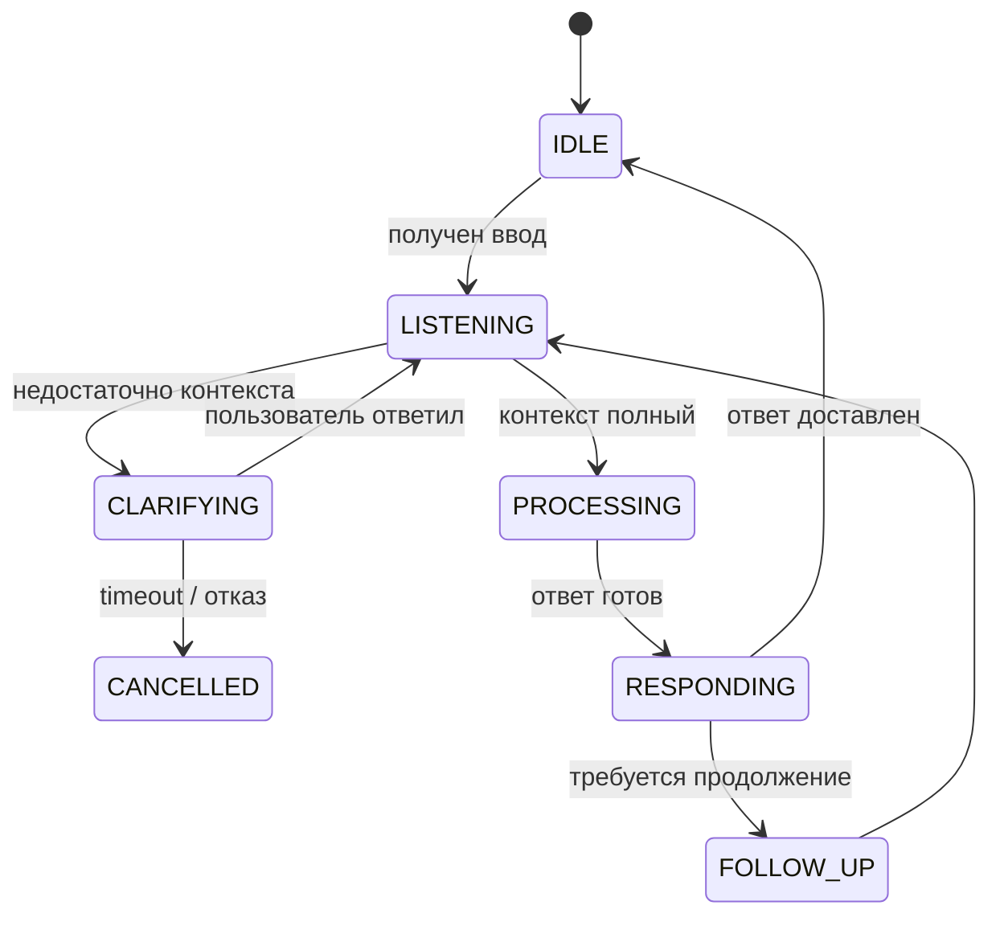

# Разговорный AI (Conversational AI)

> Управление диалогом: адаптация тона, распознавание уточняющих запросов, многоходовые разговоры и персонализация стиля общения.

---

## Содержание

- [Обзор](#обзор)
- [Dialogue Manager](#dialogue-manager)
- [Адаптация тона](#адаптация-тона)
- [Clarification Loops](#clarification-loops)
- [Управление многоходовым диалогом](#управление-многоходовым-диалогом)
- [Персонализация](#персонализация)
- [Форматирование ответов](#форматирование-ответов)
- [Системный промпт](#системный-промпт)

---

## Обзор

Модуль Conversational AI отвечает за **качество взаимодействия** между агентом и пользователем: как агент задаёт вопросы, адаптирует стиль под эксперта или новичка, избегает лишних уточнений и формирует ответы нужного формата.

```
Пользователь: "Сделай это"
      │
      ▼
  Dialogue Manager
  ├── Достаточно контекста? → НЕТ → Clarification Loop
  │                        → ДА  → Передать оркестратору
  ├── Тон: эксперт/новичок?       → Адаптация ответа
  └── Формат: код/текст/список?   → Форматирование ответа
```

---

## Dialogue Manager

### Жизненный цикл диалога



### Структура состояния диалога

```python
@dataclass
class DialogueState:
    session_id: str
    turn_count: int               # Номер хода диалога
    current_topic: Optional[str]  # Текущая тема разговора
    pending_task: Optional[Task]  # Незавершённая задача
    clarification_depth: int      # Глубина уточняющих вопросов (макс. 2)
    user_expertise: str           # "beginner" | "intermediate" | "expert"
    preferred_format: str         # "verbose" | "concise" | "code_first"
    open_questions: list[str]     # Незакрытые вопросы к пользователю
```

---

## Адаптация тона

### Определение уровня экспертизы

Агент определяет уровень экспертизы из:
1. Явных сигналов: "я только учусь", "как джуниор"
2. Лексики: использование технических терминов
3. User Profile из Episodic Memory
4. Типа вопроса: "что такое X" vs "почему X медленнее Y"

```python
class ToneAdapter:
    EXPERTISE_SIGNALS = {
        "beginner": [
            "не понимаю", "объясни", "что такое", "как работает",
            "новичок", "учусь", "впервые"
        ],
        "expert": [
            "рефакторинг", "бенчмарк", "паттерн", "архитектура",
            "оптимизация", "O(n)", "dependency injection"
        ]
    }

    def detect_expertise(
        self,
        message: str,
        user_profile: UserProfile
    ) -> str:
        # Быстрая эвристика по ключевым словам
        text_lower = message.lower()
        beginner_score = sum(
            1 for kw in self.EXPERTISE_SIGNALS["beginner"]
            if kw in text_lower
        )
        expert_score = sum(
            1 for kw in self.EXPERTISE_SIGNALS["expert"]
            if kw in text_lower
        )
        if beginner_score > expert_score:
            return "beginner"
        if expert_score >= 2:
            return "expert"
        # Fallback: из профиля пользователя
        return user_profile.expertise_level
```

### Адаптация ответа

| Уровень | Стиль | Пример |
|---------|-------|--------|
| `beginner` | Аналогии, шаг за шагом, без жаргона | "Представь, что кэш — это черновик на столе" |
| `intermediate` | Технические термины, краткие объяснения | "Используй Redis для кэширования с TTL 300s" |
| `expert` | Прямо к делу, только код и ключевые факты | "`SET key value EX 300` — атомарная операция" |

```python
TONE_SYSTEM_PROMPTS = {
    "beginner": """
        Объясняй просто. Используй аналогии из повседневной жизни.
        Избегай жаргона. Каждый шаг объясняй подробно.
        После объяснения спроси, понятно ли.
    """,
    "intermediate": """
        Используй технические термины. Предполагай базовые знания.
        Приводи конкретные примеры кода. Объясняй важные нюансы.
    """,
    "expert": """
        Будь лаконичен. Только суть. Пропускай очевидное.
        Код > текст. Упоминай Trade-offs и edge cases.
    """
}
```

---

## Clarification Loops

### Принципы уточнений

1. **Максимум 1–2 уточняющих вопроса** за ход
2. **Группировка вопросов**: если нужно несколько уточнений — задать их все сразу
3. **Предложение вариантов**: всегда давать 2–4 конкретных варианта ответа
4. **Уточнять только критичное**: не спрашивать о том, что можно разумно предположить

```python
class ClarificationManager:
    MAX_CLARIFICATION_DEPTH = 2

    async def needs_clarification(
        self,
        task: Task,
        context: MemoryContext
    ) -> Optional[ClarificationRequest]:
        """
        Определить, нужны ли уточнения перед выполнением задачи.
        Returns None если контекста достаточно.
        """
        if self.state.clarification_depth >= self.MAX_CLARIFICATION_DEPTH:
            # Слишком много уточнений — действуем с разумными defaults
            return None

        missing = await self._identify_missing_context(task, context)
        if not missing:
            return None

        # Формируем один чёткий вопрос со вариантами
        return ClarificationRequest(
            question=missing[0].question,
            suggestions=missing[0].suggestions,
            optional=(len(missing) == 1 and missing[0].has_default)
        )
```

### Шаблоны уточняющих вопросов

```python
CLARIFICATION_TEMPLATES = {
    "file_target": {
        "question": "В каком файле нужно внести изменения?",
        "suggestions": [
            "Текущий открытый файл ({active_file})",
            "Создать новый файл",
            "Несколько файлов — укажу список"
        ]
    },
    "language": {
        "question": "На каком языке написать код?",
        "suggestions": ["Python", "TypeScript", "Go", "Тот же, что в проекте"]
    },
    "scope": {
        "question": "Что охватывает задача?",
        "suggestions": [
            "Только этот модуль",
            "Весь проект",
            "Создать отдельный пакет"
        ]
    },
    "test_coverage": {
        "question": "Нужны ли тесты?",
        "suggestions": [
            "Да, unit тесты",
            "Да, integration тесты",
            "Нет, только реализация"
        ]
    }
}
```

---

## Управление многоходовым диалогом

### Поддержание топика

```python
class TopicTracker:
    """Отслеживает тему разговора и связывает ходы воедино."""

    def update_topic(self, message: str, current_topic: Optional[str]) -> str:
        # Слова, указывающие на продолжение темы
        CONTINUATION_SIGNALS = ["это", "тут", "здесь", "данный", "этот"]

        has_continuation = any(
            signal in message.lower()
            for signal in CONTINUATION_SIGNALS
        )

        if has_continuation and current_topic:
            return current_topic  # Продолжаем текущую тему

        # Извлечь новую тему из сообщения через LLM
        return self._extract_topic(message)
```

### Обработка смены темы

```
[Ход 1] "Напиши функцию для парсинга JSON"
         → topic: "json_parsing"

[Ход 2] "Добавь обработку ошибок"
         → topic: "json_parsing" (продолжение, "добавь" = продолжаем)

[Ход 3] "Теперь напиши тесты для этого"
         → topic: "json_parsing" (reference: "для этого")

[Ход 4] "А как работает asyncio?"
         → topic: "asyncio" (новая тема, чистый контекст)
```

### Ссылки на предыдущие результаты

```python
async def resolve_references(
    message: str,
    working_history: list[Message]
) -> str:
    """
    Заменить местоимения на конкретные ссылки из контекста.
    "это" → "функция parse_json() из предыдущего ответа"
    """
    REFERENCE_WORDS = ["это", "тут", "данный", "него", "её", "их"]

    if not any(ref in message.lower() for ref in REFERENCE_WORDS):
        return message  # Нет ссылок — вернуть без изменений

    # Передать в LLM для разрешения кореференции
    last_assistant_msg = next(
        (m for m in reversed(working_history) if m.role == "assistant"),
        None
    )
    if not last_assistant_msg:
        return message

    return await resolve_coreference(message, last_assistant_msg.content)
```

---

## Персонализация

### Адаптация под пользователя

Агент накапливает предпочтения пользователя в Semantic Memory:

```python
# Паттерны, которые агент запоминает
USER_PREFERENCES_TO_TRACK = {
    "code_style": [
        "предпочитает type hints",
        "использует dataclasses",
        "избегает глобальных переменных",
    ],
    "communication": [
        "хочет краткие ответы",
        "любит emoji в объяснениях",
        "предпочитает английские термины",
    ],
    "workflow": [
        "всегда пишет тесты первыми (TDD)",
        "предпочитает feature branches",
        "не использует ORM",
    ]
}
```

### Применение предпочтений

```python
def build_personalized_prompt(
    base_prompt: str,
    user_profile: UserProfile,
    semantic_facts: list[Fact]
) -> str:
    """Обогатить системный промпт персональными предпочтениями."""

    preferences = [
        f.content for f in semantic_facts
        if f.topic in ("code_style", "communication", "workflow")
        and f.confidence > 0.7
    ]

    if not preferences:
        return base_prompt

    pref_block = "\n".join(f"- {p}" for p in preferences[:5])
    return f"""{base_prompt}

## Предпочтения пользователя (всегда соблюдать):
{pref_block}
"""
```

---

## Форматирование ответов

### Выбор формата

```python
FORMAT_RULES = {
    "code_request": {
        "trigger": ["напиши", "реализуй", "создай функцию", "добавь метод"],
        "format": "code_first",    # Сначала код, объяснение после
        "max_prose_lines": 5
    },
    "explanation_request": {
        "trigger": ["объясни", "расскажи", "что такое", "как работает"],
        "format": "prose",         # Текстовое объяснение
        "include_example": True
    },
    "comparison_request": {
        "trigger": ["сравни", "разница между", "что лучше"],
        "format": "table",         # Таблица сравнения
    },
    "list_request": {
        "trigger": ["перечисли", "список", "какие есть"],
        "format": "bullet_list"
    },
    "debug_request": {
        "trigger": ["ошибка", "не работает", "почему", "исправь"],
        "format": "diagnostic",    # Диагноз → причина → решение
    }
}
```

### Структура диагностического ответа

```
🔍 **Диагноз**: [одна строка — что именно сломалось]

**Причина**: [почему это произошло]

**Решение**:
```код с исправлением```

**Объяснение**: [почему такое исправление правильное]

💡 **Профилактика**: [как избежать в будущем]
```

---

## Системный промпт

Базовый системный промпт агента (сокращённая версия):

```
Ты — AI Companion, персональный ассистент разработчика.

## Принципы:
1. Нулевая импульсивность: уточни перед действием, если контекст неполный
2. Персистентность: помни предпочтения пользователя между сессиями
3. Точность: если не знаешь — скажи "не знаю", не придумывай
4. Краткость: код > объяснения; убирай очевидное

## Стиль:
- Используй Markdown для форматирования
- Код всегда в блоках с указанием языка
- Для ошибок: Диагноз → Причина → Решение
- Максимум 2 уточняющих вопроса за ход

## Запрещено:
- Выполнять деструктивные операции без явного подтверждения
- Изменять файлы без показа diff
- Давать ответы вне области компетенции без предупреждения
```

Полный системный промпт: [`docs/ADVANCED_AI_SYSTEM_PROMPT.md`](../../ADVANCED_AI_SYSTEM_PROMPT.md)

---

## Связанные разделы

- [ARIA Интеграция](../aria-integration/README.md) — голосовой диалог
- [Архитектурная память](../architectural-memory/README.md) — сохранение предпочтений
- [Рабочие процессы](../workflows/README.md) — типовые диалоговые сценарии

---

*Версия: 1.0.0*
