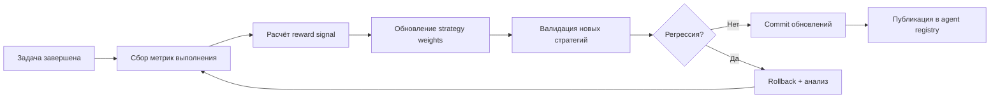
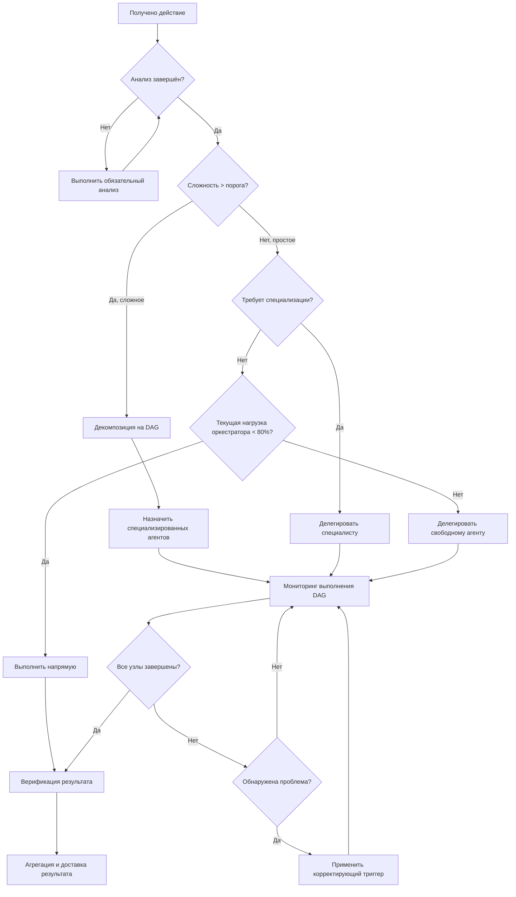
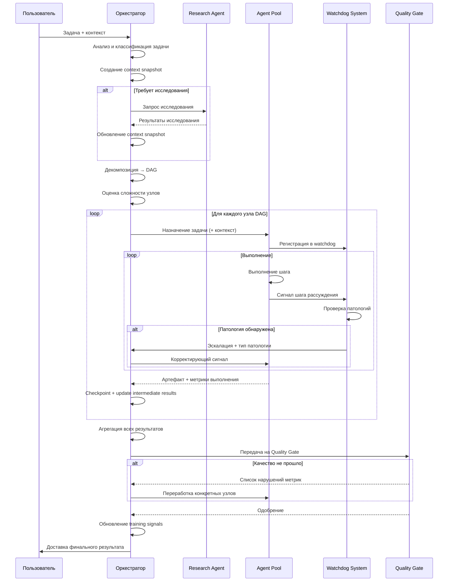

# Ядро Оркестратора (Orchestrator Core)

> **Связанные документы:** [Общий README системы](../README.md) · [Архитектура системы](../architecture/README.md)

---

## Содержание

1. [Базовые требования к оркестратору](#1-базовые-требования-к-оркестратору)
   - [Персистентная память между сессиями](#11-персистентная-память-между-сессиями)
   - [Непрерывное обучение](#12-непрерывное-обучение)
   - [Декомпозиция задач](#13-декомпозиция-задач)
   - [Принцип нулевой импульсивности](#14-принцип-нулевой-импульсивности)
2. [Контекстная осведомлённость](#2-контекстная-осведомлённость)
3. [Предотвращение патологических состояний](#3-предотвращение-патологических-состояний)
4. [Метрики качества рассуждений](#4-метрики-качества-рассуждений)
5. [Цикл принятия решений оркестратора](#5-цикл-принятия-решений-оркестратора)
6. [Алгоритм приоритизации задач](#6-алгоритм-приоритизации-задач)
7. [Алгоритм балансировки нагрузки](#7-алгоритм-балансировки-нагрузки)

---

## 1. Базовые требования к оркестратору

### 1.1 Персистентная память между сессиями

Оркестратор обязан сохранять полное состояние между перезапусками. Потеря контекста недопустима.

#### Архитектура хранения состояния

```
┌─────────────────────────────────────────────────────────────┐
│                   State Storage Layer                        │
│                                                             │
│  ┌───────────────┐   ┌───────────────┐   ┌──────────────┐  │
│  │  Hot Storage  │   │ Warm Storage  │   │ Cold Archive │  │
│  │  (Redis/RAM)  │   │  (PostgreSQL) │   │  (S3/Blob)   │  │
│  │  TTL: 24h     │   │  TTL: 30d     │   │  TTL: ∞      │  │
│  └───────┬───────┘   └───────┬───────┘   └──────┬───────┘  │
│          │                   │                   │          │
│          └───────────────────┴───────────────────┘          │
│                         Unified API                         │
└─────────────────────────────────────────────────────────────┘
```

#### Формат сериализации состояния (State Serialization Format)

```json
{
  "session_id": "uuid-v4",
  "orchestrator_version": "2.1.0",
  "created_at": "ISO-8601",
  "last_checkpoint": "ISO-8601",
  "state": {
    "active_tasks": [...],
    "agent_registry": {...},
    "context_snapshots": [...],
    "reasoning_traces": [...],
    "dependency_graph": {...}
  },
  "binary_snapshot_ref": "s3://snapshots/session-uuid.bin",
  "checksum": "sha256:..."
}
```

**Стратегия двойного хранения (Dual Storage Strategy):**
- **JSON-слой** — читаемое состояние для инспекции и отладки
- **Binary snapshots** — сжатый бинарный снепшот (MessagePack + LZ4) для производительного восстановления

#### Протокол восстановления при перезапуске

```
RESTART RECOVERY PROTOCOL
─────────────────────────
1. DETECT restart event
2. LOAD latest binary snapshot from cold storage
3. VERIFY checksum integrity
   IF checksum_fail → LOAD previous snapshot (rollback -1)
4. REPLAY JSON delta log since snapshot timestamp
5. VALIDATE reconstructed state consistency
   IF validation_fail → ESCALATE to human operator
6. RESUME active tasks from last known checkpoint
7. NOTIFY all registered agents of recovery
8. EMIT recovery_complete event
```

#### Стратегия политик хранения (Retention Policies)

| Тип данных | Hot TTL | Warm TTL | Cold TTL | Политика |
|------------|---------|----------|----------|----------|
| Активные задачи | 24ч | 30 дней | Навсегда | Полное сохранение |
| Завершённые задачи | — | 7 дней | 1 год | Компрессия через 7д |
| Reasoning traces | 6ч | 3 дня | 90 дней | Семплирование 10% |
| Context snapshots | 12ч | 14 дней | 180 дней | Delta-компрессия |
| Метрики агентов | 1ч | 30 дней | 1 год | Агрегация по часам |

---

### 1.2 Непрерывное обучение

Оркестратор улучшает свои стратегии на основе каждой завершённой задачи.

#### Цикл обратной связи (Feedback Loop)



#### Формат обучающих сигналов (Training Signals Format)

```json
{
  "signal_id": "uuid-v4",
  "task_id": "ref:task-uuid",
  "timestamp": "ISO-8601",
  "outcome": "success | partial | failure",
  "metrics": {
    "time_to_complete_ms": 4200,
    "token_efficiency": 0.87,
    "quality_score": 0.94,
    "user_satisfaction": 0.91,
    "retry_count": 1
  },
  "strategy_used": {
    "decomposition_algorithm": "dag-v2",
    "agent_selection": "weighted-expertise",
    "delegation_depth": 3
  },
  "corrections_applied": [],
  "reward": 0.89
}
```

#### Алгоритм обновления стратегий агентов

```pseudocode
FUNCTION update_agent_strategies(completed_task, signals):
    reward = calculate_reward(signals)
    
    FOR EACH strategy IN completed_task.strategies_used:
        current_weight = strategy_registry.get_weight(strategy.id)
        gradient = compute_policy_gradient(reward, strategy)
        new_weight = current_weight + LEARNING_RATE * gradient
        new_weight = clip(new_weight, MIN_WEIGHT, MAX_WEIGHT)
        
        IF validate_strategy_regression(strategy.id, new_weight):
            strategy_registry.update(strategy.id, new_weight)
            emit_event("strategy_updated", strategy.id, new_weight)
        ELSE:
            log_warning("Strategy regression detected, skipping update")
    
    IF should_trigger_full_retraining(signals):
        schedule_background_retraining(priority="low")
    
    RETURN strategy_registry.snapshot()
```

---

### 1.3 Декомпозиция задач

#### Алгоритм разбиения на атомарные единицы

**Критерии атомарности задачи:**
- Выполнимость одним агентом без дополнительной декомпозиции
- Время выполнения: ≤ 15 минут
- Единственный тип артефакта на выходе
- Нет скрытых зависимостей, требующих параллельного выполнения
- Независимо верифицируема

#### Формат DAG (Directed Acyclic Graph)

```json
{
  "dag_id": "uuid-v4",
  "root_task_id": "ref:task-uuid",
  "nodes": [
    {
      "id": "node-001",
      "task_description": "...",
      "estimated_complexity": 3,
      "agent_type_required": "code_specialist",
      "dependencies": [],
      "artifacts_in": [],
      "artifacts_out": ["file:src/module.ts"]
    },
    {
      "id": "node-002",
      "task_description": "...",
      "estimated_complexity": 2,
      "agent_type_required": "test_engineer",
      "dependencies": ["node-001"],
      "artifacts_in": ["file:src/module.ts"],
      "artifacts_out": ["file:tests/module.test.ts"]
    }
  ],
  "edges": [
    {"from": "node-001", "to": "node-002", "type": "produces"}
  ],
  "critical_path": ["node-001", "node-002"],
  "estimated_total_complexity": 7
}
```

#### Псевдокод алгоритма декомпозиции

```pseudocode
FUNCTION decompose_task(task: Task) -> DAG:
    dag = new DAG(root=task)
    
    // Шаг 1: Анализ задачи
    task_analysis = analyze_task_semantics(task)
    domains = extract_domains(task_analysis)         // [frontend, backend, tests]
    dependencies = extract_dependencies(task_analysis)
    
    // Шаг 2: Разбивка по доменам
    FOR EACH domain IN domains:
        subtasks = split_by_domain(task, domain)
        FOR EACH subtask IN subtasks:
            IF is_atomic(subtask):
                node = create_node(subtask)
                dag.add_node(node)
            ELSE:
                // Рекурсия для сложных подзадач
                sub_dag = decompose_task(subtask)
                dag.merge(sub_dag)
    
    // Шаг 3: Построение зависимостей
    FOR EACH pair (nodeA, nodeB) IN dag.nodes:
        IF has_dependency(nodeA, nodeB):
            dag.add_edge(nodeA, nodeB)
    
    // Шаг 4: Обнаружение циклов
    IF dag.has_cycle():
        RAISE CyclicDependencyError
    
    // Шаг 5: Оценка сложности
    FOR EACH node IN dag.nodes:
        node.complexity = estimate_complexity(node, model="effort_v2")
    
    dag.critical_path = find_critical_path(dag)
    
    RETURN dag

FUNCTION is_atomic(task: Task) -> bool:
    RETURN (
        task.estimated_time <= 15_MINUTES AND
        task.output_artifact_count == 1 AND
        task.agent_types_required.count == 1 AND
        NOT task.requires_parallel_execution
    )
```

---

### 1.4 Принцип нулевой импульсивности

**Правило:** Оркестратор НИКОГДА не выполняет действие без предварительного анализа. Любое действие предваряется обязательным пошаговым анализом.

**Обязательный pre-action checklist:**
1. Пошаговый анализ кода и контекста
2. Маппинг (mapping) всех зависимостей затрагиваемых компонентов
3. Оценка рисков и потенциальных побочных эффектов
4. Выбор стратегии: прямое действие vs делегирование агенту

#### Дерево решений о делегировании (Decision Tree)



---

## 2. Контекстная осведомлённость

### Протокол поддержания полного контекста

Оркестратор поддерживает **полный контекст без потери деталей** на протяжении всего жизненного цикла задачи, включая расширенные цепочки рассуждений (extended reasoning chains).

#### Формат контекстного снепшота (Context Snapshot)

```json
{
  "snapshot_id": "uuid-v4",
  "session_id": "ref:session-uuid",
  "task_id": "ref:task-uuid",
  "timestamp": "ISO-8601",
  "sequence_number": 42,
  "broader_goal": {
    "description": "Высокоуровневая цель пользователя",
    "constraints": [...],
    "success_criteria": [...]
  },
  "current_reasoning_chain": {
    "depth": 5,
    "steps": [
      {
        "step_id": 1,
        "hypothesis": "...",
        "evidence": [...],
        "conclusion": "...",
        "confidence": 0.88
      }
    ]
  },
  "intermediate_results": {
    "completed_nodes": ["node-001", "node-002"],
    "artifacts_produced": ["file:src/module.ts"],
    "partial_results": {...}
  },
  "active_constraints": [...],
  "dependency_state": {...},
  "delta_from_previous": "base64:..."
}
```

#### Периодичность контрольных точек (Checkpointing Frequency)

| Событие | Действие |
|---------|----------|
| Завершение каждого узла DAG | Автоматический checkpoint |
| Каждые 5 минут активного выполнения | Плановый checkpoint |
| Смена фазы рассуждения | Принудительный snapshot |
| Обнаружение патологического состояния | Экстренный checkpoint |
| Межагентская синхронизация | Контрольная точка синхронизации |

#### Механизм tracking промежуточных результатов

```pseudocode
CLASS ContextTracker:
    
    FUNCTION track_intermediate_result(node_id, result):
        snapshot = load_current_snapshot()
        snapshot.intermediate_results.add(node_id, result)
        snapshot.sequence_number += 1
        
        // Проверка выравнивания с broader_goal
        alignment = check_goal_alignment(result, snapshot.broader_goal)
        IF alignment.score < ALIGNMENT_THRESHOLD:
            emit_warning("scope_drift_detected", alignment)
        
        save_snapshot(snapshot)
        
        // Delta-компрессия для экономии места
        delta = compute_delta(snapshot, previous_snapshot)
        store_delta(delta)
    
    FUNCTION restore_broader_goal():
        // Вызывается при длинных цепочках рассуждений
        root_snapshot = load_root_snapshot(current_session)
        RETURN root_snapshot.broader_goal
```

---

## 3. Предотвращение патологических состояний

Оркестратор содержит встроенную систему watchdog-процессов для обнаружения и коррекции патологических состояний.

---

### 3.1 Циклические рассуждения (Circular Reasoning)

**Определение:** Агент повторяет одни и те же шаги рассуждения, не достигая прогресса.

**Примеры:**
- Агент повторно анализирует один и тот же файл без изменений
- Рассуждение возвращается к одному и тому же выводу через разные пути
- Один и тот же инструмент вызывается с одинаковыми параметрами более 3 раз

#### Watchdog-процесс

```pseudocode
CLASS CircularReasoningWatchdog:
    state_hashes: RingBuffer(capacity=20)
    THRESHOLD = 3  // порог повторений
    
    FUNCTION on_reasoning_step(step):
        step_hash = sha256(
            step.hypothesis +
            step.action_type +
            step.parameters
        )
        
        repeat_count = state_hashes.count(step_hash)
        
        IF repeat_count >= THRESHOLD:
            TRIGGER circular_reasoning_correction(step)
        ELSE:
            state_hashes.push(step_hash)
    
    FUNCTION circular_reasoning_correction(step):
        // Принудительный выход из цикла
        emit_event("circular_reasoning_detected", {
            "repeated_hash": step_hash,
            "repeat_count": repeat_count,
            "last_n_steps": state_hashes.last(5)
        })
        
        // Эскалация оркестратору
        orchestrator.escalate(
            reason="circular_reasoning",
            context=current_reasoning_trace,
            recommended_action="force_new_approach"
        )
        
        // Принудительная смена стратегии
        current_agent.inject_instruction(
            "Предыдущий подход зациклился. Используй принципиально иную стратегию."
        )
```

#### Метрики

| Метрика | Формула | Порог |
|---------|---------|-------|
| `cycle_ratio` | `повторяющиеся_шаги / всего_шагов` | > 0.3 |
| `unique_state_ratio` | `уник.хеши / всего_шагов` | < 0.7 |

---

### 3.2 Избыточный анализ (Analysis Paralysis)

**Определение:** Агент бесконечно анализирует, не переходя к конкретным действиям.

**Примеры:**
- Фаза анализа длится > 10 минут без единого изменяющего действия
- Соотношение времени анализа к времени действий > 5:1
- Агент запрашивает дополнительный контекст без использования имеющегося

#### Watchdog-процесс

```pseudocode
CLASS AnalysisParalysisWatchdog:
    analysis_start_time: timestamp
    ACTION_THRESHOLD_MINUTES = 10
    RATIO_THRESHOLD = 5.0
    
    FUNCTION on_phase_start(phase_type):
        IF phase_type == "analysis":
            analysis_start_time = now()
    
    FUNCTION on_tick():
        analysis_duration = now() - analysis_start_time
        
        IF analysis_duration > ACTION_THRESHOLD_MINUTES:
            TRIGGER paralysis_correction()
        
        ratio = analysis_time / max(action_time, 1ms)
        IF ratio > RATIO_THRESHOLD:
            TRIGGER paralysis_correction()
    
    FUNCTION paralysis_correction():
        emit_event("analysis_paralysis_detected", {
            "analysis_duration_ms": analysis_duration,
            "ratio": ratio
        })
        
        // Принудительный переход к действию
        best_available = select_best_available_solution(
            current_analysis,
            confidence_threshold=0.6  // снижен для принудительного действия
        )
        
        current_agent.inject_instruction(
            f"Достаточно анализа. Немедленно перейди к реализации на основе: {best_available}"
        )
        
        set_action_deadline(minutes=5)
```

---

### 3.3 Дрейф области видимости (Scope Creep)

**Определение:** Задача расширяется за пределы первоначального запроса без явного одобрения.

**Примеры:**
- Агент начинает рефакторинг кода, не связанного с задачей
- Добавление новых фич поверх запрошенного исправления
- Изменение компонентов, не входящих в dependency graph задачи

#### Watchdog-процесс

```pseudocode
CLASS ScopeCreepWatchdog:
    original_task_spec: TaskSpec
    SEMANTIC_DISTANCE_THRESHOLD = 0.35
    
    FUNCTION on_action_proposed(action):
        affected_components = action.get_affected_components()
        
        FOR EACH component IN affected_components:
            IF NOT is_in_original_scope(component, original_task_spec):
                distance = compute_semantic_distance(
                    component.description,
                    original_task_spec.description
                )
                
                IF distance > SEMANTIC_DISTANCE_THRESHOLD:
                    TRIGGER scope_correction(component, action)
    
    FUNCTION scope_correction(component, action):
        emit_event("scope_creep_detected", {
            "component": component.id,
            "semantic_distance": distance,
            "original_scope": original_task_spec.summary
        })
        
        // Откат к последнему выровненному checkpoint
        last_aligned = find_last_aligned_checkpoint(original_task_spec)
        rollback_to(last_aligned)
        
        current_agent.inject_instruction(
            f"Выход за рамки задачи заблокирован. Вернись к исходному scope: {original_task_spec.summary}"
        )
```

---

### 3.4 Галлюцинации фактов (Fact Hallucination)

**Определение:** Агент генерирует несуществующие факты, API, файлы, функции или конфигурации.

**Примеры:**
- Ссылка на несуществующую функцию в кодовой базе
- Утверждение о наличии API-эндпоинта, которого нет
- Цитирование несуществующей документации

#### Watchdog-процесс

```pseudocode
CLASS HallucinationWatchdog:
    rag_system: RAGPipeline
    knowledge_base: KnowledgeBase
    VERIFICATION_CONFIDENCE_THRESHOLD = 0.75
    
    FUNCTION on_fact_asserted(fact: Fact):
        // Верификация через RAG
        rag_result = rag_system.verify(fact.content)
        kb_result = knowledge_base.cross_check(fact.content)
        
        combined_confidence = (
            rag_result.confidence * 0.6 +
            kb_result.confidence * 0.4
        )
        
        IF combined_confidence < VERIFICATION_CONFIDENCE_THRESHOLD:
            TRIGGER hallucination_correction(fact, combined_confidence)
        ELSE:
            fact.mark_verified(source=rag_result.source, confidence=combined_confidence)
    
    FUNCTION hallucination_correction(fact, confidence):
        emit_event("hallucination_detected", {
            "fact": fact.content,
            "confidence": confidence,
            "rag_sources": rag_result.sources
        })
        
        // Пометить факт как непроверенный
        fact.mark_unverified(
            reason="insufficient_evidence",
            confidence=confidence
        )
        
        // Запрос верификации
        IF confidence > 0.4:
            // Может быть верным, запрашиваем дополнительное подтверждение
            orchestrator.request_verification(fact, method="tool_call")
        ELSE:
            // Высокая вероятность галлюцинации — отклонить
            orchestrator.reject_fact(fact, reason="hallucination")
            current_agent.inject_instruction(
                "Факт не прошёл верификацию. Используй только подтверждённые данные из инструментов."
            )
```

---

### 3.5 Deadlock агентов (Agent Deadlock)

**Определение:** Два или более агентов ожидают ресурсы друг друга, образуя циклическую блокировку.

**Примеры:**
- Агент A ждёт результата агента B, который ждёт результата агента A
- Все агенты ждут одного общего ресурса, который заблокирован

#### Watchdog-процесс

```pseudocode
CLASS DeadlockWatchdog:
    wait_graph: DirectedGraph  // граф ожиданий агентов
    SYNC_TIMEOUT_MS = 30_000
    
    FUNCTION on_agent_wait(agent_id, waiting_for_agent_id):
        wait_graph.add_edge(agent_id, waiting_for_agent_id)
        
        // Обнаружение цикла в графе ожиданий
        IF wait_graph.has_cycle():
            cycle = wait_graph.find_cycle()
            TRIGGER deadlock_resolution(cycle)
    
    FUNCTION on_sync_timeout(agent_id):
        // Таймаут межагентской синхронизации
        waiting_agents = wait_graph.get_waiting_agents(agent_id)
        IF waiting_agents.count > 0:
            TRIGGER deadlock_resolution([agent_id] + waiting_agents)
    
    FUNCTION deadlock_resolution(deadlocked_agents: List):
        emit_event("agent_deadlock_detected", {
            "agents": deadlocked_agents,
            "wait_cycle": wait_graph.get_cycle_path()
        })
        
        // Выбор жертвы: агент с наименьшим прогрессом
        victim = select_victim(
            deadlocked_agents,
            strategy="lowest_progress"
        )
        
        // Принудительное завершение и перезапуск
        kill_agent(victim, reason="deadlock_resolution")
        wait_graph.remove_node(victim)
        
        // Перезапуск с новой стратегией
        new_agent = spawn_agent(
            type=victim.type,
            task=victim.task,
            strategy="alternative_v2"
        )
        
        orchestrator.reassign_task(victim.task, new_agent)
```

---

### 3.6 Каскадный сбой (Cascading Failure)

**Определение:** Сбой одного агента вызывает цепную реакцию сбоев в связанных агентах.

**Примеры:**
- Сбой агента-поставщика данных вызывает тайм-ауты у всех потребителей
- Исчерпание памяти одним агентом блокирует пул ресурсов системы

#### Watchdog-процесс

```pseudocode
CLASS CascadingFailureWatchdog:
    circuit_breakers: Map<agent_id, CircuitBreaker>
    ERROR_RATE_THRESHOLD = 0.5   // 50% ошибок за скользящее окно
    ERROR_WINDOW_SECONDS = 60
    
    FUNCTION on_agent_error(agent_id, error):
        breaker = circuit_breakers.get(agent_id)
        breaker.record_failure()
        
        error_rate = breaker.get_error_rate(window=ERROR_WINDOW_SECONDS)
        
        IF error_rate > ERROR_RATE_THRESHOLD:
            TRIGGER cascade_protection(agent_id)
    
    FUNCTION cascade_protection(failing_agent_id):
        emit_event("cascading_failure_risk", {
            "agent_id": failing_agent_id,
            "error_rate": error_rate,
            "downstream_agents": get_downstream_agents(failing_agent_id)
        })
        
        // Изоляция сбойного агента
        circuit_breakers[failing_agent_id].open()  // Блокировать входящие запросы
        isolate_agent(failing_agent_id)
        
        // Graceful degradation
        downstream = get_downstream_agents(failing_agent_id)
        FOR EACH dependent_agent IN downstream:
            dependent_agent.switch_to_fallback_mode()
            dependent_agent.notify(
                "upstream_failure",
                failing_agent=failing_agent_id
            )
        
        // Попытка восстановления через backoff
        schedule_recovery_attempt(
            agent_id=failing_agent_id,
            strategy="exponential_backoff",
            max_attempts=3
        )

CLASS CircuitBreaker:
    state: CLOSED | OPEN | HALF_OPEN
    failure_count: int
    last_failure_time: timestamp
    
    FUNCTION record_failure():
        failure_count += 1
        last_failure_time = now()
        IF state == CLOSED AND get_error_rate() > THRESHOLD:
            state = OPEN
    
    FUNCTION attempt_request() -> bool:
        IF state == OPEN:
            IF now() - last_failure_time > RECOVERY_TIMEOUT:
                state = HALF_OPEN
                RETURN true  // Разрешить пробный запрос
            RETURN false
        RETURN true
```

---

## 4. Метрики качества рассуждений

| Метрика | Формула | Порог | Действие при нарушении |
|---------|---------|-------|------------------------|
| `reasoning_depth` | `Σ(уровни_доказательств) / кол-во_утверждений` | < 2.0 | Запрос дополнительного обоснования |
| `decision_confidence` | `min(confidence_scores) × avg(confidence_scores)` | < 0.65 | Эскалация к оркестратору, снижение autonomy |
| `context_retention_rate` | `используемых_деталей_контекста / доступных_деталей` | < 0.80 | Принудительная загрузка контекстного снепшота |
| `action_efficiency` | `полезных_действий / всего_действий` | < 0.60 | Предупреждение об Analysis Paralysis, пересмотр стратегии |
| `scope_alignment` | `1 - semantic_distance(current, original)` | < 0.70 | Rollback к aligned checkpoint, уведомление пользователя |
| `hallucination_rate` | `непроверенные_факты / все_утверждения_факта` | > 0.15 | Принудительная верификация всех фактов через RAG |

---

## 5. Цикл принятия решений оркестратора



---

## 6. Алгоритм приоритизации задач

```pseudocode
FUNCTION calculate_task_priority(task: Task) -> float:
    
    // Компонент 1: Срочность (urgency_score)
    time_to_deadline = task.deadline - now()
    urgency_score = (
        normalize(1 / max(time_to_deadline.hours, 0.1), range=[0,1]) * 0.6 +
        normalize(task.user_priority, range=[1,5]) / 5 * 0.4
    )
    
    // Компонент 2: Сложность (complexity_score)
    // Более сложные задачи требуют ранней постановки в очередь
    estimated_effort = estimate_effort(task)        // story points
    dependency_count = task.dag.count_dependencies()
    complexity_score = (
        normalize(estimated_effort, range=[1,100]) * 0.7 +
        normalize(dependency_count, range=[0,20]) * 0.3
    )
    
    // Компонент 3: Риск (risk_score)
    potential_impact = estimate_impact(task)        // [0..1]
    reversibility = estimate_reversibility(task)   // 1=легко откатить, 0=необратимо
    risk_score = potential_impact * (1 - reversibility)
    
    // Компонент 4: Доступность ресурсов (resource_score)
    available_agents = agent_pool.count_available(task.required_specialization)
    current_load = agent_pool.get_average_load()
    resource_score = (
        normalize(available_agents, range=[0,10]) * 0.5 +
        (1 - current_load) * 0.5
    )
    
    // Итоговый приоритет (weighted sum)
    priority = (
        urgency_score    * WEIGHT_URGENCY    +   // 0.35
        complexity_score * WEIGHT_COMPLEXITY +   // 0.25
        risk_score       * WEIGHT_RISK       +   // 0.25
        resource_score   * WEIGHT_RESOURCE       // 0.15
    )
    
    RETURN clip(priority, 0.0, 1.0)

FUNCTION sort_task_queue(tasks: List[Task]) -> List[Task]:
    FOR EACH task IN tasks:
        task.priority_score = calculate_task_priority(task)
    RETURN tasks.sort_by(priority_score, descending=True)
```

---

## 7. Алгоритм балансировки нагрузки

```pseudocode
CLASS LoadBalancer:
    agents: List[Agent]
    round_robin_index: int = 0
    
    // Стратегия 1: Round-Robin с учётом специализации
    FUNCTION round_robin_with_specialization(task: Task) -> Agent:
        eligible = agents.filter(a => a.specialization matches task.required_type)
        
        IF eligible.is_empty():
            RAISE NoEligibleAgentError(task.required_type)
        
        // Обход по кругу только среди подходящих агентов
        selected = eligible[round_robin_index % eligible.count]
        round_robin_index = (round_robin_index + 1) % eligible.count
        RETURN selected
    
    // Стратегия 2: Взвешенное назначение (Weighted Scoring)
    FUNCTION weighted_assignment(task: Task) -> Agent:
        best_agent = null
        best_score = -∞
        
        FOR EACH agent IN agents:
            IF NOT agent.can_handle(task):
                CONTINUE
            
            // Нормализованные метрики [0..1]
            load_factor    = 1 - (agent.current_tasks / agent.max_capacity)
            expertise      = agent.get_expertise_score(task.domain)
            success_rate   = agent.get_historical_success_rate(task.type)
            availability   = agent.is_available() ? 1.0 : 0.0
            
            score = (
                load_factor  * 0.30 +
                expertise    * 0.40 +
                success_rate * 0.20 +
                availability * 0.10
            )
            
            IF score > best_score:
                best_score = score
                best_agent = agent
        
        RETURN best_agent
    
    // Стратегия 3: Work-Stealing для простаивающих агентов
    FUNCTION work_stealing():
        idle_agents = agents.filter(a => a.current_tasks == 0)
        overloaded_agents = agents.filter(a => a.load > OVERLOAD_THRESHOLD)
        
        FOR EACH idle_agent IN idle_agents:
            FOR EACH overloaded IN overloaded_agents.sort_by(load, desc):
                stealable_tasks = overloaded.get_stealable_tasks()
                
                // Можно украсть только задачи без состояния или с переносимым состоянием
                FOR EACH task IN stealable_tasks:
                    IF idle_agent.can_handle(task) AND task.is_stealable:
                        migrate_task(task, from=overloaded, to=idle_agent)
                        BREAK
    
    // Главная функция назначения
    FUNCTION assign(task: Task) -> Agent:
        // Выбор стратегии в зависимости от состояния системы
        IF system_load < 0.3:
            RETURN round_robin_with_specialization(task)
        ELSE IF system_load < 0.7:
            RETURN weighted_assignment(task)
        ELSE:
            // Высокая нагрузка: только по экспертизе и доступности
            RETURN weighted_assignment(task)
        
        // Фоновая задача: work-stealing каждые 30 секунд
        schedule_periodic(work_stealing, interval=30s)
```

---

> **Следующие разделы:** [Управление агентами](../agents/README.md) · [Управление контекстным окном](../context-window/README.md)
