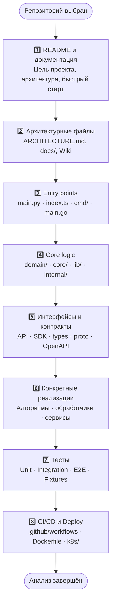
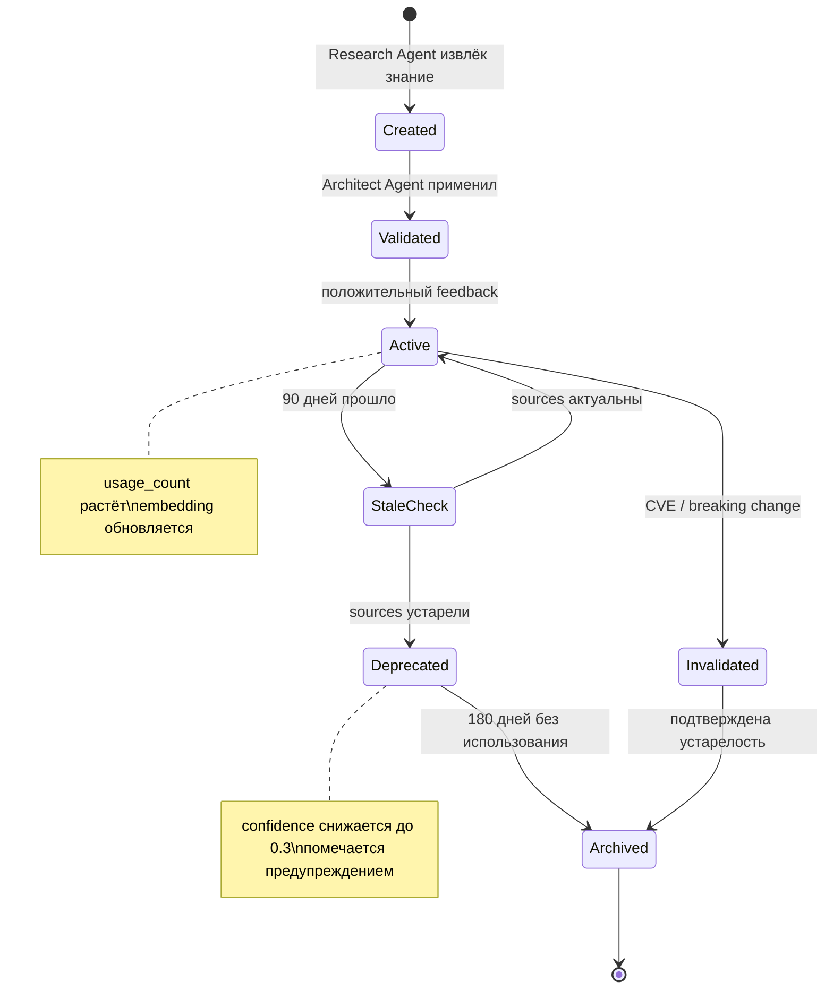

# Протокол предварительного исследования репозиториев (Repository Research Protocol)

> Обязательная фаза разведки перед написанием любого кода. Агент-Исследователь изучает мировой опыт, анализирует лучшие реализации и формирует пакет знаний для архитектора и разработчика.

---

## Содержание

- [Обзор и обоснование](#обзор-и-обоснование)
- [Стратегии поисковых запросов](#стратегии-поисковых-запросов)
- [Анализ найденных репозиториев](#анализ-найденных-репозиториев)
- [Извлечение best practices](#извлечение-best-practices)
- [Анализ issues и discussions](#анализ-issues-и-discussions)
- [Поиск академических и технических ресурсов](#поиск-академических-и-технических-ресурсов)
- [Синтез знаний (Knowledge Synthesis)](#синтез-знаний-knowledge-synthesis)
- [Полный пример: исследование для «создай мессенджер»](#полный-пример-исследование-для-создай-мессенджер)
- [Метрики качества исследовательской фазы](#метрики-качества-исследовательской-фазы)
- [Персистентная библиотека решений](#персистентная-библиотека-решений)

---

## Обзор и обоснование

### Почему исследование обязательно

Мировая разработка накопила миллионы строк кода, тысячи архитектурных решений и сотни тысяч задокументированных ошибок. **Игнорировать этот опыт — значит заново изобретать велосипед**, платить цену чужих ошибок и упускать нетривиальные оптимизации.

**Принцип "не изобретай велосипед"** применительно к системе:

| Без исследования | С исследованием |
|---|---|
| Проектируем с нуля | Берём проверенную архитектуру как базу |
| Наступаем на известные грабли | Знаем антипаттерны заранее |
| Угадываем edge cases | Читаем issues — edge cases задокументированы |
| Неизвестный объём сложности | Предсказуемая сложность на основе опыта других |
| Риски лицензирования | Заранее выбираем совместимую лицензию |
| Изолированная эко-система | Интеграция с существующими стандартами |

### Критерии запуска исследовательской фазы

| Тип задачи | Исследование | Обоснование |
|---|---|---|
| Создание нового модуля / сервиса | ✅ Обязательно | Могут существовать готовые решения |
| Выбор технологии / библиотеки | ✅ Обязательно | Сравнительный анализ альтернатив |
| Реализация протокола / алгоритма | ✅ Обязательно | RFC, референсные реализации |
| Архитектурное проектирование | ✅ Обязательно | Архитектурные паттерны и ADR |
| Исправление сложного бага | ✅ Рекомендуется | Могут быть известные workaround'ы |
| Добавление мелкой функции | ⚠️ Опционально | Проверить только конкретную техники |
| Рефакторинг существующего кода | ⚠️ Опционально | Изучить паттерны рефакторинга |
| Исправление опечатки / стилей | ❌ Не требуется | Только если затрагивает архитектуру |
| Обновление документации | ❌ Не требуется | — |
| Написание тестов для готового кода | ❌ Не требуется | Только изучить тест-паттерны проекта |

### Роль агента-Исследователя

Агент-Исследователь (Research Agent) — выделенный специалист в рое агентов системы. Он **не пишет код**, он **добывает знания**.

```
Обязанности Research Agent:
  ✓ Поисковые запросы по всем заданным платформам
  ✓ Глубокий анализ топ-N репозиториев
  ✓ Извлечение best practices в структурированный формат
  ✓ Документирование антипаттернов и known issues
  ✓ Формирование Knowledge Package для передачи Архитектору
  ✓ Сохранение результатов в персистентную библиотеку

  ✗ НЕ принимает архитектурных решений
  ✗ НЕ пишет реализацию
  ✗ НЕ делает предположений без источников
```

---

## Стратегии поисковых запросов

### Декомпозиция ТЗ на поисковые термины

Перед поиском агент извлекает ключевые термины из технического задания:

```python
def extract_search_terms(task_spec: str) -> SearchTerms:
    """
    Алгоритм извлечения поисковых терминов из ТЗ.
    
    Шаг 1 — Извлечение сущностей:
      Технические термины: сущности предметной области
      Действия: глаголы (implement, create, build, add)
      Технологии: явно упомянутые стек-компоненты
      Паттерны: архитектурные/дизайн паттерны
    
    Шаг 2 — Расширение синонимами:
      "мессенджер" → ["messenger", "chat app", "im client",
                       "instant messaging", "realtime chat"]
      "аутентификация" → ["auth", "authentication", "login",
                          "identity", "SSO", "oauth", "jwt"]
    
    Шаг 3 — Разбивка на домены:
      Каждый аспект задачи → отдельный поисковый домен
    
    Шаг 4 — Генерация поисковых строк:
      domain × platform × filter → search_query
    """
    entities = nlp_extract_entities(task_spec)
    synonyms = expand_with_synonyms(entities)
    domains = cluster_into_domains(synonyms)
    queries = generate_query_matrix(domains)
    return SearchTerms(
        primary_terms=entities,
        expanded_terms=synonyms,
        domains=domains,
        query_matrix=queries
    )
```

**Пример декомпозиции** для задачи «создать систему аутентификации с JWT и refresh-токенами»:

```
Домен 1 — Authentication:
  Запросы: "jwt authentication library", "refresh token rotation",
           "access token refresh implementation", "token blacklist redis"

Домен 2 — Security patterns:
  Запросы: "jwt security best practices", "token storage security",
           "OWASP authentication cheat sheet", "httpOnly cookie jwt"

Домен 3 — Reference implementations:
  Запросы: "jwt auth nodejs open source github",
           "authentication service golang stars:>500",
           "passport.js alternatives"
```

---

### Операторы поиска GitHub

GitHub Search позволяет точно фильтровать репозитории. Ключевые операторы:

| Оператор | Синтаксис | Пример | Назначение |
|---|---|---|---|
| `language:` | `language:go` | `chat server language:go` | Фильтр по языку |
| `stars:>` | `stars:>N` | `stars:>1000` | Минимум звёзд |
| `stars:N..M` | `stars:100..500` | Диапазон звёзд | |
| `forks:>` | `forks:>N` | `forks:>200` | Активно форкаемые |
| `topic:` | `topic:chat` | `topic:websocket` | По теме репозитория |
| `pushed:>` | `pushed:>YYYY-MM-DD` | `pushed:>2024-01-01` | Активно поддерживаемые |
| `license:` | `license:mit` | `license:apache-2.0` | Совместимая лицензия |
| `filename:` | `filename:docker-compose.yml` | Поиск репозиториев с этим файлом | |
| `path:` | `path:src/auth` | Код в конкретной директории | |
| `org:` | `org:facebook` | Репозитории конкретной организации | |
| `is:` | `is:public` | Только публичные | |
| `size:` | `size:>5000` | Размер > 5 MB (нетривиальные проекты) | |
| `archived:false` | `archived:false` | Исключить архивные проекты | |

**Составные запросы:**

```
# Крупные open-source мессенджеры на Go, обновлённые в 2024+
messenger server language:go stars:>500 pushed:>2024-01-01 archived:false

# JWT middleware для Node.js с MIT-лицензией
jwt middleware language:javascript license:mit stars:>200

# Масштабируемые WebSocket серверы
websocket server topic:realtime stars:>1000 pushed:>2023-01-01

# Реализации Signal Protocol
signal-protocol encryption end-to-end stars:>100 language:typescript
```

---

### Поисковые платформы

| Платформа | API | Rate Limits | Стратегия поиска |
|---|---|---|---|
| **GitHub** | REST v3 / GraphQL v4 | 30 req/min (auth), 10 (anon) | Основная. Операторы фильтрации, сортировка по stars |
| **GitLab** | REST v4 | 2000 req/min (auth) | Бэкап GitHub. Часто содержит enterprise-решения |
| **Bitbucket** | REST v2 | 1000 req/h | Для корпоративного Java/Python кода |
| **SourceForge** | REST API | Нет публичного лимита | Легаси проекты, зрелые C/C++ реализации |
| **Codeberg** | Gitea API | 50 req/min | Open-source сообщество, FOSS проекты |
| **npm registry** | registry.npmjs.org | Без лимитов | JavaScript пакеты. Поиск по ключевым словам |
| **PyPI** | pypi.org/pypi | Без лимитов | Python пакеты. `search?q=` endpoint |
| **crates.io** | crates.io/api/v1 | 1 req/s | Rust пакеты |
| **pkg.go.dev** | Поиск через браузер | — | Go модули, поиск по пути импорта |
| **Awesome lists** | GitHub (awesome-*) | — | Курируемые списки лучших инструментов |

**Стратегия параллельного поиска:**

```
Агент запускает одновременно:
  Thread 1: GitHub поиск по основному запросу
  Thread 2: GitHub поиск по синонимам
  Thread 3: npm/PyPI/crates.io по релевантным пакетам
  Thread 4: Поиск awesome-lists (awesome-nodejs, awesome-go и т.д.)
  Thread 5: Поиск референсных реализаций (Signal, Matrix и т.п.)

Таймаут: 30 секунд на каждый поток
Результаты объединяются и дедуплицируются по URL
```

---

### Ранжирование результатов

```python
def rank_repositories(results: list[Repo]) -> list[RankedRepo]:
    """
    Функция скоринга для оценки релевантности репозитория.
    Итоговый score: от 0.0 до 1.0
    """
    for repo in results:
        score = 0.0
        
        # 1. Популярность (25%)
        star_score = min(repo.stars / 10_000, 1.0)        # cap at 10k stars
        fork_score = min(repo.forks / 2_000, 1.0)         # cap at 2k forks
        score += 0.15 * star_score + 0.10 * fork_score
        
        # 2. Активность (20%)
        days_since_update = (now - repo.pushed_at).days
        recency_score = max(0, 1 - days_since_update / 365) # 0 если > 1 года
        score += 0.20 * recency_score
        
        # 3. Качество кода (20%)
        has_tests = repo.has_directory("tests") or repo.has_directory("__tests__")
        has_ci = repo.has_file(".github/workflows") or repo.has_file(".travis.yml")
        has_coverage_badge = "coverage" in repo.readme.lower()
        code_quality = (has_tests + has_ci + has_coverage_badge) / 3
        score += 0.20 * code_quality
        
        # 4. Документация (15%)
        readme_length = len(repo.readme) / 10_000     # cap at 10k chars
        has_docs_dir = repo.has_directory("docs")
        has_changelog = repo.has_file("CHANGELOG.md")
        doc_score = min(readme_length, 1.0) * 0.5 + (has_docs_dir + has_changelog) / 2 * 0.5
        score += 0.15 * doc_score
        
        # 5. Лицензия (10%)
        preferred_licenses = ["mit", "apache-2.0", "bsd-2-clause", "bsd-3-clause"]
        license_score = 1.0 if repo.license in preferred_licenses else 0.3
        score += 0.10 * license_score
        
        # 6. Health metrics (10%)
        issues_ratio = repo.open_issues / max(repo.closed_issues, 1)
        health_score = max(0, 1 - issues_ratio / 5)   # плохо если > 5x open/closed
        contributors_score = min(repo.contributors / 50, 1.0)
        score += 0.10 * (health_score * 0.6 + contributors_score * 0.4)
        
        repo.score = score
    
    return sorted(results, key=lambda r: r.score, reverse=True)
```

---

## Анализ найденных репозиториев

### Методология чтения кода (от общего к частному)

Агент читает репозиторий в строго определённой последовательности:



**Что извлекается на каждом шаге:**

| Шаг | Читаем | Извлекаем |
|---|---|---|
| 1. README | Весь текст | Цель, ограничения, известные проблемы, roadmap |
| 2. Архитектура | ARCHITECTURE.md, docs/ | Архитектурные решения, ADR, диаграммы |
| 3. Entry points | main.\*, index.\*, cmd/ | Точки входа, DI-контейнер, конфигурация |
| 4. Core logic | domain/, core/, lib/ | Доменные модели, ключевые алгоритмы |
| 5. Интерфейсы | API, types, .proto | Контракты, схемы, форматы данных |
| 6. Реализации | services/, handlers/ | Конкретные паттерны, оптимизации |
| 7. Тесты | tests/, __tests__/, spec/ | Edge cases, expected behavior, сценарии |
| 8. CI/CD | .github/, Dockerfile | Деплой-стратегии, quality gates |

---

### Метрики качества репозитория

| Категория | Метрика | Хорошо | Плохо |
|---|---|---|---|
| **Активность сообщества** | Stars | > 500 | < 50 |
| | Contributors | > 10 | 1 (покинут автором) |
| | Last commit | < 6 месяцев | > 2 лет |
| | Open/Closed issues ratio | < 0.3 | > 2.0 |
| **Документация** | README длина | > 3000 символов | < 500 символов |
| | docs/ директория | Есть | Отсутствует |
| | CHANGELOG.md | Есть | Отсутствует |
| **Качество кода** | Тестовое покрытие | > 70% | < 20% |
| | CI/CD pipeline | Есть | Отсутствует |
| | Linting config | Есть | Отсутствует |
| **Архитектурная зрелость** | Разделение слоёв | Явное | Смешанное |
| | Dependency injection | Используется | Жёсткие зависимости |
| | Error handling | Типизировано | Raw `throw Error()` |
| **Лицензия** | Совместимость | MIT, Apache-2, BSD | GPL (осторожно), проприетарная |

---

### Автоматический анализ

```bash
# Статистика кода (cloc — Count Lines of Code)
cloc --json --exclude-dir=node_modules,vendor,dist .
# → JSON с breakdown по языкам, строкам кода, комментариям

# Аудит зависимостей
npm audit --json               # JavaScript
pip-audit --format=json        # Python
cargo audit --json             # Rust
govulncheck ./...              # Go

# Проверка лицензий зависимостей
license-checker --json         # npm
pip-licenses --format=json     # Python

# Статический анализ безопасности
semgrep --config=auto --json . # Полиязычный SAST
```

---

## Извлечение best practices

Агент фиксирует проверенные решения в структурированный формат:

### Формат BestPractice

```json
{
  "id": "bp_001",
  "source_repo": {
    "url": "https://github.com/matrix-org/synapse",
    "stars": 11800,
    "last_commit": "2026-03-28",
    "license": "Apache-2.0"
  },
  "module": "federation",
  "pattern_name": "Server-to-Server Federation via signed JSON",
  "description": "Серверы обмениваются событиями через подписанные JSON-объекты. Каждое событие содержит цифровую подпись server_name + key_id. Получатель верифицирует подпись через публичный ключ, полученный из /.well-known/matrix/server.",
  "code_snippet": "# synapse/crypto/event_signing.py\ndef add_hashes_and_signatures(event_dict, server_name, signing_key):\n    event_dict['hashes'] = compute_content_hash(event_dict)\n    sign_json(event_dict, server_name, signing_key)\n    return event_dict",
  "file_reference": "synapse/crypto/event_signing.py:42-58",
  "applicability_score": 0.85,
  "tags": ["federation", "signing", "security", "matrix-protocol"],
  "applicable_when": "Когда необходима децентрализация и federation между серверами",
  "caveats": "Требует PKI-инфраструктуры. Ключи нужно ротировать.",
  "extracted_at": "2026-03-31T09:00:00Z"
}
```

### Категории паттернов для извлечения

```
✓ Проверенные решения — работающие алгоритмы с production-опытом
✓ Нетривиальные оптимизации — не очевидные техники ускорения
✓ Подходы к edge cases — как решают граничные ситуации
✓ Конфигурационные паттерны — гибкая конфигурация через env/файлы
✓ Error handling стратегии — типизированные ошибки, retry logic
✓ Deployment стратегии — canary, blue-green, rolling release
✓ Масштабируемость — шардирование, партиционирование, кэширование
✓ Тестовые паттерны — что и как тестируют в проекте
```

---

## Анализ issues и discussions

Issues и PR — это документация **того, что пошло не так**. Это золотой источник знания об ограничениях.

### Что читать

| Тип | Где искать | Что извлекать |
|---|---|---|
| **Открытые issues** | GitHub Issues (open) | Текущие нерешённые проблемы, WIP |
| **Закрытые issues** | GitHub Issues (closed) | Решённые проблемы и их решения |
| **PR с описанием** | Pull Requests | Контекст изменений, обсуждение trade-offs |
| **Review comments** | PR reviews | Экспертное мнение, «почему не так» |
| **Discussions** | GitHub Discussions | Архитектурные дискуссии, FAQ |
| **Wiki** | Repository Wiki | Глубокая документация, миграционные гайды |
| **Release notes** | CHANGELOG, Releases | Что ломалось, breaking changes |

### Поисковые запросы в issues

```
# Известные проблемы производительности
label:performance type:issue

# Ошибки при масштабировании
"memory leak" OR "high cpu" OR "performance degradation"

# Вопросы о лимитах
"max connections" OR "rate limit" OR "scalability"

# Breaking changes
label:breaking-change

# Вопросы безопасности
label:security

# Вопросы от новых пользователей (часто отражают неочевидные ограничения)
label:question is:closed
```

### Формат KnownIssue

```json
{
  "id": "ki_001",
  "repo": "https://github.com/mattermost/mattermost",
  "issue_id": 18924,
  "issue_url": "https://github.com/mattermost/mattermost/issues/18924",
  "category": "performance",
  "description": "При более 10,000 пользователей в канале WebSocket push-рассылка вызывает CPU spike до 100%. Корень: broadcast loop в O(n) без батчинга.",
  "workaround": "Включить experimental.UseExperimentalGossip в config.json. Это переключает на gossip-протокол вместо fan-out.",
  "fix_version": "v7.8.0",
  "severity": "HIGH",
  "tags": ["websocket", "scalability", "broadcast", "performance"],
  "extracted_at": "2026-03-31T09:00:00Z"
}
```

### Антипаттерны на основе issues

```
Антипаттерн: Синхронный broadcast в WebSocket handler
  Источник: Mattermost issue #18924, Rocket.Chat issue #27481
  Проблема: O(n) операций в hot path → CPU explostion при > 5k подключений
  Правильно: Async queue + batch broadcast через pub/sub (Redis)

Антипаттерн: Хранение сессий в памяти сервера
  Источник: множество issues об "потере сессий после рестарта"
  Проблема: Horizontal scaling невозможен, сессии теряются
  Правильно: Redis/Memcached для сессий, stateless JWT

Антипаттерн: Не ротировать refresh-токены
  Источник: CVE-2023-XXXX в различных auth библиотеках
  Проблема: Компрометация refresh-токена → бессрочный доступ
  Правильно: Refresh token rotation + token family detection
```

---

## Поиск академических и технических ресурсов

### Таблица ресурсов

| Тип ресурса | Когда использовать | Приоритет | Формат извлечения |
|---|---|---|---|
| **Официальная документация** (MDN, docs.python.org, rust-lang.org) | Всегда для языков и стандартных библиотек | ⭐⭐⭐⭐⭐ | Ссылка + ключевые положения |
| **RFC-спецификации** (tools.ietf.org, w3.org) | При реализации протоколов (HTTP, WebSocket, OAuth, QUIC) | ⭐⭐⭐⭐⭐ | Номер RFC + конкретные секции |
| **Engineering blogs** (FAANG и стартапы) | При проектировании на масштаб | ⭐⭐⭐⭐ | Ссылка + ключевые архитектурные решения |
| **Stack Overflow** | Конкретные технические вопросы | ⭐⭐⭐ | Ссылка на ответ с > 100 голосами |
| **arXiv / Google Scholar** | Алгоритмы, ML/AI задачи, distributed systems | ⭐⭐⭐⭐ | DOI/arXiv ID + Abstract + применимость |
| **Reddit** (r/programming, r/softwarearchitecture) | Мнения практиков, сравнения инструментов | ⭐⭐ | Только посты с > 200 upvotes |
| **Hacker News** | Обсуждения технологий, анонс новых инструментов | ⭐⭐ | Только треды с > 100 комментариев |
| **OWASP** | Безопасность, уязвимости | ⭐⭐⭐⭐⭐ | Конкретная страница Cheat Sheet |
| **Книги** (O'Reilly, Apress) | Глубокая теория, проверенные временем паттерны | ⭐⭐⭐⭐ | ISBN + глава + страница |

### Ключевые источники по доменам

```
Real-time messaging:
  RFC 6455 — WebSocket Protocol
  RFC 7519 — JSON Web Token (JWT)
  Matrix Specification (spec.matrix.org)
  Signal Technical Overview (signal.org/docs)
  XMPP Core RFC 6120

Cryptography / E2EE:
  Signal Protocol (signal.org/docs/specifications)
  Double Ratchet Algorithm (signal.org/docs/specifications/doubleratchet)
  NIST publications (csrc.nist.gov)
  RFC 8446 — TLS 1.3

Distributed Systems:
  Designing Data-Intensive Applications (Kleppmann) — ISBN 978-1-4920-3205-1
  CAP Theorem original paper (Brewer, 2000)
  RAFT consensus algorithm (raft.github.io)
  Google's "Site Reliability Engineering" book (landing.google.com/sre)

Engineering blogs:
  discord.com/blog — масштабирование до 100млн пользователей
  engineering.fb.com — WhatsApp, Messenger архитектура
  slack.engineering — масштабирование Slack
  dropbox.tech — файловое хранение и синхронизация
  netflix.techblog.com — streaming и reliability
```

---

## Синтез знаний (Knowledge Synthesis)

### Матрица сравнения подходов

Агент формирует таблицу для финального выбора:

| Подход | Pros | Cons | Scalability | Complexity | Community | License |
|---|---|---|---|---|---|---|
| **Вариант A** | + | — | High/Med/Low | Low/Med/High | Active/Declining | MIT/GPL/… |
| **Вариант B** | + | — | | | | |
| **Вариант C** | + | — | | | | |

*Пример для протокола real-time messaging:*

| Подход | Pros | Cons | Scalability | Complexity | Community | License |
|---|---|---|---|---|---|---|
| **WebSocket + Redis Pub/Sub** | Нативен для браузеров, низкая задержка, просто | Нет автоматического failover | High (горизонтальное) | Medium | Огромное | MIT |
| **Matrix Protocol** | Federation, E2EE стандарт, открытый | Высокий overhead, сложная инфра | Medium | Very High | Growing | Apache-2.0 |
| **XMPP** | Стандарт с 2000 года, расширяем | Устаревший дизайн, XML overhead | Medium | High | Declining | Varies |
| **Server-Sent Events** | Браузерная нативность, прост | Только server→client | Medium | Low | Large | — |
| **gRPC Streaming** | Типизация, двунаправленность, serde | Нет браузерной поддержки без proxy | High | Medium | Large | Apache-2.0 |

---

### Формат Knowledge Package

```json
{
  "$schema": "https://your-ai-companion/schemas/knowledge-package.v1.json",
  "package_id": "kp_messenger_2026_03_31",
  "task_id": "task_001_create_messenger",
  "research_date": "2026-03-31T09:00:00Z",
  "researcher_agent": "research-agent-001",
  "confidence_level": 0.87,

  "search_queries": [
    {
      "platform": "github",
      "query": "messenger open source stars:>1000 pushed:>2024-01-01",
      "results_count": 47,
      "top_result": "https://github.com/mattermost/mattermost"
    }
  ],

  "repositories_analyzed": [
    {
      "url": "https://github.com/mattermost/mattermost",
      "stars": 28000,
      "score": 0.94,
      "analysis_depth": "FULL",
      "key_insights": [
        "Использует WebSocket + Redis для real-time",
        "PostgreSQL как основная БД, Elasticsearch для поиска",
        "Горизонтальное масштабирование через load balancer"
      ]
    }
  ],

  "best_practices": [
    { "$ref": "#/bp_001" }
  ],

  "known_issues": [
    { "$ref": "#/ki_001" }
  ],

  "technology_recommendations": [
    {
      "component": "Real-time транспорт",
      "recommendation": "WebSocket (ws библиотека) + Redis Pub/Sub для broadcast",
      "rationale": "Используется в Mattermost, Rocket.Chat, Zulip. Простота горизонтального масштабирования.",
      "alternatives": ["Socket.IO (overhead)", "Server-Sent Events (только server→client)"],
      "sources": ["mattermost/mattermost", "RocketChat/Rocket.Chat", "RFC 6455"]
    },
    {
      "component": "Хранение сообщений",
      "recommendation": "PostgreSQL с партиционированием по времени",
      "rationale": "Discord использует Cassandra (>100млн пользователей). При < 10млн — PostgreSQL достаточен и проще.",
      "alternatives": ["MongoDB (риск eventual consistency)", "Cassandra (высокая operational сложность)"],
      "sources": ["discord.com/blog/how-discord-stores-billions-of-messages", "Mattermost docs"]
    }
  ],

  "risk_assessment": [
    {
      "risk": "WebSocket соединения не масштабируются вертикально",
      "likelihood": "HIGH",
      "impact": "CRITICAL",
      "mitigation": "Sticky sessions или Redis Adapter для сессий, горизонтальное масштабирование от >5k онлайн"
    },
    {
      "risk": "N+1 проблема при загрузке истории сообщений",
      "likelihood": "MEDIUM",
      "impact": "HIGH",
      "mitigation": "Cursor-based пагинация, индексы на (channel_id, created_at DESC)"
    }
  ],

  "antipatterns": [
    {
      "name": "Синхронный fan-out в WebSocket handler",
      "description": "Итерация по всем подключённым клиентам в O(n) внутри обработчика сообщения",
      "source": "Mattermost issue #18924",
      "correct_approach": "Async queue + Redis Pub/Sub broadcast"
    }
  ],

  "suggested_architecture": {
    "summary": "WebSocket Gateway → Redis Pub/Sub → Message Service → PostgreSQL",
    "components": ["ws-gateway", "message-service", "notification-service", "media-service"],
    "hand_off_to": "architect-agent"
  }
}
```

---

## Полный пример: исследование для «создай мессенджер»

### Шаг 1 — Декомпозиция запроса на поисковые домены

```
Входящий запрос: "создать мессенджер"

Декомпозиция:
  Домен 1: Real-time messaging transport
    → WebSocket, SSE, long polling, gRPC streaming

  Домен 2: Message persistence & storage
    → Chat history, message ordering, attachments

  Домен 3: End-to-end encryption (E2EE)
    → Signal Protocol, Double Ratchet, key exchange

  Домен 4: Presence system
    → Online/offline status, typing indicators

  Домен 5: Media handling
    → Image/video upload, thumbnails, CDN

  Домен 6: Push notifications
    → FCM, APNs, WebPush

  Домен 7: Scalable architecture
    → Horizontal scaling, federation, microservices

  Домен 8: Reference implementations
    → Matrix, Signal, Telegram, WhatsApp
```

### Шаг 2 — Параллельные поисковые запросы

```
GitHub Search (выполняется параллельно):

  Query 1: messenger open source github stars:>1000 pushed:>2024-01-01
  Query 2: chat application websocket golang stars:>500 archived:false
  Query 3: scalable messaging architecture language:typescript stars:>300
  Query 4: XMPP Matrix Signal protocol implementation open source
  Query 5: end-to-end encryption chat e2ee stars:>200 pushed:>2023-01-01
  Query 6: topic:messaging topic:realtime stars:>500

Registries (параллельно):
  npm: "websocket chat server" sortBy=popularity
  PyPI: "messaging server" realtime
  crates.io: "chat" "websocket"

Awesome lists:
  awesome-websockets, awesome-nodejs, awesome-realtime,
  awesome-selfhosted (communications section)
```

### Шаг 3 — Обнаруженные репозитории

| Репозиторий | Stars | Score | Технологии | Ключевой вклад |
|---|---|---|---|---|
| [mattermost/mattermost](https://github.com/mattermost/mattermost) | 28k | 0.94 | Go, React, PostgreSQL, Redis | Горизонтальное масштабирование, enterprise-фичи |
| [RocketChat/Rocket.Chat](https://github.com/RocketChat/Rocket.Chat) | 40k | 0.91 | Node.js, MongoDB, React | Полный feature set, Federation |
| [zulip/zulip](https://github.com/zulip/zulip) | 21k | 0.89 | Python, Django, PostgreSQL | Тредование разговоров, streaming |
| [matrix-org/synapse](https://github.com/matrix-org/synapse) | 12k | 0.87 | Python, PostgreSQL | Federation-протокол, E2EE |
| [signalapp/Signal-Server](https://github.com/signalapp/Signal-Server) | 11k | 0.85 | Java, PostgreSQL, Redis | Double Ratchet, максимальная приватность |
| [ejabberd/ejabberd](https://github.com/processone/ejabberd) | 6k | 0.78 | Erlang, Mnesia/PostgreSQL | XMPP, телеком-надёжность, 20+ лет |

---

### Шаг 4 — Анализ архитектур

#### Как Matrix решает federation

```
Каждый сервер Matrix хранит полную копию каждой room.
Событие отправляется на origin-сервер → рассылается всем room-серверам.
PKI-подписи предотвращают подделку событий.

Применимо для нас: Только если требуется настоящая federation.
Высокая стоимость: двойное/тройное хранение данных.
```

#### Как Signal реализует Double Ratchet

```
X3DH (Extended Triple Diffie-Hellman) при первом контакте.
Double Ratchet для every-message forward secrecy.
Prekey bundle: сервер хранит encrypted prekeys — никогда plaintext.

Применимо для нас: Если требуется E2EE.
Клиентская сложность: ключи хранятся только на устройстве.
```

#### Как Mattermost масштабируется горизонтально

```
Stateless WebSocket Gateway через sticky sessions на LB.
Redis Pub/Sub для broadcast между несколькими инстансами.
PostgreSQL с read replicas для history queries.
Elasticsearch (опционально) для full-text search.

Применимо для нас: Лучший вариант для < 1 млн пользователей.
Отличный баланс сложности и масштабируемости.
```

---

### Шаг 5 — Архитектурный blueprint

На основе проверенных решений формируется blueprint:

```mermaid
graph TB
    Client["📱 Client\n(Web · iOS · Android)"] -->|WebSocket| WSGateway

    subgraph "Messaging Core"
        WSGateway["WebSocket Gateway\n(stateless, N instances)"] -->|publish| RedisPubSub["Redis Pub/Sub\n(broadcast bus)"]
        RedisPubSub -->|subscribe| WSGateway
        WSGateway --> MessageService["Message Service"]
        MessageService --> PostgreSQL[("PostgreSQL\nmessages + channels")]
        MessageService --> MediaService["Media Service"]
        MediaService --> S3[("S3 / MinIO\nmedia files")]
    end

    subgraph "Async"
        MessageService -->|events| Queue["Message Queue\n(BullMQ / NATS)"]
        Queue --> NotifService["Notification Service"]
        NotifService -->|FCM/APNs| Push["Push Notifications"]
    end

    subgraph "Search (optional)"
        MessageService -->|index| Elasticsearch[("Elasticsearch\nfull-text search")]
    end

    style "Messaging Core" fill:#f0f4ff
    style "Async" fill:#fff4f0
    style "Search (optional)" fill:#f0fff4
```

**Источники каждого компонента:**
- WebSocket Gateway → Mattermost pattern (go-websocket)
- Redis Pub/Sub → Mattermost + Rocket.Chat
- PostgreSQL schema → Zulip (лучшая схема для тредов)
- Media upload → следуем Mattermost S3-паттерну
- Push → стандарт FCM/APNs (Signal, Mattermost)

---

### Шаг 6 — Валидация и передача

```
Quality Gate пройден:
  ✅ Изучено 6 репозиториев (минимум: 3 для messaging)
  ✅ Проанализированы issues > 10 релевантных
  ✅ Технологический стек обоснован ссылками
  ✅ Антипаттерны задокументированы
  ✅ Риски оценены
  ✅ Confidence level: 0.87 (порог: 0.70)

Knowledge Package сформирован: kp_messenger_2026_03_31
Передаётся: architect-agent для проектирования
Сохраняется: semantic memory под тегами [messenger, websocket, realtime, e2ee]
```

---

## Метрики качества исследовательской фазы

### Минимальное количество источников по типам задач

| Тип задачи | Min репозиториев | Min issues | Min документации |
|---|---|---|---|
| Новый продукт / система | 5 | 10 | 3 официальных |
| Новый сервис / модуль | 3 | 5 | 1 официальный |
| Новый алгоритм / протокол | 2 + RFC/бумага | 3 | RFC + 1 implementation |
| Выбор библиотеки | 4 (альтернативы) | 3 на каждую | npm/docs для каждой |
| Рефакторинг | 2 | 5 | Coding standards |
| Сложный баг | 1 (смежный) | 10 (поиск по симптомам) | 1 |

### Критерии достаточности (Coverage Score)

```python
def compute_coverage_score(knowledge_package: KnowledgePackage) -> float:
    """
    Coverage Score: от 0.0 до 1.0
    Порог для перехода к архитектурной фазе: > 0.70
    """
    score = 0.0

    # 1. Достаточность источников (25%)
    repos_score = min(len(knowledge_package.repositories_analyzed) / min_repos, 1.0)
    score += 0.25 * repos_score

    # 2. Качество источников (25%)
    avg_repo_score = mean([r.score for r in knowledge_package.repositories_analyzed])
    score += 0.25 * avg_repo_score

    # 3. Наличие best practices (20%)
    bp_score = min(len(knowledge_package.best_practices) / 5, 1.0)
    score += 0.20 * bp_score

    # 4. Задокументированные риски (15%)
    risk_score = min(len(knowledge_package.risk_assessment) / 3, 1.0)
    score += 0.15 * risk_score

    # 5. Технологические рекомендации (15%)
    tech_score = 1.0 if len(knowledge_package.technology_recommendations) > 0 else 0.0
    score += 0.15 * tech_score

    return score
```

### Таймбокс исследования

| Сложность задачи | Таймбокс | % от общего времени |
|---|---|---|
| Simple (1 файл) | 5 минут | 10% |
| Moderate (1 модуль) | 15 минут | 15% |
| Complex (1 сервис) | 45 минут | 20% |
| Architectural (новый продукт) | 2–4 часа | 25–30% |

### Quality Gate: чеклист перед переходом к проектированию

```
ОБЯЗАТЕЛЬНЫЕ (блокирующие):
  □ Coverage Score ≥ 0.70
  □ Минимум N репозиториев проанализировано (по таблице выше)
  □ Хотя бы 1 reference implementation найдена и изучена
  □ Риски подписаны агентом (не пустой список)
  □ Technology recommendation с rationale для каждого компонента
  □ Антипаттерны задокументированы (минимум 2)

РЕКОМЕНДУЕМЫЕ (не блокирующие):
  □ Issues проанализированы (поиск по симптомам)
  □ RFC/стандарт изучен (если задача связана с протоколом)
  □ Академические источники (если нетривиальный алгоритм)
  □ Engineering blog от аналогичного по масштабу проекта
```

### Протокол фиксации знаний

```
После завершения исследования:
  1. Knowledge Package сохраняется в Episodic Memory с TTL=∞
  2. BestPractice записи индексируются в Semantic Memory (pgvector)
  3. KnownIssue записи добавляются в реляционную БД для поиска по тегам
  4. Архитектурный blueprint передаётся Architect Agent

При следующей похожей задаче:
  → Semantic search по Knowledge Package
  → Если найден совпадающий пакет: его confidence — основа
  → Только верифицируется актуальность (commits за последние 6 мес)
```

---

## Персистентная библиотека решений

### Структура хранения

```
Knowledge Library
├── by_technology/
│   ├── websocket/
│   ├── postgresql/
│   ├── redis/
│   └── ...
├── by_pattern/
│   ├── pub-sub/
│   ├── event-sourcing/
│   ├── cqrs/
│   └── ...
├── by_domain/
│   ├── messaging/
│   ├── authentication/
│   ├── media-processing/
│   └── ...
└── antipatterns/
    ├── performance/
    ├── security/
    └── scalability/
```

### Запись в долгосрочную память

```typescript
interface LibraryEntry {
  id: string;                          // UUID v4
  knowledge_package_id: string;        // Ссылка на исходный KP
  entry_type: "best_practice" | "known_issue" | "antipattern" | "blueprint";
  
  title: string;
  description: string;
  
  technology_tags: string[];           // ["websocket", "redis", "pub-sub"]
  pattern_tags: string[];              // ["scalability", "broadcast"]
  domain_tags: string[];               // ["messaging", "realtime"]
  
  code_snippet?: string;               // Пример кода
  sources: string[];                   // URLs источников
  confidence: number;                  // 0.0 – 1.0
  
  embedding: number[];                 // Вектор для semantic search
  
  created_at: string;                  // ISO 8601
  last_validated_at: string;           // Когда была проверена актуальность
  expires_at?: string;                 // Deprecated после этой даты (для быстро меняющихся техн.)
  
  usage_count: number;                 // Сколько раз использовалась запись
  feedback_score?: number;             // Оценка от архитектора/разработчика
}
```

### Поиск по библиотеке

```python
def search_library(query: str, filters: dict = {}) -> list[LibraryEntry]:
    """
    Двухрежимный поиск:
    1. Semantic Search — для концептуальных запросов
       "как масштабировать WebSocket" → pgvector cosine search
    
    2. Keyword/Tag Search — для точных запросов
       technology=["redis", "pub-sub"] → реляционный запрос
    
    3. Hybrid — комбинация обоих
    """
    embedding = embed(query)
    
    semantic_results = vector_store.search(
        embedding=embedding,
        filter={"domain_tags": filters.get("domain")},
        top_k=20
    )
    
    keyword_results = db.query(
        LibraryEntry,
        technology_tags__contains=filters.get("technologies"),
        pattern_tags__contains=filters.get("patterns"),
        expires_at__gt=now()          # только актуальные записи
    )
    
    return rerank(semantic_results, keyword_results, top_k=10)
```

### Обновление и инвалидация

```
Политика инвалидации:

  НЕМЕДЛЕННАЯ инвалидация:
    - Источник помечен как архивный
    - CVE опубликована для описанного подхода
    - Breaking change в major версии библиотеки

  ПРОВЕРКА АКТУАЛЬНОСТИ (каждые 90 дней):
    - Сравниваем last_commit дату источника
    - Проверяем наличие новых issues / deprecation notices
    - Если stars упали > 30% — понижаем confidence

  АВТОМАТИЧЕСКОЕ EXPIRE:
    - Технологии с rapid release cycle (React, Node.js): TTL = 1 год
    - Стабильные технологии (PostgreSQL, Redis): TTL = 3 года
    - Протоколы/RFC: TTL = ∞ (не истекают)
```

### Жизненный цикл записи в библиотеке



---

*Последнее обновление: 2026-03-31 | Версия: 1.0.0 | Статус: ✅ Готово*
