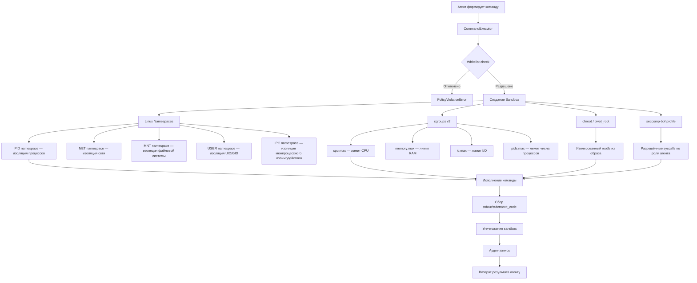
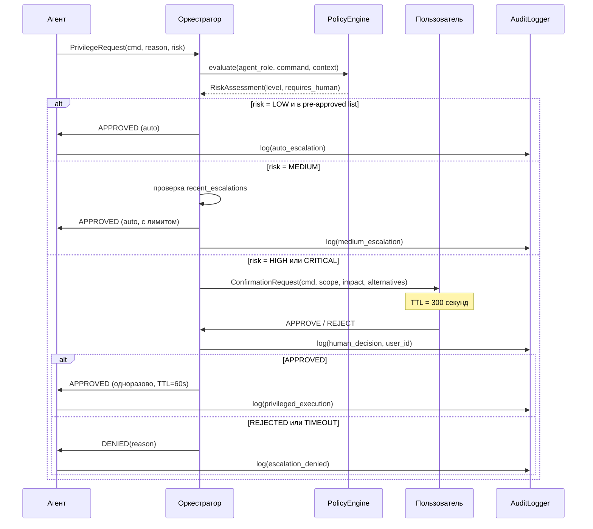

# Терминальные навыки агентов и автономное выполнение команд

> Часть документации [системы-оркестратора мультиагентов](../README.md)

---

## Содержание

1. [Автономное исполнение команд](#1-автономное-исполнение-команд)
2. [Управление зависимостями и окружением](#2-управление-зависимостями-и-окружением)
3. [Операции с файловой системой](#3-операции-с-файловой-системой)
4. [Управление процессами](#4-управление-процессами)
5. [Сетевые операции](#5-сетевые-операции)
6. [Система контроля версий (Git)](#6-система-контроля-версий-git)
7. [CI/CD операции](#7-cicd-операции)
8. [Безопасность терминальных операций](#8-безопасность-терминальных-операций)
9. [Жизненный цикл терминальной сессии](#9-жизненный-цикл-терминальной-сессии)
10. [Управление секретами и ключами](#10-управление-секретами-и-ключами)

---

## 1. Автономное исполнение команд

### 1.1 Принцип автономности

Агенты самостоятельно определяют набор необходимых команд на основании поставленной задачи, формируют очередь исполнения (command queue), и выполняют команды последовательно или параллельно в зависимости от наличия зависимостей между ними.

**Процесс планирования:**
1. Анализ задачи → декомпозиция на shell-операции
2. Граф зависимостей между командами (DAG — направленный ациклический граф)
3. Топологическая сортировка → очередь исполнения
4. Параллельное исполнение независимых веток DAG

### 1.2 Перехват вывода и анализ результатов

Каждая команда исполняется с полным перехватом потоков `stdout` и `stderr`, атомарным получением кода завершения (exit code) и таймаутом.

```
stdout → буфер → парсинг структурированных данных (JSON/YAML/plain text)
stderr → буфер → классификация: warning / error / fatal
exit_code → 0 (success) | 1-255 (failure, с семантикой по диапазонам)
```

На основе exit code агент принимает решение:
- `0` — команда успешна, переход к следующей
- `1` — общая ошибка, анализ stderr, возможен retry
- `2` — неверные аргументы, пересмотр команды
- `126` — нет прав на исполнение, запрос привилегий
- `127` — команда не найдена, установка зависимости
- `130` — прерывание по SIGINT, graceful abort
- `137` — killed по OOM/SIGKILL, пересмотр resource limits

### 1.3 Sandbox-изоляция

Каждая команда исполняется в изолированной песочнице (sandbox) с использованием механизмов ядра Linux.



**Компоненты изоляции:**

| Механизм | Назначение | Конфигурация |
|---|---|---|
| PID namespace | Изоляция дерева процессов | `clone(CLONE_NEWPID)` |
| NET namespace | Изолированный сетевой стек | `clone(CLONE_NEWNET)` + veth pair |
| MNT namespace | Изолированные точки монтирования | `clone(CLONE_NEWNS)` |
| USER namespace | Маппинг UID/GID | uid_map / gid_map |
| cgroups v2 | Лимиты ресурсов | `/sys/fs/cgroup/agents/<id>/` |
| seccomp-bpf | Фильтр системных вызовов | Профиль по роли агента |
| chroot | Изолированный корень ФС | Read-only overlay + tmpfs для write |

### 1.4 Политики разрешений (Permission Policies)

Каждой роли агента соответствует whitelist разрешённых команд. Команды вне whitelist — запрещены по умолчанию (default-deny).

| Роль агента | Разрешённые категории | Запрещено явно |
|---|---|---|
| `code-agent` | git, npm/pip/cargo, файловые операции (чтение/запись в рабочей директории), тесты | rm -rf /, kubectl delete, DROP TABLE |
| `devops-agent` | docker, kubectl, terraform, ansible, systemctl, apt/yum | прямые DB-команды, git push --force |
| `data-agent` | python, jupyter, pandas CLI, psql (SELECT only), файловые операции в /data | DDL-команды, системные операции |
| `test-agent` | тестовые фреймворки (pytest, jest, cargo test), coverage tools, lint | deploy-команды, write outside /workspace |
| `docs-agent` | markdown tools, pandoc, git (read), файловые операции (docs/) | exec, curl с POST, любые системные команды |
| `orchestrator` | все категории с подтверждением | прямой доступ к secrets без vault |

#### Запрос повышенных привилегий

Если агент определяет необходимость команды вне своего whitelist, инициируется workflow повышения привилегий:

```
Агент → [PrivilegeRequest(command, reason, risk_level)]
    → Оркестратор [оценка риска, проверка политики]
        → При HIGH risk: запрос подтверждения пользователя
        → При MEDIUM risk: автоматическое одобрение если в pre-approved list
        → При LOW risk: автоматическое одобрение
    → Временное расширение whitelist на одну операцию
    → Аудит-запись о повышении привилегий
```

### 1.5 Подтверждение деструктивных операций

**Список деструктивных операций (Destructive Operations)**:

| Операция | Категория риска | Протокол |
|---|---|---|
| `rm -rf <path>` | CRITICAL | Human-in-the-loop обязателен |
| `DROP TABLE / DROP DATABASE` | CRITICAL | Human-in-the-loop + dry-run preview |
| `git push --force` / `git push --force-with-lease` | HIGH | Подтверждение + backup ref |
| `kubectl delete namespace` | CRITICAL | Human-in-the-loop |
| `terraform destroy` | CRITICAL | Human-in-the-loop + plan preview |
| `truncate <table>` | HIGH | Подтверждение + COUNT preview |
| `chmod -R 777` | HIGH | Подтверждение + scope check |
| `dd if=/dev/... of=/dev/...` | CRITICAL | Human-in-the-loop |
| `npm publish` / `cargo publish` | HIGH | Подтверждение + версия |
| `docker system prune -a` | HIGH | Подтверждение + список удаляемого |

**Протокол подтверждения (Human-in-the-Loop):**

```
1. Агент формирует DestructiveOperationRequest:
   - операция (полная строка команды)
   - scope (что будет затронуто)
   - reversibility (обратима / необратима)
   - estimated_impact (оценка последствий)
   - alternatives (возможные безопасные альтернативы)

2. Оркестратор создаёт confirmation_token (UUID, TTL=300s)
   и доставляет запрос пользователю

3. Пользователь принимает решение:
   APPROVE → исполнение с аудит-логом
   REJECT  → отмена с записью причины
   TIMEOUT → автоматический REJECT

4. Результат возвращается агенту
```

### 1.6 Аудит-логирование

Каждое исполнение команды порождает аудит-запись в формате JSON:

```json
{
  "audit_id": "550e8400-e29b-41d4-a716-446655440000",
  "timestamp": "2026-03-31T08:52:19.904Z",
  "agent": {
    "id": "agent-code-07",
    "role": "code-agent",
    "session_id": "sess-abc123"
  },
  "sandbox": {
    "id": "sbx-9f1e2d3c",
    "image": "agent-sandbox:v2.1.0",
    "cgroup_path": "/sys/fs/cgroup/agents/sbx-9f1e2d3c"
  },
  "command": {
    "executable": "npm",
    "args": ["install", "--save-dev", "typescript"],
    "cwd": "/workspace/project",
    "env_vars_redacted": ["NPM_TOKEN"]
  },
  "execution": {
    "exit_code": 0,
    "duration_ms": 4823,
    "stdout_bytes": 1024,
    "stderr_bytes": 0,
    "timeout_ms": 60000,
    "was_killed": false
  },
  "resources": {
    "cpu_time_ms": 312,
    "memory_peak_bytes": 52428800,
    "io_read_bytes": 10485760,
    "io_write_bytes": 2097152
  },
  "policy": {
    "whitelist_check": "PASSED",
    "risk_level": "LOW",
    "privilege_escalation": false,
    "destructive_operation": false
  },
  "orchestrator_id": "orch-main-01",
  "task_id": "task-789xyz"
}
```

**Retention Policy:**
- Стандартные операции: 90 дней
- Деструктивные операции: 1 год
- Операции с повышением привилегий: 2 года
- Compliance-критичные операции: 7 лет (SOC2, GDPR, HIPAA)

**Compliance требования:**
- Все записи неизменяемы (append-only) после создания
- Записи подписываются HMAC для обнаружения фальсификации
- Хранение в отдельном, изолированном audit-хранилище
- Полнотекстовый поиск по всем полям
- Экспорт в форматы SIEM-систем (Splunk, ELK, QRadar)

### 1.7 Предотвращение инъекций команд

**Санитизация (Sanitization) входных данных:**

```
Запрещённые конструкции при формировании команд из пользовательского ввода:
  ; — последовательное исполнение
  && — условное исполнение (AND)
  || — условное исполнение (OR)
  | — pipe без whitelist
  > >> — перенаправление вывода без whitelist
  < — перенаправление ввода
  `` — подстановка команды (backtick)
  $() — подстановка команды
  ${} — подстановка переменной из ввода
  \n \r — переносы строк в аргументах
  NUL byte (\x00) — нулевой байт
```

**Параметризованные команды (Parameterized Commands):**

Вместо конкатенации строк — всегда массив аргументов:

```python
# НЕПРАВИЛЬНО — уязвимость инъекции:
os.system(f"git commit -m '{user_message}'")

# ПРАВИЛЬНО — параметризованный вызов:
subprocess.run(
    ["git", "commit", "-m", user_message],
    capture_output=True,
    text=True,
    timeout=30
)
```

### 1.8 Псевдокод CommandExecutor

```typescript
class CommandExecutor {
  private readonly policyEngine: PolicyEngine;
  private readonly sandboxManager: SandboxManager;
  private readonly auditLogger: AuditLogger;
  private readonly secretRedactor: SecretRedactor;

  async execute(request: CommandRequest): Promise<CommandResult> {
    // 1. Санитизация входных данных
    const sanitized = this.sanitizeArgs(request.args);

    // 2. Проверка whitelist политики
    const policyResult = await this.policyEngine.check({
      agent: request.agentContext,
      executable: request.executable,
      args: sanitized,
    });

    if (policyResult.status === 'DENIED') {
      await this.auditLogger.logPolicyViolation(request, policyResult);
      throw new PolicyViolationError(policyResult.reason);
    }

    if (policyResult.requiresEscalation) {
      await this.requestPrivilegeEscalation(request, policyResult);
    }

    // 3. Проверка деструктивности
    if (policyResult.isDestructive) {
      await this.requestHumanConfirmation(request);
    }

    // 4. Создание изолированного sandbox
    const sandbox = await this.sandboxManager.create({
      agentRole: request.agentContext.role,
      resourceLimits: policyResult.resourceLimits,
      networkPolicy: policyResult.networkPolicy,
      filesystemPolicy: policyResult.filesystemPolicy,
    });

    try {
      // 5. Исполнение с таймаутом и перехватом вывода
      const startTime = Date.now();
      const execution = await sandbox.run({
        executable: request.executable,
        args: sanitized,
        cwd: request.cwd,
        env: await this.injectSecrets(request.env, request.agentContext),
        timeout: policyResult.timeoutMs ?? 60_000,
        maxOutputBytes: 10 * 1024 * 1024, // 10MB
      });

      const result: CommandResult = {
        exitCode: execution.exitCode,
        stdout: execution.stdout,
        stderr: execution.stderr,
        durationMs: Date.now() - startTime,
        sandboxId: sandbox.id,
        resourceUsage: await sandbox.getResourceUsage(),
      };

      // 6. Аудит-запись (с редакцией секретов)
      await this.auditLogger.log({
        request: this.secretRedactor.redact(request),
        result,
        policyResult,
        sandbox,
      });

      return result;
    } finally {
      // 7. Уничтожение sandbox в любом случае
      await sandbox.destroy();
    }
  }

  private sanitizeArgs(args: string[]): string[] {
    const INJECTION_PATTERN = /[;&|><`$\x00\n\r]/;
    return args.map(arg => {
      if (INJECTION_PATTERN.test(arg)) {
        throw new InjectionAttemptError(`Опасный аргумент: ${arg}`);
      }
      return arg;
    });
  }

  private async requestPrivilegeEscalation(
    request: CommandRequest,
    policy: PolicyResult
  ): Promise<void> {
    const approval = await this.orchestrator.requestEscalation({
      agentId: request.agentContext.id,
      command: request.executable,
      reason: policy.escalationReason,
      riskLevel: policy.riskLevel,
      ttl: 300_000, // 5 минут
    });

    if (!approval.granted) {
      throw new EscalationDeniedError(approval.reason);
    }
  }
}
```

---

## 2. Управление зависимостями и окружением

### 2.1 Автоматическая установка пакетов

Агент определяет нужный менеджер пакетов (package manager) на основе манифест-файла проекта и исполняет установку:

| Менеджер пакетов | Обнаружение | Установка | Проверка | Откат (Rollback) |
|---|---|---|---|---|
| `npm` | `package.json` | `npm install` | `npm ls` | `npm ci` (из lock-файла) |
| `yarn` | `yarn.lock` | `yarn install` | `yarn check` | `yarn install --frozen-lockfile` |
| `pnpm` | `pnpm-lock.yaml` | `pnpm install` | `pnpm ls` | `pnpm install --frozen-lockfile` |
| `pip` | `requirements.txt` / `pyproject.toml` | `pip install -r requirements.txt` | `pip check` | `pip install -r requirements.txt --no-deps` |
| `poetry` | `pyproject.toml` + `poetry.lock` | `poetry install` | `poetry check` | `poetry install --no-update` |
| `cargo` | `Cargo.toml` | `cargo build` | `cargo check` | `cargo build --locked` |
| `go mod` | `go.mod` | `go mod download` | `go mod verify` | `go mod download -x` |
| `composer` | `composer.json` | `composer install` | `composer validate` | `composer install --no-scripts` |
| `gem` / `bundler` | `Gemfile` | `bundle install` | `bundle check` | `bundle install --frozen` |
| `apt` | ОС: Debian/Ubuntu | `apt-get install -y` | `dpkg -l` | `apt-get remove` |
| `yum` / `dnf` | ОС: RHEL/CentOS | `yum install -y` | `rpm -qa` | `yum remove` |

### 2.2 Управление виртуальными окружениями

**Python (venv / conda / pyenv):**
```bash
# venv — стандартное изолированное окружение
python3 -m venv .venv
source .venv/bin/activate  # Linux/macOS
.\.venv\Scripts\Activate.ps1  # Windows

# conda — Anaconda/Miniconda окружение
conda create -n project-env python=3.11
conda activate project-env

# pyenv — управление версиями Python
pyenv install 3.11.8
pyenv local 3.11.8
```

**Node.js (nvm):**
```bash
nvm install 20.11.0
nvm use 20.11.0
nvm alias default 20.11.0
```

**Java/JVM (sdkman):**
```bash
sdk install java 21.0.2-tem
sdk use java 21.0.2-tem
```

**Ruby (rbenv):**
```bash
rbenv install 3.3.0
rbenv local 3.3.0
```

### 2.3 Управление переменными среды

**Принцип:** Секреты никогда не попадают в код или аргументы командной строки — только через переменные окружения.

```bash
# .env файл (никогда не коммитить в Git!)
# Загрузка через dotenv или аналог
export $(cat .env | grep -v '^#' | xargs)

# Проверка наличия обязательных переменных перед запуском
required_vars=("DATABASE_URL" "API_KEY" "SECRET_KEY")
for var in "${required_vars[@]}"; do
  if [ -z "${!var}" ]; then
    echo "ERROR: Переменная $var не установлена" >&2
    exit 1
  fi
done
```

**Изоляция окружения между агентами:** каждый агент получает свой изолированный env-namespace, секреты инжектируются из vault только на время задачи.

### 2.4 Docker и docker-compose

```bash
# Сборка образа с тегом
docker build --no-cache -t myapp:$(git describe --tags) .

# Управление контейнерами
docker-compose up -d --build
docker-compose ps
docker-compose logs --tail=100 -f service-name
docker-compose down --volumes  # ДЕСТРУКТИВНАЯ операция — требует подтверждения

# Проверка состояния
docker inspect --format='{{.State.Health.Status}}' container-name

# Сети и тома
docker network ls
docker volume ls
docker network inspect bridge
```

---

## 3. Операции с файловой системой

### 3.1 CRUD операции

```bash
# Создание
mkdir -p /path/to/deep/directory
touch file.txt
cp -r source/ destination/

# Чтение
cat file.txt
head -n 50 large-file.log
tail -f /var/log/app.log  # follow режим

# Обновление (атомарная запись — см. 3.5)
# Удаление — ДЕСТРУКТИВНАЯ операция, требует подтверждения
rm -f single-file.txt
rm -rf directory/  # CRITICAL — только с human-in-the-loop
```

### 3.2 Рекурсивный обход дерева проекта (Tree Walking)

```bash
# Встроенный tree (структура)
tree -L 3 --gitignore -I node_modules

# find — мощный обход с фильтрами
find . -type f -name "*.ts" -not -path "*/node_modules/*"
find . -type f -newer reference-file -mmin -60  # изменённые за час
find . -size +10M -type f  # файлы > 10MB

# fd — современная альтернатива find
fd --type f --extension ts --exclude node_modules
```

### 3.3 Поиск по содержимому

```bash
# grep — классический поиск
grep -rn "TODO\|FIXME" --include="*.ts" src/

# ripgrep (rg) — быстрый поиск, учитывает .gitignore
rg "pattern" --type ts --stats
rg -l "import.*useState"  # только имена файлов

# ag (The Silver Searcher) — быстрый поиск
ag "pattern" --ts

# fd — поиск по именам файлов
fd "config" --type f
```

### 3.4 Мониторинг изменений файловой системы

| Платформа | Механизм | Инструмент | Команда |
|---|---|---|---|
| Linux | inotify | `inotifywait` | `inotifywait -m -r -e modify,create,delete /path` |
| macOS | FSEvents | `fswatch` | `fswatch -r /path` |
| Windows | ReadDirectoryChanges | `Get-FileSystemWatcher` | PowerShell watcher |
| Кросс-платформа | polling | `watchman` | `watchman watch /path` |

### 3.5 Атомарные файловые операции

Для предотвращения повреждения файлов при сбое используется паттерн write-to-temp + rename:

```bash
# Атомарная запись через временный файл
TMPFILE=$(mktemp "${TARGET_FILE}.XXXXXX")
write_content > "$TMPFILE"
sync "$TMPFILE"                    # fsync — гарантия записи на диск
mv "$TMPFILE" "$TARGET_FILE"       # атомарный rename (POSIX-гарантия)
```

```python
import os, tempfile

def atomic_write(path: str, content: bytes) -> None:
    dir_path = os.path.dirname(path)
    with tempfile.NamedTemporaryFile(
        dir=dir_path,
        delete=False,
        mode='wb'
    ) as tmp:
        tmp.write(content)
        tmp.flush()
        os.fsync(tmp.fileno())
        tmp_path = tmp.name
    os.replace(tmp_path, path)  # атомарный rename
```

### 3.6 Управление правами доступа

```bash
# chmod — изменение прав
chmod 755 script.sh      # rwxr-xr-x
chmod 644 config.json    # rw-r--r--
chmod -R 750 directory/  # рекурсивно

# chown — изменение владельца
chown user:group file
chown -R www-data:www-data /var/www/

# ACL (Access Control Lists) — расширенные права
setfacl -m u:developer:rx /shared/project
getfacl /shared/project
```

---

## 4. Управление процессами

### 4.1 Запуск фоновых процессов

```bash
# & — фоновый запуск в текущей сессии
command &
echo "PID: $!"

# nohup — устойчивость к закрытию терминала
nohup command > output.log 2>&1 &

# screen — терминальный мультиплексор
screen -S session-name -dm command
screen -r session-name  # переподключение

# tmux — современный мультиплексор
tmux new-session -d -s session-name -x 220 -y 50
tmux send-keys -t session-name "command" Enter
tmux attach -t session-name
```

### 4.2 Мониторинг состояния процессов

```bash
# ps — список процессов
ps aux | grep "process-name"
ps -eo pid,ppid,cmd,%mem,%cpu --sort=-%cpu | head -20

# Проверка работоспособности (Health Checks)
kill -0 $PID 2>/dev/null && echo "running" || echo "dead"

# lsof — открытые файлы и порты процесса
lsof -p $PID
lsof -i :8080  # кто занимает порт
```

### 4.3 Управление сигналами

| Сигнал | Число | Действие по умолчанию | Применение |
|---|---|---|---|
| `SIGTERM` | 15 | Завершение | Graceful shutdown — запрашивает процесс завершиться |
| `SIGKILL` | 9 | Немедленное убийство | Принудительное завершение (нельзя перехватить) |
| `SIGHUP` | 1 | Завершение | Перезагрузка конфигурации (reload) |
| `SIGUSR1` | 10 | Завершение | Пользовательский сигнал (log rotation, stats dump) |
| `SIGINT` | 2 | Завершение | Ctrl+C — прерывание |
| `SIGQUIT` | 3 | Завершение + core dump | Отладочный дамп |

```bash
# Отправка сигналов
kill -SIGTERM $PID    # graceful stop
kill -SIGHUP $PID     # reload config
kill -9 $PID          # force kill (только крайний случай)

# Ожидание завершения
wait $PID
```

### 4.4 Перезапуск при сбоях

| Инструмент | Платформа | Конфигурация | Применение |
|---|---|---|---|
| `systemd` | Linux (systemd-based) | `/etc/systemd/system/*.service` | Системные сервисы |
| `supervisor` | Linux | `/etc/supervisor/conf.d/*.conf` | Python/любые процессы |
| `PM2` | Node.js | `ecosystem.config.js` | Node.js приложения |
| `Docker restart policy` | Docker | `--restart=unless-stopped` | Контейнеры |

```ini
# supervisor конфигурация
[program:myapp]
command=/usr/bin/python3 /app/main.py
autostart=true
autorestart=true
startretries=3
stderr_logfile=/var/log/myapp.err.log
stdout_logfile=/var/log/myapp.out.log
environment=NODE_ENV="production"
```

### 4.5 Управление портами

```bash
# Проверка занятости порта
lsof -i :8080
ss -tlnp | grep :8080
netstat -tlnp | grep :8080

# Освобождение порта (graceful)
kill -SIGTERM $(lsof -t -i :8080)

# SSH port forwarding (туннелирование)
ssh -L 5432:localhost:5432 user@remote-host  # local forward
ssh -R 8080:localhost:8080 user@remote-host  # remote forward
```

### 4.6 Процедура Graceful Shutdown

```
1. Отправить SIGTERM процессу
2. Ожидать завершения (timeout: 30s)
3. Если не завершился:
   a. Логировать событие timeout
   b. Отправить SIGKILL (принудительно)
4. Проверить PID файл / port availability
5. Вернуть статус завершения оркестратору
```

---

## 5. Сетевые операции

### 5.1 HTTP-запросы через CLI

**curl:**
```bash
# GET запрос
curl -s -o response.json -w "%{http_code}" \
  -H "Authorization: Bearer $TOKEN" \
  https://api.example.com/v1/resource

# POST с JSON телом
curl -s -X POST \
  -H "Content-Type: application/json" \
  -H "Authorization: Bearer $TOKEN" \
  -d '{"key": "value"}' \
  https://api.example.com/v1/resource

# С таймаутом и retry
curl --max-time 30 --retry 3 --retry-delay 5 \
  --retry-on-http-error 503,429 \
  https://api.example.com/endpoint
```

**wget:**
```bash
# Скачать файл
wget -q -O output.tar.gz https://example.com/release.tar.gz

# Рекурсивное скачивание
wget -r -np -nH --cut-dirs=2 https://example.com/docs/
```

**HTTPie:**
```bash
# Читабельный HTTP-клиент
http GET https://api.example.com/users Authorization:"Bearer $TOKEN"
http POST https://api.example.com/users name=Alice role=admin
```

### 5.2 Работа с API через CLI-инструменты

```bash
# GitHub CLI
gh repo create my-project --public
gh pr create --title "feat: add feature" --body "Description"
gh workflow run ci.yml --ref main
gh release create v1.2.0 ./dist/*.tar.gz

# GitLab CLI
glab mr create --title "feat: add feature" --target-branch main
glab pipeline run --branch main

# AWS CLI
aws s3 cp ./dist s3://my-bucket/releases/v1.0/ --recursive
aws ecs update-service --cluster prod --service api --force-new-deployment

# Google Cloud CLI
gcloud run deploy my-service --image gcr.io/project/image:tag
gcloud app deploy app.yaml
```

### 5.3 SSH-операции

```bash
# Подключение
ssh -i ~/.ssh/key.pem user@host
ssh -o StrictHostKeyChecking=no -o ConnectTimeout=10 user@host

# scp — копирование файлов
scp -r local-dir/ user@host:/remote/path/
scp user@host:/remote/file.txt ./local/

# rsync — синхронизация (с прогрессом и resume)
rsync -avz --progress --partial \
  -e "ssh -i ~/.ssh/key.pem" \
  local-dir/ user@host:/remote/path/

# SSH туннель
ssh -f -N -L 5432:db-host:5432 bastion-user@bastion-host
```

### 5.4 Проверка сетевой доступности

```bash
# ping — базовая доступность
ping -c 4 -W 2 host

# traceroute — маршрут пакетов
traceroute host
mtr --report host  # современный аналог

# DNS
nslookup example.com
dig example.com A
dig @8.8.8.8 example.com MX  # через конкретный DNS-сервер

# Проверка TCP-соединения
nc -zv host 443        # netcat — port check
nc -zv -w 5 host 5432  # с таймаутом

# curl для проверки HTTP
curl -Is --max-time 5 https://example.com | head -1
```

### 5.5 Ограничения сетевых операций

**Политика default-deny для исходящих соединений:**
- Агент по умолчанию не имеет исходящего сетевого доступа
- Whitelist разрешённых хостов задаётся в конфигурации роли агента
- Запросы к хостам вне whitelist — блокируются на уровне NET namespace + iptables
- Все разрешённые соединения логируются в аудит

```yaml
# Пример network policy для code-agent
network_policy:
  outbound_whitelist:
    - host: "registry.npmjs.org"
      ports: [443]
    - host: "pypi.org"
      ports: [443]
    - host: "github.com"
      ports: [443, 22]
  inbound: deny_all
  dns: "8.8.8.8"  # или корпоративный резолвер
```

---

## 6. Система контроля версий (Git)

### 6.1 Соглашение об именовании веток

```
Формат: <type>/<task-id>/<short-description>

Типы (type):
  feat/     — новая функциональность
  fix/      — исправление ошибки
  refactor/ — рефакторинг без изменения поведения
  docs/     — документация
  test/     — тесты
  chore/    — вспомогательные задачи (CI, deps)
  hotfix/   — срочное исправление в production

Примеры:
  feat/PROJ-123/user-authentication
  fix/BUG-456/null-pointer-on-login
  docs/PROJ-789/api-reference-update
```

### 6.2 Семантические коммит-сообщения (Conventional Commits)

```
Формат: <type>(<scope>): <subject>

[optional body]

[optional footer(s)]

Типы:
  feat:     — новая функциональность (MINOR в SemVer)
  fix:      — исправление ошибки (PATCH в SemVer)
  refactor: — рефакторинг
  docs:     — документация
  test:     — добавление/изменение тестов
  chore:    — сборка, зависимости, CI
  perf:     — оптимизация производительности
  style:    — форматирование (не логика)
  ci:       — изменения CI конфигурации

BREAKING CHANGE: в footer — MAJOR в SemVer

Примеры:
  feat(auth): add JWT refresh token rotation
  fix(api): handle null response from payment provider
  feat!: remove deprecated v1 API endpoints

  BREAKING CHANGE: /api/v1/* endpoints removed, use /api/v2/*
```

### 6.3 Стратегии слияния

| Сценарий | Стратегия | Команда | Обоснование |
|---|---|---|---|
| Feature branch → main | Squash merge | `git merge --squash` | Чистая история, один коммит на фичу |
| Hotfix → main | Fast-forward merge | `git merge --ff-only` | Минимальное воздействие |
| Long-lived branch sync | Rebase | `git rebase main` | Линейная история, нет merge-коммитов |
| Release → main | Regular merge | `git merge --no-ff` | Сохранение release boundary |
| Main → feature (sync) | Rebase | `git rebase origin/main` | Актуализация без паразитных коммитов |

### 6.4 Разрешение конфликтов слияния

**Автоматическое (Three-Way Merge):**
```bash
# Git автоматически разрешает неперекрывающиеся изменения
git merge feature-branch  # если конфликтов нет — автоматически

# Инструмент слияния
git mergetool --tool=vimdiff
```

**Ручное (Escalation):**
```
При наличии конфликтов агент:
1. Идентифицирует конфликтующие файлы: git status
2. Анализирует маркеры конфликта (<<<<<<, =======, >>>>>>>)
3. Оценивает сложность:
   - SIMPLE (форматирование, whitespace) → автоматическое разрешение
   - MEDIUM (логические изменения в разных местах) → попытка автоматического
   - COMPLEX (изменения в одной логической секции) → эскалация к пользователю
4. При эскалации: предоставляет diff обеих версий + рекомендации
```

### 6.5 Управление тегами (SemVer)

```bash
# Создание аннотированного тега
git tag -a v1.2.3 -m "Release v1.2.3: Add user authentication"

# Публикация тега
git push origin v1.2.3
git push origin --tags  # все теги

# Список тегов с фильтром
git tag --list "v1.*" --sort=-version:refname

# Удаление тега (ДЕСТРУКТИВНАЯ операция)
git tag -d v1.2.3
git push origin --delete v1.2.3
```

### 6.6 Взаимодействие с remote

```bash
# Добавление remote
git remote add origin git@github.com:org/repo.git
git remote add upstream git@github.com:upstream/repo.git

# Синхронизация
git fetch --all --prune  # получить все изменения, удалить удалённые ветки
git pull --rebase origin main

# Push
git push origin feature-branch
git push --set-upstream origin feature-branch

# ДЕСТРУКТИВНЫЕ операции (требуют подтверждения):
git push --force-with-lease  # безопасный force push (проверяет remote state)
git push --force             # КРИТИЧНО — только в крайних случаях
```

### 6.7 Псевдокод GitOperator

```typescript
class GitOperator {
  private readonly executor: CommandExecutor;
  private readonly conflictResolver: ConflictResolver;

  async createFeatureBranch(taskId: string, type: string, description: string): Promise<string> {
    const branchName = `${type}/${taskId}/${this.slugify(description)}`;
    await this.executor.execute({ executable: 'git', args: ['checkout', '-b', branchName] });
    await this.executor.execute({ executable: 'git', args: ['push', '--set-upstream', 'origin', branchName] });
    return branchName;
  }

  async commitChanges(files: string[], message: CommitMessage): Promise<string> {
    // Валидация формата Conventional Commits
    this.validateConventionalCommit(message);

    await this.executor.execute({ executable: 'git', args: ['add', ...files] });
    await this.executor.execute({
      executable: 'git',
      args: ['commit', '-m', this.formatCommitMessage(message)]
    });

    const result = await this.executor.execute({
      executable: 'git',
      args: ['rev-parse', 'HEAD']
    });
    return result.stdout.trim(); // SHA коммита
  }

  async mergeBranch(source: string, target: string, strategy: MergeStrategy): Promise<void> {
    await this.executor.execute({ executable: 'git', args: ['checkout', target] });
    await this.executor.execute({ executable: 'git', args: ['pull', 'origin', target] });

    try {
      if (strategy === 'squash') {
        await this.executor.execute({ executable: 'git', args: ['merge', '--squash', source] });
      } else if (strategy === 'rebase') {
        await this.executor.execute({ executable: 'git', args: ['rebase', source] });
      } else {
        await this.executor.execute({ executable: 'git', args: ['merge', '--no-ff', source] });
      }
    } catch (error) {
      if (error instanceof MergeConflictError) {
        await this.conflictResolver.resolve(error.conflicts);
      } else {
        throw error;
      }
    }
  }

  async createPullRequest(params: PRParams): Promise<string> {
    const result = await this.executor.execute({
      executable: 'gh',
      args: [
        'pr', 'create',
        '--title', params.title,
        '--body', params.body,
        '--base', params.base,
        '--head', params.head,
        '--label', params.labels.join(','),
      ]
    });
    return result.stdout.trim(); // URL PR
  }
}
```

---

## 7. CI/CD операции

### 7.1 Триггеринг пайплайнов

**GitHub Actions:**
```bash
# Запуск workflow вручную
gh workflow run ci.yml --ref main \
  --field environment=staging \
  --field version=v1.2.3

# Просмотр статуса
gh run list --workflow=ci.yml --limit 5
gh run watch <run-id>
```

**GitLab CI:**
```bash
# Запуск pipeline через API
glab pipeline run --branch main --variables "DEPLOY_ENV=staging"
glab pipeline status --branch main
```

**Jenkins:**
```bash
# Через Jenkins CLI
java -jar jenkins-cli.jar -s https://jenkins.example.com \
  build my-pipeline-job -p BRANCH=main -w

# Через REST API
curl -X POST \
  "https://jenkins.example.com/job/my-pipeline/build" \
  --user "user:$JENKINS_TOKEN" \
  --data-urlencode json='{"parameter": [{"name":"BRANCH", "value":"main"}]}'
```

### 7.2 Мониторинг статуса сборок

| CI/CD платформа | CLI инструмент | Триггер пайплайна | Статус | Артефакты |
|---|---|---|---|---|
| GitHub Actions | `gh` | `gh workflow run` | `gh run watch` | `gh run download` |
| GitLab CI | `glab` | `glab pipeline run` | `glab pipeline status` | `glab job artifact` |
| Jenkins | `jenkins-cli` / REST | POST `/build` | GET `/lastBuild/api/json` | GET `/artifact/` |
| CircleCI | `circleci` | `circleci pipeline trigger` | `circleci pipeline get` | REST API |
| Tekton | `tkn` | `tkn pipeline start` | `tkn pipelinerun logs` | PVC artifacts |

### 7.3 Стратегии деплоймента

**Blue-Green:**
```bash
# Переключение трафика после успешного деплоя green-среды
aws elbv2 modify-listener --listener-arn $LISTENER_ARN \
  --default-actions Type=forward,TargetGroupArn=$GREEN_TG_ARN

# Откат — немедленно переключиться обратно на blue
aws elbv2 modify-listener --listener-arn $LISTENER_ARN \
  --default-actions Type=forward,TargetGroupArn=$BLUE_TG_ARN
```

**Canary:**
```bash
# 10% трафика на новую версию
kubectl argo rollouts set weight canary-rollout 10
# Анализ метрик → 50% → 100% или rollback
kubectl argo rollouts promote canary-rollout
kubectl argo rollouts abort canary-rollout  # при проблемах
```

**Rolling Update:**
```bash
kubectl rollout status deployment/my-app
kubectl rollout history deployment/my-app
kubectl rollout undo deployment/my-app         # откат на предыдущую версию
kubectl rollout undo deployment/my-app --to-revision=3  # откат на конкретную
```

---

## 8. Безопасность терминальных операций

### 8.1 Whitelist разрешённых команд по ролям

| Категория команд | `code-agent` | `devops-agent` | `data-agent` | `test-agent` | `docs-agent` |
|---|:---:|:---:|:---:|:---:|:---:|
| git (read) | ✅ | ✅ | ✅ | ✅ | ✅ |
| git (write/push) | ✅ | ✅ | ❌ | ❌ | ✅ (docs/) |
| npm/pip/cargo install | ✅ | ✅ | ✅ | ✅ | ❌ |
| docker build/run | ❌ | ✅ | ❌ | ❌ | ❌ |
| kubectl | ❌ | ✅ | ❌ | ❌ | ❌ |
| файловые операции (read) | ✅ | ✅ | ✅ | ✅ | ✅ |
| файловые операции (write) | ✅ (workspace) | ✅ | ✅ (/data) | ✅ (workspace) | ✅ (docs/) |
| rm -rf | ❌ | ⚠️ (с подтверждением) | ❌ | ❌ | ❌ |
| curl/wget | ✅ (whitelist) | ✅ | ✅ | ✅ (whitelist) | ✅ (whitelist) |
| ssh | ❌ | ✅ | ❌ | ❌ | ❌ |
| terraform | ❌ | ✅ | ❌ | ❌ | ❌ |
| системные команды (systemctl, etc.) | ❌ | ✅ | ❌ | ❌ | ❌ |

✅ Разрешено | ❌ Запрещено | ⚠️ С подтверждением

### 8.2 Workflow запроса повышенных привилегий



### 8.3 Linux Capabilities и seccomp-профили

**Минимальный набор capabilities для агентов (least privilege):**

```json
{
  "agent_role": "code-agent",
  "linux_capabilities": {
    "drop_all": true,
    "add": []
  },
  "seccomp_profile": {
    "defaultAction": "SCMP_ACT_ERRNO",
    "syscalls": [
      {
        "names": ["read", "write", "open", "close", "stat", "fstat",
                  "mmap", "mprotect", "munmap", "brk", "rt_sigaction",
                  "rt_sigprocmask", "ioctl", "pipe", "select", "nanosleep",
                  "getpid", "clone", "fork", "execve", "exit", "wait4",
                  "getcwd", "chdir", "rename", "mkdir", "rmdir", "unlink",
                  "readlink", "chmod", "lseek", "getdents64", "socket",
                  "connect", "sendto", "recvfrom", "shutdown", "getpeername"],
        "action": "SCMP_ACT_ALLOW"
      }
    ]
  }
}
```

### 8.4 Regex-паттерны для обнаружения инъекций

```typescript
const INJECTION_PATTERNS: RegExp[] = [
  /[;&|](?!\s*$)/,          // command chaining: ; & |
  /\|\|/,                    // logical OR
  /&&/,                      // logical AND
  /[><]/,                    // redirection
  /`[^`]*`/,                 // backtick substitution
  /\$\([^)]*\)/,             // command substitution $()
  /\$\{[^}]*\}/,             // variable substitution ${}
  /[\x00\r\n]/,              // null byte, newlines
  /\.\.[\/\\]/,              // path traversal ../
  /~[\/\\]/,                 // home directory expansion ~/
];

function detectInjection(input: string): boolean {
  return INJECTION_PATTERNS.some(pattern => pattern.test(input));
}
```

---

## 9. Жизненный цикл терминальной сессии

```mermaid
flowchart TD
    START([Задача получена агентом]) --> INIT

    subgraph INIT["1. Инициализация окружения"]
        I1[Проверка предусловий] --> I2[Загрузка конфигурации роли]
        I2 --> I3[Инициализация аудит-сессии]
        I3 --> I4[Проверка доступности инструментов]
        I4 --> I5{Предусловия выполнены?}
        I5 -->|Нет| ERR1[EnvironmentError → эскалация]
        I5 -->|Да| PLAN
    end

    subgraph PLAN["2. Планирование последовательности команд"]
        P1[Декомпозиция задачи] --> P2[Построение DAG команд]
        P2 --> P3[Топологическая сортировка]
        P3 --> P4[Формирование command queue]
        P4 --> VALIDATE
    end

    subgraph VALIDATE["3. Валидация перед исполнением"]
        V1[Whitelist check для каждой команды] --> V2[Risk assessment]
        V2 --> V3[Проверка sandbox ресурсов]
        V3 --> V4{Требуется подтверждение?}
        V4 -->|Да| V5[Human-in-the-loop или escalation]
        V5 --> V6{Одобрено?}
        V6 -->|Нет| ABORT[Задача отменена]
        V6 -->|Да| EXEC
        V4 -->|Нет| EXEC
    end

    subgraph EXEC["4. Исполнение с мониторингом"]
        E1[Создание sandbox] --> E2[Инъекция секретов в env]
        E2 --> E3[Запуск команды с таймаутом]
        E3 --> E4[Перехват stdout/stderr]
        E4 --> E5[Мониторинг resource usage]
        E5 --> E6{Timeout превышен?}
        E6 -->|Да| E7[SIGTERM → SIGKILL → log]
        E6 -->|Нет| ANALYZE
        E7 --> ANALYZE
    end

    subgraph ANALYZE["5. Анализ результатов"]
        A1[Чтение exit code] --> A2[Парсинг stdout по схеме]
        A2 --> A3[Классификация stderr]
        A3 --> A4[Валидация постусловий команды]
        A4 --> A5{Результат ожидаемый?}
        A5 -->|Да| ADAPT
        A5 -->|Нет| ADAPT
    end

    subgraph ADAPT["6. Адаптация стратегии"]
        AD1{exit_code == 0?}
        AD1 -->|Да| AD2[Next command in queue]
        AD1 -->|Нет| AD3[Классификация ошибки]
        AD3 --> AD4{Recoverable?}
        AD4 -->|retry| AD5[Retry с backoff]
        AD5 --> EXEC
        AD4 -->|skip| AD6[Пропуск команды + warning]
        AD6 --> AD2
        AD4 -->|abort| ABORT2[Abort сессии + rollback]
        AD2 --> AD7{Queue пуста?}
        AD7 -->|Нет| EXEC
        AD7 -->|Да| VERIFY
    end

    subgraph VERIFY["7. Финальная верификация"]
        FV1[Проверка постусловий задачи] --> FV2[Валидация состояния системы]
        FV2 --> FV3[Генерация отчёта о выполнении]
        FV3 --> FV4[Закрытие аудит-сессии]
        FV4 --> FV5{Все постусловия выполнены?}
        FV5 -->|Да| SUCCESS
        FV5 -->|Нет| FAIL[PostConditionFailure → эскалация]
    end

    SUCCESS([✅ Задача завершена успешно])
    ABORT([❌ Задача отменена])
    ABORT2([⚠️ Аварийное завершение + rollback])
    FAIL([🔄 Частичный успех → эскалация])
```



### Детальное описание шагов

#### Шаг 1: Инициализация окружения

| Параметр | Описание |
|---|---|
| **Входы** | Описание задачи, контекст агента, конфигурация роли |
| **Выходы** | Инициализированная сессия, загруженные инструменты |
| **Ошибки** | `EnvironmentError` (инструмент недоступен), `ConfigError` (неверная конфигурация) |
| **Recovery** | Автоматическая установка недостающих инструментов если в whitelist |

#### Шаг 2: Планирование последовательности команд

| Параметр | Описание |
|---|---|
| **Входы** | Декомпозированная задача, текущее состояние системы |
| **Выходы** | Упорядоченная очередь команд с метаданными (зависимости, таймауты) |
| **Ошибки** | `CyclicDependencyError` (цикл в DAG), `DecompositionError` (не удалось разбить) |
| **Recovery** | Упрощение графа, запрос уточнений у оркестратора |

#### Шаг 3: Валидация перед исполнением

| Параметр | Описание |
|---|---|
| **Входы** | Command queue, PolicyEngine конфигурация |
| **Выходы** | Validated queue, токены подтверждения для деструктивных операций |
| **Ошибки** | `PolicyViolationError`, `EscalationDeniedError` |
| **Recovery** | Поиск альтернативных команд в whitelist |

#### Шаг 4: Исполнение с мониторингом

| Параметр | Описание |
|---|---|
| **Входы** | Validated command, sandbox конфигурация, injected secrets |
| **Выходы** | `CommandResult` (stdout, stderr, exit_code, duration, resources) |
| **Ошибки** | `TimeoutError`, `OOMKilledError`, `SandboxError` |
| **Recovery** | Retry с увеличенными resource limits (после согласования) |

#### Шаг 5: Анализ результатов

| Параметр | Описание |
|---|---|
| **Входы** | `CommandResult`, ожидаемые постусловия |
| **Выходы** | Структурированный результат, флаги аномалий |
| **Ошибки** | `ParseError` (неожиданный формат вывода), `PostConditionError` |
| **Recovery** | Переключение на альтернативный парсинг, эскалация |

#### Шаг 6: Адаптация стратегии

| Параметр | Описание |
|---|---|
| **Входы** | `CommandResult`, retry policy, текущий контекст |
| **Выходы** | Решение: `next` / `retry` / `skip` / `abort` |
| **Ошибки** | `MaxRetriesExceeded`, `UnrecoverableError` |
| **Recovery** | Частичный rollback, уведомление оркестратора |

#### Шаг 7: Финальная верификация состояния системы

| Параметр | Описание |
|---|---|
| **Входы** | Постусловия задачи, текущее состояние системы |
| **Выходы** | Отчёт о выполнении, статус задачи |
| **Ошибки** | `PostConditionFailure` (состояние не соответствует ожидаемому) |
| **Recovery** | Rollback последних операций, эскалация к orchestrator |

---

## 10. Управление секретами и ключами

### 10.1 Принципы безопасного хранения

- **Никогда** не хранить секреты в коде, конфигурационных файлах, аргументах командной строки или переменных окружения контейнера в образе
- **Никогда** не коммитить секреты в Git (даже в приватные репозитории)
- **Всегда** injecting секреты в runtime через vault-системы или безопасный env
- **Принцип наименьших привилегий:** каждый агент получает только те секреты, которые нужны для конкретной задачи

### 10.2 Интеграция с Vault-системами

**HashiCorp Vault:**
```bash
# Аутентификация агента через AppRole
vault write auth/approle/login \
  role_id="$VAULT_ROLE_ID" \
  secret_id="$VAULT_SECRET_ID"

# Получение секрета
vault kv get -field=api_key secret/agents/code-agent/github

# Динамические секреты (автоматически ротируются)
vault read database/creds/code-agent-readonly
```

**AWS Secrets Manager:**
```bash
aws secretsmanager get-secret-value \
  --secret-id prod/agents/code-agent/github-token \
  --query SecretString \
  --output text
```

**Azure Key Vault:**
```bash
az keyvault secret show \
  --vault-name agents-keyvault \
  --name github-token \
  --query value -o tsv
```

### 10.3 Инъекция секретов в Runtime

```python
class SecretInjector:
    def __init__(self, vault_client: VaultClient):
        self._vault = vault_client
        self._cache: dict[str, tuple[str, datetime]] = {}

    def inject_secrets(
        self,
        env: dict[str, str],
        required_secrets: list[str],
        agent_context: AgentContext
    ) -> dict[str, str]:
        """
        Получает секреты из vault и добавляет в env.
        Секреты НЕ передаются в аргументах — только в env!
        """
        result_env = dict(env)

        for secret_ref in required_secrets:
            # Получить из Cache или Vault
            value = self._get_with_cache(secret_ref, agent_context)
            env_var_name = self._ref_to_env_name(secret_ref)
            result_env[env_var_name] = value

        return result_env

    def _get_with_cache(self, ref: str, ctx: AgentContext) -> str:
        cached = self._cache.get(f"{ctx.agent_id}:{ref}")
        if cached:
            value, expires_at = cached
            if datetime.utcnow() < expires_at:
                return value

        secret = self._vault.get_secret(
            path=f"agents/{ctx.role}/{ref}",
            role_id=ctx.vault_role_id
        )
        self._cache[f"{ctx.agent_id}:{ref}"] = (
            secret.value,
            datetime.utcnow() + timedelta(seconds=secret.lease_duration - 30)
        )
        return secret.value
```

### 10.4 Ротация ключей

**Протокол автоматической ротации:**

```
1. Scheduler инициирует ротацию по расписанию (или при compromise event)
2. Vault генерирует новый секрет
3. New secret injected в running агентов через live reload (без перезапуска)
4. Старый секрет продолжает работать в grace period (обычно 24h)
5. Verification: тест нового секрета на все зависимые системы
6. Revoke старого секрета после grace period
7. Audit-запись о ротации

Расписания ротации (пример):
  API keys:        каждые 90 дней
  DB passwords:    каждые 30 дней  
  JWT signing key: каждые 7 дней
  TLS сертификаты: за 30 дней до истечения
  SSH keys:        каждые 180 дней
```

### 10.5 Безопасность аудит-логов: Redaction

```typescript
class SecretRedactor {
  private readonly secretPatterns: RegExp[] = [
    /Bearer\s+[A-Za-z0-9\-._~+/]+=*/g,       // Bearer tokens
    /password['":\s]+['"]?([^'"\s,}]+)/gi,    // passwords
    /api[_-]?key['":\s]+['"]?([^'"\s,}]+)/gi, // API keys
    /secret['":\s]+['"]?([^'"\s,}]+)/gi,      // secrets
    /-----BEGIN.*PRIVATE KEY-----[\s\S]+?-----END.*PRIVATE KEY-----/g, // PEM
  ];

  redact(data: unknown): unknown {
    const serialized = JSON.stringify(data);
    let redacted = serialized;

    for (const pattern of this.secretPatterns) {
      redacted = redacted.replace(pattern, (match, captured) => {
        if (captured) {
          return match.replace(captured, '[REDACTED]');
        }
        return '[REDACTED]';
      });
    }

    return JSON.parse(redacted);
  }
}
```

### 10.6 Secure Erasure из памяти

```python
import ctypes
import secrets

class SecureString:
    """Строка с гарантированным безопасным удалением из памяти."""

    def __init__(self, value: str):
        self._buf = bytearray(value.encode('utf-8'))

    def get(self) -> str:
        return self._buf.decode('utf-8')

    def erase(self) -> None:
        """Перезаписать память случайными байтами."""
        random_bytes = secrets.token_bytes(len(self._buf))
        for i in range(len(self._buf)):
            self._buf[i] = random_bytes[i]
        # Принудительный сброс через ctypes для обхода GC оптимизаций
        ctypes.memset(
            (ctypes.c_char * len(self._buf)).from_buffer(self._buf),
            0,
            len(self._buf)
        )

    def __del__(self):
        self.erase()

    def __enter__(self):
        return self

    def __exit__(self, *args):
        self.erase()

# Использование:
with SecureString(vault.get_secret("db-password")) as secret:
    db.connect(password=secret.get())
# После выхода из блока — секрет гарантированно уничтожен
```

---

## Связанные разделы

| Документ | Описание |
|---|---|
| [Архитектура системы](../architecture/README.md) | Общая архитектура мультиагентной системы |
| [Ядро оркестратора](../orchestrator-core/README.md) | Управление задачами и координация агентов |
| [Рой агентов](../agents/README.md) | Роли, специализации и жизненный цикл агентов |
| [Управление контекстом](../context-window/README.md) | Управление контекстными окнами агентов |

---

*Документация системы-оркестратора мультиагентов · Terminal Skills v1.0*
