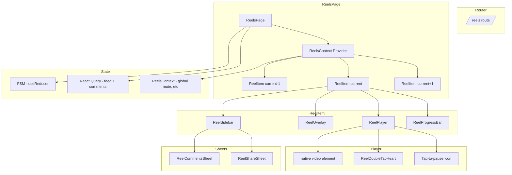
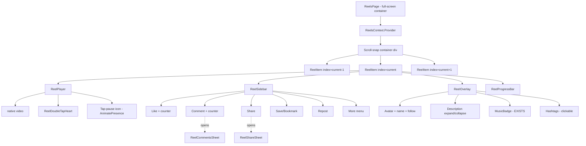
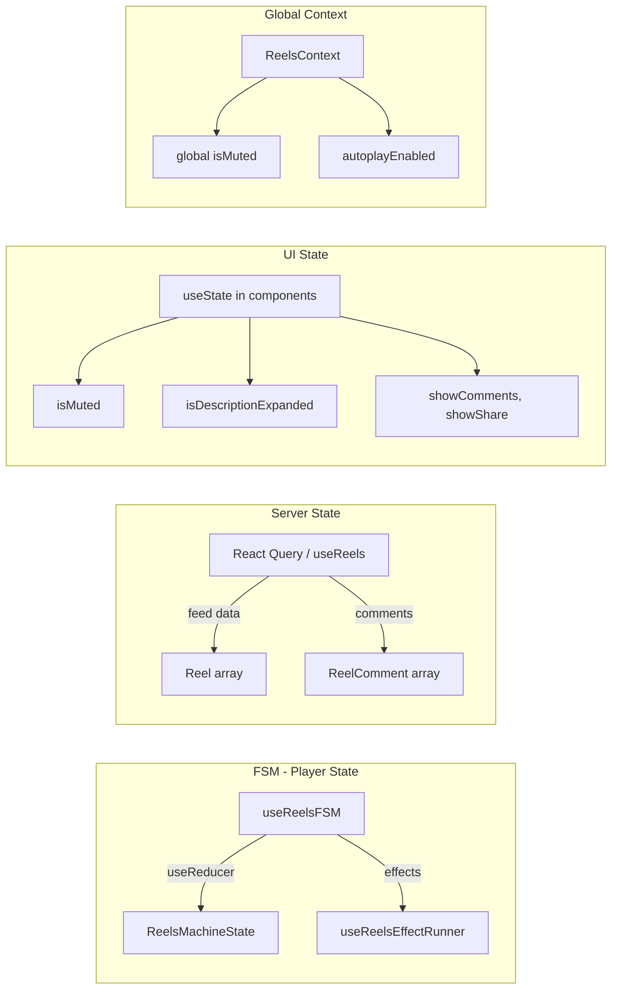
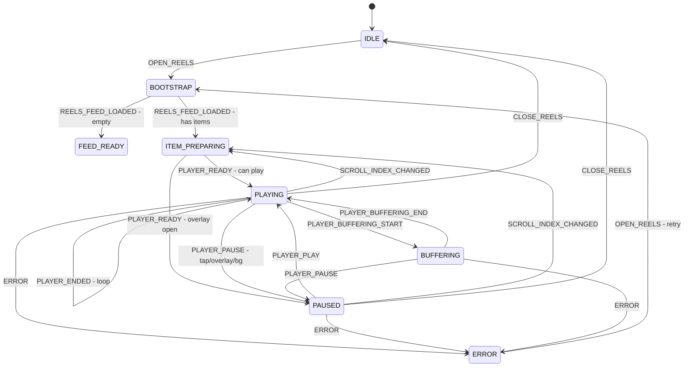
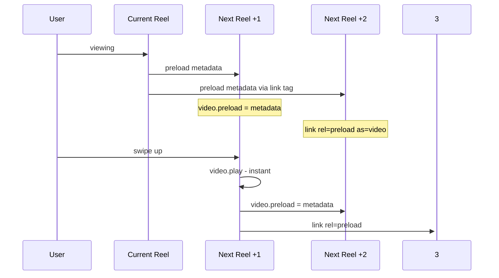
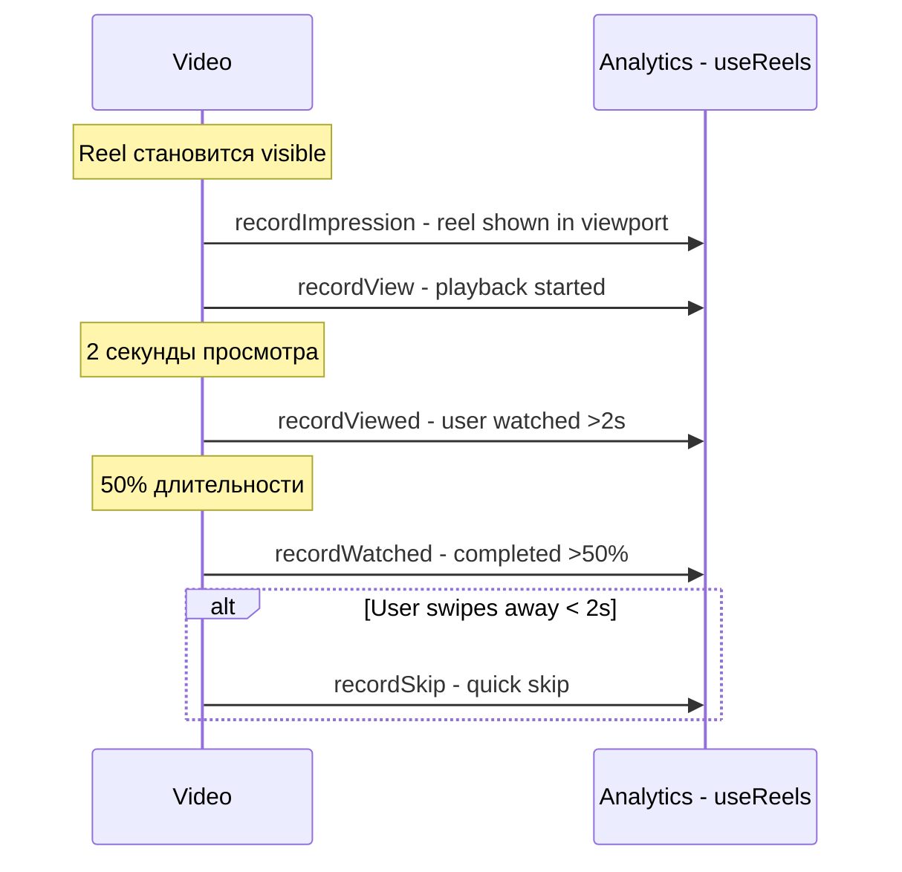

# Reels Module — Frontend Architecture

> **Версия:** 1.0  
> **Дата:** 2026-03-05  
> **Стек:** React 18.3 · TypeScript 5.8 · Vite 5.4 · Tailwind CSS 3.4 · shadcn/ui (Radix) · Framer Motion 12.30 · @tanstack/react-query 5.83 · @supabase/supabase-js 2.90 · react-router-dom 6.30 · lucide-react 0.462  
> **Ориентир:** Instagram Reels + TikTok For You — full-screen вертикальный фид с мгновенным autoplay

---

## Оглавление

1. [Обзор системы](#1-обзор-системы)
2. [Файловая структура](#2-файловая-структура)
3. [Контракты данных — TypeScript интерфейсы](#3-контракты-данных)
4. [Дерево компонентов](#4-дерево-компонентов)
5. [Детальная спецификация компонентов](#5-детальная-спецификация-компонентов)
6. [Управление состоянием](#6-управление-состоянием)
7. [Производительность](#7-производительность)
8. [Анимации — Framer Motion](#8-анимации)
9. [Аналитика просмотров](#9-аналитика-просмотров)
10. [Edge Cases и обработка ошибок](#10-edge-cases)
11. [Роутинг и навигация](#11-роутинг-и-навигация)
12. [Порядок реализации — фазы](#12-порядок-реализации)
13. [Зависимости от бэкенда](#13-зависимости-от-бэкенда)

---

## 1. Обзор системы

### 1.1 Что делаем

Полноценный модуль просмотра Reels — full-screen вертикальный фид с автоплеем, взаимодействиями (лайки, комментарии, шеринг, репост, сохранение), аналитикой просмотров и интеграцией с FSM-машиной состояний плеера.

### 1.2 Что уже существует и используется AS-IS

| Артефакт | Путь | Назначение |
|----------|------|------------|
| `useReels` | `src/hooks/useReels.tsx` | Хук фида: загрузка через `get_reels_feed_v2`, toggle like/save/repost, `recordView`/`recordWatched`/`recordSkip`/`recordImpression`, `createReel` |
| `useReelComments` | `src/hooks/useReelComments.tsx` | CRUD комментариев, лайки комментариев, древовидная структура |
| `useReelGestures` | `src/hooks/useReelGestures.ts` | Touch/pointer обработка: swipe up/down, swipe left, tap, long-press |
| FSM | `src/features/reels/fsm.ts` | 8 состояний, 27 событий, 13 эффектов — **НЕ интегрирован, подключить** |
| `CreateReelSheet` | `src/components/reels/CreateReelSheet.tsx` | UI создания Reel |
| `MusicBadge` | `src/components/feed/MusicBadge.tsx` | Бейдж музыки с анимацией |
| `normalizeReelMediaUrl` | `src/lib/reels/media.ts` | Нормализация URL медиа из storage |
| `Reel` interface | `src/hooks/useReels.tsx:78-108` | Основная модель данных |
| `ReelComment` interface | `src/hooks/useReelComments.tsx:6-22` | Модель комментария |
| `ChatOpenContext` | `src/contexts/ChatOpenContext.tsx` | Контекст для скрытия BottomNav |

### 1.3 Архитектура верхнего уровня



---

## 2. Файловая структура

```
src/
├── pages/
│   └── ReelsPage.tsx                          # Страница-контейнер (route: /reels)
│
├── components/
│   └── reels/
│       ├── CreateReelSheet.tsx                 # 🟢 EXISTS — не трогать
│       ├── ReelItem.tsx                        # Обёртка одного Reel
│       ├── ReelPlayer.tsx                      # Native <video> плеер
│       ├── ReelOverlay.tsx                     # Информация поверх видео
│       ├── ReelSidebar.tsx                     # Кнопки действий справа
│       ├── ReelProgressBar.tsx                 # Прогресс-бар видео
│       ├── ReelDoubleTapHeart.tsx              # Анимация сердца при double-tap
│       ├── ReelCommentsSheet.tsx               # Bottom sheet комментариев
│       ├── ReelShareSheet.tsx                  # Bottom sheet шеринга
│       ├── ReelErrorFallback.tsx               # Экран ошибки
│       └── ReelEmptyFeed.tsx                   # Экран пустого фида
│
├── contexts/
│   └── ReelsContext.tsx                        # Глобальные настройки модуля reels
│
├── features/
│   └── reels/
│       ├── fsm.ts                             # 🟢 EXISTS — FSM машина состояний
│       ├── useReelsFSM.ts                     # NEW — хук-обёртка над FSM + useReducer
│       └── useReelsEffectRunner.ts            # NEW — исполнитель side-effects FSM
│
├── hooks/
│   ├── useReels.tsx                           # 🟢 EXISTS
│   ├── useReelComments.tsx                    # 🟢 EXISTS
│   ├── useReelGestures.ts                     # 🟢 EXISTS
│   ├── usePublish.ts                          # 🟢 EXISTS
│   ├── useUnifiedContentCreator.tsx           # 🟢 EXISTS
│   └── useVideoPreloader.ts                  # NEW — prefetch видео через link preload
│
├── lib/
│   └── reels/
│       ├── media.ts                           # 🟢 EXISTS
│       └── formatters.ts                      # NEW — форматирование счётчиков (1.2K, 3M)
│
└── types/
    └── reels.ts                               # NEW — все TypeScript типы модуля
```

---

## 3. Контракты данных

### 3.1 Основные типы — `src/types/reels.ts`

```typescript
// ─────────────────────────────────────────────
// Re-export существующих типов
// ─────────────────────────────────────────────
export type { Reel, ReelsFeedMode } from '@/hooks/useReels';
export type { ReelComment } from '@/hooks/useReelComments';
export type {
  ReelsStateStatus,
  ReelsItem,
  ReelsContext as ReelsFSMContext,
  ReelsMachineState,
  ReelsEvent,
  ReelsEffect,
} from '@/features/reels/fsm';

// ─────────────────────────────────────────────
// Новые типы
// ─────────────────────────────────────────────

/** Автор Reel (расширение из Reel.author) */
export interface ReelAuthor {
  user_id: string;
  display_name: string;
  avatar_url: string | null;
  verified: boolean;
  is_following?: boolean;
}

/** Расширение Reel для фида с позицией */
export interface ReelFeedItem {
  reel: Reel;
  feedPosition: number;
  requestId?: string;
  algorithmVersion?: string;
  finalScore?: number;
}

/** Страница фида с курсорной пагинацией */
export interface ReelFeedPage {
  items: Reel[];
  hasMore: boolean;
  nextOffset: number;
}

/** Метрики одного Reel */
export interface ReelMetrics {
  views_count: number;
  likes_count: number;
  comments_count: number;
  saves_count: number;
  reposts_count: number;
  shares_count: number;
  avg_watch_seconds?: number;
  completion_rate?: number;
}

/** Состояние видимости ReelItem */
export type ReelVisibility = 'visible' | 'adjacent' | 'offscreen';

/** Конфиг глобальных настроек Reels */
export interface ReelsGlobalConfig {
  isMuted: boolean;
  setIsMuted: (muted: boolean) => void;
  autoplayEnabled: boolean;
  setAutoplayEnabled: (enabled: boolean) => void;
}

/** Позиция double-tap */
export interface TapPosition {
  x: number;
  y: number;
}

/** Данные для ShareSheet */
export type ShareTarget = 'copy_link' | 'share_to_story' | 'system_share' | 'dm';

/** Статус буферизации плеера */
export type BufferState = 'idle' | 'loading' | 'ready' | 'error';
```

### 3.2 Форматеры — `src/lib/reels/formatters.ts`

```typescript
/**
 * Форматирует число в компактный вид:
 * 999 → "999", 1200 → "1.2K", 1500000 → "1.5M"
 */
export function formatCompactNumber(n: number): string {
  if (n < 1000) return String(n);
  if (n < 1_000_000) {
    const k = n / 1000;
    return k % 1 === 0 ? `${k}K` : `${k.toFixed(1)}K`;
  }
  const m = n / 1_000_000;
  return m % 1 === 0 ? `${m}M` : `${m.toFixed(1)}M`;
}

/**
 * Форматирует длительность в mm:ss
 */
export function formatDuration(seconds: number): string {
  const mins = Math.floor(seconds / 60);
  const secs = Math.floor(seconds % 60);
  return `${mins}:${secs.toString().padStart(2, '0')}`;
}
```

---

## 4. Дерево компонентов



---

## 5. Детальная спецификация компонентов

### 5.1 ReelsPage — `src/pages/ReelsPage.tsx`

**Ответственность:** Full-screen контейнер модуля Reels. Оркестрирует фид, FSM, виртуализацию, скрытие BottomNav.

**Props:**
```typescript
// Страница не принимает props — данные из route params
interface ReelsPageRouteParams {
  reelId?: string; // /reels/:reelId — открыть конкретный Reel
}
```

**Внутреннее состояние:**
```typescript
// FSM
const [fsmState, dispatch] = useReelsFSM();

// Фid данные через существующий useReels
const {
  reels, loading, hasMore, loadMore, likedReels, savedReels, repostedReels,
  toggleLike, toggleSave, toggleRepost, recordView, recordImpression,
  recordViewed, recordWatched, recordSkip, recordShare,
} = useReels('reels');

// UI state
const [currentIndex, setCurrentIndex] = useState(0);
const scrollContainerRef = useRef<HTMLDivElement>(null);

// ChatOpenContext для скрытия BottomNav
const { setIsCreatingContent } = useChatOpen();
```

**Зависимости:**
- [`useReels()`](src/hooks/useReels.tsx) — данные фида
- [`useReelsFSM()`](src/features/reels/useReelsFSM.ts) — FSM через useReducer
- [`useReelsEffectRunner()`](src/features/reels/useReelsEffectRunner.ts) — исполнитель эффектов FSM
- [`useChatOpen()`](src/contexts/ChatOpenContext.tsx) — скрытие BottomNav
- [`ReelsContext`](src/contexts/ReelsContext.tsx) — глобальные настройки
- `useParams` / `useSearchParams` из react-router-dom

**Ключевые решения:**

| Решение | Обоснование |
|---------|-------------|
| `height: 100dvh` | Корректная высота с учётом мобильного browser chrome |
| `scroll-snap-type: y mandatory` | Нативная привязка к слайдам |
| Виртуализация — 3 DOM-узла максимум | `current-1`, `current`, `current+1` — все за пределами убраны из DOM |
| `overflow: hidden` на body при монтировании | Предотвращает скролл основного layout |
| `position: fixed; inset: 0` | Изоляция от AppLayout scroll |
| Safe area: `padding-top: env(safe-area-inset-top)` | Capacitor/iOS notch |

**НЕ делает:**
- Не рендерит видео — делегирует `ReelPlayer`
- Не обрабатывает жесты внутри видео — делегирует `useReelGestures`
- Не управляет комментариями — делегирует `ReelCommentsSheet`

**Жизненный цикл:**
```
mount → setIsCreatingContent(true) → скрыть BottomNav
       → dispatch OPEN_REELS
       → fetch feed (useReels)
       → scroll to initialReelId if provided

unmount → setIsCreatingContent(false) → показать BottomNav
        → dispatch CLOSE_REELS
        → pause all videos
```

**Pull-to-refresh:**
- На первом Reel (index === 0), overscroll вниз ≥ 80px → `refetch()`
- Показать спиннер в верхней части экрана

**Infinite scroll:**
- Когда `currentIndex >= reels.length - 3` → `loadMore()`
- Скелетон-слайд в конце при загрузке

---

### 5.2 ReelItem — `src/components/reels/ReelItem.tsx`

**Ответственность:** Обёртка одного Reel. Координирует дочерние компоненты, управляет жизненным циклом видимости.

**Props:**
```typescript
interface ReelItemProps {
  reel: Reel;
  visibility: ReelVisibility; // 'visible' | 'adjacent' | 'offscreen'
  index: number;
  isActive: boolean; // true = текущий видимый Reel
  isMuted: boolean;
  onToggleLike: (reelId: string) => void;
  onToggleSave: (reelId: string) => void;
  onToggleRepost: (reelId: string) => void;
  onRecordView: (reelId: string) => void;
  onRecordImpression: (reelId: string, params?: object) => void;
  onRecordViewed: (reelId: string, watchSec?: number, reelSec?: number) => void;
  onRecordWatched: (reelId: string, watchSec: number, reelSec: number) => void;
  onRecordSkip: (reelId: string, skippedAt: number, reelSec: number) => void;
  onRecordShare: (reelId: string, target: string, targetId: string) => void;
  onToggleMute: () => void;
  onOpenComments: () => void;
  onOpenShare: () => void;
  fsmDispatch: (event: ReelsEvent) => void;
}
```

**Внутреннее состояние:**
```typescript
const [showComments, setShowComments] = useState(false);
const [showShare, setShowShare] = useState(false);
const [showDoubleTapHeart, setShowDoubleTapHeart] = useState(false);
const [tapPosition, setTapPosition] = useState<TapPosition | null>(null);
const [isDescriptionExpanded, setIsDescriptionExpanded] = useState(false);
const videoRef = useRef<HTMLVideoElement>(null);
const watchStartRef = useRef<number>(0);
```

**Зависимости:**
- [`ReelPlayer`](src/components/reels/ReelPlayer.tsx)
- [`ReelOverlay`](src/components/reels/ReelOverlay.tsx)
- [`ReelSidebar`](src/components/reels/ReelSidebar.tsx)
- [`ReelProgressBar`](src/components/reels/ReelProgressBar.tsx)
- [`ReelDoubleTapHeart`](src/components/reels/ReelDoubleTapHeart.tsx)
- [`ReelCommentsSheet`](src/components/reels/ReelCommentsSheet.tsx)
- [`ReelShareSheet`](src/components/reels/ReelShareSheet.tsx)

**Ключевые решения:**

| Решение | Обоснование |
|---------|-------------|
| `scroll-snap-align: start` | Привязка к началу каждого слайда |
| `height: 100dvh; width: 100vw` | Full-screen слайд |
| `position: relative` | Контекст позиционирования для overlay/sidebar |
| `React.memo` с custom comparator | Предотвращение ре-рендера при изменении не-своих props |

**Жизненный цикл видимости:**
```
visibility === 'visible'   → autoplay, recordImpression, начать таймеры
visibility === 'adjacent'  → preload video, pause, poster visible
visibility === 'offscreen' → полностью unmount или video.src = ''
```

**НЕ делает:**
- Не управляет скроллом — это делает ReelsPage
- Не принимает решения о FSM-переходах — делегирует через `fsmDispatch`

---

### 5.3 ReelPlayer — `src/components/reels/ReelPlayer.tsx`

**Ответственность:** Нативный `<video>` элемент. Autoplay, tap-to-pause, progress tracking. Ядро плеера.

**Props:**
```typescript
interface ReelPlayerProps {
  videoUrl: string;
  thumbnailUrl?: string;
  isActive: boolean;
  isMuted: boolean;
  shouldPlay: boolean; // FSM решает, должен ли видеоплеер играть
  onTap: () => void;
  onDoubleTap: (position: TapPosition) => void;
  onLongPress: () => void;
  onProgressUpdate: (currentTime: number, duration: number) => void;
  onBufferStateChange: (state: BufferState) => void;
  onVideoEnd: () => void;
  onVideoReady: () => void;
  onVideoError: (error: string) => void;
  videoRef: React.RefObject<HTMLVideoElement>;
}
```

**Внутреннее состояние:**
```typescript
const [isPaused, setIsPaused] = useState(false); // только для UI иконки
const [bufferState, setBufferState] = useState<BufferState>('idle');
const [showPauseIcon, setShowPauseIcon] = useState(false);
const progressRAF = useRef<number>(0);
const tapTimerRef = useRef<ReturnType<typeof setTimeout>>();
const tapCountRef = useRef(0);
const lastTapPositionRef = useRef<TapPosition>({ x: 0, y: 0 });
```

**Зависимости:**
- Нативный `<video>` — **НЕ video.js, НЕ react-player**
- [`normalizeReelMediaUrl()`](src/lib/reels/media.ts)
- `framer-motion` — для анимации pause/play иконки

**Ключевые решения:**

| Решение | Обоснование |
|---------|-------------|
| Native `<video>` | Минимальный bundle, максимальный контроль, лучшее поведение на iOS |
| `playsinline` + `webkit-playsinline` | iOS Safari inline-плей без fullscreen |
| `preload="metadata"` для adjacent, `preload="auto"` для active | Баланс трафик/скорость |
| `objectFit: cover` на `<video>` | Full-screen покрытие |
| Blur-background для non-9:16 | `<div>` с тем же видео/постером, `filter: blur(20px) brightness(0.4)`, `scale(1.2)` |
| `loop` атрибут | Бесконечное зацикливание |
| Tap detection через timeouts | 300ms ожидание для различения single/double tap |
| `requestAnimationFrame` для прогресса | Плавный progress bar без throttle-лага |

**Tap-to-pause логика:**
```
pointerdown → запомнить позицию, ++ tapCount, setTimeout(300ms)

timeout:
  tapCount === 1 → single tap → toggle pause/play
  tapCount === 2 → double tap → toggle like + show heart
  tapCount === 0 → long press уже обработан

long press (600ms hold) → onLongPress()
```

**Буферизация:**
```
video.waiting   → bufferState = 'loading', show spinner
video.canplay   → bufferState = 'ready', hide spinner
video.error     → bufferState = 'error', show error
```

**НЕ делает:**
- Не принимает решение о play/pause — получает `shouldPlay` prop
- Не управляет лайками — только стреляет `onDoubleTap`
- Не показывает overlay/sidebar

---

### 5.4 ReelOverlay — `src/components/reels/ReelOverlay.tsx`

**Ответственность:** Информационный слой поверх видео — автор, описание, музыка, хэштеги. Gradient overlay снизу.

**Props:**
```typescript
interface ReelOverlayProps {
  reel: Reel;
  isDescriptionExpanded: boolean;
  onToggleDescription: () => void;
  onAuthorPress: (authorId: string) => void;
  onFollowPress: (authorId: string) => void;
  onHashtagPress: (hashtag: string) => void;
}
```

**Внутреннее состояние:**
```typescript
const [isFollowing, setIsFollowing] = useState(false); // optimistic
const descriptionRef = useRef<HTMLParagraphElement>(null);
const [needsTruncation, setNeedsTruncation] = useState(false);
```

**Зависимости:**
- [`MusicBadge`](src/components/feed/MusicBadge.tsx) — существующий компонент
- `lucide-react` — иконки
- `framer-motion` — анимация expand/collapse описания
- `Avatar` из `@/components/ui/avatar`
- `useNavigate` из react-router-dom

**Ключевые решения:**

| Решение | Обоснование |
|---------|-------------|
| `background: linear-gradient(transparent, rgba(0,0,0,0.7))` | Читаемость текста на любом видео |
| `pointer-events: none` на overlay container, `pointer-events: auto` на кнопках | Клики проходят к видео, но кнопки кликабельны |
| Описание: `line-clamp-2` → `line-clamp-none` | Две строки по дефолту, полное при тапе |
| Хэштеги: regex `/#[\w\u0400-\u04FF]+/g` | Извлечение хэштегов из описания, клик → `/hashtag/:tag` |
| Аватар автора: `w-10 h-10` с рамкой | Визуальное выделение как в Instagram |
| Кнопка Follow: показывается если `!isFollowing && authorId !== currentUser.id` | Конвертация при просмотре |

**Layout (снизу вверх):**
```
┌─────────────────────────────────────────┐
│                                         │
│         (video area — transparent)       │
│                                         │
│─────────────────────────────────────────│ ← gradient начинается здесь (~40% снизу)
│  🎵 Music Badge (rotating icon)         │
│                                         │
│  Описание текста с #хэштегами           │
│  ... ещё (expand)                       │
│                                         │
│  👤 Avatar  @username  [Follow]         │
│                                         │
│  ▬▬▬▬▬▬▬▬▬ progress bar ▬▬▬▬▬▬▬▬▬▬▬▬  │
└─────────────────────────────────────────┘
```

**НЕ делает:**
- Не обрабатывает жесты видео (tap/double-tap)
- Не управляет лайками/сохранениями (это ReelSidebar)

---

### 5.5 ReelSidebar — `src/components/reels/ReelSidebar.tsx`

**Ответственность:** Вертикальный ряд кнопок действий справа. Optimistic updates. Haptic feedback.

**Props:**
```typescript
interface ReelSidebarProps {
  reel: Reel;
  isLiked: boolean;
  isSaved: boolean;
  isReposted: boolean;
  onToggleLike: () => void;
  onToggleSave: () => void;
  onToggleRepost: () => void;
  onOpenComments: () => void;
  onOpenShare: () => void;
  onOpenMore: () => void;
}
```

**Внутреннее состояние:**
```typescript
const [likeAnimating, setLikeAnimating] = useState(false);
const [saveAnimating, setSaveAnimating] = useState(false);
const [showMoreMenu, setShowMoreMenu] = useState(false);
```

**Зависимости:**
- `lucide-react` — Heart, MessageCircle, Send, Bookmark, Repeat2, MoreHorizontal
- `framer-motion` — анимации кнопок
- [`formatCompactNumber()`](src/lib/reels/formatters.ts)

**Layout:**
```
  ┌─────┐
  │  ❤️  │  Like + "12.3K"
  │     │
  │  💬  │  Comment + "892"
  │     │
  │  ➡️  │  Share
  │     │
  │  🔖  │  Save
  │     │
  │  🔄  │  Repost + "45"
  │     │
  │  ⋯  │  More
  └─────┘
```

**Ключевые решения:**

| Решение | Обоснование |
|---------|-------------|
| `position: absolute; right: 12px; bottom: 120px` | Правый край, над progress bar и overlay |
| `flex-direction: column; gap: 16px` | Вертикальный стек |
| `w-12 h-12` touch target | Минимум 48px для мобильного тапа |
| Haptic: `navigator.vibrate?.(10)` или Capacitor Haptics | Тактильная обратная связь |
| Optimistic: немедленно переключить визуал, rollback при ошибке | Мгновенный отклик UI |
| Иконки в активном состоянии: `fill-current` + цвет | Закрашенное сердце, закрашенная закладка |

**Кнопка More (dropdown):**
- Not interested
- Report
- Copy link
- Скопировать описание

**НЕ делает:**
- Не вызывает API напрямую — все callbacks props
- Не рендерит Sheet-ы — стреляет `onOpenComments`/`onOpenShare`

---

### 5.6 ReelCommentsSheet — `src/components/reels/ReelCommentsSheet.tsx`

**Ответственность:** Bottom sheet с комментариями. Drag-to-expand, drag-to-dismiss. Древовидная структура.

**Props:**
```typescript
interface ReelCommentsSheetProps {
  reelId: string;
  isOpen: boolean;
  onOpenChange: (open: boolean) => void;
  commentsCount: number;
}
```

**Внутреннее состояние:**
```typescript
// Из useReelComments
const { comments, loading, addComment, toggleLike, deleteComment, refetch } = useReelComments(reelId);
const [replyTo, setReplyTo] = useState<{ id: string; authorName: string } | null>(null);
const [inputValue, setInputValue] = useState('');
const [sheetHeight, setSheetHeight] = useState<'60%' | '90%'>('60%');
const listRef = useRef<HTMLDivElement>(null);
```

**Зависимости:**
- [`useReelComments()`](src/hooks/useReelComments.tsx) — CRUD комментариев
- `Sheet` из `@/components/ui/sheet` — Radix Sheet (side="bottom")
- `Avatar` из `@/components/ui/avatar`
- `framer-motion` — spring slide up
- `lucide-react` — Heart, Reply, Trash2, Send

**Ключевые решения:**

| Решение | Обоснование |
|---------|-------------|
| Radix Sheet side="bottom" | Доступность + нативная анимация |
| Начальная высота 60vh, drag до 90vh | Touch-friendly expansion |
| Drag-handle сверху (4px × 32px серая полоска) | Визуальная affordance для drag |
| Виртуализация: только через CSS `max-height: 50vh; overflow-y: auto` | Для типичного количества (< 200) хватает нативного скролла; если > 500 — можно переключить на windowed |
| Input фиксирован внизу sheet | Всегда доступен, не скроллится |
| `autofocus` на Input при открытии Reply | UX: сразу можно печатать |
| Видео НЕ паузится при открытии sheet | FSM получает OPEN_COMMENTS → overlayOpenCount++ → но видео играет (изменение: видео ПАУЗИТСЯ – FSM решает) |

**Древовидная структура (replies):**
```
📝 Comment (root)
  ↳ Reply 1
  ↳ Reply 2
📝 Comment (root)
  ↳ Reply 1
```
- Replies с left indent `ml-10`
- Кнопка "Ответить" под каждым комментарием
- При ответе — Input показывает "Ответ @username"

**НЕ делает:**
- Не управляет видеоплеером (FSM делает)
- Не загружает данные фида

---

### 5.7 ReelShareSheet — `src/components/reels/ReelShareSheet.tsx`

**Ответственность:** Bottom sheet для шеринга Reel.

**Props:**
```typescript
interface ReelShareSheetProps {
  reelId: string;
  isOpen: boolean;
  onOpenChange: (open: boolean) => void;
  onShareComplete: (target: ShareTarget, targetId?: string) => void;
}
```

**Внутреннее состояние:**
```typescript
const [isCopied, setIsCopied] = useState(false);
```

**Зависимости:**
- `Sheet` из `@/components/ui/sheet`
- `lucide-react` — Link, Share2, MessageCircle, Copy, Check
- Web Share API (`navigator.share`)

**Layout:**
```
┌─────────────────────────────────────┐
│      ╌╌╌╌╌ (drag handle) ╌╌╌╌╌     │
│                                     │
│  Поделиться                         │
│                                     │
│  [👤] [👤] [👤] [👤] → horiz scroll │
│  DM contacts                        │
│                                     │
│  ┌──────────┐  ┌──────────┐         │
│  │ 🔗 Copy  │  │ 📤 Share │         │
│  │   Link   │  │  System  │         │
│  └──────────┘  └──────────┘         │
│                                     │
│  ┌──────────┐  ┌──────────┐         │
│  │ 📖 Share │  │ 📨 Send  │         │
│  │ to Story │  │   DM     │         │
│  └──────────┘  └──────────┘         │
└─────────────────────────────────────┘
```

**Ключевые решения:**

| Решение | Обоснование |
|---------|-------------|
| `navigator.share()` с fallback | Web Share API на мобильных, clipboard на десктопе |
| Copy Link: `navigator.clipboard.writeText()` | С анимацией Check-иконки на 2 секунды |
| Высота: auto (контент определяет), max 50vh | Не перекрывает слишком много |

**НЕ делает:**
- Не реализует реальный DM sending — заглушка или навигация к чату

---

### 5.8 ReelProgressBar — `src/components/reels/ReelProgressBar.tsx`

**Ответственность:** Тонкая линия прогресса внизу видео. Тап для перемотки.

**Props:**
```typescript
interface ReelProgressBarProps {
  currentTime: number;
  duration: number;
  onSeek: (time: number) => void;
}
```

**Внутреннее состояние:**
```typescript
const [isDragging, setIsDragging] = useState(false);
const barRef = useRef<HTMLDivElement>(null);
```

**Ключевые решения:**

| Решение | Обоснование |
|---------|-------------|
| Высота: `h-0.5` (2px) обычно, `h-1` (4px) при hover/touch | Минимал, как в Instagram |
| `position: absolute; bottom: 0; left: 0; right: 0` | Прижат к низу экрана |
| `z-index: 30` | Поверх overlay и sidebar |
| Прогресс: `width: ${(currentTime/duration)*100}%` | CSS-процент |
| Цвет: `bg-white` на `bg-white/30` | Белый на полупрозрачном |
| Tap-to-seek: `onClick` → вычислить % от X | `(e.clientX - barRect.left) / barRect.width * duration` |
| Обновление через `requestAnimationFrame` | Плавность без ре-рендеров, через ref + style.width |

**НЕ делает:**
- Не управляет video.currentTime напрямую — стреляет `onSeek`

---

### 5.9 ReelDoubleTapHeart — `src/components/reels/ReelDoubleTapHeart.tsx`

**Ответственность:** Анимация большого сердца при double-tap в позиции тапа.

**Props:**
```typescript
interface ReelDoubleTapHeartProps {
  isVisible: boolean;
  position: TapPosition;
  onAnimationComplete: () => void;
}
```

**Внутреннее состояние:** нет (stateless, управляется parent)

**Зависимости:**
- `framer-motion` — AnimatePresence, motion.div
- `lucide-react` — Heart (filled)

**Анимация:**
```typescript
// Framer Motion variants
const heartVariants = {
  initial: { scale: 0, opacity: 0 },
  animate: {
    scale: [0, 1.2, 1],
    opacity: [0, 1, 1, 0],
    transition: {
      duration: 0.8,
      times: [0, 0.3, 0.6, 1],
      ease: 'easeOut',
    },
  },
  exit: { scale: 0, opacity: 0, transition: { duration: 0.15 } },
};
```

**Ключевые решения:**

| Решение | Обоснование |
|---------|-------------|
| `position: absolute` от ReelPlayer | Сердце появляется в точке тапа |
| `transform: translate(-50%, -50%)` | Центрирование на точку тапа |
| Размер: `w-20 h-20` = 80px | Крупное, заметное |
| Цвет: `text-red-500 fill-red-500` | Яркое красное |
| `pointer-events: none` | Не мешает следующим тапам |
| `AnimatePresence` | Корректный exit animation |

---

### 5.10 ReelErrorFallback — `src/components/reels/ReelErrorFallback.tsx`

**Props:**
```typescript
interface ReelErrorFallbackProps {
  error?: string;
  onRetry: () => void;
}
```

Показывает: иконку ошибки, сообщение "Не удалось загрузить видео", кнопку "Попробовать снова".

---

### 5.11 ReelEmptyFeed — `src/components/reels/ReelEmptyFeed.tsx`

**Props:**
```typescript
interface ReelEmptyFeedProps {
  mode: ReelsFeedMode;
}
```

Показывает: иллюстрацию, текст "Нет Reels" (или "Подпишитесь на авторов" для friends-mode).

---

## 6. Управление состоянием

### 6.1 Три слоя состояния



### 6.2 FSM Integration — `src/features/reels/useReelsFSM.ts`

```typescript
import { useReducer, useCallback } from 'react';
import {
  createInitialReelsState,
  reduceReels,
  ReelsEvent,
  ReelsMachineState,
  ReelsEffect,
} from './fsm';

interface UseReelsFSMReturn {
  state: ReelsMachineState;
  dispatch: (event: ReelsEvent) => void;
  /** Последние effects для обработки runner-ом */
  pendingEffects: ReelsEffect[];
}

export function useReelsFSM(): UseReelsFSMReturn {
  const [machineState, rawDispatch] = useReducer(
    (prev: { state: ReelsMachineState; effects: ReelsEffect[] }, event: ReelsEvent) => {
      const result = reduceReels(prev.state, event);
      return { state: result.state, effects: result.effects };
    },
    { state: createInitialReelsState(), effects: [] },
  );

  const dispatch = useCallback((event: ReelsEvent) => {
    rawDispatch(event);
  }, []);

  return {
    state: machineState.state,
    dispatch,
    pendingEffects: machineState.effects,
  };
}
```

### 6.3 Effect Runner — `src/features/reels/useReelsEffectRunner.ts`

```typescript
import { useEffect, useRef } from 'react';
import { ReelsEffect } from './fsm';

interface EffectHandlers {
  onPlayerPlay: () => void;
  onPlayerPause: (reason: string) => void;
  onPlayerDetach: () => void;
  onPlayerAttach: (reelId: string, url: string) => void;
  onPlayerSeekStart: () => void;
  onPrefetchReel: (reelId: string) => void;
  onWatchEmitStart: (reelId: string) => void;
  onWatchEmitProgress: (reelId: string, ms: number) => void;
  onWatchEmitComplete: (reelId: string) => void;
  onWatchEmitStop: (reelId: string, reason: string) => void;
  onLoadFeed: (initialReelId?: string) => void;
  onRouteOpen: (initialReelId?: string) => void;
  onRouteClose: (reason: string) => void;
}

export function useReelsEffectRunner(
  effects: ReelsEffect[],
  handlers: EffectHandlers,
): void {
  const prevEffectsRef = useRef<ReelsEffect[]>([]);

  useEffect(() => {
    // Избегаем повторной обработки тех же самых эффектов
    if (effects === prevEffectsRef.current) return;
    prevEffectsRef.current = effects;

    for (const effect of effects) {
      switch (effect.t) {
        case 'PLAYER_PLAY': handlers.onPlayerPlay(); break;
        case 'PLAYER_PAUSE': handlers.onPlayerPause(effect.reason); break;
        case 'PLAYER_DETACH': handlers.onPlayerDetach(); break;
        case 'PLAYER_ATTACH': handlers.onPlayerAttach(effect.reelId, effect.url); break;
        case 'PLAYER_SEEK_START': handlers.onPlayerSeekStart(); break;
        case 'PREFETCH_REEL': handlers.onPrefetchReel(effect.reelId); break;
        case 'WATCH_EMIT_START': handlers.onWatchEmitStart(effect.reelId); break;
        case 'WATCH_EMIT_PROGRESS': handlers.onWatchEmitProgress(effect.reelId, effect.ms); break;
        case 'WATCH_EMIT_COMPLETE': handlers.onWatchEmitComplete(effect.reelId); break;
        case 'WATCH_EMIT_STOP': handlers.onWatchEmitStop(effect.reelId, effect.reason); break;
        case 'LOAD_REELS_FEED': handlers.onLoadFeed(effect.initialReelId); break;
        case 'ROUTE_OPEN_REELS': handlers.onRouteOpen(effect.initialReelId); break;
        case 'ROUTE_CLOSE_REELS': handlers.onRouteClose(effect.reason); break;
        case 'NOOP': break;
      }
    }
  }, [effects, handlers]);
}
```

### 6.4 ReelsContext — `src/contexts/ReelsContext.tsx`

```typescript
import { createContext, useContext, useState, ReactNode } from 'react';
import type { ReelsGlobalConfig } from '@/types/reels';

const ReelsCtx = createContext<ReelsGlobalConfig>({
  isMuted: true,
  setIsMuted: () => {},
  autoplayEnabled: true,
  setAutoplayEnabled: () => {},
});

export function ReelsProvider({ children }: { children: ReactNode }) {
  const [isMuted, setIsMuted] = useState(true); // muted по дефолту (autoplay policy)
  const [autoplayEnabled, setAutoplayEnabled] = useState(true);

  return (
    <ReelsCtx.Provider value={{ isMuted, setIsMuted, autoplayEnabled, setAutoplayEnabled }}>
      {children}
    </ReelsCtx.Provider>
  );
}

export function useReelsConfig() {
  return useContext(ReelsCtx);
}
```

### 6.5 FSM State Machine — диаграмма переходов



---

## 7. Производительность

### 7.1 Виртуализация — рендер текущий ± 1

```
Viewport = 100dvh (1 слайд)

DOM nodes:
  index < currentIndex - 1  →  НЕ рендерится (null)
  index === currentIndex - 1 →  рендерится, видео preload="metadata", paused
  index === currentIndex     →  рендерится, видео autoplay
  index === currentIndex + 1 →  рендерится, видео preload="metadata", paused
  index > currentIndex + 1   →  НЕ рендерится (null)
```

Реализация в `ReelsPage`:
```typescript
{reels.map((reel, i) => {
  const distance = Math.abs(i - currentIndex);
  if (distance > 1) return <div key={reel.id} style={{ height: '100dvh' }} />; // placeholder

  const visibility: ReelVisibility =
    i === currentIndex ? 'visible' :
    distance === 1 ? 'adjacent' : 'offscreen';

  return (
    <ReelItem
      key={reel.id}
      reel={reel}
      index={i}
      visibility={visibility}
      isActive={i === currentIndex}
      // ...props
    />
  );
})}
```

### 7.2 Prefetch стратегия



**`useVideoPreloader` — `src/hooks/useVideoPreloader.ts`:**

```typescript
import { useCallback, useRef } from 'react';

export function useVideoPreloader() {
  const preloadedUrls = useRef(new Set<string>());

  const preload = useCallback((url: string) => {
    if (!url || preloadedUrls.current.has(url)) return;
    preloadedUrls.current.add(url);

    // Стратегия 1: <link rel="preload"> для HTTP cache
    const link = document.createElement('link');
    link.rel = 'preload';
    link.as = 'video';
    link.href = url;
    document.head.appendChild(link);

    // Удаление через 30 секунд (cleanup)
    setTimeout(() => {
      link.remove();
      preloadedUrls.current.delete(url);
    }, 30_000);
  }, []);

  return { preload };
}
```

### 7.3 Offscreen видео — reset

Когда `visibility` меняется с `'visible'` на `'adjacent'`:
```typescript
videoRef.current.pause();
videoRef.current.currentTime = 0;
```

Когда `visibility` меняется на `'offscreen'`:
```typescript
// Освободить ресурс
videoRef.current.src = '';
videoRef.current.load(); // сброс буфера
```

### 7.4 Memo стратегия

| Компонент | Memo | Comparator |
|-----------|------|------------|
| `ReelItem` | `React.memo` | Custom: сравнение `reel.id`, `isActive`, `isMuted`, `isLiked`, `isSaved` |
| `ReelPlayer` | `React.memo` | Custom: `videoUrl`, `isActive`, `isMuted`, `shouldPlay` |
| `ReelOverlay` | `React.memo` | Custom: `reel.id`, `isDescriptionExpanded` |
| `ReelSidebar` | `React.memo` | Custom: `reel.id`, `isLiked`, `isSaved`, `isReposted`, counts |
| `ReelProgressBar` | **НЕТ memo** | Обновляется через `requestAnimationFrame` + ref, не через state |

### 7.5 Intersection Observer

Для определения текущего видимого Reel (альтернатива scroll-snap event):

```typescript
const observer = new IntersectionObserver(
  (entries) => {
    entries.forEach((entry) => {
      if (entry.isIntersecting && entry.intersectionRatio > 0.5) {
        const index = Number(entry.target.dataset.index);
        setCurrentIndex(index);
        dispatch({ t: 'SCROLL_INDEX_CHANGED', index });
      }
    });
  },
  { threshold: 0.5 }
);
```

---

## 8. Анимации

### 8.1 Каталог анимаций — Framer Motion

| # | Элемент | Тип | Параметры | Trigger |
|---|---------|-----|-----------|---------|
| 1 | **Tap-to-pause icon** | Fade in/out | `opacity: 0→1→0`, duration: 150ms in, 800ms hold, 150ms out | single tap on video |
| 2 | **Double-tap heart** | Scale spring + fade | `scale: [0, 1.2, 1] → opacity → 0`, 800ms total | double tap on video |
| 3 | **Like button** | Scale bounce + color | `scale: [1, 1.3, 1]`, `fill: transparent → red-500`, spring damping=10 | like toggle |
| 4 | **Save button** | Scale bounce | `scale: [1, 1.2, 1]`, 200ms | save toggle |
| 5 | **Comments sheet** | Spring slide up | `y: 100% → 0`, spring stiffness=300, damping=30 | open comments |
| 6 | **Share sheet** | Spring slide up | `y: 100% → 0`, spring stiffness=300, damping=30 | open share |
| 7 | **Description expand** | Height animation | `height: auto`, `layoutId` or `animate={{ height }}` | tap "ещё" |
| 8 | **Music badge icon** | Continuous rotate | `rotate: [0, 360]`, duration: 3s, repeat: Infinity, ease: linear | always when playing |
| 9 | **Follow button** | Scale on appear | `scale: [0, 1]`, spring, on mount | author not followed |
| 10 | **Pause icon** | Centered pulse | `scale: [0.8, 1]`, opacity `[0, 1]`, 150ms | tap to pause |
| 11 | **Play icon** | Centered pulse | `scale: [0.8, 1]`, opacity `[1, 0]`, 500ms delay then fade | tap to play |
| 12 | **Repost button** | Rotate bounce | `rotate: [0, -20, 20, 0]`, 300ms | repost toggle |

### 8.2 Детальные спеки анимаций

**Double-tap Heart (#2):**
```typescript
<AnimatePresence>
  {isVisible && (
    <motion.div
      initial={{ scale: 0, opacity: 0 }}
      animate={{
        scale: [0, 1.2, 1],
        opacity: [0, 1, 1, 0],
      }}
      transition={{
        duration: 0.8,
        times: [0, 0.3, 0.6, 1],
        ease: 'easeOut',
      }}
      exit={{ scale: 0, opacity: 0 }}
      onAnimationComplete={onAnimationComplete}
      style={{
        position: 'absolute',
        left: position.x,
        top: position.y,
        transform: 'translate(-50%, -50%)',
        pointerEvents: 'none',
      }}
      className="w-20 h-20 text-red-500 z-50"
    >
      <Heart className="w-full h-full fill-red-500" />
    </motion.div>
  )}
</AnimatePresence>
```

**Like Button (#3):**
```typescript
<motion.button
  whileTap={{ scale: 0.9 }}
  animate={isLiked ? {
    scale: [1, 1.3, 1],
    transition: { type: 'spring', damping: 10, stiffness: 400 }
  } : {
    scale: 1
  }}
>
  <Heart
    className={cn(
      'w-7 h-7 transition-colors duration-200',
      isLiked ? 'text-red-500 fill-red-500' : 'text-white'
    )}
  />
</motion.button>
```

**Pause/Play Icon (#10, #11):**
```typescript
<AnimatePresence>
  {showPauseIcon && (
    <motion.div
      className="absolute inset-0 flex items-center justify-center pointer-events-none z-20"
      initial={{ scale: 0.8, opacity: 0 }}
      animate={{ scale: 1, opacity: 0.8 }}
      exit={{ scale: 1, opacity: 0 }}
      transition={{ duration: 0.15 }}
    >
      <div className="w-16 h-16 bg-black/40 rounded-full flex items-center justify-center">
        {isPaused ? <Pause className="w-8 h-8 text-white" /> : <Play className="w-8 h-8 text-white" />}
      </div>
    </motion.div>
  )}
</AnimatePresence>
```

---

## 9. Аналитика просмотров

### 9.1 Lifecycle аналитики одного Reel



### 9.2 Таймеры аналитики в ReelItem

```typescript
// При isActive = true:
const watchTimerRef = useRef<NodeJS.Timeout>();
const watchStartTimeRef = useRef(0);
const viewedFiredRef = useRef(false);
const watchedFiredRef = useRef(false);

useEffect(() => {
  if (!isActive) return;

  watchStartTimeRef.current = Date.now();
  viewedFiredRef.current = false;
  watchedFiredRef.current = false;

  // Impression — мгновенно
  onRecordImpression(reel.id, {
    position: index,
    source: 'reels',
    request_id: reel.request_id,
    algorithm_version: reel.algorithm_version,
    score: reel.final_score,
  });

  // View — мгновенно
  onRecordView(reel.id);

  return () => {
    // При уходе — skip если < 2s
    const watchedSec = (Date.now() - watchStartTimeRef.current) / 1000;
    if (!viewedFiredRef.current && watchedSec < 2) {
      onRecordSkip(reel.id, watchedSec, reel.duration_seconds ?? 0);
    }
  };
}, [isActive]);

// Viewed (>2s) и Watched (>50%) — через onProgressUpdate
const handleProgressUpdate = (currentTime: number, duration: number) => {
  if (!viewedFiredRef.current && currentTime >= 2) {
    viewedFiredRef.current = true;
    onRecordViewed(reel.id, currentTime, duration);
  }
  if (!watchedFiredRef.current && duration > 0 && currentTime / duration >= 0.5) {
    watchedFiredRef.current = true;
    onRecordWatched(reel.id, currentTime, duration);
  }
};
```

---

## 10. Edge Cases

### 10.1 Сеть

| Сценарий | Обработка |
|----------|-----------|
| **Сеть пропала во время просмотра** | `video.waiting` event → show spinner внутри ReelPlayer. FSM → BUFFERING. Через 10 секунд без recovery → показать ReelErrorFallback с кнопкой Retry. `navigator.onLine` listener для auto-retry. |
| **Видео не загружается (404/CORS)** | `video.error` event → `onVideoError()` → ReelItemа показывает ReelErrorFallback. Логирование ошибки. Автоматический skip к следующему через 3 секунды. |
| **Медленная сеть (2G/3G)** | `video.progress` event мониторинг. Если downloadRate < threshold → показать quality badge "Медленная сеть". `preload="metadata"` вместо `"auto"` для adjacent. Уменьшить prefetch до +1. |

### 10.2 Фид

| Сценарий | Обработка |
|----------|-----------|
| **Пустой фид** | `reels.length === 0 && !loading` → показать ReelEmptyFeed. Кнопка "Обновить". |
| **Последний Reel** | `currentIndex >= reels.length - 3` → `loadMore()`. Skeleton-слайд пока грузится. Если `!hasMore` — показать "Вы просмотрели все Reels" с кнопкой "Начать сначала". |
| **Ошибка загрузки фида** | `try/catch` в `fetchReels()`. Показать ReelErrorFallback с retry. Toast "Ошибка загрузки ленты". |

### 10.3 UI

| Сценарий | Обработка |
|----------|-----------|
| **Ротация экрана** | `100dvh` автоматически адаптируется. `resize` listener для пересчёта scroll position. `objectFit: cover` масштабирует видео. |
| **Двойной тап на границе двух Reels** | Debounce + `scroll-snap` гарантирует, что при `intersectionRatio < 0.5` тап игнорируется. Double-tap обрабатывается только на `isActive` ReelItem. |
| **Очень длинное описание** | `line-clamp-2` по дефолту. Кнопка "ещё". Expanded: `max-height: 40vh; overflow-y: auto` внутри overlay с затемнением. |
| **RTL текст** | `dir="auto"` на описании и комментариях. Tailwind `text-start` вместо `text-left`. |
| **Safe area (notch/dynamic island)** | `padding-top: env(safe-area-inset-top)` на контейнере. `padding-bottom: env(safe-area-inset-bottom)` на progress bar. |

### 10.4 Lifecycle

| Сценарий | Обработка |
|----------|-----------|
| **Background/foreground** | Capacitor App.addListener `appStateChange`. FSM: `APP_BACKGROUND` → pause, `APP_FOREGROUND` → resume if was playing. `document.visibilitychange` как fallback для web. |
| **Навигация назад** | `beforeunload` / `popstate` → FSM `CLOSE_REELS`. Cleanup всех video elements. `setIsCreatingContent(false)` → BottomNav appear. |
| **Hot module replacement (dev)** | `useEffect` cleanup корректно останавливает все таймеры и observers. |

### 10.5 Производительность edge cases

| Сценарий | Обработка |
|----------|-----------|
| **100+ Reels в массиве** | Виртуализация: только 3 DOM-узла. Пустые `div` с `height: 100dvh` для placeholder. Memory не растёт. |
| **Быстрый scroll через много Reels** | Debounce `SCROLL_INDEX_CHANGED` на 100ms. Не запускать play пока scroll не стабилизируется. `scrollend` event (Chrome) или `setTimeout` fallback. |
| **Memory leak от video elements** | При unmount: `video.src = ''`, `video.load()`, remove all event listeners. `useEffect` cleanup. |

---

## 11. Роутинг и навигация

### 11.1 Route definition

В `src/App.tsx` добавить:

```typescript
const ReelsPage = lazy(() => import('@/pages/ReelsPage'));

// Внутри <Routes>:
<Route path="/reels" element={<ReelsPage />} />
<Route path="/reels/:reelId" element={<ReelsPage />} />
```

### 11.2 Скрытие BottomNav

ReelsPage при mount/unmount управляет `ChatOpenContext`:

```typescript
useEffect(() => {
  setIsCreatingContent(true); // скрывает BottomNav
  return () => setIsCreatingContent(false);
}, []);
```

Это использует существующий механизм `shouldHideBottomNav` из `ChatOpenContext`:
```
shouldHideBottomNav = isChatOpen || isStoryOpen || isCreatingContent
```

### 11.3 Навигация к Reels из других мест

| Источник | Действие | Навигация |
|----------|----------|-----------|
| BottomNav | Добавить Reels tab (опционально) | `navigate('/reels')` |
| Профиль пользователя | Тап на превью Reel | `navigate('/reels/' + reelId)` |
| Feed | Тап на Reel в ленте | `navigate('/reels/' + reelId)` |
| Deep link | appUrlOpen | `navigate('/reels/' + reelId)` |
| Хэштег | Тап на Reel | `navigate('/reels/' + reelId)` |

### 11.4 AppLayout интеграция

ReelsPage рендерится КАК full-screen overlay поверх AppLayout, **НЕ** внутри `<Outlet>`:

**Вариант A (рекомендуемый):** Route внутри AppLayout, но ReelsPage использует `position: fixed; inset: 0; z-index: 50` для полноэкранного перекрытия.

```typescript
// ReelsPage container
<div className="fixed inset-0 z-50 bg-black">
  {/* full-screen reels content */}
</div>
```

**Вариант B:** Route вне AppLayout (отдельный layout). Минус — теряем контекст AppLayout providers.

→ **Выбираем Вариант A** — проще, меньше рефакторинг.

---

## 12. Порядок реализации

### Phase 0 — Типы + утилиты + контекст

**Файлы:**
- `src/types/reels.ts`
- `src/lib/reels/formatters.ts`
- `src/contexts/ReelsContext.tsx`
- `src/features/reels/useReelsFSM.ts`
- `src/features/reels/useReelsEffectRunner.ts`
- `src/hooks/useVideoPreloader.ts`

**Критерий готовности:** все типы компилируются, FSM хук работает изолированно.

---

### Phase 1 — ReelPlayer (ядро)

**Файлы:**
- `src/components/reels/ReelPlayer.tsx`
- `src/components/reels/ReelProgressBar.tsx`

**Тестирование:** standalone рендер с тестовым видео URL. Autoplay, pause, loop, progress bar работают.

---

### Phase 2 — ReelItem + ReelOverlay

**Файлы:**
- `src/components/reels/ReelItem.tsx`
- `src/components/reels/ReelOverlay.tsx`
- `src/components/reels/ReelDoubleTapHeart.tsx`

**Тестирование:** ReelItem с мок-данными показывает видео + overlay. Double-tap heart работает.

---

### Phase 3 — ReelSidebar + анимации взаимодействий

**Файлы:**
- `src/components/reels/ReelSidebar.tsx`

**Тестирование:** все 6 кнопок кликабельны, анимации визуально корректны, счётчики обновляются.

---

### Phase 4 — ReelsPage (виртуализация + scroll-snap + FSM)

**Файлы:**
- `src/pages/ReelsPage.tsx`
- `src/components/reels/ReelErrorFallback.tsx`
- `src/components/reels/ReelEmptyFeed.tsx`

**Тестирование:** full-screen фид скроллится, виртуализация работает (проверить в DevTools — только 3 video в DOM), FSM корректно переключает состояния.

---

### Phase 5 — ReelCommentsSheet

**Файлы:**
- `src/components/reels/ReelCommentsSheet.tsx`

**Тестирование:** sheet открывается/закрывается, комментарии загружаются, можно добавить/лайкнуть/удалить, reply-to работает.

---

### Phase 6 — ReelShareSheet

**Файлы:**
- `src/components/reels/ReelShareSheet.tsx`

**Тестирование:** copy link, system share, dismiss. 

---

### Phase 7 — Аналитика + FSM интеграция

**Задачи:**
- Связать все `record*` методы из `useReels` с lifecycle в `ReelItem`
- Подключить FSM effects через `useReelsEffectRunner`
- Проверить все аналитические события в Supabase / firehose

**Тестирование:** в Network tab видны вызовы RPC: `record_reel_view`, `record_reel_impression_v2`, `record_reel_viewed`, `record_reel_watched`, `record_reel_skip`.

---

### Phase 8 — Роутинг + навигация + BottomNav hide

**Задачи:**
- Добавить Route `/reels` и `/reels/:reelId` в `App.tsx`
- Интегрировать `ChatOpenContext` для скрытия BottomNav
- Deep link обработка для `reelId`
- Навигация из профиля/фида к `/reels/:reelId`

**Тестирование:** переход `/reels` — full-screen, BottomNav скрыт. Назад — BottomNav виден. `/reels/:id` открывает конкретный Reel.

---

### Phase 9 — Polish + оптимизация + edge cases

**Задачи:**
- Pull-to-refresh на первом Reel
- Сетевые ошибки и fallback
- Background/foreground lifecycle
- Safe area insets
- Быстрый scroll debounce
- Memory cleanup
- RTL поддержка
- Accessibility (aria-labels, screen reader)
- Performance profiling: < 3 DOM video elements, < 1 forced layout per frame

**Тестирование:** edge case checklist из раздела 10.

---

## 13. Зависимости от бэкенда

### 13.1 Supabase RPC (все ГОТОВЫ)

| RPC | Где вызывается | Параметры |
|-----|----------------|-----------|
| `get_reels_feed_v2` | `useReels.fetchRawBatch()` | `p_limit`, `p_offset`, `p_session_id`, `p_exploration_ratio`, `p_recency_days`, `p_freq_cap_hours`, `p_algorithm_version` |
| `create_reel_v1` | `useReels.createReel()` | `p_client_publish_id`, `p_video_url`, `p_thumbnail_url`, `p_description`, `p_music_title` |
| `record_reel_view` | `useReels.recordView()` | `p_reel_id`, `p_session_id` |
| `record_reel_viewed` | `useReels.recordViewed()` | `p_reel_id`, `p_session_id` |
| `record_reel_watched` | `useReels.recordWatched()` | `p_reel_id`, `p_watch_duration_seconds`, `p_reel_duration_seconds`, `p_session_id` |
| `record_reel_skip` | `useReels.recordSkip()` | `p_reel_id`, `p_skipped_at_second`, `p_reel_duration_seconds`, `p_session_id` |
| `record_reel_impression_v2` | `useReels.recordImpression()` | `p_reel_id`, `p_session_id`, `p_request_id`, `p_position`, `p_source`, `p_algorithm_version`, `p_score` |
| `set_reel_feedback` | `useReels.setReelFeedback()` | `p_reel_id`, `p_feedback`, `p_session_id` |

### 13.2 Supabase Tables (прямые запросы)

| Таблица | Операция | Где |
|---------|----------|-----|
| `reel_likes` | SELECT/INSERT/DELETE | `useReels.toggleLike()` |
| `reel_saves` | SELECT/INSERT/DELETE | `useReels.toggleSave()` |
| `reel_reposts` | SELECT/INSERT/DELETE | `useReels.toggleRepost()` |
| `reel_shares` | INSERT | `useReels.recordShare()` |
| `reel_comments` | SELECT/INSERT/DELETE | `useReelComments` |
| `reel_comment_likes` | SELECT/INSERT/DELETE | `useReelComments.toggleLike()` |
| `profiles` | SELECT | обогащение авторов |

### 13.3 Storage

| Bucket | Использование |
|--------|---------------|
| `reels-media` | Видео и thumbnails. URL нормализуется через `normalizeReelMediaUrl()`. |

### 13.4 Edge Function

| Function | Fallback для |
|----------|-------------|
| `reels-feed` | Fallback если `get_reels_feed_v2` упал. Также используется для sync storage-only uploads. |

---

> **Этот документ является исчерпывающей спецификацией.** Разработчик должен реализовать модуль фаза за фазой, следуя описанным контрактам данных, Props-интерфейсам и ключевым решениям. Все существующие хуки (`useReels`, `useReelComments`, `useReelGestures`) и FSM (`src/features/reels/fsm.ts`) используются AS-IS без модификаций.
