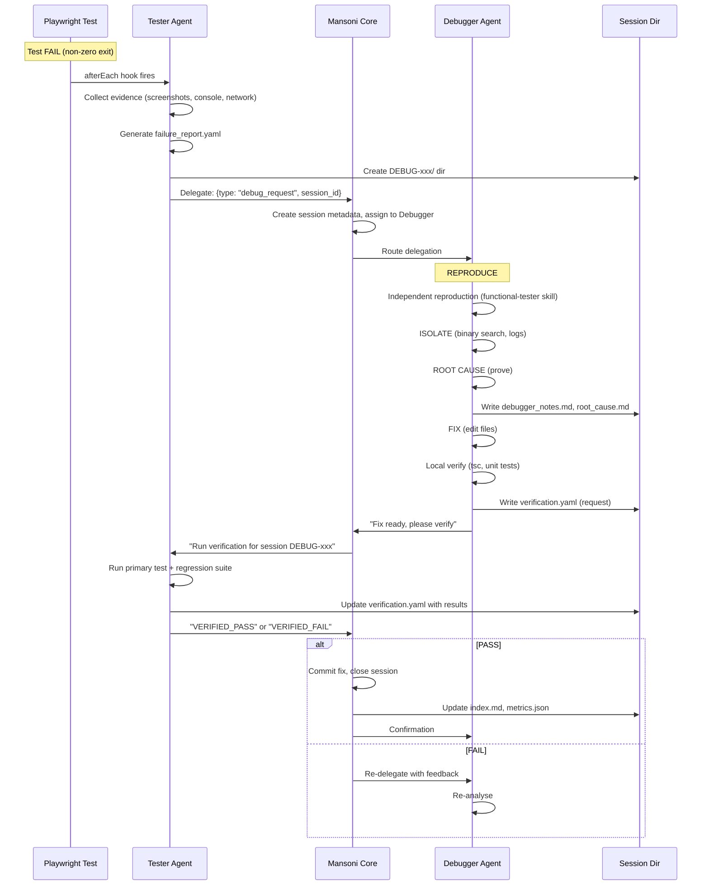

# 🏗️ Runtime Implementation Guide — Debugger-Tester Integration

**Status:** Protocol defined, skills created, code modules provided
**Task:** Integrate into Mansoni core (Ruflo runtime)
**Owner:** Mansoni architect / implementation engineer

---

## 📋 Overview

You are adding **automated bug triage & debugging pipeline** to Mansoni:

1. **Tester** detects E2E failure → auto-creates structured `failure_report.yaml`
2. **Mansoni** orchestrates: creates session dir, routes to **Debugger**
3. **Debugger** works: REPRODUCE → ISOLATE → ROOT CAUSE → FIX → VERIFY
4. **Tester** verifies fix → runs regression → returns result
5. **Mansoni** closes session (if PASS), updates dashboard, commits fix

All structured via `debug-session` library.

---

## 📁 Files Provided (in this implementation package)

```
src/
├── lib/debug-session/
│   ├── types.ts                    ✅ Core TypeScript types (YAML/JSON schemas)
│   ├── sessionManager.ts           ✅ CRUD: create/read/update/close sessions
│   ├── dashboardUpdater.ts         ✅ Auto-generates index.md + metrics.json
│   ├── escalationMonitor.ts        ✅ Background job: escalates stale sessions
│   └── index.ts                    (barrel export — optional)
│
├── agents/
│   ├── mansoni-tester/runtime/
│   │   ├── failureDetector.ts      ✅ Playwright afterEach hook (auto-detects FAIL)
│   │   ├── verificationHandler.ts  ✅ Processes verification requests from Debugger
│   │   └── index.ts                ✅ Tester runtime extension
│   │
│   └── mansoni-debugger/runtime/
│       ├── sessionHandler.ts       ✅ Debugger session lifecycle manager
│       ├── verificationRequester.ts ⚠️  (merged into sessionHandler)
│       └── index.ts                ✅ Debugger runtime extension
│
scripts/
└── debug-session-cli.ts            ✅ CLI tools for manual ops
```

---

## 🚀 Integration Steps

### Step 1: Install Dependencies

Add required NPM packages:

```bash
npm install yaml uuid
npm install -D @types/node
```

---

### Step 2: Initialize Session System (Mansoni Core Startup)

In Mansoni core initialization (where Ruflo runtime boots):

```typescript
// src/core/mansoniCore.ts or equivalent
import { initSessionSystem, initDashboard } from '../lib/debug-session';

export async function initMansoniCore() {
  console.log('Initializing Mansoni core...');

  // 1. Initialize debug session infrastructure
  initSessionSystem(); // ensures directories exist
  initDashboard();     // builds initial index if missing

  // 2. Start escalation monitor (runs every 5min)
  const { startEscalationMonitor } = require('../lib/debug-session/escalationMonitor');
  startEscalationMonitor(5 * 60 * 1000);

  console.log('✅ Debug session system ready');
}
```

---

### Step 3: Wire Tester Agent — Auto-Failure Detection

In Playwright configuration:

```typescript
// e2e/playwright.config.ts
import { defineConfig } from '@playwright/test';
import { getPlaywrightHooks } from '../src/agents/mansoni-tester/runtime';

export default defineConfig({
  // ... existing config ...

  // Add the afterEach hook
  ...getPlaywrightHooks(),

  // Ensure failures directory is writable
  // (Mansoni runtime must have write access to /memories/session/)
});
```

**Note:** The `failureDetector.ts` writes to `/memories/session/failures/` — ensure this path is writable by the test runner process. On Linux/macOS it's fine; on Windows may need permissions adjustment.

---

### Step 4: Wire Debugger Agent — Session Handling

In Debugger agent's message handler:

```typescript
// src/agents/mansoni-debugger/agent.ts (or wherever Mansoni routes)
import { handleIncomingDebugSession } from './runtime';

export async function onMessage(message: any) {
  if (message.type === 'debug_request') {
    const { failure_report_id, session_id } = message;
    if (!session_id) {
      throw new Error('session_id required in debug_request');
    }
    // Handle the debug session
    await handleIncomingDebugSession(session_id);
    return { status: 'accepted', session_id };
  }

  // ... other message types
}
```

Mansoni must pass the `session_id` when routing to Debugger.

---

### Step 5: Verification Endpoint (Tester)

When Debugger writes `verification.yaml`, Tester must pick it up:

**Option A: Polling (simpler)**
```typescript
// In Tester runtime init, start interval poller
setInterval(async () => {
  const sessions = getActiveDebugSessions();
  for (const sessionId of sessions) {
    const verifyPath = `/memories/session/debug-sessions/${sessionId}/verification.yaml`;
    if (fs.existsSync(verifyPath)) {
      const content = yaml.parse(fs.readFileSync(verifyPath, 'utf-8'));
      if (content.results?.primary_test?.status === 'PENDING') {
        await verificationHandler.process(sessionId);
      }
    }
  }
}, 30_000); // every 30s
```

**Option B: Event-driven (better)**
- Mansoni sends WebSocket/Realtime message to Tester when verification request ready
- Tester listens on channel `debug:verification_requests`
- On message, calls `verificationHandler.process(sessionId)`

---

### Step 6: Dashboard Auto-Update

The `dashboardUpdater.ts` is called automatically by:

- `sessionManager.createSessionFromFailure` → `updateDashboardIndex()`
- `sessionManager.updateSession` → `updateDashboardIndex()`
- `sessionManager.closeSession` → `updateDashboardIndex() + updateMetrics()`

So **no additional wiring needed** — just ensure `sessionManager` is used everywhere.

---

### Step 7: CLI for Manual Ops (optional)

Add to `package.json`:

```json
{
  "scripts": {
    "debug:create": "ts-node scripts/debug-session-cli.ts create",
    "debug:list": "ts-node scripts/debug-session-cli.ts list",
    "debug:status": "ts-node scripts/debug-session-cli.ts status",
    "debug:metrics": "ts-node scripts/debug-session-cli.ts metrics",
    "debug:escalate": "ts-node scripts/debug-session-cli.ts escalate",
    "debug:archive": "ts-node scripts/debug-session-cli.ts archive"
  }
}
```

Now you can:
```bash
npm run debug:create -- --domain navigator --test "test_routing" --error "TimeoutError" --priority P0
npm run debug:list
npm run debug:status DEBUG-20260425-001
npm run debug:metrics
```

---

## 🔄 Full Workflow Diagram



---

## 🧪 Testing the Integration

### Test 1: Simulate Failure

```bash
# Manually create a fake failure to test pipeline
npm run debug:create \
  --domain navigator \
  --test "test_route_calculation" \
  --error "TimeoutError: route calculation exceeded 5000ms" \
  --priority P1 \
  --files "src/lib/navigation/routing.ts:412"

# Observe:
# 1. Session created: /memories/session/debug-sessions/DEBUG-xxx/
# 2. index.md updated
# 3. Metrics updated
# 4. (When integrated) Mansoni auto-routes to Debugger
```

### Test 2: End-to-End with Broken Test

1. Create a test that deliberately fails (e.g., `expect(1+1).toBe(3)`)
2. Run Playwright: `npx playwright test broken.spec.ts`
3. Verify:
   - `failure_report.yaml` created in `/memories/session/failures/`
   - `DEBUG-xxx/` directory created with all files
   - Console: "Delegated to mansoni-debugger"
4. (If Mansoni core integrated) Debugger agent receives session
5. Debugger fixes (manual or automated)
6. Tester verifies → session closes

---

## 🐛 Troubleshooting

| Symptom | Likely Cause | Fix |
|---------|--------------|-----|
| No `failure_report.yaml` created | afterEach hook not registered | Check Playwright config imports `getPlaywrightHooks()` |
| Session dir not created | Mansoni not routing to Debugger | Implement `debug_request` handler in Mansoni core |
| Tester doesn't verify | No verification.yaml or not polled | Start verification poller or WebSocket listener |
| Index stale | Not updated on changes | Ensure all session updates call `updateDashboardIndex()` |
| Metrics always zero | Metrics not recomputed on close | Call `updateMetrics('close', session)` in `closeSession()` |
| Escalations not firing | Monitor not started | Call `startEscalationMonitor()` on core init |

---

## 📊 Monitoring

Watch the dashboard live:

```bash
# Tail the index
tail -f /memories/session/debug-sessions/index.md

# Watch metrics
watch -n 5 cat /memories/session/debug-sessions/metrics.json | jq '.summary'
```

Check active sessions:

```bash
npm run debug:list
npm run debug:status DEBUG-20260425-001
npm run debug:metrics
```

---

## 🔐 Security & Permissions

- Session directories should be readable/writable by Mansoni runtime only (not public)
- Failure reports may contain sensitive data (user IDs, stack traces) — ensure `/memories/session/` is gitignored and not exposed via web server
- In production, consider encrypting PII in failure reports (auth.user_id could be hashed)

---

## 🎯 Success Criteria

After full integration:

- [ ] Any Playwright FAIL → `failure_report.yaml` auto-generated
- [ ] Session directory created with all required files
- [ ] Mansoni routes to Debugger within 10 seconds
- [ ] Debugger updates phase notes in real-time
- [ ] Verification request appears when fix ready
- [ ] Tester auto-detects verification request, runs tests
- [ ] Dashboard updates within 30 seconds of state change
- [ ] Escalation fires after threshold (test with artificially long-running session)
- [ ] MTTR tracked accurately in metrics
- [ ] All CLI commands work

---

## 📞 Support

**Questions on implementation?**
- See `DEBUGGER-TESTER-INTEGRATION-IMPLEMENTATION.md` — full protocol spec
- See `DEBUG-INTEGRATION-QUICK-REF.md` — quick lookup for agents
- See `SKILLS-INDEX-20260425.md` — all created skills overview

**Code questions:**
- `sessionManager.ts` — central API for session CRUD
- `dashboardUpdater.ts` — index/metrics generation
- `failureDetector.ts` — Playwright hook
- `sessionHandler.ts` — Debugger session orchestration

---

**Status:** Code complete, awaiting integration into Mansoni core.
**Next:** Assign to implementation engineer to wire into existing agent runtime.
