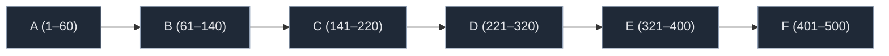
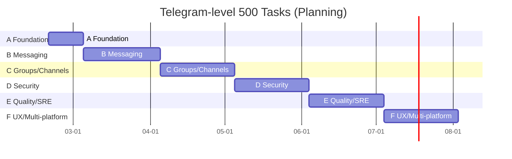

# Requirements Dashboard

- Total tasks: **500**
- Done: **130** (26.0%)
- In progress: **0**
- Todo: **370**
- Derived scenarios (min): **7500** (minPerTask=15)

## By Section

- A: 60
- B: 80
- C: 80
- D: 100
- E: 80
- F: 100

## Derived By Section

- A: tasks=60, derived=900
- B: tasks=80, derived=1200
- C: tasks=80, derived=1200
- D: tasks=100, derived=1500
- E: tasks=80, derived=1200
- F: tasks=100, derived=1500

## By Status

- done: 130
- todo: 370

## Graph (Sections)

## Schedule (Synthetic Gantt)

