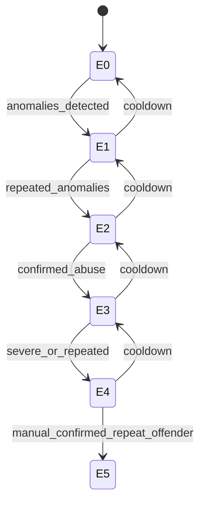

# Enforcement Level — State Machine v1

Scope: Phase 1

Related:
- Spec: docs/specs/phase1/P1L-trust-lite-rate-limits-enforcement.md
- Contract: docs/contracts/schemas/enforcement-action.v1.schema.json

## Mermaid

## Invariants
- Enforcement changes are audited.
- Appeals required for E3+.
- Rate limits depend on trust tier.
