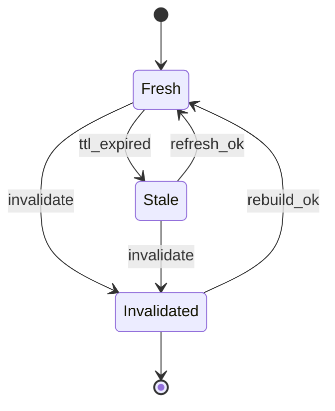

# Explore Cache Entry — State Machine v1

Scope: Phase 1 (Explore)

Related:
- Spec: docs/specs/phase1/P1G-explore-discovery-surface.md
- Contract: docs/contracts/schemas/explore-cache-entry.v1.schema.json
- Contract: docs/contracts/schemas/explore-page.v1.schema.json

## Mermaid

## Invariants
- `status=fresh` => `generated_at < expires_at`.
- `status=stale` => `now >= expires_at` (на read-path можно отдавать stale только с degrade reason).
- Любая `invalidate` фиксируется reason_code `rollout.killswitch_activated` или `rank.guardrail_triggered`.
