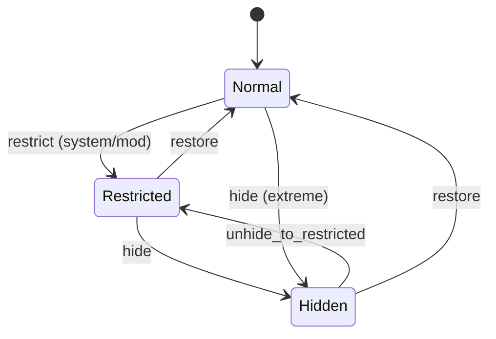

# Hashtag Status — State Machine v1

Scope: Phase 1 (Hashtags/Trends integrity)

Related:
- Spec: docs/specs/phase1/P1H-hashtags-trends-discovery-integrity.md
- Contract: docs/contracts/schemas/hashtag-status-change.v1.schema.json

## Mermaid

## Invariants
- `restricted` и `hidden` **никогда** не попадают в `trends` и `explore`.
- `hidden` не возвращается в search/hashtag page (как будто тега нет).
- Любой переход должен иметь `hashtag-status-change` entry с `reason_codes`.
- `restricted` разрешено показывать на hashtag page только в режиме `allow_with_warning`.
