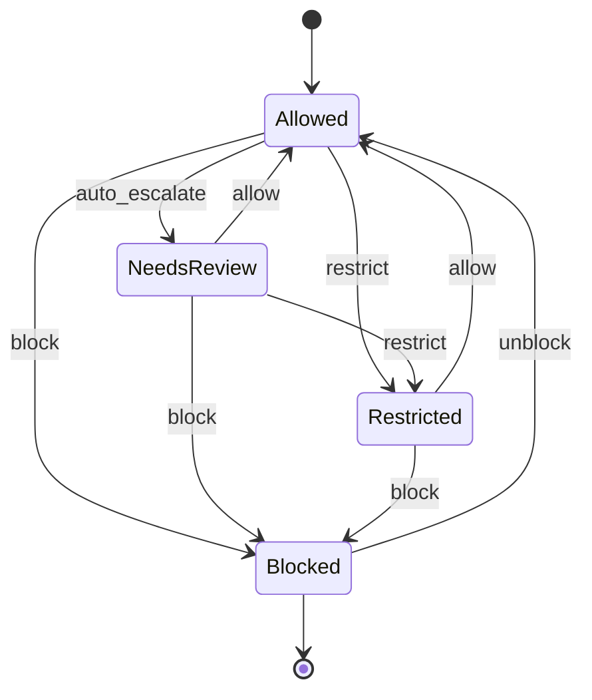

# Moderation Decision — State Machine v1

Scope: Phase 0–1

Related:
- Phase 0: docs/specs/phase0/P0E-moderation-gate-minimal.md
- Phase 1: docs/specs/phase1/P1K-moderation-queues-sla-appeals-borderline.md
- Contract: docs/contracts/schemas/moderation-decision.v1.schema.json

## Mermaid

## Invariants
- Borderline/Restricted never enters recommendations.
- Blocked never visible to non-owner.
- Decisions are audited (append-only).
