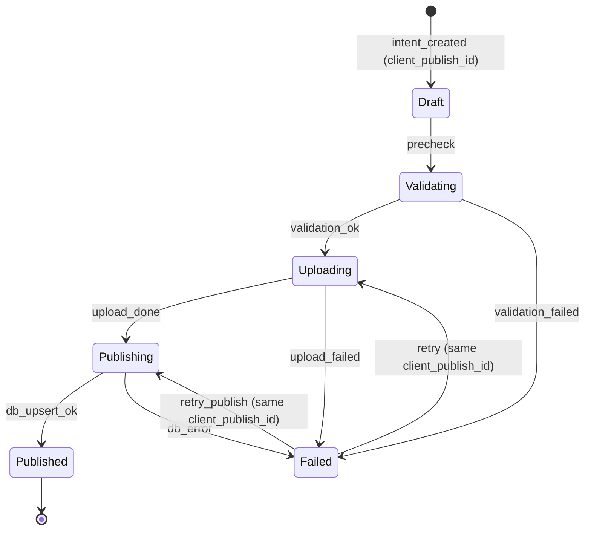

# Publish Intent — State Machine v1

Scope: Phase 0–2 (idempotent publish)

Related:
- Spec: docs/specs/phase0/P0C-create-reels-upload-publish.md

## Mermaid

## Invariants
- `client_publish_id` никогда не меняется при retry.
- Повторный publish не создаёт дубль (DB unique/onConflict).
- UI in-flight guard предотвращает double-tap.
