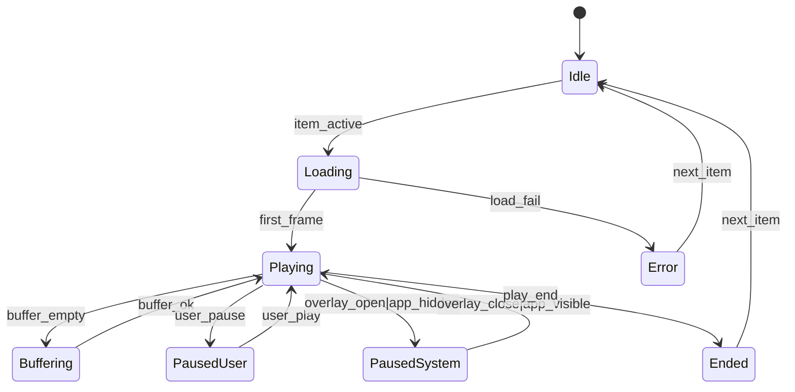
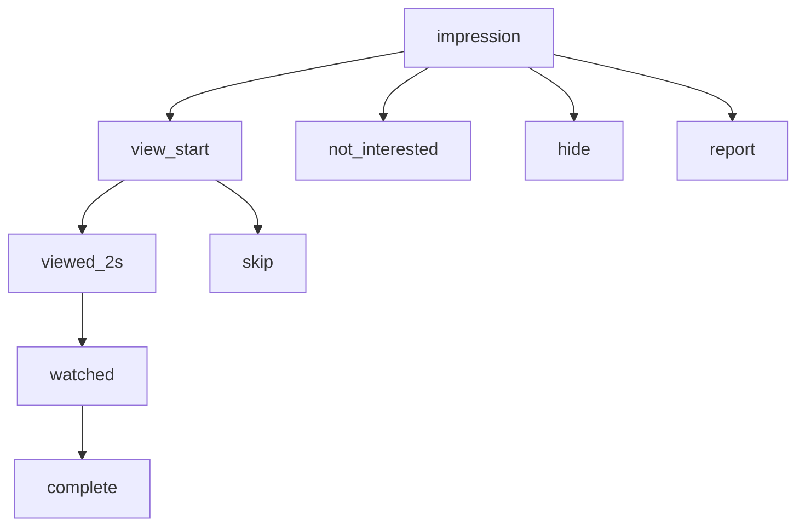

# Reels Playback + Events — State Machine v1

Scope: Phase 0–1 (event integrity)

Related:
- Spec: docs/specs/phase0/P0B-playback-event-integrity.md
- Contracts: docs/contracts/schemas/reel-event-batch.v1.schema.json

## Mermaid (Playback)

## Mermaid (Event ordering)

## Invariants
- No complete without view_start.
- No watched without viewed_2s.
- Autopause on overlay -> watched_time does not accrue.
- Server dedup by (viewer/session, reel, type, time_bucket).
