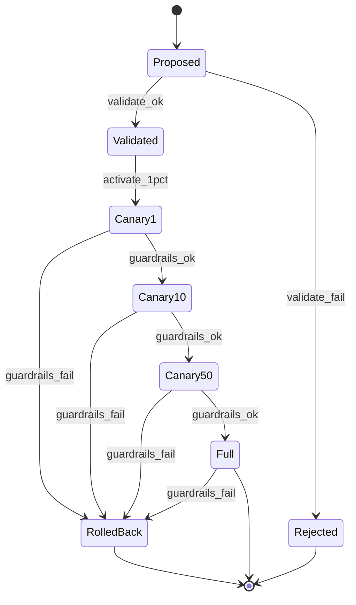

# Rollout + Auto-rollback — State Machine v1

Scope: Phase 1+

Related:
- Spec: docs/specs/phase1/P1M-rollouts-guardrails-autorevert.md
- Contract: docs/contracts/schemas/rollout-journal-entry.v1.schema.json
- Contract: docs/contracts/schemas/auto-rollback-decision.v1.schema.json

## Mermaid

## Invariants
- Любая стадия фиксируется в journal.
- Guardrail violation -> rollback автоматически.
- В rollback допускается включение kill-switch.
