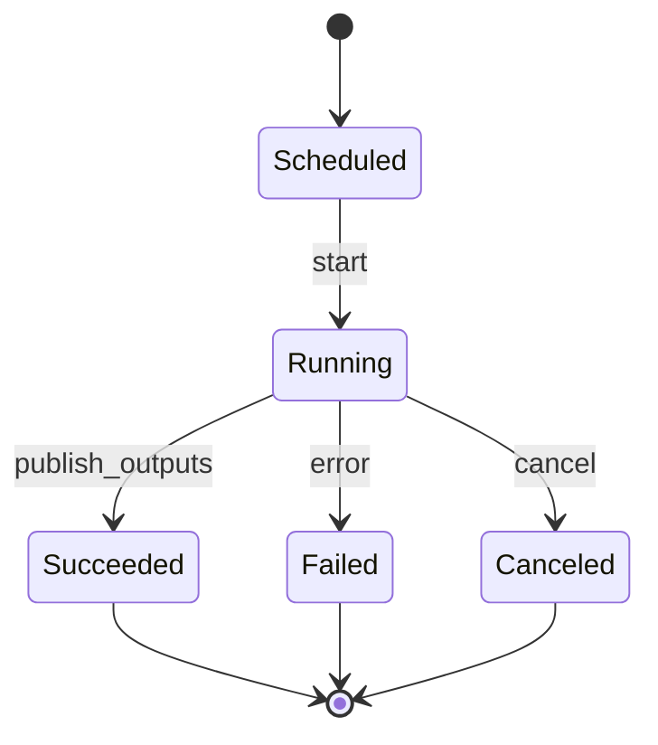

# Trend Computation Run — State Machine v1

Scope: Phase 1 (Trends/Hashtags)

Related:
- Spec: docs/specs/phase1/P1H-hashtags-trends-discovery-integrity.md
- Contract: docs/contracts/schemas/trend-run.v1.schema.json
- Contract: docs/contracts/schemas/trend-item.v1.schema.json

## Mermaid

## Invariants
- Один `run_id` публикует outputs ровно один раз (идемпотентно по `run_id`).
- `outputs.trend_items[*].window` == `window` текущего run.
- Любой `Failed` обязан иметь хотя бы один `reason_code`.
