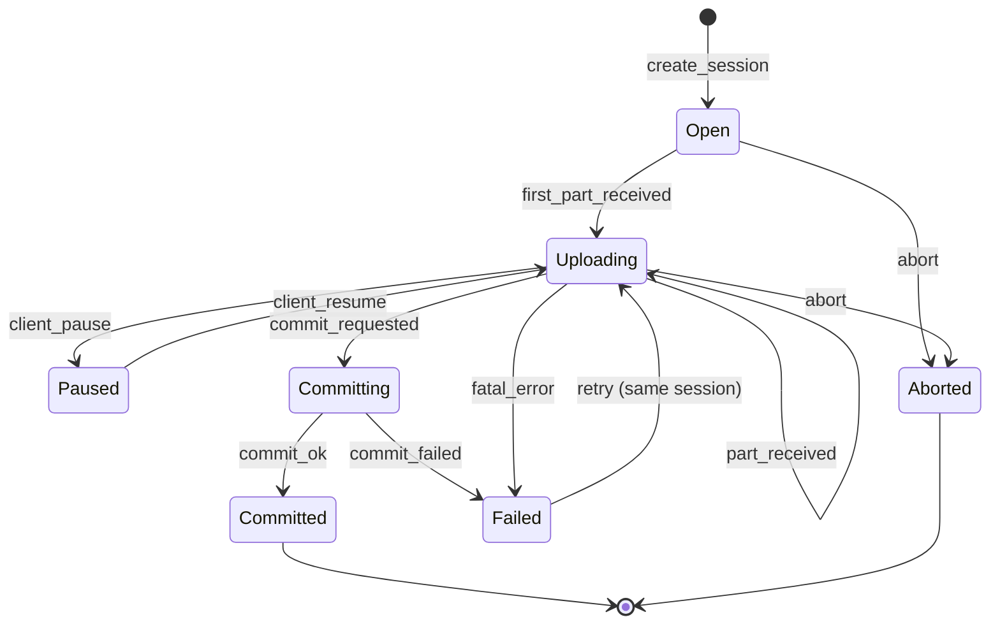

# Upload Session — State Machine v1

Scope: Phase 0–1 (resumable upload model)

Related:
- Spec: docs/specs/phase0/P0C-create-reels-upload-publish.md
- Contracts: docs/contracts/schemas/create-reel-intent.v1.schema.json

## Mermaid

## Invariants
- Session idempotency: повторный `create_session` с тем же `idempotency_key` возвращает ту же session.
- Commit idempotency: повторный commit не создаёт второй "original" объект.
- Storage path deterministic: привязан к client_publish_id.

## Allowed errors
- retryable: network, transient server
- non-retryable: permission, validation, policy
