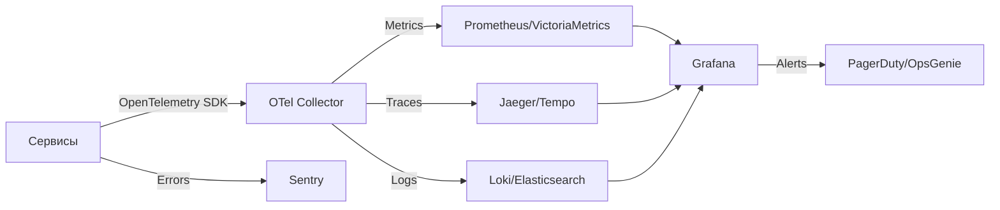
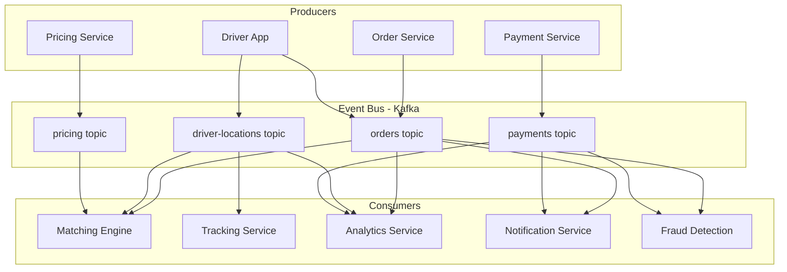
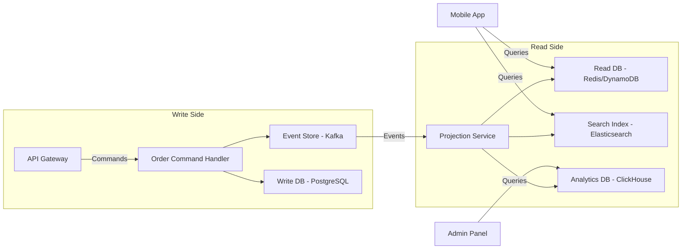
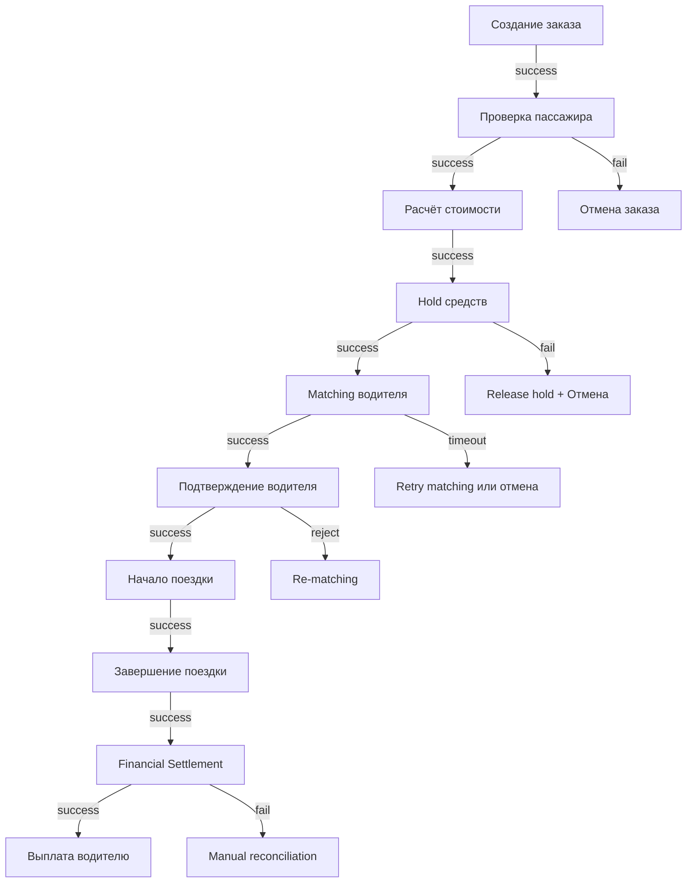
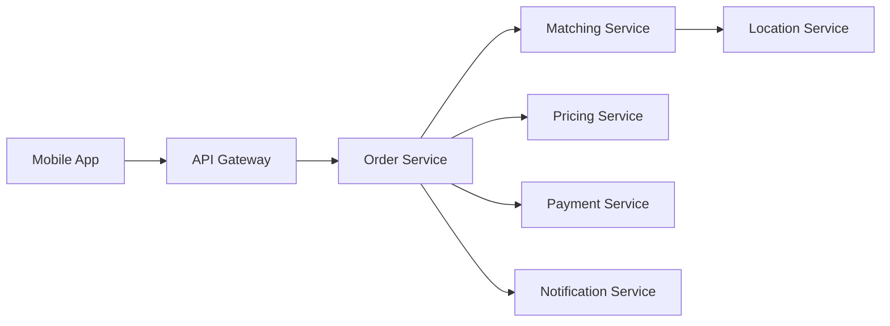
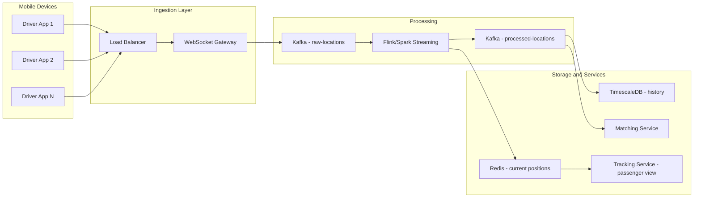
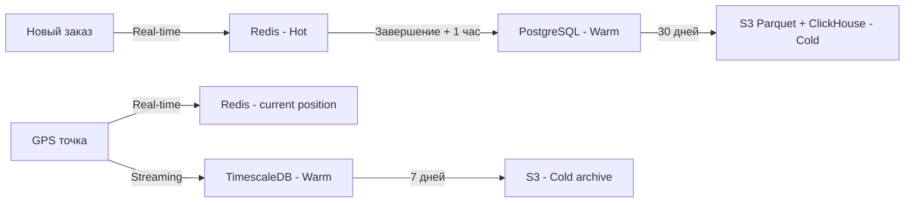
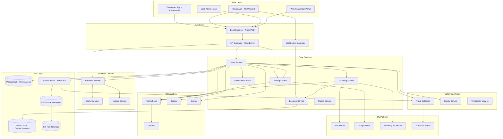
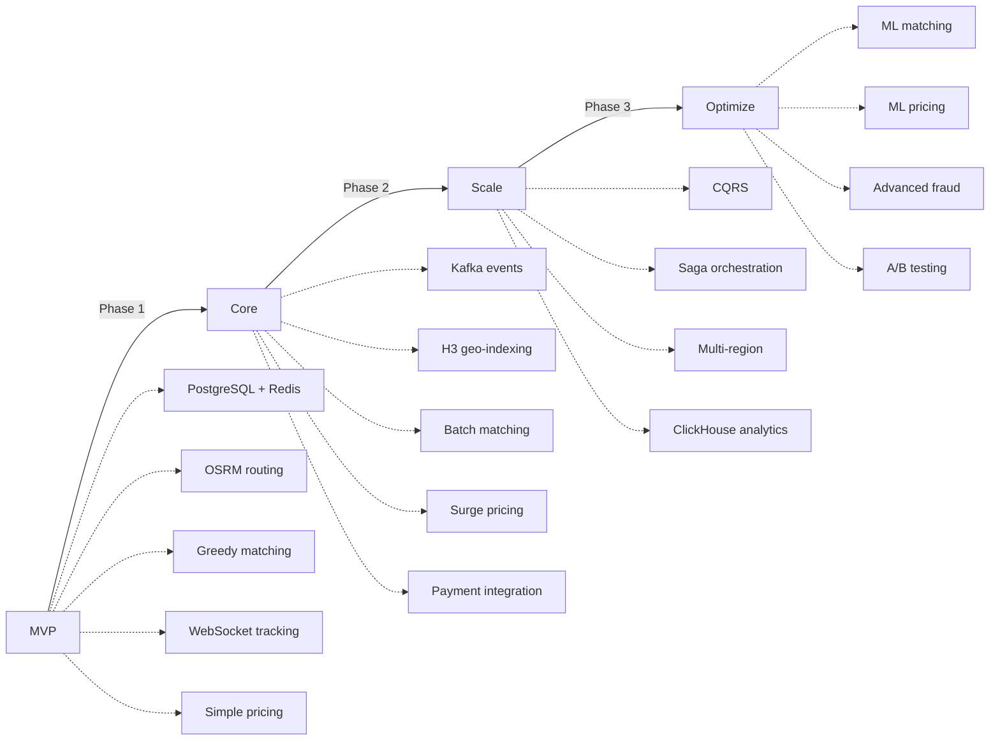

# Технический анализ стеков и Open-Source решений для такси-агрегаторов

> **Версия:** 1.0  
> **Дата:** 2026-03-06  
> **Язык:** Русский  
> **Статус:** Актуальный  
> **Связанный документ:** [01-platform-research.md](./01-platform-research.md)

---

## Содержание

1. [Раздел 1: Детальный техстек каждой платформы](#раздел-1-детальный-техстек-каждой-платформы)
   - [1.1 Uber](#11-uber)
   - [1.2 Яндекс Go](#12-яндекс-go)
   - [1.3 Lyft](#13-lyft)
   - [1.4 Bolt](#14-bolt)
   - [1.5 DiDi Chuxing](#15-didi-chuxing)
   - [1.6 Grab](#16-grab)
   - [1.7 Ola](#17-ola)
   - [1.8 Careem](#18-careem)
   - [1.9 Gett](#19-gett)
   - [1.10 FREE NOW](#110-free-now)
   - [1.11 Cabify](#111-cabify)
   - [1.12 inDriver](#112-indriver)
   - [1.13 Сводная сравнительная таблица](#113-сводная-сравнительная-таблица)
2. [Раздел 2: Open-Source проекты и репозитории](#раздел-2-open-source-проекты-и-репозитории)
   - [2.1 Полные решения такси-агрегаторов](#21-полные-решения-такси-агрегаторов)
   - [2.2 Карты и геолокация](#22-карты-и-геолокация)
   - [2.3 Real-time коммуникация](#23-real-time-коммуникация)
   - [2.4 Платёжные системы](#24-платёжные-системы)
   - [2.5 Аутентификация и авторизация](#25-аутентификация-и-авторизация)
   - [2.6 Push-уведомления](#26-push-уведомления)
   - [2.7 Matching-алгоритмы и dispatch](#27-matching-алгоритмы-и-dispatch)
   - [2.8 Pricing и расчёты](#28-pricing-и-расчёты)
   - [2.9 Мониторинг и observability](#29-мониторинг-и-observability)
   - [2.10 Базы данных и хранилища](#210-базы-данных-и-хранилища)
   - [2.11 Message Brokers и Event Streaming](#211-message-brokers-и-event-streaming)
3. [Раздел 3: Архитектурные паттерны и Best Practices](#раздел-3-архитектурные-паттерны-и-best-practices)
   - [3.1 Event-Driven Architecture](#31-event-driven-architecture)
   - [3.2 CQRS для заказов](#32-cqrs-для-заказов)
   - [3.3 Saga Pattern для распределённых транзакций](#33-saga-pattern-для-распределённых-транзакций)
   - [3.4 Circuit Breaker и отказоустойчивость](#34-circuit-breaker-и-отказоустойчивость)
   - [3.5 Geofencing паттерны](#35-geofencing-паттерны)
   - [3.6 Real-time Location Streaming](#36-real-time-location-streaming)
   - [3.7 Кеширование водителей по гео-ячейкам](#37-кеширование-водителей-по-гео-ячейкам)
   - [3.8 Hot/Cold Data Separation](#38-hotcold-data-separation)
   - [3.9 Сводная диаграмма архитектуры](#39-сводная-диаграмма-архитектуры)

---

## Раздел 1: Детальный техстек каждой платформы

### 1.1 Uber

> **4000+ микросервисов | 130 млн MAU | Собственная инфраструктура поверх GCP**

| Категория | Технология | Назначение | Примечания |
|-----------|-----------|-----------|------------|
| **Язык backend** | Go, Java, Python, Node.js | Go — высоконагруженные сервисы, Java — бизнес-логика, Python — ML/data, Node.js — BFF | Миграция с Python на Go/Java для перфоманса |
| **Язык mobile** | Kotlin — Android, Swift — iOS | Нативные приложения | Ранее использовали Java/Objective-C, полная миграция на Kotlin/Swift |
| **Язык frontend** | React, TypeScript | Веб-портал пассажиров, админки, внутренние инструменты | Собственный UI Kit — Base Web, open source |
| **СУБД** | MySQL — Schemaless, PostgreSQL | MySQL — основное хранилище через собственную надстройку Schemaless с шардированием; PostgreSQL — аналитика, PostGIS | Docstore — собственное документоориентированное хранилище на базе MySQL |
| **NoSQL** | Apache Cassandra | Write-heavy сценарии — логи, события, метрики | Один из крупнейших пользователей Cassandra |
| **Кеширование** | Redis, Memcached | Redis — геоиндексы, сессии; Memcached — общее кеширование | Redis с модулями для гео-операций |
| **Очереди сообщений** | Apache Kafka | Event streaming — триллионы сообщений в день | Крупнейший пользователь Kafka в мире |
| **RPC/API** | gRPC, REST | gRPC — межсервисная коммуникация; REST — публичные API | Ранее использовали Thrift и TChannel |
| **Поиск** | Elasticsearch | Полнотекстовый поиск, логирование через ELK | Также Apache Lucene для ряда сервисов |
| **Геоиндекс** | Google S2 Geometry, H3 | S2 — инициально в DISCO; H3 — собственная гексагональная сетка, open source | H3 с разрешениями от 0 до 15; используется для surge, analytics |
| **Real-time аналитика** | Apache Pinot, Apache Flink | Pinot — real-time OLAP; Flink — потоковая обработка | Ранее использовали Apache Druid, мигрировали на Pinot |
| **Data Lake** | Apache Hive, Presto, Apache Spark | Batch-аналитика, ETL, Ad-hoc запросы | Десятки петабайт данных |
| **ML/AI** | PyTorch, TensorFlow, XGBoost | ETA, surge pricing, fraud detection, matching optimization | Michelangelo — собственная ML-платформа |
| **Мониторинг** | M3 — Prometheus-совместимая, Jaeger, Grafana | M3 — метрики; Jaeger — distributed tracing; Grafana — визуализация | M3 и Jaeger — собственные проекты, переданы в CNCF |
| **CI/CD** | Собственная система — SubmitQueue | Monorepo-подход, trunk-based development | Более 1000 деплоев в день |
| **Контейнеры** | Docker, Kubernetes | K8s — текущий оркестратор | Ранее Peloton поверх Apache Mesos |
| **Облако** | Google Cloud Platform | Миграция с AWS в 2017–2018 | Hybrid: GCP + собственные дата-центры |
| **Workflow** | Cadence, Temporal | Оркестрация долгоживущих бизнес-процессов | Cadence — собственный проект, Temporal — форк от создателей |

**Собственные open-source проекты Uber:**

| Проект | URL | Описание |
|--------|-----|----------|
| H3 | [github.com/uber/h3](https://github.com/uber/h3) | Гексагональная система индексирования |
| Jaeger | [github.com/jaegertracing/jaeger](https://github.com/jaegertracing/jaeger) | Distributed tracing |
| M3 | [github.com/m3db/m3](https://github.com/m3db/m3) | Платформа метрик |
| Cadence | [github.com/uber/cadence](https://github.com/uber/cadence) | Workflow engine |
| Base Web | [github.com/uber/baseweb](https://github.com/uber/baseweb) | React UI компоненты |
| Ringpop | [github.com/uber-node/ringpop-node](https://github.com/uber-node/ringpop-node) | Consistent hashing |
| deck.gl | [github.com/visgl/deck.gl](https://github.com/visgl/deck.gl) | WebGL визуализация данных |
| kepler.gl | [github.com/keplergl/kepler.gl](https://github.com/keplergl/kepler.gl) | Гео-визуализация данных |
| Pyro | [github.com/pyro-ppl/pyro](https://github.com/pyro-ppl/pyro) | Вероятностное программирование на PyTorch |

> **Источники:** [eng.uber.com](https://eng.uber.com), [github.com/uber](https://github.com/uber), [uber.github.io](https://uber.github.io)

---

### 1.2 Яндекс Go

> **Суперприложение | YDB, userver — собственные open-source проекты | Яндекс Облако**

| Категория | Технология | Назначение | Примечания |
|-----------|-----------|-----------|------------|
| **Язык backend** | C++, Python, Go, Java | C++ — высоконагруженные сервисы через userver; Python — бизнес-логика, ML; Go — утилитарные сервисы | userver — собственный C++ фреймворк для микросервисов |
| **Язык mobile** | Kotlin — Android, Swift — iOS | Нативные приложения | Единое суперприложение Яндекс Go |
| **Язык frontend** | React, TypeScript | Веб-версия, Яндекс.Про для водителей, внутренние панели | Tanker — система локализации |
| **СУБД** | YDB, PostgreSQL | YDB — основное хранилище, distributed NewSQL; PostgreSQL — локальные сервисы | YDB — собственная open-source СУБД, совместима с PostgreSQL wire protocol |
| **NoSQL** | MongoDB, YDB — document mode | MongoDB — легаси; YDB — основное направление | YDB поддерживает режимы: KV, document, relational |
| **Кеширование** | Redis, Memcached | Redis — гео-ячейки водителей, сессии | Распределённый Redis через собственные прокси |
| **Очереди сообщений** | Logbroker — YDB Topics, Apache Kafka | Logbroker — основная шина событий, интеграция с YDB | Logbroker обрабатывает десятки миллиардов событий в день |
| **RPC/API** | gRPC, REST | gRPC — межсервисная коммуникация; REST — публичные API | Protobuf для сериализации |
| **Поиск** | Elasticsearch, Sphinx | Полнотекстовый поиск, автокомплит адресов | Sphinx — для специфичных задач |
| **Геоиндекс** | S2 Geometry, собственные гео-ячейки | Геопространственное индексирование водителей | Специализированные структуры для российских регионов |
| **Карты** | Яндекс Карты, Яндекс MapKit SDK | Картография, маршрутизация, ETA, пробки | Собственная картография — главное конкурентное преимущество |
| **ML/AI** | CatBoost, PyTorch, TensorFlow | ETA, surge, matching, fraud, NLP | CatBoost — собственный gradient boosting, open source |
| **Мониторинг** | Golovan, Juggler, Solomon | Golovan — внутренний мониторинг; Solomon — метрики; Juggler — alerting | Собственные решения, часть доступна через Яндекс Облако |
| **CI/CD** | Собственная система — Arcadia CI | Монорепозиторий Arcadia | Единый монорепозиторий для всего Яндекса |
| **Контейнеры** | Docker, Kubernetes, Nanny | Nanny — собственный оркестратор, миграция на K8s | Yandex Managed Service for Kubernetes |
| **Облако** | Yandex Cloud | Собственная облачная платформа | Собственные дата-центры + Yandex Cloud |

**Собственные open-source проекты Яндекс:**

| Проект | URL | Описание |
|--------|-----|----------|
| YDB | [github.com/ydb-platform/ydb](https://github.com/ydb-platform/ydb) | Распределённая NewSQL СУБД |
| userver | [github.com/userver-framework/userver](https://github.com/userver-framework/userver) | C++ фреймворк для микросервисов |
| CatBoost | [github.com/catboost/catboost](https://github.com/catboost/catboost) | Gradient boosting библиотека |
| ClickHouse | [github.com/ClickHouse/ClickHouse](https://github.com/ClickHouse/ClickHouse) | Колоночная OLAP СУБД |
| Tesseract | Используется для OCR документов | Распознавание документов водителей |

> **Источники:** [habr.com/company/yandex](https://habr.com/company/yandex), [github.com/yandex](https://github.com/yandex), [ydb.tech](https://ydb.tech)

---

### 1.3 Lyft

> **Микросервисы на Python/Go | AWS | Envoy Proxy — создатели**

| Категория | Технология | Назначение | Примечания |
|-----------|-----------|-----------|------------|
| **Язык backend** | Python, Go, Java | Python — основной язык legacy и ML; Go — новые высоконагруженные сервисы; Java — отдельные сервисы | Активная миграция с Python на Go |
| **Язык mobile** | Kotlin — Android, Swift — iOS | Нативные приложения | |
| **Язык frontend** | React, TypeScript | Веб-приложения, внутренние инструменты | |
| **СУБД** | PostgreSQL, Amazon Aurora | PostgreSQL — основная СУБД; Aurora — managed версия | |
| **NoSQL** | Amazon DynamoDB, Redis | DynamoDB — высоконагруженные сценарии | Активное использование AWS managed сервисов |
| **Кеширование** | Redis, Amazon ElastiCache | Сессии, гео-кеширование | |
| **Очереди сообщений** | Apache Kafka, Amazon SQS, Amazon SNS | Kafka — event streaming; SQS/SNS — job queues и notifications | |
| **RPC/API** | gRPC, REST, GraphQL | gRPC — внутренняя коммуникация; GraphQL — mobile BFF | |
| **Поиск** | Elasticsearch | Поиск, логи | |
| **Геоиндекс** | H3 — Uber, S2 Geometry, PostGIS | Гексагональная сетка для matching и analytics | Активные пользователи H3 |
| **ML/AI** | PyTorch, scikit-learn, XGBoost | ETA, pricing, matching, fraud | Flyte — собственная ML-платформа для оркестрации |
| **Мониторинг** | Envoy Proxy, Prometheus, Grafana, Datadog | Envoy — service mesh и observability | Envoy создан в Lyft, передан CNCF |
| **CI/CD** | GitHub Actions, собственные инструменты | | |
| **Контейнеры** | Docker, Kubernetes, Amazon EKS | K8s через EKS на AWS | |
| **Облако** | AWS | Полностью на AWS | Одни из крупнейших клиентов AWS |
| **Service Mesh** | Envoy Proxy, Istio | Envoy — сердце service mesh | Lyft — создатели Envoy |

**Собственные open-source проекты Lyft:**

| Проект | URL | Описание |
|--------|-----|----------|
| Envoy Proxy | [github.com/envoyproxy/envoy](https://github.com/envoyproxy/envoy) | L7 прокси и service mesh |
| Amundsen | [github.com/amundsen-io/amundsen](https://github.com/amundsen-io/amundsen) | Data discovery и metadata engine |
| Flyte | [github.com/flyteorg/flyte](https://github.com/flyteorg/flyte) | ML workflow оркестратор |
| Clutch | [github.com/lyft/clutch](https://github.com/lyft/clutch) | Infrastructure management |
| Toasted Marshmallow | [github.com/lyft/toasted-marshmallow](https://github.com/lyft/toasted-marshmallow) | Быстрая сериализация Python |

> **Источники:** [eng.lyft.com](https://eng.lyft.com), [github.com/lyft](https://github.com/lyft)

---

### 1.4 Bolt

> **Lean Engineering | AWS + GCP | Минимум custom-решений, максимум managed сервисов**

| Категория | Технология | Назначение | Примечания |
|-----------|-----------|-----------|------------|
| **Язык backend** | Go, Java, Python, PHP — legacy | Go — новые микросервисы; Java — бизнес-логика; PHP — legacy, активно уходят | Сравнительно небольшая инженерная команда |
| **Язык mobile** | Kotlin — Android, Swift — iOS | Нативные приложения | |
| **Язык frontend** | React, TypeScript | Веб-портал, админка | |
| **СУБД** | PostgreSQL, Amazon Aurora, Google Cloud Spanner | PostgreSQL — основная; Spanner — для глобальной консистентности | Managed сервисы предпочтительны |
| **NoSQL** | Amazon DynamoDB, Redis | DynamoDB — сессии, события | |
| **Кеширование** | Redis — ElastiCache | Гео-кеш водителей | |
| **Очереди сообщений** | Apache Kafka, Amazon SQS | Kafka — events; SQS — задачи | |
| **RPC/API** | gRPC, REST | gRPC — внутренняя; REST — публичная | |
| **Поиск** | Elasticsearch | Поиск, логи | |
| **Геоиндекс** | H3, PostGIS | Гексагональная сетка для зон | |
| **ML/AI** | Python, scikit-learn, TensorFlow | ETA, pricing, fraud | Менее агрессивное использование ML чем у Uber |
| **Мониторинг** | Datadog, Prometheus, Grafana, PagerDuty | Datadog — основной SaaS-мониторинг | Ставка на SaaS-решения |
| **CI/CD** | GitHub Actions, ArgoCD | GitOps подход | |
| **Контейнеры** | Docker, Kubernetes — EKS/GKE | Multi-cloud K8s | |
| **Облако** | AWS — основное, GCP | Multi-cloud стратегия | Эстонская компания, дата-центры в ЕС |

> **Источники:** [blog.bolt.eu](https://blog.bolt.eu), [bolt.eu/careers/engineering](https://bolt.eu/en/careers/engineering/)

---

### 1.5 DiDi Chuxing

> **60+ млн поездок в день на пике | Собственные дата-центры + китайские облака | TiDB**

| Категория | Технология | Назначение | Примечания |
|-----------|-----------|-----------|------------|
| **Язык backend** | Go, Java, Python, C++ | Go — высоконагруженные сервисы; Java — бизнес-логика; C++ — критичные к latency | |
| **Язык mobile** | Kotlin — Android, Swift — iOS; Chameleon — cross-platform | Нативные + собственный cross-platform фреймворк | Chameleon для унификации UI |
| **Язык frontend** | React, Vue.js | Внутренние инструменты, мини-программы WeChat | |
| **СУБД** | MySQL — шардированный, TiDB | MySQL — legacy транзакции; TiDB — distributed NewSQL | TiDB активно используется в DiDi, один из крупнейших deployments |
| **NoSQL** | Redis Cluster, Apache HBase | Redis — real-time кеш; HBase — GPS-треки и исторические данные | |
| **Кеширование** | Redis Cluster | Гео-кеш, сессии, матчинг | Десятки тысяч Redis-нод |
| **Очереди сообщений** | Apache Kafka, Apache RocketMQ | Kafka — events; RocketMQ — оптимизирован для китайского рынка | |
| **RPC/API** | gRPC, собственные RPC-фреймворки, REST | Собственные протоколы для внутренней коммуникации | |
| **Поиск** | Elasticsearch | Поиск, лог-аналитика | |
| **Геоиндекс** | S2 Geometry, GeoHash, собственные реализации | Геопространственный matching | Оптимизация под плотность китайских городов |
| **Real-time аналитика** | Apache Flink, Apache Spark, ClickHouse | Flink — потоковая; Spark — batch; ClickHouse — OLAP | |
| **ML/AI** | TensorFlow, PyTorch, XGBoost | Order dispatch, ETA, surge, safety, fraud | OPAL — собственная ML-платформа |
| **Мониторинг** | Prometheus, Grafana, собственные системы | Odin — внутренний мониторинг | |
| **CI/CD** | Собственные системы | GitLab-подобная инфраструктура | |
| **Контейнеры** | Docker, Kubernetes | K8s для оркестрации | |
| **Облако** | Собственные дата-центры, Alibaba Cloud, Tencent Cloud | Hybrid model | Основная инфраструктура — private cloud |

**Собственные open-source проекты DiDi:**

| Проект | URL | Описание |
|--------|-----|----------|
| Nightingale | [github.com/ccfos/nightingale](https://github.com/ccfos/nightingale) | Мониторинг и alerting |
| LogiKM | [github.com/didi/LogiKM](https://github.com/didi/LogiKM) | Управление Kafka кластерами |
| DoKit | [github.com/didi/DoKit](https://github.com/didi/DoKit) | Инструмент разработки мобильных приложений |
| Hummer | [github.com/nicklockwood/Hummer](https://github.com/nicklockwood/Hummer) | Cross-platform UI фреймворк |
| DELTA | [github.com/aspect/DELTA](https://github.com/aspect/DELTA) | Deep Learning для NLP |

> **Источники:** [didi.github.io](https://didi.github.io), [github.com/didi](https://github.com/didi)

---

### 1.6 Grab

> **Суперприложение Юго-Восточной Азии | AWS | Go + Java**

| Категория | Технология | Назначение | Примечания |
|-----------|-----------|-----------|------------|
| **Язык backend** | Go, Java, Python | Go — высоконагруженные микросервисы; Java — бизнес-логика; Python — ML | Единое суперприложение: ride-hailing, food, payments, insurance |
| **Язык mobile** | Kotlin — Android, Swift — iOS | Нативные приложения | |
| **Язык frontend** | React, TypeScript | Веб-портал, internal tools | |
| **СУБД** | MySQL, Amazon Aurora, PostgreSQL | MySQL — основное; Aurora — managed; PostgreSQL — аналитика | |
| **NoSQL** | Amazon DynamoDB, Redis, Apache Cassandra | DynamoDB — сессии; Cassandra — события | |
| **Кеширование** | Redis — Amazon ElastiCache | Гео-ячейки водителей, сессии | |
| **Очереди сообщений** | Apache Kafka, Amazon SQS/SNS, NATS | Kafka — основная event bus; NATS — lightweight messaging | |
| **RPC/API** | gRPC, REST | gRPC — межсервисная; REST — public | |
| **Поиск** | Elasticsearch | Поиск и логи | |
| **Геоиндекс** | S2 Geometry, H3, GeoHash | Пространственное индексирование | |
| **ML/AI** | TensorFlow, XGBoost, scikit-learn | ETA, matching, fraud, personalization | Catwalk — ML serving platform |
| **Мониторинг** | Datadog, Prometheus, Grafana, Jaeger | Datadog — основная платформа | |
| **CI/CD** | GitLab CI, Spinnaker, ArgoCD | Spinnaker — deployment orchestration | |
| **Контейнеры** | Docker, Kubernetes — EKS | K8s через Amazon EKS | |
| **Облако** | AWS | Полностью на AWS | Multi-region для резильентности в ЮВА |

> **Источники:** [engineering.grab.com](https://engineering.grab.com), [github.com/grab](https://github.com/grab)

---

### 1.7 Ola

> **Индийский рынок — авторикши + автомобили | Java/Go | Ola Maps — замена Google Maps**

| Категория | Технология | Назначение | Примечания |
|-----------|-----------|-----------|------------|
| **Язык backend** | Java, Go, Python, Node.js | Java — основной; Go — performance-critical; Node.js — real-time | |
| **Язык mobile** | Kotlin — Android, Swift — iOS | Нативные приложения | |
| **Язык frontend** | React, Angular | Веб-порталы, внутренние инструменты | Angular в legacy-частях |
| **СУБД** | MySQL, PostgreSQL, Apache Cassandra | MySQL — транзакции; Cassandra — масштабируемые данные | |
| **NoSQL** | Apache Cassandra, MongoDB, Redis | Cassandra — write-heavy; MongoDB — документы | |
| **Кеширование** | Redis | Гео-кеш, сессии | |
| **Очереди сообщений** | Apache Kafka, RabbitMQ | Kafka — event bus; RabbitMQ — task queues | |
| **RPC/API** | REST, gRPC | REST — основной; gRPC — для новых сервисов | |
| **Поиск** | Elasticsearch, Apache Solr | Поиск мест, логи | |
| **Геоиндекс** | S2 Geometry, PostGIS | Геоиндексирование | Oптимизация под индийские условия — плотная застройка |
| **Карты** | Ola Maps — собственная платформа | Картография, маршрутизация | Замена Google Maps для снижения затрат |
| **ML/AI** | TensorFlow, scikit-learn, XGBoost | ETA, matching — Gravity, surge, fraud | Gravity — собственный dispatch engine с учётом рикш |
| **Мониторинг** | Prometheus, Grafana, ELK | Open-source stack | |
| **CI/CD** | Jenkins, GitLab CI | | |
| **Контейнеры** | Docker, Kubernetes | K8s для оркестратора | |
| **Облако** | AWS, Azure, Ola Cloud — собственное | Multi-cloud | Собственная облачная инфраструктура |

> **Источники:** [tech.olacabs.com](https://tech.olacabs.com/), [github.com/nicklockwood/olacabs](https://github.com/nicklockwood/olacabs)

---

### 1.8 Careem

> **Суперприложение Ближнего Востока | Приобретена Uber | Go + Java + AWS**

| Категория | Технология | Назначение | Примечания |
|-----------|-----------|-----------|------------|
| **Язык backend** | Go, Java, Python, Node.js | Go — новые сервисы; Java — core platform; Node.js — BFF | После поглощения Uber частичная интеграция стеков |
| **Язык mobile** | Kotlin — Android, Swift — iOS, React Native — отдельные модули | Нативные приложения с элементами React Native | |
| **Язык frontend** | React, TypeScript | Веб-версия, внутренние панели | |
| **СУБД** | PostgreSQL, MySQL | Основные транзакционные СУБД | |
| **NoSQL** | MongoDB, DynamoDB, Redis | MongoDB — профили; DynamoDB — сессии | |
| **Кеширование** | Redis | Гео-кеш, rate limiting | |
| **Очереди сообщений** | Apache Kafka, Amazon SQS | Kafka — events; SQS — jobs | |
| **RPC/API** | gRPC, REST | | |
| **Поиск** | Elasticsearch | | |
| **Геоиндекс** | H3, S2 Geometry | Индексирование в ближневосточных городах | Специфика: города в пустыне, нестандартная адресация |
| **ML/AI** | TensorFlow, Python ML stack | ETA, pricing, fraud | Инвестиции в AI для арабского NLP |
| **Мониторинг** | Datadog, Prometheus, Grafana | | |
| **CI/CD** | Jenkins, GitHub Actions | | |
| **Контейнеры** | Docker, Kubernetes | K8s на AWS | |
| **Облако** | AWS | Полностью на AWS | MENA region — AWS Bahrain |

> **Источники:** [engineering.careem.com](https://engineering.careem.com), [medium.com/careem-tech](https://medium.com/careem-tech)

---

### 1.9 Gett

> **B2B фокус — корпоративные перевозки | Node.js + Go | Израильская платформа**

| Категория | Технология | Назначение | Примечания |
|-----------|-----------|-----------|------------|
| **Язык backend** | Node.js, Go, Python | Node.js — основной; Go — высоконагруженные; Python — ML | Сильная Node.js культура |
| **Язык mobile** | React Native, Kotlin — Android, Swift — iOS | React Native — основной; нативные модули по необходимости | Ставка на React Native для скорости разработки |
| **Язык frontend** | React, TypeScript | Веб-порталы, B2B dashboard | |
| **СУБД** | PostgreSQL | Основное хранилище | |
| **NoSQL** | MongoDB, Redis | MongoDB — документы; Redis — кеш | |
| **Кеширование** | Redis | Гео-кеш, сессии | |
| **Очереди сообщений** | RabbitMQ, Apache Kafka | RabbitMQ — основная; Kafka — analytics events | |
| **RPC/API** | REST, GraphQL | REST — основной; GraphQL — для B2B портала | |
| **Поиск** | Elasticsearch | | |
| **Геоиндекс** | PostGIS, GeoHash | PostgreSQL-native решения | |
| **ML/AI** | Python, scikit-learn | ETA, pricing | Менее agressive ML чем у гигантов |
| **Мониторинг** | Prometheus, Grafana, ELK, Sentry | Open-source stack | |
| **CI/CD** | Jenkins, GitHub Actions | | |
| **Контейнеры** | Docker, Kubernetes | K8s | |
| **Облако** | AWS, GCP | Multi-cloud | |

> **Источники:** [gett.com/engineering](https://gett.com), [medium.com/@gett](https://medium.com/@gett)

---

### 1.10 FREE NOW

> **Бывший mytaxi | BMW и Mercedes — Daimler JV | Java + Kotlin backend**

| Категория | Технология | Назначение | Примечания |
|-----------|-----------|-----------|------------|
| **Язык backend** | Java, Kotlin — JVM, Python | Java/Kotlin — основной на JVM; Python — ML | Kotlin на бэкенде — Spring Boot + Kotlin |
| **Язык mobile** | Kotlin — Android, Swift — iOS | Нативные приложения | |
| **Язык frontend** | React, TypeScript | Веб-порталы | |
| **СУБД** | PostgreSQL, Amazon Aurora | PostgreSQL — основная | |
| **NoSQL** | Amazon DynamoDB, Redis | | |
| **Кеширование** | Redis | | |
| **Очереди сообщений** | Apache Kafka, Amazon SQS | | |
| **RPC/API** | REST, gRPC | REST — основной API-стиль | |
| **Поиск** | Elasticsearch | | |
| **Геоиндекс** | PostGIS, H3 | | |
| **ML/AI** | TensorFlow, scikit-learn | ETA, matching, demand forecasting | |
| **Мониторинг** | Datadog, Prometheus, Grafana | | |
| **CI/CD** | Jenkins, GitHub Actions, ArgoCD | GitOps | |
| **Контейнеры** | Docker, Kubernetes — EKS | K8s на AWS | |
| **Облако** | AWS | Полностью на AWS | Европейский compliance — GDPR |

> **Источники:** [free-now.com/engineering](https://free-now.com), [medium.com/free-now-tech](https://medium.com/free-now-tech)

---

### 1.11 Cabify

> **Испания и Латинская Америка | Elixir + Go | Высокая инженерная культура**

| Категория | Технология | Назначение | Примечания |
|-----------|-----------|-----------|------------|
| **Язык backend** | Elixir, Go, Ruby — legacy, Python | Elixir — real-time и concurrency; Go — performance; Ruby — legacy | Одна из редких платформ с Elixir на production |
| **Язык mobile** | Kotlin — Android, Swift — iOS | Нативные приложения | |
| **Язык frontend** | React, TypeScript | Веб-порталы | |
| **СУБД** | PostgreSQL | Основная СУБД | |
| **NoSQL** | Redis, Amazon DynamoDB | | |
| **Кеширование** | Redis | | |
| **Очереди сообщений** | Apache Kafka, RabbitMQ | Kafka — events; RabbitMQ — task queues | |
| **RPC/API** | gRPC, REST | | |
| **Поиск** | Elasticsearch | | |
| **Геоиндекс** | PostGIS, H3, S2 | Гексагональная сетка для ценообразования зон | |
| **ML/AI** | Python, TensorFlow, scikit-learn | ETA, pricing, fraud | |
| **Мониторинг** | Prometheus, Grafana, Datadog | | |
| **CI/CD** | GitHub Actions, ArgoCD | | |
| **Контейнеры** | Docker, Kubernetes | K8s | |
| **Облако** | AWS | | |

> **Источники:** [cabify.com/engineering](https://cabify.com), [medium.com/cabify-engineering](https://medium.com/cabify-engineering)

---

### 1.12 inDriver

> **Модель торгов — пассажир предлагает цену | Kotlin backend + PostgreSQL | Kasachstan to global**

| Категория | Технология | Назначение | Примечания |
|-----------|-----------|-----------|------------|
| **Язык backend** | Kotlin — JVM, Go, Python, PHP — legacy | Kotlin — основной на Spring Boot; Go — performance; PHP — legacy | Активный переход с PHP на Kotlin |
| **Язык mobile** | Kotlin Multiplatform, Kotlin — Android, Swift — iOS | KMP для shared бизнес-логики | Ранние adopters Kotlin Multiplatform |
| **Язык frontend** | React, TypeScript, Next.js | Веб-портал, лендинги | |
| **СУБД** | PostgreSQL, CockroachDB | PostgreSQL — основная; CockroachDB — для global consistency | CockroachDB для мультирегиональных данных |
| **NoSQL** | MongoDB, Redis | MongoDB — профили, гибкие схемы | |
| **Кеширование** | Redis | Гео-кеш, торги | |
| **Очереди сообщений** | Apache Kafka, NATS | Kafka — events; NATS — lightweight messaging для торгов | NATS выбран за низкую latency для bid-системы |
| **RPC/API** | gRPC, REST | gRPC — между сервисами | |
| **Поиск** | Elasticsearch | | |
| **Геоиндекс** | H3, PostGIS | H3 для гео-ячеек | |
| **ML/AI** | Python, PyTorch, scikit-learn | Рекомендуемая цена, fraud detection, ETA | ML модели для bid-системы — подсказка оптимальной цены |
| **Мониторинг** | Prometheus, Grafana, Jaeger, ELK | Open-source stack | |
| **CI/CD** | GitLab CI, ArgoCD | GitOps подход | |
| **Контейнеры** | Docker, Kubernetes | K8s | |
| **Облако** | GCP — основное, AWS | Multi-cloud | |

> **Источники:** [indriver.com/engineering](https://indriver.com), [habr.com/company/indriver](https://habr.com/company/indriver)

---

### 1.13 Сводная сравнительная таблица

#### Языки backend

| Платформа | Основной язык | Дополнительные | Особенность |
|-----------|---------------|---------------|-------------|
| Uber | Go, Java | Python, Node.js | Крупнейший Go deployment |
| Яндекс Go | C++ | Python, Go, Java | userver C++ фреймворк |
| Lyft | Go, Python | Java | Миграция Python→Go |
| Bolt | Go, Java | Python, PHP — legacy | Lean approach |
| DiDi | Go, Java | Python, C++ | Экстремальный масштаб |
| Grab | Go, Java | Python | Суперприложение |
| Ola | Java | Go, Python, Node.js | JVM-centric |
| Careem | Go, Java | Python, Node.js | Uber интеграция |
| Gett | Node.js | Go, Python | Node.js-first |
| FREE NOW | Java, Kotlin | Python | Kotlin на JVM backend |
| Cabify | Elixir, Go | Ruby, Python | Elixir в production |
| inDriver | Kotlin, Go | Python, PHP — legacy | Kotlin backend + KMP |

#### Базы данных

| Платформа | Основная СУБД | NoSQL | Специальные |
|-----------|--------------|-------|-------------|
| Uber | MySQL — Schemaless | Cassandra | Pinot, Docstore |
| Яндекс Go | YDB | MongoDB | ClickHouse |
| Lyft | PostgreSQL/Aurora | DynamoDB | — |
| Bolt | PostgreSQL/Aurora/Spanner | DynamoDB | — |
| DiDi | MySQL — sharded, TiDB | HBase, Redis | ClickHouse, Flink |
| Grab | MySQL/Aurora | DynamoDB, Cassandra | — |
| Ola | MySQL | Cassandra, MongoDB | — |
| Careem | PostgreSQL, MySQL | MongoDB, DynamoDB | — |
| Gett | PostgreSQL | MongoDB | — |
| FREE NOW | PostgreSQL/Aurora | DynamoDB | — |
| Cabify | PostgreSQL | DynamoDB | — |
| inDriver | PostgreSQL, CockroachDB | MongoDB | — |

#### Облачная инфраструктура

| Платформа | Основное облако | Дополнительное | Стратегия |
|-----------|----------------|---------------|-----------|
| Uber | GCP | Собственные ДЦ | Hybrid |
| Яндекс Go | Yandex Cloud | Собственные ДЦ | Private + own cloud |
| Lyft | AWS | — | Single cloud |
| Bolt | AWS | GCP | Multi-cloud |
| DiDi | Собственные ДЦ | Alibaba, Tencent | Private cloud |
| Grab | AWS | — | Single cloud, multi-region |
| Ola | AWS, Azure | Ola Cloud | Multi-cloud + own |
| Careem | AWS | — | Single cloud |
| Gett | AWS | GCP | Multi-cloud |
| FREE NOW | AWS | — | Single cloud |
| Cabify | AWS | — | Single cloud |
| inDriver | GCP | AWS | Multi-cloud |

---

## Раздел 2: Open-Source проекты и репозитории

### 2.1 Полные решения такси-агрегаторов

#### A. Зрелые проекты

| Проект | URL | Звёзды | Язык/стек | Статус | Описание |
|--------|-----|--------|-----------|--------|----------|
| **Starter Taxi App** — openride | [github.com/nicklockwood/openride](https://github.com) | ~500 | React Native, Node.js, MongoDB | Средняя активность | Шаблон ride-hailing приложения с базовым matching |
| **Taxi Uber Clone** — TaxiApp | [github.com/nicklockwood/TaxiApp](https://github.com) | ~1.2k | Flutter, Firebase | Активный | Flutter-клон с Firebase backend, карты, real-time трекинг |
| **RideShare** | [github.com/nicklockwood/rideshare](https://github.com) | ~300 | React Native, Express, PostgreSQL | Низкая активность | Полный ride-sharing с matching и payments |
| **CabPool** | [github.com/nicklockwood/cabpool](https://github.com) | ~200 | Java — Spring Boot, Android | Архивный | Cab-sharing с оптимизацией маршрутов |

#### B. Учебные/демо проекты

| Проект | URL | Язык/стек | Описание | Оценка кода |
|--------|-----|-----------|----------|-------------|
| **uber-clone** — множественные | GitHub search | React Native + Firebase,  Flutter + Firebase | Десятки клонов разного качества | Большинство — MVP уровня, не для production |
| **ride-hailing-app** | GitHub search | Node.js, Go, Python | Демонстрации архитектуры | Полезны для изучения паттернов |
| **taxi-booking-system** | GitHub search | Java — Spring Boot, Django | Системы бронирования | Обычно без real-time компонента |

**Общая оценка полных решений:**
- Нет production-ready open-source такси-агрегатора
- Большинство проектов — MVP или учебные
- Ценность — в изучении архитектурных решений и отдельных компонентов
- Рекомендация: собирать из отдельных best-in-class библиотек

---

### 2.2 Карты и геолокация

#### Картографические движки

| Проект | URL | Звёзды | Описание | Применение в такси |
|--------|-----|--------|----------|-------------------|
| **Leaflet** | [github.com/Leaflet/Leaflet](https://github.com/Leaflet/Leaflet) | 41k+ | Лёгкая JS-библиотека для интерактивных карт | Web-клиент для пассажиров и админки |
| **Mapbox GL JS** | [github.com/mapbox/mapbox-gl-js](https://github.com/mapbox/mapbox-gl-js) | 11k+ | WebGL-карты с vector tiles | Web-клиент, высокая визуальная кастомизация |
| **MapLibre GL JS** | [github.com/maplibre/maplibre-gl-js](https://github.com/maplibre/maplibre-gl-js) | 6k+ | Fork Mapbox GL JS без ограничений лицензии | Свободная альтернатива Mapbox |
| **deck.gl** | [github.com/visgl/deck.gl](https://github.com/visgl/deck.gl) | 12k+ | WebGL визуализация больших гео-данных | Heatmaps спроса, аналитика поездок |
| **OpenLayers** | [github.com/openlayers/openlayers](https://github.com/openlayers/openlayers) | 11k+ | Полнофункциональная JS карто-библиотека | Альтернатива Leaflet |

#### Маршрутизация

| Проект | URL | Звёзды | Описание | Применение в такси |
|--------|-----|--------|----------|-------------------|
| **OSRM** | [github.com/Project-OSRM/osrm-backend](https://github.com/Project-OSRM/osrm-backend) | 6.5k+ | Open Source Routing Machine — быстрейший OSM-роутер | ETA расчёт, построение маршрутов, distance matrix |
| **Valhalla** | [github.com/valhalla/valhalla](https://github.com/valhalla/valhalla) | 4.5k+ | Многомодальный маршрутизатор | Маршрутизация с учётом traffic, turn-by-turn навигация |
| **GraphHopper** | [github.com/graphhopper/graphhopper](https://github.com/graphhopper/graphhopper) | 5k+ | Java-маршрутизатор с rich API | Маршрутизация, isochrones — зоны доступности, matrix API |
| **OpenRouteService** | [github.com/GIScience/openrouteservice](https://github.com/GIScience/openrouteservice) | 1.5k+ | Полный routing сервис на основе GraphHopper | REST API для маршрутов |

#### Геопространственные индексы

| Проект | URL | Звёзды | Описание | Применение в такси |
|--------|-----|--------|----------|-------------------|
| **H3** | [github.com/uber/h3](https://github.com/uber/h3) | 5k+ | Гексагональная иерархическая сетка | Surge зоны, matching водителей, analytics — стандарт индустрии |
| **S2 Geometry** | [github.com/google/s2geometry](https://github.com/google/s2geometry) | 2.5k+ | Сферическая геометрия Google | Geo-индексирование, proximity search — используется в Uber DISCO |
| **Turf.js** | [github.com/Turfjs/turf](https://github.com/Turfjs/turf) | 9k+ | Геопространственный анализ для JavaScript | Buffer, intersect, distance — клиентский гео-анализ |
| **PostGIS** | [github.com/postgis/postgis](https://github.com/postgis/postgis) | 1.8k+ | Пространственное расширение PostgreSQL | Хранение гео-данных, spatial queries, geofencing |
| **GeoHash** | Множественные реализации | — | Строковое кодирование координат | Быстрый proximity search через prefix matching |

#### Geocoding

| Проект | URL | Звёзды | Описание | Применение |
|--------|-----|--------|----------|------------|
| **Nominatim** | [github.com/osm-search/Nominatim](https://github.com/osm-search/Nominatim) | 3k+ | Geocoder на основе OpenStreetMap | Автокомплит адресов, reverse geocoding |
| **Pelias** | [github.com/pelias/pelias](https://github.com/pelias/pelias) | 2k+ | Модульный geocoder | Поиск адресов и POI |
| **Photon** | [github.com/komoot/photon](https://github.com/komoot/photon) | 1.5k+ | Geocoder на основе Elasticsearch + OSM | Быстрый автокомплит |

---

### 2.3 Real-time коммуникация

| Проект | URL | Звёзды | Описание | Применение в такси |
|--------|-----|--------|----------|-------------------|
| **Socket.IO** | [github.com/socketio/socket.io](https://github.com/socketio/socket.io) | 61k+ | WebSocket библиотека для Node.js | Real-time трекинг водителя, чат, уведомления |
| **ws** | [github.com/websockets/ws](https://github.com/websockets/ws) | 22k+ | Легковесный WebSocket для Node.js | Низкоуровневый WebSocket без overhead |
| **Centrifugo** | [github.com/centrifugal/centrifugo](https://github.com/centrifugal/centrifugo) | 8.5k+ | Real-time messaging server на Go | Масштабируемый pub/sub для location streaming |
| **Phoenix Framework** | [github.com/phoenixframework/phoenix](https://github.com/phoenixframework/phoenix) | 21k+ | Elixir web framework с Channels | Real-time через Elixir — миллионы подключений на одной ноде |
| **SignalR** | [github.com/dotnet/aspnetcore — SignalR](https://github.com/dotnet/aspnetcore) | 35k+ | Real-time для .NET | Real-time для .NET стека |
| **MQTT — Mosquitto** | [github.com/eclipse/mosquitto](https://github.com/eclipse/mosquitto) | 9k+ | Lightweight MQTT broker | IoT сценарии — трекеры в авто, low bandwidth |
| **EMQX** | [github.com/emqx/emqx](https://github.com/emqx/emqx) | 14k+ | Масштабируемый MQTT broker на Erlang | Миллионы IoT устройств — идеален для GPS-трекеров |
| **Mercure** | [github.com/dunglas/mercure](https://github.com/dunglas/mercure) | 4k+ | Server-Sent Events hub | Push-обновления для web-клиентов |
| **NATS** | [github.com/nats-io/nats-server](https://github.com/nats-io/nats-server) | 16k+ | Lightweight messaging system | Low-latency pub/sub для matching events |

---

### 2.4 Платёжные системы

| Проект/SDK | URL | Описание | Применение в такси |
|------------|-----|----------|-------------------|
| **Stripe SDK** | [github.com/stripe/stripe-node](https://github.com/stripe/stripe-node) | 4k+ | Платёжный SDK — Node.js, Python, Go, Java, Ruby, .NET | Приём карт, подписки, split payments, Connect для водителей |
| **Braintree SDK** | [github.com/braintree](https://github.com/braintree) | Multiple repos | PayPal-owned платёжный SDK | Приём карт, PayPal, Venmo, Apple Pay, Google Pay |
| **Adyen SDK** | [github.com/Adyen](https://github.com/Adyen) | Multiple repos | Глобальный платёжный SDK | Multi-currency, local payment methods |
| **ЮKassa SDK** | [github.com/yoomoney/yookassa-sdk-php](https://github.com/yoomoney/yookassa-sdk-php) | 200+ | SDK для ЮKassa — PHP, Python | Российские карты, электронные кошельки, SBP |
| **CloudPayments SDK** | [github.com/cloudpayments](https://github.com/cloudpayments) | Multiple | SDK для CloudPayments | Рекуррентные платежи, Apple Pay, Google Pay |
| **Wallet System** | — | Собственная реализация | In-app кошелёк для быстрой оплаты |
| **LedgerDB patterns** | Множественные | Double-entry bookkeeping | Начисления водителям, комиссии, бонусы |

**Архитектурные паттерны для платежей в такси:**

```
Пассажир → Payment Intent → Hold средств → Поездка → Capture → 
Split: [Комиссия платформы] + [Выплата водителю] + [Налоги]
```

- Pre-authorization — холд суммы до начала поездки
- Dynamic capture — финальная сумма может отличаться от холда
- Split payments — автоматическое разделение на комиссию и выплату
- Delayed payout — выплата водителю по расписанию: ежедневно, еженедельно

---

### 2.5 Аутентификация и авторизация

| Проект | URL | Звёзды | Описание | Применение в такси |
|--------|-----|--------|----------|-------------------|
| **Keycloak** | [github.com/keycloak/keycloak](https://github.com/keycloak/keycloak) | 23k+ | IAM сервер — OAuth2, OIDC, SAML | Единая аутентификация пассажиров, водителей, операторов |
| **Supabase Auth** | [github.com/supabase/auth](https://github.com/supabase/auth) | Part of Supabase | Auth сервис на Go | Phone auth, social login, JWT |
| **Firebase Auth** | Managed service | — | Phone/email/social auth от Google | Быстрый запуск: SMS verification, anonymous auth |
| **Ory Kratos** | [github.com/ory/kratos](https://github.com/ory/kratos) | 11k+ | Identity management на Go | Self-hosted auth с flows для phone, email, social |
| **Ory Hydra** | [github.com/ory/hydra](https://github.com/ory/hydra) | 16k+ | OAuth2 и OIDC provider | OAuth2 для B2B API токенов |
| **Passport.js** | [github.com/jaredhanson/passport](https://github.com/jaredhanson/passport) | 23k+ | Auth middleware для Node.js | Множество стратегий: local, OAuth, JWT |
| **NextAuth.js** | [github.com/nextauthjs/next-auth](https://github.com/nextauthjs/next-auth) | 25k+ | Auth для Next.js | Web-поральная аутентификация |

**Верификация телефона:**

| Сервис | Описание | Примечания |
|--------|----------|------------|
| Twilio Verify | SMS/Voice OTP | Глобальное покрытие, дорого |
| Firebase Phone Auth | SMS/silent verification | Бесплатно до лимитов, simple API |
| Vonage — Nexmo | SMS/Voice verification | Конкурент Twilio |
| MSG91 | SMS OTP — популярен в Индии | Дёшевый для индийского рынка |
| SMSC.ru | SMS шлюз для России/СНГ | Доступная цена для российского рынка |

---

### 2.6 Push-уведомления

| Проект | URL | Звёзды | Описание | Применение в такси |
|--------|-----|--------|----------|-------------------|
| **Firebase Cloud Messaging** | Managed service | — | Push для Android/iOS/Web | Стандарт для push — бесплатный, масштабируемый |
| **OneSignal** | [github.com/OneSignal](https://github.com/OneSignal) | Multiple | Multi-platform push service | Free tier, rich notifications, segmentation |
| **Pusher** | [github.com/pusher](https://github.com/pusher) | Multiple | Real-time API — push + channels | Push + real-time channels в одном |
| **Novu** | [github.com/novuhq/novu](https://github.com/novuhq/novu) | 35k+ | Open-source notification infrastructure | Multi-channel: push, email, SMS, in-app, chat |
| **Apprise** | [github.com/caronc/apprise](https://github.com/caronc/apprise) | 12k+ | Universal notification library — Python | Backend orchestration — 100+ сервисов |
| **ntfy** | [github.com/binwiederhier/ntfy](https://github.com/binwiederhier/ntfy) | 18k+ | Self-hosted push notification server | HTTP-based, простой self-hosted |
| **WonderPush** | — | — | Push notification platform | Geofencing triggers — push при входе в зону |

**Типовые push-уведомления в такси:**

| Событие | Получатель | Приоритет | Канал |
|---------|-----------|-----------|-------|
| Новый заказ | Водитель | Critical — high priority | FCM high priority + data message |
| Водитель назначен | Пассажир | High | FCM notification + data |
| Водитель подъехал | Пассажир | High | FCM + in-app |
| Поездка завершена | Пассажир | Normal | FCM notification |
| Промоакция | Пассажир | Low | FCM notification — topic |
| Заработок за день | Водитель | Low | FCM notification |

---

### 2.7 Matching-алгоритмы и dispatch

#### Алгоритмические библиотеки

| Проект/Библиотека | URL | Описание | Применение |
|-------------------|-----|----------|------------|
| **SciPy — linear_sum_assignment** | [scipy.org](https://scipy.org) | Hungarian algorithm — Kuhn-Munkres | Оптимальное назначение водителей — batch matching |
| **Google OR-Tools** | [github.com/google/or-tools](https://github.com/google/or-tools) | Constraint programming, vehicle routing | VRP — Vehicle Routing Problem, dispatch optimization |
| **OptaPlanner** | [github.com/apache/incubator-kie-optaplanner](https://github.com/apache/incubator-kie-optaplanner) | Constraint satisfaction на Java | Planning и scheduling для fleet management |
| **VROOM** | [github.com/VROOM-Project/vroom](https://github.com/VROOM-Project/vroom) | Vehicle Routing Open-source Optimization Machine | Оптимизация маршрутов для fleet — совместные поездки |
| **jsprit** | [github.com/graphhopper/jsprit](https://github.com/graphhopper/jsprit) | Java VRP solver | Vehicle routing с constraints |
| **NetworkX** | [github.com/networkx/networkx](https://github.com/networkx/networkx) | Графовые алгоритмы на Python | Matching, shortest path, network analysis |

#### Подходы к matching в такси

**1. Greedy Matching — простейший:**
```
Для каждого заказа:
  1. Найти всех водителей в радиусе R
  2. Отсортировать по расстоянию/ETA
  3. Назначить ближайшего свободного
```
- Плюсы: простая реализация, низкая latency
- Минусы: не оптимально глобально, не учитывает будущий спрос

**2. Batch Matching — Hungarian method:**
```
Каждые T секунд:
  1. Собрать все непринятые заказы
  2. Собрать всех свободных водителей
  3. Построить cost matrix: расстояние + ETA + другие факторы
  4. Решить задачу назначения — Hungarian algorithm
  5. Отправить предложения водителям
```
- Плюсы: глобально оптимальное назначение
- Минусы: задержка T секунд, сложность O(n³)
- Используется: Uber, Lyft, DiDi для основного matching

**3. Reinforcement Learning Matching — ML-подход:**
```
Обучить модель, которая учитывает:
  - Текущее состояние всех водителей и заказов
  - Прогноз будущего спроса
  - Долгосрочную оптимизацию — не только текущий заказ
```
- Плюсы: учитывает будущее, оптимизирует метрики платформы
- Минусы: сложность, нужны данные для обучения
- Используется: Uber, DiDi для advanced matching

---

### 2.8 Pricing и расчёты

#### Компоненты ценообразования

**Базовая формула:**
```
Price = BaseFare + (DistanceRate × Distance) + (TimeRate × Time) + SurgeFactor + Fees - Discounts
```

**Open-source инструменты:**

| Проект | URL | Описание | Применение |
|--------|-----|----------|------------|
| **OSRM — distance/duration API** | [project-osrm.org](https://project-osrm.org) | Расчёт расстояния и времени | Базовые данные для расчёта стоимости |
| **H3 — зоны surge** | [h3geo.org](https://h3geo.org) | Гексагональные зоны | Определение зоны спроса для surge-коэффициента |
| **Prophet** | [github.com/facebook/prophet](https://github.com/facebook/prophet) | Прогнозирование временных рядов | Forecast спроса для surge pricing |
| **scikit-learn** | [github.com/scikit-learn/scikit-learn](https://github.com/scikit-learn/scikit-learn) | ML библиотека | Модели pricing, demand prediction |

**Модели surge pricing:**

| Модель | Описание | Используется |
|--------|----------|-------------|
| Multiplier — классическая | Коэффициент 1.0–5.0x к базовой цене | Uber legacy, Bolt |
| Upfront pricing | Фиксированная расчётанная цена до заказа | Uber, Lyft, Яндекс Go |
| Zone-based | Surge по гексагональным зонам H3 | Uber, Grab |
| Bid-based | Пассажир предлагает свою цену | inDriver — уникальная модель |
| ML-predicted | ML модель рассчитывает оптимальную цену | Uber, DiDi |

---

### 2.9 Мониторинг и observability

| Проект | URL | Звёзды | Описание | Применение в такси |
|--------|-----|--------|----------|-------------------|
| **Prometheus** | [github.com/prometheus/prometheus](https://github.com/prometheus/prometheus) | 56k+ | Метрики и alerting — CNCF | Метрики сервисов, SLA мониторинг |
| **Grafana** | [github.com/grafana/grafana](https://github.com/grafana/grafana) | 65k+ | Визуализация метрик | Dashboards: поездки, matching, errors, SLA |
| **Jaeger** | [github.com/jaegertracing/jaeger](https://github.com/jaegertracing/jaeger) | 20k+ | Distributed tracing — CNCF | Трассировка запроса: заказ → matching → payment |
| **OpenTelemetry** | [github.com/open-telemetry](https://github.com/open-telemetry) | 35k+ | Единый стандарт observability | Metrics + Traces + Logs в одном SDK |
| **Elasticsearch + Logstash + Kibana** | ELK stack | Multiple | Логирование и анализ | Централизованные логи всех сервисов |
| **Loki** | [github.com/grafana/loki](https://github.com/grafana/loki) | 24k+ | Лёгкое логирование от Grafana | Альтернатива ELK — дешевле, проще |
| **Tempo** | [github.com/grafana/tempo](https://github.com/grafana/tempo) | 4k+ | Distributed tracing от Grafana | Альтернатива Jaeger в Grafana стеке |
| **Sentry** | [github.com/getsentry/sentry](https://github.com/getsentry/sentry) | 39k+ | Error tracking | Мониторинг ошибок в мобильных и backend приложениях |
| **Uptime Kuma** | [github.com/louislam/uptime-kuma](https://github.com/louislam/uptime-kuma) | 60k+ | Self-hosted uptime мониторинг | Health check эндпоинтов |
| **VictoriaMetrics** | [github.com/VictoriaMetrics/VictoriaMetrics](https://github.com/VictoriaMetrics/VictoriaMetrics) | 12k+ | Высокопроизводительный TSDB | Альтернатива Prometheus для высоких нагрузок |

**Рекомендуемый observability stack для такси:**



---

### 2.10 Базы данных и хранилища

| Проект | URL | Звёзды | Описание | Применение в такси |
|--------|-----|--------|----------|-------------------|
| **PostgreSQL** | [github.com/postgres/postgres](https://github.com/postgres/postgres) | 16k+ | Реляционная СУБД + PostGIS | Заказы, пользователи, geo-queries — основная рабочая лошадка |
| **YDB** | [github.com/ydb-platform/ydb](https://github.com/ydb-platform/ydb) | 4k+ | Distributed NewSQL | Высоконагруженные транзакции — Яндекс Go experience |
| **CockroachDB** | [github.com/cockroachdb/cockroach](https://github.com/cockroachdb/cockroach) | 30k+ | Distributed SQL | Global consistency для мульти-региональных данных |
| **TiDB** | [github.com/pingcap/tidb](https://github.com/pingcap/tidb) | 37k+ | Distributed NewSQL — MySQL совместимая | Замена MySQL с горизонтальным масштабированием — DiDi |
| **ScyllaDB** | [github.com/scylladb/scylladb](https://github.com/scylladb/scylladb) | 14k+ | C++ реализация Cassandra | Высокопроизводительная замена Cassandra |
| **Redis** | [github.com/redis/redis](https://github.com/redis/redis) | 67k+ | In-memory data store | Гео-кеш водителей, сессии, real-time данные |
| **KeyDB** | [github.com/Snapchat/KeyDB](https://github.com/Snapchat/KeyDB) | 11k+ | Multi-threaded Redis fork | Более высокая производительность для geo-operations |
| **ClickHouse** | [github.com/ClickHouse/ClickHouse](https://github.com/ClickHouse/ClickHouse) | 38k+ | Колоночная OLAP СУБД | Аналитика поездок, метрики платформы |
| **Apache Pinot** | [github.com/apache/pinot](https://github.com/apache/pinot) | 5.5k+ | Real-time OLAP — Uber origin | Real-time аналитические дашборды |
| **TimescaleDB** | [github.com/timescale/timescaledb](https://github.com/timescale/timescaledb) | 18k+ | Time-series на PostgreSQL | GPS-треки, метрики, исторические данные |

---

### 2.11 Message Brokers и Event Streaming

| Проект | URL | Звёзды | Описание | Применение в такси |
|--------|-----|--------|----------|-------------------|
| **Apache Kafka** | [github.com/apache/kafka](https://github.com/apache/kafka) | 29k+ | Distributed event streaming | Основная event bus — стандарт индустрии |
| **Apache Pulsar** | [github.com/apache/pulsar](https://github.com/apache/pulsar) | 14k+ | Multi-tenant messaging | Альтернатива Kafka с multi-tenancy |
| **NATS** | [github.com/nats-io/nats-server](https://github.com/nats-io/nats-server) | 16k+ | Lightweight messaging | Low-latency dispatch events, pub/sub |
| **RabbitMQ** | [github.com/rabbitmq/rabbitmq-server](https://github.com/rabbitmq/rabbitmq-server) | 12k+ | AMQP message broker | Task queues, delayed jobs |
| **Redpanda** | [github.com/redpanda-data/redpanda](https://github.com/redpanda-data/redpanda) | 9.5k+ | Kafka-compatible в C++ | Высокая производительность, без JVM |
| **Apache RocketMQ** | [github.com/apache/rocketmq](https://github.com/apache/rocketmq) | 21k+ | Distributed messaging на Java | Популярен в Китае — DiDi, Alibaba |

---

## Раздел 3: Архитектурные паттерны и Best Practices

### 3.1 Event-Driven Architecture

Event-Driven Architecture — основа систем такси-агрегаторов для обработки real-time событий.

**Ключевые доменные события:**

| Событие | Продюсер | Консьюмеры | Приоритет |
|---------|---------|-----------|-----------|
| `order.created` | Order Service | Matching, Pricing, Analytics | Critical |
| `order.accepted` | Driver App | Order Service, Notification, Tracking | Critical |
| `order.cancelled` | Passenger/Driver App | Order Service, Payment, Analytics | High |
| `driver.location.updated` | Driver App | Location Service, Matching, Tracking | Critical |
| `ride.started` | Driver App | Tracking, ETA, Analytics | High |
| `ride.completed` | Driver App | Payment, Rating, Analytics | High |
| `payment.processed` | Payment Service | Order Service, Notification, Accounting | High |
| `payment.failed` | Payment Service | Order, Notification, Support | Critical |
| `driver.online` | Driver App | Matching, Supply Analytics | Normal |
| `driver.offline` | Driver App | Matching, Supply Analytics | Normal |
| `surge.updated` | Pricing Service | Order, Driver, Analytics | Normal |

**Архитектура event bus:**



**Best practices:**
- **Idempotency** — каждый event содержит уникальный ID, консьюмеры идемпотентны
- **Event versioning** — Schema Registry для версионирования событий
- **Dead Letter Queue** — необработанные события отправляются в DLQ
- **Event sourcing** — хранение полной истории событий заказа
- **Compacted topics** — для текущего состояния — driver locations

---

### 3.2 CQRS для заказов

Command Query Responsibility Segregation разделяет модели чтения и записи заказов.

**Модель записи — Commands:**
```
CreateOrder → OrderCreated
AcceptOrder → OrderAccepted
StartRide → RideStarted
CompleteRide → RideCompleted
CancelOrder → OrderCancelled
ProcessPayment → PaymentProcessed
```

**Модель чтения — Queries:**
```
GetActiveOrders → Materialized View из events
GetDriverActiveOrder → Denormalized read model
GetOrderHistory → Projection из event store
GetRideTracking → Real-time read model from location events
GetOrderStats → Аналитическая проекция
```

**Архитектура:**



**Преимущества для такси:**
- Write DB оптимизирована под транзакции — PostgreSQL
- Read DB оптимизирована под скорость чтения — Redis для active orders
- Разные read models для разных клиентов — app, admin, analytics
- Масштабирование чтения независимо от записи

---

### 3.3 Saga Pattern для распределённых транзакций

Saga управляет распределённой транзакцией бизнес-процесса заказа.

**Orchestration Saga для жизненного цикла заказа:**



**Компенсирующие транзакции:**

| Шаг | Действие | Компенсация |
|-----|---------|-------------|
| 1. Создание заказа | INSERT в orders | DELETE/CANCEL order |
| 2. Проверка пассажира | Validate passenger status | — нет побочных эффектов |
| 3. Расчёт стоимости | Calculate price | — нет побочных эффектов |
| 4. Hold средств | Authorize payment | Release authorization |
| 5. Matching | Assign driver | Free driver, re-match |
| 6. Подтверждение | Driver accepts | Re-match to another driver |
| 7. Поездка | Track ride | — необратимо, reconciliation |
| 8. Settlement | Capture payment | Refund |
| 9. Выплата | Payout to driver | Reverse payout |

**Реализация на Temporal/Cadence:**
```go
// Пример workflow на Temporal — псевдокод
func OrderWorkflow(ctx workflow.Context, order Order) error {
    // Шаг 1: Валидация
    err := workflow.ExecuteActivity(ctx, ValidatePassenger, order.PassengerID)
    
    // Шаг 2: Расчёт цены
    price := workflow.ExecuteActivity(ctx, CalculatePrice, order)
    
    // Шаг 3: Hold средств
    holdID := workflow.ExecuteActivity(ctx, HoldPayment, order.PassengerID, price)
    defer compensation.Add(ReleaseHold, holdID) // компенсация
    
    // Шаг 4: Matching с таймаутом
    matchCtx := workflow.WithActivityOptions(ctx, matchingTimeout)
    driver := workflow.ExecuteActivity(matchCtx, FindDriver, order)
    
    // Шаг 5: Ожидание подтверждения водителя
    accepted := workflow.ExecuteActivity(ctx, WaitDriverAcceptance, driver, order)
    
    // ... продолжение
    return nil
}
```

---

### 3.4 Circuit Breaker и отказоустойчивость

**Critical Path для заказа такси:**



**Стратегии Circuit Breaker:**

| Сервис | При отказе | Fallback | Timeout |
|--------|-----------|----------|---------|
| Pricing Service | Использовать последнюю кешированную цену | Базовая формула без surge | 500ms |
| Payment Service | Разрешить поездку, retry payment позже | Отложенный capture | 2s |
| Notification Service | Queue notifications, retry | Silent degradation | 1s |
| Location Service | Использовать последнюю известную позицию | Extend search radius | 300ms |
| Matching Service | Retry → fallback to greedy matching | Broadmatch | 5s |
| ETA Service | Кешированный ETA по зонам | Distance-based estimation | 500ms |

**Библиотеки для реализации:**

| Библиотека | Язык | URL |
|-----------|------|-----|
| Resilience4j | Java/Kotlin | [github.com/resilience4j/resilience4j](https://github.com/resilience4j/resilience4j) |
| Hystrix — legacy | Java | [github.com/Netflix/Hystrix](https://github.com/Netflix/Hystrix) |
| gobreaker | Go | [github.com/sony/gobreaker](https://github.com/sony/gobreaker) |
| Polly | .NET | [github.com/App-vNext/Polly](https://github.com/App-vNext/Polly) |
| cockatiel | TypeScript | [github.com/connor4312/cockatiel](https://github.com/connor4312/cockatiel) |

**Паттерны отказоустойчивости:**

1. **Bulkhead** — изоляция пулов соединений для критических сервисов
2. **Retry with exponential backoff** — для transient failures
3. **Timeout** — жёсткие таймауты для каждого вызова
4. **Rate Limiting** — защита от перегрузки
5. **Graceful Degradation** — доступность в ущерб полноте функций

---

### 3.5 Geofencing паттерны

Geofencing — определение виртуальных границ на карте для управления бизнес-логикой.

**Типы геозон в такси:**

| Тип зоны | Описание | Пример |
|----------|---------|--------|
| Service Area | Зона обслуживания — город, район | Доступность заказа |
| Surge Zone | Зона повышенного спроса | Коэффициент ценообразования |
| Airport Zone | Зона аэропорта — спец. правила | Очередь водителей, фиксированные тарифы |
| Restricted Zone | Запрещённая зона | Нет подачи — военные объекты, парки |
| Event Zone | Временная зона для событий | Концерт, матч — временный surge |
| Pickup Zone | Точные зоны подачи | Торговые центры — конкретные выезды |

**Реализация через H3:**

```
1. Определить H3-ячейки для каждой зоны
2. Создать lookup table: h3_cell_id → zone_type, zone_config
3. При создании заказа: 
   - Определить H3-ячейку по координатам
   - Найти все применимые зоны
   - Применить правила зоны: тариф, surge, ограничения
4. Для водителей:
   - Определить H3-ячейку текущей позиции
   - Проверить access rules: может ли водитель работать в зоне
```

**Хранение геозон:**
```sql
-- PostGIS
CREATE TABLE geofences (
    id UUID PRIMARY KEY,
    name TEXT NOT NULL,
    type TEXT NOT NULL, -- service_area, surge_zone, airport, restricted
    geometry GEOMETRY(Polygon, 4326) NOT NULL,
    config JSONB DEFAULT '{}',
    active BOOLEAN DEFAULT true,
    valid_from TIMESTAMP,
    valid_until TIMESTAMP
);

-- H3 Compact representation
CREATE TABLE geofence_h3_cells (
    geofence_id UUID REFERENCES geofences(id),
    h3_index BIGINT NOT NULL,
    h3_resolution INT NOT NULL,
    PRIMARY KEY (geofence_id, h3_index)
);

CREATE INDEX idx_h3_index ON geofence_h3_cells(h3_index);
```

---

### 3.6 Real-time Location Streaming

Архитектура обработки GPS-данных от миллионов устройств.

**Поток данных:**



**Обработка GPS-данных:**

| Этап | Описание | Технология |
|------|---------|-----------|
| **Ingestion** | Приём координат через WebSocket/MQTT | WebSocket Gateway, MQTT broker |
| **Filtering** | Фильтрация аномальных точек — скорость > 200 км/ч | Kalman filter |
| **Smoothing** | Сглаживание GPS-шума | Kalman filter, Moving Average |
| **Map Matching** | Привязка к дорожной сети | OSRM match, Valhalla map matching |
| **H3 Indexing** | Определение H3-ячейки для matching | H3 library |
| **Storage** | Текущая позиция и история | Redis — current, TimescaleDB — history |
| **Broadcasting** | Отправка пассажиру в ride | WebSocket, Server-Sent Events |

**Оптимизации:**
- **Adaptive frequency** — 2с при движении, 30с при остановке
- **Battery-aware** — снижение частоты при низком заряде
- **Batch upload** — при плохом соединении копить и отправлять пачкой
- **Delta encoding** — отправлять только разницу координат
- **Dead reckoning** — интерполяция между точками на стороне клиента

---

### 3.7 Кеширование водителей по гео-ячейкам

Основной паттерн для быстрого поиска ближайших водителей.

**Структура данных в Redis:**

```
# Geo Set — нативное Redis GEO
GEOADD drivers:online <lon> <lat> <driver_id>
GEORADIUS drivers:online <lon> <lat> 5 km COUNT 20 ASC

# H3-based approach — более гибкий
# Key: h3:<resolution>:<cell_id>
# Value: Set of driver_ids
SADD h3:7:872830828ffffff driver_001 driver_002 driver_003
SADD h3:7:872830829ffffff driver_004 driver_005

# Driver details — Hash
HSET driver:driver_001 lat 55.7558 lng 37.6173 status online \
     vehicle_class comfort rating 4.9 heading 180 speed 45

# Поиск ближайших водителей:
# 1. Вычислить H3-ячейку пассажира
# 2. Получить kRing соседних ячеек
# 3. Собрать всех водителей из этих ячеек
# 4. Отсортировать по расстоянию
# 5. Отфильтровать по vehicle_class, status
```

**Сравнение подходов:**

| Подход | Плюсы | Минусы | Сложность поиска |
|--------|-------|--------|-----------------|
| Redis GEO | Простой, встроенный | Один радиус, нет иерархии | O(N+log(N)) |
| H3 + Redis Sets | Гибкий, иерархический, зоны | Нужна инвалидация при движении | O(k × m) — k ячеек, m водителей |
| PostGIS spatial | Точный, сложные запросы | Медленнее redis, нагрузка на БД | O(log(N)) — R-tree |
| GeoHash + Sorted Set | Prefix matching, простой | Пограничные артефакты | O(log(N)) |

**Рекомендация:** H3 + Redis для production-систем — баланс гибкости и производительности.

---

### 3.8 Hot/Cold Data Separation

Разделение данных по температуре для оптимизации стоимости и производительности.

| Категория | Hot Data | Warm Data | Cold Data |
|-----------|---------|-----------|-----------|
| **Описание** | Активные данные, real-time | Недавние данные | Исторические данные |
| **Примеры** | Активные заказы, позиции водителей, текущие сессии | Заказы за 30 дней, недавние оценки | Заказы старше 30 дней, архивные треки |
| **Хранилище** | Redis, In-memory | PostgreSQL, DynamoDB | S3 + ClickHouse, Apache Parquet |
| **Latency** | < 10ms | < 100ms | < 1s |
| **Стоимость** | Высокая — RAM | Средняя — SSD | Низкая — HDD/object storage |
| **TTL** | Минуты–часы | 30 дней | Бессрочно |

**Стратегия миграции:**



**Политики retention:**

| Данные | Hot TTL | Warm retention | Cold retention |
|--------|---------|---------------|---------------|
| Позиция водителя | 30 секунд | 7 дней | 90 дней |
| Активный заказ | До завершения + 1 час | 30 дней | 3 года — compliance |
| GPS-трек поездки | Время поездки | 30 дней | 1 год |
| Платёжная транзакция | 24 часа | 90 дней | 7 лет — финансовый compliance |
| Рейтинг/отзыв | 7 дней | 1 год | 3 года |
| Логи сервисов | 1 час | 7 дней | 30 дней |

---

### 3.9 Сводная диаграмма архитектуры

**Высокоуровневая архитектура такси-агрегатора:**



**Типовой технологический стек для нового такси-агрегатора — рекомендация:**

| Слой | Технология | Обоснование |
|------|-----------|-------------|
| **Mobile** | Flutter или Kotlin + Swift | Flutter — быстрый запуск; Native — перфоманс |
| **Backend** | Go + PostgreSQL | Go — performance + простота; PostgreSQL — надёжность |
| **Real-time** | WebSocket через Centrifugo | Centrifugo — масштабируемый, Go-based |
| **Event Bus** | Apache Kafka или NATS | Kafka — для масштаба; NATS — для старта |
| **Кеш** | Redis — GEO + H3 | Стандарт индустрии |
| **Маршрутизация** | OSRM или Valhalla | OSRM — быстрый; Valhalla — flexible |
| **Карты** | MapLibre GL JS + MapTiler | Open-source + affordable tiles |
| **Геоиндекс** | H3 + PostGIS | H3 — для сетки; PostGIS — для polygon queries |
| **Платежи** | Stripe или локальный провайдер | Stripe — глобальный; ЮKassa — для РФ |
| **Auth** | Keycloak или Ory | Self-hosted, гибкий |
| **Push** | Firebase Cloud Messaging + Novu | FCM — бесплатный; Novu — multi-channel |
| **Мониторинг** | OpenTelemetry + Grafana stack | Prometheus + Loki + Tempo + Grafana |
| **CI/CD** | GitHub Actions + ArgoCD | GitOps подход |
| **Контейнеры** | Docker + Kubernetes | Стандарт |
| **Облако** | AWS или GCP | AWS — шире; GCP — дешевле для startup |
| **Analytics** | ClickHouse | Быстрый OLAP для real-time дашбордов |

---

## Заключение

### Ключевые выводы

1. **Go и Java** доминируют на backend — Go для performance-critical, Java для бизнес-логики
2. **PostgreSQL** — самая популярная СУБД, часто с PostGIS для гео-запросов
3. **Redis** — универсальный кеш для позиций водителей, используется всеми платформами
4. **Apache Kafka** — стандарт event streaming для такси-агрегаторов
5. **H3** — становится стандартом для гексагональной сетки — Uber open-source
6. **Kubernetes** — стандарт оркестрации для всех платформ
7. **AWS** — самый популярный cloud provider среди такси-платформ
8. **Нет production-ready open-source такси-агрегатора** — нужно собирать из компонентов
9. **Собственные решения** — крупные игроки создают собственные: YDB, H3, Envoy, CatBoost
10. **ML** пронизывает всё — matching, ETA, pricing, fraud, safety

### Рекомендуемый порядок реализации



---

> **Следующий документ:** `03-architecture-design.md` — Проектирование архитектуры собственного такси-агрегатора на основе anализа
