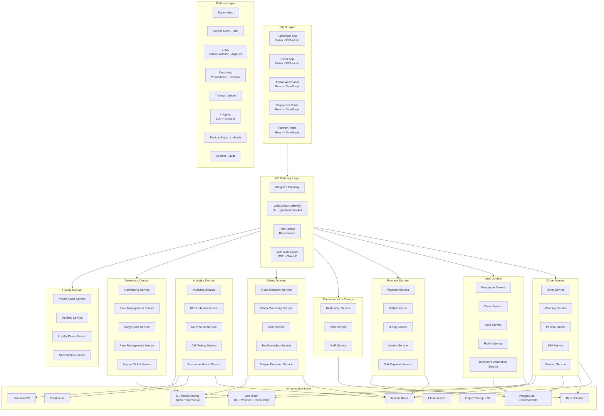
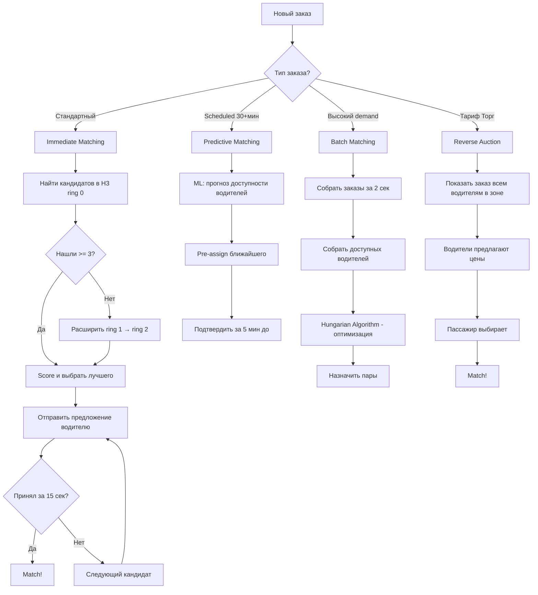

# Идеальная архитектура такси-агрегатора нового поколения

> **Версия:** 1.0  
> **Дата:** 2026-03-06  
> **Язык:** Русский  
> **Статус:** Актуальный  
> **Связанные документы:**  
> — [01-platform-research.md](./01-platform-research.md) — архитектуры 12 платформ  
> — [02-tech-stack-opensource.md](./02-tech-stack-opensource.md) — техстеки и open-source  
> — [03-comparative-matrix.md](./03-comparative-matrix.md) — сравнительная матрица

---

## Содержание

1. [Раздел 1: Философия и принципы архитектуры](#раздел-1-философия-и-принципы-архитектуры)
2. [Раздел 2: Высокоуровневая архитектура](#раздел-2-высокоуровневая-архитектура)
3. [Раздел 3: Детальное описание каждого микросервиса](#раздел-3-детальное-описание-каждого-микросервиса)
4. [Раздел 4: Алгоритм матчинга](#раздел-4-алгоритм-матчинга)
5. [Раздел 5: Алгоритм ценообразования](#раздел-5-алгоритм-ценообразования)
6. [Раздел 6: Архитектура данных](#раздел-6-архитектура-данных)
7. [Раздел 7: Полная спецификация экранов приложений](#раздел-7-полная-спецификация-экранов-приложений)
8. [Раздел 8: Рекомендуемый техстек](#раздел-8-рекомендуемый-техстек)
9. [Раздел 9: Архитектурные диаграммы](#раздел-9-архитектурные-диаграммы)

---

## Раздел 1: Философия и принципы архитектуры

Архитектура спроектирована на основе анализа 12 ведущих платформ мира. Каждый принцип обоснован реальным опытом лидеров индустрии.

### Принцип 1: Microservice-first с Domain-Driven Design

**Суть:** Система строится как совокупность независимых микросервисов, организованных по бизнес-доменам, а не по техническим слоям.

**Обоснование:** Uber прошёл путь от монолита Python к 4000+ микросервисам. Яндекс Go использует доменную модель для объединения такси, еды и доставки. Bolt доказал, что даже при меньшем масштабе доменная декомпозиция даёт гибкость развития.

**Применение:**
- 8 основных доменов: Order, User, Payment, Communication, Safety, Analytics, Operations, Loyalty
- Каждый домен — автономная команда с full ownership
- Bounded Context — строгие границы между доменами
- Shared Kernel — общие типы только через контракты (protobuf/OpenAPI)
- Anti-corruption layer — адаптеры при интеграции с внешними системами

---

### Принцип 2: Event-Driven Architecture — Async by Default

**Суть:** Межсервисная коммуникация по умолчанию асинхронная через события. Синхронные вызовы — исключение для критического пути.

**Обоснование:** Uber обрабатывает триллионы сообщений через Kafka ежедневно. Яндекс Go использует YDB + Kafka для event sourcing. DiDi применяет RocketMQ для обработки 100M+ заказов в день.

**Применение:**
- Apache Kafka — единая шина событий для всех доменов
- Event Sourcing для Order Domain — полная история изменений заказа
- CQRS — разделение записи и чтения для высоконагруженных сервисов
- Saga Pattern — координация распределённых транзакций
- Dead Letter Queue — обработка failed events
- Exactly-once semantics через idempotency keys

---

### Принцип 3: Real-time by Design

**Суть:** Все ключевые потоки данных работают в реальном времени. Задержка — враг пользовательского опыта.

**Обоснование:** Uber обновляет позиции водителей каждые 4 секунды для миллионов устройств. Яндекс Go обеспечивает плавную анимацию движения водителя через интерполяцию на клиенте. Bolt обеспечивает matching за 2-3 секунды.

**Применение:**
- WebSocket — push-обновления позиций водителей к пассажирам
- gRPC Streaming — межсервисная потоковая передача данных
- Redis Pub/Sub — real-time уведомления внутри кластера
- Client-side interpolation — плавная анимация между обновлениями GPS
- Server-Sent Events (SSE) — fallback для сред без WebSocket
- Target latency: matching < 3 сек, ETA update < 1 сек, location update < 4 сек

---

### Принцип 4: ML-Native — машинное обучение встроено в каждый ключевой модуль

**Суть:** ML не дополнение, а фундаментальная часть каждого критического модуля системы.

**Обоснование:** Uber Michelangelo обслуживает тысячи ML-моделей. DiDi использует AI для мониторинга усталости водителей и прогнозирования спроса. Grab применяет ML для fraud detection и dynamic pricing.

**Применение:**
- Matching — ML-scoring качества пары водитель-пассажир
- Pricing — прогнозирование спроса через LSTM/Prophet
- ETA — нейросетевая модель с учётом трафика, погоды, событий
- Fraud Detection — anomaly detection для фрод-транзакций
- Safety — computer vision для мониторинга усталости водителя
- Recommendations — персонализированные тарифы и маршруты
- Churn Prediction — прогнозирование оттока водителей и пассажиров

---

### Принцип 5: Multi-Region / Multi-Tenant

**Суть:** Архитектура изначально спроектирована для работы в нескольких регионах с изоляцией данных и независимым масштабированием.

**Обоснование:** Uber работает в 70+ странах с разными требованиями к хранению данных (GDPR, локальные законы). Grab — суперапп в 8 странах ЮВА с локальными платёжными системами. Careem адаптировал платформу под 15 стран Ближнего Востока с RTL и локальными регуляциями.

**Применение:**
- Региональные кластеры Kubernetes — data residency compliance
- Tenant-based routing на уровне API Gateway
- Конфигурация по городам: тарифы, комиссии, валюты, языки
- Региональные платёжные адаптеры
- Multi-currency support с real-time конвертацией
- Локализация: RTL, форматы дат, адресов, телефонов

---

### Принцип 6: Safety-First — безопасность как архитектурный приоритет

**Суть:** Безопасность пассажиров и водителей встроена в каждый слой системы, а не добавлена постфактум.

**Обоснование:** DiDi — мировой лидер по safety (запись поездок, мониторинг усталости, детекция аномальных маршрутов). Uber внедрил SOS-кнопку, верификацию PIN-кодом и sharing поездки после инцидентов 2017-2018. Grab обязует верификацию лица водителя перед каждой сменой.

**Применение:**
- Маскировка номеров телефонов (VoIP proxy) — Uber/Яндекс Go модель
- SOS-кнопка с автоматическим уведомлением экстренных служб
- Запись аудио/видео в поездке (opt-in) — DiDi модель
- Детекция отклонения от маршрута с алертом пассажиру
- Верификация водителя по лицу — Grab/DiDi модель
- PIN-код для подтверждения пассажира — Uber модель
- Share trip в реальном времени с доверенными контактами
- Speed monitoring — алерт при превышении скорости
- Fatigue detection — мониторинг времени за рулём

---

### Принцип 7: Offline-Resilient — устойчивость к потере связи

**Суть:** Ключевые функции работают при нестабильном интернет-соединении. Приложение не «падает» при потере связи.

**Обоснование:** Grab работает в регионах ЮВА с нестабильным 3G. Ola оптимизирована для индийских сетей с частыми обрывами. inDriver работает в странах Латинской Америки и Африки с ограниченной инфраструктурой.

**Применение:**
- Optimistic UI — интерфейс реагирует мгновенно, синхронизация в фоне
- Local-first data — кеширование заказов, избранных адресов, последних маршрутов
- Queue-based sync — операции ставятся в очередь при офлайне
- GPS buffering — накопление GPS-точек при потере связи, пакетная отправка
- Graceful degradation — показ последней известной позиции водителя
- Offline maps — кеширование тайлов карты для ключевых зон

---

### Принцип 8: API-First Design

**Суть:** API проектируется до реализации. Контракты — источник истины. Все клиенты работают через единое API.

**Обоснование:** Uber использует OpenAPI + Protobuf для всех сервисов, что позволяет 4000+ сервисам развиваться независимо. Gett строит B2B-платформу на Open API для корпоративных интеграций. Cabify предоставляет API партнёрам для white-label решений.

**Применение:**
- Contract-first approach — Protobuf для gRPC, OpenAPI 3.1 для REST
- API versioning через URL path (/v1/, /v2/) + header-based routing
- BFF (Backend for Frontend) — отдельные API-слои для mobile, web, admin
- API Gateway — единая точка входа с auth, rate limiting, routing
- SDK generation — автогенерация клиентских библиотек из контрактов
- Public API — для партнёрских интеграций и B2B клиентов

---

### Принцип 9: Observable by Default — наблюдаемость встроена в систему

**Суть:** Каждый компонент системы генерирует метрики, логи и трассировки. Проблемы обнаруживаются до того, как их заметит пользователь.

**Обоснование:** Uber создал Jaeger (distributed tracing, передан в CNCF) и M3 (метрики, совместимы с Prometheus). Яндекс Go использует собственный мониторинг на основе Yandex Monitoring. Все крупные платформы инвестируют в observability как в ключевую инфраструктуру.

**Применение:**
- Three Pillars: Metrics (Prometheus) + Logs (Loki/ELK) + Traces (Jaeger)
- Structured logging — JSON-логи с correlation ID во всех сервисах
- Distributed tracing — сквозной trace_id от мобильного клиента до БД
- Business metrics dashboard — заказы/мин, matching rate, ETA accuracy
- SLO/SLI monitoring — автоматические алерты при деградации SLO
- Error budgets — контроль допустимого уровня ошибок по сервисам
- Real-time anomaly detection — ML-модель на метриках для раннего обнаружения проблем

---

### Принцип 10: Feature-Flag Driven Development

**Суть:** Все новые функции выкатываются под feature flags. Релиз кода и релиз функции — независимые процессы.

**Обоснование:** Uber делает 1000+ деплоев в день, контролируя каждый через feature flags. Яндекс Go использует AB-тестирование для каждого изменения ценообразования. Lyft применяет gradual rollout для новых алгоритмов matching.

**Применение:**
- Unleash / собственная система — централизованное управление флагами
- Percentage rollout — постепенная раскатка на 1% → 5% → 25% → 100%
- A/B testing — встроенная система экспериментов
- Kill switch — мгновенное отключение проблемной функции
- User targeting — флаги по городу, платформе, сегменту пользователей
- Trunk-based development — весь код в main, активация через флаги

---

## Раздел 2: Высокоуровневая архитектура

### 2.1 Системная архитектура — обзор



### 2.2 Client Layer — клиентский слой

| Приложение | Технология | Назначение | Пользователи |
|-----------|-----------|-----------|-------------|
| **Passenger Mobile App** | Flutter (iOS/Android) | Заказ, трекинг, оплата, рейтинг | Пассажиры |
| **Driver Mobile App** | Flutter (iOS/Android) | Принятие заказов, навигация, заработок | Водители |
| **Admin Web Panel** | React + TypeScript + Ant Design | Управление платформой, аналитика, модерация | Операторы, менеджеры |
| **Dispatcher Panel** | React + TypeScript | Ручное назначение, мониторинг заказов | Диспетчеры |
| **Partner Web Portal** | React + TypeScript | Управление автопарком, финансовые отчёты | Таксопарки, партнёры |

**Почему Flutter:** Единая кодовая база для iOS и Android. Bolt и Grab успешно используют Flutter. Производительность близка к нативной, hot reload ускоряет разработку. Dart обеспечивает type safety.

**Почему React для веб:** Uber (Base Web), Яндекс Go, Lyft — все используют React для admin-панелей. Богатейшая экосистема компонентов, TypeScript-first подход.

### 2.3 API Gateway Layer

| Компонент | Технология | Назначение |
|-----------|-----------|-----------|
| **API Gateway** | Kong Gateway | Маршрутизация, rate limiting, authentication, request/response transformation |
| **WebSocket Gateway** | Go + gorilla/websocket | Real-time подключения для трекинга, чата, уведомлений |
| **Rate Limiter** | Redis + sliding window | Защита от DDoS, контроль нагрузки по IP/user/API key |
| **Auth Middleware** | JWT + OAuth2 + OTP | Аутентификация, авторизация, RBAC |

**Конфигурация rate limiting:**
- Пассажир: 100 req/min (general), 10 req/min (order creation)
- Водитель: 200 req/min (location updates), 50 req/min (general)
- Admin: 500 req/min
- Public API: по тарифному плану (100–10000 req/min)

### 2.4 Core Domain Services — обзор

**Order Domain** — ядро системы, управление жизненным циклом заказа:
- Order Service, Matching Service, Pricing Service, ETA Service, Routing Service

**User Domain** — управление пользователями и документами:
- Passenger Service, Driver Service, Auth Service, Profile Service, Document Verification Service

**Payment Domain** — финансовые операции:
- Payment Service, Wallet Service, Billing Service, Invoice Service, Split Payment Service

**Communication Domain** — все каналы связи:
- Notification Service, Chat Service, VoIP Service

**Safety Domain** — безопасность пассажиров и водителей:
- Fraud Detection Service, Safety Monitoring Service, SOS Service, Trip Recording Service, Fatigue Detection Service

**Analytics Domain** — данные, ML, аналитика:
- Analytics Service, BI Dashboard Service, ML Pipeline Service, A/B Testing Service, Recommendation Service

**Operations Domain** — операционное управление:
- Geofencing Service, Zone Management Service, Surge Zone Service, Fleet Management Service, Support Ticket Service

**Loyalty Domain** — удержание и вовлечение:
- Promo Code Service, Referral Service, Loyalty Points Service, Subscription Service

### 2.5 Infrastructure Layer

| Компонент | Технология | Назначение | Обоснование |
|-----------|-----------|-----------|-------------|
| **Message Bus** | Apache Kafka | Event streaming между всеми доменами | Uber — крупнейший пользователь Kafka, триллионы msg/day |
| **Cache** | Redis Cluster | Кеширование, сессии, geo-данные, pub/sub | Используется всеми 12 платформами |
| **Primary DB** | PostgreSQL + CockroachDB | ACID-транзакции, основное хранилище | PG — стандарт индустрии; CockroachDB — distributed SQL для multi-region |
| **Time-series DB** | TimescaleDB | GPS-трекинг, метрики, IoT-данные | Расширение PostgreSQL, знакомый SQL |
| **Analytics DB** | ClickHouse | OLAP-аналитика, отчёты, агрегации | Яндекс Go использует ClickHouse, лучшая производительность для аналитических запросов |
| **Search** | Elasticsearch | Полнотекстовый поиск адресов, логирование | Uber, Lyft — ELK для логов и поиска |
| **Object Storage** | S3-compatible (MinIO) | Фото, документы, записи поездок | Стандарт для blob storage |
| **Geo Index** | H3 + PostGIS + Redis GEO | Геопространственная индексация, зоны, позиции | H3 — open-source от Uber, лучшая гексагональная сетка |
| **ML Serving** | Triton Inference Server | Обслуживание ML-моделей с минимальной latency | NVIDIA, поддержка PyTorch/TensorFlow/ONNX |

### 2.6 Platform Layer

| Компонент | Технология | Назначение |
|-----------|-----------|-----------|
| **Orchestration** | Kubernetes (K8s) | Оркестрация контейнеров, auto-scaling, self-healing |
| **Service Mesh** | Istio | mTLS, traffic management, observability, circuit breaking |
| **CI/CD** | GitHub Actions + ArgoCD | Continuous Integration + GitOps Continuous Delivery |
| **Monitoring** | Prometheus + Grafana | Метрики, алерты, дашборды |
| **Tracing** | Jaeger | Distributed tracing для микросервисов |
| **Error Tracking** | Sentry | Tracking ошибок в mobile и backend |
| **Logging** | Loki + Grafana | Централизованные логи |
| **Feature Flags** | Unleash | Feature toggles, A/B testing, gradual rollout |
| **Secrets** | HashiCorp Vault | Управление секретами, сертификатами, ключами |
| **CDN** | Cloudflare | Static assets, DDoS protection, edge caching |

---

## Раздел 3: Детальное описание каждого микросервиса

---

### ORDER DOMAIN

---

#### 3.1 Order Service

**Назначение:** Центральный сервис управления жизненным циклом заказа. Обрабатывает создание, обновление статусов, отмену и завершение заказов. Является оркестратором Order Saga.

**API Endpoints:**

| Метод | Endpoint | Описание | Параметры |
|-------|----------|----------|-----------|
| POST | /api/v1/orders | Создать заказ | pickup, destination, stops, tariff_id, payment_method |
| GET | /api/v1/orders/:id | Получить заказ | order_id |
| PATCH | /api/v1/orders/:id/status | Обновить статус | status, metadata |
| POST | /api/v1/orders/:id/cancel | Отменить заказ | reason, cancelled_by |
| GET | /api/v1/orders/active | Активный заказ пользователя | user_id |
| GET | /api/v1/orders/history | История заказов | user_id, page, limit, date_from, date_to |
| POST | /api/v1/orders/:id/rate | Оценить поездку | rating, tags, comment, tip |
| POST | /api/v1/orders/scheduled | Запланировать заказ | pickup, destination, scheduled_at |
| gRPC | OrderService.Create | Создать заказ (internal) | CreateOrderRequest |
| gRPC | OrderService.UpdateStatus | Обновить статус (internal) | UpdateStatusRequest |

**Events Produced:**
- `order.created` — заказ создан, запускает matching
- `order.status_changed` — изменение статуса (любой переход)
- `order.cancelled` — заказ отменён (пассажиром или системой)
- `order.completed` — поездка завершена
- `order.rated` — поездка оценена
- `order.scheduled` — запланированный заказ создан

**Events Consumed:**
- `matching.driver_found` — водитель найден → обновить статус заказа
- `payment.completed` — оплата прошла → финализировать заказ
- `payment.failed` — оплата не прошла → пометить для retry
- `driver.arrived` — водитель прибыл → обновить статус
- `driver.trip_started` — поездка началась
- `driver.trip_ended` — поездка завершена

**Data Model:**

| Поле | Тип | Описание |
|------|-----|----------|
| id | UUID | Уникальный идентификатор заказа |
| passenger_id | UUID | FK → passengers |
| driver_id | UUID | FK → drivers (nullable до matching) |
| status | ENUM | idle, searching, matched, arriving, arrived, in_trip, completed, cancelled |
| pickup_address | TEXT | Текстовый адрес подачи |
| pickup_lat | DECIMAL(10,7) | Широта точки подачи |
| pickup_lng | DECIMAL(10,7) | Долгота точки подачи |
| destination_address | TEXT | Текстовый адрес назначения |
| destination_lat | DECIMAL(10,7) | Широта назначения |
| destination_lng | DECIMAL(10,7) | Долгота назначения |
| stops | JSONB | Массив промежуточных точек |
| tariff_id | VARCHAR(32) | Идентификатор тарифа |
| estimated_price | DECIMAL(10,2) | Предварительная стоимость |
| final_price | DECIMAL(10,2) | Итоговая стоимость (nullable) |
| estimated_distance_km | DECIMAL(8,2) | Расчётная дистанция |
| estimated_duration_min | INTEGER | Расчётное время в минутах |
| actual_distance_km | DECIMAL(8,2) | Фактическая дистанция |
| actual_duration_min | INTEGER | Фактическое время |
| payment_method | ENUM | card, cash, wallet, apple_pay, google_pay, corporate |
| surge_multiplier | DECIMAL(4,2) | Множитель surge pricing |
| pin_code | CHAR(4) | PIN для подтверждения посадки |
| rating | SMALLINT | Оценка 1-5 (nullable) |
| rating_tags | TEXT[] | Теги к оценке |
| rating_comment | TEXT | Комментарий к оценке |
| tip_amount | DECIMAL(10,2) | Чаевые |
| city_id | INTEGER | FK → cities (для шардирования) |
| scheduled_at | TIMESTAMPTZ | Время запланированной поездки |
| created_at | TIMESTAMPTZ | Время создания |
| updated_at | TIMESTAMPTZ | Время обновления |
| completed_at | TIMESTAMPTZ | Время завершения |
| cancelled_at | TIMESTAMPTZ | Время отмены |
| cancel_reason | TEXT | Причина отмены |
| cancelled_by | ENUM | passenger, driver, system |
| metadata | JSONB | Дополнительные данные |

**Зависимости:** Matching Service, Pricing Service, ETA Service, Payment Service, Notification Service  
**SLA:** p99 latency < 200ms (create), p99 < 100ms (get); availability 99.99%  
**Технология:** Go, gRPC + REST, PostgreSQL, Redis (active order cache), Kafka

---

#### 3.2 Matching Service

**Назначение:** Подбор оптимального водителя для заказа. Использует многофакторный ML-scoring, геоиндексацию H3 и три стратегии матчинга: immediate, batch и predictive. Является самым критичным сервисом по latency.

**API Endpoints:**

| Метод | Endpoint | Описание | Параметры |
|-------|----------|----------|-----------|
| gRPC | MatchingService.FindDriver | Запустить поиск водителя | order_id, pickup_location, tariff_id, preferences |
| gRPC | MatchingService.CancelSearch | Отменить поиск | order_id |
| gRPC | MatchingService.GetCandidates | Получить кандидатов | location, radius, tariff_id, limit |
| gRPC | MatchingService.AcceptOrder | Водитель принял заказ | driver_id, order_id |
| gRPC | MatchingService.RejectOrder | Водитель отклонил заказ | driver_id, order_id, reason |
| gRPC | MatchingService.GetMatchMetrics | Метрики матчинга | time_range, city_id |

**Events Produced:**
- `matching.search_started` — начат поиск водителя
- `matching.driver_found` — водитель найден и принял заказ
- `matching.driver_rejected` — водитель отклонил, ищем следующего
- `matching.no_drivers` — ни один водитель не найден
- `matching.timeout` — таймаут поиска (> 60 сек)
- `matching.batch_completed` — batch matching цикл завершён

**Events Consumed:**
- `order.created` — начать поиск водителя
- `order.cancelled` — прекратить поиск
- `driver.location_updated` — обновление позиции водителя в geo-индексе
- `driver.status_changed` — водитель online/offline/busy
- `driver.shift_started` — водитель начал смену
- `driver.shift_ended` — водитель завершил смену

**Data Model:**

| Поле | Тип | Описание |
|------|-----|----------|
| id | UUID | ID матчинг-сессии |
| order_id | UUID | FK → orders |
| strategy | ENUM | immediate, batch, predictive, auction |
| candidates | JSONB | Массив рассмотренных кандидатов с scores |
| selected_driver_id | UUID | Выбранный водитель |
| match_score | DECIMAL(5,4) | Score выбранного водителя |
| attempts | INTEGER | Количество попыток |
| h3_cells_searched | TEXT[] | Массив просмотренных H3-ячеек |
| search_radius_km | DECIMAL(5,2) | Финальный радиус поиска |
| latency_ms | INTEGER | Время поиска в мс |
| status | ENUM | searching, matched, failed, cancelled |
| created_at | TIMESTAMPTZ | Время начала |
| matched_at | TIMESTAMPTZ | Время успешного матча |

**Зависимости:** Driver Service (позиции, статусы), ETA Service (время подачи), ML Pipeline Service (scoring model)  
**SLA:** p99 latency < 3000ms (full cycle), p99 < 50ms (single candidate scoring); availability 99.99%  
**Технология:** Go, gRPC, Redis GEO + H3, ML model via Triton, Kafka

---

#### 3.3 Pricing Service

**Назначение:** Расчёт стоимости поездки. Включает base fare, surge pricing, скидки, промокоды и upfront pricing. Использует ML для прогнозирования оптимальной цены и surge-зон.

**API Endpoints:**

| Метод | Endpoint | Описание | Параметры |
|-------|----------|----------|-----------|
| POST | /api/v1/pricing/estimate | Предварительный расчёт цены | pickup, destination, tariff_id, payment_method, promo_code |
| POST | /api/v1/pricing/calculate | Окончательный расчёт (после поездки) | order_id, actual_distance, actual_duration, route_waypoints |
| GET | /api/v1/pricing/surge | Текущий surge по зоне | h3_cell, tariff_id |
| GET | /api/v1/pricing/tariffs | Список тарифов для города | city_id, location |
| gRPC | PricingService.EstimatePrice | Расчёт цены (internal) | EstimatePriceRequest |
| gRPC | PricingService.GetSurge | Surge по ячейке (internal) | GetSurgeRequest |

**Events Produced:**
- `pricing.estimated` — цена рассчитана
- `pricing.surge_updated` — surge в зоне изменился
- `pricing.final_calculated` — финальная цена поездки
- `pricing.tariff_updated` — тариф обновлён

**Events Consumed:**
- `order.created` — рассчитать предварительную цену
- `order.completed` — рассчитать финальную цену
- `analytics.demand_updated` — обновление спроса для surge
- `analytics.supply_updated` — обновление предложения для surge
- `promo.applied` — применён промокод

**Data Model:**

| Поле | Тип | Описание |
|------|-----|----------|
| id | UUID | ID расчёта |
| order_id | UUID | FK → orders |
| tariff_id | VARCHAR(32) | Тариф |
| base_fare | DECIMAL(10,2) | Базовая стоимость |
| distance_fare | DECIMAL(10,2) | Стоимость за расстояние |
| duration_fare | DECIMAL(10,2) | Стоимость за время |
| surge_multiplier | DECIMAL(4,2) | Множитель surge |
| surge_amount | DECIMAL(10,2) | Надбавка surge |
| tolls | DECIMAL(10,2) | Платные дороги |
| airport_fee | DECIMAL(10,2) | Аэропортный сбор |
| discount_amount | DECIMAL(10,2) | Скидка (промокод/подписка) |
| promo_code_id | UUID | FK → promo_codes |
| total_price | DECIMAL(10,2) | Итоговая цена |
| currency | CHAR(3) | Валюта (ISO 4217) |
| price_type | ENUM | estimate, final |
| created_at | TIMESTAMPTZ | Время расчёта |

**Зависимости:** Routing Service (дистанция), Surge Zone Service (surge данные), Promo Code Service (скидки), Zone Management Service (тарифные зоны)  
**SLA:** p99 latency < 150ms (estimate), p99 < 100ms (surge query); availability 99.99%  
**Технология:** Go, gRPC + REST, PostgreSQL, Redis (surge cache), ML model (demand forecast)

---

#### 3.4 ETA Service

**Назначение:** Расчёт времени прибытия водителя к пассажиру (ETA pickup) и времени поездки до назначения (ETA trip). Использует нейросетевую модель с учётом трафика реального времени, погоды и исторических данных.

**API Endpoints:**

| Метод | Endpoint | Описание | Параметры |
|-------|----------|----------|-----------|
| POST | /api/v1/eta/pickup | ETA водителя до пассажира | driver_location, pickup_location |
| POST | /api/v1/eta/trip | ETA поездки | pickup, destination, departure_time |
| POST | /api/v1/eta/batch | Batch ETA для нескольких водителей | drivers_locations, pickup_location |
| gRPC | ETAService.CalculateETA | Расчёт ETA (internal) | ETARequest |
| gRPC | ETAService.BatchETA | Массовый расчёт ETA | BatchETARequest |

**Events Produced:**
- `eta.calculated` — ETA рассчитан
- `eta.updated` — ETA обновлён (при изменении трафика)

**Events Consumed:**
- `traffic.updated` — обновление трафик-данных
- `weather.updated` — обновление погоды
- `driver.location_updated` — пересчёт ETA водителя

**Data Model:**

| Поле | Тип | Описание |
|------|-----|----------|
| id | UUID | ID расчёта |
| origin_lat | DECIMAL(10,7) | Широта начала |
| origin_lng | DECIMAL(10,7) | Долгота начала |
| dest_lat | DECIMAL(10,7) | Широта конца |
| dest_lng | DECIMAL(10,7) | Долгота конца |
| eta_seconds | INTEGER | Расчётное время в секундах |
| distance_meters | INTEGER | Расчётная дистанция в метрах |
| confidence | DECIMAL(3,2) | Уверенность прогноза (0-1) |
| model_version | VARCHAR(32) | Версия ML-модели |
| traffic_factor | DECIMAL(4,2) | Коэффициент трафика |
| weather_factor | DECIMAL(4,2) | Коэффициент погоды |
| created_at | TIMESTAMPTZ | Время расчёта |

**Зависимости:** Routing Service (маршрут), ML Pipeline Service (модель ETA), traffic data provider  
**SLA:** p99 latency < 100ms (single), p99 < 300ms (batch 50 drivers); availability 99.99%  
**Технология:** Go, gRPC, Redis (ETA cache, TTL 30s), ML model (Triton), TimescaleDB (traffic history)

---

#### 3.5 Routing Service

**Назначение:** Построение маршрутов между точками. Расчёт дистанции, оптимальных маршрутов с учётом трафика, ограничений (пешеходные зоны, грузовые ограничения). Поддержка turn-by-turn navigation для водительского приложения.

**API Endpoints:**

| Метод | Endpoint | Описание | Параметры |
|-------|----------|----------|-----------|
| POST | /api/v1/routes/calculate | Построить маршрут | origin, destination, waypoints, avoid, departure_time |
| POST | /api/v1/routes/alternatives | Альтернативные маршруты | origin, destination, count |
| GET | /api/v1/routes/:id/navigation | Turn-by-turn навигация | route_id |
| POST | /api/v1/routes/distance-matrix | Матрица расстояний | origins, destinations |
| gRPC | RoutingService.GetRoute | Маршрут (internal) | RouteRequest |
| gRPC | RoutingService.DistanceMatrix | Матрица расстояний (internal) | DistanceMatrixRequest |

**Events Produced:**
- `routing.route_calculated` — маршрут построен
- `routing.route_deviated` — отклонение от маршрута
- `routing.rerouted` — маршрут перестроен

**Events Consumed:**
- `traffic.incident_reported` — ДТП/перекрытие дороги
- `order.created` — рассчитать маршрут для нового заказа
- `driver.location_updated` — проверка отклонения от маршрута

**Data Model:**

| Поле | Тип | Описание |
|------|-----|----------|
| id | UUID | ID маршрута |
| order_id | UUID | FK → orders |
| origin | POINT | Начальная точка (PostGIS) |
| destination | POINT | Конечная точка (PostGIS) |
| waypoints | JSONB | Промежуточные точки |
| polyline | TEXT | Encoded polyline (Google format) |
| distance_meters | INTEGER | Дистанция |
| duration_seconds | INTEGER | Время в пути |
| steps | JSONB | Turn-by-turn инструкции |
| toll_cost | DECIMAL(10,2) | Стоимость платных дорог |
| created_at | TIMESTAMPTZ | Время расчёта |

**Зависимости:** OSRM / Valhalla (routing engine), traffic data, PostGIS  
**SLA:** p99 latency < 200ms (single route), p99 < 500ms (distance matrix 10x10); availability 99.95%  
**Технология:** Go, gRPC + REST, OSRM/Valhalla, PostGIS, Redis (route cache)

---

### USER DOMAIN

---

#### 3.6 Passenger Service

**Назначение:** Управление профилями пассажиров, их предпочтениями, избранными адресами, историей поведения. Хранение и обработка данных, связанных с клиентским опытом.

**API Endpoints:**

| Метод | Endpoint | Описание | Параметры |
|-------|----------|----------|-----------|
| GET | /api/v1/passengers/:id | Профиль пассажира | passenger_id |
| PATCH | /api/v1/passengers/:id | Обновить профиль | name, email, avatar, language, preferences |
| GET | /api/v1/passengers/:id/favorites | Избранные адреса | passenger_id |
| POST | /api/v1/passengers/:id/favorites | Добавить избранный адрес | label, address, coordinates |
| DELETE | /api/v1/passengers/:id/favorites/:fav_id | Удалить избранный | fav_id |
| GET | /api/v1/passengers/:id/stats | Статистика поездок | passenger_id |

**Events Produced:**
- `passenger.profile_updated` — профиль обновлён
- `passenger.created` — новый пассажир зарегистрирован
- `passenger.deactivated` — аккаунт деактивирован

**Events Consumed:**
- `auth.user_registered` — создать профиль пассажира
- `order.completed` — обновить статистику
- `order.rated` — обновить рейтинг

**Data Model:**

| Поле | Тип | Описание |
|------|-----|----------|
| id | UUID | Уникальный ID |
| user_id | UUID | FK → auth.users |
| first_name | VARCHAR(100) | Имя |
| last_name | VARCHAR(100) | Фамилия |
| email | VARCHAR(255) | Email (nullable) |
| phone | VARCHAR(20) | Телефон |
| avatar_url | TEXT | URL аватара |
| language | CHAR(2) | Язык (ISO 639-1) |
| currency | CHAR(3) | Валюта |
| rating | DECIMAL(3,2) | Рейтинг пассажира |
| total_trips | INTEGER | Всего поездок |
| preferences | JSONB | Предпочтения (кондиционер, тишина и т.д.) |
| default_payment_method | ENUM | Способ оплаты по умолчанию |
| corporate_id | UUID | FK → corporate_accounts (nullable) |
| status | ENUM | active, suspended, deactivated |
| created_at | TIMESTAMPTZ | Время регистрации |
| updated_at | TIMESTAMPTZ | Время обновления |

**Зависимости:** Auth Service, Payment Service (платёжные методы)  
**SLA:** p99 latency < 50ms (get), p99 < 100ms (update); availability 99.99%  
**Технология:** Go, gRPC + REST, PostgreSQL, Redis (profile cache)

---

#### 3.7 Driver Service

**Назначение:** Управление профилями водителей, их статусами (online/offline/busy), сменами, автомобилями, заработком. Обработка GPS-позиций и поддержание real-time geo-индекса доступных водителей.

**API Endpoints:**

| Метод | Endpoint | Описание | Параметры |
|-------|----------|----------|-----------|
| GET | /api/v1/drivers/:id | Профиль водителя | driver_id |
| PATCH | /api/v1/drivers/:id | Обновить профиль | name, avatar, vehicle, preferences |
| POST | /api/v1/drivers/:id/status | Обновить статус | status (online/offline/busy) |
| POST | /api/v1/drivers/:id/location | Обновить позицию | lat, lng, heading, speed, accuracy |
| GET | /api/v1/drivers/:id/earnings | Заработок | period, date_from, date_to |
| GET | /api/v1/drivers/:id/stats | Статистика | period |
| POST | /api/v1/drivers/:id/shift/start | Начать смену | vehicle_id |
| POST | /api/v1/drivers/:id/shift/end | Закончить смену | — |
| GET | /api/v1/drivers/nearby | Водители рядом | lat, lng, radius, tariff_id |

**Events Produced:**
- `driver.location_updated` — позиция обновлена (high-frequency, каждые 4 сек)
- `driver.status_changed` — статус изменён
- `driver.shift_started` — смена начата
- `driver.shift_ended` — смена завершена
- `driver.arrived` — водитель прибыл к пассажиру
- `driver.trip_started` — поездка началась
- `driver.trip_ended` — поездка завершена

**Events Consumed:**
- `auth.driver_registered` — создать профиль водителя
- `matching.driver_found` — обновить статус на busy
- `order.completed` — обновить статус на online, обновить заработок
- `order.cancelled` — обновить статус на online
- `document.verified` — обновить статус документов

**Data Model:**

| Поле | Тип | Описание |
|------|-----|----------|
| id | UUID | Уникальный ID |
| user_id | UUID | FK → auth.users |
| first_name | VARCHAR(100) | Имя |
| last_name | VARCHAR(100) | Фамилия |
| phone | VARCHAR(20) | Телефон |
| email | VARCHAR(255) | Email |
| avatar_url | TEXT | URL аватара |
| rating | DECIMAL(3,2) | Рейтинг (avg) |
| total_trips | INTEGER | Всего поездок |
| acceptance_rate | DECIMAL(5,2) | Процент принятых заказов |
| cancellation_rate | DECIMAL(5,2) | Процент отмен |
| status | ENUM | online, offline, busy, suspended |
| current_location_lat | DECIMAL(10,7) | Текущая широта |
| current_location_lng | DECIMAL(10,7) | Текущая долгота |
| heading | DECIMAL(5,2) | Направление движения (0-360) |
| speed_kmh | DECIMAL(5,1) | Текущая скорость |
| current_h3_cell | VARCHAR(16) | Текущая H3-ячейка |
| allowed_tariffs | TEXT[] | Разрешённые тарифы |
| vehicle_id | UUID | FK → vehicles |
| fleet_id | UUID | FK → fleets (nullable) |
| city_id | INTEGER | FK → cities |
| shift_started_at | TIMESTAMPTZ | Начало текущей смены |
| total_online_hours_today | DECIMAL(4,1) | Часов online сегодня |
| documents_status | ENUM | pending, verified, expired, rejected |
| created_at | TIMESTAMPTZ | Время регистрации |
| updated_at | TIMESTAMPTZ | Время обновления |

**Зависимости:** Auth Service, Document Verification Service, Fleet Management Service  
**SLA:** p99 latency < 30ms (location update), p99 < 50ms (get); availability 99.99%  
**Технология:** Go, gRPC + REST, PostgreSQL, Redis GEO (live positions), H3, Kafka (location events)

---

#### 3.8 Auth Service

**Назначение:** Аутентификация и авторизация пользователей. Поддержка SMS OTP, OAuth2 (Google, Apple, Facebook), email+password. Управление сессиями, токенами, RBAC-ролями.

**API Endpoints:**

| Метод | Endpoint | Описание | Параметры |
|-------|----------|----------|-----------|
| POST | /api/v1/auth/send-otp | Отправить OTP | phone |
| POST | /api/v1/auth/verify-otp | Проверить OTP | phone, code |
| POST | /api/v1/auth/oauth | OAuth вход | provider, token |
| POST | /api/v1/auth/refresh | Обновить токен | refresh_token |
| POST | /api/v1/auth/logout | Выход | — |
| GET | /api/v1/auth/me | Текущий пользователь | — |
| POST | /api/v1/auth/register | Регистрация | phone, name, type (passenger/driver) |

**Events Produced:**
- `auth.user_registered` — пользователь зарегистрирован
- `auth.user_logged_in` — вход в систему
- `auth.user_logged_out` — выход
- `auth.token_refreshed` — токен обновлён
- `auth.otp_sent` — OTP отправлен
- `auth.otp_failed` — неверный OTP (для security monitoring)

**Events Consumed:**
- `fraud.account_flagged` — заблокировать аккаунт
- `admin.user_suspended` — приостановить аккаунт

**Data Model:**

| Поле | Тип | Описание |
|------|-----|----------|
| id | UUID | Уникальный ID пользователя |
| phone | VARCHAR(20) | Телефон (unique) |
| email | VARCHAR(255) | Email (unique, nullable) |
| password_hash | TEXT | Хеш пароля (nullable) |
| user_type | ENUM | passenger, driver, admin, dispatcher, partner |
| oauth_providers | JSONB | Привязанные OAuth провайдеры |
| is_verified | BOOLEAN | Email/телефон верифицирован |
| is_active | BOOLEAN | Аккаунт активен |
| roles | TEXT[] | Массив ролей (RBAC) |
| last_login_at | TIMESTAMPTZ | Последний вход |
| last_login_ip | INET | IP последнего входа |
| failed_login_attempts | INTEGER | Неудачные попытки входа |
| locked_until | TIMESTAMPTZ | Блокировка до (nullable) |
| created_at | TIMESTAMPTZ | Время регистрации |

**Зависимости:** Notification Service (отправка OTP), SMS-провайдер  
**SLA:** p99 latency < 200ms (OTP verify), p99 < 150ms (token); availability 99.999%  
**Технология:** Go, REST, PostgreSQL, Redis (sessions, OTP codes, rate limiting), JWT + RSA

---

#### 3.9 Profile Service

**Назначение:** Универсальный сервис управления расширенным профилем пользователя: настройки, предпочтения, уведомления, языки, темы. Управляет данными, общими для всех типов пользователей.

**API Endpoints:**

| Метод | Endpoint | Описание | Параметры |
|-------|----------|----------|-----------|
| GET | /api/v1/profiles/:user_id | Получить профиль | user_id |
| PATCH | /api/v1/profiles/:user_id | Обновить профиль | settings, preferences |
| POST | /api/v1/profiles/:user_id/avatar | Загрузить аватар | file (multipart) |
| GET | /api/v1/profiles/:user_id/settings | Настройки | user_id |
| PATCH | /api/v1/profiles/:user_id/settings | Обновить настройки | notification_preferences, theme, language |

**Events Produced:**
- `profile.updated` — профиль обновлён
- `profile.avatar_changed` — аватар изменён
- `profile.settings_changed` — настройки изменены

**Events Consumed:**
- `auth.user_registered` — создать дефолтный профиль
- `passenger.profile_updated` — синхронизация
- `driver.profile_updated` — синхронизация

**Data Model:**

| Поле | Тип | Описание |
|------|-----|----------|
| user_id | UUID | FK → auth.users (PK) |
| display_name | VARCHAR(200) | Отображаемое имя |
| avatar_url | TEXT | URL аватара |
| language | CHAR(2) | Язык |
| theme | ENUM | light, dark, system |
| notification_push | BOOLEAN | Push-уведомления |
| notification_sms | BOOLEAN | SMS-уведомления |
| notification_email | BOOLEAN | Email-уведомления |
| notification_promo | BOOLEAN | Промо-уведомления |
| updated_at | TIMESTAMPTZ | Время обновления |

**Зависимости:** Auth Service, S3 (аватары)  
**SLA:** p99 latency < 50ms; availability 99.95%  
**Технология:** Go, REST, PostgreSQL, Redis (cache), S3 (avatars)

---

#### 3.10 Document Verification Service

**Назначение:** Верификация документов водителей: водительское удостоверение, свидетельство о регистрации ТС, страховка, лицензия на перевозку. Модерация фотографий, OCR, проверка сроков действия. По образцу DiDi и Grab — с верификацией лица.

**API Endpoints:**

| Метод | Endpoint | Описание | Параметры |
|-------|----------|----------|-----------|
| POST | /api/v1/documents/upload | Загрузить документ | driver_id, type, file |
| GET | /api/v1/documents/:driver_id | Документы водителя | driver_id |
| PATCH | /api/v1/documents/:id/review | Модерация документа | status, reviewer_comment |
| POST | /api/v1/documents/:driver_id/face-verify | Верификация лица | driver_id, selfie |
| GET | /api/v1/documents/pending | Документы на модерации | page, limit |

**Events Produced:**
- `document.uploaded` — документ загружен
- `document.verified` — документ подтверждён
- `document.rejected` — документ отклонён
- `document.expired` — срок действия истёк
- `document.face_verified` — верификация лица пройдена

**Events Consumed:**
- `auth.driver_registered` — запросить загрузку документов
- `scheduler.daily_check` — проверка сроков действия

**Data Model:**

| Поле | Тип | Описание |
|------|-----|----------|
| id | UUID | ID документа |
| driver_id | UUID | FK → drivers |
| type | ENUM | license, vehicle_registration, insurance, taxi_permit, identity, selfie |
| file_url | TEXT | URL файла в S3 |
| file_hash | VARCHAR(64) | SHA-256 хеш файла |
| status | ENUM | pending, approved, rejected, expired |
| ocr_data | JSONB | Данные OCR (номер, ФИО, дата) |
| expires_at | DATE | Срок действия |
| reviewed_by | UUID | FK → admins |
| reviewed_at | TIMESTAMPTZ | Время модерации |
| rejection_reason | TEXT | Причина отклонения |
| created_at | TIMESTAMPTZ | Время загрузки |

**Зависимости:** S3 (хранение файлов), OCR Service, Face Recognition ML model  
**SLA:** p99 latency < 300ms (upload), p99 < 1000ms (face verify); availability 99.95%  
**Технология:** Go, REST, PostgreSQL, S3, ML (face recognition), Tesseract OCR

---

### PAYMENT DOMAIN

---

#### 3.11 Payment Service

**Назначение:** Обработка платежей за поездки. Интеграция с платёжными шлюзами (Stripe, PayPal, локальные провайдеры). Поддержка карт, Apple Pay, Google Pay. Обработка refunds, диспутов.

**API Endpoints:**

| Метод | Endpoint | Описание | Параметры |
|-------|----------|----------|-----------|
| POST | /api/v1/payments/charge | Списать за поездку | order_id, amount, payment_method_id |
| POST | /api/v1/payments/preauth | Преавторизация | order_id, amount, payment_method_id |
| POST | /api/v1/payments/capture | Capture преавторизации | preauth_id, final_amount |
| POST | /api/v1/payments/refund | Возврат | payment_id, amount, reason |
| GET | /api/v1/payments/:id | Детали платежа | payment_id |
| POST | /api/v1/payments/methods | Добавить платёжный метод | type, token, details |
| GET | /api/v1/payments/methods | Список платёжных методов | user_id |
| DELETE | /api/v1/payments/methods/:id | Удалить платёжный метод | method_id |

**Events Produced:**
- `payment.preauthorized` — преавторизация успешна
- `payment.completed` — оплата прошла
- `payment.failed` — оплата не прошла
- `payment.refunded` — возврат выполнен
- `payment.method_added` — добавлен платёжный метод
- `payment.disputed` — открыт спор

**Events Consumed:**
- `order.completed` — инициировать charge
- `order.cancelled` — отменить преавторизацию или charge cancellation fee
- `billing.payout_requested` — запрос на выплату водителю

**Data Model:**

| Поле | Тип | Описание |
|------|-----|----------|
| id | UUID | ID платежа |
| order_id | UUID | FK → orders |
| payer_id | UUID | FK → users (пассажир) |
| amount | DECIMAL(10,2) | Сумма |
| currency | CHAR(3) | Валюта |
| payment_method_id | UUID | FK → payment_methods |
| gateway | ENUM | stripe, paypal, local_provider |
| gateway_transaction_id | VARCHAR(255) | ID транзакции в шлюзе |
| status | ENUM | pending, preauthorized, completed, failed, refunded, disputed |
| type | ENUM | charge, preauth, capture, refund |
| failure_reason | TEXT | Причина ошибки |
| idempotency_key | VARCHAR(64) | Ключ идемпотентности |
| created_at | TIMESTAMPTZ | Время создания |
| completed_at | TIMESTAMPTZ | Время завершения |
| metadata | JSONB | Дополнительные данные |

**Зависимости:** Stripe/PayPal SDK, Wallet Service, Billing Service, Fraud Detection Service  
**SLA:** p99 latency < 2000ms (charge, зависит от gateway), availability 99.99%  
**Технология:** Go, REST, PostgreSQL (с encryption at rest), Redis (idempotency), Kafka

---

#### 3.12 Wallet Service

**Назначение:** Внутренний кошелёк пользователя. Пополнение, списание, переводы. Хранение бонусных баллов, кешбэк, реферальные бонусы. По модели Grab (GrabPay) и DiDi.

**API Endpoints:**

| Метод | Endpoint | Описание | Параметры |
|-------|----------|----------|-----------|
| GET | /api/v1/wallets/:user_id | Баланс кошелька | user_id |
| POST | /api/v1/wallets/:user_id/topup | Пополнить | amount, payment_method_id |
| POST | /api/v1/wallets/:user_id/debit | Списать | amount, order_id, description |
| POST | /api/v1/wallets/:user_id/credit | Начислить (бонусы) | amount, type, description |
| GET | /api/v1/wallets/:user_id/transactions | История транзакций | page, limit, type |
| POST | /api/v1/wallets/transfer | Перевод между кошельками | from_user_id, to_user_id, amount |

**Events Produced:**
- `wallet.topped_up` — кошелёк пополнен
- `wallet.debited` — средства списаны
- `wallet.credited` — средства начислены (бонусы)
- `wallet.transfer_completed` — перевод выполнен
- `wallet.low_balance` — низкий баланс (алерт)

**Events Consumed:**
- `payment.completed` — начислить кешбэк
- `referral.reward_earned` — начислить реферальный бонус
- `loyalty.points_earned` — начислить баллы лояльности
- `order.completed` — списать за поездку (если оплата кошельком)

**Data Model:**

| Поле | Тип | Описание |
|------|-----|----------|
| id | UUID | ID кошелька |
| user_id | UUID | FK → users (unique) |
| balance | DECIMAL(12,2) | Баланс |
| bonus_balance | DECIMAL(12,2) | Бонусный баланс |
| currency | CHAR(3) | Валюта |
| is_active | BOOLEAN | Активен |
| created_at | TIMESTAMPTZ | Время создания |
| updated_at | TIMESTAMPTZ | Время обновления |

**Зависимости:** Payment Service (пополнение), Loyalty Points Service  
**SLA:** p99 latency < 100ms; availability 99.99%  
**Технология:** Go, REST, PostgreSQL (SERIALIZABLE isolation для балансов), Redis (balance cache)

---

#### 3.13 Billing Service

**Назначение:** Расчёт и выполнение выплат водителям и партнёрам. Ежедневные/еженедельные расчёты, комиссии платформы, удержания. Формирование отчётов для бухгалтерии.

**API Endpoints:**

| Метод | Endpoint | Описание | Параметры |
|-------|----------|----------|-----------|
| GET | /api/v1/billing/drivers/:id/summary | Сводка заработка | driver_id, period |
| GET | /api/v1/billing/drivers/:id/payouts | История выплат | driver_id, page, limit |
| POST | /api/v1/billing/payouts/process | Запустить пакетную выплату | period, city_id |
| GET | /api/v1/billing/commission-report | Отчёт по комиссиям | date_from, date_to, city_id |
| GET | /api/v1/billing/revenue-report | Отчёт по выручке | date_from, date_to |

**Events Produced:**
- `billing.payout_processed` — выплата водителю выполнена
- `billing.payout_failed` — выплата не прошла
- `billing.commission_calculated` — комиссия рассчитана
- `billing.report_generated` — отчёт сгенерирован

**Events Consumed:**
- `order.completed` — добавить в биллинг-queue
- `payment.completed` — подтвердить получение средств
- `scheduler.payout_trigger` — запуск пакетной выплаты

**Data Model:**

| Поле | Тип | Описание |
|------|-----|----------|
| id | UUID | ID записи биллинга |
| driver_id | UUID | FK → drivers |
| order_id | UUID | FK → orders |
| gross_amount | DECIMAL(10,2) | Полная стоимость поездки |
| commission_rate | DECIMAL(5,4) | Ставка комиссии (0.15 = 15%) |
| commission_amount | DECIMAL(10,2) | Сумма комиссии |
| net_amount | DECIMAL(10,2) | Чистый заработок водителя |
| tip_amount | DECIMAL(10,2) | Чаевые (100% водителю) |
| bonus_amount | DECIMAL(10,2) | Бонусы от платформы |
| payout_status | ENUM | pending, processed, failed |
| payout_batch_id | UUID | FK → payout_batches |
| created_at | TIMESTAMPTZ | Время создания |

**Зависимости:** Payment Service, Driver Service, Order Service  
**SLA:** p99 latency < 500ms (summary), batch processing < 30 min (city); availability 99.95%  
**Технология:** Go, REST, PostgreSQL, Kafka (batch processing), ClickHouse (reports)

---

#### 3.14 Invoice Service

**Назначение:** Генерация чеков, счетов-фактур, квитанций для пассажиров и корпоративных клиентов. Поддержка разных налоговых систем и форматов.

**API Endpoints:**

| Метод | Endpoint | Описание | Параметры |
|-------|----------|----------|-----------|
| GET | /api/v1/invoices/:order_id | Получить чек | order_id |
| POST | /api/v1/invoices/:order_id/generate | Сгенерировать чек | order_id, format (pdf/html) |
| GET | /api/v1/invoices/corporate/:corp_id | Корпоративные счета | corp_id, period |
| POST | /api/v1/invoices/corporate/:corp_id/export | Экспорт счетов | format, date_range |

**Events Produced:**
- `invoice.generated` — чек сгенерирован
- `invoice.sent` — чек отправлен пользователю

**Events Consumed:**
- `order.completed` — сгенерировать чек
- `payment.completed` — добавить данные оплаты к чеку

**Data Model:**

| Поле | Тип | Описание |
|------|-----|----------|
| id | UUID | ID чека |
| order_id | UUID | FK → orders |
| user_id | UUID | FK → users |
| amount | DECIMAL(10,2) | Сумма |
| tax_amount | DECIMAL(10,2) | Сумма налога |
| currency | CHAR(3) | Валюта |
| file_url | TEXT | URL PDF-файла |
| invoice_number | VARCHAR(32) | Номер чека |
| created_at | TIMESTAMPTZ | Время создания |

**Зависимости:** Order Service, Payment Service, S3 (PDF storage)  
**SLA:** p99 latency < 2000ms (generate PDF); availability 99.9%  
**Технология:** Go, REST, PostgreSQL, S3, PDF generation (wkhtmltopdf / Puppeteer)

---

#### 3.15 Split Payment Service

**Назначение:** Разделение оплаты поездки между несколькими пассажирами. Поддержка равного и произвольного разделения. По модели Uber Split Fare и Lyft.

**API Endpoints:**

| Метод | Endpoint | Описание | Параметры |
|-------|----------|----------|-----------|
| POST | /api/v1/split/:order_id/create | Создать split | order_id, participants (user_ids), split_type (equal/custom) |
| POST | /api/v1/split/:order_id/accept | Принять split | user_id |
| POST | /api/v1/split/:order_id/decline | Отклонить split | user_id |
| GET | /api/v1/split/:order_id | Статус split | order_id |

**Events Produced:**
- `split.created` — split создан
- `split.accepted` — участник принял
- `split.declined` — участник отклонил
- `split.completed` — все суммы списаны

**Events Consumed:**
- `order.completed` — инициировать списание с участников split
- `payment.completed` — отметить часть split как оплаченную

**Data Model:**

| Поле | Тип | Описание |
|------|-----|----------|
| id | UUID | ID split |
| order_id | UUID | FK → orders |
| initiator_id | UUID | Кто создал split |
| split_type | ENUM | equal, custom |
| total_amount | DECIMAL(10,2) | Полная сумма |
| participants | JSONB | Массив: user_id, amount, status |
| status | ENUM | pending, partially_paid, completed, cancelled |
| created_at | TIMESTAMPTZ | Время создания |

**Зависимости:** Payment Service, Notification Service  
**SLA:** p99 latency < 200ms; availability 99.95%  
**Технология:** Go, REST, PostgreSQL, Kafka

---

### COMMUNICATION DOMAIN

---

#### 3.16 Notification Service

**Назначение:** Отправка уведомлений по всем каналам: push (FCM/APNs), SMS, email, in-app. Управление шаблонами, предпочтениями пользователей, throttling.

**API Endpoints:**

| Метод | Endpoint | Описание | Параметры |
|-------|----------|----------|-----------|
| POST | /api/v1/notifications/send | Отправить уведомление | user_id, channel, template_id, data |
| POST | /api/v1/notifications/broadcast | Mass-рассылка | segment, channel, template_id, data |
| GET | /api/v1/notifications/:user_id | Список уведомлений | user_id, page, limit |
| PATCH | /api/v1/notifications/:id/read | Прочитано | notification_id |
| POST | /api/v1/notifications/device-token | Зарегистрировать устройство | user_id, platform, token |

**Events Produced:**
- `notification.sent` — уведомление отправлено
- `notification.delivered` — уведомление доставлено
- `notification.failed` — ошибка доставки
- `notification.read` — уведомление прочитано

**Events Consumed:**
- `order.status_changed` — уведомить пассажира/водителя о статусе
- `matching.driver_found` — push водителю о новом заказе
- `payment.completed` — push о списании
- `promo.new_offer` — промо-уведомление
- `chat.new_message` — push о новом сообщении
- `safety.sos_triggered` — экстренное уведомление

**Data Model:**

| Поле | Тип | Описание |
|------|-----|----------|
| id | UUID | ID уведомления |
| user_id | UUID | FK → users |
| channel | ENUM | push, sms, email, in_app |
| template_id | VARCHAR(64) | Шаблон |
| title | VARCHAR(200) | Заголовок |
| body | TEXT | Текст |
| data | JSONB | Дополнительные данные для клиента |
| status | ENUM | pending, sent, delivered, failed, read |
| sent_at | TIMESTAMPTZ | Время отправки |
| read_at | TIMESTAMPTZ | Время прочтения |
| created_at | TIMESTAMPTZ | Время создания |

**Зависимости:** FCM, APNs, SMS-провайдер (Twilio), Email-провайдер (SendGrid)  
**SLA:** p99 latency < 500ms (send); push delivery < 3 сек; availability 99.95%  
**Технология:** Go, REST, PostgreSQL, Redis (device tokens, throttling), Kafka (async delivery)

---

#### 3.17 Chat Service

**Назначение:** Real-time чат между пассажиром и водителем в рамках заказа. Поддержка текстовых сообщений, быстрых фраз, шаблонов, перевод сообщений.

**API Endpoints:**

| Метод | Endpoint | Описание | Параметры |
|-------|----------|----------|-----------|
| WebSocket | /ws/chat/:order_id | Подключение к чату | order_id, auth_token |
| POST | /api/v1/chat/:order_id/send | Отправить сообщение (REST fallback) | message, type |
| GET | /api/v1/chat/:order_id/history | История чата | order_id |
| GET | /api/v1/chat/quick-phrases | Быстрые фразы | language |

**Events Produced:**
- `chat.message_sent` — сообщение отправлено
- `chat.message_delivered` — сообщение доставлено
- `chat.message_read` — сообщение прочитано

**Events Consumed:**
- `order.status_changed` — закрыть чат при завершении
- `order.created` — подготовить chat room

**Data Model:**

| Поле | Тип | Описание |
|------|-----|----------|
| id | UUID | ID сообщения |
| order_id | UUID | FK → orders |
| sender_id | UUID | FK → users |
| sender_type | ENUM | passenger, driver |
| message | TEXT | Текст сообщения |
| type | ENUM | text, quick_phrase, image, location |
| status | ENUM | sent, delivered, read |
| created_at | TIMESTAMPTZ | Время отправки |

**Зависимости:** WebSocket Gateway, Notification Service (push для offline)  
**SLA:** p99 latency < 100ms (message delivery); availability 99.95%  
**Технология:** Go, WebSocket + REST, Redis (pub/sub, message store), PostgreSQL (history)

---

#### 3.18 VoIP Service

**Назначение:** Голосовые звонки между пассажиром и водителем с маскировкой реальных номеров телефонов. Proxy-номера для конфиденциальности. По модели Uber и Яндекс Go.

**API Endpoints:**

| Метод | Endpoint | Описание | Параметры |
|-------|----------|----------|-----------|
| POST | /api/v1/voip/:order_id/call | Инициировать звонок | order_id, caller_type |
| GET | /api/v1/voip/:order_id/proxy-number | Получить proxy-номер | order_id, caller_type |
| POST | /api/v1/voip/:order_id/end | Завершить звонок | order_id |

**Events Produced:**
- `voip.call_initiated` — звонок инициирован
- `voip.call_connected` — звонок соединён
- `voip.call_ended` — звонок завершён

**Events Consumed:**
- `order.completed` — освободить proxy-номер
- `order.cancelled` — освободить proxy-номер

**Data Model:**

| Поле | Тип | Описание |
|------|-----|----------|
| id | UUID | ID звонка |
| order_id | UUID | FK → orders |
| caller_id | UUID | FK → users |
| callee_id | UUID | FK → users |
| proxy_number | VARCHAR(20) | Proxy-номер |
| duration_seconds | INTEGER | Длительность |
| status | ENUM | initiated, connected, ended, failed |
| created_at | TIMESTAMPTZ | Время инициации |

**Зависимости:** Twilio / Vonage (VoIP provider), телефонные номера  
**SLA:** Call setup < 3 сек; availability 99.9%  
**Технология:** Go, REST, Twilio SDK, PostgreSQL

---

### SAFETY DOMAIN

---

#### 3.19 Fraud Detection Service

**Назначение:** Обнаружение мошенничества в реальном времени. Фрод-паттерны: фейковые GPS, ghost rides, промокод-абюз, платёжный фрод, account takeover. ML-модели для anomaly detection.

**API Endpoints:**

| Метод | Endpoint | Описание | Параметры |
|-------|----------|----------|-----------|
| gRPC | FraudService.CheckTransaction | Проверка транзакции | transaction_data |
| gRPC | FraudService.CheckOrder | Проверка заказа | order_data |
| gRPC | FraudService.ReportFraud | Сообщить о фроде | entity_type, entity_id, fraud_type |
| GET | /api/v1/fraud/dashboard | Дашборд фрода | date_range, city_id |
| GET | /api/v1/fraud/rules | Правила фрод-детекции | — |
| POST | /api/v1/fraud/rules | Создать правило | rule_definition |

**Events Produced:**
- `fraud.detected` — фрод обнаружен
- `fraud.account_flagged` — аккаунт помечен подозрительным
- `fraud.account_blocked` — аккаунт заблокирован
- `fraud.false_positive` — ложное срабатывание

**Events Consumed:**
- `order.created` — проверить на фрод-паттерны
- `payment.initiated` — проверить платёж
- `driver.location_updated` — проверить GPS spoofing
- `auth.user_logged_in` — проверить account takeover
- `promo.applied` — проверить промокод-абюз

**Data Model:**

| Поле | Тип | Описание |
|------|-----|----------|
| id | UUID | ID инцидента |
| entity_type | ENUM | order, payment, user, driver, promo |
| entity_id | UUID | ID сущности |
| fraud_type | ENUM | gps_spoofing, ghost_ride, payment_fraud, promo_abuse, account_takeover |
| risk_score | DECIMAL(5,4) | Оценка риска (0-1) |
| action_taken | ENUM | none, flagged, blocked, manual_review |
| details | JSONB | Детали обнаружения |
| model_version | VARCHAR(32) | Версия ML-модели |
| resolved | BOOLEAN | Рассмотрено |
| resolved_by | UUID | Кем рассмотрено |
| created_at | TIMESTAMPTZ | Время обнаружения |

**Зависимости:** ML Pipeline Service (модели), Auth Service (блокировка), Analytics Service (паттерны)  
**SLA:** p99 latency < 100ms (real-time check); availability 99.99%  
**Технология:** Go, gRPC, Redis (rule engine cache), PostgreSQL, ML model (Triton), Kafka

---

#### 3.20 Safety Monitoring Service

**Назначение:** Мониторинг безопасности поездки в реальном времени. Отслеживание отклонений от маршрута, превышения скорости, длительных остановок, ночных поездок. По модели DiDi Safety.

**API Endpoints:**

| Метод | Endpoint | Описание | Параметры |
|-------|----------|----------|-----------|
| gRPC | SafetyService.MonitorTrip | Мониторинг поездки | trip_id, location_stream |
| GET | /api/v1/safety/trips/:id/alerts | Алерты поездки | trip_id |
| POST | /api/v1/safety/trips/:id/report | Сообщить о проблеме | trip_id, type, description |
| GET | /api/v1/safety/dashboard | Дашборд безопасности | city_id, date_range |

**Events Produced:**
- `safety.route_deviation` — отклонение от маршрута
- `safety.speed_alert` — превышение скорости
- `safety.long_stop` — длительная остановка (> 5 мин)
- `safety.night_trip_alert` — ночная поездка (23:00–05:00)
- `safety.incident_detected` — инцидент обнаружен

**Events Consumed:**
- `driver.location_updated` — анализ позиции в контексте маршрута
- `order.status_changed` — начать/прекратить мониторинг
- `routing.route_calculated` — получить эталонный маршрут

**Data Model:**

| Поле | Тип | Описание |
|------|-----|----------|
| id | UUID | ID алерта |
| order_id | UUID | FK → orders |
| alert_type | ENUM | route_deviation, speed, long_stop, night_trip, crash_detected |
| severity | ENUM | low, medium, high, critical |
| details | JSONB | Детали (координаты, скорость и т.д.) |
| acknowledged | BOOLEAN | Подтверждён |
| created_at | TIMESTAMPTZ | Время обнаружения |

**Зависимости:** Routing Service (эталонный маршрут), Driver Service (location stream), Notification Service  
**SLA:** p99 latency < 500ms (alert generation); availability 99.99%  
**Технология:** Go, gRPC (streaming), Redis, Kafka, TimescaleDB (location history)

---

#### 3.21 SOS Service

**Назначение:** Экстренная кнопка для пассажиров и водителей. Автоматическое уведомление экстренных служб и доверенных контактов. Запись происходящего, передача координат в реальном времени.

**API Endpoints:**

| Метод | Endpoint | Описание | Параметры |
|-------|----------|----------|-----------|
| POST | /api/v1/sos/trigger | Активировать SOS | user_id, order_id, location |
| POST | /api/v1/sos/:id/resolve | Завершить SOS | sos_id, resolution |
| GET | /api/v1/sos/contacts | Доверенные контакты | user_id |
| POST | /api/v1/sos/contacts | Добавить контакт | user_id, contact_name, contact_phone |
| DELETE | /api/v1/sos/contacts/:id | Удалить контакт | contact_id |

**Events Produced:**
- `sos.triggered` — SOS активирован (HIGH PRIORITY)
- `sos.resolved` — SOS завершён
- `sos.contacts_notified` — доверенные контакты уведомлены

**Events Consumed:**
- `safety.incident_detected` — автоматический SOS при ДТП

**Data Model:**

| Поле | Тип | Описание |
|------|-----|----------|
| id | UUID | ID SOS-инцидента |
| user_id | UUID | FK → users |
| order_id | UUID | FK → orders |
| location_lat | DECIMAL(10,7) | Широта |
| location_lng | DECIMAL(10,7) | Долгота |
| status | ENUM | active, resolved, false_alarm |
| resolution | TEXT | Описание разрешения |
| recording_url | TEXT | URL аудиозаписи |
| contacts_notified | JSONB | Уведомлённые контакты |
| emergency_services_called | BOOLEAN | Вызваны ли экстренные службы |
| created_at | TIMESTAMPTZ | Время активации |
| resolved_at | TIMESTAMPTZ | Время разрешения |

**Зависимости:** Notification Service, Trip Recording Service, Safety Monitoring Service  
**SLA:** p99 latency < 500ms (trigger); availability 99.999%  
**Технология:** Go, REST, PostgreSQL, Redis (Pub/Sub для мгновенной доставки), S3 (recordings)

---

#### 3.22 Trip Recording Service

**Назначение:** Запись аудио/видео поездки для безопасности. Opt-in модель — поездка записывается с согласия обеих сторон. По модели DiDi, который записывает все поездки в Китае.

**API Endpoints:**

| Метод | Endpoint | Описание | Параметры |
|-------|----------|----------|-----------|
| POST | /api/v1/recordings/:order_id/start | Начать запись | order_id, type (audio/video) |
| POST | /api/v1/recordings/:order_id/stop | Остановить запись | order_id |
| GET | /api/v1/recordings/:order_id | Получить запись | order_id |
| POST | /api/v1/recordings/:order_id/upload-chunk | Загрузить чанк | order_id, chunk_data, chunk_index |

**Events Produced:**
- `recording.started` — запись начата
- `recording.stopped` — запись остановлена
- `recording.uploaded` — запись загружена в хранилище

**Events Consumed:**
- `order.status_changed` — автостарт записи при начале поездки
- `sos.triggered` — обязательная запись при SOS

**Data Model:**

| Поле | Тип | Описание |
|------|-----|----------|
| id | UUID | ID записи |
| order_id | UUID | FK → orders |
| type | ENUM | audio, video |
| file_url | TEXT | URL файла в S3 |
| duration_seconds | INTEGER | Длительность |
| file_size_bytes | BIGINT | Размер файла |
| consent_passenger | BOOLEAN | Согласие пассажира |
| consent_driver | BOOLEAN | Согласие водителя |
| retention_until | DATE | Хранить до (GDPR compliance) |
| created_at | TIMESTAMPTZ | Время начала |

**Зависимости:** S3 (storage), Order Service, SOS Service  
**SLA:** p99 latency < 200ms (chunk upload); availability 99.95%  
**Технология:** Go, REST, S3 (multipart upload), PostgreSQL, FFmpeg (encoding)

---

#### 3.23 Driver Fatigue Detection Service

**Назначение:** Мониторинг усталости водителя на основе времени за рулём, паттернов поведения и опционально — камеры. Принудительные перерывы при превышении лимитов. По модели DiDi и Grab.

**API Endpoints:**

| Метод | Endpoint | Описание | Параметры |
|-------|----------|----------|-----------|
| gRPC | FatigueService.CheckDriver | Проверить усталость | driver_id |
| gRPC | FatigueService.ForceBreak | Принудительный перерыв | driver_id, duration_min |
| GET | /api/v1/fatigue/drivers/:id/status | Статус усталости | driver_id |
| GET | /api/v1/fatigue/config | Конфигурация лимитов | city_id |

**Events Produced:**
- `fatigue.warning` — предупреждение об усталости
- `fatigue.break_required` — необходим перерыв (принудительный off-line)
- `fatigue.break_completed` — перерыв окончен

**Events Consumed:**
- `driver.shift_started` — начать отслеживание
- `driver.shift_ended` — остановить отслеживание
- `order.completed` — обновить счётчик поездок

**Data Model:**

| Поле | Тип | Описание |
|------|-----|----------|
| driver_id | UUID | FK → drivers |
| continuous_driving_min | INTEGER | Непрерывное вождение (минут) |
| total_driving_today_min | INTEGER | Всего за день (минут) |
| trips_today | INTEGER | Поездок за день |
| last_break_at | TIMESTAMPTZ | Последний перерыв |
| fatigue_score | DECIMAL(3,2) | Оценка усталости (0-1) |
| status | ENUM | normal, warning, critical, forced_break |
| updated_at | TIMESTAMPTZ | Время обновления |

**Зависимости:** Driver Service, Notification Service, Safety Monitoring Service  
**SLA:** p99 latency < 50ms (check); availability 99.95%  
**Технология:** Go, gRPC, Redis (counters), PostgreSQL, ML model (optional — camera-based)

---

### ANALYTICS DOMAIN

---

#### 3.24 Analytics Service

**Назначение:** Сбор, агрегация и хранение бизнес-событий. Формирование real-time метрик: заказы/мин, revenue, matching rate, ETA accuracy, cancellation rate.

**API Endpoints:**

| Метод | Endpoint | Описание | Параметры |
|-------|----------|----------|-----------|
| POST | /api/v1/analytics/events | Отправить событие | event_type, properties, timestamp |
| GET | /api/v1/analytics/metrics | Метрики в реальном времени | metric_name, granularity, time_range |
| GET | /api/v1/analytics/reports | Отчёты | report_type, date_range, city_id |
| POST | /api/v1/analytics/queries | Ad-hoc запрос | sql_query (ClickHouse) |

**Events Produced:**
- `analytics.metric_updated` — метрика обновлена
- `analytics.anomaly_detected` — аномалия в метриках
- `analytics.report_ready` — отчёт сгенерирован

**Events Consumed:** Слушает ВСЕ события из Kafka для агрегации.

**Data Model:** ClickHouse таблицы — events, metrics, aggregated_metrics.

**Зависимости:** Kafka (все события), ClickHouse, TimescaleDB  
**SLA:** p99 latency < 1 сек (real-time metrics); availability 99.9%  
**Технология:** Go, REST, ClickHouse, TimescaleDB, Kafka Streams, Apache Flink

---

#### 3.25 BI Dashboard Service

**Назначение:** Предоставление данных для бизнес-аналитики: дашборды, графики, отчёты для менеджмента. Визуализация KPI: revenue, orders, drivers online, surge coverage.

**API Endpoints:**

| Метод | Endpoint | Описание | Параметры |
|-------|----------|----------|-----------|
| GET | /api/v1/bi/dashboards | Список дашбордов | role |
| GET | /api/v1/bi/dashboards/:id | Данные дашборда | dashboard_id, filters |
| GET | /api/v1/bi/widgets/:id | Данные виджета | widget_id, time_range |
| POST | /api/v1/bi/export | Экспорт отчёта | format (csv/xlsx/pdf), query |

**Events Consumed:**
- `analytics.metric_updated` — обновление данных дашборда

**Зависимости:** Analytics Service, ClickHouse  
**SLA:** p99 latency < 3 сек (dashboard load); availability 99.9%  
**Технология:** TypeScript (Node.js), REST, ClickHouse, Redis (cache)

---

#### 3.26 ML Pipeline Service

**Назначение:** Управление жизненным циклом ML-моделей: обучение, валидация, деплой, A/B-тестирование моделей, мониторинг дрифта. По модели Uber Michelangelo.

**API Endpoints:**

| Метод | Endpoint | Описание | Параметры |
|-------|----------|----------|-----------|
| POST | /api/v1/ml/models/train | Запустить обучение | model_type, dataset, hyperparams |
| POST | /api/v1/ml/models/:id/deploy | Задеплоить модель | model_id, environment, traffic_percent |
| GET | /api/v1/ml/models | Список моделей | type, status |
| GET | /api/v1/ml/models/:id/metrics | Метрики модели | model_id, date_range |
| POST | /api/v1/ml/predict | Инференс (generic) | model_id, input_data |

**Events Produced:**
- `ml.model_trained` — модель обучена
- `ml.model_deployed` — модель задеплоена
- `ml.drift_detected` — дрифт модели обнаружен
- `ml.prediction_made` — предсказание выполнено

**Events Consumed:**
- `analytics.*` — данные для дообучения моделей
- `order.completed` — feedback для matching model
- `pricing.final_calculated` — feedback для pricing model

**Зависимости:** Triton Inference Server, S3 (model artifacts), ClickHouse (training data)  
**SLA:** p99 latency < 50ms (inference); availability 99.95%  
**Технология:** Python, FastAPI, PyTorch, MLflow, Triton, Kubernetes Jobs

---

#### 3.27 A/B Testing Service

**Назначение:** Управление экспериментами и A/B-тестами. Распределение пользователей по вариантам, сбор метрик, статистический анализ результатов.

**API Endpoints:**

| Метод | Endpoint | Описание | Параметры |
|-------|----------|----------|-----------|
| POST | /api/v1/experiments | Создать эксперимент | name, variants, targeting, metric_goals |
| GET | /api/v1/experiments | Список экспериментов | status |
| GET | /api/v1/experiments/:id | Детали эксперимента | experiment_id |
| GET | /api/v1/experiments/:id/results | Результаты | experiment_id |
| POST | /api/v1/experiments/:id/variant | Получить вариант для пользователя | experiment_id, user_id |
| PATCH | /api/v1/experiments/:id | Обновить (остановить, завершить) | status |

**Events Produced:**
- `experiment.started` — эксперимент запущен
- `experiment.user_assigned` — пользователь назначен в вариант
- `experiment.completed` — эксперимент завершён

**Events Consumed:**
- `order.*` — метрики заказов для экспериментов
- `payment.*` — метрики платежей
- `analytics.metric_updated` — бизнес-метрики

**Зависимости:** Analytics Service, Feature Flags (Unleash)  
**SLA:** p99 latency < 20ms (variant assignment); availability 99.95%  
**Технология:** Go, REST, PostgreSQL, Redis (variant cache), statistical engine (Python)

---

#### 3.28 Recommendation Service

**Назначение:** Персонализированные рекомендации для пассажиров: оптимальный тариф, предложения маршрутов, время заказа. Для водителей: hot zones, оптимальные часы работы.

**API Endpoints:**

| Метод | Endpoint | Описание | Параметры |
|-------|----------|----------|-----------|
| GET | /api/v1/recommendations/passenger/:id | Рекомендации пассажиру | passenger_id, context (time, location) |
| GET | /api/v1/recommendations/driver/:id | Рекомендации водителю | driver_id, context |
| GET | /api/v1/recommendations/hot-zones | Горячие зоны (heatmap) | city_id, time |
| GET | /api/v1/recommendations/demand-forecast | Прогноз спроса | city_id, time_range |

**Events Produced:**
- `recommendation.generated` — рекомендация сгенерирована
- `recommendation.clicked` — пользователь нажал на рекомендацию
- `recommendation.converted` — рекомендация привела к заказу

**Events Consumed:**
- `order.completed` — feedback для модели
- `analytics.demand_updated` — данные спроса
- `driver.location_updated` — позиции водителей для hot zones

**Зависимости:** ML Pipeline Service, Analytics Service, Driver Service  
**SLA:** p99 latency < 200ms; availability 99.9%  
**Технология:** Python, FastAPI, Redis (recommendation cache), ML model

---

### OPERATIONS DOMAIN

---

#### 3.29 Geofencing Service

**Назначение:** Управление геозонами и проверка принадлежности точки к зоне. Используется для определения тарифной зоны, зон surge, зон аэропортов, запрещённых зон.

**API Endpoints:**

| Метод | Endpoint | Описание | Параметры |
|-------|----------|----------|-----------|
| POST | /api/v1/geofences | Создать геозону | name, type, polygon/circle, properties |
| GET | /api/v1/geofences | Список геозон | city_id, type |
| GET | /api/v1/geofences/check | Проверить точку | lat, lng |
| PATCH | /api/v1/geofences/:id | Обновить геозону | polygon, properties |
| DELETE | /api/v1/geofences/:id | Удалить геозону | geofence_id |
| gRPC | GeofenceService.CheckPoint | Проверка точки (internal) | PointCheckRequest |

**Events Produced:**
- `geofence.entered` — объект вошёл в зону
- `geofence.exited` — объект вышел из зоны
- `geofence.updated` — геозона обновлена

**Events Consumed:**
- `driver.location_updated` — проверка входа/выхода из зон
- `order.created` — определение тарифной зоны заказа

**Data Model:**

| Поле | Тип | Описание |
|------|-----|----------|
| id | UUID | ID геозоны |
| name | VARCHAR(200) | Название |
| type | ENUM | city, airport, station, surge, restricted, parking |
| geometry | GEOMETRY (PostGIS) | Полигон зоны |
| h3_cells | TEXT[] | H3-ячейки (для быстрого lookup) |
| properties | JSONB | Свойства зоны (сборы, ограничения) |
| city_id | INTEGER | FK → cities |
| is_active | BOOLEAN | Активна |
| created_at | TIMESTAMPTZ | Время создания |
| updated_at | TIMESTAMPTZ | Время обновления |

**Зависимости:** PostGIS, H3, Redis (geofence cache)  
**SLA:** p99 latency < 10ms (point check); availability 99.99%  
**Технология:** Go, gRPC + REST, PostGIS, H3, Redis

---

#### 3.30 Zone Management Service

**Назначение:** Управление операционными зонами: города, районы, тарифные зоны. Конфигурация тарифов, комиссий, валют и рабочих часов для каждой зоны.

**API Endpoints:**

| Метод | Endpoint | Описание | Параметры |
|-------|----------|----------|-----------|
| GET | /api/v1/zones | Список зон | type, city_id |
| GET | /api/v1/zones/:id | Детали зоны | zone_id |
| POST | /api/v1/zones | Создать зону | name, type, config |
| PATCH | /api/v1/zones/:id | Обновить зону | config |
| GET | /api/v1/zones/:id/tariffs | Тарифы зоны | zone_id |
| PATCH | /api/v1/zones/:id/tariffs | Обновить тарифы | tariffs_config |

**Events Produced:**
- `zone.created` — зона создана
- `zone.updated` — зона обновлена
- `zone.tariffs_changed` — тарифы зоны изменены

**Events Consumed:**
- `analytics.demand_updated` — для автоматической корректировки зон

**Data Model:**

| Поле | Тип | Описание |
|------|-----|----------|
| id | UUID | ID зоны |
| name | VARCHAR(200) | Название |
| type | ENUM | city, district, tariff_zone |
| parent_id | UUID | Родительская зона |
| geometry | GEOMETRY | Полигон |
| timezone | VARCHAR(50) | Часовой пояс |
| currency | CHAR(3) | Валюта |
| language | CHAR(2) | Язык по умолчанию |
| tariffs_config | JSONB | Конфигурация тарифов |
| commission_config | JSONB | Конфигурация комиссий |
| working_hours | JSONB | Рабочие часы |
| is_active | BOOLEAN | Активна |
| created_at | TIMESTAMPTZ | Время создания |

**Зависимости:** Geofencing Service, Pricing Service  
**SLA:** p99 latency < 100ms; availability 99.95%  
**Технология:** Go, REST, PostgreSQL, PostGIS, Redis (zone config cache)

---

#### 3.31 Surge Zone Service

**Назначение:** Real-time расчёт и управление зонами повышенного спроса (surge). Агрегация demand/supply по H3-ячейкам, расчёт surge multiplier, визуализация на карте для водителей.

**API Endpoints:**

| Метод | Endpoint | Описание | Параметры |
|-------|----------|----------|-----------|
| GET | /api/v1/surge/zones | Текущие surge-зоны | city_id |
| GET | /api/v1/surge/heatmap | Тепловая карта спроса | city_id, resolution |
| GET | /api/v1/surge/cell/:h3_index | Surge для ячейки | h3_index |
| POST | /api/v1/surge/override | Ручной override surge | h3_cells, multiplier, duration |
| GET | /api/v1/surge/history | История surge | city_id, date_range |

**Events Produced:**
- `surge.updated` — surge обновлён (каждые 30 сек)
- `surge.zone_activated` — surge-зона активирована
- `surge.zone_deactivated` — surge-зона деактивирована

**Events Consumed:**
- `order.created` — +1 demand в ячейке
- `order.completed` — -1 demand
- `driver.location_updated` — обновление supply
- `driver.status_changed` — online/offline → supply change

**Зависимости:** H3, Analytics Service (demand forecast), Driver Service (supply)  
**SLA:** p99 latency < 50ms (get surge); recalculation cycle < 30 сек; availability 99.99%  
**Технология:** Go, REST + gRPC, Redis (surge cache), H3, TimescaleDB (history), ML model

---

#### 3.32 Fleet Management Service

**Назначение:** Управление автопарками партнёров: добавление автомобилей, назначение водителей, отчёты по флоту, мониторинг состояния ТС.

**API Endpoints:**

| Метод | Endpoint | Описание | Параметры |
|-------|----------|----------|-----------|
| GET | /api/v1/fleets | Список автопарков | — |
| GET | /api/v1/fleets/:id | Детали автопарка | fleet_id |
| POST | /api/v1/fleets | Создать автопарк | name, owner, config |
| GET | /api/v1/fleets/:id/vehicles | Автомобили | fleet_id, status |
| POST | /api/v1/fleets/:id/vehicles | Добавить авто | vehicle_data |
| GET | /api/v1/fleets/:id/drivers | Водители | fleet_id, status |
| GET | /api/v1/fleets/:id/stats | Статистика | fleet_id, period |

**Events Produced:**
- `fleet.vehicle_added` — авто добавлено
- `fleet.vehicle_removed` — авто удалено
- `fleet.driver_assigned` — водитель назначен

**Events Consumed:**
- `driver.shift_started` — обновить статистику флота
- `order.completed` — обновить статистику флота

**Data Model:**

| Поле | Тип | Описание |
|------|-----|----------|
| id | UUID | ID автопарка |
| name | VARCHAR(200) | Название |
| owner_id | UUID | FK → users (partner) |
| city_id | INTEGER | FK → cities |
| commission_override | DECIMAL(5,4) | Переопределение комиссии |
| vehicles_count | INTEGER | Количество авто |
| drivers_count | INTEGER | Количество водителей |
| is_active | BOOLEAN | Активен |
| created_at | TIMESTAMPTZ | Время создания |

**Зависимости:** Driver Service, Vehicle data, Billing Service  
**SLA:** p99 latency < 200ms; availability 99.9%  
**Технология:** Go, REST, PostgreSQL, Redis

---

#### 3.33 Support Ticket Service

**Назначение:** Обработка обращений поддержки от пассажиров, водителей и партнёров. Тикет-система с приоритизацией, SLA и эскалацией.

**API Endpoints:**

| Метод | Endpoint | Описание | Параметры |
|-------|----------|----------|-----------|
| POST | /api/v1/support/tickets | Создать тикет | user_id, order_id, category, description |
| GET | /api/v1/support/tickets | Список тикетов | status, priority, category, page, limit |
| GET | /api/v1/support/tickets/:id | Детали тикета | ticket_id |
| PATCH | /api/v1/support/tickets/:id | Обновить тикет | status, assigned_to, resolution |
| POST | /api/v1/support/tickets/:id/messages | Добавить сообщение | message, attachments |
| GET | /api/v1/support/tickets/:id/messages | Сообщения тикета | ticket_id |

**Events Produced:**
- `support.ticket_created` — тикет создан
- `support.ticket_resolved` — тикет решён
- `support.ticket_escalated` — тикет эскалирован
- `support.sla_breach` — нарушение SLA

**Events Consumed:**
- `order.cancelled` — автоматический тикет при отмене водителем
- `safety.incident_detected` — приоритетный тикет
- `payment.disputed` — тикет на спор по оплате

**Data Model:**

| Поле | Тип | Описание |
|------|-----|----------|
| id | UUID | ID тикета |
| user_id | UUID | FK → users (автор) |
| order_id | UUID | FK → orders (nullable) |
| category | ENUM | payment, driver_behavior, route, pricing, safety, app_issue, other |
| priority | ENUM | low, medium, high, critical |
| status | ENUM | open, in_progress, waiting_user, resolved, closed |
| assigned_to | UUID | FK → admins |
| resolution | TEXT | Описание решения |
| sla_deadline | TIMESTAMPTZ | Дедлайн SLA |
| created_at | TIMESTAMPTZ | Время создания |
| resolved_at | TIMESTAMPTZ | Время решения |

**Зависимости:** Notification Service, Order Service, Payment Service  
**SLA:** p99 latency < 200ms; availability 99.9%  
**Технология:** Go, REST, PostgreSQL, Elasticsearch (поиск по тикетам)

---

### LOYALTY DOMAIN

---

#### 3.34 Promo Code Service

**Назначение:** Управление промокодами: создание, валидация, применение, лимитирование. Поддержка разных типов: фиксированная скидка, процент, бесплатная поездка, реферальный код.

**API Endpoints:**

| Метод | Endpoint | Описание | Параметры |
|-------|----------|----------|-----------|
| POST | /api/v1/promos | Создать промокод | code, type, value, conditions, limits |
| POST | /api/v1/promos/validate | Проверить промокод | code, user_id, order_context |
| POST | /api/v1/promos/apply | Применить промокод | code, user_id, order_id |
| GET | /api/v1/promos | Список промокодов | status, type, page, limit |
| PATCH | /api/v1/promos/:id | Обновить/деактивировать | status, limits |

**Events Produced:**
- `promo.applied` — промокод применён
- `promo.created` — промокод создан
- `promo.expired` — промокод истёк
- `promo.limit_reached` — лимит использований достигнут

**Events Consumed:**
- `order.completed` — учесть использование промокода
- `referral.code_shared` — создать реферальный промокод

**Data Model:**

| Поле | Тип | Описание |
|------|-----|----------|
| id | UUID | ID промокода |
| code | VARCHAR(32) | Код (unique) |
| type | ENUM | fixed_discount, percent_discount, free_ride, cashback |
| value | DECIMAL(10,2) | Значение (сумма или процент) |
| currency | CHAR(3) | Валюта (для fixed) |
| min_order_amount | DECIMAL(10,2) | Минимальная сумма заказа |
| max_discount | DECIMAL(10,2) | Максимальная скидка |
| max_uses_total | INTEGER | Лимит общих использований |
| max_uses_per_user | INTEGER | Лимит на пользователя |
| current_uses | INTEGER | Текущее количество использований |
| valid_from | TIMESTAMPTZ | Действует с |
| valid_until | TIMESTAMPTZ | Действует до |
| city_ids | INTEGER[] | Ограничение по городам |
| tariff_ids | TEXT[] | Ограничение по тарифам |
| is_active | BOOLEAN | Активен |
| created_at | TIMESTAMPTZ | Время создания |

**Зависимости:** Pricing Service, Fraud Detection Service (промокод-абюз)  
**SLA:** p99 latency < 50ms (validate); availability 99.99%  
**Технология:** Go, REST, PostgreSQL, Redis (promo cache, counters)

---

#### 3.35 Referral Service

**Назначение:** Реферальная программа: генерация уникальных кодов, отслеживание рефералов, начисление бонусов обоим сторонам.

**API Endpoints:**

| Метод | Endpoint | Описание | Параметры |
|-------|----------|----------|-----------|
| GET | /api/v1/referrals/:user_id/code | Получить реферальный код | user_id |
| POST | /api/v1/referrals/apply | Применить код при регистрации | referral_code, new_user_id |
| GET | /api/v1/referrals/:user_id/stats | Статистика рефералов | user_id |
| GET | /api/v1/referrals/:user_id/history | История рефералов | user_id, page, limit |

**Events Produced:**
- `referral.code_shared` — код отправлен
- `referral.applied` — реферал зарегистрировался
- `referral.reward_earned` — бонус начислен (после первой поездки реферала)

**Events Consumed:**
- `auth.user_registered` — проверить реферальный код
- `order.completed` — проверить первая ли поездка реферала

**Data Model:**

| Поле | Тип | Описание |
|------|-----|----------|
| id | UUID | ID записи |
| referrer_id | UUID | FK → users (кто пригласил) |
| referred_id | UUID | FK → users (кого пригласили) |
| referral_code | VARCHAR(16) | Код |
| status | ENUM | registered, first_trip_completed, rewarded |
| referrer_reward | DECIMAL(10,2) | Бонус приглашающему |
| referred_reward | DECIMAL(10,2) | Бонус приглашённому |
| created_at | TIMESTAMPTZ | Время регистрации реферала |
| rewarded_at | TIMESTAMPTZ | Время начисления бонуса |

**Зависимости:** Wallet Service, Promo Code Service, Notification Service  
**SLA:** p99 latency < 100ms; availability 99.95%  
**Технология:** Go, REST, PostgreSQL, Redis

---

#### 3.36 Loyalty Points Service

**Назначение:** Программа лояльности с баллами. Начисление баллов за поездки, списание на скидки. Уровни лояльности: Bronze → Silver → Gold → Platinum. По модели Uber Rewards и Grab Rewards.

**API Endpoints:**

| Метод | Endpoint | Описание | Параметры |
|-------|----------|----------|-----------|
| GET | /api/v1/loyalty/:user_id | Статус лояльности | user_id |
| GET | /api/v1/loyalty/:user_id/points | Баланс баллов | user_id |
| GET | /api/v1/loyalty/:user_id/history | История баллов | user_id, page, limit |
| POST | /api/v1/loyalty/:user_id/redeem | Списать баллы | user_id, points, order_id |
| GET | /api/v1/loyalty/tiers | Уровни лояльности | — |

**Events Produced:**
- `loyalty.points_earned` — баллы начислены
- `loyalty.points_redeemed` — баллы списаны
- `loyalty.tier_upgraded` — повышение уровня
- `loyalty.tier_downgraded` — понижение уровня

**Events Consumed:**
- `order.completed` — начислить баллы
- `payment.completed` — рассчитать баллы по сумме

**Data Model:**

| Поле | Тип | Описание |
|------|-----|----------|
| user_id | UUID | FK → users (PK) |
| current_points | INTEGER | Текущий баланс баллов |
| lifetime_points | INTEGER | Всего заработано |
| tier | ENUM | bronze, silver, gold, platinum |
| tier_expires_at | DATE | Срок действия уровня |
| updated_at | TIMESTAMPTZ | Время обновления |

**Зависимости:** Wallet Service, Pricing Service (redemption), Notification Service  
**SLA:** p99 latency < 50ms; availability 99.95%  
**Технология:** Go, REST, PostgreSQL, Redis (points cache)

---

#### 3.37 Subscription Service

**Назначение:** Подписочные планы для пассажиров: ежемесячная подписка с бонусами (скидки, приоритетный matching, бесплатные отмены). По модели Uber One и Lyft Pink.

**API Endpoints:**

| Метод | Endpoint | Описание | Параметры |
|-------|----------|----------|-----------|
| GET | /api/v1/subscriptions/plans | Доступные планы | city_id |
| POST | /api/v1/subscriptions/subscribe | Оформить подписку | user_id, plan_id, payment_method_id |
| POST | /api/v1/subscriptions/:id/cancel | Отменить подписку | subscription_id |
| GET | /api/v1/subscriptions/:user_id | Текущая подписка | user_id |
| GET | /api/v1/subscriptions/:user_id/benefits | Доступные бенефиты | user_id |

**Events Produced:**
- `subscription.activated` — подписка активирована
- `subscription.renewed` — подписка продлена
- `subscription.cancelled` — подписка отменена
- `subscription.expired` — подписка истекла

**Events Consumed:**
- `scheduler.subscription_renewal` — автоматическое продление
- `payment.failed` — проблема с оплатой подписки

**Data Model:**

| Поле | Тип | Описание |
|------|-----|----------|
| id | UUID | ID подписки |
| user_id | UUID | FK → users |
| plan_id | UUID | FK → subscription_plans |
| status | ENUM | active, cancelled, expired, paused |
| started_at | TIMESTAMPTZ | Начало подписки |
| expires_at | TIMESTAMPTZ | Окончание текущего периода |
| auto_renew | BOOLEAN | Автопродление |
| payment_method_id | UUID | FK → payment_methods |
| created_at | TIMESTAMPTZ | Время создания |

**Зависимости:** Payment Service (recurring billing), Notification Service, Pricing Service (discount application)  
**SLA:** p99 latency < 100ms; availability 99.95%  
**Технология:** Go, REST, PostgreSQL, Kafka (renewal scheduling)

---

## Раздел 4: Алгоритм матчинга

### 4.1 Многофакторная модель scoring

Алгоритм матчинга объединяет лучшие подходы Uber DISCO, Яндекс Go и DiDi. Каждый кандидат-водитель оценивается по формуле:

```
match_score = Σ(weight_i × normalized_factor_i)
```

**Входные параметры и их веса:**

| # | Фактор | Вес | Нормализация | Обоснование |
|---|--------|-----|-------------|-------------|
| 1 | Расстояние до пассажира | 0.30 | 1 - (distance / max_radius), [0,1] | Основной фактор — чем ближе, тем лучше. Uber: основной фактор DISCO |
| 2 | ETA до пассажира | 0.25 | 1 - (eta / max_eta), [0,1] | Учитывает трафик, а не только расстояние. Яндекс Go: основной фактор |
| 3 | Рейтинг водителя | 0.10 | (rating - min_rating) / (5 - min_rating), [0,1] | Качество сервиса. DiDi: строгий рейтинговый контроль |
| 4 | Acceptance rate | 0.10 | acceptance_rate / 100, [0,1] | Надёжность — водители с высоким AR получают приоритет |
| 5 | Cancellation rate | 0.05 | 1 - (cancel_rate / max_cancel_rate), [0,1] | Инвертирован — меньше отмен = лучше |
| 6 | Соответствие класса авто | 0.05 | 1.0 (exact) или 0.0 (не подходит) | Фильтр — авто должно соответствовать тарифу |
| 7 | Направление движения | 0.05 | cos(angle_diff), [0,1] | Водитель, едущий В СТОРОНУ пассажира, предпочтителен |
| 8 | Загрузка (часов online) | 0.05 | 1 - (hours_online / max_hours), [0,1] | Fairness — отдых водителю, распределение заказов |
| 9 | ML-бустер | 0.05 | ML-модель: P(accept AND complete), [0,1] | Uber: ML-scoring вероятности успешного завершения |

**Итоговая формула:**

```
match_score = 0.30 × norm_distance
            + 0.25 × norm_eta
            + 0.10 × norm_rating
            + 0.10 × norm_acceptance_rate
            + 0.05 × norm_cancellation_rate
            + 0.05 × vehicle_class_match
            + 0.05 × norm_heading_alignment
            + 0.05 × norm_workload
            + 0.05 × ml_completion_probability
```

**Пороги и фильтры:**
- Минимальный рейтинг: 4.0 (для economy), 4.5 (для business/premium)
- Максимальный ETA: 15 мин (economy), 20 мин (business), 10 мин (premium)
- Acceptance rate > 60% (иначе пенальти)
- Документы: все верифицированы
- Статус: online (не busy, не suspended)

### 4.2 Стратегии матчинга



#### Стратегия 1: Immediate Matching (< 3 сек)
- **Когда:** Стандартные заказы в нормальных условиях
- **Алгоритм:** Greedy — выбрать лучшего кандидата из текущего snapshot
- **Каскадный поиск:** H3 ring 0 → ring 1 → ring 2
- **Timeout:** 15 сек на принятие водителем, максимум 3 кандидата последовательно
- **Источник:** Uber DISCO, Bolt

#### Стратегия 2: Batch Matching (каждые 2 сек)
- **Когда:** Высокий спрос (> 100 заказов/мин в городе)
- **Алгоритм:** Hungarian Algorithm — глобальная оптимизация пар
- **Окно:** 2 секунды батчинга → оптимизация → назначение
- **Преимущество:** Лучше глобально, чем greedy по одному
- **Источник:** Lyft, DiDi

#### Стратегия 3: Predictive Matching (pre-dispatch)
- **Когда:** Запланированные поездки (scheduled, 30+ мин вперёд)
- **Алгоритм:** ML-прогноз доступности водителей ко времени подачи
- **Подтверждение:** За 5 минут до заказа
- **Источник:** Uber Scheduled Rides, Gett

#### Стратегия 4: Reverse Auction (торг)
- **Когда:** Тариф «Торг» — уникальный тариф по модели inDriver
- **Алгоритм:** Заказ виден всем водителям в радиусе, каждый предлагает цену
- **Таймаут:** 60 секунд на сбор предложений
- **Выбор:** Пассажир выбирает водителя (по цене, рейтингу, ETA)
- **Источник:** inDriver

### 4.3 Геоиндексация

**H3 — гексагональная система индексирования от Uber:**

| H3 Resolution | Размер ячейки | Применение |
|--------------|--------------|-----------|
| 7 | ~5.16 км² | Пригородные зоны, межгородские поездки |
| 8 | ~0.74 км² | Городские районы, surge-зоны |
| 9 | ~0.105 км² | Точный поиск водителей, matching |
| 10 | ~0.015 км² | Микрозоны (аэропорты, вокзалы) |

**Каскадный поиск водителей:**

```
1. Определить H3-ячейку pickup (resolution 9)
2. Поиск в ring 0 (1 ячейка) — радиус ~180м
3. Если < 3 кандидатов → ring 1 (7 ячеек) — радиус ~530м
4. Если < 3 кандидатов → ring 2 (19 ячеек) — радиус ~890м
5. Если < 3 кандидатов → расширить до resolution 8, ring 0-1
6. Максимальный радиус: 5 км (economy), 10 км (business)
```

**Хранение позиций водителей:**

```
Redis GEO:
  GEOADD drivers:{city_id}:{tariff} lng lat driver_id
  GEORADIUS drivers:{city_id}:{tariff} lng lat 2 km COUNT 20 ASC

H3 Index (Redis Hash):
  HSET h3:{cell_index} driver_id "{lat,lng,heading,speed,eta,rating}"
  HGETALL h3:{cell_index}
```

**Двойная индексация:** Redis GEO для точного радиального поиска + H3 хеш для быстрого lookup по ячейкам. Обновление: каждые 4 секунды от каждого online-водителя.

---

## Раздел 5: Алгоритм ценообразования

### 5.1 Базовая формула

```
price = base_fare
      + (distance_km × per_km_rate)
      + (duration_min × per_min_rate)
      + surge_amount
      + tolls
      + airport_fee
      + booking_fee
      - discount
```

**Пример расчёта (Economy, Москва):**

| Параметр | Значение |
|----------|---------|
| base_fare | 99 ₽ |
| per_km_rate | 12 ₽/км |
| per_min_rate | 8 ₽/мин |
| distance | 15 км |
| duration | 25 мин |
| surge_multiplier | 1.3x |
| tolls | 0 ₽ |
| airport_fee | 0 ₽ |
| booking_fee | 49 ₽ |
| discount (promo 10%) | -47.9 ₽ |
| **Итого** | **(99 + 180 + 200) × 1.3 + 49 - 47.9 = 623.8 ₽** |

### 5.2 Surge Pricing модель

**Расчёт demand/supply ratio:**

```
surge_ratio = active_orders_in_cell / available_drivers_in_cell
```

| Ratio | Surge Multiplier | Описание |
|-------|-----------------|----------|
| < 1.0 | 1.0x | Нормальный спрос |
| 1.0 – 1.5 | 1.0x – 1.2x | Лёгкое повышение |
| 1.5 – 2.0 | 1.2x – 1.5x | Умеренный surge |
| 2.0 – 3.0 | 1.5x – 2.0x | Высокий surge |
| 3.0 – 5.0 | 2.0x – 3.0x | Очень высокий surge |
| > 5.0 | 3.0x – 5.0x | Экстремальный surge |

**Ограничения (safety caps):**
- Максимальный surge: **5.0x** (hard cap)
- Максимальная цена: **10x** базовой цены маршрута
- Cooldown period: **5 минут** минимум между изменениями surge
- Плавность: изменение не более **±0.3x** за один цикл (30 сек)
- Во время чрезвычайных ситуаций (ЧП, катастрофы): **surge автоматически отключается** — по модели Uber post-2017

**ML-модель прогнозирования спроса:**

```
Модель: LSTM + Feature Engineering
Входные данные:
  - Исторический спрос (7, 14, 30 дней lookback)
  - День недели, час
  - Погода (температура, осадки, ветер)
  - Спецсобытия (концерты, матчи, праздники)
  - Позиции водителей (supply прогноз)
  
Горизонт прогноза: 5, 15, 30, 60 минут
Обновление модели: ежедневно re-train
Альтернативная модель: Prophet (Facebook) — для seasonal patterns
```

### 5.3 Дополнительные факторы ценообразования

| Фактор | Влияние | Источник best practice |
|--------|---------|----------------------|
| Время суток | Пиковые часы 7-10, 17-20: +10-20% к per_km/per_min rate | Uber, Яндекс Go |
| День недели | Пятница вечер, суббота ночь: повышенный базовый surge | Все платформы |
| Погода | Дождь +10%, снег +20%, сильный снег +30% | Uber, Яндекс Go |
| Спецсобытия | Концерты, матчи: зональный surge вокруг стадиона | Uber, Lyft |
| Маршрут | Аэропорт: фиксированная надбавка; вокзал: зона surge | Все платформы |
| Тип оплаты | Наличные: +5% (компенсация рисков) | Bolt, Grab |
| Upfront pricing | Фиксированная цена до поездки на основе ML ETA+route | Uber (2016+) |
| Время ожидания | > 3 мин ожидания пассажира: +per_min_rate | Uber, Яндекс Go |
| Multi-stop | Каждая промежуточная остановка: +50 ₽ flat fee | Uber, Lyft |

### 5.4 Upfront Pricing (фиксированная цена)

По модели Uber, пассажир видит **точную цену** до начала поездки:

```
upfront_price = ML_model(
    pickup_location,
    destination_location,
    current_traffic,
    historical_traffic_pattern,
    weather,
    tariff,
    surge_state,
    time_of_day,
    day_of_week
)
```

- Цена фиксируется на момент заказа
- Не меняется, даже если фактический маршрут длиннее/короче
- Исключения: значительное изменение маршрута пассажиром, multi-stop, длительное ожидание (> 5 мин)
- **Эффект:** +15% конверсия, -20% отмен (данные Uber)

---

## Раздел 6: Архитектура данных

### 6.1 Схема основных таблиц

#### Таблица users

```sql
CREATE TABLE users (
    id              UUID PRIMARY KEY DEFAULT gen_random_uuid(),
    phone           VARCHAR(20) NOT NULL UNIQUE,
    email           VARCHAR(255) UNIQUE,
    password_hash   TEXT,
    user_type       VARCHAR(20) NOT NULL CHECK (user_type IN ('passenger', 'driver', 'admin', 'dispatcher', 'partner')),
    is_verified     BOOLEAN DEFAULT FALSE,
    is_active       BOOLEAN DEFAULT TRUE,
    roles           TEXT[] DEFAULT '{}',
    oauth_providers JSONB DEFAULT '{}',
    last_login_at   TIMESTAMPTZ,
    last_login_ip   INET,
    failed_attempts INTEGER DEFAULT 0,
    locked_until    TIMESTAMPTZ,
    created_at      TIMESTAMPTZ DEFAULT NOW(),
    updated_at      TIMESTAMPTZ DEFAULT NOW()
);

CREATE INDEX idx_users_phone ON users(phone);
CREATE INDEX idx_users_email ON users(email) WHERE email IS NOT NULL;
CREATE INDEX idx_users_type ON users(user_type);
```

#### Таблица drivers

```sql
CREATE TABLE drivers (
    id                      UUID PRIMARY KEY DEFAULT gen_random_uuid(),
    user_id                 UUID NOT NULL REFERENCES users(id),
    first_name              VARCHAR(100) NOT NULL,
    last_name               VARCHAR(100) NOT NULL,
    phone                   VARCHAR(20) NOT NULL,
    email                   VARCHAR(255),
    avatar_url              TEXT,
    rating                  DECIMAL(3,2) DEFAULT 5.00,
    total_trips             INTEGER DEFAULT 0,
    acceptance_rate         DECIMAL(5,2) DEFAULT 100.00,
    cancellation_rate       DECIMAL(5,2) DEFAULT 0.00,
    status                  VARCHAR(20) DEFAULT 'offline' CHECK (status IN ('online', 'offline', 'busy', 'suspended')),
    current_location        GEOGRAPHY(POINT, 4326),
    heading                 DECIMAL(5,2),
    speed_kmh               DECIMAL(5,1),
    current_h3_cell         VARCHAR(16),
    allowed_tariffs         TEXT[] DEFAULT '{economy}',
    vehicle_id              UUID REFERENCES vehicles(id),
    fleet_id                UUID REFERENCES fleets(id),
    city_id                 INTEGER NOT NULL REFERENCES cities(id),
    shift_started_at        TIMESTAMPTZ,
    total_online_hours_today DECIMAL(4,1) DEFAULT 0,
    documents_status        VARCHAR(20) DEFAULT 'pending',
    created_at              TIMESTAMPTZ DEFAULT NOW(),
    updated_at              TIMESTAMPTZ DEFAULT NOW()
);

CREATE INDEX idx_drivers_user_id ON drivers(user_id);
CREATE INDEX idx_drivers_status ON drivers(status) WHERE status = 'online';
CREATE INDEX idx_drivers_city ON drivers(city_id);
CREATE INDEX idx_drivers_location ON drivers USING GIST(current_location);
CREATE INDEX idx_drivers_h3 ON drivers(current_h3_cell) WHERE status = 'online';
```

#### Таблица vehicles

```sql
CREATE TABLE vehicles (
    id              UUID PRIMARY KEY DEFAULT gen_random_uuid(),
    driver_id       UUID REFERENCES drivers(id),
    fleet_id        UUID REFERENCES fleets(id),
    make            VARCHAR(100) NOT NULL,
    model           VARCHAR(100) NOT NULL,
    year            INTEGER NOT NULL,
    color           VARCHAR(50) NOT NULL,
    plate_number    VARCHAR(20) NOT NULL UNIQUE,
    vehicle_class   VARCHAR(20) NOT NULL CHECK (vehicle_class IN ('economy', 'comfort', 'business', 'minivan', 'premium', 'kids', 'green', 'moto')),
    seats           INTEGER DEFAULT 4,
    vin             VARCHAR(17),
    insurance_expiry DATE,
    inspection_expiry DATE,
    is_active       BOOLEAN DEFAULT TRUE,
    photo_url       TEXT,
    created_at      TIMESTAMPTZ DEFAULT NOW(),
    updated_at      TIMESTAMPTZ DEFAULT NOW()
);

CREATE INDEX idx_vehicles_driver ON vehicles(driver_id);
CREATE INDEX idx_vehicles_fleet ON vehicles(fleet_id);
CREATE INDEX idx_vehicles_class ON vehicles(vehicle_class);
```

#### Таблица orders

```sql
CREATE TABLE orders (
    id                      UUID PRIMARY KEY DEFAULT gen_random_uuid(),
    passenger_id            UUID NOT NULL REFERENCES users(id),
    driver_id               UUID REFERENCES drivers(id),
    status                  VARCHAR(20) NOT NULL DEFAULT 'created',
    pickup_address          TEXT NOT NULL,
    pickup_location         GEOGRAPHY(POINT, 4326) NOT NULL,
    destination_address     TEXT NOT NULL,
    destination_location    GEOGRAPHY(POINT, 4326) NOT NULL,
    stops                   JSONB DEFAULT '[]',
    tariff_id               VARCHAR(32) NOT NULL,
    estimated_price         DECIMAL(10,2) NOT NULL,
    final_price             DECIMAL(10,2),
    estimated_distance_km   DECIMAL(8,2),
    estimated_duration_min  INTEGER,
    actual_distance_km      DECIMAL(8,2),
    actual_duration_min     INTEGER,
    payment_method          VARCHAR(20) NOT NULL,
    surge_multiplier        DECIMAL(4,2) DEFAULT 1.00,
    pin_code                CHAR(4),
    rating                  SMALLINT CHECK (rating BETWEEN 1 AND 5),
    rating_tags             TEXT[],
    rating_comment          TEXT,
    tip_amount              DECIMAL(10,2) DEFAULT 0,
    city_id                 INTEGER NOT NULL REFERENCES cities(id),
    zone_id                 UUID REFERENCES zones(id),
    promo_code_id           UUID REFERENCES promo_codes(id),
    scheduled_at            TIMESTAMPTZ,
    route_polyline          TEXT,
    cancel_reason           TEXT,
    cancelled_by            VARCHAR(20),
    metadata                JSONB DEFAULT '{}',
    created_at              TIMESTAMPTZ DEFAULT NOW(),
    updated_at              TIMESTAMPTZ DEFAULT NOW(),
    completed_at            TIMESTAMPTZ,
    cancelled_at            TIMESTAMPTZ
);

-- Шардирование по city_id + created_at
CREATE INDEX idx_orders_passenger ON orders(passenger_id, created_at DESC);
CREATE INDEX idx_orders_driver ON orders(driver_id, created_at DESC);
CREATE INDEX idx_orders_status ON orders(status) WHERE status NOT IN ('completed', 'cancelled');
CREATE INDEX idx_orders_city_date ON orders(city_id, created_at DESC);
CREATE INDEX idx_orders_pickup ON orders USING GIST(pickup_location);
CREATE INDEX idx_orders_scheduled ON orders(scheduled_at) WHERE scheduled_at IS NOT NULL AND status = 'created';
```

#### Таблица payments

```sql
CREATE TABLE payments (
    id                      UUID PRIMARY KEY DEFAULT gen_random_uuid(),
    order_id                UUID NOT NULL REFERENCES orders(id),
    payer_id                UUID NOT NULL REFERENCES users(id),
    amount                  DECIMAL(10,2) NOT NULL,
    currency                CHAR(3) NOT NULL DEFAULT 'RUB',
    payment_method_id       UUID REFERENCES payment_methods(id),
    gateway                 VARCHAR(50) NOT NULL,
    gateway_transaction_id  VARCHAR(255),
    status                  VARCHAR(20) NOT NULL DEFAULT 'pending',
    type                    VARCHAR(20) NOT NULL CHECK (type IN ('charge', 'preauth', 'capture', 'refund')),
    failure_reason          TEXT,
    idempotency_key         VARCHAR(64) NOT NULL UNIQUE,
    metadata                JSONB DEFAULT '{}',
    created_at              TIMESTAMPTZ DEFAULT NOW(),
    completed_at            TIMESTAMPTZ
);

CREATE INDEX idx_payments_order ON payments(order_id);
CREATE INDEX idx_payments_payer ON payments(payer_id, created_at DESC);
CREATE INDEX idx_payments_status ON payments(status) WHERE status = 'pending';
CREATE INDEX idx_payments_idempotency ON payments(idempotency_key);
```

#### Таблица ratings

```sql
CREATE TABLE ratings (
    id              UUID PRIMARY KEY DEFAULT gen_random_uuid(),
    order_id        UUID NOT NULL UNIQUE REFERENCES orders(id),
    rater_id        UUID NOT NULL REFERENCES users(id),
    rated_id        UUID NOT NULL REFERENCES users(id),
    rater_type      VARCHAR(20) NOT NULL CHECK (rater_type IN ('passenger', 'driver')),
    score           SMALLINT NOT NULL CHECK (score BETWEEN 1 AND 5),
    tags            TEXT[],
    comment         TEXT,
    is_hidden       BOOLEAN DEFAULT FALSE,
    created_at      TIMESTAMPTZ DEFAULT NOW()
);

CREATE INDEX idx_ratings_rated ON ratings(rated_id, created_at DESC);
CREATE INDEX idx_ratings_order ON ratings(order_id);
```

#### Таблица promo_codes

```sql
CREATE TABLE promo_codes (
    id                  UUID PRIMARY KEY DEFAULT gen_random_uuid(),
    code                VARCHAR(32) NOT NULL UNIQUE,
    type                VARCHAR(20) NOT NULL CHECK (type IN ('fixed_discount', 'percent_discount', 'free_ride', 'cashback')),
    value               DECIMAL(10,2) NOT NULL,
    currency            CHAR(3),
    min_order_amount    DECIMAL(10,2),
    max_discount        DECIMAL(10,2),
    max_uses_total      INTEGER,
    max_uses_per_user   INTEGER DEFAULT 1,
    current_uses        INTEGER DEFAULT 0,
    valid_from          TIMESTAMPTZ NOT NULL,
    valid_until         TIMESTAMPTZ NOT NULL,
    city_ids            INTEGER[],
    tariff_ids          TEXT[],
    is_active           BOOLEAN DEFAULT TRUE,
    created_by          UUID REFERENCES users(id),
    created_at          TIMESTAMPTZ DEFAULT NOW()
);

CREATE INDEX idx_promos_code ON promo_codes(code) WHERE is_active = TRUE;
CREATE INDEX idx_promos_valid ON promo_codes(valid_from, valid_until) WHERE is_active = TRUE;
```

#### Таблица zones

```sql
CREATE TABLE zones (
    id              UUID PRIMARY KEY DEFAULT gen_random_uuid(),
    name            VARCHAR(200) NOT NULL,
    type            VARCHAR(30) NOT NULL CHECK (type IN ('city', 'district', 'tariff_zone', 'airport', 'station', 'surge', 'restricted')),
    parent_id       UUID REFERENCES zones(id),
    geometry        GEOMETRY(POLYGON, 4326) NOT NULL,
    h3_cells        TEXT[],
    timezone        VARCHAR(50),
    currency        CHAR(3),
    language        CHAR(2),
    tariffs_config  JSONB,
    commission_config JSONB,
    working_hours   JSONB,
    is_active       BOOLEAN DEFAULT TRUE,
    created_at      TIMESTAMPTZ DEFAULT NOW(),
    updated_at      TIMESTAMPTZ DEFAULT NOW()
);

CREATE INDEX idx_zones_geometry ON zones USING GIST(geometry);
CREATE INDEX idx_zones_type ON zones(type);
CREATE INDEX idx_zones_parent ON zones(parent_id);
```

#### Таблица surge_zones

```sql
CREATE TABLE surge_zones (
    h3_cell         VARCHAR(16) NOT NULL,
    city_id         INTEGER NOT NULL REFERENCES cities(id),
    tariff_id       VARCHAR(32) NOT NULL,
    demand_count    INTEGER DEFAULT 0,
    supply_count    INTEGER DEFAULT 0,
    surge_multiplier DECIMAL(4,2) DEFAULT 1.00,
    updated_at      TIMESTAMPTZ DEFAULT NOW(),
    PRIMARY KEY (h3_cell, tariff_id)
);

-- TimescaleDB hypertable для истории surge
CREATE TABLE surge_history (
    time            TIMESTAMPTZ NOT NULL,
    h3_cell         VARCHAR(16) NOT NULL,
    city_id         INTEGER NOT NULL,
    tariff_id       VARCHAR(32) NOT NULL,
    demand          INTEGER,
    supply          INTEGER,
    multiplier      DECIMAL(4,2)
);
SELECT create_hypertable('surge_history', 'time');
```

#### Таблица notifications

```sql
CREATE TABLE notifications (
    id              UUID PRIMARY KEY DEFAULT gen_random_uuid(),
    user_id         UUID NOT NULL REFERENCES users(id),
    channel         VARCHAR(20) NOT NULL CHECK (channel IN ('push', 'sms', 'email', 'in_app')),
    template_id     VARCHAR(64),
    title           VARCHAR(200),
    body            TEXT,
    data            JSONB,
    status          VARCHAR(20) DEFAULT 'pending',
    sent_at         TIMESTAMPTZ,
    read_at         TIMESTAMPTZ,
    created_at      TIMESTAMPTZ DEFAULT NOW()
);

CREATE INDEX idx_notifications_user ON notifications(user_id, created_at DESC);
CREATE INDEX idx_notifications_status ON notifications(status) WHERE status = 'pending';
```

#### Таблица support_tickets

```sql
CREATE TABLE support_tickets (
    id              UUID PRIMARY KEY DEFAULT gen_random_uuid(),
    user_id         UUID NOT NULL REFERENCES users(id),
    order_id        UUID REFERENCES orders(id),
    category        VARCHAR(30) NOT NULL,
    priority        VARCHAR(10) NOT NULL DEFAULT 'medium',
    status          VARCHAR(20) NOT NULL DEFAULT 'open',
    subject         VARCHAR(500),
    description     TEXT,
    assigned_to     UUID REFERENCES users(id),
    resolution      TEXT,
    sla_deadline    TIMESTAMPTZ,
    created_at      TIMESTAMPTZ DEFAULT NOW(),
    updated_at      TIMESTAMPTZ DEFAULT NOW(),
    resolved_at     TIMESTAMPTZ
);

CREATE INDEX idx_tickets_user ON support_tickets(user_id, created_at DESC);
CREATE INDEX idx_tickets_status ON support_tickets(status) WHERE status NOT IN ('closed', 'resolved');
CREATE INDEX idx_tickets_priority ON support_tickets(priority, created_at) WHERE status = 'open';
CREATE INDEX idx_tickets_assigned ON support_tickets(assigned_to) WHERE status = 'in_progress';
```

#### Таблица driver_documents

```sql
CREATE TABLE driver_documents (
    id              UUID PRIMARY KEY DEFAULT gen_random_uuid(),
    driver_id       UUID NOT NULL REFERENCES drivers(id),
    type            VARCHAR(30) NOT NULL CHECK (type IN ('license', 'vehicle_registration', 'insurance', 'taxi_permit', 'identity', 'selfie')),
    file_url        TEXT NOT NULL,
    file_hash       VARCHAR(64),
    status          VARCHAR(20) DEFAULT 'pending',
    ocr_data        JSONB,
    expires_at      DATE,
    reviewed_by     UUID REFERENCES users(id),
    reviewed_at     TIMESTAMPTZ,
    rejection_reason TEXT,
    created_at      TIMESTAMPTZ DEFAULT NOW()
);

CREATE INDEX idx_documents_driver ON driver_documents(driver_id);
CREATE INDEX idx_documents_status ON driver_documents(status) WHERE status = 'pending';
CREATE INDEX idx_documents_expiry ON driver_documents(expires_at) WHERE status = 'approved';
```

### 6.2 Стратегия шардирования

| Таблица | Ключ шардирования | Стратегия | Обоснование |
|---------|-------------------|-----------|-------------|
| **orders** | city_id + created_at (range) | CockroachDB range sharding | Заказы в одном городе часто запрашиваются вместе; time-based для удобства архивации |
| **users** | user_id (hash) | CockroachDB hash sharding | Равномерное распределение, запросы по user_id |
| **payments** | order_id (hash) | CockroachDB hash sharding | Привязан к заказу, идемпотентные операции |
| **drivers** | city_id (range) | PostgreSQL partitioning | Водители привязаны к городу, geo-запросы внутри города |
| **driver_locations** | Redis Cluster | Hash slots by driver_id | In-memory, TTL 30 сек, обновление каждые 4 сек |
| **surge_zones** | Redis Cluster | Hash by h3_cell | In-memory hot data, PostgreSQL для persistence |
| **notifications** | user_id (hash) + time (range) | TimescaleDB partitioning | Пользователь + время для эффективного retention |
| **analytics_events** | ClickHouse | Partition by toYYYYMM(event_time) + ORDER BY (city_id, event_type) | Аналитика с колоночным хранением |

### 6.3 Hot / Warm / Cold Data Separation

```mermaid
graph LR
    subgraph HOT[Hot Data - Redis Cluster]
        H1[Активные заказы]
        H2[Позиции водителей]
        H3[Surge мультипликаторы]
        H4[Сессии пользователей]
        H5[ETA кеш]
        H6[Promo validation cache]
    end
    
    subgraph WARM[Warm Data - PostgreSQL / CockroachDB]
        W1[Заказы за 30 дней]
        W2[Профили пользователей]
        W3[Платежи за 90 дней]
        W4[Рейтинги]
        W5[Документы водителей]
        W6[Тикеты поддержки]
    end
    
    subgraph COLD[Cold Data - ClickHouse / S3]
        C1[Архив заказов 30+ дней]
        C2[GPS-треки]
        C3[Аналитические события]
        C4[Записи поездок аудио/видео]
        C5[Логи]
        C6[Архив платежей 90+ дней]
    end
    
    HOT -->|TTL expiry / completion| WARM
    WARM -->|Cron: 30 дней| COLD
```



**Политики retention:**

| Тип данных | Hot (Redis) | Warm (PostgreSQL) | Cold (ClickHouse/S3) | Удаление |
|-----------|-------------|-------------------|---------------------|----------|
| Активные заказы | До завершения | 30 дней | 2 года | GDPR request |
| Позиции водителей | TTL 30 сек | — | 90 дней (TimescaleDB) | Автоматически |
| Surge | TTL 60 сек | — | 1 год (TimescaleDB) | Автоматически |
| GPS-треки поездок | — | 7 дней | 1 год | Автоматически |
| Платежи | — | 90 дней | 7 лет (legally required) | По запросу регулятора |
| Чеки/invoices | — | 1 год | 7 лет | По запросу |
| Записи поездок | — | 7 дней | 90 дней (GDPR) | Автоматически |
| Аналитика | — | — | 3 года | Автоматически |

---

## Раздел 7: Полная спецификация экранов приложений

### 7.1 Приложение пассажира — все экраны

| # | Экран | Описание | Ключевые элементы |
|---|-------|----------|-------------------|
| 1 | **Splash Screen** | Экран загрузки с логотипом. Автоматический переход через 1.5 сек. | Логотип, анимация загрузки, проверка auth token |
| 2 | **Onboarding** | 3-4 слайда при первом запуске: Удобные поездки → Безопасность → Выгодные цены → Начать. | Swipe-слайды, skip кнопка, индикаторы |
| 3 | **Регистрация / Вход** | Ввод телефона → OTP → Имя (если новый). OAuth кнопки: Google, Apple, Facebook. | Телефон с маской, таймер повторной отправки OTP, OAuth кнопки |
| 4 | **Главный экран (Карта)** | Полноэкранная карта с текущим местоположением. Bottom sheet «Куда?». Быстрые адреса (дом, работа). | MapLibre/Google Maps, GPS marker, search bar, favorites |
| 5 | **Поиск адреса** | Ввод текста с автодополнением. Недавние адреса. POI поиск (кафе, метро, ТЦ). Выбор точки на карте. | Autocomplete, recent addresses, POI categories, map pin |
| 6 | **Выбор маршрута (A → B)** | Карта с отрисованным маршрутом. Точки pickup и destination. Кнопка «Добавить остановку». | Route polyline, markers, swap кнопка, add stop |
| 7 | **Выбор тарифа** | Горизонтальный scroll тарифов: Economy, Comfort, Business, Minivan, Premium, Kids, Green. Цена и ETA для каждого. | Tariff cards, price, ETA, surge indicator, vehicle icon |
| 8 | **Подтверждение заказа** | Итоговый экран: маршрут, тариф, цена, способ оплаты, промокод. Кнопка «Заказать». | Price breakdown, payment method selector, promo input, CTA button |
| 9 | **Ожидание водителя** | Анимация поиска (пульсирующий круг). Прогресс-бар. Кнопка «Отменить». | Search animation, progress indicator, cancel button, estimated wait time |
| 10 | **Водитель найден** | Карточка водителя: фото, имя, рейтинг, авто (марка, цвет, номер). ETA подачи. Кнопки: чат, звонок. | Driver card, vehicle info, ETA, chat/call buttons, contact |
| 11 | **Водитель едет** | Карта с движением водителя в реальном времени. ETA обновляется. Bottom sheet с информацией о водителе. | Real-time driver animation, ETA countdown, driver info |
| 12 | **Водитель на месте** | PIN-код для подтверждения. Уведомление «Водитель ожидает». Таймер бесплатного ожидания. | PIN code display, waiting timer, call button |
| 13 | **Поездка (Трекинг)** | Карта с маршрутом и движением. ETA до назначения. Панель безопасности: SOS, Share trip. | Route progress, ETA, safety panel, rating stars (preview) |
| 14 | **Завершение поездки** | Стоимость, маршрут на карте, длительность, расстояние. Чек в виде receipt. | Receipt view, price breakdown, route summary |
| 15 | **Оценка поездки** | 1-5 звёзд. Быстрые теги (чистое авто, вежливый, быстро, музыка). Чаевые (50, 100, 200 ₽). Комментарий. | Star rating, tag chips, tip buttons, comment field |
| 16 | **История поездок** | Список поездок: дата, маршрут, цена, статус. Фильтры: период, статус. | Trip cards, date filter, status filter, infinite scroll |
| 17 | **Детали поездки** | Полная информация: маршрут на карте, водитель, авто, цена, чек, рейтинг. | Map with route, driver info, price breakdown, receipt download |
| 18 | **Профиль** | Фото, имя, телефон, email, рейтинг. Статистика: поездок, потрачено, уровень лояльности. | Avatar, personal info, stats, loyalty tier badge |
| 19 | **Платёжные методы** | Список карт, кошелёк, Apple Pay, Google Pay. Добавить карту (Stripe Elements). Способ по умолчанию. | Card list, add card form, default toggle, wallet balance |
| 20 | **Промокоды** | Ввод промокода. Активные промокоды. История использованных. | Promo input, active promos list, usage history |
| 21 | **Настройки** | Язык, тема (Light/Dark/System), уведомления (push, SMS, email, promo), единицы (км/мили). | Language picker, theme toggle, notification toggles |
| 22 | **Поддержка** | FAQ, чат с