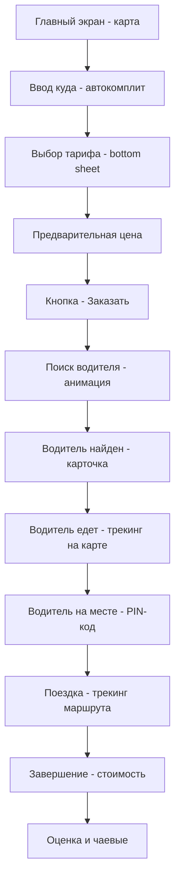

# Архитектура модуля «Такси» для суперприложения

> **Версия:** 1.0  
> **Дата:** 2026-03-06  
> **Стек:** React + TypeScript + Vite + Shadcn UI + Tailwind CSS  
> **Паттерн:** По аналогии с модулем Insurance

---

## 1. Структура файлов

```
src/
├── types/
│   └── taxi.ts                          # Типы и интерфейсы
├── lib/
│   └── taxi/
│       ├── constants.ts                 # Константы — тарифы, классы, регионы
│       ├── api.ts                       # API-функции — mock данные
│       ├── calculations.ts             # Расчёт стоимости поездки
│       ├── formatters.ts              # Форматирование — цена, время, расстояние
│       └── mock-drivers.ts            # Мок-данные водителей
├── hooks/
│   └── taxi/
│       ├── index.ts                    # Реэкспорт всех хуков
│       ├── useTaxiOrder.ts            # Хук создания и управления заказом
│       ├── useTaxiMap.ts              # Хук работы с картой
│       ├── useTaxiTracking.ts         # Хук трекинга водителя
│       ├── useTaxiHistory.ts          # Хук истории поездок
│       └── useTaxiRating.ts           # Хук оценки
├── components/
│   └── taxi/
│       ├── TaxiMap.tsx                 # Компонент карты — Leaflet/MapLibre
│       ├── AddressInput.tsx           # Ввод адреса с автокомплитом
│       ├── TariffSelector.tsx         # Выбор тарифа
│       ├── OrderBottomSheet.tsx       # Bottom sheet заказа — ключевой UX паттерн
│       ├── DriverCard.tsx             # Карточка водителя
│       ├── TripTracker.tsx            # Трекинг поездки
│       ├── RatingSheet.tsx            # Оценка после поездки
│       ├── TripHistoryCard.tsx        # Карточка поездки в истории
│       ├── PriceEstimate.tsx          # Предварительная стоимость
│       ├── SafetyPanel.tsx            # Панель безопасности — SOS, share
│       └── shared/
│           ├── StatusBadge.tsx         # Бейдж статуса поездки
│           └── ETAIndicator.tsx       # Индикатор ETA
├── pages/
│   └── taxi/
│       ├── TaxiHomePage.tsx           # Главная — карта + bottom sheet заказа
│       ├── TaxiOrderPage.tsx          # Процесс заказа
│       ├── TaxiTrackingPage.tsx       # Отслеживание водителя / поездки
│       ├── TaxiHistoryPage.tsx        # История поездок
│       ├── TaxiRatingPage.tsx         # Экран оценки
│       └── TaxiSettingsPage.tsx       # Настройки — адреса, оплата
```

## 2. Роуты

```
/taxi                    → TaxiHomePage — карта + выбор маршрута + тариф
/taxi/order/:id          → TaxiOrderPage — ожидание водителя
/taxi/tracking/:id       → TaxiTrackingPage — поездка в процессе
/taxi/history            → TaxiHistoryPage — список поездок
/taxi/rating/:id         → TaxiRatingPage — оценка после поездки
/taxi/settings           → TaxiSettingsPage — адреса, оплата
```

## 3. Типы — src/types/taxi.ts

```typescript
// Статусы заказа — жизненный цикл
type OrderStatus =
  | 'idle'               // нет заказа
  | 'selecting_route'   // выбор маршрута
  | 'selecting_tariff'  // выбор тарифа
  | 'searching_driver'  // поиск водителя
  | 'driver_found'      // водитель найден
  | 'driver_arriving'   // водитель едет
  | 'driver_arrived'    // водитель на месте
  | 'in_trip'           // поездка
  | 'completed'         // завершена
  | 'cancelled'         // отменена
  | 'rating';           // оценка

// Класс авто
type VehicleClass = 'economy' | 'comfort' | 'business' | 'minivan' | 'premium' | 'kids' | 'green';

// Способ оплаты
type PaymentMethod = 'card' | 'cash' | 'apple_pay' | 'google_pay' | 'corporate';

// Координата
interface LatLng { lat: number; lng: number; }

// Адрес
interface TaxiAddress {
  id: string;
  label: string;           // дом, работа, custom
  address: string;        // текстовый адрес
  coordinates: LatLng;
  isFavorite: boolean;
}

// Тариф
interface Tariff {
  id: VehicleClass;
  name: string;
  description: string;
  icon: string;
  basePrice: number;       // базовая цена
  pricePerKm: number;     // за км
  pricePerMin: number;    // за минуту
  minPrice: number;       // минимальная цена
  eta: number;            // ETA в минутах
  surgeMultiplier: number; // множитель surge
  available: boolean;
}

// Заказ
interface TaxiOrder {
  id: string;
  status: OrderStatus;
  pickup: TaxiAddress;
  destination: TaxiAddress;
  stops: TaxiAddress[];    // промежуточные
  tariff: Tariff;
  estimatedPrice: number;
  finalPrice?: number;
  estimatedDuration: number; // мин
  estimatedDistance: number; // км
  driver?: Driver;
  paymentMethod: PaymentMethod;
  createdAt: string;
  completedAt?: string;
  rating?: number;
  tip?: number;
  pinCode?: string;
}

// Водитель
interface Driver {
  id: string;
  name: string;
  photo: string;
  rating: number;
  tripsCount: number;
  car: Vehicle;
  phone: string; // маскированный
  location: LatLng;
  eta: number;
}

// Автомобиль
interface Vehicle {
  make: string;
  model: string;
  color: string;
  plateNumber: string;
  year: number;
}

// Поездка в истории
interface TripHistoryItem {
  id: string;
  pickup: TaxiAddress;
  destination: TaxiAddress;
  tariff: VehicleClass;
  price: number;
  duration: number;
  distance: number;
  driverName: string;
  driverRating: number;
  rating?: number;
  date: string;
  status: 'completed' | 'cancelled';
}
```

## 4. Ключевые UX-потоки

### 4.1 Заказ поездки — основной поток



### 4.2 Bottom Sheet состояния

| Состояние | Содержимое Bottom Sheet |
|-----------|----------------------|
| idle | Поле «Куда?» + быстрые адреса |
| selecting_route | Ввод адреса + автокомплит |
| selecting_tariff | Список тарифов с ценами и ETA |
| searching_driver | Анимация поиска + отмена |
| driver_found | Карточка водителя + авто + ETA |
| driver_arriving | Водитель на карте + ETA + чат/звонок |
| driver_arrived | PIN-код + кнопки |
| in_trip | Маршрут + ETA + SOS + share |
| completed | Цена + маршрут на карте |
| rating | Звёзды + чаевые + комментарий |

## 5. Зависимости

### Карта
- **Leaflet** — уже есть в npm, лёгкая интеграция
- **react-leaflet** — React-обёртка
- Тайлы: OpenStreetMap — бесплатно

### UI
- Shadcn UI — уже в проекте
- Lucide icons — уже в проекте
- Framer Motion — для анимаций (если есть) или CSS transitions

## 6. MVP-скоуп — Phase 1

| Компонент | Включено | Описание |
|-----------|---------|----------|
| Карта | ✅ | Leaflet с маркерами pickup/destination |
| Ввод адреса | ✅ | Автокомплит с mock-данными |
| Выбор тарифа | ✅ | Economy, Comfort, Business, Minivan |
| Расчёт цены | ✅ | Формула: base + distance*rate + time*rate |
| Заказ | ✅ | Mock поиск водителя с таймером |
| Карточка водителя | ✅ | Фото, имя, рейтинг, авто |
| Трекинг | ✅ | Анимация движения по маршруту |
| Оценка | ✅ | 1-5 звёзд + чаевые |
| История | ✅ | Список поездок |
| SOS | ✅ | Кнопка экстренной помощи |
| Share trip | ✅ | Поделиться поездкой |
| Избранные адреса | ✅ | Дом, работа |
| Промокоды | ❌ Phase 2 | |
| Чат с водителем | ❌ Phase 2 | |
| Наличная оплата | ❌ Phase 2 | |
| Scheduled rides | ❌ Phase 2 | |

## 7. Порядок реализации

1. `src/types/taxi.ts` — все типы и интерфейсы
2. `src/lib/taxi/constants.ts` — тарифы, mock-адреса
3. `src/lib/taxi/calculations.ts` — расчёт цены
4. `src/lib/taxi/formatters.ts` — форматирование
5. `src/lib/taxi/mock-drivers.ts` — мок-данные водителей
6. `src/lib/taxi/api.ts` — mock API
7. `src/hooks/taxi/` — все хуки
8. `src/components/taxi/AddressInput.tsx`
9. `src/components/taxi/TariffSelector.tsx`
10. `src/components/taxi/TaxiMap.tsx`
11. `src/components/taxi/OrderBottomSheet.tsx`
12. `src/components/taxi/DriverCard.tsx`
13. `src/components/taxi/RatingSheet.tsx`
14. `src/components/taxi/TripHistoryCard.tsx`
15. `src/pages/taxi/TaxiHomePage.tsx` — главная страница
16. `src/pages/taxi/TaxiHistoryPage.tsx`
17. Обновить `App.tsx` — роуты
18. Обновить `ServicesMenu.tsx` — route: "/taxi"
19. Обновить `BottomNav.tsx` — навигация в контексте /taxi

---

> Готов к реализации. Переключение в Code mode.
