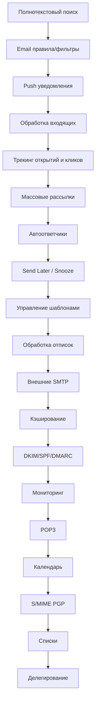

# Детальный план реализации полноценного сервиса электронной почты

**Проект:** your-ai-companion (ECOMANSONI)  
**Масштаб:** 100,000+ пользователей, 1M+ писем/день  
**Дата:** 2026-03-14  
**Статус:** План реализации

---

## Содержание

1. [Анализ текущего состояния](#1-анализ-текущего-состояния)
2. [Фаза 1: Критические функции (1-2 недели)](#фаза-1-критические-функции-1-2-недели)
3. [Фаза 2: Основные функции (2-4 недели)](#фаза-2-основные-функции-2-4-недели)
4. [Фаза 3: Расширенные функции (1-2 месяца)](#фаза-3-расширенные-функции-1-2-месяца)
5. [Фаза 4: Корпоративные функции (2-3 месяца)](#фаза-4-корпоративные-функции-2-3-месяца)
6. [Зависимости между функциями](#зависимости-между-функциями)
7. [Сводная таблица фаз](#сводная-таблица-фаз)

---

## 1. Анализ текущего состояния

### 1.1 Уже реализовано

| Компонент | Статус | Описание |
|-----------|--------|----------|
| **Backend (email-router)** | ✅ Активен | SMTP Client, Queue Service (BullMQ), Send/Template/Bounce/Suppression Services |
| **Supabase Edge Functions** | ✅ Ативны | email-send, email-smtp-settings, send-email-otp, verify-email-otp, recovery-email |
| **База данных** | ✅ Активны | email_templates, email_outbox, email_inbox, email_deliveries, email_threads, email_smtp_settings, email_imap_settings, email_otp_codes, recovery_emails |
| **Frontend** | ✅ Активен | EmailPage, EmailSettingsPage, SmtpSettingsPanel |

### 1.2 Отсутствующие функции (приоритизированы)

**Фаза 1 (Высокий приоритет):**
1. Полнотекстовый поиск
2. Email правила/фильтры
3. Push уведомления
4. Обработка входящих писем (IMAP polling + парсинг)
5. Трекинг открытий и кликов
6. Массовые рассылки с приоритизацией

**Фаза 2 (Средний приоритет):**
1. Автоответчики (vacation responders)
2. Send Later / Snooze
3. Управление шаблонами с локализацией
4. Обработка отписок (unsubscribe)
5. Интеграция с внешними SMTP

**Фаза 3 (Низкий приоритет):**
1. Кэширование и оптимизация
2. DKIM/SPF/DMARC валидация
3. Логирование и мониторинг
4. POP3 поддержка
5. Интеграция с календарём

---

## 2. Фаза 1: Критические функции (1-2 недели)

### 2.1 Полнотекстовый поиск

#### База данных

```sql
-- Таблица для индексации email
CREATE TABLE IF NOT EXISTS public.email_search_index (
    id UUID PRIMARY KEY DEFAULT gen_random_uuid(),
    email_id UUID NOT NULL,
    email_type TEXT NOT NULL CHECK (email_type IN ('inbox', 'outbox', 'draft')),
    subject_text TEXT,
    body_text TEXT,
    from_email TEXT,
    to_email TEXT,
    cc_emails TEXT[],
    search_vector tsvector GENERATED ALWAYS AS (
        setweight(to_tsvector('russian', coalesce(subject_text, '')), 'A') ||
        setweight(to_tsvector('russian', coalesce(body_text, '')), 'B') ||
        setweight(to_tsvector('russian', coalesce(from_email, '')), 'C') ||
        setweight(to_tsvector('russian', coalesce(to_email, '')), 'C')
    ) STORED,
    created_at TIMESTAMPTZ NOT NULL DEFAULT now(),
    updated_at TIMESTAMPTZ NOT NULL DEFAULT now()
);

-- Уникальный индекс на email_id + email_type
CREATE UNIQUE INDEX idx_email_search_unique 
    ON public.email_search_index (email_id, email_type);

-- GIN индекс для полнотекстового поиска
CREATE INDEX idx_email_search_gin 
    ON public.email_search_index USING GIN (search_vector);

-- Индексы для быстрого поиска по отправителю/получателю
CREATE INDEX idx_email_search_from ON public.email_search_index (from_email);
CREATE INDEX idx_email_search_to ON public.email_search_index (to_email);

-- Функция для автоматического обновления индекса
CREATE OR REPLACE FUNCTION public.fn_update_email_search_index()
RETURNS TRIGGER
LANGUAGE plpgsql
AS $$
BEGIN
    INSERT INTO public.email_search_index (email_id, email_type, subject_text, body_text, from_email, to_email, cc_emails)
    VALUES (
        NEW.id,
        CASE WHEN NEW.from_email = NEW.to_email THEN 'outbox' ELSE 'inbox' END,
        NEW.subject,
        COALESCE(NEW.html_body, NEW.text_body),
        NEW.from_email,
        NEW.to_email,
        NEW.cc_email
    )
    ON CONFLICT (email_id, email_type) DO UPDATE SET
        subject_text = EXCLUDED.subject_text,
        body_text = EXCLUDED.body_text,
        from_email = EXCLUDED.from_email,
        to_email = EXCLUDED.to_email,
        cc_emails = EXCLUDED.cc_emails,
        updated_at = now();
    RETURN NEW;
END;
$$;

-- Триггеры для обновления индекса
CREATE TRIGGER trg_email_inbox_search_update
    AFTER INSERT OR UPDATE ON public.email_inbox
    FOR EACH ROW EXECUTE FUNCTION public.fn_update_email_search_index();

CREATE TRIGGER trg_email_outbox_search_update
    AFTER INSERT OR UPDATE ON public.email_outbox
    FOR EACH ROW EXECUTE FUNCTION public.fn_update_email_search_index();
```

#### API эндпоинты

```
GET /api/v1/emails/search
    Query Params:
        - q: string (обязательно) - поисковый запрос
        - type: 'inbox' | 'outbox' | 'all' (опционально)
        - from: string (опционально) - фильтр по отправителю
        - to: string (опционально) - фильтр по получателю
        - date_from: ISO8601 (опционально)
        - date_to: ISO8601 (опционально)
        - limit: number (опционально, по умолчанию 50)
        - offset: number (опционально, по умолчанию 0)
    Response: {
        "results": [{
            "id": "uuid",
            "type": "inbox|outbox",
            "subject": "string",
            "snippet": "string",
            "from": "string",
            "to": "string",
            "date": "ISO8601",
            "score": number
        }],
        "total": number,
        "has_more": boolean
    }

GET /api/v1/emails/search/suggestions
    Query Params:
        - q: string (обязательно)
    Response: {
        "suggestions": [{
            "type": "email" | "subject" | "recent",
            "value": "string",
            "count": number
        }]
    }
```

#### Frontend компоненты

- `EmailSearchBar` - поисковая строка с автодополнением
- `EmailSearchResults` - результаты поиска с подсветкой
- `EmailSearchFilters` - панель фильтров
- `EmailSearchState` - управление состоянием поиска

---

### 2.2 Email правила/фильтры

#### База данных

```sql
-- Таблица правил фильтрации
CREATE TABLE IF NOT EXISTS public.email_filters (
    id UUID PRIMARY KEY DEFAULT gen_random_uuid(),
    user_id UUID NOT NULL REFERENCES auth.users(id) ON DELETE CASCADE,
    name TEXT NOT NULL,
    is_active BOOLEAN NOT NULL DEFAULT true,
    priority INTEGER NOT NULL DEFAULT 0,
    
    -- Условия (JSONB для гибкости)
    conditions JSONB NOT NULL DEFAULT '[]'::jsonb,
    /*
        conditions structure:
        [{
            "field": "from" | "to" | "subject" | "body" | "header:X-Custom",
            "operator": "contains" | "not_contains" | "equals" | "not_equals" | "starts_with" | "ends_with" | "regex" | "matches",
            "value": "string"
        }]
        Комбинация: "all" (AND) или "any" (OR)
    */
    
    conditions_match_all BOOLEAN NOT NULL DEFAULT true,
    
    -- Действия
    actions JSONB NOT NULL DEFAULT '[]'::jsonb,
    /*
        actions structure:
        [{
            "action": "move_to_folder" | "mark_read" | "star" | "label" | "forward" | "delete" | "reject",
            "params": { "folder_id": "uuid", "label": "string", "forward_to": "email" }
        }]
    */
    
    created_at TIMESTAMPTZ NOT NULL DEFAULT now(),
    updated_at TIMESTAMPTZ NOT NULL DEFAULT now()
);

-- Таблица папок пользователя
CREATE TABLE IF NOT EXISTS public.email_folders (
    id UUID PRIMARY KEY DEFAULT gen_random_uuid(),
    user_id UUID NOT NULL REFERENCES auth.users(id) ON DELETE CASCADE,
    name TEXT NOT NULL,
    parent_id UUID REFERENCES public.email_folders(id) ON DELETE CASCADE,
    icon TEXT,
    color TEXT,
    is_system BOOLEAN NOT NULL DEFAULT false,
    sort_order INTEGER NOT NULL DEFAULT 0,
    unread_count INTEGER NOT NULL DEFAULT 0,
    created_at TIMESTAMPTZ NOT NULL DEFAULT now(),
    updated_at TIMESTAMPTZ NOT NULL DEFAULT now(),
    
    UNIQUE(user_id, name)
);

-- Индексы
CREATE INDEX idx_email_filters_user ON public.email_folders (user_id);
CREATE INDEX idx_email_filters_priority ON public.email_filters (user_id, priority);
CREATE INDEX idx_email_folders_user_parent ON public.email_folders (user_id, parent_id);

-- RLS
ALTER TABLE public.email_filters ENABLE ROW LEVEL SECURITY;
ALTER TABLE public.email_folders ENABLE ROW LEVEL SECURITY;

CREATE POLICY "Users manage own filters" ON public.email_filters
    FOR ALL USING (user_id = auth.uid());

CREATE POLICY "Users manage own folders" ON public.email_folders
    FOR ALL USING (user_id = auth.uid());
```

#### API эндпоинты

```
-- Фильтры
GET    /api/v1/emails/filters         - Список фильтров пользователя
POST   /api/v1/emails/filters         - Создать фильтр
GET    /api/v1/emails/filters/:id     - Получить фильтр
PUT    /api/v1/emails/filters/:id     - Обновить фильтр
DELETE /api/v1/emails/filters/:id     - Удалить фильтр
POST   /api/v1/emails/filters/:id/toggle - Активировать/деактивировать фильтр
POST   /api/v1/emails/filters/reorder - Изменить порядок фильтров

-- Папки
GET    /api/v1/emails/folders              - Список папок
POST   /api/v1/emails/folders              - Создать папку
GET    /api/v1/emails/folders/:id          - Получить папку
PUT    /api/v1/emails/folders/:id          - Обновить папку
DELETE /api/v1/emails/folders/:id          - Удалить папку
POST   /api/v1/emails/folders/reorder      - Изменить порядок папок

-- Тестирование фильтра
POST   /api/v1/emails/filters/:id/test     - Тестировать фильтр на письмах
```

#### Бизнес-логика

```typescript
// Обработка входящих писем с применением фильтров
async function processEmailWithFilters(email: EmailMessage, userId: UUID): Promise<void> {
    const filters = await getActiveFilters(userId);
    filters.sort((a, b) => a.priority - b.priority);
    
    for (const filter of filters) {
        const matches = evaluateFilterConditions(email, filter.conditions, filter.conditions_match_all);
        
        if (matches) {
            await executeFilterActions(email, filter.actions);
            
            if (filter.stop_processing) {
                break;
            }
        }
    }
}

function evaluateFilterConditions(email: EmailMessage, conditions: Condition[], matchAll: boolean): boolean {
    const results = conditions.map(condition => {
        const fieldValue = getEmailField(email, condition.field);
        return evaluateCondition(fieldValue, condition.operator, condition.value);
    });
    
    return matchAll ? results.every(Boolean) : results.some(Boolean);
}
```

---

### 2.3 Push уведомления

#### База данных

```sql
-- Таблица push-токенов
CREATE TABLE IF NOT EXISTS public.email_push_tokens (
    id UUID PRIMARY KEY DEFAULT gen_random_uuid(),
    user_id UUID NOT NULL REFERENCES auth.users(id) ON DELETE CASCADE,
    device_id TEXT NOT NULL,
    token TEXT NOT NULL,
    platform TEXT NOT NULL CHECK (platform IN ('ios', 'android', 'web', 'desktop')),
    app_version TEXT,
    last_active_at TIMESTAMPTZ NOT NULL DEFAULT now(),
    created_at TIMESTAMPTZ NOT NULL DEFAULT now(),
    
    UNIQUE(user_id, device_id)
);

-- Настройки уведомлений
CREATE TABLE IF NOT EXISTS public.email_notification_settings (
    id UUID PRIMARY KEY DEFAULT gen_random_uuid(),
    user_id UUID NOT NULL REFERENCES auth.users(id) ON DELETE CASCADE UNIQUE,
    
    -- Какие уведомления отправлять
    notify_on_incoming BOOLEAN NOT NULL DEFAULT true,
    notify_on_important BOOLEAN NOT NULL DEFAULT true,
    notify_on_direct BOOLEAN NOT NULL DEFAULT true,
    notify_on_newsletter BOOLEAN NOT NULL DEFAULT false,
    
    -- Типы уведомлений
    push_enabled BOOLEAN NOT NULL DEFAULT true,
    sound_enabled BOOLEAN NOT NULL DEFAULT true,
    vibration_enabled BOOLEAN NOT NULL DEFAULT true,
    
    -- Фильтры
    mute_until TIMESTAMPTZ,  -- Until this time, all notifications are muted
    do_not_disturb_start TIME,  -- DND start time (e.g., 22:00)
    do_not_disturb_end TIME,    -- DND end time (e.g., 08:00)
    
    -- Звук
    sound_name TEXT DEFAULT 'default',
    
    -- Создано/обновлено
    created_at TIMESTAMPTZ NOT NULL DEFAULT now(),
    updated_at TIMESTAMPTZ NOT NULL DEFAULT now()
);

-- История уведомлений
CREATE TABLE IF NOT EXISTS public.email_notifications (
    id UUID PRIMARY KEY DEFAULT gen_random_uuid(),
    user_id UUID NOT NULL REFERENCES auth.users(id) ON DELETE CASCADE,
    email_id UUID NOT NULL,
    email_type TEXT NOT NULL,
    channel TEXT NOT NULL CHECK (channel IN ('push', 'email', 'sms')),
    status TEXT NOT NULL DEFAULT 'pending' CHECK (status IN ('pending', 'sent', 'delivered', 'failed', 'clicked')),
    
    sent_at TIMESTAMPTZ,
    delivered_at TIMESTAMPTZ,
    clicked_at TIMESTAMPTZ,
    
    created_at TIMESTAMPTZ NOT NULL DEFAULT now()
);

CREATE INDEX idx_email_push_tokens_user ON public.email_push_tokens (user_id);
CREATE INDEX idx_email_notifications_user ON public.email_notifications (user_id, created_at DESC);
CREATE INDEX idx_email_notifications_status ON public.email_notifications (status);
```

#### API эндпоинты

```
-- Push токены
POST   /api/v1/emails/push/tokens         - Зарегистрировать токен
DELETE /api/v1/emails/push/tokens/:deviceId - Удалить токен
GET    /api/v1/emails/push/tokens         - Список токенов пользователя

-- Настройки уведомлений
GET    /api/v1/emails/push/settings       - Получить настройки
PUT    /api/v1/emails/push/settings       - Обновить настройки
POST   /api/v1/emails/push/settings/mute  - Включить DND
POST   /api/v1/emails/push/settings/unmute - Выключить DND

-- Отправка (internal)
POST   /internal/emails/push/send        - Отправить push (internal)
POST   /internal/emails/push/batch       - Batch отправка
POST   /internal/emails/push/callback    - Callback от push провайдера
```

#### Конфигурация

```env
# Push провайдеры (один или несколько)
PUSH_PROVIDER=firebase|apns|webpush
FCM_SERVER_KEY=
FCM_PROJECT_ID=
APNS_KEY_PATH=
APNS_TEAM_ID=
APNS_BUNDLE_ID=
VAPID_PUBLIC_KEY=
VAPID_PRIVATE_KEY=

# Queue
PUSH_QUEUE_CONCURRENCY=50
PUSH_BATCH_SIZE=500

# Rate limits
PUSH_RATE_LIMIT_PER_USER=100
PUSH_RATE_LIMIT_GLOBAL=10000
```

#### Frontend компоненты

- `PushNotificationSettings` - настройки push
- `NotificationPreferences` - предпочтения уведомлений
- `DeviceTokenManager` - управление токенами устройств

---

### 2.4 Обработка входящих писем (IMAP polling + парсинг)

#### База данных

```sql
-- Таблица для задач IMAP синхронизации
CREATE TABLE IF NOT EXISTS public.email_imap_sync_jobs (
    id UUID PRIMARY KEY DEFAULT gen_random_uuid(),
    user_id UUID NOT NULL REFERENCES auth.users(id) ON DELETE CASCADE,
    imap_settings_id UUID NOT NULL REFERENCES public.email_imap_settings(id),
    
    status TEXT NOT NULL DEFAULT 'pending' CHECK (status IN ('pending', 'running', 'completed', 'failed', 'cancelled')),
    sync_type TEXT NOT NULL DEFAULT 'incremental' CHECK (sync_type IN ('full', 'incremental', 'initial')),
    
    last_sync_uid INTEGER,  -- UID последнего синхронизированного письма
    last_sync_date TIMESTAMPTZ,
    messages_fetched INTEGER NOT NULL DEFAULT 0,
    messages_stored INTEGER NOT NULL DEFAULT 0,
    
    started_at TIMESTAMPTZ,
    completed_at TIMESTAMPTZ,
    error_message TEXT,
    
    created_at TIMESTAMPTZ NOT NULL DEFAULT now()
);

-- Таблица для хранения заголовков писем
CREATE TABLE IF NOT EXISTS public.email_headers (
    id UUID PRIMARY KEY DEFAULT gen_random_uuid(),
    email_id UUID NOT NULL REFERENCES public.email_inbox(id) ON DELETE CASCADE,
    header_name TEXT NOT NULL,
    header_value TEXT NOT NULL,
    
    created_at TIMESTAMPTZ NOT NULL DEFAULT now(),
    
    UNIQUE(email_id, header_name)
);

-- Таблица вложений
CREATE TABLE IF NOT EXISTS public.email_attachments (
    id UUID PRIMARY KEY DEFAULT gen_random_uuid(),
    email_id UUID NOT NULL REFERENCES public.email_inbox(id) ON DELETE CASCADE,
    
    filename TEXT NOT NULL,
    content_type TEXT NOT NULL,
    size INTEGER NOT NULL,
    
    -- Хранение (Supabase Storage)
    storage_path TEXT,
    storage_bucket TEXT NOT NULL DEFAULT 'email-attachments',
    
    -- Для inline изображений
    content_id TEXT,  -- Content-ID для inline
    is_inline BOOLEAN NOT NULL DEFAULT false,
    
    -- Метаданные
    checksum TEXT,  -- MD5/SHA256
    width INTEGER,
    height INTEGER,
    
    created_at TIMESTAMPTZ NOT NULL DEFAULT now()
);

CREATE INDEX idx_email_imap_sync_jobs_user ON public.email_imap_sync_jobs (user_id, created_at DESC);
CREATE INDEX idx_email_headers_email ON public.email_headers (email_id);
CREATE INDEX idx_email_attachments_email ON public.email_attachments (email_id);
```

#### API эндпоинты

```
-- IMAP синхронизация
POST   /api/v1/emails/imap/sync           - Запустить синхронизацию
GET    /api/v1/emails/imap/sync/status    - Статус текущей синхронизации
POST   /api/v1/emails/imap/sync/cancel    - Отменить синхронизацию

-- История синхронизации
GET    /api/v1/emails/imap/sync/history  - История синхронизаций
GET    /api/v1/emails/imap/sync/:id      - Детали конкретной синхронизации

-- Вложения
GET    /api/v1/emails/attachments/:id    - Получить вложение
GET    /api/v1/emails/attachments/:id/download - Скачать вложение

-- Заголовки
GET    /api/v1/emails/:type/:id/headers   - Получить все заголовки письма
```

#### Бизнес-логика

```typescript
// IMAP синхронизация
class ImapSyncService {
    async syncInbox(imapSettings: ImapSettings, userId: UUID): Promise<SyncResult> {
        const imapClient = await this.connectImap(imapSettings);
        
        // Получаем последний UID
        const lastUid = await this.getLastSyncUid(userId, imapSettings.id);
        
        // Получаем новые письма
        const newMessages = await imapClient.fetchNewMessages(lastUid);
        
        for (const message of newMessages) {
            const parsed = await this.parseEmailMessage(message);
            
            // Сохраняем в БД
            await this.storeEmail(parsed, userId);
            
            // Парсим заголовки
            await this.storeHeaders(parsed.headers, emailId);
            
            // Обрабатываем вложения
            await this.processAttachments(message.attachments, emailId);
            
            // Применяем фильтры
            await processEmailWithFilters(emailId, userId);
            
            // Отправляем push уведомление
            await sendPushNotification(userId, emailId);
        }
        
        // Обновляем последний синхронизированный UID
        await this.updateLastSyncUid(userId, imapSettings.id, lastUid);
        
        return { fetched: newMessages.length };
    }
    
    parseEmailMessage(raw: Buffer): ParsedEmail {
        // Используем mailparser или similar
        const parsed = mailparser.simpleParser(raw);
        
        return {
            messageId: parsed.messageId,
            inReplyTo: parsed.inReplyTo,
            references: parsed.references,
            from: parsed.from?.address,
            to: parsed.to?.addresses?.map(a => a.address),
            cc: parsed.cc?.addresses?.map(a => a.address),
            subject: parsed.subject,
            textBody: parsed.text,
            htmlBody: parsed.html,
            headers: parsed.headers,
            attachments: parsed.attachments,
            date: parsed.date
        };
    }
}
```

---

### 2.5 Трекинг открытий и кликов

#### База данных

```sql
-- Таблица для трекинга открытий
CREATE TABLE IF NOT EXISTS public.email_tracking_opens (
    id UUID PRIMARY KEY DEFAULT gen_random_uuid(),
    email_delivery_id UUID NOT NULL REFERENCES public.email_deliveries(id) ON DELETE CASCADE,
    
    -- Информация о получателе
    recipient_email TEXT NOT NULL,
    
    -- Информация об открытии
    opened_at TIMESTAMPTZ NOT NULL DEFAULT now(),
    user_agent TEXT,
    ip_address INET,
    country TEXT,
    region TEXT,
    city TEXT,
    device_type TEXT,
    browser TEXT,
    browser_version TEXT,
    os TEXT,
    os_version TEXT,
    
    -- Количество открытий (для уникальных - первое открытие)
    is_first_open BOOLEAN NOT NULL DEFAULT true
);

-- Таблица для трекинга кликов
CREATE TABLE IF NOT EXISTS public.email_tracking_clicks (
    id UUID PRIMARY KEY DEFAULT gen_random_uuid(),
    email_delivery_id UUID NOT NULL REFERENCES public.email_deliveries(id) ON DELETE CASCADE,
    
    -- Информация о клике
    clicked_at TIMESTAMPTZ NOT NULL DEFAULT now(),
    original_url TEXT NOT NULL,
    resolved_url TEXT,  -- После redirect через наш tracker
    link_id TEXT,       -- ID ссылки в письме
    
    -- Информация о получателе
    recipient_email TEXT NOT NULL,
    
    -- Информация о клике
    user_agent TEXT,
    ip_address INET,
    country TEXT,
    region TEXT,
    city TEXT,
    device_type TEXT,
    
    -- Атрибуция
    utm_source TEXT,
    utm_medium TEXT,
    utm_campaign TEXT,
    utm_content TEXT,
    utm_term TEXT
);

-- Таблица для хранения трек-ссылок в письмах
CREATE TABLE IF NOT EXISTS public.email_tracking_links (
    id UUID PRIMARY KEY DEFAULT gen_random_uuid(),
    email_delivery_id UUID NOT NULL REFERENCES public.email_deliveries(id) ON DELETE CASCADE,
    
    original_url TEXT NOT NULL,
    tracking_url TEXT NOT NULL UNIQUE,
    link_text TEXT,
    link_position TEXT,  -- header, body, footer
    
    click_count INTEGER NOT NULL DEFAULT 0,
    unique_click_count INTEGER NOT NULL DEFAULT 0,
    
    created_at TIMESTAMPTZ NOT NULL DEFAULT now()
);

-- Индексы
CREATE INDEX idx_tracking_opens_delivery ON public.email_tracking_opens (email_delivery_id);
CREATE INDEX idx_tracking_opens_recipient ON public.email_tracking_opens (recipient_email, opened_at DESC);
CREATE INDEX idx_tracking_clicks_delivery ON public.email_tracking_clicks (email_delivery_id);
CREATE INDEX idx_tracking_clicks_recipient ON public.email_tracking_clicks (recipient_email, clicked_at DESC);
CREATE INDEX idx_tracking_links_url ON public.email_tracking_links (tracking_url);
```

#### API эндпоинты

```
-- Трекинг открытий (pixel)
GET  /api/v1/emails/track/open/:deliveryId/:recipientHash.png
     Response: 1x1 transparent PNG

-- Трекинг кликов (redirect)
GET  /api/v1/emails/track/click/:trackingId
     Response: 302 Redirect to original URL

-- Статистика
GET  /api/v1/emails/track/stats/:deliveryId
     Response: {
         "opens": { "total": number, "unique": number },
         "clicks": { "total": number, "unique": number },
         "devices": { "desktop": number, "mobile": number, "tablet": number },
         "locations": [{ "country": string, "count": number }],
         "timeline": [{ "date": string, "opens": number, "clicks": number }]
     }

GET  /api/v1/emails/track/reports/summary
     Query: date_from, date_to, campaign_id (опционально)
     Response: { "deliveries": number, "opens": number, "clicks": number, "ctr": number }

-- Управление UTM
POST /api/v1/emails/track/utm/generate
     Body: { "url": string, "utm_source": string, "utm_medium": string, "utm_campaign": string }
     Response: { "url": string, "tracking_url": string }
```

#### Frontend компоненты

- `EmailAnalyticsDashboard` - дашборд аналитики
- `OpenRateChart` - график открытий
- `ClickHeatmap` - тепловая карта кликов
- `DeviceBreakdown` - разбивка по устройствам
- `GeoDistribution` - география получателей

---

### 2.6 Массовые рассылки с приоритизацией

#### База данных

```sql
-- Таблица кампаний
CREATE TABLE IF NOT EXISTS public.email_campaigns (
    id UUID PRIMARY KEY DEFAULT gen_random_uuid(),
    user_id UUID NOT NULL REFERENCES auth.users(id) ON DELETE CASCADE,
    
    name TEXT NOT NULL,
    subject TEXT NOT NULL,
    preview_text TEXT,
    
    -- Контент
    html_content TEXT,
    text_content TEXT,
    template_id UUID REFERENCES public.email_templates(id),
    
    -- Получатели
    recipient_list_id UUID,  -- Ссылка на список получателей
    recipient_query JSONB,   -- Или запрос для динамического определения получателей
    
    -- Настройки отправки
    from_email TEXT NOT NULL,
    from_name TEXT,
    reply_to TEXT,
    
    -- Расписание
    scheduled_at TIMESTAMPTZ,
    timezone TEXT DEFAULT 'UTC',
    
    -- Приоритет (1-10, 1 - highest)
    priority INTEGER NOT NULL DEFAULT 5,
    
    -- Ограничения rate limiting
    rate_limit_per_hour INTEGER,
    rate_limit_per_day INTEGER,
    batch_size INTEGER DEFAULT 100,
    batch_delay_ms INTEGER DEFAULT 1000,
    
    -- Статус
    status TEXT NOT NULL DEFAULT 'draft' 
        CHECK (status IN ('draft', 'scheduled', 'sending', 'paused', 'completed', 'cancelled', 'failed')),
    
    -- Статистика
    total_recipients INTEGER NOT NULL DEFAULT 0,
    sent_count INTEGER NOT NULL DEFAULT 0,
    delivered_count INTEGER NOT NULL DEFAULT 0,
    opened_count INTEGER NOT NULL DEFAULT 0,
    clicked_count INTEGER NOT NULL DEFAULT 0,
    bounced_count INTEGER NOT NULL DEFAULT 0,
    unsubscribed_count INTEGER NOT NULL DEFAULT 0,
    
    created_at TIMESTAMPTZ NOT NULL DEFAULT now(),
    updated_at TIMESTAMPTZ NOT NULL DEFAULT now(),
    started_at TIMESTAMPTZ,
    completed_at TIMESTAMPTZ
);

-- Таблица списков получателей
CREATE TABLE IF NOT EXISTS public.email_recipient_lists (
    id UUID PRIMARY KEY DEFAULT gen_random_uuid(),
    user_id UUID NOT NULL REFERENCES auth.users(id) ON DELETE CASCADE,
    
    name TEXT NOT NULL,
    description TEXT,
    
    -- Критерии включения
    filters JSONB NOT NULL DEFAULT '{}'::jsonb,
    
    -- Подсчет получателей (cached)
    recipient_count INTEGER NOT NULL DEFAULT 0,
    last_calculated_at TIMESTAMPTZ,
    
    created_at TIMESTAMPTZ NOT NULL DEFAULT now(),
    updated_at TIMESTAMPTZ NOT NULL DEFAULT now(),
    
    UNIQUE(user_id, name)
);

-- Таблица очереди кампании
CREATE TABLE IF NOT EXISTS public.email_campaign_queue (
    id UUID PRIMARY KEY DEFAULT gen_random_uuid(),
    campaign_id UUID NOT NULL REFERENCES public.email_campaigns(id) ON DELETE CASCADE,
    recipient_email TEXT NOT NULL,
    recipient_data JSONB,  -- Дополнительные данные для персонализации
    
    priority INTEGER NOT NULL DEFAULT 5,
    
    status TEXT NOT NULL DEFAULT 'pending'
        CHECK (status IN ('pending', 'processing', 'sent', 'failed', 'cancelled')),
    
    attempts INTEGER NOT NULL DEFAULT 0,
    max_attempts INTEGER NOT NULL DEFAULT 3,
    last_error TEXT,
    
    scheduled_at TIMESTAMPTZ,
    sent_at TIMESTAMPTZ,
    created_at TIMESTAMPTZ NOT NULL DEFAULT now(),
    
    UNIQUE(campaign_id, recipient_email)
);

CREATE INDEX idx_email_campaigns_user ON public.email_campaigns (user_id, created_at DESC);
CREATE INDEX idx_email_campaigns_status ON public.email_campaigns (status);
CREATE INDEX idx_email_campaign_queue_campaign ON public.email_campaign_queue (campaign_id, status, priority);
CREATE INDEX idx_email_recipient_lists_user ON public.email_recipient_lists (user_id);
```

#### API эндпоинты

```
-- Кампании
GET    /api/v1/emails/campaigns           - Список кампаний
POST   /api/v1/emails/campaigns           - Создать кампанию
GET    /api/v1/emails/campaigns/:id       - Получить кампанию
PUT    /api/v1/emails/campaigns/:id       - Обновить кампанию
DELETE /api/v1/emails/campaigns/:id       - Удалить кампанию

-- Отправка
POST   /api/v1/emails/campaigns/:id/send              - Запустить кампанию
POST   /api/v1/emails/campaigns/:id/pause             - Приостановить
POST   /api/v1/emails/campaigns/:id/resume            - Возобновить
POST   /api/v1/emails/campaigns/:id/cancel             - Отменить
POST   /api/v1/emails/campaigns/:id/schedule           - Запланировать
POST   /api/v1/emails/campaigns/:id/test               - Отправить тестовую кампанию

-- Статистика
GET    /api/v1/emails/campaigns/:id/stats              - Статистика кампании
GET    /api/v1/emails/campaigns/:id/recipients         - Список получателей

-- Списки получателей
GET    /api/v1/emails/recipient-lists           - Списки получателей
POST   /api/v1/emails/recipient-lists           - Создать список
GET    /api/v1/emails/recipient-lists/:id       - Получить список
PUT    /api/v1/emails/recipient-lists/:id       - Обновить список
DELETE /api/v1/emails/recipient-lists/:id       - Удалить список
POST   /api/v1/emails/recipient-lists/:id/recalculate - Пересчитать получателей
POST   /api/v1/emails/recipient-lists/:id/import - Импорт получателей
POST   /api/v1/emails/recipient-lists/:id/export - Экспорт получателей
```

#### Бизнес-логика

```typescript
// Queue Service для массовых рассылок
class CampaignQueueService {
    async processCampaign(campaignId: UUID): Promise<void> {
        const campaign = await this.getCampaign(campaignId);
        
        // Получаем получателей
        const recipients = await this.getRecipients(campaign);
        
        // Создаем задачи в очереди
        const batchSize = campaign.batch_size || 100;
        
        for (let i = 0; i < recipients.length; i += batchSize) {
            const batch = recipients.slice(i, i + batchSize);
            
            // Добавляем в BullMQ очередь с приоритетом
            await this.queue.add('campaign:send', {
                campaignId,
                recipients: batch.map(r => ({
                    email: r.email,
                    data: r.data,
                    priority: campaign.priority
                }))
            }, {
                priority: 10 - campaign.priority, // Higher priority = lower number
                delay: i > 0 ? campaign.batch_delay_ms : 0
            });
            
            // Rate limiting
            if (campaign.rate_limit_per_hour) {
                await this.enforceRateLimit(campaign.user_id, campaign.rate_limit_per_hour);
            }
        }
        
        await this.updateCampaignStatus(campaignId, 'sending');
    }
    
    async sendBatch(job: Job): Promise<void> {
        const { campaignId, recipients } = job.data;
        
        for (const recipient of recipients) {
            try {
                // Персонализация
                const personalizedContent = await this.personalize(
                    campaign.content,
                    recipient.data
                );
                
                // Отправка
                await this.sendEmail({
                    to: recipient.email,
                    from: campaign.from_email,
                    subject: campaign.subject,
                    html: personalizedContent,
                    tracking: true
                });
                
                // Логирование
                await this.logDelivery(campaignId, recipient.email, 'sent');
                
            } catch (error) {
                await this.handleError(campaignId, recipient.email, error);
            }
        }
    }
}
```

---

## 3. Фаза 2: Основные функции (2-4 недели)

### 3.1 Автоответчики (Vacation Responders)

#### База данных

```sql
CREATE TABLE IF NOT EXISTS public.email_vacation_responders (
    id UUID PRIMARY KEY DEFAULT gen_random_uuid(),
    user_id UUID NOT NULL REFERENCES auth.users(id) ON DELETE CASCADE,
    
    name TEXT NOT NULL,
    is_active BOOLEAN NOT NULL DEFAULT true,
    
    -- Условия срабатывания
    conditions JSONB NOT NULL DEFAULT '[]'::jsonb,
    /*
        [{
            "field": "from" | "to" | "subject",
            "operator": "contains" | "not_contains" | "equals",
            "value": "string"
        }]
    */
    
    -- Контент автоответа
    subject TEXT NOT NULL,
    html_body TEXT,
    text_body TEXT,
    
    -- Ограничения
    start_date TIMESTAMPTZ,
    end_date TIMESTAMPTZ,
    max_replies_per_day INTEGER DEFAULT 10,
    reply_only_to_first BOOLEAN DEFAULT true,  -- Только на первое письмо в треде
    
    -- Статистика
    replies_sent_today INTEGER NOT NULL DEFAULT 0,
    last_reply_date TIMESTAMPTZ,
    
    created_at TIMESTAMPTZ NOT NULL DEFAULT now(),
    updated_at TIMESTAMPTZ NOT NULL DEFAULT now()
);

CREATE INDEX idx_email_vacation_user ON public.email_vacation_responders (user_id, is_active);
```

#### API эндпоинты

```
GET    /api/v1/emails/vacation              - Список автоответчиков
POST   /api/v1/emails/vacation              - Создать автоответчик
GET    /api/v1/emails/vacation/:id         - Получить автоответчик
PUT    /api/v1/emails/vacation/:id         - Обновить автоответчик
DELETE /api/v1/emails/vacation/:id         - Удалить автоответчик
POST   /api/v1/emails/vacation/:id/toggle  - Активировать/деактивировать
POST   /api/v1/emails/vacation/:id/test     - Тест автоответчика
```

---

### 3.2 Send Later / Snooze

#### База данных

```sql
CREATE TABLE IF NOT EXISTS public.email_snoozes (
    id UUID PRIMARY KEY DEFAULT gen_random_uuid(),
    user_id UUID NOT NULL REFERENCES auth.users(id) ON DELETE CASCADE,
    
    email_id UUID NOT NULL,
    email_type TEXT NOT NULL CHECK (email_type IN ('inbox', 'outbox')),
    
    -- Когда вернуть в inbox
    snooze_until TIMESTAMPTZ NOT NULL,
    
    -- Причина snooze
    reason TEXT,
    
    -- Исходная папка (куда вернуть после snooze)
    original_folder_id UUID REFERENCES public.email_folders(id),
    
    -- Статус
    is_active BOOLEAN NOT NULL DEFAULT true,
    
    created_at TIMESTAMPTZ NOT NULL DEFAULT now(),
    triggered_at TIMESTAMPTZ
);

CREATE INDEX idx_email_snoozes_user_active ON public.email_snoozes 
    (user_id, is_active, snooze_until);

-- Таблица отложенных писем (outbox)
CREATE TABLE IF NOT EXISTS public.email_scheduled (
    id UUID PRIMARY KEY DEFAULT gen_random_uuid(),
    user_id UUID NOT NULL REFERENCES auth.users(id) ON DELETE CASCADE,
    
    -- Сохраненное письмо
    from_email TEXT NOT NULL,
    to_email TEXT NOT NULL,
    cc_email TEXT[],
    bcc_email TEXT[],
    subject TEXT,
    html_body TEXT,
    text_body TEXT,
    in_reply_to_message_id TEXT,
    references TEXT[],
    attachments JSONB,
    
    -- Когда отправить
    send_at TIMESTAMPTZ NOT NULL,
    
    -- Статус
    status TEXT NOT NULL DEFAULT 'scheduled' 
        CHECK (status IN ('scheduled', 'sending', 'sent', 'failed', 'cancelled')),
    
    attempts INTEGER NOT NULL DEFAULT 0,
    last_error TEXT,
    
    created_at TIMESTAMPTZ NOT NULL DEFAULT now(),
    sent_at TIMESTAMPTZ
);

CREATE INDEX idx_email_scheduled_user_time ON public.email_scheduled 
    (user_id, send_at) WHERE status = 'scheduled';
```

#### API эндпоинты

```
-- Snooze (входящие)
POST   /api/v1/emails/inbox/:id/snooze              - Snooze письмо
POST   /api/v1/emails/inbox/:id/unsnooze           - Отменить snooze
GET    /api/v1/emails/snoozed                       - Список snoozed писем

-- Send Later (исходящие)
POST   /api/v1/emails/scheduled                     - Запланировать отправку
GET    /api/v1/emails/scheduled                     - Список запланированных
PUT    /api/v1/emails/scheduled/:id                  - Обновить время
DELETE /api/v1/emails/scheduled/:id                  - Отменить/удалить
POST   /api/v1/emails/scheduled/:id/send-now         - Отправить сейчас

-- Quick snooze presets
POST   /api/v1/emails/inbox/:id/snooze/:preset       - preset: later_today, tomorrow, next_week, custom
```

---

### 3.3 Управление шаблонами с локализацией

#### База данных

```sql
-- Расширенная таблица шаблонов
ALTER TABLE public.email_templates 
    ADD COLUMN IF NOT EXISTS locale TEXT DEFAULT 'en',
    ADD COLUMN IF NOT EXISTS locale_fallback TEXT,
    ADD COLUMN IF NOT EXISTS variables JSONB DEFAULT '[]'::jsonb,
    ADD COLUMN IF NOT EXISTS category TEXT,
    ADD COLUMN IF NOT EXISTS is_shared BOOLEAN DEFAULT false,
    ADD COLUMN IF NOT EXISTS shared_with UUID[];

-- Таблица версий шаблонов
CREATE TABLE IF NOT EXISTS public.email_template_versions (
    id UUID PRIMARY KEY DEFAULT gen_random_uuid(),
    template_id TEXT NOT NULL REFERENCES public.email_templates(key) ON DELETE CASCADE,
    version INTEGER NOT NULL,
    
    subject TEXT,
    html_content TEXT NOT NULL,
    text_content TEXT,
    variables JSONB,
    
    created_by UUID REFERENCES auth.users(id),
    created_at TIMESTAMPTZ NOT NULL DEFAULT now(),
    
    UNIQUE(template_id, version)
);

-- Таблица переводов
CREATE TABLE IF NOT EXISTS public.email_template_translations (
    id UUID PRIMARY KEY DEFAULT gen_random_uuid(),
    template_id TEXT NOT NULL REFERENCES public.email_templates(key) ON DELETE CASCADE,
    locale TEXT NOT NULL,
    
    subject TEXT,
    html_content TEXT,
    text_content TEXT,
    
    created_at TIMESTAMPTZ NOT NULL DEFAULT now(),
    updated_at TIMESTAMPTZ NOT NULL DEFAULT now(),
    
    UNIQUE(template_id, locale)
);

-- Таблица переменных
CREATE TABLE IF NOT EXISTS public.email_template_variables (
    id UUID PRIMARY KEY DEFAULT gen_random_uuid(),
    template_key TEXT NOT NULL REFERENCES public.email_templates(key) ON DELETE CASCADE,
    
    name TEXT NOT NULL,
    type TEXT NOT NULL CHECK (type IN ('string', 'number', 'boolean', 'date', 'url', 'image', 'object', 'array')),
    required BOOLEAN DEFAULT false,
    default_value JSONB,
    description TEXT,
    validation_rules JSONB,
    
    created_at TIMESTAMPTZ NOT NULL DEFAULT now(),
    
    UNIQUE(template_key, name)
);

CREATE INDEX idx_email_template_translations ON public.email_template_translations (template_id, locale);
CREATE INDEX idx_email_template_variables ON public.email_template_variables (template_key);
```

#### API эндпоинты

```
-- Шаблоны
GET    /api/v1/templates                  - Список шаблонов
POST   /api/v1/templates                   - Создать шаблон
GET    /api/v1/templates/:key              - Получить шаблон (с локалью)
PUT    /api/v1/templates/:key              - Обновить шаблон
DELETE /api/v1/templates/:key              - Удалить шаблон
POST   /api/v1/templates/:key/duplicate   - Дублировать шаблон
POST   /api/v1/templates/:key/publish      - Опубликовать версию

-- Версии
GET    /api/v1/templates/:key/versions    - История версий
GET    /api/v1/templates/:key/versions/:version - Конкретная версия
POST   /api/v1/templates/:key/rollback    - Откатить к версии

-- Переводы
GET    /api/v1/templates/:key/translations           - Список переводов
POST   /api/v1/templates/:key/translations           - Добавить перевод
PUT    /api/v1/templates/:key/translations/:locale   - Обновить перевод
DELETE /api/v1/templates/:key/translations/:locale    - Удалить перевод

-- Переменные
GET    /api/v1/templates/:key/variables               - Список переменных
POST   /api/v1/templates/:key/variables             - Добавить переменную
PUT    /api/v1/templates/:key/variables/:name        - Обновить переменную
DELETE /api/v1/templates/:key/variables/:name       - Удалить переменную
POST   /api/v1/templates/:key/variables/validate    - Валидация значений

-- Предпросмотр
POST   /api/v1/templates/:key/preview                - Предпросмотр с тестовыми данными
POST   /api/v1/templates/:key/render                 - Рендер с реальными данными
```

---

### 3.4 Обработка отписок (Unsubscribe)

#### База данных

```sql
CREATE TABLE IF NOT EXISTS public.email_unsubscribe_list (
    id UUID PRIMARY KEY DEFAULT gen_random_uuid(),
    
    -- Email получателя
    email TEXT NOT NULL,
    
    -- Причина (nullable)
    reason TEXT,
    
    -- Источник отписки
    source TEXT CHECK (source IN ('manual', 'link', 'bounce', 'complaint', 'list_unsubscribe')),
    
    -- Кампания/список (если применимо)
    campaign_id UUID REFERENCES public.email_campaigns(id),
    recipient_list_id UUID REFERENCES public.email_recipient_lists(id),
    
    -- Статус
    is_active BOOLEAN NOT NULL DEFAULT true,
    
    created_at TIMESTAMPTZ NOT NULL DEFAULT now()
);

-- Индексы
CREATE UNIQUE INDEX idx_email_unsubscribe_email ON public.email_unsubscribe_list (email);
CREATE INDEX idx_email_unsubscribe_source ON public.email_unsubscribe_list (source);
CREATE INDEX idx_email_unsubscribe_created ON public.email_unsubscribe_list (created_at DESC);

-- Таблица для List-Unsubscribe
CREATE TABLE IF NOT EXISTS public.email_list_headers (
    id UUID PRIMARY KEY DEFAULT gen_random_uuid(),
    
    list_id UUID NOT NULL REFERENCES public.email_recipient_lists(id),
    
    -- List-Unsubscribe-Post: URL для One-Click Unsubscribe
    unsubscribe_post_url TEXT,
    
    -- List-Unsubscribe: email для mailto unsubscribe
    unsubscribe_email TEXT,
    
    -- List-ID
    list_id_header TEXT,
    
    -- List-Help
    help_email TEXT,
    
    created_at TIMESTAMPTZ NOT NULL DEFAULT now(),
    updated_at TIMESTAMPTZ NOT NULL DEFAULT now()
);
```

#### API эндпоинты

```
-- Unsubscribe (публичный)
POST /api/v1/emails/unsubscribe
     Body: { "email": "user@example.com", "reason": "too_many_emails" }

GET  /api/v1/emails/unsubscribe/:token
     Проверка статуса отписки

POST /api/v1/emails/unsubscribe/manage/:token
     Body: { "action": "unsubscribe_all" | "subscribe" | "preferences" }
     Управление подпиской через ссылку в письме

-- Управление отписками (admin)
GET  /api/v1/emails/unsubscribe/list           - Список отписавшихся
POST /api/v1/emails/unsubscribe/export        - Экспорт списка
POST /api/v1/emails/unsubscribe/reinstall     - Разрешить повторную подписку
```

---

### 3.5 Интеграция с внешними SMTP

#### База данных

```sql
-- Расширенная таблица SMTP настроек
ALTER TABLE public.email_smtp_settings
    ADD COLUMN IF NOT EXISTS provider_type TEXT 
        CHECK (provider_type IN ('custom', 'gmail', 'outlook', 'yandex', 'mailru', 'sendgrid', 'mailgun', 'ses', 'postmark', 'other')),
    ADD COLUMN IF NOT EXISTS api_key_encrypted TEXT,
    ADD COLUMN IF NOT EXISTS oauth_access_token_encrypted TEXT,
    ADD COLUMN IF NOT EXISTS oauth_refresh_token_encrypted TEXT,
    ADD COLUMN IF NOT EXISTS oauth_token_expires_at TIMESTAMPTZ,
    ADD COLUMN IF NOT EXISTS oauth_scopes TEXT[],
    ADD COLUMN IF NOT EXISTS use_api_instead_of_smtp BOOLEAN DEFAULT false,
    ADD COLUMN IF NOT EXISTS api_endpoint TEXT,
    ADD COLUMN IF NOT EXISTS region TEXT,
    ADD COLUMN IF NOT EXISTS is_verified BOOLEAN DEFAULT false,
    ADD COLUMN IF NOT EXISTS verification_sent_at TIMESTAMPTZ,
    ADD COLUMN IF NOT EXISTS last_used_at TIMESTAMPTZ;

-- Таблица для мониторинга SMTP провайдеров
CREATE TABLE IF NOT EXISTS public.email_smtp_health (
    id UUID PRIMARY KEY DEFAULT gen_random_uuid(),
    smtp_settings_id UUID NOT NULL REFERENCES public.email_smtp_settings(id),
    
    status TEXT CHECK (status IN ('healthy', 'degraded', 'down', 'unknown')),
    latency_ms INTEGER,
    error_count INTEGER NOT NULL DEFAULT 0,
    success_count INTEGER NOT NULL DEFAULT 0,
    last_check_at TIMESTAMPTZ NOT NULL DEFAULT now(),
    
    last_error TEXT,
    
    created_at TIMESTAMPTZ NOT NULL DEFAULT now()
);

CREATE INDEX idx_email_smtp_health_settings ON public.email_smtp_health (smtp_settings_id, created_at DESC);
```

#### API эндпоинты

```
-- SMTP настройки (существующие расширить)
POST   /api/v1/emails/smtp/test               - Тест подключения
POST   /api/v1/emails/smtp/verify             - Верификация отправителя
GET    /api/v1/emails/smtp/providers          - Список поддерживаемых провайдеров
POST   /api/v1/emails/smtp/oauth/start        - Начало OAuth_flow
POST   /api/v1/emails/smtp/oauth/callback     - OAuth callback
POST   /api/v1/emails/smtp/oauth/refresh      - Refresh токена
GET    /api/v1/emails/smtp/health/:id         - Статус здоровья SMTP
GET    /api/v1/emails/smtp/stats/:id          - Статистика отправки
```

---

## 4. Фаза 3: Расширенные функции (1-2 месяца)

### 4.1 Кэширование и оптимизация производительности

```sql
-- Таблица для кэширования
CREATE TABLE IF NOT EXISTS public.email_cache (
    id UUID PRIMARY KEY DEFAULT gen_random_uuid(),
    
    cache_key TEXT NOT NULL UNIQUE,
    cache_type TEXT NOT NULL,
    
    data JSONB NOT NULL,
    
    expires_at TIMESTAMPTZ NOT NULL,
    created_at TIMESTAMPTZ NOT NULL DEFAULT now(),
    
    hit_count INTEGER NOT NULL DEFAULT 0,
    last_hit_at TIMESTAMPTZ
);

CREATE INDEX idx_email_cache_key ON public.email_cache (cache_key);
CREATE INDEX idx_email_cache_expires ON public.email_cache (expires_at) WHERE expires_at > now();

-- Функция автоматической очистки кэша
CREATE OR REPLACE FUNCTION public.fn_cleanup_email_cache()
RETURNS void
LANGUAGE plpgsql
AS $$
BEGIN
    DELETE FROM public.email_cache WHERE expires_at < now();
END;
$$;

-- Cron job для очистки
SELECT cron.schedule('email-cache-cleanup', '0 * * * *', 
    'SELECT public.fn_cleanup_email_cache()');
```

#### Конфигурация

```env
# Redis для кэширования
REDIS_CACHE_URL=redis://localhost:6379/1
CACHE_TTL_SHORT=300        # 5 минут
CACHE_TTL_MEDIUM=3600      # 1 час
CACHE_TTL_LONG=86400       # 24 часа
CACHE_MAX_SIZE=1000        # Max entries per user
```

---

### 4.2 DKIM/SPF/DMARC валидация

```sql
CREATE TABLE IF NOT EXISTS public.email_dkim_records (
    id UUID PRIMARY KEY DEFAULT gen_random_uuid(),
    
    domain TEXT NOT NULL,
    selector TEXT NOT NULL,
    public_key TEXT NOT NULL,
    
    is_active BOOLEAN NOT NULL DEFAULT true,
    verified_at TIMESTAMPTZ,
    
    created_at TIMESTAMPTZ NOT NULL DEFAULT now(),
    updated_at TIMESTAMPTZ NOT NULL DEFAULT now(),
    
    UNIQUE(domain, selector)
);

CREATE TABLE IF NOT EXISTS public.email_dmarc_reports (
    id UUID PRIMARY KEY DEFAULT gen_random_uuid(),
    
    domain TEXT NOT NULL,
    report_id TEXT NOT NULL,
    report_date DATE NOT NULL,
    
    source_ip INET,
    count INTEGER,
    disposition TEXT,
    dkim_result TEXT,
    spf_result TEXT,
    
    raw_report JSONB,
    
    created_at TIMESTAMPTZ NOT NULL DEFAULT now(),
    
    UNIQUE(domain, report_id)
);

CREATE INDEX idx_email_dmarc_reports_domain ON public.email_dmarc_reports (domain, report_date DESC);
```

---

### 4.3 Логирование и мониторинг

```sql
-- Расширенное логирование
CREATE TABLE IF NOT EXISTS public.email_audit_log (
    id UUID PRIMARY KEY DEFAULT gen_random_uuid(),
    
    user_id UUID REFERENCES auth.users(id),
    action TEXT NOT NULL,
    resource_type TEXT NOT NULL,
    resource_id UUID,
    
    details JSONB,
    ip_address INET,
    user_agent TEXT,
    
    created_at TIMESTAMPTZ NOT NULL DEFAULT now()
);

CREATE INDEX idx_email_audit_user ON public.email_audit_log (user_id, created_at DESC);
CREATE INDEX idx_email_audit_resource ON public.email_audit_log (resource_type, resource_id);
CREATE INDEX idx_email_audit_action ON public.email_audit_log (action, created_at DESC);

-- Метрики доставляемости
CREATE TABLE IF NOT EXISTS public.email_deliverability_metrics (
    id UUID PRIMARY KEY DEFAULT gen_random_uuid(),
    
    date DATE NOT NULL,
    user_id UUID REFERENCES auth.users(id),
    
    sent_total INTEGER NOT NULL DEFAULT 0,
    delivered INTEGER NOT NULL DEFAULT 0,
    bounced INTEGER NOT NULL DEFAULT 0,
    opened INTEGER NOT NULL DEFAULT 0,
    clicked INTEGER NOT NULL DEFAULT 0,
    unsubscribed INTEGER NOT NULL DEFAULT 0,
    
    spam_reports INTEGER NOT NULL DEFAULT 0,
    
    -- computed rates
    delivery_rate DECIMAL(5,4),
    open_rate DECIMAL(5,4),
    click_rate DECIMAL(5,4),
    bounce_rate DECIMAL(5,4),
    
    created_at TIMESTAMPTZ NOT NULL DEFAULT now(),
    
    UNIQUE(date, user_id)
);
```

---

### 4.4 POP3 поддержка

```sql
CREATE TABLE IF NOT EXISTS public.email_pop3_settings (
    id UUID PRIMARY KEY DEFAULT gen_random_uuid(),
    user_id UUID NOT NULL REFERENCES auth.users(id) ON DELETE CASCADE UNIQUE,
    
    pop_host TEXT NOT NULL,
    pop_port INTEGER NOT NULL DEFAULT 110,
    pop_user TEXT NOT NULL,
    pop_password_encrypted TEXT NOT NULL,
    
    use_ssl BOOLEAN DEFAULT true,
    
    -- Настройки синхронизации
    delete_after_download BOOLEAN DEFAULT false,
    keep_messages_days INTEGER,
    
    last_sync_at TIMESTAMPTZ,
    is_active BOOLEAN DEFAULT true,
    
    created_at TIMESTAMPTZ NOT NULL DEFAULT now(),
    updated_at TIMESTAMPTZ NOT NULL DEFAULT now()
);

-- История POP3 сессий
CREATE TABLE IF NOT EXISTS public.email_pop3_sessions (
    id UUID PRIMARY KEY DEFAULT gen_random_uuid(),
    settings_id UUID NOT NULL REFERENCES public.email_pop3_settings(id),
    
    status TEXT NOT NULL,
    messages_downloaded INTEGER DEFAULT 0,
    error_message TEXT,
    
    started_at TIMESTAMPTZ NOT NULL DEFAULT now(),
    completed_at TIMESTAMPTZ
);
```

---

### 4.5 Интеграция с календарём

```sql
-- Таблица для событий календаря
CREATE TABLE IF NOT EXISTS public.email_calendar_events (
    id UUID PRIMARY KEY DEFAULT gen_random_uuid(),
    
    -- Связь с email
    email_id UUID REFERENCES public.email_inbox(id) ON DELETE SET NULL,
    message_id TEXT,
    
    -- Данные события
    ical_uid TEXT NOT NULL,
    summary TEXT,
    description TEXT,
    location TEXT,
    start_time TIMESTAMPTZ NOT NULL,
    end_time TIMESTAMPTZ,
    all_day BOOLEAN DEFAULT false,
    
    -- Organizer & Attendees
    organizer_email TEXT,
    organizer_name TEXT,
    attendees JSONB DEFAULT '[]'::jsonb,
    
    -- Статус
    status TEXT DEFAULT 'tentative' CHECK (status IN ('tentative', 'confirmed', 'cancelled')),
    response_requested BOOLEAN DEFAULT true,
    
    -- iCal raw data
    ical_raw TEXT,
    
    created_at TIMESTAMPTZ NOT NULL DEFAULT now(),
    updated_at TIMESTAMPTZ NOT NULL DEFAULT now()
);

CREATE INDEX idx_email_calendar_user_time ON public.email_calendar_events 
    (organizer_email, start_time);
CREATE INDEX idx_email_calendar_email ON public.email_calendar_events (email_id);
```

---

## 5. Фаза 4: Корпоративные функции (2-3 месяца)

### 5.1 S/MIME и PGP шифрование

```sql
-- Таблица сертификатов
CREATE TABLE IF NOT EXISTS public.email_certificates (
    id UUID PRIMARY KEY DEFAULT gen_random_uuid(),
    user_id UUID NOT NULL REFERENCES auth.users(id) ON DELETE CASCADE,
    
    cert_type TEXT CHECK (cert_type IN ('smime', 'pgp')),
    
    -- S/MIME
    certificate_pem TEXT,
    private_key_encrypted TEXT,
    public_key_pem TEXT,
    
    -- PGP
    public_key_pgp TEXT,
    
    -- Metadata
    issuer_cn TEXT,
    serial_number TEXT,
    not_before TIMESTAMPTZ,
    not_after TIMESTAMPTZ,
    fingerprint TEXT,
    
    is_default BOOLEAN DEFAULT false,
    is_active BOOLEAN DEFAULT true,
    
    created_at TIMESTAMPTZ NOT NULL DEFAULT now(),
    updated_at TIMESTAMPTZ NOT NULL DEFAULT now()
);

CREATE INDEX idx_email_certificates_user ON public.email_certificates (user_id, cert_type);
```

---

### 5.2 Белые/чёрные списки

```sql
CREATE TABLE IF NOT EXISTS public.email_whitelist (
    id UUID PRIMARY KEY DEFAULT gen_random_uuid(),
    user_id UUID NOT NULL REFERENCES auth.users(id) ON DELETE CASCADE,
    
    email_pattern TEXT NOT NULL,
    domain_pattern TEXT,
    
    created_at TIMESTAMPTZ NOT NULL DEFAULT now(),
    
    UNIQUE(user_id, email_pattern)
);

CREATE TABLE IF NOT EXISTS public.email_blacklist (
    id UUID PRIMARY KEY DEFAULT gen_random_uuid(),
    user_id UUID REFERENCES auth.users(id) ON DELETE CASCADE,
    
    email_pattern TEXT NOT NULL,
    domain_pattern TEXT,
    
    reason TEXT,
    added_by UUID REFERENCES auth.users(id),
    
    created_at TIMESTAMPTZ NOT NULL DEFAULT now(),
    
    UNIQUE(user_id, email_pattern)
);

-- Global system blacklist
CREATE TABLE IF NOT EXISTS public.email_global_blacklist (
    id UUID PRIMARY KEY DEFAULT gen_random_uuid(),
    
    email_pattern TEXT NOT NULL UNIQUE,
    domain_pattern TEXT UNIQUE,
    
    reason TEXT,
    added_by UUID REFERENCES auth.users(id),
    is_auto_added BOOLEAN DEFAULT false,
    
    created_at TIMESTAMPTZ NOT NULL DEFAULT now()
);
```

---

### 5.3 Делегированный доступ

```sql
CREATE TABLE IF NOT EXISTS public.email_delegations (
    id UUID PRIMARY KEY DEFAULT gen_random_uuid(),
    
    -- Delegator (владелец ящика)
    owner_id UUID NOT NULL REFERENCES auth.users(id),
    owner_email TEXT NOT NULL,
    
    -- Delegate (пользователь с доступом)
    delegate_id UUID NOT NULL REFERENCES auth.users(id),
    delegate_email TEXT NOT NULL,
    
    -- Права
    can_read BOOLEAN DEFAULT true,
    can_send BOOLEAN DEFAULT false,
    can_send_on_behalf BOOLEAN DEFAULT false,  -- "On behalf of"
    can_manage_folders BOOLEAN DEFAULT false,
    can_manage_settings BOOLEAN DEFAULT false,
    
    -- Статус
    status TEXT DEFAULT 'pending' CHECK (status IN ('pending', 'active', 'declined', 'revoked')),
    
    -- Время
    expires_at TIMESTAMPTZ,
    created_at TIMESTAMPTZ NOT NULL DEFAULT now(),
    updated_at TIMESTAMPTZ NOT NULL DEFAULT now(),
    
    UNIQUE(owner_id, delegate_id)
);

CREATE INDEX idx_email_delegations_delegate ON public.email_delegations (delegate_id, status);
```

---

## 6. Зависимости между функциями



---

## 7. Сводная таблица фаз

| Фаза | Функции | Сложность | Зависимости | Срок |
|------|---------|-----------|-------------|------|
| **1** | Полнотекстовый поиск | Средняя | Нет | 2-3 дня |
| **1** | Email правила/фильтры | Высокая | Полнотекстовый поиск | 3-4 дня |
| **1** | Push уведомления | Высокая | Нет | 3-4 дня |
| **1** | Обработка входящих | Высокая | Нет | 3-4 дня |
| **1** | Трекинг | Средняя | Нет | 2-3 дня |
| **1** | Массовые рассылки | Высокая | Трекинг | 3-4 дня |
| **2** | Автоответчики | Средняя | Обработка входящих | 3-4 дня |
| **2** | Send Later / Snooze | Средняя | Обработка входящих | 3-4 дня |
| **2** | Шаблоны с локализацией | Средняя | Нет | 3-4 дня |
| **2** | Обработка отписок | Низкая | Массовые рассылки | 2-3 дня |
| **2** | Внешние SMTP | Средняя | Нет | 3-4 дня |
| **3** | Кэширование | Средняя | Нет | 1 неделя |
| **3** | DKIM/SPF/DMARC | Высокая | Кэширование | 2 недели |
| **3** | Мониторинг | Средняя | Нет | 1 неделя |
| **3** | POP3 | Средняя | Обработка входящих | 1 неделя |
| **3** | Календарь | Высокая | Обработка входящих | 2 недели |
| **4** | S/MIME PGP | Высокая | Нет | 2 недели |
| **4** | Списки | Средняя | Нет | 1 неделя |
| **4** | Делегирование | Высокая | Нет | 2 недели |

---

## 8. Триггеры и автоматизированные процессы

### 8.1 PostgreSQL триггеры

```sql
-- Автоматическое создание inbox при регистрации пользователя
CREATE OR REPLACE FUNCTION public.fn_email_create_user_inbox()
RETURNS TRIGGER
LANGUAGE plpgsql
AS $$
BEGIN
    -- Создаем системные папки
    INSERT INTO public.email_folders (user_id, name, icon, color, is_system, sort_order)
    VALUES 
        (NEW.id, 'Inbox', 'inbox', '#3B82F6', true, 0),
        (NEW.id, 'Sent', 'send', '#10B981', true, 1),
        (NEW.id, 'Drafts', 'file', '#F59E0B', true, 2),
        (NEW.id, 'Trash', 'trash', '#EF4444', true, 3),
        (NEW.id, 'Spam', 'alert-triangle', '#8B5CF6', true, 4),
        (NEW.id, 'Starred', 'star', '#FCD34D', true, 5);
    
    -- Создаем настройки уведомлений
    INSERT INTO public.email_notification_settings (user_id)
    VALUES (NEW.id);
    
    RETURN NEW;
END;
$$;

CREATE TRIGGER trg_email_create_user_inbox
    AFTER INSERT ON auth.users
    FOR EACH ROW EXECUTE FUNCTION public.fn_email_create_user_inbox();

-- Обновление счетчика непрочитанных
CREATE OR REPLACE FUNCTION public.fn_email_update_unread_count()
RETURNS TRIGGER
LANGUAGE plpgsql
AS $$
BEGIN
    UPDATE public.email_folders f
    SET unread_count = (
        SELECT COUNT(*)::int
        FROM public.email_inbox i
        WHERE i.to_email IN (
            SELECT email FROM auth.users WHERE id = f.user_id
        )
        AND i.is_read = false
    )
    WHERE f.user_id = (
        SELECT id FROM auth.users WHERE email = NEW.to_email
    );
    RETURN NEW;
END;
$$;

CREATE TRIGGER trg_email_update_unread_count
    AFTER INSERT OR UPDATE ON public.email_inbox
    FOR EACH ROW EXECUTE FUNCTION public.fn_email_update_unread_count();
```

### 8.2 Cron задачи

```sql
-- Очистка старых писем
SELECT cron.schedule('email-cleanup', '0 2 * * *', $$
    DELETE FROM public.email_inbox 
    WHERE created_at < now() - interval '30 days' 
    AND id NOT IN (SELECT email_id FROM public.email_tracking_opens);
$$);

-- Очистка кэша
SELECT cron.schedule('email-cache-cleanup', '0 * * * *', 
    'SELECT public.fn_cleanup_email_cache()');

-- Обработка snoozed писем
SELECT cron.schedule('email-snooze-process', '*/5 * * * *', $$
    UPDATE public.email_snoozes
    SET is_active = false, triggered_at = now()
    WHERE is_active = true AND snooze_until <= now();
$$);

-- Обработка запланированных писем
SELECT cron.schedule('email-scheduled-send', '*/1 * * * *', $$
    UPDATE public.email_scheduled
    SET status = 'sending'
    WHERE status = 'scheduled' AND send_at <= now();
$$);

-- Очистка старых сессий IMAP
SELECT cron.schedule('email-imap-sessions-cleanup', '0 3 * * *', $$
    DELETE FROM public.email_imap_sync_jobs 
    WHERE created_at < now() - interval '7 days';
$$);
```

---

## 9. Сценарии тестирования

### 9.1 Полнотекстовый поиск

1. **Тест индексации**
   - Отправить письмо → проверить появление в индексе
   - Обновить письмо → проверить обновление в индексе
   - Удалить письмо → проверить удаление из индекса

2. **Тест поиска**
   - Поиск по теме → проверить релевантность
   - Поиск по телу → проверить полноту
   - Поиск по отправителю → проверить точность
   - Поиск с булевыми операторами → проверить логику

3. **Тест производительности**
   - 1000 писем → время отклика < 500ms
   - 10000 писем → время отклика < 1s
   - 100000 писем → время отклика < 2s

### 9.2 Фильтры

1. **Тест создания фильтра**
   - Создать фильтр с одним условием → применить → проверить
   - Создать фильтр с несколькими условиями (AND) → проверить
   - Создать фильтр с несколькими условиями (OR) → проверить

2. **Тест действий**
   - Перемещение в папку → проверить
   - Пометка прочитанным → проверить
   - Добавление звездочки → проверить
   - Пересылка → проверить отправку

3. **Тест приоритетов**
   - Фильтр A (высокий приоритет) + Фильтр B (низкий) → проверить порядок

### 9.3 Push уведомления

1. **Тест регистрации токена**
   - Зарегистрировать iOS токен → проверить в БД
   - Зарегистрировать Android тoken → проверить в БД
   - Зарегистрировать Web Push → проверить в БД

2. **Тест отправки**
   - Отправить письмо → получить push → проверить содержимое
   - DND включен → проверить что push не отправлен

3. **Тест callback**
   - Push доставлен → проверить статус delivered
   - Push кликнут → проверить статус clicked

### 9.4 Массовые рассылки

1. **Тест создания кампании**
   - Создать кампанию → проверить статус draft
   - Запустить кампанию → проверить статус sending

2. **Тест rate limiting**
   - Отправить 1000 писем с rate limit 100/час → проверить время

3. **Тест персонализации**
   - Использовать переменную {{name}} → проверить замену

4. **Тест статистики**
   - Отправить 100 писем → проверить счетчики
   - 10 получателей открыли → проверить open rate

---

## 10. Рекомендуемый порядок разработки

### Неделя 1-2: Инфраструктура
1. **Полнотекстовый поиск** - основа для многих функций
2. **Email правила/фильтры** - критически важно для UX

### Неделя 3-4: Core функции
3. **Обработка входящих (IMAP)** - основной функционал
4. **Push уведомления** - критично для вовлечения
5. **Трекинг** - необходим для массовых рассылок

### Неделя 5-6: Массовые рассылки
6. **Массовые рассылки** - требует трекинга
7. **Автоответчики** - требует обработки входящих
8. **Send Later / Snooze** - требует обработки входящих

### Неделя 7-8: Улучшения
9. **Шаблоны с локализацией** - улучшает UX
10. **Обработка отписок** - требуется для массовых
11. **Внешние SMTP** - расширяет возможности

### Неделя 9-12: Производительность и enterprise
12. **Кэширование** - оптимизация
13. **Мониторинг** - наблюдаемость
14. **DKIM/SPF/DMARC** - доставляемость
15. **POP3** - дополнительный протокол
16. **Календарь** - расширение функционала

### Неделя 13-20: Enterprise функции
17. **S/MIME PGP** - безопасность
18. **Списки** - управление
19. **Делегирование** - корпоративные возможности

---

*Документ создан на основе анализа текущего состояния проекта и требований к корпоративной email-системе масштаба 100,000+ пользователей.*
