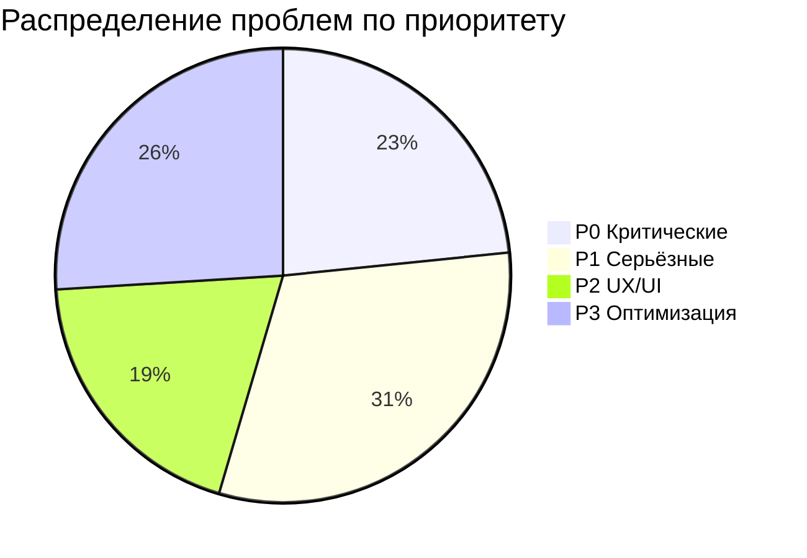
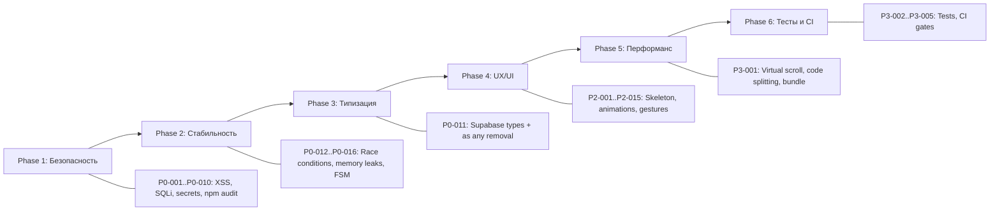

# 🔧 MASTER REMEDIATION PLAN — Your AI Companion

**Дата:** 2026-03-25  
**Версия:** 1.0  
**Статус:** Консолидированный план на основе 9 аудитов  
**Источники:** AUDIT_REPORT.md, AUDIT_FINAL_REPORT.md, CODE_AUDIT_REPORT.md, CRITICAL_ANALYSIS_REPORT.md, INSTA_MODULE_AUDIT_REPORT.md, FULL_PROJECT_AUDIT_2026-03-07.md, FULL_PROJECT_AUDIT_REPORT.md, DETAILED_FIX_GUIDE.md, REELS_PAGE_AUDIT_2026-03-03.md + собственный анализ кода

---

## Содержание

1. [Сводка](#1-сводка)
2. [P0 — Критические блокеры](#2-p0--критические-блокеры)
3. [P1 — Серьёзные баги](#3-p1--серьёзные-баги)
4. [P2 — UX/UI дефекты](#4-p2--uxui-дефекты)
5. [P3 — Оптимизация и техдолг](#5-p3--оптимизация-и-техдолг)
6. [Фронтенд-модули: детальный разбор](#6-фронтенд-модули-детальный-разбор)
7. [Бэкенд-модули: детальный разбор](#7-бэкенд-модули-детальный-разбор)
8. [UI/UX: до уровня Instagram 2026](#8-uiux-до-уровня-instagram-2026)
9. [Accessibility](#9-accessibility)
10. [Перформанс](#10-перформанс)
11. [Файлы для исправления — полный реестр](#11-файлы-для-исправления--полный-реестр)

---

## 1. Сводка

| Метрика | Значение |
|---------|----------|
| Всего уникальных проблем | **77** |
| P0 — Критические блокеры | **18** |
| P1 — Серьёзные баги | **24** |
| P2 — UX/UI дефекты | **15** |
| P3 — Оптимизация | **20** |
| Файлов к исправлению | **80+** |
| `as any` в кодовой базе | **300+** мест |
| Пустых catch блоков | **318** |
| console.log/warn/error | **220+** |
| TODO/FIXME | **10+** |

---

## 2. P0 — Критические блокеры

### P0-001: XSS через dangerouslySetInnerHTML
- **Файлы:** `src/pages/SettingsPage.tsx:1943`, `src/pages/AIAssistantPage.tsx:691`, `src/components/ui/chart.tsx:70`
- **Описание:** Использование `dangerouslySetInnerHTML` без санитизации. В SettingsPage — QR-код MFA, в AIAssistantPage — ответ AI, в chart.tsx — динамические стили
- **Исправление:** Заменить на `qrcode.react` для QR, DOMPurify для AI-ответов, CSS-in-JS для стилей
- **Сложность:** Средняя

### P0-002: SQL Injection в Python-бэкенде
- **Файлы:** `ai_engine/` — `trip_service.py:408`, `poi_service.py:305`, `crowdsource_service.py:527`
- **Описание:** Непараметризованные SQL-запросы в навигационных сервисах
- **Исправление:** Перевести на параметризованные запросы через SQLAlchemy или psycopg2 placeholders
- **Сложность:** Средняя

### P0-003: Hardcoded секреты в коде
- **Файлы:** `ai_engine/server/main.py:76,293`, `infra/calls/coturn/turnserver.conf:19`
- **Описание:** API-ключ `<INSECURE_FALLBACK_KEY>` и JWT-секрет захардкожены; TURN-пароль в конфиге
- **Исправление:** Вынести в переменные окружения, добавить проверку при старте
- **Сложность:** Низкая

### P0-004: CORS wildcard с credentials
- **Файл:** `ai_engine/server/main.py:68`
- **Описание:** `allow_origins=["*"]` с `allow_credentials=True` — позволяет любому сайту делать запросы с куками
- **Исправление:** Указать конкретные origins из env-переменной
- **Сложность:** Низкая

### P0-005: Unsafe Pickle — RCE уязвимость
- **Файл:** `ai_engine/` — `reward_model.py:221`
- **Описание:** Десериализация pickle из ненадёжного источника = Remote Code Execution
- **Исправление:** Заменить на `safetensors` или `json` формат для моделей
- **Сложность:** Средняя

### P0-006: npm уязвимости — 9+ HIGH severity
- **Файл:** `package.json` / `package-lock.json`
- **Описание:** undici (WebSocket overflow, HTTP smuggling), flatted (DoS), tar (path traversal), rollup (file write), react-router XSS
- **Исправление:** `npm audit fix` + обновление зависимостей
- **Сложность:** Низкая

### P0-007: Потеря данных при ошибке отправки email OTP
- **Файл:** `supabase/functions/send-email-otp/index.ts:229-231`
- **Описание:** При ошибке fetch к email-router функция всегда возвращает `{ success: true }`. Пользователь думает, что код отправлен
- **Исправление:** Возвращать `{ success: false, error: "..." }` при ошибке
- **Сложность:** Низкая

### P0-008: Timing attack на OTP-проверку
- **Файл:** `supabase/functions/verify-sms-otp/index.ts:102-110`
- **Описание:** `timingSafeEqual` сравнивает длину ДО timing-safe сравнения — утечка длины кода
- **Исправление:** Всегда сравнивать фиксированную длину 6 символов, отклонять на этапе валидации
- **Сложность:** Низкая

### P0-009: Отсутствие пагинации listUsers
- **Файл:** `supabase/functions/verify-email-otp/index.ts:132-135`
- **Описание:** `listUsers()` без пагинации — при росте базы функция упадёт по таймауту
- **Исправление:** Использовать `listUsers({ page, per_page })` с итерацией или поиск по email
- **Сложность:** Низкая

### P0-010: Коммит секретов в репозиторий
- **Файлы:** `.tmp_env_local_snapshot.txt`, `dist.zip`
- **Описание:** Снимок `.env.local` и build-артефакт в git. Потенциальная утечка секретов
- **Исправление:** Удалить файлы, добавить в `.gitignore`, запустить `git filter-repo`
- **Сложность:** Низкая

### P0-011: 300+ использований `as any` — потеря типобезопасности
- **Файлы:** 80+ файлов в `src/hooks/`, `src/lib/`, `src/components/`
- **Описание:** Массовое использование `(supabase as any)` обнуляет TypeScript safety. Ошибки проявляются только в runtime
- **Исправление:** Запустить `supabase gen types typescript` и обновить `src/integrations/supabase/types.ts`
- **Сложность:** Средняя (одноразовая генерация + замена по файлам)

### P0-012: Race condition в optimistic updates реакций
- **Файл:** `src/hooks/useMessageReactions.ts:303-314`
- **Описание:** `reactionsMap` захватывается в замыкании — при быстром double-tap используется устаревшее состояние
- **Исправление:** Использовать `useRef` для актуальной ссылки или функциональную форму setState
- **Сложность:** Средняя

### P0-013: Гонка записи в sessionStore
- **Файл:** `src/auth/sessionStore.ts:67-85`
- **Описание:** `_pendingWrite` перезаписывается при каждом вызове — данные могут быть потеряны при быстрых последовательных записях
- **Исправление:** Добавить очередь записи с ожиданием предыдущей операции
- **Сложность:** Средняя

### P0-014: Утечка памяти — setTimeout без очистки
- **Файлы:** `src/components/chat/DoubleTapReaction.tsx:31-34`, `src/pages/ReelsPage.tsx:228-235`, 96+ мест
- **Описание:** `setTimeout`/`setInterval` не очищаются при размонтировании компонентов
- **Исправление:** Добавить cleanup через `useEffect` return + `clearTimeout`
- **Сложность:** Средняя (массовая, но шаблонная)

### P0-015: FSM определён, но не используется в Reels
- **Файл:** `src/features/reels/fsm.ts` vs `src/pages/ReelsPage.tsx`
- **Описание:** Полноценный конечный автомат создан, но ReelsPage его игнорирует — параллельная система через useState. Двойной механизм = источник багов
- **Исправление:** Внедрить FSM через `useReducer`, удалить `syncPlaybackPolicy()`
- **Сложность:** Высокая

### P0-016: 2 падающих unit-теста
- **Файл:** `src/test/reels-create-entrypoints.test.tsx`
- **Описание:** Тесты ищут кнопку "Создать Reel", которая была удалена из ReelsPage
- **Исправление:** Восстановить accessible кнопку или обновить тесты
- **Сложность:** Низкая

### P0-017: Non-null assertion на env vars
- **Файл:** `supabase/functions/verify-sms-otp/index.ts:49-51`
- **Описание:** `Deno.env.get("SUPABASE_URL")!` — при отсутствии переменной функция упадёт с непонятной ошибкой
- **Исправление:** Добавить явную проверку и возврат 500 с информативным сообщением
- **Сложность:** Низкая

### P0-018: Отсутствие аутентификации на Python API endpoints
- **Файлы:** `ai_engine/server/main.py`, навигационные сервисы
- **Описание:** Открытые endpoints без проверки прав доступа
- **Исправление:** Добавить JWT-middleware для всех endpoints
- **Сложность:** Средняя

---

## 3. P1 — Серьёзные баги

### P1-001: BottomNav не скрывается на Reels
- **Файл:** `src/components/layout/AppLayout.tsx`
- **Описание:** `isReelsPage` определён, но НЕ передаётся в `BottomNav hidden` prop — навигация поверх видео
- **Исправление:** Передать `hidden={isReelsPage}` в BottomNav
- **Сложность:** Низкая

### P1-002: `objectFit: contain` вместо `cover` на Reels
- **Файл:** `src/pages/ReelsPage.tsx:808`
- **Описание:** Чёрные полосы на видео вместо fullscreen как в TikTok/Instagram
- **Исправление:** Заменить на `objectFit: 'cover'` + blur background для нестандартных пропорций
- **Сложность:** Низкая

### P1-003: `100vh` вместо `100dvh` на мобильных
- **Файл:** `src/pages/ReelsPage.tsx:754,758,779`
- **Описание:** На мобильных `100vh` не равен видимому viewport — обрезка контента
- **Исправление:** Заменить на `100dvh`
- **Сложность:** Низкая

### P1-004: Утечка `<link prefetch>` в DOM
- **Файл:** `src/pages/ReelsPage.tsx:365-366`
- **Описание:** `document.head.appendChild(link)` для prefetch — никогда не удаляется. `prefetchedVideoUrls` Set растёт неограниченно
- **Исправление:** Добавить cleanup при размонтировании, ограничить размер Set
- **Сложность:** Средняя

### P1-005: IntersectionObserver пересоздаётся на каждый loadMore
- **Файл:** `src/pages/ReelsPage.tsx:239-294`
- **Описание:** Зависимость от `[reels, recordImpression]` — observer уничтожается и создаётся заново при каждом изменении массива
- **Исправление:** Использовать `useRef` для стабильных ссылок
- **Сложность:** Средняя

### P1-006: N+1 Query Problem в useStories
- **Файл:** `src/hooks/useStories.tsx:61-126`
- **Описание:** 4 отдельных последовательных запроса вместо батчинга
- **Исправление:** Объединить в один RPC или использовать `Promise.all`
- **Сложность:** Средняя

### P1-007: Race conditions в useReels toggleLike/toggleSave
- **Файл:** `src/hooks/useReels.tsx:426-489`
- **Описание:** При быстром двойном клике — гонка между insert и delete
- **Исправление:** Добавить debounce или mutex (OperationMutex уже создан в `src/lib/errors.ts`)
- **Сложность:** Средняя

### P1-008: Memory leaks в Supabase realtime подписках
- **Файл:** `src/hooks/useStories.tsx:208-223`
- **Описание:** `fetchStories` в зависимости useEffect может меняться, вызывая пересоздание канала
- **Исправление:** Использовать `useRef` для стабильной ссылки на callback
- **Сложность:** Средняя

### P1-009: Отсутствие Error Boundaries
- **Файлы:** Компоненты feed, reels, chat, profile
- **Описание:** Нет React Error Boundaries — ошибка в одном компоненте роняет всё приложение
- **Исправление:** Добавить `<ErrorBoundary>` обёртки для каждого модуля. `AppErrorBoundary` уже есть — нужны модульные
- **Сложность:** Средняя

### P1-010: Нет обработки ошибок в MessageReactions Supabase операциях
- **Файл:** `src/components/chat/MessageReactions.tsx:39-76`
- **Описание:** Все Supabase операции без try/catch — при сбое сети пользователь не видит feedback
- **Исправление:** Обернуть в try/catch с toast уведомлениями
- **Сложность:** Низкая

### P1-011: Дублирование Supabase клиента
- **Файлы:** `src/lib/supabase.ts`, `src/integrations/supabase/client.ts`
- **Описание:** Два файла создают Supabase клиент — потенциальная рассинхронизация
- **Исправление:** Консолидировать в один файл, сделать второй реэкспортом
- **Сложность:** Низкая

### P1-012: Dual lockfile conflict
- **Файлы:** `package-lock.json`, `bun.lockb`
- **Описание:** Два пакетных менеджера — divergence в resolved versions
- **Исправление:** Выбрать один (npm или bun), удалить другой lockfile
- **Сложность:** Низкая

### P1-013: @playwright/test в dependencies
- **Файл:** `package.json:152`
- **Описание:** Тестовый фреймворк в production dependencies — раздувает бандл
- **Исправление:** Перенести в devDependencies (уже перенесён, но `ioredis` и `ws` всё ещё в deps)
- **Сложность:** Низкая

### P1-014: ioredis и ws в frontend dependencies
- **Файл:** `package.json:122,143`
- **Описание:** Redis-клиент и WebSocket-библиотека в корневом package.json — не нужны в браузере
- **Исправление:** Вынести в server packages или devDependencies
- **Сложность:** Низкая

### P1-015: JWT в localStorage
- **Файл:** Конфигурация Supabase клиента
- **Описание:** Refresh tokens в localStorage доступны при XSS
- **Исправление:** Настроить `auth: { storage: cookieStorage }` для httpOnly cookies
- **Сложность:** Средняя

### P1-016: 318 пустых catch блоков
- **Файлы:** 20+ файлов (CRMHRDashboard, CRMRealEstateDashboard, EmailPage, SettingsPage и др.)
- **Описание:** `catch {}` без логирования — невозможно диагностировать проблемы
- **Исправление:** Добавить `logger.error()` или `console.error()` в каждый catch
- **Сложность:** Низкая (массовая, но шаблонная)

### P1-017: 220+ console.log в production коде
- **Файлы:** `src/lib/ci/gates.ts` (30+), `src/calls-v2/*.ts` (25+), `src/hooks/useVideoCallSfu.ts` (15+)
- **Описание:** Отладочный вывод в production — шум в консоли, потенциальная утечка данных
- **Исправление:** Заменить на `logger` из `src/lib/logger.ts`
- **Сложность:** Средняя (массовая)

### P1-018: Stub-компоненты в production
- **Файлы:** `src/pages/BusinessAccountPage.tsx`, `src/pages/PeopleNearbyPage.tsx`, `src/pages/CRMDashboard.tsx:108-120`, `src/components/profile/SettingsDrawer.tsx`
- **Описание:** Полные заглушки или функции-заглушки доступны пользователям
- **Исправление:** Либо реализовать, либо скрыть за feature flag
- **Сложность:** Высокая (зависит от модуля)

### P1-019: Sentry в stub-режиме
- **Файл:** `src/lib/sentry.ts:122`
- **Описание:** Error tracking логирует в console вместо отправки в Sentry
- **Исправление:** Настроить реальный Sentry DSN для production
- **Сложность:** Низкая

### P1-020: Проверка хэштегов на клиенте
- **Файл:** `src/hooks/useComments.tsx:162`
- **Описание:** Модерация хэштегов происходит на клиенте — легко обойти
- **Исправление:** Перенести проверку в Edge Function
- **Сложность:** Средняя

### P1-021: Cache poisoning в link-preview
- **Файл:** `supabase/functions/link-preview/index.ts:425-430`
- **Описание:** `>` вместо `>=` для проверки expiry — кэш может считаться валидным на миллисекунду дольше
- **Исправление:** Заменить `>` на `>=`
- **Сложность:** Низкая

### P1-022: Порядок проверок в verify-email-otp
- **Файл:** `supabase/functions/verify-email-otp/index.ts:99-122`
- **Описание:** Счётчик attempts увеличивается ДО проверки кода — при истёкшем коде attempt засчитывается
- **Исправление:** Увеличивать attempts только при неверном коде
- **Сложность:** Низкая

### P1-023: Нет валидации формата email в verify-email-otp
- **Файл:** `supabase/functions/verify-email-otp/index.ts:60-71`
- **Описание:** Проверяется только наличие email, но не формат
- **Исправление:** Добавить regex-валидацию email
- **Сложность:** Низкая

### P1-024: Blanket exception handling в Python
- **Файлы:** 7+ файлов в `ai_engine/`
- **Описание:** `except Exception: pass` — подавление всех исключений
- **Исправление:** Добавить логирование и специфичные обработчики
- **Сложность:** Средняя

---

## 4. P2 — UX/UI дефекты

### P2-001: Монолитные файлы — невозможность поддержки
| Файл | Размер | Рекомендация |
|------|--------|-------------|
| `src/pages/SettingsPage.tsx` | 208K chars | Разбить на модули (уже начато в `src/pages/settings/`) |
| `src/components/chat/ChannelConversation.tsx` | 83K chars | Извлечь MessageList, InputBar, Header |
| `src/components/chat/ChatConversation.tsx` | 68K chars | Аналогично ChannelConversation |
| `src/pages/ChatsPage.tsx` | 74K chars | Извлечь ConversationList, SearchBar |
| `src/pages/CRMRealEstateDashboard.tsx` | 132K chars | Разбить на виджеты |
| `src/pages/CRMHRDashboard.tsx` | 106K chars | Разбить на виджеты |
| `src/pages/CRMAutoDashboard.tsx` | 99K chars | Разбить на виджеты |

### P2-002: Нет skeleton loading
- **Файлы:** Все страницы с данными
- **Описание:** Показывается только spinner — нет skeleton UI как в Instagram
- **Исправление:** Добавить Skeleton компоненты для feed, stories, profile, reels
- **Сложность:** Средняя

### P2-003: Нет blur background для нестандартных видео
- **Файл:** `src/pages/ReelsPage.tsx`
- **Описание:** Видео с нестандартными пропорциями показывают чёрные полосы вместо размытого фона
- **Исправление:** Добавить `<video>` с blur-фильтром за основным видео
- **Сложность:** Средняя

### P2-004: Отсутствие анимаций переходов между страницами
- **Файл:** `src/App.tsx`, `src/components/layout/PageTransition.tsx`
- **Описание:** PageTransition существует, но переходы не на уровне Instagram (shared element transitions)
- **Исправление:** Добавить View Transitions API или framer-motion shared layout
- **Сложность:** Высокая

### P2-005: Нет pull-to-refresh на мобильных
- **Файлы:** Feed, Reels, Chats страницы
- **Описание:** Стандартный паттерн мобильных приложений отсутствует
- **Исправление:** Добавить pull-to-refresh gesture handler
- **Сложность:** Средняя

### P2-006: Нет haptic feedback на ключевых действиях
- **Файл:** `src/lib/haptics.ts` — модуль существует, но не интегрирован повсеместно
- **Описание:** Like, save, send message — нет тактильной обратной связи
- **Исправление:** Интегрировать haptics в ключевые user actions
- **Сложность:** Низкая

### P2-007: Inconsistent naming — mix English/Russian
- **Файлы:** Комментарии и переменные по всему проекту
- **Описание:** Смешение языков в комментариях и UI-строках
- **Исправление:** Стандартизировать на английский для кода, русский для UI через i18n
- **Сложность:** Средняя

### P2-008: Нет offline-first поведения
- **Файлы:** Все data-fetching хуки
- **Описание:** При потере сети — белый экран или ошибка вместо кэшированных данных
- **Исправление:** Настроить TanStack Query с `staleTime`, `gcTime`, `networkMode: 'offlineFirst'`
- **Сложность:** Средняя

### P2-009: Нет swipe-to-dismiss для модальных окон
- **Файлы:** Sheet-компоненты (ReelCommentsSheet, ReelShareSheet и др.)
- **Описание:** Модальные окна не закрываются свайпом вниз как в Instagram
- **Исправление:** Использовать `vaul` (уже в deps) для всех bottom sheets
- **Сложность:** Средняя

### P2-010: Нет double-tap to like на постах
- **Файлы:** Feed компоненты
- **Описание:** Стандартный Instagram-паттерн отсутствует в ленте постов
- **Исправление:** Добавить gesture handler с анимацией сердца
- **Сложность:** Средняя

### P2-011: Нет long-press context menu
- **Файлы:** Сообщения в чате, посты в ленте
- **Описание:** Нет контекстного меню при долгом нажатии (reply, copy, forward, delete)
- **Исправление:** Добавить `useLongPress` hook (уже есть) + context menu UI
- **Сложность:** Средняя

### P2-012: Mock данные в production build
- **Файл:** `src/lib/taxi/mock-drivers.ts`
- **Описание:** Тестовые данные включены в production bundle
- **Исправление:** Вынести за feature flag или в dev-only модуль
- **Сложность:** Низкая

### P2-013: ESLint react-refresh warnings — 20 файлов
- **Файлы:** AnimatedEmojiFullscreen, ChatBackground, ChatThemePicker, CustomEmoji, FloatingDate, InlineBotResults, MessageReactions, AdjustmentsPanel, insurance forms, CommentFilter, notifications, ReelsContext
- **Описание:** Файлы экспортируют и компоненты, и константы — ломает React Fast Refresh
- **Исправление:** Разделить экспорты на отдельные файлы
- **Сложность:** Низкая

### P2-014: Suppressed react-hooks/exhaustive-deps
- **Файл:** `src/pages/CreateCenterPage.tsx:215,233`
- **Описание:** useEffect с пропущенными зависимостями — stale closure bugs
- **Исправление:** Добавить зависимости или использовать useRef
- **Сложность:** Низкая

### P2-015: Дублирование anonSessionId x6 в useReels
- **Файл:** `src/hooks/useReels.tsx`
- **Описание:** Один и тот же паттерн повторяется 6 раз
- **Исправление:** Извлечь в утилиту `getAnonSessionId()`
- **Сложность:** Низкая

---

## 5. P3 — Оптимизация и техдолг

### P3-001: Нет virtual scrolling для длинных списков
- **Файлы:** `src/hooks/useReels.tsx`, `src/hooks/useComments.tsx`, ChatsPage
- **Описание:** Все элементы рендерятся в DOM — проблемы при 100+ элементах
- **Исправление:** Использовать `@tanstack/react-virtual`
- **Сложность:** Средняя

### P3-002: Нет тестов для React hooks
- **Файлы:** 150+ хуков в `src/hooks/`
- **Описание:** Большинство хуков без unit-тестов
- **Исправление:** Добавить тесты через `@testing-library/react-hooks`
- **Сложность:** Высокая (объём)

### P3-003: Нет E2E тестов в CI
- **Файлы:** `e2e/`, `playwright.config.ts`
- **Описание:** Playwright тесты существуют, но не запускаются в CI
- **Исправление:** Добавить в GitHub Actions workflow
- **Сложность:** Средняя

### P3-004: Нет npm audit в CI
- **Файл:** `.github/workflows/`
- **Описание:** Уязвимости не проверяются автоматически
- **Исправление:** Добавить `npm audit --audit-level=high` в CI pipeline
- **Сложность:** Низкая

### P3-005: Нет sql:lint и encoding:check-bom в CI
- **Файлы:** `scripts/sql/lint-rpc-aliases.mjs`, `scripts/encoding/check-bom.mjs`
- **Описание:** Скрипты существуют, но не в CI
- **Исправление:** Добавить в CI workflow
- **Сложность:** Низкая

### P3-006: Устаревшие зависимости
| Пакет | Текущая | Доступная |
|-------|---------|-----------|
| `react` | 18.3.1 | 19.x |
| `vite` | 5.4.19 | 6.x |
| `tailwindcss` | 3.4.17 | 4.x |
| `react-router-dom` | 6.30.1 | 7.x |

### P3-007: Нет rate limiting на frontend mutations
- **Файлы:** Все хуки с Supabase mutations
- **Описание:** Нет защиты от спама действий (like, comment, follow)
- **Исправление:** Добавить debounce/throttle на mutation callbacks
- **Сложность:** Средняя

### P3-008: Нет централизованного error handling
- **Файлы:** Все хуки
- **Описание:** Каждый хук обрабатывает ошибки по-своему (console.error vs logger.error vs setError)
- **Исправление:** Использовать `handleApiError()` из `src/lib/errors.ts` повсеместно
- **Сложность:** Средняя

### P3-009: Нет Zod-валидации API-ответов
- **Файлы:** Все хуки с Supabase запросами
- **Описание:** Ответы от API не валидируются — runtime ошибки при изменении схемы
- **Исправление:** Добавить Zod-схемы для критических ответов (zod уже в deps)
- **Сложность:** Средняя

### P3-010: Кэш не адаптируется к изменению fingerprint
- **Файл:** `src/auth/localStorageCrypto.ts:88-136`
- **Описание:** При изменении fingerprint зашифрованные данные становятся недоступны без уведомления
- **Исправление:** Добавить fallback и уведомление пользователю
- **Сложность:** Средняя

### P3-011: Нет автоматического тестирования миграций
- **Файлы:** `supabase/migrations/` (200+ файлов)
- **Описание:** Частые hotfix-миграции указывают на нестабильность схемы
- **Исправление:** Добавить migration testing в CI
- **Сложность:** Средняя

### P3-012: .venv в репозитории
- **Файл:** `.venv/`
- **Описание:** Python virtual environment в git — раздувает репозиторий
- **Исправление:** Добавить в `.gitignore`, удалить из git
- **Сложность:** Низкая

### P3-013: Нет логирования в parseEncryptedPayload
- **Файл:** `src/components/chat/ChatConversation.tsx:124-142`
- **Описание:** Функция возвращает null без логирования — сложно отладить
- **Исправление:** Добавить `logger.warn()` при неудачном парсинге
- **Сложность:** Низкая

### P3-014: Vision API интеграция — TODO
- **Файл:** `src/lib/accessibility/autoAltText.ts:57`
- **Описание:** TODO: интеграция с Vision API для автоматического alt-текста
- **Исправление:** Интегрировать Google Cloud Vision или TensorFlow.js
- **Сложность:** Высокая

### P3-015: Verify sip.js usage
- **Файл:** `package.json` — `sip.js: ^0.21.2`
- **Описание:** SIP-библиотека в dependencies — проверить, используется ли
- **Исправление:** Удалить если не используется, или вынести в отдельный пакет
- **Сложность:** Низкая

### P3-016: @cesdk/cesdk-js tree-shaking
- **Файл:** `package.json` — `@cesdk/cesdk-js: ^1.67.0`
- **Описание:** Тяжёлый SDK (~MB) — проверить tree-shaking
- **Исправление:** Проверить bundle analyzer, при необходимости lazy-load
- **Сложность:** Средняя

### P3-017: Inconsistent logging подход
- **Файлы:** `src/hooks/useStories.tsx` (console.error), `src/hooks/useReels.tsx` (logger.error), `src/hooks/useSmartFeed.ts` (console.error)
- **Описание:** Разные подходы к логированию в разных модулях
- **Исправление:** Стандартизировать на `logger` из `src/lib/logger.ts`
- **Сложность:** Средняя

### P3-018: Нет health check для email router
- **Файл:** `supabase/functions/send-email-otp/index.ts:94-97`
- **Описание:** Проверяется только наличие URL, но не доступность сервиса
- **Исправление:** Добавить periodic health check endpoint
- **Сложность:** Средняя

### P3-019: Нет тестов для server/ и services/
- **Файлы:** `server/calls-ws/`, `server/trust-enforcement/`, `services/email-router/`, `services/notification-router/`
- **Описание:** Бэкенд-сервисы без тестового покрытия
- **Исправление:** Добавить unit и integration тесты
- **Сложность:** Высокая

### P3-020: Широкие диапазоны версий Python зависимостей
- **Файлы:** `ai_engine/requirements.txt`
- **Описание:** Нефиксированные версии — непредсказуемые сборки
- **Исправление:** Зафиксировать версии через `pip freeze`
- **Сложность:** Низкая

---

## 6. Фронтенд-модули: детальный разбор

### Компоненты с заглушками

| Компонент | Файл | Статус | Описание |
|-----------|------|--------|----------|
| BusinessAccountPage | `src/pages/BusinessAccountPage.tsx` | STUB | Telegram Business, Passport, Bot Payments — заглушка |
| PeopleNearbyPage | `src/pages/PeopleNearbyPage.tsx` | STUB | UI only, нет PostGIS бэкенда |
| CRMDashboard | `src/pages/CRMDashboard.tsx:108-120` | PARTIAL | 3 функции add modal — заглушки |
| SettingsDrawer | `src/components/profile/SettingsDrawer.tsx` | DEPRECATED | Hardcoded данные, помечен как deprecated |
| StoryArchivePage | `src/pages/StoryArchivePage.tsx:83-85` | PARTIAL | TODO: HighlightPicker sheet |
| LiveExplorePage | `src/pages/LiveExplorePage.tsx:180-182` | PARTIAL | notify_at — заглушка |

### Сломанные флоу

| Флоу | Проблема | Файлы |
|------|----------|-------|
| Создание Reel из ReelsPage | Кнопка удалена, тесты падают | `ReelsPage.tsx`, `reels-create-entrypoints.test.tsx` |
| Reels playback state | FSM не используется, двойное управление | `ReelsPage.tsx`, `features/reels/fsm.ts` |
| Follow/Unfollow на Reels | TODO Phase N | `ReelsPage.tsx:403` |
| Account Switcher navigation | TODO: navigate to auth | `AccountSwitcher.tsx:56` |
| VideoCall ECDSA identity | TODO Phase C | `VideoCallContext.tsx:398` |

### Oversized компоненты — план рефакторинга

```mermaid
graph TD
    A[SettingsPage.tsx 208K] --> A1[SettingsPrivacySection]
    A --> A2[SettingsActivitySection]
    A --> A3[SettingsDataStorageSection]
    A --> A4[SettingsArchiveSection]
    A --> A5[SettingsCallsSection]
    A --> A6[SettingsAboutSection]
    A --> A7[SettingsHelpSection]
    A --> A8[SettingsAppearanceSection]
    A --> A9[SettingsSavedSection]
    
    B[ChannelConversation.tsx 83K] --> B1[ChannelMessageList]
    B --> B2[ChannelInputBar]
    B --> B3[ChannelHeader]
    B --> B4[ChannelMediaPanel]
    
    C[ChatConversation.tsx 68K] --> C1[ChatMessageList]
    C --> C2[ChatInputBar]
    C --> C3[ChatHeader]
    C --> C4[ChatMediaPanel]
    
    D[ChatsPage.tsx 74K] --> D1[ConversationList]
    D --> D2[ChatSearchBar]
    D --> D3[ChatFilters]
```

> **Примечание:** Рефакторинг SettingsPage уже начат — в `src/pages/settings/` есть 10 подмодулей. Нужно завершить миграцию и удалить монолит.

---

## 7. Бэкенд-модули: детальный разбор

### Supabase Edge Functions (64 функции)

| Категория | Функции | Проблемы |
|-----------|---------|----------|
| Auth | send-email-otp, verify-email-otp, send-sms-otp, verify-sms-otp, totp-setup | P0-007, P0-008, P0-009, P0-017, P1-022, P1-023 |
| E2EE | validate-key-session | ✅ Безопасно |
| Email | email-send, email-smtp-settings | P3-018 |
| Feed | get-feed-v2, reels-feed | ✅ OK |
| Link Preview | link-preview | P1-021 |
| Navigation | nav-* (8 функций) | Нет тестов |
| Live | live-* (4 функции) | Нет тестов |
| Admin | admin-api | ✅ JWT + role checks |
| Taxi | taxi-dispatch, taxi-notifications | Нет тестов |

### Server-side сервисы

| Сервис | Путь | Проблемы |
|--------|------|----------|
| WebSocket Signalling | `server/calls-ws/` | 26K chars монолит, нет тестов |
| SFU Media Relay | `server/sfu/` | Нет тестов |
| Reels Arbiter | `server/reels-arbiter/` | Нет тестов |
| Trust Enforcement | `server/trust-enforcement/` | Нет тестов |
| Bot API | `server/bot-api/` | Нет тестов |
| Analytics | `server/analytics-ingest/`, `server/analytics-consumer/` | Нет тестов |
| Email Router | `services/email-router/` | Нет тестов |
| Notification Router | `services/notification-router/` | Нет тестов |

### Python AI Engine

| Проблема | Файл | Приоритет |
|----------|------|-----------|
| SQL Injection x3 | trip_service, poi_service, crowdsource_service | P0 |
| Hardcoded secrets x2 | main.py | P0 |
| CORS wildcard | main.py | P0 |
| Unsafe pickle | reward_model.py | P0 |
| No auth on endpoints | main.py | P0 |
| Blanket exceptions x7 | Множественные | P1 |
| No rate limiting | API endpoints | P1 |
| Insecure random | Криптография | P1 |

---

## 8. UI/UX: до уровня Instagram 2026

### Что отсутствует для паритета с Instagram

| Функция | Instagram 2026 | Текущий статус | Приоритет |
|---------|---------------|----------------|-----------|
| Skeleton loading | ✅ Везде | ❌ Только spinner | P2 |
| Shared element transitions | ✅ Между экранами | ❌ Нет | P2 |
| Pull-to-refresh | ✅ Везде | ❌ Нет | P2 |
| Double-tap to like | ✅ На постах и reels | ⚠️ Только в чате | P2 |
| Blur video background | ✅ На нестандартных видео | ❌ Чёрные полосы | P1 |
| Haptic feedback | ✅ На всех действиях | ⚠️ Модуль есть, не интегрирован | P2 |
| Long-press context menu | ✅ На постах и сообщениях | ⚠️ Частично | P2 |
| Swipe-to-dismiss sheets | ✅ Все bottom sheets | ⚠️ Частично | P2 |
| Smooth 60fps scroll | ✅ Virtual scrolling | ❌ Все элементы в DOM | P3 |
| Offline cached content | ✅ Кэш ленты | ❌ Белый экран | P2 |
| AR Filters (Spark AR level) | ✅ Полноценные | ⚠️ Canvas-based | P3 |
| Instagram Graph API | ✅ Полный доступ | ❌ Нет интеграции | P3 |

---

## 9. Accessibility

### Текущее состояние

| Аспект | Статус | Детали |
|--------|--------|--------|
| SkipToContent | ✅ | `src/components/accessibility/SkipToContent.tsx` |
| ColorFilterSVG | ✅ | Для дальтоников |
| AccessibilitySettings | ✅ | Отдельная страница |
| useAccessibility hook | ✅ | Настройки a11y |
| autoAltText | ⚠️ TODO | Vision API не интегрирован |
| Keyboard navigation в Stories | ❌ | StoryViewer без keyboard nav |
| ARIA labels в ReelPlayer | ❌ | Нет screen reader поддержки |
| Focus management в модалках | ⚠️ | Частично через Radix |
| Reduced motion support | ⚠️ | framer-motion есть, но не везде `prefers-reduced-motion` |
| High contrast mode | ❌ | Нет поддержки |
| Screen reader для чата | ⚠️ | Частично |

### Рекомендации

1. Добавить `aria-label` на все интерактивные элементы в Reels и Stories
2. Реализовать keyboard navigation для StoryViewer (←/→ для переключения, Space для паузы)
3. Добавить `prefers-reduced-motion` проверку для всех анимаций
4. Интегрировать Vision API для автоматического alt-текста изображений
5. Добавить focus trap в модальные окна
6. Тестировать с VoiceOver/TalkBack

---

## 10. Перформанс

### Текущие проблемы

| Проблема | Влияние | Файлы | Приоритет |
|----------|---------|-------|-----------|
| Нет virtual scrolling | Тормоза при 100+ элементах | Reels, Comments, Chats | P3 |
| N+1 queries в useStories | Медленная загрузка stories | useStories.tsx | P1 |
| IntersectionObserver пересоздание | Гонка состояний, лишние re-renders | ReelsPage.tsx | P1 |
| Prefetch links не очищаются | Утечка памяти в DOM | ReelsPage.tsx | P1 |
| 96+ setTimeout без cleanup | Утечка памяти | Множественные | P0 |
| Монолитные компоненты | Медленный re-render | SettingsPage, ChatsPage | P2 |
| Нет code-splitting для ChatsPage | Большой initial bundle | App.tsx — ChatsPage не lazy | P1 |
| @cesdk/cesdk-js в bundle | ~MB тяжёлый SDK | package.json | P3 |

### Рекомендации по оптимизации

1. **Code splitting:** `ChatsPage` и `ProfilePage` импортируются напрямую в App.tsx — перевести на `lazy()`
2. **Bundle analysis:** Запустить `vite-bundle-visualizer` для выявления тяжёлых зависимостей
3. **Image optimization:** Проверить использование `srcset` и `loading="lazy"` для изображений
4. **Service Worker:** Добавить для кэширования статики и API-ответов
5. **React.memo:** Обернуть тяжёлые компоненты (ReelItem, MessageBubble, ConversationItem)

---

## 11. Файлы для исправления — полный реестр

### Критические (P0) — исправить немедленно

| # | Файл | Что исправить |
|---|------|---------------|
| 1 | `src/pages/SettingsPage.tsx:1943` | Заменить dangerouslySetInnerHTML на qrcode.react |
| 2 | `src/pages/AIAssistantPage.tsx:691` | Санитизировать HTML через DOMPurify |
| 3 | `src/components/ui/chart.tsx:70` | Заменить dangerouslySetInnerHTML на CSS-in-JS |
| 4 | `ai_engine/server/main.py:76,293` | Вынести секреты в env vars |
| 5 | `ai_engine/server/main.py:68` | Заменить CORS wildcard на конкретные origins |
| 6 | `ai_engine/*/trip_service.py:408` | Параметризовать SQL |
| 7 | `ai_engine/*/poi_service.py:305` | Параметризовать SQL |
| 8 | `ai_engine/*/crowdsource_service.py:527` | Параметризовать SQL |
| 9 | `ai_engine/*/reward_model.py:221` | Заменить pickle на безопасный формат |
| 10 | `package.json` + `package-lock.json` | `npm audit fix` |
| 11 | `supabase/functions/send-email-otp/index.ts:229` | Возвращать ошибку при failed fetch |
| 12 | `supabase/functions/verify-sms-otp/index.ts:102` | Фиксировать длину сравнения OTP |
| 13 | `supabase/functions/verify-sms-otp/index.ts:49` | Добавить проверку env vars |
| 14 | `supabase/functions/verify-email-otp/index.ts:132` | Добавить пагинацию listUsers |
| 15 | `.tmp_env_local_snapshot.txt` | Удалить из git + filter-repo |
| 16 | `dist.zip` | Удалить из git + .gitignore |
| 17 | `src/hooks/useMessageReactions.ts:303` | Исправить stale closure в toggleReaction |
| 18 | `src/auth/sessionStore.ts:67` | Добавить очередь записи |
| 19 | `src/components/chat/DoubleTapReaction.tsx:31` | Добавить cleanup setTimeout |
| 20 | `src/pages/ReelsPage.tsx:228` | Добавить cleanup таймеров |
| 21 | `src/test/reels-create-entrypoints.test.tsx` | Исправить или обновить тесты |
| 22 | `src/integrations/supabase/types.ts` | Регенерировать типы Supabase |
| 23 | `src/features/reels/fsm.ts` + `src/pages/ReelsPage.tsx` | Внедрить FSM или удалить |

### Высокие (P1) — исправить в течение недели

| # | Файл | Что исправить |
|---|------|---------------|
| 24 | `src/components/layout/AppLayout.tsx` | Передать hidden prop в BottomNav для Reels |
| 25 | `src/pages/ReelsPage.tsx:808` | objectFit: contain → cover |
| 26 | `src/pages/ReelsPage.tsx:754,758,779` | 100vh → 100dvh |
| 27 | `src/pages/ReelsPage.tsx:365` | Cleanup prefetch links |
| 28 | `src/pages/ReelsPage.tsx:239` | Стабилизировать IntersectionObserver |
| 29 | `src/hooks/useStories.tsx:61-126` | Батчить запросы через Promise.all |
| 30 | `src/hooks/useReels.tsx:426-489` | Добавить mutex на toggleLike/toggleSave |
| 31 | `src/hooks/useStories.tsx:208` | useRef для стабильной ссылки |
| 32 | `src/components/chat/MessageReactions.tsx:39` | Добавить try/catch + toast |
| 33 | `src/lib/supabase.ts` | Консолидировать с integrations/supabase/client.ts |
| 34 | `bun.lockb` | Удалить (выбрать npm) |
| 35 | `package.json` | Перенести ioredis, ws в server packages |
| 36 | `src/lib/sentry.ts` | Настроить реальный Sentry DSN |
| 37 | `src/hooks/useComments.tsx:162` | Перенести модерацию хэштегов на сервер |
| 38 | `supabase/functions/link-preview/index.ts:425` | > → >= |
| 39 | `supabase/functions/verify-email-otp/index.ts:99` | Порядок проверок attempts |
| 40 | `supabase/functions/verify-email-otp/index.ts:60` | Валидация формата email |
| 41 | 20+ файлов | Добавить Error Boundaries для модулей |
| 42 | 20+ файлов | Заменить 318 пустых catch на logger.error |
| 43 | 30+ файлов | Заменить 220+ console.log на logger |

### Средние (P2) — исправить в течение месяца

| # | Файл | Что исправить |
|---|------|---------------|
| 44 | `src/pages/SettingsPage.tsx` | Завершить миграцию в src/pages/settings/ |
| 45 | `src/components/chat/ChannelConversation.tsx` | Разбить на подкомпоненты |
| 46 | `src/components/chat/ChatConversation.tsx` | Разбить на подкомпоненты |
| 47 | `src/pages/ChatsPage.tsx` | Извлечь ConversationList |
| 48 | `src/pages/CRMRealEstateDashboard.tsx` | Разбить на виджеты |
| 49 | Все страницы с данными | Добавить Skeleton loading |
| 50 | `src/pages/ReelsPage.tsx` | Добавить blur background для видео |
| 51 | `src/App.tsx` | Перевести ChatsPage и ProfilePage на lazy() |
| 52 | Feed компоненты | Добавить double-tap to like |
| 53 | Sheet компоненты | Интегрировать vaul для swipe-to-dismiss |
| 54 | `src/lib/haptics.ts` | Интегрировать в ключевые actions |
| 55 | `src/lib/taxi/mock-drivers.ts` | Вынести за feature flag |
| 56 | 20 файлов | Исправить react-refresh warnings |
| 57 | `src/pages/CreateCenterPage.tsx:215,233` | Исправить exhaustive-deps |
| 58 | `src/hooks/useReels.tsx` | Извлечь getAnonSessionId() |

### Низкие (P3) — бэклог

| # | Файл | Что исправить |
|---|------|---------------|
| 59 | Reels, Comments, Chats | Добавить virtual scrolling |
| 60 | 150+ хуков | Добавить unit-тесты |
| 61 | `.github/workflows/` | Добавить E2E тесты в CI |
| 62 | `.github/workflows/` | Добавить npm audit в CI |
| 63 | `.github/workflows/` | Добавить sql:lint и encoding:check-bom |
| 64 | `package.json` | Обновить React 19, Vite 6, Tailwind 4, RR 7 |
| 65 | Все хуки с mutations | Добавить rate limiting/debounce |
| 66 | Все хуки | Стандартизировать error handling |
| 67 | Критические API-ответы | Добавить Zod-валидацию |
| 68 | `src/auth/localStorageCrypto.ts:88` | Fallback при изменении fingerprint |
| 69 | `supabase/migrations/` | Добавить migration testing в CI |
| 70 | `.venv/` | Удалить из git |
| 71 | `src/components/chat/ChatConversation.tsx:124` | Добавить логирование в parseEncryptedPayload |
| 72 | `src/lib/accessibility/autoAltText.ts:57` | Интегрировать Vision API |
| 73 | `package.json` — sip.js | Проверить использование, удалить если не нужен |
| 74 | `package.json` — @cesdk/cesdk-js | Проверить tree-shaking |
| 75 | Все хуки | Стандартизировать logging на logger |
| 76 | `supabase/functions/send-email-otp/` | Добавить health check |
| 77 | `server/`, `services/` | Добавить тесты для бэкенд-сервисов |
| 78 | `ai_engine/requirements.txt` | Зафиксировать версии |
| 79 | `src/components/reels/ReelPlayer.tsx` | Добавить ARIA labels |
| 80 | `src/components/feed/StoryViewer.tsx` | Добавить keyboard navigation |

---

## Порядок выполнения

### Phase 1: Безопасность (P0-001 — P0-010)
- Удалить секреты из git
- Исправить XSS, SQL Injection
- npm audit fix
- Исправить OTP-уязвимости

### Phase 2: Стабильность (P0-012 — P0-016, P1-001 — P1-024)
- Исправить race conditions
- Исправить memory leaks
- Исправить падающие тесты
- Добавить Error Boundaries

### Phase 3: Типизация (P0-011)
- Регенерировать Supabase types
- Заменить 300+ `as any` на строгие типы
- Добавить Zod-валидацию

### Phase 4: UX/UI (P2-001 — P2-015)
- Skeleton loading
- Рефакторинг монолитных компонентов
- Анимации и жесты
- Offline-first

### Phase 5: Перформанс (P3-001, P3-016)
- Virtual scrolling
- Code splitting
- Bundle optimization

### Phase 6: Тесты и CI (P3-002 — P3-005, P3-019)
- Unit-тесты для хуков
- E2E тесты в CI
- npm audit в CI
- Migration testing

---

*Документ создан: 2026-03-25*  
*Следующий review: после завершения Phase 1*
