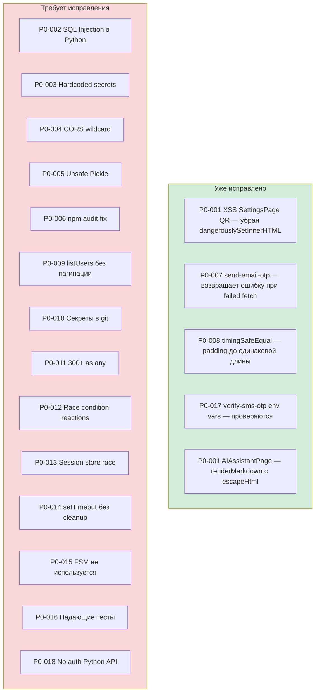
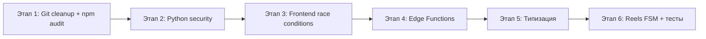

# 🚨 P0 — Детальный план исправления критических проблем

**Дата:** 2026-03-25  
**Статус:** Верифицировано по реальному коду

---

## Статус P0 после верификации кода



| ID | Проблема | Статус | Примечание |
|----|----------|--------|------------|
| P0-001 | XSS dangerouslySetInnerHTML | ✅ ИСПРАВЛЕНО | SettingsPage QR убран, AIAssistantPage имеет escapeHtml |
| P0-002 | SQL Injection Python | ❌ ТРЕБУЕТ ИСПРАВЛЕНИЯ | navigation_server/services/ |
| P0-003 | Hardcoded secrets | ❌ ТРЕБУЕТ ИСПРАВЛЕНИЯ | ai_engine/server/main.py |
| P0-004 | CORS wildcard | ❌ ТРЕБУЕТ ИСПРАВЛЕНИЯ | ai_engine/server/main.py |
| P0-005 | Unsafe Pickle | ❌ ТРЕБУЕТ ИСПРАВЛЕНИЯ | ai_engine/learning/reward_model.py |
| P0-006 | npm vulnerabilities | ❌ ТРЕБУЕТ ИСПРАВЛЕНИЯ | npm audit fix |
| P0-007 | send-email-otp error handling | ✅ ИСПРАВЛЕНО | Возвращает 502 при ошибке |
| P0-008 | Timing attack OTP | ✅ ИСПРАВЛЕНО | timingSafeEqual с padding |
| P0-009 | listUsers без пагинации | ❌ ТРЕБУЕТ ПРОВЕРКИ | verify-email-otp |
| P0-010 | Секреты в git | ❌ ТРЕБУЕТ ИСПРАВЛЕНИЯ | .tmp_env_local_snapshot.txt, dist.zip |
| P0-011 | 300+ as any | ❌ ТРЕБУЕТ ИСПРАВЛЕНИЯ | supabase gen types |
| P0-012 | Race condition reactions | ❌ ТРЕБУЕТ ИСПРАВЛЕНИЯ | useMessageReactions.ts |
| P0-013 | Session store race | ⚠️ ЧАСТИЧНО | snapshot делается, но _pendingWrite перезаписывается |
| P0-014 | setTimeout без cleanup | ❌ ТРЕБУЕТ ИСПРАВЛЕНИЯ | DoubleTapReaction.tsx и др. |
| P0-015 | FSM не используется | ❌ ТРЕБУЕТ ИСПРАВЛЕНИЯ | ReelsPage vs fsm.ts |
| P0-016 | Падающие тесты | ❌ ТРЕБУЕТ ПРОВЕРКИ | reels-create-entrypoints.test.tsx |
| P0-017 | Non-null assertion env vars | ✅ ИСПРАВЛЕНО | Проверки добавлены |
| P0-018 | No auth Python API | ❌ ТРЕБУЕТ ИСПРАВЛЕНИЯ | ai_engine/server/main.py |

---

## Этап 1: Безопасность инфраструктуры

### 1.1 P0-010: Удалить секреты из git

**Файлы:**
- `.tmp_env_local_snapshot.txt` — удалить
- `dist.zip` — удалить
- `.gitignore` — добавить оба файла

**Шаги:**
1. Проверить существование файлов
2. Добавить в `.gitignore`
3. Удалить файлы из рабочей директории
4. Рекомендовать `git filter-repo` для очистки истории

**Команды:**
```bash
# Добавить в .gitignore
echo "dist.zip" >> .gitignore
echo ".tmp_env_local_snapshot.txt" >> .gitignore

# Удалить файлы
del dist.zip
del .tmp_env_local_snapshot.txt
```

### 1.2 P0-006: npm audit fix

**Шаги:**
1. Запустить `npm audit` для оценки текущего состояния
2. Запустить `npm audit fix` для безопасных исправлений
3. Проверить `npm run build` и `npm test` после исправлений

**Команды:**
```bash
npm audit
npm audit fix
npm run build
npm test
```

---

## Этап 2: Безопасность Python-бэкенда

### 2.1 P0-002: SQL Injection

**Файлы для проверки и исправления:**
- `navigation_server/services/trip_service.py` — строка ~408
- `navigation_server/services/poi_service.py` — строка ~305
- `navigation_server/services/crowdsource_service.py` — строка ~527

**Паттерн исправления:**
```python
# ❌ БЫЛО:
query = f"SELECT * FROM trips WHERE user_id = '{user_id}'"

# ✅ СТАЛО:
query = "SELECT * FROM trips WHERE user_id = $1"
result = await conn.fetch(query, user_id)
```

### 2.2 P0-003: Hardcoded secrets

**Файл:** `ai_engine/server/main.py`
- Строка ~76: `"<INSECURE_FALLBACK_KEY>"` → `os.environ.get("AI_ENGINE_API_KEY")`
- Строка ~293: JWT secret → `os.environ.get("AI_ENGINE_JWT_SECRET")`

### 2.3 P0-004: CORS wildcard

**Файл:** `ai_engine/server/main.py:68`
```python
# ❌ БЫЛО:
app.add_middleware(CORSMiddleware, allow_origins=["*"], allow_credentials=True)

# ✅ СТАЛО:
ALLOWED_ORIGINS = os.environ.get("CORS_ALLOWED_ORIGINS", "http://localhost:5173").split(",")
app.add_middleware(CORSMiddleware, allow_origins=ALLOWED_ORIGINS, allow_credentials=True)
```

### 2.4 P0-005: Unsafe Pickle

**Файл:** `ai_engine/learning/reward_model.py:221`
```python
# ❌ БЫЛО:
model = pickle.load(f)

# ✅ СТАЛО:
import json
model = json.load(f)
# Или использовать safetensors/torch.load с weights_only=True
```

### 2.5 P0-018: No auth Python API

**Файл:** `ai_engine/server/main.py`
- Добавить JWT-middleware для всех endpoints
- Использовать Supabase JWT verification

---

## Этап 3: Фронтенд — Race Conditions и Memory Leaks

### 3.1 P0-014: setTimeout без cleanup в DoubleTapReaction

**Файл:** `src/components/chat/DoubleTapReaction.tsx:33`

**Текущий код:**
```tsx
setTimeout(() => setShowHeart(false), 800);
```

**Исправление:**
```tsx
const timerRef = useRef<ReturnType<typeof setTimeout> | null>(null);

useEffect(() => {
  return () => {
    if (timerRef.current) clearTimeout(timerRef.current);
  };
}, []);

// В handleTap:
if (timerRef.current) clearTimeout(timerRef.current);
timerRef.current = setTimeout(() => setShowHeart(false), 800);
```

### 3.2 P0-012: Race condition в useMessageReactions

**Файл:** `src/hooks/useMessageReactions.ts`

**Проблема:** `reactionsMap` в замыкании toggleReaction может быть stale.

**Исправление:** Использовать `useRef` для актуальной ссылки:
```tsx
const reactionsMapRef = useRef(reactionsMap);
useEffect(() => { reactionsMapRef.current = reactionsMap; }, [reactionsMap]);

const toggleReaction = useCallback(async (messageId, emoji) => {
  const reactions = reactionsMapRef.current.get(messageId) ?? [];
  // ...
}, [addReaction, removeReaction]); // без reactionsMap в deps
```

### 3.3 P0-013: Session store write queue

**Файл:** `src/auth/sessionStore.ts:78-97`

**Проблема:** `_pendingWrite` перезаписывается — предыдущий Promise теряется.

**Исправление:**
```tsx
function persistSessionsEncrypted(sessions: Record<string, AccountSession>): void {
  const snapshot = JSON.stringify(sessions);
  
  // Цепочка: ждём предыдущую запись перед новой
  const prev = _pendingWrite ?? Promise.resolve();
  _pendingWrite = prev.then(async () => {
    try {
      const encrypted = await encryptForStorage(snapshot);
      localStorage.setItem(SESSIONS_KEY, encrypted);
    } catch (err) {
      console.error("[sessionStore] Encryption failed", err);
    }
  });
}
```

---

## Этап 4: Supabase Edge Functions

### 4.1 P0-009: listUsers без пагинации

**Файл:** `supabase/functions/verify-email-otp/index.ts`

**Нужно проверить:** Используется ли `listUsers()` без пагинации или уже исправлено.

**Исправление если нужно:**
```typescript
// Вместо listUsers() — использовать поиск по email
const { data: userLookup } = await supabase.auth.admin.listUsers({
  page: 1,
  perPage: 1,
  // filter by email if API supports it
});
```

---

## Этап 5: Типизация

### 5.1 P0-011: Регенерация Supabase types

**Шаги:**
1. Запустить `supabase gen types typescript --local > src/integrations/supabase/types.ts`
2. Заменить `(supabase as any)` на типизированные вызовы
3. Начать с критических хуков: useMessageReactions, useReels, useStories, useChat

**Приоритет замены:**
1. Хуки с race conditions (useMessageReactions)
2. Хуки с финансовыми операциями (useBotPayments, useStars, useCheckout)
3. Хуки аутентификации (useAuth, useSecretChat)
4. Остальные хуки

---

## Этап 6: Reels FSM и тесты

### 6.1 P0-015: FSM не используется

**Файлы:** `src/features/reels/fsm.ts`, `src/pages/ReelsPage.tsx`

**Два варианта:**
- **Вариант A:** Внедрить FSM через `useReducer` в ReelsPage, удалить дублирующий useState
- **Вариант B:** Удалить fsm.ts если решено не использовать

**Рекомендация:** Вариант A — FSM уже написан и покрывает все состояния.

### 6.2 P0-016: Падающие тесты

**Файл:** `src/test/reels-create-entrypoints.test.tsx`

**Шаги:**
1. Проверить текущее состояние тестов
2. Если кнопка "Создать Reel" удалена — обновить тесты под новый UI
3. Или восстановить accessible кнопку

---

## Порядок выполнения



### Что можно делать параллельно:
- Этап 1 (git + npm) — независимый
- Этап 2 (Python) — независимый от фронтенда
- Этап 3 (Frontend) — можно начинать сразу

### Что зависит от предыдущих:
- Этап 5 (типизация) — после npm audit fix (чтобы не было конфликтов)
- Этап 6 (тесты) — после этапа 3 (чтобы не ломать тесты повторно)

---

*Документ создан: 2026-03-25*
