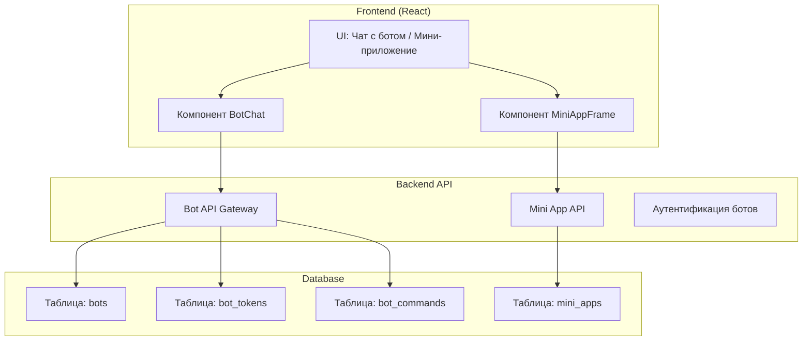

# Спецификация: Платформа ботов и мини-приложений (Фазер)

## 1. Обзор

Данная спецификация описывает создание платформы ботов и мини-приложений, аналогичной Telegram Bot API и Telegram Mini Apps.

### Цели

1. **Бот "Фазер"** — платформа для создания и управления пользовательскими ботами
2. **Мини-приложения** — платформа для запуска веб-приложений внутри чата
3. **Интеграция** — боты могут использовать мини-приложения для интерактивного UI

---

## 2. Архитектура системы



---

## 3. База данных (Supabase)

### 3.1 Таблица `bots`

| Колонка | Тип | Описание |
|---------|-----|----------|
| id | UUID | Primary key |
| owner_id | UUID | ID владельца бота |
| username | TEXT | Уникальное имя бота (faser_bot_xxx) |
| display_name | TEXT | Отображаемое имя |
| description | TEXT | Описание бота |
| avatar_url | TEXT | URL аватара |
| is_public | BOOLEAN | Публичный/приватный бот |
| enabled | BOOLEAN | Включён/выключен |
| created_at | TIMESTAMP | Дата создания |
| updated_at | TIMESTAMP | Дата обновления |

### 3.2 Таблица `bot_tokens`

| Колонка | Тип | Описание |
|---------|-----|----------|
| id | UUID | Primary key |
| bot_id | UUID | Foreign key -> bots |
| token | TEXT | API токен бота |
| name | TEXT | Имя токена (для отзыва) |
| created_at | TIMESTAMP | Дата создания |
| expires_at | TIMESTAMP | Срок действия (nullable) |

### 3.3 Таблица `bot_commands`

| Колонка | Тип | Описание |
|---------|-----|----------|
| id | UUID | Primary key |
| bot_id | UUID | Foreign key -> bots |
| command | TEXT | Команда (/start, /help) |
| description | TEXT | Описание команды |
| sort_order | INTEGER | Порядок в списке |

### 3.4 Таблица `mini_apps`

| Колонка | Тип | Описание |
|---------|-----|----------|
| id | UUID | Primary key |
| owner_id | UUID | ID владельца |
| slug | TEXT | Уникальный slug |
| name | TEXT | Название |
| description | TEXT | Описание |
| icon_url | TEXT | URL иконки |
| url | TEXT | URL приложения |
| bot_id | UUID | Связанный бот (nullable) |
| enabled | BOOLEAN | Включено |
| created_at | TIMESTAMP | Дата создания |

---

## 4. API Endpoints

### 4.1 Bot API

| Метод | Путь | Описание |
|-------|------|----------|
| POST | /api/bots | Создать бота |
| GET | /api/bots | Список ботов пользователя |
| GET | /api/bots/:id | Информация о боте |
| PATCH | /api/bots/:id | Изменить бота |
| DELETE | /api/bots/:id | Удалить бота |
| POST | /api/bots/:id/token | Создать токен |
| DELETE | /api/bots/:id/tokens/:tokenId | Отозвать токен |
| GET | /api/bots/:id/commands | Список команд |
| PUT | /api/bots/:id/commands | Обновить команды |

### 4.2 Mini App API

| Метод | Путь | Описание |
|-------|------|----------|
| POST | /api/mini-apps | Создать мини-приложение |
| GET | /api/mini-apps | Список мини-приложений |
| GET | /api/mini-apps/:slug | Информация о приложении |
| PATCH | /api/mini-apps/:slug | Изменить приложение |
| DELETE | /api/mini-apps/:slug | Удалить приложение |

### 4.3 Bot Webhook (для внешних интеграций)

| Метод | Путь | Описание |
|-------|------|----------|
| POST | /api/bot-webhook/:token | Webhook для сообщений |

---

## 5. Frontend компоненты

### 5.1 Страницы

| Страница | Путь | Описание |
|----------|------|----------|
| BotListPage | /bots | Список ботов пользователя |
| BotCreatePage | /bots/new | Создание бота |
| BotSettingsPage | /bots/:id/settings | Настройки бота |
| BotCommandsPage | /bots/:id/commands | Управление командами |
| MiniAppListPage | /mini-apps | Список мини-приложений |
| MiniAppCreatePage | /mini-apps/new | Создание мини-приложения |
| MiniAppEditPage | /mini-apps/:slug/edit | Редактирование |

### 5.2 UI Компоненты

```tsx
// BotChat - чат с ботом
<BotChat 
  botId="uuid"
  botName="Фазер Бот"
  onSendMessage={handleSend}
  onOpenMiniApp={openMiniApp}
/>

// MiniAppFrame - фрейм мини-приложения
<MiniAppFrame 
  url="https://example.app"
  botContext={{ bot_id, user_id, chat_id }}
  onClose={closeMiniApp}
  fullscreen={false}
/>
```

### 5.3 Интеграция с чатами

Добавить системную папку "Боты" в chat_folders:
- Автоматическое распределение чатов с ботами (item_kind = "bot")
- Бот-чаты отображаются с иконкой бота

---

## 6. Интеграция с существующей системой

### 6.1 Расширение ChatFolderItemKind

```typescript
// Добавить в useChatFolders.ts
export type ChatFolderItemKind = "dm" | "group" | "channel" | "bot";
```

### 6.2 Миграции Supabase

```sql
-- Миграция: добавить поддержку ботов в папки
ALTER TYPE chat_folder_item_kind ADD VALUE 'bot';

-- Таблица ботов
CREATE TABLE bots (
  id UUID PRIMARY KEY DEFAULT gen_random_uuid(),
  owner_id UUID REFERENCES auth.users(id) ON DELETE CASCADE,
  username TEXT UNIQUE NOT NULL,
  display_name TEXT NOT NULL,
  description TEXT,
  avatar_url TEXT,
  is_public BOOLEAN DEFAULT true,
  enabled BOOLEAN DEFAULT true,
  created_at TIMESTAMPTZ DEFAULT now(),
  updated_at TIMESTAMPTZ DEFAULT now()
);

-- Токены ботов
CREATE TABLE bot_tokens (
  id UUID PRIMARY KEY DEFAULT gen_random_uuid(),
  bot_id UUID REFERENCES bots(id) ON DELETE CASCADE,
  token TEXT UNIQUE NOT NULL,
  name TEXT,
  created_at TIMESTAMPTZ DEFAULT now(),
  expires_at TIMESTAMPTZ
);

-- Команды ботов
CREATE TABLE bot_commands (
  id UUID PRIMARY KEY DEFAULT gen_random_uuid(),
  bot_id UUID REFERENCES bots(id) ON DELETE CASCADE,
  command TEXT NOT NULL,
  description TEXT,
  sort_order INTEGER DEFAULT 0
);

-- Мини-приложения
CREATE TABLE mini_apps (
  id UUID PRIMARY KEY DEFAULT gen_random_uuid(),
  owner_id UUID REFERENCES auth.users(id) ON DELETE CASCADE,
  slug TEXT UNIQUE NOT NULL,
  name TEXT NOT NULL,
  description TEXT,
  icon_url TEXT,
  url TEXT NOT NULL,
  bot_id UUID REFERENCES bots(id) ON DELETE SET NULL,
  enabled BOOLEAN DEFAULT true,
  created_at TIMESTAMPTZ DEFAULT now()
);

-- RLS policies...
```

---

## 7. Функциональность бота Фазер

### 7.1 Возможности

1. **Создание бота**
   - Выбор username (автоматическая генерация faser_xxx)
   - Настройка имени и описания
   - Загрузка аватара

2. **API Токены**
   - Создание нескольких токенов
   - Именование токенов
   - Отзыв токенов

3. **Команды**
   - Определение списка команд (/start, /help, /settings)
   - Описание для каждой команды

4. **Webhook**
   - Настройка webhook URL
   - Получение обновлений в реальном времени

### 7.2 Пример использования API

```javascript
// Создание бота
POST /api/bots
{
  "display_name": "Мой Бот",
  "description": "Тестовый бот"
}

// Ответ
{
  "id": "uuid",
  "username": "faser_bot_abc123",
  "token": "12345:ABCDEFGHIJKLMNOP"
}

// Отправка сообщения ботом (через webhook)
POST /api/bot-webhook/:token
{
  "chat_id": "uuid",
  "text": "Привет от бота!"
}
```

---

## 8. Функциональность мини-приложений

### 8.1 Возможности

1. **Создание приложения**
   - Уникальный slug
   - Название и описание
   - URL приложения
   - Иконка

2. **Интеграция с ботом**
   - Связь с ботом-владельцем
   - Бот может открывать мини-приложение

3. **Контекст**
   - Передача данных о пользователе
   - Передача ID чата
   - Аутентификация через platform token

### 8.2 Запуск мини-приложения

```javascript
// В чате с ботом
{
  "type": "open_mini_app",
  "url": "https://myapp.faser.ru",
  "bot_context": {
    "user_id": "user_uuid",
    "chat_id": "chat_uuid",
    "token": "platform_token"
  }
}
```

---

## 9. План реализации

### Фаза 1: Базовая инфраструктура

1. [ ] Создать миграции Supabase
2. [ ] Реализовать API endpoints для ботов
3. [ ] Реализовать API endpoints для мини-приложений
4. [ ] Создать хуки useBots, useMiniApps

### Фаза 2: UI компоненты

1. [ ] Страница списка ботов
2. [ ] Страница создания/редактирования бота
3. [ ] Страница управления командами
4. [ ] Страница списка мини-приложений

### Фаза 3: Интеграция с чатами

1. [ ] Добавить папку "Боты" в chat_folders
2. [ ] Компонент BotChat
3. [ ] Компонент MiniAppFrame
4. [ ] Интеграция в ChatsPage

### Фаза 4: Бот Фазер (встроенный)

1. [ ] Создать системного бота "Фазер"
2. [ ] Интерфейс создания ботов внутри Фазера
3. [ ] Webhook для внешних интеграций

---

## 10. Рекомендации по безопасности

1. **Токены** — хранить хэшированными, показывать один раз при создании
2. **Mini Apps** — валидировать URL, использовать CSP
3. **Webhook** — проверять подпись запросов
4. **RLS** — строгие политики доступа к таблицам ботов

---

## 11. Аналоги и референсы

- [Telegram Bot API](https://core.telegram.org/bots/api)
- [Telegram Mini Apps](https://core.telegram.org/bots/webapps)
- [Discord.js](https://discord.js.guide) — для понимания UX создания ботов
