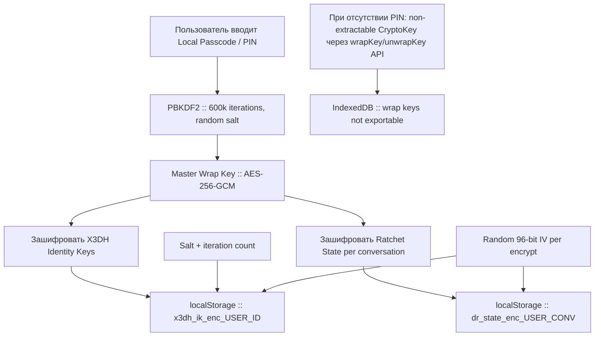
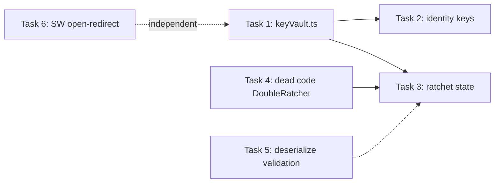

# План исправления E2EE Key Storage и сопутствующих дефектов безопасности

**Дата:** 2026-03-08  
**Ветка:** `main`  
**Statус:** NEEDS CHANGES — 3 CRITICAL, 1 WARNING, 1 SUGGESTION

---

## Обзор найденных дефектов

| # | Severity | Файл:Строка | Описание |
|---|----------|-------------|----------|
| 1 | CRITICAL | `src/hooks/useSecretChat.ts:118` | X3DH identity keys (ECDH, ECDSA, SPK private) хранятся **plaintext** в localStorage |
| 2 | CRITICAL | `src/hooks/useSecretChat.ts:132` | Ratchet state "шифруется" через PBKDF2 с `userId+convId` как паролем — публичные данные, нулевая защита |
| 3 | CRITICAL | `src/lib/e2ee/doubleRatchet.ts:554` | `DoubleRatchet.serialize()` (базовый класс) всегда выбрасывает `throw new Error` |
| 4 | WARNING  | `public/sw.js:224` | `notificationclick` открывает произвольный URL из push `data.url` — open-redirect |
| 5 | SUGGEST  | `src/lib/e2ee/doubleRatchet.ts:490` | `deserialize()` — `JSON.parse` без валидации схемы |

---

## Архитектура решения — Encrypted Key Vault

### Проблема
Текущий подход хранит приватные ключи E2EE в localStorage обёрнутыми (или без обёртки) ключом, производным от публичных данных (`userId`, `convId`). XSS-атака или физический доступ к устройству извлечёт все ключи за O(1).

### Целевое состояние



### Стратегия: два уровня защиты

1. **С Local Passcode (идеальный вариант)**  
   Пользователь устанавливает PIN/пароль в настройках E2EE. Из него через PBKDF2 (600 000 итераций, SHA-256, random 16-byte salt) деривируется AES-256-GCM master key. Все приватные ключи шифруются этим ключом. Salt хранится рядом с зашифрованным blob.

2. **Без Local Passcode (fallback)**  
   Генерируется CryptoKey AES-256 с `extractable: false` и помещается в IndexedDB (не localStorage — IndexedDB хранит CryptoKey-объекты напрямую без экспорта). Такой ключ **невозможно** экспортировать через JavaScript — он защищён от XSS на уровне Web Crypto API. Он используется для `wrapKey()`/`unwrapKey()` приватных ECDH-ключей. При физическом доступе к устройству IndexedDB читается, но CryptoKey-объект непрозрачен — ключ внутри не извлекаем.

---

## Задачи

### Задача 1: Создать модуль `src/lib/e2ee/keyVault.ts`

Новый модуль, инкапсулирующий secure storage:

```ts
interface KeyVaultConfig {
  userId: string;
  passcode?: string;  // опционально
}

class KeyVault {
  static async create(config: KeyVaultConfig): Promise<KeyVault>;
  
  // Шифрует и сохраняет blob в localStorage
  async store(key: string, plaintext: string): Promise<void>;
  
  // Извлекает и расшифровывает blob
  async retrieve(key: string): Promise<string | null>;
  
  // Удаляет ключ
  async delete(key: string): Promise<void>;
  
  // Удаляет все ключи пользователя (logout)
  async purgeAll(): Promise<void>;
  
  // Проверяет PIN (для unlock)
  async verifyPasscode(passcode: string): Promise<boolean>;
  
  // Смена PIN (перешифрование)
  async changePasscode(oldPasscode: string, newPasscode: string): Promise<void>;
}
```

**Ключевые решения:**
- При наличии passcode: PBKDF2 → AES-256-GCM wrap key
- Без passcode: IndexedDB + non-extractable AES-256 CryptoKey
- Salt: 16 bytes, random, хранится в шифрованном конверте
- IV: 12 bytes, random, уникальный для каждого `store()`
- Формат blob: `JSON.stringify({ version: 1, salt: base64, iv: base64, ciphertext: base64 })`

### Задача 2: Рефакторить `useSecretChat.ts` — identity keys

**Файл:** `src/hooks/useSecretChat.ts` строки 88-126

**Изменения:**
- `getOrCreateIdentityKeys()` должен использовать `KeyVault.store()` вместо `localStorage.setItem()`
- Загрузка: `KeyVault.retrieve()` вместо `localStorage.getItem()`
- Убрать plaintext JSON из localStorage
- Добавить миграцию: если обнаружен старый plaintext ключ — перешифровать и удалить старый

### Задача 3: Рефакторить `useSecretChat.ts` — ratchet state encryption

**Файл:** `src/hooks/useSecretChat.ts` строки 128-199

**Изменения:**
- Заменить `encryptRatchetState()` / `decryptRatchetState()` на `KeyVault.store()` / `KeyVault.retrieve()`
- Удалить текущие функции, использующие `userId+convId` как PBKDF2-пароль
- `saveRatchetState()` и `loadRatchetState()` делегируют в KeyVault

### Задача 4: Исправить `DoubleRatchet.serialize()` — dead code cleanup

**Файл:** `src/lib/e2ee/doubleRatchet.ts` строки 450-557

**Изменения:**
- Удалить `exportHkdfKey()` (строка 542-557) — функция-заглушка с throw
- Пометить `DoubleRatchet.serialize()` как `@deprecated` и перенаправить на `DoubleRatchetE2E`
- Или: удалить `serialize/deserialize` из базового `DoubleRatchet` полностью, оставив только в `DoubleRatchetE2E`
- Добавить JSDoc с предупреждением

### Задача 5: Добавить валидацию схемы в `DoubleRatchetE2E.deserialize()`

**Файл:** `src/lib/e2ee/doubleRatchet.ts` строка 714

**Изменения:**
```ts
static async deserialize(data: string): Promise<RatchetState> {
  let s: SerializedState;
  try {
    s = JSON.parse(data);
  } catch {
    throw new Error('DoubleRatchet: corrupted state — invalid JSON');
  }
  
  const requiredStrings: (keyof SerializedState)[] = [
    'rootKey', 'sendingRatchetPrivate', 'sendingRatchetPublic'
  ];
  for (const key of requiredStrings) {
    if (typeof s[key] !== 'string') {
      throw new Error(`DoubleRatchet: corrupted state — missing ${key}`);
    }
  }
  // ... rest of deserialization
}
```

### Задача 6: Исправить SW open-redirect в `notificationclick`

**Файл:** `public/sw.js` строка 224

**Изменение:**
```js
const rawUrl = event.notification.data?.url || '/';
// Validate URL — only allow same-origin or relative paths
const url = rawUrl.startsWith('/')
  ? rawUrl
  : ((() => {
      try {
        return new URL(rawUrl).origin === self.location.origin ? rawUrl : '/';
      } catch {
        return '/';
      }
    })());
```

---

## Диаграмма зависимостей задач



Задачи 4, 5 и 6 могут выполняться параллельно с Task 1. Tasks 2 и 3 зависят от Task 1.

---

## Миграция существующих данных

При первом запуске после обновления:
1. Проверить наличие `x3dh_ik_${userId}` в plaintext формате (JSON.parse → если содержит `ecdhPrivate` — это старый формат)
2. Если найден — перешифровать через KeyVault и удалить plaintext
3. Аналогично для `dr_state_${userId}_${convId}` — расшифровать старым методом (userId+convId) и перешифровать через KeyVault
4. Записать флаг `e2ee_vault_migrated_v1` в localStorage после успешной миграции

---

## Риски и ограничения

- **IndexedDB fallback (без PIN):** защищает от XSS (non-extractable CryptoKey), но НЕ защищает от физического доступа к устройству с developer tools. Для полной защиты необходим пользовательский PIN.
- **Обратная совместимость:** миграция plaintext → encrypted может не сработать если пользователь обновится на двух устройствах одновременно. Рекомендуется показать предупреждение при обнаружении уже мигрированных данных.
- **Потеря PIN = потеря ключей:** если пользователь забудет Local Passcode, E2EE-ключи будут утрачены. Need to clearly communicate this in UI.
