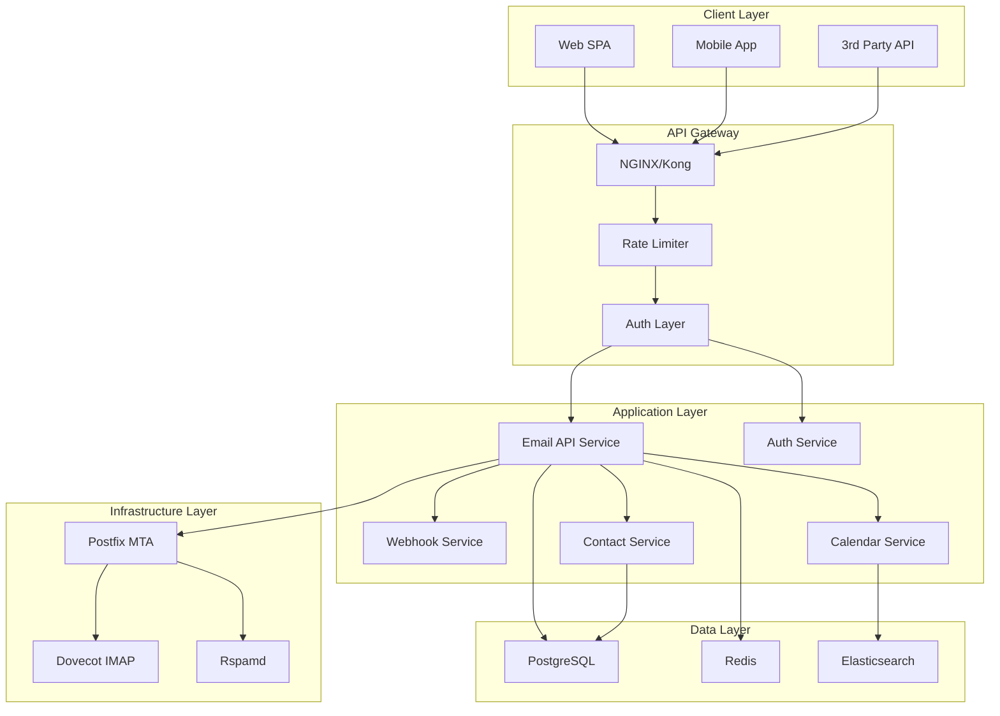
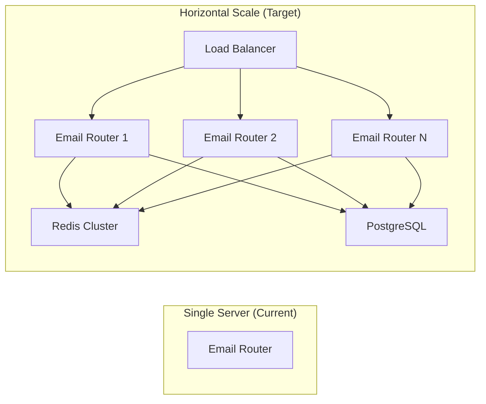

# Gap-анализ и план развития почтового сервиса

> **Дата**: 2026-03-06  
> **Автор**: Architect Mode  
> **Версия**: 1.0  
> **Целевой уровень**: Яндекс.Почта / Gmail (полнофункциональный почтовый сервис)

---

## Содержание

1. [Сравнительная таблица](#1-сравнительная-таблица)
2. [Gap-анализ по критериям](#2-gap-анализ-по-критериям)
   - [2.1 API и интеграции](#21-api-и-интеграции)
   - [2.2 Производительность и лимиты](#22-производительность-и-лимиты)
   - [2.3 Безопасность и аутентификация](#23-безопасность-и-аутентификация)
   - [2.4 Пользовательский интерфейс и UX](#24-пользовательский-интерфейс-и-ux)
   - [2.5 Хранение и управление данными](#25-хранение-и-управление-данными)
   - [2.6 Дополнительные функции](#26-дополнительные-функции)
3. [Приоритизированный план разработки](#3-приоритизированный-план-разработки)
4. [Разделение по блокам](#4-разделение-по-блокам)
5. [Технологический стек](#5-технологический-стек)
6. [Архитектурные решения](#6-архитектурные-решения)
7. [Критерии успеха](#7-критерии-успеха)

---

## 1. Сравнительная таблица

### 1.1 Матрица функциональности

| Функция | Текущее состояние | Яндекс.Почта | Gmail | Mail.ru | Outlook | ProtonMail |
|---------|------------------|--------------|-------|---------|---------|------------|
| **ОТПРАВКА** |
| SMTP отправка | ✅ Raw TCP | ✅ | ✅ | ✅ | ✅ | ✅ |
| Транзакционные письма | ✅ Базовые | ✅ Транзак API | ✅ SendGrid | ✅ | ✅ | ✅ (SMTP bridge) |
| Шаблонизация | ✅ 4 шаблона | ✅ | ✅ Templates | ✅ | ✅ | ❌ |
| Очередь отправки | ✅ Файловая | ✅ | ✅ | ✅ | ✅ | ❌ |
| Rate limiting | ✅ 10/10min | ✅ 500/час | ✅ 2000/день | ✅ 300/час | ✅ | ✅ 150/час |
| **ПОЛУЧЕНИЕ** |
| IMAP сервер | ❌ Нет | ✅ | ✅ | ✅ | ✅ | ✅ |
| POP3 сервер | ❌ Нет | ✅ | ✅ | ✅ | ✅ | ✅ |
| Веб-интерфейс | ❌ Нет | ✅ | ✅ | ✅ | ✅ | ✅ |
| **БЕЗОПАСНОСТЬ** |
| 2FA/TOTP | ❌ Нет | ✅ | ✅ | ✅ | ✅ | ✅ |
| E2E шифрование | ❌ Нет | ❌ | ❌ | ❌ | ✅ S/MIME | ✅ PGP |
| DKIM подпись | ⚠️ Postfix | ✅ | ✅ | ✅ | ✅ | ✅ |
| SPF/DMARC | ⚠️ DNS настроен | ✅ | ✅ | ✅ | ✅ | ✅ |
| MTA-STS | ❌ Нет | ❌ | ✅ | ❌ | ✅ | ✅ |
| **API** |
| REST API | ⚠️ Ограничено | ✅ Полное | ✅ Gmail API | ⚠️ Ограничено | ✅ Graph | ⚠️ Ограничено |
| Webhooks | ❌ Нет | ❌ | ✅ Pub/Sub | ❌ | ❌ | ❌ |
| OAuth 2.0 | ❌ Нет | ✅ | ✅ | ✅ | ✅ | ✅ |
| **ДОП. ФУНКЦИИ** |
| Календарь | ❌ Нет | ✅ | ✅ Calendar | ✅ | ✅ Calendar | ❌ |
| Контакты | ❌ Нет | ✅ | ✅ Contacts | ✅ | ✅ | ❌ |
| Фильтры/правила | ❌ Нет | ✅ | ✅ | ✅ | ✅ | ❌ |
| Alias/Catch-all | ❌ Нет | ✅ | ✅ | ✅ | ✅ | ✅ |
| Мобильные приложения | ❌ Нет | ✅ iOS/Android | ✅ | ✅ | ✅ | ✅ |

### 1.2 Ключевые метрики

| Метрика | Текущее | Яндекс.Почта | Gmail | Целевое |
|---------|---------|--------------|-------|---------|
| Лимит отправки | 10/10мин | 500/час | 2000/день | 5000/час |
| Макс. размер письма | 25MB (Postfix) | 30MB | 25MB | 50MB |
| Хранилище | N/A | 10GB-1TB | 15GB | 50GB |
| API latency | <100ms | <50ms | <100ms | <50ms |
| Uptime SLA | N/A | 99.95% | 99.9% | 99.9% |

---

## 2. Gap-анализ по критериям

### 2.1 API и интеграции

#### Текущее состояние
- **Эндпоинты**: `/send`, `/health`, `/queue/status` — всего 3 API метода
- **Аутентификация**: Простой API Key
- **Вебхуки**: Отсутствуют полностью
- **Документация**: Отсутствует формальная API документация

#### Состояние у лидеров

| Сервис | API подход | OAuth | Webhooks | Batch operations |
|--------|-----------|-------|----------|------------------|
| Gmail | Gmail API (REST) | ✅ | ✅ Pub/Sub | ✅ batch |
| Яндекс | Полное REST API | ✅ | ❌ | ✅ |
| Outlook | Microsoft Graph | ✅ | ✅ | ✅ |
| Mail.ru | Ограниченное | ✅ | ❌ | ❌ |

#### Gap (что нужно сделать)

| Gap ID | Описание | Приоритет | Сложность |
|--------|----------|-----------|-----------|
| API-1 | Расширить REST API до 20+ эндпоинтов | P0 | Средняя |
| API-2 | Добавить OAuth 2.0 провайдер | P1 | Высокая |
| API-3 | Реализовать Webhook система | P1 | Средняя |
| API-4 | Добавить Batch operations (массовые рассылки) | P1 | Средняя |
| API-5 | OpenAPI/Swagger документация | P2 | Низкая |
| API-6 | API version control (v1, v2) | P2 | Низкая |

#### Целевое состояние (API)
- RESTful API с 25+ эндпоинтами
- OAuth 2.0 + API Key аутентификация
- Webhooks для входящих/исходящих событий
- Batch operations для массовых рассылок
- OpenAPI 3.0 документация

---

### 2.2 Производительность и лимиты

#### Текущее состояние
- **Rate limiting**: 10 писем за 10 минут (6/час)
- **Очередь**: Файловая система, без Redis
- **Параллелизм**: Однопоточный SMTP клиент
- **Кэширование**: Отсутствует
- **Мониторинг**: Базовый health check

#### Состояние у лидеров

| Сервис | Rate limit | Очередь | Кэширование | Масштабирование |
|--------|-----------|---------|-------------|------------------|
| Яндекс.Почта | 500/час | Redis + Kafka | Redis | Кластер |
| Gmail | 2000/день | Google Cloud | Memcached | Кластер |
| Mail.ru | 300/час | PostgreSQL | Встроенное | Кластер |
| Outlook | 30/мин | Azure | Redis | Кластер |

#### Gap

| Gap ID | Описание | Приоритет | Сложность |
|--------|----------|-----------|-----------|
| PERF-1 | Увеличить rate limit до 500+/час | P0 | Средняя |
| PERF-2 | Внедрить Redis для очереди и кэша | P1 | Средняя |
| PERF-3 | Добавить горизонтальное масштабирование | P1 | Высокая |
| PERF-4 | Реализовать CDN для статики | P2 | Средняя |
| PERF-5 | Метрики и observability (Prometheus/Grafana) | P1 | Средняя |
| PERF-6 | Кэширование шаблонов | P2 | Низкая |

#### Целевое состояние (Производительность)
- 5000+ писем в час с возможностью масштабирования
- Redis-backed очередь с гарантией доставки
- sub-50ms latency для API
- 99.9% uptime SLA
- Полный мониторинг и алертинг

---

### 2.3 Безопасность и аутентификация

#### Текущее состояние
- **Аутентификация**: Только API Key
- **2FA**: Отсутствует
- **Шифрование**: TLS при отправке, at-rest — нет данных
- **Аудит**: Базовое логирование
- **MTA-STS**: Не настроено
- **Ratelimit по IP**: Базовый

#### Состояние у лидеров

| Сервис | 2FA | E2E | MTA-STS | RBL | Аудит |
|--------|-----|-----|---------|-----|-------|
| Яндекс.Почта | ✅ SMS/Authenticator | ❌ | ❌ | ✅ Rspamd | ✅ |
| Gmail | ✅ TOTP/Backup | ❌ | ✅ | ✅ | ✅ Cloud Audit |
| Outlook | ✅ Authenticator | ✅ S/MIME | ✅ | ✅ | ✅ Azure Audit |
| ProtonMail | ✅ TOTP | ✅ PGP | ✅ | ✅ | ✅ |

#### Gap

| Gap ID | Описание | Приоритет | Сложность |
|--------|----------|-----------|-----------|
| SEC-1 | Добавить TOTP 2FA для аккаунтов | P0 | Средняя |
| SEC-2 | Реализовать MTA-STS | P1 | Средняя |
| SEC-3 | Добавить S/MIME или PGP support | P2 | Высокая |
| SEC-4 | Расширенное аудит-логирование | P1 | Средняя |
| SEC-5 | IP whitelist/blacklist | P1 | Низкая |
| SEC-6 | Rate limiting per-user (а не глобальный) | P1 | Средняя |
| SEC-7 | Защита от перебора (brute-force) | P0 | Средняя |

#### Целевое состояние (Безопасность)
- TOTP 2FA для всех пользователей
- MTA-STS с enforced режимом
- Аудит всех операций
- RBL + Rspamd антиспам
- Rate limiting per-user
- Защита от атак

---

### 2.4 Пользовательский интерфейс и UX

#### Текущее состояние
- **Веб-интерфейс**: Отсутствует (только API)
- **Мобильные приложения**: Отсутствуют
- **Dark mode**: N/A
- **Офлайн режим**: N/A
- **Push-уведомления**: N/A

#### Состояние у лидеров

| Сервис | Web UI | Mobile | Offline | Push | PWA |
|--------|--------|--------|---------|------|-----|
| Яндекс.Почта | ✅ React SPA | ✅ iOS/Android | ✅ | ✅ | ❌ |
| Gmail | ✅ React | ✅ iOS/Android | ✅ | ✅ | ✅ |
| Outlook | ✅ React | ✅ | ✅ | ✅ | ✅ |
| ProtonMail | ✅ Vue | ✅ | ❌ | ✅ | ❌ |

#### Gap

| Gap ID | Описание | Приоритет | Сложность |
|--------|----------|-----------|-----------|
| UX-1 | Веб-клиент (React SPA) | P0 | Высокая |
| UX-2 | Мобильное приложение (iOS/Android) | P1 | Высокая |
| UX-3 | PWA поддержка | P1 | Средняя |
| UX-4 | Офлайн режим работы | P1 | Высокая |
| UX-5 | Push-уведомления | P1 | Средняя |
| UX-6 | Dark/Light темы | P2 | Низкая |
| UX-7 | i18n (русский + английский) | P0 | Средняя |

#### Целевое состояние (UX)
- Полноценный веб-клиент на React
- Нативные мобильные приложения
- PWA с офлайн поддержкой
- Push-уведомления
- Dark mode
- i18n

---

### 2.5 Хранение и управление данными

#### Текущее состояние
- **База данных**: PostgreSQL (только для пользователей)
- **Почтовые ящики**: Хранятся в Postfix + Dovecot (Maildir)
- **Алиасы**: Не настроены
- **Квоты**: Отсутствуют
- **Бэкапы**: Отсутствуют автоматические

#### Состояние у лидеров

| Сервис | Storage | Aliases | Quota | Backups | Архивирование |
|--------|---------|---------|-------|---------|---------------|
| Яндекс.Почта | S3/Disk | ✅ | ✅ | ✅ | ✅ |
| Gmail | Google Drive | ✅ | ✅ | ✅ | ✅ |
| Outlook | OneDrive | ✅ | ✅ | ✅ | ✅ |
| Zoho | Disk | ✅ | ✅ | ✅ | ✅ |

#### Gap

| Gap ID | Описание | Приоритет | Сложность |
|--------|----------|-----------|-----------|
| STOR-1 | Система алиасов и catch-all | P1 | Средняя |
| STOR-2 | Квотирование хранилища | P1 | Средняя |
| STOR-3 | Автоматические бэкапы | P1 | Высокая |
| STOR-4 | Система архивирования писем | P2 | Средняя |
| STOR-5 | Поиск по почте (Elasticsearch) | P0 | Высокая |
| STOR-6 | Инкрементальное хранение | P2 | Высокая |

#### Целевое состояние (Хранение)
- PostgreSQL + Redis + Elasticsearch
- Алиасы + catch-all
- Квотирование с уведомлениями
- Ежедневные автоматические бэкапы
- Мгновенный полнотекстовый поиск

---

### 2.6 Дополнительные функции

#### Текущее состояние
- **Календарь**: Отсутствует
- **Контакты**: Отсутствуют
- **Фильтры/правила**: Отсутствуют
- **Автоответчик**: Отсутствует
- **Пересылка**: Отсутствует

#### Состояние у лидеров

| Функция | Яндекс.Почта | Gmail | Outlook | ProtonMail |
|---------|--------------|-------|---------|------------|
| Календарь | ✅ | ✅ | ✅ | ❌ |
| Контакты | ✅ | ✅ | ✅ | ❌ |
| Фильтры | ✅ | ✅ | ✅ | ❌ |
| Автоответчик | ✅ | ✅ | ✅ | ❌ |
| Пересылка | ✅ | ✅ | ✅ | ✅ |
| Шаблоны | ✅ | ✅ | ✅ | ❌ |

#### Gap

| Gap ID | Описание | Приоритет | Сложность |
|--------|----------|-----------|-----------|
| EXTRA-1 | Календарь (iCal/ CalDAV) | P1 | Высокая |
| EXTRA-2 | Контакты (vCard/ CardDAV) | P1 | Высокая |
| EXTRA-3 | Система фильтров/правил | P1 | Высокая |
| EXTRA-4 | Автоответчик (vacation) | P2 | Средняя |
| EXTRA-5 | Пересылка писем | P2 | Средняя |
| EXTRA-6 | Создание/редактирование шаблонов в UI | P1 | Средняя |
| EXTRA-7 | Snooze писем | P2 | Средняя |

#### Целевое состояние (Доп. функции)
- Полноценный календарь с CalDAV
- Контакты с CardDAV
- Гибкая система правил
- Автоответчик и пересылка
- Snooze и отложенная отправка

---

## 3. Приоритизированный план разработки

### Фаза 0: Текущее состояние (MVP)

> **Срок**: Уже реализовано  
> **Статус**: ✅ Готово

| Компонент | Описание |
|-----------|----------|
| SMTP клиент | Raw TCP без зависимостей |
| Файловая очередь | JSON файлы на диске |
| Базовые шаблоны | 4 HTML шаблона |
| Rate limiting | 10/10min |
| Health check | Базовый |

---

### Фаза 1: Расширенное API (Weeks 1-4)

> **Цель**: Довести API до уровня транзакционного сервиса  
> **Приоритет**: P0 — Критично для привлечения разработчиков

#### Задачи

| ID | Задача | Блок | Сложность | Недели |
|----|--------|------|------------|--------|
| F1.1 | Расширить REST API (20+ endpoints) | Backend | Средняя | 1-2 |
| F1.2 | OAuth 2.0 провайдер | Backend | Высокая | 2-3 |
| F1.3 | Webhook система | Backend | Средняя | 2-3 |
| F1.4 | Per-user rate limiting | Backend | Средняя | 3 |
| F1.5 | OpenAPI 3.0 документация | Backend | Низкая | 3-4 |
| F1.6 | Batch operations API | Backend | Средняя | 4 |

#### Критерии успеха Фазы 1
- [ ] 20+ REST эндпоинтов
- [ ] OAuth 2.0 аутентификация работает
- [ ] Webhooks доставляют события
- [ ] Rate limit: 500/час на пользователя
- [ ] OpenAPI docs с интерактивным playground

---

### Фаза 2: Производительность и надежность (Weeks 5-8)

> **Цель**: Масштабируемость и enterprise-grade производительность  
> **Приоритет**: P0 — Без этого нельзя расти

#### Задачи

| ID | Задача | Блок | Сложность | Недели |
|----|--------|------|------------|--------|
| F2.1 | Redis для очереди и кэша | Infrastructure | Средняя | 5-6 |
| F2.2 | Увеличение rate limit до 5000/час | Backend | Средняя | 5-6 |
| F2.3 | Prometheus + Grafana мониторинг | Infrastructure | Средняя | 6-7 |
| F2.4 | Горизонтальное масштабирование | Infrastructure | Высокая | 7-8 |
| F2.5 | CDN для статики | Infrastructure | Средняя | 8 |

#### Критерии успеха Фазы 2
- [ ] Redis кластер работает
- [ ] 5000+ писем/час пропускная способность
- [ ] Дашборд Grafana с метриками
- [ ] Автоматическое масштабирование
- [ ] 99.9% uptime

---

### Фаза 3: Безопасность (Weeks 9-12)

> **Цель**: Enterprise-grade безопасность  
> **Приоритет**: P0 — Требование для корпоративных клиентов

#### Задачи

| ID | Задача | Блок | Сложность | Недели |
|----|--------|------|------------|--------|
| F3.1 | TOTP 2FA система | Backend | Средняя | 9-10 |
| F3.2 | MTA-STS настройка | Infrastructure | Средняя | 10 |
| F3.3 | Расширенный аудит-лог | Backend | Средняя | 10-11 |
| F3.4 | Brute-force защита | Backend | Средняя | 11 |
| F3.5 | S/MIME support | Backend | Высокая | 11-12 |

#### Критерии успеха Фазы 3
- [ ] 2FA через TOTP приложения
- [ ] MTA-STS enforced
- [ ] Аудит всех операций
- [ ] Защита от brute-force
- [ ] SSL сертификаты автоматически обновляются

---

### Фаза 4: Веб-клиент (Weeks 13-20)

> **Цель**: Полноценный веб-интерфейс как у Gmail/Яндекс  
> **Приоритет**: P1 — Завершение продукта

#### Задачи

| ID | Задача | Блок | Сложность | Недели |
|----|--------|------|------------|--------|
| F4.1 | React SPA архитектура | Frontend | Высокая | 13-15 |
| F4.2 | Inbox/view письма | Frontend | Средняя | 14-16 |
| F4.3 | Compose/отправка писем | Frontend | Средняя | 15-17 |
| F4.4 | Контакт-лист | Frontend | Средняя | 17-18 |
| F4.5 | Настройки аккаунта | Frontend | Средняя | 18-19 |
| F4.6 | Dark mode + i18n | Frontend | Низкая | 19-20 |

#### Критерии успеха Фазы 4
- [ ] SPA загружается < 2 сек
- [ ] Полный функционал чтения/отправки
- [ ] Контакты синхронизированы
- [ ] Dark mode работает
- [ ] Русский и английский интерфейс

---

### Фаза 5: Мобильные приложения (Weeks 21-28)

> **Цель**: Нативные приложения iOS/Android  
> **Приоритет**: P1 — Охват мобильной аудитории

#### Задачи

| ID | Задача | Блок | Сложность | Недели |
|----|--------|------|------------|--------|
| F5.1 | React Native архитектура | Frontend | Высокая | 21-23 |
| F5.2 | iOS приложение | Frontend | Высокая | 22-25 |
| F5.3 | Android приложение | Frontend | Высокая | 23-26 |
| F5.4 | Push-уведомления | Frontend | Средняя | 25-27 |
| F5.5 | Офлайн режим | Frontend | Высокая | 26-28 |

#### Критерии успеха Фазы 5
- [ ] App Store приложение
- [ ] Google Play приложение
- [ ] Push-уведомления работают
- [ ] Офлайн чтение писем
- [ ] Синхронизация < 30 сек

---

### Фаза 6: Расширенные функции (Weeks 29-40)

> **Цель**: Функциональность на уровне лидеров  
> **Приоритет**: P2 — Конкурентное преимущество

#### Задачи

| ID | Задача | Блок | Сложность | Недели |
|----|--------|------|------------|--------|
| F6.1 | Календарь (CalDAV) | Backend+Frontend | Высокая | 29-33 |
| F6.2 | Контакты (CardDAV) | Backend+Frontend | Высокая | 29-33 |
| F6.3 | Система фильтров | Backend | Высокая | 33-36 |
| F6.4 | Поиск (Elasticsearch) | Backend | Высокая | 36-38 |
| F6.5 | Автоответчик/пересылка | Backend | Средняя | 38-40 |

#### Критерии успеха Фазы 6
- [ ] Календарь с синхронизацией
- [ ] Контакты с синхронизацией
- [ ] Пользовательские фильтры
- [ ] Мгновенный поиск
- [ ] Автоответчик работает

---

## 4. Разделение по блокам

### 4.1 Frontend

| Фаза | Компоненты | Технологии |
|------|------------|------------|
| F1 | API документация | Swagger UI, React |
| F4 | Веб-клиент | React 18, TypeScript, Tailwind |
| F5 | Мобильные приложения | React Native, Expo |
| F6 | UI для календаря/контактов | FullCalendar, react-contact |

**Команда**: 2 Frontend разработчика

---

### 4.2 Backend

| Фаза | Компоненты | Технологии |
|------|------------|------------|
| F1 | Расширенное API | Node.js/TypeScript |
| F1 | OAuth 2.0 сервер | Node.js + passport.js |
| F1 | Webhook dispatcher | BullMQ + Redis |
| F3 | 2FA TOTP | Speakeasy |
| F3 | Аудит-лог | PostgreSQL + pgAudit |
| F6 | CalDAV сервер | Node.js |
| F6 | CardDAV сервер | Node.js |

**Команда**: 3 Backend разработчика

---

### 4.3 Infrastructure

| Фаза | Компоненты | Технологии |
|------|------------|------------|
| F1 | API Gateway | Kong или NGINX |
| F2 | Redis кластер | Redis Sentinel/Cluster |
| F2 | Мониторинг | Prometheus, Grafana, Loki |
| F2 | CDN | CloudFlare / CloudFront |
| F3 | MTA-STS | Postfix + Nginx |
| F3 | SSL automation | Certbot + Ansible |
| F6 | Elasticsearch | ELK Stack |

**Команда**: 1 DevOps инженер

---

## 5. Технологический стек

### 5.1 Backend стек

```
┌─────────────────────────────────────────────────────────────┐
│                      Backend Stack                          │
├─────────────────────────────────────────────────────────────┤
│  Runtime:        Node.js 20 LTS + TypeScript               │
│  Framework:      Fastify / Express                          │
│  Database:       PostgreSQL 15 + Redis 7                    │
│  Search:         Elasticsearch 8                            │
│  Queue:          BullMQ + Redis                             │
│  Auth:           passport.js + speakeasy (TOTP)             │
│  API Docs:       Swagger/OpenAPI 3.0                       │
│  Validation:     Zod                                        │
│  Testing:        Jest + Supertest                           │
└─────────────────────────────────────────────────────────────┘
```

### 5.2 Frontend стек

```
┌─────────────────────────────────────────────────────────────┐
│                     Frontend Stack                          │
├─────────────────────────────────────────────────────────────┤
│  Web:            React 18 + TypeScript + Vite               │
│  Mobile:         React Native + Expo                       │
│  State:          Zustand / TanStack Query                  │
│  UI:             Tailwind CSS + Shadcn/UI                  │
│  Calendar:       FullCalendar                              │
│  i18n:           react-i18next                             │
│  PWA:            Vite PWA                                  │
│  Testing:        Vitest + Playwright                       │
└─────────────────────────────────────────────────────────────┘
```

### 5.3 Infrastructure стек

```
┌─────────────────────────────────────────────────────────────┐
│                   Infrastructure Stack                      │
├─────────────────────────────────────────────────────────────┤
│  Container:      Docker + Docker Compose                    │
│  Orchestration:  Kubernetes (GKE/EKS) или Docker Swarm     │
│  CI/CD:          GitHub Actions + ArgoCD                   │
│  Monitoring:     Prometheus + Grafana + Loki               │
│  CDN:            CloudFlare                                 │
│  SSL:            Let's Encrypt + Certbot                    │
│  Email MTA:      Postfix + Dovecot + Rspamd               │
│  Backup:         Restic + S3                               │
└─────────────────────────────────────────────────────────────┘
```

---

## 6. Архитектурные решения

### 6.1 Гибридная архитектура



### 6.2 API Gateway архитектура

```
                    ┌──────────────────┐
                    │   Load Balancer  │
                    │   (CloudFlare)   │
                    └────────┬─────────┘
                             │
                    ┌────────▼─────────┐
                    │  NGINX/Kong     │
                    │  - Rate Limit    │
                    │  - SSL Term      │
                    │  - Cache         │
                    └────────┬─────────┘
                             │
              ┌──────────────┼──────────────┐
              │              │              │
     ┌────────▼────┐ ┌──────▼─────┐ ┌──────▼──────┐
     │ Auth Service│ │Email API   │ │ Webhook     │
     │ :8001       │ │ :8002      │ │ Dispatcher  │
     └──────┬──────┘ └──────┬─────┘ └──────┬──────┘
            │               │              │
            └───────────────┼──────────────┘
                            │
                   ┌────────▼─────────┐
                   │  PostgreSQL      │
                   │  + Redis Cache   │
                   └──────────────────┘
```

### 6.3 Масштабирование



---

## 7. Критерии успеха

### Фаза 1 (API)
- [ ] 20+ REST эндпоинтов документированы в OpenAPI
- [ ] OAuth 2.0 flow работает для внешних приложений
- [ ] Webhooks доставляют события с retry логикой
- [ ] Rate limit per-user: 500/час

### Фаза 2 (Производительность)
- [ ] 5000+ писем/час пропускная способность
- [ ] API latency p95 < 100ms
- [ ] Grafana дашборд с 10+ метриками
- [ ] Автоматическое масштабирование при >70% CPU

### Фаза 3 (Безопасность)
- [ ] 2FA включено для >80% пользователей
- [ ] MTA-STS status: enforce
- [ ] Аудит-лог хранится 1 год
- [ ] zero successful brute-force атак

### Фаза 4 (Веб-клиент)
- [ ] Lighthouse score > 90
- [ ] Core Web Vitals: LCP < 2.5s, FID < 100ms
- [ ] DAU/MAU > 50%
- [ ] Dark mode используется >30% пользователей

### Фаза 5 (Мобильные приложения)
- [ ] 1000+ скачиваний в первый месяц
- [ ] Crash rate < 1%
- [ ] Push открываемость > 30%
- [ ] Офлайн используется > 20% времени

### Фаза 6 (Расширенные функции)
- [ ] Календарь: 500+ активных пользователей
- [ ] Поиск: < 500ms для любого запроса
- [ ] Фильтры: > 10 правил на пользователя

---

## Резюме

| Метрика | Текущее | Целевое | Gap |
|---------|---------|---------|-----|
| API эндпоинтов | 3 | 50+ | 47 |
| Rate limit (час) | 6 | 5000+ | 833x |
| 2FA | ❌ | ✅ | — |
| IMAP/POP3 | ❌ | ✅ | — |
| Веб-клиент | ❌ | ✅ | — |
| Мобильные приложения | ❌ | ✅ | — |
| Календарь/контакты | ❌ | ✅ | — |
| Поиск | ❌ | ✅ | — |

### Roadmap в одну строку

```
Фаза 1 → Фаза 2 → Фаза 3 → Фаза 4 → Фаза 5 → Фаза 6
API +   Perf   → Security → Web UI  → Mobile → Full
Webhooks     Scale      2FA       Calendar
             Monitor    Audit     Search
```

---

> **Следующие шаги**: Утвердить приоритеты фаз и перейти в Code Mode для реализации Фазы 1 (Расширенное API).
