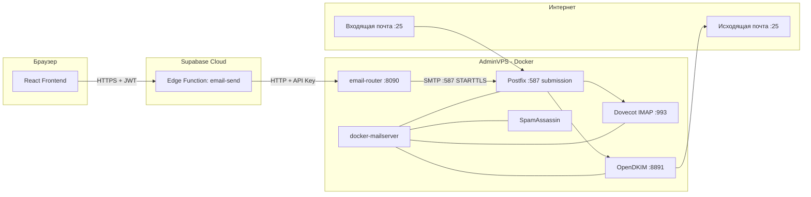
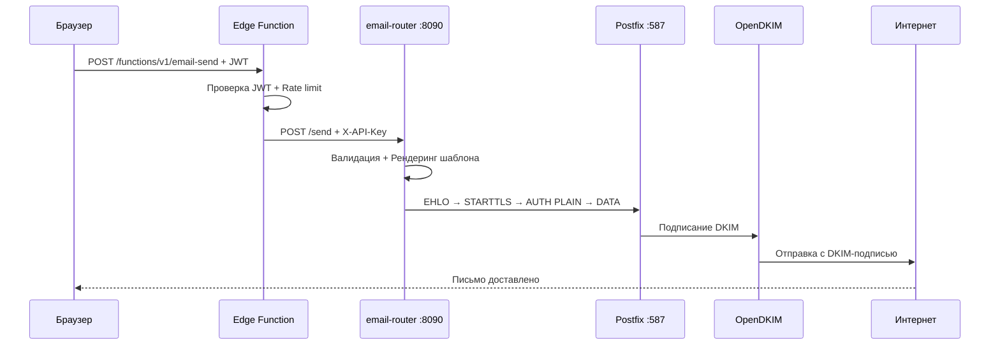

# План: Собственный SMTP-сервер для mansoni.ru

> **Цель:** Полностью независимая почтовая инфраструктура на AdminVPS  
> **Домен:** `mansoni.ru`  
> **Сервисный аккаунт:** `asset@mansoni.ru`  
> **Стек:** docker-mailserver + email-router (уже есть)  
> **Дата:** 2026-03-06

---

## СОДЕРЖАНИЕ

1. [Обзор архитектуры](#1-обзор-архитектуры)
2. [Предварительные требования](#2-предварительные-требования)
3. [Настройка AdminVPS](#3-настройка-adminvps)
4. [DNS-записи для mansoni.ru](#4-dns-записи-для-mansoniru)
5. [Docker Compose — SMTP-стек](#5-docker-compose--smtp-стек)
6. [Конфигурация docker-mailserver](#6-конфигурация-docker-mailserver)
7. [Интеграция с email-router](#7-интеграция-с-email-router)
8. [Тестирование и верификация](#8-тестирование-и-верификация)
9. [Мониторинг и обслуживание](#9-мониторинг-и-обслуживание)
10. [Пошаговый чеклист](#10-пошаговый-чеклист)

---

## 1. ОБЗОР АРХИТЕКТУРЫ

### 1.1 Текущее состояние

```
email-router (:8090) → SMTP_HOST=localhost:587 → ECONNREFUSED (нет SMTP)
```

### 1.2 Целевое состояние



### 1.3 Компоненты

| Компонент | Роль | Порт |
|---|---|---|
| **docker-mailserver** | All-in-one: Postfix + Dovecot + OpenDKIM + SpamAssassin + Fail2ban | 25, 465, 587, 993 |
| **email-router** | HTTP API → SMTP relay, шаблоны, валидация | 8090 |
| **Supabase Edge Function** | Серверный прокси с JWT-авторизацией | — |
| **Certbot/Traefik** | TLS-сертификаты Let's Encrypt | 80, 443 |

### 1.4 Почему docker-mailserver

- **Зрелый проект**: 10k+ GitHub stars, активная поддержка
- **All-in-one**: Postfix, Dovecot, OpenDKIM, SpamAssassin, Fail2ban, ClamAV — всё в одном контейнере
- **Простая настройка**: конфигурация через env-файл и CLI-утилиту `setup.sh`
- **DKIM auto-generation**: генерирует ключи при первом запуске
- **Обновления**: `docker pull` + restart — без ручной настройки пакетов
- **Совместимость**: работает на любом VPS с Docker

---

## 2. ПРЕДВАРИТЕЛЬНЫЕ ТРЕБОВАНИЯ

### 2.1 AdminVPS

| Требование | Минимум | Рекомендуется |
|---|---|---|
| CPU | 1 vCPU | 2 vCPU |
| RAM | 2 GB | 4 GB |
| SSD | 20 GB | 50 GB |
| IPv4 | 1 выделенный | 1 выделенный |
| ОС | Ubuntu 22.04+ | Ubuntu 22.04 LTS |
| Docker | 24.0+ | Последняя стабильная |
| Docker Compose | v2.20+ | Последняя стабильная |

### 2.2 Критические проверки перед началом

```bash
# 1. IP не в blacklist
# Проверить на: https://mxtoolbox.com/blacklists.aspx
# Ввести IP вашего AdminVPS

# 2. Порт 25 открыт (многие VPS блокируют!)
# Проверить у AdminVPS — если заблокирован, нужно запросить разблокировку
telnet smtp.gmail.com 25

# 3. PTR-запись (обратная DNS) — настраивается в панели AdminVPS
# IP → mail.mansoni.ru
nslookup YOUR_VPS_IP

# 4. Docker установлен
docker --version
docker compose version
```

> ⚠️ **КРИТИЧНО**: Если AdminVPS блокирует порт 25 (исходящий), отправка почты невозможна. Это частая проблема у облачных провайдеров. Нужно проверить и при необходимости запросить разблокировку через тикет.

---

## 3. НАСТРОЙКА AdminVPS

### 3.1 Hostname

```bash
# Hostname ДОЛЖЕН совпадать с PTR-записью
sudo hostnamectl set-hostname mail.mansoni.ru
echo "YOUR_VPS_IP mail.mansoni.ru mail" | sudo tee -a /etc/hosts
```

### 3.2 Firewall

```bash
sudo ufw default deny incoming
sudo ufw default allow outgoing
sudo ufw allow 22/tcp    # SSH
sudo ufw allow 25/tcp    # SMTP (входящий от других серверов)
sudo ufw allow 465/tcp   # SMTPS
sudo ufw allow 587/tcp   # SMTP Submission
sudo ufw allow 993/tcp   # IMAPS
sudo ufw allow 80/tcp    # HTTP (Let's Encrypt)
sudo ufw allow 443/tcp   # HTTPS
sudo ufw allow 8090/tcp  # email-router (только если нужен прямой доступ)
sudo ufw enable
```

### 3.3 PTR-запись (обратная DNS)

Настраивается в панели AdminVPS:
- **IP**: `YOUR_VPS_IP`
- **PTR**: `mail.mansoni.ru`

Без PTR-записи письма будут попадать в спам у большинства провайдеров.

---

## 4. DNS-ЗАПИСИ ДЛЯ mansoni.ru

Все записи настраиваются в DNS-панели регистратора домена.

### 4.1 Основные записи

```dns
; A-запись для почтового сервера
mail.mansoni.ru.    IN  A     YOUR_VPS_IP

; MX-запись — направляет входящую почту на наш сервер
mansoni.ru.         IN  MX    10 mail.mansoni.ru.

; SPF — разрешает отправку только с нашего IP
mansoni.ru.         IN  TXT   "v=spf1 mx a:mail.mansoni.ru ip4:YOUR_VPS_IP ~all"

; DMARC — политика обработки писем, не прошедших SPF/DKIM
_dmarc.mansoni.ru.  IN  TXT   "v=DMARC1; p=none; rua=mailto:dmarc@mansoni.ru; sp=none; adkim=r; aspf=r"
```

### 4.2 DKIM-запись

Генерируется автоматически docker-mailserver при первом запуске. После генерации:

```bash
# На VPS — получить DKIM public key
cat /path/to/docker-data/dms/config/opendkim/keys/mansoni.ru/mail.txt
```

Добавить в DNS:
```dns
mail._domainkey.mansoni.ru.  IN  TXT  "v=DKIM1; h=sha256; k=rsa; p=MIIBIjANBg..."
```

### 4.3 MTA-STS (опционально, рекомендуется)

```dns
_mta-sts.mansoni.ru.  IN  TXT  "v=STSv1; id=20260306001"
_smtp._tls.mansoni.ru. IN  TXT  "v=TLSRPTv1; rua=mailto:tls-rpt@mansoni.ru"
```

Файл `https://mta-sts.mansoni.ru/.well-known/mta-sts.txt`:
```
version: STSv1
mode: testing
mx: mail.mansoni.ru
max_age: 604800
```

### 4.4 Порядок DMARC-политики

| Фаза | Политика | Когда |
|---|---|---|
| 1 | `p=none` | Первые 30 дней — мониторинг |
| 2 | `p=quarantine` | После 30 дней без ошибок |
| 3 | `p=reject` | После 60 дней стабильной работы |

---

## 5. DOCKER COMPOSE — SMTP-СТЕК

### 5.1 Структура файлов на VPS

```
/opt/mansoni-mail/
├── docker-compose.yml
├── .env
├── mailserver.env              # Конфигурация docker-mailserver
├── docker-data/
│   └── dms/
│       ├── config/             # Автогенерируемые конфиги
│       │   ├── opendkim/       # DKIM ключи
│       │   └── postfix-accounts.cf  # Почтовые аккаунты
│       └── mail-data/          # Maildir хранилище
├── email-router/               # Копия из репозитория
│   ├── src/
│   ├── Dockerfile
│   └── .env
└── certbot/                    # TLS сертификаты
    └── certs/
```

### 5.2 docker-compose.yml

```yaml
version: "3.8"

services:
  # ═══════════════════════════════════════════════════════════
  # docker-mailserver — Postfix + Dovecot + OpenDKIM + SpamAssassin
  # ═══════════════════════════════════════════════════════════
  mailserver:
    image: ghcr.io/docker-mailserver/docker-mailserver:latest
    container_name: mailserver
    hostname: mail.mansoni.ru
    domainname: mansoni.ru
    restart: unless-stopped
    ports:
      - "25:25"      # SMTP (входящий от других серверов)
      - "465:465"    # SMTPS
      - "587:587"    # SMTP Submission (STARTTLS)
      - "993:993"    # IMAPS
    volumes:
      - ./docker-data/dms/mail-data/:/var/mail/
      - ./docker-data/dms/mail-state/:/var/mail-state/
      - ./docker-data/dms/mail-logs/:/var/log/mail/
      - ./docker-data/dms/config/:/tmp/docker-mailserver/
      - ./certbot/certs/:/etc/letsencrypt/:ro
      - /etc/localtime:/etc/localtime:ro
    environment:
      # Основные
      - OVERRIDE_HOSTNAME=mail.mansoni.ru
      - ENABLE_CLAMAV=0           # Отключить ClamAV для экономии RAM (2GB VPS)
      - ENABLE_SPAMASSASSIN=1
      - SPAMASSASSIN_SPAM_TO_INBOX=1
      - ENABLE_FAIL2BAN=1
      - ENABLE_POSTGREY=0         # Greylisting — отключить для быстрой доставки
      
      # TLS
      - SSL_TYPE=letsencrypt
      - TLS_LEVEL=intermediate
      
      # DKIM
      - ENABLE_OPENDKIM=1
      - ENABLE_OPENDMARC=1
      
      # Аутентификация
      - ENABLE_SASLAUTHD=0
      - SMTP_ONLY=0               # Включить IMAP (Dovecot)
      
      # Лимиты
      - POSTFIX_MESSAGE_SIZE_LIMIT=52428800  # 50MB
      - ENABLE_QUOTAS=1
      - POSTFIX_MAILBOX_SIZE_LIMIT=0         # Без лимита (управляется квотами Dovecot)
      
      # Логирование
      - LOG_LEVEL=info
    cap_add:
      - NET_ADMIN  # Для Fail2ban
    healthcheck:
      test: ["CMD", "ss", "-tlnp", "|", "grep", "-q", "master"]
      interval: 30s
      timeout: 10s
      retries: 3
      start_period: 60s

  # ═══════════════════════════════════════════════════════════
  # email-router — HTTP API для отправки email
  # ═══════════════════════════════════════════════════════════
  email-router:
    build:
      context: ./email-router
      dockerfile: Dockerfile
    container_name: email-router
    restart: unless-stopped
    ports:
      - "8090:8090"
    environment:
      - EMAIL_ROUTER_PORT=8090
      - EMAIL_ROUTER_API_KEY=${EMAIL_ROUTER_API_KEY}
      - SMTP_HOST=mailserver       # Docker DNS — имя контейнера
      - SMTP_PORT=587
      - SMTP_USER=asset@mansoni.ru
      - SMTP_PASS=${SMTP_ASSET_PASSWORD}
      - SMTP_FROM=asset@mansoni.ru
      - SMTP_SECURE=false          # STARTTLS, не implicit TLS
      - MAIL_DOMAIN=mansoni.ru
      - CORS_ORIGINS=${CORS_ORIGINS}
      - LOG_LEVEL=info
    depends_on:
      mailserver:
        condition: service_healthy

  # ═══════════════════════════════════════════════════════════
  # Certbot — автоматическое обновление TLS-сертификатов
  # ═══════════════════════════════════════════════════════════
  certbot:
    image: certbot/certbot:latest
    container_name: certbot
    volumes:
      - ./certbot/certs/:/etc/letsencrypt/
      - ./certbot/www/:/var/www/certbot/
    entrypoint: "/bin/sh -c 'trap exit TERM; while :; do certbot renew --quiet; sleep 12h & wait $${!}; done;'"
```

### 5.3 Файл .env

```env
# ═══════════════════════════════════════════════════════════
# Mansoni Mail Server — Environment Variables
# ═══════════════════════════════════════════════════════════

# Email Router API Key (min 16 chars, generate with: openssl rand -hex 32)
EMAIL_ROUTER_API_KEY=CHANGE_ME_GENERATE_STRONG_KEY

# Password for asset@mansoni.ru SMTP account
SMTP_ASSET_PASSWORD=CHANGE_ME_STRONG_PASSWORD

# CORS origins for email-router (comma-separated)
CORS_ORIGINS=https://mansoni.ru,https://www.mansoni.ru,https://app.mansoni.ru
```

---

## 6. КОНФИГУРАЦИЯ docker-mailserver

### 6.1 Первоначальная настройка (на VPS)

```bash
cd /opt/mansoni-mail

# 1. Скачать setup.sh
curl -o setup.sh https://raw.githubusercontent.com/docker-mailserver/docker-mailserver/master/setup.sh
chmod +x setup.sh

# 2. Получить TLS-сертификат
sudo certbot certonly --standalone \
  -d mail.mansoni.ru \
  --agree-tos \
  --email admin@mansoni.ru \
  --non-interactive

# Скопировать в директорию certbot
sudo cp -rL /etc/letsencrypt/ ./certbot/certs/

# 3. Создать почтовый аккаунт asset@mansoni.ru
./setup.sh email add asset@mansoni.ru STRONG_PASSWORD_HERE

# 4. Создать дополнительные аккаунты (опционально)
./setup.sh email add noreply@mansoni.ru ANOTHER_PASSWORD
./setup.sh email add admin@mansoni.ru ANOTHER_PASSWORD

# 5. Настроить DKIM
./setup.sh config dkim

# 6. Запустить
docker compose up -d

# 7. Проверить логи
docker compose logs -f mailserver
```

### 6.2 Получение DKIM-ключа для DNS

```bash
# После первого запуска docker-mailserver генерирует DKIM-ключи
cat ./docker-data/dms/config/opendkim/keys/mansoni.ru/mail.txt

# Вывод будет примерно таким:
# mail._domainkey IN TXT ( "v=DKIM1; h=sha256; k=rsa; "
#   "p=MIIBIjANBgkqhkiG9w0BAQEFAAOCAQ8AMIIBCgKCAQEA..." )
#
# Скопировать значение p=... и добавить в DNS
```

### 6.3 Создание алиасов

```bash
# Перенаправление dmarc@mansoni.ru → admin@mansoni.ru
./setup.sh alias add dmarc@mansoni.ru admin@mansoni.ru
./setup.sh alias add tls-rpt@mansoni.ru admin@mansoni.ru
./setup.sh alias add postmaster@mansoni.ru admin@mansoni.ru
./setup.sh alias add abuse@mansoni.ru admin@mansoni.ru
```

---

## 7. ИНТЕГРАЦИЯ С EMAIL-ROUTER

### 7.1 Текущая архитектура (уже реализована)

```
email-router → SMTP :587 → Postfix (docker-mailserver)
```

Единственное изменение — в `.env` email-router:

```env
# БЫЛО (не работает — нет локального SMTP):
SMTP_HOST=localhost
SMTP_PORT=587
SMTP_USER=test
SMTP_PASS=test

# СТАЛО (Docker Compose — имя контейнера):
SMTP_HOST=mailserver
SMTP_PORT=587
SMTP_USER=asset@mansoni.ru
SMTP_PASS=REAL_PASSWORD
SMTP_FROM=asset@mansoni.ru
```

### 7.2 Полный поток отправки



### 7.3 Тестовая отправка на mansoni@list.ru

После настройки, с VPS:

```bash
# Через email-router API
curl -X POST http://localhost:8090/send \
  -H "X-API-Key: YOUR_API_KEY" \
  -H "Content-Type: application/json" \
  -d '{
    "to": "mansoni@list.ru",
    "from": "asset@mansoni.ru",
    "template": "verification",
    "templateData": {
      "name": "Mansoni",
      "code": "123456",
      "link": "https://mansoni.ru/verify?code=123456"
    }
  }'

# Или напрямую через SMTP (для диагностики)
docker exec mailserver swaks \
  --to mansoni@list.ru \
  --from asset@mansoni.ru \
  --server localhost \
  --port 587 \
  --auth-user asset@mansoni.ru \
  --auth-password YOUR_PASSWORD \
  --tls \
  --header "Subject: Test from mansoni.ru" \
  --body "This is a test email from asset@mansoni.ru"
```

---

## 8. ТЕСТИРОВАНИЕ И ВЕРИФИКАЦИЯ

### 8.1 Проверка DNS

```bash
# MX
dig MX mansoni.ru +short
# Ожидаемый результат: 10 mail.mansoni.ru.

# SPF
dig TXT mansoni.ru +short
# Ожидаемый результат: "v=spf1 mx a:mail.mansoni.ru ip4:YOUR_IP ~all"

# DKIM
dig TXT mail._domainkey.mansoni.ru +short
# Ожидаемый результат: "v=DKIM1; h=sha256; k=rsa; p=..."

# DMARC
dig TXT _dmarc.mansoni.ru +short
# Ожидаемый результат: "v=DMARC1; p=none; ..."

# PTR (обратная DNS)
dig -x YOUR_VPS_IP +short
# Ожидаемый результат: mail.mansoni.ru.
```

### 8.2 Проверка SMTP-подключения

```bash
# Порт 25 (входящий)
telnet mail.mansoni.ru 25
# Ожидаемый результат: 220 mail.mansoni.ru ESMTP

# Порт 587 (submission)
openssl s_client -connect mail.mansoni.ru:587 -starttls smtp
# Ожидаемый результат: TLS handshake + 250 EHLO

# Порт 993 (IMAPS)
openssl s_client -connect mail.mansoni.ru:993
# Ожидаемый результат: TLS handshake + OK Dovecot ready
```

### 8.3 Онлайн-тесты

| Сервис | URL | Что проверяет |
|---|---|---|
| MXToolbox | https://mxtoolbox.com/SuperTool.aspx | MX, SPF, DKIM, DMARC, Blacklist |
| Mail-tester | https://www.mail-tester.com/ | Спам-рейтинг письма (цель: 10/10) |
| DKIM Validator | https://dkimvalidator.com/ | Корректность DKIM-подписи |
| SSL Labs | https://www.ssllabs.com/ssltest/ | TLS-конфигурация |

### 8.4 Тестовая отправка

1. Отправить на `mansoni@list.ru` через email-router
2. Отправить на `check-auth@verifier.port25.com` — получить отчёт SPF/DKIM/DMARC
3. Отправить на `test@mail-tester.com` — получить спам-рейтинг

---

## 9. МОНИТОРИНГ И ОБСЛУЖИВАНИЕ

### 9.1 Health-check email-router

```bash
curl http://localhost:8090/health
# Ожидаемый результат:
# {"status":"ok","smtp":{"connected":true},...}
```

### 9.2 Логи

```bash
# Postfix логи
docker compose logs -f mailserver | grep postfix

# Email-router логи
docker compose logs -f email-router

# Fail2ban статус
docker exec mailserver fail2ban-client status
```

### 9.3 Ротация DKIM-ключей (ежегодно)

```bash
# 1. Сгенерировать новый ключ
./setup.sh config dkim keysize 2048 selector mail2027

# 2. Добавить новую DNS-запись mail2027._domainkey.mansoni.ru
# 3. Подождать 48 часов propagation
# 4. Переключить селектор в конфиге
# 5. Удалить старую DNS-запись через 30 дней
```

### 9.4 Обновление docker-mailserver

```bash
docker compose pull mailserver
docker compose up -d mailserver
```

---

## 10. ПОШАГОВЫЙ ЧЕКЛИСТ

### Фаза 1: Подготовка AdminVPS

- [ ] Проверить что порт 25 не заблокирован провайдером
- [ ] Проверить IP на blacklist (mxtoolbox.com)
- [ ] Установить Docker и Docker Compose
- [ ] Настроить hostname: `mail.mansoni.ru`
- [ ] Настроить PTR-запись в панели AdminVPS: `YOUR_IP → mail.mansoni.ru`
- [ ] Настроить firewall (ufw)

### Фаза 2: DNS

- [ ] Добавить A-запись: `mail.mansoni.ru → YOUR_VPS_IP`
- [ ] Добавить MX-запись: `mansoni.ru → 10 mail.mansoni.ru`
- [ ] Добавить SPF TXT-запись
- [ ] Дождаться propagation (проверить через `dig`)

### Фаза 3: Docker Compose

- [ ] Создать структуру `/opt/mansoni-mail/`
- [ ] Скопировать `docker-compose.yml` и `.env`
- [ ] Скопировать `email-router/` из репозитория
- [ ] Получить TLS-сертификат через certbot
- [ ] Запустить `docker compose up -d`

### Фаза 4: Почтовые аккаунты

- [ ] Создать `asset@mansoni.ru` через `setup.sh email add`
- [ ] Создать `noreply@mansoni.ru`
- [ ] Создать `admin@mansoni.ru`
- [ ] Настроить алиасы (postmaster, abuse, dmarc)

### Фаза 5: DKIM

- [ ] Сгенерировать DKIM-ключи: `setup.sh config dkim`
- [ ] Добавить DKIM TXT-запись в DNS
- [ ] Добавить DMARC TXT-запись в DNS
- [ ] Перезапустить mailserver: `docker compose restart mailserver`

### Фаза 6: Тестирование

- [ ] Проверить DNS через `dig` (MX, SPF, DKIM, DMARC, PTR)
- [ ] Проверить SMTP-подключение через `telnet`/`openssl`
- [ ] Отправить тестовое письмо на `mansoni@list.ru`
- [ ] Проверить спам-рейтинг на mail-tester.com (цель: 9+/10)
- [ ] Проверить через MXToolbox SuperTool

### Фаза 7: Интеграция

- [ ] Обновить `.env` email-router: `SMTP_HOST=mailserver`
- [ ] Проверить health-check: `curl http://localhost:8090/health`
- [ ] Отправить верификационное письмо через API email-router
- [ ] Настроить Supabase Vault: `EMAIL_ROUTER_URL`, `EMAIL_ROUTER_API_KEY`
- [ ] Протестировать полный поток: Браузер → Edge Function → email-router → SMTP → доставка

### Фаза 8: Hardening

- [ ] Перевести DMARC на `p=quarantine` (через 30 дней)
- [ ] Перевести SPF на `-all` (hardfail) (через 30 дней)
- [ ] Перевести DMARC на `p=reject` (через 60 дней)
- [ ] Настроить MTA-STS (опционально)
- [ ] Закрыть порт 8090 на firewall (email-router доступен только через Docker network)

---

## ДИАГРАММА: Полная сетевая топология

```mermaid
graph TB
    subgraph Internet
        USER[Пользователь]
        SENDER[Внешний отправитель]
        RECEIVER[mansoni@list.ru]
    end

    subgraph AdminVPS
        subgraph Docker Network
            DMS[docker-mailserver<br/>Postfix + Dovecot + DKIM]
            ER[email-router :8090]
        end
        FW[UFW Firewall]
    end

    subgraph Supabase
        EF[Edge Function<br/>email-send]
        VAULT[Vault<br/>API Key + URL]
    end

    USER -->|HTTPS + JWT| EF
    EF -->|HTTP + API Key from Vault| ER
    VAULT -.->|secrets| EF
    ER -->|SMTP :587 STARTTLS| DMS
    DMS -->|SMTP :25 + DKIM| RECEIVER
    SENDER -->|SMTP :25| FW
    FW -->|:25| DMS
    DMS -->|IMAP :993| USER

    style VAULT fill:#fff3e0
    style EF fill:#c8e6c9
    style DMS fill:#e3f2fd
    style ER fill:#e3f2fd
```
